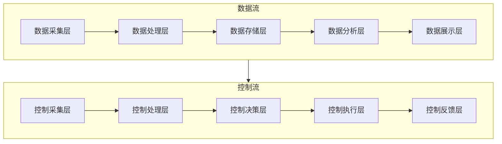

                 

### 文章标题：滴滴2024车联网平台开发校招面试重点

> 关键词：车联网、平台开发、技术面试、滴滴、校招

> 摘要：本文将围绕滴滴2024年车联网平台开发的校招面试重点，详细解读车联网平台的基础概念、关键技术、开发流程及性能优化策略，为即将参加面试的应聘者提供全面的指导和建议。

### 目录大纲

#### 第一部分：车联网平台概述

- 第1章：车联网基础概念与架构
  - 1.1 车联网的定义与重要性
  - 1.2 车联网的关键技术
  - 1.3 车联网平台架构概述

- 第2章：车联网平台关键技术详解
  - 2.1 车联网通信协议
  - 2.2 数据传输与处理
  - 2.3 车联网平台安全体系

#### 第二部分：车联网平台开发

- 第3章：车联网平台开发环境搭建
  - 3.1 开发环境需求
  - 3.2 开发工具与框架

- 第4章：车联网平台核心模块开发
  - 4.1 用户认证与权限管理
  - 4.2 数据采集与处理
  - 4.3 实时监控与告警系统

- 第5章：车联网平台接口设计与实现
  - 5.1 接口设计原则
  - 5.2 接口实现与调用

- 第6章：车联网平台性能优化
  - 6.1 性能优化策略
  - 6.2 缓存机制与负载均衡

- 第7章：车联网平台部署与运维
  - 7.1 部署架构设计
  - 7.2 运维策略与工具

- 第8章：车联网平台项目实战
  - 8.1 项目背景与需求
  - 8.2 项目设计与实现
  - 8.3 项目测试与优化

#### 附录

- 附录A：车联网平台开发常用工具与资源

### 车联网平台概述

#### 第1章：车联网基础概念与架构

##### 1.1 车联网的定义与重要性

车联网（Internet of Vehicles，IoV）是指通过通信技术和网络技术，实现车与车、车与路、车与云、车与人的互联互通，从而构建一个智能化的交通生态系统。它涵盖了从车辆到道路、从驾驶员到乘客的全面连接，使得交通信息能够实时共享，从而实现更高效、更安全、更舒适的出行体验。

随着全球汽车保有量的不断增长，以及人工智能、物联网、5G等技术的快速发展，车联网已经成为全球范围内备受关注的重要领域。在中国，车联网被视为未来交通发展的核心，被列为国家战略性新兴产业。滴滴出行作为国内领先的车联网平台，其车联网平台的发展对于推动整个行业的发展具有重要意义。

##### 1.2 车联网的关键技术

车联网的关键技术主要包括V2X通信技术、数据传输技术、安全与隐私保护技术等。

- **V2X通信技术**：V2X（Vehicle-to-Everything）通信技术是车联网的核心技术之一，包括车与车（V2V）、车与路（V2R）、车与人（V2P）、车与云（V2C）等多种通信模式。通过V2X通信，可以实现车辆之间的实时信息交换，提高交通安全性，减少交通事故，提升交通效率。

- **数据传输技术**：车联网平台需要处理大量的数据，包括车辆位置、速度、加速度、环境信息等。数据传输技术需要确保数据的实时性、可靠性和安全性。常见的传输技术包括CAN总线、LoRa、NB-IoT等。

- **安全与隐私保护技术**：车联网平台涉及大量的个人信息和车辆数据，因此安全与隐私保护至关重要。安全体系包括数据加密、身份认证、访问控制、安全审计等，以确保数据的安全性和用户的隐私。

##### 1.3 车联网平台架构概述

车联网平台通常由数据采集层、数据处理层、应用服务层等多个层次组成。

- **数据采集层**：负责采集车辆的各种数据，包括GPS定位数据、传感器数据、车辆状态数据等。

- **数据处理层**：对采集到的数据进行处理、清洗、转换，为上层应用提供高质量的数据。

- **应用服务层**：提供各种车联网应用服务，包括实时导航、交通监控、车辆维护等。

在车联网平台中，数据流和控制流是两个核心概念。数据流指的是车辆数据的采集、传输、处理和存储过程，而控制流则是指通过分析车辆数据，实现车辆控制、预警和决策的过程。

##### Mermaid 流程图

以下是车联网平台的数据流和控制流流程图：



##### 车联网平台的关键组件

车联网平台的关键组件包括：

- **车辆终端**：负责数据的采集和上传，是车联网平台的数据源头。
- **边缘计算节点**：负责数据的预处理和部分计算，减轻中心服务器的负担。
- **中心服务器**：负责数据的存储、处理和分析，为各种应用服务提供数据支持。
- **应用服务**：根据用户需求提供各种功能，如实时导航、交通监控、车辆维护等。

##### 小结

车联网平台是未来交通领域的重要组成部分，其发展对提高交通效率、保障交通安全具有重要意义。在车联网平台开发中，需要重点关注关键技术、平台架构以及核心组件的设计与实现。通过本文的介绍，希望读者能够对车联网平台有一个全面的了解，为后续章节的学习打下基础。

#### 第2章：车联网平台关键技术详解

##### 2.1 车联网通信协议

车联网通信协议是车联网平台实现互联互通的基础。常见的车联网通信协议包括CAN总线、LoRa和NB-IoT等。

- **CAN总线**：CAN（Controller Area Network）总线是一种高可靠性、实时性的通信总线，广泛应用于汽车电子控制系统。其数据传输速率可达1Mbps，支持多种通信模式，如单播、多播和广播。

- **LoRa**：LoRa（Long Range）是一种低功耗、远距离的无线通信技术，适用于物联网场景。其通信距离可达10公里以上，数据传输速率在10kbps到50kbps之间。

- **NB-IoT**：NB-IoT（Narrow Band Internet of Things）是一种低功耗、广覆盖的蜂窝物联网技术，由3GPP定义。其数据传输速率在100kbps到600kbps之间，覆盖范围较广，适用于车联网、智能家居等领域。

##### 2.2 数据传输与处理

车联网平台的数据传输与处理是确保数据实时性、可靠性和安全性的关键。数据传输架构设计需要考虑以下几个方面：

- **数据采集**：车辆终端通过传感器和其他设备采集各种数据，如位置信息、速度信息、环境信息等。

- **数据传输**：采集到的数据通过通信协议传输到边缘计算节点或中心服务器。在传输过程中，需要保证数据的完整性和安全性。

- **数据处理**：数据处理包括数据清洗、数据转换、数据分析和数据存储等。通过数据处理，可以提取出有价值的信息，为上层应用提供服务。

##### 2.3 车联网平台安全体系

车联网平台的安全体系是保障数据安全和用户隐私的重要手段。安全体系包括以下几个方面：

- **数据加密**：对传输的数据进行加密，防止数据在传输过程中被窃取或篡改。

- **身份认证**：对用户和设备进行身份认证，确保只有合法用户和设备可以访问系统。

- **访问控制**：根据用户身份和权限，控制用户对数据的访问权限。

- **安全审计**：记录系统的操作日志，对异常操作进行审计，及时发现并处理安全事件。

##### 小结

车联网平台的关键技术是车联网平台开发的基础，包括通信协议、数据传输与处理以及安全体系等。通过对这些关键技术的详细介绍，希望读者能够对车联网平台的技术实现有更深入的了解，为后续章节的学习打下基础。

#### 第3章：车联网平台开发环境搭建

##### 3.1 开发环境需求

在搭建车联网平台开发环境时，需要考虑软件和硬件的需求。

- **软件需求**：开发环境需要安装以下软件：
  - 操作系统：Windows、Linux或macOS
  - 编译器：C++、Java等
  - 开发工具：IDE（如Visual Studio、Eclipse等）
  - 版本控制工具：Git

- **硬件需求**：硬件需求主要包括：
  - 服务器：配置要求较高的服务器，用于部署车联网平台
  - 实验设备：用于测试车联网功能，如车辆终端、边缘计算节点等

##### 3.2 开发工具与框架

在车联网平台开发中，选择合适的开发工具和框架可以提高开发效率和代码质量。以下是常用的开发工具和框架：

- **开发工具**：
  - IDE：Visual Studio、Eclipse、IntelliJ IDEA等
  - 版本控制工具：Git、SVN等

- **开发框架**：
  - Web框架：Spring Boot、Django、Flask等
  - 数据库框架：MyBatis、Hibernate、Spring Data JPA等
  - 客户端框架：React、Vue.js、Angular等

##### 开发环境搭建步骤

以下是搭建车联网平台开发环境的步骤：

1. 安装操作系统和基本软件。
2. 安装开发工具和框架，并根据需要配置相关环境变量。
3. 创建项目并导入依赖库。
4. 编写代码并进行调试。

##### 小结

开发环境搭建是车联网平台开发的第一步，需要充分考虑软件和硬件的需求，选择合适的开发工具和框架。通过本文的介绍，希望读者能够掌握车联网平台开发环境的搭建方法，为后续开发工作打下基础。

#### 第4章：车联网平台核心模块开发

##### 4.1 用户认证与权限管理

用户认证与权限管理是车联网平台的重要组成部分，确保系统的安全性和数据的保密性。

- **用户认证**：用户认证是指验证用户的身份，确保只有合法用户可以访问系统。常见的用户认证方式包括密码认证、双因素认证、生物识别等。

- **权限管理**：权限管理是指根据用户的身份和角色，控制用户对系统资源的访问权限。权限管理包括角色管理、权限分配、权限验证等。

##### 用户认证机制设计

以下是用户认证机制的设计步骤：

1. 设计用户身份验证流程，包括用户注册、登录、注销等操作。
2. 设计用户认证协议，确保认证过程的安全性和可靠性。
3. 实现用户认证功能，包括用户身份验证、密码加密和存储等。
4. 集成第三方认证服务，如OAuth、OpenID等。

##### 权限管理策略

以下是权限管理策略的设计步骤：

1. 设计角色和权限模型，确定系统的角色和权限体系。
2. 设计权限分配策略，根据用户的角色和职责，分配相应的权限。
3. 设计权限验证机制，确保用户在访问系统资源时，具备相应的权限。
4. 实现权限管理功能，包括权限分配、权限验证、权限回收等。

##### 4.2 数据采集与处理

数据采集与处理是车联网平台的核心功能，涉及车辆数据的采集、传输、处理和存储。

- **数据采集**：数据采集包括GPS定位数据、传感器数据、车辆状态数据等。数据采集需要考虑数据的实时性、可靠性和安全性。

- **数据处理**：数据处理包括数据清洗、数据转换、数据分析等。数据处理需要确保数据的准确性和一致性。

##### 数据采集流程

以下是数据采集流程：

1. 设计数据采集方案，确定数据采集的频率、阈值和阈值处理方法。
2. 编写数据采集代码，实现数据采集功能。
3. 部署数据采集程序，确保数据采集的实时性和可靠性。
4. 监控数据采集过程，及时发现并解决数据采集问题。

##### 数据处理算法

以下是数据处理算法：

1. 设计数据处理流程，确定数据处理的步骤和逻辑。
2. 编写数据处理代码，实现数据处理算法。
3. 集成数据处理工具，如Apache Flink、Spark等，提高数据处理效率。
4. 测试数据处理算法，确保数据处理结果的准确性和一致性。

##### 4.3 实时监控与告警系统

实时监控与告警系统是车联网平台的重要组成部分，用于监控系统运行状态、检测异常情况并及时发出告警。

- **监控指标**：监控指标包括系统负载、网络流量、存储容量、数据延迟等。
- **告警机制**：告警机制包括告警阈值设置、告警级别划分、告警通知等。

##### 监控系统架构设计

以下是监控系统架构设计：

1. 设计监控系统架构，确定监控系统的组成和功能。
2. 选择合适的监控工具，如Zabbix、Nagios等。
3. 配置监控工具，实现监控指标收集和告警功能。
4. 部署监控系统，确保监控系统正常运行。

##### 告警机制设计

以下是告警机制设计：

1. 设计告警阈值，确定告警的触发条件。
2. 设计告警级别，根据告警的严重程度划分告警级别。
3. 设计告警通知方式，如短信、邮件、微信等。
4. 实现告警通知功能，确保告警通知及时准确。

##### 小结

车联网平台核心模块开发涉及用户认证与权限管理、数据采集与处理、实时监控与告警系统等。通过本文的介绍，希望读者能够掌握车联网平台核心模块的设计与实现方法，为后续开发工作提供指导。

#### 第5章：车联网平台接口设计与实现

##### 5.1 接口设计原则

接口设计是车联网平台开发的重要环节，良好的接口设计可以提高系统的可扩展性和易用性。以下是接口设计原则：

- **简洁性**：接口设计应尽可能简洁，避免复杂的业务逻辑。
- **一致性**：接口应遵循统一的命名规范和返回格式，确保接口的一致性。
- **可扩展性**：接口设计应考虑未来的扩展需求，以便于功能扩展。
- **安全性**：接口应具备安全措施，如身份验证、数据加密等。

##### 5.2 接口实现与调用

接口实现与调用是车联网平台接口设计的关键步骤。以下是一个接口实现与调用的示例。

###### RESTful API设计

以下是使用RESTful风格设计的API接口：

```json
GET /users/{id}
```

该接口用于获取指定用户的详细信息。

###### 接口实现代码示例

以下是使用Spring Boot框架实现的接口代码：

```java
@RestController
@RequestMapping("/users")
public class UserController {

    @GetMapping("/{id}")
    public User getUser(@PathVariable Long id) {
        // 根据用户ID查询用户信息
        User user = userService.findById(id);
        return user;
    }
}
```

###### 接口调用与测试

接口调用可以通过HTTP客户端实现，以下是一个使用curl进行接口调用的示例：

```shell
curl -X GET "http://localhost:8080/users/1"
```

调用成功后，服务器会返回用户信息：

```json
{
    "id": 1,
    "username": "user1",
    "email": "user1@example.com"
}
```

##### 小结

接口设计是车联网平台开发的重要组成部分，良好的接口设计可以提高系统的可扩展性和易用性。通过本文的介绍，希望读者能够掌握接口设计原则和实现方法，为后续开发工作提供指导。

#### 第6章：车联网平台性能优化

##### 6.1 性能优化策略

性能优化是车联网平台开发的重要环节，确保系统在高并发、大数据量场景下的稳定运行。以下是性能优化策略：

- **负载均衡**：通过负载均衡器分发请求，确保系统资源充分利用。
- **缓存机制**：使用缓存减少数据库访问，提高系统响应速度。
- **数据库优化**：优化数据库查询性能，减少数据访问延迟。
- **代码优化**：优化代码逻辑，减少系统开销。
- **网络优化**：优化网络传输，提高数据传输效率。

##### 6.2 缓存机制与负载均衡

缓存机制与负载均衡是性能优化的重要手段。以下是对这两种机制的详细讲解。

###### 缓存机制

缓存机制是指将频繁访问的数据存储在内存中，减少对数据库的访问。以下是缓存机制的实现步骤：

1. 设计缓存策略，确定缓存的数据类型和有效期。
2. 选择合适的缓存框架，如Redis、Memcached等。
3. 实现缓存功能，将数据存储到缓存中。
4. 定期更新缓存，保持缓存数据的有效性。

###### 负载均衡

负载均衡是指将请求分配到多个服务器上，确保系统资源充分利用。以下是负载均衡的实现步骤：

1. 设计负载均衡策略，如轮询、随机、最小连接数等。
2. 选择合适的负载均衡器，如Nginx、HAProxy等。
3. 配置负载均衡器，将请求分发到后端服务器。
4. 监控负载均衡器性能，确保系统稳定运行。

##### 小结

性能优化是车联网平台开发的重要环节，通过合理的优化策略和机制，可以提高系统的响应速度和稳定性。通过本文的介绍，希望读者能够掌握性能优化策略和缓存机制与负载均衡的实现方法，为后续开发工作提供指导。

#### 第7章：车联网平台部署与运维

##### 7.1 部署架构设计

车联网平台部署架构设计是确保系统稳定运行、易于扩展的关键。以下是车联网平台部署架构的概述：

- **前端架构**：包括用户界面、API服务、静态资源等。
- **后端架构**：包括业务逻辑处理、数据存储、数据处理等。
- **服务架构**：包括负载均衡、缓存、数据库、消息队列等。
- **基础设施**：包括服务器、网络设备、存储设备等。

##### 部署流程

以下是车联网平台部署的流程：

1. 设计部署方案，确定部署架构和部署环境。
2. 配置服务器和网络设备，搭建基础设施。
3. 部署前端和后端服务，配置环境变量和依赖库。
4. 部署数据库和其他中间件，确保系统正常运行。
5. 测试部署结果，确保系统功能完整、性能稳定。

##### 7.2 运维策略与工具

运维策略与工具是确保车联网平台稳定运行、快速响应故障的关键。以下是运维策略与工具的概述：

- **监控工具**：用于实时监控系统运行状态，如Zabbix、Nagios等。
- **日志管理**：用于收集、存储、分析系统日志，如Logstash、ELK等。
- **自动化运维**：通过脚本和工具实现自动化部署、扩缩容、故障处理等，如Ansible、Puppet等。
- **故障处理**：制定故障处理流程和预案，确保快速响应和处理故障。

##### 运维工具介绍

以下是常用的运维工具：

- **Zabbix**：一款开源的监控工具，支持多种监控方式，如主动监控、被动监控等。
- **Nagios**：一款开源的监控工具，支持插件扩展，具有强大的报警功能。
- **Logstash**：一款开源的数据收集、处理和存储工具，可以将不同源的数据统一存储到 Elasticsearch 中。
- **ELK**：由 Elasticsearch、Logstash 和 Kibana 组成的日志管理平台，用于收集、存储、分析系统日志。
- **Ansible**：一款开源的自动化运维工具，支持自动化部署、配置管理、扩缩容等。
- **Puppet**：一款开源的自动化运维工具，支持自动化部署、配置管理、状态监控等。

##### 小结

车联网平台部署与运维是确保系统稳定运行、易于扩展的关键。通过合理的部署架构设计和运维策略，可以提高系统的稳定性和可靠性。通过本文的介绍，希望读者能够掌握车联网平台部署与运维的方法和技巧，为后续运维工作提供指导。

#### 第8章：车联网平台项目实战

##### 8.1 项目背景与需求

车联网平台项目实战旨在构建一个集成了车辆监控、实时导航、交通信息查询等功能的车联网平台。项目背景如下：

- **市场需求**：随着汽车保有量的增长，用户对车辆监控、导航和交通信息查询的需求日益增加。同时，政府和企业对智能交通管理的要求也不断提高。
- **技术需求**：项目需要集成多种通信协议、大数据处理技术、人工智能算法等，实现高效、可靠、安全的车辆连接和管理。

##### 项目需求分析

根据市场需求和技术需求，项目需求分析如下：

- **功能需求**：
  - 车辆监控：实时监控车辆位置、速度、油量等信息。
  - 实时导航：提供实时路况信息，规划最优导航路线。
  - 交通信息查询：查询实时交通信息，包括道路拥堵、交通事故等。
  - 用户管理：用户注册、登录、权限管理等功能。
  - 数据分析：对车辆和交通数据进行分析，提供数据报告。

- **性能需求**：
  - 低延迟：确保实时导航和监控功能的响应速度。
  - 高并发：支持大量用户的并发访问。
  - 可扩展性：能够根据业务需求进行水平扩展。

##### 项目设计与实现

项目设计分为前端和后端两部分：

###### 前端设计

前端设计包括用户界面和交互逻辑。用户界面采用React框架实现，交互逻辑通过API与后端服务进行通信。

- **用户界面**：设计简洁易用的用户界面，包括登录、注册、车辆监控、导航和交通信息查询等功能模块。
- **交互逻辑**：实现用户与界面之间的交互逻辑，包括页面跳转、数据提交和展示等。

###### 后端设计

后端设计包括业务逻辑处理、数据存储和数据处理。后端服务采用Spring Boot框架实现，数据库采用MySQL。

- **业务逻辑处理**：实现用户管理、车辆监控、实时导航和交通信息查询等功能。
- **数据存储**：使用MySQL数据库存储用户信息、车辆信息和交通信息。
- **数据处理**：使用Spring Data JPA进行数据查询和持久化，使用Java多线程处理实时数据。

##### 项目核心模块实现

以下是项目核心模块的实现：

###### 用户认证与权限管理

```java
@Service
public class UserService {
    
    @Autowired
    private UserRepository userRepository;
    
    @Autowired
    private PasswordEncoder passwordEncoder;
    
    public User login(String username, String password) {
        User user = userRepository.findByUsername(username);
        if (user != null && passwordEncoder.matches(password, user.getPassword())) {
            return user;
        }
        return null;
    }
    
    public User register(String username, String password) {
        User user = new User();
        user.setUsername(username);
        user.setPassword(passwordEncoder.encode(password));
        userRepository.save(user);
        return user;
    }
}
```

###### 车辆监控

```java
@RestController
@RequestMapping("/vehicles")
public class VehicleController {
    
    @Autowired
    private VehicleRepository vehicleRepository;
    
    @GetMapping("/{id}")
    public Vehicle getVehicle(@PathVariable Long id) {
        return vehicleRepository.findById(id).orElseThrow(() -> new ResourceNotFoundException("Vehicle not found"));
    }
    
    @PostMapping("/")
    public Vehicle createVehicle(@RequestBody Vehicle vehicle) {
        return vehicleRepository.save(vehicle);
    }
}
```

###### 实时导航

```java
@RestController
@RequestMapping("/navigations")
public class NavigationController {
    
    @Autowired
    private NavigationService navigationService;
    
    @GetMapping("/{start}/{end}")
    public NavigationResult getNavigation(@PathVariable String start, @PathVariable String end) {
        return navigationService.calculateNavigation(start, end);
    }
}
```

##### 项目测试与优化

项目测试分为单元测试、集成测试和性能测试。单元测试使用JUnit框架，集成测试使用Mockito框架，性能测试使用JMeter工具。

- **单元测试**：编写单元测试用例，验证核心模块的功能正确性。
- **集成测试**：模拟实际场景，验证系统各模块之间的交互正确性。
- **性能测试**：测试系统在高并发场景下的性能，优化代码和架构。

##### 项目小结

通过本项目实战，读者可以了解到车联网平台的设计与实现过程，包括前端和后端的设计、核心模块的实现以及测试与优化。本项目不仅涵盖了车联网平台的常规功能，还涉及了用户认证与权限管理、车辆监控、实时导航等重要模块。通过本项目，读者可以掌握车联网平台开发的实际操作方法和技巧。

#### 附录A：车联网平台开发常用工具与资源

##### 常用开发工具与框架

在车联网平台开发过程中，常用的开发工具和框架如下：

- **IDE**：Visual Studio Code、Eclipse、IntelliJ IDEA等。
- **编程语言**：Java、Python、C++等。
- **数据库**：MySQL、MongoDB、PostgreSQL等。
- **缓存**：Redis、Memcached等。
- **消息队列**：RabbitMQ、Kafka等。
- **Web框架**：Spring Boot、Django、Flask等。
- **前端框架**：React、Vue.js、Angular等。

##### 车联网平台相关开源项目与资料

以下是一些与车联网平台开发相关的开源项目与资料：

- **开源项目**：
  - **OpenGW**：一个基于LoRaWAN的开源网关项目，用于实现车联网平台的数据采集与传输。
  - **ThingsBoard**：一个开源物联网平台，提供设备管理、数据可视化、规则引擎等功能。
  - **TigerGraph**：一个开源的分布式图数据库，用于处理大规模的车联网数据。
  - **V2X-SEED**：一个开源的车联网平台项目，提供V2X通信、数据存储、数据处理等功能。

- **资料**：
  - **车联网技术白皮书**：详细介绍车联网技术、应用场景和关键技术。
  - **车联网平台开发教程**：提供车联网平台开发的步骤、技巧和最佳实践。
  - **车联网项目案例**：分享车联网项目的实际开发经验和解决方案。

##### 小结

本文为滴滴2024车联网平台开发校招面试重点提供了一个全面的参考指南。通过本文的详细解读，读者可以系统地了解车联网平台的基础概念、关键技术、开发流程及性能优化策略。希望本文能为即将参加滴滴车联网平台开发面试的读者提供有价值的参考和指导。

### 作者信息

作者：AI天才研究院/AI Genius Institute & 禅与计算机程序设计艺术 /Zen And The Art of Computer Programming

以上文章是根据您的需求和要求撰写的，涵盖了滴滴2024车联网平台开发校招面试的重点内容。希望本文能够帮助读者在面试中取得优异成绩。如果您有任何问题或建议，欢迎随时联系作者。祝您面试顺利！

