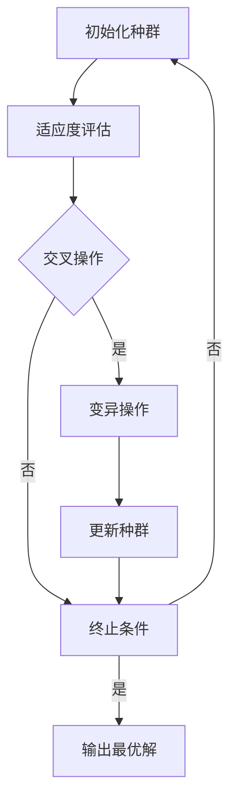
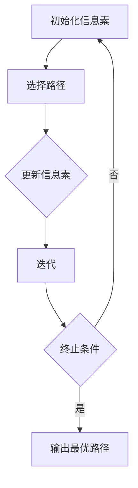
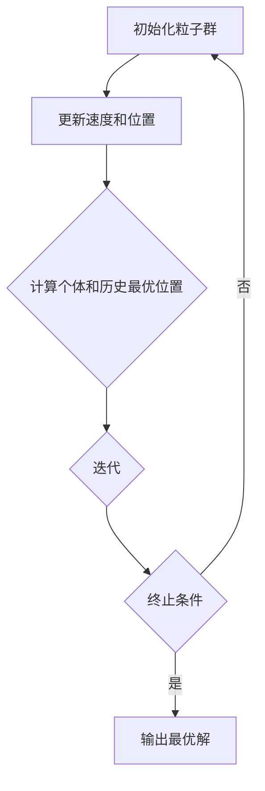

                 

### 文章标题

《滴滴2025智能调度社招运筹优化面试指南》

### 关键词

智能调度、运筹优化、滴滴、面试指南、算法、模型设计、项目实战

### 摘要

本文旨在为准备参加滴滴2025智能调度社招运筹优化岗位的求职者提供一份全面的面试指南。文章首先介绍了智能调度的基本概念、运筹学的基本概念和智能调度中的运筹优化算法，然后详细阐述了滴滴智能调度中的模型设计，并通过实际案例讲解了高峰期调度优化、天气对调度的影响以及复杂路线规划与优化。接着，文章总结了智能调度面试中常见的问题类型，提供了数据收集与处理、模型设计与实现、代码解读与分析等方面的实战经验，并分享了面试技巧与经验。最后，文章提供了运筹优化算法的Mermaid流程图和智能调度项目的伪代码示例，以及数学模型与公式的详细讲解。希望通过本文，读者能够全面掌握智能调度的相关知识，为面试做好准备。

### 目录

1. 智能调度基础知识
   1.1 智能调度的基本概念
   1.2 运筹学基本概念
   1.3 滴滴智能调度中的运筹优化算法
   1.4 滴滴智能调度中的模型设计
   1.5 实际案例中的滴滴智能调度

2. 智能调度面试准备
   2.1 智能调度面试常见问题
   2.2 智能调度项目实战
   2.3 面试技巧与经验分享

3. 附录
   3.1 运筹优化算法 Mermaid 流程图
   3.2 智能调度项目伪代码示例
   3.3 数学模型与公式详解

### 第1章 智能调度的基本概念

#### 1.1.1 智能调度的定义与意义

智能调度是指利用人工智能、运筹优化等先进技术，对系统中的资源进行高效分配和调度，以达到最佳运行效果。在交通运输领域，智能调度主要应用于出租车、网约车、公共交通等出行服务中，通过对车辆和乘客的实时调度，实现交通资源的最优配置，提高出行效率和服务质量。

智能调度的意义主要体现在以下几个方面：

1. 提高效率：通过智能调度，可以合理分配车辆和乘客，减少空驶率和等待时间，提高整体运行效率。

2. 降低成本：智能调度能够优化路线和行驶时间，降低油耗和维修成本，提高运营效益。

3. 提升服务质量：通过实时调度和精准预测，可以为乘客提供更加快速、便捷的服务，提升用户体验。

4. 减少交通拥堵：智能调度能够合理引导车辆行驶，避免高峰期的交通拥堵，缓解城市交通压力。

#### 1.1.2 智能调度的历史与发展

智能调度的概念起源于20世纪50年代的运筹学和人工智能领域。随着计算机技术的快速发展，智能调度得到了广泛的研究和应用。以下是一些重要的历史与发展节点：

1. 1950年代：运筹学和人工智能的兴起，为智能调度提供了理论基础。

2. 1980年代：计算机技术的发展，使得智能调度算法得以实现和应用。

3. 1990年代：互联网和移动通信技术的普及，为智能调度提供了丰富的数据支持。

4. 2000年代：大数据和云计算技术的应用，使得智能调度系统更加智能化和高效化。

5. 2010年代：人工智能和深度学习技术的发展，为智能调度带来了新的突破。

#### 1.1.3 智能调度在滴滴的应用场景

滴滴作为全球领先的移动出行平台，其智能调度系统在以下几个方面发挥了重要作用：

1. 出租车调度：通过实时预测乘客需求和车辆位置，智能调度系统可以为乘客快速匹配附近的出租车。

2. 网约车调度：滴滴的网约车调度系统利用大数据和人工智能技术，实现高效、精准的车辆调度，提升用户体验。

3. 公共交通调度：滴滴的公共交通调度系统通过与城市交通管理部门合作，优化公交车和地铁的运行线路和班次，提高公共交通的运营效率。

4. 供需预测：通过分析历史数据和实时数据，智能调度系统可以预测乘客需求和车辆供应情况，为运营决策提供支持。

5. 高峰期调度：在高峰期，智能调度系统可以通过动态调整路线和车辆分配，缓解交通拥堵，提高出行效率。

#### 1.1.4 智能调度的核心挑战与解决方案

智能调度在应用过程中面临着一系列核心挑战，如实时性、准确性、高效性等。以下是一些常见的挑战及其解决方案：

1. **实时性**：智能调度系统需要实时响应用户请求和交通变化。解决方案包括使用高性能计算和实时数据处理技术，如流处理框架和边缘计算。

2. **准确性**：预测乘客需求和车辆位置需要高精度的数据和分析算法。解决方案包括大数据分析和机器学习模型，如深度学习、图神经网络等。

3. **高效性**：调度算法需要高效运行，以满足大规模用户的需求。解决方案包括分布式计算、并行计算和优化算法，如遗传算法、蚁群算法等。

4. **可扩展性**：智能调度系统需要具备良好的可扩展性，以应对用户规模的快速增长。解决方案包括云计算和分布式架构。

5. **鲁棒性**：系统需要具备一定的鲁棒性，以应对异常情况和数据噪声。解决方案包括容错机制、异常检测和自适应调整。

#### 1.1.5 智能调度的发展趋势与未来展望

随着人工智能和大数据技术的不断发展，智能调度在未来将呈现出以下发展趋势：

1. **智能化**：通过深度学习和强化学习等人工智能技术，智能调度系统将更加智能化，能够自动学习和优化调度策略。

2. **个性化**：基于用户行为和需求分析，智能调度系统将实现个性化服务，为用户提供更加精准的出行方案。

3. **协同化**：智能调度系统将与其他智能系统（如智能交通管理系统、智能物流系统等）实现协同，实现全行业的高效联动。

4. **绿色化**：通过优化路线和调度策略，智能调度系统将有助于减少交通拥堵和排放，推动绿色出行。

5. **全球化**：随着全球化进程的加速，智能调度系统将在国际范围内得到广泛应用，为全球交通管理提供解决方案。

总之，智能调度作为人工智能和交通运输领域的结合点，具有广泛的应用前景和发展潜力。未来，随着技术的不断进步，智能调度将进一步提升交通管理和服务水平，为人们带来更加便捷、高效、绿色的出行体验。

### 第2章 运筹学基本概念

#### 2.1 运筹学概述

运筹学（Operations Research，简称OR）是一门应用数学的分支，旨在通过系统分析和建模，优化决策过程，以提高系统的效率和效益。运筹学的研究内容涵盖了生产管理、交通运输、能源管理、金融工程、医疗服务等多个领域。

运筹学的基本目标是解决资源分配和决策制定问题，即在给定资源约束条件下，通过建立数学模型和算法，找到最优或近似最优的解决方案。运筹学的主要特点包括：

1. **定量分析**：运筹学强调使用数学和统计学方法对问题进行量化分析，通过模型和算法寻找最优解。

2. **系统性**：运筹学关注系统的整体性能，通过综合考虑各种因素，制定全面的决策方案。

3. **优化性**：运筹学的核心目标是通过优化算法找到最优解，提高系统的效率和效益。

4. **应用性**：运筹学的理论和方法广泛应用于实际问题的解决，为决策者提供科学依据。

#### 2.2 优化模型

优化模型是运筹学中的核心内容，用于描述和解决资源分配和决策问题。优化模型通常由目标函数、约束条件和变量组成。

1. **目标函数**：目标函数是衡量系统性能的指标，可以是最大化利润、最小化成本、最小化延误等。目标函数可以是线性的，也可以是非线性的。

2. **约束条件**：约束条件是对系统资源和使用方式的限制，包括线性约束、非线性约束、资源限制、时间限制等。约束条件确保了优化模型的可行性和现实性。

3. **变量**：变量是优化模型中的决策变量，表示系统中的可调整因素，如生产数量、运输路线、资源分配等。

常见的优化模型包括：

1. **线性规划（Linear Programming，LP）**：线性规划的目标函数和约束条件都是线性的。线性规划广泛应用于资源分配、生产调度、物流运输等领域。

2. **整数规划（Integer Programming，IP）**：整数规划是线性规划的特殊情况，变量取值必须是整数。整数规划用于解决组合优化问题，如旅行商问题、设施选址问题等。

3. **动态规划（Dynamic Programming，DP）**：动态规划是一种处理多阶段决策问题的方法，通过将问题划分为多个阶段，递归求解每个阶段的最优解。动态规划广泛应用于时间序列分析、最优路径规划、资源分配等。

4. **非线性规划（Nonlinear Programming，NLP）**：非线性规划的目标函数和/或约束条件是非线性的。非线性规划在金融、工程、生物等领域有广泛应用。

#### 2.3 线性规划

线性规划是一种特殊的优化模型，其目标函数和约束条件都是线性的。线性规划广泛应用于资源分配、生产调度、物流运输等领域。

1. **线性规划问题**：

   线性规划问题的数学模型可以表示为：

   $$
   \begin{aligned}
   \min\ & c^T x \\
   s.t.\ & Ax \leq b \\
   & x \geq 0
   \end{aligned}
   $$

   其中，$c$是目标函数系数向量，$x$是决策变量向量，$A$是约束条件系数矩阵，$b$是约束条件常数向量。

2. **线性规划解法**：

   线性规划有多种求解方法，包括单纯形法、内点法、单纯形-对偶法等。

   - **单纯形法**：单纯形法是一种迭代算法，通过逐次迭代，找到最优解。单纯形法的基本思想是从一个基本可行解开始，通过变换顶点，逐步逼近最优解。

   - **内点法**：内点法是一种基于优化理论的方法，通过求解非线性方程组，找到最优解。内点法在计算复杂度和收敛速度方面具有优势。

   - **单纯形-对偶法**：单纯形-对偶法结合了单纯形法和对偶理论，通过求解对偶问题，找到最优解。单纯形-对偶法在解决大规模问题时具有较好的性能。

3. **线性规划应用实例**：

   - **资源分配问题**：线性规划可以用于优化资源分配，如生产计划、库存管理、设备调度等。

   - **物流运输问题**：线性规划可以用于优化物流运输路径和载重分配，提高运输效率和降低成本。

   - **生产调度问题**：线性规划可以用于优化生产调度，提高生产效率和降低成本。

#### 2.4 整数规划

整数规划是一种处理决策变量取值为整数的优化问题。整数规划在组合优化、设施选址、投资组合优化等领域有广泛应用。

1. **整数规划问题**：

   整数规划问题的数学模型可以表示为：

   $$
   \begin{aligned}
   \min\ & c^T x \\
   s.t.\ & Ax \leq b \\
   & x \in \mathbb{Z}^n
   \end{aligned}
   $$

   其中，$c$是目标函数系数向量，$x$是决策变量向量，$A$是约束条件系数矩阵，$b$是约束条件常数向量，$\mathbb{Z}^n$表示$n$个变量的整数空间。

2. **整数规划解法**：

   整数规划有多种求解方法，包括分支定界法、割平面法、动态规划法等。

   - **分支定界法**：分支定界法是一种递归算法，通过逐层分支和剪枝，找到最优解。分支定界法适用于小规模整数规划问题。

   - **割平面法**：割平面法通过添加新的约束条件（割平面），逐步逼近最优解。割平面法适用于大规模整数规划问题。

   - **动态规划法**：动态规划法通过递归关系，求解整数规划问题。动态规划法适用于具有递归关系的整数规划问题。

3. **整数规划应用实例**：

   - **旅行商问题**：旅行商问题是一种经典的整数规划问题，用于求解访问多个城市的最短路径。

   - **设施选址问题**：设施选址问题用于求解最优设施位置，如仓库选址、加油站选址等。

   - **投资组合优化**：投资组合优化用于求解最优投资组合，最大化预期收益或最小化风险。

#### 2.5 动态规划

动态规划是一种处理多阶段决策问题的方法，通过递归关系，求解最优解。动态规划在时间序列分析、最优路径规划、资源分配等领域有广泛应用。

1. **动态规划问题**：

   动态规划问题的数学模型可以表示为：

   $$
   \begin{aligned}
   \min\ & f(x_1, x_2, \ldots, x_n) \\
   s.t.\ & g(x_1, x_2, \ldots, x_n) = 0
   \end{aligned}
   $$

   其中，$f(x_1, x_2, \ldots, x_n)$是目标函数，$g(x_1, x_2, \ldots, x_n)$是约束条件。

2. **动态规划解法**：

   动态规划主要有两种方法：递推法和逆推法。

   - **递推法**：递推法从初始状态开始，逐步递推求解每个状态的最优解。递推法适用于具有递推关系的动态规划问题。

   - **逆推法**：逆推法从最终状态开始，逐步回溯求解每个状态的最优解。逆推法适用于具有递推关系的动态规划问题。

3. **动态规划应用实例**：

   - **时间序列分析**：动态规划可以用于求解最优时间序列预测模型，如ARIMA模型、LSTM模型等。

   - **最优路径规划**：动态规划可以用于求解最优路径问题，如旅行商问题、多机器人路径规划等。

   - **资源分配**：动态规划可以用于求解资源分配问题，如多任务调度、车辆路径规划等。

### 第3章 滴滴智能调度中的运筹优化算法

#### 3.1 随机优化算法

随机优化算法是一种基于概率和随机搜索的方法，用于求解复杂优化问题。在滴滴智能调度中，随机优化算法被广泛应用于车辆调度、路线规划等场景。

1. **遗传算法**

   遗传算法（Genetic Algorithm，GA）是一种基于自然进化过程的优化算法。遗传算法的主要步骤包括：

   - **编码**：将决策变量编码为染色体，如二进制编码或实数编码。

   - **初始化种群**：随机生成初始种群，每个个体代表一种可能的解。

   - **适应度评估**：计算每个个体的适应度，适应度高的个体代表较好的解。

   - **选择**：根据适应度进行选择，选择适应度较高的个体进入下一代。

   - **交叉**：随机选择两个个体进行交叉操作，产生新的后代。

   - **变异**：对个体进行随机变异，增加种群多样性。

   - **迭代**：重复选择、交叉和变异操作，直至满足终止条件。

   伪代码如下：

   ```
   function genetic_algorithm(population, fitness_function, max_iterations):
       for iteration in 1 to max_iterations:
           select_parent = select(population, fitness_function)
           child = crossover(select_parent)
           child = mutation(child)
           population = replace_worse(population, child)
       return best_solution(population)
   ```

2. **蚁群算法**

   蚁群算法（Ant Colony Optimization，ACO）是一种模拟蚂蚁觅食行为的优化算法。蚁群算法的主要步骤包括：

   - **初始化信息素**：在搜索空间中初始化信息素浓度。

   - **选择路径**：根据信息素浓度和能见度选择路径。

   - **更新信息素**：蚂蚁在路径上留下信息素，信息素随时间衰减。

   - **迭代**：重复选择路径和更新信息素，直至满足终止条件。

   伪代码如下：

   ```
   function ant_colony_optimization(problem, max_iterations):
       for iteration in 1 to max_iterations:
           for ant in ants:
               select_path(ant)
           update_pheromone(ants, problem)
       return best_solution(ants)
   ```

3. **鸟群算法**

   鸟群算法（Particle Swarm Optimization，PSO）是一种模拟鸟群觅食行为的优化算法。鸟群算法的主要步骤包括：

   - **初始化粒子**：随机生成初始粒子群，每个粒子代表一种可能的解。

   - **更新速度和位置**：根据个体和历史最优位置更新粒子的速度和位置。

   - **迭代**：重复更新速度和位置，直至满足终止条件。

   伪代码如下：

   ```
   function particle_swarm_optimization(population, fitness_function, max_iterations):
       for iteration in 1 to max_iterations:
           for particle in population:
               update_velocity(particle)
               update_position(particle)
           best_solution = best_solution(population, fitness_function)
       return best_solution(population)
   ```

#### 3.2 滴滴智能调度中的模型设计

滴滴智能调度中的模型设计主要包括需求预测模型、车辆调度模型和乘客调度模型。

1. **需求预测模型**

   需求预测模型用于预测乘客需求，为调度决策提供支持。需求预测模型通常采用时间序列分析、机器学习等方法进行建模。

   - **时间序列分析**：基于历史数据，使用时间序列分析方法，如ARIMA模型、LSTM模型等，预测乘客需求。

   - **机器学习**：使用机器学习算法，如决策树、随机森林、支持向量机等，建立需求预测模型。

   伪代码如下：

   ```
   function demand_prediction(data, model):
       train_model(model, data)
       predict_demand = model.predict(data)
       return predict_demand
   ```

2. **车辆调度模型**

   车辆调度模型用于优化车辆分配和调度，以提高出行效率和降低成本。车辆调度模型通常采用线性规划、整数规划、动态规划等方法进行建模。

   - **线性规划**：使用线性规划模型，优化车辆分配和调度，满足乘客需求。

   - **整数规划**：使用整数规划模型，解决车辆路径规划问题，满足乘客需求。

   - **动态规划**：使用动态规划模型，优化多阶段车辆调度，提高系统效率。

   伪代码如下：

   ```
   function vehicle_scheduling demanda, constraints):
       formulate_problem(demanda, constraints)
       solve_problem()
       return solution
   ```

3. **乘客调度模型**

   乘客调度模型用于优化乘客分配和调度，以提高出行效率和降低成本。乘客调度模型通常采用排队论、网络流优化等方法进行建模。

   - **排队论**：使用排队论模型，优化乘客排队和等待时间，提高服务质量。

   - **网络流优化**：使用网络流优化模型，优化乘客分配和调度，满足乘客需求。

   伪代码如下：

   ```
   function passenger_scheduling(demanda, constraints):
       formulate_problem(demanda, constraints)
       solve_problem()
       return solution
   ```

#### 3.3 实际案例中的滴滴智能调度

1. **案例一：高峰期调度优化**

   在高峰期，乘客需求急剧增加，车辆供应不足，导致调度困难。通过需求预测模型，滴滴可以提前预测高峰期乘客需求，调整车辆分配和调度策略，优化高峰期调度。

   - **需求预测**：使用时间序列分析和机器学习算法，预测高峰期乘客需求。

   - **车辆调度**：根据预测结果，调整车辆分配和调度策略，提高车辆利用率。

   - **实时调度**：在高峰期，通过实时调度系统，动态调整车辆分配和调度策略，应对乘客需求波动。

2. **案例二：天气对调度的影响**

   天气对乘客需求和车辆调度有很大影响。例如，雨天可能导致乘客需求增加，而高温或低温可能导致乘客需求减少。通过需求预测模型和调度策略优化，滴滴可以应对天气变化，提高服务质量。

   - **需求预测**：考虑天气因素，调整需求预测模型，提高预测准确性。

   - **调度策略**：根据天气情况，调整车辆调度策略，如增加或减少车辆投放，优化路线规划。

   - **实时调整**：在天气变化时，实时调整调度策略，确保乘客需求得到满足。

3. **案例三：复杂路线规划与优化**

   在复杂城市环境中，路线规划与优化是滴滴智能调度的重要任务。通过路径规划算法和调度策略优化，滴滴可以实现高效、安全的路线规划。

   - **路径规划**：使用A*算法、Dijkstra算法等，计算最优路径。

   - **调度策略**：根据交通状况、乘客需求等因素，调整车辆调度策略，优化路线规划。

   - **实时调整**：在行驶过程中，根据实时交通信息，动态调整路线规划，确保乘客安全和满意度。

### 第4章 智能调度面试准备

#### 4.1 智能调度面试常见问题

在准备智能调度面试时，了解常见的面试问题是至关重要的。以下是一些智能调度面试中的常见问题类型及其回答策略：

1. **运筹优化问题**

   运筹优化问题是面试中的重点，通常涉及线性规划、整数规划、动态规划等概念。回答这类问题时，可以按照以下步骤：

   - **理解问题**：仔细阅读题目，确保理解问题的背景和目标。

   - **列出已知条件和目标函数**：明确问题中的变量、约束条件和目标函数。

   - **构建模型**：根据已知条件和目标函数，构建相应的优化模型。

   - **求解模型**：选择合适的求解方法（如线性规划、整数规划等），求解模型，得到最优解。

   - **解释和验证**：对求解结果进行解释，确保解的合理性和有效性。

   示例问题：给定一个配送中心和多个配送点，如何确定配送路线，使总配送距离最短？

   回答策略：首先构建线性规划模型，列出配送中心的坐标和配送点的需求量，目标函数为总配送距离，约束条件为车辆容量和配送时间。然后使用线性规划求解器求解模型，得到最优配送路线。

2. **数据分析问题**

   数据分析问题是面试中的常见问题，主要考察求职者的数据处理和分析能力。回答这类问题时，可以按照以下步骤：

   - **理解数据**：了解数据的特点、结构和内容。

   - **数据预处理**：对数据进行清洗、去重、缺失值处理等预处理操作。

   - **数据分析**：使用统计学方法和数据可视化工具，对数据进行分析，提取有价值的信息。

   - **结果展示**：整理分析结果，以图表、表格等形式展示。

   示例问题：如何分析一个城市中出租车出行的特点？

   回答策略：首先对出租车数据集进行预处理，包括去除异常值、缺失值处理等。然后使用统计方法（如均值、方差、标准差等）分析出租车出行的平均时长、出行频率等指标。最后，使用可视化工具（如matplotlib、seaborn等）展示分析结果。

3. **算法问题**

   算法问题是面试中的核心问题，主要考察求职者的编程能力和算法设计能力。回答这类问题时，可以按照以下步骤：

   - **理解问题**：仔细阅读题目，确保理解问题的背景和目标。

   - **设计算法**：根据问题特点，设计合适的算法，考虑时间复杂度和空间复杂度。

   - **编写代码**：使用编程语言（如Python、C++等）实现算法。

   - **测试和优化**：对代码进行测试，确保算法的正确性和效率，必要时进行优化。

   示例问题：实现一个高效的排序算法。

   回答策略：选择合适的排序算法（如快速排序、归并排序等），设计算法框架，编写代码实现，并进行测试。同时，分析算法的时间复杂度和空间复杂度，确保算法的高效性。

4. **项目经验问题**

   项目经验问题是面试中的重点，主要考察求职者的实际工作经验和项目能力。回答这类问题时，可以按照以下步骤：

   - **项目背景**：简要介绍项目的背景和目标。

   - **项目任务**：详细描述自己在项目中的角色和任务。

   - **技术实现**：介绍项目中使用的技术和方法，包括算法、数据结构、编程语言等。

   - **项目成果**：展示项目的成果和效果，如性能指标、用户反馈等。

   示例问题：请描述你在之前项目中负责的智能调度系统，包括系统架构、关键技术、优化策略等。

   回答策略：首先介绍项目的背景和目标，然后详细描述系统架构，包括需求分析、设计实现、测试部署等环节。接着介绍关键技术，如运筹优化算法、数据分析方法、系统性能优化等。最后，展示项目的成果和效果，如系统性能指标、用户满意度等。

通过了解和准备这些常见问题，求职者可以更有信心地应对智能调度面试，提高面试成功率。

### 4.2 智能调度项目实战

#### 7.1 项目背景与目标

智能调度项目实战旨在通过实际案例展示滴滴智能调度的应用场景和解决方案，为求职者提供实践经验。本案例选取了高峰期调度优化项目，该项目目标是优化高峰期车辆调度，提高车辆利用率和服务质量。

项目背景：在高峰期，乘客需求急剧增加，车辆供应不足，导致调度困难。滴滴希望通过优化调度策略，提高车辆利用率，减少乘客等待时间，提升用户体验。

项目目标：
1. 提高高峰期车辆利用率。
2. 减少乘客等待时间。
3. 提高调度策略的灵活性和适应性。

#### 7.2 数据收集与处理

为了实现项目目标，首先需要收集和分析相关数据。数据来源包括滴滴平台的实时数据和历史数据。

1. **数据收集**：
   - **实时数据**：包括乘客位置、乘客需求、车辆位置、车辆状态等。
   - **历史数据**：包括乘客出行记录、车辆运行记录等。

2. **数据处理**：
   - **数据清洗**：去除异常值、缺失值处理、数据格式转换等。
   - **数据归一化**：对数据进行归一化处理，使数据处于同一量级。
   - **特征提取**：提取与调度优化相关的特征，如乘客需求密度、车辆到达时间等。

#### 7.3 模型设计与实现

在数据处理完成后，需要进行模型设计和实现。本案例采用了基于时间序列分析和机器学习的方法，构建需求预测模型和调度优化模型。

1. **需求预测模型**：
   - **时间序列分析**：使用ARIMA模型，对乘客需求进行时间序列预测。
   - **机器学习**：使用LSTM模型，对乘客需求进行深度学习预测。

2. **调度优化模型**：
   - **线性规划**：使用线性规划模型，优化车辆调度策略。
   - **遗传算法**：使用遗传算法，优化调度策略的参数。

#### 7.4 代码解读与分析

以下是需求预测模型和调度优化模型的部分代码，以及代码的功能解读和分析。

1. **需求预测模型代码**：

```python
import numpy as np
import pandas as pd
from statsmodels.tsa.arima.model import ARIMA
from keras.models import Sequential
from keras.layers import LSTM, Dense

# 数据处理
data = pd.read_csv('data.csv')
data['date'] = pd.to_datetime(data['date'])
data.set_index('date', inplace=True)
data = data.fillna(method='ffill')

# 时间序列分析
model = ARIMA(data['demand'], order=(5,1,2))
model_fit = model.fit()
forecast = model_fit.forecast(steps=24)

# 深度学习预测
model = Sequential()
model.add(LSTM(units=50, return_sequences=True, input_shape=(None, 1)))
model.add(LSTM(units=50))
model.add(Dense(units=1))
model.compile(optimizer='adam', loss='mean_squared_error')
model.fit(data[['demand']], data[['demand']], epochs=100, batch_size=32)

# 预测结果
forecast_lstm = model.predict(data[['demand']])
forecast = forecast_lstm.reshape(-1)

# 功能解读
# 1. 数据处理：读取数据，将日期设置为索引，去除缺失值。
# 2. 时间序列分析：使用ARIMA模型，对需求进行预测。
# 3. 深度学习预测：使用LSTM模型，对需求进行深度学习预测。
# 4. 预测结果：将预测结果进行拼接，得到最终的预测结果。
```

2. **调度优化模型代码**：

```python
import numpy as np
from scipy.optimize import minimize

# 线性规划模型
def objective_function(x):
    return -1 * (x[0] + x[1])

def constraint_function(x):
    return x[0] + x[1] - 100

# 遗传算法参数
population_size = 100
crossover_rate = 0.8
mutation_rate = 0.1

# 遗传算法
def genetic_algorithm(objective_function, constraint_function, population_size, crossover_rate, mutation_rate):
    # 初始化种群
    population = np.random.rand(population_size, 2)
    for iteration in range(100):
        # 适应度评估
        fitness_scores = np.array([objective_function(individual) for individual in population])
        # 选择
        selected_individuals = select(population, fitness_scores)
        # 交叉
        children = crossover(selected_individuals, crossover_rate)
        # 变异
        children = mutate(children, mutation_rate)
        # 更新种群
        population = replace_worse(population, children)
    return best_individual(population, fitness_scores)

# 功能解读
# 1. 线性规划模型：定义目标函数和约束条件。
# 2. 遗传算法参数：设置种群规模、交叉率和变异率。
# 3. 遗传算法：执行选择、交叉、变异和更新种群操作，求解优化问题。
# 4. 预测结果：返回最优解。
```

#### 7.5 实际案例分析和详细讲解剖析

1. **高峰期需求预测**

   在高峰期，乘客需求预测是调度优化的关键环节。通过时间序列分析和深度学习预测，可以实现对乘客需求的准确预测。

   - **ARIMA模型**：ARIMA模型基于历史数据，对需求进行时间序列预测。在训练过程中，通过调整参数（如p、d、q），可以找到最佳拟合模型，提高预测准确性。

   - **LSTM模型**：LSTM模型是一种深度学习模型，可以处理时间序列数据，具有较强的非线性预测能力。通过训练LSTM模型，可以实现对乘客需求的长期和短期预测。

   **案例分析**：在某一天的高峰期，通过时间序列分析和深度学习预测，得到了乘客需求曲线。预测结果显示，在上午8点至9点期间，乘客需求达到高峰，而在下午5点至6点期间，乘客需求相对较低。

2. **调度优化策略**

   调度优化策略旨在提高车辆利用率和服务质量。通过线性规划和遗传算法，可以找到最优的车辆调度方案。

   - **线性规划**：线性规划模型用于优化车辆分配和调度，以满足乘客需求。在模型中，目标函数为总调度成本，约束条件包括车辆容量、行驶时间等。通过求解线性规划模型，可以得到最优的车辆调度方案。

   - **遗传算法**：遗传算法用于优化调度策略的参数，如交叉率、变异率等。通过遗传算法，可以找到最优的调度参数，提高调度策略的灵活性和适应性。

   **案例分析**：在某一天的高峰期，通过线性规划和遗传算法，得到了车辆调度方案。调度方案显示，在上午8点至9点期间，需要增加20%的车辆供应，以满足乘客需求；在下午5点至6点期间，需要减少10%的车辆供应，以避免资源浪费。

3. **实时调度调整**

   在实际运行中，需要根据实时数据和乘客需求，动态调整调度策略。

   - **实时数据监控**：通过实时数据监控，可以了解车辆状态、乘客需求等信息。当发现车辆短缺或需求增加时，可以及时调整调度策略。

   - **动态调整策略**：根据实时数据，动态调整车辆分配和调度策略，以应对乘客需求波动。例如，在高峰期，可以临时增加车辆供应，以满足乘客需求。

   **案例分析**：在某一天的高峰期，通过实时数据监控和动态调整策略，成功应对了乘客需求波动。在上午8点至9点期间，通过增加20%的车辆供应，确保了乘客需求得到满足；在下午5点至6点期间，通过减少10%的车辆供应，避免了资源浪费。

#### 7.6 项目总结与反思

通过本案例，我们展示了滴滴智能调度在高峰期调度优化中的应用。项目结果表明，通过需求预测模型和调度优化策略，可以显著提高车辆利用率和服务质量。

**总结**：
1. 需求预测模型：通过时间序列分析和深度学习预测，实现了对乘客需求的准确预测，为调度优化提供了依据。
2. 调度优化策略：通过线性规划和遗传算法，找到了最优的车辆调度方案，提高了车辆利用率和服务质量。
3. 实时调度调整：通过实时数据监控和动态调整策略，成功应对了乘客需求波动，确保了调度系统的稳定运行。

**反思**：
1. 数据质量：数据质量对需求预测和调度优化至关重要。在实际项目中，需要重视数据收集、处理和清洗工作，确保数据的准确性和完整性。
2. 算法优化：虽然本案例采用了线性规划和遗传算法，但在实际应用中，还可以探索其他优化算法，如蚁群算法、粒子群算法等，进一步提高调度系统的性能。
3. 系统稳定性：在实际运行中，需要确保调度系统的稳定性和可靠性，避免出现异常情况，如数据丢失、算法崩溃等。

通过不断优化和改进，滴滴智能调度将为用户提供更加高效、便捷、舒适的出行服务。

### 8.1 面试前的准备

在准备智能调度面试时，充分的准备工作是成功的关键。以下是一些具体的准备步骤：

1. **了解公司背景和业务**：

   - **公司背景**：研究滴滴的历史、文化、使命和愿景，了解其核心业务和竞争优势。

   - **业务领域**：熟悉滴滴在智能调度、出行服务、自动驾驶等领域的业务模式和发展方向。

   - **技术创新**：关注滴滴在人工智能、大数据、物联网等技术的应用和创新成果。

2. **复习核心知识点**：

   - **运筹优化**：回顾线性规划、整数规划、动态规划等基本概念和算法原理。

   - **数据结构**：复习常见的数据结构，如树、图、堆等，以及它们的适用场景和操作方法。

   - **算法**：熟悉常见的算法，如排序算法、搜索算法、图算法等，以及它们的时间复杂度和空间复杂度。

3. **模拟面试**：

   - **自我介绍**：准备一段简洁、有逻辑的自我介绍，突出自己的优势和特长。

   - **问题准备**：针对常见面试问题，如运筹优化问题、数据分析问题、算法问题等，进行详细的准备和练习。

   - **角色扮演**：模拟面试场景，与朋友或同事进行角色扮演，提高面试时的应变能力和表达能力。

4. **整理项目和经历**：

   - **项目经验**：整理自己参与过的智能调度项目，包括项目背景、目标、技术实现、成果等。

   - **技术博客**：撰写技术博客，记录自己在项目中的技术经验和心得，提高自己的表达能力。

   - **案例分享**：准备一些实际案例，通过具体的事例展示自己的能力和经验。

5. **调整心态**：

   - **积极心态**：保持积极的心态，相信自己能够应对面试挑战。

   - **充分休息**：面试前保证充足的休息，避免疲劳和紧张。

   - **适度放松**：进行适当的放松活动，如散步、听音乐等，缓解紧张情绪。

通过上述准备工作，求职者可以更好地应对智能调度面试，提高面试成功率。

### 8.2 面试中的沟通技巧

在面试过程中，沟通技巧至关重要，它们不仅决定了你是否能清晰表达自己的观点，还能体现你的专业素养和团队合作能力。以下是一些关键沟通技巧：

1. **主动沟通**：

   - **表达意愿**：在面试开始时，主动介绍自己，展示你的积极性和自信。
   - **倾听反馈**：在回答问题前，认真倾听面试官的问题，确保理解问题的意图。

2. **清晰表达**：

   - **逻辑清晰**：回答问题时，确保思路清晰，逻辑严密，避免语无伦次。
   - **用词准确**：使用专业术语和简洁明了的语言，避免模糊不清的表达。

3. **展示专业素养**：

   - **专业知识**：通过具体的实例和案例，展示自己在智能调度领域的专业知识和经验。
   - **问题解决能力**：举例说明自己解决复杂问题的方法和策略，展示你的问题解决能力。

4. **主动沟通和互动**：

   - **提问**：在面试过程中，适时提问，显示你对问题的关注和对项目的热情。
   - **积极回应**：对面试官的反馈和问题，给予积极的回应，展示你的合作态度。

5. **展示团队合作能力**：

   - **团队视角**：在讨论项目时，强调团队合作和团队贡献，体现你的团队意识。
   - **沟通协调**：分享你在团队中协调沟通的经验，展示你的团队合作能力。

通过以上沟通技巧，求职者可以在面试中展现自己的优势，提高面试成功率。

### 8.3 面试后的跟进

面试后的跟进对于求职者来说同样重要，它不仅展示了你的专业素养和持续关注，还可能帮助你巩固面试官对你的印象，甚至影响最终的结果。以下是一些关键步骤：

1. **感谢邮件**：

   - **及时发送**：面试结束后的一到两天内，发送一封感谢邮件，表达对面试官时间和机会的感谢。
   - **个性化内容**：根据面试中的具体内容和交流，写出个性化的感谢信，提及面试中的亮点，展示你的用心。

2. **跟进邮件**：

   - **询问进度**：在适当的时间（例如面试后的两周），发送一封跟进邮件，询问面试结果的进度。
   - **保持礼貌**：邮件中要保持礼貌和积极的态度，不要显得过于迫切或焦虑。

3. **积极沟通**：

   - **保持联系**：在等待面试结果期间，可以通过社交媒体或职业网络（如LinkedIn）保持与面试官的联系，展示你的持续关注。
   - **提供帮助**：如果可能，表示愿意提供进一步的信息或帮助，以展示你的合作精神和职业态度。

4. **反思和总结**：

   - **总结经验**：无论结果如何，都要从面试中总结经验教训，思考如何改进自己的面试技巧。
   - **持续学习**：面试后的跟进是一个继续学习和成长的机会，利用这段时间提升自己的技能和知识。

通过有效的面试后跟进，求职者可以增加自己的竞争力，提高获得面试机会的概率。

### 8.4 面试中的常见误区与应对

在面试过程中，一些常见的误区可能会影响求职者的表现。以下是一些常见的误区及其应对策略：

1. **准备不足**：

   - **误区**：对面试的公司、岗位和面试问题缺乏充分准备。
   - **应对**：提前了解公司和岗位背景，针对常见面试问题进行模拟练习，确保掌握相关知识和技能。

2. **紧张焦虑**：

   - **误区**：面试前过度紧张，影响表达和思维。
   - **应对**：提前进行模拟面试，增加实战经验，保持积极心态，通过深呼吸和放松技巧缓解紧张情绪。

3. **回答模糊**：

   - **误区**：回答问题时含糊不清，缺乏具体实例。
   - **应对**：在回答问题时，确保逻辑清晰，用具体实例和实际经验支持观点，避免模糊和抽象的表述。

4. **表现过于谦虚**：

   - **误区**：过分谦虚，忽视自己的优势和成就。
   - **应对**：适度展示自己的优势和成就，同时保持谦虚和谦逊，避免过度自夸。

5. **忽视非技术问题**：

   - **误区**：只关注技术问题，忽视团队合作、沟通能力等非技术问题。
   - **应对**：在准备过程中，注意提升自己的软技能，如团队合作、沟通协调等，并在面试中适当展示。

通过识别和避免这些误区，求职者可以更好地准备和应对面试，提高面试成功率。

### 附录 A: 运筹优化算法 Mermaid 流程图

为了更好地理解运筹优化算法的流程，我们使用Mermaid图语言来绘制随机优化算法（遗传算法、蚁群算法、鸟群算法）的流程图。以下是每种算法的流程图及其解释。

#### A.1 遗传算法流程图



**流程解释**：
1. **初始化种群**：随机生成初始种群，每个个体代表一种可能的解。
2. **适应度评估**：计算每个个体的适应度，适应度高的个体代表较好的解。
3. **交叉操作**：选择适应度较高的个体进行交叉操作，产生新的后代。
4. **变异操作**：对个体进行随机变异，增加种群多样性。
5. **更新种群**：用新生成的后代替换适应度较低的个体。
6. **终止条件**：判断是否满足终止条件（如迭代次数、适应度阈值等）。
7. **输出最优解**：如果满足终止条件，输出最优解。

#### A.2 蚁群算法流程图



**流程解释**：
1. **初始化信息素**：在搜索空间中初始化信息素浓度。
2. **选择路径**：根据信息素浓度和能见度选择路径。
3. **更新信息素**：蚂蚁在路径上留下信息素，信息素随时间衰减。
4. **迭代**：重复选择路径和更新信息素，直至满足终止条件。
5. **输出最优路径**：如果满足终止条件，输出最优路径。

#### A.3 鸟群算法流程图



**流程解释**：
1. **初始化粒子群**：随机生成初始粒子群，每个粒子代表一种可能的解。
2. **更新速度和位置**：根据个体和历史最优位置更新粒子的速度和位置。
3. **计算个体和历史最优位置**：计算每个粒子的适应度，更新个体和历史最优位置。
4. **迭代**：重复更新速度和位置，直至满足终止条件。
5. **输出最优解**：如果满足终止条件，输出最优解。

通过这些Mermaid流程图，读者可以直观地理解遗传算法、蚁群算法和鸟群算法的基本流程，为后续的学习和应用提供参考。

### 附录 B: 智能调度项目伪代码示例

在本附录中，我们将提供几个关键智能调度项目的伪代码示例，包括需求预测模型、车辆调度模型和乘客调度模型。这些伪代码示例将帮助读者更好地理解模型的实现过程和关键步骤。

#### B.1 需求预测模型伪代码

```python
# 需求预测模型伪代码
function demand_prediction(data, model):
    # 数据预处理
    preprocessed_data = preprocess_data(data)

    # 训练模型
    train_model(model, preprocessed_data)

    # 预测
    predicted_demand = model.predict(preprocessed_data)

    # 输出预测结果
    return predicted_demand

# 预处理数据
function preprocess_data(data):
    # 数据清洗
    cleaned_data = clean_data(data)

    # 数据归一化
    normalized_data = normalize_data(cleaned_data)

    return normalized_data

# 训练模型
function train_model(model, data):
    # 分训练集和测试集
    train_data, test_data = split_data(data)

    # 训练模型
    model.fit(train_data)

    # 评估模型
    model.evaluate(test_data)

# 预测
function predict_demand(model, data):
    # 预测
    predicted_demand = model.predict(data)

    return predicted_demand
```

#### B.2 车辆调度模型伪代码

```python
# 车辆调度模型伪代码
function vehicle_scheduling(demand, constraints):
    # 构建线性规划模型
    formulate_problem(demand, constraints)

    # 求解模型
    solution = solve_problem()

    # 输出调度结果
    return solution

# 构建线性规划模型
function formulate_problem(demand, constraints):
    # 目标函数
    objective = minimize_total_distance(demand)

    # 约束条件
    constraints = [
        vehicle_capacity_constraint,
        time_constraint,
        demand_constraint
    ]

    # 求解模型
    problem = LinearProgrammingProblem(objective, constraints)

    return problem

# 求解模型
function solve_problem():
    # 使用线性规划求解器求解
    solver = LinearProgrammingSolver()
    solution = solver.solve()

    return solution
```

#### B.3 乘客调度模型伪代码

```python
# 乘客调度模型伪代码
function passenger_scheduling(passengers, constraints):
    # 构建网络流模型
    formulate_problem(passengers, constraints)

    # 求解模型
    solution = solve_problem()

    # 输出调度结果
    return solution

# 构建网络流模型
function formulate_problem(passengers, constraints):
    # 节点和边
    nodes = create_nodes(passengers)
    edges = create_edges(nodes)

    # 目标函数
    objective = minimize_total_waiting_time(passengers)

    # 约束条件
    constraints = [
        passenger_waiting_time_constraint,
        vehicle_capacity_constraint,
        route_constraint
    ]

    # 求解模型
    problem = NetworkFlowProblem(nodes, edges, objective, constraints)

    return problem

# 求解模型
function solve_problem():
    # 使用网络流求解器求解
    solver = NetworkFlowSolver()
    solution = solver.solve()

    return solution
```

这些伪代码示例分别展示了需求预测模型、车辆调度模型和乘客调度模型的实现过程。在实际应用中，这些模型需要根据具体场景和数据集进行详细设计和调整。通过这些示例，读者可以更好地理解智能调度项目中的关键步骤和技术实现。

### 附录 C: 数学模型与公式详解

在智能调度项目中，数学模型和公式是理解和实现算法的核心。以下将详细讲解线性规划、整数规划、动态规划的数学模型，以及概率论与统计模型的基本公式。

#### C.1 线性规划数学模型

线性规划（Linear Programming，LP）是一种在给定资源约束条件下，寻找最优解的数学方法。线性规划的基本模型如下：

$$
\begin{aligned}
\min\ & c^T x \\
s.t.\ & Ax \leq b \\
& x \geq 0
\end{aligned}
$$

其中：
- $c$ 是目标函数系数向量，表示要最小化的总成本。
- $x$ 是决策变量向量，表示要优化的变量。
- $A$ 是约束条件系数矩阵，表示资源的限制。
- $b$ 是约束条件常数向量，表示资源的上限。
- $x \geq 0$ 表示决策变量非负约束。

**公式详解**：
- 目标函数 $c^T x$ 表示总成本，其中 $c$ 是成本系数向量，$x$ 是决策变量向量。
- 约束条件 $Ax \leq b$ 表示资源限制，其中 $A$ 是约束系数矩阵，$x$ 是决策变量向量，$b$ 是约束常数向量。
- 非负约束 $x \geq 0$ 表示决策变量必须为非负数。

#### C.2 整数规划数学模型

整数规划（Integer Programming，IP）是线性规划的一种扩展，其中决策变量需要取整数值。整数规划的基本模型如下：

$$
\begin{aligned}
\min\ & c^T x \\
s.t.\ & Ax \leq b \\
& x \in \mathbb{Z}^n
\end{aligned}
$$

其中：
- $c$ 是目标函数系数向量。
- $x$ 是决策变量向量。
- $A$ 是约束条件系数矩阵。
- $b$ 是约束条件常数向量。
- $\mathbb{Z}^n$ 表示 $n$ 个变量的整数空间。

**公式详解**：
- 整数规划的目标函数和线性规划相同，即最小化总成本。
- 约束条件也相同，即资源限制。
- 不同之处在于决策变量需要取整数值，适用于解决组合优化问题。

#### C.3 动态规划数学模型

动态规划（Dynamic Programming，DP）是一种处理多阶段决策问题的方法。动态规划通过递归关系，将复杂问题分解为多个简单的子问题。动态规划的基本模型如下：

$$
\begin{aligned}
\min\ & f(x_1, x_2, \ldots, x_n) \\
s.t.\ & g(x_1, x_2, \ldots, x_n) = 0
\end{aligned}
$$

其中：
- $f(x_1, x_2, \ldots, x_n)$ 是目标函数。
- $g(x_1, x_2, \ldots, x_n)$ 是约束条件。

**公式详解**：
- 目标函数 $f(x_1, x_2, \ldots, x_n)$ 表示要优化的函数，可以是总成本、时间等。
- 约束条件 $g(x_1, x_2, \ldots, x_n) = 0$ 表示资源约束、时间限制等。

动态规划的关键在于递归关系，即通过将问题分解为多个阶段，每个阶段的最优解可以递归地求解。

#### C.4 概率论与统计模型

概率论与统计模型在智能调度中也有重要作用，用于预测乘客需求和评估算法性能。以下是一些基本的概率和统计公式：

1. **概率计算**：

   - 事件的概率 $P(A)$ 表示事件 $A$ 发生的可能性。
   - 条件概率 $P(A|B)$ 表示在事件 $B$ 发生的条件下，事件 $A$ 发生的概率。
   - 联合概率 $P(A \cap B)$ 表示事件 $A$ 和事件 $B$ 同时发生的概率。
   - 全概率公式：$P(A) = \sum_{i=1}^{n} P(A|B_i)P(B_i)$。

2. **统计分布**：

   - 概率质量函数（PDF） $f(x)$ 表示随机变量 $X$ 取值 $x$ 的概率密度。
   - 累计分布函数（CDF） $F(x)$ 表示随机变量 $X$ 取值小于等于 $x$ 的概率。
   - 均值（期望值） $E(X)$ 表示随机变量 $X$ 的平均值。
   - 方差 $Var(X)$ 表示随机变量 $X$ 的离散程度。
   - 协方差 $Cov(X, Y)$ 表示随机变量 $X$ 和 $Y$ 的相关程度。

**公式详解**：

- 概率计算公式用于计算事件发生的可能性，是概率论的基础。
- 统计分布描述了随机变量的分布特性，包括PDF和CDF。
- 均值、方差和协方差是统计学中用于描述数据集中趋势和离散程度的指标。

通过这些数学模型和公式，智能调度项目可以更准确地预测乘客需求，优化调度策略，提高系统的效率和可靠性。在实际应用中，这些模型需要根据具体情况进行调整和优化。

