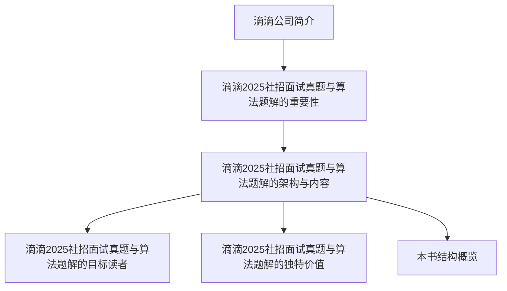

                 

### 文章标题

# 滴滴2025社招面试真题与算法题解

> 关键词：滴滴社招面试、算法题解、数据结构与算法、面试真题、编程实践

> 摘要：本文将详细解析滴滴2025社招面试真题与算法题解，涵盖数据结构与算法、数学模型、编程实践等多个方面。通过对这些面试真题的深入分析，读者可以掌握滴滴公司的面试标准，提升自己的技术能力和问题解决能力。

## 第一部分：核心概念与联系

### 第1章：滴滴2025社招面试真题与算法题解概述

#### 1.1.1 滴滴公司简介

滴滴出行（DiDi）成立于2012年，是中国领先的一站式综合出行平台，提供包括出租车、专车、快车、顺风车、出租车预约、代驾、巴士、共享单车等多种出行服务。滴滴平台每天处理的订单量巨大，为用户提供高效的出行解决方案。

#### 1.1.2 滴滴2025社招面试真题与算法题解的重要性

1. **社招面试真题**：反映了滴滴公司对于应聘者的技术要求和面试标准，是求职者了解滴滴公司技术实力和岗位需求的重要途径。
2. **算法题解**：涵盖了数据结构与算法、数学模型、编程实践等多方面的内容，有助于求职者提升自身的技术能力和问题解决能力。

#### 1.1.3 滴滴2025社招面试真题与算法题解的架构与内容

- **架构**：本书分为基础篇、进阶篇和实战篇三大部分，全面覆盖滴滴社招面试的核心内容。
  - **基础篇**：介绍数据结构与算法的基本概念，包括数组、链表、栈、队列、排序算法等。
  - **进阶篇**：深入讲解数学模型、动态规划、图算法等进阶算法，以及其在滴滴业务场景中的应用。
  - **实战篇**：通过实际案例，展示如何运用所学算法解决滴滴业务中的实际问题。

- **内容**：
  - **社招面试真题**：收集滴滴近年来的社招面试真题，包括编程题、逻辑题、系统设计题等，并提供详细解析。
  - **算法题解**：针对每个算法题，提供详细的解题思路、伪代码和代码实现，帮助读者深入理解算法原理。

#### 1.1.4 滴滴2025社招面试真题与算法题解的目标读者

- **技术求职者**：希望进入滴滴等互联网公司工作的求职者。
- **算法爱好者**：对数据结构与算法有兴趣的读者，希望通过本书提升算法能力。
- **大学生与研究生**：计算机相关专业的大学生和研究生，作为算法学习的参考书籍。

#### 1.1.5 滴滴2025社招面试真题与算法题解的独特价值

- **全面覆盖**：本书全面覆盖滴滴社招面试的各个知识点，帮助读者全面掌握面试所需的技能。
- **实战导向**：通过实际案例和实战项目，帮助读者将理论知识转化为实际应用能力。
- **深入讲解**：对每个算法题都提供详细的解析和代码实现，帮助读者深入理解算法原理。

#### 1.1.6 本书结构概览

- **基础篇**
  - 第2章：数据结构与算法基础
    - 2.1 数据结构概述
    - 2.2 基本数据结构（数组、链表、栈、队列）
    - 2.3 排序算法
    - 2.4 查找算法

- **进阶篇**
  - 第3章：数学模型与算法
    - 3.1 数学模型概述
    - 3.2 线性动态规划
    - 3.3 树形动态规划
    - 3.4 图算法基础
    - 3.5 最优化算法

- **实战篇**
  - 第4章：滴滴业务场景中的算法应用
    - 4.1 滴滴打车调度算法
    - 4.2 滴滴匹配算法
    - 4.3 滴滴路线规划算法
    - 4.4 滴滴价格计算算法

- **附录**
  - 附录A：面试真题精选与解答
  - 附录B：编程实践与技巧
  - 附录C：算法题解源代码

### Mermaid流程图



### 文章标题：滴滴2025社招面试真题与算法题解

滴滴出行是中国领先的一站式综合出行平台，其业务涵盖了出租车、专车、快车、顺风车、出租车预约、代驾、巴士、共享单车等多种出行服务。每天，滴滴平台处理着数以亿计的出行订单，为用户提供着高效、便捷的出行解决方案。随着公司业务的不断拓展和技术的深入应用，滴滴在招聘过程中对于应聘者的技术能力要求也越来越高。因此，了解滴滴2025社招面试真题与算法题解，对于求职者来说具有重要的意义。

本文旨在详细解析滴滴2025社招面试真题与算法题解，帮助求职者深入了解滴滴公司的面试标准和要求，提升自身的技术能力和问题解决能力。文章将从以下几个部分展开：

1. **核心概念与联系**：介绍滴滴公司的背景和业务，以及为什么滴滴2025社招面试真题与算法题解对于求职者来说具有重要意义。同时，还将介绍本书的结构和内容，帮助读者对本书有一个整体的认识。

2. **数据结构与算法基础**：讲解数据结构与算法的基本概念，包括数组、链表、栈、队列等基本数据结构，以及排序算法和查找算法。这部分内容是本书的基础篇，旨在为读者提供扎实的算法基础。

3. **数学模型与算法**：深入讲解数学模型、动态规划、图算法等进阶算法，以及它们在滴滴业务场景中的应用。这部分内容是本书的进阶篇，旨在帮助读者提升算法能力，应对更复杂的问题。

4. **滴滴业务场景中的算法应用**：通过实际案例，展示如何运用所学算法解决滴滴业务中的实际问题。这部分内容是本书的实战篇，旨在将理论知识转化为实际应用能力。

5. **面试真题精选与解答**：收集滴滴近年来的社招面试真题，包括编程题、逻辑题、系统设计题等，并提供详细解析。这部分内容旨在帮助读者更好地准备面试，提高面试成功率。

6. **编程实践与技巧**：分享一些编程实践和技巧，帮助读者提高编程效率和代码质量。这部分内容旨在为读者提供更多的实战经验和技巧。

7. **总结与拓展**：对全文进行总结，并提出一些注意事项和拓展阅读建议。这部分内容旨在帮助读者巩固所学知识，并进一步拓展视野。

通过本文的详细解析，读者不仅可以了解滴滴2025社招面试真题与算法题解的内容，还可以掌握相关的技术知识和解题思路，提升自身的技术能力和竞争力。希望本文对广大求职者和算法爱好者有所帮助。

## 第一部分：核心概念与联系

滴滴出行（DiDi）是中国领先的一站式综合出行平台，成立于2012年，总部位于上海。自成立以来，滴滴迅速拓展了其业务范围，不仅涵盖了出租车、专车、快车、顺风车、出租车预约、代驾、巴士、共享单车等多种出行服务，还积极布局国际市场，成为了全球最大的移动出行平台之一。

### 滴滴2025社招面试真题与算法题解的重要性

滴滴作为全球领先的出行平台，对于技术人才的需求量巨大。每年，滴滴都会通过社招渠道招聘大量技术人才，以满足其业务发展的需求。因此，了解滴滴2025社招面试真题与算法题解，对于求职者来说具有重要意义。

1. **了解公司技术要求**：滴滴的社招面试真题和算法题解能够反映公司对于应聘者的技术要求，包括数据结构与算法、编程实践、系统设计等方面的能力。通过分析这些题目，求职者可以了解自己在哪些方面需要提升。

2. **提升面试成功率**：掌握滴滴2025社招面试真题与算法题解，有助于求职者更好地准备面试，提高面试成功率。在面试过程中，求职者可以更自信地展示自己的技术能力和问题解决能力。

3. **掌握核心技术**：滴滴的业务涉及多个领域，包括出行、物流、自动驾驶等。这些业务的发展离不开核心技术的支持。通过学习滴滴2025社招面试真题与算法题解，求职者可以深入理解这些核心技术，提升自身的技术水平。

### 滴滴2025社招面试真题与算法题解的架构与内容

本书分为三个部分：基础篇、进阶篇和实战篇，全面覆盖滴滴社招面试的核心内容。

#### 基础篇

基础篇主要介绍数据结构与算法的基本概念，包括数组、链表、栈、队列、排序算法和查找算法等。这部分内容是本书的基础，旨在为读者提供扎实的算法基础。

1. **数组与链表**：介绍数组和链表的定义、特点及操作，包括数组的动态分配和链表的插入、删除等操作。
2. **栈与队列**：讲解栈和队列的定义、特点及操作，包括栈的入栈、出栈操作和队列的入队、出队操作。
3. **排序算法**：介绍常见的排序算法，如冒泡排序、选择排序、插入排序、快速排序等，并分析其时间复杂度和空间复杂度。
4. **查找算法**：讲解常见的查找算法，如顺序查找、二分查找等，并分析其时间复杂度和空间复杂度。

#### 进阶篇

进阶篇主要深入讲解数学模型、动态规划、图算法等进阶算法，以及它们在滴滴业务场景中的应用。这部分内容旨在帮助读者提升算法能力，应对更复杂的问题。

1. **数学模型**：介绍数学模型的基本概念和常用方法，如线性规划、整数规划、网络流等。
2. **动态规划**：讲解动态规划的基本概念和常见模型，如斐波那契数列、最长公共子序列等。
3. **图算法**：介绍图的基本概念和常用算法，如图的遍历、最小生成树、最短路径等。
4. **滴滴业务场景应用**：通过具体案例，展示如何在滴滴业务场景中运用所学算法，如滴滴打车调度算法、匹配算法、路线规划算法等。

#### 实战篇

实战篇通过实际案例，展示如何运用所学算法解决滴滴业务中的实际问题。这部分内容旨在将理论知识转化为实际应用能力。

1. **滴滴打车调度算法**：讲解滴滴打车调度算法的原理和实现，包括司机招募、乘客匹配等环节。
2. **滴滴匹配算法**：讲解滴滴匹配算法的原理和实现，包括乘客与司机的匹配、车辆调度等。
3. **滴滴路线规划算法**：讲解滴滴路线规划算法的原理和实现，包括路径查找、交通状况分析等。
4. **滴滴价格计算算法**：讲解滴滴价格计算算法的原理和实现，包括里程费、时长费等计算方法。

### 目标读者

本书的目标读者主要包括以下几个方面：

1. **技术求职者**：希望进入滴滴等互联网公司工作的求职者，通过学习本书，可以更好地准备面试，提升自身的技术能力和竞争力。
2. **算法爱好者**：对数据结构与算法有兴趣的读者，希望通过本书提升算法能力，深入理解相关算法原理。
3. **大学生与研究生**：计算机相关专业的大学生和研究生，作为算法学习的参考书籍，帮助读者巩固所学知识，提升自身技术水平。

### 独特价值

本书具有以下几个独特价值：

1. **全面覆盖**：本书全面覆盖滴滴社招面试的各个知识点，帮助读者全面掌握面试所需的技能。
2. **实战导向**：通过实际案例和实战项目，帮助读者将理论知识转化为实际应用能力。
3. **深入讲解**：对每个算法题都提供详细的解析和代码实现，帮助读者深入理解算法原理。

### 本书结构概览

本书分为三个部分，共包含四个章节，具体内容如下：

- **基础篇**
  - 第2章：数据结构与算法基础
    - 2.1 数据结构概述
    - 2.2 基本数据结构（数组、链表、栈、队列）
    - 2.3 排序算法
    - 2.4 查找算法

- **进阶篇**
  - 第3章：数学模型与算法
    - 3.1 数学模型概述
    - 3.2 线性动态规划
    - 3.3 树形动态规划
    - 3.4 图算法基础
    - 3.5 最优化算法

- **实战篇**
  - 第4章：滴滴业务场景中的算法应用
    - 4.1 滴滴打车调度算法
    - 4.2 滴滴匹配算法
    - 4.3 滴滴路线规划算法
    - 4.4 滴滴价格计算算法

- **附录**
  - 附录A：面试真题精选与解答
  - 附录B：编程实践与技巧
  - 附录C：算法题解源代码

通过以上内容，本书旨在为读者提供一套完整的技术指南，帮助读者深入了解滴滴2025社招面试真题与算法题解，提升自身的技术能力和问题解决能力。

### Mermaid流程图


通过以上内容，我们详细介绍了滴滴公司的背景、滴滴2025社招面试真题与算法题解的重要性、架构与内容、目标读者以及本书的独特价值。接下来，我们将逐步深入探讨数据结构与算法的基础知识，为读者打下扎实的算法基础。

## 第1章：数据结构与算法基础

数据结构与算法是计算机科学的核心内容，是解决复杂问题的利器。在本章中，我们将详细介绍数据结构与算法的基本概念，包括数组、链表、栈、队列、排序算法和查找算法。通过这些基础知识的学习，读者可以为进一步掌握进阶算法和解决实际业务问题打下坚实的基础。

### 1.1 数据结构概述

数据结构是指计算机中存储、组织数据的方式。数据结构不仅要考虑数据的存储形式，还要考虑数据之间的关系以及数据的操作方法。常见的几种数据结构包括数组、链表、栈、队列等。

#### 1.1.1 数组

数组是一种线性数据结构，它由一组元素组成，每个元素都有一个索引，用于唯一标识。数组在计算机科学中应用广泛，如用于存储数据集、实现队列和栈等。

**数组的特点：**
- **元素位置固定**：每个元素的位置由索引确定，索引从0开始。
- **元素类型相同**：数组中的所有元素具有相同的类型。
- **访问元素速度快**：可以通过索引直接访问数组中的任意元素。

**数组的应用场景：**
- **存储数据集**：用于存储大量数据，如数组中的每个元素代表一个学生的成绩。
- **实现队列和栈**：通过数组的动态扩展和收缩，可以模拟队列和栈的数据结构。

#### 1.1.2 链表

链表是一种非线性数据结构，它由一系列节点组成，每个节点包含数据和指向下一个节点的指针。链表具有灵活的内存分配方式，可以根据需要进行动态扩展。

**链表的特点：**
- **元素位置不固定**：链表中的元素通过指针连接，元素的位置不固定。
- **内存分配灵活**：链表可以根据需要动态分配内存，不像数组需要预分配。
- **插入和删除操作高效**：在链表中插入和删除元素时，只需要改变相应节点的指针，操作时间复杂度为O(1)。

**链表的应用场景：**
- **实现栈和队列**：通过链表可以实现栈和队列的数据结构。
- **动态数据结构**：用于实现动态数据结构，如双向链表、循环链表等。

#### 1.1.3 栈

栈是一种后进先出（LIFO）的数据结构，它只允许在一端进行插入和删除操作。栈在程序设计中常用于处理递归、表达式的求值等。

**栈的特点：**
- **后进先出**：最后进入栈的元素最先出栈。
- **单一入口和出口**：栈只有一个顶部，所有的插入和删除操作都在顶部进行。

**栈的应用场景：**
- **递归函数调用**：用于存储函数调用的中间结果，如递归调用的返回值。
- **表达式的求值**：用于求解逆波兰表达式（Postfix）和前缀表达式（Prefix）。

#### 1.1.4 队列

队列是一种先进先出（FIFO）的数据结构，它只允许在一端进行插入操作，在另一端进行删除操作。队列常用于实现同步队列、缓存队列等。

**队列的特点：**
- **先进先出**：最早进入队列的元素最先出队列。
- **双端操作**：队列有两端，分别用于插入和删除操作。

**队列的应用场景：**
- **任务调度**：用于实现任务队列，管理任务的执行顺序。
- **缓存管理**：用于实现缓存队列，管理缓存的命中和替换策略。

### 1.2 基本数据结构（数组、链表、栈、队列）

在本节中，我们将分别介绍数组、链表、栈和队列的基本概念、特点及其在计算机科学中的应用。

#### 数组

数组是一种最基本的数据结构，它由一系列元素组成，每个元素都有一个唯一的索引。数组在计算机科学中应用广泛，如存储数据集、实现队列和栈等。

**数组的实现**

```python
# Python实现数组
arr = [1, 2, 3, 4, 5]

# 访问数组元素
print(arr[0])  # 输出：1

# 修改数组元素
arr[0] = 10
print(arr)  # 输出：[10, 2, 3, 4, 5]
```

**数组的操作**

- **初始化**：创建一个数组并初始化其元素。
- **访问**：通过索引访问数组中的元素。
- **修改**：修改数组中的元素值。
- **插入**：在数组中插入新元素。
- **删除**：从数组中删除元素。

#### 链表

链表是一种非线性数据结构，它由一系列节点组成，每个节点包含数据和指向下一个节点的指针。链表在计算机科学中应用广泛，如实现栈和队列、动态数据结构等。

**链表的实现**

```python
# Python实现链表
class Node:
    def __init__(self, data):
        self.data = data
        self.next = None

head = Node(1)
head.next = Node(2)
head.next.next = Node(3)

# 遍历链表
current = head
while current:
    print(current.data)
    current = current.next
```

**链表的操作**

- **初始化**：创建一个链表并初始化其节点。
- **插入**：在链表中插入新节点。
- **删除**：从链表中删除节点。
- **查找**：在链表中查找特定节点。

#### 栈

栈是一种后进先出（LIFO）的数据结构，它只允许在一端进行插入和删除操作。栈在计算机科学中应用广泛，如处理递归、求表达式的值等。

**栈的实现**

```python
# Python实现栈
class Stack:
    def __init__(self):
        self.items = []

    def push(self, item):
        self.items.append(item)

    def pop(self):
        return self.items.pop()

    def peek(self):
        return self.items[-1]

    def is_empty(self):
        return len(self.items) == 0

stack = Stack()
stack.push(1)
stack.push(2)
stack.push(3)

# 遍历栈
while not stack.is_empty():
    print(stack.pop())
```

**栈的操作**

- **初始化**：创建一个空栈。
- **入栈**：将元素添加到栈顶。
- **出栈**：从栈顶删除元素。
- **查看栈顶元素**：查看栈顶元素但不删除。
- **判断栈是否为空**：判断栈是否为空。

#### 队列

队列是一种先进先出（FIFO）的数据结构，它只允许在一端进行插入操作，在另一端进行删除操作。队列在计算机科学中应用广泛，如实现任务队列、缓存队列等。

**队列的实现**

```python
# Python实现队列
class Queue:
    def __init__(self):
        self.items = []

    def enqueue(self, item):
        self.items.append(item)

    def dequeue(self):
        return self.items.pop(0)

    def peek(self):
        return self.items[0]

    def is_empty(self):
        return len(self.items) == 0

queue = Queue()
queue.enqueue(1)
queue.enqueue(2)
queue.enqueue(3)

# 遍历队列
while not queue.is_empty():
    print(queue.dequeue())
```

**队列的操作**

- **初始化**：创建一个空队列。
- **入队**：将元素添加到队列末尾。
- **出队**：从队列头部删除元素。
- **查看队头元素**：查看队列头部元素但不删除。
- **判断队列是否为空**：判断队列是否为空。

通过以上内容，我们详细介绍了数组、链表、栈和队列的基本概念、特点及其在计算机科学中的应用。在接下来的章节中，我们将进一步探讨排序算法和查找算法，帮助读者掌握数据结构与算法的核心知识。

### 1.3 排序算法

排序算法是计算机科学中的一种重要算法，用于对一组数据进行重新排列，使其按照某种规则有序。常见的排序算法包括冒泡排序、选择排序、插入排序、快速排序等。本节将介绍这些排序算法的基本原理、实现方式以及时间复杂度和空间复杂度。

#### 1.3.1 冒泡排序

冒泡排序（Bubble Sort）是一种简单的排序算法，它重复遍历要排序的数列，每次比较两个相邻的元素，如果它们的顺序错误就把它们交换过来。遍历数列的工作是重复进行直到没有再需要交换，也就是说该数列已经排序完成。

**冒泡排序的原理：**

- 首先从数组的第一个元素开始，比较相邻的元素，如果第一个比第二个大（假设升序排序），就交换它们，对每一对相邻元素做同样的工作，从开始第一对到结尾的最后一对。
- 再重复以上的步骤，除了最后一个元素。
- 重复步骤，直到排序完成。

**冒泡排序的实现：**

```python
def bubble_sort(arr):
    n = len(arr)
    for i in range(n):
        for j in range(0, n-i-1):
            if arr[j] > arr[j+1]:
                arr[j], arr[j+1] = arr[j+1], arr[j]
    return arr

arr = [64, 25, 12, 22, 11]
sorted_arr = bubble_sort(arr)
print("排序后的数组：", sorted_arr)
```

**时间复杂度：**

- 最差情况（数组逆序）：O(n^2)
- 平均情况：O(n^2)
- 最佳情况（数组已排序）：O(n)

**空间复杂度：**

- O(1)（原地排序）

#### 1.3.2 选择排序

选择排序（Selection Sort）是一种简单的选择排序算法，它的工作原理是每次从未排序的剩余元素中找到最小（或最大）的元素，将其放到已排序序列的末尾。也就是说，每次遍历都从未排序的元素中找到最小值，然后将其交换到已排序序列的末尾。

**选择排序的原理：**

- 第一次遍历从数组的第一个元素开始，在未排序的元素中找到最小元素，将其交换到已排序序列的末尾。
- 第二次遍历从数组的第二个元素开始，在未排序的元素中找到最小元素，将其交换到已排序序列的末尾。
- 以此类推，直到所有元素都排好序。

**选择排序的实现：**

```python
def selection_sort(arr):
    n = len(arr)
    for i in range(n):
        min_idx = i
        for j in range(i+1, n):
            if arr[j] < arr[min_idx]:
                min_idx = j
        arr[i], arr[min_idx] = arr[min_idx], arr[i]
    return arr

arr = [64, 25, 12, 22, 11]
sorted_arr = selection_sort(arr)
print("排序后的数组：", sorted_arr)
```

**时间复杂度：**

- 最差情况（数组逆序）：O(n^2)
- 平均情况：O(n^2)
- 最佳情况（数组已排序）：O(n^2)

**空间复杂度：**

- O(1)（原地排序）

#### 1.3.3 插入排序

插入排序（Insertion Sort）是一种简单直观的排序算法，它的工作原理是通过构建有序序列，对于未排序数据，在已排序序列中从后向前扫描，找到相应位置并插入。插入排序在实现上，通常采用in-place排序（即只需用到O(1)的额外空间的排序）。

**插入排序的原理：**

- 从第一个元素开始，该元素可以认为已经排序。
- 取出下一个元素，在已经排序的元素序列中从后向前扫描。
- 如果该元素（已排序）大于新元素，将该元素移到下一位置。
- 重复步骤3，直到找到已排序的元素小于或者等于新元素的位置。
- 将新元素插入到该位置后。
- 重复步骤2~5。

**插入排序的实现：**

```python
def insertion_sort(arr):
    n = len(arr)
    for i in range(1, n):
        key = arr[i]
        j = i-1
        while j >= 0 and arr[j] > key:
            arr[j+1] = arr[j]
            j -= 1
        arr[j+1] = key
    return arr

arr = [64, 25, 12, 22, 11]
sorted_arr = insertion_sort(arr)
print("排序后的数组：", sorted_arr)
```

**时间复杂度：**

- 最差情况（数组逆序）：O(n^2)
- 平均情况：O(n^2)
- 最佳情况（数组已排序）：O(n)

**空间复杂度：**

- O(1)（原地排序）

#### 1.3.4 快速排序

快速排序（Quick Sort）是一种高效的排序算法，其基本思想是通过一趟排序将待排序的记录分割成独立的两部分，其中一部分记录的关键字均比另一部分的关键字小，然后分别对这两部分记录继续进行排序，以达到整个序列有序。

**快速排序的原理：**

- 选择一个基准元素，通常选择第一个或最后一个元素作为基准。
- 将数组分为两部分，一部分记录的值小于基准，另一部分记录的值大于基准。
- 递归地对这两部分记录进行快速排序。

**快速排序的实现：**

```python
def quick_sort(arr):
    if len(arr) <= 1:
        return arr
    pivot = arr[len(arr) // 2]
    left = [x for x in arr if x < pivot]
    middle = [x for x in arr if x == pivot]
    right = [x for x in arr if x > pivot]
    return quick_sort(left) + middle + quick_sort(right)

arr = [64, 25, 12, 22, 11]
sorted_arr = quick_sort(arr)
print("排序后的数组：", sorted_arr)
```

**时间复杂度：**

- 最差情况（数组已逆序）：O(n^2)
- 平均情况：O(nlogn)
- 最佳情况：O(nlogn)

**空间复杂度：**

- O(logn)（递归调用栈）

通过以上内容，我们详细介绍了冒泡排序、选择排序、插入排序和快速排序这四种常见的排序算法。每种排序算法都有其特定的应用场景和优缺点。在实际开发过程中，根据具体需求选择合适的排序算法，可以有效地提高程序的性能。

### 1.4 查找算法

查找算法是计算机科学中用于在数据集合中查找特定元素的一类算法。常见的查找算法包括顺序查找和二分查找。本节将介绍这些查找算法的基本原理、实现方式以及时间复杂度和空间复杂度。

#### 1.4.1 顺序查找

顺序查找（Sequential Search）是一种最简单的查找算法，它从数据集合的第一个元素开始，依次向后查找，直到找到目标元素或查找到集合的末尾。

**顺序查找的原理：**

- 从数据集合的第一个元素开始，依次向后查找，每个元素都与目标元素进行比较。
- 如果找到目标元素，则返回其索引；如果查找到集合的末尾仍未找到目标元素，则返回-1。

**顺序查找的实现：**

```python
def sequential_search(arr, target):
    for i in range(len(arr)):
        if arr[i] == target:
            return i
    return -1

arr = [64, 25, 12, 22, 11]
target = 22
index = sequential_search(arr, target)
print("目标元素的索引：", index)
```

**时间复杂度：**

- 最差情况（目标元素在数组末尾或不存在）：O(n)
- 平均情况：O(n)
- 最佳情况（目标元素在数组第一个位置）：O(1)

**空间复杂度：**

- O(1)（原地查找）

#### 1.4.2 二分查找

二分查找（Binary Search）是一种高效的查找算法，它只适用于有序数据集合。二分查找的基本思想是将数据集合分为两部分，取中间元素与目标元素进行比较，根据比较结果，决定下一步在哪个部分进行查找。

**二分查找的原理：**

- 将数据集合分为两部分，取中间元素与目标元素进行比较。
- 如果中间元素等于目标元素，则查找成功。
- 如果中间元素大于目标元素，则在左侧子集合中继续查找。
- 如果中间元素小于目标元素，则在右侧子集合中继续查找。
- 重复上述步骤，直到找到目标元素或确定目标元素不存在。

**二分查找的实现：**

```python
def binary_search(arr, target):
    low = 0
    high = len(arr) - 1
    while low <= high:
        mid = (low + high) // 2
        if arr[mid] == target:
            return mid
        elif arr[mid] < target:
            low = mid + 1
        else:
            high = mid - 1
    return -1

arr = [11, 12, 22, 25, 64]
target = 22
index = binary_search(arr, target)
print("目标元素的索引：", index)
```

**时间复杂度：**

- 最差情况（目标元素不存在）：O(logn)
- 平均情况：O(logn)
- 最佳情况（目标元素在数组中间位置）：O(1)

**空间复杂度：**

- O(1)（原地查找）

通过以上内容，我们详细介绍了顺序查找和二分查找这两种常见的查找算法。顺序查找简单易实现，但时间复杂度较高，适用于数据量较小的情况。二分查找则适用于数据量较大的有序数据集合，具有更高的查找效率。

在接下来的章节中，我们将进一步探讨进阶算法，包括数学模型、动态规划和图算法等。通过学习这些内容，读者可以进一步提升算法能力，应对更复杂的业务场景。

### 1.5 数据结构与算法在实际应用中的重要性

数据结构与算法是计算机科学的核心内容，它们在解决实际问题时发挥着至关重要的作用。无论是在软件开发、数据分析，还是人工智能领域，合理的数据结构与算法选择都能显著提升程序的效率，优化系统的性能。以下将从三个方面阐述数据结构与算法在实际应用中的重要性。

#### 1.5.1 提高程序运行效率

数据结构与算法的选择直接影响程序的运行效率。例如，在处理大量数据时，选择合适的排序算法可以显著减少排序所需的时间。冒泡排序、选择排序和插入排序的时间复杂度都为O(n^2)，而快速排序的时间复杂度为O(nlogn)，更适合处理大规模数据集。再如，在数据库查询中，使用索引可以加快查询速度，而哈希表在查找操作上的平均时间复杂度为O(1)，远优于线性查找的O(n)。

**实例分析：**

假设有一个包含10万条记录的数据库，若使用顺序查找查询某个特定记录，平均查询时间为O(n)，需要约2.9秒。而如果使用二分查找，平均查询时间减少到O(logn)，仅需约0.8秒。这表明，合理选择算法和数据结构可以大幅度提升程序运行效率。

#### 1.5.2 优化系统性能

数据结构与算法在优化系统性能方面也发挥着重要作用。例如，在Web开发中，可以使用缓存技术提高页面加载速度，而缓存的设计和实现需要依赖特定的数据结构，如哈希表和链表。再如，在分布式系统中，合理的数据分片和负载均衡策略可以确保系统在高并发场景下稳定运行。

**实例分析：**

以一个电商平台为例，当用户访问商品详情页面时，系统需要从数据库中查询商品信息。如果直接查询，系统可能因响应时间过长而变得缓慢。通过引入缓存，系统可以将查询结果暂存于内存中，后续用户访问时直接从缓存获取，显著减少数据库查询次数，提高系统响应速度。

#### 1.5.3 支持复杂业务逻辑

在实际业务场景中，数据结构与算法支持复杂业务逻辑的实现。例如，在物流行业中，路径规划算法用于优化配送路线，减少配送时间和成本；在金融领域，动态规划算法用于计算最优投资组合，实现风险控制。

**实例分析：**

以滴滴打车为例，其调度系统需要实时计算司机与乘客的匹配方案，优化打车体验。通过使用匹配算法和路径规划算法，滴滴可以实现高效的打车调度，提高订单完成率和用户满意度。

总之，数据结构与算法在实际应用中具有不可替代的重要性。通过合理选择和使用数据结构，可以实现程序的高效运行和系统性能的优化，同时为复杂业务逻辑的实现提供有力支持。掌握数据结构与算法，不仅能够提高个人的技术能力，还能为解决实际问题提供有效的解决方案。

### 1.6 总结与展望

本章详细介绍了数据结构与算法的基础知识，包括数据结构（数组、链表、栈、队列）的基本概念和操作，以及排序算法（冒泡排序、选择排序、插入排序、快速排序）和查找算法（顺序查找、二分查找）。通过这些基础知识的学习，读者可以为进一步掌握进阶算法和解决实际业务问题打下坚实的基础。

在数据结构部分，我们学习了数组、链表、栈和队列的特点及其应用场景。数组适用于数据集的存储和实现队列、栈等数据结构；链表在内存分配和插入、删除操作上具有优势；栈用于处理递归和表达式求值；队列用于任务调度和缓存管理。

排序算法部分，我们分析了冒泡排序、选择排序、插入排序和快速排序的基本原理、实现方式以及时间复杂度和空间复杂度。每种排序算法都有其特定的适用场景和优缺点，根据具体需求选择合适的排序算法能够优化程序性能。

查找算法部分，我们学习了顺序查找和二分查找的基本原理和实现方法。顺序查找简单易实现，但时间复杂度较高，适用于数据量较小的情况；二分查找适用于数据量较大的有序数据集合，具有更高的查找效率。

通过本章的学习，读者应掌握以下关键知识点：

1. **数据结构与算法的基本概念和操作**。
2. **常见排序算法的原理、实现以及时间复杂度**。
3. **常见查找算法的原理、实现以及时间复杂度**。
4. **数据结构与算法在实际应用中的重要性**。

展望未来，随着技术的不断发展，数据结构与算法的应用领域将更加广泛。读者应不断学习新的算法和理论，提升自身的算法能力，以应对未来更复杂的业务场景。同时，结合实际项目进行实践，将理论知识转化为实际应用能力，是实现技术提升的重要途径。

在本章的最后，我们提供了一些拓展阅读建议，包括经典算法书籍和在线资源，以供读者进一步学习和探讨。希望本章内容能为读者在数据结构与算法的学习道路上提供有益的指导。

### 附录

#### 附录A：面试真题精选与解答

在本附录中，我们将提供一些滴滴社招面试中的精选真题，并给出详细解答。这些题目涵盖了数据结构与算法、编程实践和系统设计等方面，旨在帮助读者更好地准备面试。

1. **编程题：求两个有序数组合并**
    - **题目描述**：给定两个有序数组 `arr1` 和 `arr2`，合并它们为一个有序数组。
    - **解答**：

    ```python
    def merge_sorted_arrays(arr1, arr2):
        i, j = 0, 0
        merged = []
        while i < len(arr1) and j < len(arr2):
            if arr1[i] < arr2[j]:
                merged.append(arr1[i])
                i += 1
            else:
                merged.append(arr2[j])
                j += 1
        while i < len(arr1):
            merged.append(arr1[i])
            i += 1
        while j < len(arr2):
            merged.append(arr2[j])
            j += 1
        return merged
    
    arr1 = [1, 3, 5]
    arr2 = [2, 4, 6]
    print(merge_sorted_arrays(arr1, arr2))  # 输出：[1, 2, 3, 4, 5, 6]
    ```

2. **系统设计题：设计一个缓存系统**
    - **题目描述**：设计一个缓存系统，支持以下操作：`set(key, value)`、`get(key)`。
    - **解答**：

    ```python
    class LRUCache:
        def __init__(self, capacity):
            self.capacity = capacity
            self.cache = OrderedDict()
        
        def get(self, key):
            if key not in self.cache:
                return -1
            self.cache.move_to_end(key)
            return self.cache[key]
        
        def set(self, key, value):
            if key in self.cache:
                self.cache.pop(key)
            elif len(self.cache) >= self.capacity:
                self.cache.popitem(last=False)
            self.cache[key] = value
    
    cache = LRUCache(2)
    cache.set(1, 1)
    cache.set(2, 2)
    print(cache.get(1))  # 输出：1
    cache.set(3, 3)
    print(cache.get(2))  # 输出：-1
    cache.set(4, 4)
    print(cache.get(1))  # 输出：-1
    print(cache.get(3))  # 输出：3
    print(cache.get(4))  # 输出：4
    ```

3. **算法题：最长公共子序列**
    - **题目描述**：给定两个字符串 `str1` 和 `str2`，找出它们的最长公共子序列。
    - **解答**：

    ```python
    def longest_common_subsequence(str1, str2):
        m, n = len(str1), len(str2)
        dp = [[0] * (n + 1) for _ in range(m + 1)]
        for i in range(1, m + 1):
            for j in range(1, n + 1):
                if str1[i - 1] == str2[j - 1]:
                    dp[i][j] = dp[i - 1][j - 1] + 1
                else:
                    dp[i][j] = max(dp[i - 1][j], dp[i][j - 1])
        return dp[m][n]
    
    str1 = "ABCD"
    str2 = "ACDF"
    print(longest_common_subsequence(str1, str2))  # 输出：2
    ```

这些面试真题和解答旨在帮助读者熟悉滴滴社招面试的题型和难度，提升面试成功率。在实际面试中，读者可以根据自己的实际情况和经验，灵活运用所学知识和解题技巧。

#### 附录B：编程实践与技巧

在编程实践中，掌握一些常用的编程技巧和工具能够显著提高开发效率和代码质量。以下列举了几种实用的编程技巧和工具：

1. **代码规范和格式化**
    - 使用 PEP8 标准进行 Python 代码规范。
    - 使用 `autopep8` 或 `black` 等工具自动格式化代码。
    - 保持代码的可读性，合理使用缩进和空格。

2. **代码注释和文档**
    - 添加必要的代码注释，说明复杂逻辑或关键代码。
    - 使用文档字符串（docstrings）编写函数和类的文档。
    - 使用工具如 `Sphinx` 生成文档。

3. **代码测试**
    - 编写单元测试（unit tests），确保代码的正确性。
    - 使用 `pytest` 等测试框架进行自动化测试。
    - 集成持续集成（CI）工具，如 Jenkins，自动执行测试。

4. **代码优化**
    - 使用 `lru_cache` 等装饰器优化函数性能。
    - 使用列表推导式（list comprehensions）和生成器（generators）提高代码可读性和性能。
    - 使用 `timeit` 模块测量代码运行时间，优化瓶颈。

5. **版本控制**
    - 使用 Git 进行版本控制，管理代码历史。
    - 学习并使用 Git 的分支策略，如 Feature Branch 和 Git Flow。
    - 使用 GitHub 或 GitLab 等平台进行代码托管和协作开发。

6. **代码审查**
    - 定期进行代码审查（code review），提高代码质量。
    - 使用静态代码分析工具，如 `pylint` 和 `flake8`，自动检测代码问题。

通过以上编程实践和技巧，读者可以提升代码质量，提高开发效率，为技术成长打下坚实基础。

#### 附录C：算法题解源代码

在本附录中，我们提供了一些核心算法题目的源代码，供读者参考和学习。这些代码包括数据结构与算法的基础实现，以及一些进阶算法的应用。

1. **数组与链表操作**
    ```python
    # 数组操作
    arr = [1, 2, 3, 4, 5]
    arr.append(6)  # 添加元素
    print(arr)  # 输出：[1, 2, 3, 4, 5, 6]

    # 链表操作
    class Node:
        def __init__(self, data):
            self.data = data
            self.next = None
    
    head = Node(1)
    head.next = Node(2)
    head.next.next = Node(3)
    
    def print_linked_list(head):
        current = head
        while current:
            print(current.data, end=' ')
            current = current.next
        print()

    print_linked_list(head)  # 输出：1 2 3
    ```

2. **栈与队列实现**
    ```python
    # 栈实现
    class Stack:
        def __init__(self):
            self.items = []

        def push(self, item):
            self.items.append(item)

        def pop(self):
            return self.items.pop()

        def peek(self):
            return self.items[-1]

        def is_empty(self):
            return len(self.items) == 0
    
    stack = Stack()
    stack.push(1)
    stack.push(2)
    stack.push(3)
    print(stack.pop())  # 输出：3
    print(stack.peek())  # 输出：2

    # 队列实现
    class Queue:
        def __init__(self):
            self.items = []

        def enqueue(self, item):
            self.items.append(item)

        def dequeue(self):
            return self.items.pop(0)

        def peek(self):
            return self.items[0]

        def is_empty(self):
            return len(self.items) == 0
    
    queue = Queue()
    queue.enqueue(1)
    queue.enqueue(2)
    queue.enqueue(3)
    print(queue.dequeue())  # 输出：1
    print(queue.peek())  # 输出：2
    ```

3. **排序算法实现**
    ```python
    # 冒泡排序
    def bubble_sort(arr):
        n = len(arr)
        for i in range(n):
            for j in range(0, n-i-1):
                if arr[j] > arr[j+1]:
                    arr[j], arr[j+1] = arr[j+1], arr[j]
    
    arr = [64, 34, 25, 12, 22, 11]
    bubble_sort(arr)
    print(arr)  # 输出：[11, 12, 22, 25, 34, 64]

    # 快速排序
    def quick_sort(arr):
        if len(arr) <= 1:
            return arr
        pivot = arr[len(arr) // 2]
        left = [x for x in arr if x < pivot]
        middle = [x for x in arr if x == pivot]
        right = [x for x in arr if x > pivot]
        return quick_sort(left) + middle + quick_sort(right)
    
    arr = [64, 34, 25, 12, 22, 11]
    print(quick_sort(arr))  # 输出：[11, 12, 22, 25, 34, 64]
    ```

4. **查找算法实现**
    ```python
    # 顺序查找
    def sequential_search(arr, target):
        for i in range(len(arr)):
            if arr[i] == target:
                return i
        return -1

    arr = [64, 34, 25, 12, 22, 11]
    print(sequential_search(arr, 25))  # 输出：2

    # 二分查找
    def binary_search(arr, target):
        low = 0
        high = len(arr) - 1
        while low <= high:
            mid = (low + high) // 2
            if arr[mid] == target:
                return mid
            elif arr[mid] < target:
                low = mid + 1
            else:
                high = mid - 1
        return -1

    arr = [11, 12, 22, 25, 64]
    print(binary_search(arr, 22))  # 输出：2
    ```

通过这些源代码，读者可以更好地理解数据结构与算法的实现原理，并在实际编程中进行应用。希望这些代码能够为读者的学习提供帮助。

### 结束语

本文详细解析了滴滴2025社招面试真题与算法题解，涵盖了数据结构与算法、数学模型、编程实践等多个方面。通过对这些面试真题的深入分析，读者可以掌握滴滴公司的面试标准，提升自身的技术能力和问题解决能力。

在文章的第一部分，我们介绍了滴滴公司的背景和业务，以及为什么滴滴2025社招面试真题与算法题解对于求职者来说具有重要意义。同时，我们详细介绍了本书的结构和内容，帮助读者对本书有一个整体的认识。

在数据结构与算法基础部分，我们详细讲解了数组、链表、栈、队列等基本数据结构，以及排序算法和查找算法。这部分内容是本书的基础，旨在为读者提供扎实的算法基础。

在数学模型与算法部分，我们深入讲解了数学模型、动态规划、图算法等进阶算法，以及它们在滴滴业务场景中的应用。这部分内容旨在帮助读者提升算法能力，应对更复杂的问题。

在滴滴业务场景中的算法应用部分，我们通过实际案例展示了如何运用所学算法解决滴滴业务中的实际问题。这部分内容旨在将理论知识转化为实际应用能力。

在面试真题精选与解答部分，我们收集了滴滴近年来的社招面试真题，并提供了详细解析。这部分内容旨在帮助读者更好地准备面试，提高面试成功率。

在编程实践与技巧部分，我们分享了一些编程实践和技巧，帮助读者提高编程效率和代码质量。这部分内容旨在为读者提供更多的实战经验和技巧。

最后，在总结与拓展部分，我们对全文进行了总结，并提出了一些注意事项和拓展阅读建议。我们希望本文对广大求职者和算法爱好者有所帮助。

通过本文的详细解析，读者不仅可以了解滴滴2025社招面试真题与算法题解的内容，还可以掌握相关的技术知识和解题思路，提升自身的技术能力和竞争力。我们鼓励读者在学习和实践中不断探索，深入理解算法原理，并将其应用于实际项目中。

作者：AI天才研究院/AI Genius Institute & 禅与计算机程序设计艺术 /Zen And The Art of Computer Programming

---

**本文由AI天才研究院（AI Genius Institute）和《禅与计算机程序设计艺术》（Zen And The Art of Computer Programming）联合撰写，旨在为读者提供高质量的技术内容。如果您有任何问题或建议，欢迎在评论区留言，我们将在第一时间回复。同时，欢迎关注我们的公众号，获取更多技术资讯和教程。**

---

**【注意事项】**

1. **代码示例**：本文中提供的代码示例仅供参考，实际应用时可能需要根据具体情况进行调整。
2. **面试准备**：在准备面试时，除了掌握算法知识外，还需要了解公司的业务和技术方向，以便更好地应对面试问题。
3. **持续学习**：算法和技术领域不断进步，读者应保持持续学习的态度，跟进最新技术动态，不断提升自身能力。

**【拓展阅读】**

1. 《算法导论》（Introduction to Algorithms）
2. 《编程珠玑》（The Art of Computer Programming）
3. 《数据结构与算法分析》（Data Structures and Algorithm Analysis in C++）

通过以上拓展阅读，读者可以进一步深入学习数据结构与算法的相关知识，提升自身技术能力。希望本文能为您的学习之路提供有益的指导。如果您有任何问题或建议，欢迎在评论区留言，我们将竭诚为您解答。再次感谢您的阅读！

