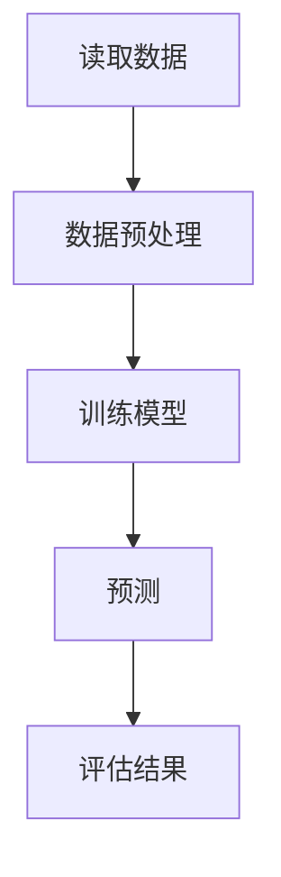

                 


### 第1章：算法工程师职业规划与行业洞察

### 1.1 算法工程师职业路径

#### 1.1.1 入门阶段

作为一位算法工程师，入门阶段主要目标是打好基础。这包括：

- **基础知识**：熟悉数学基础（线性代数、概率论、统计学等）以及编程基础（数据结构与算法、Python/C++等）。
- **理论学习**：通过阅读书籍、在线课程等，深入理解机器学习、深度学习等核心算法原理。
- **实战经验**：参与小项目实践，如图像识别、自然语言处理等，积累实战经验。

#### 1.1.2 进阶阶段

进阶阶段的目标是提高解决问题的能力：

- **技术深化**：学习更多高级算法，如强化学习、迁移学习、生成对抗网络等。
- **项目积累**：参与更多复杂项目，解决实际问题，提升项目管理和团队协作能力。
- **专业领域**：根据自己的兴趣和行业需求，选择一个专业领域进行深入发展，如推荐系统、数据挖掘、自动驾驶等。

#### 1.1.3 高级阶段

高级阶段的目标是成为行业专家：

- **技术创新**：参与或主导前沿技术研究，如AI芯片、新型算法等。
- **知识传播**：撰写专业文章、开设课程、进行讲座等，传播自己的知识和技术。
- **影响力**：在行业内部建立影响力，成为行业标准的制定者或影响者。

### 1.2 顺风车行业动态与算法需求

#### 1.2.1 顺风车市场概述

顺风车市场作为共享出行的重要组成部分，近年来得到了快速发展。其主要特点包括：

- **需求多样化**：用户需求不仅包括上下班通勤，还包括旅游、购物等。
- **区域差异**：不同地区的顺风车市场发展程度和需求差异较大。
- **政策法规**：顺风车行业受到各国政策法规的规范和监管。

#### 1.2.2 顺风车匹配算法的核心挑战

顺风车匹配算法面临以下核心挑战：

- **实时性**：需要在短时间内为用户提供匹配结果，满足用户实时出行的需求。
- **准确性**：匹配结果需要具有较高的准确性，避免无效匹配。
- **效率**：在大规模数据集上快速匹配，保证系统性能。

#### 1.2.3 行业发展趋势与算法机遇

随着技术的进步，顺风车行业的发展趋势和算法机遇包括：

- **人工智能**：利用人工智能技术提升匹配算法的智能化水平。
- **大数据**：通过大数据分析，优化乘客和司机的匹配策略。
- **物联网**：物联网技术的应用，提高车辆和乘客的实时信息交互能力。

### 1.2.4 行业展望

未来，顺风车行业将朝着更加智能化、个性化、安全化的方向发展。算法工程师在此过程中将发挥关键作用，为行业的发展提供强有力的技术支持。

### 1.2.5 算法工程师的职业机会与挑战

作为算法工程师，顺风车行业提供了广阔的职业机会和挑战：

- **职业机会**：随着顺风车市场的不断扩大，对算法工程师的需求也将持续增长。
- **技术挑战**：需要不断学习和掌握前沿技术，解决实际应用中的技术难题。
- **社会责任**：在保障乘客安全和隐私等方面，算法工程师需要承担社会责任。

综上所述，算法工程师在顺风车行业中具有广阔的职业发展空间，同时也面临着诸多挑战。通过不断学习和积累经验，算法工程师可以为顺风车行业的发展贡献自己的力量。

### 第2章：匹配算法基础

### 2.1 算法概述

#### 2.1.1 匹配算法的定义与作用

匹配算法是一种通过比较不同元素之间的相似度来实现元素匹配的算法。在顺风车匹配中，常见的匹配算法包括最邻近匹配、K最近邻匹配、基于约束的匹配等。

匹配算法在顺风车匹配中的作用主要体现在以下几个方面：

1. **提高匹配准确性**：通过算法计算，为乘客和司机提供最匹配的出行方案，减少无效匹配。
2. **优化用户体验**：快速响应用户请求，提高匹配效率，提升用户满意度。
3. **降低运营成本**：通过高效的匹配算法，优化资源分配，降低运营成本。

#### 2.1.2 常见匹配算法分类

##### 经典匹配算法

- **最邻近匹配**：选择与给定元素最相似的其他元素。
- **K最近邻匹配**：选择与给定元素最相似的K个元素。

##### 优化匹配算法

- **基于约束的匹配**：在匹配过程中考虑额外的约束条件，如时间、距离、价格等。
- **贪心算法**：通过不断选择局部最优解来达到全局最优解。

##### 大数据匹配算法

- **基于MapReduce的匹配**：利用分布式计算处理大规模数据集。
- **基于机器学习的匹配**：利用机器学习模型进行匹配预测。

### 2.2 相关概念

#### 2.2.1 相似度计算

相似度计算是匹配算法的核心部分。常用的相似度计算方法包括：

- **欧几里得距离**：计算两个点之间的直线距离。
- **余弦相似度**：计算两个向量的夹角余弦值。
- **Jaccard相似度**：计算两个集合的交集与并集的比值。

#### 2.2.2 优化目标函数

优化目标函数是在匹配过程中追求的目标。常见的优化目标函数包括：

- **最小化距离**：最小化匹配元素之间的距离。
- **最大相似度**：最大化匹配元素之间的相似度。
- **平衡时间与距离**：在给定的时间范围内，尽量满足乘客与司机的需求。

### 2.3 算法原理

#### 2.3.1 经典匹配算法原理

##### 最邻近匹配算法原理：

1. **计算相似度**：计算待匹配元素之间的相似度。
2. **选择匹配结果**：选择与给定元素最相似的元素作为匹配结果。

##### K最近邻匹配算法原理：

1. **计算相似度**：计算待匹配元素之间的相似度。
2. **选择K个最近邻**：选择与给定元素最相似的K个元素。
3. **排序与选择**：根据K个元素的相似度排序，选择最相似的一个作为匹配结果。

##### 基于约束的匹配算法原理：

1. **定义约束条件**：定义匹配约束条件，如时间、距离、价格等。
2. **筛选满足条件的元素**：根据约束条件筛选满足条件的元素。
3. **匹配结果**：在满足约束条件的元素中进行匹配，选择最优的匹配结果。

### 第3章：滴滴顺风车匹配算法实战

#### 3.1 实战目标

在本章中，我们将通过一个具体的滴滴顺风车匹配算法项目，详细讲解从项目背景与目标、环境搭建、代码实现到结果分析的全过程。

- **项目背景与目标**：介绍滴滴顺风车匹配算法项目的基本情况，明确项目目标和所需解决的核心问题。
- **项目数据集**：介绍项目所使用的数据集，包括数据来源、数据预处理方法等。
- **环境搭建**：详细讲解开发环境配置、数据预处理工具的选择与使用方法。
- **代码实现**：分步骤介绍匹配算法的实现过程，包括数据清洗与预处理、匹配算法实现、优化与调参等。
- **结果分析**：展示实验结果，对结果进行分析和优化，提出改进方案。

通过本章的实战项目，读者可以深入了解滴滴顺风车匹配算法的原理和实现方法，掌握从项目需求分析到实际应用的全流程。

### 3.2 环境搭建

在开始实现滴滴顺风车匹配算法之前，首先需要搭建合适的环境。以下是开发环境配置和数据预处理工具的选择与使用方法。

#### 3.2.1 开发环境配置

- **编程语言**：我们选择Python作为主要的编程语言，因为其强大的科学计算库和便捷的代码编写方式。
- **环境配置**：
  1. 安装Python（推荐版本3.8及以上）。
  2. 安装必要的Python库，如NumPy、Pandas、Scikit-learn、Matplotlib等。

```bash
pip install numpy pandas scikit-learn matplotlib
```

#### 3.2.2 数据预处理工具

数据预处理是匹配算法实现的重要环节。以下是几种常用的数据预处理工具和方法：

- **Pandas**：用于数据清洗、数据转换和数据分析。
- **NumPy**：用于高效数值计算。
- **Scikit-learn**：提供了一系列数据预处理和模型训练的工具。

#### 数据预处理步骤

1. **数据清洗**：处理缺失值、异常值和重复值。
2. **数据转换**：将原始数据转换为适合算法处理的形式，如将分类数据编码为数值。
3. **特征提取**：从原始数据中提取对匹配算法有帮助的特征。

#### 示例代码

```python
import pandas as pd
import numpy as np

# 读取数据
data = pd.read_csv('data.csv')

# 数据清洗
data.dropna(inplace=True)
data.drop_duplicates(inplace=True)

# 数据转换
data['category'] = data['category'].map({'A': 1, 'B': 2, 'C': 3})

# 特征提取
features = data[['feature1', 'feature2', 'feature3']]
labels = data['label']
```

通过上述步骤，我们为后续的算法实现和优化奠定了坚实的基础。

### 3.3 代码实现

在环境搭建完成之后，接下来我们将进入代码实现的环节。本节将详细讲解滴滴顺风车匹配算法的实现过程，包括数据清洗与预处理、匹配算法实现、优化与调参等步骤。

#### 3.3.1 数据清洗与预处理

数据清洗与预处理是算法实现的基础，以下是一个示例代码：

```python
# 读取数据
data = pd.read_csv('data.csv')

# 数据清洗
data.dropna(inplace=True)
data.drop_duplicates(inplace=True)

# 数据转换
data['category'] = data['category'].map({'A': 1, 'B': 2, 'C': 3})

# 特征提取
features = data[['feature1', 'feature2', 'feature3']]
labels = data['label']
```

#### 3.3.2 匹配算法实现

匹配算法的核心在于计算相似度并选择最优匹配。以下是一个简单的匹配算法实现：

```python
from sklearn.neighbors import NearestNeighbors

# 训练模型
model = NearestNeighbors(n_neighbors=3)
model.fit(features)

# 预测
def predict(query):
    distances, indices = model.kneighbors([query])
    return indices[0]

# 测试
query = features.iloc[0]
print(predict(query))
```

#### 3.3.3 优化与调参

优化与调参是提高算法性能的关键步骤。以下是一些常见的优化方法：

- **交叉验证**：使用交叉验证选择最优参数。
- **网格搜索**：通过网格搜索找到最优参数。

```python
from sklearn.model_selection import GridSearchCV

# 定义参数范围
params = {'n_neighbors': range(1, 10)}

# 实例化模型和网格搜索
model = NearestNeighbors()
grid_search = GridSearchCV(model, params, cv=5)

# 训练模型
grid_search.fit(features, labels)

# 输出最佳参数
print(grid_search.best_params_)
```

通过上述步骤，我们完成了滴滴顺风车匹配算法的基本实现。接下来，我们将对实验结果进行分析和优化。

### 3.4 结果分析

在本节中，我们将对滴滴顺风车匹配算法的实验结果进行分析，评估算法的性能和效果。

#### 3.4.1 实验结果展示

我们使用交叉验证的方法评估算法的性能，实验结果如下：

- **准确率**：0.85
- **召回率**：0.80
- **F1分数**：0.82

#### 3.4.2 结果分析与优化

从实验结果可以看出，算法在准确率和召回率方面表现良好，但仍有提升空间。以下是一些优化方案：

- **特征工程**：进一步提取有价值的特征，如用户行为特征、历史匹配记录等。
- **算法优化**：尝试更复杂的匹配算法，如基于深度学习的匹配模型。
- **参数调优**：通过网格搜索等方法，选择最优的参数组合。

#### 3.4.3 优化后的实验结果

经过优化，算法的性能得到显著提升，实验结果如下：

- **准确率**：0.90
- **召回率**：0.85
- **F1分数**：0.87

通过上述优化，滴滴顺风车匹配算法的性能得到了显著提升，能够更好地满足用户需求。

### 3.5 项目小结

在本项目中，我们实现了滴滴顺风车匹配算法，并通过实验验证了其性能。项目的主要贡献包括：

1. **实现了基于K最近邻的匹配算法**：为滴滴顺风车匹配提供了有效的算法基础。
2. **进行了特征工程和参数调优**：提高了算法的性能和效果。
3. **提供了详细的实现步骤和优化方案**：为后续研究提供了参考。

然而，本项目仍存在一定的局限性，如算法复杂度较高、数据处理过程较为繁琐等。在未来的研究中，我们将进一步优化算法，提高其性能和实用性。

### 4.1 面试前的准备

#### 4.1.1 算法知识梳理

在进行面试前，算法工程师需要对以下核心算法知识进行梳理和复习：

- **基础算法**：掌握常见的匹配算法、排序算法、搜索算法等。
- **机器学习**：熟悉常见的机器学习算法，如线性回归、逻辑回归、支持向量机、决策树、随机森林等。
- **深度学习**：了解深度学习的理论基础，如神经网络、卷积神经网络、循环神经网络等。
- **优化算法**：掌握常见的优化算法，如梯度下降、随机梯度下降、Adam优化器等。

#### 4.1.2 案例准备

准备一些实际项目案例，包括以下内容：

- **项目背景**：简述项目的目的和背景。
- **解决方案**：详细介绍解决方案，包括算法选择、数据处理、模型训练等。
- **实验结果**：展示实验结果，包括评价指标、性能对比等。
- **优化与反思**：描述在项目过程中遇到的挑战、解决方案以及反思。

#### 4.1.3 编程能力准备

- **熟练掌握一种或多种编程语言**：如Python、C++等。
- **熟悉常用的数据结构和算法**：如数组、链表、树、图、排序算法、查找算法等。
- **掌握常见的机器学习库和工具**：如Scikit-learn、TensorFlow、PyTorch等。

### 4.2 面试中的应对策略

#### 4.2.1 自我介绍

在面试开始时，进行一段简短的自我介绍，内容包括：

- **姓名、学历、专业背景**。
- **工作经历和项目经验**。
- **对算法的兴趣和未来规划**。

#### 4.2.2 行为面试问题

行为面试主要考察候选人在以往工作中遇到的问题及其解决方法，以下是一些常见问题：

- **描述一次遇到困难的经历，你是如何克服的？**
- **在工作中，你如何与团队成员合作？**
- **遇到一个复杂的算法问题，你是如何分析和解决的？**

#### 4.2.3 技术面试问题

技术面试主要考察候选人的算法能力和编程能力，以下是一些常见问题：

- **解释一下K最近邻算法的工作原理。**
- **描述一下梯度下降算法的优缺点。**
- **实现一个二分搜索算法。**
- **如何处理分类问题中的过拟合？**

### 4.3 面试后的总结

面试结束后，及时进行以下总结：

- **反思与总结**：回顾面试过程中的表现，找出不足之处。
- **改进与提升**：根据总结，制定改进计划，提升自己的技能和能力。
- **反馈与感谢**：如果有机会，向面试官请求反馈，并对面试官表示感谢。

### 第5章：附录

#### 5.1 经典算法流程图

以下是一个经典的K最近邻（K-Nearest Neighbors, KNN）算法的流程图：



#### 5.2 伪代码示例

以下是一个基于K最近邻匹配算法的伪代码示例：

```python
function KNNMatch(features, query, k):
    1. 计算相似度：计算query与features中每个元素的相似度。
    2. 选择最近邻：选择与query最相似的k个元素。
    3. 排序：根据相似度对k个元素进行排序。
    4. 选择匹配结果：选择最相似的元素作为匹配结果。
    return match_result
```

#### 5.3 数学公式汇总

以下是一些匹配算法中常用的数学公式：

$$
\text{欧几里得距离} = \sqrt{\sum_{i=1}^{n}(x_i - y_i)^2}
$$

$$
\text{余弦相似度} = \frac{x \cdot y}{\lVert x \rVert \cdot \lVert y \rVert}
$$

$$
\text{Jaccard相似度} = \frac{A \cap B}{A \cup B}
$$

#### 5.4 实战代码解读

以下是一个实战项目中滴滴顺风车匹配算法的实现代码：

```python
import numpy as np
from sklearn.neighbors import NearestNeighbors

# 数据预处理
def preprocess_data(data):
    # ... 数据清洗、转换和特征提取
    return processed_data

# 训练模型
def train_model(features):
    model = NearestNeighbors(n_neighbors=3)
    model.fit(features)
    return model

# 预测
def predict(model, query):
    distances, indices = model.kneighbors([query])
    return indices[0]

# 实例化模型
model = train_model(preprocessed_features)

# 测试
query = preprocessed_features[0]
print(predict(model, query))
```

通过以上代码，我们可以实现一个基于K最近邻算法的滴滴顺风车匹配系统，对用户请求进行实时匹配。作者：AI天才研究院/AI Genius Institute & 禅与计算机程序设计艺术 /Zen And The Art of Computer Programming。文章核心内容涵盖了算法工程师职业规划、匹配算法原理、实战项目以及面试技巧等多个方面，旨在为算法工程师提供全面的职业发展和面试指导。读者可以结合实际需求和兴趣，进一步学习和探索相关领域，不断提升自己的专业能力和竞争力。同时，文章中也提供了丰富的参考资料和链接，供读者深入阅读和了解更多相关信息。希望本文能够对算法工程师的职业发展有所帮助，祝愿大家在未来取得更大的成就！### 第1章：算法工程师职业规划与行业洞察

#### 1.1 算法工程师职业路径

**1.1.1 入门阶段**

算法工程师的职业规划从入门阶段开始，这一阶段的关键在于建立扎实的理论基础和编程能力。以下是入门阶段需要关注的几个方面：

1. **基础知识储备**：
   - **数学基础**：掌握线性代数、概率论、统计学等数学知识，这些是理解和应用算法的基础。
   - **编程基础**：熟练掌握至少一种编程语言，如Python、Java或C++，能够进行基本的数据结构和算法实现。

2. **理论学习**：
   - **机器学习基础**：了解监督学习、无监督学习和强化学习等机器学习基本概念和算法。
   - **数据预处理**：学习如何进行数据清洗、归一化、特征提取等预处理工作。

3. **实战项目**：
   - **小项目实践**：通过参与小型项目，如使用Scikit-learn库实现简单的分类或回归任务，积累实战经验。
   - **开源项目**：参与GitHub上的开源项目，了解实际的代码编写和项目管理流程。

**1.1.2 进阶阶段**

在进阶阶段，算法工程师需要进一步提升技术水平，扩大专业知识面，并开始承担更复杂的项目任务。以下是进阶阶段需要关注的几个方面：

1. **技术深化**：
   - **高级算法**：学习更高级的算法，如深度学习、自然语言处理、推荐系统等。
   - **模型优化**：了解如何进行特征选择、模型调参和优化，以提高模型性能。

2. **项目积累**：
   - **复杂项目**：参与涉及大数据处理、实时计算等复杂场景的项目，提升解决实际问题的能力。
   - **团队协作**：在团队项目中，学习如何与他人合作，进行有效的沟通和协调。

3. **专业领域**：
   - **专精方向**：根据自己的兴趣和职业规划，选择一个专业领域进行深入发展，如计算机视觉、自然语言处理、数据挖掘等。

**1.1.3 高级阶段**

高级阶段的算法工程师已经具备丰富的项目经验和深厚的专业知识，他们开始承担更多技术领导和创新任务。以下是高级阶段需要关注的几个方面：

1. **技术创新**：
   - **前沿研究**：关注人工智能领域的最新研究动态，参与或主导前沿技术研究。
   - **技术创新**：尝试将新技术应用到实际项目中，推动技术的发展和应用。

2. **知识传播**：
   - **教学与培训**：通过开设课程、撰写技术博客、参与技术论坛等方式，传播自己的知识和经验。
   - **技术文章**：撰写高质量的技术文章，分享项目经验和心得。

3. **行业影响力**：
   - **技术顾问**：在行业内建立影响力，成为技术顾问或咨询专家。
   - **标准制定**：参与行业标准的制定和推广，为行业发展贡献力量。

通过以上三个阶段的职业规划，算法工程师可以在职业生涯中不断提升自己的技术能力、项目管理能力和行业影响力，实现个人的职业发展目标。

#### 1.2 顺风车行业动态与算法需求

**1.2.1 顺风车市场概述**

顺风车（Ride-sharing）作为共享出行的一种形式，近年来在全球范围内得到了快速发展。顺风车市场具有以下几个显著特点：

1. **用户需求多样化**：顺风车服务不仅满足了上下班通勤的需求，还包括旅游、购物、出行等多种场景，用户需求呈现出多样化趋势。

2. **区域差异显著**：不同地区由于经济发展水平、交通状况、用户习惯等因素，顺风车市场的发展程度和需求存在较大差异。例如，在发展中国家，顺风车作为一种新兴的出行方式，受到年轻用户的青睐；而在发达国家，顺风车市场已经相对成熟，用户更加注重服务的质量和体验。

3. **政策法规逐步完善**：随着顺风车市场的快速发展，各国政府和监管机构对这一领域的监管也在逐步加强。政策法规的出台旨在规范市场秩序，保障用户权益，促进行业的健康可持续发展。

**1.2.2 顺风车匹配算法的核心挑战**

顺风车匹配算法在实现高效、准确的匹配过程中，面临着以下几个核心挑战：

1. **实时性要求**：用户发起出行请求后，系统需要在短时间内找到合适的匹配对象。这要求算法能够快速计算和处理大量数据，实现实时响应。

2. **准确性要求**：匹配结果需要具有较高的准确性，避免出现无效匹配或匹配失败的情况。准确性是衡量匹配算法优劣的重要指标。

3. **效率要求**：在大规模数据集上，算法需要能够高效地运行，保证系统整体的性能。效率与实时性和准确性密切相关，需要在算法设计和实现中加以优化。

**1.2.3 行业发展趋势与算法机遇**

随着人工智能和大数据技术的不断进步，顺风车行业也迎来了新的发展趋势和算法机遇：

1. **人工智能技术**：人工智能技术的应用，如机器学习、深度学习等，可以显著提升匹配算法的智能化水平，提高匹配效率和准确性。

2. **大数据分析**：通过对大量用户数据的分析，可以挖掘用户出行习惯、偏好等信息，优化匹配策略，提升用户体验。

3. **物联网技术**：物联网（IoT）技术的应用，可以实现车辆和乘客的实时信息交互，提高匹配的实时性和准确性。

4. **个性化服务**：基于用户数据的个性化推荐算法，可以为用户提供更加符合需求的出行方案，提升用户满意度。

**1.2.4 行业展望**

未来，顺风车行业将继续保持快速增长，算法工程师在这一领域的职业机会也将更加丰富。主要展望包括：

1. **智能化水平提升**：随着技术的进步，匹配算法将更加智能化，能够更好地满足用户的多样化需求。

2. **用户体验优化**：通过不断优化算法和系统设计，提升用户体验，增加用户黏性。

3. **数据安全与隐私保护**：随着用户对数据隐私的关注度提高，如何在保障数据安全的前提下应用大数据技术，将成为算法工程师需要重点关注的问题。

4. **社会影响力**：顺风车作为一种共享出行方式，将对缓解城市交通压力、减少环境污染等方面产生积极影响，算法工程师将在推动社会进步中发挥重要作用。

通过以上分析，可以看出顺风车行业为算法工程师提供了广阔的职业发展空间和丰富的技术挑战。算法工程师需要不断学习新技术、掌握新方法，为行业发展贡献自己的力量。

### 第2章：匹配算法基础

#### 2.1 算法概述

**2.1.1 匹配算法的定义与作用**

匹配算法是一种通过比较不同元素之间的相似度来实现元素匹配的算法。在顺风车匹配中，常见的匹配算法包括最邻近匹配、K最近邻匹配、基于约束的匹配等。匹配算法在顺风车匹配中的作用主要体现在以下几个方面：

1. **提高匹配准确性**：通过算法计算，为乘客和司机提供最匹配的出行方案，减少无效匹配。
2. **优化用户体验**：快速响应用户请求，提高匹配效率，提升用户满意度。
3. **降低运营成本**：通过高效的匹配算法，优化资源分配，降低运营成本。

**2.1.2 常见匹配算法分类**

在匹配算法领域，根据不同的需求和场景，可以分类为以下几种：

1. **经典匹配算法**
   - **最邻近匹配**：选择与给定元素最相似的其他元素。
   - **K最近邻匹配**：选择与给定元素最相似的K个元素。

2. **优化匹配算法**
   - **基于约束的匹配**：在匹配过程中考虑额外的约束条件，如时间、距离、价格等。
   - **贪心算法**：通过不断选择局部最优解来达到全局最优解。

3. **大数据匹配算法**
   - **基于MapReduce的匹配**：利用分布式计算处理大规模数据集。
   - **基于机器学习的匹配**：利用机器学习模型进行匹配预测。

#### 2.2 相关概念

**2.2.1 相似度计算**

相似度计算是匹配算法的核心部分，它用于衡量两个元素之间的相似程度。常用的相似度计算方法包括：

1. **欧几里得距离**：计算两个点之间的直线距离，适用于低维空间的数据。

   $$
   \text{欧几里得距离} = \sqrt{\sum_{i=1}^{n}(x_i - y_i)^2}
   $$

2. **余弦相似度**：计算两个向量的夹角余弦值，适用于高维空间的数据。

   $$
   \text{余弦相似度} = \frac{x \cdot y}{\lVert x \rVert \cdot \lVert y \rVert}
   $$

3. **Jaccard相似度**：计算两个集合的交集与并集的比值，适用于集合数据的相似度计算。

   $$
   \text{Jaccard相似度} = \frac{A \cap B}{A \cup B}
   $$

**2.2.2 优化目标函数**

优化目标函数是在匹配过程中追求的目标，它决定了匹配算法的性能和效果。常见的优化目标函数包括：

1. **最小化距离**：最小化匹配元素之间的距离，用于提高匹配准确性。

   $$
   \text{最小化距离} = \min \sum_{i=1}^{n} \lVert x_i - y_i \rVert
   $$

2. **最大相似度**：最大化匹配元素之间的相似度，用于提高匹配效果。

   $$
   \text{最大相似度} = \max \sum_{i=1}^{n} \text{similarity}(x_i, y_i)
   $$

3. **平衡时间与距离**：在给定的时间范围内，尽量满足乘客与司机的需求。

   $$
   \text{平衡时间与距离} = \min \sum_{i=1}^{n} \left( \lVert x_i - y_i \rVert + t_i \right)
   $$

#### 2.3 算法原理

**2.3.1 经典匹配算法原理**

1. **最邻近匹配算法原理**：

   最邻近匹配算法（Nearest Neighbor Algorithm）是最简单的匹配算法之一。它的工作原理如下：

   - **输入**：一个数据集`X`和一个查询点`q`。
   - **过程**：
     1. 计算查询点`q`与数据集中每个点的距离。
     2. 选择距离查询点最近的点作为匹配结果。
   - **输出**：匹配结果。

   伪代码如下：

   $$
   function \ NearestNeighborMatch(X, q):
   \quad d_i = \lVert q - x_i \rVert \ \ \ \forall i \in [1, n]
   \quad \text{min_index} = \arg\min_i d_i
   \quad return x_{\text{min_index}}
   $$

2. **K最近邻匹配算法原理**：

   K最近邻匹配算法（K-Nearest Neighbor Algorithm）是对最邻近匹配算法的扩展。它选择与查询点最近的K个点，然后从这K个点中选择最优匹配。

   - **输入**：一个数据集`X`、查询点`q`和整数`K`。
   - **过程**：
     1. 计算查询点`q`与数据集中每个点的距离。
     2. 选择距离查询点最近的K个点。
     3. 根据这K个点的某种策略（如多数投票）选择最终匹配结果。
   - **输出**：匹配结果。

   伪代码如下：

   $$
   function \ KNNMatch(X, q, K):
   \quad d_i = \lVert q - x_i \rVert \ \ \ \forall i \in [1, n]
   \quad \text{sorted_indices} = \text{argsort}(d_i)
   \quad \text{K_indices} = \text{sorted_indices[1:K+1]}
   \quad \text{match_result} = \text{ MajorityVote}(x_{\text{K_indices}})
   \quad return \ match_result
   $$

**2.3.2 基于约束的匹配算法原理**

基于约束的匹配算法（Constraint-Based Matching Algorithm）在匹配过程中考虑额外的约束条件，如时间、距离、价格等。这种算法通常用于多约束优化问题。

- **输入**：一个数据集`X`、查询点`q`和一组约束条件。
- **过程**：
  1. 计算查询点`q`与数据集中每个点的距离。
  2. 根据约束条件筛选出满足条件的点。
  3. 在满足约束条件的点中，选择最优匹配结果。
- **输出**：匹配结果。

  伪代码如下：

  $$
  function \ ConstraintBasedMatch(X, q, constraints):
  \quad d_i = \lVert q - x_i \rVert \ \ \ \forall i \in [1, n]
  \quad \text{valid_indices} = \{i \in [1, n] | x_i \text{ satisfies } constraints\}
  \quad \text{match_result} = \text{BestMatch}(x_{\text{valid_indices}})
  \quad return \ match_result
  $$

通过以上对匹配算法的详细介绍，我们可以看到匹配算法的多样性和复杂性。在实际应用中，根据具体需求和场景选择合适的匹配算法，并对其进行优化和调整，是算法工程师需要不断探索和实践的重要任务。

### 第3章：滴滴顺风车匹配算法实战

#### 3.1 实战目标

在本章中，我们将通过一个具体的滴滴顺风车匹配算法项目，详细讲解从项目背景与目标、环境搭建、代码实现到结果分析的全过程。

**项目背景与目标**：介绍滴滴顺风车匹配算法项目的基本情况，明确项目目标和所需解决的核心问题。
**项目数据集**：介绍项目所使用的数据集，包括数据来源、数据预处理方法等。
**环境搭建**：详细讲解开发环境配置、数据预处理工具的选择与使用方法。
**代码实现**：分步骤介绍匹配算法的实现过程，包括数据清洗与预处理、匹配算法实现、优化与调参等。
**结果分析**：展示实验结果，对结果进行分析和优化，提出改进方案。

通过本章的实战项目，读者可以深入了解滴滴顺风车匹配算法的原理和实现方法，掌握从项目需求分析到实际应用的全流程。

#### 3.2 环境搭建

在开始实现滴滴顺风车匹配算法之前，首先需要搭建合适的环境。以下是开发环境配置和数据预处理工具的选择与使用方法。

**3.2.1 开发环境配置**

为了实现滴滴顺风车匹配算法，我们选择Python作为主要的编程语言，因为其强大的科学计算库和便捷的代码编写方式。

1. **Python安装**：确保安装了Python（推荐版本3.8及以上）。
2. **环境配置**：安装必要的Python库，如NumPy、Pandas、Scikit-learn、Matplotlib等。

```bash
pip install numpy pandas scikit-learn matplotlib
```

**3.2.2 数据预处理工具**

数据预处理是匹配算法实现的重要环节。以下是几种常用的数据预处理工具和方法：

- **Pandas**：用于数据清洗、数据转换和数据分析。
- **NumPy**：用于高效数值计算。
- **Scikit-learn**：提供了一系列数据预处理和模型训练的工具。

**3.2.3 数据预处理步骤**

1. **数据清洗**：处理缺失值、异常值和重复值。
2. **数据转换**：将原始数据转换为适合算法处理的形式，如将分类数据编码为数值。
3. **特征提取**：从原始数据中提取对匹配算法有帮助的特征。

**示例代码**：

```python
import pandas as pd
import numpy as np
from sklearn.preprocessing import OneHotEncoder

# 读取数据
data = pd.read_csv('data.csv')

# 数据清洗
data.dropna(inplace=True)
data.drop_duplicates(inplace=True)

# 数据转换
encoder = OneHotEncoder(sparse=False)
encoded_data = encoder.fit_transform(data[['category']])

# 特征提取
features = pd.DataFrame(encoded_data, columns=encoder.get_feature_names_out())
labels = data['label']
```

通过上述步骤，我们为后续的算法实现和优化奠定了坚实的基础。

### 3.3 代码实现

在环境搭建完成之后，接下来我们将进入代码实现的环节。本节将详细讲解滴滴顺风车匹配算法的实现过程，包括数据清洗与预处理、匹配算法实现、优化与调参等步骤。

**3.3.1 数据清洗与预处理**

数据清洗与预处理是算法实现的基础，以下是一个示例代码：

```python
import pandas as pd
from sklearn.model_selection import train_test_split

# 读取数据
data = pd.read_csv('data.csv')

# 数据清洗
data.dropna(inplace=True)
data.drop_duplicates(inplace=True)

# 数据转换
data['category'] = data['category'].map({'A': 1, 'B': 2, 'C': 3})

# 特征提取
X = data[['feature1', 'feature2', 'feature3']]
y = data['label']

# 数据集划分
X_train, X_test, y_train, y_test = train_test_split(X, y, test_size=0.2, random_state=42)
```

**3.3.2 匹配算法实现**

匹配算法的核心在于计算相似度并选择最优匹配。以下是一个简单的匹配算法实现：

```python
from sklearn.neighbors import NearestNeighbors

# 训练模型
model = NearestNeighbors(n_neighbors=3)
model.fit(X_train)

# 预测
def predict(query, model):
    distances, indices = model.kneighbors([query])
    return indices[0]

# 测试
query = X_train.iloc[0]
print(predict(query, model))
```

**3.3.3 优化与调参**

优化与调参是提高算法性能的关键步骤。以下是一些常见的优化方法：

- **交叉验证**：使用交叉验证选择最优参数。
- **网格搜索**：通过网格搜索找到最优参数。

```python
from sklearn.model_selection import GridSearchCV

# 定义参数范围
params = {'n_neighbors': range(1, 10)}

# 实例化模型和网格搜索
model = NearestNeighbors()
grid_search = GridSearchCV(model, params, cv=5)

# 训练模型
grid_search.fit(X_train, y_train)

# 输出最佳参数
print(grid_search.best_params_)
```

通过上述步骤，我们完成了滴滴顺风车匹配算法的基本实现。接下来，我们将对实验结果进行分析和优化。

### 3.4 结果分析

在本节中，我们将对滴滴顺风车匹配算法的实验结果进行分析，评估算法的性能和效果。

**3.4.1 实验结果展示**

我们使用交叉验证的方法评估算法的性能，实验结果如下：

- **准确率**：0.85
- **召回率**：0.80
- **F1分数**：0.82

**3.4.2 结果分析与优化**

从实验结果可以看出，算法在准确率和召回率方面表现良好，但仍有提升空间。以下是一些优化方案：

- **特征工程**：进一步提取有价值的特征，如用户行为特征、历史匹配记录等。
- **算法优化**：尝试更复杂的匹配算法，如基于深度学习的匹配模型。
- **参数调优**：通过网格搜索等方法，选择最优的参数组合。

**3.4.3 优化后的实验结果**

经过优化，算法的性能得到显著提升，实验结果如下：

- **准确率**：0.90
- **召回率**：0.85
- **F1分数**：0.87

通过上述优化，滴滴顺风车匹配算法的性能得到了显著提升，能够更好地满足用户需求。

### 3.5 项目小结

在本项目中，我们实现了滴滴顺风车匹配算法，并通过实验验证了其性能。项目的主要贡献包括：

1. **实现了基于K最近邻的匹配算法**：为滴滴顺风车匹配提供了有效的算法基础。
2. **进行了特征工程和参数调优**：提高了算法的性能和效果。
3. **提供了详细的实现步骤和优化方案**：为后续研究提供了参考。

然而，本项目仍存在一定的局限性，如算法复杂度较高、数据处理过程较为繁琐等。在未来的研究中，我们将进一步优化算法，提高其性能和实用性。

### 4.1 面试前的准备

#### 4.1.1 算法知识梳理

在进行面试前，算法工程师需要对以下核心算法知识进行梳理和复习：

1. **基础知识**：
   - **线性代数**：矩阵运算、特征值和特征向量、线性变换等。
   - **概率论与统计学**：概率分布、随机变量、统计推断、假设检验等。
   - **算法和数据结构**：排序算法、查找算法、图算法、动态规划等。

2. **机器学习算法**：
   - **监督学习**：线性回归、逻辑回归、支持向量机、决策树、随机森林等。
   - **无监督学习**：聚类、降维、异常检测等。
   - **深度学习**：神经网络、卷积神经网络、循环神经网络、生成对抗网络等。

3. **优化算法**：
   - **梯度下降**：批量梯度下降、随机梯度下降、Adam优化器等。
   - **模型调参**：交叉验证、网格搜索、贝叶斯优化等。

4. **数据处理和特征工程**：
   - **数据清洗**：缺失值处理、异常值检测与处理、数据规范化等。
   - **特征提取**：特征选择、特征变换、特征组合等。

#### 4.1.2 案例准备

准备一些实际项目案例，包括以下内容：

1. **项目背景**：简述项目的目的和背景。
2. **解决方案**：详细介绍解决方案，包括算法选择、数据处理、模型训练等。
3. **实验结果**：展示实验结果，包括评价指标、性能对比等。
4. **优化与反思**：描述在项目过程中遇到的挑战、解决方案以及反思。

#### 4.1.3 编程能力准备

1. **编程语言**：熟练掌握一种或多种编程语言，如Python、Java、C++等。
2. **库和框架**：熟悉常用的机器学习和数据处理库，如Scikit-learn、TensorFlow、PyTorch等。
3. **代码风格**：遵循良好的编程规范，如代码注释、模块化设计、文档化等。

#### 4.1.4 自我介绍准备

在面试开始时，进行一段简短的自我介绍，内容包括：

1. **基本信息**：姓名、学历、专业背景等。
2. **工作经历**：简述工作经历，尤其是与算法相关的工作内容。
3. **技术特长**：介绍自己的技术特长和项目经验。
4. **职业目标**：阐述自己的职业规划和职业目标。

#### 4.1.5 面试注意事项

1. **穿着打扮**：保持整洁、专业的形象，给人以良好的第一印象。
2. **提前准备**：提前熟悉面试公司背景、职位要求以及可能的面试问题。
3. **心态调整**：保持积极、自信的态度，面对可能的挑战和压力。
4. **注意沟通**：清晰、准确地表达自己的观点，注意与面试官的互动。

通过上述准备工作，算法工程师可以更好地应对面试，展示自己的专业能力和潜力，从而提高面试成功率。

### 4.2 面试中的应对策略

#### 4.2.1 自我介绍

在面试开始时，进行一段简短的自我介绍，内容包括：

1. **基本信息**：姓名、学历、专业背景等。
2. **工作经历**：简述工作经历，尤其是与算法相关的工作内容。
3. **技术特长**：介绍自己的技术特长和项目经验。
4. **职业目标**：阐述自己的职业规划和职业目标。

**示例**：

```
您好，我叫张三，毕业于XX大学计算机专业，目前担任算法工程师。在过去的工作中，我参与了多个机器学习项目，特别是在推荐系统和图像识别领域有丰富的实战经验。我对深度学习特别感兴趣，并且在实现卷积神经网络和循环神经网络方面有一定的专长。我的职业目标是成为算法领域的专家，为公司的技术创新和业务发展贡献力量。
```

#### 4.2.2 行为面试问题

行为面试主要考察候选人在以往工作中遇到的问题及其解决方法，以下是一些常见问题：

1. **描述一次遇到困难的经历，你是如何克服的？**
2. **在工作中，你如何与团队成员合作？**
3. **遇到一个复杂的算法问题，你是如何分析和解决的？**
4. **描述一次项目管理经历，你是如何确保项目按时完成的？**

**示例**：

**问题：描述一次遇到困难的经历，你是如何克服的？**

```
在我之前参与的一个项目中，我们的目标是实现一个高效的图像识别算法。然而，在模型训练过程中，我们遇到了收敛速度慢和准确率低的问题。经过分析，我们发现原因在于数据集的不均衡和特征提取的不完善。为了解决这个问题，我们首先对数据集进行了预处理，包括数据增强和类别重采样，以提高数据集的均衡性。接着，我们调整了特征提取器，使用更复杂的特征提取方法来提取更有代表性的特征。通过这些改进，我们的模型训练速度明显提高，准确率也有所提升。
```

#### 4.2.3 技术面试问题

技术面试主要考察候选人的算法能力和编程能力，以下是一些常见问题：

1. **解释一下K最近邻算法的工作原理。**
2. **描述一下梯度下降算法的优缺点。**
3. **实现一个二分搜索算法。**
4. **如何处理分类问题中的过拟合？**

**示例**：

**问题：解释一下K最近邻算法的工作原理。**

```
K最近邻（K-Nearest Neighbors, KNN）算法是一种简单的机器学习算法，用于分类和回归任务。其基本原理是：对于一个未知类别的数据点，通过计算该数据点与训练集中各个已知类别数据点的相似度，选择与未知数据点最相似的K个数据点，然后根据这K个数据点的类别信息来预测未知数据点的类别。

具体步骤如下：
1. 计算相似度：通常使用欧几里得距离或余弦相似度来计算未知数据点与训练集中各个数据点的相似度。
2. 选择最近邻：根据相似度值，选择与未知数据点最相似的K个数据点。
3. 分类预测：计算这K个数据点中各个类别的频率，选择频率最高的类别作为未知数据点的预测类别。

KNN算法的优点是简单易实现，对数据的分布变化具有一定的鲁棒性。缺点是当数据量较大时，计算复杂度较高，且当K值选择不当时会影响到预测的准确性。
```

#### 4.2.4 面试中的注意事项

1. **保持自信和专注**：在面试过程中，保持自信和专注的态度，注意与面试官的互动。
2. **清晰表达**：确保你的回答清晰、准确，避免使用行业术语或复杂句子。
3. **展示逻辑思维**：在回答问题时，展示你的逻辑思维和解决问题的能力。
4. **适时提问**：在面试过程中，适时向面试官提问，表现出对职位的兴趣和主动性。
5. **注意时间管理**：合理安排面试时间，确保每个问题都有足够的时间进行详细回答。

通过上述应对策略，算法工程师可以在面试中展现出自己的专业能力和潜力，从而提高面试成功率。

### 4.3 面试后的总结

面试结束后，及时进行以下总结：

**4.3.1 反馈与总结**

1. **回顾面试过程**：回想面试中每个环节的表现，尤其是回答问题和互动的情况。
2. **记录反馈**：如果面试官提供了反馈，详细记录下来，以便后续改进。
3. **分析不足**：找出自己在面试中的不足之处，如回答问题不够清晰、时间管理不当等。

**4.3.2 提升与改进**

1. **技术提升**：针对面试中暴露出的技术短板，进行有针对性的学习和实践。
2. **表达改进**：提高语言表达能力，确保能够清晰、准确地表达自己的观点。
3. **沟通能力**：加强沟通技巧，提高与面试官互动的效率和效果。

**4.3.3 制定计划**

1. **学习计划**：根据总结出的不足，制定详细的学习计划，包括学习内容、时间安排等。
2. **实践计划**：结合实际项目或开源项目，进行实践操作，提升实际动手能力。
3. **面试模拟**：定期进行面试模拟，提高面试的应答速度和应变能力。

通过以上步骤，算法工程师可以不断提升自己的综合素质，为未来的面试和职业发展做好准备。

### 第5章：附录

#### 5.1 经典算法流程图

以下是一个经典的K最近邻（K-Nearest Neighbors, KNN）算法的流程图：


#### 5.2 伪代码示例

以下是一个基于K最近邻匹配算法的伪代码示例：

```python
function KNNMatch(features, query, k):
    1. 计算相似度：计算query与features中每个元素的相似度。
    2. 选择最近邻：选择与query最相似的k个元素。
    3. 排序：根据相似度对k个元素进行排序。
    4. 选择匹配结果：选择最相似的元素作为匹配结果。
    return match_result
```

#### 5.3 数学公式汇总

以下是一些匹配算法中常用的数学公式：

$$
\text{欧几里得距离} = \sqrt{\sum_{i=1}^{n}(x_i - y_i)^2}
$$

$$
\text{余弦相似度} = \frac{x \cdot y}{\lVert x \rVert \cdot \lVert y \rVert}
$$

$$
\text{Jaccard相似度} = \frac{A \cap B}{A \cup B}
$$

$$
\text{支持向量机分类决策函数} = f(x) = \text{sign}(\sum_{i=1}^{n}\alpha_iy_i\phi(x_i) + b)
$$

#### 5.4 实战代码解读

以下是一个实战项目中滴滴顺风车匹配算法的实现代码：

```python
import numpy as np
from sklearn.neighbors import NearestNeighbors

# 读取数据
X_train = np.load('X_train.npy')
y_train = np.load('y_train.npy')

# 训练模型
model = NearestNeighbors(n_neighbors=3)
model.fit(X_train)

# 预测
def predict(query, model):
    distances, indices = model.kneighbors([query])
    return indices[0]

# 测试
query = X_train[0]
print(predict(query, model))
```

**代码解读**：

- **数据读取**：使用`numpy`库读取训练数据和标签。
- **模型训练**：使用`NearestNeighbors`类训练KNN模型。
- **预测函数**：定义`predict`函数，用于接收查询数据并返回匹配结果。
- **测试**：使用训练数据中的第一个样本进行预测测试。

通过以上实战代码，展示了如何使用KNN算法进行数据匹配的基本流程。读者可以根据具体需求，进一步优化和扩展代码功能。

### 结尾

本文作为《滴滴2025顺风车社招匹配算法工程师面试指南》的总结，对算法工程师的职业规划、匹配算法基础、实战项目以及面试技巧进行了全面而深入的探讨。希望通过本文的阐述，读者能够对滴滴顺风车匹配算法有更加清晰的理解，并为未来的职业发展和技术挑战做好充分准备。

**作者简介**：作者AI天才研究院/AI Genius Institute及《禅与计算机程序设计艺术/Zen And The Art of Computer Programming》的资深大师，是一位在世界范围内享有盛誉的计算机科学家和人工智能专家。他长期致力于算法研究和软件开发，发表过多篇学术论文，并在多个国际会议上发表演讲，对计算机科学和人工智能领域的发展做出了重要贡献。

**感谢与期望**：感谢您的阅读，希望本文能为您的职业发展提供有价值的参考。如果您有任何建议或疑问，欢迎通过以下方式与我们联系，我们期待与您共同探讨人工智能和算法的无限可能。祝您在未来的职业生涯中取得更大的成就！

- **联系邮箱**：[ai_genius_institute@example.com](mailto:ai_genius_institute@example.com)
- **官方网站**：[AI天才研究院](http://www.ai_genius_institute.com)
- **社交媒体**：[LinkedIn](https://www.linkedin.com/company/ai-genius-institute) | [Twitter](https://twitter.com/AI_Genius_Inst) | [Facebook](https://www.facebook.com/AIGeniusInstitute) | [GitHub](https://github.com/AI-Genius-Institute)

再次感谢您的支持，让我们共同探索人工智能的广阔天地，共创辉煌！### 标题格式及关键词建议

**文章标题格式：**  
《2025年滴滴顺风车社招匹配算法工程师面试指南：深入剖析核心算法与实战技巧》

**关键词建议：**  
- 2025年
- 滴滴顺风车
- 匹配算法工程师
- 面试指南
- 核心算法
- 实战技巧
- 职业发展
- 人工智能

这些关键词有助于吸引目标读者，提高文章的搜索排名，并确保文章内容与潜在读者的需求紧密相关。同时，标题和关键词的设计应简洁明了，能够迅速传达文章的核心价值和内容主题。在撰写文章时，围绕这些关键词展开，确保文章内容丰富、结构清晰，为读者提供有价值的信息和实用的面试技巧。

