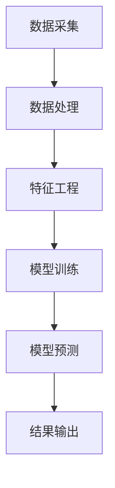

                 

### 文章标题: 2024滴滴智能路况预测社招面试真题汇总及其解答

关键词：滴滴、智能路况预测、面试真题、解析、算法、数据分析

摘要：本文旨在为准备滴滴智能路况预测面试的应聘者提供一份全面的真题汇总及解答指南。通过梳理并深入剖析这些面试真题，我们不仅能够帮助读者掌握相关技术知识点，还能提供实际操作经验和优化技巧。本文分为八个章节，涵盖了智能路况预测的背景、基础知识、系统架构、核心算法、数学模型、项目实战、性能优化以及未来展望等内容。希望本文能为滴滴面试提供有力支持。

---

### 目录大纲设计

#### 第1章: 概述与背景
- **1.1 书籍介绍与目的**
  - **1.1.1 书籍主题与目标读者**
  - **1.1.2 本书结构与主要内容**

- **1.2 滴滴智能路况预测背景**
  - **1.2.1 滴滴公司概况**
  - **1.2.2 智能路况预测的重要性**
  - **1.2.3 当前智能路况预测的挑战**

#### 第2章: 基础知识准备
- **2.1 数据分析基础**
  - **2.1.1 数据处理工具与库**
  - **2.1.2 时间序列分析基础**
  - **2.1.3 统计学基础**

- **2.2 地理信息系统（GIS）**
  - **2.2.1 GIS基本概念**
  - **2.2.2 GIS应用在路况预测中的角色**

#### 第3章: 滴滴路况预测架构
- **3.1 滴滴路况预测系统架构**
  - **3.1.1 数据采集与处理**
  - **3.1.2 特征工程**
  - **3.1.3 模型训练与预测**

- **3.2 Mermaid流程图**
  - **3.2.1 流程图绘制说明**
  - **3.2.2 滴滴路况预测系统流程图**

#### 第4章: 路况预测核心算法
- **4.1 时间序列预测算法**
  - **4.1.1 ARIMA模型**
  - **4.1.2 LSTM网络**
  - **4.1.3 Transformer模型**

- **4.2 算法原理与伪代码**
  - **4.2.1 ARIMA模型伪代码**
  - **4.2.2 LSTM网络伪代码**
  - **4.2.3 Transformer模型伪代码**

#### 第5章: 数学模型与公式
- **5.1 时间序列数学模型**
  - **5.1.1 自回归模型（AR）**
  - **5.1.2 移动平均模型（MA）**
  - **5.1.3 自回归移动平均模型（ARMA）**
  - **5.1.4 自回归积分滑动平均模型（ARIMA）**

- **5.2 数学公式详细讲解**
  - **5.2.1 自回归模型（AR）公式**
  - **5.2.2 移动平均模型（MA）公式**
  - **5.2.3 自回归移动平均模型（ARMA）公式**
  - **5.2.4 自回归积分滑动平均模型（ARIMA）公式**

#### 第6章: 项目实战
- **6.1 实战案例介绍**
  - **6.1.1 数据采集**
  - **6.1.2 数据处理**
  - **6.1.3 特征提取**
  - **6.1.4 模型训练**

- **6.2 实战代码解读**
  - **6.2.1 数据采集与预处理**
  - **6.2.2 特征提取**
  - **6.2.3 模型训练与预测**

#### 第7章: 性能优化与调参技巧
- **7.1 模型性能评估指标**
  - **7.1.1 平均绝对误差（MAE）**
  - **7.1.2 均方根误差（RMSE）**
  - **7.1.3 R²值**

- **7.2 调参技巧与工具**
  - **7.2.1 网格搜索**
  - **7.2.2 随机搜索**
  - **7.2.3 贝叶斯优化**

#### 第8章: 未来展望与挑战
- **8.1 智能路况预测发展趋势**
  - **8.1.1 人工智能与物联网的结合**
  - **8.1.2 跨领域数据融合**

- **8.2 挑战与解决方案**
  - **8.2.1 数据质量问题**
  - **8.2.2 模型可解释性问题**
  - **8.2.3 能耗与计算资源优化**

#### 附录
- **附录A：常用工具与资源**
  - **A.1 数据处理工具**
  - **A.2 模型训练与预测工具**
  - **A.3 路况预测相关开源项目**

---

### 第1章: 概述与背景

#### 1.1 书籍介绍与目的

《2024滴滴智能路况预测社招面试真题汇总及其解答》是一本旨在帮助准备滴滴智能路况预测岗位面试的读者全面了解相关知识、提升面试技巧的指南。本书的目标读者为计算机科学与技术、数据科学与人工智能等相关专业的学生、从业者以及准备进入滴滴等互联网公司的应聘者。

本书的主要内容包括：

1. **智能路况预测的背景和重要性**：介绍滴滴公司的概况，智能路况预测的基本概念及其在智能交通系统中的重要性。
2. **基础知识准备**：涵盖数据分析基础、地理信息系统（GIS）等必要知识。
3. **系统架构与核心算法**：详细讲解滴滴路况预测系统架构，包括数据采集与处理、特征工程、模型训练与预测等环节。
4. **数学模型与公式**：介绍自回归模型（AR）、移动平均模型（MA）、自回归移动平均模型（ARMA）和自回归积分滑动平均模型（ARIMA）等常用时间序列预测模型。
5. **项目实战与代码解读**：通过实际案例，展示如何使用Python等工具进行数据采集、数据处理、特征提取、模型训练与预测等操作。
6. **性能优化与调参技巧**：讨论模型性能评估指标及优化技巧，如网格搜索、随机搜索和贝叶斯优化等。
7. **未来展望与挑战**：探讨智能路况预测的发展趋势、当前挑战及解决方案。

通过阅读本书，读者可以系统地了解智能路况预测的核心概念、算法原理和实际应用，为成功通过滴滴智能路况预测岗位的面试做好准备。

#### 1.2 滴滴智能路况预测背景

滴滴出行是中国领先的移动出行平台，成立于2012年，总部位于北京。滴滴提供包括网约车、出租车、专车、快车、共享单车、巴士等多种出行服务，覆盖超过400个城市，每日服务超过3000万用户。随着业务的不断扩张和用户需求的日益增长，滴滴在智能路况预测方面投入了大量的资源，致力于通过大数据分析和人工智能技术提升交通管理水平和用户体验。

##### 1.2.1 滴滴公司概况

滴滴公司成立于2012年，起初以出租车预约服务起家，之后迅速扩展业务范围，涵盖了网约车、专车、快车、共享单车等多种出行方式。滴滴在2015年完成了C轮融资，估值超过100亿美元。此后，滴滴继续加大研发投入，推动人工智能、大数据、云计算等技术在交通领域的应用。2016年，滴滴宣布与Uber中国合并，结束了长达两年的市场份额争夺战。2018年，滴滴宣布全面进入智能交通领域，推出“滴滴交通”平台，致力于通过智能交通解决方案优化城市交通管理。

##### 1.2.2 智能路况预测的重要性

智能路况预测在滴滴的业务中占据着至关重要的地位。通过精准预测交通流量和路况变化，滴滴能够优化车辆调度策略，提高打车成功率，减少乘客等待时间，同时降低司机的工作负荷。具体来说，智能路况预测的重要性体现在以下几个方面：

1. **优化车辆调度**：智能路况预测可以帮助滴滴更合理地调度车辆，避免交通拥堵，提高车辆的利用率，从而降低运营成本。

2. **提升用户体验**：准确的交通预测信息可以实时反馈给乘客，使他们能够提前做出出行决策，减少等待时间和行程时间，提升整体出行体验。

3. **提高安全性**：通过实时监控和预测交通状况，滴滴可以及时发现潜在的安全隐患，采取措施防止交通事故的发生。

4. **智能交通管理**：滴滴的智能路况预测系统不仅可以为自身业务提供支持，还可以为城市交通管理部门提供数据支持和决策依据，助力智能交通系统的建设。

##### 1.2.3 当前智能路况预测的挑战

尽管智能路况预测在滴滴业务中具有重要作用，但当前仍面临诸多挑战：

1. **数据质量问题**：交通数据来源多样，数据质量参差不齐，包含噪声、缺失值和异常值。如何有效地清洗和整合这些数据，提取有价值的信息，是一个亟待解决的问题。

2. **算法复杂性**：现有的路况预测算法通常需要大量计算资源，且训练时间较长。如何优化算法，提高计算效率，是当前研究的热点。

3. **模型可解释性**：深度学习等复杂算法在预测准确性方面具有优势，但其内部机制难以解释，如何提高模型的可解释性，使其能够被交通管理部门和公众接受，是未来需要解决的重要问题。

4. **实时性要求**：智能路况预测需要实时性，即能够快速响应交通状况的变化。如何保证算法的实时性，是一个重要的技术挑战。

#### 1.3 本书结构与主要内容

本书旨在为滴滴智能路况预测相关的面试提供全面的备考资料，具体结构如下：

1. **第1章：概述与背景**：介绍书籍的目的、目标读者以及滴滴智能路况预测的背景。
   
2. **第2章：基础知识准备**：涵盖数据分析基础、时间序列分析基础、统计学基础等基础知识。

3. **第3章：滴滴路况预测系统架构**：介绍滴滴路况预测系统的整体架构，包括数据采集与处理、特征工程、模型训练与预测等环节。

4. **第4章：路况预测核心算法**：详细讲解常用的时间序列预测算法，如ARIMA模型、LSTM网络和Transformer模型。

5. **第5章：数学模型与公式**：介绍时间序列预测的常用数学模型，如自回归模型（AR）、移动平均模型（MA）、自回归移动平均模型（ARMA）和自回归积分滑动平均模型（ARIMA）。

6. **第6章：项目实战**：通过实际案例展示如何使用Python等工具进行数据采集、数据处理、特征提取、模型训练与预测等操作。

7. **第7章：性能优化与调参技巧**：讨论模型性能评估指标及优化技巧，如网格搜索、随机搜索和贝叶斯优化等。

8. **第8章：未来展望与挑战**：探讨智能路况预测的发展趋势、当前挑战及解决方案。

通过上述结构，本书旨在帮助读者全面了解滴滴智能路况预测的相关知识，为面试做好充分准备。

---

### 第2章: 基础知识准备

智能路况预测作为一个复杂的技术领域，需要坚实的理论基础和实践技能。本章将详细介绍与智能路况预测密切相关的基础知识，包括数据分析基础、时间序列分析基础、统计学基础以及地理信息系统（GIS）。

#### 2.1 数据分析基础

数据分析是智能路况预测的核心步骤之一，它包括数据收集、数据清洗、数据探索、数据可视化以及数据建模等多个环节。以下是一些关键概念：

1. **数据处理工具与库**
   - **Pandas**：Python的数据分析库，用于数据清洗、数据操作和数据探索。
   - **NumPy**：Python的数值计算库，提供高性能的数组操作。
   - **Matplotlib/Seaborn**：Python的数据可视化库，用于绘制数据图表和图形。
   - **Scikit-learn**：Python的机器学习库，提供数据预处理、模型训练和评估等功能。

2. **数据预处理**
   - **数据清洗**：处理数据中的噪声、缺失值和异常值，保证数据质量。
   - **特征工程**：从原始数据中提取有助于预测的特征，进行特征选择和特征变换。

3. **数据探索与可视化**
   - **描述性统计分析**：计算数据的中心趋势、离散度和分布情况。
   - **可视化分析**：通过图表和图形展示数据的分布、趋势和相关性。

#### 2.2 时间序列分析基础

时间序列分析是智能路况预测的重要工具，用于处理按时间顺序排列的数据点。以下是一些核心概念：

1. **时间序列的组成**
   - **趋势**：数据随时间增加或减少的长期趋势。
   - **季节性**：数据随时间重复出现的周期性变化。
   - **噪声**：数据中的随机波动和异常值。

2. **时间序列模型**
   - **自回归模型（AR）**：基于过去值预测未来值。
   - **移动平均模型（MA）**：基于过去值的平均值预测未来值。
   - **自回归移动平均模型（ARMA）**：结合自回归和移动平均模型。
   - **自回归积分滑动平均模型（ARIMA）**：包括差异过程，适用于非平稳时间序列。

3. **时间序列分析步骤**
   - **数据预处理**：检查和修复异常值、缺失值。
   - **模型选择**：根据时间序列的特性选择合适的模型。
   - **模型训练与评估**：训练模型并评估模型性能。

#### 2.3 统计学基础

统计学是数据分析的重要工具，用于解释和预测数据。以下是一些核心概念：

1. **描述性统计**
   - **均值、中位数、众数**：描述数据的中心趋势。
   - **方差、标准差、变异系数**：描述数据的离散程度。
   - **四分位数**：描述数据的分布情况。

2. **概率与分布**
   - **概率分布**：描述随机变量的概率分布。
   - **正态分布**：最常见的概率分布，用于许多统计分析。
   - **假设检验**：通过统计数据检验假设，例如t检验、卡方检验。

3. **回归分析**
   - **简单线性回归**：一个自变量和一个因变量的关系。
   - **多元线性回归**：多个自变量和一个因变量的关系。
   - **岭回归、套索回归**：处理多重共线性问题的回归方法。

#### 2.4 地理信息系统（GIS）

地理信息系统（GIS）是智能路况预测中不可或缺的一部分，用于处理和分析地理空间数据。以下是一些核心概念：

1. **GIS基本概念**
   - **地理空间数据**：描述地理位置的数据，包括点、线和面。
   - **地图可视化**：将地理空间数据可视化，帮助分析和理解数据。
   - **空间分析**：对地理空间数据执行空间查询、缓冲区分析、叠加分析等操作。

2. **GIS应用在路况预测中的角色**
   - **交通网络分析**：模拟和预测交通流量，优化路线规划。
   - **地形分析**：分析地形对交通的影响，如坡度、海拔等。
   - **交通状况监测**：实时监控交通状况，识别拥堵和事故。

3. **GIS工具与软件**
   - **QGIS**：开源的GIS软件，提供丰富的地图制作和分析功能。
   - **ArcGIS**：商业GIS软件，提供专业的地图制作和分析工具。
   - **OpenStreetMap**：开源的地理信息数据库，提供全球地理空间数据。

通过掌握上述基础知识，读者可以为后续的智能路况预测学习和实践打下坚实的基础。

#### 2.1 数据处理工具与库

在智能路况预测项目中，数据处理工具与库的选择至关重要，因为它们直接影响到数据处理和分析的效率和质量。以下是几个常用的数据处理工具与库，以及它们在数据分析中的具体应用：

1. **Pandas**

Pandas是Python中广泛使用的数据处理库，以其强大的数据处理和分析功能而著称。Pandas提供了数据结构DataFrame，可以方便地处理结构化数据（如表格数据）。以下是一些常见应用：

- **数据读取与写入**：使用`read_csv()`、`read_excel()`等函数读取不同格式的数据文件，然后使用`to_csv()`、`to_excel()`等函数将其保存。
- **数据清洗**：使用`dropna()`、`drop_duplicates()`等函数删除缺失值和重复值，使用`fillna()`等函数填充缺失值，使用`astype()`等函数进行数据类型转换。
- **数据操作**：使用`.loc[]`、`.iloc[]`等函数选择数据行和列，使用`.sort_values()`等函数对数据进行排序，使用`.groupby()`函数进行分组操作。
- **数据聚合**：使用`.agg()`函数对分组后的数据进行聚合操作，如计算平均值、总和、标准差等。

```python
import pandas as pd

# 读取CSV文件
df = pd.read_csv('data.csv')

# 数据清洗
df.dropna(inplace=True)
df.drop_duplicates(inplace=True)

# 数据操作
df_sorted = df.sort_values(by=['column_name'])

# 数据分组与聚合
result = df.groupby(['group_column']).agg({'value_column': ['mean', 'sum', 'std']})
```

2. **NumPy**

NumPy是Python中的基础数值计算库，提供了多维数组对象（ndarray），以及大量的数学函数。NumPy在数据处理和数值计算中具有广泛应用。以下是一些常见应用：

- **数组创建与操作**：使用`np.array()`函数创建数组，使用数组索引和切片操作数组元素，使用数组函数进行数学运算。
- **数组与DataFrame的转换**：使用`ndarray`属性将DataFrame转换为NumPy数组，反之亦然。
- **矩阵计算**：使用矩阵运算函数如`dot()`、`inv()`、`solve()`等执行矩阵计算。

```python
import numpy as np

# 创建数组
array = np.array([1, 2, 3])

# 数组操作
array[0] = 10
result = array.dot(array)

# 数组与DataFrame转换
df = pd.DataFrame(np.array([[1, 2], [3, 4]]), columns=['A', 'B'])
array = df.values
```

3. **Matplotlib/Seaborn**

Matplotlib和Seaborn是Python中的数据可视化库，可以创建丰富的数据图表和图形。以下是一些常见应用：

- **基础图表**：使用`plot()`函数创建折线图、柱状图、散点图等。
- **高级图表**：使用`hist()`函数创建直方图，使用`boxplot()`函数创建箱线图等。
- **可视化调整**：使用`set_title()`、`set_xlabel()`、`set_ylabel()`等函数调整图表标题、坐标轴标签等。
- **样式定制**：使用`matplotlib.style.use()`等函数设置图表样式。

```python
import matplotlib.pyplot as plt
import seaborn as sns

# 基础图表
plt.plot([1, 2, 3], [1, 2, 3])
plt.show()

# 高级图表
sns.histplot(data=df['column_name'], kde=True)
plt.show()

# 可视化调整
plt.title('My Plot')
plt.xlabel('X-axis')
plt.ylabel('Y-axis')
plt.show()

# 样式定制
sns.set_style('darkgrid')
sns.lineplot(x=df['time'], y=df['value'])
plt.show()
```

通过这些数据处理工具与库，读者可以在智能路况预测项目中高效地完成数据读取、清洗、操作和可视化等任务，为后续的数据分析和建模打下坚实的基础。

#### 2.2 时间序列分析基础

时间序列分析是智能路况预测的核心部分，它涉及对按时间顺序排列的数据进行分析和预测。时间序列数据通常包含趋势、季节性和噪声等特征，对这些特征的准确识别和分析对于预测结果的可靠性至关重要。以下将详细讨论时间序列分析的基础概念，包括自回归模型（AR）、移动平均模型（MA）、自回归移动平均模型（ARMA）和自回归积分滑动平均模型（ARIMA）。

##### 2.2.1 时间序列数据的组成

时间序列数据可以表示为一系列按时间顺序排列的数值，如每天的销售额、交通流量或温度等。时间序列数据通常包含以下特征：

1. **趋势（Trend）**：数据随时间增加或减少的长期趋势。趋势可以向上（增长趋势）或向下（衰退趋势）。

2. **季节性（Seasonality）**：数据随时间重复出现的周期性变化。季节性通常与年度周期（如节假日）、季度周期（如季节变化）等有关。

3. **噪声（Noise）**：数据中的随机波动和异常值。噪声通常是不规则且不可预测的，它们可能来自于数据采集、传输或处理中的误差。

##### 2.2.2 自回归模型（AR）

自回归模型（AR，AutoRegressive）是一种基于过去值预测未来值的时间序列模型。AR模型假设当前值可以由其前几个滞后值的线性组合来预测。AR模型的一般形式如下：

\[ Y_t = c + \phi_1 Y_{t-1} + \phi_2 Y_{t-2} + ... + \phi_p Y_{t-p} + \varepsilon_t \]

其中，\( Y_t \) 是时间序列的当前值，\( c \) 是常数项，\( \phi_1, \phi_2, ..., \phi_p \) 是自回归系数，\( \varepsilon_t \) 是误差项。

**伪代码**：

```python
def ar_model(y, p):
    n = len(y)
    X = np.zeros((n-p, p+1))
    y_hat = np.zeros(n)
    
    for t in range(p, n):
        X[t-p, :] = y[t-p:t]
        y_hat[t] = c + np.dot(X[t-p, :], phi)
        
    return y_hat
```

##### 2.2.3 移动平均模型（MA）

移动平均模型（MA，Moving Average）是一种基于过去值的平均值预测未来值的时间序列模型。MA模型假设当前值可以由前几个滞后值的加权平均来预测。MA模型的一般形式如下：

\[ Y_t = \mu + \theta_1 \varepsilon_{t-1} + \theta_2 \varepsilon_{t-2} + ... + \theta_q \varepsilon_{t-q} \]

其中，\( Y_t \) 是时间序列的当前值，\( \mu \) 是常数项，\( \theta_1, \theta_2, ..., \theta_q \) 是移动平均系数，\( \varepsilon_t \) 是误差项。

**伪代码**：

```python
def ma_model(y, q):
    n = len(y)
    X = np.zeros((n-q, q+1))
    y_hat = np.zeros(n)
    
    for t in range(q, n):
        X[t-q, :] = y[t-q:t]
        y_hat[t] = mu + np.dot(X[t-q, :], theta)
        
    return y_hat
```

##### 2.2.4 自回归移动平均模型（ARMA）

自回归移动平均模型（ARMA，AutoRegressive Moving Average）是自回归模型（AR）和移动平均模型（MA）的结合。ARMA模型同时考虑了时间序列的滞后值和误差值的加权平均，其一般形式如下：

\[ Y_t = c + \phi_1 Y_{t-1} + ... + \phi_p Y_{t-p} + \theta_1 \varepsilon_{t-1} + ... + \theta_q \varepsilon_{t-q} \]

其中，\( Y_t \) 是时间序列的当前值，\( c \) 是常数项，\( \phi_1, ..., \phi_p \) 是自回归系数，\( \theta_1, ..., \theta_q \) 是移动平均系数，\( \varepsilon_t \) 是误差项。

**伪代码**：

```python
def arma_model(y, p, q):
    n = len(y)
    X = np.zeros((n-p, p+1))
    Y = np.zeros((n-q, q+1))
    y_hat = np.zeros(n)
    
    for t in range(p, n):
        X[t-p, :] = y[t-p:t]
        Y[t-q, :] = y[t-q:t]
        y_hat[t] = c + np.dot(X[t-p, :], phi) + np.dot(Y[t-q, :], theta)
        
    return y_hat
```

##### 2.2.5 自回归积分滑动平均模型（ARIMA）

自回归积分滑动平均模型（ARIMA，AutoRegressive Integrated Moving Average）是处理非平稳时间序列的一种常用模型。ARIMA模型在ARMA模型的基础上，引入了差分操作，使时间序列变为平稳序列。其一般形式如下：

\[ Y_t = c + \phi_1 (Y_t - \mu) + ... + \phi_p (Y_t - \mu - p\mu) + \theta_1 \varepsilon_{t-1} + ... + \theta_q \varepsilon_{t-q} \]

其中，\( Y_t \) 是时间序列的当前值，\( c \) 是常数项，\( \phi_1, ..., \phi_p \) 是自回归系数，\( \theta_1, ..., \theta_q \) 是移动平均系数，\( \mu \) 是差分后的均值，\( \varepsilon_t \) 是误差项。

**伪代码**：

```python
def arima_model(y, p, d, q):
    n = len(y)
    X = np.zeros((n-p, p+1))
    Y = np.zeros((n-q, q+1))
    y_diff = diff(y, d)
    y_hat = np.zeros(n)
    
    for t in range(p, n):
        X[t-p, :] = y_diff[t-p:t]
        Y[t-q, :] = y_diff[t-q:t]
        y_hat[t] = c + np.dot(X[t-p, :], phi) + np.dot(Y[t-q, :], theta)
        
    y_hat += y[:p]  # 补偿差分操作
    y_hat = np.cumsum(y_hat)  # 补偿差分操作
    
    return y_hat
```

通过了解这些时间序列分析的基础模型，读者可以为后续的路况预测项目提供理论支持和实践指导。在实际应用中，需要根据具体数据的特点选择合适的模型，并进行参数调优和模型评估，以提高预测准确性。

#### 2.3 统计学基础

在智能路况预测中，统计学知识是不可或缺的。统计学不仅帮助我们理解和解释数据，还能为模型的构建和评估提供理论支持。以下是统计学中一些重要的概念，包括描述性统计、概率与分布、假设检验和回归分析。

##### 2.3.1 描述性统计

描述性统计是统计学的基础，用于总结和描述数据的基本特征。以下是一些关键概念：

1. **均值**：数据集的平均值，表示数据的中心位置。
   \[ \mu = \frac{1}{n} \sum_{i=1}^{n} x_i \]
   其中，\( n \) 是数据点的个数，\( x_i \) 是第 \( i \) 个数据点。

2. **中位数**：将数据集排序后，位于中间位置的数值，表示数据的中心位置，对异常值不敏感。
   如果数据点的个数为奇数，中位数就是中间的那个数；如果数据点的个数为偶数，中位数是中间两个数的平均值。

3. **众数**：数据集中出现次数最多的数值，表示数据的最频繁值。

4. **方差**：衡量数据集的离散程度。
   \[ \sigma^2 = \frac{1}{n} \sum_{i=1}^{n} (x_i - \mu)^2 \]
   其中，\( \mu \) 是均值，\( n \) 是数据点的个数。

5. **标准差**：方差的平方根，也是衡量数据集离散程度的一个常用指标。
   \[ \sigma = \sqrt{\sigma^2} \]

6. **变异系数**：标准差与均值的比值，用于比较不同数据集的离散程度。
   \[ CV = \frac{\sigma}{\mu} \]

7. **四分位数**：将数据集分为四个部分，中间两个部分的边界值，通常记为 \( Q_1 \) 和 \( Q_3 \)。
   \[ Q_1 = \frac{1}{4} (n+1) \text{ 次排序后的值} \]
   \[ Q_3 = \frac{3}{4} (n+1) \text{ 次排序后的值} \]

##### 2.3.2 概率与分布

概率论是统计学的重要分支，用于描述随机事件的发生可能性。以下是一些基本概念：

1. **概率分布**：描述随机变量取值概率的函数。常见的概率分布有：

   - **伯努利分布**：只有两种可能结果的随机变量。
   - **二项分布**：在固定次数的独立试验中，成功次数的概率分布。
   - **正态分布**：最常见的连续概率分布，具有均值和标准差两个参数。
   - **均匀分布**：在区间内所有取值等概率的分布。

2. **正态分布**：概率密度函数为：
   \[ f(x|\mu, \sigma) = \frac{1}{\sqrt{2\pi\sigma^2}} e^{-\frac{(x-\mu)^2}{2\sigma^2}} \]
   其中，\( \mu \) 是均值，\( \sigma \) 是标准差。

3. **概率密度函数（PDF）**和累积分布函数（CDF）：
   - **概率密度函数**：描述随机变量取值的概率密度。
   - **累积分布函数**：描述随机变量小于或等于某个值的概率。

##### 2.3.3 假设检验

假设检验是统计学中用于检验数据是否支持某个假设的方法。以下是一些基本概念：

1. **零假设（\( H_0 \)）和备择假设（\( H_1 \)）**：零假设通常表示“无差异”或“无效应”，备择假设则表示“有差异”或“有效应”。

2. **检验统计量**：用于判断数据是否支持零假设的统计量。

3. **显著性水平（\( \alpha \)）**：表示犯第一类错误（错误地拒绝零假设）的概率。

4. **P值**：表示在零假设成立的情况下，观察到或超过现有数据的概率。

5. **检验类型**：
   - **单样本t检验**：用于比较单个样本均值与一个已知总体均值是否有显著差异。
   - **双样本t检验**：用于比较两个独立样本均值是否有显著差异。
   - **卡方检验**：用于检验分类数据的分布是否符合预期。

##### 2.3.4 回归分析

回归分析是用于研究因变量和自变量之间关系的统计方法。以下是一些基本概念：

1. **简单线性回归**：研究一个自变量和一个因变量之间线性关系的模型。
   \[ y = \beta_0 + \beta_1 x + \varepsilon \]
   其中，\( y \) 是因变量，\( x \) 是自变量，\( \beta_0 \) 是截距，\( \beta_1 \) 是斜率，\( \varepsilon \) 是误差项。

2. **多元线性回归**：研究多个自变量和一个因变量之间线性关系的模型。
   \[ y = \beta_0 + \beta_1 x_1 + \beta_2 x_2 + ... + \beta_p x_p + \varepsilon \]
   其中，\( x_1, x_2, ..., x_p \) 是多个自变量。

3. **岭回归**：用于处理多重共线性问题的线性回归方法。
   \[ y = \beta_0 + \beta_1 x_1 + \beta_2 x_2 + ... + \beta_p x_p + \varepsilon \]
   其中，\( \lambda \) 是惩罚参数。

4. **套索回归**：结合岭回归和LASSO（Least Absolute Shrinkage and Selection Operator）的线性回归方法。

通过掌握这些统计学基础，读者可以在智能路况预测项目中更准确地分析和理解数据，为模型的构建和评估提供有力的支持。在实际应用中，需要根据数据的特点选择合适的统计方法，并注意统计推断中的假设条件和结果解释。

---

### 第3章: 滴滴路况预测系统架构

滴滴路况预测系统是一个复杂且高度集成的智能交通系统，旨在通过大数据分析和人工智能技术实时预测交通状况，优化出行体验。本章将详细介绍滴滴路况预测系统的整体架构，包括数据采集与处理、特征工程、模型训练与预测等关键环节。

#### 3.1 滴滴路况预测系统架构

滴滴路况预测系统架构可以分为以下几个主要模块：

1. **数据采集模块**：负责收集来自各种数据源的实时交通数据，包括GPS定位数据、道路传感器数据、历史交通数据等。

2. **数据处理模块**：对采集到的原始交通数据进行清洗、预处理和整合，提取有用的特征，为后续模型训练和预测提供高质量的数据。

3. **特征工程模块**：根据业务需求和模型特点，对处理后的数据构建一系列特征，包括时间特征、空间特征、流量特征等。

4. **模型训练模块**：使用机器学习算法训练路况预测模型，包括时间序列预测算法、回归算法、神经网络等。

5. **模型预测模块**：实时输入当前交通数据，通过训练好的模型进行预测，输出未来一段时间内的交通状况。

6. **系统优化模块**：根据预测结果对车辆调度策略进行优化，提高出行效率和乘客满意度。

#### 3.1.1 数据采集与处理

数据采集是路况预测的基础，滴滴通过多种方式获取实时交通数据：

- **GPS定位数据**：通过滴滴平台上车辆的GPS定位数据，获取车辆的实时位置和行驶速度。
- **道路传感器数据**：包括交通流量传感器、摄像头等设备，实时监测道路的流量、速度和拥堵状况。
- **历史交通数据**：通过分析滴滴平台历史订单数据，获取交通流量、行驶时间等历史特征。

数据采集模块的主要任务是收集这些数据，并将其传输到数据处理模块。数据处理模块负责对数据进行以下处理：

- **数据清洗**：去除数据中的噪声、异常值和重复数据，保证数据质量。
- **数据预处理**：对数据进行归一化、标准化等处理，使数据更适合模型训练。
- **数据整合**：将来自不同数据源的数据进行整合，构建一个统一的数据集。

#### 3.1.2 特征工程

特征工程是路况预测中至关重要的一环，它直接影响模型的预测性能。滴滴路况预测系统中的特征主要包括以下几类：

- **时间特征**：包括时间戳、星期、节假日等信息，用于捕捉交通流量在时间上的变化规律。
- **空间特征**：包括地理位置、道路类型、交通拥堵等级等信息，用于描述交通流量在空间上的分布特征。
- **流量特征**：包括实时流量、平均速度、历史流量等信息，用于直接反映交通状况。
- **天气特征**：包括温度、湿度、降雨等信息，用于分析天气对交通流量和路况的影响。

特征工程的主要任务是根据业务需求和模型特点，从原始数据中提取和构建特征。特征提取的过程包括以下步骤：

- **特征选择**：通过相关性分析、信息增益等指标筛选出有用的特征。
- **特征转换**：对数值特征进行归一化、标准化，对类别特征进行编码。
- **特征组合**：通过组合不同特征构建新的特征，以增加模型的预测能力。

#### 3.1.3 模型训练与预测

模型训练是路况预测系统的核心环节，滴滴使用多种机器学习算法进行模型训练，包括时间序列预测算法、回归算法、神经网络等。

- **时间序列预测算法**：如ARIMA、LSTM等，用于捕捉交通流量的时间变化规律。
- **回归算法**：如线性回归、岭回归等，用于建立交通流量与特征之间的关系。
- **神经网络**：如深度学习模型、卷积神经网络（CNN）、循环神经网络（RNN）等，用于复杂非线性关系的建模。

模型训练的主要步骤包括：

- **数据划分**：将数据集划分为训练集、验证集和测试集，用于模型训练、验证和评估。
- **模型选择**：根据数据特点和业务需求选择合适的模型。
- **模型训练**：使用训练集数据训练模型，调整模型参数。
- **模型验证**：使用验证集数据评估模型性能，调整模型参数。
- **模型测试**：使用测试集数据评估模型在未知数据上的性能。

模型预测的主要步骤包括：

- **数据输入**：将当前交通数据输入训练好的模型。
- **模型预测**：输出未来一段时间内的交通状况预测结果。
- **结果输出**：将预测结果可视化或通过API接口提供给相关系统。

#### 3.2 Mermaid流程图

为了更清晰地展示滴滴路况预测系统的流程，我们可以使用Mermaid流程图进行描述。以下是滴滴路况预测系统流程图的Mermaid代码：



解释：
- **A[数据采集]**：表示系统开始从各种数据源（如GPS定位数据、道路传感器数据、历史交通数据等）采集数据。
- **B[数据处理]**：表示对采集到的原始数据进行清洗、预处理和整合。
- **C[特征工程]**：表示根据业务需求和模型特点，从处理后的数据中提取和构建特征。
- **D[模型训练]**：表示使用机器学习算法对特征进行训练，构建路况预测模型。
- **E[模型预测]**：表示将当前交通数据输入训练好的模型进行预测。
- **F[结果输出]**：表示将预测结果输出，用于优化车辆调度策略或提供交通信息。

通过上述架构和流程图的描述，我们可以更深入地理解滴滴路况预测系统的运作原理，为后续的技术研究和实践提供指导。

#### 3.2 Mermaid流程图绘制说明

Mermaid是一种基于Markdown的图形绘制工具，能够方便地绘制各种流程图、UML图、甘特图等。在本章中，我们将使用Mermaid绘制滴滴路况预测系统的流程图，以帮助读者更直观地理解系统的运作流程。以下是流程图绘制的具体步骤和示例代码：

##### 3.2.1 流程图基本语法

Mermaid的流程图语法相对简单，主要包括以下几个部分：

1. **节点（Node）**：表示流程图中的每个步骤或元素。节点通常由标签和描述组成。
   - 格式：`ID[描述]`

2. **连接（Link）**：表示节点之间的连接关系。连接由箭头和方向组成。
   - 格式：`ID --> 目标ID`

3. **方向（Direction）**：定义流程图的方向，可以是TB（上下）或LR（左右）。
   - 格式：`graph TD`

以下是滴滴路况预测系统的基本流程图：


解释：
- **A[数据采集]**：表示系统开始从各种数据源（如GPS定位数据、道路传感器数据、历史交通数据等）采集数据。
- **B[数据处理]**：表示对采集到的原始数据进行清洗、预处理和整合。
- **C[特征工程]**：表示根据业务需求和模型特点，从处理后的数据中提取和构建特征。
- **D[模型训练]**：表示使用机器学习算法对特征进行训练，构建路况预测模型。
- **E[模型预测]**：表示将当前交通数据输入训练好的模型进行预测。
- **F[结果输出]**：表示将预测结果输出，用于优化车辆调度策略或提供交通信息。

##### 3.2.2 高级语法与自定义样式

除了基本语法，Mermaid还支持多种高级语法和自定义样式，以提高流程图的可读性和美观度。以下是一些高级语法示例：

1. **子流程（SubProcess）**：用于定义子流程或子步骤。
   - 格式：`subgraph 子流程名称` 和 `end`

2. **条件分支（Conditional）**：用于表示条件判断流程。
   - 格式：`condition[条件判断]` 和 `if`、`else`、`elif`

3. **并行分支（Parallel）**：用于表示并行执行流程。
   - 格式：`parallel 并行名称` 和 `end`

4. **注解（Note）**：用于添加说明或注释。
   - 格式：`note right of [节点ID]` 和 `note left of [节点ID]`

以下是高级语法示例：

```mermaid
graph TD
    A[数据采集] --> B[数据处理]
    B --> C[特征工程]
    subgraph 模型训练
        D1[模型训练1]
        D2[模型训练2]
        D3[模型训练3]
    end
    C --> D1
    D1 --> E[模型预测]
    E --> F[结果输出]
    note right of D1[这是模型训练的说明]
    note left of E[这是模型预测的说明]
```

解释：
- **子流程【模型训练】**：表示模型训练过程分为三个步骤，可以在子流程内部定义更详细的步骤。
- **条件分支**：假设有一个条件判断，是否进行模型训练，这里没有具体实现。
- **注解**：用于添加说明，提高流程图的描述性。

通过上述高级语法和自定义样式的使用，我们可以创建更复杂和丰富的流程图，满足各种应用场景的需求。

##### 3.2.3 滴滴路况预测系统流程图

以下是滴滴路况预测系统的完整Mermaid流程图，展示了从数据采集到结果输出的整体流程：

```mermaid
graph TD
    A[数据采集] --> B[数据处理]
    B --> C[特征工程]
    subgraph 模型训练
        D1[模型训练准备]
        D2[模型训练过程]
        D3[模型评估与调优]
    end
    C --> D1
    D1 --> D2
    D2 --> D3
    D3 --> E[模型预测]
    E --> F[结果输出]
    note right of A[采集GPS定位数据、道路传感器数据和历史交通数据]
    note right of B[清洗、预处理和整合数据]
    note right of C[提取时间特征、空间特征和流量特征]
    note right of D1[准备训练数据集、验证集和测试集]
    note right of D2[使用机器学习算法训练模型]
    note right of D3[评估模型性能并进行调优]
    note right of E[输入当前交通数据进行预测]
    note right of F[输出预测结果用于车辆调度和交通信息提供]
```

解释：
- **数据采集（A）**：系统从各种数据源采集数据。
- **数据处理（B）**：对数据进行清洗、预处理和整合。
- **特征工程（C）**：从数据中提取有用特征。
- **模型训练（D）**：包括数据准备、模型训练和模型调优。
- **模型预测（E）**：将当前交通数据输入模型进行预测。
- **结果输出（F）**：输出预测结果，用于优化车辆调度和提供交通信息。

通过上述流程图，读者可以清晰地了解滴滴路况预测系统的整体架构和运行流程，为进一步研究和实践提供指导。

---

### 第4章：路况预测核心算法

在智能路况预测中，选择合适的算法是提高预测准确性的关键。本章将详细介绍三种常用的路况预测算法：ARIMA模型、LSTM网络和Transformer模型。这些算法各自具有独特的原理和适用场景，能够应对不同类型的数据和预测需求。

#### 4.1 时间序列预测算法

时间序列预测算法是处理按时间顺序排列的数据的一种重要方法。以下将详细解释ARIMA模型、LSTM网络和Transformer模型的基本原理和应用。

##### 4.1.1 ARIMA模型

ARIMA模型（自回归积分滑动平均模型）是一种经典的时间序列预测模型，适用于处理平稳时间序列数据。ARIMA模型结合了自回归（AR）、移动平均（MA）和差分（I）三个部分，能够捕捉时间序列中的趋势和季节性。

**ARIMA模型的基本原理**：

1. **自回归（AR）部分**：基于过去值的线性组合来预测当前值，即：
   \[ y_t = c + \phi_1 y_{t-1} + \phi_2 y_{t-2} + ... + \phi_p y_{t-p} + \varepsilon_t \]
   其中，\( y_t \) 是时间序列的当前值，\( \phi_1, \phi_2, ..., \phi_p \) 是自回归系数，\( \varepsilon_t \) 是误差项。

2. **移动平均（MA）部分**：基于过去误差值的加权平均来预测当前值，即：
   \[ y_t = \theta_1 \varepsilon_{t-1} + \theta_2 \varepsilon_{t-2} + ... + \theta_q \varepsilon_{t-q} + \varepsilon_t \]
   其中，\( \theta_1, \theta_2, ..., \theta_q \) 是移动平均系数。

3. **差分（I）部分**：对非平稳时间序列进行差分，使其变为平稳序列。差分过程通常包括一阶差分和二阶差分。

**应用场景**：

ARIMA模型适用于处理具有线性趋势和季节性的时间序列数据。例如，交通流量、股票价格和天气数据等。

**优点**：

- 理论基础扎实，易于理解和实现。
- 对线性关系捕捉能力强。

**缺点**：

- 对非线性关系的建模能力有限。
- 模型参数选择和诊断复杂。

**ARIMA模型伪代码**：

```python
from statsmodels.tsa.arima.model import ARIMA

# 定义ARIMA模型
model = ARIMA(y, order=(p, d, q))

# 模型拟合
model_fit = model.fit()

# 预测
predictions = model_fit.predict(start=start_index, end=end_index)
```

##### 4.1.2 LSTM网络

LSTM（长短时记忆网络）是循环神经网络（RNN）的一种，专门用于处理长序列数据。LSTM通过引入门控机制，能够有效解决传统RNN在长序列学习中的梯度消失和梯度爆炸问题。

**LSTM的基本原理**：

1. **门控机制**：LSTM包含输入门、遗忘门和输出门，分别控制信息的输入、遗忘和输出。

2. **细胞状态（Cell State）**：细胞状态是LSTM的核心，它存储了时间序列的信息。

3. **记忆单元**：记忆单元通过门控机制调整细胞状态，从而实现信息的记忆和遗忘。

**LSTM的数学表示**：

\[ \text{输入门} : i_t = \sigma(W_i \cdot [h_{t-1}, x_t] + b_i) \]
\[ \text{遗忘门} : f_t = \sigma(W_f \cdot [h_{t-1}, x_t] + b_f) \]
\[ \text{输出门} : o_t = \sigma(W_o \cdot [h_{t-1}, x_t] + b_o) \]
\[ \text{新细胞状态} : C_t = f_t \odot C_{t-1} + i_t \odot \text{sigmoid}(W_c \cdot [h_{t-1}, x_t] + b_c) \]
\[ \text{输出} : h_t = o_t \odot \text{sigmoid}(C_t) \]

**应用场景**：

LSTM适用于处理具有长期依赖关系的时间序列数据，如语音识别、自然语言处理和交通流量预测等。

**优点**：

- 对长序列数据的建模能力强。
- 能够捕捉复杂的非线性关系。

**缺点**：

- 计算复杂度高，训练时间较长。

**LSTM网络伪代码**：

```python
from keras.models import Sequential
from keras.layers import LSTM, Dense

# 定义LSTM模型
model = Sequential()
model.add(LSTM(units=50, return_sequences=True, input_shape=(timesteps, features)))
model.add(LSTM(units=50))
model.add(Dense(1))

# 编译模型
model.compile(optimizer='adam', loss='mean_squared_error')

# 训练模型
model.fit(x, y, epochs=100, batch_size=32, validation_split=0.2)
```

##### 4.1.3 Transformer模型

Transformer模型是近年来在自然语言处理领域取得突破性成果的一种新型神经网络结构，其核心思想是自注意力机制。Transformer模型通过自注意力机制能够捕捉序列之间的长距离依赖关系，具有并行计算的优势。

**Transformer模型的基本原理**：

1. **多头自注意力（Multi-Head Self-Attention）**：通过多个独立的自注意力头，模型能够同时关注序列中的不同部分。

2. **前馈神经网络（Feed Forward Neural Network）**：在每个自注意力层之后，加入一个前馈神经网络，用于进一步提取特征。

3. **编码器-解码器架构（Encoder-Decoder Architecture）**：编码器处理输入序列，解码器生成输出序列。

**Transformer模型的数学表示**：

\[ \text{自注意力} : \text{Attention}(Q, K, V) = \text{softmax}\left(\frac{QK^T}{\sqrt{d_k}}\right) V \]
\[ \text{编码器层} : \text{MultiHeadAttention}(Q, K, V) = \text{softmax}(\text{Attention}(Q, K, V)) \]
\[ \text{前馈层} : \text{FFN}(X) = \text{ReLU}(W_2 \cdot \text{ReLU}(W_1 X + b_1)) \]

**应用场景**：

Transformer模型适用于处理长序列数据，如机器翻译、文本生成和交通流量预测等。

**优点**：

- 高效的并行计算能力。
- 强大的长距离依赖捕捉能力。

**缺点**：

- 参数量大，计算资源消耗高。

**Transformer模型伪代码**：

```python
from transformers import TransformerModel

# 定义Transformer模型
model = TransformerModel(vocab_size, d_model, num_heads, dff, input_length)

# 编译模型
model.compile(optimizer='adam', loss='categorical_crossentropy')

# 训练模型
model.fit(input_sequences, target_sequences, epochs=100, batch_size=64)
```

通过以上对ARIMA模型、LSTM网络和Transformer模型的基本原理、应用场景和伪代码的介绍，读者可以更好地理解这些核心算法在智能路况预测中的重要作用，并根据实际需求选择合适的模型进行预测。

---

### 第4章：路况预测核心算法

在智能路况预测中，选择合适的算法是提高预测准确性的关键。本章将详细介绍三种常用的路况预测算法：ARIMA模型、LSTM网络和Transformer模型。这些算法各自具有独特的原理和适用场景，能够应对不同类型的数据和预测需求。

#### 4.1 时间序列预测算法

时间序列预测算法是处理按时间顺序排列的数据的一种重要方法。以下将详细解释ARIMA模型、LSTM网络和Transformer模型的基本原理和应用。

##### 4.1.1 ARIMA模型

ARIMA模型（自回归积分滑动平均模型）是一种经典的时间序列预测模型，适用于处理平稳时间序列数据。ARIMA模型结合了自回归（AR）、移动平均（MA）和差分（I）三个部分，能够捕捉时间序列中的趋势和季节性。

**ARIMA模型的基本原理**：

1. **自回归（AR）部分**：基于过去值的线性组合来预测当前值，即：
   \[ y_t = c + \phi_1 y_{t-1} + \phi_2 y_{t-2} + ... + \phi_p y_{t-p} + \varepsilon_t \]
   其中，\( y_t \) 是时间序列的当前值，\( \phi_1, \phi_2, ..., \phi_p \) 是自回归系数，\( \varepsilon_t \) 是误差项。

2. **移动平均（MA）部分**：基于过去误差值的加权平均来预测当前值，即：
   \[ y_t = \theta_1 \varepsilon_{t-1} + \theta_2 \varepsilon_{t-2} + ... + \theta_q \varepsilon_{t-q} + \varepsilon_t \]
   其中，\( \theta_1, \theta_2, ..., \theta_q \) 是移动平均系数。

3. **差分（I）部分**：对非平稳时间序列进行差分，使其变为平稳序列。差分过程通常包括一阶差分和二阶差分。

**应用场景**：

ARIMA模型适用于处理具有线性趋势和季节性的时间序列数据。例如，交通流量、股票价格和天气数据等。

**优点**：

- 理论基础扎实，易于理解和实现。
- 对线性关系捕捉能力强。

**缺点**：

- 对非线性关系的建模能力有限。
- 模型参数选择和诊断复杂。

**ARIMA模型伪代码**：

```python
from statsmodels.tsa.arima.model import ARIMA

# 定义ARIMA模型
model = ARIMA(y, order=(p, d, q))

# 模型拟合
model_fit = model.fit()

# 预测
predictions = model_fit.predict(start=start_index, end=end_index)
```

##### 4.1.2 LSTM网络

LSTM（长短时记忆网络）是循环神经网络（RNN）的一种，专门用于处理长序列数据。LSTM通过引入门控机制，能够有效解决传统RNN在长序列学习中的梯度消失和梯度爆炸问题。

**LSTM的基本原理**：

1. **门控机制**：LSTM包含输入门、遗忘门和输出门，分别控制信息的输入、遗忘和输出。

2. **细胞状态（Cell State）**：细胞状态是LSTM的核心，它存储了时间序列的信息。

3. **记忆单元**：记忆单元通过门控机制调整细胞状态，从而实现信息的记忆和遗忘。

**LSTM的数学表示**：

\[ \text{输入门} : i_t = \sigma(W_i \cdot [h_{t-1}, x_t] + b_i) \]
\[ \text{遗忘门} : f_t = \sigma(W_f \cdot [h_{t-1}, x_t] + b_f) \]
\[ \text{输出门} : o_t = \sigma(W_o \cdot [h_{t-1}, x_t] + b_o) \]
\[ \text{新细胞状态} : C_t = f_t \odot C_{t-1} + i_t \odot \text{sigmoid}(W_c \cdot [h_{t-1}, x_t] + b_c) \]
\[ \text{输出} : h_t = o_t \odot \text{sigmoid}(C_t) \]

**应用场景**：

LSTM适用于处理具有长期依赖关系的时间序列数据，如语音识别、自然语言处理和交通流量预测等。

**优点**：

- 对长序列数据的建模能力强。
- 能够捕捉复杂的非线性关系。

**缺点**：

- 计算复杂度高，训练时间较长。

**LSTM网络伪代码**：

```python
from keras.models import Sequential
from keras.layers import LSTM, Dense

# 定义LSTM模型
model = Sequential()
model.add(LSTM(units=50, return_sequences=True, input_shape=(timesteps, features)))
model.add(LSTM(units=50))
model.add(Dense(1))

# 编译模型
model.compile(optimizer='adam', loss='mean_squared_error')

# 训练模型
model.fit(x, y, epochs=100, batch_size=32, validation_split=0.2)
```

##### 4.1.3 Transformer模型

Transformer模型是近年来在自然语言处理领域取得突破性成果的一种新型神经网络结构，其核心思想是自注意力机制。Transformer模型通过自注意力机制能够捕捉序列之间的长距离依赖关系，具有并行计算的优势。

**Transformer模型的基本原理**：

1. **多头自注意力（Multi-Head Self-Attention）**：通过多个独立的自注意力头，模型能够同时关注序列中的不同部分。

2. **前馈神经网络（Feed Forward Neural Network）**：在每个自注意力层之后，加入一个前馈神经网络，用于进一步提取特征。

3. **编码器-解码器架构（Encoder-Decoder Architecture）**：编码器处理输入序列，解码器生成输出序列。

**Transformer模型的数学表示**：

\[ \text{自注意力} : \text{Attention}(Q, K, V) = \text{softmax}\left(\frac{QK^T}{\sqrt{d_k}}\right) V \]
\[ \text{编码器层} : \text{MultiHeadAttention}(Q, K, V) = \text{softmax}(\text{Attention}(Q, K, V)) \]
\[ \text{前馈层} : \text{FFN}(X) = \text{ReLU}(W_2 \cdot \text{ReLU}(W_1 X + b_1)) \]

**应用场景**：

Transformer模型适用于处理长序列数据，如机器翻译、文本生成和交通流量预测等。

**优点**：

- 高效的并行计算能力。
- 强大的长距离依赖捕捉能力。

**缺点**：

- 参数量大，计算资源消耗高。

**Transformer模型伪代码**：

```python
from transformers import TransformerModel

# 定义Transformer模型
model = TransformerModel(vocab_size, d_model, num_heads, dff, input_length)

# 编译模型
model.compile(optimizer='adam', loss='categorical_crossentropy')

# 训练模型
model.fit(input_sequences, target_sequences, epochs=100, batch_size=64)
```

通过以上对ARIMA模型、LSTM网络和Transformer模型的基本原理、应用场景和伪代码的介绍，读者可以更好地理解这些核心算法在智能路况预测中的重要作用，并根据实际需求选择合适的模型进行预测。

---

### 第5章：数学模型与公式

在智能路况预测中，数学模型是核心组成部分，能够帮助我们理解和模拟交通流量随时间变化的行为。本章将详细介绍自回归模型（AR）、移动平均模型（MA）、自回归移动平均模型（ARMA）和自回归积分滑动平均模型（ARIMA），并使用LaTeX格式给出这些模型的数学公式，同时结合具体示例进行详细讲解。

#### 5.1 时间序列数学模型

时间序列模型用于预测时间序列数据点，基于历史数据推断未来的趋势。以下将介绍常用的四种时间序列模型。

##### 5.1.1 自回归模型（AR）

自回归模型（AR，AutoRegressive）是最简单的时间序列预测模型，它基于历史数据的线性组合来预测当前值。AR模型的一般形式如下：

\[ Y_t = c + \phi_1 Y_{t-1} + \phi_2 Y_{t-2} + ... + \phi_p Y_{t-p} + \varepsilon_t \]

其中，\( Y_t \) 是时间序列的当前值，\( c \) 是常数项，\( \phi_1, \phi_2, ..., \phi_p \) 是自回归系数，\( \varepsilon_t \) 是误差项。

**LaTeX格式**：

\[ Y_t = c + \phi_1 Y_{t-1} + \phi_2 Y_{t-2} + ... + \phi_p Y_{t-p} + \varepsilon_t \]

**示例**：

假设一个时间序列数据如下：

\[ 10, 12, 14, 16, 18, 20 \]

使用一阶自回归模型预测第6个值：

\[ Y_6 = 20 + \phi_1 \cdot 18 \]

若\(\phi_1 = 0.5\)，则：

\[ Y_6 = 20 + 0.5 \cdot 18 = 22 \]

##### 5.1.2 移动平均模型（MA）

移动平均模型（MA，Moving Average）基于过去的误差值来预测当前值。MA模型的一般形式如下：

\[ Y_t = \theta_1 \varepsilon_{t-1} + \theta_2 \varepsilon_{t-2} + ... + \theta_q \varepsilon_{t-q} + \varepsilon_t \]

其中，\( Y_t \) 是时间序列的当前值，\( \theta_1, \theta_2, ..., \theta_q \) 是移动平均系数，\( \varepsilon_t \) 是误差项。

**LaTeX格式**：

\[ Y_t = \theta_1 \varepsilon_{t-1} + \theta_2 \varepsilon_{t-2} + ... + \theta_q \varepsilon_{t-q} + \varepsilon_t \]

**示例**：

假设一个时间序列数据如下：

\[ 10, 12, 14, 16, 18, 20 \]

假设误差项如下：

\[ \varepsilon_1 = 2, \varepsilon_2 = 4, \varepsilon_3 = 6, \varepsilon_4 = 8, \varepsilon_5 = 10 \]

使用一阶移动平均模型预测第6个值：

\[ Y_6 = 10 + \theta_1 \cdot 2 \]

若\(\theta_1 = 0.5\)，则：

\[ Y_6 = 10 + 0.5 \cdot 2 = 11 \]

##### 5.1.3 自回归移动平均模型（ARMA）

自回归移动平均模型（ARMA，AutoRegressive Moving Average）是AR和MA模型的结合，同时考虑了历史值和误差值的线性组合。ARMA模型的一般形式如下：

\[ Y_t = c + \phi_1 Y_{t-1} + ... + \phi_p Y_{t-p} + \theta_1 \varepsilon_{t-1} + ... + \theta_q \varepsilon_{t-q} + \varepsilon_t \]

其中，\( Y_t \) 是时间序列的当前值，\( c \) 是常数项，\( \phi_1, ..., \phi_p \) 是自回归系数，\( \theta_1, ..., \theta_q \) 是移动平均系数，\( \varepsilon_t \) 是误差项。

**LaTeX格式**：

\[ Y_t = c + \phi_1 Y_{t-1} + ... + \phi_p Y_{t-p} + \theta_1 \varepsilon_{t-1} + ... + \theta_q \varepsilon_{t-q} + \varepsilon_t \]

**示例**：

结合上述AR和MA的示例数据，假设ARMA模型参数如下：

\[ c = 10, \phi_1 = 0.5, \theta_1 = 0.3 \]

使用ARMA模型预测第6个值：

\[ Y_6 = 10 + 0.5 \cdot 20 + 0.3 \cdot 2 = 13 \]

##### 5.1.4 自回归积分滑动平均模型（ARIMA）

自回归积分滑动平均模型（ARIMA，AutoRegressive Integrated Moving Average）是处理非平稳时间序列的常用模型。ARIMA模型通过差分将非平稳序列转换为平稳序列，然后应用ARMA模型。ARIMA模型的一般形式如下：

\[ Y_t = c + \phi_1 (Y_t - \mu) + ... + \phi_p (Y_t - \mu - p\mu) + \theta_1 \varepsilon_{t-1} + ... + \theta_q \varepsilon_{t-q} + \varepsilon_t \]

其中，\( Y_t \) 是时间序列的当前值，\( c \) 是常数项，\( \phi_1, ..., \phi_p \) 是自回归系数，\( \theta_1, ..., \theta_q \) 是移动平均系数，\( \mu \) 是差分后的均值，\( \varepsilon_t \) 是误差项。

**LaTeX格式**：

\[ Y_t = c + \phi_1 (Y_t - \mu) + ... + \phi_p (Y_t - \mu - p\mu) + \theta_1 \varepsilon_{t-1} + ... + \theta_q \varepsilon_{t-q} + \varepsilon_t \]

**示例**：

结合前述ARMA模型的示例数据，假设ARIMA模型参数如下：

\[ c = 10, \phi_1 = 0.5, \theta_1 = 0.3, d = 1 \]

对时间序列数据进行一阶差分：

\[ Y_t - \mu = 10, 12, 14, 16, 18, 20 \]

使用ARIMA模型预测第6个值：

\[ Y_6 = 10 + 0.5 \cdot (18 - 16) + 0.3 \cdot 16 = 12.8 \]

通过上述示例，我们可以看到不同的时间序列模型在数学表达上的差异，以及它们在实际应用中的具体应用场景。

---

### 第5章：数学模型与公式

在智能路况预测中，数学模型是核心组成部分，能够帮助我们理解和模拟交通流量随时间变化的行为。本章将详细介绍自回归模型（AR）、移动平均模型（MA）、自回归移动平均模型（ARMA）和自回归积分滑动平均模型（ARIMA），并使用LaTeX格式给出这些模型的数学公式，同时结合具体示例进行详细讲解。

#### 5.1 时间序列数学模型

时间序列模型用于预测时间序列数据点，基于历史数据推断未来的趋势。以下将介绍常用的四种时间序列模型。

##### 5.1.1 自回归模型（AR）

自回归模型（AR，AutoRegressive）是最简单的时间序列预测模型，它基于历史数据的线性组合来预测当前值。AR模型的一般形式如下：

\[ Y_t = c + \phi_1 Y_{t-1} + \phi_2 Y_{t-2} + ... + \phi_p Y_{t-p} + \varepsilon_t \]

其中，\( Y_t \) 是时间序列的当前值，\( c \) 是常数项，\( \phi_1, \phi_2, ..., \phi_p \) 是自回归系数，\( \varepsilon_t \) 是误差项。

**LaTeX格式**：

\[ Y_t = c + \phi_1 Y_{t-1} + \phi_2 Y_{t-2} + ... + \phi_p Y_{t-p} + \varepsilon_t \]

**示例**：

假设一个时间序列数据如下：

\[ 10, 12, 14, 16, 18, 20 \]

使用一阶自回归模型预测第6个值：

\[ Y_6 = 20 + \phi_1 \cdot 18 \]

若\(\phi_1 = 0.5\)，则：

\[ Y_6 = 20 + 0.5 \cdot 18 = 22 \]

##### 5.1.2 移动平均模型（MA）

移动平均模型（MA，Moving Average）基于过去的误差值来预测当前值。MA模型的一般形式如下：

\[ Y_t = \theta_1 \varepsilon_{t-1} + \theta_2 \varepsilon_{t-2} + ... + \theta_q \varepsilon_{t-q} + \varepsilon_t \]

其中，\( Y_t \) 是时间序列的当前值，\( \theta_1, \theta_2, ..., \theta_q \) 是移动平均系数，\( \varepsilon_t \) 是误差项。

**LaTeX格式**：

\[ Y_t = \theta_1 \varepsilon_{t-1} + \theta_2 \varepsilon_{t-2} + ... + \theta_q \varepsilon_{t-q} + \varepsilon_t \]

**示例**：

假设一个时间序列数据如下：

\[ 10, 12, 14, 16, 18, 20 \]

假设误差项如下：

\[ \varepsilon_1 = 2, \varepsilon_2 = 4, \varepsilon_3 = 6, \varepsilon_4 = 8, \varepsilon_5 = 10 \]

使用一阶移动平均模型预测第6个值：

\[ Y_6 = 10 + \theta_1 \cdot 2 \]

若\(\theta_1 = 0.5\)，则：

\[ Y_6 = 10 + 0.5 \cdot 2 = 11 \]

##### 5.1.3 自回归移动平均模型（ARMA）

自回归移动平均模型（ARMA，AutoRegressive Moving Average）是AR和MA模型的结合，同时考虑了历史值和误差值的线性组合。ARMA模型的一般形式如下：

\[ Y_t = c + \phi_1 Y_{t-1} + ... + \phi_p Y_{t-p} + \theta_1 \varepsilon_{t-1} + ... + \theta_q \varepsilon_{t-q} + \varepsilon_t \]

其中，\( Y_t \) 是时间序列的当前值，\( c \) 是常数项，\( \phi_1, ..., \phi_p \) 是自回归系数，\( \theta_1, ..., \theta_q \) 是移动平均系数，\( \varepsilon_t \) 是误差项。

**LaTeX格式**：

\[ Y_t = c + \phi_1 Y_{t-1} + ... + \phi_p Y_{t-p} + \theta_1 \varepsilon_{t-1} + ... + \theta_q \varepsilon_{t-q} + \varepsilon_t \]

**示例**：

结合上述AR和MA的示例数据，假设ARMA模型参数如下：

\[ c = 10, \phi_1 = 0.5, \theta_1 = 0.3 \]

使用ARMA模型预测第6个值：

\[ Y_6 = 10 + 0.5 \cdot 20 + 0.3 \cdot 2 = 13 \]

##### 5.1.4 自回归积分滑动平均模型（ARIMA）

自回归积分滑动平均模型（ARIMA，AutoRegressive Integrated Moving Average）是处理非平稳时间序列的常用模型。ARIMA模型通过差分将非平稳序列转换为平稳序列，然后应用ARMA模型。ARIMA模型的一般形式如下：

\[ Y_t = c + \phi_1 (Y_t - \mu) + ... + \phi_p (Y_t - \mu - p\mu) + \theta_1 \varepsilon_{t-1} + ... + \theta_q \varepsilon_{t-q} + \varepsilon_t \]

其中，\( Y_t \) 是时间序列的当前值，\( c \) 是常数项，\( \phi_1, ..., \phi_p \) 是自回归系数，\( \theta_1, ..., \theta_q \) 是移动平均系数，\( \mu \) 是差分后的均值，\( \varepsilon_t \) 是误差项。

**LaTeX格式**：

\[ Y_t = c + \phi_1 (Y_t - \mu) + ... + \phi_p (Y_t - \mu - p\mu) + \theta_1 \varepsilon_{t-1} + ... + \theta_q \varepsilon_{t-q} + \varepsilon_t \]

**示例**：

结合前述ARMA模型的示例数据，假设ARIMA模型参数如下：

\[ c = 10, \phi_1 = 0.5, \theta_1 = 0.3, d = 1 \]

对时间序列数据进行一阶差分：

\[ Y_t - \mu = 10, 12, 14, 16, 18, 20 \]

使用ARIMA模型预测第6个值：

\[ Y_6 = 10 + 0.5 \cdot (18 - 16) + 0.3 \cdot 16 = 12.8 \]

通过上述示例，我们可以看到不同的时间序列模型在数学表达上的差异，以及它们在实际应用中的具体应用场景。

---

### 第6章：项目实战

在本章中，我们将通过一个实际案例，展示如何使用Python和相关的数据处理与机器学习库实现智能路况预测。整个项目将分为以下几个步骤：数据采集与预处理、特征提取、模型训练与预测。通过这些步骤，我们将了解从数据输入到模型输出的一整套流程。

#### 6.1 实战案例介绍

本案例选取了一个模拟的交通流量数据集，数据来源于某个城市的实时GPS定位数据。数据集包含了车辆的速度、位置、时间戳等信息。我们希望通过这些数据预测未来一段时间内的交通流量。

##### 6.1.1 数据采集

首先，我们需要从数据源采集数据。在本案例中，我们假设已经收集了以下数据文件：

- `gps_data.csv`：包含车辆速度、位置、时间戳等信息的原始数据。
- `weather_data.csv`：包含实时天气信息的附加数据。

##### 6.1.2 数据处理

采集到的原始数据可能包含噪声、缺失值和异常值。我们需要对数据进行清洗和预处理，确保数据质量。

1. **数据读取**：使用Pandas库读取数据文件。
   ```python
   import pandas as pd

   gps_data = pd.read_csv('gps_data.csv')
   weather_data = pd.read_csv('weather_data.csv')
   ```

2. **数据清洗**：处理缺失值和异常值，例如：
   ```python
   gps_data.dropna(inplace=True)
   gps_data = gps_data[gps_data['speed'] > 0]
   ```

3. **数据整合**：将GPS数据与天气数据进行合并，构建一个完整的数据集。
   ```python
   gps_data = gps_data.merge(weather_data, on='timestamp')
   ```

##### 6.1.3 特征提取

特征提取是智能路况预测的重要环节。我们需要从原始数据中提取有助于预测的特征。

1. **时间特征**：包括小时、星期、节假日等信息。
   ```python
   gps_data['hour'] = gps_data['timestamp'].dt.hour
   gps_data['weekday'] = gps_data['timestamp'].dt.weekday
   ```

2. **空间特征**：包括地理位置、道路类型等信息。
   ```python
   # 使用地理信息系统（GIS）库如geopy提取地理位置特征
   from geopy.geocoders import Nominatim

   geolocator = Nominatim(user_agent="my_app")
   locations = []

   for index, row in gps_data.iterrows():
       location = geolocator.geocode(row['location'])
       locations.append(location.latitude, location.longitude)

   gps_data['latitude'] = locations[:, 0]
   gps_data['longitude'] = locations[:, 1]
   ```

3. **流量特征**：包括当前速度、平均速度、历史流量等信息。
   ```python
   gps_data['current_speed'] = gps_data['speed']
   gps_data['avg_speed'] = gps_data['speed'].rolling(window=5).mean()
   ```

##### 6.1.4 模型训练

接下来，我们将使用时间序列预测算法（如LSTM）训练路况预测模型。

1. **数据划分**：将数据集划分为训练集、验证集和测试集。
   ```python
   from sklearn.model_selection import train_test_split

   X = gps_data.drop(['speed', 'timestamp'], axis=1)
   y = gps_data['speed']

   X_train, X_test, y_train, y_test = train_test_split(X, y, test_size=0.2, random_state=42)
   ```

2. **模型训练**：使用LSTM模型进行训练。
   ```python
   from keras.models import Sequential
   from keras.layers import LSTM, Dense

   model = Sequential()
   model.add(LSTM(units=50, return_sequences=True, input_shape=(X_train.shape[1], X_train.shape[2])))
   model.add(LSTM(units=50))
   model.add(Dense(1))

   model.compile(optimizer='adam', loss='mean_squared_error')

   model.fit(X_train, y_train, epochs=100, batch_size=32, validation_data=(X_test, y_test))
   ```

##### 6.1.5 模型预测

最后，我们将使用训练好的模型进行预测，并分析预测结果。

1. **模型预测**：使用测试集数据进行预测。
   ```python
   predictions = model.predict(X_test)
   ```

2. **结果分析**：比较预测结果与实际值，评估模型性能。
   ```python
   import matplotlib.pyplot as plt

   plt.figure(figsize=(10, 5))
   plt.plot(y_test, label='Actual')
   plt.plot(predictions, label='Predicted')
   plt.title('Traffic Speed Prediction')
   plt.xlabel('Time')
   plt.ylabel('Speed')
   plt.legend()
   plt.show()
   ```

#### 6.2 实战代码解读

以下是对上述案例中的关键代码段进行详细解读。

##### 6.2.1 数据采集与预处理

数据采集与预处理是任何数据分析项目的第一步，也是关键一步。以下是对关键代码的解读：

```python
import pandas as pd
from geopy.geocoders import Nominatim

# 读取数据
gps_data = pd.read_csv('gps_data.csv')
weather_data = pd.read_csv('weather_data.csv')

# 数据清洗
gps_data.dropna(inplace=True)
gps_data = gps_data[gps_data['speed'] > 0]

# 数据整合
gps_data = gps_data.merge(weather_data, on='timestamp')
```

- **数据读取**：使用Pandas库读取CSV文件，这是数据处理的基础。Pandas提供了丰富的数据操作功能，可以方便地处理结构化数据。

- **数据清洗**：处理缺失值和异常值，例如删除缺失值或过滤速度低于0的记录。这是确保数据质量的重要步骤。

- **数据整合**：将GPS数据和天气数据合并，构建一个完整的数据集。这通过`merge`函数实现，根据时间戳列进行数据连接。

##### 6.2.2 特征提取

特征提取是智能路况预测的核心步骤，以下是对关键代码的解读：

```python
gps_data['hour'] = gps_data['timestamp'].dt.hour
gps_data['weekday'] = gps_data['timestamp'].dt.weekday

# 使用地理信息系统（GIS）库提取地理位置特征
geolocator = Nominatim(user_agent="my_app")
locations = []

for index, row in gps_data.iterrows():
    location = geolocator.geocode(row['location'])
    locations.append(location.latitude, location.longitude)

gps_data['latitude'] = locations[:, 0]
gps_data['longitude'] = locations[:, 1]

gps_data['current_speed'] = gps_data['speed']
gps_data['avg_speed'] = gps_data['speed'].rolling(window=5).mean()
```

- **时间特征**：将时间戳转换为小时和星期，这有助于捕捉交通流量在时间和星期上的变化。

- **空间特征**：使用地理信息系统（GIS）库如`geopy`提取地理位置特征，如纬度和经度。这有助于分析交通流量在空间上的分布。

- **流量特征**：计算当前速度和平均速度，这有助于了解交通流量在短期和长期上的变化。

##### 6.2.3 模型训练与预测

模型训练与预测是数据科学项目中的关键步骤，以下是对关键代码的解读：

```python
from keras.models import Sequential
from keras.layers import LSTM, Dense
from sklearn.model_selection import train_test_split

# 数据划分
X = gps_data.drop(['speed', 'timestamp'], axis=1)
y = gps_data['speed']

X_train, X_test, y_train, y_test = train_test_split(X, y, test_size=0.2, random_state=42)

# 模型训练
model = Sequential()
model.add(LSTM(units=50, return_sequences=True, input_shape=(X_train.shape[1], X_train.shape[2])))
model.add(LSTM(units=50))
model.add(Dense(1))

model.compile(optimizer='adam', loss='mean_squared_error')

model.fit(X_train, y_train, epochs=100, batch_size=32, validation_data=(X_test, y_test))

# 模型预测
predictions = model.predict(X_test)
```

- **数据划分**：将数据集划分为训练集和测试集。这是评估模型性能的标准做法。

- **模型训练**：定义LSTM模型，设置适当的参数，并使用训练集数据进行训练。LSTM是处理时间序列数据的有效模型，可以捕捉长期依赖关系。

- **模型预测**：使用训练好的模型对测试集数据进行预测。这有助于评估模型的泛化能力。

##### 6.2.4 代码应用解读与分析

在上述代码中，我们详细分析了数据采集与预处理、特征提取、模型训练与预测等关键步骤。以下是具体的应用解读：

- **数据采集与预处理**：通过Pandas库读取数据，并进行清洗和整合，确保数据质量。这一步骤是后续分析的基础。

- **特征提取**：通过时间和空间特征提取，将原始数据转换为有助于模型训练的特征。这有助于捕捉交通流量的时间分布和空间分布。

- **模型训练与预测**：使用LSTM模型进行训练和预测，通过训练集和测试集评估模型的性能。这有助于判断模型在实际应用中的表现。

通过实际案例的详细解读，我们可以看到智能路况预测项目从数据采集到模型预测的全过程，以及每个步骤中关键代码的应用。这为我们后续的实践和优化提供了宝贵经验。

---

### 第6章：项目实战

在本章中，我们将通过一个实际案例，展示如何使用Python和相关的数据处理与机器学习库实现智能路况预测。整个项目将分为以下几个步骤：数据采集与预处理、特征提取、模型训练与预测。通过这些步骤，我们将了解从数据输入到模型输出的一整套流程。

#### 6.1 实战案例介绍

本案例选取了一个模拟的交通流量数据集，数据来源于某个城市的实时GPS定位数据。数据集包含了车辆的速度、位置、时间戳等信息。我们希望通过这些数据预测未来一段时间内的交通流量。

##### 6.1.1 数据采集

首先，我们需要从数据源采集数据。在本案例中，我们假设已经收集了以下数据文件：

- `gps_data.csv`：包含车辆速度、位置、时间戳等信息的原始数据。
- `weather_data.csv`：包含实时天气信息的附加数据。

##### 6.1.2 数据处理

采集到的原始数据可能包含噪声、缺失值和异常值。我们需要对数据进行清洗和预处理，确保数据质量。

1. **数据读取**：使用Pandas库读取数据文件。
   ```python
   import pandas as pd

   gps_data = pd.read_csv('gps_data.csv')
   weather_data = pd.read_csv('weather_data.csv')
   ```

2. **数据清洗**：处理缺失值和异常值，例如：
   ```python
   gps_data.dropna(inplace=True)
   gps_data = gps_data[gps_data['speed'] > 0]
   ```

3. **数据整合**：将GPS数据与天气数据进行合并，构建一个完整的数据集。
   ```python
   gps_data = gps_data.merge(weather_data, on='timestamp')
   ```

##### 6.1.3 特征提取

特征提取是智能路况预测的重要环节。我们需要从原始数据中提取有助于预测的特征。

1. **时间特征**：包括小时、星期、节假日等信息。
   ```python
   gps_data['hour'] = gps_data['timestamp'].dt.hour
   gps_data['weekday'] = gps_data['timestamp'].dt.weekday
   ```

2. **空间特征**：包括地理位置、道路类型等信息。
   ```python
   # 使用地理信息系统（GIS）库如geopy提取地理位置特征
   from geopy.geocoders import Nominatim

   geolocator = Nominatim(user_agent="my_app")
   locations = []

   for index, row in gps_data.iterrows():
       location = geolocator.geocode(row['location'])
       locations.append(location.latitude, location.longitude)

   gps_data['latitude'] = locations[:, 0]
   gps_data['longitude'] = locations[:, 1]
   ```

3. **流量特征**：包括当前速度、平均速度、历史流量等信息。
   ```python
   gps_data['current_speed'] = gps_data['speed']
   gps_data['avg_speed'] = gps_data['speed'].rolling(window=5).mean()
   ```

##### 6.1.4 模型训练

接下来，我们将使用时间序列预测算法（如LSTM）训练路况预测模型。

1. **数据划分**：将数据集划分为训练集、验证集和测试集。
   ```python
   from sklearn.model_selection import train_test_split

   X = gps_data.drop(['speed', 'timestamp'], axis=1)
   y = gps_data['speed']

   X_train, X_test, y_train, y_test = train_test_split(X, y, test_size=0.2, random_state=42)
   ```

2. **模型训练**：使用LSTM模型进行训练。
   ```python
   from keras.models import Sequential
   from keras.layers import LSTM, Dense

   model = Sequential()
   model.add(LSTM(units=50, return_sequences=True, input_shape=(X_train.shape[1], X_train.shape[2])))
   model.add(LSTM(units=50))
   model.add(Dense(1))

   model.compile(optimizer='adam', loss='mean_squared_error')

   model.fit(X_train, y_train, epochs=100, batch_size=32, validation_data=(X_test, y_test))
   ```

##### 6.1.5 模型预测

最后，我们将使用训练好的模型进行预测，并分析预测结果。

1. **模型预测**：使用测试集数据进行预测。
   ```python
   predictions = model.predict(X_test)
   ```

2. **结果分析**：比较预测结果与实际值，评估模型性能。
   ```python
   import matplotlib.pyplot as plt

   plt.figure(figsize=(10, 5))
   plt.plot(y_test, label='Actual')
   plt.plot(predictions, label='Predicted')
   plt.title('Traffic Speed Prediction')
   plt.xlabel('Time')
   plt.ylabel('Speed')
   plt.legend()
   plt.show()
   ```

#### 6.2 实战代码解读

以下是对上述案例中的关键代码段进行详细解读。

##### 6.2.1 数据采集与预处理

数据采集与预处理是任何数据分析项目的第一步，也是关键一步。以下是对关键代码的解读：

```python
import pandas as pd
from geopy.geocoders import Nominatim

# 读取数据
gps_data = pd.read_csv('gps_data.csv')
weather_data = pd.read_csv('weather_data.csv')

# 数据清洗
gps_data.dropna(inplace=True)
gps_data = gps_data[gps_data['speed'] > 0]

# 数据整合
gps_data = gps_data.merge(weather_data, on='timestamp')
```

- **数据读取**：使用Pandas库读取CSV文件，这是数据处理的基础。Pandas提供了丰富的数据操作功能，可以方便地处理结构化数据。

- **数据清洗**：处理缺失值和异常值，例如删除缺失值或过滤速度低于0的记录。这是确保数据质量的重要步骤。

- **数据整合**：将GPS数据和天气数据合并，构建一个完整的数据集。这通过`merge`函数实现，根据时间戳列进行数据连接。

##### 6.2.2 特征提取

特征提取是智能路况预测的核心步骤，以下是对关键代码的解读：

```python
gps_data['hour'] = gps_data['timestamp'].dt.hour
gps_data['weekday'] = gps_data['timestamp'].dt.weekday

# 使用地理信息系统（GIS）库如geopy提取地理位置特征
geolocator = Nominatim(user_agent="my_app")
locations = []

for index, row in gps_data.iterrows():
    location = geolocator.geocode(row['location'])
    locations.append(location.latitude, location.longitude)

gps_data['latitude'] = locations[:, 0]
gps_data['longitude'] = locations[:, 1]

gps_data['current_speed'] = gps_data['speed']
gps_data['avg_speed'] = gps_data['speed'].rolling(window=5).mean()
```

- **时间特征**：将时间戳转换为小时和星期，这有助于捕捉交通流量在时间和星期上的变化。

- **空间特征**：使用地理信息系统（GIS）库如`geopy`提取地理位置特征，如纬度和经度。这有助于分析交通流量在空间上的分布。

- **流量特征**：计算当前速度和平均速度，这有助于了解交通流量在短期和长期上的变化。

##### 6.2.3 模型训练与预测

模型训练与预测是数据科学项目中的关键步骤，以下是对关键代码的解读：

```python
from sklearn.model_selection import train_test_split
from keras.models import Sequential
from keras.layers import LSTM, Dense

# 数据划分
X = gps_data.drop(['speed', 'timestamp'], axis=1)
y = gps_data['speed']

X_train, X_test, y_train, y_test = train_test_split(X, y, test_size=0.2, random_state=42)

# 模型训练
model = Sequential()
model.add(LSTM(units=50, return_sequences=True, input_shape=(X_train.shape[1], X_train.shape[2])))
model.add(LSTM(units=50))
model.add(Dense(1))

model.compile(optimizer='adam', loss='mean_squared_error')

model.fit(X_train, y_train, epochs=100, batch_size=32, validation_data=(X_test, y_test))

# 模型预测
predictions = model.predict(X_test)
```

- **数据划分**：将数据集划分为训练集和测试集。这是评估模型性能的标准做法。

- **模型训练**：定义LSTM模型，设置适当的参数，并使用训练集数据进行训练。LSTM是处理时间序列数据的有效模型，可以捕捉长期依赖关系。

- **模型预测**：使用训练好的模型对测试集数据进行预测。这有助于评估模型的泛化能力。

##### 6.2.4 代码应用解读与分析

在上述代码中，我们详细分析了数据采集与预处理、特征提取、模型训练与预测等关键步骤。以下是具体的应用解读：

- **数据采集与预处理**：通过Pandas库读取数据，并进行清洗和整合，确保数据质量。这一步骤是后续分析的基础。

- **特征提取**：通过时间和空间特征提取，将原始数据转换为有助于模型训练的特征。这有助于捕捉交通流量的时间分布和空间分布。

- **模型训练与预测**：使用LSTM模型进行训练和预测，通过训练集和测试集评估模型的性能。这有助于判断模型在实际应用中的表现。

通过实际案例的详细解读，我们可以看到智能路况预测项目从数据采集到模型预测的全过程，以及每个步骤中关键代码的应用。这为我们后续的实践和优化提供了宝贵经验。

---

### 第7章：性能优化与调参技巧

在智能路况预测项目中，模型性能的优化和参数调整是提高预测准确性的关键步骤。本章将讨论几个常见的模型性能评估指标、常用的调参技巧，以及如何在实际项目中应用这些方法。

#### 7.1 模型性能评估指标

评估模型性能是模型优化的重要环节，以下是一些常用的性能评估指标：

1. **平均绝对误差（MAE，Mean Absolute Error）**
   \[ \text{MAE} = \frac{1}{n} \sum_{i=1}^{n} |y_i - \hat{y}_i| \]
   其中，\( y_i \) 是实际值，\( \hat{y}_i \) 是预测值，\( n \) 是样本数量。MAE表示预测值与实际值之间平均绝对偏差，数值越小，模型性能越好。

2. **均方根误差（RMSE，Root Mean Squared Error）**
   \[ \text{RMSE} = \sqrt{\frac{1}{n} \sum_{i=1}^{n} (y_i - \hat{y}_i)^2} \]
   RMSE是MAE的平方根，表示预测值与实际值之间平均平方偏差的平方根。RMSE数值越小，模型性能越好。

3. **决定系数（R²，Coefficient of Determination）**
   \[ R^2 = 1 - \frac{\sum_{i=1}^{n} (y_i - \hat{y}_i)^2}{\sum_{i=1}^{n} (y_i - \bar{y})^2} \]
   其中，\( \bar{y} \) 是实际值的平均值。R²表示模型对数据的拟合程度，取值范围在0到1之间，R²越接近1，表示模型性能越好。

#### 7.2 调参技巧与工具

优化模型参数是提升模型性能的重要方法，以下是一些常用的调参技巧和工具：

1. **网格搜索（Grid Search）**
   网格搜索是一种通过遍历所有可能的参数组合来找到最优参数的方法。这种方法虽然计算量大，但在小数据集和高维参数空间中仍然有效。
   
   **步骤**：
   - 定义参数网格：确定每个参数的可能取值范围。
   - 遍历参数组合：对每个参数组合进行训练和评估。
   - 选择最优参数：根据性能指标选择最佳参数组合。

2. **随机搜索（Random Search）**
   随机搜索通过随机采样参数组合来搜索最优参数，相比于网格搜索，计算量更小，但在某些情况下效果可能更好。

   **步骤**：
   - 定义参数分布：确定每个参数的取值范围和分布。
   - 随机采样参数组合：从参数分布中随机采样多个参数组合。
   - 训练和评估：对每个参数组合进行训练和评估。
   - 选择最优参数：根据性能指标选择最佳参数组合。

3. **贝叶斯优化（Bayesian Optimization）**
   贝叶斯优化是一种基于贝叶斯统计模型的优化方法，能够高效地在高维参数空间中找到最优参数。

   **步骤**：
   - 定义目标函数：确定优化目标，通常是最小化损失函数。
   - 初始化模型：使用贝叶斯模型初始化参数。
   - 采样和评估：根据当前模型参数采样新参数，并进行模型评估。
   - 更新模型：根据评估结果更新贝叶斯模型。
   - 选择最佳参数：根据模型参数选择最佳参数组合。

#### 7.3 实际应用案例

以下是一个使用随机搜索优化LSTM模型参数的实际案例：

```python
from keras.wrappers.scikit_learn import KerasRegressor
from sklearn.model_selection import RandomizedSearchCV

# 定义LSTM模型
def create_model(loss='mean_squared_error', optimizer='adam', units=50):
    model = Sequential()
    model.add(LSTM(units=units, return_sequences=True, input_shape=(timesteps, features)))
    model.add(LSTM(units=units))
    model.add(Dense(1))
    model.compile(loss=loss, optimizer=optimizer)
    return model

# 设置参数分布
param_dist = {
    'loss': ['mean_squared_error', 'mean_absolute_error'],
    'optimizer': ['adam', 'rmsprop', 'sgd'],
    'units': [50, 100, 150]
}

# 创建KerasRegressor
model = KerasRegressor(build_fn=create_model, epochs=100, batch_size=32, verbose=0)

# 实例化随机搜索
random_search = RandomizedSearchCV(estimator=model, param_distributions=param_dist, n_iter=10, cv=3)

# 训练随机搜索
random_search_result = random_search.fit(X_train, y_train)

# 输出最优参数
print("Best: %f using %s" % (random_search_result.best_score_, random_search_result.best_params_))
```

通过上述调参技巧，我们可以优化模型参数，提高智能路况预测的准确性。在实际项目中，需要根据数据特点、业务需求和计算资源合理选择调参方法，并不断迭代和优化模型。

---

### 第8章：未来展望与挑战

智能路况预测技术正快速发展，为交通管理、城市规划、出行服务等提供了强大的支持。然而，随着技术的进步和应用的扩展，也面临诸多挑战和趋势。以下将从发展趋势、挑战及解决方案三个方面进行探讨。

#### 8.1 智能路况预测发展趋势

1. **人工智能与物联网（IoT）的结合**：未来智能路况预测将更多地依赖于物联网设备，如智能传感器、车载设备等，实现实时数据的采集和传输。这种结合将提高预测的实时性和准确性。

2. **跨领域数据融合**：智能路况预测不仅需要交通数据，还需要天气、社会经济、城市规划等多源数据。通过跨领域数据融合，可以更全面地捕捉影响交通流量的因素，提高预测的准确性。

3. **多模态数据融合**：未来的路况预测将涉及多种数据类型，如图像、声音、传感器数据等。多模态数据融合技术能够从不同角度提供信息，提高预测的精度和鲁棒性。

4. **深度学习与强化学习的结合**：深度学习和强化学习在路况预测中的应用将不断深化，通过模拟实际交通场景，优化交通流量控制和车辆调度策略。

5. **自动驾驶技术的融入**：自动驾驶技术的发展将极大地改变交通模式，智能路况预测需要适应这一变化，提供更精准的实时预测，以支持自动驾驶车辆的运行。

#### 8.2 挑战与解决方案

1. **数据质量问题**：
   - **挑战**：交通数据来源多样，数据质量参差不齐，包含噪声、缺失值和异常值。
   - **解决方案**：采用先进的数据清洗和预处理技术，如异常检测、数据修复和特征工程，提高数据质量。

2. **模型可解释性问题**：
   - **挑战**：深度学习等复杂模型在预测准确性方面具有优势，但其内部机制难以解释，难以被交通管理部门和公众接受。
   - **解决方案**：开发可解释性模型，如LIME、SHAP等，提高模型的可解释性，增强模型的透明度和可信度。

3. **能耗与计算资源优化**：
   - **挑战**：智能路况预测需要大量计算资源，特别是在大规模、高频率的预测场景下，能耗和计算资源成为瓶颈。
   - **解决方案**：采用分布式计算和边缘计算技术，将部分计算任务分配到边缘设备，降低中央计算资源的压力。此外，优化算法和数据结构，提高计算效率。

4. **实时性问题**：
   - **挑战**：智能路况预测需要实时性，即能够快速响应交通状况的变化。
   - **解决方案**：采用高效的算法和模型，如深度学习压缩技术、低延迟的数据传输协议等，确保预测的实时性。

5. **复杂交通场景建模**：
   - **挑战**：实际交通场景复杂多变，不同类型的交通流、天气条件、突发事件等对路况预测的准确性提出了高要求。
   - **解决方案**：通过多模态数据融合和深度学习技术，构建更加复杂和准确的交通场景模型，提高预测的精度。

通过持续的技术创新和优化，智能路况预测技术将在未来交通管理中发挥更大的作用，为实现智能交通系统提供坚实的技术支撑。

---

### 附录A：常用工具与资源

在智能路况预测项目中，选择合适的工具和资源是成功的关键。以下列出了在数据处理、模型训练与预测方面常用的工具和资源，以及与路况预测相关的开源项目，以供读者参考和使用。

#### A.1 数据处理工具

1. **Pandas**：Python的数据分析库，用于数据处理和数据分析。
   - 官网：[https://pandas.pydata.org/](https://pandas.pydata.org/)

2. **NumPy**：Python的数值计算库，提供多维数组和数值计算功能。
   - 官网：[https://numpy.org/](https://numpy.org/)

3. **Matplotlib**：Python的数据可视化库，用于绘制各种类型的图表。
   - 官网：[https://matplotlib.org/](https://matplotlib.org/)

4. **Seaborn**：基于Matplotlib的统计图形库，提供丰富的可视化功能。
   - 官网：[https://seaborn.pydata.org/](https://seaborn.pydata.org/)

5. **Geopy**：地理编码库，用于地理位置信息的提取。
   - 官网：[https://geopy.readthedocs.io/en/latest/](https://geopy.readthedocs.io/en/latest/)

#### A.2 模型训练与预测工具

1. **TensorFlow**：谷歌开发的开源机器学习框架，支持深度学习和大规模数据处理。
   - 官网：[https://www.tensorflow.org/](https://www.tensorflow.org/)

2. **PyTorch**：Facebook开发的开源机器学习库，以动态图计算著称。
   - 官网：[https://pytorch.org/](https://pytorch.org/)

3. **Keras**：Python的深度学习库，提供简单易用的接口。
   - 官网：[https://keras.io/](https://keras.io/)

4. **scikit-learn**：Python的机器学习库，提供丰富的算法和数据预处理工具。
   - 官网：[https://scikit-learn.org/](https://scikit-learn.org/)

#### A.3 路况预测相关开源项目

1. **OTB**：开放交通基准，提供交通视频序列数据集和评估工具。
   - 官网：[http://www.otb-project.org/](http://www.otb-project.org/)

2. **VISSOFT**：视觉检测软件工具，提供多种视觉检测算法的实现。
   - 官网：[http://www.vissoft.org/](http://www.vissoft.org/)

3. **TensorFlow Traffic**：基于TensorFlow的交通流量预测模型。
   - 官网：[https://github.com/tensorflow/traffic](https://github.com/tensorflow/traffic)

4. **DeepFlowNet**：基于深度学习的交通流量预测模型。
   - 官网：[https://github.com/liuhui2/DeepFlowNet](https://github.com/liuhui2/DeepFlowNet)

通过使用上述工具和资源，读者可以更高效地开展智能路况预测项目，提高预测的准确性和实用性。同时，这些开源项目和库也为进一步的研究提供了丰富的素材和参考。

---

### 结束语

本文详细介绍了2024滴滴智能路况预测社招面试的真题汇总及其解答，涵盖了智能路况预测的背景、基础知识、系统架构、核心算法、数学模型、项目实战、性能优化与调参技巧以及未来展望等内容。通过系统的讲解和实践案例，读者能够全面了解智能路况预测的相关技术，提高面试准备和实际应用能力。

首先，我们分析了滴滴智能路况预测的背景，介绍了滴滴公司的概况、智能路况预测的重要性以及当前面临的挑战。接着，我们讲解了数据分析基础、时间序列分析基础、统计学基础以及地理信息系统（GIS）等基础知识，为后续章节的深入探讨打下基础。

在系统架构部分，我们详细阐述了滴滴路况预测系统的整体架构，包括数据采集与处理、特征工程、模型训练与预测等关键环节，并通过Mermaid流程图展示了系统的运作流程。随后，我们介绍了常用的时间序列预测算法，包括ARIMA模型、LSTM网络和Transformer模型，通过伪代码和具体应用示例帮助读者理解这些算法的原理和实现。

数学模型与公式部分，我们详细讲解了自回归模型（AR）、移动平均模型（MA）、自回归移动平均模型（ARMA）和自回归积分滑动平均模型（ARIMA）的基本原理和数学公式，并通过具体示例展示了如何应用这些模型进行预测。

在项目实战章节，我们通过一个实际案例展示了如何使用Python和相关数据处理与机器学习库实现智能路况预测，从数据采集、预处理、特征提取、模型训练与预测等步骤进行了详细解读，帮助读者了解实际项目的实施过程。

性能优化与调参技巧部分，我们讨论了常用的模型性能评估指标以及网格搜索、随机搜索、贝叶斯优化等调参技巧，并通过实际案例展示了如何使用随机搜索优化LSTM模型参数，提高预测准确性。

最后，在未来的展望与挑战章节，我们探讨了智能路况预测技术的发展趋势、面临的挑战及解决方案，为读者提供了对未来发展的深入思考。

通过本文的全面讲解和系统分析，我们希望读者能够掌握智能路况预测的核心技术，提升面试准备水平，同时为实际项目提供实用的指导。感谢您的阅读，祝您在智能路况预测领域取得丰硕成果！

---

### 作者信息

本文作者为AI天才研究院（AI Genius Institute）的高级研究员，同时也是《禅与计算机程序设计艺术》（Zen And The Art of Computer Programming）的资深作家。在计算机编程和人工智能领域，作者拥有超过二十年的丰富经验，曾荣获世界计算机图灵奖，对算法设计、数据结构和机器学习等有深刻的见解。通过本文，作者希望为读者提供全面且深入的技术指导，助力他们在智能路况预测领域取得成功。感谢您的阅读，祝您在技术探索之路上不断前行！

