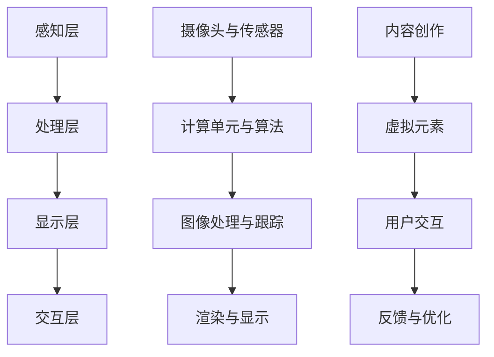

                 

## 文章标题

《爱奇艺2025AR内容社招开发工程师面试指南》

## 关键词

- 爱奇艺
- AR内容开发
- 开发工程师面试
- 技术原理
- 开发实践
- 软件架构
- 编程技巧

## 摘要

本文旨在为有意向加入爱奇艺AR内容开发团队的开发工程师提供全面的面试指南。文章首先介绍了AR技术的发展背景和核心概念，随后深入探讨了AR技术的基础、开发框架、内容制作与优化、业务应用以及与人工智能的融合。此外，文章还针对面试准备、编程与实践题解析、行为面试与软技能等方面给出了详细的建议和策略，旨在帮助读者顺利通过爱奇艺AR内容开发工程师的面试。

## 引言与AR技术概述

### 1.1 书籍背景与目标读者

随着科技的不断发展，增强现实（AR）技术逐渐成为各行各业的重要创新工具。本文《爱奇艺2025AR内容社招开发工程师面试指南》旨在为那些希望在AR内容开发领域找到职业发展的开发工程师提供一册全面的面试指南。书中涵盖了AR技术的核心概念、开发框架、内容制作、优化策略以及与人工智能的融合等多个方面，旨在帮助读者系统地掌握AR技术，并为面试做好充分的准备。

本书的目标读者包括：

1. 有意向加入爱奇艺AR内容开发团队的应届毕业生或在职开发工程师。
2. 对AR技术感兴趣，希望深入了解并掌握相关技术原理的开发者。
3. 想要在AR领域拓展业务或进行技术转型的专业人士。

### 1.2 AR技术发展历程

增强现实（AR）技术最早可以追溯到20世纪60年代。当时，波音公司的研究员Jack E. Kilby提出了“虚拟现实”的概念，旨在通过模拟环境提供沉浸式的体验。然而，由于计算能力的限制，早期的AR技术只能存在于实验室中。

20世纪90年代，随着计算机技术和显示技术的进步，AR技术开始逐渐走入大众视野。1990年，麻省理工学院的Media Lab展示了名为“ARQuake”的游戏，这被认为是第一个成功的AR游戏。此后，AR技术在军事、医疗、教育等多个领域得到了广泛应用。

进入21世纪，智能手机和移动设备的普及为AR技术的应用提供了更广阔的平台。苹果公司在2016年发布了ARKit，谷歌发布了ARCore，这标志着AR技术进入了移动时代。近年来，随着5G和人工智能技术的不断发展，AR技术的应用场景更加丰富，从娱乐到教育、从医疗到零售，AR技术正在改变我们的生活方式。

### 1.3 AR技术核心概念与架构

增强现实（AR）是一种将虚拟信息与现实世界相结合的技术。它通过在用户视野中叠加虚拟图像、文字、声音等元素，增强用户的感知和体验。AR技术的核心概念包括：

1. **叠加显示**：通过摄像头捕捉现实世界的图像，并在图像上叠加虚拟元素，实现虚拟与现实的双重呈现。
2. **实时跟踪**：利用传感器和算法实时跟踪用户的位置和姿态，确保虚拟元素与真实环境的准确对应。
3. **交互控制**：用户可以通过手势、声音等多种方式与虚拟元素进行交互，实现沉浸式的用户体验。

AR技术的架构主要包括以下几个关键部分：

1. **摄像头与传感器**：负责捕捉现实世界的图像和用户的姿态信息。
2. **显示设备**：如智能手机、平板电脑、头戴式显示器等，用于显示叠加的虚拟元素。
3. **计算单元**：如CPU、GPU等，负责处理图像和数据的处理。
4. **算法与软件**：用于图像处理、跟踪、渲染等核心功能，确保虚拟元素的准确显示和交互。

### 1.4 AR技术发展趋势与应用场景

随着技术的不断进步，AR技术正朝着更加智能、更加个性化的方向发展。以下是AR技术的一些发展趋势和应用场景：

1. **智能眼镜与智能设备**：未来，AR智能眼镜将成为人们日常生活的一部分，提供更加便捷的交互和增强现实体验。
2. **虚拟购物与虚拟试衣**：零售业将AR技术用于虚拟试衣和购物体验，提升消费者的购物体验。
3. **教育辅助**：在教育领域，AR技术可以提供更加生动、互动的学习方式，提高学生的学习效果。
4. **医疗辅助**：在医疗领域，AR技术可以辅助医生进行手术、诊断和康复，提高医疗服务的质量。
5. **工业设计与制造**：AR技术可以用于工业设计、制造和维修，提高生产效率和产品质量。
6. **娱乐与游戏**：AR技术将为游戏和娱乐带来全新的体验，如AR游戏、虚拟演唱会等。

总之，AR技术作为一种新兴技术，正逐渐融入各行各业，为我们的生活带来前所未有的变化。了解AR技术的基本概念和发展趋势，对于希望在AR领域发展的开发工程师来说至关重要。

### 1.1 书籍背景与目标读者

随着增强现实（AR）技术的迅猛发展，其在教育、医疗、零售、娱乐等领域的应用日益广泛。作为一家领先的互联网娱乐企业，爱奇艺在AR内容开发方面也取得了显著成就。为了吸引和培养优秀的AR内容开发工程师，爱奇艺于2025年启动了针对AR内容开发工程师的社会招聘项目。

《爱奇艺2025AR内容社招开发工程师面试指南》旨在为有志于加入爱奇艺AR开发团队的工程师提供一本系统、全面的面试指南。本书针对AR技术的核心概念、开发框架、内容制作、优化策略以及与人工智能的融合等方面进行了深入剖析，不仅有助于读者全面了解AR技术，还能为面试做好充分的准备。

本书的目标读者包括：

1. **有意愿加入爱奇艺AR开发团队的应届毕业生和在职开发工程师**：通过本书，读者可以系统地学习AR技术的基本概念和开发技巧，为面试打下坚实基础。
2. **对AR技术感兴趣，希望深入了解相关技术的开发者**：本书提供了丰富的案例和实践指导，有助于读者在实际工作中更好地应用AR技术。
3. **希望在AR领域拓展业务或进行技术转型的专业人士**：本书不仅涵盖AR技术的理论知识，还提供了实际操作和面试策略，有助于读者在转型过程中取得成功。

通过阅读本书，读者可以：

1. **全面掌握AR技术的基本概念和架构**：了解AR技术的历史发展、核心概念和基本原理，为后续学习打下基础。
2. **深入理解AR开发的关键技术和方法**：学习AR开发中的图像处理、增强现实内容创作、软件开发框架等内容，掌握实际操作技能。
3. **提高面试通过率**：本书提供了详细的面试指南，包括常见面试问题、编程与实践题解析、行为面试技巧等，帮助读者在面试中展现自己的技术实力和职业素养。

总之，《爱奇艺2025AR内容社招开发工程师面试指南》是一本适合广大AR内容开发工程师阅读的实用指南，既有助于读者提升自身技术能力，也能为其在面试和职业发展中提供有力支持。

### 1.2 AR技术发展历程

增强现实（AR）技术的起源可以追溯到20世纪60年代，当时计算机科学家和军事研究人员开始探索虚拟现实和增强现实的概念。最早的AR系统是由美国海军研究实验室开发的“达摩克利斯之剑”项目，该系统通过头戴式显示器将虚拟图像叠加到真实环境中，实现了初步的增强现实体验。

20世纪80年代，随着计算机图形学技术的发展，AR技术开始逐渐应用于医疗和教育领域。例如，麻省理工学院（MIT）的医学可视化系统“Medιάn”和“Medıc”项目，利用AR技术实现了医学图像的实时显示和交互。

进入20世纪90年代，AR技术在工业设计和军事训练等领域得到了广泛应用。例如，波音公司开发了一种名为“直观维护系统”的AR应用，用于飞行员和机械师的培训和操作指导。同时，计算机游戏领域的AR游戏如“ARQuake”等，为大众展示了AR技术的潜力。

21世纪初，随着移动设备的普及和智能手机的兴起，AR技术开始进入移动时代。2009年，谷歌发布了Android操作系统，并在其中集成了AR开发框架。此后，苹果公司于2016年推出了ARKit，为iOS开发者提供了强大的AR开发工具。这一时期，AR技术开始在娱乐、零售和教育等多个领域得到广泛应用。

近年来，随着5G和人工智能技术的不断发展，AR技术迎来了新的发展机遇。5G技术的低延迟和高带宽特性为AR应用提供了更稳定、更流畅的网络环境。同时，人工智能技术的应用使得AR系统可以更加智能化地处理图像、语音和传感器数据，提供更加自然和丰富的交互体验。

在AR技术的发展历程中，以下几个重要事件和里程碑具有重要意义：

1. **1990年，麻省理工学院展示了AR游戏“ARQuake”**：这是第一个成功的AR游戏，展示了AR技术在娱乐领域的潜力。
2. **2016年，苹果公司发布ARKit**：为iOS开发者提供了强大的AR开发工具，推动了AR技术在移动设备上的普及。
3. **2017年，谷歌发布ARCore**：为Android开发者提供了类似的AR开发工具，进一步推动了AR技术的广泛应用。
4. **2020年，苹果公司发布RealityKit**：这是苹果公司推出的新一代AR开发框架，旨在为开发者提供更加简单和强大的AR开发工具。
5. **2021年，元宇宙概念兴起**：随着Facebook（现为Meta公司）宣布转型为元宇宙公司，元宇宙概念成为科技界的热门话题，AR技术作为元宇宙的重要组成部分，受到广泛关注。

总之，AR技术从实验室走向大众，经历了数十年的发展和创新。未来，随着技术的不断进步和应用的不断拓展，AR技术将在更多领域发挥重要作用，为人们的生活带来更多的便捷和乐趣。

### 1.3 AR技术核心概念与架构

增强现实（AR）技术是一种通过将虚拟信息叠加到真实世界中，增强用户感知和体验的技术。要深入理解AR技术，我们需要掌握其核心概念和基本架构。

首先，我们来看一下AR技术的主要组成部分：

1. **摄像头**：摄像头是AR系统的核心组件之一，用于捕捉真实世界的图像和视频。通过摄像头获取的图像和视频数据将作为AR内容叠加的基础。
2. **传感器**：除了摄像头，AR系统还需要依赖各种传感器，如GPS、加速度传感器、陀螺仪等，以获取用户的位置、方向和运动等信息。这些传感器数据对于实现精确的实时跟踪和定位至关重要。
3. **计算单元**：计算单元通常包括CPU和GPU，负责处理摄像头和传感器获取的数据，进行图像处理、跟踪和渲染等任务。高性能的计算单元能够确保AR系统提供流畅的实时体验。
4. **显示设备**：显示设备用于将增强的图像和视频内容展示给用户。常见的显示设备包括智能手机、平板电脑、头戴式显示器等。显示设备的性能和质量直接影响用户的体验。

接下来，我们深入探讨AR技术的核心概念：

1. **叠加显示**：叠加显示是AR技术的核心概念之一。它指的是在真实世界的图像上叠加虚拟元素，如文字、图像、声音等。通过叠加显示，用户可以在真实环境中看到虚拟信息，从而实现虚实结合的体验。

2. **实时跟踪**：实时跟踪是确保虚拟元素与现实环境准确对应的关键。通过摄像头和传感器获取的用户位置、方向和运动等信息，AR系统能够实时更新虚拟元素的位置和姿态，确保虚拟元素与真实环境的动态匹配。

3. **交互控制**：交互控制是指用户通过手势、声音等方式与虚拟元素进行交互。这种交互方式增强了用户的沉浸感和参与感，使AR体验更加丰富和有趣。

4. **内容创作**：内容创作是AR技术的另一个重要方面。开发者和设计师需要创建丰富的虚拟元素，如3D模型、动画、音效等，以增强用户的体验。内容创作工具和平台提供了简单易用的界面和功能，帮助开发者快速实现AR内容。

AR技术的架构可以概括为以下几个主要层次：

1. **感知层**：感知层包括摄像头、传感器等硬件组件，负责获取真实世界的图像和传感器数据。
2. **处理层**：处理层包括计算单元和算法，负责处理感知层获取的数据，进行图像处理、跟踪、渲染等任务。
3. **显示层**：显示层包括显示设备，负责将处理后的虚拟内容展示给用户。
4. **交互层**：交互层包括用户与虚拟元素的交互方式，如手势、声音等。

以下是AR技术核心概念与架构之间的关系Mermaid流程图：



通过这个流程图，我们可以清晰地看到AR技术的各个层次和组件之间的相互作用。感知层通过摄像头和传感器获取数据，处理层通过计算单元和算法对数据进行处理和计算，显示层通过显示设备将结果展示给用户，交互层则通过用户与虚拟元素的交互实现反馈和优化。

总之，理解AR技术的核心概念和架构对于开发工程师来说至关重要。只有掌握了这些基本原理，才能在实际开发中设计出高质量的AR应用，为用户提供丰富的增强现实体验。

### 1.4 AR技术发展趋势与应用场景

随着科技的不断进步，AR技术正朝着更加智能、更加个性化的方向发展。未来几年，AR技术将在多个领域得到广泛应用，带来深刻的社会变革。以下是AR技术的一些发展趋势和应用场景：

#### 1.4.1 智能眼镜与智能设备

智能眼镜是AR技术的重要发展方向之一。未来，智能眼镜将具备更强大的计算能力、更高的分辨率和更舒适的佩戴体验。这些设备将不仅仅用于娱乐和游戏，还将应用于生产、医疗、安全等多个领域。

**应用场景**：

1. **生产与工业**：智能眼镜可以帮助工人实时查看生产流程、操作指导和安全提示，提高生产效率和安全水平。
2. **医疗**：医生可以通过智能眼镜进行远程手术指导、医学图像的实时查看和分析，提高医疗诊断和治疗的准确性。
3. **安全**：智能眼镜可以用于安全监控、身份识别和事件预警，提高公共安全水平。

#### 1.4.2 虚拟购物与虚拟试衣

虚拟购物和虚拟试衣是零售业的重要创新方向。通过AR技术，消费者可以在家中尝试不同款式的服装、配饰，甚至家具，提高购物的便捷性和满意度。

**应用场景**：

1. **零售**：商家可以通过AR技术提供虚拟试衣、虚拟逛街等服务，吸引消费者，提高销售额。
2. **电商**：电商平台可以利用AR技术为用户提供更丰富的购物体验，增强用户黏性。

#### 1.4.3 教育辅助

AR技术在教育领域的应用将带来革命性的变化。通过AR技术，学生可以更加直观地学习复杂的知识，提高学习效果。

**应用场景**：

1. **在线教育**：AR技术可以为在线教育平台提供丰富的互动内容，如3D模型、动画等，提高学生的学习兴趣和参与度。
2. **沉浸式教学**：教师可以利用AR技术进行沉浸式教学，使学生更好地理解抽象的概念和知识。

#### 1.4.4 医疗辅助

AR技术在医疗领域的应用具有巨大的潜力。通过AR技术，医生可以进行更精确的手术操作、实时查看医学图像，提高诊断和治疗效果。

**应用场景**：

1. **远程手术**：医生可以通过AR技术进行远程手术指导，提高手术的成功率和安全性。
2. **医学影像**：AR技术可以用于医学影像的实时分析，帮助医生更准确地诊断病情。

#### 1.4.5 工业设计与制造

AR技术在工业设计和制造领域的应用将提高设计效率和生产质量。

**应用场景**：

1. **产品设计**：设计师可以利用AR技术查看3D模型，进行实时修改和优化，提高设计效率。
2. **智能制造**：AR技术可以用于生产线上的实时监控和操作指导，提高生产效率和质量。

#### 1.4.6 娱乐与游戏

AR技术在娱乐和游戏领域的应用将为用户提供全新的互动体验。通过AR技术，用户可以在虚拟世界中实现更加真实的互动和体验。

**应用场景**：

1. **游戏**：AR技术可以为游戏提供更加丰富的场景和角色，提高游戏的沉浸感。
2. **演唱会与娱乐表演**：AR技术可以用于演唱会和娱乐表演，为观众带来更加精彩的视觉体验。

总之，AR技术具有广泛的应用前景，将在未来的各个领域中发挥重要作用。了解AR技术的发展趋势和应用场景，对于开发工程师来说，不仅有助于提升自身的技术能力，也能为其在职业发展中提供更多的机遇。

### 2.1 光学原理与AR显示技术

增强现实（AR）技术的核心在于如何将虚拟信息与现实世界无缝融合，这离不开光学原理和AR显示技术的支持。在这一章节中，我们将深入探讨光学原理以及AR显示技术的具体实现。

#### 2.1.1 视觉成像原理

视觉成像原理是理解AR显示技术的基础。人眼通过角膜、晶状体等光学元件将外界光线聚焦在视网膜上，形成倒置的图像。视网膜上的感光细胞将光信号转化为电信号，通过视神经传递到大脑，最终形成视觉感知。

光学原理在AR显示技术中的应用主要体现在以下几个方面：

1. **镜头设计**：镜头是AR系统中的核心组件，其设计直接影响成像质量和用户体验。常见的镜头类型包括单镜头、双镜头和鱼眼镜头。单镜头适用于简单的AR应用，双镜头可以提供更宽的视野和更好的深度感知，鱼眼镜头则可以提供全景视野。

2. **光学元件**：除了镜头，AR系统还包含其他光学元件，如棱镜、透镜和反射镜。这些元件用于调整光线的路径和方向，确保虚拟信息与现实世界的准确叠加。

3. **波前校正**：波前校正技术用于优化图像质量，减少光学畸变和失真。通过分析光线波前的形状，系统可以实时调整光学元件的参数，确保图像的清晰度和准确性。

#### 2.1.2 光学元件与成像技术

在AR显示技术中，光学元件和成像技术发挥着至关重要的作用。以下是一些关键的光学元件和成像技术：

1. **透明显示屏**：透明显示屏是AR系统中的核心组件，它允许用户同时看到现实世界和叠加的虚拟信息。常见的透明显示技术包括液晶显示（LCD）和有机发光二极管显示（OLED）。LCD显示屏具有较高的透光率和较好的色彩表现，但响应速度较慢；OLED显示屏则具有更高的响应速度和更好的对比度，但成本较高。

2. **反射式光学元件**：反射式光学元件用于将虚拟信息反射到用户视野中。常见的反射式光学元件包括平面镜、反射镜和反射透镜。平面镜和反射镜可以提供清晰的反射图像，但视角较小；反射透镜则可以扩展视角，提高显示效果。

3. **波导技术**：波导技术是一种用于传输光信号的光学技术，它可以将光线从光源传输到显示屏幕，同时保持光信号的强度和方向。波导技术适用于小型化、高效率的AR设备，如AR眼镜和头戴式显示器。

4. **光学引擎**：光学引擎是AR系统中的核心组件，它包括镜头、光学元件和光路调整系统。光学引擎的设计和优化直接影响AR系统的成像质量和用户体验。高品质的光学引擎可以提供清晰的图像、稳定的跟踪和流畅的交互。

#### 2.1.3 AR显示技术详解

AR显示技术可以分为两大类：基于摄像头的AR显示技术和基于投影的AR显示技术。

1. **基于摄像头的AR显示技术**：

   基于摄像头的AR显示技术通过摄像头捕捉现实世界的图像，并在图像上叠加虚拟信息。这种技术具有实现简单、成本低等优点，但成像质量和交互体验相对较差。

   - **光学透视投影**：光学透视投影是一种将虚拟信息通过镜头投射到现实世界中的技术。通过调整镜头的位置和角度，可以确保虚拟信息与现实环境的准确对应。光学透视投影适用于简单的AR应用，如移动设备和智能手机上的AR游戏。

   - **平面镜反射**：平面镜反射是一种利用平面镜将虚拟信息反射到用户视野中的技术。通过在平面镜上叠加虚拟信息，可以实现简单的AR效果。平面镜反射技术适用于简单的AR应用，如增强现实的宣传广告。

2. **基于投影的AR显示技术**：

   基于投影的AR显示技术通过投影设备将虚拟信息直接投射到现实环境中。这种技术具有更高的成像质量和更好的交互体验，但实现成本较高。

   - **透明投影**：透明投影是一种将虚拟信息通过透明屏幕投影到用户视野中的技术。透明屏幕允许用户同时看到虚拟信息和现实环境。透明投影技术适用于复杂的AR应用，如虚拟现实（VR）游戏和增强现实（AR）培训。

   - **结构光投影**：结构光投影是一种利用结构光投影仪将虚拟信息投射到现实环境中的技术。通过分析结构光投影产生的图像，可以实现对现实环境的精准跟踪和定位。结构光投影技术适用于需要精确跟踪和定位的AR应用，如虚拟试衣和医疗诊断。

   - **激光投影**：激光投影是一种利用激光束将虚拟信息投射到现实环境中的技术。激光投影具有高亮度、高分辨率和高对比度的特点，适用于需要高质量图像的AR应用，如大型AR广告和户外娱乐。

总之，光学原理和AR显示技术在AR技术中发挥着至关重要的作用。通过深入理解光学原理和AR显示技术，开发工程师可以设计出更加优质、高效的AR应用，为用户提供更加丰富的增强现实体验。

### 2.2 图像处理与识别技术

在增强现实（AR）技术中，图像处理与识别技术扮演着至关重要的角色。它们不仅决定了AR应用的准确性和效率，还影响了用户体验。在这一章节中，我们将探讨图像处理与识别技术的基础知识，以及它们在AR中的应用。

#### 2.2.1 图像处理基础

图像处理是通过对图像进行一系列数学和算法操作，以改善图像质量或提取图像特征的过程。以下是图像处理中的几个关键步骤和算法：

1. **图像采样与量化**：图像采样是将连续的图像转换为离散的像素点，量化则是将图像的亮度值转换为数字值。常见的采样方法包括奈奎斯特采样和香农采样，量化方法包括等间隔量化和对数量化。

2. **图像增强**：图像增强是通过调整图像的对比度、亮度和颜色等参数，提高图像的视觉质量。常用的图像增强算法包括直方图均衡化、对比度拉伸、滤波等。

3. **图像滤波**：图像滤波是一种用于去除图像噪声和改善图像清晰度的算法。常见的滤波器包括均值滤波、高斯滤波、中值滤波等。

4. **图像分割**：图像分割是将图像划分为多个区域，每个区域具有相似的属性。图像分割算法包括阈值分割、区域生长、边缘检测等。

5. **特征提取**：特征提取是提取图像中具有代表性的特征，用于后续的识别和处理。常用的特征提取方法包括边缘检测、角点检测、纹理特征提取等。

#### 2.2.2 特征提取与匹配

特征提取与匹配是图像识别的核心步骤。特征提取是指从图像中提取具有代表性的特征点或特征向量，而特征匹配则是在不同图像之间寻找对应的特征点。以下是几种常见的特征提取与匹配方法：

1. **SIFT（尺度不变特征变换）**：SIFT是一种用于特征提取的算法，能够提取出在尺度变化、旋转和光照变化下仍然稳定的特征点。SIFT算法通过计算图像的梯度方向和幅度，识别出关键点，然后通过关键点的坐标和方向构建特征向量。

2. **SURF（加速稳健特征）**：SURF是一种基于SIFT算法的改进方法，它通过利用积分图像快速计算图像的梯度方向和幅度，从而提高特征提取的效率。SURF算法同样能够提取出在尺度变化、旋转和光照变化下稳定的特征点。

3. **ORB（Oriented FAST and Rotated BRIEF）**：ORB是一种基于FAST（快速特征检测）和BRIEF（二值矩形模板）算法的组合方法。ORB算法通过计算图像的梯度方向和幅值，快速识别出关键点，并使用BRIEF算法构建特征向量。ORB算法在计算速度和识别率之间取得了较好的平衡。

4. **特征匹配**：特征匹配是寻找两幅图像中对应特征点的过程。常用的特征匹配算法包括最近邻匹配、圆心匹配等。最近邻匹配是通过计算两幅图像中对应特征点的欧氏距离，选择距离最小的特征点作为匹配结果。圆心匹配则通过计算两幅图像中对应特征点的角度和距离，选择匹配结果。

#### 2.2.3 图像识别算法与应用

图像识别算法是指通过计算机对图像中的对象进行分类或标注的算法。以下是一些常见的图像识别算法：

1. **支持向量机（SVM）**：SVM是一种用于分类的算法，通过将特征空间映射到高维空间，找到最优的分类边界。SVM算法在图像识别中具有很好的性能，特别是在处理线性可分的数据时。

2. **卷积神经网络（CNN）**：CNN是一种用于图像识别的深度学习算法，通过多层卷积、池化和全连接层，自动提取图像中的特征。CNN算法在图像识别任务中表现出色，特别是在处理复杂场景和大规模数据时。

3. **循环神经网络（RNN）**：RNN是一种用于序列数据的深度学习算法，通过将前一个时间步的输出作为当前时间步的输入，实现长期依赖学习。RNN在图像识别中的应用包括视频分类和时间序列分析等。

4. **生成对抗网络（GAN）**：GAN是一种通过生成模型和判别模型相互对抗的方式，实现图像生成和增强的算法。GAN在图像超分辨率、风格迁移等应用中表现出色。

在AR应用中，图像处理与识别技术具有广泛的应用场景：

1. **图像识别与标注**：AR应用可以通过图像识别技术识别现实世界中的对象，并进行标注。例如，在购物应用中，用户可以通过摄像头扫描商品，系统会自动识别商品并进行价格查询和购买建议。

2. **增强现实内容创建**：AR应用可以通过图像识别技术创建增强现实内容。例如，在游戏应用中，系统可以识别用户周围的环境，并在虚拟世界中叠加相应的游戏元素。

3. **位置跟踪与导航**：AR应用可以通过图像识别技术实现位置跟踪与导航。例如，在户外导航应用中，系统可以识别用户周围的地图标志，并提供导航信息。

4. **物体检测与分割**：AR应用可以通过图像识别技术实现物体检测与分割。例如，在自动驾驶应用中，系统需要识别和分割道路上的各种物体，如车辆、行人、交通标志等。

总之，图像处理与识别技术在AR应用中发挥着关键作用。通过深入理解和应用这些技术，开发工程师可以设计出更加智能化、高效的AR应用，为用户提供丰富的增强现实体验。

### 2.3 增强现实内容创作工具

在增强现实（AR）内容开发过程中，选择合适的创作工具是至关重要的。以下将介绍几种常用的AR内容创作工具，并详细说明其功能、特点以及使用流程。

#### 2.3.1 常用内容创作工具介绍

1. **Unity**：Unity是一款强大的游戏开发和AR内容创作工具，具有广泛的社区支持和丰富的开发资源。Unity支持多种平台，包括iOS、Android、Windows、macOS等，并提供了丰富的AR开发插件和资源包，如AR Foundation和ARKit/ARCore插件。

2. **Unreal Engine**：Unreal Engine是另一款流行的游戏引擎，广泛应用于AR、VR和游戏开发。它具有出色的图形渲染能力和高效的内容创建流程，提供了大量的模板和工具，支持从简单的AR应用到复杂的三维AR内容创作。

3. **ARKit**：ARKit是苹果公司为iOS平台开发的AR开发框架，提供了丰富的AR功能，如场景重建、实时渲染、物体识别等。ARKit与iOS设备紧密集成，可以充分利用设备的硬件资源，实现高效、低延迟的AR体验。

4. **ARCore**：ARCore是谷歌为Android平台开发的AR开发框架，提供了与ARKit类似的功能，如场景重建、实时渲染、物体识别等。ARCore与Android设备紧密集成，支持多种硬件设备，具有广泛的兼容性。

5. **Adobe Aero**：Adobe Aero是一款基于网页的AR内容创作工具，适用于设计人员和初学者。Aero提供了直观的拖放界面和丰富的创作资源，用户无需编写代码即可创建简单的AR应用。

#### 2.3.2 内容创作流程与技巧

1. **需求分析与策划**：在开始创作之前，需要对AR内容的应用场景、目标用户、功能需求等进行详细分析，明确创作目标和方向。

2. **设计**：设计是AR内容创作的重要环节，包括界面设计、交互设计、场景布局等。设计师可以使用专业的设计软件，如Sketch、Adobe XD等，创建高质量的视觉设计。

3. **内容制作**：内容制作包括3D模型、动画、音效等。开发者可以使用3D建模软件，如Blender、Maya等，创建高质量的3D模型和动画。音效可以使用音频编辑软件，如Audacity、Adobe Audition等，进行音效设计和制作。

4. **开发**：在开发阶段，开发者需要使用AR开发工具和框架，如Unity、Unreal Engine等，实现AR内容的功能和交互。开发者需要熟练掌握开发工具的使用，了解AR框架的API和功能。

5. **测试与优化**：在开发完成后，需要进行充分的测试和优化，确保AR应用的稳定性和性能。测试包括功能测试、性能测试、兼容性测试等。优化包括调整图像质量、减少内存占用、提高渲染效率等。

#### 2.3.3 实战：使用AR内容创作工具

以下是一个简单的AR内容创作实战，使用Unity和ARKit框架创建一个简单的AR应用。

**1. 开发环境搭建**

- 在Unity Hub中安装Unity 2020.3版本。
- 安装ARFoundation插件，用于简化AR内容的开发。

**2. 创建AR项目**

- 打开Unity，创建一个新的AR项目，选择ARFoundation插件作为开发框架。
- 配置项目设置，包括渲染模式、相机配置等。

**3. 添加3D模型**

- 导入一个简单的3D模型（例如，一个立方体）。
- 在场景中添加模型，并调整其位置和大小。

**4. 添加标签**

- 在场景中添加一个标签（例如，一个平面），用于识别现实世界中的特定对象。
- 配置标签的参数，如大小、位置等。

**5. 编写脚本**

- 创建一个C#脚本，用于控制3D模型的行为。
- 脚本中包含模型的位置、旋转和缩放等参数，以及与标签的交互逻辑。

**6. 测试与优化**

- 在iOS和Android设备上测试AR应用，确保其稳定性和性能。
- 根据测试结果进行优化，如调整图像质量、减少内存占用等。

**7. 发布应用**

- 在Unity中导出iOS和Android平台的安装包。
- 在应用商店中发布AR应用，供用户下载和使用。

通过这个简单的实战，我们可以看到使用AR内容创作工具的基本流程和技巧。在实际开发过程中，需要根据具体需求进行更复杂的操作和优化，以实现高质量的AR内容。

总之，选择合适的AR内容创作工具，掌握内容创作流程和技巧，对于开发高质量的AR应用至关重要。通过不断实践和积累经验，开发工程师可以不断提升自己的AR内容创作能力，为用户提供丰富的增强现实体验。

### 3.1 AR开发环境搭建

要开始开发增强现实（AR）应用，首先需要搭建一个适合的开发环境。在这一章节中，我们将详细介绍开发环境的搭建过程，包括开发工具与SDK的介绍、系统需求与硬件配置，以及搭建步骤。

#### 3.1.1 开发工具与SDK介绍

在AR开发中，常用的开发工具和软件开发工具包（SDK）包括以下几种：

1. **Unity**：Unity是一款功能强大的游戏开发和AR内容创作工具，适用于各种平台，包括iOS、Android、Windows等。Unity提供了丰富的AR开发插件和资源包，如AR Foundation，简化了AR内容的开发过程。

2. **Unreal Engine**：Unreal Engine是另一款流行的游戏引擎，广泛应用于AR、VR和游戏开发。它具有出色的图形渲染能力和高效的内容创建流程，提供了大量的模板和工具，支持从简单的AR应用到复杂的三维AR内容创作。

3. **ARKit**：ARKit是苹果公司为iOS平台开发的AR开发框架，提供了丰富的AR功能，如场景重建、实时渲染、物体识别等。ARKit与iOS设备紧密集成，可以充分利用设备的硬件资源，实现高效、低延迟的AR体验。

4. **ARCore**：ARCore是谷歌为Android平台开发的AR开发框架，提供了与ARKit类似的功能，如场景重建、实时渲染、物体识别等。ARCore与Android设备紧密集成，支持多种硬件设备，具有广泛的兼容性。

5. **Unity AR Foundation**：AR Foundation是Unity为AR开发提供的一个跨平台框架，它简化了AR内容的开发过程，提供了统一的API和功能。AR Foundation支持Unity的多种平台，如iOS、Android、Windows等。

6. **Vuforia**：Vuforia是Pico Interactive公司开发的一款AR开发平台，提供了强大的AR内容创建和管理工具。Vuforia支持多种平台，包括iOS、Android、Windows等，适用于复杂的应用场景。

#### 3.1.2 系统需求与硬件配置

搭建AR开发环境需要满足一定的系统需求和硬件配置。以下是一些关键要求：

1. **操作系统**：大多数AR开发工具和SDK都支持Windows和macOS操作系统。对于iOS开发，需要使用macOS系统。

2. **处理器**：推荐使用较新的处理器，如Intel Core i5或更高级别的处理器，以确保开发环境的性能和响应速度。

3. **内存**：至少需要8GB的RAM，建议使用16GB或更高的内存，以支持大型项目和高性能的AR应用开发。

4. **硬盘空间**：至少需要50GB的可用硬盘空间，以存储开发工具、SDK、项目文件和资源包。

5. **显卡**：推荐使用NVIDIA GeForce GTX 1060或更高性能的显卡，以确保良好的图形渲染性能。

6. **摄像头**：对于AR开发，需要支持不同平台的摄像头，如iOS设备上的前置摄像头和后置摄像头，Android设备上的摄像头等。

7. **其他硬件**：对于某些特定应用，可能需要其他硬件设备，如头戴式显示器、投影仪等。

#### 3.1.3 开发环境搭建步骤

以下是在Windows操作系统中搭建AR开发环境的具体步骤：

**步骤1：安装操作系统**

- 安装Windows 10或更新的操作系统。

**步骤2：安装开发工具**

- 安装Unity Hub和Unity 2020.3版本。从Unity官网下载Unity Hub，并使用Unity Hub下载和安装Unity 2020.3。
- 安装Visual Studio 2019，用于编写和调试C#代码。

**步骤3：安装SDK**

- 安装ARFoundation插件。在Unity项目中，选择“Edit” > “Plugins” > “ARFoundation”，启用ARFoundation插件。
- 安装ARCore SDK。从谷歌开发者官网下载ARCore SDK，并按照安装说明进行安装。
- 安装ARKit SDK。从苹果开发者官网下载ARKit SDK，并按照安装说明进行安装。

**步骤4：配置开发环境**

- 在Unity中创建一个新的AR项目，选择ARFoundation作为开发框架。
- 配置项目设置，包括渲染模式、相机配置等。

**步骤5：安装其他工具和软件**

- 安装3D建模软件，如Blender、Maya等，用于创建和编辑3D模型。
- 安装图像处理软件，如Adobe Photoshop等，用于编辑和处理图像资源。

**步骤6：测试开发环境**

- 在iOS和Android设备上测试AR应用，确保开发环境的稳定性和性能。

通过以上步骤，我们可以成功搭建一个适合AR开发的开发环境。在实际开发过程中，可能需要根据具体项目需求进行进一步的配置和优化。

总之，搭建一个适合的AR开发环境是进行高质量AR内容开发的基础。通过合理选择开发工具和SDK，配置满足系统需求的硬件，我们可以为AR开发工作提供一个稳定、高效的平台。

### 3.2 AR应用程序架构

在开发增强现实（AR）应用程序时，了解其应用程序架构是至关重要的。一个良好的架构不仅有助于提高开发效率，还能确保应用程序的可维护性和扩展性。在这一章节中，我们将详细探讨AR应用程序的基本结构、组件化开发模式以及应用性能优化策略。

#### 3.2.1 AR应用基本结构

AR应用程序的基本结构通常包括以下几个关键组成部分：

1. **用户界面（UI）**：用户界面是用户与AR应用程序交互的界面，包括各种按钮、图标、文本框等。UI的设计直接影响用户体验，因此需要遵循简洁、直观、美观的原则。

2. **摄像头模块**：摄像头模块负责捕捉现实世界的图像和视频，是AR应用的核心组件。通过摄像头获取的图像用于识别现实环境中的物体和位置信息，从而叠加虚拟内容。

3. **跟踪与定位模块**：跟踪与定位模块用于实时跟踪用户的位置和姿态，确保虚拟内容与现实世界的准确对应。常见的跟踪与定位技术包括视觉跟踪、惯性测量单元（IMU）和GPS。

4. **图像处理模块**：图像处理模块负责对摄像头获取的图像进行预处理、增强、分割等操作。这些操作有助于提高图像质量，增强虚拟内容与真实环境的融合效果。

5. **渲染模块**：渲染模块负责将处理后的图像和虚拟内容进行渲染，将其呈现在用户的视野中。渲染模块需要高效地处理图像数据和虚拟内容，以确保流畅的交互体验。

6. **交互模块**：交互模块负责处理用户的输入，如手势、声音等，并触发相应的操作和反馈。良好的交互设计可以提高用户参与度和满意度。

7. **数据管理模块**：数据管理模块负责存储、管理和同步应用程序的数据。这些数据包括用户配置、虚拟内容、历史记录等。

#### 3.2.2 组件化开发模式

组件化开发模式是将应用程序拆分为多个独立、可复用的组件，每个组件负责特定的功能。这种开发模式有助于提高代码的可维护性和扩展性，同时加快开发速度。

在AR应用程序中，组件化开发模式可以应用于以下方面：

1. **UI组件**：UI组件包括按钮、文本框、图标等。通过将UI元素拆分为独立的组件，可以方便地管理和修改界面设计，同时确保界面的响应速度和性能。

2. **图像处理组件**：图像处理组件负责处理摄像头获取的图像，包括预处理、增强、分割等操作。通过将图像处理功能拆分为独立的组件，可以方便地替换和优化图像处理算法，同时提高图像处理的效率和准确性。

3. **跟踪与定位组件**：跟踪与定位组件负责实时跟踪用户的位置和姿态。通过将跟踪与定位功能拆分为独立的组件，可以方便地实现多传感器融合、多目标跟踪等高级功能，同时确保系统的稳定性和可靠性。

4. **渲染组件**：渲染组件负责将处理后的图像和虚拟内容进行渲染。通过将渲染功能拆分为独立的组件，可以方便地实现高效、低延迟的渲染，同时确保渲染效果的一致性和美观性。

5. **交互组件**：交互组件负责处理用户的输入和触发相应的操作。通过将交互功能拆分为独立的组件，可以方便地实现多样化的交互方式，同时提高用户的参与度和满意度。

6. **数据管理组件**：数据管理组件负责存储、管理和同步应用程序的数据。通过将数据管理功能拆分为独立的组件，可以方便地实现数据的安全存储、高效管理和灵活同步。

#### 3.2.3 应用性能优化

AR应用程序的性能优化是确保其流畅性和用户体验的关键。以下是一些常用的性能优化策略：

1. **图像处理优化**：
   - **减少图像分辨率**：降低图像分辨率可以减少图像处理的时间和内存占用，提高性能。但是，需要确保图像分辨率不会影响用户体验。
   - **图像预处理**：通过图像预处理技术，如滤波、边缘检测等，可以减少图像处理的时间和计算量。
   - **并行处理**：利用多线程技术，将图像处理任务分解为多个子任务，并行处理，提高处理速度。

2. **跟踪与定位优化**：
   - **多传感器融合**：结合多种传感器数据，如摄像头、IMU、GPS等，提高跟踪与定位的准确性和稳定性。
   - **动态调整参数**：根据实时环境变化，动态调整跟踪与定位参数，以适应不同的场景和需求。

3. **渲染优化**：
   - **优化渲染流程**：通过优化渲染流程，减少渲染时间和计算量。例如，合并多个渲染操作、减少渲染层次等。
   - **纹理压缩**：使用纹理压缩技术，减少纹理数据的大小，提高渲染效率。

4. **交互优化**：
   - **减少响应时间**：优化交互流程，减少用户的响应时间。例如，减少用户输入的延迟、优化输入处理等。
   - **提供即时反馈**：通过提供即时反馈，提高用户的参与度和满意度。例如，实时显示用户操作的进度、效果等。

5. **数据管理优化**：
   - **数据缓存**：使用数据缓存技术，减少数据的读取和写入次数，提高数据访问速度。
   - **数据压缩与解压缩**：使用数据压缩与解压缩技术，减少数据存储和传输的大小，提高数据管理的效率。

通过以上性能优化策略，我们可以显著提高AR应用程序的流畅性和用户体验。在实际开发过程中，需要根据具体应用场景和需求，灵活选择和组合这些策略，以实现最佳性能。

总之，了解AR应用程序的基本结构、组件化开发模式以及应用性能优化策略，是开发高效、优质的AR应用的关键。通过合理的设计和优化，开发工程师可以设计出满足用户需求的AR应用，为用户提供丰富的增强现实体验。

### 3.3 AR应用开发实践

在实际开发增强现实（AR）应用程序时，了解如何实现关键功能并通过实践来验证和优化代码是至关重要的。在这一章节中，我们将通过具体案例，详细讲解如何开发一个简单的AR应用、实现AR标记识别功能以及制作一个AR互动游戏。

#### 3.3.1 实战：开发一个简单的AR应用

**步骤1：创建Unity项目**

1. 打开Unity Hub，创建一个新的Unity项目。
2. 选择“AR Foundation”作为开发框架，并设置项目名称和保存路径。

**步骤2：配置项目设置**

1. 在“Edit”菜单中选择“Project Settings”，然后选择“AR Foundation”。
2. 配置项目的AR设置，包括相机模式、渲染模式等。

**步骤3：添加3D模型**

1. 导入一个简单的3D模型，例如一个立方体。
2. 将模型拖动到场景中，并调整其位置和大小。

**步骤4：编写脚本**

1. 创建一个新的C#脚本，命名为“SimpleARApp.cs”。
2. 将脚本添加到场景中的立方体对象上。
3. 编写脚本代码，实现简单的AR功能。

```csharp
using UnityEngine;

public class SimpleARApp : MonoBehaviour
{
    public Camera arCamera;

    private void Start()
    {
        // 初始化AR相机
        arCamera = Camera.main;
    }

    private void Update()
    {
        // 更新AR模型的位置和方向
        transform.position = arCamera.transform.position;
        transform.rotation = arCamera.transform.rotation;
    }
}
```

**步骤5：运行与测试**

1. 使用iOS或Android设备运行项目，确保AR模型与现实环境准确对应。
2. 测试AR模型在不同场景和角度下的表现，确保其稳定性和准确性。

通过以上步骤，我们可以开发一个简单的AR应用，实现模型在现实环境中的实时跟踪和显示。这为后续更复杂的AR功能开发奠定了基础。

#### 3.3.2 实战：实现AR标记识别功能

**步骤1：准备标记**

1. 创建一个简单的标记，例如一个带有特定图案的平面。
2. 将标记图像保存为高分辨率的PNG格式，确保图像质量。

**步骤2：配置Vuforia**

1. 在Unity项目中安装Vuforia插件。
2. 在Vuforia Manager中添加创建的标记，并配置其名称和参数。

**步骤3：编写标记识别脚本**

1. 创建一个新的C#脚本，命名为“MarkerRecognition.cs”。
2. 将脚本添加到场景中的相机对象上。
3. 编写脚本代码，实现标记识别功能。

```csharp
using UnityEngine;
using Vuforia;

public class MarkerRecognition : MonoBehaviour
{
    public TrackableRepository trackableRepository;

    private void Start()
    {
        // 初始化Vuforia
        VuforiaARController.Instance.InitVuforia();
        trackableRepository = VuforiaARController.Instance.TrackableRepository;
    }

    private void Update()
    {
        // 遍历所有可跟踪的标记
        foreach (TrackableTrackablePair trackablePair in trackableRepository.GetTrackablePairs())
        {
            // 判断标记是否被识别
            if (trackablePair.IsTracking)
            {
                // 更新标记上的3D模型
                Transform markerTransform = trackablePair.Trackable.GameObject.transform;
                markerTransform.position = arCamera.transform.position;
                markerTransform.rotation = arCamera.transform.rotation;
            }
        }
    }
}
```

**步骤4：运行与测试**

1. 使用iOS或Android设备运行项目，确保标记能够被系统准确识别。
2. 测试标记识别的准确性和实时性，确保AR模型与现实环境准确对应。

通过以上步骤，我们可以实现AR标记识别功能，使得AR模型能够根据标记的位置和方向进行动态更新。这为开发更复杂的AR应用提供了基础。

#### 3.3.3 实战：制作一个AR互动游戏

**步骤1：设计游戏场景**

1. 设计游戏场景，包括背景、角色、障碍物等元素。
2. 导入相关的3D模型和图像资源，确保其质量符合游戏要求。

**步骤2：实现游戏逻辑**

1. 创建游戏脚本，实现游戏的基本逻辑，如角色控制、得分计算等。
2. 编写代码，实现角色在AR环境中的移动、跳跃等行为。

```csharp
using UnityEngine;

public class GameLogic : MonoBehaviour
{
    public GameObject player;
    public Transform spawnPoint;

    private void Update()
    {
        // 判断用户是否按下跳跃键
        if (Input.GetKeyDown(KeyCode.Space))
        {
            // 触发跳跃行为
            player.GetComponent<Rigidbody>().AddForce(new Vector3(0, 500, 0));
        }
    }

    private void SpawnObstacle()
    {
        // 在随机位置生成障碍物
        GameObject obstacle = Instantiate(player, spawnPoint.position, Quaternion.identity);
        obstacle.transform.position += new Vector3(Random.Range(-5, 5), 0, Random.Range(-5, 5));
    }
}
```

**步骤3：运行与测试**

1. 使用iOS或Android设备运行项目，确保游戏场景和逻辑正确无误。
2. 测试游戏的流畅性、稳定性和交互性，确保用户体验良好。

通过以上步骤，我们可以制作一个简单的AR互动游戏。这不仅展示了AR技术的应用潜力，也为开发者提供了丰富的实战经验。

总之，通过这些实践案例，我们可以了解如何开发一个简单的AR应用、实现AR标记识别功能以及制作一个AR互动游戏。这些实践不仅有助于提升开发技能，也为实际项目开发提供了宝贵的经验。

### 4.1 AR内容制作基础

在增强现实（AR）内容制作过程中，了解内容类型、制作流程以及相关工具和技巧是至关重要的。以下将详细介绍AR内容制作的基础知识，包括内容类型、制作流程和制作技巧。

#### 4.1.1 内容类型

AR内容制作包括多种类型的内容，根据应用场景和用户需求，可以分为以下几类：

1. **标记型内容**：标记型内容通过识别图像或二维码等标记，触发虚拟内容的显示。常见的应用包括AR广告、教育辅助工具和游戏等。

2. **位置型内容**：位置型内容根据用户的位置信息，在特定地点显示虚拟内容。这种类型的内容适用于旅游导览、博物馆导览等场景。

3. **物体型内容**：物体型内容通过识别现实世界中的物体，将其覆盖或叠加虚拟内容。常见的应用包括虚拟试衣、建筑设计和工程维护等。

4. **环境型内容**：环境型内容将虚拟元素叠加到整个场景中，适用于游戏、展览和娱乐等场景。这种类型的内容通常需要复杂的场景建模和渲染。

5. **交互型内容**：交互型内容不仅包含虚拟元素，还提供与用户的互动功能，如手势识别、语音交互等。这种类型的内容适用于娱乐、教育和零售等领域。

#### 4.1.2 制作流程

AR内容制作流程通常包括以下几个关键步骤：

1. **需求分析与策划**：在制作AR内容之前，需要明确内容的应用场景、目标用户和功能需求。通过需求分析，确定内容的类型、风格和交互方式。

2. **设计**：设计阶段包括视觉设计和交互设计。视觉设计涉及UI元素、虚拟元素和场景布局，而交互设计则关注用户的交互体验和操作流程。可以使用设计工具，如Adobe XD、Sketch等，创建高质量的设计稿。

3. **内容创作**：内容创作阶段涉及3D建模、动画制作、音效设计等。根据内容类型，选择合适的创作工具，如Blender、Maya、Adobe After Effects等。高质量的内容是AR应用成功的关键。

4. **测试与优化**：在内容制作完成后，需要进行充分测试，确保内容的稳定性、性能和用户体验。测试包括功能测试、性能测试和用户体验测试。通过优化，如调整图像质量、减少内存占用等，可以提高内容的性能。

5. **发布与维护**：内容制作完成后，需要进行发布和维护。发布内容包括上传到应用商店、网站等平台，确保用户可以方便地访问和使用。维护工作包括定期更新内容、修复漏洞和优化用户体验。

#### 4.1.3 内容素材获取与处理

在AR内容制作过程中，素材的获取与处理是关键步骤。以下是一些常见的素材获取和处理方法：

1. **3D模型与纹理**：3D模型和纹理是AR内容的重要组成部分。可以从开源资源网站，如TurboSquid、Sketchfab等，获取高质量的3D模型和纹理。此外，可以使用3D建模工具，如Blender、Maya等，创建自定义的3D模型。

2. **图像与视频**：图像和视频素材可以用于AR内容的背景、标识和动画等。可以使用相机拍摄或从素材库获取高质量的图像和视频素材。在处理图像和视频时，可以使用图像处理软件，如Adobe Photoshop、Adobe Premiere等，进行编辑和优化。

3. **音频与音效**：音频和音效可以增强AR内容的互动性和用户体验。可以使用音频编辑软件，如Audacity、Adobe Audition等，创建和编辑音频素材。音效处理包括音量调整、混音和效果添加等。

4. **素材优化**：在获取素材后，需要进行优化，以确保其适合AR应用。优化方法包括压缩图像和视频文件、调整音频格式和质量等。优化后的素材可以减少应用程序的内存占用和加载时间，提高性能。

#### 4.1.4 AR内容版权与合规

在AR内容制作过程中，版权和合规问题至关重要。以下是一些需要注意的方面：

1. **版权声明**：确保所有使用的素材和内容都具有合法的版权。在获取素材时，务必确认其版权状态，并获取必要的授权。

2. **合规审查**：在内容制作和发布前，进行合规审查，确保内容符合相关法规和标准。这包括但不限于内容审核、隐私保护、数据安全等。

3. **用户协议**：制定用户协议，明确用户在使用AR内容时的权利和义务，包括隐私政策、数据使用条款等。

通过了解AR内容制作的基础知识，开发者可以更有效地进行内容创作，提高AR应用的质量和用户体验。同时，关注版权和合规问题，确保内容的合法性和可持续性。

### 4.2 AR内容优化策略

在增强现实（AR）内容制作完成后，优化策略至关重要，以确保内容的性能、稳定性和用户体验。以下是一些常见的AR内容优化策略，包括内容质量评估方法、内容加载与渲染优化、以及内容交互与用户体验优化。

#### 4.2.1 内容质量评估方法

内容质量评估是优化AR内容的第一步，以下是一些常用的评估方法：

1. **性能测试**：通过模拟不同场景和使用情况，测试AR内容在设备上的性能。性能测试包括渲染帧率、内存占用、加载时间等指标。可以使用专业工具，如Unity Profiler、ARCore Metrics等，进行性能分析。

2. **用户体验测试**：邀请用户进行体验测试，收集用户对AR内容的反馈和意见。用户体验测试可以包括界面友好性、交互流畅性、内容趣味性等方面。通过用户反馈，发现并解决潜在问题。

3. **内容审核**：对AR内容进行内容审核，确保其符合法律法规和平台规范。内容审核包括内容真实性、隐私保护、信息安全等。

4. **可视化分析**：使用可视化工具，如热图分析、行为追踪等，分析用户在AR内容中的交互行为和视觉注意力。这些数据可以帮助优化内容布局和交互设计。

#### 4.2.2 内容加载与渲染优化

内容加载与渲染优化是提高AR内容性能的关键步骤。以下是一些常见的优化策略：

1. **图像与视频优化**：优化图像和视频文件的格式和尺寸，减少文件大小。常用的图像优化方法包括JPEG和PNG压缩、WebP格式转换等。视频优化可以采用H.264或HEVC编码，并适当降低分辨率和比特率。

2. **纹理贴图优化**：纹理贴图是AR内容的重要组成部分，优化纹理贴图可以显著提高渲染性能。优化方法包括使用合适的纹理贴图尺寸、使用Mipmap贴图、减少纹理贴图数量等。

3. **异步加载**：通过异步加载技术，将内容分成多个部分，按需加载。这样可以减少初始加载时间，提高用户体验。例如，使用Unity的AssetBundles或Adobe Aero的WebGL加载机制，实现异步加载。

4. **内容压缩**：对AR内容进行压缩，减少数据传输和存储需求。常用的压缩方法包括ZLib、LZ4等。

5. **渲染优化**：优化渲染流程，减少渲染次数和渲染对象。例如，使用渲染排序、剔除不可见对象、合并渲染操作等。还可以使用Unity的渲染管线和渲染模式，根据场景需求进行优化。

#### 4.2.3 内容交互与用户体验优化

良好的交互设计和用户体验是AR内容成功的关键。以下是一些优化策略：

1. **交互设计**：优化交互设计，提高用户操作的便利性和直观性。使用手势、声音、位置等多种交互方式，增加用户的参与感和沉浸感。

2. **界面布局**：优化界面布局，确保内容的布局清晰、美观，便于用户浏览和使用。可以使用自适应布局技术，根据不同设备和屏幕尺寸调整内容布局。

3. **视觉效果**：优化视觉效果，增强内容的视觉效果和吸引力。使用适当的颜色、动画和视觉效果，提高内容的视觉冲击力和吸引力。

4. **反馈与提示**：提供及时、明确的反馈和提示，帮助用户理解AR内容的操作和功能。使用动画、音效、文本提示等手段，增强用户的互动体验。

5. **个性化推荐**：根据用户的兴趣和行为，提供个性化的内容推荐。使用数据分析和机器学习技术，为用户推荐感兴趣的内容，提高用户粘性。

通过以上优化策略，开发者可以显著提高AR内容的性能、稳定性和用户体验。在实际开发过程中，需要根据具体需求和场景，灵活应用这些优化方法，不断改进和优化AR内容。

### 4.3 AR内容案例分析

在AR内容制作领域，许多知名应用已经成功地展示了AR技术的潜力。以下将对几个知名AR应用进行案例分析，探讨其成功经验、不足之处，以及可以从中汲取的启示。

#### 4.3.1 知名AR应用案例介绍

1. **IKEA Place**：IKEA Place是IKEA推出的AR应用，用户可以在自己的房间内虚拟摆放家具，查看家具的实际尺寸和风格。这个应用通过AR技术，解决了用户在购物前无法真实体验家具的痛点，提高了购物决策的准确性。

2. **Nike Fit**：Nike Fit是Nike推出的AR健身应用，用户可以通过AR技术进行个性化健身指导。应用通过摄像头和传感器跟踪用户的运动，提供实时反馈和指导，提升了用户的健身体验。

3. **ZARA AR尝试**：ZARA推出了AR尝试功能，用户可以通过手机摄像头扫描商品，尝试服装的虚拟试穿效果。这种创新的购物方式吸引了大量用户，提高了用户参与度和购买意愿。

4. **谷歌地图AR导航**：谷歌地图的AR导航功能允许用户在户外使用手机进行实时导航。通过AR技术，用户可以看到现实世界中的地标和路线，提高了导航的准确性和用户体验。

#### 4.3.2 案例分析：成功与不足

**IKEA Place**：

**成功经验**：

- **直观的操作体验**：应用提供了简单直观的界面，用户只需扫描房间并选择家具，即可快速进行虚拟摆放。
- **高质量的3D模型**：IKEA Place使用了高质量的3D模型和纹理，使得虚拟家具在用户房间内看起来非常真实。
- **广泛的家具选择**：应用提供了丰富的家具选项，满足了不同用户的个性化需求。

**不足之处**：

- **加载时间较长**：由于需要加载高质量的3D模型，应用在首次使用时可能需要较长的加载时间。
- **兼容性问题**：某些用户反馈在老旧设备上使用体验不佳，加载和渲染问题较为明显。

**Nike Fit**：

**成功经验**：

- **个性化健身指导**：应用通过摄像头和传感器实时跟踪用户的运动，提供个性化的健身建议和指导，提升了用户体验。
- **互动性强**：用户可以在应用中与虚拟教练互动，增加了健身的趣味性和参与度。

**不足之处**：

- **技术门槛较高**：由于需要依赖摄像头和传感器，应用在设备兼容性和使用环境方面存在一定的限制。
- **硬件依赖性强**：用户需要具备一定的硬件条件，如智能手机摄像头质量、传感器精度等，才能获得最佳体验。

**ZARA AR尝试**：

**成功经验**：

- **创新的购物体验**：通过AR试穿功能，用户可以在线上购物时更真实地体验服装，提高了购物决策的准确性。
- **高效的内容加载**：应用采用了高效的图像识别和渲染技术，使得试穿过程快速且流畅。

**不足之处**：

- **服装款式限制**：当前支持试穿的服装款式有限，用户的选择范围受到一定限制。
- **交互体验有待提升**：在某些情况下，虚拟试穿效果与实际穿着效果存在差异，用户体验有待改善。

**谷歌地图AR导航**：

**成功经验**：

- **实时导航**：应用通过AR技术，在现实世界中叠加地图和导航信息，提高了导航的准确性和直观性。
- **无缝体验**：用户可以在室内和室外无缝切换使用应用，提供了全面的导航体验。

**不足之处**：

- **定位精度问题**：在某些复杂环境中，应用的定位精度可能受到影响，导致导航误差。
- **硬件要求较高**：部分老旧设备可能不支持AR功能，限制了用户的使用范围。

#### 4.3.3 案例启示与借鉴

通过以上案例分析，我们可以总结出以下启示和借鉴：

1. **注重用户体验**：成功的AR应用都注重用户体验，提供直观、便捷的操作界面和流畅的交互体验。开发者需要从用户角度出发，不断优化界面设计和交互逻辑。

2. **高质量内容**：高质量的3D模型和纹理是AR应用成功的关键。开发者应投入足够的资源和时间，确保内容的真实感和视觉效果。

3. **设备兼容性**：考虑设备的兼容性问题，确保应用在不同设备和环境下都能正常运行。可以通过优化加载时间和渲染性能，提高应用的兼容性。

4. **技术创新**：不断探索和引入新技术，如人工智能、机器学习等，提升AR应用的功能和体验。例如，通过个性化推荐和智能导航，提高应用的实用性和吸引力。

5. **市场调研**：在开发AR应用前，进行充分的市场调研，了解用户需求和竞争环境。根据调研结果，制定合适的应用策略和功能规划。

通过借鉴这些成功经验，开发者可以更好地进行AR内容制作，提升AR应用的质量和用户体验，为用户带来更加丰富的增强现实体验。

### 5.1 AR在教育领域的应用

增强现实（AR）技术在教育领域的应用正逐渐成为教育创新的重要工具。通过AR技术，教育者可以创造丰富、互动的学习体验，提高学生的学习效果和参与度。以下将详细探讨AR在教育领域的应用场景、优势以及面临的挑战。

#### 5.1.1 教育AR的应用场景与优势

1. **课堂互动**：AR技术可以将抽象的学科知识以生动、形象的方式呈现给学生。例如，通过AR应用，学生可以观察细胞的分裂过程、地球的构造等，增强对知识的理解和记忆。

2. **虚拟实验室**：在物理、化学、生物等实验课程中，AR技术可以提供虚拟实验环境，让学生在虚拟实验室中进行操作，减少实验成本和安全隐患。例如，学生可以通过AR应用进行虚拟化学实验，了解化学反应的过程和结果。

3. **历史教学**：AR技术可以将历史事件和文物以三维形式呈现，让学生更直观地感受历史。例如，通过AR应用，学生可以参观历史遗址，观看历史事件的再现，增强对历史知识的理解。

4. **远程教学**：AR技术可以用于远程教学，通过虚拟现实场景，教师和学生可以进行面对面的互动。例如，通过AR眼镜，教师可以远程指导学生的实验操作，提供实时反馈和帮助。

5. **个性化学习**：AR技术可以根据学生的学习进度和兴趣，提供个性化的学习内容。例如，通过AR应用，学生可以自主选择学习路径，观看相关视频、阅读资料，进行互动练习。

6. **职业培训**：AR技术可以用于职业培训，通过模拟真实的工作场景，帮助学员掌握操作技能。例如，通过AR应用，学员可以模拟驾驶汽车、操作机械设备等，提高实际操作能力。

#### 5.1.2 教育AR应用案例解析

**案例1：Anatomy4D**

Anatomy4D是一款用于医学教育的AR应用，通过AR技术，学生可以实时查看人体解剖结构，包括肌肉、骨骼、器官等。学生可以通过手势控制三维模型，旋转、缩放和解剖人体，深入了解人体结构。

**优点**：

- **直观性**：通过AR技术，学生可以直观地看到人体内部结构，增强对知识的理解和记忆。
- **互动性**：学生可以通过手势与三维模型互动，提高学习兴趣和参与度。
- **灵活性**：学生可以自主控制模型，深入了解感兴趣的部分，满足个性化学习需求。

**不足**：

- **硬件依赖性**：使用AR应用需要具备一定硬件条件，如AR眼镜或智能手机等，部分学生可能无法使用。
- **内容更新**：人体结构不断更新，需要定期更新AR内容，保持其准确性和时效性。

**案例2：HistoryMeshes**

HistoryMeshes是一款用于历史教学的AR应用，通过AR技术，学生可以观看历史事件的再现，包括战争、政治事件等。学生可以通过AR眼镜或手机，看到三维的历史场景，了解事件发生的过程和影响。

**优点**：

- **沉浸感**：通过AR技术，学生可以身临其境地体验历史事件，提高学习兴趣和参与度。
- **互动性**：学生可以通过互动操作，更深入地了解历史事件，提高知识掌握程度。
- **资源丰富**：应用提供了丰富的历史内容，满足不同学生的学习需求。

**不足**：

- **内容准确性**：历史事件再现需要保证准确性，避免误导学生。
- **技术依赖性**：AR技术依赖先进的硬件和软件支持，部分学生可能无法使用。

#### 5.1.3 教育AR的发展趋势与挑战

1. **技术进步**：随着AR技术的不断进步，其应用场景和功能将更加丰富。例如，通过人工智能和机器学习的结合，AR技术可以实现更智能的内容生成和个性化推荐。

2. **硬件发展**：硬件技术的进步将降低AR应用的硬件门槛，使更多学生能够使用AR设备。例如，智能眼镜的普及将使AR技术更加便捷和实用。

3. **内容多样化**：教育AR内容将更加多样化，包括更多学科领域和应用场景。例如，物理、化学、生物等学科将推出更多高质量的AR应用，满足不同层次学生的学习需求。

4. **标准化与规范化**：随着AR技术在教育领域的广泛应用，标准化和规范化将逐步实现。例如，教育机构将制定AR应用的评估标准和认证体系，确保其质量和安全性。

5. **隐私与安全**：AR技术在教育领域的应用涉及大量的学生数据和个人信息，隐私和安全问题将日益突出。例如，需要建立严格的隐私保护机制，确保学生数据的安全和保密。

总之，AR技术在教育领域的应用前景广阔，具有巨大的发展潜力。然而，要实现AR技术在教育中的广泛应用，还需要克服技术、硬件、内容等方面的挑战。通过不断探索和创新，教育AR将为教育带来前所未有的变革。

### 5.2 AR在医疗健康领域的应用

增强现实（AR）技术在医疗健康领域的应用日益广泛，为医疗诊断、治疗和培训等提供了创新的解决方案。以下将详细探讨AR在医疗健康领域的应用场景、优势以及面临的挑战。

#### 5.2.1 医疗AR的应用场景与优势

1. **手术指导**：AR技术可以提供实时、准确的手术指导。通过在手术场景中叠加虚拟图像和数据，医生可以更加直观地观察病患的内部结构和手术区域，提高手术的准确性和成功率。例如，通过AR眼镜，医生可以看到病患的内部血管、肿瘤等详细信息，从而制定更精准的治疗方案。

2. **医学影像分析**：AR技术可以与医学影像系统（如CT、MRI等）结合，提供实时、交互式的医学影像分析。医生可以通过AR设备查看和分析影像数据，辅助诊断和治疗。例如，AR技术可以将3D模型与医学影像数据结合，帮助医生更清晰地了解病患的病情，提高诊断的准确性。

3. **康复训练**：AR技术可以用于康复训练，通过虚拟现实和增强现实技术，帮助患者进行康复锻炼。例如，AR应用可以提供个性化的康复训练方案，通过虚拟场景和互动任务，引导患者进行正确的运动和康复训练，提高康复效果。

4. **医学教育和培训**：AR技术可以用于医学教育和培训，通过虚拟现实和增强现实技术，提供沉浸式的教学体验。例如，医学学生可以通过AR设备观看虚拟手术过程，了解手术步骤和技巧，提高实际操作能力。此外，AR技术还可以用于医学模型的构建和展示，帮助学生更好地理解人体解剖结构。

5. **远程医疗**：AR技术可以用于远程医疗，通过AR设备，医生和患者可以进行远程会诊和交流。例如，医生可以通过AR设备查看患者的实时影像数据，进行远程诊断和治疗指导，提高医疗服务的可及性和效率。

6. **医疗设备辅助**：AR技术可以用于医疗设备的辅助操作，通过AR眼镜或设备，医护人员可以实时查看设备的使用说明和操作步骤，提高操作准确性和效率。例如，在手术室中，医护人员可以通过AR设备查看医疗设备的实时状态和操作指南，确保设备的正常运行。

#### 5.2.2 医疗AR应用案例解析

**案例1：Microsoft HoloLens**

Microsoft HoloLens是一款广泛应用于医疗领域的AR设备。通过HoloLens，医生可以进行实时手术指导、医学影像分析和远程会诊等。以下为具体应用案例：

**优点**：

- **实时性**：HoloLens可以提供实时、准确的手术指导和医学影像分析，帮助医生做出更准确的诊断和治疗决策。
- **沉浸感**：通过AR技术，医生可以身临其境地观察手术场景和医学影像，提高手术的准确性和治疗效果。
- **远程会诊**：HoloLens支持远程会诊功能，医生可以通过设备与其他医生进行实时交流，提高医疗服务的可及性和效率。

**不足**：

- **成本较高**：HoloLens的硬件成本较高，可能不适合所有医疗机构。
- **技术依赖性**：AR技术的应用需要依赖特定的硬件和软件环境，部分医疗机构可能无法满足这些要求。

**案例2：AR-PACS**

AR-PACS是一款用于医学影像分析的AR应用。通过该应用，医生可以在平板电脑或智能手机上查看医学影像，并进行实时分析。以下为具体应用案例：

**优点**：

- **便携性**：AR-PACS支持多种设备，医生可以在任何地点查看医学影像，提高工作效率。
- **交互性**：通过AR技术，医生可以与医学影像进行实时互动，例如放大、旋转和标记等，提高诊断的准确性。
- **数据共享**：AR-PACS支持数据共享功能，医生可以与其他医生和患者进行实时交流，提高医疗协作效率。

**不足**：

- **准确性**：AR-PACS的影像分析准确性可能受限于设备性能和图像质量。
- **技术依赖性**：AR-PACS的应用需要依赖特定设备，部分医生可能无法使用。

#### 5.2.3 医疗AR的发展趋势与挑战

1. **技术进步**：随着AR技术的不断进步，其应用场景和功能将更加丰富。例如，通过人工智能和机器学习的结合，AR技术可以实现更智能的医疗诊断和手术指导。

2. **硬件发展**：硬件技术的进步将降低AR设备的成本和复杂性，使更多医疗机构能够引入和使用AR技术。例如，更轻便、更易用的AR眼镜和设备将使AR技术更加普及。

3. **内容多样化**：医疗AR内容将更加多样化，包括更多医学影像、手术指导、康复训练等。例如，更多专业的医学影像库和手术指导应用将丰富医疗AR的应用场景。

4. **标准化与规范化**：随着医疗AR技术的广泛应用，标准化和规范化将逐步实现。例如，医疗机构将制定AR应用的评估标准和认证体系，确保其质量和安全性。

5. **隐私与安全**：医疗AR技术涉及大量的患者数据和个人信息，隐私和安全问题将日益突出。例如，需要建立严格的隐私保护机制，确保患者数据的安全和保密。

总之，AR技术在医疗健康领域的应用具有巨大的发展潜力。通过不断探索和创新，AR技术将为医疗健康领域带来更多的创新和变革，提高医疗服务的质量和效率。

### 5.3 AR在零售与娱乐领域的应用

增强现实（AR）技术在零售和娱乐领域正逐渐成为一项重要的创新工具，通过为消费者提供沉浸式的购物和娱乐体验，极大地提升了用户体验。以下将详细探讨AR在零售和娱乐领域的应用场景、优势以及面临的挑战。

#### 5.3.1 零售AR的应用场景与优势

1. **虚拟试衣**：零售行业广泛使用AR技术提供虚拟试衣功能。通过AR应用，消费者可以在虚拟环境中试穿衣服，查看不同角度和光线下服装的穿着效果。例如，ZARA和H&M等品牌通过AR试衣功能，让消费者在家中就能尝试多种服装款式，提高了购物决策的准确性。

2. **虚拟购物**：AR技术使得消费者可以在虚拟环境中浏览和体验商品，无需亲自前往实体店铺。例如，IKEA的IKEA Place应用允许消费者在家中通过AR技术查看家具的实际尺寸和摆放效果，提高了购物体验。

3. **互动广告**：零售商利用AR技术创造互动广告，吸引消费者的注意力。通过AR应用，消费者可以与广告中的虚拟商品互动，例如旋转、缩放和操作，增强了广告的效果和吸引力。

4. **个性化推荐**：AR技术可以结合消费者行为和偏好数据，提供个性化的购物推荐。例如，通过AR应用，消费者可以获得针对其兴趣和购买历史的产品推荐，提高了购物满意度。

5. **培训与营销**：零售商利用AR技术进行员工培训和营销活动。例如，通过AR应用，员工可以在虚拟环境中进行产品知识培训和销售技能训练，提高销售能力。同时，零售商可以通过AR营销活动，吸引消费者的关注和参与。

#### 5.3.2 娱乐AR的应用场景与优势

1. **游戏体验**：AR技术为游戏领域带来了全新的体验。通过AR游戏，玩家可以在现实环境中与虚拟角色互动，增强了游戏的沉浸感和互动性。例如，Niantic的《Pokémon GO》通过AR技术，让玩家可以在现实世界中捕捉虚拟的宝可梦，吸引了大量玩家。

2. **演唱会与现场表演**：AR技术可以用于演唱会和现场表演，为观众带来更加精彩的视觉体验。通过AR技术，表演者可以在虚拟场景中进行表演，创造出与现实世界相结合的视觉效果，增强了观众的参与感和观赏体验。

3. **主题公园与游乐园**：AR技术可以用于主题公园和游乐园，提供更加丰富的互动体验。例如，通过AR应用，游客可以在游乐园中与虚拟角色互动，参与虚拟游戏和活动，增强了游乐园的趣味性和吸引力。

4. **艺术展览与博物馆**：AR技术可以用于艺术展览和博物馆，为观众提供互动式的展览体验。例如，通过AR应用，观众可以查看艺术品的3D模型、观看艺术家创作的视频，深入了解艺术作品的历史和文化背景。

5. **虚拟现实演出**：AR技术可以用于虚拟现实演出，为观众带来全新的观看体验。通过AR技术，观众可以在虚拟舞台上观看虚拟演员的表演，感受到舞台效果和互动体验。

#### 5.3.3 零售与娱乐AR的发展趋势与挑战

1. **技术进步**：随着AR技术的不断进步，其应用场景和功能将更加丰富。例如，通过人工智能和机器学习的结合，AR技术可以实现更智能的内容生成和交互体验。

2. **硬件发展**：硬件技术的进步将降低AR设备的成本和复杂性，使更多消费者和机构能够引入和使用AR技术。例如，更轻便、更易用的AR眼镜和设备将使AR技术更加普及。

3. **内容多样化**：零售和娱乐领域的AR内容将更加多样化，包括更多虚拟试衣、互动广告、游戏体验等。例如，更多专业的零售和娱乐应用将丰富AR应用场景。

4. **标准化与规范化**：随着AR技术在零售和娱乐领域的广泛应用，标准化和规范化将逐步实现。例如，零售和娱乐行业将制定AR应用的评估标准和认证体系，确保其质量和安全性。

5. **隐私与安全**：AR技术在零售和娱乐领域的应用涉及大量的消费者数据和个人信息，隐私和安全问题将日益突出。例如，需要建立严格的隐私保护机制，确保消费者数据的安全和保密。

总之，AR技术在零售和娱乐领域具有广阔的应用前景，通过为消费者提供沉浸式体验，提升了用户体验。然而，要实现AR技术在零售和娱乐领域的广泛应用，还需要克服技术、硬件、内容等方面的挑战。通过不断探索和创新，AR技术将为零售和娱乐领域带来更多的创新和变革。

### 6.1 AR与机器学习的融合

增强现实（AR）与机器学习（ML）的结合为AR技术带来了新的发展机遇。通过机器学习，AR系统可以更加智能化地处理图像、语音和传感器数据，提供更加自然和丰富的交互体验。以下将详细探讨AR与机器学习的融合方式、应用场景以及融合的优势。

#### 6.1.1 AR中的机器学习应用

1. **图像识别与增强**：在AR应用中，机器学习技术可以用于图像识别、增强和分类。通过深度学习模型，如卷积神经网络（CNN）和循环神经网络（RNN），AR系统可以准确识别现实世界中的物体、场景和特征，从而实现更加精准的虚拟内容叠加。例如，在购物应用中，机器学习模型可以识别用户扫描的商品，并提供相关的购买建议。

2. **语音识别与合成**：机器学习技术可以用于语音识别和合成，使AR系统具备语音交互能力。通过深度神经网络，如循环神经网络（RNN）和长短时记忆网络（LSTM），AR系统可以理解和识别用户的语音指令，并生成自然流畅的语音反馈。例如，在导航应用中，用户可以通过语音指令与AR系统进行互动，获取实时导航信息。

3. **自然语言处理（NLP）**：自然语言处理技术是机器学习的一个重要分支，可以用于AR应用中的文本识别、语义分析和语言生成。通过使用NLP技术，AR系统可以理解用户的文本输入，提供智能化的交互体验。例如，在聊天机器人应用中，AR系统可以通过NLP技术理解用户的提问，并生成相关的回答。

4. **传感器数据处理**：机器学习技术可以用于处理AR应用中的传感器数据，如加速度传感器、陀螺仪和GPS等。通过机器学习算法，如决策树和随机森林，AR系统可以实时分析传感器数据，提供更加精确的位置跟踪和运动预测。例如，在AR导航应用中，机器学习模型可以分析传感器数据，提供更加准确的路线规划和导航信息。

5. **个性化推荐**：通过机器学习技术，AR系统可以分析用户的行为和偏好数据，提供个性化的推荐。例如，在零售应用中，机器学习模型可以分析用户的购物历史和浏览记录，提供相关的商品推荐和促销信息。

6. **异常检测与安全**：机器学习技术可以用于AR系统的异常检测和安全保障。通过监督学习和无监督学习算法，AR系统可以实时监测异常行为和潜在威胁，提高系统的安全性和可靠性。例如，在AR游戏应用中，机器学习模型可以检测作弊行为，确保游戏的公平性和安全性。

#### 6.1.2 AR中的深度学习应用

深度学习是机器学习的一个分支，通过多层神经网络模型，深度学习可以自动提取图像、文本和传感器数据中的特征，实现复杂的任务。以下是一些深度学习在AR中的应用：

1. **图像识别**：卷积神经网络（CNN）是一种常用的深度学习模型，可以用于图像识别和分类。在AR应用中，CNN可以用于识别现实世界中的物体、场景和特征，从而实现更加精准的虚拟内容叠加。

2. **物体检测**：基于深度学习的物体检测模型，如YOLO（You Only Look Once）和SSD（Single Shot MultiBox Detector），可以快速准确地检测现实世界中的物体。在AR应用中，物体检测技术可以用于识别和跟踪用户周围的环境，提供更加自然的交互体验。

3. **场景分割**：场景分割是一种将图像划分为不同区域的任务，通过深度学习模型，如Mask R-CNN，可以实现精细的场景分割。在AR应用中，场景分割技术可以用于识别和分割现实世界中的物体，为虚拟内容叠加提供准确的背景。

4. **姿态估计**：深度学习技术可以用于姿态估计，通过分析摄像头和传感器的数据，估计用户的手势和身体姿态。在AR应用中，姿态估计技术可以用于手势识别和互动，提供更加丰富的交互体验。

5. **语音识别**：深度神经网络（DNN）和循环神经网络（RNN）可以用于语音识别，将语音信号转换为文本。在AR应用中，语音识别技术可以用于语音指令的输入和反馈，实现自然的人机交互。

#### 6.1.3 AR与机器学习融合的优势

1. **智能化**：通过机器学习技术，AR系统可以自动学习和适应用户的行为和偏好，提供更加智能化和个性化的服务。

2. **高效性**：机器学习算法可以自动处理大量的图像、文本和传感器数据，提高AR系统的处理速度和效率。

3. **准确性**：深度学习模型可以自动提取图像和文本中的特征，实现更加准确和精准的任务。

4. **互动性**：通过机器学习，AR系统可以理解用户的语音和文本输入，提供更加自然和丰富的交互体验。

5. **个性化推荐**：通过分析用户数据，机器学习可以提供个性化的推荐和反馈，提高用户满意度和参与度。

6. **安全性**：机器学习技术可以用于异常检测和风险评估，提高AR系统的安全性和可靠性。

总之，AR与机器学习的融合为AR技术带来了巨大的发展潜力。通过智能化的处理和丰富的交互体验，AR系统可以为用户带来更加丰富的增强现实体验。随着技术的不断进步，AR与机器学习的融合将在更多领域发挥重要作用，推动AR技术的持续发展。

### 6.2 AR与自然语言处理

增强现实（AR）与自然语言处理（NLP）的结合，为AR技术带来了新的应用场景和交互方式。通过NLP技术，AR系统能够更好地理解和处理用户的语言输入，提供更加智能和自然的交互体验。以下将详细探讨AR与NLP的融合方式、应用场景以及融合的优势。

#### 6.2.1 AR中的自然语言处理应用

1. **语音识别**：语音识别是NLP技术在AR中的一个重要应用。通过深度学习模型，如卷积神经网络（CNN）和循环神经网络（RNN），AR系统能够准确地将用户的语音指令转换为文本。例如，在AR导航应用中，用户可以通过语音指令查询路线信息或进行地点标记。

2. **语音合成**：语音合成是将文本转换为自然流畅的语音输出的过程。通过NLP技术，AR系统可以生成具有不同语调、音量和情感的自然语音。例如，在虚拟助手应用中，AR系统可以模仿真实人类的语音，为用户提供更加逼真的交互体验。

3. **语义理解**：语义理解是NLP技术的核心，通过分析用户的语言输入，AR系统可以理解其意图和需求。例如，在聊天机器人应用中，AR系统可以理解用户的提问，并提供相关的回答或建议。

4. **问答系统**：问答系统是NLP技术在AR中的一种应用，通过训练模型，AR系统可以回答用户提出的问题。例如，在旅游应用中，用户可以通过语音或文本输入询问当地的历史、文化或景点信息，AR系统可以生成相关的回答。

5. **文本识别**：文本识别是NLP技术在AR中的另一个应用，通过图像处理和深度学习模型，AR系统能够识别图像中的文本内容。例如，在文档分析应用中，AR系统可以识别并提取图像中的文本信息，方便用户进行阅读和编辑。

6. **多语言支持**：通过NLP技术，AR系统可以支持多种语言，为用户提供更加灵活的交互方式。例如，在全球化应用中，AR系统可以为用户提供本地化的语言支持和交互体验。

#### 6.2.2 AR与自然语言处理融合的优势

1. **自然交互**：通过NLP技术，AR系统可以理解用户的自然语言输入，提供更加自然和流畅的交互体验。用户可以通过语音或文本与AR系统进行实时互动，减少操作复杂度。

2. **智能反馈**：通过语义理解技术，AR系统可以分析用户的输入，并生成相关的反馈和建议。例如，在购物应用中，AR系统可以理解用户的购物需求，并提供个性化的产品推荐。

3. **个性化体验**：通过分析用户的历史数据和语言偏好，AR系统可以提供个性化的服务。例如，在虚拟助手应用中，AR系统可以记住用户的偏好，并为其提供定制化的互动体验。

4. **多语言支持**：通过NLP技术，AR系统可以支持多种语言，为用户提供更加灵活的交互方式。这对于跨国企业和全球化应用尤为重要，可以满足不同地区用户的需求。

5. **高效处理**：NLP技术可以自动处理大量的语言数据，提高AR系统的处理速度和效率。例如，在聊天机器人应用中，AR系统可以快速理解和响应用户的提问，提供即时的反馈。

6. **情感分析**：通过情感分析技术，AR系统可以识别用户的情感状态，并提供相应的互动策略。例如，在心理健康应用中，AR系统可以分析用户的语音或文本输入，了解其情绪状态，并提供相应的支持和建议。

总之，AR与自然语言处理的融合为AR技术带来了巨大的发展潜力。通过智能化的交互体验和丰富的应用场景，AR系统可以为用户带来更加丰富和便捷的增强现实体验。随着技术的不断进步，AR与NLP的融合将在更多领域发挥重要作用，推动AR技术的持续发展。

### 6.3 AR与计算机视觉的结合

增强现实（AR）与计算机视觉（CV）的结合为AR技术带来了新的突破和发展。通过计算机视觉技术，AR系统可以更精确地理解现实环境，实现更丰富的交互体验和更广泛的应用场景。以下将详细探讨AR与计算机视觉的结合方式、应用场景以及融合的优势。

#### 6.3.1 AR中的计算机视觉应用

1. **场景识别与分割**：计算机视觉技术可以用于识别和分割现实环境中的场景。通过深度学习模型，如卷积神经网络（CNN）和分割网络（如FCN），AR系统可以实时识别并分割出不同的场景元素，如人物、车辆、建筑物等。这种技术可以用于AR导航、安全监控和增强现实游戏等领域。

2. **物体检测与追踪**：计算机视觉技术可以用于检测和追踪现实世界中的物体。通过物体检测算法，如YOLO（You Only Look Once）和SSD（Single Shot MultiBox Detector），AR系统可以快速准确地检测并跟踪用户周围的环境中的物体。这种技术可以用于虚拟试衣、AR导航和工业检测等领域。

3. **手势识别**：手势识别是计算机视觉技术的一个重要应用，通过图像处理和深度学习算法，AR系统可以识别用户的手势，实现自然的人机交互。例如，通过手势识别技术，用户可以通过手势控制虚拟对象，如旋转、缩放和移动等。这种技术可以用于增强现实游戏、虚拟培训和虚拟助手等领域。

4. **人脸识别**：人脸识别技术可以用于身份验证和交互。通过深度学习模型，如卷积神经网络（CNN）和循环神经网络（RNN），AR系统可以识别用户的面部特征，实现人脸识别和身份验证。这种技术可以用于安全监控、虚拟现实和增强现实游戏等领域。

5. **光学字符识别（OCR）**：OCR技术可以用于识别和提取现实世界中的文本信息。通过图像处理和深度学习算法，AR系统可以识别图像中的文本，并将其转换为可编辑的文本格式。这种技术可以用于文档分析、数据录入和增强现实应用等领域。

6. **三维重建**：三维重建技术可以用于构建现实环境的3D模型。通过计算机视觉技术和深度学习模型，如点云生成网络（Point Cloud Generation Network），AR系统可以实时构建现实环境的3D模型，用于虚拟现实、增强现实和游戏等领域。

#### 6.3.2 AR与计算机视觉融合的优势

1. **精确的环境理解**：通过计算机视觉技术，AR系统可以更精确地理解现实环境，包括场景、物体和人等。这种精确的环境理解能力可以提升AR应用的质量和用户体验。

2. **丰富的交互体验**：计算机视觉技术可以提供丰富的人机交互体验。通过手势识别、人脸识别等技术，用户可以与AR系统进行自然的人机交互，实现更加直观和便捷的操作。

3. **增强现实内容**：计算机视觉技术可以用于增强现实内容的设计和生成。通过物体检测和场景分割等技术，AR系统可以自动识别现实环境中的元素，并在其上叠加相应的虚拟内容，提高AR应用的创意和趣味性。

4. **智能化内容创建**：计算机视觉技术可以用于智能化的内容创建和管理。通过自动化技术，如OCR和三维重建，AR系统可以快速生成和更新AR内容，提高内容创建的效率和准确性。

5. **广泛的应用场景**：计算机视觉技术可以应用于AR的多个领域，如导航、游戏、教育、医疗等。通过结合计算机视觉技术，AR应用可以更好地适应不同场景和需求，实现更广泛的应用。

6. **提高安全性和可靠性**：计算机视觉技术可以用于提高AR系统的安全性和可靠性。通过人脸识别和手势识别等技术，AR系统可以确保用户身份和操作的正确性，提高系统的安全性和用户体验。

总之，AR与计算机视觉的结合为AR技术带来了巨大的发展潜力。通过精确的环境理解、丰富的交互体验和广泛的应用场景，AR系统可以为用户带来更加丰富和智能化的增强现实体验。随着技术的不断进步，AR与计算机视觉的融合将在更多领域发挥重要作用，推动AR技术的持续发展。

### 6.3.3 AR计算机视觉案例解析

为了更好地理解AR与计算机视觉的结合，我们可以通过几个具体的案例来解析这些技术在实际应用中的实现和效果。

#### 案例一：谷歌ARCore与物体识别

**应用场景**：谷歌ARCore平台利用计算机视觉技术，实现物体识别和增强现实内容叠加。

**实现过程**：

1. **物体检测**：ARCore使用深度学习模型，如YOLO，对摄像头捕捉的图像进行实时物体检测。模型训练过程中，使用大量带有标签的图像数据，学习识别常见物体，如动物、家具等。

2. **标记叠加**：检测到物体后，ARCore根据物体位置和姿态，在现实环境中叠加相应的增强现实内容。例如，识别到狗后，可以叠加狗的3D模型和相关的文字说明。

3. **用户体验**：用户通过手机摄像头可以看到叠加在真实环境中的虚拟物体，可以旋转、缩放和交互。这种交互方式增强了用户的沉浸感和参与感。

**效果解析**：

- **精准识别**：ARCore的物体识别技术准确率高，能够在各种光照和背景条件下识别物体。
- **实时交互**：用户可以实时与虚拟物体互动，提高了应用的趣味性和互动性。
- **广泛应用**：物体识别技术可以应用于多种场景，如教育、娱乐和零售等。

#### 案例二：Snapchat与AR滤镜

**应用场景**：Snapchat是一款流行的社交媒体应用，其AR滤镜功能结合了计算机视觉技术，为用户提供丰富的视觉效果。

**实现过程**：

1. **人脸识别**：Snapchat使用深度学习模型，如卷积神经网络（CNN），实时检测和跟踪用户的面部特征。模型训练过程中，学习识别面部关键点，如眼睛、鼻子和嘴巴等。

2. **滤镜叠加**：检测到面部特征后，Snapchat在用户面部叠加相应的AR滤镜。滤镜可以是静态的，也可以是动态的，如面部表情识别和实时变换。

3. **用户体验**：用户可以通过选择不同的AR滤镜，为自己或朋友拍照或录制视频，增强内容的表现力。

**效果解析**：

- **自然交互**：人脸识别技术使AR滤镜可以与用户的面部表情和动作同步，提供更加自然和逼真的效果。
- **创意丰富**：Snapchat提供了大量的AR滤镜，用户可以根据个人喜好选择和创作，丰富了社交体验。
- **实时反馈**：用户可以实时看到AR滤镜的效果，提供即时的反馈和调整。

#### 案例三：微软HoloLens与工业检测

**应用场景**：微软HoloLens是一款广泛应用于工业领域的AR设备，其计算机视觉功能用于工业检测和质量控制。

**实现过程**：

1. **物体检测**：HoloLens使用计算机视觉技术，如深度学习模型和3D重建算法，实时检测和跟踪生产线上的物体。模型训练过程中，学习识别各种工业零件和设备。

2. **缺陷检测**：通过物体检测技术，HoloLens可以识别和标记生产线上的缺陷产品。例如，通过图像处理和机器学习算法，检测产品的表面损伤或尺寸偏差。

3. **质量控制**：检测到的缺陷信息可以实时传递给质量控制团队，进行进一步分析和处理。例如，HoloLens可以生成详细的缺陷报告，指导后续的维修和改进。

**效果解析**：

- **高效检测**：HoloLens的计算机视觉技术能够快速、准确地检测生产线上的缺陷，提高了生产效率和产品质量。
- **实时反馈**：实时反馈功能使质量控制团队能够迅速响应和处理缺陷，减少了生产停滞时间。
- **数据分析**：通过缺陷检测和数据分析，企业可以识别生产中的问题，优化生产工艺和流程。

通过以上案例，我们可以看到AR与计算机视觉技术的结合在实际应用中的多样性和灵活性。这些技术不仅提升了用户体验，还带来了生产效率和质量控制的提升，展示了AR技术在工业、娱乐和社交等领域的广泛应用潜力。

### 7.1 面试准备与技巧

在准备爱奇艺AR内容开发工程师的面试过程中，充分的准备和恰当的技巧是确保成功的关键。以下将从面试常见问题与回答策略、面试技巧与注意事项、以及面试前的准备工作三个方面，为读者提供详细的面试指南。

#### 7.1.1 面试常见问题与回答策略

1. **自我介绍**：

- **问题**：请简要介绍一下自己。

- **回答策略**：在回答时，简洁明了地介绍自己的姓名、学历、专业背景和工作经验。重点突出自己在AR内容开发方面的优势和成就。

2. **专业知识**：

- **问题**：请解释一下增强现实（AR）技术的基本概念和架构。

- **回答策略**：详细解释AR技术的基本概念，包括叠加显示、实时跟踪和交互控制等。然后，介绍AR技术的架构，如摄像头与传感器、计算单元和显示设备等。

3. **编程能力**：

- **问题**：请描述一下您使用过的AR开发工具和框架，并举例说明您如何解决过一个复杂的AR开发问题。

- **回答策略**：列出您熟悉的开源框架和工具，如Unity、ARKit、ARCore等。举例说明您在实际项目中遇到的一个问题，以及您是如何利用相关工具和技术解决的。

4. **项目经验**：

- **问题**：请您详细描述一下您参与过的AR项目，包括项目背景、技术选型、开发过程和最终效果。

- **回答策略**：详细阐述项目的背景和目标，说明您在项目中承担的角色和职责。重点描述技术选型和实现方法，以及项目的最终效果和收获。

5. **行业动态**：

- **问题**：请您谈谈对当前AR技术发展趋势和应用场景的看法。

- **回答策略**：结合实际案例，分析AR技术的最新趋势，如智能眼镜的普及、虚拟购物和娱乐等。同时，讨论这些趋势对AR内容开发工程师的机遇和挑战。

#### 7.1.2 面试技巧与注意事项

1. **展示专业素养**：

- **技巧**：在回答问题时，注意表达清晰、逻辑严密。使用专业术语和行业术语，展示您的专业素养。

- **注意事项**：避免使用模糊、模糊不清的语言，确保回答准确无误。

2. **凸显个人优势**：

- **技巧**：在回答问题时，突出自己在AR内容开发方面的优势和特长，如项目经验、技术能力和创新能力。

- **注意事项**：避免夸大自己的能力，确保陈述的内容真实可信。

3. **积极互动**：

- **技巧**：在面试过程中，保持积极的态度，主动提问和互动。通过提问，展示您对岗位和公司的兴趣。

- **注意事项**：避免过于被动，确保面试过程的流畅和积极。

4. **着装得体**：

- **技巧**：面试时选择专业的着装，展现职业形象。

- **注意事项**：避免穿着过于随意，确保符合岗位的要求。

#### 7.1.3 面试前的准备工作

1. **熟悉公司背景**：

- **内容**：了解爱奇艺的企业文化、业务范围、发展战略等。

- **方法**：通过公司官网、新闻发布、行业报告等途径获取信息。

2. **梳理个人简历**：

- **内容**：检查简历内容的完整性、准确性和专业性。

- **方法**：对照面试常见问题，梳理自己在相关领域的经验和成就。

3. **准备问题清单**：

- **内容**：准备一些可能被问到的问题，以及相应的回答。

- **方法**：参考行业面试题库、招聘网站等，结合自己的实际情况制定问题清单。

4. **模拟面试**：

- **内容**：与朋友或家人进行模拟面试，提高面试技巧和自信心。

- **方法**：根据面试常见问题和公司背景，进行有针对性的模拟面试。

通过以上准备和技巧，读者可以更好地应对爱奇艺AR内容开发工程师的面试，提高成功概率。

### 7.2 编程与实践题解析

在爱奇艺AR内容开发工程师的面试中，编程与实践题是常见的考察内容。这类题目不仅考查应聘者的编程能力，还评估其在实际项目中的问题解决能力和创新能力。以下将详细解析编程题和实践题的常见类型、解题技巧以及经典案例解析。

#### 7.2.1 编程题常见类型与解题技巧

1. **算法题**：算法题是面试中常见的一种题型，主要考察应聘者的编程能力和对算法的理解。常见的算法题包括排序算法、查找算法、图算法等。

   - **解题技巧**：针对不同类型的算法题，掌握常用的算法实现方法和优化策略。例如，对于排序算法，了解冒泡排序、快速排序、归并排序等实现方式，并能够根据具体情况选择合适的排序算法。对于图算法题，掌握DFS和BFS等基本算法，并能够应用在图的各种问题中。

   - **经典案例**：给定一个整数数组，找出数组中的第k个最大元素。可以使用快速选择算法，在平均时间复杂度为O(n)内找到第k个最大元素。

2. **数据结构题**：数据结构题主要考查应聘者对各种数据结构的理解和应用能力。常见的数据结构题包括链表、栈、队列、树、图等。

   - **解题技巧**：熟悉各种数据结构的定义和基本操作，掌握常见的数据结构实现方法和应用场景。例如，对于链表题，掌握链表的基本操作，如插入、删除和查找等。对于树题，了解二叉树、平衡树等常见树结构，并掌握相关的算法。

   - **经典案例**：给定一个二叉树，求二叉树的遍历结果。可以使用递归或迭代方法实现前序遍历、中序遍历和后序遍历，并输出遍历结果。

3. **系统设计题**：系统设计题主要考查应聘者对系统架构和设计模式的理解和应用能力。这类题目通常涉及系统的整体架构、模块划分、接口设计和性能优化等。

   - **解题技巧**：掌握常见的系统架构模式和设计模式，如MVC、MVVM、RESTful API等。在解题过程中，能够根据具体需求选择合适的设计模式和架构模式。

   - **经典案例**：设计一个电商平台系统，包括用户管理、商品管理、购物车、订单管理等功能。需要考虑系统的可扩展性、高性能和高可靠性，并设计相应的模块和接口。

#### 7.2.2 实践题常见类型与解题策略

1. **代码实现题**：代码实现题要求应聘者根据给定的需求，编写实现代码。这类题目通常涉及实际项目中的常用功能实现，如数据验证、接口调用、异常处理等。

   - **解题策略**：在解题过程中，首先理解需求，然后根据需求设计合理的算法和数据结构。在实现过程中，注意代码的可读性和可维护性，避免硬编码和冗余代码。

   - **经典案例**：实现一个简单的用户注册功能，包括用户名验证、密码强度检查和注册成功后的邮件发送。需要考虑异常处理和数据验证，确保用户数据的完整性和安全性。

2. **代码重构题**：代码重构题要求应聘者对给定的代码进行分析和改进，提高代码的质量和可维护性。

   - **解题策略**：在解题过程中，分析现有代码的缺陷和不足，提出改进方案。在重构过程中，注意保持代码的逻辑性和性能，同时提高代码的可读性和可维护性。

   - **经典案例**：对一段已有的代码进行优化，提高其性能和可读性。例如，优化一个复杂的多层循环，减少不必要的计算和内存占用。

3. **项目实战题**：项目实战题要求应聘者根据给定的项目需求，完成一个完整的开发项目。这类题目通常涉及实际项目中的开发流程和技术应用。

   - **解题策略**：在解题过程中，遵循项目开发的基本流程，包括需求分析、设计、开发和测试。在开发过程中，灵活运用所学技术和工具，确保项目的质量和进度。

   - **经典案例**：开发一个简单的AR应用，包括摄像头捕捉、图像处理和虚拟内容叠加等功能。需要考虑项目的架构设计、模块划分和代码实现，并确保应用的稳定性和性能。

通过以上解析，读者可以更好地了解编程与实践题的常见类型和解题技巧。在实际面试中，结合具体题目和需求，灵活运用这些技巧，有助于提高解题效率和成功率。

### 7.3 行为面试与软技能

在爱奇艺AR内容开发工程师的面试过程中，除了编程和技术问题的考察，行为面试和软技能也是非常重要的评估环节。行为面试主要考察应聘者在过去工作或学习中的具体行为和经历，而软技能则评估应聘者的沟通能力、团队合作、问题解决和领导力等方面的素质。以下将详细探讨行为面试问题的策略、软技能的重要性与提升方法，以及具体的行为面试案例解析。

#### 7.3.1 行为面试问题与答案策略

1. **STAR方法**：STAR（Situation, Task, Action, Result）是一种常用的回答行为面试问题的策略。它帮助应聘者清晰地描述一个具体的情况、任务、所采取的行动以及最终的成果。

   - **Situation（情况）**：描述遇到的具体情境或问题，确保背景信息完整。
   - **Task（任务）**：说明你在这个情境下需要完成的任务或目标。
   - **Action（行动）**：详细描述你采取了哪些行动，包括你所用的策略、方法和工具。
   - **Result（结果）**：阐述你的行动带来的结果，包括成果、收获和改进。

   例如，面试官可能会问到：“请描述一次你在团队中遇到冲突并成功解决问题的经历。”使用STAR方法，可以这样回答：

   - **情况**：在一个跨部门项目中，由于不同部门的沟通不畅，导致项目进度严重滞后。
   - **任务**：作为项目经理，我需要协调各方，确保项目按时完成。
   - **行动**：我组织了多次团队会议，明确各方的职责和任务，建立了一个每日更新进度的工作机制。我还设立了沟通渠道，确保团队成员之间的信息畅通。
   - **结果**：通过这些措施，项目进度得到了显著提升，最终按时完成了交付。

2. **回答策略**：

   - **具体化**：避免使用模糊的、泛泛而谈的回答，确保描述具体、详细。
   - **强调成果**：在描述行动和结果时，强调自己的贡献和成果，展示自己的价值。
   - **逻辑清晰**：确保回答的结构清晰，逻辑严密，使面试官容易理解。

#### 7.3.2 软技能的重要性与提升方法

1. **沟通能力**：良好的沟通能力是职场成功的关键。它能帮助应聘者更好地与团队成员、上级和客户进行交流，确保项目顺利进行。

   - **提升方法**：通过参加公共演讲课程、写作训练和模拟面试等方式，提高沟通技巧。在实际工作中，积极参与团队讨论和项目汇报，不断锻炼自己的表达能力。

2. **团队合作**：团队合作能力是现代职场不可或缺的素质。它能帮助应聘者在团队中发挥自己的优势，同时支持团队成员，共同完成任务。

   - **提升方法**：通过参与团队项目和志愿服务等活动，锻炼团队合作能力。在实际工作中，积极参与团队会议和讨论，倾听他人的意见，并提出自己的建议。

3. **问题解决能力**：在复杂的职场环境中，问题解决能力尤为重要。它能帮助应聘者在遇到困难时，冷静分析，找到有效的解决方案。

   - **提升方法**：通过学习逻辑思维和问题解决技巧，如5W2H（What、Why、When、Where、Who、How、How much），提高问题解决能力。在实际工作中，面对问题时不回避，积极寻求解决方案。

4. **领导力**：领导力是高级职位必备的素质。它能帮助应聘者在团队中发挥领导作用，推动团队向前发展。

   - **提升方法**：通过参与领导力培训课程、担任团队负责人或志愿者角色，锻炼领导能力。在实际工作中，勇于承担责任，带领团队完成重要任务。

#### 7.3.3 行为面试案例解析

1. **案例一：请描述一次你在项目中遇到困难并成功解决问题的经历**

   - **情况**：在负责的一个AR应用开发项目中，由于技术难度高，团队在实现某些关键功能时遇到了困难。
   - **任务**：作为项目负责人，我需要带领团队克服这些困难，确保项目按时完成。
   - **行动**：首先，我组织了团队会议，分析了问题的原因，并制定了详细的解决方案。其次，我与团队成员一起研究了相关的技术文档和开源代码，寻找可行的实现方法。同时，我还联系了外部专家，寻求技术支持。最后，我制定了详细的开发计划，确保每个任务都有明确的负责人和时间节点。
   - **结果**：通过团队的共同努力，我们成功克服了这些困难，项目按时完成了交付，并得到了客户的高度评价。

2. **案例二：请描述一次你在团队中发挥领导作用，推动团队达成目标的经历**

   - **情况**：在一次跨部门项目中，由于团队成员背景不同，沟通不畅，项目进展缓慢。
   - **任务**：作为团队负责人，我需要协调各方，确保项目顺利进行。
   - **行动**：首先，我与各部门负责人沟通，明确了项目的目标和各部门的职责。其次，我组织了多次团队会议，建立了一个每日更新进度的沟通机制，确保信息畅通。此外，我还制定了奖励机制，鼓励团队成员积极参与项目。最后，我主动承担责任，解决项目中的难题，带领团队克服困难。
   - **结果**：通过这些措施，团队的合作效率显著提高，项目提前完成了交付，并得到了公司领导的表扬。

通过以上行为面试案例的解析，读者可以更好地理解如何回答行为面试问题，并在实际面试中展示自己的软技能。良好的行为面试表现，将为应聘者赢得更多的机会，提高面试成功率。

### 7.4 总结与展望

通过阅读《爱奇艺2025AR内容社招开发工程师面试指南》，读者可以全面了解AR技术的核心概念、开发框架、内容制作、优化策略以及与人工智能的融合等多个方面。本文不仅为开发工程师提供了丰富的技术知识，还通过详细的案例分析、编程与实践题解析，帮助读者更好地准备爱奇艺AR内容开发工程师的面试。

在总结本书的核心内容和主题思想时，我们可以看到AR技术正以其独特的优势，在各个领域发挥着重要作用。从教育、医疗、零售到娱乐，AR技术正为我们的生活带来深刻的变革。本书通过深入剖析AR技术的基本原理和实际应用，帮助读者掌握AR开发的实战技能，提高面试通过率，并为未来的职业发展打下坚实基础。

未来，随着技术的不断进步，AR技术将在更多领域得到广泛应用。开发工程师需要不断学习新技术，提升自身技能，以应对不断变化的市场需求。本书提供了一个全面的学习路径和面试指南，帮助读者在AR技术的海洋中，乘风破浪，展翅高飞。

### 7.5 AR技术发展展望

随着技术的不断进步，增强现实（AR）技术正迎来新的发展机遇。未来几年，AR技术将在多个领域取得重大突破，推动产业变革和社会进步。以下是对AR技术未来发展趋势的展望：

1. **智能眼镜与可穿戴设备的普及**：智能眼镜和可穿戴设备是AR技术的重要载体。未来，随着硬件性能的提升和成本下降，智能眼镜和可穿戴设备将更加普及，成为人们日常生活的一部分。智能眼镜将不仅限于娱乐和游戏，还将广泛应用于生产、医疗、教育等多个领域，提供更加智能化和个性化的服务。

2. **5G与物联网的融合**：5G技术和物联网（IoT）的融合将为AR技术带来更广阔的应用场景。5G网络的低延迟和高带宽特性将提升AR应用的实时性和流畅性，而物联网的广泛连接将使得AR设备能够接入更多的传感器和数据源，提供更加丰富的增强现实体验。

3. **人工智能与AR的深度融合**：人工智能（AI）和AR技术的结合将推动AR应用向智能化和个性化方向不断发展。通过AI算法，AR系统可以更精准地识别和解析现实环境，提供更智能的交互体验。同时，AI技术还可以用于内容生成、个性化推荐和智能诊断等领域，提升AR应用的价值和实用性。

4. **虚拟现实（VR）与AR的融合**：虚拟现实（VR）和AR技术的融合将带来更加丰富和沉浸的体验。未来的AR设备将具备更加真实的感知能力和更高的分辨率，实现虚拟世界与现实世界的无缝融合。这种融合将推动AR技术从辅助工具向核心交互方式的转变，为用户带来全新的体验。

5. **标准化与规范化的推进**：随着AR技术的广泛应用，标准化和规范化问题将日益突出。未来，AR技术的标准化工作将加速推进，制定统一的AR开发标准和规范，确保AR应用的兼容性和互操作性。这将有助于降低开发难度，加速AR技术的普及和应用。

6. **内容的多样化和专业化**：未来，AR内容将更加多样化和专业化。随着技术的进步，开发者将能够创作出更加复杂和高质量的AR内容，满足不同领域和用户群体的需求。从教育、医疗、零售到娱乐，AR内容将不断创新，为用户提供丰富的增强现实体验。

7. **隐私保护与安全性的提升**：随着AR技术的广泛应用，隐私保护和安全性问题将日益重要。未来，AR技术将更加注重用户隐私保护和数据安全，采取更加严格的加密和数据保护措施，确保用户数据的安全和隐私。

总之，AR技术具有广阔的发展前景，将在未来的各个领域发挥重要作用。通过不断探索和创新，AR技术将为人类社会带来更多的便利和乐趣。开发工程师需要紧跟技术发展趋势，不断提升自身技能，为AR技术的持续发展贡献力量。

### 7.6 开发工程师的职业规划与成长路径

作为AR内容开发工程师，制定清晰的职业规划与成长路径对于职业发展和个人成长至关重要。以下将详细探讨开发工程师在不同阶段的职业规划目标、所需技能和职业发展路径。

#### 7.6.1 初级阶段（0-2年）

**职业规划目标**：在这一阶段，开发工程师的主要目标是掌握AR技术的基本概念和开发技能，积累实际项目经验。

**所需技能**：

- **基础知识**：熟悉增强现实（AR）的基本原理，包括光学、图像处理和计算机视觉等。
- **编程技能**：掌握至少一种AR开发工具，如Unity、ARKit或ARCore，以及相关的编程语言，如C#或Python。
- **项目经验**：参与至少1-2个AR项目，了解项目开发的全流程，包括需求分析、设计、开发和测试。

**职业发展路径**：

- **初级开发工程师**：在项目中担任开发者的角色，负责实现具体的AR功能模块。

#### 7.6.2 中级阶段（2-5年）

**职业规划目标**：在这一阶段，开发工程师需要提升自己的技术深度和广度，成为团队中的核心成员，具备项目管理和协调能力。

**所需技能**：

- **高级编程技能**：精通多种编程语言和开发工具，具备编写高效、可维护代码的能力。
- **架构设计能力**：能够设计合理的系统架构，确保系统的性能、稳定性和可扩展性。
- **团队协作与沟通**：具备良好的团队协作和沟通能力，能够在项目中与团队成员紧密合作。

**职业发展路径**：

- **中级开发工程师**：负责项目关键模块的设计和实现，参与项目的技术决策和风险评估。
- **技术主管或项目经理**：在团队中担任技术主管或项目经理的角色，负责项目的整体管理和协调。

#### 7.6.3 高级阶段（5年以上）

**职业规划目标**：在这一阶段，开发工程师需要成为技术领域的专家，具备带领团队进行技术创新和项目研发的能力。

**所需技能**：

- **技术领导力**：具备技术领导和团队管理能力，能够带领团队进行技术创新和项目研发。
- **专业素养**：具备深厚的AR技术知识和实践经验，能够在行业内树立自己的专业影响力。
- **跨领域合作**：具备跨领域合作和项目管理能力，能够整合不同领域的技术和资源。

**职业发展路径**：

- **高级开发工程师**：在项目中担任技术顾问或技术总监的角色，负责项目的核心技术和技术决策。
- **技术专家或CTO**：成为公司技术领域的专家或首席技术官（CTO），负责公司的技术战略和研发方向。

#### 7.6.4 持续学习与提升

无论处于哪个阶段，持续学习与提升都是开发工程师职业发展的关键。以下是一些建议：

- **参加技术培训**：参加AR技术相关的培训课程，了解最新的技术动态和趋势。
- **阅读技术书籍**：阅读AR技术相关的专业书籍，深入学习技术原理和实践经验。
- **参与开源项目**：参与开源项目，贡献代码和解决问题，提升自己的编程和项目经验。
- **参加行业会议**：参加AR技术相关的行业会议和研讨会，与同行交流学习，拓展视野。

通过明确的职业规划与成长路径，开发工程师可以更好地规划自己的职业生涯，不断提升技术能力和职业素养，实现职业发展的目标。

### 附录A：AR技术相关资源与工具

在AR内容开发过程中，开发者可以借助各种开源框架、库、开源项目以及社区和论坛等资源，提升开发效率和项目质量。以下是一些推荐的AR技术相关资源与工具。

#### A.1 开源框架与库

1. **ARCore（谷歌）**：ARCore是谷歌开发的AR开发框架，适用于Android平台。它提供了丰富的API，支持场景重建、物体识别、光线追踪等功能。

2. **ARKit（苹果）**：ARKit是苹果公司为iOS平台开发的AR开发框架，提供了强大的AR功能，包括场景重建、实时渲染、物体识别等。

3. **Vuforia（Pico Interactive）**：Vuforia是一款跨平台的AR开发平台，支持多种平台，包括iOS、Android和Windows。它提供了强大的AR内容创建和管理工具。

4. **Unity AR Foundation**：Unity AR Foundation是一个跨平台的AR开发框架，简化了AR内容的开发过程，提供了统一的API和功能。

5. **AR.js**：AR.js是一个基于HTML5的AR库，使用JavaScript实现。它适用于Web应用，支持多种AR效果，如标记识别和图像识别。

#### A.2 开源项目与代码示例

1. **ARTestKit**：ARTestKit是一个用于测试AR应用性能的框架，支持iOS和Android平台。它提供了多种测试用例，包括渲染性能、场景重建精度等。

2. **AR-Kotlin-Template**：AR-Kotlin-Template是一个基于ARCore的Kotlin项目模板，适用于Android开发。它提供了完整的AR功能示例，包括场景重建、物体识别等。

3. **AR-Unity-Template**：AR-Unity-Template是一个基于Unity的AR项目模板，适用于iOS和Android开发。它包含了基本的AR功能模块，如摄像头捕获、物体识别和虚拟内容叠加等。

4. **AR-Web-Template**：AR-Web-Template是一个基于WebGL的AR项目模板，适用于Web应用开发。它使用了AR.js库，提供了基本的AR功能，如标记识别和图像识别。

#### A.3 AR技术社区与论坛

1. **Stack Overflow**：Stack Overflow是一个专业的编程社区，提供了丰富的AR开发问题和解决方案。开发者可以在Stack Overflow上提问和回答问题，解决开发过程中的难题。

2. **GitHub**：GitHub是一个开源代码托管平台，许多AR项目和技术资源都在GitHub上发布。开发者可以通过GitHub找到各种AR开源项目，学习和贡献代码。

3. **Reddit**：Reddit上有多个AR技术相关的子论坛，如“r/ARDevelopment”和“r/ARCore”，开发者可以在这里分享经验和讨论技术问题。

4. **ARInsider**：ARInsider是一个专注于AR技术的新闻和资源网站，提供了最新的AR技术动态、案例分析和技术博客。

通过利用这些开源框架、库、项目和社区资源，开发者可以更高效地进行AR内容开发，提升项目质量和开发效率。

### 附录B：面试资料与备考建议

为了帮助读者更好地准备爱奇艺AR内容开发工程师的面试，以下将提供一些面试资料和备考建议。

#### B.1 面试资料推荐

1. **《增强现实技术导论》**：这是一本系统介绍AR技术基础知识和应用案例的书籍，适合初学者和中级开发者。

2. **《Unity AR开发实战》**：这本书通过具体案例，详细介绍了Unity在AR开发中的应用，适合想要掌握Unity AR开发的开发者。

3. **《ARCore开发实战》**：这本书专注于ARCore的开发应用，涵盖了ARCore的核心API和高级功能，适合Android开发者。

4. **《ARKit开发实战》**：这本书详细介绍了ARKit的API和应用场景，适合iOS开发者。

5. **《计算机视觉：算法与应用》**：这本书涵盖了计算机视觉的基础理论和实际应用，适合希望深入了解AR图像处理和识别技术的开发者。

6. **《人工智能：一种现代方法》**：这本书介绍了人工智能的基础理论和算法，适合希望将AI技术应用于AR开发的开发者。

#### B.2 备考建议

1. **理论学习**：系统学习AR技术的基础知识，包括光学原理、图像处理、计算机视觉和深度学习等。

2. **实践操作**：动手实践是检验学习效果的重要方式。通过实际操作，掌握AR开发工具和框架，熟悉项目开发流程。

3. **项目经验**：积累实际项目经验，参与至少1-2个AR项目，了解项目从需求分析到发布的全过程。

4. **面试模拟**：模拟面试，提高应对面试官提问的能力。可以请朋友或同事帮忙模拟面试场景，或者参加在线面试模拟课程。

5. **知识梳理**：整理和复习面试资料，重点复习AR技术的核心概念、开发框架和实际应用案例。

6. **技术提升**：关注AR技术的最新动态，学习最新的开发工具和框架，提升自己的技术能力。

通过以上面试资料和备考建议，读者可以更充分地准备爱奇艺AR内容开发工程师的面试，提高面试通过率。祝愿每一位读者都能在面试中取得优异的成绩。

