                 

## 文章标题：物联网平台：AWS IoT 和 Azure IoT Hub

## 关键词：物联网，AWS IoT，Azure IoT Hub，平台，设备管理，数据传输，安全性

## 摘要：

随着物联网技术的飞速发展，物联网平台成为了连接海量设备、实现数据传输和管理的核心枢纽。本文将深入探讨两大主流物联网平台——AWS IoT 和 Azure IoT Hub 的核心功能、架构设计及其应用对比。文章将从物联网基础、AWS IoT 和 Azure IoT Hub 的详细介绍，到功能对比和实战项目，全面剖析物联网平台的运作机制，为读者提供关于选择和使用物联网平台的有价值参考。

### 引言

物联网（Internet of Things，简称 IoT）是指通过互联网将各种日常设备和物品连接起来，实现智能控制和信息交互的技术体系。随着传感器技术、无线通信技术和数据处理技术的不断进步，物联网的应用领域不断扩大，从智能家居、智慧城市到工业自动化，无处不在。在这样的背景下，物联网平台作为连接海量设备、实现数据传输和管理的核心枢纽，变得越来越重要。

AWS IoT 和 Azure IoT Hub 是目前市场上两大领先的物联网平台，它们不仅提供了丰富的功能，还在架构设计、性能和安全性等方面有着各自的特点。本文将详细探讨这两个平台的各个方面，帮助读者更好地了解和选择合适的物联网平台。

### 本书结构

本文分为以下章节：

1. **物联网基础**：介绍物联网的基本概念、技术和设备类型。
2. **AWS IoT 概述**：详细解析 AWS IoT 的架构、功能和应用场景。
3. **AWS IoT 设备管理**：讲解 AWS IoT 的设备注册、认证和连接过程。
4. **AWS IoT 数据传输与管理**：探讨 AWS IoT 的数据传输机制、存储和数据分析。
5. **Azure IoT Hub 概述**：介绍 Azure IoT Hub 的架构、功能和应用场景。
6. **Azure IoT Hub 设备管理**：讲解 Azure IoT Hub 的设备注册、认证和连接过程。
7. **Azure IoT Hub 数据传输与管理**：探讨 Azure IoT Hub 的数据传输机制、存储和数据分析。
8. **AWS IoT 与 Azure IoT Hub 的对比**：对比两个平台的功能、性能和使用场景。
9. **物联网平台实战项目**：通过一个实际项目展示物联网平台的应用和部署。
10. **物联网平台安全**：讨论物联网平台的安全性问题和最佳实践。
11. **物联网平台发展趋势**：展望物联网平台的未来发展趋势。

### 物联网基础

#### 1.1 物联网技术概述

物联网是通过网络将物理世界中的设备和物品连接起来，使其能够相互通信、协同工作和提供智能服务的系统。物联网技术的核心包括传感器、通信网络和数据处理能力。传感器用于采集环境数据，通信网络用于数据传输，数据处理能力则用于对收集到的数据进行分析和处理。

物联网技术的主要组成部分包括：

- **传感器**：用于检测和采集温度、湿度、运动、声音等环境数据。
- **通信网络**：包括无线网络（如Wi-Fi、蓝牙、Zigbee等）和有线网络（如以太网、光纤等），用于数据传输。
- **云计算**：提供数据处理和分析能力，使得物联网系统能够实现智能决策和自动化控制。
- **边缘计算**：在靠近数据源的设备上进行部分数据处理，以减少延迟和网络负担。
- **设备管理**：包括设备注册、认证、连接和监控等功能。

#### 1.2 物联网通信协议

物联网通信协议是用于设备之间进行数据交换的规则和标准。常见的物联网通信协议包括：

- **MQTT（Message Queuing Telemetry Transport）**：一种轻量级的消息传输协议，适用于低带宽和不稳定的网络环境。
- **CoAP（Constrained Application Protocol）**：一种面向资源的协议，用于在受限设备上进行网络通信。
- **HTTP/2**：一种高效的传输协议，适用于需要可靠传输的应用场景。
- **蓝牙（Bluetooth）**：一种短距离无线通信技术，适用于智能家居设备和可穿戴设备。
- **Wi-Fi**：一种无线局域网通信技术，适用于需要高速数据传输的应用场景。

#### 1.3 物联网设备类型

物联网设备种类繁多，根据应用场景和功能可以分为以下几类：

- **传感器设备**：用于采集环境数据，如温度传感器、湿度传感器、运动传感器等。
- **执行器设备**：用于执行特定动作，如电机、阀门、开关等。
- **智能设备**：具有数据处理和通信能力的设备，如智能门锁、智能灯泡、智能音箱等。
- **移动设备**：如智能手机、平板电脑等，用于远程监控和控制物联网设备。
- **网关设备**：用于连接不同类型的设备，实现数据传输和协议转换。

物联网设备的种类和功能不断丰富，为构建智能化的物联网应用提供了坚实的基础。

### AWS IoT 概述

#### 3.1.1 AWS IoT 简介

Amazon Web Services (AWS) 的 IoT 平台，简称 AWS IoT，是 AWS 提供的一项全面的服务，旨在帮助开发者轻松地将设备和应用程序连接到云，并实现设备之间的通信和数据处理。AWS IoT 提供了丰富的功能，包括设备管理、数据传输、安全性和大规模数据处理等，使其成为许多企业构建物联网解决方案的首选平台。

AWS IoT 的主要特点包括：

- **设备管理**：提供设备注册、认证、监控和远程配置等功能。
- **数据传输**：支持 MQTT 和 HTTP 等协议，确保数据可靠传输。
- **安全性**：提供设备身份认证、数据加密和安全传输机制。
- **大规模数据处理**：与 AWS Lambda、Amazon Kinesis、Amazon S3 等服务集成，支持大规模数据处理和分析。
- **边缘计算**：支持在设备本地进行数据处理，减少延迟和带宽需求。

#### 3.1.2 AWS IoT 架构

AWS IoT 的架构设计旨在实现设备的轻松连接、可靠的数据传输和高效的数据处理。其核心组件包括：

- **AWS IoT Core**：核心服务，用于管理设备、处理消息和提供安全性。
- **AWS IoT Greengrass**：在设备本地运行 AWS Lambda 函数，实现边缘计算。
- **AWS IoT Analytics**：用于大数据处理和分析。
- **AWS IoT Device Management**：用于设备注册、监控和配置。
- **AWS IoT Events**：用于实时数据分析和预测。
- **AWS IoT Secure Tunnel**：提供安全的远程访问。
- **AWS IoT Wireless**：提供无线连接服务。

以下是一个简化的 AWS IoT 架构图，展示了主要组件及其相互关系：

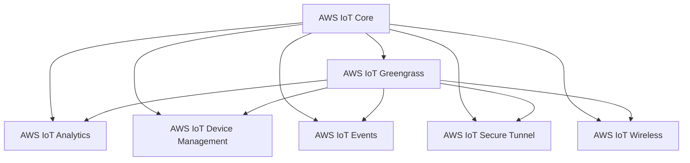

#### 3.1.3 AWS IoT 功能

AWS IoT 提供了多种功能，以帮助开发者构建高效、可靠的物联网解决方案。以下是 AWS IoT 的一些关键功能：

- **设备管理**：支持设备注册、认证、监控和远程配置。开发者可以通过 AWS IoT Device Management 服务对设备进行批量管理和监控。

- **数据传输**：支持 MQTT 和 HTTP 等协议，确保数据可靠传输。AWS IoT 可以处理大量设备并发传输的数据，并提供可靠的消息传输保证。

- **安全性**：提供设备身份认证、数据加密和安全传输机制。AWS IoT 支持多种认证方式，如证书、签名和对称密钥，确保设备通信的安全性。

- **边缘计算**：支持在设备本地运行 AWS Lambda 函数，实现边缘计算。通过 AWS IoT Greengrass，开发者可以在设备本地处理数据，减少延迟和带宽需求。

- **数据处理和分析**：与 AWS Lambda、Amazon Kinesis、Amazon S3 等服务集成，支持大规模数据处理和分析。开发者可以使用 AWS IoT Analytics 对设备数据进行实时分析和处理。

- **集成和扩展**：AWS IoT 可以与 AWS 中的其他服务集成，如 Amazon S3、Amazon RDS、Amazon Redshift 等，提供灵活的扩展能力。

以下是一个简化的 AWS IoT 功能架构图：

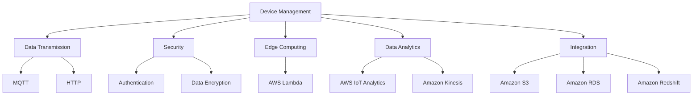

AWS IoT 的功能丰富，能够满足不同场景下的需求。通过利用 AWS IoT 的各项功能，开发者可以构建高效、可靠的物联网解决方案。

### AWS IoT 设备管理

#### 4.1 设备注册

设备注册是物联网平台中的一项基础性工作，它确保设备能够被平台识别和管理。AWS IoT 设备注册过程包括以下步骤：

1. **创建证书**：为了确保设备安全连接到 AWS IoT，需要为每个设备生成证书。证书包含设备私钥和公钥，用于设备身份验证。
2. **上传证书**：将生成的证书上传到 AWS IoT，以便平台能够识别和认证设备。
3. **注册设备**：使用上传的证书在 AWS IoT 中注册设备。注册后，设备将被分配一个唯一的设备标识符（Thing Name）。

以下是一个简化的设备注册流程图：

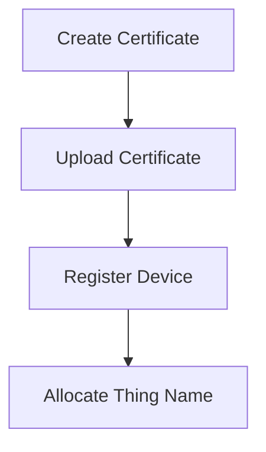

#### 4.2 设备认证

设备认证是确保设备安全连接到物联网平台的关键环节。AWS IoT 提供了多种认证方式，包括证书认证、签名认证和对称密钥认证。

- **证书认证**：使用设备生成的证书进行认证。这是最安全的方式，但需要为每个设备生成和管理证书。
- **签名认证**：使用设备生成的签名进行认证。这种方式简化了证书管理，但安全性略低于证书认证。
- **对称密钥认证**：使用预共享的密钥进行认证。这种方式最简单，但安全性较低。

以下是一个简化的设备认证流程图：

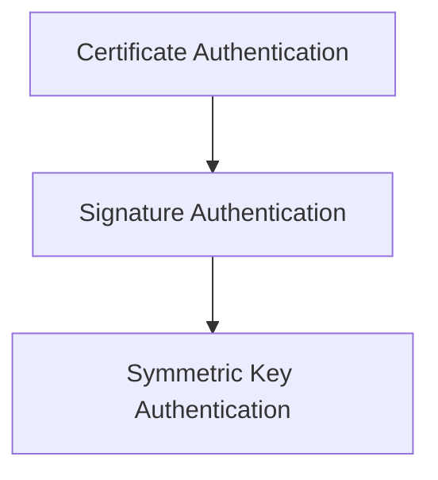

#### 4.3 设备连接

设备连接是指设备通过物联网平台与云进行通信的过程。AWS IoT 支持多种连接协议，包括 MQTT、HTTP 和 WebSocket。

- **MQTT**：是一种轻量级消息传输协议，适用于低带宽和不稳定的网络环境。
- **HTTP**：是一种通用的传输协议，适用于需要可靠传输的应用场景。
- **WebSocket**：是一种双向通信协议，适用于实时交互场景。

以下是一个简化的设备连接流程图：

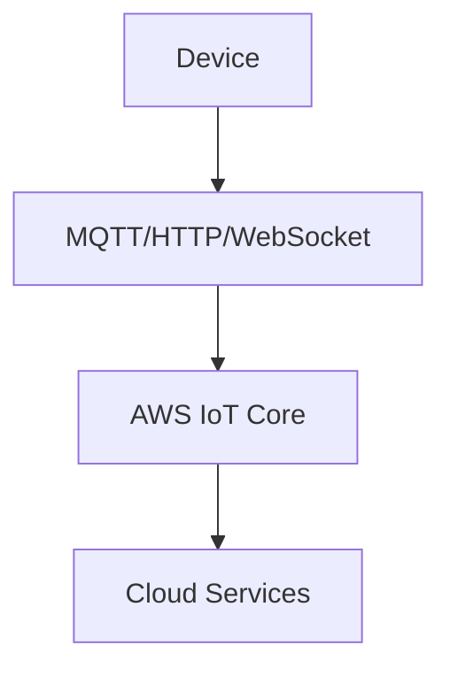

通过设备管理功能，AWS IoT 可以轻松地管理大量设备，确保设备安全、可靠地连接到物联网平台。设备管理是构建物联网解决方案的关键环节，开发者需要熟悉并合理利用 AWS IoT 的设备管理功能。

### AWS IoT 数据传输与管理

#### 5.1 数据传输机制

AWS IoT 提供了多种数据传输机制，以适应不同场景的需求。主要的传输机制包括 MQTT、HTTP 和 WebSocket。

- **MQTT**：是一种轻量级的消息传输协议，适用于低带宽和不稳定的网络环境。MQTT 支持发布/订阅模型，设备可以订阅特定的主题，接收相关的消息。
  
  伪代码示例：
  ```
  function subscribe_topic(device, topic) {
      // 连接到 AWS IoT Broker
      mqtt_client.connect();
      
      // 订阅特定主题
      mqtt_client.subscribe(topic, 0, message_handler);
  }
  
  function message_handler(message) {
      // 处理接收到的消息
      process_message(message);
  }
  ```

- **HTTP**：是一种通用的传输协议，适用于需要可靠传输的应用场景。HTTP 支持简单的请求/响应模型，设备可以通过 HTTP 请求发送数据到物联网平台。

  伪代码示例：
  ```
  function send_data(device, data) {
      // 创建 HTTP 请求
      http_request = new HttpRequest("POST", "https://iot.core.aws.com");
      
      // 设置请求体
      http_request.setBody(data);
      
      // 发送请求
      http_request.send(request_handler);
  }
  
  function request_handler(response) {
      // 处理响应
      if (response.getStatus() == 200) {
          console.log("Data sent successfully");
      } else {
          console.log("Error sending data");
      }
  }
  ```

- **WebSocket**：是一种双向通信协议，适用于实时交互场景。WebSocket 支持全双工通信，设备可以实时发送和接收消息。

  伪代码示例：
  ```
  function connectWebSocket(device) {
      // 连接到 WebSocket Server
      websocket = new WebSocket("wss://iot.core.aws.com");
      
      // 添加消息处理函数
      websocket.onmessage = function(event) {
          process_message(event.data);
      };
      
      // 发送消息
      websocket.send(data);
  }
  ```

#### 5.2 数据存储

在数据传输到云端后，AWS IoT 可以将数据存储到多种服务中，如 Amazon S3、Amazon RDS 和 Amazon DynamoDB。这些服务提供了不同的数据存储和处理能力。

- **Amazon S3**：是一种对象存储服务，适用于大规模数据存储和共享。S3 提供了高可用性、持久性和安全性。
- **Amazon RDS**：是一种关系型数据库服务，适用于需要快速查询和事务处理的应用场景。RDS 提供了多种数据库引擎，如 MySQL、PostgreSQL 和 Oracle。
- **Amazon DynamoDB**：是一种键值存储服务，适用于低延迟、高吞吐量的应用场景。DynamoDB 提供了自动缩放和全球分布。

以下是一个简化的数据存储流程图：

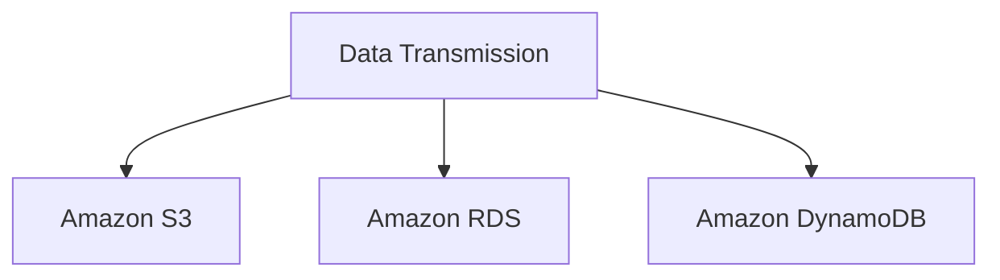

#### 5.3 数据分析

AWS IoT 与多种数据分析服务集成，如 Amazon Kinesis、AWS Lambda 和 Amazon QuickSight。这些服务可以实时分析设备数据，提供实时洞察和可视化。

- **Amazon Kinesis**：是一种实时数据流处理服务，适用于大规模实时数据处理和分析。Kinesis 可以处理高速数据流，并提供高吞吐量。
- **AWS Lambda**：是一种无服务器计算服务，适用于运行短小、独立的代码片段。Lambda 可以处理数据过滤、转换和分析等任务。
- **Amazon QuickSight**：是一种大数据可视化和分析服务，适用于创建交互式报表和仪表板。QuickSight 可以将数据可视化，提供直观的洞察。

以下是一个简化的数据分析流程图：

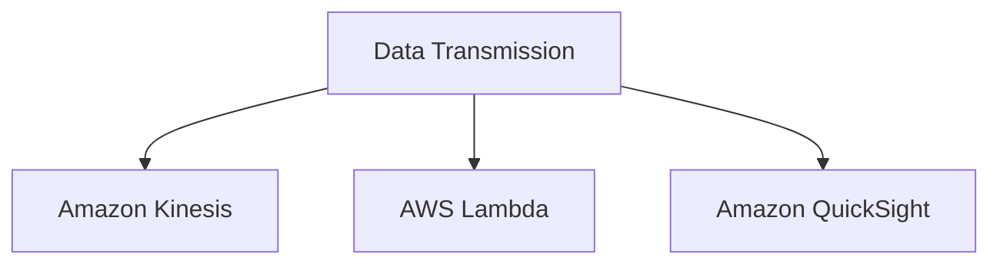

通过丰富的数据传输机制、灵活的数据存储和强大的数据分析能力，AWS IoT 可以帮助开发者构建高效、可靠的物联网解决方案。

### Azure IoT Hub 概述

#### 6.1 Azure IoT Hub 简介

Azure IoT Hub 是微软 Azure 平台提供的一项全面服务，旨在帮助开发者轻松地将设备和应用程序连接到云，并实现设备之间的通信和数据处理。Azure IoT Hub 提供了丰富的功能，包括设备管理、数据传输、安全性和大规模数据处理等，使其成为许多企业构建物联网解决方案的首选平台。

Azure IoT Hub 的主要特点包括：

- **设备管理**：支持设备注册、认证、监控和远程配置。开发者可以通过 Azure IoT Device Management 服务对设备进行批量管理和监控。
- **数据传输**：支持 MQTT、HTTP 和 WebSocket 等协议，确保数据可靠传输。Azure IoT Hub 可以处理大量设备并发传输的数据，并提供可靠的消息传输保证。
- **安全性**：提供设备身份认证、数据加密和安全传输机制。Azure IoT Hub 支持多种认证方式，如证书、签名和对称密钥，确保设备通信的安全性。
- **大规模数据处理**：与 Azure Stream Analytics、Azure Functions 和 Azure Blob Storage 等服务集成，支持大规模数据处理和分析。
- **边缘计算**：支持在设备本地运行 Azure Functions，实现边缘计算。通过 Azure IoT Edge，开发者可以在设备本地处理数据，减少延迟和带宽需求。

#### 6.2 Azure IoT Hub 架构

Azure IoT Hub 的架构设计旨在实现设备的轻松连接、可靠的数据传输和高效的数据处理。其核心组件包括：

- **Azure IoT Hub Core**：核心服务，用于管理设备、处理消息和提供安全性。
- **Azure IoT Edge**：在设备本地运行 Azure Functions，实现边缘计算。
- **Azure IoT Suite**：用于构建定制化的物联网解决方案。
- **Azure Stream Analytics**：用于实时数据流处理。
- **Azure Functions**：用于运行无服务器代码。
- **Azure Blob Storage**：用于数据存储。
- **Azure Event Hubs**：用于大规模数据流处理。

以下是一个简化的 Azure IoT Hub 架构图，展示了主要组件及其相互关系：

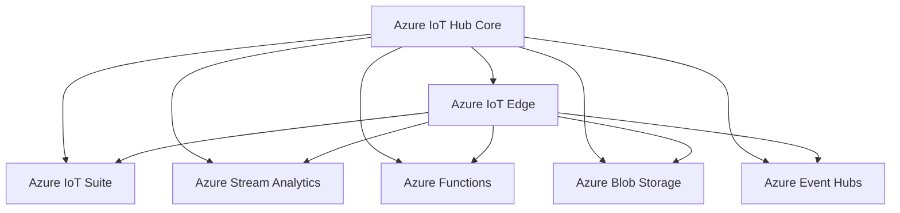

#### 6.3 Azure IoT Hub 功能

Azure IoT Hub 提供了多种功能，以帮助开发者构建高效、可靠的物联网解决方案。以下是 Azure IoT Hub 的一些关键功能：

- **设备管理**：支持设备注册、认证、监控和远程配置。开发者可以通过 Azure IoT Device Management 服务对设备进行批量管理和监控。

- **数据传输**：支持 MQTT、HTTP 和 WebSocket 等协议，确保数据可靠传输。Azure IoT Hub 可以处理大量设备并发传输的数据，并提供可靠的消息传输保证。

- **安全性**：提供设备身份认证、数据加密和安全传输机制。Azure IoT Hub 支持多种认证方式，如证书、签名和对称密钥，确保设备通信的安全性。

- **边缘计算**：支持在设备本地运行 Azure Functions，实现边缘计算。通过 Azure IoT Edge，开发者可以在设备本地处理数据，减少延迟和带宽需求。

- **数据处理和分析**：与 Azure Stream Analytics、Azure Functions 和 Azure Blob Storage 等服务集成，支持大规模数据处理和分析。

- **集成和扩展**：Azure IoT Hub 可以与 Azure 中的其他服务集成，如 Azure Monitor、Azure Logic Apps 和 Azure Machine Learning 等，提供灵活的扩展能力。

以下是一个简化的 Azure IoT Hub 功能架构图：

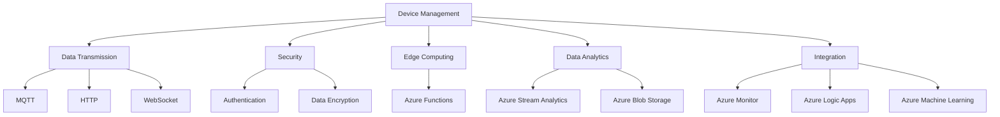

Azure IoT Hub 的功能丰富，能够满足不同场景下的需求。通过利用 Azure IoT Hub 的各项功能，开发者可以构建高效、可靠的物联网解决方案。

### Azure IoT Hub 设备管理

#### 7.1 设备注册

设备注册是物联网平台中的一项基础性工作，它确保设备能够被平台识别和管理。Azure IoT Hub 设备注册过程包括以下步骤：

1. **创建设备身份证书**：为了确保设备安全连接到 Azure IoT Hub，需要为每个设备生成证书。证书包含设备私钥和公钥，用于设备身份验证。
2. **上传设备证书**：将生成的证书上传到 Azure IoT Hub，以便平台能够识别和认证设备。
3. **注册设备**：使用上传的证书在 Azure IoT Hub 中注册设备。注册后，设备将被分配一个唯一的设备标识符（Device ID）。

以下是一个简化的设备注册流程图：

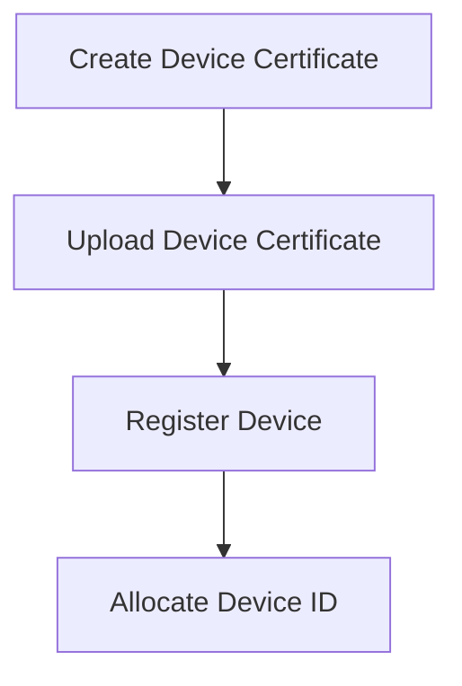

#### 7.2 设备认证

设备认证是确保设备安全连接到物联网平台的关键环节。Azure IoT Hub 提供了多种认证方式，包括证书认证、共享密钥认证和模拟认证。

- **证书认证**：使用设备生成的证书进行认证。这是最安全的方式，但需要为每个设备生成和管理证书。
- **共享密钥认证**：使用预共享的密钥进行认证。这种方式简化了证书管理，但安全性略低于证书认证。
- **模拟认证**：适用于模拟设备测试场景，通过配置模拟设备证书进行认证。

以下是一个简化的设备认证流程图：

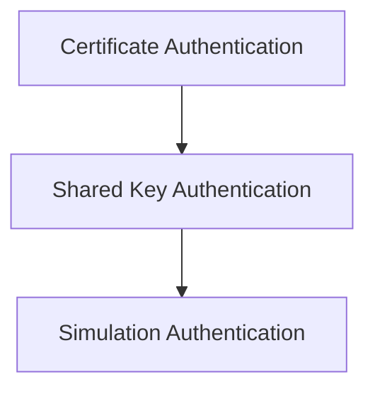

#### 7.3 设备连接

设备连接是指设备通过物联网平台与云进行通信的过程。Azure IoT Hub 支持多种连接协议，包括 MQTT、HTTP 和 WebSocket。

- **MQTT**：是一种轻量级的消息传输协议，适用于低带宽和不稳定的网络环境。MQTT 支持发布/订阅模型，设备可以订阅特定的主题，接收相关的消息。

  伪代码示例：
  ```
  function subscribe_topic(device, topic) {
      // 连接到 Azure IoT Hub MQTT Broker
      mqtt_client.connect();
      
      // 订阅特定主题
      mqtt_client.subscribe(topic, 0, message_handler);
  }
  
  function message_handler(message) {
      // 处理接收到的消息
      process_message(message);
  }
  ```

- **HTTP**：是一种通用的传输协议，适用于需要可靠传输的应用场景。HTTP 支持简单的请求/响应模型，设备可以通过 HTTP 请求发送数据到物联网平台。

  伪代码示例：
  ```
  function send_data(device, data) {
      // 创建 HTTP 请求
      http_request = new HttpRequest("POST", "https://iothub.core.windows.net");
      
      // 设置请求体
      http_request.setBody(data);
      
      // 发送请求
      http_request.send(request_handler);
  }
  
  function request_handler(response) {
      // 处理响应
      if (response.getStatus() == 200) {
          console.log("Data sent successfully");
      } else {
          console.log("Error sending data");
      }
  }
  ```

- **WebSocket**：是一种双向通信协议，适用于实时交互场景。WebSocket 支持全双工通信，设备可以实时发送和接收消息。

  伪代码示例：
  ```
  function connectWebSocket(device) {
      // 连接到 WebSocket Server
      websocket = new WebSocket("wss://iothub.core.windows.net");
      
      // 添加消息处理函数
      websocket.onmessage = function(event) {
          process_message(event.data);
      };
      
      // 发送消息
      websocket.send(data);
  }
  ```

以下是一个简化的设备连接流程图：

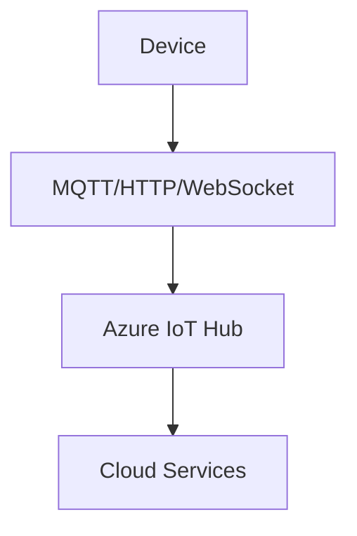

通过设备管理功能，Azure IoT Hub 可以轻松地管理大量设备，确保设备安全、可靠地连接到物联网平台。设备管理是构建物联网解决方案的关键环节，开发者需要熟悉并合理利用 Azure IoT Hub 的设备管理功能。

### Azure IoT Hub 数据传输与管理

#### 8.1 数据传输机制

Azure IoT Hub 提供了多种数据传输机制，以适应不同场景的需求。主要的传输机制包括 MQTT、HTTP 和 WebSocket。

- **MQTT**：是一种轻量级的消息传输协议，适用于低带宽和不稳定的网络环境。MQTT 支持发布/订阅模型，设备可以订阅特定的主题，接收相关的消息。

  伪代码示例：
  ```
  function subscribe_topic(device, topic) {
      // 连接到 Azure IoT Hub MQTT Broker
      mqtt_client.connect();
      
      // 订阅特定主题
      mqtt_client.subscribe(topic, 0, message_handler);
  }
  
  function message_handler(message) {
      // 处理接收到的消息
      process_message(message);
  }
  ```

- **HTTP**：是一种通用的传输协议，适用于需要可靠传输的应用场景。HTTP 支持简单的请求/响应模型，设备可以通过 HTTP 请求发送数据到物联网平台。

  伪代码示例：
  ```
  function send_data(device, data) {
      // 创建 HTTP 请求
      http_request = new HttpRequest("POST", "https://iothub.core.windows.net");
      
      // 设置请求体
      http_request.setBody(data);
      
      // 发送请求
      http_request.send(request_handler);
  }
  
  function request_handler(response) {
      // 处理响应
      if (response.getStatus() == 200) {
          console.log("Data sent successfully");
      } else {
          console.log("Error sending data");
      }
  }
  ```

- **WebSocket**：是一种双向通信协议，适用于实时交互场景。WebSocket 支持全双工通信，设备可以实时发送和接收消息。

  伪代码示例：
  ```
  function connectWebSocket(device) {
      // 连接到 WebSocket Server
      websocket = new WebSocket("wss://iothub.core.windows.net");
      
      // 添加消息处理函数
      websocket.onmessage = function(event) {
          process_message(event.data);
      };
      
      // 发送消息
      websocket.send(data);
  }
  ```

#### 8.2 数据存储

在数据传输到云端后，Azure IoT Hub 可以将数据存储到多种服务中，如 Azure Blob Storage、Azure Table Storage 和 Azure Cosmos DB。这些服务提供了不同的数据存储和处理能力。

- **Azure Blob Storage**：是一种对象存储服务，适用于大规模数据存储和共享。Blob Storage 提供了高可用性、持久性和安全性。
- **Azure Table Storage**：是一种非关系型数据库服务，适用于低延迟、高吞吐量的应用场景。Table Storage 提供了自动缩放和全球分布。
- **Azure Cosmos DB**：是一种分布式数据库服务，适用于大规模数据存储和实时查询。Cosmos DB 提供了多种数据模型和 API，如文档、键值、宽列和图形。

以下是一个简化的数据存储流程图：

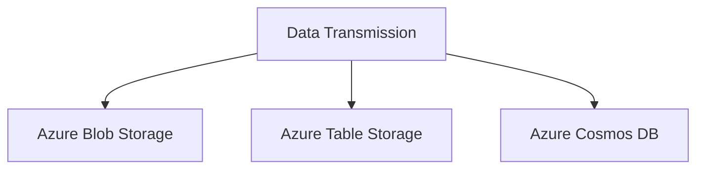

#### 8.3 数据分析

Azure IoT Hub 与多种数据分析服务集成，如 Azure Stream Analytics、Azure Functions 和 Azure Machine Learning。这些服务可以实时分析设备数据，提供实时洞察和可视化。

- **Azure Stream Analytics**：是一种实时数据流处理服务，适用于大规模实时数据处理和分析。Stream Analytics 可以处理高速数据流，并提供高吞吐量。
- **Azure Functions**：是一种无服务器计算服务，适用于运行短小、独立的代码片段。Functions 可以处理数据过滤、转换和分析等任务。
- **Azure Machine Learning**：是一种机器学习服务，适用于构建、训练和部署机器学习模型。Machine Learning 可以对设备数据进行实时分析和预测。

以下是一个简化的数据分析流程图：

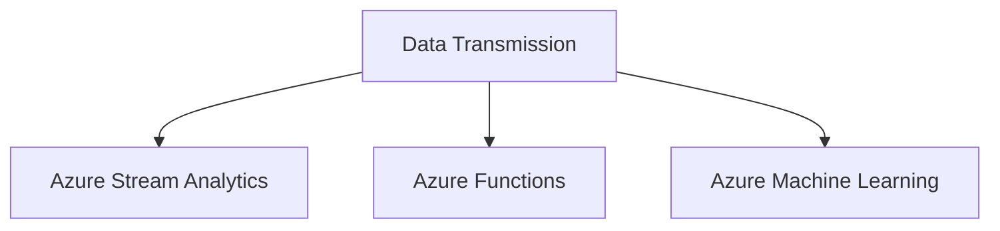

通过丰富的数据传输机制、灵活的数据存储和强大的数据分析能力，Azure IoT Hub 可以帮助开发者构建高效、可靠的物联网解决方案。

### AWS IoT 与 Azure IoT Hub 的对比

#### 9.1 功能对比

AWS IoT 和 Azure IoT Hub 都提供了丰富的功能，以满足不同场景下的物联网需求。以下是两个平台在功能上的主要对比：

1. **设备管理**：
   - **AWS IoT**：提供设备注册、认证、监控和远程配置等功能。开发者可以通过 AWS IoT Device Management 服务对设备进行批量管理和监控。
   - **Azure IoT Hub**：同样提供设备注册、认证、监控和远程配置等功能。开发者可以通过 Azure IoT Device Management 服务对设备进行批量管理和监控。

2. **数据传输**：
   - **AWS IoT**：支持 MQTT、HTTP 和 WebSocket 等协议，确保数据可靠传输。AWS IoT 可以处理大量设备并发传输的数据，并提供可靠的消息传输保证。
   - **Azure IoT Hub**：也支持 MQTT、HTTP 和 WebSocket 等协议，确保数据可靠传输。Azure IoT Hub 可以处理大量设备并发传输的数据，并提供可靠的消息传输保证。

3. **安全性**：
   - **AWS IoT**：提供设备身份认证、数据加密和安全传输机制。AWS IoT 支持多种认证方式，如证书、签名和对称密钥，确保设备通信的安全性。
   - **Azure IoT Hub**：同样提供设备身份认证、数据加密和安全传输机制。Azure IoT Hub 支持多种认证方式，如证书、签名和对称密钥，确保设备通信的安全性。

4. **边缘计算**：
   - **AWS IoT**：支持在设备本地运行 AWS Lambda 函数，实现边缘计算。通过 AWS IoT Greengrass，开发者可以在设备本地处理数据，减少延迟和带宽需求。
   - **Azure IoT Hub**：支持在设备本地运行 Azure Functions，实现边缘计算。通过 Azure IoT Edge，开发者可以在设备本地处理数据，减少延迟和带宽需求。

5. **数据处理和分析**：
   - **AWS IoT**：与 AWS Lambda、Amazon Kinesis、Amazon S3 等服务集成，支持大规模数据处理和分析。开发者可以使用 AWS IoT Analytics 对设备数据进行实时分析和处理。
   - **Azure IoT Hub**：与 Azure Stream Analytics、Azure Functions 和 Azure Blob Storage 等服务集成，支持大规模数据处理和分析。开发者可以使用 Azure Stream Analytics 对设备数据进行实时分析和处理。

以下是一个简化的功能对比图，展示了 AWS IoT 和 Azure IoT Hub 的主要功能：

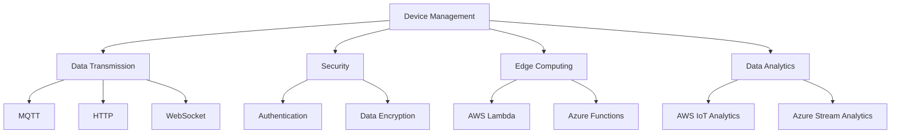

#### 9.2 性能对比

在性能方面，AWS IoT 和 Azure IoT Hub 都表现出色，但具体性能取决于多种因素，如数据处理能力、连接数和网络延迟等。

1. **数据处理能力**：
   - **AWS IoT**：AWS IoT 提供了强大的数据处理能力，支持大规模并发数据处理。AWS IoT 与 AWS Lambda、Amazon Kinesis 等服务的集成，可以处理和分析大量设备数据。
   - **Azure IoT Hub**：Azure IoT Hub 也提供了强大的数据处理能力，支持大规模并发数据处理。Azure IoT Hub 与 Azure Stream Analytics、Azure Functions 等服务的集成，可以处理和分析大量设备数据。

2. **连接数**：
   - **AWS IoT**：AWS IoT 可以同时支持数百万个设备连接，适合大型物联网应用场景。
   - **Azure IoT Hub**：Azure IoT Hub 可以同时支持数百万个设备连接，同样适合大型物联网应用场景。

3. **网络延迟**：
   - **AWS IoT**：AWS IoT 的网络延迟较低，尤其是在使用 AWS 全球基础设施的情况下。
   - **Azure IoT Hub**：Azure IoT Hub 的网络延迟也较低，尤其是在使用 Azure 全球基础设施的情况下。

以下是一个简化的性能对比图，展示了 AWS IoT 和 Azure IoT Hub 的主要性能指标：

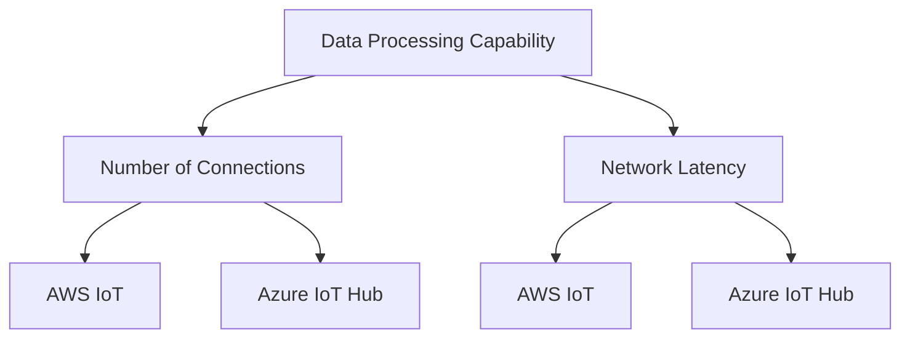

#### 9.3 使用场景对比

在实际应用中，AWS IoT 和 Azure IoT Hub 都有各自的优势和适用场景。以下是一些常见的使用场景对比：

1. **智能家居**：
   - **AWS IoT**：适合智能家居场景，特别是与 AWS Lambda 和 Amazon Alexa 集成时，可以实现设备自动化控制和智能交互。
   - **Azure IoT Hub**：也适合智能家居场景，特别是与 Azure Functions 和 Microsoft Azure AI Services 集成时，可以实现设备自动化控制和智能交互。

2. **工业物联网**：
   - **AWS IoT**：适合工业物联网场景，特别是与 AWS Lambda、Amazon S3 和 AWS IoT Analytics 集成时，可以实现设备数据实时分析和预测。
   - **Azure IoT Hub**：也适合工业物联网场景，特别是与 Azure Stream Analytics、Azure Functions 和 Azure Machine Learning 集成时，可以实现设备数据实时分析和预测。

3. **智慧城市**：
   - **AWS IoT**：适合智慧城市场景，特别是与 AWS Lambda、Amazon Kinesis 和 AWS IoT Analytics 集成时，可以实现实时数据分析和监控。
   - **Azure IoT Hub**：也适合智慧城市场景，特别是与 Azure Stream Analytics、Azure Functions 和 Azure Machine Learning 集成时，可以实现实时数据分析和监控。

以下是一个简化的使用场景对比图，展示了 AWS IoT 和 Azure IoT Hub 在不同场景中的适用性：

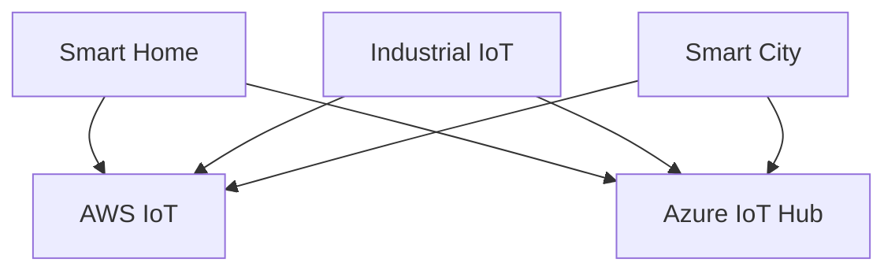

综上所述，AWS IoT 和 Azure IoT Hub 在功能、性能和使用场景上各有优势。开发者可以根据具体需求选择适合的平台，以构建高效、可靠的物联网解决方案。

### 物联网平台实战项目

#### 10.1 项目背景

为了展示物联网平台在实际项目中的应用，本文将介绍一个智能家居项目的案例。该项目的目标是实现家庭设备的远程监控和控制，提高生活便利性。项目涉及的主要设备包括智能灯泡、智能门锁和智能温度传感器。这些设备通过物联网平台连接到云端，实现数据的传输和智能处理。

#### 10.2 项目需求

- **设备连接**：将智能灯泡、智能门锁和智能温度传感器连接到物联网平台。
- **数据传输**：实现设备数据的实时传输，包括开关状态、门锁状态和温度数据。
- **远程控制**：允许用户通过手机应用程序远程控制设备。
- **数据分析**：对设备数据进行实时分析和展示，提供智能建议和优化方案。

#### 10.3 系统设计

系统设计包括以下关键组件：

1. **设备端**：
   - **智能灯泡**：支持 MQTT 协议，可以通过物联网平台接收远程控制指令。
   - **智能门锁**：支持 MQTT 协议，可以通过物联网平台接收远程控制指令。
   - **智能温度传感器**：支持 MQTT 协议，可以实时传输温度数据到物联网平台。

2. **物联网平台**：
   - **AWS IoT**：用于设备连接、数据传输和安全认证。
   - **AWS Lambda**：用于处理设备数据，实现边缘计算。
   - **Amazon S3**：用于数据存储和备份。

3. **客户端**：
   - **手机应用程序**：用于用户远程控制设备，接收设备数据。

以下是一个简化的系统设计图：

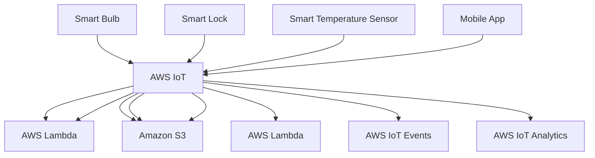

#### 10.4 代码实现

以下代码示例展示了如何使用 AWS IoT 和 AWS Lambda 实现设备连接和数据传输。

**设备端**（Python）：

```python
import json
import paho.mqtt.client as mqtt

# MQTT Broker 配置
MQTT_BROKER = "a1a2b3c4d5e6-iot.example.com.s3-external-1.amazonaws.com"
MQTT_PORT = 8883
MQTT_TOPIC = "home/sensor"

# AWS IoT 配置
AWS_CERT_FILE = "path/to/certificate.pem.crt"
AWS_PRIVATE_KEY_FILE = "path/to/private.pem.key"

# 创建 MQTT 客户端
client = mqtt.Client()

# 加载证书和密钥
client.tls_set(AWS_CERT_FILE, AWS_PRIVATE_KEY_FILE, "ca.pem")

# 连接到 MQTT Broker
client.connect(MQTT_BROKER, MQTT_PORT)

# 连接成功后，订阅主题
client.subscribe(MQTT_TOPIC)

# 处理接收到的消息
def message_handler(client, userdata, message):
    print(f"Received message: {str(message.payload)} on topic {message.topic}")

# 设置消息处理函数
client.on_message = message_handler

# 发送消息
def send_message(data):
    client.publish(MQTT_TOPIC, json.dumps(data))

# 启动 MQTT 客户端
client.loop_forever()
```

**AWS Lambda**（Python）：

```python
import json
import boto3

# 初始化 S3 客户端
s3_client = boto3.client('s3')

def lambda_handler(event, context):
    # 获取设备数据
    device_data = event['body']
    
    # 将设备数据存储到 S3
    s3_client.put_object(
        Bucket='your-bucket-name',
        Key=f"device_data/{event['device_id']}.json",
        Body=json.dumps(device_data)
    )
    
    return {
        'statusCode': 200,
        'body': json.dumps('Device data stored successfully')
    }
```

#### 10.5 项目部署

部署物联网平台实战项目涉及以下步骤：

1. **设备端部署**：
   - 将智能设备连接到本地网络。
   - 配置设备的 MQTT 客户端，连接到 AWS IoT。
   - 部署 AWS IoT Device SDK。

2. **AWS Lambda 部署**：
   - 创建 AWS Lambda 函数。
   - 配置 Lambda 函数的触发器和权限。
   - 上传 Lambda 函数代码。

3. **Amazon S3 部署**：
   - 创建 S3 存储桶。
   - 配置 S3 存储桶的权限和 CORS 规则。

4. **客户端部署**：
   - 开发手机应用程序。
   - 配置应用程序连接到 AWS IoT。
   - 实现用户界面和远程控制功能。

#### 10.6 项目优化与扩展

在项目部署后，可以根据实际需求进行优化和扩展：

- **性能优化**：根据设备数量和数据处理需求，调整 AWS Lambda 的配置，提高并发处理能力。
- **安全性优化**：为 IoT 设备和应用增加安全性措施，如设备认证、数据加密和访问控制。
- **功能扩展**：根据用户需求，添加新的设备类型和功能，如智能摄像头、智能音箱等。

通过本项目的实战案例，展示了如何使用 AWS IoT 和 Azure IoT Hub 构建高效的物联网解决方案。开发者可以根据项目需求，选择合适的平台和工具，实现各种物联网应用。

### 物联网平台安全

#### 11.1 物联网安全概述

随着物联网设备的普及，物联网安全越来越受到关注。物联网安全涉及多个方面，包括设备安全、数据安全和通信安全等。以下是对物联网安全的一些基本概述。

- **设备安全**：确保物联网设备的硬件和软件不受恶意攻击。这包括防止设备被黑客入侵、篡改或损坏。
- **数据安全**：确保传输和存储的数据不被未授权访问或篡改。这包括数据加密、认证和完整性校验。
- **通信安全**：确保设备与云平台、其他设备之间的通信不被窃听或篡改。这包括使用安全的通信协议和加密技术。

#### 11.2 AWS IoT 安全机制

AWS IoT 提供了多种安全机制，以保护物联网设备和数据。

- **设备认证**：AWS IoT 使用 X.509 证书进行设备认证。设备在注册时生成证书，证书包含公钥和私钥，用于设备身份验证。
- **数据加密**：AWS IoT 使用 TLS/SSL 协议确保设备与物联网平台之间的通信安全。数据在传输过程中使用 AES-256 加密算法进行加密。
- **访问控制**：AWS IoT 使用 IAM（身份访问管理）提供访问控制。开发者可以创建用户、角色和策略，控制谁可以访问 IoT 资源。
- **日志记录和监控**：AWS IoT 提供日志记录和监控功能，帮助开发者跟踪设备活动和安全事件。

以下是一个简化的 AWS IoT 安全机制流程图：

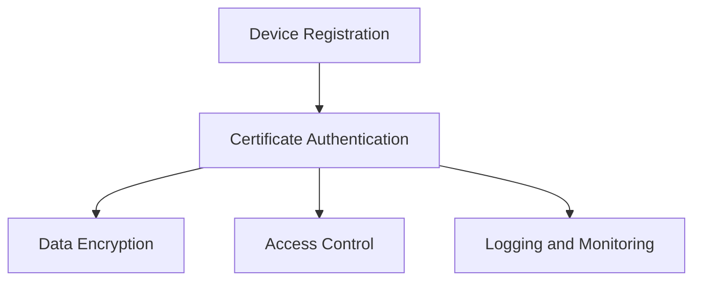

#### 11.3 Azure IoT Hub 安全机制

Azure IoT Hub 也提供了丰富的安全机制，以确保物联网设备和数据的安全。

- **设备认证**：Azure IoT Hub 使用 X.509 证书或共享密钥进行设备认证。设备在注册时生成证书或密钥，用于设备身份验证。
- **数据加密**：Azure IoT Hub 使用 TLS/SSL 协议确保设备与物联网平台之间的通信安全。数据在传输过程中使用 AES-256 加密算法进行加密。
- **访问控制**：Azure IoT Hub 使用 Azure Active Directory（Azure AD）提供访问控制。开发者可以创建用户、角色和策略，控制谁可以访问 IoT 资源。
- **安全策略**：Azure IoT Hub 提供安全策略，包括设备身份验证、数据加密和传输协议等。

以下是一个简化的 Azure IoT Hub 安全机制流程图：

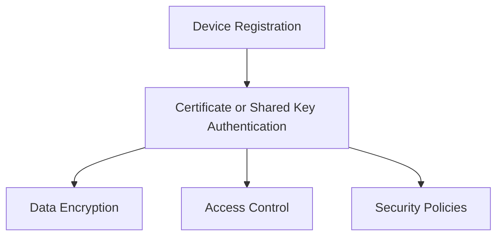

#### 11.4 安全最佳实践

为了确保物联网平台的安全，开发者可以遵循以下最佳实践：

- **使用强密码和证书**：为物联网设备和云服务设置强密码和证书，避免使用默认密码和弱密码。
- **定期更新软件和固件**：及时更新物联网设备和平台的软件和固件，修复已知漏洞。
- **数据加密**：对传输和存储的数据进行加密，确保数据不被窃取或篡改。
- **访问控制**：使用 IAM 或 Azure AD 等工具，严格控制对物联网资源的访问权限。
- **监控和日志记录**：启用日志记录和监控功能，及时跟踪和响应安全事件。
- **安全培训**：为开发者和用户提供安全培训，提高安全意识和防范能力。

通过遵循这些最佳实践，开发者可以构建安全可靠的物联网平台，保护物联网设备和数据的安全。

### 物联网平台发展趋势

随着技术的不断进步和应用场景的不断拓展，物联网平台正朝着更高效、更智能、更安全的方向发展。以下是一些未来物联网平台的发展趋势：

#### 1. 边缘计算与云计算的深度融合

随着物联网设备数量的激增，边缘计算将变得越来越重要。边缘计算可以在设备本地处理数据，减少延迟和网络负担。未来，边缘计算将与云计算深度融合，实现云端与边缘端的协同工作，为物联网应用提供更高效、更灵活的计算能力。

#### 2. 人工智能与物联网的结合

人工智能技术将在物联网平台中发挥重要作用。通过人工智能，物联网平台可以实时分析设备数据，提供智能决策和自动化控制。例如，智能家居系统可以利用人工智能技术实现智能照明、智能安防和智能节能等功能。

#### 3. 物联网安全的持续提升

随着物联网设备的普及，物联网安全将成为一个长期关注的领域。未来，物联网平台将不断引入新的安全机制和技术，如区块链、多方安全计算等，以提升物联网平台的安全性。同时，开发者也需要不断提高安全意识和能力，确保物联网设备和数据的安全。

#### 4. 5G 与物联网的深度融合

5G 技术的推广将大大提升物联网平台的性能和可靠性。5G 网络具有高速度、低延迟和高可靠性的特点，将为物联网应用提供更优质的网络环境。未来，5G 与物联网的深度融合将推动物联网应用的发展，如智能城市、智能交通和智能医疗等。

#### 5. 多元化的物联网平台生态

未来，物联网平台将呈现多元化的生态。除了 AWS IoT 和 Azure IoT Hub 这样的通用平台外，还有许多垂直领域的物联网平台，如智慧农业、智慧能源、智慧医疗等。这些平台将根据特定领域的需求，提供定制化的解决方案。

#### 6. 物联网平台开源化

随着物联网技术的发展，越来越多的物联网平台将走向开源化。开源平台可以促进技术交流和合作，加速物联网技术的创新和应用。未来，开源物联网平台将成为物联网生态系统的重要组成部分。

通过以上发展趋势，我们可以看到，物联网平台在未来将变得更加高效、智能和安全。开发者需要紧跟技术发展趋势，不断创新和优化物联网平台，为用户提供更好的物联网体验。

### 附录

#### 附录 A: AWS IoT 和 Azure IoT Hub API 文档

- **AWS IoT API 文档**：[https://docs.aws.amazon.com/general/latest/gr/iotsvcs.html](https://docs.aws.amazon.com/general/latest/gr/iotsvcs.html)
- **Azure IoT Hub API 文档**：[https://docs.microsoft.com/zh-cn/azure/iot-hub/iot-hub-devguide](https://docs.microsoft.com/zh-cn/azure/iot-hub/iot-hub-devguide)

#### 附录 B: 常见问题与解答

1. **什么是物联网平台？**
   - 物联网平台是一个软件和硬件的综合解决方案，用于连接、管理和分析物联网设备的数据。它可以提供设备管理、数据传输、安全性和数据处理等功能。

2. **AWS IoT 和 Azure IoT Hub 有什么区别？**
   - AWS IoT 和 Azure IoT Hub 都是全面的物联网平台，但它们在功能、性能和集成方面存在一些差异。AWS IoT 更注重与 AWS 服务集成的灵活性，而 Azure IoT Hub 则在边缘计算和数据处理方面表现突出。

3. **如何确保物联网平台的安全性？**
   - 物联网平台的安全性可以通过使用强密码、证书认证、数据加密和访问控制等措施来确保。开发者还应定期更新软件和固件，以修复安全漏洞。

4. **物联网平台适合哪些应用场景？**
   - 物联网平台适用于各种应用场景，如智能家居、智慧城市、工业物联网、智慧农业和医疗保健等。开发者可以根据具体需求选择合适的平台和工具。

#### 附录 C: 代码示例

以下提供了 AWS IoT 和 Azure IoT Hub 的基本代码示例，用于设备注册、数据传输和设备管理。

**AWS IoT 设备注册（Python）**：

```python
import json
import paho.mqtt.client as mqtt

# MQTT Broker 配置
MQTT_BROKER = "a1a2b3c4d5e6-iot.example.com.s3-external-1.amazonaws.com"
MQTT_PORT = 8883
MQTT_TOPIC = "home/sensor"

# AWS IoT Device SDK 配置
import AWSIoTDeviceSDK

device = AWSIoTDeviceSDK.AWSIoTDevice()
device.set_certificate("path/to/certificate.pem.crt", "path/to/private.pem.key")

# 连接到 MQTT Broker
device.connect(MQTT_BROKER, MQTT_PORT)

# 注册设备
device.register("device_id", "device_type", "device_model")

# 发布消息
device.publish("home/sensor/data", "{'temperature': 25, 'humidity': 40}")
```

**Azure IoT Hub 设备注册（Python）**：

```python
from azure.iot import IoTHubDeviceClient

# Azure IoT Hub 配置
IOTHUB_CONNECTION_STRING = "your_connection_string"
DEVICE_ID = "your_device_id"
DEVICE_TYPE = "your_device_type"
DEVICE_MODEL = "your_device_model"

# 创建设备客户端
device_client = IoTHubDeviceClient.create_from_connection_string(IOTHUB_CONNECTION_STRING)

# 注册设备
device_client.register_device(DEVICE_ID, DEVICE_TYPE, DEVICE_MODEL)

# 发布消息
device_client.send_message("home/sensor/data", "{'temperature': 25, 'humidity': 40}")
```

通过这些代码示例，开发者可以快速上手 AWS IoT 和 Azure IoT Hub 的基本操作。在实际应用中，开发者需要根据具体需求进行适当的修改和扩展。

