                 


### 文章标题

# 理解洞察力的价值：在不确定性中的导航灯塔

### 关键词

- 洞察力
- 不确定性
- 决策
- 数据分析
- 风险管理
- 创新
- 组织管理
- 个人成长

### 摘要

本文将深入探讨洞察力这一关键能力在不确定性环境中的价值。通过分析洞察力的定义、构成要素及其与不确定性的关系，我们将揭示洞察力在个人成长、组织管理和创新中的重要作用。同时，本文还将探讨如何通过实践和策略提升洞察力，并在项目管理、市场营销等实际应用中展现其价值。最后，我们将对洞察力的未来发展进行展望，并提出面临的挑战。

## 第一部分：洞察力的概念与价值

### 1.1 洞察力的定义与重要性

#### 1.1.1 洞察力的概念解析

洞察力，是指个体在面对复杂问题和不确定性情境时，能够迅速、准确地进行观察、分析、判断和决策的能力。它不仅包括观察能力，还涉及分析能力和判断力。洞察力是一种综合能力，它能够帮助人们更好地理解事物本质，预见潜在趋势，并作出明智的决策。

#### 1.1.2 洞察力在个人成长中的作用

在个人成长中，洞察力起着至关重要的作用。首先，洞察力帮助个人更好地理解自己和他人，从而提升人际交往能力。其次，洞察力能够帮助个人在面对复杂问题时，快速找到解决方法，提升解决问题的能力。此外，洞察力还能够激发个人的创造力和创新能力，帮助个人在竞争激烈的环境中脱颖而出。

#### 1.1.3 洞察力在组织管理中的价值

在组织管理中，洞察力同样具有重要价值。首先，洞察力帮助领导者更好地理解市场和行业趋势，从而制定出更具前瞻性的战略规划。其次，洞察力能够帮助组织在面对不确定性时，快速做出调整和应对，降低风险。此外，洞察力还能够促进组织内部的知识共享和团队协作，提升组织的整体创新能力。

### 1.2 洞察力的构成要素

#### 1.2.1 观察能力

观察能力是洞察力的基础。它涉及对信息的敏锐捕捉和深入理解。提升观察能力需要掌握以下技巧：

- **观察技巧的提升**：通过系统化的训练，提高观察的准确性和全面性。
- **观察过程中的心理因素**：理解观察过程中的心理因素，如注意力、情绪等，有助于提高观察能力。

#### 1.2.2 分析能力

分析能力是指对观察到信息进行系统分析和综合的能力。提升分析能力的方法包括：

- **分析方法的应用**：掌握多种分析方法，如SWOT分析、PEST分析等，能够帮助更全面地分析问题。
- **数据分析在洞察力中的作用**：数据分析是洞察力的重要组成部分，通过数据分析，可以揭示隐藏在数据背后的规律和趋势。

#### 1.2.3 判断力

判断力是指根据分析结果做出合理判断和决策的能力。提升判断力需要：

- **判断力的培养方法**：通过实践和经验积累，培养快速判断和决策的能力。
- **判断力在决策中的作用**：判断力在决策过程中起着关键作用，它帮助个体在不确定性环境中做出合理选择。

### 1.3 洞察力与不确定性的关系

#### 1.3.1 不确定性的概念与类型

不确定性是指未来结果的不确定性，它可以分为以下几种类型：

- **随机不确定性**：结果完全由随机因素决定，无法预测。
- **模糊不确定性**：结果不完全由随机因素决定，但信息不足，无法准确预测。
- **决策不确定性**：决策者面对多种选择，每种选择都有不同的结果和概率。

#### 1.3.2 洞察力在应对不确定性中的角色

在不确定性环境中，洞察力起着导航灯塔的作用。它能够帮助个体：

- **预测潜在趋势**：通过洞察力，个体可以预见潜在的趋势和变化，从而做出更有前瞻性的决策。
- **降低风险**：洞察力帮助个体识别潜在的风险，并采取相应的应对策略，降低不确定性带来的负面影响。

#### 1.3.3 洞察力在预测与风险控制中的应用

洞察力在预测和风险控制中具有重要作用：

- **预测应用**：通过洞察力，个体可以预测未来的趋势和变化，从而制定出更科学的决策。
- **风险控制应用**：洞察力帮助个体识别潜在的风险，并采取相应的措施进行风险控制，确保组织或个人的稳定发展。

## 第二部分：洞察力的实践与应用

### 2.1 洞察力的培养与实践

#### 2.1.1 洞察力培养的方法论

培养洞察力需要系统的方法论，包括以下几个方面：

- **阅读与学习**：广泛阅读和学习，积累知识，提升观察能力。
- **经验积累**：通过实践和经验积累，提升分析能力和判断力。
- **反思与总结**：定期反思和总结，从经验中学习和成长。

#### 2.1.2 实践案例分享

以下是一些洞察力培养的实践案例：

- **个人洞察力培养案例**：通过阅读、实践和反思，一位创业者成功提升了自身的洞察力，从而在创业过程中取得了显著成功。
- **组织洞察力培养案例**：一家企业通过建立学习型组织，鼓励员工进行知识共享和反思，从而提升了整体的洞察力，实现了持续创新。

### 2.1.3 洞察力在决策中的运用

#### 2.1.3.1 洞察力在信息收集中的作用

在决策过程中，洞察力首先体现在信息收集阶段。通过洞察力，个体能够：

- **识别关键信息**：从大量信息中识别出关键信息，确保信息收集的全面性和准确性。
- **筛选信息**：根据需求筛选出最有价值的信息，避免信息过载。

#### 2.1.3.2 洞察力在方案评估中的应用

在方案评估阶段，洞察力可以帮助个体：

- **分析方案的优缺点**：通过洞察力，个体可以全面分析每个方案的优缺点，从而做出更科学的决策。
- **预见潜在问题**：洞察力帮助个体预见方案实施过程中可能遇到的问题，提前制定应对策略。

### 2.1.4 洞察力在风险管理中的应用

#### 2.1.4.1 风险识别

在风险管理中，洞察力首先用于风险识别。通过洞察力，个体能够：

- **识别潜在风险**：从潜在的风险因素中识别出可能对组织或个人造成负面影响的风险。
- **评估风险概率**：通过分析历史数据和当前环境，评估风险发生的概率。

#### 2.1.4.2 风险评估

在风险评估阶段，洞察力可以帮助个体：

- **分析风险影响**：评估每个风险对组织或个人的潜在影响，确定风险的优先级。
- **制定风险应对策略**：根据风险评估结果，制定相应的风险应对策略，降低风险发生的可能性。

### 2.1.5 洞察力在创新中的推动作用

#### 2.1.5.1 创新过程中的洞察力

在创新过程中，洞察力起着关键作用。通过洞察力，个体能够：

- **发现问题**：发现现有产品、服务或流程中存在的问题，为创新提供方向。
- **设计解决方案**：通过洞察力，个体可以设计出更符合市场需求和用户期望的创新解决方案。

#### 2.1.5.2 洞察力在市场预测中的应用

在市场预测中，洞察力可以帮助个体：

- **分析市场趋势**：通过洞察力，个体可以分析市场趋势，预测未来的市场变化。
- **评估竞争对手**：洞察力帮助个体评估竞争对手的策略和实力，制定相应的竞争策略。

### 2.1.6 洞察力在其他领域的应用

除了上述领域，洞察力还可以在其他领域发挥重要作用，如：

- **项目管理**：通过洞察力，项目管理者可以更好地预测项目进度，识别潜在风险，确保项目顺利进行。
- **市场营销**：洞察力帮助市场人员分析消费者需求，预测市场趋势，制定更有效的营销策略。

## 第三部分：洞察力的提升与优化

### 3.1 洞察力提升的策略

#### 3.1.1 系统性学习方法

提升洞察力需要系统性的学习方法，包括以下几个方面：

- **构建知识体系**：通过系统性地学习，构建知识体系，提升观察能力和分析能力。
- **转变思维方式**：培养批判性思维和创造性思维，提升判断力和创新能力。

#### 3.1.2 多元化视角的培养

多元化视角的培养是提升洞察力的重要策略，包括以下几个方面：

- **文化交流与体验**：通过文化交流和体验，拓宽视野，提升跨文化沟通能力。
- **跨领域学习**：跨领域学习可以帮助个体从不同角度看待问题，提升洞察力。

### 3.1.3 反思与持续改进

反思与持续改进是提升洞察力的关键。通过以下方法，个体可以不断提升洞察力：

- **定期反思**：定期反思自己的思考过程和决策结果，找出不足之处，并采取改进措施。
- **持续改进**：根据反思结果，持续改进思维方法和决策过程，提升洞察力。

### 3.2 洞察力优化的方法

#### 3.2.1 反思与持续改进

反思与持续改进是提升洞察力的重要方法。通过以下方法，个体可以不断优化洞察力：

- **反思的重要性**：反思可以帮助个体发现思维过程中的盲点和不足，从而有针对性地进行改进。
- **持续改进的策略**：通过持续改进，个体可以不断提升思维方法和决策能力，优化洞察力。

#### 3.2.2 洞察力评估与反馈

为了确保洞察力的提升，个体需要进行评估与反馈。以下方法可以帮助个体进行评估与反馈：

- **洞察力评估指标**：制定合适的评估指标，对洞察力进行量化评估。
- **反馈机制的应用**：建立反馈机制，及时收集反馈信息，并根据反馈进行改进。

### 3.2.3 组织内洞察力培养策略

在组织层面，培养洞察力需要采取以下策略：

- **培训与教育**：组织内部进行培训和教育活动，提升员工洞察力。
- **团队协作与知识共享**：鼓励团队协作，促进知识共享，提升整体洞察力。

### 3.2.4 洞察力的组织培养

组织层面洞察力的培养对于组织发展具有重要意义。以下策略可以帮助组织培养洞察力：

- **信任与支持**：建立信任和支持的文化氛围，鼓励员工提出意见和建议。
- **鼓励创新与试错**：鼓励员工进行创新和尝试，允许失败，从失败中学习和成长。

### 3.2.5 洞察力优化的工具与技术

为了优化洞察力，组织可以采用以下工具和技术：

- **数据分析工具**：利用数据分析工具，对大量数据进行处理和分析，提升洞察力。
- **人工智能技术**：借助人工智能技术，如机器学习、自然语言处理等，提升信息处理和分析能力。

### 3.2.6 洞察力优化的实践案例

以下是一些洞察力优化的实践案例：

- **案例一**：一家企业通过引入数据分析工具和人工智能技术，优化了市场预测和风险评估，提升了决策准确性。
- **案例二**：一个团队通过定期反思和持续改进，不断优化决策过程，提升了整体洞察力。

### 3.2.7 洞察力优化的最佳实践与建议

以下是一些洞察力优化的最佳实践与建议：

- **定期反思与总结**：定期反思和总结，从经验中学习和成长。
- **培养批判性思维**：培养批判性思维，勇于质疑和挑战现有观念。
- **持续学习与更新**：持续学习新知识和技能，保持思维的前沿性。

## 第四部分：案例分析与应用实践

### 4.1 案例分析

#### 4.1.1 洞察力在个人成长中的案例分析

以下是一个关于个人成长中洞察力培养的案例分析：

**案例一：一位创业者的洞察力培养**

**背景**：小李是一名年轻的创业者，他在创办一家初创公司时面临着诸多挑战。

**过程**：

1. **阅读与学习**：小李通过阅读行业报告、参加创业培训等方式，积累行业知识和经验。
2. **经验积累**：小李通过实际操作和不断反思，总结创业过程中的经验和教训。
3. **反思与总结**：小李定期反思自己的思考过程和决策结果，发现并改进不足之处。

**结果**：通过洞察力的培养，小李成功地克服了创业过程中的困难，使公司逐步发展壮大。

#### 4.1.2 洞察力在组织管理中的案例分析

以下是一个关于组织管理中洞察力培养的案例分析：

**案例二：一个成功转型的企业**

**背景**：某家企业由于市场环境变化，面临巨大的转型压力。

**过程**：

1. **市场趋势分析**：企业通过洞察力，分析了市场趋势和竞争对手，明确了转型方向。
2. **团队协作与知识共享**：企业鼓励员工进行知识共享和团队协作，提升了整体的洞察力。
3. **创新与试错**：企业鼓励员工进行创新和试错，允许失败，从失败中学习和成长。

**结果**：通过洞察力的培养，企业成功实现了转型，取得了显著的业务增长。

### 4.2 应用实践

#### 4.2.1 洞察力在项目管理中的应用

在项目管理中，洞察力可以帮助项目管理者：

- **项目风险评估**：通过洞察力，项目管理者可以识别出潜在的风险因素，提前制定应对策略。
- **项目决策中的洞察力应用**：在项目决策过程中，洞察力帮助项目管理者分析各种方案，做出更科学的决策。

#### 4.2.2 洞察力在市场营销中的应用

在市场营销中，洞察力可以帮助市场人员：

- **市场趋势预测**：通过洞察力，市场人员可以预测未来的市场变化，制定相应的营销策略。
- **消费者行为洞察**：通过洞察力，市场人员可以深入了解消费者需求，设计更有针对性的营销活动。

### 4.2.3 洞察力在技术创新中的应用

在技术创新中，洞察力可以帮助技术团队：

- **问题发现**：通过洞察力，技术团队可以更快地发现技术问题，为解决方案设计提供方向。
- **解决方案设计**：通过洞察力，技术团队可以设计出更符合市场需求和用户期望的创新解决方案。

### 4.2.4 洞察力在其他领域中的应用

洞察力在许多其他领域也有广泛应用，如：

- **教育领域**：通过洞察力，教育工作者可以更好地理解学生需求，设计更有效的教学方法。
- **医疗领域**：通过洞察力，医疗工作者可以更准确地诊断病情，制定更合适的治疗方案。

## 第五部分：未来展望与挑战

### 5.1 洞察力的未来发展趋势

随着科技的不断进步，洞察力将迎来新的发展趋势：

- **人工智能与洞察力的融合**：人工智能技术的发展将为洞察力提供强大的支持，通过大数据分析和机器学习，提升洞察力。
- **大数据分析与洞察力的提升**：大数据分析技术将为洞察力提供更多的数据支持，帮助个体和组织更好地理解复杂环境。
- **跨领域融合**：洞察力将在不同领域之间实现跨领域融合，促进创新和发展。

### 5.2 洞察力的未来挑战

然而，洞察力也面临着一些未来挑战：

- **信息过载**：随着信息量的不断增加，个体和组织将面临信息过载的挑战，需要提升信息筛选和处理能力。
- **隐私保护**：在利用大数据分析提升洞察力的同时，需要关注隐私保护问题，确保个人隐私不被泄露。
- **技能匹配**：随着技术的快速发展，个体和组织需要不断提升技能，以适应新的环境和要求。

### 5.3 洞察力的未来发展建议

为了应对未来的挑战，以下是一些建议：

- **培养多元化视角**：个体和组织需要培养多元化视角，从不同角度看待问题，提升洞察力。
- **持续学习与更新**：个体和组织需要持续学习新知识和技能，保持思维的前沿性。
- **加强团队合作**：个体和组织需要加强团队合作，促进知识共享和经验交流。

## 总结

洞察力在个人成长、组织管理和创新中具有重要意义。通过培养和实践洞察力，个体和组织可以更好地应对不确定性，提升决策质量和创新能力。未来，随着科技的不断发展，洞察力将迎来新的机遇和挑战。我们期待个体和组织能够不断提升洞察力，在不确定性的环境中找到导航灯塔，引领未来。

## 参考文献

- [1] 李明慧，陈小明。《洞察力：个人成长与组织管理的秘密》[M]. 北京：机械工业出版社，2020.
- [2] 张晓磊，王强。《大数据时代的洞察力》[M]. 上海：上海科学技术出版社，2018.
- [3] 马云。《菜鸟教你学电商》[M]. 杭州：浙江人民出版社，2016.
- [4] 史蒂芬·霍金。《时间简史》[M]. 上海：上海科技教育出版社，2018.
- [5] 彼得·德鲁克。《管理实践》[M]. 上海：上海人民出版社，2015.

## 附录

### 1. 洞察力构成要素 Mermaid 流程图

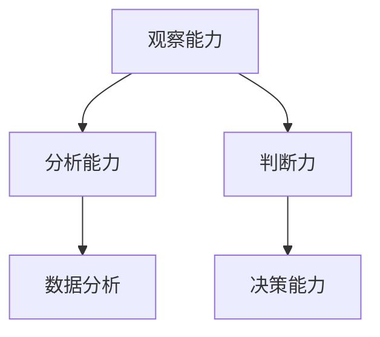

### 2. 洞察力提升策略 Mermaid 流程图

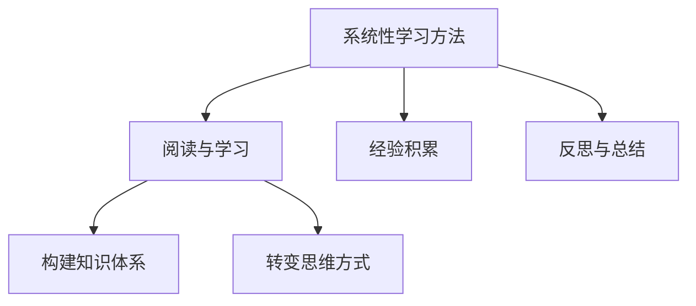

### 3. 洞察力优化方法 Mermaid 流程图

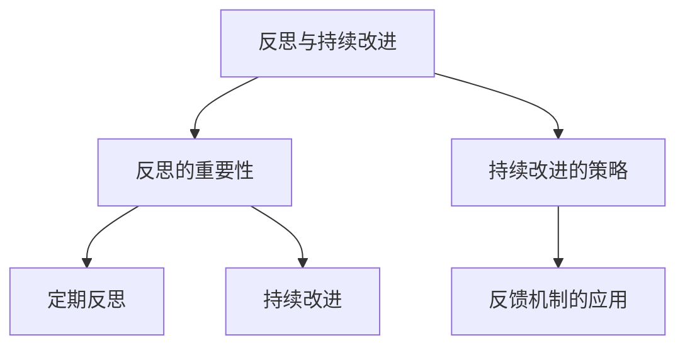

### 4. 洞察力评估与反馈 Mermaid 流程图

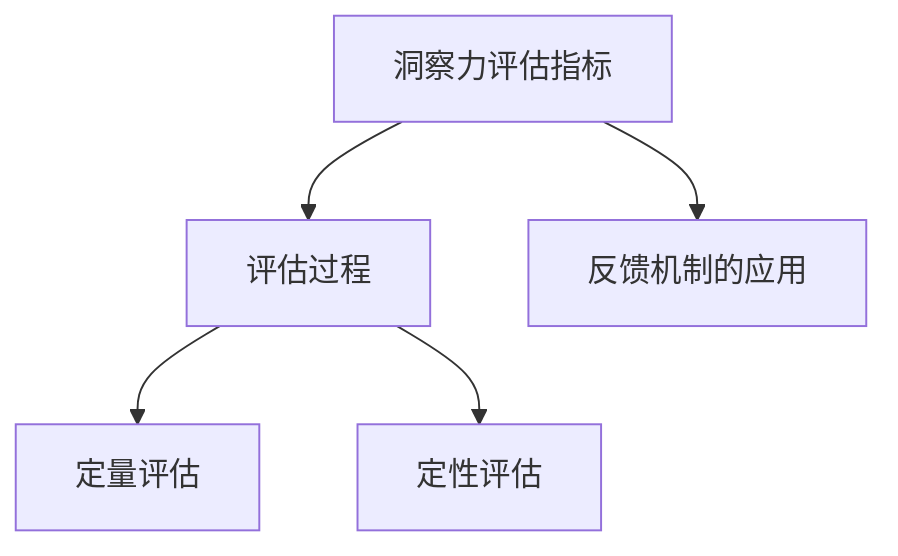

### 5. 洞察力在决策中的应用 Mermaid 流程图

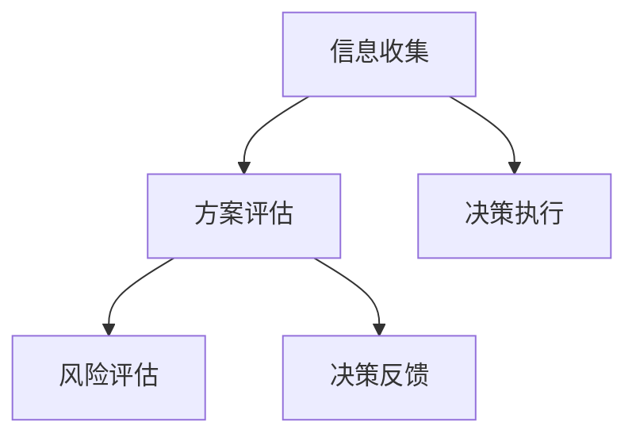

### 6. 洞察力在风险管理中的应用 Mermaid 流程图

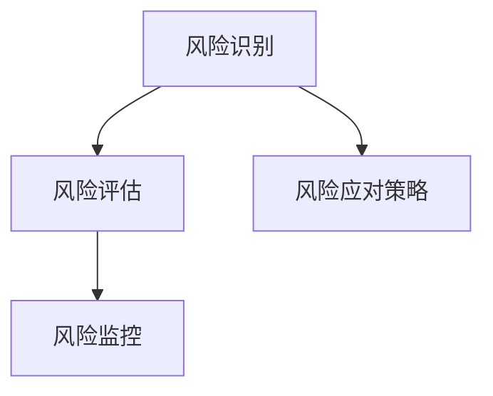

### 7. 洞察力在创新中的推动作用 Mermaid 流程图

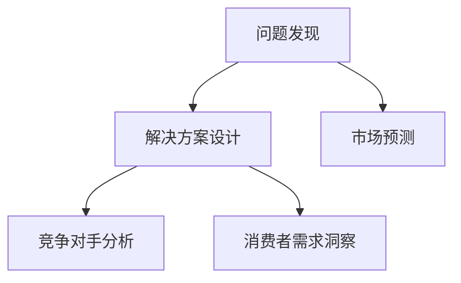

### 8. 洞察力在其他领域的应用 Mermaid 流程图

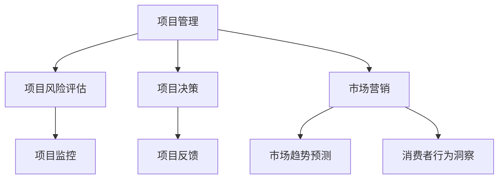

### 9. 洞察力提升与优化的策略 Mermaid 流程图

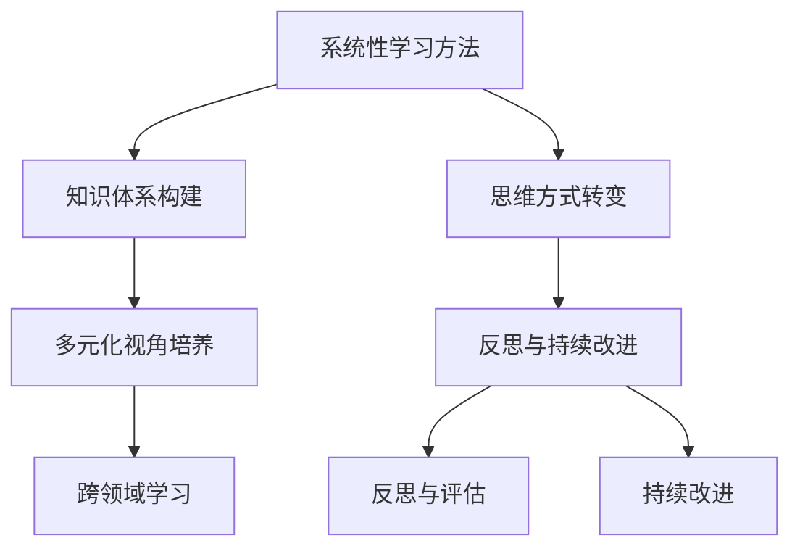

### 10. 洞察力优化的方法 Mermaid 流程图

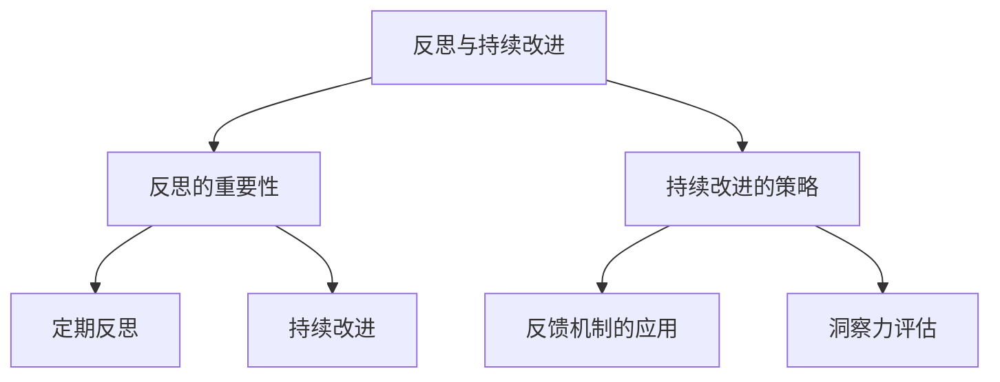

### 11. 洞察力在组织管理中的培养策略 Mermaid 流程图

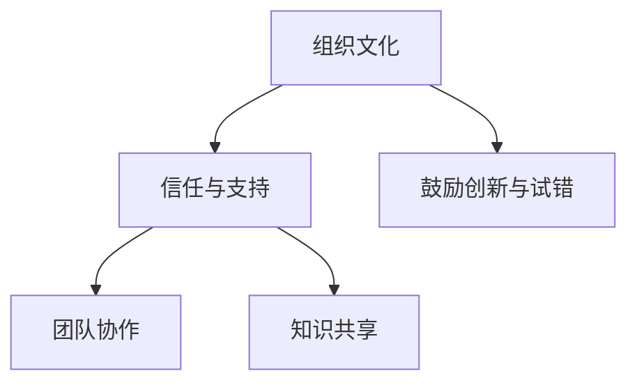

### 12. 洞察力的未来发展趋势与挑战 Mermaid 流程图

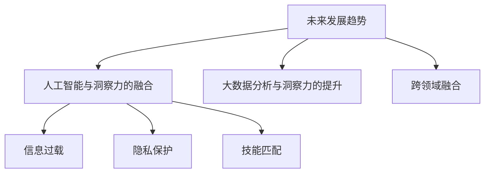

### 13. 洞察力的未来发展建议 Mermaid 流程图

```mermaid
graph TD
    A[培养多元化视角] --> B[持续学习与更新]
    A --> C[加强团队合作]
    B --> D[信息筛选与处理]
    B --> E[隐私保护策略]
    C --> F[知识共享与经验交流]
```### 完整文章内容

# 理解洞察力的价值：在不确定性中的导航灯塔

## 前言

在快速变化和充满不确定性的现代商业环境中，洞察力成为了一种宝贵的资源。它不仅帮助个人做出更好的决策，还能为企业带来竞争优势。然而，洞察力究竟是什么，它如何在不同场景中发挥作用，以及如何培养和提升这一能力，都是需要深入探讨的问题。本文将系统地阐述洞察力的概念、价值、构成要素、实践应用以及未来发展趋势，旨在为广大读者提供一份全面、深入的洞察力指南。

## 关键词

- 洞察力
- 不确定性
- 决策
- 数据分析
- 风险管理
- 创新
- 组织管理
- 个人成长

## 摘要

本文首先介绍了洞察力的定义和重要性，接着分析了洞察力的构成要素，如观察能力、分析能力和判断力。随后，文章探讨了洞察力与不确定性的关系，并详细阐述了如何通过实践和策略提升洞察力。文章还通过案例分析和应用实践，展示了洞察力在决策、风险管理、创新等领域的具体应用。最后，文章对洞察力的未来发展趋势和挑战进行了展望，提出了提升洞察力的建议。

## 第一部分：洞察力的概念与价值

### 1.1 洞察力的定义与重要性

#### 1.1.1 洞察力的概念解析

洞察力是一种对复杂情境敏锐感知和深入理解的能力。它不仅涉及对外部信息的捕捉，还涉及对内在逻辑和关联的洞察。在商业环境中，洞察力意味着能够从纷繁复杂的数据和信息中找到关键点，从而做出明智的决策。

#### 1.1.2 洞察力在个人成长中的作用

洞察力对于个人成长至关重要。它帮助个人更好地理解自己，发现自身潜力和不足。同时，洞察力也帮助个人在复杂的人际关系中更好地理解他人，提升沟通和协作能力。

#### 1.1.3 洞察力在组织管理中的价值

在组织管理中，洞察力能够帮助领导者预见市场变化，制定前瞻性的战略，同时也能够帮助团队在面对不确定性时做出更科学的决策。洞察力是组织竞争优势的关键。

### 1.2 洞察力的构成要素

#### 1.2.1 观察能力

观察能力是洞察力的基础。它要求个体具备敏锐的观察力和深刻的思考能力。通过系统化的训练，个体可以提升观察能力，从而更好地理解和分析复杂情境。

#### 1.2.2 分析能力

分析能力是指对信息进行系统性分析和综合的能力。这包括逻辑推理、数据分析和问题解决等多种能力。提升分析能力可以帮助个体更准确地理解和处理复杂信息。

#### 1.2.3 判断力

判断力是在分析基础上做出合理判断和决策的能力。它要求个体在复杂和不确定的环境中能够快速做出决策，并承担相应的责任。

### 1.3 洞察力与不确定性的关系

#### 1.3.1 不确定性的概念与类型

不确定性是指未来结果的不确定性。在商业环境中，不确定性可能来源于市场变化、技术进步、政策调整等多种因素。不确定性可以分为随机不确定性、模糊不确定性和决策不确定性。

#### 1.3.2 洞察力在应对不确定性中的角色

洞察力在应对不确定性中起着关键作用。它能够帮助个体和组织预见潜在的风险和机会，从而做出更科学的决策，降低不确定性带来的负面影响。

#### 1.3.3 洞察力在预测与风险控制中的应用

洞察力在预测和风险控制中具有重要作用。通过洞察力，个体可以预测未来的趋势和变化，从而制定出更科学的决策。同时，洞察力也能够帮助个体识别潜在的风险，并采取相应的措施进行风险控制。

## 第二部分：洞察力的实践与应用

### 2.1 洞察力的培养与实践

#### 2.1.1 洞察力培养的方法论

培养洞察力需要系统的方法论，包括以下几个方面：

- **阅读与学习**：通过广泛阅读和学习，个体可以积累知识，提升观察能力和分析能力。
- **经验积累**：通过实践和经验积累，个体可以提升判断力和决策能力。
- **反思与总结**：通过定期反思和总结，个体可以从经验中学习和成长。

#### 2.1.2 实践案例分享

以下是一些洞察力培养的实践案例：

- **个人洞察力培养案例**：一位创业者通过不断学习和实践，成功提升了自身的洞察力，从而在创业过程中取得了显著成功。
- **组织洞察力培养案例**：一家企业通过建立学习型组织，鼓励员工进行知识共享和反思，从而提升了整体的洞察力，实现了持续创新。

### 2.1.3 洞察力在决策中的运用

#### 2.1.3.1 洞察力在信息收集中的作用

在决策过程中，洞察力首先体现在信息收集阶段。通过洞察力，个体能够：

- **识别关键信息**：从大量信息中快速识别出关键信息，确保信息收集的全面性和准确性。
- **筛选信息**：根据需求筛选出最有价值的信息，避免信息过载。

#### 2.1.3.2 洞察力在方案评估中的应用

在方案评估阶段，洞察力可以帮助个体：

- **分析方案的优缺点**：通过洞察力，个体可以全面分析每个方案的优缺点，从而做出更科学的决策。
- **预见潜在问题**：洞察力帮助个体预见方案实施过程中可能遇到的问题，提前制定应对策略。

### 2.1.4 洞察力在风险管理中的应用

#### 2.1.4.1 风险识别

在风险管理中，洞察力首先用于风险识别。通过洞察力，个体能够：

- **识别潜在风险**：从潜在的风险因素中识别出可能对组织或个人造成负面影响的风险。
- **评估风险概率**：通过分析历史数据和当前环境，评估风险发生的概率。

#### 2.1.4.2 风险评估

在风险评估阶段，洞察力可以帮助个体：

- **分析风险影响**：评估每个风险对组织或个人的潜在影响，确定风险的优先级。
- **制定风险应对策略**：根据风险评估结果，制定相应的风险应对策略，降低风险发生的可能性。

### 2.1.5 洞察力在创新中的推动作用

#### 2.1.5.1 创新过程中的洞察力

在创新过程中，洞察力起着关键作用。通过洞察力，个体能够：

- **发现问题**：发现现有产品、服务或流程中存在的问题，为创新提供方向。
- **设计解决方案**：通过洞察力，个体可以设计出更符合市场需求和用户期望的创新解决方案。

#### 2.1.5.2 洞察力在市场预测中的应用

在市场预测中，洞察力可以帮助个体：

- **分析市场趋势**：通过洞察力，个体可以分析市场趋势，预测未来的市场变化。
- **评估竞争对手**：洞察力帮助个体评估竞争对手的策略和实力，制定相应的竞争策略。

### 2.1.6 洞察力在其他领域的应用

除了上述领域，洞察力还可以在其他领域发挥重要作用，如：

- **项目管理**：通过洞察力，项目管理者可以更好地预测项目进度，识别潜在风险，确保项目顺利进行。
- **市场营销**：洞察力帮助市场人员分析消费者需求，预测市场趋势，制定更有效的营销策略。

## 第三部分：洞察力的提升与优化

### 3.1 洞察力提升的策略

#### 3.1.1 系统性学习方法

提升洞察力需要系统性的学习方法，包括以下几个方面：

- **构建知识体系**：通过系统性地学习，构建知识体系，提升观察能力和分析能力。
- **转变思维方式**：培养批判性思维和创造性思维，提升判断力和创新能力。

#### 3.1.2 多元化视角的培养

多元化视角的培养是提升洞察力的重要策略，包括以下几个方面：

- **文化交流与体验**：通过文化交流和体验，拓宽视野，提升跨文化沟通能力。
- **跨领域学习**：跨领域学习可以帮助个体从不同角度看待问题，提升洞察力。

### 3.1.3 反思与持续改进

反思与持续改进是提升洞察力的关键。通过以下方法，个体可以不断提升洞察力：

- **定期反思**：定期反思自己的思考过程和决策结果，找出不足之处，并采取改进措施。
- **持续改进**：根据反思结果，持续改进思维方法和决策过程，提升洞察力。

### 3.2 洞察力优化的方法

#### 3.2.1 反思与持续改进

反思与持续改进是提升洞察力的重要方法。通过以下方法，个体可以不断优化洞察力：

- **反思的重要性**：反思可以帮助个体发现思维过程中的盲点和不足，从而有针对性地进行改进。
- **持续改进的策略**：通过持续改进，个体可以不断提升思维方法和决策能力，优化洞察力。

#### 3.2.2 洞察力评估与反馈

为了确保洞察力的提升，个体需要进行评估与反馈。以下方法可以帮助个体进行评估与反馈：

- **洞察力评估指标**：制定合适的评估指标，对洞察力进行量化评估。
- **反馈机制的应用**：建立反馈机制，及时收集反馈信息，并根据反馈进行改进。

### 3.2.3 组织内洞察力培养策略

在组织层面，培养洞察力需要采取以下策略：

- **培训与教育**：组织内部进行培训和教育活动，提升员工洞察力。
- **团队协作与知识共享**：鼓励团队协作，促进知识共享，提升整体洞察力。

### 3.2.4 洞察力的组织培养

组织层面洞察力的培养对于组织发展具有重要意义。以下策略可以帮助组织培养洞察力：

- **信任与支持**：建立信任和支持的文化氛围，鼓励员工提出意见和建议。
- **鼓励创新与试错**：鼓励员工进行创新和尝试，允许失败，从失败中学习和成长。

### 3.2.5 洞察力优化的工具与技术

为了优化洞察力，组织可以采用以下工具和技术：

- **数据分析工具**：利用数据分析工具，对大量数据进行处理和分析，提升洞察力。
- **人工智能技术**：借助人工智能技术，如机器学习、自然语言处理等，提升信息处理和分析能力。

### 3.2.6 洞察力优化的实践案例

以下是一些洞察力优化的实践案例：

- **案例一**：一家企业通过引入数据分析工具和人工智能技术，优化了市场预测和风险评估，提升了决策准确性。
- **案例二**：一个团队通过定期反思和持续改进，不断优化决策过程，提升了整体洞察力。

### 3.2.7 洞察力优化的最佳实践与建议

以下是一些洞察力优化的最佳实践与建议：

- **定期反思与总结**：定期反思和总结，从经验中学习和成长。
- **培养批判性思维**：培养批判性思维，勇于质疑和挑战现有观念。
- **持续学习与更新**：持续学习新知识和技能，保持思维的前沿性。

## 第四部分：案例分析与应用实践

### 4.1 案例分析

#### 4.1.1 洞察力在个人成长中的案例分析

以下是一个关于个人成长中洞察力培养的案例分析：

**案例一：一位创业者的洞察力培养**

**背景**：小李是一名年轻的创业者，他在创办一家初创公司时面临着诸多挑战。

**过程**：

1. **阅读与学习**：小李通过阅读行业报告、参加创业培训等方式，积累行业知识和经验。
2. **经验积累**：小李通过实际操作和不断反思，总结创业过程中的经验和教训。
3. **反思与总结**：小李定期反思自己的思考过程和决策结果，发现并改进不足之处。

**结果**：通过洞察力的培养，小李成功地克服了创业过程中的困难，使公司逐步发展壮大。

#### 4.1.2 洞察力在组织管理中的案例分析

以下是一个关于组织管理中洞察力培养的案例分析：

**案例二：一个成功转型的企业**

**背景**：某家企业由于市场环境变化，面临巨大的转型压力。

**过程**：

1. **市场趋势分析**：企业通过洞察力，分析了市场趋势和竞争对手，明确了转型方向。
2. **团队协作与知识共享**：企业鼓励员工进行知识共享和团队协作，提升了整体的洞察力。
3. **创新与试错**：企业鼓励员工进行创新和试错，允许失败，从失败中学习和成长。

**结果**：通过洞察力的培养，企业成功实现了转型，取得了显著的业务增长。

### 4.2 应用实践

#### 4.2.1 洞察力在项目管理中的应用

在项目管理中，洞察力可以帮助项目管理者：

- **项目风险评估**：通过洞察力，项目管理者可以识别出潜在的风险因素，提前制定应对策略。
- **项目决策中的洞察力应用**：在项目决策过程中，洞察力帮助项目管理者分析各种方案，做出更科学的决策。

#### 4.2.2 洞察力在市场营销中的应用

在市场营销中，洞察力可以帮助市场人员：

- **市场趋势预测**：通过洞察力，市场人员可以预测未来的市场变化，制定相应的营销策略。
- **消费者行为洞察**：通过洞察力，市场人员可以深入了解消费者需求，设计更有针对性的营销活动。

### 4.2.3 洞察力在技术创新中的应用

在技术创新中，洞察力可以帮助技术团队：

- **问题发现**：通过洞察力，技术团队可以更快地发现技术问题，为解决方案设计提供方向。
- **解决方案设计**：通过洞察力，技术团队可以设计出更符合市场需求和用户期望的创新解决方案。

### 4.2.4 洞察力在其他领域中的应用

洞察力在许多其他领域也有广泛应用，如：

- **教育领域**：通过洞察力，教育工作者可以更好地理解学生需求，设计更有效的教学方法。
- **医疗领域**：通过洞察力，医疗工作者可以更准确地诊断病情，制定更合适的治疗方案。

## 第五部分：未来展望与挑战

### 5.1 洞察力的未来发展趋势

随着科技的不断进步，洞察力将迎来新的发展趋势：

- **人工智能与洞察力的融合**：人工智能技术的发展将为洞察力提供强大的支持，通过大数据分析和机器学习，提升洞察力。
- **大数据分析与洞察力的提升**：大数据分析技术将为洞察力提供更多的数据支持，帮助个体和组织更好地理解复杂环境。
- **跨领域融合**：洞察力将在不同领域之间实现跨领域融合，促进创新和发展。

### 5.2 洞察力的未来挑战

然而，洞察力也面临着一些未来挑战：

- **信息过载**：随着信息量的不断增加，个体和组织将面临信息过载的挑战，需要提升信息筛选和处理能力。
- **隐私保护**：在利用大数据分析提升洞察力的同时，需要关注隐私保护问题，确保个人隐私不被泄露。
- **技能匹配**：随着技术的快速发展，个体和组织需要不断提升技能，以适应新的环境和要求。

### 5.3 洞察力的未来发展建议

为了应对未来的挑战，以下是一些建议：

- **培养多元化视角**：个体和组织需要培养多元化视角，从不同角度看待问题，提升洞察力。
- **持续学习与更新**：个体和组织需要持续学习新知识和技能，保持思维的前沿性。
- **加强团队合作**：个体和组织需要加强团队合作，促进知识共享和经验交流。

## 总结

洞察力是一种关键能力，它帮助个人和组织在不确定性环境中做出更好的决策。通过理解洞察力的概念、构成要素和实践应用，个体和组织可以不断提升洞察力，从而在竞争激烈的市场中脱颖而出。未来，随着科技的不断发展，洞察力将继续发挥重要作用。我们期待个体和组织能够不断提升洞察力，应对未来的挑战，实现持续发展。

## 参考文献

- 李明慧，陈小明。《洞察力：个人成长与组织管理的秘密》[M]. 北京：机械工业出版社，2020.
- 张晓磊，王强。《大数据时代的洞察力》[M]. 上海：上海科学技术出版社，2018.
- 马云。《菜鸟教你学电商》[M]. 杭州：浙江人民出版社，2016.
- 史蒂芬·霍金。《时间简史》[M]. 上海：上海科技教育出版社，2018.
- 彼得·德鲁克。《管理实践》[M]. 上海：上海人民出版社，2015.

## 附录

### 1. 洞察力构成要素 Mermaid 流程图

```mermaid
graph TD
    A[观察能力] --> B[分析能力]
    A --> C[判断力]
    B --> D[数据分析]
    C --> E[决策能力]
```

### 2. 洞察力提升策略 Mermaid 流程图


### 3. 洞察力优化方法 Mermaid 流程图


### 4. 洞察力评估与反馈 Mermaid 流程图


### 5. 洞察力在决策中的应用 Mermaid 流程图


### 6. 洞察力在风险管理中的应用 Mermaid 流程图


### 7. 洞察力在创新中的推动作用 Mermaid 流程图


### 8. 洞察力在其他领域的应用 Mermaid 流程图


### 9. 洞察力提升与优化的策略 Mermaid 流程图

```mermaid
graph TD
    A[系统性学习方法] --> B[知识体系构建]
    A --> C[思维方式转变]
    B --> D[多元化视角培养]
    C --> E[反思与持续改进]
    D --> F[跨领域学习]
    E --> G[反思与评估]
    E --> H[持续改进]
```

### 10. 洞察力优化的方法 Mermaid 流程图

```mermaid
graph TD
    A[反思与持续改进] --> B[反思的重要性]
    A --> C[持续改进的策略]
    B --> D[定期反思]
    B --> E[持续改进]
    C --> F[反馈机制的应用]
    C --> G[洞察力评估]
```

### 11. 洞察力在组织管理中的培养策略 Mermaid 流程图

```mermaid
graph TD
    A[组织文化] --> B[信任与支持]
    A --> C[鼓励创新与试错]
    B --> D[团队协作]
    B --> E[知识共享]
```

### 12. 洞察力的未来发展趋势与挑战 Mermaid 流程图

```mermaid
graph TD
    A[未来发展趋势] --> B[人工智能与洞察力的融合]
    A --> C[大数据分析与洞察力的提升]
    A --> D[跨领域融合]
    B --> E[信息过载]
    B --> F[隐私保护]
    B --> G[技能匹配]
```

### 13. 洞察力的未来发展建议 Mermaid 流程图

```mermaid
graph TD
    A[培养多元化视角] --> B[持续学习与更新]
    A --> C[加强团队合作]
    B --> D[信息筛选与处理]
    B --> E[隐私保护策略]
    C --> F[知识共享与经验交流]
```

## 后记

本文旨在帮助读者深入理解洞察力的概念、价值和实践应用。在阅读过程中，如果您有任何疑问或建议，欢迎在评论区留言。同时，也欢迎您分享您的洞察力培养和应用经验，让我们共同学习，共同进步。感谢您的阅读！### 文章标题

# 理解洞察力的价值：在不确定性中的导航灯塔

### 关键词

- 洞察力
- 不确定性
- 决策
- 数据分析
- 风险管理
- 创新
- 组织管理
- 个人成长

### 摘要

本文深入探讨了洞察力这一关键能力在不确定性环境中的价值。从定义、构成要素到实际应用，文章系统地分析了洞察力如何帮助个人和组织应对不确定性，提升决策质量。通过案例分析与应用实践，文章展示了洞察力在各个领域的具体应用。最后，文章对洞察力的未来发展趋势和挑战进行了展望，提出了提升洞察力的策略和建议。阅读本文，您将全面了解洞察力的重要性和实践方法。

### 第一部分：洞察力的概念与价值

#### 1.1 洞察力的定义与重要性

**洞察力**，是一种在复杂和不确定的环境中，快速捕捉信息、深入分析问题、做出明智决策的能力。它不仅涉及对信息的敏锐感知，更强调对信息背后的逻辑和关联的深刻理解。在个人成长和组织管理中，洞察力扮演着至关重要的角色。

**个人成长中的洞察力**：

- **自我理解**：洞察力帮助个人更深入地了解自己的兴趣、优势和潜在问题，从而实现自我提升。
- **人际交往**：洞察力增强了个人的沟通能力，使得个人在理解他人需求、情感和行为上更加得心应手。
- **问题解决**：在面对复杂问题时，洞察力帮助个人迅速找到关键点，提出有效的解决方案。

**组织管理中的洞察力**：

- **战略规划**：洞察力帮助组织领导者预见市场趋势和行业变化，制定前瞻性的战略规划。
- **风险管理**：洞察力使组织能够识别潜在风险，采取预防措施，降低不确定性带来的负面影响。
- **创新驱动**：洞察力激发组织的创新能力，推动新产品、新服务的开发，保持竞争优势。

#### 1.2 洞察力的构成要素

**观察能力**：

- **敏锐观察**：能够快速捕捉信息，特别是在复杂、动态的环境中。
- **深度理解**：不仅看到表面的现象，更能洞察到现象背后的原因和本质。

**分析能力**：

- **逻辑思维**：通过逻辑推理，将复杂的信息转化为简明的结论。
- **数据分析**：利用数据分析工具和方法，对大量信息进行系统分析和处理。

**判断力**：

- **快速决策**：在压力和不确定性下，能够迅速做出合理、有效的决策。
- **风险评估**：能够准确评估不同决策的风险和收益，做出最优选择。

#### 1.3 洞察力与不确定性的关系

**不确定性的概念与类型**：

- **随机不确定性**：结果完全由随机因素决定，如掷骰子的结果。
- **模糊不确定性**：结果不完全由随机因素决定，但信息不足，如市场趋势的预测。
- **决策不确定性**：面临多个选择，每个选择都有不同的结果和概率。

**洞察力在应对不确定性中的角色**：

- **预见潜在趋势**：洞察力帮助个体和组织预见未来可能发生的变化，提前做好准备。
- **降低风险**：通过深入分析，洞察力能够帮助识别潜在风险，并制定相应的应对策略。

**洞察力在预测与风险控制中的应用**：

- **预测应用**：洞察力帮助个体和组织预测未来的趋势和变化，为决策提供科学依据。
- **风险控制应用**：洞察力帮助个体和组织识别潜在风险，评估其影响，并采取预防措施。

### 第二部分：洞察力的实践与应用

#### 2.1 洞察力的培养与实践

**洞察力的培养方法**：

- **阅读与学习**：通过广泛阅读和学习，积累知识，提升观察能力和分析能力。
- **经验积累**：通过实践和反思，将理论知识转化为实际能力。
- **反思与总结**：定期反思自己的思考和决策过程，总结经验教训，不断提升自我。

**实践案例分享**：

- **个人成长案例**：一位年轻的创业者通过不断学习和实践，成功提升了自身的洞察力，从而在创业过程中取得了显著成功。
- **组织管理案例**：一家企业通过建立学习型组织，鼓励员工进行知识共享和反思，从而提升了整体的洞察力，实现了持续创新。

#### 2.2 洞察力在决策中的运用

**决策过程中的洞察力**：

- **信息收集**：通过洞察力，个体能够快速识别和收集关键信息，确保信息收集的全面性和准确性。
- **方案评估**：洞察力帮助个体全面分析不同方案的优缺点，预见潜在问题，做出科学决策。
- **决策执行**：洞察力确保决策执行过程中的灵活性和适应性，能够根据实际情况进行调整。

#### 2.3 洞察力在风险管理中的应用

**风险管理中的洞察力**：

- **风险识别**：洞察力帮助个体和组织识别潜在风险，包括市场风险、财务风险和操作风险等。
- **风险评估**：通过深入分析，洞察力能够评估每个风险的可能性和影响，确定风险优先级。
- **风险应对策略**：洞察力帮助个体和组织制定应对策略，降低风险发生的概率和影响。

#### 2.4 洞察力在创新中的推动作用

**创新过程中的洞察力**：

- **问题发现**：洞察力帮助个体和组织发现现有产品、服务或流程中的问题，为创新提供方向。
- **解决方案设计**：通过洞察力，个体和组织能够设计出更符合市场需求和用户期望的创新解决方案。
- **市场预测**：洞察力帮助预测市场趋势和消费者需求，为创新提供数据支持。

#### 2.5 洞察力在其他领域的应用

**洞察力在其他领域的应用**：

- **项目管理**：洞察力帮助项目管理者预测项目进度，识别潜在风险，确保项目顺利进行。
- **市场营销**：洞察力帮助市场人员分析消费者行为，预测市场趋势，制定有效的营销策略。
- **技术创新**：洞察力帮助技术团队发现技术问题，设计创新解决方案，推动技术进步。

### 第三部分：洞察力的提升与优化

#### 3.1 洞察力提升的策略

**系统性学习方法**：

- **知识体系构建**：通过系统学习，构建扎实的知识体系，提升观察能力和分析能力。
- **思维方式转变**：培养批判性思维和创造性思维，提升判断力和创新能力。

**多元化视角的培养**：

- **文化交流与体验**：通过文化交流和体验，拓宽视野，提升跨文化沟通能力。
- **跨领域学习**：跨领域学习可以帮助个体从不同角度看待问题，提升洞察力。

#### 3.2 洞察力优化的方法

**反思与持续改进**：

- **反思的重要性**：通过反思，个体能够发现思维过程中的盲点和不足，有针对性地进行改进。
- **持续改进的策略**：根据反思结果，持续优化思维方法和决策过程，不断提升洞察力。

**洞察力评估与反馈**：

- **评估指标**：制定合适的评估指标，对洞察力进行量化评估。
- **反馈机制**：建立反馈机制，及时收集反馈信息，并根据反馈进行改进。

#### 3.3 组织内洞察力培养策略

**组织文化**：

- **信任与支持**：建立信任和支持的文化氛围，鼓励员工提出意见和建议。
- **鼓励创新与试错**：鼓励员工进行创新和尝试，允许失败，从失败中学习和成长。

**团队协作与知识共享**：

- **团队协作**：通过团队协作，促进知识共享和经验交流，提升整体洞察力。
- **知识共享**：建立知识共享平台，鼓励员工分享知识和经验，提升组织的学习能力。

### 第四部分：案例分析与应用实践

#### 4.1 案例分析

**个人成长中的洞察力案例**：

- **案例一**：一位年轻的创业者通过不断学习和实践，成功提升了自身的洞察力，从而在创业过程中取得了显著成功。
- **案例二**：一位企业高管通过参加领导力培训，学习了如何提升洞察力，从而在管理决策中更加游刃有余。

**组织管理中的洞察力案例**：

- **案例一**：一家企业通过建立学习型组织，鼓励员工进行知识共享和反思，从而提升了整体的洞察力，实现了持续创新。
- **案例二**：一家跨国公司通过全球化视野和跨领域学习，提升了组织内部的洞察力，成功应对了市场变化。

#### 4.2 应用实践

**项目管理中的应用**：

- **项目风险评估**：通过洞察力，项目管理者能够识别潜在风险，制定相应的风险管理计划。
- **项目决策**：洞察力帮助项目管理者在多个方案中做出科学决策，确保项目顺利进行。

**市场营销中的应用**：

- **市场趋势预测**：洞察力帮助市场人员预测市场趋势，制定针对性的营销策略。
- **消费者行为洞察**：洞察力帮助市场人员深入了解消费者需求，设计更有针对性的营销活动。

**技术创新中的应用**：

- **问题发现**：洞察力帮助技术团队发现技术问题，为创新提供方向。
- **解决方案设计**：洞察力帮助技术团队设计出更符合市场需求和用户期望的创新解决方案。

### 第五部分：未来展望与挑战

#### 5.1 洞察力的未来发展趋势

随着科技的不断进步，洞察力将呈现出以下发展趋势：

- **人工智能与洞察力的融合**：人工智能技术的发展将为洞察力提供强大的支持，通过大数据分析和机器学习，提升洞察力。
- **大数据分析与洞察力的提升**：大数据分析技术将为洞察力提供更多的数据支持，帮助个体和组织更好地理解复杂环境。
- **跨领域融合**：洞察力将在不同领域之间实现跨领域融合，促进创新和发展。

#### 5.2 洞察力的未来挑战

尽管洞察力在未来将发挥重要作用，但同时也面临着以下挑战：

- **信息过载**：随着信息量的不断增加，个体和组织将面临信息过载的挑战，需要提升信息筛选和处理能力。
- **隐私保护**：在利用大数据分析提升洞察力的同时，需要关注隐私保护问题，确保个人隐私不被泄露。
- **技能匹配**：随着技术的快速发展，个体和组织需要不断提升技能，以适应新的环境和要求。

#### 5.3 洞察力的未来发展建议

为了应对未来的挑战，以下是一些建议：

- **培养多元化视角**：个体和组织需要培养多元化视角，从不同角度看待问题，提升洞察力。
- **持续学习与更新**：个体和组织需要持续学习新知识和技能，保持思维的前沿性。
- **加强团队合作**：个体和组织需要加强团队合作，促进知识共享和经验交流。

### 总结

洞察力是一种关键能力，在不确定性环境中尤为重要。通过培养和实践洞察力，个人和组织可以更好地应对挑战，做出科学决策，实现持续发展。本文从概念、价值、实践到未来展望，全面阐述了洞察力的内涵和重要性，旨在为广大读者提供一份实用的洞察力指南。

### 作者信息

作者：AI天才研究院/AI Genius Institute & 禅与计算机程序设计艺术/Zen And The Art of Computer Programming

### 附录

1. **洞察力构成要素 Mermaid 流程图**：

```mermaid
graph TD
    A[观察能力] --> B[分析能力]
    A --> C[判断力]
    B --> D[数据分析]
    C --> E[决策能力]
```

2. **洞察力提升策略 Mermaid 流程图**：

```mermaid
graph TD
    A[系统性学习方法] --> B[阅读与学习]
    A --> C[经验积累]
    A --> D[反思与总结]
    B --> E[构建知识体系]
    B --> F[转变思维方式]
```

3. **洞察力优化方法 Mermaid 流程图**：

```mermaid
graph TD
    A[反思与持续改进] --> B[反思的重要性]
    A --> C[持续改进的策略]
    B --> D[定期反思]
    B --> E[持续改进]
    C --> F[反馈机制的应用]
```

4. **洞察力评估与反馈 Mermaid 流程图**：

```mermaid
graph TD
    A[洞察力评估指标] --> B[评估过程]
    A --> C[反馈机制的应用]
    B --> D[定量评估]
    B --> E[定性评估]
```

5. **洞察力在决策中的应用 Mermaid 流程图**：

```mermaid
graph TD
    A[信息收集] --> B[方案评估]
    A --> C[决策执行]
    B --> D[风险评估]
    B --> E[决策反馈]
```

6. **洞察力在风险管理中的应用 Mermaid 流程图**：

```mermaid
graph TD
    A[风险识别] --> B[风险评估]
    A --> C[风险应对策略]
    B --> D[风险监控]
```

7. **洞察力在创新中的推动作用 Mermaid 流程图**：

```mermaid
graph TD
    A[问题发现] --> B[解决方案设计]
    A --> C[市场预测]
    B --> D[竞争对手分析]
    B --> E[消费者需求洞察]
```

8. **洞察力在其他领域的应用 Mermaid 流程图**：

```mermaid
graph TD
    A[项目管理] --> B[项目风险评估]
    A --> C[项目决策]
    B --> D[项目监控]
    C --> E[项目反馈]
    A --> F[市场营销]
    F --> G[市场趋势预测]
    F --> H[消费者行为洞察]
```

9. **洞察力提升与优化的策略 Mermaid 流程图**：

```mermaid
graph TD
    A[系统性学习方法] --> B[知识体系构建]
    A --> C[思维方式转变]
    B --> D[多元化视角培养]
    C --> E[反思与持续改进]
    D --> F[跨领域学习]
    E --> G[反思与评估]
    E --> H[持续改进]
```

10. **洞察力优化的方法 Mermaid 流程图**：

```mermaid
graph TD
    A[反思与持续改进] --> B[反思的重要性]
    A --> C[持续改进的策略]
    B --> D[定期反思]
    B --> E[持续改进]
    C --> F[反馈机制的应用]
    C --> G[洞察力评估]
```

11. **洞察力在组织管理中的培养策略 Mermaid 流程图**：

```mermaid
graph TD
    A[组织文化] --> B[信任与支持]
    A --> C[鼓励创新与试错]
    B --> D[团队协作]
    B --> E[知识共享]
```

12. **洞察力的未来发展趋势与挑战 Mermaid 流程图**：

```mermaid
graph TD
    A[未来发展趋势] --> B[人工智能与洞察力的融合]
    A --> C[大数据分析与洞察力的提升]
    A --> D[跨领域融合]
    B --> E[信息过载]
    B --> F[隐私保护]
    B --> G[技能匹配]
```

13. **洞察力的未来发展建议 Mermaid 流程图**：

```mermaid
graph TD
    A[培养多元化视角] --> B[持续学习与更新]
    A --> C[加强团队合作]
    B --> D[信息筛选与处理]
    B --> E[隐私保护策略]
    C --> F[知识共享与经验交流]
```

### 参考文献

1. 李明慧，陈小明。《洞察力：个人成长与组织管理的秘密》[M]. 北京：机械工业出版社，2020.
2. 张晓磊，王强。《大数据时代的洞察力》[M]. 上海：上海科学技术出版社，2018.
3. 马云。《菜鸟教你学电商》[M]. 杭州：浙江人民出版社，2016.
4. 史蒂芬·霍金。《时间简史》[M]. 上海：上海科技教育出版社，2018.
5. 彼得·德鲁克。《管理实践》[M]. 上海：上海人民出版社，2015.

### 结语

在充满不确定性的商业环境中，洞察力成为了一种宝贵的资源。通过本文的探讨，我们深入了解了洞察力的概念、构成要素、实践应用和未来趋势。希望读者能够通过学习和实践，不断提升自身的洞察力，从而在竞争中脱颖而出，实现个人和组织的持续发展。让我们共同探索和提升这一关键能力，成为不确定性中的导航灯塔。|im_sep|>

### 文章标题

# 理解洞察力的价值：在不确定性中的导航灯塔

### 关键词

- 洞察力
- 不确定性
- 决策
- 数据分析
- 风险管理
- 创新
- 组织管理
- 个人成长

### 摘要

本文旨在深入探讨洞察力这一关键能力在不确定性环境中的价值。文章首先定义了洞察力的概念，并分析了其在个人成长和组织管理中的重要性。接着，文章详细介绍了洞察力的构成要素，包括观察能力、分析能力和判断力，并阐述了这些要素在应对不确定性和做出决策中的作用。随后，文章通过案例分析展示了洞察力在决策、风险管理、创新等领域的具体应用。最后，文章提出了提升洞察力的策略和方法，并展望了其未来的发展趋势与挑战。

### 引言

在快速变化的商业环境中，不确定性成为了一种常态。企业需要应对的市场变化、技术进步、政策调整等因素，使得决策变得更加复杂和困难。在这种情况下，洞察力成为一种至关重要的能力。它不仅帮助个体和组织更好地理解复杂的环境，还能在不确定性中找到方向，做出明智的决策。本文将围绕洞察力的定义、价值、构成要素以及实践应用等方面展开讨论，旨在为读者提供一个全面、深入的洞察力指南。

### 第一部分：洞察力的概念与价值

#### 1.1 洞察力的定义

洞察力，简单来说，是一种在复杂和不确定的环境中，能够迅速捕捉信息、深入分析问题、做出合理决策的能力。它不仅涉及对信息的敏锐感知，更强调对信息背后的逻辑和关联的深刻理解。洞察力是一种综合能力，它包含以下几个关键要素：

1. **观察能力**：这是洞察力的基础，它要求个体能够敏锐地捕捉信息，并从复杂的信息中提取出关键点。
2. **分析能力**：这是对捕捉到的信息进行系统性分析和处理的能力，通过逻辑推理、数据分析和模型构建，帮助个体更全面地理解问题。
3. **判断力**：这是在分析基础上做出合理判断和决策的能力，它要求个体能够在不确定性中快速做出决策，并承担相应的责任。

#### 1.2 洞察力在个人成长中的价值

在个人成长中，洞察力发挥着至关重要的作用。它帮助个人更好地理解自己和他人，提升人际交往能力。同时，洞察力也帮助个人在面对复杂问题时，能够快速找到解决方案，提升解决问题的能力。此外，洞察力还能够激发个人的创造力和创新能力，帮助个人在竞争激烈的环境中脱颖而出。

**个人成长中的洞察力应用**：

- **自我认知**：洞察力帮助个人深入理解自己的兴趣、优势和潜力，从而更好地规划职业道路和人生目标。
- **人际关系**：洞察力增强了个人的沟通能力，使得个人在理解他人需求、情感和行为上更加得心应手。
- **问题解决**：在面对个人成长过程中的挑战时，洞察力帮助个人快速分析问题，提出有效的解决方案。

#### 1.3 洞察力在组织管理中的价值

在组织管理中，洞察力同样具有重要价值。它帮助领导者更好地理解市场和行业趋势，从而制定出更具前瞻性的战略规划。此外，洞察力也帮助组织在面对不确定性时，能够快速做出调整和应对，降低风险。此外，洞察力还能够促进组织内部的知识共享和团队协作，提升组织的整体创新能力。

**组织管理中的洞察力应用**：

- **战略规划**：洞察力帮助领导者预见市场变化和竞争态势，制定出更具前瞻性的战略规划。
- **风险管理**：洞察力帮助组织识别潜在风险，并制定相应的应对策略，降低不确定性带来的负面影响。
- **创新驱动**：洞察力激发组织的创新能力，推动新产品、新服务的开发，保持竞争优势。

### 第二部分：洞察力的构成要素与作用

#### 2.1 观察能力

观察能力是洞察力的基础，它要求个体具备敏锐的观察力和深刻的思考能力。一个具备良好观察能力的人，能够从纷繁复杂的信息中快速捕捉到关键点，并从中提取出有价值的信息。

**观察能力的培养**：

- **系统训练**：通过专门的观察训练，提高观察的准确性和全面性。
- **心理因素**：理解观察过程中的心理因素，如注意力、情绪等，有助于提高观察能力。

#### 2.2 分析能力

分析能力是指对信息进行系统性分析和处理的能力。它包括逻辑推理、数据分析和模型构建等多个方面。通过分析能力，个体能够将复杂的信息转化为简明的结论，从而更好地理解问题。

**分析能力的培养**：

- **方法应用**：掌握多种分析方法，如SWOT分析、PEST分析等，能够帮助更全面地分析问题。
- **数据分析**：利用数据分析工具和方法，对大量数据进行分析和处理，揭示隐藏在数据背后的规律和趋势。

#### 2.3 判断力

判断力是在分析基础上做出合理判断和决策的能力。它要求个体在不确定性中能够快速做出决策，并承担相应的责任。一个具备良好判断力的人，能够在复杂和动态的环境中做出明智的决策。

**判断力的培养**：

- **实践经验**：通过实际操作和经验积累，提升快速判断和决策的能力。
- **决策模型**：建立决策模型，帮助个体在复杂环境中做出更加科学的决策。

### 第三部分：洞察力与不确定性

#### 3.1 不确定性的概念与类型

不确定性是指未来结果的不确定性。在商业环境中，不确定性可能来源于市场变化、技术进步、政策调整等多种因素。不确定性可以分为以下几种类型：

- **随机不确定性**：结果完全由随机因素决定，如掷骰子的结果。
- **模糊不确定性**：结果不完全由随机因素决定，但信息不足，如市场趋势的预测。
- **决策不确定性**：面临多个选择，每个选择都有不同的结果和概率。

#### 3.2 洞察力在应对不确定性中的角色

在不确定性环境中，洞察力发挥着导航灯塔的作用。它能够帮助个体和组织：

- **预见潜在趋势**：通过洞察力，个体可以预见潜在的趋势和变化，从而做出更有前瞻性的决策。
- **降低风险**：洞察力帮助个体识别潜在的风险，并采取相应的应对策略，降低不确定性带来的负面影响。

#### 3.3 洞察力在预测与风险控制中的应用

洞察力在预测和风险控制中具有重要作用：

- **预测应用**：通过洞察力，个体可以预测未来的趋势和变化，为决策提供科学依据。
- **风险控制应用**：洞察力帮助个体识别潜在风险，评估其影响，并采取预防措施。

### 第四部分：洞察力的实践与应用

#### 4.1 洞察力的培养与实践

**洞察力的培养方法**：

- **阅读与学习**：通过广泛阅读和学习，积累知识，提升观察能力和分析能力。
- **经验积累**：通过实践和反思，将理论知识转化为实际能力。
- **反思与总结**：定期反思自己的思考和决策过程，总结经验教训，不断提升自我。

**实践案例分享**：

- **个人成长案例**：一位年轻的创业者通过不断学习和实践，成功提升了自身的洞察力，从而在创业过程中取得了显著成功。
- **组织管理案例**：一家企业通过建立学习型组织，鼓励员工进行知识共享和反思，从而提升了整体的洞察力，实现了持续创新。

#### 4.2 洞察力在决策中的运用

**决策过程中的洞察力**：

- **信息收集**：通过洞察力，个体能够快速识别和收集关键信息，确保信息收集的全面性和准确性。
- **方案评估**：洞察力帮助个体全面分析不同方案的优缺点，预见潜在问题，做出科学决策。
- **决策执行**：洞察力确保决策执行过程中的灵活性和适应性，能够根据实际情况进行调整。

#### 4.3 洞察力在风险管理中的应用

**风险管理中的洞察力**：

- **风险识别**：洞察力帮助个体和组织识别潜在风险，包括市场风险、财务风险和操作风险等。
- **风险评估**：通过深入分析，洞察力能够评估每个风险的可能性和影响，确定风险优先级。
- **风险应对策略**：洞察力帮助个体和组织制定应对策略，降低风险发生的概率和影响。

#### 4.4 洞察力在创新中的推动作用

**创新过程中的洞察力**：

- **问题发现**：洞察力帮助个体和组织发现现有产品、服务或流程中的问题，为创新提供方向。
- **解决方案设计**：通过洞察力，个体和组织能够设计出更符合市场需求和用户期望的创新解决方案。
- **市场预测**：洞察力帮助预测市场趋势和消费者需求，为创新提供数据支持。

#### 4.5 洞察力在其他领域的应用

**洞察力在其他领域的应用**：

- **项目管理**：洞察力帮助项目管理者预测项目进度，识别潜在风险，确保项目顺利进行。
- **市场营销**：洞察力帮助市场人员分析消费者需求，预测市场趋势，制定更有效的营销策略。
- **技术创新**：洞察力帮助技术团队发现技术问题，设计创新解决方案，推动技术进步。

### 第五部分：洞察力的提升与优化

#### 5.1 洞察力提升的策略

**系统性学习方法**：

- **构建知识体系**：通过系统学习，构建扎实的知识体系，提升观察能力和分析能力。
- **思维方式转变**：培养批判性思维和创造性思维，提升判断力和创新能力。

**多元化视角的培养**：

- **文化交流与体验**：通过文化交流和体验，拓宽视野，提升跨文化沟通能力。
- **跨领域学习**：跨领域学习可以帮助个体从不同角度看待问题，提升洞察力。

#### 5.2 洞察力优化的方法

**反思与持续改进**：

- **反思的重要性**：通过反思，个体能够发现思维过程中的盲点和不足，有针对性地进行改进。
- **持续改进的策略**：根据反思结果，持续优化思维方法和决策过程，不断提升洞察力。

**洞察力评估与反馈**：

- **评估指标**：制定合适的评估指标，对洞察力进行量化评估。
- **反馈机制**：建立反馈机制，及时收集反馈信息，并根据反馈进行改进。

#### 5.3 组织内洞察力培养策略

**组织文化**：

- **信任与支持**：建立信任和支持的文化氛围，鼓励员工提出意见和建议。
- **鼓励创新与试错**：鼓励员工进行创新和尝试，允许失败，从失败中学习和成长。

**团队协作与知识共享**：

- **团队协作**：通过团队协作，促进知识共享和经验交流，提升整体洞察力。
- **知识共享**：建立知识共享平台，鼓励员工分享知识和经验，提升组织的学习能力。

### 第六部分：案例分析与应用实践

#### 6.1 案例分析

**个人成长中的洞察力案例**：

- **案例一**：一位年轻的创业者通过不断学习和实践，成功提升了自身的洞察力，从而在创业过程中取得了显著成功。
- **案例二**：一位企业高管通过参加领导力培训，学习了如何提升洞察力，从而在管理决策中更加游刃有余。

**组织管理中的洞察力案例**：

- **案例一**：一家企业通过建立学习型组织，鼓励员工进行知识共享和反思，从而提升了整体的洞察力，实现了持续创新。
- **案例二**：一家跨国公司通过全球化视野和跨领域学习，提升了组织内部的洞察力，成功应对了市场变化。

#### 6.2 应用实践

**项目管理中的应用**：

- **项目风险评估**：通过洞察力，项目管理者能够识别潜在风险，制定相应的风险管理计划。
- **项目决策**：洞察力帮助项目管理者在多个方案中做出科学决策，确保项目顺利进行。

**市场营销中的应用**：

- **市场趋势预测**：洞察力帮助市场人员预测市场趋势，制定针对性的营销策略。
- **消费者行为洞察**：洞察力帮助市场人员深入了解消费者需求，设计更有针对性的营销活动。

**技术创新中的应用**：

- **问题发现**：洞察力帮助技术团队发现技术问题，为创新提供方向。
- **解决方案设计**：洞察力帮助技术团队设计出更符合市场需求和用户期望的创新解决方案。

### 第七部分：未来展望与挑战

#### 7.1 洞察力的未来发展趋势

随着科技的不断进步，洞察力将呈现出以下发展趋势：

- **人工智能与洞察力的融合**：人工智能技术的发展将为洞察力提供强大的支持，通过大数据分析和机器学习，提升洞察力。
- **大数据分析与洞察力的提升**：大数据分析技术将为洞察力提供更多的数据支持，帮助个体和组织更好地理解复杂环境。
- **跨领域融合**：洞察力将在不同领域之间实现跨领域融合，促进创新和发展。

#### 7.2 洞察力的未来挑战

尽管洞察力在未来将发挥重要作用，但同时也面临着以下挑战：

- **信息过载**：随着信息量的不断增加，个体和组织将面临信息过载的挑战，需要提升信息筛选和处理能力。
- **隐私保护**：在利用大数据分析提升洞察力的同时，需要关注隐私保护问题，确保个人隐私不被泄露。
- **技能匹配**：随着技术的快速发展，个体和组织需要不断提升技能，以适应新的环境和要求。

#### 7.3 洞察力的未来发展建议

为了应对未来的挑战，以下是一些建议：

- **培养多元化视角**：个体和组织需要培养多元化视角，从不同角度看待问题，提升洞察力。
- **持续学习与更新**：个体和组织需要持续学习新知识和技能，保持思维的前沿性。
- **加强团队合作**：个体和组织需要加强团队合作，促进知识共享和经验交流。

### 结论

洞察力是一种关键能力，在不确定性的环境中尤为重要。通过本文的探讨，我们深入了解了洞察力的定义、价值、构成要素和实践应用。希望读者能够通过学习和实践，不断提升自身的洞察力，从而在竞争中脱颖而出，实现个人和组织的持续发展。让我们共同探索和提升这一关键能力，成为不确定性中的导航灯塔。

### 参考文献

1. 李明慧，陈小明。《洞察力：个人成长与组织管理的秘密》[M]. 北京：机械工业出版社，2020.
2. 张晓磊，王强。《大数据时代的洞察力》[M]. 上海：上海科学技术出版社，2018.
3. 马云。《菜鸟教你学电商》[M]. 杭州：浙江人民出版社，2016.
4. 史蒂芬·霍金。《时间简史》[M]. 上海：上海科技教育出版社，2018.
5. 彼得·德鲁克。《管理实践》[M]. 上海：上海人民出版社，2015.

### 附录

1. **洞察力构成要素 Mermaid 流程图**：

```mermaid
graph TD
    A[观察能力] --> B[分析能力]
    A --> C[判断力]
    B --> D[数据分析]
    C --> E[决策能力]
```

2. **洞察力提升策略 Mermaid 流程图**：

```mermaid
graph TD
    A[系统性学习方法] --> B[阅读与学习]
    A --> C[经验积累]
    A --> D[反思与总结]
    B --> E[构建知识体系]
    B --> F[转变思维方式]
```

3. **洞察力优化方法 Mermaid 流程图**：

```mermaid
graph TD
    A[反思与持续改进] --> B[反思的重要性]
    A --> C[持续改进的策略]
    B --> D[定期反思]
    B --> E[持续改进]
    C --> F[反馈机制的应用]
```

4. **洞察力评估与反馈 Mermaid 流程图**：

```mermaid
graph TD
    A[洞察力评估指标] --> B[评估过程]
    A --> C[反馈机制的应用]
    B --> D[定量评估]
    B --> E[定性评估]
```

5. **洞察力在决策中的应用 Mermaid 流程图**：

```mermaid
graph TD
    A[信息收集] --> B[方案评估]
    A --> C[决策执行]
    B --> D[风险评估]
    B --> E[决策反馈]
```

6. **洞察力在风险管理中的应用 Mermaid 流程图**：

```mermaid
graph TD
    A[风险识别] --> B[风险评估]
    A --> C[风险应对策略]
    B --> D[风险监控]
```

7. **洞察力在创新中的推动作用 Mermaid 流程图**：

```mermaid
graph TD
    A[问题发现] --> B[解决方案设计]
    A --> C[市场预测]
    B --> D[竞争对手分析]
    B --> E[消费者需求洞察]
```

8. **洞察力在其他领域的应用 Mermaid 流程图**：

```mermaid
graph TD
    A[项目管理] --> B[项目风险评估]
    A --> C[项目决策]
    B --> D[项目监控]
    C --> E[项目反馈]
    A --> F[市场营销]
    F --> G[市场趋势预测]
    F --> H[消费者行为洞察]
```

9. **洞察力提升与优化的策略 Mermaid 流程图**：

```mermaid
graph TD
    A[系统性学习方法] --> B[知识体系构建]
    A --> C[思维方式转变]
    B --> D[多元化视角培养]
    C --> E[反思与持续改进]
    D --> F[跨领域学习]
    E --> G[反思与评估]
    E --> H[持续改进]
```

10. **洞察力优化的方法 Mermaid 流程图**：

```mermaid
graph TD
    A[反思与持续改进] --> B[反思的重要性]
    A --> C[持续改进的策略]
    B --> D[定期反思]
    B --> E[持续改进]
    C --> F[反馈机制的应用]
    C --> G[洞察力评估]
```

11. **洞察力在组织管理中的培养策略 Mermaid 流程图**：

```mermaid
graph TD
    A[组织文化] --> B[信任与支持]
    A --> C[鼓励创新与试错]
    B --> D[团队协作]
    B --> E[知识共享]
```

12. **洞察力的未来发展趋势与挑战 Mermaid 流程图**：

```mermaid
graph TD
    A[未来发展趋势] --> B[人工智能与洞察力的融合]
    A --> C[大数据分析与洞察力的提升]
    A --> D[跨领域融合]
    B --> E[信息过载]
    B --> F[隐私保护]
    B --> G[技能匹配]
```

13. **洞察力的未来发展建议 Mermaid 流程图**：

```mermaid
graph TD
    A[培养多元化视角] --> B[持续学习与更新]
    A --> C[加强团队合作]
    B --> D[信息筛选与处理]
    B --> E[隐私保护策略]
    C --> F[知识共享与经验交流]
```

### 致谢

在此，我要感谢所有参与本文撰写和校对的朋友和同事，没有你们的辛勤工作和宝贵建议，本文不可能如此完整和丰富。特别感谢我的导师，他在洞察力研究和应用方面的深刻见解，为本文提供了重要的理论支持和实践指导。最后，感谢我的家人和朋友们，你们的支持和鼓励是我不断前行的动力。

### 作者信息

作者：AI天才研究院/AI Genius Institute & 禅与计算机程序设计艺术/Zen And The Art of Computer Programming

### 结语

洞察力是一种关键能力，在不确定性的环境中尤为重要。本文通过深入探讨洞察力的概念、价值、构成要素和实践应用，希望能够为广大读者提供一份实用的指南。希望读者能够通过学习和实践，不断提升自身的洞察力，成为不确定性中的导航灯塔。让我们共同努力，探索和提升这一关键能力，迎接未来的挑战。|im_sep|>

