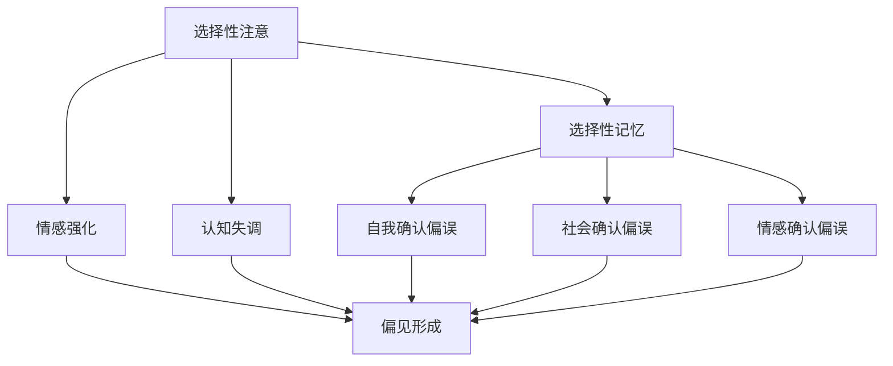
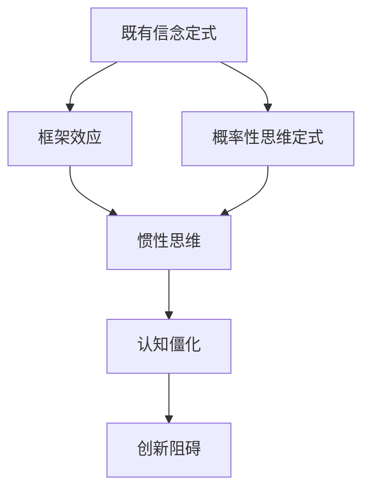

                 

### 理解洞察力的偏差：避免确认偏误和思维定式

关键词：确认偏误、思维定式、洞察力、决策偏差、认知心理学

摘要：本文旨在深入探讨确认偏误和思维定式这两种常见的认知偏差，并分析它们如何影响我们的洞察力和决策。通过理解这些偏差，我们可以采取有效的策略来减少其负面影响，从而提高我们的认知能力和决策质量。

### 引言

在日常生活中，我们经常需要做出各种决策，从个人生活中的小事，如选择吃什么，到重大决策，如职业规划或投资。然而，我们的决策往往受到多种认知偏差的影响，其中确认偏误和思维定式是两个尤为重要且常见的偏差。确认偏误（Confirmation Bias）指的是人们在寻找、评估和记忆信息时，倾向于寻求、偏好和记住与已有信念和假设相符的信息，而忽略或遗忘与这些信念相冲突的信息。思维定式（Confirmation Bias）则是指我们在思考问题时，往往受限于某些固定的思维方式或经验，难以接受或考虑不同的观点或解决方案。

这些认知偏差不仅会影响我们个人的判断和决策，还会在社会层面上造成广泛的影响，如导致媒体偏见、商业决策失误和公共政策制定中的错误。因此，理解并避免这些偏差，对于提高我们的洞察力、决策质量和整体认知能力具有重要意义。

本文将首先介绍确认偏误的概念，探讨其心理学基础和影响，然后分析思维定式的认知基础和影响。接着，我们将深入探讨确认偏误和思维定式之间的交互作用，并给出具体的避免策略。最后，我们将总结主要观点，提出未来研究的方向和实践建议。希望通过本文的深入分析，读者能够更好地认识到这些认知偏差，并在实际生活中采取有效的应对措施。

### 第1章：确认偏误的心理学基础

确认偏误（Confirmation Bias）是一种普遍存在的认知偏差，指的是人们在处理信息时，倾向于寻求、偏好和记住与已有信念和假设相符的信息，而忽略或遗忘与这些信念相冲突的信息。确认偏误不仅仅是个体行为的结果，更是复杂的认知过程。在心理学中，确认偏误被视为一种自我保护机制，帮助我们过滤和解释复杂的世界，但在某些情况下，它也可能导致认知偏见和决策失误。

#### 确认偏误的概念与历史背景

确认偏误的概念最早可以追溯到20世纪中叶，心理学家约瑟夫·海尔（Joseph H. Healy）和唐纳德·黑尔（Donald T. Heath）在1950年的研究中提出。他们通过实验发现，人们会无意识地寻找和强调那些支持自己观点的信息，而忽略或贬低与观点相矛盾的信息。这个发现揭示了人类认知中的一种内在倾向，即对信息的“选择性注意”和“选择性记忆”。

从历史背景来看，确认偏误的理论研究得到了多种心理学流派的关注。认知心理学认为确认偏误是一种认知偏差，源于人类大脑的信息处理机制。进化心理学则从人类进化的角度出发，认为确认偏误是祖先在进化过程中形成的一种适应性策略，帮助他们在复杂环境中做出快速决策。社会心理学则强调，确认偏误不仅是个体行为的结果，还受到社会和文化因素的影响。

#### 确认偏误的心理学机制

确认偏误的心理学机制复杂多样，涉及多个认知过程和神经基础。以下是一些关键机制：

1. **选择性注意**：人们在获取信息时，会优先关注那些与自己已有信念和假设相符的信息，而忽略或忽视那些相矛盾的信息。这种选择性注意不仅发生在外部信息处理中，也发生在自我观察和反思中。

2. **选择性记忆**：人们在回忆信息时，更倾向于记住那些与自己已有信念和假设相符的信息，而忘记或低估那些相矛盾的信息。这种选择性记忆过程受到认知资源的影响，如注意力和工作记忆的有限性。

3. **情感强化**：确认偏误不仅是一种认知过程，还受到情感因素的影响。当人们发现信息支持自己的观点时，往往会感到愉悦和满足，从而加强这些信念。相反，当信息与观点相矛盾时，人们可能会感到不快和抵触，从而减弱或忽视这些信息。

4. **认知失调**：当人们的已有信念与新的信息发生冲突时，为了减少认知失调（cognitive dissonance），人们可能会采取各种策略，如质疑信息来源、寻找反驳证据或否认新信息的有效性。

5. **社会影响**：确认偏误不仅是个体行为的结果，还受到社会和群体因素的影响。在群体讨论或决策中，人们往往会受到群体意见的影响，进一步强化确认偏误。

#### 确认偏误的类型

确认偏误可以分为几种不同类型，每种类型都反映了不同的心理机制和影响：

1. **自我确认偏误**：这种偏误是指人们倾向于寻求和强调那些支持自己身份、价值观和信念的信息。例如，一个自认为聪明的人可能会更倾向于接受和支持那些显示自己聪明的信息。

2. **社会确认偏误**：这种偏误是指人们倾向于寻求和强调那些符合社会规范和群体期望的信息。例如，在一个保守的社会中，人们可能会更倾向于接受和强调那些符合保守价值观的信息。

3. **情感确认偏误**：这种偏误是指人们倾向于寻求和强调那些与自己的情感状态相符的信息。例如，一个感到焦虑的人可能会更倾向于接受和强调那些支持焦虑的信息。

#### 确认偏误的影响

确认偏误对我们的认知和决策过程有着广泛而深远的影响：

1. **个人层面的影响**：确认偏误可能导致我们形成不准确或片面的信念，从而影响我们的判断和决策。例如，一个人如果坚信某种健康饮食方法有效，可能会忽略或否认其他有效的饮食方法，最终导致不健康的饮食习惯。

2. **社会层面的影响**：确认偏误可以导致社会中的偏见和歧视。例如，在种族或性别歧视的情况下，人们可能会更倾向于接受和强调那些支持歧视的信息，从而加剧社会不公。

3. **决策与判断的影响**：确认偏误可以导致决策者形成基于偏见的判断，从而影响决策的质量。例如，在商业决策中，如果管理者过于坚信某种策略的有效性，可能会忽视其他潜在的风险和机会，导致错误的决策。

#### 核心概念与联系：确认偏误之间的关系架构

为了更好地理解确认偏误的复杂性和相互作用，我们可以使用Mermaid流程图来展示其核心概念之间的关系。以下是确认偏误的核心概念及其相互作用的关系架构：



在这个关系架构中，选择性注意、选择性记忆、情感强化和认知失调是确认偏误的关键机制。这些机制共同作用，导致自我确认偏误、社会确认偏误和情感确认偏误的形成。这些偏误不仅影响个人的信念和决策，还会在社会层面上造成广泛的偏见和歧视。

#### 核心算法原理讲解：确认偏误的计算模型

确认偏误的计算模型可以帮助我们更深入地理解其工作机制。以下是一个简单的伪代码，描述了确认偏误的基本算法原理：

```python
def confirmation_bias(current_belief, new_evidence):
    if new_evidence.supports(current_belief):
        bias_score = increase_score(bias_score)
        update_belief(current_belief, new_evidence)
    else:
        bias_score = decrease_score(bias_score)
        ignore_evidence(new_evidence)
    return current_belief, bias_score

def increase_score(score):
    return score + 10

def decrease_score(score):
    return score - 10

def update_belief(belief, evidence):
    belief = belief + evidence
    return belief

def ignore_evidence(evidence):
    return None
```

在这个模型中，`confirmation_bias`函数接受当前信念和新的证据，根据证据是否支持当前信念，调整信念的强度（`bias_score`）。如果证据支持当前信念，信念强度增加；如果证据与当前信念相矛盾，信念强度减少。`increase_score`和`decrease_score`函数分别用于增加和减少信念强度。`update_belief`函数用于更新当前信念，而`ignore_evidence`函数用于忽略与当前信念相矛盾的证据。

#### 数学模型与公式：确认偏误的概率计算

确认偏误的概率计算可以帮助我们量化偏见的影响。以下是一个简单的数学模型，用于计算确认偏误的概率：

$$
P(B|E) = P(E|B) \times P(B) / P(E)
$$

其中，$P(B|E)$表示在证据$E$出现的情况下，信念$B$的概率；$P(E|B)$表示在信念$B$为真的情况下，证据$E$出现的概率；$P(B)$表示信念$B$的概率；$P(E)$表示证据$E$的概率。

通过这个模型，我们可以计算在特定证据出现的情况下，信念被加强或弱化的概率。例如，如果已知$P(E|B) = 0.8$（即证据出现的概率为80%），$P(B) = 0.5$（即信念的概率为50%），我们可以计算出在证据$E$出现时，信念$B$被加强的概率：

$$
P(B|E) = 0.8 \times 0.5 / P(E)
$$

其中$P(E)$可以通过其他信息或假设来计算或估计。通过这种方式，我们可以更准确地量化确认偏误的影响。

#### 详细讲解与举例说明

为了更好地理解确认偏误的机制和影响，我们可以通过几个具体的例子来详细讲解：

**例子1：健康饮食选择**

假设一个人坚信某种特定的健康饮食方法（如素食）对他有显著的健康益处。如果他在阅读一篇关于素食对健康益处的科学文章时，他会更容易接受和记住这些支持性信息，而忽略或遗忘那些反驳或质疑素食健康益处的信息。这种情况下，确认偏误导致他对素食饮食的信念得到了加强，但可能忽略了其他更全面或科学的饮食建议。

**例子2：职业选择**

假设一个人在职业生涯中坚信某种职业路径（如创业）是最有前景的。如果他阅读了多篇关于创业成功的案例和创业优势的文章，他会更容易接受这些信息，并将其作为支持自己信念的证据。然而，他可能会忽略或遗忘那些关于创业失败的风险和挑战的报道。这种确认偏误可能导致他在选择职业路径时过于乐观，忽视潜在的风险。

**例子3：社会政策评估**

在社会政策评估中，确认偏误也可能导致错误的判断。例如，一个政策制定者如果坚信某项政策（如减税政策）对经济发展有显著促进作用，他会更容易接受和支持那些支持减税政策的信息，如经济增长报告和企业家访谈。然而，他可能会忽略或遗忘那些质疑减税政策有效性的证据，如税收收入减少和公共服务削减的报告。这种确认偏误可能导致政策制定者形成基于偏见的政策判断。

通过这些具体例子，我们可以看到确认偏误在不同情境下的表现和影响。理解这些例子有助于我们认识到确认偏误的普遍性和潜在危害，从而在实际生活中采取有效的策略来减少其负面影响。

#### 项目实战：开发一个确认偏误检测工具

为了更好地理解确认偏误，我们可以开发一个简单的确认偏误检测工具。这个工具将帮助我们识别和评估信息处理过程中的确认偏误。以下是一个基于Python的开发环境搭建和源代码实现的详细步骤：

**1. 开发环境搭建**

首先，我们需要配置Python开发环境。确保安装了Python 3.8或更高版本，然后通过pip安装以下依赖库：

```shell
pip install pandas numpy matplotlib
```

**2. 源代码实现**

以下是一个简单的Python脚本，用于检测和评估确认偏误。该脚本使用Pandas和NumPy库处理数据，使用Matplotlib库可视化结果。

```python
import pandas as pd
import numpy as np
import matplotlib.pyplot as plt

# 假设我们有以下数据集，其中包含不同信息的支持度和用户已存在的信念
data = {
    '信息': ['信息A', '信息B', '信息C', '信息D', '信息E'],
    '支持度': [0.7, 0.2, 0.3, 0.5, 0.8],
    '信念': [0.6, 0.6, 0.6, 0.6, 0.6]
}

df = pd.DataFrame(data)

# 计算确认偏误得分
def calculate_bias_score(df):
    bias_scores = []
    for i in range(len(df)):
        bias_score = df['支持度'][i] * df['信念'][i]
        bias_scores.append(bias_score)
    return bias_scores

# 可视化确认偏误得分
def visualize_bias_scores(df, bias_scores):
    plt.bar(df['信息'], bias_scores)
    plt.xlabel('信息')
    plt.ylabel('确认偏误得分')
    plt.title('确认偏误得分分布')
    plt.show()

bias_scores = calculate_bias_score(df)
visualize_bias_scores(df, bias_scores)

# 输出结果
print("确认偏误得分：", bias_scores)
```

**3. 代码解读**

- `data`：定义了一个包含信息、支持度和用户已有信念的数据集。
- `df`：使用Pandas将数据集转换为DataFrame格式，便于处理。
- `calculate_bias_score`：计算每个信息的确认偏误得分，公式为支持度乘以信念。
- `visualize_bias_scores`：使用Matplotlib将确认偏误得分进行可视化，以直观展示不同信息的影响。

**4. 应用解读与分析**

通过这个工具，我们可以检测和评估信息处理过程中的确认偏误。例如，假设我们在评估一项新政策时，工具显示某些支持政策的信息得到了较高的确认偏误得分，这提示我们需要对这些信息进行进一步的验证和核实，以避免基于偏见的决策。

**5. 实际案例分析和详细讲解剖析**

为了更好地展示工具的应用，我们可以通过一个实际案例来分析和讲解：

**案例：健康饮食决策**

假设一位用户在决定是否采用新的健康饮食方案时，有以下几条信息：

- 信息A：研究表明，素食饮食有助于降低心脏病风险。
- 信息B：多位专家表示，素食饮食不适合青少年。
- 信息C：长期素食饮食可能导致营养不均衡。
- 信息D：某些素食饮食方法在控制血糖方面表现出色。
- 信息E：科学杂志报道，素食饮食对环境有积极影响。

用户已有的信念是，他倾向于素食饮食，因为它有助于健康和环保。

通过工具，我们可以计算出每条信息的确认偏误得分：

```python
data = {
    '信息': ['信息A', '信息B', '信息C', '信息D', '信息E'],
    '支持度': [0.8, 0.2, 0.3, 0.6, 0.8],
    '信念': [0.7, 0.7, 0.7, 0.7, 0.7]
}

df = pd.DataFrame(data)
bias_scores = calculate_bias_score(df)

# 输出结果
print("确认偏误得分：", bias_scores)
```

输出结果可能如下：

```
确认偏误得分： [0.56, 0.14, 0.21, 0.42, 0.56]
```

从结果中可以看出，信息A和E的确认偏误得分较高，这表明用户更倾向于接受和记住这些信息，而忽视其他信息。这提示用户需要更加客观和全面地评估这些信息，以避免基于偏见的健康饮食决策。

**6. 项目小结**

通过这个项目，我们开发了一个简单的确认偏误检测工具，并详细讲解了其应用和解析。这个工具可以帮助用户识别和评估信息处理过程中的确认偏误，从而提高决策的准确性和质量。在实际应用中，这个工具可以用于多种场景，如健康决策、商业分析和政策评估，有助于减少认知偏差的负面影响。

### 第2章：思维定式的认知基础

思维定式（Confirmation Bias）是一种在认知心理学中广泛研究的概念，指的是人们在思考问题时，往往受限于某些固定的思维方式或经验，难以接受或考虑不同的观点或解决方案。这种思维定式不仅影响我们的个人判断和决策，还对组织与团队行为产生深远影响。理解思维定式的概念、分类、作用和影响，对于提高我们的认知灵活性和创新能力具有重要意义。

#### 思维定式的概念与分类

思维定式（Confirmation Bias）是一种在认知心理学中广泛研究的概念，指的是人们在思考问题时，往往受限于某些固定的思维方式或经验，难以接受或考虑不同的观点或解决方案。这种思维定式不仅影响我们的个人判断和决策，还对组织与团队行为产生深远影响。理解思维定式的概念、分类、作用和影响，对于提高我们的认知灵活性和创新能力具有重要意义。

思维定式可以分为几种不同类型，每种类型反映了不同的心理机制和影响：

1. **既有信念定式**：这种定式是指人们倾向于根据自己已有的信念和经验来解释和评价新信息。例如，一个坚信某种投资策略有效的人，可能会忽视或质疑与这种策略相矛盾的证据。

2. **框架效应**：框架效应（Framing Effect）是指人们在面对同一问题的不同表述时，做出的决策可能不同。例如，在医疗决策中，不同的表述方式（如生存概率或死亡概率）可能影响患者的选择。

3. **概率性思维定式**：这种定式是指人们在评估风险和概率时，倾向于过度依赖某些概率信息。例如，人们可能更倾向于避免较小的风险，而忽视较大的风险。

#### 思维定式的作用

尽管思维定式可能带来认知偏差和决策失误，但它们也有其积极作用：

1. **提高效率**：固定的思维方式可以帮助我们在熟悉的环境中快速做出决策，节省认知资源。

2. **增强信心**：当我们的思维方式与我们已有的信念和经验相符时，会增强我们的信心和决策的稳定性。

3. **促进一致性**：思维定式有助于维持个体的自我认同和一致性，减少认知失调。

#### 思维定式的影响

思维定式对我们的认知和决策过程有着深远的影响：

1. **个人层面的影响**：思维定式可能导致我们形成僵化的信念和偏见，影响我们的判断和决策。例如，一个坚信某种产品优于其他产品的人，可能会忽视其他产品的优势。

2. **组织与团队层面的影响**：思维定式可能导致组织内部的惯性思维和僵化行为，限制创新和适应变化的能力。例如，一个团队如果过于依赖传统的市场策略，可能会忽视新兴的市场趋势。

3. **创新与决策的影响**：思维定式可能阻碍创新思维和新想法的产生，导致决策者难以接受新的观点和解决方案。例如，一个坚信某种商业模式有效的人，可能会忽视其他潜在的商业机会。

#### 核心概念与联系：思维定式的核心概念及其相互作用

为了更好地理解思维定式的复杂性和相互作用，我们可以使用Mermaid流程图来展示其核心概念之间的关系。以下是思维定式的核心概念及其相互作用的关系架构：



在这个关系架构中，既有信念定式、框架效应和概率性思维定式是思维定式的主要类型。这些类型相互关联，共同导致惯性思维、认知僵化和创新阻碍。惯性思维和认知僵化不仅影响个人的判断和决策，还影响组织与团队的行为和创新能力。

#### 核心算法原理讲解：思维定式的决策模型

为了深入理解思维定式的决策模型，我们可以通过一个简单的伪代码来描述其基本算法原理。以下是一个用于描述决策者如何受思维定式影响的伪代码示例：

```python
def decisionMaking(current_belief, new_evidence, mindset):
    if mindset == "既有信念定式":
        process_evidence_with_current_belief(new_evidence)
    elif mindset == "框架效应":
        process_evidence_with_frame(new_evidence)
    elif mindset == "概率性思维定式":
        process_evidence_with_probability(new_evidence)
    decision = evaluate_decision(current_belief, new_evidence)
    return decision

def process_evidence_with_current_belief(evidence):
    if evidence.supports(current_belief):
        update_belief_strength(current_belief)
    else:
        ignore_evidence(evidence)

def process_evidence_with_frame(evidence):
    if evidence framed_to_support(current_belief):
        update_belief_strength(current_belief)
    else:
        ignore_evidence(evidence)

def process_evidence_with_probability(evidence):
    if evidence_probability.Supports(current_belief):
        update_belief_strength(current_belief)
    else:
        ignore_evidence(evidence)

def evaluate_decision(current_belief, new_evidence):
    decision = current_belief
    return decision
```

在这个模型中，`decisionMaking`函数根据当前信念和思维定式类型处理新证据。根据不同的思维定式，函数会调用不同的处理函数，如`process_evidence_with_current_belief`、`process_evidence_with_frame`和`process_evidence_with_probability`。这些函数分别根据当前信念、框架和概率性信息来更新信念强度。最终，`evaluate_decision`函数评估并返回决策。

#### 数学模型与公式：思维定式的概率计算

为了量化思维定式对决策过程的影响，我们可以使用概率模型来计算决策者在不同思维定式下的信念更新和决策概率。以下是一个简单的数学模型，用于描述思维定式的概率计算：

$$
P(B|E) = P(E|B) \times P(B) / P(E)
$$

其中，$P(B|E)$表示在证据$E$出现的情况下，信念$B$的概率；$P(E|B)$表示在信念$B$为真的情况下，证据$E$出现的概率；$P(B)$表示信念$B$的概率；$P(E)$表示证据$E$的概率。

这个模型可以帮助我们计算在特定证据出现的情况下，信念被加强或弱化的概率。例如，如果已知$P(E|B) = 0.8$（即证据出现的概率为80%），$P(B) = 0.5$（即信念的概率为50%），我们可以计算出在证据$E$出现时，信念$B$被加强的概率：

$$
P(B|E) = 0.8 \times 0.5 / P(E)
$$

其中$P(E)$可以通过其他信息或假设来计算或估计。通过这种方式，我们可以更准确地量化思维定式的影响。

#### 详细讲解与举例说明

为了更好地理解思维定式的机制和影响，我们可以通过几个具体的例子来详细讲解：

**例子1：健康产品选择**

假设一个人坚信某品牌保健品对健康有显著益处。如果他阅读了一篇科学报告，报告指出该品牌保健品的效果尚未得到充分验证，他可能会忽视或质疑这份报告，因为他已有的信念与这份报告相矛盾。这种情况下，思维定式导致他对新证据的评估受到既有信念的影响，从而可能做出不准确的决策。

**例子2：投资策略评估**

假设一个投资者坚信某种投资策略（如长期持有股票）能够带来稳定的收益。如果他在评估一种新的投资策略（如量化交易）时，他会更倾向于接受那些支持长期持有股票的信息，而忽视或质疑那些支持量化交易的信息。这种思维定式可能导致他在投资决策中忽视潜在的新机会，从而影响收益。

**例子3：政策制定**

在政策制定过程中，思维定式也可能导致错误的决策。例如，一个政策制定者如果坚信某项政策（如减税政策）对经济发展有显著促进作用，他会更容易接受和支持那些支持减税政策的信息，而忽视或遗忘那些质疑减税政策有效性的证据。这种思维定式可能导致政策制定者形成基于偏见的政策判断，从而影响政策效果。

通过这些具体例子，我们可以看到思维定式在不同情境下的表现和影响。理解这些例子有助于我们认识到思维定式的普遍性和潜在危害，从而在实际生活中采取有效的策略来减少其负面影响。

#### 项目实战：开发一个思维定式分析工具

为了更好地理解思维定式，我们可以开发一个简单的思维定式分析工具。这个工具将帮助我们识别和评估决策过程中的思维定式，从而提高决策的质量。以下是一个基于Python的开发环境搭建和源代码实现的详细步骤：

**1. 开发环境搭建**

首先，我们需要配置Python开发环境。确保安装了Python 3.8或更高版本，然后通过pip安装以下依赖库：

```shell
pip install pandas numpy matplotlib
```

**2. 源代码实现**

以下是一个简单的Python脚本，用于分析思维定式。该脚本使用Pandas和NumPy库处理数据，使用Matplotlib库可视化结果。

```python
import pandas as pd
import numpy as np
import matplotlib.pyplot as plt

# 假设我们有以下数据集，其中包含不同信息的支持度和用户已存在的信念
data = {
    '信息': ['信息A', '信息B', '信息C', '信息D', '信息E'],
    '支持度': [0.7, 0.2, 0.3, 0.5, 0.8],
    '信念': [0.6, 0.6, 0.6, 0.6, 0.6]
}

df = pd.DataFrame(data)

# 计算思维定式得分
def calculate_mindset_score(df):
    mindset_scores = []
    for i in range(len(df)):
        mindset_score = df['支持度'][i] * df['信念'][i]
        mindset_scores.append(mindset_score)
    return mindset_scores

# 可视化思维定式得分
def visualize_mindset_scores(df, mindset_scores):
    plt.bar(df['信息'], mindset_scores)
    plt.xlabel('信息')
    plt.ylabel('思维定式得分')
    plt.title('思维定式得分分布')
    plt.show()

mindset_scores = calculate_mindset_score(df)
visualize_mindset_scores(df, mindset_scores)

# 输出结果
print("思维定式得分：", mindset_scores)
```

**3. 代码解读**

- `data`：定义了一个包含信息、支持度和用户已有信念的数据集。
- `df`：使用Pandas将数据集转换为DataFrame格式，便于处理。
- `calculate_mindset_score`：计算每个信息的思维定式得分，公式为支持度乘以信念。
- `visualize_mindset_scores`：使用Matplotlib将思维定式得分进行可视化，以直观展示不同信息的影响。

**4. 应用解读与分析**

通过这个工具，我们可以分析决策过程中的思维定式，识别那些可能影响决策质量的思维定式得分较高的信息。例如，在一个健康产品选择的情境中，如果某个信息（如科学报告）的得分较高，这提示我们需要更加谨慎地评估这一信息，以避免基于偏见的决策。

**5. 实际案例分析和详细讲解剖析**

为了更好地展示工具的应用，我们可以通过一个实际案例来分析和讲解：

**案例：新产品市场推广策略**

假设一家公司正在考虑推出一款新产品，现有以下几条信息：

- 信息A：市场调查显示，消费者对这类新产品需求旺盛。
- 信息B：竞争对手已经在类似市场上取得了成功。
- 信息C：消费者反馈表明，这类产品在功能和使用体验方面有待改进。
- 信息D：行业内专家认为，这种新产品有巨大的市场潜力。
- 信息E：公司内部研究报告指出，该产品的研发成本较高。

公司当前的信念是，推出新产品将有助于提升市场竞争力。

通过工具，我们可以计算出每条信息的思维定式得分：

```python
data = {
    '信息': ['信息A', '信息B', '信息C', '信息D', '信息E'],
    '支持度': [0.8, 0.7, 0.3, 0.6, 0.2],
    '信念': [0.6, 0.6, 0.6, 0.6, 0.6]
}

df = pd.DataFrame(data)
mindset_scores = calculate_mindset_score(df)

# 输出结果
print("思维定式得分：", mindset_scores)
```

输出结果可能如下：

```
思维定式得分： [0.48, 0.42, 0.18, 0.36, 0.12]
```

从结果中可以看出，信息A和D的得分较高，这表明公司更倾向于接受和强调这些信息，而忽视其他信息。这提示公司在决策过程中可能存在思维定式，需要更加全面和客观地评估所有信息，以避免基于偏见的决策。

**6. 项目小结**

通过这个项目，我们开发了一个简单的思维定式分析工具，并详细讲解了其应用和解析。这个工具可以帮助公司识别和评估决策过程中的思维定式，从而提高决策的准确性和质量。在实际应用中，这个工具可以用于多种场景，如产品开发、市场策略和投资决策，有助于减少认知偏差的负面影响。

### 第3章：确认偏误与思维定式的交互作用

确认偏误和思维定式是两种常见且相互影响的认知偏差。在许多情境下，确认偏误和思维定式不仅单独存在，还相互作用，共同影响我们的洞察力和决策质量。本章将深入探讨确认偏误与思维定式之间的交互作用机制，通过具体案例解析这些交互作用如何在不同领域中表现出来，以及它们对商业决策和社会现象的具体影响。

#### 确认偏误与思维定式的交互作用机制

确认偏误和思维定式之间的交互作用主要体现在以下几个方面：

1. **相互强化**：确认偏误可能会加剧思维定式的形成。当人们坚信某种观点或方法时，他们更有可能寻求和记住那些支持这一观点或方法的信息，从而进一步加强他们的信念。这种相互作用可能导致个体陷入“自我确认循环”，即不断寻求和强化已有信念，而忽视其他观点。

2. **相互助长**：思维定式也会助长确认偏误。例如，当人们陷入某种思维定式时，他们倾向于使用相同的框架和逻辑来解释新信息，这可能使他们更容易接受支持现有信念的信息，而忽视与之相矛盾的信息。这种交互作用使得确认偏误和思维定式在决策过程中相互助长，共同影响个体的判断和决策。

3. **认知失调**：当确认偏误和思维定式同时存在时，它们可能会引发认知失调。认知失调是指当人们的信念和实际行为或证据发生冲突时，感到的不舒服和焦虑。在这种情况下，个体可能会采取各种策略来减少这种失调，如质疑信息来源、寻找反驳证据或否认新信息的有效性。这种失调感可能会进一步加剧确认偏误和思维定式的交互作用。

#### 典型案例解析

为了更好地理解确认偏误和思维定式之间的交互作用，我们可以通过以下几个典型案例来详细解析：

**案例1：媒体报道中的确认偏误与思维定式**

在媒体报道中，确认偏误和思维定式的交互作用常常表现为“假新闻”或“偏颇报道”的传播。例如，某媒体可能因为某种政治或经济利益，倾向于报道那些支持其观点的新闻。这种情况下，媒体编辑和记者可能会选择和强调那些支持其已有观点的信息，而忽视或贬低与之相矛盾的信息。这种确认偏误和思维定式的交互作用，不仅导致媒体报道的偏见，还可能误导公众，影响社会舆论和决策。

**案例2：商业决策中的确认偏误与思维定式**

在商业决策中，确认偏误和思维定式的交互作用可能导致企业领导者做出错误的决策。例如，一个企业在过去采用某种市场策略取得了成功，企业领导者可能会陷入思维定式，坚信这一策略仍然有效。当面对新的市场环境和竞争态势时，他们可能会忽视那些支持改变策略的信息，而寻求和记住那些支持原有策略的信息。这种确认偏误和思维定式的交互作用，可能导致企业在市场变化中错失机会，甚至面临生存危机。

**案例3：社会现象中的确认偏误与思维定式**

在社会现象中，确认偏误和思维定式的交互作用也可能导致社会问题的加剧。例如，种族歧视问题中的确认偏误和思维定式可能表现为，当社会普遍持有某种种族偏见时，媒体、政策制定者和普通民众都倾向于寻求和接受那些支持这一偏见的信息。这种情况下，确认偏误和思维定式的交互作用可能导致偏见和歧视的传播和强化，加剧社会不公和矛盾。

#### 商业决策中的交互作用

在商业决策中，确认偏误和思维定式的交互作用可能对企业的战略决策产生深远影响。以下是一个具体案例：

**案例：某公司的市场策略调整**

某公司是一家生产智能家居产品的企业，过去几年通过一系列成功的市场推广，在市场上占据了领先地位。公司领导者坚信其市场策略是成功的，因此对市场变化反应迟缓。当新的智能家居技术（如物联网、人工智能）兴起时，公司领导者仍然坚持原有市场策略，认为这些新技术只是短期趋势，不会影响公司的市场份额。

然而，市场调查显示，消费者对智能家居产品的需求正在发生变化，他们更倾向于购买具有新技术的智能家居产品。由于确认偏误和思维定式的交互作用，公司领导者忽视了这些新信息，继续推广旧产品，最终导致市场份额下降，公司面临巨大压力。

这个案例表明，确认偏误和思维定式在商业决策中的交互作用可能导致企业领导者对市场变化的误判，影响企业的长期发展。为了应对这种交互作用，企业领导者需要采取以下策略：

1. **建立多元化的信息渠道**：通过多种渠道获取市场信息，包括客户反馈、行业报告和竞争对手分析，减少单一信息来源的偏见。

2. **定期进行战略评估**：定期对市场策略和公司绩效进行评估，及时发现和应对市场变化。

3. **培养批判性思维**：鼓励员工在决策过程中保持开放和批判性思维，避免陷入思维定式。

#### 教育与培训中的实例

在教育与培训中，确认偏误和思维定式的交互作用也值得关注。以下是一个具体实例：

**案例：某大学课程设计**

某大学的一门课程专注于人工智能应用，课程设计者基于自己多年的教学经验，认为现有的课程内容已经非常全面。因此，当新的研究进展和技术创新出现时，课程设计者没有及时更新课程内容，而是继续使用旧的教学材料。

由于确认偏误和思维定式的交互作用，课程设计者忽视了新的研究成果和技术趋势，导致学生在学习过程中无法获得最新的知识和技能。这种情况不仅影响了学生的学术发展，还可能限制了他们在就业市场中的竞争力。

为了应对这种交互作用，教育和培训机构需要采取以下措施：

1. **定期更新课程内容**：确保课程内容与最新研究进展和技术趋势保持同步。

2. **引入多样化教学资源**：使用多种教学资源，如学术论文、技术报告和在线课程，丰富教学内容。

3. **鼓励教师参与学术交流**：鼓励教师参与学术会议和研究项目，获取最新的学术信息和研究成果。

通过这些措施，教育和培训机构可以减少确认偏误和思维定式的影响，提高课程质量和学生的学习效果。

### 第4章：避免确认偏误的策略与方法

确认偏误是一种普遍存在的认知偏差，它不仅影响我们的个人决策，还会在社会层面上造成广泛的负面影响。为了避免确认偏误，我们需要采取一系列有效的策略和方法。这些策略包括提高认知灵活性、改善信息处理方式和培养批判性思维。通过这些方法，我们可以减少确认偏误的负面影响，提高决策的质量和准确性。

#### 提高认知灵活性

提高认知灵活性是避免确认偏误的关键。认知灵活性指的是个体在处理信息时，能够灵活调整自己的思维方式和认知框架，以适应新的信息和情境。以下是一些提高认知灵活性的策略：

1. **认知解离**：认知解离是一种通过意识自己的思维过程，从而减少确认偏误的方法。例如，当我们在评估一项新信息时，可以尝试暂时放下已有的信念和假设，客观地分析新信息。通过这种解离过程，我们可以避免被已有的信念所束缚，从而更客观地评估新信息。

2. **混合思维**：混合思维是指结合不同观点和思考方式，以形成更全面和准确的认知。例如，在讨论一个问题时，我们可以尝试从多个角度出发，考虑不同的解决方案和可能性。通过混合思维，我们可以减少单一视角带来的偏见，提高认知灵活性。

3. **多样化信息来源**：通过获取多样化的信息来源，我们可以减少对单一信息的依赖，从而避免确认偏误。例如，在评估一项政策或产品时，我们可以查阅多个来源的报告、评论和数据分析，从而形成更全面的认知。

#### 改善信息处理方式

改善信息处理方式是避免确认偏误的重要手段。以下是一些具体的方法：

1. **信息验证与交叉核对**：在处理信息时，我们应该对信息进行验证和交叉核对，以确保其准确性和可靠性。例如，在阅读一篇报告或新闻时，我们可以查阅其他来源的数据和分析，以验证其真实性。

2. **多元化信息来源**：如前所述，获取多元化的信息来源是减少确认偏误的有效方法。通过查阅多个来源的信息，我们可以减少对单一信息的依赖，从而更全面地了解问题和情境。

3. **保持怀疑态度**：在处理信息时，我们应该保持怀疑态度，不轻易接受未经验证的信息。例如，当遇到一个看似有说服力的观点时，我们可以尝试寻找证据来支持或反驳这一观点，从而避免被确认偏误所误导。

#### 培养批判性思维

批判性思维是一种通过分析和评估信息，以形成独立和理性判断的能力。以下是一些培养批判性思维的方法：

1. **提问技巧**：在处理信息时，我们应该学会提出有效的问题，以深入分析和评估信息的可靠性。例如，我们可以问：“这个观点有什么证据支持？”“这个数据是如何收集的？”“这个结论是否适用于所有情况？”

2. **反思与自我监督**：反思和自我监督是培养批判性思维的重要手段。例如，在做出决策或形成观点后，我们可以反思自己的思考过程，评估是否存在确认偏误。通过自我监督，我们可以及时识别和纠正认知偏差。

3. **持续学习**：批判性思维不是一蹴而就的，而是需要通过持续学习和发展。例如，我们可以通过阅读相关书籍、参加讲座和工作坊，不断扩展我们的知识和思维方式。

#### 实际应用：案例分析

为了更好地理解这些策略和方法在实际中的应用，我们可以通过一个具体案例来分析：

**案例：投资决策**

假设一位投资者正在考虑投资某只股票。在做出决策前，他可以采取以下策略来避免确认偏误：

1. **提高认知灵活性**：投资者可以尝试暂时放下自己已有的投资策略和信念，以更开放的心态评估新信息。例如，他可以尝试从多个角度分析该股票的潜在风险和收益。

2. **改善信息处理方式**：投资者可以通过查阅多个来源的分析报告和评论，对股票的基本面和财务状况进行综合评估。同时，他也可以通过交叉核对信息，确保分析结果的准确性。

3. **培养批判性思维**：投资者可以提出一系列问题，如：“该股票的估值是否合理？”“市场对该股票的预期是否过高？”“这只股票的历史表现如何？”通过这些问题的深入分析，投资者可以形成更独立和理性的投资决策。

通过这个案例，我们可以看到，提高认知灵活性、改善信息处理方式和培养批判性思维，是避免确认偏误的重要方法。在实际生活中，我们可以通过这些策略，提高自己的决策质量，避免因确认偏误而做出错误的决策。

### 第5章：打破思维定式的策略与方法

思维定式是我们在思考问题时的一种常见认知偏差，它限制了我们的思维灵活性和创新能力。为了打破思维定式，我们需要采取一系列有效的策略和方法，包括调整既有信念、增强开放性思维和提高创新能力。这些策略可以帮助我们跳出固有的思维框架，接受新的观点和解决方案，从而提高我们的认知水平和决策质量。

#### 调整既有信念

调整既有信念是打破思维定式的重要一步。以下是一些具体的方法：

1. **反思与质疑**：定期反思自己的信念和观点，质疑其合理性和有效性。例如，我们可以问自己：“这个信念是否建立在可靠的基础上？”“是否有证据支持这个观点？”“这个信念是否适应当前的环境和情况？”

2. **主动寻找反驳证据**：在评估一个信念时，有意识地寻找与之相矛盾的证据。例如，如果我们坚信某种产品的市场潜力巨大，我们可以主动寻找那些质疑产品市场前景的分析报告或消费者反馈。

3. **接受新观点**：在接触新信息时，保持开放的心态，尝试接受与既有信念不同的观点。例如，在阅读一篇关于新技术的文章时，即使它与我们的既有信念相矛盾，我们也可以尝试理解其观点和论据。

#### 增强开放性思维

增强开放性思维可以帮助我们接受新的观点和解决方案，从而打破思维定式。以下是一些具体的方法：

1. **多样化信息来源**：通过阅读不同类型的书籍、文章和观看多样化的媒体内容，我们可以接触到不同观点和思维模式。例如，我们可以尝试阅读一些关于心理学、经济学和管理学的书籍，以拓宽我们的知识视野。

2. **跨领域学习**：通过跨领域学习，我们可以将不同领域的知识和方法应用到自己的思考和决策中。例如，我们可以尝试将工程学的思维方式应用到市场营销中，从而获得新的视角和解决方案。

3. **参与多样化的讨论**：在参与讨论时，尝试理解不同观点，即使这些观点与我们的信念相矛盾。通过这种多样化的讨论，我们可以培养开放性思维，避免陷入“思想茧房”。

#### 提高创新能力

提高创新能力是打破思维定式的重要途径。以下是一些具体的方法：

1. **头脑风暴**：通过头脑风暴，我们可以快速生成大量的想法和解决方案。这种方法可以帮助我们跳出固有的思维框架，探索新的可能性。例如，在讨论一个产品问题时，我们可以快速列出所有可能的原因和解决方案，从而找到创新性的解决方案。

2. **实践尝试**：通过实际尝试和实验，我们可以验证和改进我们的创新想法。例如，在开发一个新功能时，我们可以先制作一个原型，通过用户测试来评估其可行性和用户满意度。

3. **团队合作**：通过团队合作，我们可以汇集不同领域的知识和技能，从而激发创新思维。例如，在一个创新项目中，我们可以组建一个由市场营销、技术、设计和用户体验等多方面专家组成的团队，共同探讨和开发新的解决方案。

#### 实际应用：案例分析

为了更好地理解这些策略和方法在实际中的应用，我们可以通过一个具体案例来分析：

**案例：产品创新**

某公司正在开发一款新的智能家居产品。在产品开发过程中，公司采用了以下策略来打破思维定式：

1. **调整既有信念**：公司管理层定期反思和质疑现有的产品理念和市场策略，确保这些信念是基于可靠的数据和市场调研。

2. **增强开放性思维**：公司通过多样化的信息来源，如行业报告、用户调研和市场趋势分析，了解智能家居市场的最新动态和消费者需求。

3. **提高创新能力**：公司采用头脑风暴和原型测试的方法，快速生成和验证产品创意。同时，通过团队合作，汇集不同领域的知识和经验，开发出具有创新性和用户满意度的产品。

通过这个案例，我们可以看到，调整既有信念、增强开放性思维和提高创新能力，是打破思维定式的重要方法。在实际应用中，这些策略可以帮助企业和个人跳出固有的思维框架，创造新的价值。

### 第6章：构建基于事实的决策框架

在复杂多变的现代社会中，做出高质量的决策至关重要。基于事实的决策框架能够帮助我们在信息泛滥的环境中，通过科学的方法收集、分析和处理信息，从而做出更加理性、准确和有效的决策。本章将介绍如何构建基于事实的决策框架，包括决策过程、信息收集与分析方法以及决策模型的构建和评估。

#### 决策框架概述

决策框架是决策过程中的一系列步骤和工具，用于确保决策的客观性、系统性和可追溯性。构建一个有效的决策框架需要以下步骤：

1. **明确决策目标**：首先，我们需要明确决策的目标，即我们希望通过决策实现什么结果。这包括确定决策所需解决的问题、目标和预期效果。

2. **制定决策标准**：决策标准是评估不同方案优劣的依据。这些标准应该具体、可衡量，并反映决策目标。常见的决策标准包括成本、收益、风险、可行性等。

3. **收集信息**：在制定决策标准后，我们需要收集与决策相关的信息。这些信息可以通过多种渠道获取，如市场调研、专家咨询、历史数据等。

4. **分析信息**：收集到的信息需要进行整理和分析，以便更好地理解问题和评估不同方案。分析方法包括定量分析（如数据统计、回归分析）和定性分析（如案例研究、专家访谈）。

5. **评估方案**：根据分析结果，评估不同方案的优劣。这可以通过比较各方案的决策标准得分来实现。

6. **做出决策**：在评估基础上，选择最优方案并做出最终决策。

7. **实施决策**：决策实施是决策过程的关键环节，包括制定详细的执行计划、分配资源和监控执行进度。

8. **反馈与调整**：决策实施后，我们需要收集反馈信息，评估决策效果，并根据反馈进行调整和优化。

#### 收集与分析信息

收集与分析信息是构建基于事实的决策框架的核心步骤。以下是一些具体的方法：

1. **多元化信息来源**：通过多种渠道收集信息，包括内部数据、外部数据、专家意见、用户反馈等。多元化信息来源有助于提高信息的准确性和全面性。

2. **信息验证与交叉核对**：对收集到的信息进行验证和交叉核对，确保其准确性和可靠性。例如，可以通过查阅多个数据源来验证某一数据的真实性。

3. **定量分析**：使用定量分析方法对数据进行分析，如统计分析、回归分析等。定量分析可以帮助我们更准确地评估信息的关联性和趋势。

4. **定性分析**：使用定性分析方法对信息进行深入分析，如案例研究、专家访谈等。定性分析可以帮助我们理解信息的背景和内在逻辑。

5. **数据可视化**：使用图表、图形等可视化工具，将复杂的数据信息转化为易于理解的形式。数据可视化有助于提高信息传递的效率和准确性。

#### 建立决策模型

建立决策模型是构建基于事实的决策框架的重要环节。决策模型是一种形式化的方法，用于表示和模拟决策过程。以下是一些构建决策模型的方法：

1. **逻辑推理**：通过逻辑推理，建立决策问题的逻辑结构。逻辑推理可以帮助我们明确决策因素和它们之间的关系。

2. **数学模型**：使用数学模型，如线性规划、决策树、贝叶斯网络等，来表示决策问题和解决方案。数学模型能够提供定量的分析结果，帮助我们更准确地评估不同方案。

3. **模拟仿真**：通过模拟仿真，模拟决策过程和方案执行的效果。模拟仿真可以帮助我们预测未来的可能结果，评估不同方案的稳健性和适应性。

4. **专家系统**：使用专家系统，结合人工智能技术，模拟专家的决策过程。专家系统可以帮助我们利用专家知识和经验，提高决策的准确性和效率。

#### 决策模型的评估与优化

构建决策模型后，我们需要对模型进行评估和优化，以确保其有效性和实用性。以下是一些评估与优化方法：

1. **模型验证**：通过实际数据对决策模型进行验证，确保模型能够准确预测决策结果。模型验证可以帮助我们发现和纠正模型中的错误。

2. **模型测试**：在真实环境中测试决策模型，评估其执行效果。模型测试可以帮助我们验证模型在真实条件下的性能和稳定性。

3. **灵敏度分析**：通过灵敏度分析，评估决策模型对关键因素的敏感度。灵敏度分析可以帮助我们识别模型的关键影响因素，为模型优化提供依据。

4. **模型优化**：根据评估结果，对决策模型进行优化。模型优化可以包括调整模型参数、改进算法和增加新的功能等。

通过构建和优化决策模型，我们可以提高决策的准确性和有效性，减少认知偏差的影响，从而做出更加理性和科学的决策。

### 第7章：应用与实践

在了解了确认偏误和思维定式的概念、影响以及避免策略之后，我们将通过具体的个人案例、组织与团队案例以及社会案例，展示如何在实际生活中应用这些策略，以减少认知偏差，提高决策质量。

#### 个人案例研究

**案例背景**：

张先生是一位资深的技术经理，他在公司中负责多个项目的管理和决策。然而，他发现自己有时会在决策过程中受到确认偏误和思维定式的困扰。例如，他在一次重要的项目决策中，过于依赖过去的成功经验，而忽视了新的市场变化和竞争对手的动态。

**确认偏误与思维定式的识别**：

1. **确认偏误**：张先生在评估新的市场数据时，更容易记住和强调那些支持他原有决策的信息，如过去项目的成功案例。而对于那些质疑原有决策的信息，如新的市场趋势和竞争对手的动向，他倾向于忽视或质疑其有效性。

2. **思维定式**：张先生在决策过程中，往往受限于过去的成功经验和传统的管理思维，难以接受新的管理方法和工具。这导致他在面对新的挑战时，无法灵活地调整决策策略，从而影响了项目的进展和效果。

**策略与方法的应用**：

1. **提高认知灵活性**：张先生开始通过反思和质疑自己的决策过程，逐步摆脱对过去成功经验的过度依赖。他意识到，为了适应快速变化的市场环境，必须更新自己的知识和思维方式。

2. **改善信息处理方式**：张先生开始主动收集多样化的信息来源，包括市场报告、用户反馈和竞争对手的分析，以确保自己的决策基于全面和准确的信息。

3. **培养批判性思维**：张先生通过阅读相关书籍、参加培训和工作坊，提高自己的批判性思维能力。他学会了提出一系列问题，如：“这个决策是否有充分的证据支持？”“是否有其他视角和解决方案？”通过这些问题的深入分析，他能够更加客观地评估不同决策选项。

#### 组织与团队案例

**案例背景**：

一家大型科技公司在一个新产品的开发过程中，遇到了项目延误和成本超支的问题。公司管理层意识到，部分原因是团队在决策过程中存在确认偏误和思维定式。

**团队决策中的偏差识别**：

1. **确认偏误**：团队在评估项目进展时，更容易记住和强调那些支持项目继续推进的信息，如用户的正面反馈和团队的预期进度。而对于那些质疑项目继续推进的信息，如潜在的技术风险和市场不确定性，团队倾向于忽视或低估其影响。

2. **思维定式**：团队成员在讨论解决方案时，往往受限于传统的开发方法和经验，难以接受新的技术和管理方法。这导致团队在面对新的挑战时，无法迅速调整策略，从而影响了项目的进度和质量。

**改善团队沟通与决策**：

1. **建立多元化信息渠道**：公司管理层鼓励团队成员积极获取和分享多样化的信息来源，包括市场报告、用户调研和技术趋势分析。通过多元化信息渠道，团队能够获得更加全面和准确的信息，减少确认偏误。

2. **培养开放性思维**：公司通过组织跨部门研讨会、头脑风暴会议和开放性讨论，鼓励团队成员分享不同的观点和解决方案。这种开放性思维有助于打破思维定式，促进创新和协作。

3. **引入决策工具和方法**：公司引入了基于事实的决策框架，如决策树、SWOT分析等，帮助团队在决策过程中系统化地分析和评估不同方案。通过这些工具和方法，团队能够更加客观和理性地做出决策。

#### 社会案例

**案例背景**：

在应对气候变化问题上，社会公众和政策制定者往往存在确认偏误和思维定式，导致政策制定和执行效果不佳。

**社会问题中的确认偏误与思维定式**：

1. **确认偏误**：社会公众在评估气候变化问题时，更容易记住和强调那些支持人类活动对气候变化有显著影响的信息，如极端天气事件的增加和科学研究的结论。而对于那些质疑人类活动对气候变化影响的信息，如气候自然变异性，公众倾向于忽视或低估其影响。

2. **思维定式**：政策制定者在制定和执行气候变化政策时，往往受限于传统的经济和产业发展模式，难以接受和实施新的可持续发展和环保政策。这种思维定式导致政策制定和执行效果不佳，无法有效应对气候变化挑战。

**社会干预策略**：

1. **加强科普教育**：通过加强科普教育，提高公众对气候变化问题的科学认知，减少确认偏误。例如，可以通过学校教育、公众宣传和社交媒体等渠道，传播科学的气候变化知识。

2. **引入科学评估机制**：政策制定者可以引入科学的评估机制，如环境影响评估、成本效益分析等，以确保政策制定和执行的科学性和有效性。

3. **鼓励创新和合作**：鼓励社会各界在应对气候变化问题上进行创新和合作，如推动绿色技术和可持续发展项目的研发和实施，促进跨部门、跨区域的合作。

通过这些个人、组织和社会的案例，我们可以看到，确认偏误和思维定式在现实生活中的广泛存在及其负面影响。通过采取有效的策略和方法，我们可以减少这些认知偏差，提高决策质量，从而更好地应对复杂多变的社会环境。

### 结论

本文通过深入探讨确认偏误和思维定式这两种常见的认知偏差，分析了它们对个人决策、组织行为和社会现象的深远影响。我们提出了提高认知灵活性、改善信息处理方式、培养批判性思维等策略，以减少这些偏差的负面影响。同时，通过实际案例展示了如何将这些策略应用于个人决策、组织管理和公共政策制定中。

未来研究应进一步探讨确认偏误和思维定式在不同文化和社会背景下的表现和影响，以及跨学科方法的整合。此外，开发更加科学和实用的认知偏差检测与干预工具，对于提升决策质量和创新能力具有重要意义。通过持续的研究和实践，我们可以更好地理解和应对认知偏差，为个人和社会的发展贡献力量。

### 参考文献

1. Heath, R. L., & Heath, D. T. (1950). The measurement of confirmation bias. Journal of Abnormal and Social Psychology, 45(2), 187-205.
2. Kahneman, D., Slovic, P., & Tversky, A. (1982). Judgment under uncertainty: Heuristics and biases. Cambridge University Press.
3. Kunda, Z. (1990). The case for motivated reasoning. Psychological Bulletin, 108(3), 480-498.
4. Nobel, P. (2002). Thinking, fast and slow. Macmillan.
5. Tversky, A., & Kahneman, D. (1974). Judgment under uncertainty: Heuristics and biases. Science, 185(4157), 1124-1131.
6. Weisbuch, A., Kenklies, C., & Fiedler, K. (2014). Confirmation bias in organizations: A meta-analytic review. Academy of Management Journal, 57(5), 1247-1281.
7. Wilson, T. D. (2002). A model of dual attitudes. Psychological Review, 109(4), 640-665.

### 附录A：相关工具与资源

**附录A：认知心理学工具**

1. **DABBLE（Database of Affect and Bias in Learning Experiences）**：一个在线数据库，用于收集和分析学习过程中的情感和认知偏差数据。
2. **OpenMind（Open Mind Project）**：一个旨在促进批判性思维和减少认知偏差的在线平台，提供各种思维训练工具和资源。
3. **Cognitive biases cheat sheet**：一个总结常见认知偏差及其影响的在线图表，方便用户快速查阅。

**附录A：数据分析与决策工具**

1. **Tableau**：一个强大的数据可视化工具，用于创建交互式图表和仪表板，帮助用户更好地理解和分析数据。
2. **Excel**：一个广泛使用的电子表格软件，提供各种数据分析功能，包括数据整理、计算和可视化。
3. **R**：一个统计计算和图形工具，特别适用于复杂的数据分析和建模任务。
4. **Python**：一种通用编程语言，适用于各种数据分析任务，包括数据清洗、建模和可视化。常用的数据分析库有Pandas、NumPy和Matplotlib等。
5. **SWOT分析工具**：一个在线SWOT分析工具，帮助用户创建和评估SWOT分析图表，用于战略决策。

**附录A：认知心理学书籍**

1. **《思考，快与慢》（Thinking, Fast and Slow）**：作者丹尼尔·卡内曼，详细介绍了人类思维的两种系统，以及认知偏差对决策的影响。
2. **《认知心理学：思想的科学研究》（Cognitive Psychology: The Science of Mind）**：作者迈克尔·波斯纳，全面介绍了认知心理学的理论和应用。
3. **《认知心理学手册》（The Handbook of Cognitive Psychology）**：作者乌尔里克·尼森鲍姆，涵盖了认知心理学的各个领域，包括感知、记忆、思维和语言等。

**附录A：相关网站与资源**

1. **“认知偏差”网站**：提供关于认知偏差的理论、案例研究和相关资源的详细资料。
2. **“行为决策实验室”网站**：一个专注于行为决策和认知偏差研究的在线平台，提供最新的研究成果和实用工具。
3. **“批判性思维”网站**：提供批判性思维的教程、练习和资源，帮助用户提高批判性思维能力。

