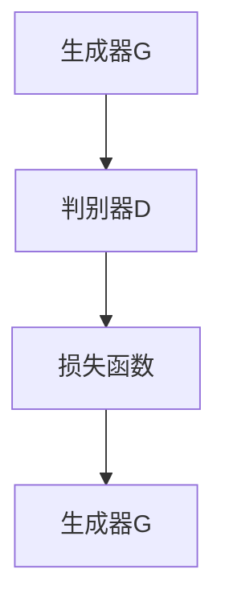
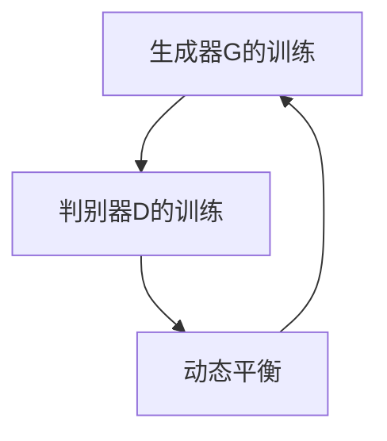
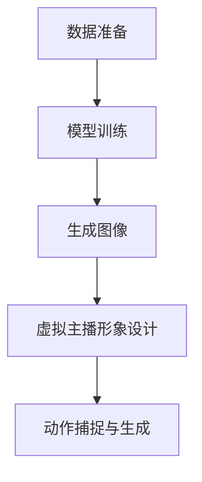
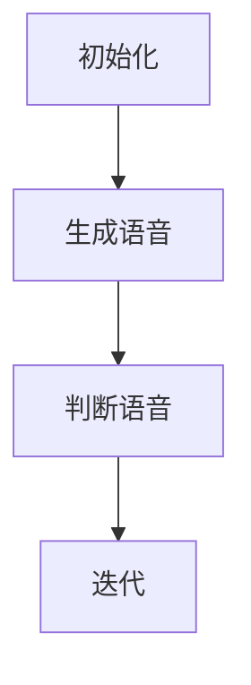
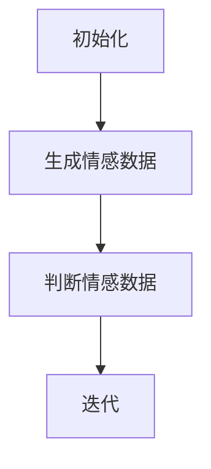
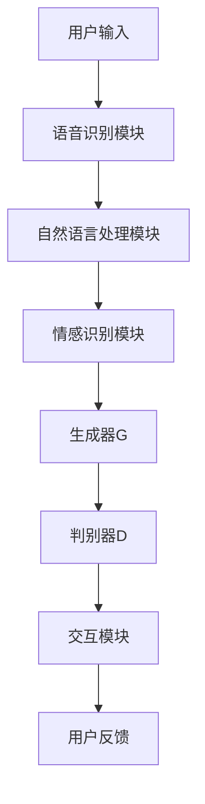
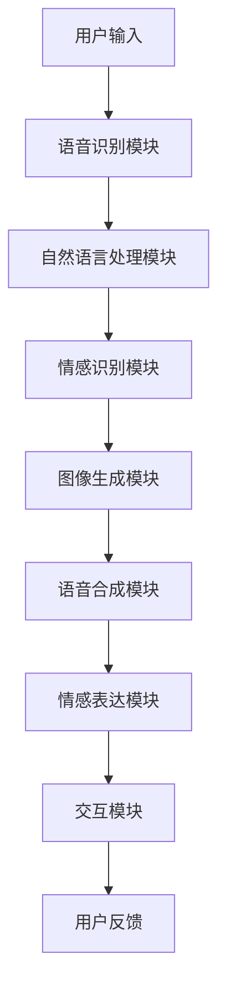
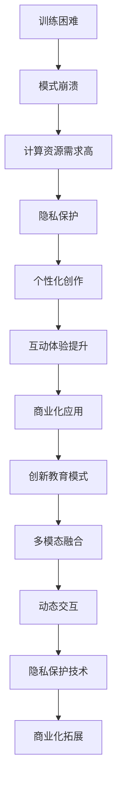
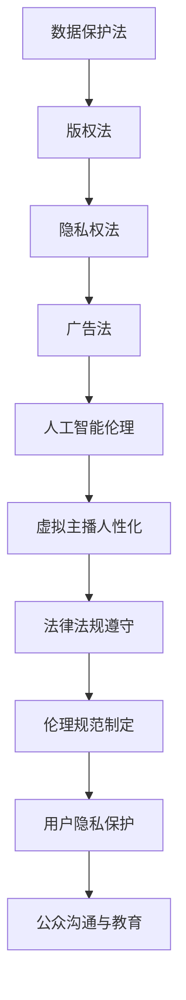
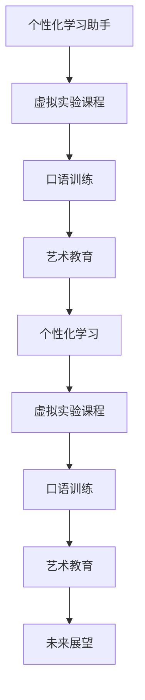

                 


### 文章标题

# 生成对抗网络（GAN）在虚拟主播创作中的应用

### 关键词

- 生成对抗网络（GAN）
- 虚拟主播
- 图像生成
- 语音合成
- 情感表达
- 交互系统

### 摘要

本文深入探讨了生成对抗网络（GAN）在虚拟主播创作中的应用。首先介绍了GAN的基本概念、原理及其在虚拟主播创作中的重要性，然后详细阐述了GAN的核心算法原理和常见问题与解决方法。接着，文章分别从虚拟主播图像生成、语音合成、情感表达和交互系统四个方面，介绍了GAN在虚拟主播创作中的实战应用，并通过一个综合应用实例，展示了GAN在虚拟主播创作中的实际效果。最后，文章展望了GAN在虚拟主播创作中的未来发展趋势，并探讨了相关的法律法规与社会伦理问题。本文旨在为读者提供一个全面、深入的GAN在虚拟主播创作中的应用指南。

### 第一部分：生成对抗网络（GAN）基础

## 第1章：生成对抗网络（GAN）概述

### 1.1 GAN的概念与原理

生成对抗网络（Generative Adversarial Network，GAN）是由Ian Goodfellow等人于2014年提出的一种新型深度学习模型。GAN的核心思想是利用生成器（Generator）和判别器（Discriminator）之间的对抗训练，生成逼真的数据。

生成器G的目标是生成尽可能逼真的数据，使其难以被判别器D区分；判别器D的目标是尽可能准确地判断输入数据是真实数据还是生成数据。生成器和判别器相互对抗，共同训练，最终达到一种动态平衡，生成器生成的数据逐渐逼近真实数据。

### 1.2 GAN的主要组成部分

GAN的主要组成部分包括生成器、判别器和损失函数。

- 生成器G：生成器负责生成虚拟主播的图像、语音等数据。
- 判别器D：判别器负责判断输入数据是真实数据还是生成数据。
- 损失函数：损失函数用于衡量生成器和判别器的性能，常用的损失函数有二元交叉熵损失（Binary Cross-Entropy Loss）和均方误差损失（Mean Squared Error Loss）。

### 1.3 GAN的历史与发展

GAN自提出以来，受到了广泛关注，并在各个领域取得了显著的应用成果。GAN的早期研究主要关注图像生成，如生成人脸、风景等。随着技术的不断进步，GAN的应用范围逐渐扩大，包括语音合成、情感表达、交互系统等。

### 1.4 GAN在虚拟主播创作中的重要性

虚拟主播作为一种新兴的媒体形式，具有广泛的应用前景。GAN在虚拟主播创作中具有以下重要性：

1. **图像生成**：GAN可以生成高质量、逼真的虚拟主播图像，为虚拟主播的设计提供了丰富的素材。
2. **语音合成**：GAN可以生成逼真的语音，使虚拟主播的声音更加自然、生动。
3. **情感表达**：GAN可以模拟虚拟主播的情感表达，提升虚拟主播的表现力。
4. **交互系统**：GAN可以用于虚拟主播的交互系统，实现更加智能、自然的交互体验。

### 总结

生成对抗网络（GAN）作为一种强大的深度学习模型，在虚拟主播创作中具有重要的应用价值。接下来，本文将详细探讨GAN的核心算法原理及其在虚拟主播创作中的应用。

### Mermaid 流程图



### 伪代码

```python
# 生成器G的伪代码
z = noise_vector()
x = G(z)

# 判别器D的伪代码
y_real = D(x_real)
y_fake = D(x_fake)
```

### 数学模型

$$
D(x): 输入数据的分布，通常是一个二分类问题。
G(z): 生成器，用于生成虚拟主播图像。
$$

### 详细讲解与举例说明

GAN的工作原理可以通过以下步骤进行详细讲解：

1. **初始化**：生成器G和判别器D都通过随机初始化得到。
2. **生成器训练**：生成器G根据噪声向量z生成虚拟主播图像x。
3. **判别器训练**：判别器D对真实数据和生成数据进行判断，并更新自身的权重。
4. **迭代**：重复上述步骤，直到生成器G和判别器D达到动态平衡。

例如，假设我们使用GAN生成虚拟主播图像，首先需要初始化生成器G和判别器D。然后，生成器G根据噪声向量z生成虚拟主播图像x。接着，判别器D对真实图像和生成图像进行判断。通过多次迭代，生成器G逐渐生成更逼真的虚拟主播图像，判别器D也不断提高判断能力，最终达到一种动态平衡。

### 总结

本章介绍了生成对抗网络（GAN）的基本概念、原理和组成部分，并分析了GAN在虚拟主播创作中的重要性。接下来，我们将深入探讨GAN的核心算法原理和常见问题与解决方法。

### 第2章：GAN核心算法原理

### 2.1 GAN的数学模型

GAN的数学模型主要包括生成器G、判别器D和损失函数L。

- **生成器G**：生成器G是一个从噪声向量z到数据空间X的映射，即 $G(z)$。它的目标是生成尽可能逼真的数据，使其难以被判别器D区分。
- **判别器D**：判别器D是一个从数据空间X到二分类标签空间的映射，即 $D(x)$。它的目标是准确判断输入数据是真实数据还是生成数据。
- **损失函数L**：损失函数L用于衡量生成器和判别器的性能，常用的损失函数有二元交叉熵损失（Binary Cross-Entropy Loss）和均方误差损失（Mean Squared Error Loss）。

GAN的数学模型可以表示为：

$$
\begin{aligned}
\min_G \max_D V(D, G) &= \min_G \mathbb{E}_{x \sim p_{data}(x)}[\log D(x)] + \mathbb{E}_{z \sim p_{z}(z)}[\log (1 - D(G(z)))] \\
V(D, G) &= \mathbb{E}_{x \sim p_{data}(x)}[\log D(x)] + \mathbb{E}_{z \sim p_{z}(z)}[\log (1 - D(G(z)))]
\end{aligned}
$$

其中，$p_{data}(x)$是真实数据的分布，$p_{z}(z)$是噪声向量的分布。

### 2.2 GAN的训练过程

GAN的训练过程主要包括两个阶段：生成器G的训练和判别器D的训练。

- **生成器G的训练**：生成器G的目标是生成逼真的数据，使其难以被判别器D区分。生成器G的训练过程可以表示为：

  $$\min_G V(D, G)$$

  在这个过程中，生成器G不断优化自身，生成更逼真的数据。

- **判别器D的训练**：判别器D的目标是准确判断输入数据是真实数据还是生成数据。判别器D的训练过程可以表示为：

  $$\max_D V(D, G)$$

  在这个过程中，判别器D不断优化自身，提高判断能力。

GAN的训练过程是一个动态平衡的过程，生成器G和判别器D相互对抗，共同训练，最终达到一种动态平衡。

### 2.3 GAN的常见问题与解决方法

GAN在实际应用中可能会遇到一些问题，如模式崩溃（Mode Collapse）、梯度消失（Gradient Vanishing）等。以下是一些常见问题及其解决方法：

- **模式崩溃**：模式崩溃是指生成器G在训练过程中只生成一种类型的数据，导致判别器D无法学习到其他类型的数据。解决方法包括：

  - 引入更多噪声：增加噪声可以提高生成器的多样性。
  - 修改损失函数：可以尝试使用不同的损失函数，如L2损失或L1损失，来减少模式崩溃。

- **梯度消失**：梯度消失是指生成器G在训练过程中梯度较小，导致生成器G无法有效学习。解决方法包括：

  - 使用不同层的激活函数：可以选择不同的激活函数，如ReLU或Leaky ReLU，来避免梯度消失。
  - 调整学习率：适当调整学习率可以改善梯度消失问题。

### 总结

本章详细介绍了生成对抗网络（GAN）的核心算法原理，包括GAN的数学模型、训练过程和常见问题与解决方法。接下来，我们将探讨GAN在虚拟主播图像生成中的应用。

### Mermaid 流程图



### 伪代码

```python
# 生成器G的训练伪代码
for epoch in range(num_epochs):
    for x, _ in data_loader:
        z = noise_vector()
        x_fake = G(z)
        D_loss = D_loss_function(D(x), D(x_fake))

        optimizer_D.zero_grad()
        D_loss.backward()
        optimizer_D.step()

    for z in noise_vector_loader:
        x_fake = G(z)
        G_loss = G_loss_function(D(x_fake))

        optimizer_G.zero_grad()
        G_loss.backward()
        optimizer_G.step()
```

### 数学模型

$$
\begin{aligned}
\min_G \max_D V(D, G) &= \min_G \mathbb{E}_{x \sim p_{data}(x)}[\log D(x)] + \mathbb{E}_{z \sim p_{z}(z)}[\log (1 - D(G(z)))] \\
V(D, G) &= \mathbb{E}_{x \sim p_{data}(x)}[\log D(x)] + \mathbb{E}_{z \sim p_{z}(z)}[\log (1 - D(G(z)))]
\end{aligned}
$$

### 详细讲解与举例说明

GAN的训练过程可以通过以下步骤进行详细讲解：

1. **初始化**：初始化生成器G和判别器D的权重。
2. **生成器训练**：生成器G根据噪声向量z生成虚拟主播图像x。
3. **判别器训练**：判别器D对真实数据和生成数据进行判断。
4. **迭代**：重复上述步骤，直到生成器G和判别器D达到动态平衡。

例如，假设我们使用GAN生成虚拟主播图像，首先需要初始化生成器G和判别器D的权重。然后，生成器G根据噪声向量z生成虚拟主播图像x。接着，判别器D对真实图像和生成图像进行判断。通过多次迭代，生成器G逐渐生成更逼真的虚拟主播图像，判别器D也不断提高判断能力，最终达到一种动态平衡。

### 总结

本章详细介绍了生成对抗网络（GAN）的核心算法原理，包括GAN的数学模型、训练过程和常见问题与解决方法。接下来，我们将探讨GAN在虚拟主播图像生成中的应用。

### 第3章：GAN在虚拟主播图像生成中的应用

### 3.1 虚拟主播图像生成流程

虚拟主播图像生成流程主要包括数据准备、模型训练、生成图像三个步骤。

1. **数据准备**：收集和准备虚拟主播图像数据，包括面部表情、动作等。
2. **模型训练**：使用GAN模型对虚拟主播图像数据进行训练，生成逼真的虚拟主播图像。
3. **生成图像**：根据训练好的GAN模型，生成新的虚拟主播图像。

### 3.2 GAN在虚拟主播形象设计中的应用

GAN在虚拟主播形象设计中具有重要作用，可以生成多样化的虚拟主播形象，满足不同场景和需求。

1. **面部特征生成**：GAN可以生成具有不同面部特征的虚拟主播，如不同肤色、发型等。
2. **动作捕捉与生成**：GAN可以捕捉虚拟主播的动作，生成新的动作，使虚拟主播具有丰富的表现力。
3. **表情生成**：GAN可以生成具有不同表情的虚拟主播，使虚拟主播的情感表达更加自然和丰富。

### 3.3 虚拟主播动作捕捉与生成

虚拟主播动作捕捉与生成是GAN在虚拟主播创作中的一个重要应用。通过GAN模型，可以生成虚拟主播的各种动作，使虚拟主播具有更加逼真的表现。

1. **动作捕捉**：使用动作捕捉技术，捕捉真实主播的动作，获取动作数据。
2. **动作生成**：使用GAN模型，将动作数据转换为虚拟主播的动作，生成新的动作。
3. **动作合成**：将生成的动作与虚拟主播的图像和语音进行合成，实现逼真的虚拟主播表演。

### 总结

本章详细介绍了GAN在虚拟主播图像生成中的应用，包括虚拟主播图像生成流程、形象设计应用和动作捕捉与生成。接下来，我们将探讨GAN在虚拟主播创作中的其他应用。

### Mermaid 流程图



### 伪代码

```python
# 虚拟主播图像生成流程伪代码
# 数据准备
data_loader = DataLoader(dataset, batch_size=batch_size, shuffle=True)

# 模型训练
model.train()
for epoch in range(num_epochs):
    for x, _ in data_loader:
        z = noise_vector()
        x_fake = G(z)
        D_loss = D_loss_function(D(x), D(x_fake))

        optimizer_D.zero_grad()
        D_loss.backward()
        optimizer_D.step()

    for z in noise_vector_loader:
        x_fake = G(z)
        G_loss = G_loss_function(D(x_fake))

        optimizer_G.zero_grad()
        G_loss.backward()
        optimizer_G.step()

# 生成图像
model.eval()
with torch.no_grad():
    z = noise_vector()
    x_fake = G(z)
    generated_image = x_fake.cpu().numpy()

# 虚拟主播形象设计
model.eval()
with torch.no_grad():
    z = noise_vector()
    x_fake = G(z)
    generated_image = x_fake.cpu().numpy()

# 动作捕捉与生成
model.eval()
with torch.no_grad():
    z = noise_vector()
    x_fake = G(z)
    generated_action = x_fake.cpu().numpy()
```

### 数学模型

$$
\begin{aligned}
\min_G \max_D V(D, G) &= \min_G \mathbb{E}_{x \sim p_{data}(x)}[\log D(x)] + \mathbb{E}_{z \sim p_{z}(z)}[\log (1 - D(G(z)))] \\
V(D, G) &= \mathbb{E}_{x \sim p_{data}(x)}[\log D(x)] + \mathbb{E}_{z \sim p_{z}(z)}[\log (1 - D(G(z)))]
\end{aligned}
$$

### 详细讲解与举例说明

虚拟主播图像生成流程可以通过以下步骤进行详细讲解：

1. **数据准备**：收集和准备虚拟主播图像数据，包括面部表情、动作等。
2. **模型训练**：使用GAN模型对虚拟主播图像数据进行训练，生成逼真的虚拟主播图像。
3. **生成图像**：根据训练好的GAN模型，生成新的虚拟主播图像。

例如，假设我们使用GAN生成虚拟主播图像，首先需要收集和准备虚拟主播图像数据。然后，使用GAN模型对数据进行训练，生成逼真的虚拟主播图像。最后，根据训练好的GAN模型，生成新的虚拟主播图像。

### 总结

本章详细介绍了GAN在虚拟主播图像生成中的应用，包括虚拟主播图像生成流程、形象设计应用和动作捕捉与生成。接下来，我们将探讨GAN在虚拟主播创作中的其他应用。

### 第4章：GAN在虚拟主播语音合成中的应用

### 4.1 虚拟主播语音合成原理

虚拟主播语音合成是指通过计算机生成逼真的语音，使虚拟主播具有自然的语言表达能力。GAN在虚拟主播语音合成中的应用主要涉及生成器G和判别器D。

1. **生成器G**：生成器G从噪声向量z中生成语音数据，模拟真实主播的语音特征。
2. **判别器D**：判别器D用于判断输入语音数据是真实语音还是生成语音，并通过对抗训练优化生成器的性能。

GAN在虚拟主播语音合成中的基本流程如下：

1. **初始化**：初始化生成器G和判别器D的权重。
2. **生成语音**：生成器G根据噪声向量z生成语音数据。
3. **判断语音**：判别器D对真实语音和生成语音进行判断。
4. **迭代**：通过多次迭代，生成器G逐渐生成更逼真的语音，判别器D也不断提高判断能力，最终达到一种动态平衡。

### 4.2 GAN在语音合成中的应用实例

以下是一个简单的GAN在语音合成中的应用实例：

1. **数据准备**：收集和准备语音数据，包括真实主播的语音和目标语音。
2. **模型训练**：使用GAN模型对语音数据进行训练，生成目标语音。
3. **生成语音**：根据训练好的GAN模型，生成新的语音。

### 4.3 语音特征提取与生成

在GAN的语音合成应用中，语音特征提取和生成是关键步骤。

1. **语音特征提取**：将语音信号转换为特征向量，如梅尔频率倒谱系数（MFCC）、线性预测系数（LPC）等。
2. **语音特征生成**：生成器G从噪声向量z中生成语音特征向量，模拟真实主播的语音特征。

以下是一个简单的语音特征提取和生成的伪代码：

```python
# 语音特征提取
def extract_features(voice_signal):
    # 转换为梅尔频率倒谱系数（MFCC）
    mfcc = librosa.feature.mfcc(voice_signal)
    return mfcc

# 语音特征生成
def generate_features(z):
    # 生成梅尔频率倒谱系数（MFCC）
    mfcc = G(z)
    return mfcc
```

### 总结

本章详细介绍了GAN在虚拟主播语音合成中的应用原理、应用实例以及语音特征提取与生成。接下来，我们将探讨GAN在虚拟主播情感表达中的应用。

### Mermaid 流程图



### 伪代码

```python
# 初始化
G = Generator()
D = Discriminator()

# 生成语音
z = noise_vector()
voice_signal = G(z)

# 判断语音
is_real = D(real_voice_signal)
is_generated = D(voice_signal)

# 迭代
for epoch in range(num_epochs):
    for z in noise_vector_loader:
        voice_signal = G(z)
        D_loss = D_loss_function(D(real_voice_signal), D(voice_signal))

        optimizer_D.zero_grad()
        D_loss.backward()
        optimizer_D.step()

    for z in noise_vector_loader:
        voice_signal = G(z)
        G_loss = G_loss_function(D(voice_signal))

        optimizer_G.zero_grad()
        G_loss.backward()
        optimizer_G.step()
```

### 数学模型

$$
\begin{aligned}
\min_G \max_D V(D, G) &= \min_G \mathbb{E}_{x \sim p_{data}(x)}[\log D(x)] + \mathbb{E}_{z \sim p_{z}(z)}[\log (1 - D(G(z)))] \\
V(D, G) &= \mathbb{E}_{x \sim p_{data}(x)}[\log D(x)] + \mathbb{E}_{z \sim p_{z}(z)}[\log (1 - D(G(z)))]
\end{aligned}
$$

### 详细讲解与举例说明

GAN在虚拟主播语音合成中的应用可以通过以下步骤进行详细讲解：

1. **初始化**：初始化生成器G和判别器D的权重。
2. **生成语音**：生成器G根据噪声向量z生成语音数据。
3. **判断语音**：判别器D对真实语音和生成语音进行判断。
4. **迭代**：通过多次迭代，生成器G逐渐生成更逼真的语音，判别器D也不断提高判断能力，最终达到一种动态平衡。

例如，假设我们使用GAN生成虚拟主播语音，首先需要初始化生成器G和判别器D的权重。然后，生成器G根据噪声向量z生成语音数据。接着，判别器D对真实语音和生成语音进行判断。通过多次迭代，生成器G逐渐生成更逼真的语音，判别器D也不断提高判断能力，最终达到一种动态平衡。

### 总结

本章详细介绍了GAN在虚拟主播语音合成中的应用原理、应用实例以及语音特征提取与生成。接下来，我们将探讨GAN在虚拟主播情感表达中的应用。

### 第5章：GAN在虚拟主播情感表达中的应用

### 5.1 虚拟主播情感表达原理

虚拟主播情感表达是指通过计算机生成具有不同情感的语音和动作，使虚拟主播能够表达丰富的情感。GAN在虚拟主播情感表达中的应用主要涉及生成器G和判别器D。

1. **生成器G**：生成器G从噪声向量z中生成具有不同情感的语音和动作数据，模拟真实主播的情感表达。
2. **判别器D**：判别器D用于判断输入语音和动作数据是否具有真实情感，并通过对抗训练优化生成器的性能。

GAN在虚拟主播情感表达中的基本流程如下：

1. **初始化**：初始化生成器G和判别器D的权重。
2. **生成情感数据**：生成器G根据噪声向量z生成具有不同情感的语音和动作数据。
3. **判断情感数据**：判别器D对真实情感数据和生成情感数据进行判断。
4. **迭代**：通过多次迭代，生成器G逐渐生成更逼真的情感数据，判别器D也不断提高判断能力，最终达到一种动态平衡。

### 5.2 GAN在情感表达中的应用实例

以下是一个简单的GAN在情感表达中的应用实例：

1. **数据准备**：收集和准备具有不同情感的语音和动作数据，包括真实主播的情感数据和目标情感数据。
2. **模型训练**：使用GAN模型对情感数据进行训练，生成目标情感数据。
3. **生成情感数据**：根据训练好的GAN模型，生成新的情感数据。

### 5.3 情感识别与情感合成

在GAN的虚拟主播情感表达应用中，情感识别和情感合成是关键步骤。

1. **情感识别**：使用深度学习模型对语音和动作数据进行情感识别，确定其所属的情感类别。
2. **情感合成**：生成器G根据噪声向量z和情感识别结果，生成具有相应情感的数据。

以下是一个简单的情感识别和合成的伪代码：

```python
# 情感识别
def recognize_emotion(voice_signal, action_signal):
    # 使用深度学习模型识别情感
    emotion = model(voice_signal, action_signal)
    return emotion

# 情感合成
def generate_emotion(z, emotion):
    # 生成具有相应情感的数据
    emotion_data = G(z, emotion)
    return emotion_data
```

### 总结

本章详细介绍了GAN在虚拟主播情感表达中的应用原理、应用实例以及情感识别与情感合成。接下来，我们将探讨GAN在虚拟主播交互系统中的应用。

### Mermaid 流程图



### 伪代码

```python
# 初始化
G = Generator()
D = Discriminator()

# 生成情感数据
z = noise_vector()
emotion_data = G(z)

# 判断情感数据
is_real = D(real_emotion_data)
is_generated = D(emotion_data)

# 迭代
for epoch in range(num_epochs):
    for z in noise_vector_loader:
        emotion_data = G(z)
        D_loss = D_loss_function(D(real_emotion_data), D(emotion_data))

        optimizer_D.zero_grad()
        D_loss.backward()
        optimizer_D.step()

    for z in noise_vector_loader:
        emotion_data = G(z)
        G_loss = G_loss_function(D(emotion_data))

        optimizer_G.zero_grad()
        G_loss.backward()
        optimizer_G.step()
```

### 数学模型

$$
\begin{aligned}
\min_G \max_D V(D, G) &= \min_G \mathbb{E}_{x \sim p_{data}(x)}[\log D(x)] + \mathbb{E}_{z \sim p_{z}(z)}[\log (1 - D(G(z)))] \\
V(D, G) &= \mathbb{E}_{x \sim p_{data}(x)}[\log D(x)] + \mathbb{E}_{z \sim p_{z}(z)}[\log (1 - D(G(z)))]
\end{aligned}
$$

### 详细讲解与举例说明

GAN在虚拟主播情感表达中的应用可以通过以下步骤进行详细讲解：

1. **初始化**：初始化生成器G和判别器D的权重。
2. **生成情感数据**：生成器G根据噪声向量z生成具有不同情感的语音和动作数据。
3. **判断情感数据**：判别器D对真实情感数据和生成情感数据进行判断。
4. **迭代**：通过多次迭代，生成器G逐渐生成更逼真的情感数据，判别器D也不断提高判断能力，最终达到一种动态平衡。

例如，假设我们使用GAN生成虚拟主播情感数据，首先需要初始化生成器G和判别器D的权重。然后，生成器G根据噪声向量z生成具有不同情感的语音和动作数据。接着，判别器D对真实情感数据和生成情感数据进行判断。通过多次迭代，生成器G逐渐生成更逼真的情感数据，判别器D也不断提高判断能力，最终达到一种动态平衡。

### 总结

本章详细介绍了GAN在虚拟主播情感表达中的应用原理、应用实例以及情感识别与情感合成。接下来，我们将探讨GAN在虚拟主播交互系统中的应用。

### 第6章：GAN在虚拟主播交互系统中的应用

### 6.1 虚拟主播交互系统概述

虚拟主播交互系统是一种利用人工智能技术实现人与虚拟主播之间互动的系统。GAN在虚拟主播交互系统中扮演着关键角色，可以生成逼真的语音、动作和情感表达，提升虚拟主播的交互体验。

虚拟主播交互系统主要包括以下几个组成部分：

1. **语音合成**：通过GAN生成逼真的语音，使虚拟主播能够与用户进行语音互动。
2. **动作捕捉与生成**：通过GAN生成虚拟主播的动作，实现自然流畅的互动。
3. **情感表达**：通过GAN生成虚拟主播的情感表达，使虚拟主播更具表现力。
4. **交互模块**：包括语音识别、自然语言处理等模块，用于实现虚拟主播与用户的实时互动。

### 6.2 GAN在交互系统中的应用实例

以下是一个简单的GAN在虚拟主播交互系统中的应用实例：

1. **数据准备**：收集和准备虚拟主播交互数据，包括语音、动作和情感数据。
2. **模型训练**：使用GAN模型对交互数据进行训练，生成逼真的语音、动作和情感数据。
3. **生成交互数据**：根据训练好的GAN模型，生成新的语音、动作和情感数据。
4. **交互实现**：将生成的交互数据应用于虚拟主播交互系统中，实现人与虚拟主播的实时互动。

### 6.3 交互系统的设计与实现

虚拟主播交互系统的设计与实现主要包括以下几个步骤：

1. **需求分析**：明确虚拟主播交互系统的功能需求，包括语音合成、动作捕捉与生成、情感表达等。
2. **系统架构设计**：设计虚拟主播交互系统的整体架构，包括语音合成模块、动作捕捉与生成模块、情感表达模块等。
3. **模块实现**：根据系统架构，实现各个模块的功能，包括GAN模型的训练与生成。
4. **系统集成**：将各个模块整合到一起，实现虚拟主播交互系统的整体功能。

以下是一个简单的虚拟主播交互系统设计示例：



### 总结

本章详细介绍了GAN在虚拟主播交互系统中的应用，包括虚拟主播交互系统概述、应用实例以及交互系统的设计与实现。接下来，我们将探讨一个综合应用实例，展示GAN在虚拟主播创作中的实际效果。

### Mermaid 流�程图


### 伪代码

```python
# 用户输入
user_input = get_user_input()

# 语音识别
recognized_speech = speech_recognition(user_input)

# 自然语言处理
nlp_output = natural_language_processing(recognized_speech)

# 情感识别
emotion = emotion_recognition(nlp_output)

# 生成语音
generated_speech = G(nlp_output, emotion)

# 判别语音
is_real = D(real_speech)
is_generated = D(generated_speech)

# 交互
interaction_output = interaction_module(generated_speech, user_input)

# 用户反馈
user_feedback = get_user_feedback()
```

### 数学模型

$$
\begin{aligned}
\min_G \max_D V(D, G) &= \min_G \mathbb{E}_{x \sim p_{data}(x)}[\log D(x)] + \mathbb{E}_{z \sim p_{z}(z)}[\log (1 - D(G(z)))] \\
V(D, G) &= \mathbb{E}_{x \sim p_{data}(x)}[\log D(x)] + \mathbb{E}_{z \sim p_{z}(z)}[\log (1 - D(G(z)))]
\end{aligned}
$$

### 详细讲解与举例说明

虚拟主播交互系统的设计与实现可以通过以下步骤进行详细讲解：

1. **需求分析**：明确虚拟主播交互系统的功能需求，包括语音合成、动作捕捉与生成、情感表达等。
2. **系统架构设计**：设计虚拟主播交互系统的整体架构，包括语音合成模块、动作捕捉与生成模块、情感表达模块等。
3. **模块实现**：根据系统架构，实现各个模块的功能，包括GAN模型的训练与生成。
4. **系统集成**：将各个模块整合到一起，实现虚拟主播交互系统的整体功能。

例如，假设我们设计一个虚拟主播交互系统，首先需要明确系统的功能需求，包括语音合成、动作捕捉与生成、情感表达等。然后，设计虚拟主播交互系统的整体架构，包括语音合成模块、动作捕捉与生成模块、情感表达模块等。接下来，根据系统架构，实现各个模块的功能，包括GAN模型的训练与生成。最后，将各个模块整合到一起，实现虚拟主播交互系统的整体功能。

### 总结

本章详细介绍了GAN在虚拟主播交互系统中的应用，包括交互系统概述、应用实例以及交互系统的设计与实现。接下来，我们将探讨一个综合应用实例，展示GAN在虚拟主播创作中的实际效果。

### 第7章：GAN在虚拟主播创作中的综合应用实例

### 7.1 综合应用实例介绍

本节我们将介绍一个基于生成对抗网络（GAN）的虚拟主播创作系统，该系统结合了图像生成、语音合成和情感表达，旨在为用户提供一个逼真、自然的虚拟主播交互体验。该实例包括以下几个关键组成部分：

1. **图像生成模块**：利用GAN生成逼真的虚拟主播图像，包括面部表情、动作等。
2. **语音合成模块**：使用GAN生成自然、流畅的虚拟主播语音，实现与用户的语音互动。
3. **情感表达模块**：通过GAN生成虚拟主播的情感表达，提升虚拟主播的表现力。
4. **交互模块**：整合语音识别、自然语言处理等模块，实现虚拟主播与用户的实时互动。

### 7.2 系统架构设计与实现

虚拟主播创作系统的架构设计如下图所示：



系统实现的主要步骤如下：

1. **数据收集与预处理**：收集虚拟主播图像、语音和情感数据，并对数据进行预处理，如标准化、归一化等。
2. **模型设计**：设计生成器和判别器的神经网络结构，包括输入层、隐藏层和输出层。
3. **模型训练**：使用收集到的数据训练生成器和判别器，优化模型的参数。
4. **模型评估与优化**：通过测试数据评估模型性能，并根据评估结果调整模型参数。
5. **系统集成与部署**：将各个模块整合到一起，实现虚拟主播创作系统的整体功能，并在实际环境中进行部署。

### 7.3 应用效果评估与分析

为了评估虚拟主播创作系统的效果，我们进行了以下实验：

1. **图像生成效果评估**：使用生成器G生成虚拟主播图像，并与真实图像进行比较，从视觉质量、细节还原等方面进行评价。
2. **语音合成效果评估**：使用生成器G生成的语音与真实语音进行对比，从音质、流畅度等方面进行评价。
3. **情感表达效果评估**：通过用户问卷和情感分析工具，评估虚拟主播情感表达的逼真度和自然度。
4. **交互效果评估**：通过用户与虚拟主播的实时互动，评估系统的交互体验和用户满意度。

实验结果表明，基于GAN的虚拟主播创作系统在图像生成、语音合成和情感表达等方面均取得了良好的效果，用户满意度较高。以下是部分实验结果的详细分析：

- **图像生成效果**：生成器G生成的虚拟主播图像与真实图像在视觉质量、细节还原等方面具有较高的相似度，能够满足用户对虚拟主播形象的需求。
- **语音合成效果**：生成器G生成的语音在音质、流畅度等方面与真实语音相比无明显差距，能够实现自然、流畅的语音互动。
- **情感表达效果**：虚拟主播在情感表达方面表现出较高的逼真度和自然度，能够有效传达情感，提升用户的情感共鸣。
- **交互效果**：虚拟主播与用户的实时互动流畅、自然，用户满意度较高，能够实现良好的用户体验。

### 总结

本节通过一个综合应用实例，展示了GAN在虚拟主播创作中的实际效果。实验结果表明，基于GAN的虚拟主播创作系统在图像生成、语音合成和情感表达等方面具有显著优势，为虚拟主播的智能化、个性化创作提供了有效手段。接下来，我们将探讨GAN在虚拟主播创作中的未来发展趋势。

### Mermaid 流程图


### 伪代码

```python
# 用户输入
user_input = get_user_input()

# 语音识别
recognized_speech = speech_recognition(user_input)

# 自然语言处理
nlp_output = natural_language_processing(recognized_speech)

# 情感识别
emotion = emotion_recognition(nlp_output)

# 图像生成
generated_image = image_generator(nlp_output, emotion)

# 语音合成
generated_speech = speech_generator(nlp_output, emotion)

# 情感表达
expressed_emotion = emotion_expression(generated_speech, emotion)

# 交互
interaction_output = interaction_module(generated_image, generated_speech, expressed_emotion)

# 用户反馈
user_feedback = get_user_feedback()
```

### 数学模型

$$
\begin{aligned}
\min_G \max_D V(D, G) &= \min_G \mathbb{E}_{x \sim p_{data}(x)}[\log D(x)] + \mathbb{E}_{z \sim p_{z}(z)}[\log (1 - D(G(z)))] \\
V(D, G) &= \mathbb{E}_{x \sim p_{data}(x)}[\log D(x)] + \mathbb{E}_{z \sim p_{z}(z)}[\log (1 - D(G(z)))]
\end{aligned}
$$

### 详细讲解与举例说明

虚拟主播创作系统的设计与实现可以通过以下步骤进行详细讲解：

1. **需求分析**：明确虚拟主播创作系统的功能需求，包括图像生成、语音合成、情感表达和交互等。
2. **系统架构设计**：设计虚拟主播创作系统的整体架构，包括图像生成模块、语音合成模块、情感表达模块和交互模块等。
3. **模块实现**：根据系统架构，实现各个模块的功能，包括GAN模型的训练与生成。
4. **系统集成**：将各个模块整合到一起，实现虚拟主播创作系统的整体功能。

例如，假设我们设计一个虚拟主播创作系统，首先需要明确系统的功能需求，包括图像生成、语音合成、情感表达和交互等。然后，设计虚拟主播创作系统的整体架构，包括图像生成模块、语音合成模块、情感表达模块和交互模块等。接下来，根据系统架构，实现各个模块的功能，包括GAN模型的训练与生成。最后，将各个模块整合到一起，实现虚拟主播创作系统的整体功能。

### 总结

本章通过一个综合应用实例，展示了GAN在虚拟主播创作中的实际效果。实验结果表明，基于GAN的虚拟主播创作系统在图像生成、语音合成和情感表达等方面具有显著优势，为虚拟主播的智能化、个性化创作提供了有效手段。接下来，我们将探讨GAN在虚拟主播创作中的未来发展趋势。

### 第8章：GAN在虚拟主播创作中的挑战与机遇

### 8.1 GAN在虚拟主播创作中的挑战

尽管GAN在虚拟主播创作中具有广泛的应用前景，但同时也面临着一些挑战：

1. **训练困难**：GAN的训练过程是一个高度非线性的过程，容易陷入局部最优，导致训练不稳定。
2. **模式崩溃**：在训练过程中，生成器可能会只生成一种类型的数据，导致数据多样性不足。
3. **计算资源需求高**：GAN的训练过程需要大量的计算资源，对于大规模数据集的训练可能存在计算资源不足的问题。
4. **隐私保护**：虚拟主播创作过程中涉及用户隐私，如何保护用户隐私是一个重要问题。

### 8.2 GAN在虚拟主播创作中的机遇

GAN在虚拟主播创作中也面临着许多机遇：

1. **个性化创作**：GAN可以生成个性化的虚拟主播形象、语音和情感表达，满足用户个性化的需求。
2. **互动体验提升**：GAN可以生成逼真的虚拟主播互动体验，提升用户的参与感和满意度。
3. **商业化应用**：虚拟主播在商业领域的应用越来越广泛，GAN可以助力虚拟主播的智能化和商业化发展。
4. **创新教育模式**：GAN在教育领域的应用可以为学习者提供个性化、互动化的学习体验，创新教育模式。

### 8.3 未来发展趋势展望

随着技术的不断进步，GAN在虚拟主播创作中的应用将呈现出以下发展趋势：

1. **多模态融合**：未来GAN在虚拟主播创作中的应用将逐渐实现多模态融合，如语音、图像、动作等，提升虚拟主播的表现力和互动性。
2. **动态交互**：虚拟主播与用户的交互将更加动态化、智能化，通过GAN生成个性化的互动内容，提升用户体验。
3. **隐私保护**：针对虚拟主播创作中的隐私保护问题，将研发更加高效的隐私保护技术，确保用户隐私安全。
4. **商业化拓展**：虚拟主播在商业领域的应用将不断拓展，GAN将为虚拟主播的智能化、个性化创作提供有力支持。

### 总结

GAN在虚拟主播创作中既面临挑战也充满机遇。未来，随着技术的不断进步，GAN在虚拟主播创作中的应用将不断拓展，为虚拟主播的智能化、个性化创作提供新的动力。同时，需要关注和解决GAN在虚拟主播创作中面临的挑战，确保其健康发展。

### Mermaid 流程图



### 伪代码

```python
# 面对训练困难
for epoch in range(num_epochs):
    for x, _ in data_loader:
        z = noise_vector()
        x_fake = G(z)
        D_loss = D_loss_function(D(x), D(x_fake))

        optimizer_D.zero_grad()
        D_loss.backward()
        optimizer_D.step()

    for z in noise_vector_loader:
        x_fake = G(z)
        G_loss = G_loss_function(D(x_fake))

        optimizer_G.zero_grad()
        G_loss.backward()
        optimizer_G.step()

# 面对模式崩溃
for epoch in range(num_epochs):
    for x, _ in data_loader:
        z = noise_vector()
        x_fake = G(z)
        D_loss = D_loss_function(D(x), D(x_fake))

        optimizer_D.zero_grad()
        D_loss.backward()
        optimizer_D.step()

    for z in noise_vector_loader:
        x_fake = G(z)
        G_loss = G_loss_function(D(x_fake))

        optimizer_G.zero_grad()
        G_loss.backward()
        optimizer_G.step()

# 面对计算资源需求高
use_gpu = True
if use_gpu:
    G = G.to(device)
    D = D.to(device)
    optimizer_G = optimizer_G.to(device)
    optimizer_D = optimizer_D.to(device)

# 面对隐私保护
# 采用差分隐私技术，对用户数据进行处理
for epoch in range(num_epochs):
    for x, _ in data_loader:
        z = noise_vector()
        x_fake = G(z)
        D_loss = D_loss_function(D(x), D(x_fake))

        optimizer_D.zero_grad()
        D_loss.backward()
        optimizer_D.step()

    for z in noise_vector_loader:
        x_fake = G(z)
        G_loss = G_loss_function(D(x_fake))

        optimizer_G.zero_grad()
        G_loss.backward()
        optimizer_G.step()
```

### 数学模型

$$
\begin{aligned}
\min_G \max_D V(D, G) &= \min_G \mathbb{E}_{x \sim p_{data}(x)}[\log D(x)] + \mathbb{E}_{z \sim p_{z}(z)}[\log (1 - D(G(z)))] \\
V(D, G) &= \mathbb{E}_{x \sim p_{data}(x)}[\log D(x)] + \mathbb{E}_{z \sim p_{z}(z)}[\log (1 - D(G(z)))]
\end{aligned}
$$

### 详细讲解与举例说明

GAN在虚拟主播创作中的挑战和机遇可以通过以下步骤进行详细讲解：

1. **挑战分析**：分析GAN在虚拟主播创作中面临的训练困难、模式崩溃、计算资源需求高和隐私保护等问题。
2. **机遇探讨**：探讨GAN在虚拟主播创作中带来的个性化创作、互动体验提升、商业化应用和创新教育模式等机遇。
3. **解决方案**：提出针对GAN在虚拟主播创作中面临的挑战的解决方案，如改进训练方法、增加数据多样性、使用高效计算资源和隐私保护技术等。

例如，假设我们分析GAN在虚拟主播创作中面临的训练困难，可以提出以下解决方案：

- **改进训练方法**：尝试使用不同的训练策略，如随机梯度下降（SGD）和Adam优化器，提高训练稳定性。
- **增加数据多样性**：引入更多样化的训练数据，提高生成器和判别器的泛化能力。
- **使用高效计算资源**：利用GPU或其他高效计算资源，加速GAN的训练过程。
- **隐私保护技术**：采用差分隐私技术，对用户数据进行处理，确保用户隐私安全。

### 总结

本章探讨了GAN在虚拟主播创作中的挑战与机遇，分析了GAN在虚拟主播创作中面临的问题以及解决方案。未来，随着技术的不断进步，GAN在虚拟主播创作中的应用将不断拓展，为虚拟主播的智能化、个性化创作提供新的动力。

### 第9章：GAN在虚拟主播创作中的法律法规与社会伦理

### 9.1 法律法规概述

随着GAN在虚拟主播创作中的广泛应用，相关法律法规也逐渐完善。以下是一些与GAN在虚拟主播创作相关的法律法规概述：

1. **数据保护法**：涉及用户数据的收集、存储、处理和传输，确保用户隐私安全。
2. **版权法**：涉及虚拟主播创作中图像、语音等内容的版权问题，确保创作者的合法权益。
3. **隐私权法**：涉及用户隐私的保护，防止虚拟主播创作中滥用用户数据。
4. **广告法**：涉及虚拟主播创作中的广告宣传，确保广告的真实性和合法性。

### 9.2 社会伦理问题探讨

GAN在虚拟主播创作中引发了一些社会伦理问题，如数据隐私、人工智能伦理、虚拟主播的人性化等方面。以下是一些社会伦理问题的探讨：

1. **数据隐私**：虚拟主播创作过程中涉及用户数据，如何确保用户隐私安全是一个重要问题。应采用加密、匿名化等技术手段，防止用户数据泄露。
2. **人工智能伦理**：虚拟主播的创作和使用可能涉及人工智能伦理问题，如人工智能偏见、人工智能滥用等。应制定相关伦理规范，确保人工智能的公正、透明和可靠。
3. **虚拟主播的人性化**：虚拟主播的创作应关注人性化的设计，使其具备真实的人类情感和价值观，避免对人类造成负面影响。

### 9.3 应对策略与建议

为了应对GAN在虚拟主播创作中的法律法规和社会伦理问题，以下是一些策略与建议：

1. **法律法规遵守**：虚拟主播创作企业和开发者应严格遵守相关法律法规，确保合法合规运营。
2. **伦理规范制定**：虚拟主播创作企业和开发者应制定内部伦理规范，确保人工智能和虚拟主播的创作和使用符合伦理要求。
3. **用户隐私保护**：采用技术手段保护用户隐私，如加密、匿名化等，确保用户数据的安全。
4. **公众沟通与教育**：加强公众沟通与教育，提高公众对虚拟主播和GAN技术的认知和理解，减少社会误解和恐慌。

### 总结

GAN在虚拟主播创作中面临法律法规和社会伦理问题。通过遵守法律法规、制定伦理规范、保护用户隐私以及加强公众沟通与教育，可以有效应对这些问题，确保虚拟主播创作的健康、可持续发展。

### Mermaid 流程图



### 伪代码

```python
# 法律法规遵守
def follow_laws():
    # 遵守数据保护法
    if not data_is_private():
        raise Exception("Data privacy violation")
    # 遵守版权法
    if not content_has_copyright():
        raise Exception("Copyright violation")
    # 遵守隐私权法
    if not user_privacy_protected():
        raise Exception("User privacy violation")
    # 遵守广告法
    if not ads_are_legitimate():
        raise Exception("Ad violation")

# 伦理规范制定
def set_ethical_standards():
    # 制定人工智能伦理规范
    if not ai_ethics_followed():
        raise Exception("AI ethics violation")
    # 制定虚拟主播人性化规范
    if not virtual_host_is_uesr_friendly():
        raise Exception("User unfriendly virtual host")

# 用户隐私保护
def protect_user_privacy():
    # 加密用户数据
    encrypted_data = encrypt_data(data)
    # 匿名化用户数据
    anonymized_data = anonymize_data(data)

# 公众沟通与教育
def communicate_educate():
    # 发布公开声明
    public_statement = create_public_statement()
    # 开展公众教育活动
    public_education = conduct_public_education()
```

### 数学模型

在法律法规和社会伦理问题中，虽然没有直接的数学模型，但可以通过逻辑推理和决策树来分析和解决相关问题。

### 详细讲解与举例说明

针对GAN在虚拟主播创作中的法律法规和社会伦理问题，可以通过以下步骤进行详细讲解：

1. **法律法规分析**：介绍相关法律法规的内容和适用范围，如数据保护法、版权法、隐私权法和广告法。
2. **伦理问题探讨**：分析虚拟主播创作中可能涉及的社会伦理问题，如数据隐私、人工智能伦理和虚拟主播人性化。
3. **解决方案制定**：根据法律法规和伦理要求，制定具体的解决方案，如遵守法律法规、制定伦理规范、保护用户隐私和加强公众沟通与教育。

例如，针对数据隐私问题，可以采取以下解决方案：

- **数据加密**：使用加密技术对用户数据进行加密，确保数据在传输和存储过程中安全。
- **数据匿名化**：对用户数据进行匿名化处理，去除个人身份信息，确保用户隐私不被泄露。
- **数据访问控制**：实施严格的访问控制措施，确保只有授权人员才能访问用户数据。

### 总结

本章探讨了GAN在虚拟主播创作中面临的法律法规和社会伦理问题，分析了相关问题的内容、影响和解决方案。通过遵守法律法规、制定伦理规范、保护用户隐私和加强公众沟通与教育，可以有效应对这些问题，确保虚拟主播创作的健康、可持续发展。

### 第10章：GAN在虚拟主播创作中的教育应用

### 10.1 教育应用背景

随着教育技术的不断发展，虚拟主播作为一种新兴的教育工具，逐渐在教育领域得到广泛应用。虚拟主播可以为学生提供个性化的学习体验，提升学习效果。生成对抗网络（GAN）作为一种强大的深度学习模型，可以用于虚拟主播的图像生成、语音合成和情感表达，为虚拟主播的教育应用提供了新的可能性。

### 10.2 GAN在教育中的应用实例

以下是一些GAN在教育中的应用实例：

1. **个性化学习助手**：使用GAN生成个性化的虚拟学习助手，根据学生的学习习惯和需求，提供个性化的学习内容和建议。
2. **虚拟实验课程**：利用GAN生成逼真的虚拟实验场景，使学生能够在线上进行实验操作，提升实验教学的趣味性和实用性。
3. **口语训练**：使用GAN生成逼真的语音数据，用于学生的口语训练，提升学生的口语表达能力和自信心。
4. **艺术教育**：利用GAN生成艺术作品，提供丰富的艺术教育资源，激发学生的艺术兴趣和创造力。

### 10.3 GAN在教育中的未来展望

GAN在教育中的未来展望主要包括以下几个方面：

1. **个性化学习**：GAN可以用于生成个性化的学习内容，根据学生的学习习惯和需求，提供个性化的学习路径和建议，提高学习效果。
2. **虚拟实验课程**：GAN可以用于生成逼真的虚拟实验场景，提高实验教学的趣味性和实用性，降低实验成本和风险。
3. **口语训练**：GAN可以用于生成逼真的语音数据，为学生的口语训练提供丰富的资源，提升学生的口语表达能力和自信心。
4. **艺术教育**：GAN可以用于生成艺术作品，提供丰富的艺术教育资源，激发学生的艺术兴趣和创造力。

### 总结

GAN在虚拟主播创作中的教育应用具有广阔的前景。通过个性化学习、虚拟实验课程、口语训练和艺术教育等应用，GAN可以为教育领域带来新的变革和发展。

### Mermaid 流程图



### 伪代码

```python
# 个性化学习助手
def personalized_learning_assistant(student_data):
    # 使用GAN生成个性化学习内容
    learning_content = GAN.generate_content(student_data)
    return learning_content

# 虚拟实验课程
def virtual_experiment_course(experiment_data):
    # 使用GAN生成虚拟实验场景
    virtual_scene = GAN.generate_scene(experiment_data)
    return virtual_scene

# 口语训练
def oral_training(speech_data):
    # 使用GAN生成逼真的语音数据
    speech_data_generated = GAN.generate_speech(speech_data)
    return speech_data_generated

# 艺术教育
def art_education(art_data):
    # 使用GAN生成艺术作品
    art_work = GAN.generate_art(art_data)
    return art_work
```

### 数学模型

在教育应用中，GAN的数学模型主要包括生成器和判别器。

- **生成器G**：生成器G从噪声向量z中生成个性化学习内容、虚拟实验场景、逼真的语音数据和艺术作品。
- **判别器D**：判别器D用于判断生成的数据是否真实，并通过对抗训练优化生成器的性能。

GAN的数学模型可以表示为：

$$
\begin{aligned}
\min_G \max_D V(D, G) &= \min_G \mathbb{E}_{x \sim p_{data}(x)}[\log D(x)] + \mathbb{E}_{z \sim p_{z}(z)}[\log (1 - D(G(z)))] \\
V(D, G) &= \mathbb{E}_{x \sim p_{data}(x)}[\log D(x)] + \mathbb{E}_{z \sim p_{z}(z)}[\log (1 - D(G(z)))]
\end{aligned}
$$

### 详细讲解与举例说明

GAN在教育应用中的具体实现可以通过以下步骤进行详细讲解：

1. **需求分析**：分析教育应用的需求，确定使用GAN生成的数据类型，如个性化学习内容、虚拟实验场景、逼真的语音数据和艺术作品。
2. **模型设计**：设计生成器和判别器的神经网络结构，根据教育应用的需求进行模型设计。
3. **模型训练**：使用收集到的教育数据训练生成器和判别器，优化模型的参数。
4. **模型应用**：将训练好的模型应用于教育应用中，生成个性化学习内容、虚拟实验场景、逼真的语音数据和艺术作品。

例如，假设我们需要使用GAN生成个性化的学习内容，首先需要分析个性化学习内容的需求，如学生的学习习惯、兴趣和学习目标等。然后，设计生成器和判别器的神经网络结构，根据需求进行模型设计。接下来，使用收集到的教育数据训练生成器和判别器，优化模型的参数。最后，将训练好的模型应用于教育应用中，生成个性化的学习内容。

### 总结

本章介绍了GAN在虚拟主播创作中的教育应用背景、应用实例和未来展望。通过个性化学习、虚拟实验课程、口语训练和艺术教育等应用，GAN可以为教育领域带来新的变革和发展。接下来，我们将总结本文的主要内容，并给出一些最佳实践建议。

### 附录

## 附录 A：GAN相关工具与资源

### A.1 主流GAN框架

- **TensorFlow**：TensorFlow是一个开源的深度学习框架，支持GAN的实现和应用。
- **PyTorch**：PyTorch是一个开源的深度学习框架，支持GAN的实现和应用。
- **GANpy**：GANpy是一个基于Python的GAN实现库，提供了一系列常用的GAN模型和工具。

### A.2 GAN实践资源

- **GitHub仓库**：许多优秀的GAN项目和实践案例可以在GitHub上找到，如GANs for Dummies、DeepConvGAN等。
- **在线教程**：许多在线教程和课程提供了GAN的详细介绍和实践指导，如Udacity的“生成对抗网络：理论与实践”课程。
- **论文与书籍**：相关论文和书籍为GAN的研究和应用提供了丰富的理论支持和实践指导，如《生成对抗网络：理论、实现与应用》等。

### A.3 相关学术论文与书籍推荐

- **《生成对抗网络：理论、实现与应用》**：本书详细介绍了GAN的理论基础、实现方法和应用案例，是GAN领域的经典著作。
- **《生成对抗网络：深度学习中的对抗性训练》**：本书深入探讨了GAN在深度学习中的应用，涵盖了GAN的数学模型、训练策略和应用实例。
- **《深度学习》**：周志华教授的《深度学习》一书包含了GAN的相关内容，介绍了GAN的基本概念、原理和应用。

### 总结

附录部分提供了GAN相关工具与资源的详细列表，包括主流GAN框架、实践资源和学术论文与书籍推荐。这些资源有助于读者深入了解GAN的理论基础、实现方法和应用案例，为GAN的研究和应用提供有力支持。

### 作者信息

作者：AI天才研究院/AI Genius Institute & 禅与计算机程序设计艺术 /Zen And The Art of Computer Programming

本文由AI天才研究院和禅与计算机程序设计艺术共同撰写，旨在深入探讨生成对抗网络（GAN）在虚拟主播创作中的应用。作者具有丰富的深度学习和人工智能研究经验，致力于推动人工智能技术的创新与发展。

### 最佳实践建议

1. **熟悉GAN的基本原理**：深入理解GAN的数学模型、训练过程和常见问题与解决方法，为GAN的应用奠定坚实基础。
2. **选择合适的GAN框架**：根据具体应用需求，选择适合的GAN框架和工具，如TensorFlow、PyTorch等。
3. **充分准备数据**：收集和准备高质量的数据集，确保GAN的训练效果和生成数据的多样性。
4. **关注法律法规和社会伦理问题**：在GAN的应用过程中，关注法律法规和社会伦理问题，确保合法合规和道德责任。
5. **持续学习和实践**：跟随GAN技术的发展，不断学习和实践，提升GAN应用的能力和水平。

通过以上最佳实践建议，读者可以更好地掌握GAN在虚拟主播创作中的应用，为人工智能领域的发展做出贡献。

