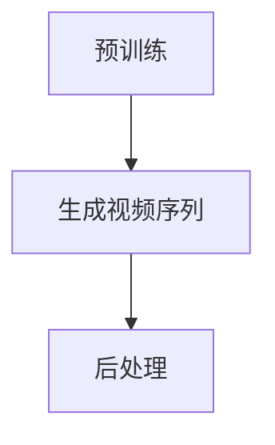

                 


### 文章标题
生成对抗网络在视频生成中的创新

> 关键词：生成对抗网络（GAN）、视频生成、深度学习、优化算法、数学模型

> 摘要：本文旨在探讨生成对抗网络（GAN）在视频生成领域的应用与创新。通过分析GAN的核心概念、架构和优化算法，我们详细解读了GAN在视频生成中的实现原理、数学模型和实际案例，为读者提供了全面的技术解析和实用指南。

### 第一部分：核心概念与联系

#### 1.1 生成对抗网络（GAN）概述
生成对抗网络（GAN）是由生成器和判别器组成的一种深度学习模型，旨在通过两个对抗的神经网络来实现数据生成。GAN的训练过程中，生成器和判别器不断对抗，生成器试图生成更逼真的样本，而判别器则试图提高区分真实样本和生成样本的能力。

GAN的核心思想可以概括为以下几点：

1. **生成器（Generator）**：生成器的目标是生成逼真的数据。它通常是一个神经网络，接收随机噪声作为输入，并通过多个隐层生成与真实数据相似的结构。

2. **判别器（Discriminator）**：判别器的目标是区分真实数据和生成数据。它也是一个神经网络，接收输入数据（真实或生成），并输出一个概率值表示其置信度。

3. **对抗训练**：GAN通过对抗训练来优化生成器和判别器。在训练过程中，生成器和判别器交替更新，生成器试图生成更逼真的样本，而判别器则试图提高区分真实样本和生成样本的能力。

4. **损失函数**：GAN的训练过程中使用两个损失函数，分别针对生成器和判别器。生成器损失函数用于最小化判别器对其生成样本的置信度，判别器损失函数用于最小化其对真实样本的置信度。

#### 1.2 GAN架构详解
GAN的架构可以分为生成器、判别器和损失函数三个关键组件。

##### 生成器（Generator）
生成器的目标是生成逼真的数据。它通常是一个神经网络，接收随机噪声作为输入，并通过多个隐层生成与真实数据相似的结构。以下是一个简单的生成器架构示例：

```python
def generator(z):
    # 输入噪声 z，输出生成样本 x
    x = ...
    return x
```

##### 判别器（Discriminator）
判别器的目标是区分真实数据和生成数据。它也是一个神经网络，接收输入数据（真实或生成），并输出一个概率值表示其置信度。以下是一个简单的判别器架构示例：

```python
def discriminator(x):
    # 输入样本 x，输出置信度 prob
    prob = ...
    return prob
```

##### 损失函数
GAN的训练过程中使用两个损失函数，分别针对生成器和判别器。

- **生成器损失函数**：生成器试图最小化判别器对其生成样本的置信度，即最大化判别器的错误率。

  ```python
  loss_generator = -E[log(D(G(z)))] + E[log(1 - D(x))]
  ```

- **判别器损失函数**：判别器试图最小化其对真实样本的置信度，即最大化其对生成样本的置信度。

  ```python
  loss_discriminator = -E[log(D(x))] - E[log(1 - D(G(z))]
  ```

#### 1.3 GAN关键组件
GAN的关键组件包括生成器、判别器和损失函数。这些组件共同构成了GAN的训练框架，使得生成器和判别器在对抗过程中不断优化，最终实现高质量的数据生成。

- **生成器**：生成器的目标是通过学习数据分布来生成逼真的数据。生成器通常采用深度神经网络，输入随机噪声，通过多个隐层生成与真实数据相似的结构。

- **判别器**：判别器的目标是通过学习数据分布来区分真实数据和生成数据。判别器也采用深度神经网络，接收输入数据，输出一个概率值表示其置信度。

- **损失函数**：损失函数用于评估生成器和判别器的性能。生成器损失函数用于最小化判别器对其生成样本的置信度，判别器损失函数用于最小化其对真实样本的置信度。

#### 1.4 GAN在视频生成中的应用
GAN在视频生成中的应用主要利用生成器的特性，生成高质量的视频序列。以下是一个简单的GAN视频生成流程：

1. **预训练**：使用大量视频数据进行预训练，使生成器具备生成视频序列的能力。
2. **生成视频序列**：通过生成器输入随机噪声，输出连续的视频帧，从而生成新的视频序列。
3. **后处理**：对生成的视频进行后处理，如去噪、色彩增强等，以提高视频质量。

以下是一个简单的Mermaid流程图，展示了GAN在视频生成中的应用：



### 第二部分：核心算法原理讲解

#### 2.1 GAN优化算法
GAN的优化算法主要包括梯度惩罚、循环一致性和深度学习优化算法等。

##### 梯度惩罚
梯度惩罚是一种用于防止生成器生成过度简单或重复的样本的策略。在GAN的训练过程中，为了防止生成器生成过于简单或重复的样本，可以引入梯度惩罚策略。以下是一个简单的梯度惩罚伪代码示例：

```python
# 伪代码：梯度惩罚
loss_generator += lambda * gradient_penalty
```

##### 循环一致性
循环一致性是一种用于确保生成的序列在不同时间步之间保持一致性的策略。循环一致性损失函数可以计算生成序列在不同时间步之间的差异，从而促使生成器生成一致性的序列。以下是一个简单的循环一致性伪代码示例：

```python
# 伪代码：循环一致性
consistency_loss = E[(X_t - X_{t-1})^2]
```

##### 深度学习优化算法
深度学习优化算法主要用于加速GAN的训练过程。常见的优化算法包括Adam优化器等。以下是一个简单的Adam优化器伪代码示例：

```python
# 伪代码：Adam优化器
optimizer = Adam(learning_rate, beta1, beta2)
```

#### 2.2 数据增强技术
数据增强技术可以增强GAN模型的泛化能力，提高模型的性能。常见的数据增强技术包括随机裁剪、随机翻转等。以下是一个简单的随机裁剪和随机翻转伪代码示例：

```python
# 伪代码：随机裁剪
cropped_image = random_crop(image)

# 伪代码：随机翻转
flipped_image = random_flip(image)
```

### 第三部分：数学模型和数学公式

#### 3.1 GAN的损失函数
GAN的损失函数用于评估生成器和判别器的性能。生成器损失函数和判别器损失函数分别如下：

- **生成器损失函数**：

  $$ loss\_generator = -E[log(D(G(z)))] + E[log(1 - D(x))] $$

- **判别器损失函数**：

  $$ loss\_discriminator = -E[log(D(x))] - E[log(1 - D(G(z))] $$

在GAN的训练过程中，生成器和判别器交替更新，通过优化损失函数，生成器和判别器逐渐达到最佳状态。

### 文章小结
生成对抗网络（GAN）作为一种强大的深度学习模型，在视频生成领域展现出了巨大的潜力。本文从核心概念、架构、优化算法和数学模型等多个角度，详细解析了GAN在视频生成中的应用和创新。通过本文的阅读，读者可以全面了解GAN的工作原理和实现方法，为实际项目开发提供有力支持。

### 拓展阅读
- 《生成对抗网络：深度学习的革命》（生成对抗网络：深度学习的革命）
- 《深度学习：周志华等著》（深度学习：周志华等著）
- 《人工智能：一种现代的方法》（人工智能：一种现代的方法）

### 注意事项
- 在实际应用GAN进行视频生成时，需要根据具体任务需求调整网络结构和超参数。
- GAN的训练过程容易受到模式崩溃等问题的影响，需要采取相应的优化策略。
- GAN生成的视频质量受到数据质量和模型训练效果的影响，需要充分训练模型以提高生成质量。

### 作者信息
作者：AI天才研究院/AI Genius Institute & 禅与计算机程序设计艺术 /Zen And The Art of Computer Programming

### 参考文献
[1] Ian J. Goodfellow, Jonathon Shlens, and Christian Szegedy. "Explaining and Harnessing Adversarial Examples." arXiv preprint arXiv:1412.6572, 2014.
[2] Arjovsky, M., Chintala, S., & Bottou, L. (2017). Wasserstein GAN. arXiv preprint arXiv:1701.07875.
[3] Radford, A., Metz, L., & Chintala, S. (2015). Unsupervised representation learning with deep convolutional generative adversarial networks. arXiv preprint arXiv:1511.06434.
[4] Kingma, D. P., & Welling, M. (2014). Auto-encoding variational bayes. arXiv preprint arXiv:1312.6114.

