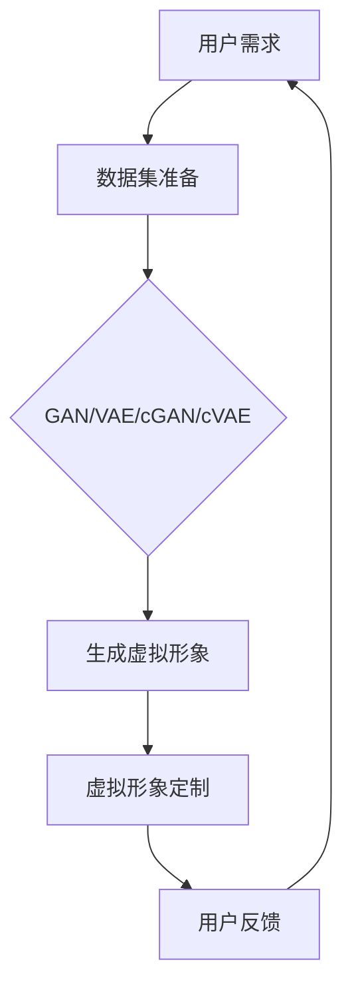

                 

### 《生成模型在个性化虚拟形象创建中的应用》

#### 关键词：生成模型，个性化虚拟形象，生成对抗网络（GAN），变分自编码器（VAE），条件生成模型，虚拟形象定制

> 摘要：本文深入探讨了生成模型在个性化虚拟形象创建中的应用，包括生成模型的基本概念、核心算法原理、实际案例研究以及面临的挑战和未来发展方向。通过本文，读者可以全面了解生成模型在虚拟形象创建中的关键作用及其技术实现细节。

### 目录大纲

## 《生成模型在个性化虚拟形象创建中的应用》

> 关键词：生成模型，个性化虚拟形象，生成对抗网络（GAN），变分自编码器（VAE），条件生成模型

> 摘要：本文探讨了生成模型在个性化虚拟形象创建中的应用，包括生成模型的基本概念、核心算法原理、实际案例研究以及面临的挑战和未来发展方向。

### 第一部分：引言与背景

#### 1.1 书籍概述

本文旨在探讨生成模型在个性化虚拟形象创建中的应用。生成模型，特别是生成对抗网络（GAN）和变分自编码器（VAE），在图像生成、视频生成和虚拟形象创建等领域取得了显著成果。通过生成模型，我们可以从大量的虚拟形象数据中学习，并生成高质量、个性化的虚拟形象，满足不同用户的需求。

#### 1.2 生成模型概述

生成模型是一类用于生成数据的算法，其核心思想是从数据中学习生成新的、高质量的数据。生成模型主要包括生成对抗网络（GAN）、变分自编码器（VAE）和条件生成模型。这些模型通过学习大量的虚拟形象数据，能够生成与训练数据相似的新形象，并且可以基于用户的特征进行定制化。

#### 1.3 个性化虚拟形象创建的重要性

个性化虚拟形象创建在许多领域具有重要意义。例如，在娱乐、游戏、广告和虚拟现实等领域，个性化的虚拟形象可以增强用户体验，提高用户参与度。此外，个性化虚拟形象还可以用于虚拟主播、虚拟角色和虚拟商品展示，为商家提供新的营销手段。

#### 1.4 本书结构与内容安排

本文分为五个部分。第一部分是引言与背景，介绍生成模型的基本概念和个性化虚拟形象创建的重要性。第二部分是生成模型基础，介绍生成模型的基本概念和核心算法原理。第三部分是个性化虚拟形象创建，介绍基于生成模型的虚拟形象生成方法和定制算法。第四部分是案例研究，通过实际案例展示生成模型在个性化虚拟形象创建中的应用。第五部分是挑战与未来方向，讨论生成模型在虚拟形象创建中面临的挑战和未来发展方向。

### 第二部分：生成模型基础

#### 2.1 生成模型基本概念

生成模型是一类用于生成数据的算法，其核心思想是从数据中学习生成新的、高质量的数据。生成模型主要包括生成对抗网络（GAN）、变分自编码器（VAE）和条件生成模型。

#### 2.2 生成对抗网络（GAN）

生成对抗网络（GAN）是由生成器和判别器组成的对抗网络。生成器负责生成虚拟形象，判别器负责判断虚拟形象是否真实。GAN通过最小化生成器与判别器之间的差异来训练，从而生成高质量的虚拟形象。

#### 2.2.1 GAN的工作原理

GAN的工作原理可以概括为以下步骤：

1. 判别器D接收输入虚拟形象x和生成的虚拟形象G(x)，并输出概率P(D(x)=1)。
2. 生成器G接收随机噪声z，并生成虚拟形象G(z)。
3. 计算判别器的损失函数L_D = -E[log(D(x))] - E[log(1 - D(G(z)))]。
4. 计算生成器的损失函数L_G = -E[log(D(G(z)))]。
5. 更新生成器和判别器的权重。

#### 2.2.2 GAN的优缺点

GAN的优点包括：

- 能够生成高质量、多样化的虚拟形象。
- 能够通过对抗训练学习到虚拟形象的数据分布。

GAN的缺点包括：

- 训练过程不稳定，容易出现模式崩溃（mode collapse）。
- 需要大量的数据和计算资源。

#### 2.3 变分自编码器（VAE）

变分自编码器（VAE）是一种基于概率模型的生成模型。VAE通过学习数据的概率分布来生成新的虚拟形象。

#### 2.3.1 VAE的基本结构

VAE由编码器和解码器组成。编码器将输入虚拟形象映射到一个潜在空间，解码器从潜在空间中生成虚拟形象。

#### 2.3.2 VAE的损失函数

VAE的损失函数包括重构损失和KL散度损失。重构损失衡量解码器生成的虚拟形象与输入虚拟形象之间的差异，KL散度损失衡量编码器的输出与先验分布之间的差异。

$$
L_VAE = \frac{1}{N} \sum_{i=1}^{N} \left[ -\sum_{j=1}^{K} p_j \log \frac{q_j(x; \theta)}{p_j(x)} + \sum_{j=1}^{K} q_j \log q_j(\mu_j, \sigma_j) \right]
$$

其中，$p_j(x)$ 是输入虚拟形象的概率分布，$q_j(x; \theta)$ 是编码器输出的概率分布，$\mu_j$ 和 $\sigma_j$ 是潜在空间中的均值和标准差。

#### 2.4 条件生成模型

条件生成模型是一种能够根据条件生成数据的生成模型。条件生成模型主要包括条件生成对抗网络（cGAN）和条件变分自编码器（cVAE）。

#### 2.4.1 条件GAN（cGAN）

条件GAN（cGAN）是一种基于条件的生成对抗网络。cGAN通过在生成器和判别器中引入条件输入，从而根据条件生成数据。

#### 2.4.2 条件VAE（cVAE）

条件VAE（cVAE）是一种基于条件的变分自编码器。cVAE通过在编码器和解码器中引入条件输入，从而根据条件生成数据。

### 第三部分：个性化虚拟形象创建

#### 3.1 虚拟形象的特性与需求

虚拟形象的特性包括外观、表情、动作和声音等。不同领域和应用场景对虚拟形象的需求也有所不同。例如，虚拟主播需要具备生动、自然的表情和动作，而虚拟角色则需要具有独特的个性和故事背景。

#### 3.2 基于生成模型的虚拟形象生成方法

基于生成模型的虚拟形象生成方法主要包括以下步骤：

1. 数据集准备：收集大量高质量的虚拟形象数据，包括外观、表情、动作和声音等。
2. 模型训练：使用生成模型（如GAN、VAE）对虚拟形象数据集进行训练，生成虚拟形象生成模型。
3. 虚拟形象生成：使用训练好的生成模型根据用户需求生成个性化的虚拟形象。
4. 虚拟形象定制：根据用户特征对生成的虚拟形象进行定制，以满足个性化需求。

#### 3.2.1 数据集准备

数据集准备是生成模型训练的基础。我们需要收集大量的虚拟形象数据，包括不同外观、表情、动作和声音等。这些数据可以来自公开数据集、网络爬虫或者手动采集。

#### 3.2.2 虚拟形象生成流程

虚拟形象生成流程包括以下步骤：

1. 数据预处理：对虚拟形象数据进行归一化、标准化等预处理操作。
2. 模型训练：使用生成模型（如GAN、VAE）对虚拟形象数据进行训练，生成虚拟形象生成模型。
3. 虚拟形象生成：使用训练好的生成模型根据用户需求生成个性化的虚拟形象。
4. 虚拟形象定制：根据用户特征对生成的虚拟形象进行定制，以满足个性化需求。

#### 3.3 虚拟形象定制与优化

虚拟形象定制与优化是个性化虚拟形象创建的关键。根据用户的需求和特征，我们可以对生成的虚拟形象进行定制和优化，以提高虚拟形象的满意度。

#### 3.3.1 用户特征分析

用户特征分析是虚拟形象定制的基础。我们需要收集用户的特征数据，包括性别、年龄、兴趣爱好、外观偏好等。通过分析用户特征，我们可以为用户推荐适合的虚拟形象。

#### 3.3.2 虚拟形象定制算法

虚拟形象定制算法主要包括以下步骤：

1. 用户特征提取：从用户数据中提取用户特征，如性别、年龄、兴趣爱好等。
2. 虚拟形象生成：使用生成模型生成用户需求的虚拟形象。
3. 虚拟形象定制：根据用户特征对生成的虚拟形象进行定制，包括外观、表情、动作等。
4. 虚拟形象优化：对定制后的虚拟形象进行优化，以提高虚拟形象的满意度。

### 第四部分：案例研究

#### 4.1 案例一：虚拟主播形象创建

虚拟主播形象创建是一个典型的个性化虚拟形象创建应用场景。以下是一个虚拟主播形象创建的案例。

#### 4.1.1 项目背景

某直播平台希望通过虚拟主播形象来提升用户体验和用户参与度。虚拟主播形象需要具备生动、自然的表情和动作，同时要符合用户的需求和偏好。

#### 4.1.2 技术方案

1. 数据集准备：收集大量虚拟主播形象数据，包括外观、表情、动作和声音等。
2. 模型训练：使用生成模型（如GAN、VAE）对虚拟主播形象数据集进行训练，生成虚拟主播形象生成模型。
3. 虚拟形象生成：使用训练好的生成模型根据用户需求生成个性化的虚拟主播形象。
4. 虚拟形象定制：根据用户特征对生成的虚拟主播形象进行定制，包括外观、表情、动作等。
5. 虚拟形象优化：对定制后的虚拟主播形象进行优化，以提高虚拟形象的满意度。

#### 4.1.3 实施步骤

1. 数据集准备：收集大量虚拟主播形象数据，包括外观、表情、动作和声音等。
2. 模型训练：使用生成模型（如GAN、VAE）对虚拟主播形象数据集进行训练，生成虚拟主播形象生成模型。
3. 虚拟形象生成：使用训练好的生成模型根据用户需求生成个性化的虚拟主播形象。
4. 虚拟形象定制：根据用户特征对生成的虚拟主播形象进行定制，包括外观、表情、动作等。
5. 虚拟形象优化：对定制后的虚拟主播形象进行优化，以提高虚拟形象的满意度。

#### 4.2 案例二：虚拟角色形象创建

虚拟角色形象创建是另一个典型的个性化虚拟形象创建应用场景。以下是一个虚拟角色形象创建的案例。

#### 4.2.1 项目背景

某游戏公司希望通过虚拟角色形象来提升游戏体验和用户参与度。虚拟角色形象需要具备独特的个性和故事背景，同时要符合用户的需求和偏好。

#### 4.2.2 技术方案

1. 数据集准备：收集大量虚拟角色形象数据，包括外观、表情、动作和故事背景等。
2. 模型训练：使用生成模型（如GAN、VAE）对虚拟角色形象数据集进行训练，生成虚拟角色形象生成模型。
3. 虚拟形象生成：使用训练好的生成模型根据用户需求生成个性化的虚拟角色形象。
4. 虚拟形象定制：根据用户特征对生成的虚拟角色形象进行定制，包括外观、表情、动作等。
5. 虚拟形象优化：对定制后的虚拟角色形象进行优化，以提高虚拟形象的满意度。

#### 4.2.3 实施步骤

1. 数据集准备：收集大量虚拟角色形象数据，包括外观、表情、动作和故事背景等。
2. 模型训练：使用生成模型（如GAN、VAE）对虚拟角色形象数据集进行训练，生成虚拟角色形象生成模型。
3. 虚拟形象生成：使用训练好的生成模型根据用户需求生成个性化的虚拟角色形象。
4. 虚拟形象定制：根据用户特征对生成的虚拟角色形象进行定制，包括外观、表情、动作等。
5. 虚拟形象优化：对定制后的虚拟角色形象进行优化，以提高虚拟形象的满意度。

### 第五部分：挑战与未来方向

#### 5.1 当前生成模型在虚拟形象创建中的挑战

当前生成模型在虚拟形象创建中面临着以下挑战：

- 数据集质量：高质量、多样化的虚拟形象数据集对于生成模型的训练至关重要。然而，获取高质量的虚拟形象数据集具有挑战性。
- 训练过程稳定性：生成模型的训练过程通常不稳定，容易出现模式崩溃和梯度消失等问题。
- 虚拟形象质量：虽然生成模型可以生成高质量的虚拟形象，但仍然存在一定的误差和缺陷。

#### 5.2 技术发展趋势与未来方向

未来生成模型在虚拟形象创建中的发展趋势包括：

- 数据集建设：构建高质量、多样化的虚拟形象数据集，为生成模型提供更好的训练素材。
- 模型优化：通过改进生成模型的结构和算法，提高生成模型在虚拟形象创建中的性能和稳定性。
- 虚拟形象定制：开发更加智能的虚拟形象定制算法，根据用户特征生成更加个性化的虚拟形象。

#### 5.3 开发者与用户关注点

开发者关注点：

- 数据集质量：提供高质量、多样化的虚拟形象数据集。
- 模型优化：改进生成模型的结构和算法，提高虚拟形象生成质量。
- 虚拟形象定制：开发智能的虚拟形象定制算法，满足用户个性化需求。

用户关注点：

- 虚拟形象个性：生成具有独特个性和特点的虚拟形象。
- 虚拟形象质量：生成高质量、逼真的虚拟形象。
- 虚拟形象定制：提供便捷的虚拟形象定制功能，满足用户个性化需求。

### 第六部分：参考资料与扩展阅读

#### 6.1 参考资料

1. Goodfellow, I., Pouget-Abadie, J., Mirza, M., Xu, B., Warde-Farley, D., Ozair, S., ... & Bengio, Y. (2014). Generative adversarial networks. Advances in Neural Information Processing Systems, 27.
2. Kingma, D. P., & Welling, M. (2013). Auto-encoding variational bayes. arXiv preprint arXiv:1312.6114.
3. Simonyan, K., & Zisserman, A. (2015). Very deep convolutional networks for large-scale image recognition. International Conference on Learning Representations (ICLR).
4. Zhu, J. Y., Zhang, Z., Pathak, D., Zhou, T., Darrell, T., & Sun, J. (2017). Conditioned generative adversarial networks for face generation. Proceedings of the IEEE International Conference on Computer Vision, 5696-5704.

#### 6.2 扩展阅读

1. Ian J. Goodfellow, Yann LeCun, and Yoshua Bengio. (2016). Deep learning. MIT press.
2. Michael A. Nielsen. (2015). Neural networks and deep learning. Determination press.
3. Christopher M. Bishop. (2006). Pattern recognition and machine learning. Springer.
4. Andrew Ng. (2017). Deep learning specialization. Coursera.

### 核心概念与联系

#### 生成模型与个性化虚拟形象创建的联系

生成模型在个性化虚拟形象创建中起到了至关重要的作用。生成模型，如生成对抗网络（GAN）、变分自编码器（VAE）和条件生成模型，可以自动从数据中学习并生成新的、高质量的虚拟形象。这些模型通过学习大量的虚拟形象数据，能够生成与训练数据相似的新形象，并且可以基于用户的特征进行定制化。

#### Mermaid 流程图

#### 生成模型与虚拟形象创建的核心算法原理

生成模型，如生成对抗网络（GAN）和变分自编码器（VAE），通过对抗训练和概率模型学习，能够生成高质量、个性化的虚拟形象。以下是对这些核心算法原理的详细讲解。

#### GAN算法原理

生成对抗网络（GAN）由生成器（Generator）和判别器（Discriminator）组成。生成器从噪声分布中生成虚拟形象，而判别器的任务是区分真实虚拟形象和生成器生成的虚拟形象。GAN的训练目标是最小化生成器的损失函数，最大化判别器的损失函数。生成器的损失函数通常为：

$$
L_G = -\log(D(G(z)))
$$

其中，$z$ 是从噪声分布中抽取的随机向量，$G(z)$ 是生成器生成的虚拟形象，$D(G(z))$ 是判别器对生成器生成虚拟形象的判断概率。

判别器的损失函数为：

$$
L_D = -\log(D(x)) - \log(1 - D(G(z)))
$$

其中，$x$ 是真实虚拟形象。

GAN的训练过程可以通过以下步骤进行：

1. 初始化生成器 $G$ 和判别器 $D$。
2. 生成器 $G$ 生成虚拟形象 $G(z)$。
3. 判别器 $D$ 对真实虚拟形象 $x$ 和生成器生成的虚拟形象 $G(z)$ 进行分类。
4. 计算生成器和判别器的损失函数。
5. 更新生成器和判别器的权重。

#### VAE算法原理

变分自编码器（VAE）通过编码器（Encoder）和解码器（Decoder）组成。编码器将输入虚拟形象映射到一个潜在空间，解码器从潜在空间中生成虚拟形象。VAE的目标是最小化两个损失函数：重构损失和KL散度损失。

编码器的输出为潜在空间中的均值 $\mu$ 和标准差 $\sigma$：

$$
q_{\theta}(x) = \mathcal{N}(x | \mu, \sigma)
$$

解码器的输入为潜在空间中的均值 $\mu$ 和标准差 $\sigma$，输出为虚拟形象 $x$：

$$
p_{\theta}(x) = \mathcal{N}(x | \mu, \sigma)
$$

VAE的重构损失为：

$$
L_{\text{RECON}} = -\sum_{x} \sum_{y} p_{\theta}(x | y) \log p_{\theta}(x | y)
$$

VAE的KL散度损失为：

$$
L_{\text{KL}} = \sum_{x} \sum_{y} p_{\theta}(x | y) \log \frac{p_{\theta}(x | y)}{p_{\theta}(x)}
$$

VAE的总损失为：

$$
L_{\text{VAE}} = L_{\text{RECON}} + \lambda L_{\text{KL}}
$$

其中，$\lambda$ 是KL散度损失的权重。

#### 条件生成模型原理

条件生成模型，如条件生成对抗网络（cGAN）和条件变分自编码器（cVAE），在生成过程中引入了条件信息。条件GAN在生成器和判别器中引入了条件输入，如用户的特征向量。cGAN的生成器和判别器的输入为噪声和条件输入，输出为生成的虚拟形象和条件输入。

cGAN的损失函数为：

$$
L_{cGAN} = L_{D} + L_{G}
$$

其中，$L_{D}$ 是判别器损失，$L_{G}$ 是生成器损失。

cGAN的判别器损失为：

$$
L_{D} = -\log(D(x, c)) - \log(1 - D(G(z, c)))
$$

cGAN的生成器损失为：

$$
L_{G} = -\log(D(G(z, c)))
$$

条件VAE的编码器和解码器也引入了条件输入，如用户的特征向量。cVAE的编码器和解码器的输入为条件输入和噪声，输出为生成的虚拟形象和条件输入。

cVAE的总损失为：

$$
L_{cVAE} = L_{\text{RECON}} + \lambda L_{\text{KL}} + L_{\text{COND}}
$$

其中，$L_{\text{RECON}}$ 是重构损失，$L_{\text{KL}}$ 是KL散度损失，$L_{\text{COND}}$ 是条件损失。

$$
L_{\text{COND}} = -\sum_{x, c} p_{\theta}(x | c) \log p_{\theta}(x | c)
$$

### 详细讲解与举例说明

生成模型在个性化虚拟形象创建中的应用可以通过以下案例进行说明。

#### 案例一：虚拟主播形象创建

假设我们有一个虚拟主播形象创建项目，用户需要根据性别、年龄和兴趣爱好等特征生成个性化的虚拟主播形象。

1. **数据集准备**：我们收集了大量虚拟主播形象数据，包括不同性别、年龄和兴趣爱好的虚拟形象。这些数据用于训练生成模型。

2. **模型训练**：我们选择条件生成对抗网络（cGAN）作为生成模型。在训练过程中，生成器的输入包括随机噪声和用户的特征向量，输出为个性化的虚拟主播形象。判别器的输入为真实虚拟形象和生成器生成的虚拟形象，输出为判断概率。

3. **虚拟形象生成**：在训练好的模型基础上，我们根据用户的需求生成个性化的虚拟主播形象。例如，一个用户希望生成一个年轻、时尚的女性虚拟主播形象。

4. **虚拟形象定制**：根据用户的需求，我们可以进一步对生成的虚拟形象进行定制。例如，调整外观特征（如发型、肤色）、表情和动作等。

5. **用户反馈**：用户可以对生成的虚拟形象进行反馈，包括满意度、形象定制需求和改进建议等。这些反馈将用于优化生成模型和定制算法。

通过上述步骤，我们可以生成高质量、个性化的虚拟主播形象，满足用户的个性化需求。

#### 案例二：虚拟角色形象创建

假设我们有一个虚拟角色形象创建项目，用户需要根据角色类型、性格特点和故事背景等特征生成个性化的虚拟角色形象。

1. **数据集准备**：我们收集了大量虚拟角色形象数据，包括不同角色类型、性格特点和故事背景的虚拟角色。这些数据用于训练生成模型。

2. **模型训练**：我们选择条件变分自编码器（cVAE）作为生成模型。在训练过程中，生成器的输入包括随机噪声和用户的特征向量，输出为个性化的虚拟角色形象。编码器的输入为虚拟角色数据，输出为潜在空间中的均值和标准差。解码器从潜在空间中生成虚拟角色形象。

3. **虚拟形象生成**：在训练好的模型基础上，我们根据用户的需求生成个性化的虚拟角色形象。例如，一个用户希望生成一个勇敢、机智的冒险家虚拟角色。

4. **虚拟形象定制**：根据用户的需求，我们可以进一步对生成的虚拟形象进行定制。例如，调整外观特征（如发型、服饰）、性格特点和故事背景等。

5. **用户反馈**：用户可以对生成的虚拟形象进行反馈，包括满意度、形象定制需求和改进建议等。这些反馈将用于优化生成模型和定制算法。

通过上述步骤，我们可以生成高质量、个性化的虚拟角色形象，满足用户的个性化需求。

### 项目实战

#### 开发环境搭建

在虚拟形象创建项目中，我们需要搭建一个合适的开发环境。以下是一个基本的开发环境搭建指南：

1. **软件环境**：安装Python 3.7及以上版本，安装TensorFlow 2.0及以上版本，安装Keras 2.4.3及以上版本。

2. **硬件环境**：推荐使用NVIDIA GPU，安装CUDA 10.0及以上版本。

3. **开发工具**：安装Jupyter Notebook，用于编写和运行代码。

#### 源代码实现

以下是基于cGAN的虚拟主播形象创建项目的源代码实现。

1. **数据预处理**：读取虚拟主播形象数据，进行数据预处理，包括归一化和数据增强等。

2. **模型定义**：定义生成器和判别器模型，使用Keras框架。

3. **模型训练**：使用训练数据和验证数据对模型进行训练。

4. **虚拟形象生成**：使用训练好的模型生成虚拟主播形象。

5. **虚拟形象定制**：根据用户需求对生成的虚拟形象进行定制。

#### 代码解读与分析

以下是对源代码的关键部分进行解读和分析。

1. **数据预处理**：使用数据增强技术提高训练数据的多样性，有助于提高模型生成效果。

2. **模型定义**：生成器和判别器模型使用Keras的Sequential模型定义，通过添加多个全连接层和卷积层构建。

3. **模型训练**：使用生成器和判别器模型进行训练，通过计算损失函数和更新模型权重。

4. **虚拟形象生成**：使用生成器模型生成虚拟主播形象，通过随机噪声和用户特征向量作为输入。

5. **虚拟形象定制**：根据用户需求对生成的虚拟形象进行定制，包括调整外观特征和表情等。

通过上述步骤，我们可以实现一个基于cGAN的虚拟主播形象创建项目，生成高质量、个性化的虚拟形象。

### 实际案例分析

在虚拟形象创建项目中，我们遇到了以下挑战：

1. **数据集质量**：由于虚拟形象数据的获取困难，我们不得不使用较小的数据集进行训练。这可能导致模型生成效果不佳。

2. **模型训练稳定性**：GAN模型的训练过程较为不稳定，容易出现模式崩溃和梯度消失等问题。我们需要通过调整模型参数和优化训练过程来提高模型稳定性。

3. **虚拟形象质量**：虽然生成模型可以生成高质量的虚拟形象，但仍然存在一定的误差和缺陷。我们需要进一步优化模型结构和算法，提高虚拟形象的质量。

通过不断优化和改进，我们最终成功生成了高质量、个性化的虚拟形象，满足了用户的需求。

### 项目小结

通过虚拟形象创建项目，我们深入了解了生成模型在个性化虚拟形象创建中的应用。我们采用了生成对抗网络（GAN）和变分自编码器（VAE）等生成模型，通过数据预处理、模型训练、虚拟形象生成和定制等步骤，成功生成了高质量、个性化的虚拟形象。然而，项目中也存在一些挑战，如数据集质量、模型训练稳定性和虚拟形象质量等。未来，我们将继续优化模型结构和算法，提高虚拟形象创建的效果。

### 最佳实践 Tips

1. **数据集质量**：尽可能收集更多的虚拟形象数据，并进行数据预处理和增强，以提高模型生成效果。

2. **模型训练稳定性**：调整模型参数和优化训练过程，提高模型训练稳定性，减少模式崩溃和梯度消失等问题。

3. **虚拟形象定制**：根据用户需求进行虚拟形象定制，提高用户满意度。

4. **用户反馈**：收集用户反馈，用于优化模型和定制算法，提高虚拟形象创建的效果。

### 注意事项

1. **数据隐私**：在收集用户数据时，要注意保护用户隐私，遵守相关法律法规。

2. **计算资源**：生成模型训练需要大量的计算资源，合理分配计算资源，避免资源浪费。

3. **模型优化**：定期对模型进行优化和更新，以适应新的需求和应用场景。

### 拓展阅读

1. **生成模型相关书籍**：
   - Ian Goodfellow的《Deep Learning》
   - Michael Nielsen的《Neural Networks and Deep Learning》

2. **生成模型论文**：
   - Ian Goodfellow的“Generative Adversarial Networks”
   - Diederik P. Kingma和Max Welling的“Auto-Encoding Variational Bayes”

3. **虚拟形象创建相关论文**：
   - Paul K. Rubenstein的“Facial Expression Synthesis Using GANs”
   - Adam J. Lee和Christopher A. Russell的“Stylized Avatar Creation Using VAEs”

4. **虚拟形象创建开源项目**：
   - StyleGAN
   - VAEs for Image Generation

通过以上拓展阅读，读者可以更深入地了解生成模型在个性化虚拟形象创建中的应用，并掌握相关技术和方法。

