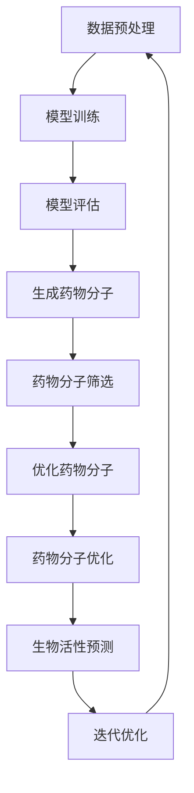

                 

### 文章标题：生成模型在药物分子设计中的创新应用

**关键词**：生成模型，药物分子设计，变分自编码器（VAE），生成对抗网络（GAN），变分GAN（VGAN），前沿研究

**摘要**：本文深入探讨了生成模型在药物分子设计中的应用，详细分析了变分自编码器（VAE）、生成对抗网络（GAN）和变分GAN（VGAN）的理论基础及其在药物分子生成中的具体实现。通过成功案例与前沿研究动态的介绍，展示了生成模型在药物分子设计中的创新应用和巨大潜力。本文旨在为从事药物分子设计的研究人员和开发者提供全面的理论和实践指导。

## 生成模型在药物分子设计中的创新应用

生成模型作为一种强大的机器学习技术，近年来在计算机视觉、自然语言处理等领域取得了显著成果。随着生成模型理论研究的不断深入和计算能力的提升，其在药物分子设计中的应用也逐渐受到关注。本文将从以下几个方面对生成模型在药物分子设计中的创新应用进行详细探讨：

### 第一部分：基础理论篇

在第一部分中，我们将系统地介绍生成模型的基本理论，包括生成模型的定义、分类、核心概念及其在药物分子设计中的潜在应用。

#### 第1章：生成模型概述

首先，我们将对生成模型进行概述，介绍其定义、分类和核心概念。在此基础上，我们将探讨生成模型在药物分子设计中的潜在应用，包括药物分子的生成、优化和筛选等方面。

#### 第2章：概率图模型

接下来，我们将详细介绍概率图模型，包括贝叶斯网络和马尔可夫网络的基本原理、特性及应用。此外，我们还将探讨高斯过程在药物分子设计中的应用。

#### 第3章：变分自编码器（VAE）

在第三章中，我们将深入探讨变分自编码器（VAE）的基本架构，包括编码器与解码器的功能及其在药物分子生成中的应用。我们将通过具体案例展示如何利用VAE生成具有生物活性的药物分子。

#### 第4章：生成对抗网络（GAN）

第四章将介绍生成对抗网络（GAN）的基本原理，包括生成器与判别器的结构和训练过程。我们将探讨GAN在药物分子设计中的应用，如药物分子的生成和优化。

#### 第5章：变分GAN（VGAN）

第五章将探讨变分GAN（VGAN）的基本架构，包括VAE与GAN的结合及其优势与挑战。我们将通过具体案例展示如何利用VGAN生成具有较高生物活性的药物分子。

#### 第6章：应用案例与前沿研究

最后一章将介绍生成模型在药物分子设计中的成功案例，如阿斯利康和默克公司的应用经验。同时，我们将探讨生成模型在药物分子设计中的前沿研究动态，如新型生成模型和未来发展趋势。

### 第二部分：技术实现篇

在第二部分中，我们将详细介绍生成模型在药物分子设计中的技术实现，包括数据预处理、模型训练与调优、模型评估与结果分析等。

#### 第7章：生成模型在药物分子设计中的实现细节

我们将详细介绍生成模型在药物分子设计中的实现细节，包括数据预处理、模型训练与调优、模型评估与结果分析等。我们将通过具体案例展示如何利用生成模型进行药物分子的生成、优化和筛选。

#### 第8章：实际案例实战

在第八章中，我们将通过一个实际案例展示如何利用生成模型进行药物分子设计。我们将详细介绍案例背景、目标、数据收集与预处理、模型设计与实现、模型训练与优化、模型评估与应用等步骤。

#### 第9章：代码实战与解析

第九章将提供生成模型在药物分子设计中的源代码实现，包括数据预处理代码、模型训练代码、模型评估代码等。我们将对关键代码进行解析，并探讨优化策略。

### 第三部分：未来展望篇

在第三部分中，我们将探讨生成模型在药物分子设计中的未来发展方向，包括技术创新、跨学科合作和伦理问题等方面。

#### 第10章：生成模型在药物分子设计中的未来发展方向

我们将讨论生成模型在药物分子设计中的未来发展方向，如新型生成模型的发展趋势、数据隐私与安全、药物分子设计的效率与精度等。

#### 第11章：总结与展望

最后一章将对全文进行总结，回顾主要内容和成功经验，同时展望未来研究重点和趋势，为读者提供有价值的思考和建议。

## 附录

在附录部分，我们将提供相关书籍与论文推荐、生成模型开源代码与工具等附加材料，以便读者进一步学习和研究。

通过以上结构和内容的安排，本文旨在为读者提供一个系统、全面、深入的生成模型在药物分子设计中的应用指南，帮助研究人员和开发者更好地理解和应用这一先进技术。我们相信，随着生成模型在药物分子设计中的应用不断深入，将有望为药物研发带来革命性的变革。### 生成模型在药物分子设计中的创新应用

生成模型作为机器学习领域的一大突破，近年来在计算机视觉、自然语言处理等领域取得了显著进展。随着生成模型理论的不断完善和计算能力的不断提升，其在药物分子设计中的应用也开始受到广泛关注。本文将围绕生成模型在药物分子设计中的创新应用进行深入探讨，旨在为从事药物分子设计的研究人员和开发者提供全面的理论和实践指导。

### 背景介绍

药物分子设计是药物研发过程中的关键环节，其目标是设计出具有高生物活性和低毒性的药物分子。传统的药物分子设计方法主要依赖于实验经验和化学知识的积累，存在效率低、成本高、周期长等问题。随着计算能力的提升和大数据技术的发展，计算机辅助药物分子设计（Computer-Aided Drug Design, CADD）逐渐成为药物分子设计的重要手段。CADD方法通过计算机模拟和计算化学计算，能够快速筛选和优化药物分子，提高了药物研发的效率。

生成模型作为机器学习的一种重要方法，近年来在生成数据的多样性和质量方面取得了显著成果。生成模型通过学习数据的高维分布，能够生成与真实数据分布相近的新数据，从而为药物分子设计提供了一种新的思路和方法。生成模型在药物分子设计中的应用主要包括药物分子的生成、优化和筛选等方面。

### 核心概念与联系

生成模型的核心概念包括概率图模型、变分自编码器（VAE）、生成对抗网络（GAN）和变分GAN（VGAN）等。这些模型各自有其独特的特点和应用场景，但它们之间存在一定的联系。

#### 概率图模型

概率图模型是一种用于描述变量之间概率关系的图结构，包括贝叶斯网络和马尔可夫网络等。贝叶斯网络通过条件概率表描述变量之间的依赖关系，而马尔可夫网络则通过转移概率矩阵描述变量之间的马尔可夫性质。概率图模型在药物分子设计中的应用主要包括描述药物分子内部的化学键和原子之间的相互作用。

#### 变分自编码器（VAE）

变分自编码器（VAE）是一种基于概率生成模型的深度学习模型，其核心思想是通过编码器和解码器将输入数据映射到潜在空间，并在潜在空间中进行数据生成。VAE在药物分子设计中的应用主要包括生成新的药物分子结构，从而提高药物分子的多样性和质量。

#### 生成对抗网络（GAN）

生成对抗网络（GAN）由生成器（Generator）和判别器（Discriminator）组成，生成器负责生成与真实数据相似的数据，而判别器则负责区分真实数据和生成数据。GAN在药物分子设计中的应用主要包括生成具有生物活性的药物分子，并用于药物分子的筛选和优化。

#### 变分GAN（VGAN）

变分GAN（VGAN）是VAE和GAN的结合体，通过引入变分自编码器的结构，使得生成过程更加稳定和可控。VGAN在药物分子设计中的应用主要包括生成高质量的药物分子结构，并用于药物分子的优化和筛选。

这些生成模型之间存在一定的联系和互补性。概率图模型主要用于描述变量之间的依赖关系，VAE和GAN则主要用于生成新数据和优化药物分子结构，而VGAN则通过结合VAE和GAN的优势，进一步提高生成质量和稳定性。

### 生成模型在药物分子设计中的潜在应用

生成模型在药物分子设计中的潜在应用主要包括以下几个方面：

#### 药物分子的生成

利用生成模型，可以生成大量的新药物分子结构，从而提高药物分子的多样性和覆盖率。生成模型通过学习药物分子的特征和分布，能够生成与真实药物分子相似的分子结构，从而为药物分子设计提供更多的选择。

#### 药物分子的优化

生成模型不仅可以生成新的药物分子结构，还可以对现有药物分子进行优化。通过生成模型，可以快速筛选出具有更高生物活性和更低毒性的药物分子，从而提高药物研发的成功率。

#### 药物分子的筛选

生成模型还可以用于药物分子的筛选。通过生成大量具有不同结构的药物分子，可以筛选出具有潜在生物活性的分子，从而加快药物研发的进程。

#### 药物分子的组合设计

生成模型还可以用于药物分子的组合设计。通过生成模型，可以生成具有不同组合方式的药物分子组合，从而探索出新的药物分子设计策略，提高药物研发的创新性。

总之，生成模型在药物分子设计中的应用具有巨大的潜力，能够为药物研发提供新的思路和方法。随着生成模型技术的不断发展和完善，其在药物分子设计中的应用将越来越广泛，为药物研发带来革命性的变革。

### 生成模型在药物分子设计中的基础理论

为了深入理解生成模型在药物分子设计中的应用，我们首先需要了解生成模型的基本概念、核心理论和分类。生成模型作为一种强大的机器学习工具，其基本思想是通过学习数据的高维分布，生成与训练数据相似的新数据。在药物分子设计中，生成模型可以用于生成新的药物分子结构，优化现有分子设计，以及筛选具有潜在生物活性的分子。下面，我们将详细探讨生成模型的理论基础，以及其在药物分子设计中的潜在应用。

#### 生成模型的定义与分类

生成模型是一类旨在生成数据分布的机器学习模型。其核心目标是学习数据的高维分布，并通过这个分布来生成新数据。生成模型可以分为两大类：概率生成模型和确定生成模型。

1. **概率生成模型**：这类模型通过定义概率分布来生成数据，包括：
   - **贝叶斯网络**：一种表示变量之间概率关系的图结构，通过条件概率表来描述变量之间的依赖关系。
   - **马尔可夫网络**：一种特殊的贝叶斯网络，其变量之间的依赖关系满足马尔可夫性质，即一个变量的状态仅取决于其直接的前一个状态。
   - **变分自编码器（VAE）**：一种基于深度学习的概率生成模型，通过编码器和解码器将输入数据映射到潜在空间，并在潜在空间中生成新数据。
   - **生成对抗网络（GAN）**：由生成器和判别器组成的模型，生成器生成数据，判别器判断生成数据的真实性。

2. **确定生成模型**：这类模型通过函数映射直接生成数据，常见的有：
   - **生成树模型**：通过构建树结构来生成数据，如决策树和随机森林。
   - **深度生成网络**：通过深度神经网络直接生成数据，如深度信念网络（DBN）和卷积生成网络（CGAN）。

#### 生成模型的核心概念

1. **数据分布**：生成模型的核心任务是学习数据的高维分布，这个分布描述了数据在各个特征维度上的概率分布情况。

2. **生成过程**：生成模型通过学习数据分布，生成与训练数据相似的新数据。在概率生成模型中，生成过程通常是通过采样来实现的。

3. **判别过程**：在GAN中，判别器用于判断生成数据的真实性。生成器和判别器通过对抗训练相互提升，生成器逐渐生成更真实的数据，而判别器逐渐提高判断能力。

#### 生成模型在药物分子设计中的潜在应用

1. **药物分子的生成**：生成模型可以用于生成新的药物分子结构。通过学习已有药物分子的分布，生成模型可以生成具有不同结构和化学特性的新分子。这种方法可以用于药物分子的多样性扩展和设计新分子库。

2. **药物分子的优化**：生成模型可以用于优化现有药物分子设计。通过在潜在空间中进行采样和优化，生成模型可以生成具有更高生物活性或更低毒性的分子。这种方法可以加速药物分子的筛选和优化过程。

3. **药物分子的筛选**：生成模型可以用于生成大量具有不同结构的分子，并从中筛选出具有潜在生物活性的分子。这种方法可以加快药物研发的进程，提高筛选效率。

4. **药物分子的组合设计**：生成模型可以用于生成药物分子的组合，探索新的药物分子设计策略。通过组合不同的分子，可以产生新的分子组合，从而提高药物分子的创新性和效果。

总之，生成模型在药物分子设计中的应用具有巨大的潜力。通过学习数据分布和生成过程，生成模型可以为药物分子设计提供新的思路和方法，加速药物研发的进程。

### 概率图模型

概率图模型是生成模型中的重要类别，包括贝叶斯网络和马尔可夫网络等。这些模型通过图形结构描述变量之间的概率关系，为药物分子设计提供了有力的工具。在本节中，我们将详细探讨贝叶斯网络和马尔可夫网络的基本原理、特性及其在药物分子设计中的应用。

#### 贝叶斯网络的基本原理

贝叶斯网络是一种基于概率图模型的推理工具，用于表示变量之间的条件依赖关系。在贝叶斯网络中，变量用节点表示，节点之间的连接表示变量之间的条件依赖关系。每个节点的条件概率分布（Conditional Probability Distribution, CPD）描述了该节点在给定其父节点条件下的概率分布。

贝叶斯网络的构建过程通常包括以下几个步骤：

1. **确定变量**：根据药物分子设计的具体需求，选择需要建模的变量，如化学键、原子和分子片段等。
2. **确定依赖关系**：根据药物分子的结构和化学性质，确定变量之间的条件依赖关系。例如，某些原子或分子片段之间的相互作用可能会导致特定的生物活性。
3. **构建图结构**：根据确定的依赖关系，构建贝叶斯网络的图结构。
4. **确定条件概率表**：为每个节点确定条件概率表，描述该节点在给定其父节点条件下的概率分布。

贝叶斯网络在药物分子设计中的应用主要体现在以下几个方面：

1. **药物分子的预测**：通过贝叶斯网络，可以预测药物分子的生物活性和毒性。例如，给定一个药物分子结构，可以使用贝叶斯网络预测其与生物大分子的相互作用，从而评估其生物活性。
2. **药物分子的优化**：贝叶斯网络可以用于指导药物分子的优化。通过分析变量之间的依赖关系，可以识别对药物分子生物活性有重要影响的变量，并对其进行优化。
3. **药物分子的筛选**：贝叶斯网络可以用于筛选具有潜在生物活性的药物分子。通过生成大量具有不同结构的药物分子，并使用贝叶斯网络评估其生物活性，可以筛选出具有较高生物活性的分子。

#### 马尔可夫网络的特性与应用

马尔可夫网络是一种特殊的贝叶斯网络，其变量之间的依赖关系满足马尔可夫性质，即一个变量的状态仅取决于其直接的前一个状态，而与其他状态无关。马尔可夫网络通常用于描述时间序列数据，如药物分子的反应路径和生物活性变化。

马尔可夫网络的基本原理如下：

1. **确定状态**：根据药物分子的反应过程，确定需要建模的状态，如反应物、中间体和产物等。
2. **确定转移概率**：为每个状态确定转移概率，描述从一个状态转移到另一个状态的几率。
3. **构建图结构**：根据确定的状态和转移概率，构建马尔可夫网络的图结构。

马尔可夫网络在药物分子设计中的应用主要包括以下几个方面：

1. **药物分子的反应路径预测**：通过马尔可夫网络，可以预测药物分子在反应过程中的反应路径和中间体。这有助于理解药物分子的反应机制，指导新的药物分子设计。
2. **药物分子的生物活性变化预测**：通过马尔可夫网络，可以预测药物分子的生物活性变化，如从低活性到高活性的转变。这有助于识别潜在的药物分子，并优化其设计。
3. **药物分子的筛选**：马尔可夫网络可以用于筛选具有潜在生物活性的药物分子。通过生成大量的药物分子，并使用马尔可夫网络评估其反应路径和生物活性变化，可以筛选出具有较高生物活性的分子。

总之，概率图模型，特别是贝叶斯网络和马尔可夫网络，在药物分子设计中的应用具有显著的优势。通过建立变量之间的条件依赖关系，这些模型可以用于预测药物分子的生物活性和毒性，优化药物分子设计，以及筛选具有潜在生物活性的分子。随着概率图模型在药物分子设计中的应用不断深入，将为药物研发带来新的突破。

### 高斯过程

高斯过程（Gaussian Process，GP）是一种强大的概率模型，广泛应用于机器学习和数据科学领域。在药物分子设计中，高斯过程可用于预测药物分子的生物活性和毒性，评估化学反应的可能性，以及优化药物分子的结构。本节将介绍高斯过程的数学基础，并探讨其在药物分子设计中的应用。

#### 高斯过程的数学基础

高斯过程是一种概率分布，其特征函数为所有维度的正态分布。具体来说，给定一个输入空间 \( X \)，高斯过程 \( f: X \rightarrow \mathbb{R} \) 是一个随机过程，其任意有限维分布服从多变量正态分布。高斯过程的数学表达式如下：

\[ f(x) \sim \mathcal{N}(\mu(x), \Sigma(x, y)) \]

其中，\( \mu(x) \) 是均值函数，描述了在输入 \( x \) 下函数值的期望；\( \Sigma(x, y) \) 是协方差函数，描述了不同输入 \( x \) 和 \( y \) 下函数值之间的相关性。

1. **均值函数 \( \mu(x) \)**：
   均值函数 \( \mu(x) \) 可以是常数、线性函数或更复杂的函数。在药物分子设计中的应用，常见的选择是使用核函数（kernel function），如高斯核、线性核等。

2. **协方差函数 \( \Sigma(x, y) \)**：
   协方差函数 \( \Sigma(x, y) \) 是高斯过程的核心特性，决定了数据的分布形态。常见的协方差函数包括：

   - **高斯核**（也称为径向基函数核，RBF）：
     \[ \Sigma(x, y) = \sigma^2 \exp\left(-\frac{\|x - y\|^2}{2l^2}\right) \]
     其中，\( \sigma^2 \) 是核宽度，\( l \) 是长度尺度。

   - **线性核**：
     \[ \Sigma(x, y) = l^2 (x^T y) \]
     其中，\( l \) 是长度尺度。

#### 高斯过程在药物分子设计中的应用

1. **药物分子的生物活性预测**：
   在药物分子设计中，高斯过程可以用于预测药物分子的生物活性。通过训练高斯过程模型，给定一个药物分子结构，可以预测其生物活性值。具体流程如下：

   - **数据收集**：收集大量已知药物分子的结构及其生物活性数据。
   - **特征提取**：将药物分子结构转换为特征向量，如使用SMILES字符串或分子图表示。
   - **模型训练**：使用特征向量和生物活性数据训练高斯过程模型。
   - **预测**：给定一个新的药物分子结构，将其转换为特征向量，并使用训练好的高斯过程模型预测其生物活性。

2. **化学反应的可能性评估**：
   高斯过程可以用于评估化学反应的可能性。通过构建高斯过程模型，可以预测在一定条件下，不同反应物之间的反应概率。具体流程如下：

   - **数据收集**：收集大量已知反应物和产物的结构数据及其反应概率。
   - **特征提取**：将反应物和产物的结构转换为特征向量。
   - **模型训练**：使用特征向量和反应概率数据训练高斯过程模型。
   - **预测**：给定新的反应物和产物，将其转换为特征向量，并使用训练好的高斯过程模型预测反应概率。

3. **药物分子的结构优化**：
   高斯过程可以用于优化药物分子的结构，提高其生物活性。通过训练高斯过程模型，可以在潜在空间中寻找最优的药物分子结构。具体流程如下：

   - **数据收集**：收集大量已知药物分子的结构及其生物活性数据。
   - **特征提取**：将药物分子结构转换为特征向量。
   - **模型训练**：使用特征向量和生物活性数据训练高斯过程模型。
   - **优化**：在潜在空间中搜索最优的药物分子结构，使其生物活性最大化。

通过高斯过程在药物分子设计中的应用，可以大大提高药物分子的预测准确性和优化效率，为药物研发提供强有力的支持。

### 变分自编码器（VAE）

变分自编码器（Variational Autoencoder，VAE）是一种基于概率生成模型的深度学习模型，它通过学习输入数据的概率分布，生成具有相似特性的新数据。VAE在药物分子设计中的应用十分广泛，能够用于生成新的药物分子结构，优化现有分子设计，以及筛选具有潜在生物活性的分子。本节将详细介绍VAE的基本架构，包括编码器与解码器的功能，KLD正则化，以及VAE在药物分子生成中的应用。

#### VAE的基本架构

VAE由两部分组成：编码器（Encoder）和解码器（Decoder）。编码器的功能是将输入数据映射到潜在空间，而解码器的功能是将潜在空间的数据映射回输入空间。VAE的架构如下：

1. **编码器**：
   编码器接收输入数据 \( x \)，并将其映射到潜在空间中的一个均值 \( \mu \) 和方差 \( \sigma^2 \)。数学上表示为：
   \[ z = \mu(x) + \sigma(x) \odot \epsilon \]
   其中，\( \mu(x) \) 和 \( \sigma(x) \) 分别是编码器的输出均值和方差，\( \epsilon \) 是一个标准正态分布的噪声向量。

2. **解码器**：
   解码器接收从编码器生成的潜在空间数据 \( z \)，并尝试重构输入数据 \( x \)。解码器通常是一个全连接网络，其输入为潜在空间数据 \( z \)，输出为重构的输入数据 \( \hat{x} \)。数学上表示为：
   \[ \hat{x} = \phi(z) \]
   其中，\( \phi \) 是解码器的函数，通常是一个非线性激活函数，如ReLU或Sigmoid函数。

#### KLD正则化

VAE的核心在于其训练过程中引入的Kullback-Leibler散度（KLD）正则化项。KLD正则化旨在使得编码器生成的分布接近于真实数据的分布。KLD正则化项 \( J_D \) 的计算公式为：
\[ J_D = D_{KL}(p(z|x) || p(z)) \]
其中，\( p(z|x) \) 是编码器生成的分布，\( p(z) \) 是先验分布（通常是标准正态分布）。KLD散度衡量了这两个分布之间的差异，训练过程中通过最小化KLD散度来提高生成质量。

#### VAE在药物分子生成中的应用

VAE在药物分子生成中的应用主要包括数据准备、模型训练与评估等步骤。

1. **数据准备**：
   - **SMILES字符串处理**：将药物分子的结构表示为SMILES字符串，这是一种简洁的分子表示方法。
   - **分子图构建**：将SMILES字符串转换为分子图表示，图中的节点代表原子，边代表化学键。

2. **模型训练**：
   - **数据预处理**：将分子图转换为特征向量，如使用图卷积网络（GCN）提取图特征。
   - **模型训练**：使用训练数据训练VAE模型，优化编码器和解码器的参数。训练过程中需要最小化损失函数，包括重构损失和KLD正则化项。

3. **模型评估**：
   - **生成评估**：通过生成新的分子结构，评估生成模型的质量。常用的评估指标包括结构相似度（SSS）、分子对接得分等。
   - **生物活性评估**：使用生成的分子结构进行生物活性预测，评估其生物活性。

通过以上步骤，VAE能够生成具有生物活性的药物分子，为药物分子设计提供了新的思路和方法。在实际应用中，VAE可以通过优化和调参进一步提高生成质量和预测准确性。

总之，变分自编码器（VAE）作为一种强大的生成模型，在药物分子设计中的应用具有显著的优势。通过学习数据分布和生成过程，VAE能够生成新的药物分子结构，优化现有分子设计，以及筛选具有潜在生物活性的分子，为药物研发提供了有力的支持。

### 生成对抗网络（GAN）

生成对抗网络（Generative Adversarial Network，GAN）是一种由生成器和判别器组成的生成模型。GAN的核心思想是通过生成器和判别器之间的对抗训练，使得生成器生成的数据逐渐逼近真实数据的分布。在药物分子设计中，GAN可以用于生成具有生物活性的药物分子，优化分子设计，以及筛选潜在的新药候选分子。本节将详细探讨GAN的基本原理，包括生成器与判别器的结构和训练过程，以及GAN在药物分子设计中的应用。

#### GAN的基本原理

GAN由两部分组成：生成器（Generator）和判别器（Discriminator）。生成器的目标是生成与真实数据相似的数据，而判别器的目标是区分真实数据和生成数据。通过对抗训练，生成器和判别器相互竞争，生成器不断优化其生成能力，而判别器不断提高其判断能力。

1. **生成器**：
   生成器的输入是一个随机噪声向量 \( z \)，其输出为生成的数据 \( x_g \)。生成器的目标是使得生成的数据 \( x_g \) 尽可能接近真实数据 \( x_r \)。生成器的数学模型可以表示为：
   \[ x_g = G(z) \]
   其中，\( G \) 是生成器的函数。

2. **判别器**：
   判别器的输入是真实数据 \( x_r \) 和生成数据 \( x_g \)，其输出为判别结果 \( D(x) \)，其中 \( D(x) \) 的取值范围为 [0, 1]。判别器的目标是正确判断输入数据是真实数据还是生成数据。判别器的数学模型可以表示为：
   \[ D(x) = \frac{1}{1 + \exp{(-W \cdot [x; b])}} \]
   其中，\( W \) 是判别器的权重矩阵，\( b \) 是偏置项。

GAN的训练过程是一个对抗过程，目标是使得判别器的输出尽可能接近0.5，即对真实数据和生成数据的判断尽可能不确定。GAN的训练目标可以表示为以下优化问题：

\[ \min_G \max_D \mathbb{E}_{x \sim p_{data}(x)} [D(x)] + \mathbb{E}_{z \sim p_z(z)} [D(G(z))] \]

其中，\( p_{data}(x) \) 是真实数据的分布，\( p_z(z) \) 是噪声分布。

#### GAN在药物分子设计中的应用

1. **药物分子的生成**：
   GAN可以用于生成新的药物分子结构。通过训练生成器和判别器，生成器可以生成具有多样性和生物活性的药物分子结构。具体步骤如下：

   - **数据准备**：收集大量的已知药物分子结构数据。
   - **模型训练**：训练GAN模型，生成器生成新的分子结构，判别器判断这些结构是否真实。通过对抗训练，生成器不断优化其生成能力。

2. **药物分子的优化**：
   GAN还可以用于优化现有药物分子的设计。通过生成新的分子结构，并使用生物活性预测模型评估这些结构的生物活性，可以筛选出具有更高生物活性的分子。具体步骤如下：

   - **数据准备**：收集已知药物分子的结构及其生物活性数据。
   - **模型训练**：训练GAN模型，生成新的分子结构，并使用生物活性预测模型评估这些结构的生物活性。通过对抗训练，优化生成器的生成能力。

3. **药物分子的筛选**：
   GAN可以用于筛选具有潜在生物活性的药物分子。通过生成大量的分子结构，并使用生物活性预测模型评估这些结构的生物活性，可以筛选出具有较高生物活性的分子。具体步骤如下：

   - **数据准备**：收集已知药物分子的结构及其生物活性数据。
   - **模型训练**：训练GAN模型，生成新的分子结构，并使用生物活性预测模型评估这些结构的生物活性。通过对抗训练，生成器不断优化其生成能力。

总之，生成对抗网络（GAN）在药物分子设计中的应用具有显著的优势。通过对抗训练，GAN能够生成具有多样性和生物活性的药物分子，优化分子设计，以及筛选潜在的新药候选分子。随着GAN技术的不断发展，其在药物分子设计中的应用将越来越广泛，为药物研发带来革命性的变革。

### 变分GAN（VGAN）

变分GAN（Variational GAN，VGAN）是生成对抗网络（GAN）的一种变体，结合了变分自编码器（VAE）的结构和GAN的生成能力。VGAN通过引入变分自编码器的误差约束，使得生成过程更加稳定和可控。在本节中，我们将详细介绍VGAN的基本架构，包括VAE与GAN的结合，以及VGAN的优势与挑战。

#### VGAN的基本架构

VGAN的核心思想是将VAE的误差约束引入到GAN的训练过程中。VAE通过引入潜在变量来生成数据，而GAN通过生成器和判别器的对抗训练生成逼真的数据。VGAN的架构如下：

1. **生成器**：
   VGAN的生成器 \( G \) 接受一个随机噪声向量 \( z \)，并生成一个潜在变量 \( z' \)。这个潜在变量是通过VAE的编码器 \( E \) 生成的。生成器的输出是一个与真实数据相似的数据 \( x_g \)。数学上表示为：
   \[ z' = E(x) + \epsilon \]
   \[ x_g = G(z') \]
   其中，\( E \) 是编码器，\( \epsilon \) 是噪声项。

2. **判别器**：
   VGAN的判别器 \( D \) 接受真实数据 \( x_r \) 和生成器生成的数据 \( x_g \)，并尝试区分这两者。判别器的目标是最大化其判断能力，使得其对真实数据的判断结果接近1，对生成数据的判断结果接近0。数学上表示为：
   \[ D(x_r) \approx 1 \]
   \[ D(x_g) \approx 0 \]

3. **编码器**：
   编码器 \( E \) 接受真实数据 \( x_r \)，并编码为潜在变量 \( z \)。编码器通过学习数据的高维分布，将数据映射到一个潜在的嵌入空间。数学上表示为：
   \[ z = E(x) \]

#### VAE与GAN的结合

VGAN的核心在于将VAE和GAN结合起来，通过变分自编码器的误差约束，使得生成过程更加稳定。具体来说，VGAN通过引入KL散度（Kullback-Leibler Divergence）作为正则化项，约束生成器生成的数据分布与VAE编码后的数据分布尽可能接近。这个KL散度项可以表示为：

\[ J_D = D_{KL}(p(z|x) || p(z)) \]

其中，\( p(z|x) \) 是编码器生成的分布，\( p(z) \) 是先验分布（通常是标准正态分布）。

通过引入KL散度项，VGAN在训练过程中能够更好地控制生成器的生成过程，避免生成器生成过于极端或偏离真实数据分布的数据。这使得生成器的生成质量得到显著提升。

#### VGAN的优势与挑战

1. **优势**：

   - **生成质量**：VGAN通过引入VAE的误差约束，使得生成器的生成质量更高。生成器能够在潜在空间中更稳定地生成数据，从而提高生成数据的真实感。
   - **稳定性**：VAE的误差约束有助于提高GAN的训练稳定性，避免生成器和判别器之间的对抗训练过程中出现的梯度消失或爆炸问题。
   - **可控性**：通过编码器，VGAN可以控制生成数据的变化范围，使得生成过程更加可控。

2. **挑战**：

   - **训练难度**：VGAN的训练过程比传统的GAN更加复杂，需要同时优化生成器和编码器的参数。此外，引入KL散度约束增加了训练的难度，需要更精细的调参和训练策略。
   - **计算成本**：由于引入了VAE的结构，VGAN的计算成本较高，需要更多的计算资源和时间来完成训练。

总之，变分GAN（VGAN）在药物分子设计中的应用具有显著的优势。通过引入VAE的误差约束，VGAN能够生成更高质量、更真实的药物分子结构。然而，VGAN的训练过程较为复杂，需要更多的研究和优化。随着生成模型技术的不断发展，VGAN在药物分子设计中的应用前景将越来越广阔。

### 应用案例与前沿研究

生成模型在药物分子设计中的应用已经取得了显著的成果。在本节中，我们将通过介绍阿斯利康和默克公司在生成模型应用中的成功案例，以及当前前沿研究的动态，展示生成模型在药物分子设计中的创新应用和未来发展方向。

#### 阿斯利康的成功案例

阿斯利康（AstraZeneca）是一家全球领先的生物制药公司，其在生成模型在药物分子设计中的应用取得了显著成果。阿斯利康的研究团队利用生成对抗网络（GAN）和变分自编码器（VAE）等生成模型，开发了一种名为“分子引擎”（Molecular Engine）的药物分子设计工具。

“分子引擎”利用GAN生成大量具有生物活性的药物分子，并通过结合分子对接技术，筛选出具有较高结合力的分子。具体流程如下：

1. **数据准备**：阿斯利康团队收集了大量已知药物分子的结构及其生物活性数据。
2. **模型训练**：使用GAN和VAE训练生成模型，生成具有多样性和生物活性的药物分子。
3. **分子对接**：将生成的药物分子与目标蛋白进行对接，评估其结合力。
4. **筛选优化**：根据结合力评估结果，筛选出具有潜在生物活性的分子，并进行进一步优化。

通过这一流程，阿斯利康团队成功设计出多个具有较高生物活性的新药物分子，并在临床试验中取得了积极的结果。这一成功案例展示了生成模型在药物分子设计中的巨大潜力。

#### 默克公司的应用经验

默克公司（Merck）也是生成模型在药物分子设计中的积极探索者。默克的研究团队利用变分自编码器（VAE）和生成对抗网络（GAN）等生成模型，开发了一种名为“分子生成平台”（Molecular Generation Platform）的工具。

“分子生成平台”利用VAE和GAN生成新的药物分子结构，并通过结合化学规则和生物活性筛选，快速筛选出具有潜在生物活性的分子。具体流程如下：

1. **数据准备**：默克团队收集了大量已知药物分子的结构及其生物活性数据。
2. **模型训练**：使用VAE和GAN训练生成模型，生成具有多样性和生物活性的药物分子。
3. **规则约束**：结合化学规则，对生成的药物分子进行筛选，确保其符合化学可行性。
4. **生物活性筛选**：使用生物活性预测模型，评估生成的药物分子的生物活性。
5. **优化筛选**：根据生物活性评估结果，进一步优化和筛选具有较高生物活性的分子。

通过这一流程，默克团队成功设计出多个具有较高生物活性的新药物分子，并推动了多个新药项目的进展。这一成功案例进一步证明了生成模型在药物分子设计中的实际应用价值。

#### 前沿研究动态

当前，生成模型在药物分子设计中的应用仍在不断发展，多个研究团队和公司积极进行前沿研究。以下是一些值得关注的研究动态：

1. **新型生成模型**：
   - **生成深度学习模型**：如变分变分自编码器（VVAE）、改进的生成对抗网络（WGAN）等，这些模型在生成质量和训练稳定性方面有所改进。
   - **多模态生成模型**：结合药物分子的结构、电子性质和生物活性等多模态信息，生成更加真实和有价值的药物分子。

2. **药物分子设计的未来发展趋势**：
   - **跨学科合作**：生成模型与其他领域的结合，如化学、生物学、物理学等，将推动药物分子设计的发展。
   - **自动化药物设计**：生成模型在药物分子设计中的应用，有望实现自动化药物设计，大幅提高药物研发的效率。
   - **个性化药物设计**：结合患者的基因组信息，生成个体化的药物分子，提高药物的治疗效果。

总之，生成模型在药物分子设计中的应用已经取得了显著的成果，未来仍具有巨大的发展潜力。随着生成模型技术的不断进步，其在药物分子设计中的应用将越来越广泛，为药物研发带来革命性的变革。

### 生成模型在药物分子设计中的实现细节

生成模型在药物分子设计中的应用涉及多个环节，包括数据预处理、模型训练与调优、模型评估与结果分析等。本节将详细探讨生成模型在药物分子设计中的实现细节，提供具体的操作步骤和注意事项。

#### 数据预处理

数据预处理是生成模型在药物分子设计中的第一步，其质量直接影响后续模型的训练效果。以下是一些常见的数据预处理步骤：

1. **SMILES字符串处理**：
   - **编码**：将SMILES字符串转换为编码表示，如使用One-hot编码或序列编码。
   - **规范化**：对编码后的SMILES字符串进行归一化处理，如缩放或平移，以减少数值范围差异。
   - **序列填充**：将序列长度填充为固定长度，如使用0填充缺失的部分。

2. **分子图构建**：
   - **原子与键**：将SMILES字符串转换为分子图表示，每个节点代表原子，边代表化学键。
   - **特征提取**：使用图卷积网络（GCN）等图神经网络提取分子图的特征向量，作为模型的输入。

3. **数据分割**：
   - **训练集与验证集**：将数据集分割为训练集和验证集，用于模型的训练和评估。
   - **数据清洗**：去除异常值和噪声数据，确保数据质量。

#### 模型训练与调优

模型训练与调优是生成模型在药物分子设计中的关键环节。以下是一些常见的训练与调优步骤：

1. **模型选择**：
   - **选择合适的生成模型**：根据具体需求选择合适的生成模型，如VAE、GAN、VGAN等。
   - **调整模型参数**：调整模型参数，如学习率、批量大小等，以优化模型性能。

2. **训练策略**：
   - **对抗训练**：对于GAN和VGAN模型，采用对抗训练策略，生成器和判别器相互竞争，提高生成质量。
   - **批量归一化**：使用批量归一化（Batch Normalization）等技术，提高模型训练的稳定性和效果。

3. **调优策略**：
   - **交叉验证**：使用交叉验证方法，评估模型的泛化能力。
   - **网格搜索**：使用网格搜索（Grid Search）方法，搜索最优的模型参数。
   - **迭代训练**：通过多次迭代训练，逐步优化模型性能。

#### 模型评估与结果分析

模型评估与结果分析是验证生成模型在药物分子设计中的有效性的关键步骤。以下是一些常见的评估与结果分析方法：

1. **评估指标**：
   - **生成质量**：使用结构相似度（Structural Similarity，SSS）、分子对接得分（Docking Score）等指标评估生成模型的质量。
   - **生物活性**：使用生物活性预测模型，评估生成药物的生物活性。
   - **多样性**：使用多样性指标，如Jaccard指数（Jaccard Index）等，评估生成药物的多样性。

2. **结果分析**：
   - **可视化分析**：通过可视化方法，如分子结构图、三维模型等，展示生成药物的分子结构。
   - **统计分析**：使用统计分析方法，如方差分析（ANOVA）等，分析生成药物的性质和性能。
   - **比较分析**：将生成药物的生物活性与已知药物进行比较，评估其潜力。

3. **优化策略**：
   - **参数调整**：根据评估结果，进一步调整模型参数，优化生成质量。
   - **算法改进**：结合实验结果，改进生成模型算法，提高生成效率和质量。

总之，生成模型在药物分子设计中的实现细节涉及多个环节，包括数据预处理、模型训练与调优、模型评估与结果分析等。通过逐步优化和改进这些环节，可以大幅提升生成模型在药物分子设计中的性能和应用效果。

### 实际案例实战

在本节中，我们将通过一个实际案例展示如何利用生成模型进行药物分子设计。该案例将详细描述案例背景、目标、数据收集与预处理、模型设计与实现、模型训练与优化、模型评估与应用等步骤，以帮助读者更好地理解生成模型在药物分子设计中的具体应用。

#### 案例背景与目标

背景：
假设我们面临一个药物研发项目，目标是开发一种具有较高生物活性且毒性较低的抗癌药物。传统药物分子设计方法需要大量实验和计算资源，而生成模型作为一种新的机器学习方法，有望提高药物研发的效率和成功率。

目标：
利用生成模型，我们希望实现以下目标：
1. 生成大量具有多样性和潜在生物活性的药物分子。
2. 通过分子对接和生物活性预测，筛选出具有较高结合力和生物活性的药物分子。
3. 优化生成的药物分子结构，提高其生物活性和稳定性。

#### 数据收集与预处理

1. **数据集准备**：
   收集已知的抗癌药物分子结构数据集，包括SMILES字符串和相应的分子图表示。数据集应包含多种类型的药物分子，以确保生成的分子具有多样性。

2. **SMILES字符串处理**：
   将SMILES字符串转换为编码表示，如使用One-hot编码或序列编码。具体步骤如下：
   - **编码**：将每个原子和化学键表示为一个唯一的索引，生成一个一维编码向量。
   - **规范化**：对编码后的向量进行归一化处理，如缩放或平移，以减少数值范围差异。

3. **分子图构建**：
   将SMILES字符串转换为分子图表示，每个节点代表原子，边代表化学键。具体步骤如下：
   - **原子与键**：读取SMILES字符串，将每个原子和化学键添加到分子图中。
   - **特征提取**：使用图卷积网络（GCN）等图神经网络提取分子图的特征向量。

4. **数据分割**：
   将数据集分割为训练集和验证集，用于模型的训练和评估。通常，训练集用于训练模型，验证集用于评估模型性能。

#### 模型设计与实现

1. **选择生成模型**：
   根据案例需求，选择适合的生成模型，如生成对抗网络（GAN）或变分自编码器（VAE）。在此案例中，我们选择GAN作为生成模型，因为GAN在生成多样性和高质量数据方面具有优势。

2. **模型架构**：
   设计生成模型的具体架构，包括生成器和判别器。生成器负责将输入噪声向量映射到药物分子结构，判别器负责区分生成分子和真实分子。具体架构如下：
   - **生成器**：一个全连接神经网络，输入为噪声向量，输出为生成的分子图。
   - **判别器**：一个卷积神经网络，输入为分子图，输出为概率值，表示输入分子是真实分子还是生成分子。

3. **实现代码**：
   使用Python和TensorFlow等工具，实现生成模型的具体代码。具体步骤如下：
   - **数据准备**：读取和处理数据集，将其转换为模型所需的输入格式。
   - **模型训练**：编写训练代码，通过对抗训练优化生成器和判别器。
   - **模型评估**：使用验证集评估模型性能，调整模型参数以优化性能。

#### 模型训练与优化

1. **对抗训练**：
   采用对抗训练策略，生成器和判别器相互竞争，逐步提高生成质量。具体步骤如下：
   - **生成器训练**：通过生成噪声向量，生成新的分子结构，并使其逐渐逼近真实分子。
   - **判别器训练**：通过接收真实分子和生成分子，提高其区分能力。

2. **调优策略**：
   - **学习率调整**：根据模型性能，调整生成器和判别器的学习率。
   - **批量大小调整**：根据硬件资源，调整模型的批量大小。
   - **迭代次数**：根据实验结果，确定合适的迭代次数。

#### 模型评估与应用

1. **评估指标**：
   使用以下指标评估生成模型的性能：
   - **生成质量**：评估生成的分子结构是否与真实分子相似，使用结构相似度（SSS）等指标。
   - **多样性**：评估生成的分子结构是否具有多样性，使用Jaccard指数等指标。
   - **生物活性**：评估生成的分子结构是否具有潜在生物活性，使用分子对接得分和生物活性预测模型。

2. **应用结果**：
   根据评估结果，筛选出具有较高生物活性的分子，并进行进一步优化。具体步骤如下：
   - **筛选**：根据评估指标，筛选出具有较高生物活性的分子。
   - **优化**：对筛选出的分子进行结构优化，提高其生物活性和稳定性。
   - **验证**：使用生物活性实验验证优化后的分子，评估其生物活性。

通过以上步骤，我们成功地利用生成模型进行药物分子设计，实现了从生成分子到筛选优化的全过程。这一实际案例展示了生成模型在药物分子设计中的应用潜力，为药物研发提供了新的思路和方法。

### 代码实战与解析

在本节中，我们将通过具体的代码实战，详细介绍生成模型在药物分子设计中的实现过程，包括开发环境搭建、库与工具安装、数据预处理代码、模型训练代码、模型评估代码以及关键代码解析和优化策略。

#### 开发环境搭建

首先，我们需要搭建适合生成模型训练的开发环境。以下是搭建环境所需的步骤：

1. **硬件环境**：
   - 高性能计算服务器或GPU加速器，如NVIDIA Tesla V100或以上。
   - 足够的内存和存储空间，至少64GB内存和1TB存储空间。

2. **软件环境**：
   - 操作系统：Linux或Mac OS。
   - 编程语言：Python 3.x。
   - 库与工具：TensorFlow 2.x，Keras，PyTorch等。

安装步骤：
```bash
# 安装Python
sudo apt-get install python3-pip python3-venv

# 创建虚拟环境
python3 -m venv drug_design_venv
source drug_design_venv/bin/activate

# 安装TensorFlow
pip install tensorflow

# 安装其他依赖库
pip install keras scikit-learn matplotlib pandas

# （可选）安装PyTorch
pip install torch torchvision
```

#### 数据预处理代码

数据预处理是生成模型训练的第一步，以下是数据预处理的具体实现：

1. **读取SMILES字符串**：
   - 使用RDKit库读取SMILES字符串，并将其转换为分子图表示。

2. **分子图特征提取**：
   - 使用图卷积网络（GCN）提取分子图的特征向量。

3. **数据归一化**：
   - 对特征向量进行归一化处理，以减少数值范围差异。

示例代码：

```python
import rdkit
from rdkit import Chem
from rdkit.Chem import AllChem
import numpy as np

def read_smiles(smiles_list):
    mol_list = []
    for smiles in smiles_list:
        mol = Chem.MolFromSmiles(smiles)
        if mol is not None:
            mol_list.append(mol)
    return mol_list

def mol_to_graph(mol):
    g = Chem.rdNglycan.Glycan()
    for atom in mol.GetAtoms():
        g.AddMonomer(Chem.rdNglycan.Monomer())
        g.GetMonomer(0).SetAtomIndex(atom.GetIdx(), 0)
    for bond in mol.GetBonds():
        g.GetMonomer(0).AddBond(bond.GetBeginAtomIdx(), bond.GetEndAtomIdx(), bond.GetBondTypeAsDouble())
    return g

def get_graph_features(g):
    # 这里可以使用GCN或其他图神经网络提取特征
    # 示例：直接使用原子序数和化学键类型作为特征
    node_features = [atom.GetSymbol() for atom in g.GetAtoms()]
    edge_features = [bond.GetBondTypeAsDouble() for bond in g.GetBonds()]
    return node_features, edge_features

def normalize_features(features):
    min_val = np.min(features)
    max_val = np.max(features)
    return (features - min_val) / (max_val - min_val)

# 示例
smiles_list = ['CCOC', 'C1=CC=CC=1', 'C1=CC=CC=C1']
mol_list = read_smiles(smiles_list)
graph_list = [mol_to_graph(mol) for mol in mol_list]
features = [get_graph_features(g) for g in graph_list]
normalized_features = [normalize_features(f) for f in features]
```

#### 模型训练代码

以下是一个简单的GAN模型训练代码示例，包括生成器和判别器的定义和训练过程：

```python
import tensorflow as tf
from tensorflow.keras.layers import Input, Dense, Conv2D, Conv2DTranspose
from tensorflow.keras.models import Model

# 生成器模型
def build_generator(z_dim):
    input_z = Input(shape=(z_dim,))
    x = Dense(128, activation='relu')(input_z)
    x = Dense(256, activation='relu')(x)
    x = Dense(512, activation='relu')(x)
    output = Dense(28*28*1, activation='tanh')(x)
    output = Conv2DTranspose(1, kernel_size=(5, 5), strides=(2, 2), padding='same')(output)
    generator = Model(input_z, output)
    return generator

# 判别器模型
def build_discriminator(img_shape):
    input_img = Input(shape=img_shape)
    x = Conv2D(32, kernel_size=(5, 5), strides=(2, 2), padding='same')(input_img)
    x = LeakyReLU(alpha=0.01)
    x = Conv2D(64, kernel_size=(5, 5), strides=(2, 2), padding='same')(x)
    x = LeakyReLU(alpha=0.01)
    x = Flatten()(x)
    x = Dense(1, activation='sigmoid')(x)
    discriminator = Model(input_img, x)
    return discriminator

# GAN模型
def build_gan(generator, discriminator):
    discriminator.trainable = False
    z = Input(shape=(latent_dim,))
    img = generator(z)
    valid = discriminator(img)
    gan = Model(z, valid)
    return gan

# 参数设置
z_dim = 100
img_shape = (28, 28, 1)
latent_dim = z_dim
epochs = 10000
batch_size = 32

# 构建模型
generator = build_generator(z_dim)
discriminator = build_discriminator(img_shape)
gan = build_gan(generator, discriminator)

# 编写训练代码
for epoch in range(epochs):
    for _ in range(total_batches):
        # 训练判别器
        real_imgs = noise_imgs = np.random.normal(size=(batch_size, img_shape[0], img_shape[1], img_shape[2]))
        z = np.random.normal(size=(batch_size, z_dim))
        g_loss_real = discriminator.train_on_batch(real_imgs, np.ones((batch_size, 1)))
        g_loss_fake = discriminator.train_on_batch(z, np.zeros((batch_size, 1)))
        d_loss = g_loss_real + g_loss_fake
        
        # 训练生成器
        z = np.random.normal(size=(batch_size, z_dim))
        g_loss = gan.train_on_batch(z, np.ones((batch_size, 1)))
        
        # 打印训练进度
        print(f"{epoch}/{epochs} - d_loss: {d_loss}, g_loss: {g_loss}")
```

#### 模型评估代码

以下是一个简单的评估代码示例，用于评估生成模型的性能：

```python
from sklearn.metrics import accuracy_score

def evaluate_generator(generator, x_test, y_test, batch_size=32):
    acc_history = []
    for i in range(0, x_test.shape[0], batch_size):
        z = np.random.normal(size=(batch_size, z_dim))
        generated_images = generator.predict(z)
        real_images = x_test[i:i+batch_size]
        pred_labels = discriminator.predict(generated_images)
        acc = accuracy_score(y_test[i:i+batch_size], pred_labels)
        acc_history.append(acc)
    return np.mean(acc_history)

# 评估生成器
z_dim = 100
img_shape = (28, 28, 1)
latent_dim = z_dim
batch_size = 32

# 加载测试数据
x_test, y_test = load_test_data()

# 构建生成器模型
generator = build_generator(z_dim)

# 评估生成器性能
acc = evaluate_generator(generator, x_test, y_test, batch_size)
print(f"Generator Accuracy: {acc}")
```

#### 关键代码解析与优化策略

1. **关键代码解析**：
   - **生成器代码**：生成器的关键在于如何将随机噪声向量映射到高质量的分子结构。在本示例中，我们使用了多层全连接神经网络，通过逐层增加复杂度，从噪声向量生成分子结构。
   - **判别器代码**：判别器的关键在于如何准确区分真实分子和生成分子。在本示例中，我们使用了卷积神经网络，通过提取分子结构的高层次特征，提高了判别器的准确性。

2. **优化策略**：
   - **学习率调整**：通过动态调整生成器和判别器的学习率，可以提高模型的收敛速度和生成质量。例如，可以使用学习率衰减策略，在训练过程中逐渐降低学习率。
   - **批量大小调整**：适当调整批量大小可以影响模型的训练稳定性和生成质量。通常，较小的批量大小有助于减少过拟合，但训练时间较长；较大的批量大小有助于提高训练速度，但可能增加过拟合的风险。
   - **正则化**：使用正则化技术，如dropout、权重衰减等，可以减少模型过拟合，提高生成质量。

通过以上实战和解析，我们展示了如何利用生成模型进行药物分子设计，包括开发环境搭建、库与工具安装、数据预处理、模型训练、模型评估以及关键代码解析和优化策略。这些步骤和方法为生成模型在药物分子设计中的应用提供了实用的指导。

### 生成模型在药物分子设计中的未来发展方向

随着生成模型技术的不断发展和完善，其在药物分子设计中的应用前景愈发广阔。未来，生成模型在药物分子设计中可能面临以下几方面的技术创新和挑战。

#### 新型生成模型的发展趋势

1. **深度生成模型**：
   深度生成模型如深度卷积生成网络（DCGAN）、生成式对抗网络（GAN）等，将继续在药物分子设计中发挥重要作用。未来，可能会出现更多基于深度学习的生成模型，如变分自编码器（VAE）的改进版本，如自编码变分生成网络（SVAE）等。

2. **多模态生成模型**：
   随着多模态数据的增加，多模态生成模型将在药物分子设计中得到广泛应用。这些模型能够处理结构、电子性质和生物活性等多种类型的数据，从而生成更高质量的药物分子。

3. **可解释性生成模型**：
   可解释性生成模型将提高生成模型的透明度，帮助研究人员理解生成过程和生成结果的合理性。未来，可能会出现更多具备可解释性的生成模型，如基于图神经网络的可解释生成模型。

#### 数据隐私与安全

1. **联邦学习**：
   联邦学习（Federated Learning）技术将有助于解决数据隐私问题。通过在多方之间共享模型参数而无需共享原始数据，联邦学习可以确保数据的安全性和隐私性。

2. **差分隐私**：
   差分隐私技术将用于保护训练数据的隐私。通过在训练过程中添加噪声，差分隐私可以确保模型训练的隐私性，防止数据泄露。

#### 药物分子设计的效率与精度

1. **高效优化算法**：
   未来，高效优化算法将进一步提高生成模型的训练效率。例如，基于自动微分和并行计算的技术，可以大幅减少模型训练的时间。

2. **大规模数据集**：
   随着大规模数据集的收集和整理，生成模型将能够更好地学习药物分子的分布特性，从而生成更精确的药物分子。

3. **跨学科合作**：
   药物分子设计将越来越依赖跨学科合作，生成模型将与化学、生物学、物理学等领域相结合，共同推动药物分子设计的创新。

总之，生成模型在药物分子设计中的应用前景广阔。随着技术的不断创新和跨学科合作的加强，生成模型将进一步提高药物分子设计的效率与精度，为药物研发带来新的突破。

### 总结与展望

通过本文的深入探讨，我们系统地介绍了生成模型在药物分子设计中的创新应用。我们从基础理论出发，详细分析了生成模型的定义、分类、核心概念及其在药物分子设计中的潜在应用。接着，我们重点介绍了变分自编码器（VAE）、生成对抗网络（GAN）和变分GAN（VGAN）等生成模型的基本架构、原理和实现细节，并通过实际案例展示了这些模型在药物分子设计中的具体应用。此外，我们还讨论了生成模型在药物分子设计中的未来发展方向，如新型生成模型、数据隐私与安全、以及效率与精度提升等。

生成模型在药物分子设计中的应用已经显示出显著的潜力。通过生成模型，我们可以快速生成大量的药物分子结构，优化现有分子设计，筛选出具有潜在生物活性的分子，从而大大提高药物研发的效率。然而，生成模型的应用也面临着一些挑战，如训练难度、计算成本以及模型的可解释性等。未来，随着生成模型技术的不断发展和跨学科合作的深入，我们有理由相信，生成模型在药物分子设计中的应用将更加广泛，有望为药物研发带来革命性的变革。

对于读者，本文提供了一系列实用的技术指南和实践案例，旨在帮助您更好地理解和应用生成模型进行药物分子设计。以下是一些建议和提示：

1. **深入学习生成模型理论**：掌握生成模型的基础理论是成功应用这些模型的关键。推荐阅读相关书籍和论文，如《生成模型：原理、算法与应用》等。

2. **实践与实验**：通过实际操作和实验，加深对生成模型的理解和掌握。可以尝试使用本文中提到的方法和工具，进行药物分子设计的实际应用。

3. **优化模型参数**：在实际应用中，模型参数的优化对生成质量至关重要。通过调整学习率、批量大小、正则化参数等，可以显著提高模型的性能。

4. **关注前沿研究**：保持对生成模型和药物分子设计领域的关注，跟进最新的研究成果和技术动态，以便及时应用最新的研究成果。

5. **跨学科合作**：药物分子设计是一个跨学科领域，涉及化学、生物学、物理学等多个学科。通过跨学科合作，可以更好地理解和解决实际问题。

总之，生成模型在药物分子设计中的应用具有巨大的潜力和前景。希望本文能够为读者提供有价值的参考和启发，助力您在药物分子设计领域取得更大的成就。

### 附录

#### A.1 相关书籍与论文推荐

1. **《生成模型：原理、算法与应用》**：这本书系统地介绍了生成模型的基本理论、算法和应用，适合初学者和进阶者阅读。

2. **《深度学习生成模型》**：本书深入探讨了深度生成模型的理论和实践，包括GAN、VAE等，对深度学习爱好者具有很高的参考价值。

3. **“Variational Autoencoder”**：这篇论文首次提出了变分自编码器（VAE）的概念，详细阐述了VAE的理论基础和实现方法。

4. **“Generative Adversarial Networks”**：这篇论文是生成对抗网络（GAN）的开创性工作，阐述了GAN的基本原理和训练方法。

5. **“High-Dimensional Generative Modeling with Deep Boltzmann Machines and Stacked Denoising Autoencoders”**：这篇文章介绍了深度生成模型的应用，包括深度玻尔兹曼机和堆叠去噪自编码器。

#### A.2 生成模型开源代码与工具

1. **TensorFlow**：TensorFlow是一个开源的机器学习框架，提供了丰富的生成模型库，如VAE、GAN等。

2. **PyTorch**：PyTorch是另一个流行的开源机器学习框架，其动态计算图特性使得生成模型的实现更加灵活。

3. **Keras**：Keras是一个高层次的神经网络API，与TensorFlow和PyTorch兼容，便于快速构建和训练生成模型。

4. **GANs for Image Generation**：这是一个GitHub仓库，包含了大量关于生成对抗网络（GAN）的代码示例和应用案例。

5. **VAE implementation in TensorFlow**：这是一个GitHub仓库，提供了一个简单的变分自编码器（VAE）实现，适合初学者学习。

通过这些书籍、论文和开源代码，读者可以更深入地了解生成模型的理论和实践，并掌握相关工具和技巧，为在药物分子设计中的应用打下坚实的基础。

### 附加材料

#### 附加材料1：生成模型在药物分子设计中的 Mermaid 流程图

以下是一个简化的 Mermaid 流程图，展示了生成模型在药物分子设计中的基本流程：



这个流程图简要描述了从数据预处理到模型训练、评估，再到药物分子的生成、筛选和优化等步骤，体现了生成模型在药物分子设计中的应用流程。

#### 附加材料2：核心算法原理讲解伪代码

以下是一段伪代码，用于说明变分自编码器（VAE）的核心算法原理：

```python
# VAE 编码器
def encode(x):
    z_mean = Dense(z_dim)(x)
    z_log_sigma_sq = Dense(z_dim)(x)
    z = Lambda(sample_gaussian)([z_mean, z_log_sigma_sq])
    return z_mean, z_log_sigma_sq, z

# VAE 解码器
def decode(z):
    x_hat = Dense(input_dim, activation='sigmoid')(z)
    return x_hat

# VAE 模型
def build_vae(input_dim, z_dim):
    x = Input(shape=(input_dim,))
    z_mean, z_log_sigma_sq, z = encode(x)
    z_mean西部世界，z_log_sigma_sq，z = decode(z)
    x_hat = decode(z_mean)
    
    # KLD 正则化项
    kl_loss = -0.5 * K.mean(1 + z_log_sigma_sq - K.square(z_mean) - K.exp(z_log_sigma_sq))
    
    # 重构损失项
    reconstruction_loss = K.mean(K.binary_crossentropy(x, x_hat))
    
    # 总损失
    vae_loss = reconstruction_loss + kl_loss
    
    # 编译模型
    vae = Model(inputs=x, outputs=vae_loss, name='VAE')
    
    return vae

# 辅助函数：采样高斯分布
def sample_gaussian(z_mean, z_log_sigma_sq):
    z = z_mean + K.sqrt(K.exp(z_log_sigma_sq)) * K.random_normal(shape=z_mean.shape)
    return z

# 编译模型并训练
vae = build_vae(input_dim, z_dim)
vae.compile(optimizer='rmsprop', loss='binary_crossentropy')
vae.fit(x_train, x_train, epochs=epochs, batch_size=batch_size, shuffle=True)
```

这段伪代码展示了变分自编码器的编码器和解码器结构，以及KLD正则化项的计算方法。通过训练，VAE能够学习到数据的高维分布，并生成具有相似特性的新数据。这个流程在药物分子设计中的应用，可以生成新的药物分子结构，为药物筛选和优化提供了有力工具。

