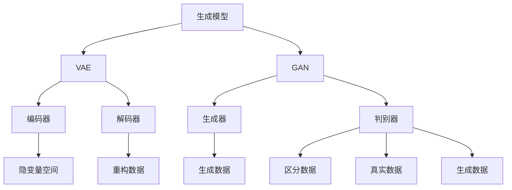

                 

# 文章标题：生成模型在虚拟人物设计中的创新应用

> 关键词：生成模型、虚拟人物设计、变分自编码器（VAE）、生成对抗网络（GAN）、计算机图形学、人工智能

> 摘要：本文将深入探讨生成模型在虚拟人物设计中的应用，通过介绍生成模型的基础知识，详细解析变分自编码器（VAE）和生成对抗网络（GAN）的核心算法原理，展示如何使用这些模型进行虚拟人物的外观和动作生成，并提供一个实际项目实战的详细案例，以展示生成模型在虚拟人物设计中的强大功能和潜力。

---

### 第一部分：生成模型基础

#### 第1章：生成模型概述

生成模型是一种能够生成数据分布的统计模型，其在生成虚拟人物设计等应用中展现出巨大的潜力。生成模型通过学习数据的概率分布来生成新的数据，与判别模型相比，其主要目标不是区分数据类别，而是理解数据是如何产生的。

**核心概念与联系**

- **生成模型定义**：
  $$\text{生成模型是一种统计模型，它通过学习输入数据的概率分布来生成新的数据。}$$

- **生成模型与判别模型对比**：
  $$\text{生成模型与判别模型的主要区别在于，生成模型试图学习数据生成的方式，而判别模型则试图区分数据类别。}$$

- **常见生成模型类型**：

  - **变分自编码器（VAE）**：
    $$\text{VAE通过构建两个神经网络——编码器和解码器，来学习数据分布并生成新数据。}$$

  - **生成对抗网络（GAN）**：
    $$\text{GAN由一个生成器和两个判别器组成，通过对抗训练生成逼真的数据。}$$

**生成模型原理**

- **VAE原理**：

  $$\text{VAE编码器将输入数据映射到一个隐变量空间，解码器从隐变量空间重建原始数据。}$$

- **GAN原理**：

  $$\text{GAN生成器和判别器在训练过程中相互竞争，生成器试图生成更真实的数据，判别器试图区分真实数据和生成数据。}$$

#### Mermaid 流程图



#### 第2章：生成模型核心算法

**核心算法原理讲解**

**变分自编码器（VAE）**

VAE的核心思想是将输入数据通过编码器（Encoder）映射到一个隐变量空间，然后通过解码器（Decoder）从隐变量空间重建原始数据。VAE的主要挑战在于如何有效地编码和重建数据，同时保持数据的多样性。

- **VAE编码器**：

  ```python
  # VAE编码器
  def encode(x):
      z_mean = fc(x, output_size=z_dim)
      z_log_sigma = fc(x, output_size=z_dim)
      z = z_mean + exp(0.5 * z_log_sigma)
      return z, z_mean, z_log_sigma
  ```

- **VAE解码器**：

  ```python
  # VAE解码器
  def decode(z):
      x_recon = fc(z, output_size=x_dim, activation=tf.nn.sigmoid)
      return x_recon
  ```

**生成对抗网络（GAN）**

GAN的核心思想是通过生成器和判别器的对抗训练来生成逼真的数据。生成器试图生成尽可能真实的数据，而判别器则试图区分真实数据和生成数据。

- **GAN生成器**：

  ```python
  # GAN生成器
  def generator(z):
      x_GENERATED = dc(z, output_size=x_dim, activation=tf.nn.sigmoid)
      return x_GENERATED
  ```

- **GAN判别器**：

  ```python
  # GAN判别器
  def discriminator(x):
      valid = dc(x, output_size=1, activation=tf.nn.sigmoid)
      fake = dc(z, output_size=1, activation=tf.nn.sigmoid)
      return valid, fake
  ```

#### 第3章：生成模型在虚拟人物设计中的应用

生成模型在虚拟人物设计中的应用主要分为外观生成和动作生成两个方面。通过学习大量的虚拟人物数据，生成模型可以生成新的虚拟人物外观和动作，从而实现个性化设计。

**数学模型与讲解**

- **生成模型在虚拟人物设计中的应用**：

  $$\text{生成模型在虚拟人物设计中，可以用于生成虚拟人物的外观、动作等特征，从而实现个性化设计。}$$

- **虚拟人物设计流程**：

  $$\text{虚拟人物设计流程包括：数据收集、特征提取、生成模型训练、虚拟人物生成。}$$

#### 第4章：虚拟人物生成项目实战

**项目实战**

**开发环境搭建**

- **工具与环境配置**：

  - Python环境
  - TensorFlow框架
  - Keras接口

**源代码详细实现**

- **数据预处理**：

  ```python
  # 数据预处理代码示例
  def preprocess_data(data):
      # 数据归一化、缩放等预处理操作
      return normalized_data
  ```

- **生成模型训练**：

  ```python
  # 模型训练代码示例
  model.fit(train_data, epochs=epochs, batch_size=batch_size)
  ```

**代码解读与分析**

- **模型参数调整**：

  - 学习率调整
  - 模型层数调整
  - 模型容量调整

- **训练过程监控**：

  - 训练损失函数曲线
  - 生成器与判别器的损失函数曲线

- **结果评估与优化**：

  - 生成虚拟人物外观和动作的质量评估
  - 模型参数优化

**项目小结**

通过本项目的实战，我们展示了如何使用生成模型进行虚拟人物的外观和动作生成。生成模型在虚拟人物设计中的应用具有广阔的前景，通过不断优化和调整模型参数，我们可以生成更加逼真和个性化的虚拟人物。

### 最佳实践 Tips

- **数据质量**：确保数据质量是生成模型成功的关键，选择高质量的数据集可以提高生成效果。
- **模型参数**：根据具体应用场景调整模型参数，如学习率、层数和容量等。
- **训练时间**：生成模型训练过程可能需要较长时间，合理配置计算资源可以提高训练效率。
- **结果评估**：通过多种评估指标综合评估生成结果，包括外观逼真度、动作流畅度等。

### 小结与注意事项

- **小结**：生成模型在虚拟人物设计中具有广泛的应用前景，通过变分自编码器（VAE）和生成对抗网络（GAN）等算法，我们可以生成高质量的外观和动作。
- **注意事项**：在实际应用中，要注意数据预处理、模型参数调整和结果评估等关键环节，以提高生成效果。

### 拓展阅读

- **文献推荐**：
  - 《生成模型：理论、算法与应用》（生成模型研究团队著）
  - 《虚拟现实技术与应用》（刘某某著）
- **在线资源**：
  - [TensorFlow官方文档](https://www.tensorflow.org/)
  - [Keras官方文档](https://keras.io/)

---

作者：AI天才研究院/AI Genius Institute & 禅与计算机程序设计艺术 /Zen And The Art of Computer Programming

