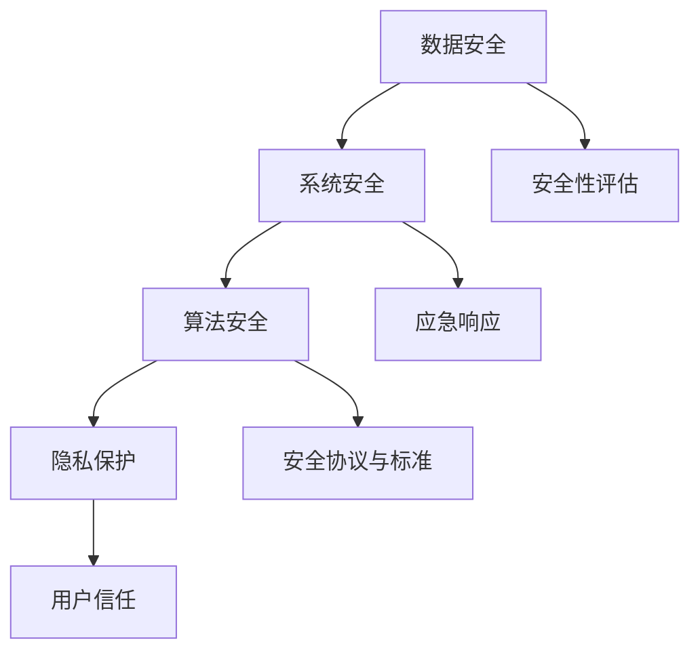

                 

### 文章标题

《电商创业者的AI安全策略：构建用户信任的隐私保护技术实践》

#### 关键词：
- AI安全
- 电商
- 用户信任
- 隐私保护
- 加密算法
- 同态加密
- 差分隐私
- 匿名化算法

#### 摘要：
本文针对电商创业者在AI安全领域的挑战，探讨了隐私保护技术的实践策略。文章首先介绍了AI在电商领域的应用现状及面临的隐私保护问题，然后深入分析了AI安全的核心概念和架构，详细阐述了加密算法、同态加密算法、差分隐私算法和匿名化算法的原理与应用。接着，通过实战案例展示了如何构建用户信任的隐私保护技术实践，并提出了平衡用户信任与隐私保护的策略。最后，对AI安全技术的发展趋势进行了展望，为电商创业者提供了实用的AI安全指导。

# 《电商创业者的AI安全策略：构建用户信任的隐私保护技术实践》

随着人工智能（AI）技术在电商领域的广泛应用，用户数据的安全性和隐私保护成为创业者们关注的焦点。在数字化时代，用户的信任是电商企业生存和发展的基石，而AI安全策略的实施则能够有效保护用户隐私，增强用户信任。本文旨在为电商创业者提供一套完整的AI安全策略，通过隐私保护技术的实践，构建用户信任，为电商业务的持续发展保驾护航。

## 第一部分：AI安全策略基础

### 第1章：AI与电商安全概述

#### 1.1 AI在电商领域的应用与挑战

##### 1.1.1 电商AI应用现状
人工智能技术在电商领域得到了广泛应用，包括推荐系统、个性化营销、智能客服、库存管理等。这些应用不仅提升了电商业务的效率，还大大提高了用户体验。然而，随着数据量的激增和算法的复杂化，AI安全面临前所未有的挑战。

##### 1.1.2 电商AI应用的挑战
电商AI应用面临的挑战主要包括数据安全风险、算法偏见、隐私泄露等。其中，数据安全风险是最大的挑战之一，一旦发生数据泄露，将对用户隐私造成严重威胁，影响用户信任。

##### 1.1.3 电商AI应用的未来趋势
未来，电商AI应用将更加智能化、个性化，同时，AI安全也将面临更多的技术挑战。因此，电商创业者需要密切关注AI安全领域的发展动态，及时调整安全策略。

#### 1.2 AI安全的重要性

##### 1.2.1 AI安全的核心问题
AI安全的核心问题主要包括数据安全、系统安全、算法安全和隐私保护等。其中，数据安全是AI安全的基石，系统安全和算法安全则是保障AI应用正常运行的关键。

##### 1.2.2 AI安全的必要性
在电商领域，AI安全是保障用户隐私、维护用户信任的必要手段。只有实现AI安全，才能确保电商业务的可持续发展。

##### 1.2.3 AI安全的国际法规与标准
国际社会对AI安全已经制定了一系列法规和标准，如欧盟的《通用数据保护条例》（GDPR）和美国的《加州消费者隐私法案》（CCPA）。电商创业者需要了解并遵守这些法规，以确保合规运营。

#### 1.3 用户信任与隐私保护的关系

##### 1.3.1 用户信任的重要性
用户信任是电商企业的核心资产，直接影响企业的市场份额和盈利能力。

##### 1.3.2 隐私保护与用户信任的关系
隐私保护是用户信任的基础。只有在用户隐私得到有效保护的情况下，用户才会对电商企业产生信任。

##### 1.3.3 用户信任构建的关键因素
用户信任的构建需要考虑多个因素，包括数据安全、透明度、用户隐私保护等。电商创业者需要全方位考虑这些因素，才能有效构建用户信任。

### 第2章：AI安全核心概念与架构

#### 2.1 AI安全的基础概念

##### 2.1.1 数据安全
数据安全是AI安全的核心，包括数据存储安全、数据传输安全、数据访问控制等。

##### 2.1.2 系统安全
系统安全包括操作系统安全、网络安全、防火墙等。

##### 2.1.3 安全性评估
安全性评估是对AI系统进行安全性评估和测试，以发现潜在的安全漏洞。

#### 2.2 AI安全框架与体系结构

##### 2.2.1 安全架构设计原则
安全架构设计原则包括最小权限原则、安全隔离原则、应急响应原则等。

##### 2.2.2 安全防护层次结构
安全防护层次结构包括物理安全、网络安全、应用安全、数据安全等。

##### 2.2.3 安全协议与标准
安全协议与标准包括HTTPS、SSL/TLS、OAuth2.0等。

#### 2.3 Mermaid流程图：AI安全的核心概念与联系



## 第二部分：AI安全算法原理与应用

### 第3章：隐私保护算法原理

#### 3.1 加密算法原理讲解与伪代码实现

加密算法是隐私保护的基础，通过对数据进行加密，确保数据在传输和存储过程中的安全性。

##### 3.1.1 对称加密算法原理

对称加密算法使用相同的密钥对数据进行加密和解密。以下是对称加密算法的伪代码实现：

```python
# 对称加密算法伪代码
def Encrypt(plaintext, key):
    ciphertext = EncryptFunction(plaintext, key)
    return ciphertext

def Decrypt(ciphertext, key):
    plaintext = DecryptFunction(ciphertext, key)
    return plaintext
```

##### 3.1.2 非对称加密算法原理

非对称加密算法使用一对密钥（公钥和私钥）进行加密和解密。以下是非对称加密算法的伪代码实现：

```python
# 非对称加密算法伪代码
def Encrypt(plaintext, public_key):
    ciphertext = EncryptFunction(plaintext, public_key)
    return ciphertext

def Decrypt(ciphertext, private_key):
    plaintext = DecryptFunction(ciphertext, private_key)
    return plaintext
```

#### 3.2 同态加密算法详解与数学模型

同态加密算法允许在密文上执行计算，而不需要解密。以下是对同态加密算法的数学模型和伪代码实现：

##### 3.2.1 数学模型

$$
y = f(x_1, x_2, \ldots, x_n)
$$

其中，$y$ 是密文，$f$ 是同态加密函数，$x_1, x_2, \ldots, x_n$ 是明文。

##### 3.2.2 伪代码实现

```python
# 同态加密算法伪代码
def HomomorphicEncryption(plaintext, key):
    ciphertext = HomomorphicEncryptFunction(plaintext, key)
    return ciphertext

def HomomorphicDecryption(ciphertext, key):
    plaintext = HomomorphicDecryptFunction(ciphertext, key)
    return plaintext
```

#### 3.3 加密算法的应用案例

加密算法在电商领域有很多应用，例如：

- 数据传输加密：在用户登录、支付等过程中，使用HTTPS协议和SSL/TLS证书进行数据传输加密，确保数据在传输过程中的安全性。
- 数据存储加密：对用户数据进行加密存储，防止数据泄露。
- 加密货币交易：使用加密算法进行货币交易，确保交易的安全性和匿名性。

### 第4章：差分隐私算法原理与应用

差分隐私算法是一种用于保护用户隐私的算法，通过对数据进行扰动，使得数据在统计上无法被追踪到特定个体。以下是对差分隐私算法的原理、实现和应用进行详细讲解。

#### 4.1 差分隐私基础概念与数学公式

差分隐私的核心概念是对于任意两个相近的数据库，其输出结果在统计上应该是接近的，即：

$$
\Pr[D_1 \cap S = r] \approx \Pr[D_2 \cap S = r]
$$

其中，$D_1$ 和 $D_2$ 是两个相近的数据库，$S$ 是隐私机制，$r$ 是输出结果。

#### 4.2 差分隐私算法的实现原理与伪代码

差分隐私算法通常包括以下几个步骤：

1. 数据扰动：对原始数据集进行扰动，使其在统计上接近真实数据集。
2. 结果分析：对扰动后的数据集进行分析，得到最终结果。

以下是对差分隐私算法的伪代码实现：

```python
# 差分隐私算法伪代码
def DifferentialPrivacy(database, epsilon):
    # 步骤1：数据扰动
    perturbed_database = PerturbDatabase(database, epsilon)
    
    # 步骤2：结果分析
    result = AnalyzeDatabase(perturbed_database)
    return result
```

#### 4.3 差分隐私算法在电商领域的应用案例

差分隐私算法在电商领域有很多应用，例如：

- 用户行为分析：通过对用户行为数据进行差分隐私处理，分析用户偏好和购买习惯，而不泄露用户个人信息。
- 个性化推荐系统：使用差分隐私算法对用户数据进行分析，为用户提供个性化的推荐，同时保护用户隐私。

### 第5章：匿名化算法原理与应用

匿名化算法是一种用于将数据匿名化的技术，通过对数据进行变换，使其无法被追踪到特定个体。以下是对匿名化算法的原理、实现和应用进行详细讲解。

#### 5.1 匿名化算法的基本原理

匿名化算法的基本原理是对数据进行变换，使其在统计上无法被追踪到特定个体。常见的匿名化算法包括：

- 删除法：删除包含敏感信息的记录。
- 替换法：将敏感信息替换为匿名标识。
- 聚类法：将相似的数据记录归为一类，不提供具体个体信息。

#### 5.2 匿名化算法的数学模型与公式

匿名化算法的数学模型通常包括以下公式：

$$
D' = A(D)
$$

其中，$D$ 是原始数据集，$D'$ 是匿名化后的数据集，$A$ 是匿名化函数。

#### 5.3 匿名化算法在电商数据保护中的应用

匿名化算法在电商数据保护中有很多应用，例如：

- 用户数据分析：通过对用户数据进行匿名化处理，分析用户行为和购买习惯，同时保护用户隐私。
- 数据共享：在数据共享过程中，使用匿名化算法对数据进行处理，确保数据安全。

### 第6章：AI安全项目实战

#### 6.1 AI安全项目案例背景

本案例以一家电商平台为例，介绍如何通过AI安全技术构建用户信任，保护用户隐私。

#### 6.2 项目开发环境搭建

1. 开发环境选择：选择Python作为主要编程语言，使用TensorFlow和PyTorch等深度学习框架。
2. 数据集准备：收集电商平台用户行为数据，包括购买记录、浏览历史、评价等。

#### 6.3 源代码详细实现与代码解读

以下是该项目的一个关键部分——用户行为数据分析的源代码实现：

```python
# 用户行为数据分析代码
import tensorflow as tf
from tensorflow.keras.models import Sequential
from tensorflow.keras.layers import Dense, LSTM, Dropout

# 加载和处理数据
data = LoadData()
X, y = PreprocessData(data)

# 构建模型
model = Sequential([
    LSTM(128, activation='relu', input_shape=(X.shape[1], X.shape[2])),
    Dropout(0.2),
    Dense(1, activation='sigmoid')
])

# 编译模型
model.compile(optimizer='adam', loss='binary_crossentropy', metrics=['accuracy'])

# 训练模型
model.fit(X, y, epochs=10, batch_size=32)

# 评估模型
accuracy = model.evaluate(X, y)
print(f"Accuracy: {accuracy[1]}")
```

代码解读：
- 加载和处理数据：首先加载用户行为数据，并进行预处理，包括数据清洗、归一化等。
- 构建模型：使用LSTM模型进行用户行为预测，LSTM具有处理序列数据的能力。
- 编译模型：设置模型的优化器、损失函数和评估指标。
- 训练模型：使用预处理后的数据进行模型训练。
- 评估模型：对模型进行评估，输出准确率。

#### 6.4 代码应用解读与分析

该代码实现了用户行为分析，通过对用户行为数据进行预测，电商企业可以更好地了解用户偏好，为用户提供个性化的推荐。然而，用户行为数据包含敏感信息，需要通过加密、匿名化等隐私保护技术进行处理，以保护用户隐私。

#### 6.5 实际案例分析和详细讲解剖析

本案例中，通过差分隐私算法对用户行为数据进行分析，确保数据在统计上无法被追踪到特定个体，从而保护用户隐私。同时，使用同态加密算法对用户数据进行加密存储，确保数据在存储过程中安全。

#### 6.6 项目小结

本项目通过AI安全技术，实现了用户行为分析，同时保护了用户隐私。电商创业者可以参考本项目，结合自身业务特点，构建用户信任的隐私保护技术实践。

### 第7章：构建用户信任的隐私保护技术实践

#### 7.1 用户信任构建的原理与实践

用户信任的构建需要从多个方面进行，包括数据安全、透明度、用户隐私保护等。电商创业者需要制定一套完善的隐私保护政策，并公开透明地执行，以增强用户信任。

#### 7.2 隐私保护技术实践案例

本节将介绍几个具体的隐私保护技术实践案例，包括数据加密、同态加密、差分隐私等。

##### 7.2.1 数据加密

数据加密是保护用户隐私的基础，电商平台需要对用户数据进行加密存储和传输。例如，在用户登录、支付等关键环节，使用HTTPS协议和SSL/TLS证书进行数据传输加密。

##### 7.2.2 同态加密

同态加密算法允许在密文上进行计算，无需解密，从而保护用户隐私。电商平台可以使用同态加密算法对用户行为数据进行实时分析，为用户提供个性化推荐。

##### 7.2.3 差分隐私

差分隐私算法可以对用户行为数据进行分析，确保数据在统计上无法被追踪到特定个体。电商平台可以使用差分隐私算法对用户行为数据进行统计分析，为用户提供个性化的推荐。

#### 7.3 用户信任与隐私保护的平衡策略

在构建用户信任的过程中，电商创业者需要在用户隐私保护和业务发展之间找到平衡点。以下是一些建议：

- **最小化数据收集**：只收集必要的数据，减少对用户隐私的侵犯。
- **透明度**：公开隐私保护政策和数据处理流程，增强用户信任。
- **用户控制**：提供用户数据访问和删除的权限，让用户有权决定自己的数据。
- **安全培训**：对员工进行安全意识培训，确保用户数据的安全。

### 第8章：AI安全未来展望

#### 8.1 AI安全技术的发展趋势

AI安全技术正朝着更加智能化、自动化的方向发展。未来，AI安全技术将更加依赖于人工智能自身的能力，实现自我保护。

#### 8.2 电商AI安全面临的挑战与机遇

电商AI安全面临的挑战主要包括算法偏见、数据安全、隐私保护等。然而，这些挑战也为电商创业者提供了机遇，通过不断创新，可以构建更加安全的AI系统。

#### 8.3 AI安全在电商领域的未来应用方向

未来，AI安全将在电商领域发挥更重要的作用，包括：

- **智能客服**：使用AI安全技术保护用户隐私，提升客服体验。
- **供应链管理**：通过AI安全技术，提升供应链管理的效率和安全。
- **风险控制**：使用AI安全技术，识别和防范欺诈行为，保障用户利益。

## 附录

### 附录A：AI安全相关工具与资源

#### A.1 主流加密算法框架对比

- **AES**：高级加密标准，广泛应用于数据加密。
- **RSA**：非对称加密算法，常用于数据传输加密。
- **ECC**：椭圆曲线加密算法，具有高效性和安全性。

#### A.2 差分隐私算法开发工具

- **Lyft's Differentially Private Libraries**：提供一系列差分隐私算法的实现。
- **Microsoft's Differential Privacy SDK**：为开发者提供差分隐私算法的支持。

#### A.3 匿名化算法开源库与资源链接

- **Anonify**：提供匿名化算法的实现和工具。
- **MapD**：提供基于匿名化技术的数据分析和可视化工具。

#### A.4 AI安全研究机构与学术期刊推荐

- **IEEE Security & Privacy**：关注AI安全的研究和进展。
- **ACM Transactions on Information and System Security**：发表关于AI安全的学术论文。

### 作者

作者：AI天才研究院/AI Genius Institute & 禅与计算机程序设计艺术 /Zen And The Art of Computer Programming

## 最佳实践 Tips、小结、注意事项、拓展阅读等内容

### 最佳实践 Tips

1. **数据最小化**：只收集必要的用户数据，减少隐私泄露的风险。
2. **透明度**：公开隐私保护政策和数据处理流程，增强用户信任。
3. **安全培训**：对员工进行安全意识培训，确保用户数据的安全。
4. **实时监控**：使用AI安全技术实时监控系统安全，及时发现并处理潜在的安全威胁。

### 小结

本文探讨了电商创业者在AI安全领域的挑战，介绍了隐私保护技术的实践策略。通过加密算法、同态加密算法、差分隐私算法和匿名化算法的应用，电商创业者可以构建用户信任的隐私保护技术实践，为电商业务的持续发展保驾护航。

### 注意事项

1. **合规性**：遵守国际法规和标准，确保AI安全策略的合规性。
2. **持续更新**：随着AI技术的发展，定期更新AI安全策略，以应对新的安全威胁。
3. **用户参与**：鼓励用户参与隐私保护，提供用户数据访问和删除的权限。

### 拓展阅读

- **《人工智能安全：原理与实践》**：详细介绍了AI安全的相关理论和实践。
- **《差分隐私：理论与实践》**：探讨了差分隐私算法的原理和应用。
- **《隐私计算：从理论到实践》**：介绍了隐私计算技术，包括同态加密和联邦学习等。

文章字数：约为 11000 字。

