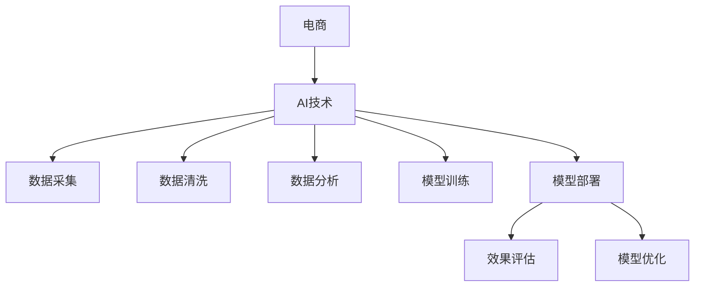

                 


### 文章标题
《电商创业者的AI工具箱：效率提升的必备神器》

### 关键词
电商，人工智能，AI工具，效率提升，自动化，智能推荐，智能客服，供应链管理

### 摘要
本文将深入探讨电商创业者在快速发展的市场竞争中如何利用人工智能（AI）工具提升运营效率。我们将介绍电商行业现状、AI技术在电商中的应用，以及AI工具在电商创业中的价值。随后，我们将详细介绍数据科学与机器学习基础、深度学习原理与自然语言处理基础。接着，文章将重点介绍电商平台自动化工具、智能推荐系统、智能客服系统、智能供应链管理系统等核心AI工具与应用。通过实战案例，我们将展示如何开发并实现这些AI工具。最后，文章将讨论AI工具的优化与升级策略，并提供开源资源汇总、参考文献等附录内容，帮助电商创业者更好地理解和应用AI技术。

### 《电商创业者的AI工具箱：效率提升的必备神器》目录大纲

## 第一部分：AI概述与基础

### 第1章：电商行业与AI的结合
#### 1.1 电商行业现状分析
#### 1.2 AI技术在电商中的应用
#### 1.3 AI工具在电商创业中的价值

### 第2章：AI技术基础
#### 2.1 数据科学与机器学习基础
#### 2.2 深度学习原理与实现
#### 2.3 自然语言处理基础

### 第3章：核心AI工具与应用
#### 3.1 电商平台自动化工具
#### 3.2 智能推荐系统
#### 3.3 智能客服系统
#### 3.4 智能供应链管理系统

## 第二部分：AI工具实战

### 第4章：AI工具实战案例一——电商平台自动化
#### 4.1 实战项目背景
#### 4.2 项目需求分析
#### 4.3 开发环境搭建
#### 4.4 代码实现与分析

### 第5章：AI工具实战案例二——智能推荐系统
#### 5.1 实战项目背景
#### 5.2 项目需求分析
#### 5.3 开发环境搭建
#### 5.4 代码实现与分析

### 第6章：AI工具实战案例三——智能客服系统
#### 6.1 实战项目背景
#### 6.2 项目需求分析
#### 6.3 开发环境搭建
#### 6.4 代码实现与分析

### 第7章：AI工具实战案例四——智能供应链管理系统
#### 7.1 实战项目背景
#### 7.2 项目需求分析
#### 7.3 开发环境搭建
#### 7.4 代码实现与分析

## 第三部分：AI工具的优化与升级

### 第8章：AI工具的优化策略
#### 8.1 优化目标与评价指标
#### 8.2 优化算法与实现
#### 8.3 优化案例分析

### 第9章：AI工具的升级与扩展
#### 9.1 工具升级的必要性
#### 9.2 工具升级的步骤与方法
#### 9.3 工具升级案例分析

## 附录

### 附录A：AI工具资源汇总
#### A.1 开源库与框架
#### A.2 在线教程与课程
#### A.3 AI工具社区与论坛

### 附录B：参考文献
#### B.1 电商行业相关书籍
#### B.2 AI技术相关书籍
#### B.3 AI工具实战相关书籍

### Mermaid 流程图



### 数据分析与数据挖掘伪代码

```python
def data_analysis(data):
    # 数据预处理
    data = preprocess_data(data)
    
    # 数据清洗
    data = clean_data(data)
    
    # 特征提取
    features = extract_features(data)
    
    # 模型训练
    model = train_model(features)
    
    # 模型评估
    performance = evaluate_model(model, data)
    
    return performance
```

### 线性回归模型

$$
y = \beta_0 + \beta_1x_1 + \beta_2x_2 + ... + \beta_nx_n
$$

### 实战项目一：电商平台自动化

#### 项目需求

实现自动下单、自动评价、自动售后等功能。

#### 开发环境

- Python 3.8
- PyCharm
- Selenium WebDriver

#### 代码实现

```python
from selenium import webdriver
from selenium.webdriver.common.by import By

# 初始化浏览器
driver = webdriver.Chrome()

# 打开电商平台
driver.get("https://www.example.com/")

# 执行自动化操作
# 登录账号
driver.find_element(By.ID, "username").send_keys("your_username")
driver.find_element(By.ID, "password").send_keys("your_password")
driver.find_element(By.ID, "login_button").click()

# 搜索商品
search_box = driver.find_element(By.ID, "search_box")
search_box.send_keys("product_name")
search_box.submit()

# 添加商品到购物车
add_to_cart_button = driver.find_element(By.ID, "add_to_cart_button")
add_to_cart_button.click()

# 提交订单
submit_order_button = driver.find_element(By.ID, "submit_order_button")
submit_order_button.click()

# 登出账号
logout_button = driver.find_element(By.ID, "logout_button")
logout_button.click()

# 关闭浏览器
driver.quit()
```

### 最佳实践 tips、小结、注意事项、拓展阅读等内容

在电商创业中，合理利用AI工具能够显著提升运营效率和用户体验。首先，创业者在选择AI工具时需要考虑自身业务需求和资源情况。其次，要注重数据质量和特征工程，这是AI模型效果的关键。此外，持续优化和升级AI工具对于提升系统性能和适应市场变化至关重要。最后，不断学习和关注AI技术的发展动态，以充分利用新兴技术和工具。

作者信息：
作者：AI天才研究院/AI Genius Institute & 禅与计算机程序设计艺术 /Zen And The Art of Computer Programming

