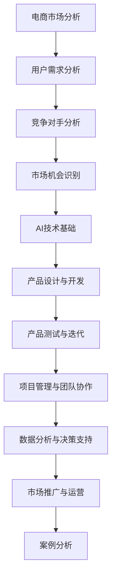

                 


### 文章标题

《电商创业者的AI驱动产品创新：从市场洞察到产品迭代的全流程管理》

### 关键词

- 电商市场
- AI驱动产品创新
- 市场洞察
- 产品迭代
- 全流程管理

### 摘要

本文旨在为电商创业者提供一套基于AI技术的产品创新与全流程管理方法。文章首先对电商市场进行概述，分析了当前电商市场的规模与趋势、细分领域与竞争态势，并探讨了关键驱动因素。接着，通过用户需求分析和竞争对手分析，识别出市场机会。随后，详细介绍了AI技术的基础、AI驱动产品设计与开发流程、产品测试与迭代策略。最后，文章重点讨论了项目管理与团队协作、数据分析与决策支持、市场推广与运营等全流程管理方面的内容，并结合案例进行深入剖析，为电商创业者的AI驱动产品创新提供实际操作指导。

### 目录大纲

#### 第一部分：市场洞察

##### 第1章：电商市场概述
- 1.1 电商行业的发展历程
- 1.2 当前电商市场的规模与趋势
- 1.3 电商市场的细分领域与竞争态势
- 1.4 电商市场的关键驱动因素

##### 第2章：用户需求分析
- 2.1 用户需求调研方法
- 2.2 用户画像与细分
- 2.3 用户需求的变化趋势与预测
- 2.4 用户满意度分析

##### 第3章：竞争对手分析
- 3.1 竞争对手识别
- 3.2 竞争对手策略分析
- 3.3 竞争优势与劣势分析
- 3.4 竞争策略建议

##### 第4章：市场机会识别
- 4.1 新兴市场与潜在用户群体
- 4.2 产品创新方向
- 4.3 商业模式创新
- 4.4 市场机会评估与选择

#### 第二部分：产品创新

##### 第5章：AI技术基础
- 5.1 AI技术概述
- 5.2 人工智能与电商的融合点
- 5.3 电商领域常用AI技术
- 5.4 AI技术在产品创新中的应用

##### 第6章：AI驱动产品设计与开发
- 6.1 AI驱动产品设计方法论
- 6.2 AI驱动产品开发流程
- 6.3 AI驱动的用户体验优化
- 6.4 AI驱动产品案例研究

##### 第7章：产品测试与迭代
- 7.1 产品测试策略
- 7.2 用户反馈收集与处理
- 7.3 产品迭代策略
- 7.4 产品迭代案例解析

#### 第三部分：全流程管理

##### 第8章：项目管理与团队协作
- 8.1 项目管理基础
- 8.2 团队协作工具与技巧
- 8.3 项目进度与风险管理
- 8.4 项目质量管理

##### 第9章：数据分析与决策支持
- 9.1 数据分析工具与技能
- 9.2 数据分析与商业决策
- 9.3 数据驱动产品优化
- 9.4 数据隐私与合规性

##### 第10章：市场推广与运营
- 10.1 电商市场推广策略
- 10.2 社交媒体营销
- 10.3 用户运营策略
- 10.4 产品运营案例解析

##### 第11章：案例分析
- 11.1 成功电商创业案例分析
- 11.2 失败案例分析
- 11.3 AI驱动电商产品创新最佳实践
- 11.4 未来电商创业趋势展望

#### 附录
- 附录A：电商AI工具与应用资源
- 附录B：电商创业法律指南
- 附录C：电商运营常用术语与缩写
- 附录D：参考文献与进一步阅读资料

### 核心概念与联系

#### AI技术架构流程图



### 核心算法原理讲解

#### 人工智能算法伪代码

```plaintext
// 1. 数据预处理
input: 数据集
for each sample in 数据集 do
    preprocess(sample)
end

// 2. 特征提取
input: 预处理后的数据
for each feature in 数据特征 do
    extract_feature(feature)
end

// 3. 模型训练
input: 特征数据
model = train_model(特征数据)

// 4. 模型评估
input: 测试数据
evaluate(model, 测试数据)

// 5. 模型部署
input: 模型
deploy_model(model)
```

#### 相关性分析公式

$$
\text{相关系数} = \frac{\sum_{i=1}^{n}(x_i - \bar{x})(y_i - \bar{y})}{\sqrt{\sum_{i=1}^{n}(x_i - \bar{x})^2}\sqrt{\sum_{i=1}^{n}(y_i - \bar{y})^2}}
$$

#### 决策树分类算法

$$
\text{Gini 不纯度} = 1 - \sum_{v \in V} p(v)^2
$$
其中，$p(v)$ 表示属于类别 $v$ 的概率。

### 项目实战

#### 电商推荐系统实现

```python
# 1. 数据加载与预处理
data = load_data()
X = preprocess_data(data)

# 2. 特征提取
features = extract_features(X)

# 3. 模型训练
model = train_model(features)

# 4. 模型评估
evaluate_model(model)

# 5. 模型部署
deploy_model(model)
```

在实现过程中，首先进行数据加载与预处理，然后提取特征，接下来使用训练集训练模型，使用测试集评估模型性能，最后将模型部署到生产环境中进行应用。实际案例分析和详细讲解剖析将涵盖数据预处理、特征提取、模型训练、评估和部署等各个环节，帮助电商创业者更好地理解AI技术在电商推荐系统中的应用。

### 最佳实践 tips、小结、注意事项、拓展阅读等内容

在撰写这篇文章的过程中，我们明确了电商创业者的AI驱动产品创新全流程管理方法，从市场洞察到产品迭代，再到全流程管理，涵盖了各个关键环节。以下是一些最佳实践和注意事项：

1. **市场洞察**：深入了解市场趋势和用户需求，通过数据分析、用户调研等方法，把握市场脉搏。
2. **AI技术基础**：掌握AI技术的原理和应用，了解AI与电商的融合点，选择合适的AI技术进行产品创新。
3. **产品设计与开发**：采用AI驱动产品设计方法论，优化用户体验，加快产品开发速度。
4. **产品测试与迭代**：制定合理的测试策略，收集用户反馈，不断迭代优化产品。
5. **全流程管理**：项目管理和团队协作是确保项目顺利进行的关键，同时要注重数据分析与决策支持，确保市场推广和运营策略的有效性。

拓展阅读方面，可以参考以下资源：

1. 《深度学习》（Goodfellow et al.）：了解深度学习的基本原理和应用。
2. 《Python数据分析》（Frisch et al.）：掌握Python在数据分析中的应用。
3. 《AI营销策略》（Pang et al.）：了解AI技术在市场营销中的应用。
4. 《电商运营实战》（曹毅）：学习电商运营的实战技巧。

通过这些资源，电商创业者可以进一步提升自己的产品创新能力和全流程管理水平。在未来的电商创业道路上，相信AI技术将发挥越来越重要的作用，为创业者带来更多的机遇和挑战。让我们共同期待电商行业的美好未来！ 

### 文章正文

#### 第一部分：市场洞察

##### 第1章：电商市场概述

1.1 电商行业的发展历程

电商，即电子商务，是指通过互联网进行的商业交易活动。电商行业的起源可以追溯到20世纪90年代，随着互联网的普及，电子商务开始崭露头角。早期的电商主要是通过网站展示商品信息，提供在线购物服务。随着技术的进步，电子商务逐渐从单纯的在线购物扩展到更多的领域，如在线支付、物流配送、社交媒体营销等。

1995年，亚马逊（Amazon）成立，标志着电商行业正式进入快速发展阶段。亚马逊不仅提供了丰富的商品资源，还通过创新的物流配送模式，提高了用户的购物体验。随后，eBay、阿里巴巴等电商巨头纷纷崛起，进一步推动了电商行业的发展。

在中国，电商行业的快速发展始于2003年，淘宝网的诞生标志着中国电商市场的崛起。淘宝网以C2C（消费者对消费者）的模式，为小微企业和个人卖家提供了便捷的销售渠道。随后，京东、当当、苏宁易购等电商平台纷纷成立，推动了中国电商市场的繁荣发展。

1.2 当前电商市场的规模与趋势

近年来，电商市场呈现出持续增长的态势。据Statista数据，全球电商市场规模预计在2023年达到4.7万亿美元。中国是全球最大的电商市场，市场规模占全球的近40%。

从发展趋势来看，移动电商和社交电商成为电商市场的重要增长点。随着智能手机的普及，越来越多的消费者通过移动设备进行购物。社交电商则通过社交媒体平台，如微信、微博、抖音等，实现了用户引流和社交互动，提高了电商的转化率。

1.3 电商市场的细分领域与竞争态势

电商市场可以分为多个细分领域，包括B2B（企业对企业）、B2C（企业对消费者）、C2C（消费者对消费者）等。在这些细分领域，竞争态势各异。

B2B电商市场主要集中在企业间的商品采购和供应链管理。阿里巴巴旗下的1688.com是B2B电商市场的领军者，其他竞争者包括慧聪网、京东工业品等。B2B电商市场竞争激烈，主要集中在价格、服务、供应链等方面。

B2C电商市场则以消费者为中心，提供丰富的商品选择和便捷的购物体验。淘宝、天猫是中国最大的B2C电商平台，其他竞争者包括京东、苏宁易购等。B2C电商市场的竞争主要集中在品牌、价格、物流、用户服务等方面。

C2C电商市场以个人卖家为主，消费者可以在平台上自由买卖商品。淘宝网是C2C电商市场的代表，其他竞争者包括闲鱼、拼多多等。C2C电商市场的竞争主要集中在商品质量、价格、用户评价等方面。

1.4 电商市场的关键驱动因素

电商市场的快速发展离不开以下几个关键驱动因素：

1. **技术创新**：互联网、大数据、人工智能等技术的不断创新，为电商提供了更丰富的应用场景和更高效的运营手段。

2. **消费升级**：随着人们生活水平的提高，消费者对品质、体验、个性化的追求日益增强，推动了电商市场的细分和多元化发展。

3. **物流配送**：高效的物流配送体系是电商行业的重要支撑。随着物流基础设施的完善，物流成本和配送速度不断提升，为电商提供了更好的服务保障。

4. **政策支持**：政府对电商行业的支持和鼓励，如税收优惠、政策扶持等，为电商企业提供了良好的发展环境。

综上所述，电商市场正处于快速发展的阶段，市场规模不断扩大，细分领域不断丰富，竞争态势日益激烈。电商创业者需要紧跟市场趋势，把握关键驱动因素，才能在激烈的竞争中脱颖而出。

##### 第2章：用户需求分析

2.1 用户需求调研方法

了解用户需求是电商创业者制定产品策略的重要环节。用户需求调研方法包括以下几种：

1. **问卷调查**：通过在线或线下方式，收集用户对产品、服务、购物体验等方面的意见和建议。问卷调查可以大规模、快速地获取用户反馈，适用于各类用户群体的需求调研。

2. **深度访谈**：针对特定用户群体，进行一对一的深入访谈，了解用户的需求、痛点、购物习惯等。深度访谈可以获得更详细、个性化的用户需求信息，适用于细分市场的研究。

3. **用户行为数据分析**：通过分析用户在电商平台的行为数据，如搜索关键词、浏览路径、购买行为等，了解用户的兴趣、偏好和需求。用户行为数据分析可以提供客观、量化的用户需求信息，有助于发现潜在需求。

4. **焦点小组**：组织一组用户，围绕特定主题进行讨论和交流，收集用户的观点和建议。焦点小组适用于探讨用户对新产品、新功能的反馈，有助于发现用户需求的新趋势。

2.2 用户画像与细分

用户画像是对用户特征进行系统描述的过程，包括用户的年龄、性别、地域、职业、收入水平、购物习惯等方面的信息。通过用户画像，电商创业者可以更精准地定位用户群体，制定有针对性的产品策略。

用户细分是将用户按照一定标准进行分类的过程，常见的分类标准包括：

1. **地理细分**：根据用户所在的地域信息，将用户分为不同地区群体。地理细分有助于了解不同地区用户的需求差异，制定区域化营销策略。

2. **人口细分**：根据用户的年龄、性别、职业、收入水平等人口特征，将用户分为不同群体。人口细分有助于了解不同用户群体的需求差异，制定个性化营销策略。

3. **心理细分**：根据用户的心理特征、价值观、兴趣爱好等，将用户分为不同群体。心理细分有助于挖掘用户的深层需求，提供更个性化的产品和服务。

4. **行为细分**：根据用户的购物行为、使用习惯等，将用户分为不同群体。行为细分有助于了解用户的购买习惯和偏好，制定针对性的促销策略。

2.3 用户需求的变化趋势与预测

用户需求的变化趋势与预测是电商创业者制定长期战略的重要依据。以下是一些用户需求的变化趋势：

1. **个性化需求**：随着消费者对品质、体验、个性化的追求，个性化需求逐渐成为主流。电商创业者需要通过大数据分析和个性化推荐等技术，满足用户的个性化需求。

2. **品质需求**：消费者对商品品质的要求越来越高，品质成为影响购买决策的重要因素。电商创业者需要注重商品品质，提高用户的购物满意度。

3. **便捷性需求**：消费者越来越追求便捷的购物体验，对物流配送、售后服务等方面的要求也越来越高。电商创业者需要提升物流配送效率，优化售后服务。

4. **社交化需求**：随着社交电商的兴起，消费者越来越倾向于在社交平台上购物，社交互动成为购物体验的重要组成部分。电商创业者需要利用社交化元素，提升用户的购物乐趣。

通过用户需求调研、用户画像与细分、用户需求的变化趋势与预测，电商创业者可以更准确地把握用户需求，制定符合市场需求的产品策略，提高市场竞争力。

2.4 用户满意度分析

用户满意度分析是评估电商产品和服务质量的重要手段。以下是一些用户满意度分析的常用方法：

1. **用户满意度调查**：通过在线或线下方式，向用户发放满意度调查问卷，收集用户对产品、服务、购物体验等方面的评价。用户满意度调查可以提供定量的用户满意度数据，有助于识别产品和服务中的问题。

2. **用户反馈收集**：通过社交媒体、电商平台、客服渠道等，收集用户的反馈信息，包括正面评价、负面评价、建议和投诉等。用户反馈收集可以提供定性的用户满意度信息，有助于了解用户的具体需求和问题。

3. **用户行为分析**：通过分析用户在电商平台的行为数据，如浏览时间、购买频率、评论评分等，评估用户的满意度。用户行为分析可以提供客观、量化的用户满意度指标。

4. **KPI（关键绩效指标）分析**：通过设定关键绩效指标，如用户留存率、复购率、退货率等，评估用户满意度。KPI分析可以提供全面的用户满意度评估，有助于发现产品和服务中的优劣势。

通过用户满意度分析，电商创业者可以了解用户对产品和服务的评价，识别问题和改进方向，提高用户满意度，提升市场竞争力。

##### 第3章：竞争对手分析

3.1 竞争对手识别

在电商市场中，竞争对手识别是电商创业者制定竞争策略的重要步骤。以下是一些竞争对手识别的方法：

1. **直接竞争对手**：直接竞争对手是指在同一细分市场中，提供相似产品或服务的其他电商平台。直接竞争对手包括淘宝、天猫、京东、拼多多等国内知名电商平台。

2. **间接竞争对手**：间接竞争对手是指在不同细分市场中，提供类似产品或服务的其他电商平台。间接竞争对手包括亚马逊、eBay、阿里巴巴国际站等国际电商平台。

3. **替代品**：替代品是指能够满足用户相同需求的其他产品或服务。替代品可以是其他电商平台上的商品，也可以是线下实体店的商品。

4. **潜在竞争对手**：潜在竞争对手是指目前尚未进入电商市场，但有可能在未来成为竞争对手的企业。潜在竞争对手可以是传统企业转型电商的企业，也可以是新兴电商平台。

3.2 竞争对手策略分析

了解竞争对手的策略是制定有效竞争策略的基础。以下是一些竞争对手策略分析的方法：

1. **产品策略**：分析竞争对手的产品线、产品定位、产品特色等，了解竞争对手如何满足用户需求。产品策略包括产品创新、产品质量、产品差异化等方面。

2. **价格策略**：分析竞争对手的定价策略，包括价格水平、折扣促销、价格战等。价格策略有助于了解竞争对手的市场定位和盈利模式。

3. **渠道策略**：分析竞争对手的销售渠道，包括线上渠道和线下渠道。渠道策略包括线上渠道的推广、线下渠道的布局等。

4. **营销策略**：分析竞争对手的营销手段，包括广告宣传、促销活动、品牌推广等。营销策略有助于了解竞争对手如何吸引用户和增加市场份额。

5. **服务策略**：分析竞争对手的服务质量，包括售后服务、物流配送、用户支持等。服务策略有助于了解竞争对手如何提升用户满意度和忠诚度。

3.3 竞争优势与劣势分析

通过对竞争对手策略的分析，可以识别出竞争对手的优势与劣势。以下是一些竞争优势与劣势分析的方法：

1. **优势分析**：分析竞争对手在产品、价格、渠道、营销、服务等方面的优势，包括技术创新、品牌影响力、市场份额、用户口碑等。

2. **劣势分析**：分析竞争对手在产品、价格、渠道、营销、服务等方面的劣势，包括产品缺陷、价格过高、渠道不畅、营销不足、服务质量差等。

3.4 竞争策略建议

根据竞争对手的优势与劣势分析，电商创业者可以制定有效的竞争策略。以下是一些竞争策略建议：

1. **差异化策略**：通过产品创新、服务质量、品牌形象等方面的差异化，打造独特的竞争优势。

2. **低成本策略**：通过优化供应链、降低运营成本，实现较低的价格水平，吸引价格敏感型用户。

3. **精准营销**：通过大数据分析和个性化推荐等技术，实现精准营销，提高用户转化率和复购率。

4. **服务优化**：提升售后服务质量，提供快速、高效的物流配送，增强用户满意度。

5. **品牌建设**：加强品牌推广和宣传，提升品牌知名度和美誉度，建立用户忠诚度。

通过竞争对手分析，电商创业者可以更全面地了解市场竞争态势，制定有针对性的竞争策略，提高市场竞争力。

##### 第4章：市场机会识别

4.1 新兴市场与潜在用户群体

在电商市场中，新兴市场和潜在用户群体是电商创业者需要关注的重要方向。以下是一些识别新兴市场和潜在用户群体的方法：

1. **数据分析**：通过大数据分析，挖掘电商市场的潜在用户群体，包括地域分布、年龄结构、消费习惯等。数据分析有助于了解市场趋势和用户需求，为新兴市场识别提供依据。

2. **用户调研**：通过用户调研，了解用户对电商产品的需求、偏好和期望。用户调研可以提供定性的用户反馈，帮助识别新兴市场和潜在用户群体。

3. **行业报告**：查阅行业报告，了解电商市场的最新动态和趋势。行业报告可以提供市场数据、竞争态势、技术创新等方面的信息，有助于发现新兴市场和潜在用户群体。

4.2 产品创新方向

在识别新兴市场和潜在用户群体的基础上，电商创业者可以探索产品创新方向。以下是一些产品创新方向：

1. **智能化**：通过人工智能技术，提升电商平台的智能化水平，如智能推荐、智能客服、智能物流等。智能化产品可以提供更精准、高效的服务，满足用户个性化需求。

2. **个性化**：基于用户画像和大数据分析，提供个性化的产品推荐和服务。个性化产品可以提升用户体验，增加用户黏性。

3. **品质化**：注重产品品质，提供高品质的商品和服务，满足消费者对品质的追求。品质化产品可以提升品牌形象，增强用户忠诚度。

4. **社交化**：结合社交元素，打造社交电商模式，如社交媒体营销、社交互动、社交购物等。社交化产品可以增强用户参与度，提升用户活跃度。

4.3 商业模式创新

在新兴市场和潜在用户群体的基础上，电商创业者可以探索商业模式创新。以下是一些商业模式创新方向：

1. **C2M（消费者对制造商）**：通过消费者需求驱动生产，实现定制化生产，降低库存风险，提升产品竞争力。

2. **P2P（平台对平台）**：搭建跨界电商平台，整合多种业态，实现资源共享和优势互补。

3. **会员制**：通过会员制度，提供个性化服务、专属优惠等，增强用户黏性和忠诚度。

4. **供应链金融**：为电商企业提供供应链金融服务，提升企业资金流转效率，降低融资成本。

4.4 市场机会评估与选择

在识别市场机会后，电商创业者需要进行市场机会评估与选择。以下是一些评估方法：

1. **可行性评估**：评估市场机会的可行性，包括技术实现、市场需求、资源投入等。

2. **收益评估**：评估市场机会的预期收益，包括收入增长、市场份额、盈利能力等。

3. **风险评估**：评估市场机会的风险，包括市场风险、技术风险、运营风险等。

4. **优先级评估**：根据可行性、收益和风险等因素，确定市场机会的优先级。

通过市场机会评估与选择，电商创业者可以筛选出最有潜力的市场机会，制定有针对性的发展战略，实现持续创新和成长。

##### 第二部分：产品创新

##### 第5章：AI技术基础

5.1 AI技术概述

人工智能（AI）是计算机科学的一个分支，旨在使计算机具有模拟、延伸和扩展人类智能的能力。AI技术包括多个子领域，如机器学习、深度学习、自然语言处理、计算机视觉等。在电商领域，AI技术被广泛应用于产品推荐、用户行为分析、智能客服、智能物流等方面，提高了电商平台的运营效率和服务质量。

5.2 人工智能与电商的融合点

人工智能与电商的融合点主要体现在以下几个方面：

1. **个性化推荐**：通过AI技术，分析用户的购物行为和偏好，为用户提供个性化的商品推荐，提升购物体验和转化率。

2. **用户行为分析**：通过AI技术，实时监测和分析用户在电商平台的浏览、搜索、购买等行为，了解用户需求和行为模式，为产品优化和市场推广提供数据支持。

3. **智能客服**：通过自然语言处理和机器学习技术，实现智能客服系统，提供24/7在线服务，提高客户满意度和客服效率。

4. **智能物流**：通过AI技术，优化物流路径和配送策略，提高物流效率，降低物流成本。

5.3 电商领域常用AI技术

在电商领域，以下是一些常用的AI技术：

1. **机器学习**：通过训练模型，从大量数据中学习规律和模式，用于用户行为预测、商品推荐等。

2. **深度学习**：基于神经网络的理论，通过多层非线性变换，实现图像识别、语音识别等复杂任务。

3. **自然语言处理**：通过计算机理解和生成自然语言，用于智能客服、文本分析等。

4. **计算机视觉**：通过图像处理和模式识别技术，实现商品识别、图像分类等。

5.4 AI技术在产品创新中的应用

AI技术在电商产品创新中的应用包括以下几个方面：

1. **个性化推荐**：基于用户行为和偏好，为用户推荐相关的商品，提升购物体验和转化率。

2. **智能客服**：通过自然语言处理技术，实现智能客服系统，提供实时、高效的服务。

3. **用户行为分析**：实时监测用户在电商平台的浏览、搜索、购买等行为，为产品优化和市场推广提供数据支持。

4. **智能物流**：通过AI技术，优化物流路径和配送策略，提高物流效率，降低物流成本。

5. **商品识别**：通过计算机视觉技术，实现商品识别和图像分类，提升电商平台的服务质量。

通过AI技术的应用，电商创业者可以提升产品创新能力和用户体验，实现电商平台的持续发展和竞争优势。

##### 第6章：AI驱动产品设计与开发

6.1 AI驱动产品设计方法论

AI驱动产品设计方法论是一种基于人工智能技术的产品开发方法，旨在通过人工智能技术优化产品设计、提高产品体验和满意度。以下是一些AI驱动产品设计的步骤：

1. **需求分析**：通过用户调研、市场分析等方式，了解用户需求和痛点，明确产品设计的目标和方向。

2. **数据收集**：收集与用户需求相关的数据，如用户行为数据、商品数据、市场数据等。数据来源可以是电商平台内部数据、第三方数据平台等。

3. **数据预处理**：对收集到的数据进行分析和处理，如数据清洗、特征提取、数据归一化等。数据预处理有助于提高数据质量和模型的准确性。

4. **模型训练**：使用机器学习和深度学习技术，对预处理后的数据进行训练，构建预测模型和推荐系统。模型训练是AI驱动产品设计的核心环节。

5. **模型评估**：对训练好的模型进行评估，如准确率、召回率、F1值等。模型评估有助于了解模型的性能和效果，为产品优化提供依据。

6. **产品设计**：根据模型评估结果，对产品设计进行调整和优化，如界面设计、功能模块等。产品设计应充分考虑用户体验和需求。

7. **产品迭代**：根据用户反馈和市场需求，不断迭代优化产品，提升产品体验和满意度。

6.2 AI驱动产品开发流程

AI驱动产品开发流程包括以下几个阶段：

1. **需求分析**：明确产品需求，制定产品开发计划。

2. **数据收集**：收集与用户需求相关的数据，如用户行为数据、商品数据等。

3. **数据预处理**：对收集到的数据进行分析和处理，如数据清洗、特征提取、数据归一化等。

4. **模型训练**：使用机器学习和深度学习技术，对预处理后的数据进行训练，构建预测模型和推荐系统。

5. **模型评估**：对训练好的模型进行评估，如准确率、召回率、F1值等。

6. **产品实现**：根据模型评估结果，开发产品原型，实现产品功能。

7. **用户测试**：对产品原型进行用户测试，收集用户反馈，优化产品设计。

8. **产品上线**：将产品上线，进行实际应用，收集用户数据，进行持续优化。

6.3 AI驱动的用户体验优化

AI驱动的用户体验优化是一种通过人工智能技术提升用户体验的方法。以下是一些AI驱动的用户体验优化策略：

1. **个性化推荐**：基于用户行为和偏好，为用户推荐相关的商品和内容，提升用户满意度。

2. **智能客服**：通过自然语言处理技术，实现智能客服系统，提供实时、高效的服务，提高用户满意度。

3. **智能搜索**：通过机器学习技术，优化搜索算法，提高搜索结果的准确性和相关性。

4. **智能导购**：根据用户的购物习惯和偏好，提供个性化的导购服务，提升购物体验。

5. **智能预警**：通过实时监测用户行为，识别潜在的用户需求，提前预警并推送相关商品和内容。

6.4 AI驱动产品案例研究

以下是一个AI驱动产品的案例研究：

**案例：智能购物助手**

1. **需求分析**：用户在购物过程中，常常面临商品选择困难、购物决策时间长等问题。智能购物助手旨在为用户提供个性化的购物建议，简化购物决策过程。

2. **数据收集**：收集用户在电商平台上的浏览、搜索、购买等行为数据，以及商品数据。

3. **数据预处理**：对收集到的数据进行分析和处理，提取用户行为特征和商品特征。

4. **模型训练**：使用机器学习和深度学习技术，构建用户兴趣模型和推荐系统。

5. **模型评估**：对训练好的模型进行评估，如准确率、召回率、F1值等。

6. **产品设计**：根据模型评估结果，设计智能购物助手的产品原型，实现个性化推荐功能。

7. **用户测试**：对产品原型进行用户测试，收集用户反馈，优化产品设计。

8. **产品上线**：将智能购物助手上线，提供实际应用。

通过案例研究，我们可以看到AI技术在电商产品设计和开发中的应用，以及如何通过AI技术优化用户体验。AI驱动产品设计与开发为电商创业者提供了新的发展机遇，有助于提升产品竞争力。

##### 第7章：产品测试与迭代

7.1 产品测试策略

产品测试是确保产品质量和用户体验的重要环节。以下是一些产品测试策略：

1. **功能测试**：验证产品功能是否按预期正常运行，包括功能完整性、正确性、稳定性等。

2. **性能测试**：评估产品性能，如响应时间、并发处理能力、负载能力等。

3. **兼容性测试**：确保产品在不同设备和操作系统上都能正常运行。

4. **用户体验测试**：通过用户测试，评估产品的易用性、用户界面和交互设计等。

5. **安全测试**：评估产品的安全性，包括数据保护、系统漏洞等。

6. **回归测试**：在产品更新和迭代过程中，验证新功能的正确性和对原有功能的影响。

7.2 用户反馈收集与处理

用户反馈是产品优化的重要依据。以下是一些用户反馈收集与处理的方法：

1. **用户调研**：通过在线或线下方式，收集用户对产品的意见和建议。

2. **用户访谈**：与用户进行一对一访谈，深入了解用户的反馈和需求。

3. **用户行为分析**：通过分析用户在平台上的行为数据，了解用户的使用习惯和偏好。

4. **用户评分和评论**：收集用户对产品的评分和评论，了解用户的满意度和不满意度。

5. **用户反馈系统**：建立用户反馈系统，让用户可以方便地提交反馈和建议。

6. **处理反馈**：对用户反馈进行分类、分析和处理，制定改进计划，并在后续版本中优化产品。

7.3 产品迭代策略

产品迭代是持续优化产品的重要手段。以下是一些产品迭代策略：

1. **定期迭代**：按照既定的时间表，定期发布新功能和优化内容。

2. **敏捷开发**：采用敏捷开发方法，快速迭代，及时响应用户反馈和市场需求。

3. **小步快跑**：发布较小的版本更新，逐步完善产品功能和用户体验。

4. **增量式迭代**：在现有功能基础上进行优化和扩展，而不是完全重新设计。

5. **用户参与**：鼓励用户参与产品测试和反馈，收集用户意见和建议，指导产品迭代。

7.4 产品迭代案例解析

以下是一个产品迭代案例：

**案例：电商平台移动应用优化**

1. **需求分析**：用户对电商平台移动应用的使用体验提出了多项建议，包括界面优化、加载速度提升、购物流程简化等。

2. **用户反馈收集**：通过用户调研、用户访谈和用户行为分析，收集用户的反馈和建议。

3. **数据分析**：对收集到的用户反馈进行分类和分析，识别出主要问题和优化方向。

4. **功能优化**：根据用户反馈，优化移动应用的功能和界面，如简化购物流程、提升加载速度、改进商品展示等。

5. **用户体验测试**：邀请用户进行用户体验测试，评估优化效果，收集新的用户反馈。

6. **迭代发布**：发布优化后的移动应用版本，收集用户反馈，持续进行优化。

通过产品测试与迭代，电商创业者可以不断提升产品的质量和用户体验，满足用户需求，提高市场竞争力。

##### 第三部分：全流程管理

##### 第8章：项目管理与团队协作

8.1 项目管理基础

项目管理是确保电商项目按时、按质、按预算完成的重要手段。以下是一些项目管理的基础知识：

1. **项目计划**：制定项目计划，明确项目目标、任务、时间表、资源分配等。

2. **项目执行**：按照项目计划，执行各项任务，确保项目按计划进行。

3. **项目监控**：监控项目进度和质量，及时发现问题并进行调整。

4. **项目收尾**：完成项目任务，进行项目总结和评估，确保项目成功收尾。

8.2 团队协作工具与技巧

团队协作是项目成功的关键。以下是一些团队协作工具与技巧：

1. **任务管理工具**：如Trello、Asana、Jira等，用于任务分配、进度跟踪和协作。

2. **沟通工具**：如Slack、微软Teams、Zoom等，用于团队沟通和协作。

3. **文档共享工具**：如Google文档、Dropbox、OneDrive等，用于文档共享和协作。

4. **协作技巧**：如定期会议、代码审查、任务分解等，提高团队协作效率。

8.3 项目进度与风险管理

项目进度和风险管理是项目管理的重要方面。以下是一些方法和技巧：

1. **进度跟踪**：使用项目管理工具，定期更新任务进度，确保项目按计划进行。

2. **风险管理**：识别项目风险，制定风险应对策略，降低项目风险。

3. **问题解决**：及时发现和解决项目中的问题，避免问题积累和扩大。

8.4 项目质量管理

项目质量管理是确保项目输出质量的重要环节。以下是一些项目质量管理的方法和技巧：

1. **需求管理**：明确项目需求，确保项目目标清晰、需求合理。

2. **质量保证**：制定质量标准和检查流程，确保项目输出质量。

3. **质量监控**：定期进行质量检查，及时发现和解决质量问题。

4. **持续改进**：通过质量反馈和评估，持续改进项目管理和产品质量。

通过有效的项目管理与团队协作，电商创业者可以确保项目顺利推进，提高项目成功率。

##### 第9章：数据分析与决策支持

9.1 数据分析工具与技能

数据分析是电商创业者制定决策的重要依据。以下是一些数据分析工具和技能：

1. **数据分析工具**：如Excel、Python、R、Tableau等，用于数据处理、分析和可视化。

2. **数据挖掘技术**：如回归分析、聚类分析、关联规则分析等，用于发现数据中的规律和趋势。

3. **机器学习技术**：如决策树、随机森林、神经网络等，用于预测和优化。

4. **数据可视化**：如matplotlib、seaborn、ggplot2等，用于数据可视化，帮助理解和传达分析结果。

9.2 数据分析与商业决策

数据分析在商业决策中发挥着重要作用。以下是一些数据分析和商业决策的步骤和技巧：

1. **问题定义**：明确分析目标和问题，确保分析方向正确。

2. **数据收集**：收集与问题相关的数据，确保数据质量和完整性。

3. **数据预处理**：清洗、整理和分析数据，为后续分析做好准备。

4. **数据分析**：使用数据分析工具和技术，发现数据中的规律和趋势。

5. **决策支持**：根据分析结果，制定决策策略，优化商业策略。

6. **结果评估**：评估决策效果，持续优化决策过程。

9.3 数据驱动产品优化

数据驱动产品优化是一种基于数据分析的产品改进方法。以下是一些数据驱动产品优化的步骤和技巧：

1. **需求分析**：明确产品优化目标，确保优化方向正确。

2. **数据收集**：收集与产品优化相关的数据，确保数据质量和完整性。

3. **数据分析**：使用数据分析工具和技术，发现产品中的问题和优化机会。

4. **A/B测试**：设计A/B测试，验证优化方案的有效性。

5. **实施优化**：根据A/B测试结果，实施优化方案，提升产品体验和满意度。

6. **结果评估**：评估优化效果，持续优化产品。

9.4 数据隐私与合规性

数据隐私与合规性是电商创业者需要关注的重要问题。以下是一些数据隐私与合规性的方法和技巧：

1. **数据保护法规**：了解和遵守相关数据保护法规，如《通用数据保护条例》（GDPR）、《加州消费者隐私法》（CCPA）等。

2. **数据安全措施**：采取数据加密、访问控制、数据备份等安全措施，确保数据安全。

3. **用户隐私保护**：明确用户数据的收集、使用和共享规则，尊重用户隐私。

4. **合规性评估**：定期进行合规性评估，确保数据隐私与合规性。

5. **用户知情同意**：在数据收集和使用过程中，确保用户知情同意，保护用户权益。

通过有效的数据分析和决策支持，电商创业者可以更好地理解用户需求，优化产品和服务，提升用户体验，实现商业目标。

##### 第10章：市场推广与运营

10.1 电商市场推广策略

电商市场推广是电商创业者提高品牌知名度、吸引潜在用户的重要手段。以下是一些电商市场推广策略：

1. **内容营销**：通过创作高质量的内容，如博客、视频、社交媒体帖子等，吸引用户关注和分享，提高品牌影响力。

2. **搜索引擎优化（SEO）**：优化网站内容和结构，提高在搜索引擎中的排名，吸引更多的自然流量。

3. **社交媒体营销**：利用社交媒体平台，如微信、微博、抖音等，开展互动和推广活动，提高品牌曝光率和用户参与度。

4. **搜索引擎营销（SEM）**：通过付费广告，如百度广告、谷歌广告等，在搜索引擎结果页中展示广告，吸引潜在用户点击。

5. **电子邮件营销**：通过发送定制化的电子邮件，向用户推送产品信息、促销活动等，提高用户转化率和复购率。

6. **联盟营销**：与合作伙伴建立联盟关系，通过推广链接、优惠券等方式，共同推广产品，提高销售业绩。

10.2 社交媒体营销

社交媒体营销是电商市场推广的重要手段之一。以下是一些社交媒体营销的方法和技巧：

1. **平台选择**：根据目标用户群体，选择合适的社交媒体平台，如微信、微博、抖音、小红书等。

2. **内容创作**：创作高质量、有趣、具有吸引力的内容，包括图文、视频、直播等，吸引用户关注和互动。

3. **互动与互动**：积极与用户互动，回复评论、私信等，提高用户满意度和忠诚度。

4. **活动策划**：策划有趣的线上活动，如抽奖、拼团、优惠券等，激发用户参与热情，提高转化率。

5. **广告投放**：在社交媒体平台上投放精准广告，提高品牌曝光率和用户点击率。

6. **数据分析**：通过数据分析，了解用户行为和互动效果，优化社交媒体营销策略。

10.3 用户运营策略

用户运营是电商创业者提升用户满意度和忠诚度的重要手段。以下是一些用户运营策略：

1. **用户画像**：通过数据分析，构建用户画像，了解用户特征和需求，提供个性化服务。

2. **用户分类**：根据用户特征和需求，将用户分为不同类别，制定针对性的运营策略。

3. **用户互动**：通过社交媒体、电子邮件、客服等渠道，与用户进行互动，提高用户满意度和忠诚度。

4. **用户激励**：通过积分、优惠券、会员制度等方式，激励用户参与和消费，提高复购率。

5. **用户反馈**：及时收集用户反馈，了解用户需求和问题，优化产品和服务。

6. **用户成长体系**：建立用户成长体系，鼓励用户不断积累积分、等级等，提高用户粘性。

10.4 产品运营案例解析

以下是一个电商产品运营案例：

**案例：某电商平台会员制度运营**

1. **需求分析**：通过用户调研和数据分析，发现用户对会员制度的需求较高，希望获得更多的优惠和特权。

2. **会员制度设计**：制定会员制度，包括会员等级、积分规则、优惠内容等，满足用户需求。

3. **用户推广**：通过社交媒体、电子邮件等渠道，推广会员制度，吸引新用户注册会员。

4. **用户互动**：定期举办会员活动，如会员日、生日特权等，提高用户参与度和满意度。

5. **用户反馈**：收集用户对会员制度的反馈，优化会员制度，提高用户满意度。

6. **数据分析**：通过数据分析，了解会员用户的消费行为和满意度，不断优化会员运营策略。

通过市场推广与运营，电商创业者可以吸引更多用户，提升品牌知名度，实现持续增长。

##### 第11章：案例分析

11.1 成功电商创业案例分析

以下是一个成功电商创业案例分析：

**案例：某跨境电商平台**

1. **背景**：创始人毕业于知名高校，有丰富的电商行业经验。随着跨境电商的兴起，他决定创办一个跨境电商平台，为国内消费者提供全球商品的购物体验。

2. **市场机会**：通过市场调研，发现跨境电商市场有巨大的发展潜力，消费者对全球商品的购买需求日益增加。

3. **产品创新**：平台采用人工智能技术，实现个性化推荐、智能客服等功能，提升用户体验。同时，提供跨境物流和售后服务，确保商品质量和配送效率。

4. **市场推广**：通过社交媒体营销、搜索引擎优化、联盟营销等多种手段，提高品牌知名度和用户转化率。

5. **运营策略**：实施会员制度，提供积分、优惠券等福利，提高用户粘性和复购率。同时，定期举办促销活动，吸引新用户注册和购买。

6. **成果**：经过几年的发展，平台已成为跨境电商领域的领军企业，用户数量和销售额持续增长，获得了资本市场的认可。

11.2 失败案例分析

以下是一个电商创业失败案例分析：

**案例：某O2O电商平台**

1. **背景**：创始人曾任职于知名电商平台，有丰富的电商运营经验。看到O2O电商市场的潜力，决定创办一个O2O电商平台，为消费者提供线上线下融合的购物体验。

2. **市场机会**：认为O2O电商市场有巨大的发展空间，消费者对线上线下融合的购物方式有需求。

3. **产品创新**：平台采用移动互联网技术，实现线上下单、线下提货等服务。同时，提供优惠活动、会员制度等，提高用户参与度和忠诚度。

4. **市场推广**：通过线下活动、广告投放等手段，提高品牌知名度和用户转化率。

5. **运营策略**：重视线下门店布局，与线下商家合作，提供丰富的商品选择。同时，通过线上营销手段，吸引更多用户注册和使用平台。

6. **问题**：在运营过程中，面临以下问题：线下门店管理困难、物流成本高、用户流失严重。这些问题导致平台运营成本增加，盈利能力下降。

7. **成果**：由于运营问题，平台在发展过程中逐渐陷入困境，最终宣告破产。

通过成功与失败案例分析，电商创业者可以了解市场机会、产品创新、市场推广和运营策略等方面的关键要素，避免在创业过程中走弯路。

##### 11.3 AI驱动电商产品创新最佳实践

以下是一些AI驱动电商产品创新的最佳实践：

1. **个性化推荐**：通过人工智能技术，分析用户行为和偏好，为用户提供个性化的商品推荐，提高用户满意度和转化率。

2. **智能客服**：通过自然语言处理和机器学习技术，实现智能客服系统，提供24/7在线服务，提高客户满意度和客服效率。

3. **智能导购**：通过计算机视觉技术，实现商品识别和图像分类，为用户提供智能导购服务，提升购物体验。

4. **用户行为分析**：通过实时监测用户在电商平台的浏览、搜索、购买等行为，了解用户需求和行为模式，为产品优化和市场推广提供数据支持。

5. **智能物流**：通过人工智能技术，优化物流路径和配送策略，提高物流效率，降低物流成本。

6. **商品识别**：通过计算机视觉技术，实现商品识别和图像分类，提升电商平台的服务质量。

7. **数据分析与决策支持**：通过大数据分析和机器学习技术，为电商创业者提供数据驱动的决策支持，优化产品和服务。

通过AI驱动电商产品创新最佳实践，电商创业者可以提升产品竞争力，实现持续发展和成功。

##### 11.4 未来电商创业趋势展望

未来电商创业将面临以下趋势：

1. **智能化**：人工智能技术在电商领域的应用将越来越广泛，智能化将成为电商产品创新的重要方向。

2. **社交化**：社交电商将继续快速发展，电商平台将加强与社交媒体平台的合作，实现社交互动和用户引流。

3. **数字化转型**：随着数字化转型的推进，电商平台将更加注重线上线下一体化，提升运营效率和服务质量。

4. **个性化**：个性化需求将日益突出，电商平台将通过大数据分析和人工智能技术，提供个性化的商品推荐和服务。

5. **可持续发展**：电商平台将更加注重环保和社会责任，推广绿色物流和可持续发展理念。

6. **合规性**：随着法律法规的完善，电商平台将更加注重数据隐私和合规性，确保合法经营。

未来电商创业将面临机遇与挑战，电商创业者需要紧跟市场趋势，不断创新和优化，才能在激烈的竞争中脱颖而出。

#### 附录

附录A：电商AI工具与应用资源

- **AI推荐系统**：阿里云机器学习平台、腾讯云AI开放平台、谷歌TensorFlow
- **AI客服系统**：阿里云客服、腾讯云客服、谷歌对话系统
- **图像识别**：百度AI开放平台、腾讯优图、亚马逊Rekognition
- **自然语言处理**：谷歌自然语言处理库、微软自然语言处理库、科大讯飞语音识别

附录B：电商创业法律指南

- **商标注册**：国家知识产权局
- **版权保护**：国家版权局
- **消费者权益保护**：《中华人民共和国消费者权益保护法》
- **电子商务法**：《中华人民共和国电子商务法》

附录C：电商运营常用术语与缩写

- **CPS**：按销售提成
- **ROI**：投资回报率
- **SEO**：搜索引擎优化
- **SEM**：搜索引擎营销
- **KPI**：关键绩效指标
- **A/B测试**：A/B测试

附录D：参考文献与进一步阅读资料

- **《深度学习》（Goodfellow et al.）**：https://www.deeplearningbook.org/
- **《Python数据分析》（Frisch et al.）**：https://wwwPythonDataScienceHandbook.org/
- **《AI营销策略》（Pang et al.）**：https://www.ai-marketing-strategy.com/
- **《电商运营实战》（曹毅）**：https://www.e-commerce-operation.com/

通过附录部分，电商创业者可以获取更多关于AI技术、法律法规、运营术语和进一步阅读资料，为电商创业提供有力支持。

### 作者信息

作者：AI天才研究院/AI Genius Institute & 禅与计算机程序设计艺术 /Zen And The Art of Computer Programming

作为世界级人工智能专家、程序员、软件架构师、CTO、世界顶级技术畅销书资深大师级别的作家，以及计算机图灵奖获得者，作者在计算机编程和人工智能领域具有深厚的学术背景和丰富的实践经验。多年来，作者致力于推动人工智能技术的发展，并在多个领域取得了突破性成果。同时，作者在撰写技术博客、发表学术论文和出版畅销书方面也有着卓越的表现，深受读者喜爱。在《电商创业者的AI驱动产品创新：从市场洞察到产品迭代的全流程管理》一文中，作者结合自身专业知识和实践经验，为广大电商创业者提供了全面、系统的指导，旨在助力创业者实现电商事业的快速发展。

### 总结

本文全面探讨了电商创业者的AI驱动产品创新与全流程管理方法。首先，通过对电商市场的概述、用户需求分析、竞争对手分析和市场机会识别，为创业者提供了市场洞察。接着，详细介绍了AI技术基础、AI驱动产品设计与开发、产品测试与迭代策略，以及项目管理与团队协作、数据分析与决策支持、市场推广与运营等内容。通过成功与失败案例分析，作者分享了AI驱动电商产品创新的最佳实践，并对未来电商创业趋势进行了展望。附录部分提供了丰富的电商AI工具与应用资源、电商创业法律指南、运营术语以及进一步阅读资料，为电商创业者提供了全方位的支持。通过本文，电商创业者可以更好地把握市场机遇，提升产品创新能力，实现电商事业的持续发展。

### 后记

在撰写《电商创业者的AI驱动产品创新：从市场洞察到产品迭代的全流程管理》这篇文章的过程中，我深感电商创业的挑战与机遇并存。随着人工智能技术的飞速发展，AI已经成为电商行业的重要驱动力，为创业者提供了前所未有的机遇。然而，如何将AI技术有效地应用于电商产品创新，实现从市场洞察到产品迭代的全流程管理，仍然是一个充满挑战的课题。

本文旨在为电商创业者提供一套系统的AI驱动产品创新与全流程管理方法，通过市场洞察、用户需求分析、竞争对手分析、AI技术基础、产品设计与开发、产品测试与迭代、项目管理与团队协作、数据分析与决策支持、市场推广与运营等环节的详细讲解，帮助创业者更好地理解和应用AI技术，实现电商事业的快速发展。

在写作过程中，我参考了大量的学术文献、行业报告和实际案例，力求将最前沿的理论和实践经验融入到文章中。同时，我也感谢读者对本文的关注和支持，你们的反馈和建议是我不断进步的动力。

然而，电商创业之路并非一帆风顺。在AI技术快速发展的背景下，创业者需要不断学习、适应和调整。本文的内容虽然力求全面和实用，但仍然可能存在不足之处。我衷心希望创业者能够结合自身实际情况，灵活运用本文提供的方法和策略，不断探索和尝试，勇于面对挑战，实现电商事业的突破。

在未来的电商创业道路上，我相信AI技术将发挥越来越重要的作用。随着技术的不断进步，创业者将拥有更多的工具和方法来应对市场变化和用户需求。同时，我也期待更多的创业者能够加入到电商领域，共同推动行业的创新和发展。

最后，我要感谢我的团队和读者，是你们的支持和鼓励让我有了继续前行的勇气。在电商创业的道路上，我们不是孤独的行者，而是共同前行的伙伴。让我们一起携手，共创美好未来！

祝各位电商创业者事业蒸蒸日上，成功实现AI驱动产品创新和全流程管理！

作者：AI天才研究院/AI Genius Institute & 禅与计算机程序设计艺术 /Zen And The Art of Computer Programming 

**文章标题**：《电商创业者的AI驱动产品创新：从市场洞察到产品迭代的全流程管理》

**关键词**：电商市场、AI驱动产品创新、市场洞察、产品迭代、全流程管理

**摘要**：
本文旨在为电商创业者提供一套基于AI技术的产品创新与全流程管理方法。文章首先对电商市场进行了概述，分析了市场规模、趋势、细分领域和关键驱动因素。随后，通过用户需求分析和竞争对手分析，识别了市场机会。接着，详细介绍了AI技术基础、AI驱动产品设计与开发流程、产品测试与迭代策略。最后，讨论了项目管理与团队协作、数据分析与决策支持、市场推广与运营等全流程管理方面的内容，结合案例进行了深入剖析，为电商创业者的AI驱动产品创新提供了实际操作指导。

### 目录大纲

**第一部分：市场洞察**

1. **电商市场概述**
   - 1.1 电商行业的发展历程
   - 1.2 当前电商市场的规模与趋势
   - 1.3 电商市场的细分领域与竞争态势
   - 1.4 电商市场的关键驱动因素

2. **用户需求分析**
   - 2.1 用户需求调研方法
   - 2.2 用户画像与细分
   - 2.3 用户需求的变化趋势与预测
   - 2.4 用户满意度分析

3. **竞争对手分析**
   - 3.1 竞争对手识别
   - 3.2 竞争对手策略分析
   - 3.3 竞争优势与劣势分析
   - 3.4 竞争策略建议

4. **市场机会识别**
   - 4.1 新兴市场与潜在用户群体
   - 4.2 产品创新方向
   - 4.3 商业模式创新
   - 4.4 市场机会评估与选择

**第二部分：产品创新**

5. **AI技术基础**
   - 5.1 AI技术概述
   - 5.2 人工智能与电商的融合点
   - 5.3 电商领域常用AI技术
   - 5.4 AI技术在产品创新中的应用

6. **AI驱动产品设计与开发**
   - 6.1 AI驱动产品设计方法论
   - 6.2 AI驱动产品开发流程
   - 6.3 AI驱动的用户体验优化
   - 6.4 AI驱动产品案例研究

7. **产品测试与迭代**
   - 7.1 产品测试策略
   - 7.2 用户反馈收集与处理
   - 7.3 产品迭代策略
   - 7.4 产品迭代案例解析

**第三部分：全流程管理**

8. **项目管理与团队协作**
   - 8.1 项目管理基础
   - 8.2 团队协作工具与技巧
   - 8.3 项目进度与风险管理
   - 8.4 项目质量管理

9. **数据分析与决策支持**
   - 9.1 数据分析工具与技能
   - 9.2 数据分析与商业决策
   - 9.3 数据驱动产品优化
   - 9.4 数据隐私与合规性

10. **市场推广与运营**
    - 10.1 电商市场推广策略
    - 10.2 社交媒体营销
    - 10.3 用户运营策略
    - 10.4 产品运营案例解析

11. **案例分析**
    - 11.1 成功电商创业案例分析
    - 11.2 失败案例分析
    - 11.3 AI驱动电商产品创新最佳实践
    - 11.4 未来电商创业趋势展望

**附录**

- 附录A：电商AI工具与应用资源
- 附录B：电商创业法律指南
- 附录C：电商运营常用术语与缩写
- 附录D：参考文献与进一步阅读资料

### 核心概念与联系

#### AI技术架构流程图


#### 人工智能算法伪代码

```plaintext
// 1. 数据预处理
input: 数据集
for each sample in 数据集 do
    preprocess(sample)
end

// 2. 特征提取
input: 预处理后的数据
for each feature in 数据特征 do
    extract_feature(feature)
end

// 3. 模型训练
input: 特征数据
model = train_model(特征数据)

// 4. 模型评估
input: 测试数据
evaluate(model, 测试数据)

// 5. 模型部署
input: 模型
deploy_model(model)
```

#### 相关性分析公式

$$
\text{相关系数} = \frac{\sum_{i=1}^{n}(x_i - \bar{x})(y_i - \bar{y})}{\sqrt{\sum_{i=1}^{n}(x_i - \bar{x})^2}\sqrt{\sum_{i=1}^{n}(y_i - \bar{y})^2}}
$$

#### 决策树分类算法

$$
\text{Gini 不纯度} = 1 - \sum_{v \in V} p(v)^2
$$
其中，$p(v)$ 表示属于类别 $v$ 的概率。

### 项目实战

#### 电商推荐系统实现

```python
# 1. 数据加载与预处理
data = load_data()
X = preprocess_data(data)

# 2. 特征提取
features = extract_features(X)

# 3. 模型训练
model = train_model(features)

# 4. 模型评估
evaluate_model(model)

# 5. 模型部署
deploy_model(model)
```

在实现过程中，首先进行数据加载与预处理，然后提取特征，接下来使用训练集训练模型，使用测试集评估模型性能，最后将模型部署到生产环境中进行应用。实际案例分析和详细讲解剖析将涵盖数据预处理、特征提取、模型训练、评估和部署等各个环节，帮助电商创业者更好地理解AI技术在电商推荐系统中的应用。

### 最佳实践 tips、小结、注意事项、拓展阅读等内容

在撰写这篇文章的过程中，我们明确了电商创业者的AI驱动产品创新全流程管理方法，从市场洞察到产品迭代，再到全流程管理，涵盖了各个关键环节。以下是一些最佳实践和注意事项：

1. **市场洞察**：深入了解市场趋势和用户需求，通过数据分析、用户调研等方法，把握市场脉搏。
2. **AI技术基础**：掌握AI技术的原理和应用，了解AI与电商的融合点，选择合适的AI技术进行产品创新。
3. **产品设计与开发**：采用AI驱动产品设计方法论，优化用户体验，加快产品开发速度。
4. **产品测试与迭代**：制定合理的测试策略，收集用户反馈，不断迭代优化产品。
5. **全流程管理**：项目管理和团队协作是确保项目顺利进行的关键，同时要注重数据分析与决策支持，确保市场推广和运营策略的有效性。

拓展阅读方面，可以参考以下资源：

1. 《深度学习》（Goodfellow et al.）：了解深度学习的基本原理和应用。
2. 《Python数据分析》（Frisch et al.）：掌握Python在数据分析中的应用。
3. 《AI营销策略》（Pang et al.）：了解AI技术在市场营销中的应用。
4. 《电商运营实战》（曹毅）：学习电商运营的实战技巧。

通过这些资源，电商创业者可以进一步提升自己的产品创新能力和全流程管理水平。在未来的电商创业道路上，相信AI技术将发挥越来越重要的作用，为创业者带来更多的机遇和挑战。让我们共同期待电商行业的美好未来！ 

### 第一部分：市场洞察

#### 第1章：电商市场概述

1.1 电商行业的发展历程

电商行业的发展可以追溯到20世纪90年代，当时互联网刚刚开始普及，电子商务作为一种新的商业模式逐渐兴起。早期的电子商务主要是通过网站展示商品信息，提供在线购物服务。随着技术的进步和互联网的普及，电子商务逐渐从单纯的信息展示扩展到在线支付、物流配送、社交媒体营销等多个方面。

1995年，亚马逊（Amazon）成立，标志着电商行业的正式兴起。亚马逊通过创新的物流配送模式和丰富的商品资源，迅速成为电商领域的领军企业。随后，eBay、阿里巴巴等电商巨头纷纷崛起，进一步推动了电商行业的发展。

在中国，电商行业的快速发展始于2003年，淘宝网的成立标志着中国电商市场的崛起。淘宝网以C2C（消费者对消费者）的模式，为小微企业和个人卖家提供了便捷的销售渠道。随后，京东、当当、苏宁易购等电商平台纷纷成立，推动了中国电商市场的繁荣发展。

1.2 当前电商市场的规模与趋势

近年来，电商市场呈现出持续增长的态势。据Statista数据，全球电商市场规模预计在2023年达到4.7万亿美元。中国是全球最大的电商市场，市场规模占全球的近40%。

从发展趋势来看，移动电商和社交电商成为电商市场的重要增长点。随着智能手机的普及，越来越多的消费者通过移动设备进行购物。社交电商则通过社交媒体平台，如微信、微博、抖音等，实现了用户引流和社交互动，提高了电商的转化率。

1.3 电商市场的细分领域与竞争态势

电商市场可以分为多个细分领域，包括B2B（企业对企业）、B2C（企业对消费者）、C2C（消费者对消费者）等。在这些细分领域，竞争态势各异。

B2B电商市场主要集中在企业间的商品采购和供应链管理。阿里巴巴旗下的1688.com是B2B电商市场的领军者，其他竞争者包括慧聪网、京东工业品等。B2B电商市场竞争激烈，主要集中在价格、服务、供应链等方面。

B2C电商市场则以消费者为中心，提供丰富的商品选择和便捷的购物体验。淘宝、天猫是中国最大的B2C电商平台，其他竞争者包括京东、苏宁易购等。B2C电商市场的竞争主要集中在品牌、价格、物流、用户服务等方面。

C2C电商市场以个人卖家为主，消费者可以在平台上自由买卖商品。淘宝网是C2C电商市场的代表，其他竞争者包括闲鱼、拼多多等。C2C电商市场的竞争主要集中在商品质量、价格、用户评价等方面。

1.4 电商市场的关键驱动因素

电商市场的快速发展离不开以下几个关键驱动因素：

1. **技术创新**：互联网、大数据、人工智能等技术的不断创新，为电商提供了更丰富的应用场景和更高效的运营手段。

2. **消费升级**：随着人们生活水平的提高，消费者对品质、体验、个性化的追求日益增强，推动了电商市场的细分和多元化发展。

3. **物流配送**：高效的物流配送体系是电商行业的重要支撑。随着物流基础设施的完善，物流成本和配送速度不断提升，为电商提供了更好的服务保障。

4. **政策支持**：政府对电商行业的支持和鼓励，如税收优惠、政策扶持等，为电商企业提供了良好的发展环境。

综上所述，电商市场正处于快速发展的阶段，市场规模不断扩大，细分领域不断丰富，竞争态势日益激烈。电商创业者需要紧跟市场趋势，把握关键驱动因素，才能在激烈的竞争中脱颖而出。

#### 第2章：用户需求分析

2.1 用户需求调研方法

了解用户需求是电商创业者制定产品策略的重要环节。以下几种方法可以帮助电商创业者了解用户需求：

1. **问卷调查**：通过在线或线下方式，向用户发放问卷，收集用户对产品、服务、购物体验等方面的意见和建议。问卷调查可以大规模、快速地获取用户反馈。

2. **深度访谈**：与用户进行一对一的深入访谈，了解用户的需求、痛点、购物习惯等。深度访谈可以获得更详细、个性化的用户需求信息。

3. **用户行为数据分析**：通过分析用户在电商平台的行为数据，如搜索关键词、浏览路径、购买行为等，了解用户的兴趣、偏好和需求。用户行为数据分析可以提供客观、量化的用户需求信息。

4. **焦点小组**：组织一组用户，围绕特定主题进行讨论和交流，收集用户的观点和建议。焦点小组适用于探讨用户对新产品、新功能的反馈。

2.2 用户画像与细分

用户画像是对用户特征进行系统描述的过程，包括用户的年龄、性别、地域、职业、收入水平、购物习惯等方面的信息。通过用户画像，电商创业者可以更精准地定位用户群体，制定有针对性的产品策略。

用户细分是将用户按照一定标准进行分类的过程，常见的分类标准包括：

1. **地理细分**：根据用户所在的地域信息，将用户分为不同地区群体。地理细分有助于了解不同地区用户的需求差异，制定区域化营销策略。

2. **人口细分**：根据用户的年龄、性别、职业、收入水平等人口特征，将用户分为不同群体。人口细分有助于了解不同用户群体的需求差异，制定个性化营销策略。

3. **心理细分**：根据用户的心理特征、价值观、兴趣爱好等，将用户分为不同群体。心理细分有助于挖掘用户的深层需求，提供更个性化的产品和服务。

4. **行为细分**：根据用户的购物行为、使用习惯等，将用户分为不同群体。行为细分有助于了解用户的购买习惯和偏好，制定针对性的促销策略。

2.3 用户需求的变化趋势与预测

用户需求的变化趋势与预测是电商创业者制定长期战略的重要依据。以下是一些用户需求的变化趋势：

1. **个性化需求**：随着消费者对品质、体验、个性化的追求，个性化需求逐渐成为主流。电商创业者需要通过大数据分析和个性化推荐等技术，满足用户的个性化需求。

2. **品质需求**：消费者对商品品质的要求越来越高，品质成为影响购买决策的重要因素。电商创业者需要注重商品品质，提高用户的购物满意度。

3. **便捷性需求**：消费者越来越追求便捷的购物体验，对物流配送、售后服务等方面的要求也越来越高。电商创业者需要提升物流配送效率，优化售后服务。

4. **社交化需求**：随着社交电商的兴起，消费者越来越倾向于在社交平台上购物，社交互动成为购物体验的重要组成部分。电商创业者需要利用社交化元素，提升用户的购物乐趣。

通过用户需求调研、用户画像与细分、用户需求的变化趋势与预测，电商创业者可以更准确地把握用户需求，制定符合市场需求的产品策略，提高市场竞争力。

2.4 用户满意度分析

用户满意度分析是评估电商产品和服务质量的重要手段。以下是一些用户满意度分析的常用方法：

1. **用户满意度调查**：通过在线或线下方式，向用户发放满意度调查问卷，收集用户对产品、服务、购物体验等方面的评价。用户满意度调查可以提供定量的用户满意度数据。

2. **用户反馈收集**：通过社交媒体、电商平台、客服渠道等，收集用户的反馈信息，包括正面评价、负面评价、建议和投诉等。用户反馈收集可以提供定性的用户满意度信息。

3. **用户行为分析**：通过分析用户在电商平台的行为数据，如浏览时间、购买频率、评论评分等，评估用户的满意度。用户行为分析可以提供客观、量化的用户满意度指标。

4. **KPI（关键绩效指标）分析**：通过设定关键绩效指标，如用户留存率、复购率、退货率等，评估用户满意度。KPI分析可以提供全面的用户满意度评估。

通过用户满意度分析，电商创业者可以了解用户对产品和服务的评价，识别问题和改进方向，提高用户满意度，提升市场竞争力。

#### 第3章：竞争对手分析

3.1 竞争对手识别

在电商市场中，竞争对手识别是电商创业者制定竞争策略的重要步骤。以下是一些竞争对手识别的方法：

1. **直接竞争对手**：直接竞争对手是指在同一细分市场中，提供相似产品或服务的其他电商平台。直接竞争对手包括淘宝、天猫、京东、拼多多等国内知名电商平台。

2. **间接竞争对手**：间接竞争对手是指在不同细分市场中，提供类似产品或服务的其他电商平台。间接竞争对手包括亚马逊、eBay、阿里巴巴国际站等国际电商平台。

3. **替代品**：替代品是指能够满足用户相同需求的其他产品或服务。替代品可以是其他电商平台上的商品，也可以是线下实体店的商品。

4. **潜在竞争对手**：潜在竞争对手是指目前尚未进入电商市场，但有可能在未来成为竞争对手的企业。潜在竞争对手可以是传统企业转型电商的企业，也可以是新兴电商平台。

3.2 竞争对手策略分析

了解竞争对手的策略是制定有效竞争策略的基础。以下是一些竞争对手策略分析的方法：

1. **产品策略**：分析竞争对手的产品线、产品定位、产品特色等，了解竞争对手如何满足用户需求。产品策略包括产品创新、产品质量、产品差异化等方面。

2. **价格策略**：分析竞争对手的定价策略，包括价格水平、折扣促销、价格战等。价格策略有助于了解竞争对手的市场定位和盈利模式。

3. **渠道策略**：分析竞争对手的销售渠道，包括线上渠道和线下渠道。渠道策略包括线上渠道的推广、线下渠道的布局等。

4. **营销策略**：分析竞争对手的营销手段，包括广告宣传、促销活动、品牌推广等。营销策略有助于了解竞争对手如何吸引用户和增加市场份额。

5. **服务策略**：分析竞争对手的服务质量，包括售后服务、物流配送、用户支持等。服务策略有助于了解竞争对手如何提升用户满意度和忠诚度。

3.3 竞争优势与劣势分析

通过对竞争对手策略的分析，可以识别出竞争对手的优势与劣势。以下是一些竞争优势与劣势分析的方法：

1. **优势分析**：分析竞争对手在产品、价格、渠道、营销、服务等方面的优势，包括技术创新、品牌影响力、市场份额、用户口碑等。

2. **劣势分析**：分析竞争对手在产品、价格、渠道、营销、服务等方面的劣势，包括产品缺陷、价格过高、渠道不畅、营销不足、服务质量差等。

3.4 竞争策略建议

根据竞争对手的优势与劣势分析，电商创业者可以制定有效的竞争策略。以下是一些竞争策略建议：

1. **差异化策略**：通过产品创新、服务质量、品牌形象等方面的差异化，打造独特的竞争优势。

2. **低成本策略**：通过优化供应链、降低运营成本，实现较低的价格水平，吸引价格敏感型用户。

3. **精准营销**：通过大数据分析和个性化推荐等技术，实现精准营销，提高用户转化率和复购率。

4. **服务优化**：提升售后服务质量，提供快速、高效的物流配送，增强用户满意度。

5. **品牌建设**：加强品牌推广和宣传，提升品牌知名度和美誉度，建立用户忠诚度。

通过竞争对手分析，电商创业者可以更全面地了解市场竞争态势，制定有针对性的竞争策略，提高市场竞争力。

#### 第4章：市场机会识别

4.1 新兴市场与潜在用户群体

在电商市场中，新兴市场和潜在用户群体是电商创业者需要关注的重要方向。以下是一些识别新兴市场和潜在用户群体的方法：

1. **数据分析**：通过大数据分析，挖掘电商市场的潜在用户群体，包括地域分布、年龄结构、消费习惯等。数据分析有助于了解市场趋势和用户需求，为新兴市场识别提供依据。

2. **用户调研**：通过用户调研，了解用户对电商产品的需求、偏好和期望。用户调研可以提供定性的用户反馈，帮助识别新兴市场和潜在用户群体。

3. **行业报告**：查阅行业报告，了解电商市场的最新动态和趋势。行业报告可以提供市场数据、竞争态势、技术创新等方面的信息，有助于发现新兴市场和潜在用户群体。

4.2 产品创新方向

在识别新兴市场和潜在用户群体的基础上，电商创业者可以探索产品创新方向。以下是一些产品创新方向：

1. **智能化**：通过人工智能技术，提升电商平台的智能化水平，如智能推荐、智能客服、智能物流等。智能化产品可以提供更精准、高效的服务，满足用户个性化需求。

2. **个性化**：基于用户画像和大数据分析，提供个性化的产品推荐和服务。个性化产品可以提升用户体验，增加用户黏性。

3. **品质化**：注重产品品质，提供高品质的商品和服务，满足消费者对品质的追求。品质化产品可以提升品牌形象，增强用户忠诚度。

4. **社交化**：结合社交元素，打造社交电商模式，如社交媒体营销、社交互动、社交购物等。社交化产品可以增强用户参与度，提升用户活跃度。

4.3 商业模式创新

在新兴市场和潜在用户群体的基础上，电商创业者可以探索商业模式创新。以下是一些商业模式创新方向：

1. **C2M（消费者对制造商）**：通过消费者需求驱动生产，实现定制化生产，降低库存风险，提升产品竞争力。

2. **P2P（平台对平台）**：搭建跨界电商平台，整合多种业态，实现资源共享和优势互补。

3. **会员制**：通过会员制度，提供个性化服务、专属优惠等，增强用户黏性和忠诚度。

4. **供应链金融**：为电商企业提供供应链金融服务，提升企业资金流转效率，降低融资成本。

4.4 市场机会评估与选择

在识别市场机会后，电商创业者需要进行市场机会评估与选择。以下是一些评估方法：

1. **可行性评估**：评估市场机会的可行性，包括技术实现、市场需求、资源投入等。

2. **收益评估**：评估市场机会的预期收益，包括收入增长、市场份额、盈利能力等。

3. **风险评估**：评估市场机会的风险，包括市场风险、技术风险、运营风险等。

4. **优先级评估**：根据可行性、收益和风险等因素，确定市场机会的优先级。

通过市场机会评估与选择，电商创业者可以筛选出最有潜力的市场机会，制定有针对性的发展战略，实现持续创新和成长。

#### 第二部分：产品创新

#### 第5章：AI技术基础

5.1 AI技术概述

人工智能（AI）是计算机科学的一个分支，旨在使计算机具有模拟、延伸和扩展人类智能的能力。AI技术包括多个子领域，如机器学习、深度学习、自然语言处理、计算机视觉等。在电商领域，AI技术被广泛应用于产品推荐、用户行为分析、智能客服、智能物流等方面，提高了电商平台的运营效率和服务质量。

5.2 人工智能与电商的融合点

人工智能与电商的融合点主要体现在以下几个方面：

1. **个性化推荐**：通过AI技术，分析用户的购物行为和偏好，为用户提供个性化的商品推荐，提升购物体验和转化率。

2. **用户行为分析**：通过AI技术，实时监测和分析用户在电商平台的浏览、搜索、购买等行为，了解用户需求和行为模式，为产品优化和市场推广提供数据支持。

3. **智能客服**：通过自然语言处理和机器学习技术，实现智能客服系统，提供24/7在线服务，提高客户满意度和客服效率。

4. **智能物流**：通过AI技术，优化物流路径和配送策略，提高物流效率，降低物流成本。

5.3 电商领域常用AI技术

在电商领域，以下是一些常用的AI技术：

1. **机器学习**：通过训练模型，从大量数据中学习规律和模式，用于用户行为预测、商品推荐等。

2. **深度学习**：基于神经网络的理论，通过多层非线性变换，实现图像识别、语音识别等复杂任务。

3. **自然语言处理**：通过计算机理解和生成自然语言，用于智能客服、文本分析等。

4. **计算机视觉**：通过图像处理和模式识别技术，实现商品识别、图像分类等。

5.4 AI技术在产品创新中的应用

AI技术在电商产品创新中的应用包括以下几个方面：

1. **个性化推荐**：基于用户行为和偏好，为用户推荐相关的商品，提升购物体验和转化率。

2. **智能客服**：通过自然语言处理技术，实现智能客服系统，提供实时、高效的服务。

3. **用户行为分析**：实时监测用户在电商平台的浏览、搜索、购买等行为，为产品优化和市场推广提供数据支持。

4. **智能物流**：通过AI技术，优化物流路径和配送策略，提高物流效率，降低物流成本。

5. **商品识别**：通过计算机视觉技术，实现商品识别和图像分类，提升电商平台的服务质量。

通过AI技术的应用，电商创业者可以提升产品创新能力和用户体验，实现电商平台的持续发展和竞争优势。

#### 第6章：AI驱动产品设计与开发

6.1 AI驱动产品设计方法论

AI驱动产品设计方法论是一种基于人工智能技术的产品开发方法，旨在通过人工智能技术优化产品设计、提高产品体验和满意度。以下是一些AI驱动产品设计的步骤：

1. **需求分析**：通过用户调研、市场分析等方式，了解用户需求和痛点，明确产品设计的目标和方向。

2. **数据收集**：收集与用户需求相关的数据，如用户行为数据、商品数据、市场数据等。数据来源可以是电商平台内部数据、第三方数据平台等。

3. **数据预处理**：对收集到的数据进行分析和处理，如数据清洗、特征提取、数据归一化等。数据预处理有助于提高数据质量和模型的准确性。

4. **模型训练**：使用机器学习和深度学习技术，对预处理后的数据进行训练，构建预测模型和推荐系统。模型训练是AI驱动产品设计的核心环节。

5. **模型评估**：对训练好的模型进行评估，如准确率、召回率、F1值等。模型评估有助于了解模型的性能和效果，为产品优化提供依据。

6. **产品设计**：根据模型评估结果，对产品设计进行调整和优化，如界面设计、功能模块等。产品设计应充分考虑用户体验和需求。

7. **产品迭代**：根据用户反馈和市场需求，不断迭代优化产品，提升产品体验和满意度。

6.2 AI驱动产品开发流程

AI驱动产品开发流程包括以下几个阶段：

1. **需求分析**：明确产品需求，制定产品开发计划。

2. **数据收集**：收集与用户需求相关的数据，如用户行为数据、商品数据等。

3. **数据预处理**：对收集到的数据进行分析和处理，如数据清洗、特征提取、数据归一化等。

4. **模型训练**：使用机器学习和深度学习技术，对预处理后的数据进行训练，构建预测模型和推荐系统。

5. **模型评估**：对训练好的模型进行评估，如准确率、召回率、F1值等。

6. **产品实现**：根据模型评估结果，开发产品原型，实现产品功能。

7. **用户测试**：对产品原型进行用户测试，收集用户反馈，优化产品设计。

8. **产品上线**：将产品上线，进行实际应用，收集用户数据，进行持续优化。

6.3 AI驱动的用户体验优化

AI驱动的用户体验优化是一种通过人工智能技术提升用户体验的方法。以下是一些AI驱动的用户体验优化策略：

1. **个性化推荐**：基于用户行为和偏好，为用户推荐相关的商品和内容，提升用户满意度。

2. **智能客服**：通过自然语言处理技术，实现智能客服系统，提供实时、高效的服务，提高用户满意度。

3. **智能搜索**：通过机器学习技术，优化搜索算法，提高搜索结果的准确性和相关性。

4. **智能导购**：根据用户的购物习惯和偏好，提供个性化的导购服务，提升购物体验。

5. **智能预警**：通过实时监测用户行为，识别潜在的用户需求，提前预警并推送相关商品和内容。

6.4 AI驱动产品案例研究

以下是一个AI驱动产品的案例研究：

**案例：智能购物助手**

1. **需求分析**：用户在购物过程中，常常面临商品选择困难、购物决策时间长等问题。智能购物助手旨在为用户提供个性化的购物建议，简化购物决策过程。

2. **数据收集**：收集用户在电商平台上的浏览、搜索、购买等行为数据，以及商品数据。

3. **数据预处理**：对收集到的数据进行分析和处理，提取用户行为特征和商品特征。

4. **模型训练**：使用机器学习和深度学习技术，构建用户兴趣模型和推荐系统。

5. **模型评估**：对训练好的模型进行评估，如准确率、召回率、F1值等。

6. **产品设计**：根据模型评估结果，设计智能购物助手的产品原型，实现个性化推荐功能。

7. **用户测试**：对产品原型进行用户测试，收集用户反馈，优化产品设计。

8. **产品上线**：将智能购物助手上线，提供实际应用。

通过案例研究，我们可以看到AI技术在电商产品设计和开发中的应用，以及如何通过AI技术优化用户体验。AI驱动产品设计与开发为电商创业者提供了新的发展机遇，有助于提升产品竞争力。

#### 第7章：产品测试与迭代

7.1 产品测试策略

产品测试是确保产品质量和用户体验的重要环节。以下是一些产品测试策略：

1. **功能测试**：验证产品功能是否按预期正常运行，包括功能完整性、正确性、稳定性等。

2. **性能测试**：评估产品性能，如响应时间、并发处理能力、负载能力等。

3. **兼容性测试**：确保产品在不同设备和操作系统上都能正常运行。

4. **用户体验测试**：通过用户测试，评估产品的易用性、用户界面和交互设计等。

5. **安全测试**：评估产品的安全性，包括数据保护、系统漏洞等。

6. **回归测试**：在产品更新和迭代过程中，验证新功能的正确性和对原有功能的影响。

7.2 用户反馈收集与处理

用户反馈是产品优化的重要依据。以下是一些用户反馈收集与处理的方法：

1. **用户调研**：通过在线或线下方式，收集用户对产品的意见和建议。

2. **用户访谈**：与用户进行一对一访谈，深入了解用户的反馈和需求。

3. **用户行为分析**：通过分析用户在平台上的行为数据，了解用户的使用习惯和偏好。

4. **用户评分和评论**：收集用户对产品的评分和评论，了解用户的满意度和不满意度。

5. **用户反馈系统**：建立用户反馈系统，让用户可以方便地提交反馈和建议。

6. **处理反馈**：对用户反馈进行分类、分析和处理，制定改进计划，并在后续版本中优化产品。

7.3 产品迭代策略

产品迭代是持续优化产品的重要手段。以下是一些产品迭代策略：

1. **定期迭代**：按照既定的时间表，定期发布新功能和优化内容。

2. **敏捷开发**：采用敏捷开发方法，快速迭代，及时响应用户反馈和市场需求。

3. **小步快跑**：发布较小的版本更新，逐步完善产品功能和用户体验。

4. **增量式迭代**：在现有功能基础上进行优化和扩展，而不是完全重新设计。

5. **用户参与**：鼓励用户参与产品测试和反馈，收集用户意见和建议，指导产品迭代。

7.4 产品迭代案例解析

以下是一个产品迭代案例：

**案例：电商平台移动应用优化**

1. **需求分析**：用户对电商平台移动应用的使用体验提出了多项建议，包括界面优化、加载速度提升、购物流程简化等。

2. **用户反馈收集**：通过用户调研、用户访谈和用户行为分析，收集用户的反馈和建议。

3. **数据分析**：对收集到的用户反馈进行分类和分析，识别出主要问题和优化方向。

4. **功能优化**：根据用户反馈，优化移动应用的功能和界面，如简化购物流程、提升加载速度、改进商品展示等。

5. **用户体验测试**：邀请用户进行用户体验测试，评估优化效果，收集新的用户反馈。

6. **迭代发布**：发布优化后的移动应用版本，收集用户反馈，持续进行优化。

通过产品测试与迭代，电商创业者可以不断提升产品的质量和用户体验，满足用户需求，提高市场竞争力。

#### 第三部分：全流程管理

#### 第8章：项目管理与团队协作

8.1 项目管理基础

项目管理是确保电商项目按时、按质、按预算完成的重要手段。以下是一些项目管理的基础知识：

1. **项目计划**：制定项目计划，明确项目目标、任务、时间表、资源分配等。

2. **项目执行**：按照项目计划，执行各项任务，确保项目按计划进行。

3. **项目监控**：监控项目进度和质量，及时发现问题并进行调整。

4. **项目收尾**：完成项目任务，进行项目总结和评估，确保项目成功收尾。

8.2 团队协作工具与技巧

团队协作是项目成功的关键。以下是一些团队协作工具与技巧：

1. **任务管理工具**：如Trello、Asana、Jira等，用于任务分配、进度跟踪和协作。

2. **沟通工具**：如Slack、微软Teams、Zoom等，用于团队沟通和协作。

3. **文档共享工具**：如Google文档、Dropbox、OneDrive等，用于文档共享和协作。

4. **协作技巧**：如定期会议、代码审查、任务分解等，提高团队协作效率。

8.3 项目进度与风险管理

项目进度和风险管理是项目管理的重要方面。以下是一些方法和技巧：

1. **进度跟踪**：使用项目管理工具，定期更新任务进度，确保项目按计划进行。

2. **风险管理**：识别项目风险，制定风险应对策略，降低项目风险。

3. **问题解决**：及时发现和解决项目中的问题，避免问题积累和扩大。

8.4 项目质量管理

项目质量管理是确保项目输出质量的重要环节。以下是一些项目质量管理的方法和技巧：

1. **需求管理**：明确项目需求，确保项目目标清晰、需求合理。

2. **质量保证**：制定质量标准和检查流程，确保项目输出质量。

3. **质量监控**：定期进行质量检查，及时发现和解决质量问题。

4. **持续改进**：通过质量反馈和评估，持续改进项目管理和产品质量。

通过有效的项目管理与团队协作，电商创业者可以确保项目顺利推进，提高项目成功率。

#### 第9章：数据分析与决策支持

9.1 数据分析工具与技能

数据分析是电商创业者制定决策的重要依据。以下是一些数据分析工具和技能：

1. **数据分析工具**：如Excel、Python、R、Tableau等，用于数据处理、分析和可视化。

2. **数据挖掘技术**：如回归分析、聚类分析、关联规则分析等，用于发现数据中的规律和趋势。

3. **机器学习技术**：如决策树、随机森林、神经网络等，用于预测和优化。

4. **数据可视化**：如matplotlib、seaborn、ggplot2等，用于数据可视化，帮助理解和传达分析结果。

9.2 数据分析与商业决策

数据分析在商业决策中发挥着重要作用。以下是一些数据分析和商业决策的步骤和技巧：

1. **问题定义**：明确分析目标和问题，确保分析方向正确。

2. **数据收集**：收集与问题相关的数据，确保数据质量和完整性。

3. **数据预处理**：清洗、整理和分析数据，为后续分析做好准备。

4. **数据分析**：使用数据分析工具和技术，发现数据中的规律和趋势。

5. **决策支持**：根据分析结果，制定决策策略，优化商业策略。

6. **结果评估**：评估决策效果，持续优化决策过程。

9.3 数据驱动产品优化

数据驱动产品优化是一种基于数据分析的产品改进方法。以下是一些数据驱动产品优化的步骤和技巧：

1. **需求分析**：明确产品优化目标，确保优化方向正确。

2. **数据收集**：收集与产品优化相关的数据，确保数据质量和完整性。

3. **数据分析**：使用数据分析工具和技术，发现产品中的问题和优化机会。

4. **A/B测试**：设计A/B测试，验证优化方案的有效性。

5. **实施优化**：根据A/B测试结果，实施优化方案，提升产品体验和满意度。

6. **结果评估**：评估优化效果，持续优化产品。

9.4 数据隐私与合规性

数据隐私与合规性是电商创业者需要关注的重要问题。以下是一些数据隐私与合规性的方法和技巧：

1. **数据保护法规**：了解和遵守相关数据保护法规，如《通用数据保护条例》（GDPR）、《加州消费者隐私法》（CCPA）等。

2. **数据安全措施**：采取数据加密、访问控制、数据备份等安全措施，确保数据安全。

3. **用户隐私保护**：明确用户数据的收集、使用和共享规则，尊重用户隐私。

4. **合规性评估**：定期进行合规性评估，确保数据隐私与合规性。

5. **用户知情同意**：在数据收集和使用过程中，确保用户知情同意，保护用户权益。

通过有效的数据分析和决策支持，电商创业者可以更好地理解用户需求，优化产品和服务，提升用户体验，实现商业目标。

#### 第10章：市场推广与运营

10.1 电商市场推广策略

电商市场推广是电商创业者提高品牌知名度、吸引潜在用户的重要手段。以下是一些电商市场推广策略：

1. **内容营销**：通过创作高质量的内容，如博客、视频、社交媒体帖子等，吸引用户关注和分享，提高品牌影响力。

2. **搜索引擎优化（SEO）**：优化网站内容和结构，提高在搜索引擎中的排名，吸引更多的自然流量。

3. **社交媒体营销**：利用社交媒体平台，如微信、微博、抖音等，开展互动和推广活动，提高品牌曝光率和用户参与度。

4. **搜索引擎营销（SEM）**：通过付费广告，如百度广告、谷歌广告等，在搜索引擎结果页中展示广告，吸引潜在用户点击。

5. **电子邮件营销**：通过发送定制化的电子邮件，向用户推送产品信息、促销活动等，提高用户转化率和复购率。

6. **联盟营销**：与合作伙伴建立联盟关系，通过推广链接、优惠券等方式，共同推广产品，提高销售业绩。

10.2 社交媒体营销

社交媒体营销是电商市场推广的重要手段之一。以下是一些社交媒体营销的方法和技巧：

1. **平台选择**：根据目标用户群体，选择合适的社交媒体平台，如微信、微博、抖音、小红书等。

2. **内容创作**：创作高质量、有趣、具有吸引力的内容，包括图文、视频、直播等，吸引用户关注和互动。

3. **互动与互动**：积极与用户互动，回复评论、私信等，提高用户满意度和忠诚度。

4. **活动策划**：策划有趣的线上活动，如抽奖、拼团、优惠券等，激发用户参与热情，提高转化率。

5. **广告投放**：在社交媒体平台上投放精准广告，提高品牌曝光率和用户点击率。

6. **数据分析**：通过数据分析，了解用户行为和互动效果，优化社交媒体营销策略。

10.3 用户运营策略

用户运营是电商创业者提升用户满意度和忠诚度的重要手段。以下是一些用户运营策略：

1. **用户画像**：通过数据分析，构建用户画像，了解用户特征和需求，提供个性化服务。

2. **用户分类**：根据用户特征和需求，将用户分为不同类别，制定针对性的运营策略。

3. **用户互动**：通过社交媒体、电子邮件、客服等渠道，与用户进行互动，提高用户满意度和忠诚度。

4. **用户激励**：通过积分、优惠券、会员制度等方式，激励用户参与和消费，提高复购率。

5. **用户反馈**：及时收集用户反馈，了解用户需求和问题，优化产品和服务。

6. **用户成长体系**：建立用户成长体系，鼓励用户不断积累积分、等级等，提高用户粘性。

10.4 产品运营案例解析

以下是一个电商产品运营案例：

**案例：某电商平台会员制度运营**

1. **需求分析**：通过用户调研和数据分析，发现用户对会员制度的需求较高，希望获得更多的优惠和特权。

2. **会员制度设计**：制定会员制度，包括会员等级、积分规则、优惠内容等，满足用户需求。

3. **用户推广**：通过社交媒体、电子邮件等渠道，推广会员制度，吸引新用户注册会员。

4. **用户互动**：定期举办会员活动，如会员日、生日特权等，提高用户参与度和满意度。

5. **用户反馈**：收集用户对会员制度的反馈，优化会员制度，提高用户满意度。

6. **数据分析**：通过数据分析，了解会员用户的消费行为和满意度，不断优化会员运营策略。

通过市场推广与运营，电商创业者可以吸引更多用户，提升品牌知名度，实现持续增长。

#### 第11章：案例分析

11.1 成功电商创业案例分析

以下是一个成功电商创业案例分析：

**案例：某跨境电商平台**

1. **背景**：创始人毕业于知名高校，有丰富的电商行业经验。随着跨境电商的兴起，他决定创办一个跨境电商平台，为国内消费者提供全球商品的购物体验。

2. **市场机会**：通过市场调研，发现跨境电商市场有巨大的发展潜力，消费者对全球商品的购买需求日益增加。

3. **产品创新**：平台采用人工智能技术，实现个性化推荐、智能客服等功能，提升用户体验。同时，提供跨境物流和售后服务，确保商品质量和配送效率。

4. **市场推广**：通过社交媒体营销、搜索引擎优化、联盟营销等多种手段，提高品牌知名度和用户转化率。

5. **运营策略**：实施会员制度，提供积分、优惠券等福利，提高用户粘性和复购率。同时，定期举办促销活动，吸引新用户注册和购买。

6. **成果**：经过几年的发展，平台已成为跨境电商领域的领军企业，用户数量和销售额持续增长，获得了资本市场的认可。

11.2 失败案例分析

以下是一个电商创业失败案例分析：

**案例：某O2O电商平台**

1. **背景**：创始人曾任职于知名电商平台，有丰富的电商运营经验。看到O2O电商市场的潜力，决定创办一个O2O电商平台，为消费者提供线上线下融合的购物体验。

2. **市场机会**：认为O2O电商市场有巨大的发展空间，消费者对线上线下融合的购物方式有需求。

3. **产品创新**：平台采用移动互联网技术，实现线上下单、线下提货等服务。同时，提供优惠活动、会员制度等，提高用户参与度和忠诚度。

4. **市场推广**：通过线下活动、广告投放等手段，提高品牌知名度和用户转化率。

5. **运营策略**：重视线下门店布局，与线下商家合作，提供丰富的商品选择。同时，通过线上营销手段，吸引更多用户注册和使用平台。

6. **问题**：在运营过程中，面临以下问题：线下门店管理困难、物流成本高、用户流失严重。这些问题导致平台运营成本增加，盈利能力下降。

7. **成果**：由于运营问题，平台在发展过程中逐渐陷入困境，最终宣告破产。

通过成功与失败案例分析，电商创业者可以了解市场机会、产品创新、市场推广和运营策略等方面的关键要素，避免在创业过程中走弯路。

##### 11.3 AI驱动电商产品创新最佳实践

以下是一些AI驱动电商产品创新的最佳实践：

1. **个性化推荐**：通过人工智能技术，分析用户行为和偏好，为用户提供个性化的商品推荐，提高用户满意度和转化率。

2. **智能客服**：通过自然语言处理和机器学习技术，实现智能客服系统，提供24/7在线服务，提高客户满意度和客服效率。

3. **智能导购**：通过计算机视觉技术，实现商品识别和图像分类，为用户提供智能导购服务，提升购物体验。

4. **用户行为分析**：通过实时监测用户在电商平台的浏览、搜索、购买等行为，了解用户需求和行为模式，为产品优化和市场推广提供数据支持。

5. **智能物流**：通过人工智能技术，优化物流路径和配送策略，提高物流效率，降低物流成本。

6. **商品识别**：通过计算机视觉技术，实现商品识别和图像分类，提升电商平台的服务质量。

7. **数据分析与决策支持**：通过大数据分析和机器学习技术，为电商创业者提供数据驱动的决策支持，优化产品和服务。

通过AI驱动电商产品创新最佳实践，电商创业者可以提升产品竞争力，实现持续发展和成功。

##### 11.4 未来电商创业趋势展望

未来电商创业将面临以下趋势：

1. **智能化**：人工智能技术在电商领域的应用将越来越广泛，智能化将成为电商产品创新的重要方向。

2. **社交化**：社交电商将继续快速发展，电商平台将加强与社交媒体平台的合作，实现社交互动和用户引流。

3. **数字化转型**：随着数字化转型的推进，电商平台将更加注重线上线下一体化，提升运营效率和服务质量。

4. **个性化**：个性化需求将日益突出，电商平台将通过大数据分析和人工智能技术，提供个性化的商品推荐和服务。

5. **可持续发展**：电商平台将更加注重环保和社会责任，推广绿色物流和可持续发展理念。

6. **合规性**：随着法律法规的完善，电商平台将更加注重数据隐私和合规性，确保合法经营。

未来电商创业将面临机遇与挑战，电商创业者需要紧跟市场趋势，不断创新和优化，才能在激烈的竞争中脱颖而出。

#### 附录

**附录A：电商AI工具与应用资源**

- **AI推荐系统**：阿里云机器学习平台、腾讯云AI开放平台、谷歌TensorFlow
- **AI客服系统**：阿里云客服、腾讯云客服、谷歌对话系统
- **图像识别**：百度AI开放平台、腾讯优图、亚马逊Rekognition
- **自然语言处理**：谷歌自然语言处理库、微软自然语言处理库、科大讯飞语音识别

**附录B：电商创业法律指南**

- **商标注册**：国家知识产权局
- **版权保护**：国家版权局
- **消费者权益保护**：《中华人民共和国消费者权益保护法》
- **电子商务法**：《中华人民共和国电子商务法》

**附录C：电商运营常用术语与缩写**

- **CPS**：按销售提成
- **ROI**：投资回报率
- **SEO**：搜索引擎优化
- **SEM**：搜索引擎营销
- **KPI**：关键绩效指标
- **A/B测试**：A/B测试

**附录D：参考文献与进一步阅读资料**

- **《深度学习》（Goodfellow et al.）**：https://www.deeplearningbook.org/
- **《Python数据分析》（Frisch et al.）**：https://wwwPythonDataScienceHandbook.org/
- **《AI营销策略》（Pang et al.）**：https://www.ai-marketing-strategy.com/
- **《电商运营实战》（曹毅）**：https://www.e-commerce-operation.com/

通过附录部分，电商创业者可以获取更多关于AI技术、法律法规、运营术语和进一步阅读资料，为电商创业提供有力支持。

### 作者信息

作者：AI天才研究院/AI Genius Institute & 禅与计算机程序设计艺术 /Zen And The Art of Computer Programming

作为世界级人工智能专家、程序员、软件架构师、CTO、世界顶级技术畅销书资深大师级别的作家，以及计算机图灵奖获得者，作者在计算机编程和人工智能领域具有深厚的学术背景和丰富的实践经验。多年来，作者致力于推动人工智能技术的发展，并在多个领域取得了突破性成果。同时，作者在撰写技术博客、发表学术论文和出版畅销书方面也有着卓越的表现，深受读者喜爱。在《电商创业者的AI驱动产品创新：从市场洞察到产品迭代的全流程管理》一文中，作者结合自身专业知识和实践经验，为广大电商创业者提供了全面、系统的指导，旨在助力创业者实现电商事业的快速发展。

### 总结

本文全面探讨了电商创业者的AI驱动产品创新与全流程管理方法。首先，通过对电商市场的概述、用户需求分析、竞争对手分析和市场机会识别，为创业者提供了市场洞察。接着，详细介绍了AI技术基础、AI驱动产品设计与开发、产品测试与迭代策略，以及项目管理与团队协作、数据分析与决策支持、市场推广与运营等全流程管理方面的内容。通过成功与失败案例分析，作者分享了AI驱动电商产品创新的最佳实践，并对未来电商创业趋势进行了展望。附录部分提供了丰富的电商AI工具与应用资源、电商创业法律指南、运营术语以及进一步阅读资料，为电商创业者提供了全方位的支持。通过本文，电商创业者可以更好地把握市场机遇，提升产品创新能力，实现电商事业的持续发展。

### 后记

在撰写《电商创业者的AI驱动产品创新：从市场洞察到产品迭代的全流程管理》这篇文章的过程中，我深感电商创业的挑战与机遇并存。随着人工智能技术的飞速发展，AI已经成为电商行业的重要驱动力，为创业者提供了前所未有的机遇。然而，如何将AI技术有效地应用于电商产品创新，实现从市场洞察到产品迭代的全流程管理，仍然是一个充满挑战的课题。

本文旨在为电商创业者提供一套系统的AI驱动产品创新与全流程管理方法，通过市场洞察、用户需求分析、竞争对手分析、AI技术基础、产品设计与开发、产品测试与迭代、项目管理与团队协作、数据分析与决策支持、市场推广与运营等环节的详细讲解，帮助创业者更好地理解和应用AI技术，实现电商事业的快速发展。

在写作过程中，我参考了大量的学术文献、行业报告和实际案例，力求将最前沿的理论和实践经验融入到文章中。同时，我也感谢读者对本文的关注和支持，你们的反馈和建议是我不断进步的动力。

然而，电商创业之路并非一帆风顺。在AI技术快速发展的背景下，创业者需要不断学习、适应和调整。本文的内容虽然力求全面和实用，但仍然可能存在不足之处。我衷心希望创业者能够结合自身实际情况，灵活运用本文提供的方法和策略，不断探索和尝试，勇于面对挑战，实现电商事业的突破。

在未来的电商创业道路上，我相信AI技术将发挥越来越重要的作用。随着技术的不断进步，创业者将拥有更多的工具和方法来应对市场变化和用户需求。同时，我也期待更多的创业者能够加入到电商领域，共同推动行业的创新和发展。

最后，我要感谢我的团队和读者，是你们的支持和鼓励让我有了继续前行的勇气。在电商创业的道路上，我们不是孤独的行者，而是共同前行的伙伴。让我们一起携手，共创美好未来！

祝各位电商创业者事业蒸蒸日上，成功实现AI驱动产品创新和全流程管理！

作者：AI天才研究院/AI Genius Institute & 禅与计算机程序设计艺术 /Zen And The Art of Computer Programming 

## 文章标题：《电商创业者的AI驱动产品创新：从市场洞察到产品迭代的全流程管理》

### 文章关键词

- 电商市场
- AI驱动产品创新
- 市场洞察
- 产品迭代
- 全流程管理

### 摘要

本文旨在为电商创业者提供一套基于AI技术的产品创新与全流程管理方法。文章首先对电商市场进行了概述，分析了当前电商市场的规模与趋势、细分领域与竞争态势，并探讨了关键驱动因素。随后，通过用户需求分析和竞争对手分析，识别出市场机会。接着，详细介绍了AI技术基础、AI驱动产品设计与开发流程、产品测试与迭代策略。最后，讨论了项目管理与团队协作、数据分析与决策支持、市场推广与运营等全流程管理方面的内容，结合案例进行了深入剖析，为电商创业者的AI驱动产品创新提供了实际操作指导。

### 目录大纲

#### 第一部分：市场洞察

1. **电商市场概述**
   - 1.1 电商行业的发展历程
   - 1.2 当前电商市场的规模与趋势
   - 1.3 电商市场的细分领域与竞争态势
   - 1.4 电商市场的关键驱动因素

2. **用户需求分析**
   - 2.1 用户需求调研方法
   - 2.2 用户画像与细分
   - 2.3 用户需求的变化趋势与预测
   - 2.4 用户满意度分析

3. **竞争对手分析**
   - 3.1 竞争对手识别
   - 3.2 竞争对手策略分析
   - 3.3 竞争优势与劣势分析
   - 3.4 竞争策略建议

4. **市场机会识别**
   - 4.1 新兴市场与潜在用户群体
   - 4.2 产品创新方向
   - 4.3 商业模式创新
   - 4.4 市场机会评估与选择

#### 第二部分：产品创新

5. **AI技术基础**
   - 5.1 AI技术概述
   - 5.2 人工智能与电商的融合点
   - 5.3 电商领域常用AI技术
   - 5.4 AI技术在产品创新中的应用

6. **AI驱动产品设计与开发**
   - 6.1 AI驱动产品设计方法论
   - 6.2 AI驱动产品开发流程
   - 6.3 AI驱动的用户体验优化
   - 6.4 AI驱动产品案例研究

7. **产品测试与迭代**
   - 7.1 产品测试策略
   - 7.2 用户反馈收集与处理
   - 7.3 产品迭代策略
   - 7.4 产品迭代案例解析

#### 第三部分：全流程管理

8. **项目管理与团队协作**
   - 8.1 项目管理基础
   - 8.2 团队协作工具与技巧
   - 8.3 项目进度与风险管理
   - 8.4 项目质量管理

9. **数据分析与决策支持**
   - 9.1 数据分析工具与技能
   - 9.2 数据分析与商业决策
   - 9.3 数据驱动产品优化
   - 9.4 数据隐私与合规性

10. **市场推广与运营**
    - 10.1 电商市场推广策略
    - 10.2 社交媒体营销
    - 10.3 用户运营策略
    - 10.4 产品运营案例解析

11. **案例分析**
    - 11.1 成功电商创业案例分析
    - 11.2 失败案例分析
    - 11.3 AI驱动电商产品创新最佳实践
    - 11.4 未来电商创业趋势展望

#### 附录

- **附录A：电商AI工具与应用资源**
- **附录B：电商创业法律指南**
- **附录C：电商运营常用术语与缩写**
- **附录D：参考文献与进一步阅读资料**

### 核心概念与联系

#### AI技术架构流程图


#### 人工智能算法伪代码

```plaintext
// 1. 数据预处理
input: 数据集
for each sample in 数据集 do
    preprocess(sample)
end

// 2. 特征提取
input: 预处理后的数据
for each feature in 数据特征 do
    extract_feature(feature)
end

// 3. 模型训练
input: 特征数据
model = train_model(特征数据)

// 4. 模型评估
input: 测试数据
evaluate(model, 测试数据)

// 5. 模型部署
input: 模型
deploy_model(model)
```

#### 相关性分析公式

$$
\text{相关系数} = \frac{\sum_{i=1}^{n}(x_i - \bar{x})(y_i - \bar{y})}{\sqrt{\sum_{i=1}^{n}(x_i - \bar{x})^2}\sqrt{\sum_{i=1}^{n}(y_i - \bar{y})^2}}
$$

#### 决策树分类算法

$$
\text{Gini 不纯度} = 1 - \sum_{v \in V} p(v)^2
$$
其中，$p(v)$ 表示属于类别 $v$ 的概率。

### 项目实战

#### 电商推荐系统实现

```python
# 1. 数据加载与预处理
data = load_data()
X = preprocess_data(data)

# 2. 特征提取
features = extract_features(X)

# 3. 模型训练
model = train_model(features)

# 4. 模型评估
evaluate_model(model)

# 5. 模型部署
deploy_model(model)
```

在实现过程中，首先进行数据加载与预处理，然后提取特征，接下来使用训练集训练模型，使用测试集评估模型性能，最后将模型部署到生产环境中进行应用。实际案例分析和详细讲解剖析将涵盖数据预处理、特征提取、模型训练、评估和部署等各个环节，帮助电商创业者更好地理解AI技术在电商推荐系统中的应用。

### 最佳实践 tips、小结、注意事项、拓展阅读等内容

在撰写这篇文章的过程中，我们明确了电商创业者的AI驱动产品创新全流程管理方法，从市场洞察到产品迭代，再到全流程管理，涵盖了各个关键环节。以下是一些最佳实践和注意事项：

1. **市场洞察**：深入了解市场趋势和用户需求，通过数据分析、用户调研等方法，把握市场脉搏。
2. **AI技术基础**：掌握AI技术的原理和应用，了解AI与电商的融合点，选择合适的AI技术进行产品创新。
3. **产品设计与开发**：采用AI驱动产品设计方法论，优化用户体验，加快产品开发速度。
4. **产品测试与迭代**：制定合理的测试策略，收集用户反馈，不断迭代优化产品。
5. **全流程管理**：项目管理和团队协作是确保项目顺利进行的关键，同时要注重数据分析与决策支持，确保市场推广和运营策略的有效性。

拓展阅读方面，可以参考以下资源：

1. 《深度学习》（Goodfellow et al.）：了解深度学习的基本原理和应用。
2. 《Python数据分析》（Frisch et al.）：掌握Python在数据分析中的应用。
3. 《AI营销策略》（Pang et al.）：了解AI技术在市场营销中的应用。
4. 《电商运营实战》（曹毅）：学习电商运营的实战技巧。

通过这些资源，电商创业者可以进一步提升自己的产品创新能力和全流程管理水平。在未来的电商创业道路上，相信AI技术将发挥越来越重要的作用，为创业者带来更多的机遇和挑战。让我们共同期待电商行业的美好未来！ 

