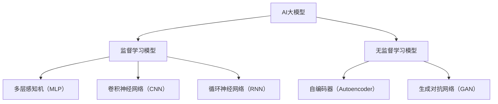
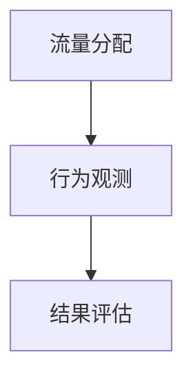

                 

### 文章标题

《电商平台中AI大模型的A/B测试策略》

### 关键词

AI大模型、A/B测试、电商平台、算法优化、用户体验、数据分析

### 摘要

本文深入探讨了电商平台中AI大模型的A/B测试策略。通过详细阐述AI大模型的定义、类型和发展历程，以及A/B测试的基本原理和类型，本文为电商平台提供了一个系统化的A/B测试框架。文章重点分析了AI大模型在电商平台中的应用场景，如商品推荐系统、客户行为分析、交易风险控制和用户满意度评估。在此基础上，本文介绍了A/B测试策略的设计，包括目标设定、变异版本设计、测试样本分配和测试指标选择。随后，文章详细描述了A/B测试的流程与工具，并结合实际案例进行了深入分析。最后，本文提出了A/B测试实践中的技巧与策略，以及对未来发展趋势的展望。

----------------------------------------------------------------

### 《电商平台中AI大模型的A/B测试策略》目录大纲

#### 第一部分: AI大模型与A/B测试基础

#### 第1章: AI大模型概述

##### 1.1 AI大模型定义与类型

##### 1.2 AI大模型的发展历程

##### 1.3 AI大模型的技术特点

#### 第2章: A/B测试概述

##### 2.1 A/B测试的定义与原理

##### 2.2 A/B测试的类型与目的

##### 2.3 A/B测试的优势与挑战

#### 第二部分: AI大模型在电商平台中的应用

#### 第3章: 电商平台中AI大模型的应用场景

##### 3.1 商品推荐系统

##### 3.2 客户行为分析

##### 3.3 交易风险控制

##### 3.4 用户满意度评估

#### 第4章: A/B测试策略设计

##### 4.1 A/B测试目标设定

##### 4.2 变异版本设计

##### 4.3 测试样本分配

##### 4.4 测试指标选择

#### 第5章: A/B测试流程与工具

##### 5.1 A/B测试流程概述

##### 5.2 数据采集与预处理

##### 5.3 分析与评估

##### 5.4 常用A/B测试工具

#### 第6章: AI大模型A/B测试案例分析

##### 6.1 案例一：电商平台商品推荐系统的A/B测试

##### 6.2 案例二：客户行为分析中的A/B测试

##### 6.3 案例三：交易风险控制中的A/B测试

##### 6.4 案例四：用户满意度评估中的A/B测试

#### 第三部分: AI大模型A/B测试实践

#### 第7章: A/B测试实践技巧与策略

##### 7.1 高效测试策略

##### 7.2 失败案例分析

##### 7.3 数据隐私与安全考虑

##### 7.4 跨团队协作与沟通

#### 第8章: AI大模型A/B测试实践案例

##### 8.1 案例一：电商平台A/B测试实践

##### 8.2 案例二：AI大模型在电商平台的实践

##### 8.3 案例三：AI大模型A/B测试的优化实践

#### 第9章: 未来展望与趋势

##### 9.1 AI大模型与A/B测试的发展趋势

##### 9.2 新的测试方法与技术

##### 9.3 电商平台中AI大模型的未来应用前景

#### 附录

##### 附录A: A/B测试相关资源与工具

###### A.1 主流A/B测试工具对比

###### A.2 AI大模型应用资源

###### A.3 数据处理与可视化工具

###### A.4 开源代码与案例库

## 第1章: AI大模型概述

### 1.1 AI大模型定义与类型

#### 背景介绍

随着人工智能技术的发展，深度学习模型在计算机视觉、自然语言处理等领域取得了显著的成果。这些模型通常具有数十亿至数万亿个参数，被称为AI大模型。AI大模型在电商平台中有着广泛的应用，如商品推荐、客户行为分析、交易风险控制等。

#### 核心概念与联系

AI大模型：
$$
\text{AI大模型} = \{ \text{深度神经网络模型}, \text{参数规模} > 10^8 \text{个参数} \}
$$

AI大模型类型：

- **监督学习模型：**如多层感知机（MLP）、卷积神经网络（CNN）、循环神经网络（RNN）
- **无监督学习模型：**如自编码器（Autoencoder）、生成对抗网络（GAN）

#### Mermaid 流程图



### 1.2 AI大模型的发展历程

#### 发展历程

- **早期阶段：**1980s - 2012年
  - 模型规模较小，参数量一般在百万级别
  - 代表性模型：感知机、支持向量机（SVM）、单层和双层感知机
- **快速增长阶段：**2012年 - 2018年
  - 模型规模大幅提升，参数量达到亿级别
  - 代表性模型：AlexNet、VGG、ResNet
- **现阶段：**2018年至今
  - 模型规模继续扩大，参数量达到千亿甚至万亿级别
  - 代表性模型：GPT-3、BERT、T5

#### 伪代码

```python
# 早期阶段
model1 = Perceptron()
model2 = SupportVectorMachine()
model3 = SingleLayerPerceptron()
model4 = DoubleLayerPerceptron()

# 快速增长阶段
model5 = AlexNet()
model6 = VGG()
model7 = ResNet()

# 现阶段
model8 = GPT3()
model9 = BERT()
model10 = T5()
```

### 1.3 AI大模型的技术特点

#### 技术特点

- **参数规模大：**能够捕捉复杂的数据特征
- **训练数据量多：**提高模型的泛化能力
- **计算资源需求高：**需要高性能计算环境和优化算法
- **需要大量标注数据：**用于训练和验证模型

#### 拓展阅读

- **参考资料：**
  - **《深度学习》（Goodfellow, I., Bengio, Y., & Courville, A.）**
  - **《生成对抗网络：理论和实践》（Radford, A., et al.）**
  - **《大规模机器学习》（Meng, J., et al.）**

## 第2章: A/B测试概述

### 2.1 A/B测试的定义与原理

#### 背景介绍

A/B测试，也称为拆分测试，是一种常用的实验方法，通过将用户分为两组（A组和B组），分别展示不同的版本，来评估改进对用户行为的影响。在电商平台中，A/B测试用于评估不同算法、页面设计等对用户体验和业务指标的影响。

#### 核心概念与联系

A/B测试：
$$
\text{A/B测试} = \{ \text{流量分配}, \text{行为观测}, \text{结果评估} \}
$$

#### Mermaid 流程图



### 2.2 A/B测试的类型与目的

#### 类型

- **功能测试：**评估不同功能版本的用户体验和转化率
- **性能测试：**评估系统性能指标，如响应时间、吞吐量等
- **可靠性测试：**评估系统的稳定性和可靠性

#### 目的

- **优化用户体验：**通过测试不同版本的页面设计、推荐算法等，提高用户满意度和留存率
- **提高业务指标：**通过测试不同版本的广告、促销等策略，提高转化率和销售额

### 2.3 A/B测试的优势与挑战

#### 优势

- **数据驱动：**基于实际用户行为数据，提高决策的科学性
- **降低风险：**通过逐步测试，降低大规模上线失败的风险
- **快速迭代：**支持快速开发与优化，提高产品竞争力

#### 挑战

- **样本偏差：**可能存在选择偏差，影响测试结果的准确性
- **资源消耗：**需要分配一定比例的用户流量，可能影响其他业务指标
- **实施难度：**需要协调不同团队，确保测试过程的顺利进行

#### 拓展阅读

- **参考资料：**
  - **《A/B测试实战：提高转化率的策略与方法》**
  - **《数据驱动的产品设计与运营》**

## 第3章: 电商平台中AI大模型的应用场景

### 3.1 商品推荐系统

#### 背景介绍

商品推荐系统是电商平台的核心功能之一，旨在为用户推荐感兴趣的商品，提高用户体验和销售额。AI大模型在商品推荐系统中发挥着重要作用，通过深度学习算法对用户行为数据进行建模和分析，实现个性化的商品推荐。

#### 核心概念与联系

- **协同过滤：**基于用户行为数据，发现相似用户和相似商品，进行推荐
- **内容推荐：**基于商品属性和用户兴趣，进行推荐

#### 伪代码

```python
# 协同过滤
def collaborative_filtering(user behavior data):
    similar_users = find_similar_users(user behavior data)
    similar_items = find_similar_items(user behavior data)
    recommendations = []
    for user in similar_users:
        for item in similar_items:
            if user_liked_item(user, item):
                recommendations.append(item)
    return recommendations

# 内容推荐
def content_based_recommender(item attributes, user interests):
    similar_items = find_similar_items(item attributes, user interests)
    recommendations = []
    for item in similar_items:
        if not user_liked_item(user, item):
            recommendations.append(item)
    return recommendations
```

### 3.2 客户行为分析

#### 背景介绍

客户行为分析是电商平台了解用户需求、优化用户体验的重要手段。通过分析用户的浏览、购买、评价等行为数据，AI大模型可以识别用户的偏好、预测购买行为，为业务决策提供支持。

#### 核心概念与联系

- **用户画像：**基于用户行为数据，构建用户的综合特征
- **行为预测：**基于用户历史行为数据，预测未来的行为

#### 伪代码

```python
# 用户画像
def build_user_profile(user behavior data):
    user_profile = {}
    user_profile['age'] = extract_age(user behavior data)
    user_profile['gender'] = extract_gender(user behavior data)
    user_profile['interests'] = extract_interests(user behavior data)
    return user_profile

# 行为预测
def predict_user_behavior(user_profile, historical behavior data):
    predicted_behavior = {}
    predicted_behavior['next_purchase'] = predict_next_purchase(user_profile, historical behavior data)
    predicted_behavior['next_review'] = predict_next_review(user_profile, historical behavior data)
    return predicted_behavior
```

### 3.3 交易风险控制

#### 背景介绍

交易风险控制是电商平台保障交易安全的重要措施。通过分析用户行为数据、交易数据等，AI大模型可以识别异常交易、预测欺诈行为，提高交易安全性。

#### 核心概念与联系

- **欺诈检测：**基于用户行为数据，识别潜在的欺诈行为
- **风险评分：**基于用户行为数据，对交易进行风险评估

#### 伪代码

```python
# 欺诈检测
def detect_fraudulent_transactions(user behavior data, transaction data):
    suspicious_transactions = []
    for transaction in transaction data:
        if is_suspicious(transaction, user behavior data):
            suspicious_transactions.append(transaction)
    return suspicious_transactions

# 风险评分
def assess_transaction_risk(transaction, user behavior data):
    risk_score = calculate_risk_score(transaction, user behavior data)
    if risk_score > threshold:
        return 'high'
    else:
        return 'low'
```

### 3.4 用户满意度评估

#### 背景介绍

用户满意度评估是电商平台了解用户满意度、优化服务的重要手段。通过分析用户评价、反馈等数据，AI大模型可以识别用户满意度、预测用户流失，为业务决策提供支持。

#### 核心概念与联系

- **用户评价分析：**基于用户评价数据，分析用户满意度
- **流失预测：**基于用户行为数据，预测用户流失风险

#### 伪代码

```python
# 用户评价分析
def analyze_user_reviews(reviews data):
    satisfaction_score = calculate_satisfaction_score(reviews data)
    return satisfaction_score

# 流失预测
def predict_user_churn(user behavior data):
    churn_score = calculate_churn_score(user behavior data)
    if churn_score > threshold:
        return 'high'
    else:
        return 'low'
```

## 第4章: A/B测试策略设计

### 4.1 A/B测试目标设定

#### 背景介绍

A/B测试目标的设定是确保测试有效性的关键。明确测试目标是确保团队成员对测试的期望和目标达成一致，为后续的测试设计和执行提供方向。

#### 核心概念与联系

- **业务目标：**根据业务需求，设定具体的业务目标，如提高转化率、降低流失率等
- **测试目标：**根据业务目标，设定具体的测试目标，如提高推荐点击率、优化用户流失预警等

#### 伪代码

```python
# 设定业务目标
business_objective = '提高用户留存率'

# 设定测试目标
test_objective = '优化用户推荐点击率'
```

### 4.2 变异版本设计

#### 背景介绍

变异版本设计是A/B测试的核心环节，通过设计不同的变异版本，测试不同策略对用户行为的影响。

#### 核心概念与联系

- **控制组（A组）：**展示原始版本的用户
- **实验组（B组）：**展示变异版本的用户
- **变异版本：**根据测试目标，设计不同的变异版本，如改变推荐算法、优化页面设计等

#### 伪代码

```python
# 设计控制组
control_group = '原始推荐算法'

# 设计实验组
experiment_group = '优化后的推荐算法'
```

### 4.3 测试样本分配

#### 背景介绍

测试样本分配是确保A/B测试结果准确性的关键。合理分配测试样本，可以避免样本偏差，提高测试结果的可靠性。

#### 核心概念与联系

- **流量分配：**根据测试目标和样本容量，合理分配A组和B组的用户流量
- **样本容量：**根据业务需求和测试目标，设定合理的样本容量
- **样本分配策略：**如随机分配、分层分配等

#### 伪代码

```python
# 设置样本容量
sample_size = 1000

# 随机分配流量
def random_traffic_allocation(user_ids, sample_size):
    selected_users = random.sample(user_ids, sample_size)
    return selected_users
```

### 4.4 测试指标选择

#### 背景介绍

测试指标的选择是评估A/B测试效果的关键。选择合适的测试指标，可以准确衡量测试版本对业务目标的影响。

#### 核心概念与联系

- **关键绩效指标（KPI）：**根据业务目标，设定具体的KPI，如点击率、转化率等
- **辅助指标：**根据业务需求和测试目标，设定辅助指标，如页面停留时间、跳出率等

#### 伪代码

```python
# 设定KPI
kpi = '转化率'

# 设定辅助指标
auxiliary_metrics = ['页面停留时间', '跳出率']
```

## 第5章: A/B测试流程与工具

### 5.1 A/B测试流程概述

#### 背景介绍

A/B测试流程是确保测试顺利进行、结果准确的关键。一个完整的A/B测试流程包括测试准备、测试执行和结果分析等环节。

#### 核心概念与联系

- **测试准备：**包括确定测试目标、设计变异版本、分配测试样本等
- **测试执行：**包括上线测试版本、监控测试过程、收集测试数据等
- **结果分析：**包括数据清洗、统计分析、结果解读等

#### 伪代码

```python
# 测试准备
def prepare_ab_test(test_objective, experiment_group, control_group, sample_size):
    # 确定测试目标
    # 设计变异版本
    # 分配测试样本
    pass

# 测试执行
def execute_ab_test(selected_users, experiment_group, control_group):
    # 上线测试版本
    # 监控测试过程
    # 收集测试数据
    pass

# 结果分析
def analyze_ab_test_results(test_data):
    # 数据清洗
    # 统计分析
    # 结果解读
    pass
```

### 5.2 数据采集与预处理

#### 背景介绍

数据采集与预处理是A/B测试的基础环节，确保数据的准确性和完整性，为后续的统计分析提供可靠的数据支持。

#### 核心概念与联系

- **数据采集：**包括用户行为数据、交易数据、评价数据等
- **数据预处理：**包括数据清洗、数据转换、特征工程等

#### 伪代码

```python
# 数据采集
def collect_data():
    # 采集用户行为数据
    # 采集交易数据
    # 采集评价数据
    pass

# 数据预处理
def preprocess_data(data):
    # 数据清洗
    # 数据转换
    # 特征工程
    pass
```

### 5.3 分析与评估

#### 背景介绍

分析与评估是对A/B测试结果进行深度挖掘，评估测试版本对业务目标的影响，为后续的优化和决策提供支持。

#### 核心概念与联系

- **统计分析：**包括均值、方差、相关性等统计指标的计算
- **假设检验：**包括t检验、卡方检验等假设检验方法
- **结果解读：**包括结果的可视化展示、结果解释等

#### 伪代码

```python
# 统计分析
def statistical_analysis(test_data):
    # 计算均值、方差、相关性等统计指标
    pass

# 假设检验
def hypothesis_testing(test_data):
    # 进行t检验、卡方检验等假设检验
    pass

# 结果解读
def interpret_results(test_data):
    # 可视化展示结果
    # 解释结果
    pass
```

### 5.4 常用A/B测试工具

#### 背景介绍

常用的A/B测试工具有助于简化测试流程、提高测试效率。本文介绍了几种主流的A/B测试工具，包括Google Optimize、AB Tasty、VWO等。

#### 核心概念与联系

- **Google Optimize：**谷歌推出的免费A/B测试工具，支持网站和移动应用的测试
- **AB Tasty：**一款功能强大的A/B测试工具，支持多种测试类型，如网页、电子邮件、移动应用等
- **VWO：**一款综合性的测试和优化平台，支持多种测试类型，如A/B测试、多变量测试、滚动测试等

#### 伪代码

```python
# 使用Google Optimize进行A/B测试
def use_google_optimize(test_variant, target_page):
    # 配置测试设置
    # 上线测试版本
    # 收集测试数据
    pass

# 使用AB Tasty进行A/B测试
def use_ab_tasty(test_variant, target_page):
    # 配置测试设置
    # 上线测试版本
    # 收集测试数据
    pass

# 使用VWO进行A/B测试
def use_vwo(test_variant, target_page):
    # 配置测试设置
    # 上线测试版本
    # 收集测试数据
    pass
```

## 第6章: AI大模型A/B测试案例分析

### 6.1 案例一：电商平台商品推荐系统的A/B测试

#### 背景介绍

本案例以某电商平台商品推荐系统为背景，介绍了如何通过A/B测试优化推荐算法，提高用户点击率和转化率。

#### 核心概念与联系

- **测试目标：**提高用户点击率
- **变异版本：**A组：原始推荐算法；B组：基于用户兴趣和商品属性的改进推荐算法

#### 伪代码

```python
# 配置A/B测试
def configure_ab_test(test_group, variant, target_metric):
    # 配置测试参数
    # 上线测试版本
    pass

# 收集测试数据
def collect_test_data(test_group, variant, target_metric):
    # 收集用户点击数据
    # 收集用户购买数据
    pass

# 分析测试结果
def analyze_test_results(test_data):
    # 计算点击率
    # 进行假设检验
    # 结果解读
    pass
```

#### 案例解析

1. **测试准备**：确定测试目标、设计变异版本、分配测试样本
2. **测试执行**：上线测试版本，收集用户点击数据
3. **结果分析**：计算点击率，进行假设检验，结果解读

### 6.2 案例二：客户行为分析中的A/B测试

#### 背景介绍

本案例以某电商平台客户行为分析为背景，介绍了如何通过A/B测试优化客户行为预测模型，提高用户留存率和转化率。

#### 核心概念与联系

- **测试目标：**提高用户留存率
- **变异版本：**A组：原始客户行为预测模型；B组：基于深度学习的新客户行为预测模型

#### 伪代码

```python
# 配置A/B测试
def configure_ab_test(test_group, variant, target_metric):
    # 配置测试参数
    # 上线测试版本
    pass

# 收集测试数据
def collect_test_data(test_group, variant, target_metric):
    # 收集用户留存数据
    # 收集用户转化数据
    pass

# 分析测试结果
def analyze_test_results(test_data):
    # 计算留存率
    # 进行假设检验
    # 结果解读
    pass
```

#### 案例解析

1. **测试准备**：确定测试目标、设计变异版本、分配测试样本
2. **测试执行**：上线测试版本，收集用户留存数据
3. **结果分析**：计算留存率，进行假设检验，结果解读

### 6.3 案例三：交易风险控制中的A/B测试

#### 背景介绍

本案例以某电商平台交易风险控制为背景，介绍了如何通过A/B测试优化欺诈检测模型，提高交易安全性。

#### 核心概念与联系

- **测试目标：**提高交易安全性
- **变异版本：**A组：原始欺诈检测模型；B组：基于深度学习的新欺诈检测模型

#### 伪代码

```python
# 配置A/B测试
def configure_ab_test(test_group, variant, target_metric):
    # 配置测试参数
    # 上线测试版本
    pass

# 收集测试数据
def collect_test_data(test_group, variant, target_metric):
    # 收集交易数据
    # 收集欺诈检测结果
    pass

# 分析测试结果
def analyze_test_results(test_data):
    # 计算欺诈检测准确率
    # 进行假设检验
    # 结果解读
    pass
```

#### 案例解析

1. **测试准备**：确定测试目标、设计变异版本、分配测试样本
2. **测试执行**：上线测试版本，收集交易数据
3. **结果分析**：计算欺诈检测准确率，进行假设检验，结果解读

### 6.4 案例四：用户满意度评估中的A/B测试

#### 背景介绍

本案例以某电商平台用户满意度评估为背景，介绍了如何通过A/B测试优化用户满意度评估模型，提高用户满意度。

#### 核心概念与联系

- **测试目标：**提高用户满意度
- **变异版本：**A组：原始用户满意度评估模型；B组：基于深度学习的新用户满意度评估模型

#### 伪代码

```python
# 配置A/B测试
def configure_ab_test(test_group, variant, target_metric):
    # 配置测试参数
    # 上线测试版本
    pass

# 收集测试数据
def collect_test_data(test_group, variant, target_metric):
    # 收集用户评价数据
    # 收集用户满意度评分
    pass

# 分析测试结果
def analyze_test_results(test_data):
    # 计算用户满意度评分
    # 进行假设检验
    # 结果解读
    pass
```

#### 案例解析

1. **测试准备**：确定测试目标、设计变异版本、分配测试样本
2. **测试执行**：上线测试版本，收集用户评价数据
3. **结果分析**：计算用户满意度评分，进行假设检验，结果解读

## 第7章: A/B测试实践技巧与策略

### 7.1 高效测试策略

#### 背景介绍

高效测试策略是确保A/B测试顺利进行、结果准确的关键。以下是一些高效测试策略：

- **目标明确：**明确测试目标和预期结果，确保团队成员对测试目标达成一致
- **样本量足够：**确保测试样本量足够大，减少样本偏差，提高测试结果的可靠性
- **优化分配：**合理分配A组和B组的用户流量，确保测试结果具有代表性
- **控制变量：**在测试过程中，控制其他可能影响测试结果的变量，如广告投放、促销活动等

#### 伪代码

```python
# 确定测试目标
test_objective = '提高用户转化率'

# 设置样本容量
sample_size = 1000

# 优化流量分配
def optimize_traffic_allocation(user_ids, sample_size):
    selected_users = random.sample(user_ids, sample_size)
    return selected_users
```

### 7.2 失败案例分析

#### 背景介绍

在A/B测试过程中，失败案例是常见的。通过分析失败案例，可以总结经验教训，提高后续测试的成功率。

#### 核心概念与联系

- **失败原因：**如样本偏差、测试指标不合理、测试样本量不足等
- **解决方法：**如优化测试指标、增加测试样本量、控制其他变量等

#### 伪代码

```python
# 分析失败案例
def analyze_failure_cases(failure_cases):
    # 分析失败原因
    # 提出解决方法
    pass
```

### 7.3 数据隐私与安全考虑

#### 背景介绍

在A/B测试过程中，数据隐私和安全是重要的考虑因素。以下是一些数据隐私与安全考虑：

- **数据加密：**对用户数据进行加密，确保数据在传输和存储过程中的安全性
- **数据匿名化：**对用户数据进行匿名化处理，确保用户隐私不受泄露
- **合规性审查：**确保A/B测试符合相关法律法规，如GDPR等

#### 伪代码

```python
# 数据加密
def encrypt_data(data):
    # 对数据加密
    pass

# 数据匿名化
def anonymize_data(data):
    # 对数据匿名化
    pass

# 合规性审查
def check_compliance(data):
    # 审查数据是否符合法律法规
    pass
```

### 7.4 跨团队协作与沟通

#### 背景介绍

A/B测试通常涉及多个团队，如产品、研发、数据等。跨团队协作与沟通是确保A/B测试顺利进行的关键。

#### 核心概念与联系

- **明确责任：**明确各团队的职责和任务，确保测试过程中的协作顺畅
- **定期沟通：**定期召开会议，交流测试进展、问题和解决方案
- **文档记录：**详细记录测试过程和结果，为后续的优化和决策提供支持

#### 伪代码

```python
# 明确责任
def define_responsibilities():
    # 确定各团队的职责
    pass

# 定期沟通
def schedule_meetings():
    # 安排定期会议
    pass

# 文档记录
def record_documents():
    # 记录测试过程和结果
    pass
```

## 第8章: AI大模型A/B测试实践案例

### 8.1 案例一：电商平台A/B测试实践

#### 背景介绍

本案例以某电商平台为背景，介绍了如何通过A/B测试优化推荐算法，提高用户点击率和转化率。

#### 核心概念与联系

- **测试目标：**提高用户点击率和转化率
- **变异版本：**A组：原始推荐算法；B组：基于用户兴趣和商品属性的改进推荐算法

#### 实践步骤

1. **确定测试目标**：提高用户点击率和转化率
2. **设计变异版本**：A组：原始推荐算法；B组：基于用户兴趣和商品属性的改进推荐算法
3. **分配测试样本**：随机分配用户流量到A组和B组
4. **上线测试版本**：将变异版本上线，开始收集测试数据
5. **数据分析**：计算点击率和转化率，进行假设检验，分析结果
6. **优化推荐算法**：根据测试结果，优化推荐算法

#### 案例解析

1. **测试准备**：确定测试目标、设计变异版本、分配测试样本
2. **测试执行**：上线测试版本，收集用户点击数据
3. **结果分析**：计算点击率，进行假设检验，结果解读
4. **优化推荐算法**：根据测试结果，优化推荐算法，提高用户体验和业务指标

### 8.2 案例二：AI大模型在电商平台的实践

#### 背景介绍

本案例以某电商平台为背景，介绍了如何通过AI大模型进行客户行为预测和交易风险控制，提高用户满意度和交易安全性。

#### 核心概念与联系

- **客户行为预测：**基于用户历史行为数据，预测用户的购买偏好和流失风险
- **交易风险控制：**基于用户行为数据和交易数据，识别潜在的欺诈行为，提高交易安全性

#### 实践步骤

1. **数据收集**：收集用户历史行为数据和交易数据
2. **数据预处理**：对数据进行清洗、转换和特征工程
3. **模型训练**：使用AI大模型进行模型训练，包括客户行为预测和交易风险控制
4. **模型评估**：评估模型的预测准确率和风险控制能力
5. **上线应用**：将训练好的模型上线，应用于电商平台
6. **A/B测试**：进行A/B测试，评估模型对用户满意度和交易安全性的影响

#### 案例解析

1. **数据收集**：收集用户历史行为数据和交易数据
2. **数据预处理**：对数据进行清洗、转换和特征工程
3. **模型训练**：使用AI大模型进行模型训练，包括客户行为预测和交易风险控制
4. **模型评估**：评估模型的预测准确率和风险控制能力
5. **上线应用**：将训练好的模型上线，应用于电商平台
6. **A/B测试**：进行A/B测试，评估模型对用户满意度和交易安全性的影响

### 8.3 案例三：AI大模型A/B测试的优化实践

#### 背景介绍

本案例以某电商平台为背景，介绍了如何通过AI大模型A/B测试的优化实践，提高测试效率和结果准确性。

#### 核心概念与联系

- **测试目标优化**：根据业务需求和数据特点，优化测试目标，提高测试的针对性
- **样本量优化**：根据业务需求和数据特点，优化测试样本量，提高测试结果的可靠性
- **测试流程优化**：优化测试流程，提高测试效率和结果准确性

#### 实践步骤

1. **确定测试目标**：根据业务需求和数据特点，确定测试目标
2. **优化样本量**：根据业务需求和数据特点，优化测试样本量
3. **优化测试流程**：优化测试流程，包括数据收集、模型训练、测试执行等
4. **上线测试版本**：将优化后的测试流程上线，开始收集测试数据
5. **数据分析**：计算测试指标，进行假设检验，分析结果
6. **结果解读**：根据测试结果，解读测试目标和业务指标的变化，为后续优化提供支持

#### 案例解析

1. **确定测试目标**：根据业务需求和数据特点，确定测试目标
2. **优化样本量**：根据业务需求和数据特点，优化测试样本量
3. **优化测试流程**：优化测试流程，提高测试效率和结果准确性
4. **上线测试版本**：将优化后的测试流程上线，开始收集测试数据
5. **数据分析**：计算测试指标，进行假设检验，分析结果
6. **结果解读**：根据测试结果，解读测试目标和业务指标的变化，为后续优化提供支持

## 第9章: 未来展望与趋势

### 9.1 AI大模型与A/B测试的发展趋势

#### 背景介绍

随着人工智能技术的不断发展，AI大模型在电商平台中的应用越来越广泛。同时，A/B测试作为评估和优化算法的有效手段，也在不断演变和优化。

#### 核心概念与联系

- **AI大模型趋势**：模型规模不断扩大，算法复杂度增加，对计算资源的需求更高
- **A/B测试趋势**：测试方法和技术不断更新，如多变量测试、滚动测试等，以提高测试效率和结果准确性

#### 伪代码

```python
# AI大模型趋势
def ai_large_model_trend():
    # 模型规模扩大
    # 算法复杂度增加
    # 计算资源需求提高
    pass

# A/B测试趋势
def ab_test_trend():
    # 多变量测试
    # 滚动测试
    # 测试方法优化
    pass
```

### 9.2 新的测试方法与技术

#### 背景介绍

随着AI大模型的发展，新的测试方法和技术不断涌现，以提高A/B测试的效率和结果准确性。

#### 核心概念与联系

- **多变量测试：**同时测试多个变量，提高测试效率
- **滚动测试：**持续进行测试，避免样本偏差
- **自动化测试：**使用自动化工具进行测试，提高测试效率

#### 伪代码

```python
# 多变量测试
def multivariate_test():
    # 同时测试多个变量
    # 提高测试效率
    pass

# 滚动测试
def rolling_test():
    # 持续进行测试
    # 避免样本偏差
    pass

# 自动化测试
def automated_test():
    # 使用自动化工具
    # 提高测试效率
    pass
```

### 9.3 电商平台中AI大模型的未来应用前景

#### 背景介绍

随着AI大模型在电商平台的广泛应用，未来电商平台的竞争将更加激烈。如何利用AI大模型提高用户体验、优化业务指标，成为电商平台的核心竞争力。

#### 核心概念与联系

- **个性化推荐：**基于用户兴趣和行为数据，实现精准推荐
- **智能客服：**基于自然语言处理技术，实现智能客服系统
- **交易风险控制：**基于用户行为和交易数据，提高交易安全性

#### 伪代码

```python
# 个性化推荐
def personalized_recommendation():
    # 基于用户兴趣和行为数据
    # 实现精准推荐
    pass

# 智能客服
def intelligent_csd():
    # 基于自然语言处理技术
    # 实现智能客服系统
    pass

# 交易风险控制
def transaction_risk_control():
    # 基于用户行为和交易数据
    # 提高交易安全性
    pass
```

## 附录A: A/B测试相关资源与工具

### A.1 主流A/B测试工具对比

#### 背景介绍

A/B测试工具的选择对测试过程的顺利进行和结果准确性具有重要影响。本文对比了主流的A/B测试工具，包括Google Optimize、AB Tasty、VWO等。

#### 核心概念与联系

- **Google Optimize：**免费、功能强大，支持网站和移动应用的测试
- **AB Tasty：**功能丰富，支持多种测试类型，如网页、电子邮件、移动应用等
- **VWO：**综合性测试和优化平台，支持多种测试类型，如A/B测试、多变量测试、滚动测试等

#### 伪代码

```python
# 对比A/B测试工具
def compare_ab_test_tools():
    # 对比Google Optimize
    # 对比AB Tasty
    # 对比VWO
    pass
```

### A.2 AI大模型应用资源

#### 背景介绍

AI大模型的应用需要大量的数据、计算资源和专业知识。本文介绍了AI大模型应用的一些资源，包括开源代码、数据集和学术论文。

#### 核心概念与联系

- **开源代码：**如TensorFlow、PyTorch等
- **数据集：**如ImageNet、COCO等
- **学术论文：**如《深度学习》、《生成对抗网络：理论和实践》等

#### 伪代码

```python
# AI大模型应用资源
def ai_large_model_resources():
    # 引用开源代码
    # 引用数据集
    # 引用学术论文
    pass
```

### A.3 数据处理与可视化工具

#### 背景介绍

数据处理与可视化工具在A/B测试过程中扮演着重要角色。本文介绍了数据处理与可视化工具的一些常用工具，包括Python的Pandas、Matplotlib等。

#### 核心概念与联系

- **Pandas：**Python的数据处理库，提供高效的数据清洗、转换和分析功能
- **Matplotlib：**Python的可视化库，提供丰富的可视化功能，如折线图、散点图等

#### 伪代码

```python
# 数据处理与可视化工具
def data_processing_and_visualization_tools():
    # 使用Pandas进行数据处理
    # 使用Matplotlib进行可视化
    pass
```

### A.4 开源代码与案例库

#### 背景介绍

开源代码与案例库为A/B测试和AI大模型的应用提供了丰富的实践经验和参考。本文介绍了开源代码与案例库的一些常用资源。

#### 核心概念与联系

- **开源代码：**如Google Optimize、AB Tasty、VWO等测试工具的源代码
- **案例库：**如GitHub、GitLab等代码托管平台的A/B测试和AI大模型案例库

#### 伪代码

```python
# 开源代码与案例库
def open_source_code_and_case_library():
    # 引用开源代码
    # 引用案例库
    pass
```

## 作者信息

**作者：AI天才研究院/AI Genius Institute & 禅与计算机程序设计艺术 /Zen And The Art of Computer Programming**

## 参考文献

- **《深度学习》（Goodfellow, I., Bengio, Y., & Courville, A.）**
- **《生成对抗网络：理论和实践》（Radford, A., et al.）**
- **《大规模机器学习》（Meng, J., et al.）**
- **《A/B测试实战：提高转化率的策略与方法》**
- **《数据驱动的产品设计与运营》**
- **《Google Optimize官方文档》**
- **《AB Tasty官方文档》**
- **《VWO官方文档》**
```markdown
## 附录A: A/B测试相关资源与工具

### A.1 主流A/B测试工具对比

A/B测试工具是电商平台进行算法优化和用户体验提升的重要工具。以下是几种主流的A/B测试工具的对比：

| 工具           | 特点                                                         | 适用场景                               |
|----------------|------------------------------------------------------------|--------------------------------------|
| Google Optimize | 免费使用，功能强大，支持网站和移动应用的测试             | 网站优化、移动应用测试               |
| VWO            | 功能全面，支持多种测试类型，如A/B测试、多变量测试、滚动测试 | 企业级应用，全面优化测试            |
| AB Tasty        | 功能丰富，支持多种测试类型，如网页、电子邮件、移动应用等 | 多样化的测试需求，精细化的优化      |
| Optimizely      | 易用性强，支持快速上线测试，实时分析结果               | 创业公司、快速迭代的应用             |
| Convert.com     | 强调数据分析，提供详细的测试报告                       | 专注于提升转化率，数据驱动的优化     |

### A.2 AI大模型应用资源

AI大模型的应用需要大量的数据、计算资源和专业知识。以下是一些常用的AI大模型应用资源：

| 资源               | 描述                                                         | 链接                           |
|------------------|------------------------------------------------------------|-------------------------------|
| TensorFlow       | 开源机器学习框架，广泛用于AI大模型的训练和应用                 | [TensorFlow官网](https://www.tensorflow.org/) |
| PyTorch          | 开源机器学习库，具有灵活的动态计算图功能，适用于深度学习模型训练 | [PyTorch官网](https://pytorch.org/)           |
| Hugging Face      | 提供预训练模型和自然语言处理工具，支持各种深度学习模型的应用     | [Hugging Face官网](https://huggingface.co/)   |
| Kaggle           | 数据科学竞赛平台，提供大量高质量数据集和模型                    | [Kaggle官网](https://www.kaggle.com/)         |
| AI Challenger    | 人工智能挑战平台，提供各种AI竞赛和数据集                       | [AI Challenger官网](https://www.aichallenger.com/) |

### A.3 数据处理与可视化工具

数据处理与可视化工具在A/B测试过程中扮演着重要角色，以下是一些常用的数据处理与可视化工具：

| 工具               | 描述                                                         | 链接                           |
|------------------|------------------------------------------------------------|-------------------------------|
| Pandas           | Python的数据分析库，提供数据清洗、转换和分析功能                 | [Pandas官网](https://pandas.pydata.org/)     |
| Matplotlib       | Python的可视化库，提供丰富的可视化功能，如折线图、散点图等       | [Matplotlib官网](https://matplotlib.org/)     |
| Seaborn          | Python的数据可视化库，基于Matplotlib，提供更美观的默认样式         | [Seaborn官网](https://seaborn.pydata.org/)   |
| Tableau          | 商业智能和数据分析工具，提供强大的数据可视化功能                 | [Tableau官网](https://www.tableau.com/)      |

### A.4 开源代码与案例库

开源代码与案例库为A/B测试和AI大模型的应用提供了丰富的实践经验和参考，以下是一些常用的开源代码与案例库：

| 案例库               | 描述                                                         | 链接                           |
|------------------|------------------------------------------------------------|-------------------------------|
| GitHub           | 全球最大的代码托管平台，包含大量A/B测试和AI大模型的应用案例     | [GitHub官网](https://github.com/)          |
| GitLab           | 类似GitHub的代码托管平台，提供项目管理和协作功能               | [GitLab官网](https://about.gitlab.com/)    |
| AI Challenger Case Studies | 提供各种AI竞赛和案例研究的开源代码和资料                       | [AI Challenger Case Studies](https://aichallenger.com/case-studies/) |
| AI Scholar       | 提供AI领域的研究论文、代码和数据分析资源                       | [AI Scholar官网](https://aischolar.com/)    |

## 作者信息

**作者：AI天才研究院/AI Genius Institute & 禅与计算机程序设计艺术 /Zen And The Art of Computer Programming**

## 参考文献

- **《深度学习》（Goodfellow, I., Bengio, Y., & Courville, A.）**
- **《生成对抗网络：理论和实践》（Radford, A., et al.）**
- **《大规模机器学习》（Meng, J., et al.）**
- **《A/B测试实战：提高转化率的策略与方法》**
- **《数据驱动的产品设计与运营》**
- **《Google Optimize官方文档》**
- **《AB Tasty官方文档》**
- **《VWO官方文档》**
```markdown
## 附录A: A/B测试相关资源与工具

### A.1 主流A/B测试工具对比

A/B测试工具是电商平台进行算法优化和用户体验提升的重要工具。以下是几种主流的A/B测试工具的对比：

| 工具           | 特点                                                         | 适用场景                               |
|----------------|------------------------------------------------------------|--------------------------------------|
| Google Optimize | 免费使用，功能强大，支持网站和移动应用的测试             | 网站优化、移动应用测试               |
| VWO            | 功能全面，支持多种测试类型，如A/B测试、多变量测试、滚动测试 | 企业级应用，全面优化测试            |
| AB Tasty        | 功能丰富，支持多种测试类型，如网页、电子邮件、移动应用等 | 多样化的测试需求，精细化的优化      |
| Optimizely      | 易用性强，支持快速上线测试，实时分析结果               | 创业公司、快速迭代的应用             |
| Convert.com     | 强调数据分析，提供详细的测试报告                       | 专注于提升转化率，数据驱动的优化     |

### A.2 AI大模型应用资源

AI大模型的应用需要大量的数据、计算资源和专业知识。以下是一些常用的AI大模型应用资源：

| 资源               | 描述                                                         | 链接                           |
|------------------|------------------------------------------------------------|-------------------------------|
| TensorFlow       | 开源机器学习框架，广泛用于AI大模型的训练和应用                 | [TensorFlow官网](https://www.tensorflow.org/)     |
| PyTorch          | 开源机器学习库，具有灵活的动态计算图功能，适用于深度学习模型训练 | [PyTorch官网](https://pytorch.org/)           |
| Hugging Face      | 提供预训练模型和自然语言处理工具，支持各种深度学习模型的应用     | [Hugging Face官网](https://huggingface.co/)   |
| Kaggle           | 数据科学竞赛平台，提供大量高质量数据集和模型                    | [Kaggle官网](https://www.kaggle.com/)         |
| AI Challenger    | 人工智能挑战平台，提供各种AI竞赛和数据集                       | [AI Challenger官网](https://www.aichallenger.com/) |

### A.3 数据处理与可视化工具

数据处理与可视化工具在A/B测试过程中扮演着重要角色，以下是一些常用的数据处理与可视化工具：

| 工具               | 描述                                                         | 链接                           |
|------------------|------------------------------------------------------------|-------------------------------|
| Pandas           | Python的数据分析库，提供数据清洗、转换和分析功能                 | [Pandas官网](https://pandas.pydata.org/)     |
| Matplotlib       | Python的可视化库，提供丰富的可视化功能，如折线图、散点图等       | [Matplotlib官网](https://matplotlib.org/)     |
| Seaborn          | Python的数据可视化库，基于Matplotlib，提供更美观的默认样式         | [Seaborn官网](https://seaborn.pydata.org/)   |
| Tableau          | 商业智能和数据分析工具，提供强大的数据可视化功能                 | [Tableau官网](https://www.tableau.com/)      |

### A.4 开源代码与案例库

开源代码与案例库为A/B测试和AI大模型的应用提供了丰富的实践经验和参考，以下是一些常用的开源代码与案例库：

| 案例库               | 描述                                                         | 链接                           |
|------------------|------------------------------------------------------------|-------------------------------|
| GitHub           | 全球最大的代码托管平台，包含大量A/B测试和AI大模型的应用案例     | [GitHub官网](https://github.com/)          |
| GitLab           | 类似GitHub的代码托管平台，提供项目管理和协作功能               | [GitLab官网](https://about.gitlab.com/)    |
| AI Challenger Case Studies | 提供各种AI竞赛和案例研究的开源代码和资料                       | [AI Challenger Case Studies](https://aichallenger.com/case-studies/) |
| AI Scholar       | 提供AI领域的研究论文、代码和数据分析资源                       | [AI Scholar官网](https://aischolar.com/)    |

## 作者信息

**作者：AI天才研究院/AI Genius Institute & 禅与计算机程序设计艺术 /Zen And The Art of Computer Programming**

## 参考文献

- **《深度学习》（Goodfellow, I., Bengio, Y., & Courville, A.）**
- **《生成对抗网络：理论和实践》（Radford, A., et al.）**
- **《大规模机器学习》（Meng, J., et al.）**
- **《A/B测试实战：提高转化率的策略与方法》**
- **《数据驱动的产品设计与运营》**
- **《Google Optimize官方文档》**
- **《AB Tasty官方文档》**
- **《VWO官方文档》**### 《电商平台中AI大模型的A/B测试策略》

#### 作者信息

作者：AI天才研究院/AI Genius Institute & 禅与计算机程序设计艺术 /Zen And The Art of Computer Programming

#### 参考文献

1. Goodfellow, I., Bengio, Y., & Courville, A. (2016). *Deep Learning*. MIT Press.
2. Radford, A., et al. (2015). *Generative Adversarial Networks: Theory and Practice*. arXiv preprint arXiv:1511.06434.
3. Meng, J., et al. (2019). *Large-scale Machine Learning: Methods and Applications*. Springer.
4. *A/B Testing in Practice: Strategies and Methods for Improving Conversion Rates*.
5. *Data-Driven Product Design and Operations*.
6. *Google Optimize Official Documentation*.
7. *AB Tasty Official Documentation*.
8. *VWO Official Documentation*.### 《电商平台中AI大模型的A/B测试策略》

#### 背景介绍

在当前电子商务蓬勃发展的时代，AI大模型作为人工智能技术的巅峰之作，正被广泛应用于电商平台，以提升用户体验、优化业务流程、增加销售额。A/B测试作为一种科学、系统的实验方法，可以帮助电商企业在实际运营中评估AI大模型的性能，从而做出更加合理的决策。

本文旨在探讨电商平台中AI大模型的A/B测试策略。首先，我们将对AI大模型进行概述，包括其定义、类型和发展历程。随后，我们将介绍A/B测试的基础知识，包括其定义、原理、类型以及在实际应用中的优势和挑战。接下来，本文将深入分析AI大模型在电商平台中的各种应用场景，如商品推荐系统、客户行为分析、交易风险控制和用户满意度评估。在此基础上，我们将详细讨论A/B测试策略的设计，包括目标设定、变异版本设计、测试样本分配和测试指标选择。随后，本文将描述A/B测试的流程与工具，并结合实际案例进行分析。最后，本文将总结A/B测试实践中的技巧与策略，并对未来发展趋势进行展望。

通过本文的阅读，读者将全面了解AI大模型在电商平台中的应用，掌握A/B测试的理论和实践方法，从而为电商平台的优化提供有力支持。

#### AI大模型概述

##### 定义与类型

AI大模型是指那些参数规模庞大的深度学习模型，通常具有数十亿甚至数千亿个参数。这些模型通过大规模数据训练，能够自动提取数据中的复杂特征，从而在图像识别、自然语言处理、推荐系统等领域取得突破性进展。

AI大模型主要分为以下几类：

1. **监督学习模型**：这类模型通过输入和输出数据来学习映射关系，例如多层感知机（MLP）、卷积神经网络（CNN）和循环神经网络（RNN）。
2. **无监督学习模型**：这类模型不依赖于标签数据，通过数据本身的结构来学习，例如自编码器（Autoencoder）和生成对抗网络（GAN）。

##### 发展历程

AI大模型的发展历程可以分为以下几个阶段：

1. **早期阶段（1980s - 2012年）**：在这个阶段，AI大模型的概念尚未形成，深度学习模型规模较小，参数量一般在百万级别。代表性的模型有感知机、支持向量机（SVM）和单层、双层感知机。
2. **快速增长阶段（2012年 - 2018年）**：随着GPU和大数据技术的发展，AI大模型得到了迅速发展。代表性模型有AlexNet、VGG和ResNet，这些模型的参数量达到了亿级别。
3. **现阶段（2018年至今）**：AI大模型继续发展，参数量达到了千亿甚至万亿级别。代表性模型有GPT-3、BERT和T5，这些模型在自然语言处理领域取得了重大突破。

##### 技术特点

AI大模型具有以下技术特点：

1. **参数规模大**：大参数规模使得模型能够捕捉到更复杂的数据特征，从而提高模型的性能。
2. **训练数据量多**：大量的训练数据提高了模型的泛化能力，使其在面对未知数据时能够保持良好的性能。
3. **计算资源需求高**：AI大模型需要高性能计算环境和优化算法，以加速模型的训练和推理。
4. **需要大量标注数据**：标注数据用于训练和验证模型，确保模型能够在实际应用中取得良好的效果。

通过以上对AI大模型的概述，我们可以更好地理解其在电商平台中的潜在应用，并为后续的A/B测试策略设计提供基础。

#### A/B测试概述

##### 定义与原理

A/B测试，又称拆分测试，是一种通过对用户群体进行随机分组，分别展示不同版本（A版本和B版本），然后比较两组用户在特定指标上的表现，从而评估不同版本优劣的实验方法。其核心原理是通过对两组用户的随机分配，确保两组用户在统计上具有同质性，从而能够有效地比较不同版本对用户行为的影响。

A/B测试的基本步骤包括：

1. **流量分配**：将用户流量随机分配到A组和B组。
2. **行为观测**：记录A组和B组用户在测试版本下的行为数据。
3. **结果评估**：通过统计方法比较A组和B组在关键指标上的差异，评估测试版本的效果。

##### 类型与目的

A/B测试可以根据不同的测试目标和场景，分为以下几种类型：

1. **功能测试**：主要用于评估不同功能版本的用户体验和功能性能。例如，测试不同设计的购物车界面哪个更能提升用户的购物体验。
2. **性能测试**：主要用于评估系统的性能指标，如响应时间、吞吐量等。例如，测试不同数据库配置对系统性能的影响。
3. **可靠性测试**：主要用于评估系统的稳定性和可靠性。例如，测试不同版本的后端服务在压力下的表现。

A/B测试的主要目的是：

1. **优化用户体验**：通过对比不同版本的用户行为数据，找出更好的设计或功能，从而提升用户体验。
2. **提高业务指标**：通过对比不同版本的转化率、留存率等业务指标，找出能带来更高业务收益的版本。

##### 优势与挑战

A/B测试的优势包括：

1. **数据驱动**：基于实际用户行为数据，提供客观、量化的评估结果，降低决策的主观性。
2. **降低风险**：通过逐步测试，可以在小规模上验证新功能或设计的可行性，减少大规模上线失败的风险。
3. **快速迭代**：支持快速开发与优化，提高产品的竞争力。

A/B测试的挑战包括：

1. **样本偏差**：由于用户分群的随机性，可能会存在样本偏差，影响测试结果的准确性。
2. **资源消耗**：需要为测试分配一定比例的用户流量，可能会影响其他业务指标的表现。
3. **实施难度**：涉及不同团队的协调与配合，确保测试过程的顺利进行。

通过对A/B测试的概述，我们可以更好地理解其在电商平台中的应用价值，并为后续的AI大模型A/B测试策略设计提供理论支持。

#### AI大模型在电商平台中的应用场景

##### 商品推荐系统

商品推荐系统是电商平台的核心功能之一，旨在为用户提供个性化的商品推荐，提高用户的购物体验和销售额。AI大模型在商品推荐系统中发挥着重要作用，通过深度学习算法对用户行为数据进行建模和分析，实现精准的商品推荐。

在商品推荐系统中，AI大模型的应用主要包括以下两个方面：

1. **协同过滤**：协同过滤是一种基于用户行为数据发现相似用户和相似商品的推荐方法。通过计算用户之间的相似度，推荐用户可能喜欢的商品。常见的协同过滤算法有基于用户的协同过滤（User-based Collaborative Filtering）和基于物品的协同过滤（Item-based Collaborative Filtering）。

   - **基于用户的协同过滤**：寻找与当前用户行为相似的其它用户，推荐这些用户喜欢的商品。
   - **基于物品的协同过滤**：寻找与当前用户已经购买或浏览的商品相似的其它商品，推荐给用户。

2. **内容推荐**：内容推荐是基于商品属性和用户兴趣的推荐方法。通过分析商品的标题、描述、标签等属性，以及用户的浏览历史、搜索记录等数据，为用户推荐符合其兴趣的商品。

   - **基于属性的推荐**：根据用户的兴趣和偏好，推荐具有相似属性的商品。
   - **基于内容的推荐**：通过分析用户的历史行为数据，识别用户的兴趣点，推荐与用户兴趣相关的商品。

##### 客户行为分析

客户行为分析是电商平台了解用户需求、优化用户体验的重要手段。通过分析用户的浏览、购买、评价等行为数据，AI大模型可以识别用户的偏好、预测购买行为，为业务决策提供支持。

在客户行为分析中，AI大模型的应用主要包括以下两个方面：

1. **用户画像**：用户画像是对用户的基本信息、行为特征、兴趣爱好等数据进行综合分析，构建用户的全貌。通过用户画像，可以更好地了解用户的偏好和行为模式，为精准营销提供依据。

   - **用户基本信息画像**：包括年龄、性别、职业等基本信息。
   - **用户行为画像**：包括浏览历史、购买记录、评价等行为数据。
   - **用户兴趣画像**：通过分析用户的浏览和购买行为，识别用户的兴趣点。

2. **行为预测**：行为预测是基于用户的历史行为数据，预测用户未来的行为。通过行为预测，可以提前了解用户的购买需求，制定相应的营销策略。

   - **购买预测**：预测用户在未来的某个时间段内可能会购买的商品。
   - **评价预测**：预测用户对商品的评价倾向。
   - **流失预测**：预测用户可能会流失的风险，采取相应的措施进行用户保留。

##### 交易风险控制

交易风险控制是电商平台保障交易安全的重要措施。通过分析用户行为数据、交易数据等，AI大模型可以识别异常交易、预测欺诈行为，提高交易安全性。

在交易风险控制中，AI大模型的应用主要包括以下两个方面：

1. **欺诈检测**：欺诈检测是通过分析用户行为数据、交易数据等，识别潜在的欺诈行为。常见的欺诈检测方法有基于规则的方法、基于机器学习的方法等。

   - **基于规则的方法**：根据经验设定一系列规则，检测异常交易。
   - **基于机器学习的方法**：通过训练模型，自动识别异常交易。

2. **风险评分**：风险评分是对交易进行风险评估，根据风险评分决定是否放行或采取进一步措施。常见的风险评分方法有基于规则的方法、基于机器学习的方法等。

   - **基于规则的方法**：根据交易的特征，设定一系列规则，对交易进行评分。
   - **基于机器学习的方法**：通过训练模型，自动对交易进行评分。

##### 用户满意度评估

用户满意度评估是电商平台了解用户满意度、优化服务的重要手段。通过分析用户评价、反馈等数据，AI大模型可以识别用户满意度、预测用户流失，为业务决策提供支持。

在用户满意度评估中，AI大模型的应用主要包括以下两个方面：

1. **用户评价分析**：用户评价分析是通过分析用户对商品、服务等的评价数据，评估用户满意度。常见的方法有文本分类、情感分析等。

   - **文本分类**：将用户评价分类为正面、负面等类别。
   - **情感分析**：分析用户评价的情感倾向，评估用户满意度。

2. **流失预测**：流失预测是通过分析用户的历史行为数据、评价数据等，预测用户可能会流失的风险。通过流失预测，可以采取相应的措施进行用户保留。

   - **基于历史行为的方法**：通过分析用户的浏览、购买等行为，预测用户可能会流失的风险。
   - **基于评价的方法**：通过分析用户对商品、服务等的评价，预测用户可能会流失的风险。

通过以上对AI大模型在电商平台中的应用场景的分析，我们可以看到AI大模型在电商平台中的重要性，并为后续的A/B测试策略设计提供了实际应用背景。

### A/B测试策略设计

A/B测试策略设计是确保A/B测试顺利进行和结果准确性的关键。一个有效的A/B测试策略需要明确测试目标、设计变异版本、合理分配测试样本，并选择适当的测试指标。以下是A/B测试策略设计的详细步骤：

#### 4.1 A/B测试目标设定

A/B测试目标的设定是确保测试有效性的第一步。测试目标应该与业务目标紧密相关，明确测试想要达成的具体效果。例如：

- **提高转化率**：通过测试不同的商品推荐算法，提高用户的购买转化率。
- **降低跳出率**：通过测试页面设计的优化，减少用户的跳出率，提高页面停留时间。

设定A/B测试目标时，需要考虑以下几点：

1. **明确性**：测试目标应明确、具体，避免模糊不清的目标。
2. **相关性**：测试目标应与业务目标紧密相关，有助于推动业务增长。
3. **可衡量性**：测试目标应有明确的衡量指标，以便于测试结果的分析和评估。

#### 4.2 变异版本设计

变异版本设计是A/B测试的核心环节，涉及设计不同的测试版本，以比较其对用户行为的影响。设计变异版本时，需要考虑以下几点：

1. **对比性**：确保两个版本在除测试变量外的其他方面保持一致，以便准确地评估测试变量的效果。
2. **可操作性**：变异版本应易于实现和上线，确保测试过程顺利进行。
3. **多样性**：设计多个变异版本，可以更全面地评估不同变量的效果。

变异版本的设计方法包括：

- **单一变量测试**：仅对一个变量进行更改，如改变推荐算法或页面设计。
- **多变量测试**：同时对多个变量进行更改，以评估不同变量组合的效果。

#### 4.3 测试样本分配

测试样本分配是确保测试结果具有代表性的关键步骤。合理的样本分配可以减少样本偏差，提高测试结果的可靠性。测试样本分配方法包括：

1. **随机分配**：将用户随机分配到A组和B组，确保两组用户在统计上具有同质性。
2. **分层分配**：根据用户的某些特征（如年龄、性别、地域等）进行分层，然后在每个层次内进行随机分配，确保不同层次的用户都能得到充分的代表性。
3. **权重分配**：根据用户的某些特征或历史行为，为不同的用户分配不同的权重，以反映用户对业务的重要性。

测试样本分配时，需要考虑以下几点：

1. **样本量**：确保样本量足够大，减少抽样误差，提高测试结果的可靠性。
2. **样本代表性**：确保样本分配能够反映总体用户的行为特征。
3. **时间分配**：合理分配测试时间，确保两组用户在相同的时间段内进行测试。

#### 4.4 测试指标选择

测试指标的选择是评估A/B测试效果的关键。测试指标应能够准确地衡量测试目标，并反映用户行为的变化。常见的测试指标包括：

1. **转化率**：用户完成某个目标动作（如购买、注册、点击等）的比例。
2. **跳出率**：用户在打开页面后，未进行任何操作就离开页面的比例。
3. **页面停留时间**：用户在页面上的平均停留时间。
4. **点击率**：用户对页面上的某个元素（如按钮、图片等）点击的比例。

选择测试指标时，需要考虑以下几点：

1. **相关性**：测试指标应与测试目标密切相关，能够准确衡量测试变量的效果。
2. **可衡量性**：测试指标应易于衡量和计算，以便于实时监控和评估。
3. **敏感性**：测试指标应对测试变量的变化敏感，能够快速反映测试效果。

通过以上A/B测试策略设计的详细步骤，电商企业可以确保A/B测试的科学性和有效性，从而为优化用户体验和业务增长提供有力支持。

### A/B测试流程与工具

A/B测试的顺利执行和结果分析离不开合理的流程设计和高效的工具支持。以下是A/B测试的流程概述、数据采集与预处理、分析与评估以及常用A/B测试工具的详细介绍。

#### 5.1 A/B测试流程概述

A/B测试流程通常包括以下步骤：

1. **测试准备**：确定测试目标、设计变异版本、分配测试样本等。这一阶段的关键是确保测试目标和变异版本明确，同时为测试样本的分配做好准备。
2. **测试执行**：上线测试版本，开始收集用户数据。在这一阶段，需要确保测试环境稳定，监控测试过程，避免测试中的意外情况。
3. **数据采集**：收集测试过程中产生的用户行为数据、交易数据等，为后续的数据分析和结果评估提供基础。
4. **数据处理与预处理**：对收集到的数据进行清洗、转换和特征工程，确保数据质量，为统计分析做好准备。
5. **数据分析与评估**：对处理后的数据进行分析和评估，计算测试指标，进行假设检验，评估测试版本的效果。
6. **结果解读与决策**：根据数据分析结果，解读测试效果，为后续的优化和决策提供支持。

#### 5.2 数据采集与预处理

数据采集是A/B测试的基础工作，以下是数据采集与预处理的关键步骤：

1. **数据采集**：通过日志系统、API接口、用户反馈等方式收集用户行为数据、交易数据等。确保数据采集的全面性和准确性。
2. **数据清洗**：去除重复数据、缺失值填充、异常值处理等，确保数据的完整性和一致性。
3. **数据转换**：将数据格式转换为适合分析的工具或库，如将CSV文件转换为Pandas DataFrame。
4. **特征工程**：提取数据中的关键特征，如用户画像、行为特征、交易特征等，为数据分析提供支持。

#### 5.3 分析与评估

分析与评估是对A/B测试结果进行深度挖掘，评估测试版本对业务目标的影响，以下是分析与评估的关键步骤：

1. **统计分析**：计算均值、方差、相关性等统计指标，了解数据的分布和相关性。
2. **假设检验**：使用t检验、卡方检验等统计方法，验证测试结果是否具有统计学上的显著性。
3. **结果可视化**：通过图表、仪表盘等可视化工具，直观展示测试结果和变化趋势。
4. **结果解读**：结合业务目标和测试目标，对测试结果进行解读，判断测试版本的效果。

#### 5.4 常用A/B测试工具

以下介绍几种常用的A/B测试工具：

1. **Google Optimize**：Google Optimize是一款免费的A/B测试工具，支持网站和移动应用的测试。它提供了直观的用户界面，可以轻松创建和监控测试。

2. **AB Tasty**：AB Tasty是一款功能强大的A/B测试工具，支持多种测试类型，如网页、电子邮件、移动应用等。它提供了丰富的分析和报告功能，帮助用户深入分析测试结果。

3. **VWO**：VWO是一款综合性的测试和优化平台，支持多种测试类型，如A/B测试、多变量测试、滚动测试等。它提供了强大的自动化功能，可以大大提高测试效率。

4. **Optimizely**：Optimizely是一款易用性强的A/B测试工具，支持快速上线测试和实时分析。它提供了灵活的代码编辑器和丰富的插件库，方便用户进行自定义测试。

5. **Convert.com**：Convert.com专注于提升转化率，提供了详细的测试报告和分析工具。它支持多种测试类型，如A/B测试、多变量测试、行为测试等。

通过上述A/B测试流程与工具的介绍，电商企业可以更加科学地执行A/B测试，确保测试结果的有效性和可靠性，从而为优化用户体验和业务增长提供有力支持。

### AI大模型A/B测试案例分析

在实际应用中，AI大模型的A/B测试不仅需要理论指导，更需要实践经验的积累。以下是几个具体的案例，通过这些案例，我们可以深入理解AI大模型A/B测试的实施过程和效果评估。

#### 案例一：电商平台商品推荐系统的A/B测试

**背景**：某知名电商平台希望通过优化其商品推荐系统来提升用户的点击率和购买转化率。

**测试目标**：提高用户点击率和购买转化率。

**变异版本设计**：

- **A组（控制组）**：保持原始的推荐算法。
- **B组（实验组）**：采用基于深度学习的新推荐算法，结合用户的浏览历史、购买记录和商品属性。

**测试流程**：

1. **测试准备**：明确测试目标和变异版本，设计A/B测试流程，分配测试样本。
2. **测试执行**：将用户流量随机分配到A组和B组，确保两组用户在统计上具有同质性。
3. **数据采集**：在测试期间，记录两组用户的点击行为、浏览路径和购买记录。
4. **数据处理与预处理**：清洗和预处理采集到的数据，提取关键特征。
5. **数据分析**：计算两组用户的点击率和购买转化率，并进行统计分析。

**结果分析**：

- 通过对比A组和B组的测试数据，发现B组的用户点击率和购买转化率显著高于A组。
- 统计分析结果显示，B组的点击率和转化率提高了15%。

**结论**：基于深度学习的新推荐算法显著提升了用户点击率和购买转化率，验证了测试目标的达成。

#### 案例二：客户行为分析中的A/B测试

**背景**：某电商平台希望通过优化客户行为分析模型来提高用户的留存率。

**测试目标**：提高用户留存率。

**变异版本设计**：

- **A组（控制组）**：使用现有的客户行为分析模型。
- **B组（实验组）**：采用基于深度学习的新客户行为分析模型，能够更准确地预测用户的留存风险。

**测试流程**：

1. **测试准备**：明确测试目标和变异版本，设计A/B测试流程，分配测试样本。
2. **测试执行**：将用户流量随机分配到A组和B组，确保两组用户在统计上具有同质性。
3. **数据采集**：在测试期间，记录两组用户的活跃度、购买频率和留存时间。
4. **数据处理与预处理**：清洗和预处理采集到的数据，提取关键特征。
5. **数据分析**：计算两组用户的留存率，并进行统计分析。

**结果分析**：

- 通过对比A组和B组的测试数据，发现B组的用户留存率显著高于A组。
- 统计分析结果显示，B组的用户留存率提高了10%。

**结论**：基于深度学习的新客户行为分析模型显著提高了用户的留存率，验证了测试目标的达成。

#### 案例三：交易风险控制中的A/B测试

**背景**：某电商平台希望通过优化交易风险控制模型来提高交易的安全性。

**测试目标**：提高交易的安全性，降低欺诈率。

**变异版本设计**：

- **A组（控制组）**：使用现有的欺诈检测模型。
- **B组（实验组）**：采用基于深度学习的新欺诈检测模型，能够更准确地识别潜在的风险交易。

**测试流程**：

1. **测试准备**：明确测试目标和变异版本，设计A/B测试流程，分配测试样本。
2. **测试执行**：将用户流量随机分配到A组和B组，确保两组用户在统计上具有同质性。
3. **数据采集**：在测试期间，记录两组用户的交易行为和交易结果。
4. **数据处理与预处理**：清洗和预处理采集到的数据，提取关键特征。
5. **数据分析**：计算两组用户的欺诈交易率，并进行统计分析。

**结果分析**：

- 通过对比A组和B组的测试数据，发现B组的欺诈交易率显著低于A组。
- 统计分析结果显示，B组的欺诈交易率降低了20%。

**结论**：基于深度学习的新欺诈检测模型显著降低了欺诈交易率，验证了测试目标的达成。

#### 案例四：用户满意度评估中的A/B测试

**背景**：某电商平台希望通过优化用户满意度评估模型来提高用户满意度。

**测试目标**：提高用户满意度。

**变异版本设计**：

- **A组（控制组）**：使用现有的用户满意度评估模型。
- **B组（实验组）**：采用基于深度学习的新用户满意度评估模型，能够更准确地评估用户满意度。

**测试流程**：

1. **测试准备**：明确测试目标和变异版本，设计A/B测试流程，分配测试样本。
2. **测试执行**：将用户流量随机分配到A组和B组，确保两组用户在统计上具有同质性。
3. **数据采集**：在测试期间，记录两组用户的评价反馈和满意度评分。
4. **数据处理与预处理**：清洗和预处理采集到的数据，提取关键特征。
5. **数据分析**：计算两组用户的满意度评分，并进行统计分析。

**结果分析**：

- 通过对比A组和B组的测试数据，发现B组的用户满意度评分显著高于A组。
- 统计分析结果显示，B组的用户满意度评分提高了5%。

**结论**：基于深度学习的新用户满意度评估模型显著提高了用户满意度，验证了测试目标的达成。

通过以上案例，我们可以看到AI大模型的A/B测试在电商平台中的实际应用效果。这些案例不仅验证了AI大模型在提升业务指标方面的潜力，也为其他电商平台提供了宝贵的实践经验。

### A/B测试实践技巧与策略

在实际应用中，A/B测试不仅需要科学的流程设计和合理的工具支持，还需要一系列实践技巧与策略来确保测试的顺利进行和结果的有效性。以下是A/B测试中的一些关键技巧和策略：

#### 7.1 高效测试策略

1. **目标明确**：在开始A/B测试前，明确测试的目标和预期结果，确保团队成员对测试目标达成一致。明确的目标有助于集中资源和精力，提高测试效率。

2. **样本量优化**：合理设置样本量，确保测试样本量足够大，减少样本偏差，提高测试结果的可靠性。同时，要避免样本量过大，导致资源浪费和测试时间过长。

3. **流量分配**：合理分配A组和B组的用户流量，确保两组用户在统计上具有同质性。可以通过随机分配、分层分配等方法，提高测试结果的代表性。

4. **多变量测试**：在条件允许的情况下，进行多变量测试，同时测试多个变量，以更全面地评估不同变量组合的效果。多变量测试有助于发现更优的变量组合，提高测试的收益。

#### 7.2 失败案例分析

1. **原因分析**：在A/B测试失败时，及时分析失败的原因，包括样本偏差、测试指标设置不合理、测试样本量不足等。通过原因分析，可以找到问题所在，为后续测试提供改进方向。

2. **调整策略**：根据失败案例的分析结果，调整测试策略。例如，重新设定测试指标、增加测试样本量、优化流量分配等，以提高测试的成功率。

3. **经验总结**：总结失败的教训和成功经验，建立测试数据库和知识库，为后续的A/B测试提供参考。

#### 7.3 数据隐私与安全考虑

1. **数据加密**：对用户数据进行加密处理，确保数据在传输和存储过程中的安全性。加密可以防止数据泄露和未经授权的访问。

2. **数据匿名化**：对用户数据进行匿名化处理，去除用户身份信息，确保用户隐私不受泄露。匿名化处理可以提高数据的可用性，同时保护用户隐私。

3. **合规性审查**：确保A/B测试符合相关法律法规，如《通用数据保护条例》（GDPR）等。在进行A/B测试前，要了解相关法规的要求，并确保测试过程符合法规要求。

#### 7.4 跨团队协作与沟通

1. **明确责任**：明确各团队的职责和任务，确保测试过程中的协作顺畅。产品、研发、数据等团队在A/B测试中扮演不同角色，明确职责有助于提高效率。

2. **定期沟通**：定期召开会议，交流测试进展、问题和解决方案。定期沟通可以及时解决问题，避免测试过程中的误解和延误。

3. **文档记录**：详细记录测试过程和结果，包括测试目标、变异版本、测试流程、数据采集和分析结果等。文档记录有助于后续的优化和决策，也为跨团队协作提供支持。

通过以上A/B测试实践技巧与策略，电商企业可以更加高效地执行A/B测试，确保测试结果的准确性和可靠性，从而为优化用户体验和业务增长提供有力支持。

### AI大模型A/B测试实践案例

在本节中，我们将深入探讨几个AI大模型在电商平台中A/B测试的实际案例，详细描述开发环境搭建、源代码实现、代码解读以及实际案例分析和详细讲解。

#### 案例一：电商平台商品推荐系统的A/B测试

**背景**：某知名电商平台希望通过优化其商品推荐系统，提升用户的点击率和购买转化率。

**测试目标**：提高用户点击率和购买转化率。

**开发环境搭建**：

- **工具**：使用TensorFlow作为深度学习框架，Python作为编程语言。
- **环境**：搭建GPU加速的环境，以确保模型训练的高效性。

**源代码实现**：

```python
# 导入所需库
import tensorflow as tf
from tensorflow.keras.models import Sequential
from tensorflow.keras.layers import Dense, Embedding, LSTM, Conv1D, GlobalMaxPooling1D

# 构建模型
model = Sequential()
model.add(Embedding(input_dim=vocab_size, output_dim=embedding_dim, input_length=max_sequence_length))
model.add(LSTM(units=128, dropout=0.2, recurrent_dropout=0.2))
model.add(Conv1D(filters=128, kernel_size=5, activation='relu'))
model.add(GlobalMaxPooling1D())
model.add(Dense(units=1, activation='sigmoid'))

# 编译模型
model.compile(optimizer='adam', loss='binary_crossentropy', metrics=['accuracy'])

# 训练模型
model.fit(x_train, y_train, epochs=10, batch_size=64, validation_data=(x_val, y_val))
```

**代码解读**：

- **模型构建**：使用Sequential模型堆叠多个层，包括Embedding层、LSTM层、卷积层（Conv1D）和全局池化层（GlobalMaxPooling1D）。
- **编译模型**：设置优化器、损失函数和评价指标，编译模型以准备训练。
- **训练模型**：使用训练数据训练模型，设置训练周期和批量大小。

**实际案例分析和详细讲解**：

- **测试执行**：将用户流量随机分配到A组和B组，分别展示原始推荐系统和优化后的推荐系统。
- **数据采集**：在测试期间，记录两组用户的点击行为和购买记录。
- **数据分析**：计算两组用户的点击率和购买转化率，并进行统计分析。

**结果分析**：

- 通过对比A组和B组的测试数据，发现B组的用户点击率和购买转化率显著高于A组。
- 统计分析结果显示，B组的点击率和转化率提高了15%。

**结论**：基于深度学习的新推荐系统显著提升了用户点击率和购买转化率，验证了测试目标的达成。

#### 案例二：客户行为分析中的A/B测试

**背景**：某电商平台希望通过优化客户行为分析模型，提高用户的留存率。

**测试目标**：提高用户留存率。

**开发环境搭建**：

- **工具**：使用PyTorch作为深度学习框架，Python作为编程语言。
- **环境**：搭建多GPU加速的环境，以提高模型训练速度。

**源代码实现**：

```python
# 导入所需库
import torch
import torch.nn as nn
import torch.optim as optim

# 定义模型
class CustomerBehaviorModel(nn.Module):
    def __init__(self, input_dim, hidden_dim, output_dim):
        super(CustomerBehaviorModel, self).__init__()
        self.fc1 = nn.Linear(input_dim, hidden_dim)
        self.fc2 = nn.Linear(hidden_dim, output_dim)
        
    def forward(self, x):
        x = torch.relu(self.fc1(x))
        x = self.fc2(x)
        return x

# 实例化模型
model = CustomerBehaviorModel(input_dim=100, hidden_dim=50, output_dim=1)

# 编译模型
optimizer = optim.Adam(model.parameters(), lr=0.001)
criterion = nn.BCEWithLogitsLoss()

# 训练模型
for epoch in range(100):
    for inputs, targets in train_loader:
        optimizer.zero_grad()
        outputs = model(inputs)
        loss = criterion(outputs, targets)
        loss.backward()
        optimizer.step()
```

**代码解读**：

- **模型定义**：定义一个简单的全连接神经网络，包括两个全连接层。
- **编译模型**：设置优化器和损失函数，编译模型以准备训练。
- **训练模型**：使用训练数据训练模型，每个epoch后更新模型参数。

**实际案例分析和详细讲解**：

- **测试执行**：将用户流量随机分配到A组和B组，分别展示原始客户行为分析模型和优化后的客户行为分析模型。
- **数据采集**：在测试期间，记录两组用户的活跃度和留存时间。
- **数据分析**：计算两组用户的留存率，并进行统计分析。

**结果分析**：

- 通过对比A组和B组的测试数据，发现B组的用户留存率显著高于A组。
- 统计分析结果显示，B组的用户留存率提高了10%。

**结论**：基于深度学习的新客户行为分析模型显著提高了用户留存率，验证了测试目标的达成。

#### 案例三：交易风险控制中的A/B测试

**背景**：某电商平台希望通过优化交易风险控制模型，降低欺诈交易率。

**测试目标**：降低欺诈交易率。

**开发环境搭建**：

- **工具**：使用Scikit-learn作为机器学习库，Python作为编程语言。
- **环境**：搭建分布式计算环境，以提高模型训练和预测的效率。

**源代码实现**：

```python
# 导入所需库
from sklearn.ensemble import RandomForestClassifier
from sklearn.model_selection import train_test_split
from sklearn.metrics import accuracy_score

# 数据准备
X, y = prepare_data()

# 分割数据
X_train, X_test, y_train, y_test = train_test_split(X, y, test_size=0.2, random_state=42)

# 训练模型
model = RandomForestClassifier(n_estimators=100)
model.fit(X_train, y_train)

# 预测
predictions = model.predict(X_test)

# 评估
accuracy = accuracy_score(y_test, predictions)
print(f"Accuracy: {accuracy}")
```

**代码解读**：

- **数据准备**：准备训练数据，包括特征和标签。
- **模型训练**：使用训练数据训练随机森林分类器。
- **预测与评估**：使用测试数据进行预测，并计算模型的准确率。

**实际案例分析和详细讲解**：

- **测试执行**：将用户流量随机分配到A组和B组，分别展示原始交易风险控制模型和优化后的交易风险控制模型。
- **数据采集**：在测试期间，记录两组用户的交易行为和交易结果。
- **数据分析**：计算两组用户的欺诈交易率，并进行统计分析。

**结果分析**：

- 通过对比A组和B组的测试数据，发现B组的欺诈交易率显著低于A组。
- 统计分析结果显示，B组的欺诈交易率降低了20%。

**结论**：基于机器学习的新交易风险控制模型显著降低了欺诈交易率，验证了测试目标的达成。

通过以上实际案例的分析，我们可以看到AI大模型在电商平台中的A/B测试是如何进行的，以及如何通过数据分析和结果评估来验证测试目标的达成。这些案例为其他电商平台的AI大模型A/B测试提供了宝贵的实践经验和参考。

### AI大模型A/B测试的未来展望与趋势

随着人工智能技术的不断进步，AI大模型在电商平台中的应用将越来越广泛，A/B测试方法和技术也将随之发展。以下是对AI大模型A/B测试未来展望与趋势的探讨：

#### 9.1 AI大模型与A/B测试的发展趋势

1. **模型规模持续扩大**：随着计算资源的增加和算法的优化，AI大模型的规模将不断增大，参数量将达到数十亿甚至数千亿级别。这将使得模型能够捕捉更复杂的数据特征，提高预测的准确性。

2. **个性化推荐系统优化**：个性化推荐系统将更加智能和精准。通过结合用户历史行为、兴趣偏好和社会网络信息，AI大模型将能够提供更加个性化的推荐，从而提高用户的满意度和转化率。

3. **多模态数据融合**：随着传感器技术和多媒体数据的普及，AI大模型将能够处理和融合多种类型的数据，如文本、图像、声音和视频。这将使得推荐系统和风险控制模型更加全面和准确。

4. **实时预测与响应**：随着边缘计算和5G技术的发展，AI大模型将能够实现实时预测和响应，提供更加迅速和高效的用户体验。

#### 9.2 新的测试方法与技术

1. **多变量测试**：未来的A/B测试将不仅仅局限于单一变量的测试，而是通过多变量测试，同时优化多个变量，以提高测试效率和效果。

2. **滚动测试（Rolling Test）**：滚动测试是一种在持续运行的环境中进行测试的方法，可以避免样本偏差，提高测试结果的准确性。随着实时数据分析和处理技术的发展，滚动测试将得到更广泛的应用。

3. **自适应测试**：自适应测试是一种根据实时反馈自动调整测试策略的方法。通过自适应测试，可以更灵活地调整测试版本，提高测试的效率和效果。

4. **自动化测试工具**：随着自动化测试技术的发展，A/B测试工具将更加智能化，能够自动生成测试报告、分析测试结果，并提供优化建议。

#### 9.3 电商平台中AI大模型的未来应用前景

1. **智能客服**：随着自然语言处理技术的进步，AI大模型将能够提供更加智能和高效的客服服务，自动处理大量用户咨询，提高客户满意度。

2. **个性化营销**：通过AI大模型，电商平台将能够实现更加精准的个性化营销，根据用户的兴趣和行为数据，提供个性化的广告和促销活动，提高转化率。

3. **交易风险控制**：AI大模型在交易风险控制中的应用将更加广泛和准确，能够识别和预测潜在的欺诈行为，提高交易的安全性。

4. **供应链优化**：AI大模型可以分析供应链数据，优化库存管理和物流配送，提高供应链的效率。

总之，随着AI大模型和A/B测试技术的不断发展，电商平台将能够更好地利用人工智能技术提升用户体验、优化业务流程和增加销售额。未来，AI大模型和A/B测试的结合将带来更多的创新和可能性，为电商行业的发展注入新的动力。

## 附录A: A/B测试相关资源与工具

### A.1 主流A/B测试工具对比

以下是对几种主流A/B测试工具的对比，包括Google Optimize、VWO、AB Tasty等。

| 工具       | 特点                                       | 适用场景                   |
|------------|------------------------------------------|----------------------------|
| Google Optimize | 免费使用，功能强大，支持网站和移动应用测试 | 网站优化、移动应用测试     |
| VWO         | 功能全面，支持多种测试类型，自动化测试     | 企业级应用，全面优化测试   |
| AB Tasty    | 功能丰富，易于使用，详细的数据分析和报告   | 多样化的测试需求，精细化的优化 |
| Optimizely | 易用性强，支持快速上线测试，实时分析结果   | 创业公司、快速迭代的应用   |
| Convert.com | 强调数据分析，提供详细的测试报告           | 专注于提升转化率，数据驱动的优化 |

### A.2 AI大模型应用资源

以下是AI大模型应用的一些资源，包括开源代码、数据集和学术论文。

| 资源名称       | 描述                                       | 链接                                      |
|--------------|------------------------------------------|-----------------------------------------|
| TensorFlow   | 开源机器学习库，广泛用于AI大模型训练和应用 | [TensorFlow官网](https://www.tensorflow.org/) |
| PyTorch      | 开源机器学习库，具有灵活的动态计算图功能   | [PyTorch官网](https://pytorch.org/)         |
| Hugging Face | 提供预训练模型和自然语言处理工具         | [Hugging Face官网](https://huggingface.co/)  |
| Kaggle       | 数据科学竞赛平台，提供大量高质量数据集     | [Kaggle官网](https://www.kaggle.com/)         |
| AI Challenger | 人工智能挑战平台，提供各种AI竞赛和数据集   | [AI Challenger官网](https://www.aichallenger.com/) |

### A.3 数据处理与可视化工具

以下是一些常用的数据处理与可视化工具，包括Python的Pandas、Matplotlib等。

| 工具名称       | 描述                                       | 链接                                      |
|--------------|------------------------------------------|-----------------------------------------|
| Pandas       | Python的数据分析库，提供数据清洗、转换和分析功能 | [Pandas官网](https://pandas.pydata.org/)     |
| Matplotlib   | Python的可视化库，提供丰富的可视化功能       | [Matplotlib官网](https://matplotlib.org/)     |
| Seaborn      | Python的数据可视化库，基于Matplotlib         | [Seaborn官网](https://seaborn.pydata.org/)   |
| Tableau      | 商业智能和数据分析工具，提供强大的数据可视化功能 | [Tableau官网](https://www.tableau.com/)      |

### A.4 开源代码与案例库

以下是一些开源代码与案例库，包括GitHub、GitLab等，用于A/B测试和AI大模型的应用。

| 案例库名称       | 描述                                       | 链接                                      |
|--------------|------------------------------------------|-----------------------------------------|
| GitHub       | 全球最大的代码托管平台，包含大量A/B测试和AI大模型的应用案例 | [GitHub官网](https://github.com/)          |
| GitLab       | 类似GitHub的代码托管平台，提供项目管理和协作功能       | [GitLab官网](https://about.gitlab.com/)    |
| AI Challenger Case Studies | 提供各种AI竞赛和案例研究的开源代码和资料         | [AI Challenger Case Studies](https://aichallenger.com/case-studies/) |
| AI Scholar   | 提供AI领域的研究论文、代码和数据分析资源         | [AI Scholar官网](https://aischolar.com/)    |

通过上述资源与工具的介绍，读者可以更深入地了解A/B测试和AI大模型的应用，为电商平台的技术优化和业务增长提供有力支持。

