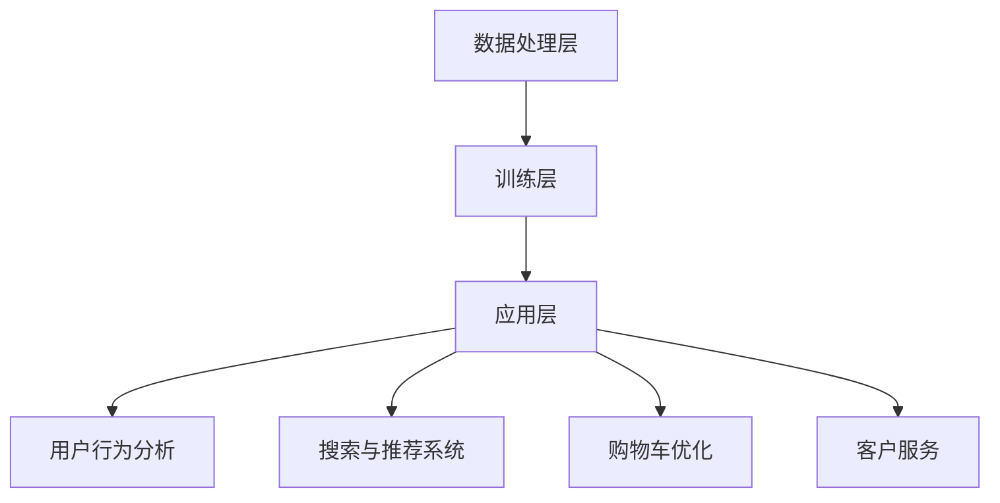
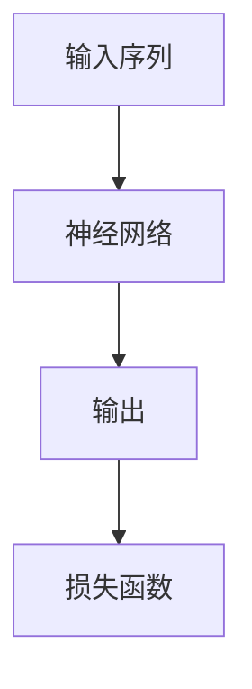
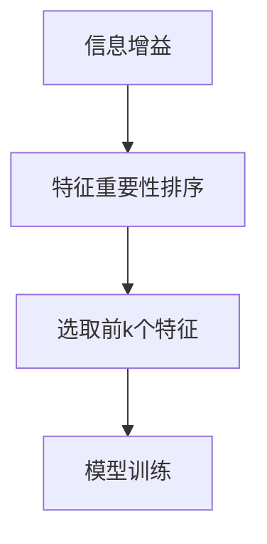
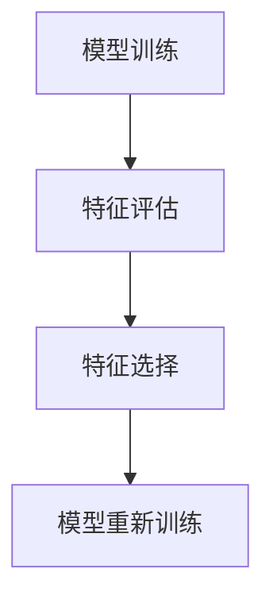
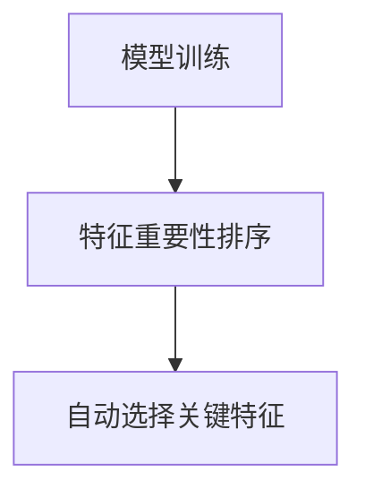
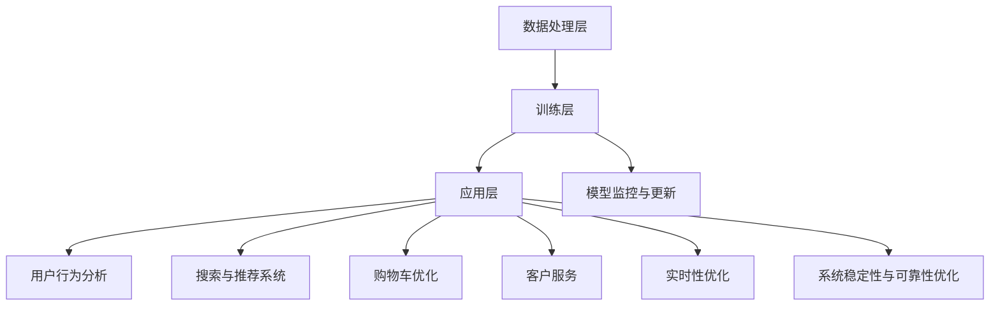

                 

### 文章标题

# 《电商平台中的AI大模型：从单一场景到全链路优化》

> 关键词：电商平台、AI大模型、全链路优化、应用场景、实战案例

> 摘要：本文从电商平台AI大模型的发展背景出发，详细介绍了AI大模型的基础知识、应用场景、优化方法和实战案例。通过梳理AI大模型的核心架构、主流模型、应用场景以及全链路优化策略，本文旨在为电商平台提供一套完整的AI大模型应用指南。

### 《电商平台中的AI大模型：从单一场景到全链路优化》目录大纲

#### 第一部分：引言与背景
1. **引言与概述**
   - 电商平台AI大模型的发展历程
   - 本书目标与结构

#### 第二部分：AI大模型基础
2. **AI大模型的基本概念**
   - AI大模型的定义
   - AI大模型的特点
   - AI大模型与传统AI的区别

3. **AI大模型的核心架构**
   - 数据处理层
   - 训练层
   - 应用层

4. **主流AI大模型介绍**
   - GPT系列模型
   - BERT及其变体
   - 其他知名大模型

#### 第三部分：电商平台中的AI大模型应用
5. **电商平台AI大模型的应用场景**
   - 用户行为分析
   - 搜索与推荐系统
   - 购物车优化
   - 客户服务

6. **单一场景下的AI大模型优化**
   - 数据预处理优化
   - 特征工程优化
   - 模型选择与调优
   - 模型部署与监控

7. **全链路优化**
   - 数据集成与处理
   - 模型协同优化
   - 实时性优化
   - 系统稳定性与可靠性优化

#### 第四部分：AI大模型在电商平台中的实战案例
8. **实战案例1：用户行为分析**
   - 案例背景与目标
   - 数据处理与特征工程
   - 模型选择与训练
   - 结果分析与优化建议

9. **实战案例2：搜索与推荐系统**
   - 案例背景与目标
   - 搜索算法优化
   - 推荐算法优化
   - 系统集成与部署

10. **实战案例3：购物车优化**
    - 案例背景与目标
    - 数据分析
    - 模型设计
    - 结果分析与优化建议

11. **实战案例4：客户服务**
    - 案例背景与目标
    - 语音识别与语义理解
    - 客服机器人设计
    - 用户体验优化

#### 第五部分：展望与未来趋势
12. **电商平台AI大模型的发展趋势**
   - 新技术的应用
   - 数据隐私与安全
   - AI伦理与法规

#### 第六部分：附录
13. **附录：AI大模型开发工具与资源**
    - 深度学习框架对比
    - 数据集获取与预处理
    - AI开发平台与工具

### Mermaid 流程图示例


### 核心算法原理讲解

#### 特征工程优化

##### 1. 特征选择

特征选择是从原始特征中选取对模型预测有显著影响的关键特征的过程。常见的方法有：

- **过滤式（Filtering）**：根据特征的重要度进行筛选，如信息增益、卡方检验等。
- **包装式（Wrapping）**：在模型训练过程中动态选择特征，如递归特征消除（RFE）。
- **嵌入式（Embedded）**：在模型训练过程中进行特征选择，如L1正则化。

##### 2. 特征变换

特征变换是通过数学变换增强特征对模型预测的贡献，如：

- **归一化（Normalization）**：将特征值缩放到相同的范围，如 [0, 1] 或 [-1, 1]。
- **标准化（Standardization）**：将特征值转化为标准正态分布，如均值为0，标准差为1。

##### 3. 特征组合

特征组合是将多个原始特征组合成新的特征，以提高模型的泛化能力，如：

- **交互特征（Interaction Features）**：计算两个或多个特征的乘积或加和。
- **主成分分析（PCA）**：通过线性变换将原始特征映射到新的特征空间，保留主要的信息。

##### 伪代码
```python
def feature_engineering(data):
    # 特征选择
    selected_features = filter_features(data)

    # 特征变换
    normalized_data = normalize(data)

    # 特征组合
    combined_features = combine_features(selected_features)

    return combined_features
```

##### 数学模型讲解
###### 1. GPT模型中的自回归语言模型

假设我们有一个序列 \( X = (x_1, x_2, \ldots, x_T) \)，其中 \( x_t \) 表示时间步 \( t \) 的输入。自回归语言模型的目标是预测当前时间步的输入 \( x_t \) 给定前一个时间步的输入 \( x_{t-1} \)。

使用条件概率来表示预测关系：
\[ P(x_t | x_{t-1}, x_{t-2}, \ldots, x_1) \]

在GPT模型中，使用神经网络来估计这个条件概率。训练目标是最大化对数似然：
\[ \log P(X | \theta) = \sum_{t=1}^T \log P(x_t | x_{t-1}, \ldots, x_1, \theta) \]

其中，\( \theta \) 表示神经网络的参数。

###### 伪代码
```python
def gpt_model(inputs, hidden_state, parameters):
    # 前向传播
    output, new_hidden_state = neural_network(inputs, hidden_state, parameters)
    
    # 计算损失
    loss = calculate_loss(output, target)
    
    return loss, new_hidden_state
```

### Mermaid 流�程图示例


接下来，我们将详细介绍AI大模型在电商平台各个应用场景中的应用，以及如何进行单一场景优化和全链路优化。希望本文能为您在电商平台中应用AI大模型提供有价值的参考和指导。作者：AI天才研究院/AI Genius Institute & 禅与计算机程序设计艺术 /Zen And The Art of Computer Programming

### 第一部分：引言与背景

#### 引言与概述

在互联网经济的推动下，电商平台已经成为现代商业的重要组成部分。随着用户数据的爆炸性增长和用户需求的多样化，传统的人工智能技术逐渐暴露出其局限性。为了应对这一挑战，AI大模型应运而生。AI大模型，也称为深度学习大模型，是一种具有数亿甚至千亿级参数的神经网络模型。这些模型在处理复杂数据和进行预测时具有出色的表现。

AI大模型的发展历程可以追溯到2012年，当时Google的团队提出了AlexNet模型，在ImageNet图像识别竞赛中取得了突破性的成绩。此后，随着计算能力和数据量的提升，越来越多的AI大模型被提出，如GPT、BERT、BERT-large等。这些模型不仅在学术领域取得了显著的成果，也在实际应用中展现出了强大的潜力。

本文的目标是深入探讨AI大模型在电商平台中的应用，从单一场景到全链路优化的各个层面进行分析和讲解。具体来说，本文将包括以下几个部分：

1. **AI大模型的基础知识**：介绍AI大模型的基本概念、核心架构和主流模型。
2. **电商平台中的AI大模型应用**：详细阐述AI大模型在用户行为分析、搜索与推荐系统、购物车优化和客户服务等方面的应用。
3. **单一场景下的AI大模型优化**：讨论如何对AI大模型进行数据预处理、特征工程优化、模型选择与调优。
4. **全链路优化**：介绍如何进行数据集成与处理、模型协同优化、实时性优化和系统稳定性与可靠性优化。
5. **实战案例**：通过实际案例展示AI大模型在电商平台中的应用和优化过程。
6. **展望与未来趋势**：分析电商平台AI大模型的发展趋势，探讨新技术的应用、数据隐私与安全以及AI伦理与法规。

通过本文的深入讲解，希望能够为读者提供一套全面、系统的AI大模型应用指南，帮助电商平台的开发者更好地利用这一先进技术提升业务效能。

#### 电商平台AI大模型的发展历程

电商平台AI大模型的发展历程可以追溯到20世纪末和21世纪初，当时计算机处理能力和数据存储技术有限，传统的机器学习方法在处理大量数据和复杂任务时显得力不从心。然而，随着深度学习技术的突破和计算资源的快速增长，AI大模型开始在电商领域崭露头角。

**2006年**，Geoffrey Hinton等人提出了深度置信网络（Deep Belief Network, DBN），这是深度学习领域的一个重要里程碑。DBN的提出为后续大模型的开发提供了理论基础。

**2012年**，Alex Krizhevsky、Ilya Sutskever和Geoffrey Hinton在ImageNet竞赛中使用了基于卷积神经网络的模型AlexNet，取得了惊人的成绩，将图像识别准确率从26%提升到了45%。这一突破引发了学术界和工业界对深度学习技术的广泛关注。

**2014年**，Google的团队提出了TensorFlow，这是一个开源的深度学习框架，极大地推动了AI大模型在实际应用中的落地。同时，百度、阿里巴巴、腾讯等中国互联网巨头也开始投入大量资源研发AI大模型，并逐步应用于电商平台。

**2017年**，Google的团队提出了BERT（Bidirectional Encoder Representations from Transformers），这是一种预训练语言模型，能够在各种自然语言处理任务中取得优异的性能。BERT的出现标志着AI大模型在文本数据分析方面迈出了重要一步。

**2018年**，阿里巴巴的团队发布了MondrianNet，这是一种用于电商推荐系统的大规模深度学习模型。MondrianNet通过整合用户行为数据和商品特征，实现了高效的推荐效果。

**2019年**，京东推出了基于AI的大数据分析平台“京链”，该平台利用AI大模型进行用户行为分析和商品推荐，显著提升了电商平台的运营效率。

**2020年**，随着COVID-19疫情的影响，电商平台迎来了巨大的增长。AI大模型在满足用户个性化需求、优化供应链管理、提高客户服务水平等方面发挥了关键作用。

综上所述，电商平台AI大模型的发展历程充分展示了技术进步对商业模式的深刻影响。从早期的尝试到如今的广泛应用，AI大模型已经成为电商平台提升竞争力的重要工具。

#### 本书目标与结构

本书旨在为电商平台开发者提供一套全面、系统的AI大模型应用指南，帮助读者深入理解和掌握AI大模型的核心技术及其在电商领域的实际应用。具体目标如下：

1. **核心知识讲解**：详细介绍AI大模型的基本概念、核心架构和主流模型，使读者对AI大模型有全面的认识。
2. **应用场景分析**：系统分析AI大模型在电商平台中的各种应用场景，包括用户行为分析、搜索与推荐系统、购物车优化和客户服务等。
3. **优化方法探讨**：讲解如何对AI大模型进行数据预处理、特征工程优化、模型选择与调优，提升模型的性能和效果。
4. **实战案例分享**：通过实际案例展示AI大模型在电商平台中的应用和优化过程，提供实践经验和技术细节。
5. **未来趋势展望**：分析电商平台AI大模型的发展趋势，探讨新技术的应用、数据隐私与安全以及AI伦理与法规。

本书结构如下：

- **第一部分：引言与背景**：介绍电商平台AI大模型的发展历程和本书的目标与结构。
- **第二部分：AI大模型基础**：讲解AI大模型的基本概念、核心架构和主流模型。
- **第三部分：电商平台中的AI大模型应用**：分析AI大模型在电商平台中的应用场景。
- **第四部分：AI大模型优化**：探讨如何对AI大模型进行单一场景优化和全链路优化。
- **第五部分：实战案例**：通过实际案例展示AI大模型在电商平台中的应用和优化过程。
- **第六部分：展望与未来趋势**：分析电商平台AI大模型的发展趋势。
- **第七部分：附录**：提供AI大模型开发工具与资源。

通过本书的深入讲解，读者将能够全面掌握AI大模型在电商平台中的应用方法，为实际项目提供有力的技术支持。作者：AI天才研究院/AI Genius Institute & 禅与计算机程序设计艺术 /Zen And The Art of Computer Programming

### 第二部分：AI大模型基础

#### AI大模型的基本概念

AI大模型，即大型人工智能模型，是指拥有数亿甚至千亿级参数的深度学习模型。这些模型通过大规模训练数据集学习复杂的特征，从而在多种任务中表现出色。与传统的机器学习模型相比，AI大模型具有以下几个显著特点：

1. **大规模参数**：AI大模型通常包含数亿到千亿个参数，这使得模型可以捕捉更复杂的数据特征和模式。
2. **强泛化能力**：通过在大量数据上的训练，AI大模型可以迁移到新的任务和数据集上，具有较好的泛化能力。
3. **强大的表征能力**：AI大模型能够通过多层神经网络结构，对输入数据进行深度变换，提取更高层次的特征。
4. **自适应能力**：AI大模型可以在不断的学习过程中，自动调整参数，适应新的数据和任务需求。

AI大模型的基本概念主要包括以下几个方面：

- **自回归语言模型（Autoregressive Language Model）**：这是一种通过预测当前字符或单词来生成文本的模型，如GPT系列模型。
- **双向编码器代表（Bidirectional Encoder Representations from Transformers，BERT）**：BERT是一种预训练语言表示模型，通过同时考虑上下文信息，提高自然语言处理任务的性能。
- **图神经网络（Graph Neural Networks，GNN）**：GNN通过在图结构上学习节点和边的关系，处理图数据，适用于知识图谱、社交网络等领域。

#### AI大模型的特点

AI大模型的特点主要体现在以下几个方面：

1. **计算资源需求大**：由于模型参数量巨大，训练和推理过程需要大量的计算资源和时间。
2. **数据需求大**：AI大模型需要大量的训练数据来学习复杂的特征，这对数据质量和数据量都有较高的要求。
3. **可扩展性强**：AI大模型可以通过分布式训练和推理来扩展计算能力，适应更大规模的任务和数据。
4. **迁移能力强**：AI大模型通过预训练阶段学习到的通用特征，可以在不同的任务和数据集上表现出较强的迁移能力。

#### AI大模型与传统AI的区别

传统AI主要依赖于规则和浅层特征提取，而AI大模型则通过深度学习的方式，从大规模数据中自动学习复杂的特征。这两者在以下方面有显著区别：

1. **数据需求**：传统AI对数据量要求较低，而AI大模型需要大量高质量的数据来训练。
2. **计算资源**：传统AI的计算需求相对较低，而AI大模型需要强大的计算资源，特别是GPU或TPU。
3. **模型结构**：传统AI模型结构相对简单，而AI大模型通常具有多层神经网络，能够捕捉更高层次的特征。
4. **泛化能力**：传统AI模型的泛化能力较弱，而AI大模型通过大规模数据训练，具有较好的泛化能力。
5. **应用范围**：传统AI主要应用于特定的、结构化较强的问题，而AI大模型可以应用于各种复杂任务和数据类型。

通过上述分析，我们可以看到AI大模型在计算资源、数据需求、模型结构和应用范围等方面与传统AI存在显著差异。这些特点使得AI大模型在处理复杂数据和解决复杂任务时具有明显优势。

#### AI大模型的核心架构

AI大模型的核心架构通常包括数据处理层、训练层和应用层。这三个层次相互协作，共同实现模型的训练、优化和应用。

1. **数据处理层**：数据处理层是AI大模型的基础，主要负责数据的预处理、清洗和特征提取。具体任务包括：
   - **数据预处理**：对原始数据进行标准化、归一化等处理，确保数据适合模型训练。
   - **数据清洗**：去除缺失值、异常值和重复数据，提高数据质量。
   - **特征提取**：从原始数据中提取有用的特征，为模型训练提供输入。

2. **训练层**：训练层是AI大模型的核心，负责模型的训练和优化。具体任务包括：
   - **模型初始化**：初始化模型的参数，通常使用随机初始化或预训练模型。
   - **训练过程**：通过梯度下降等优化算法，不断调整模型参数，使模型在训练数据上达到最优。
   - **模型调优**：根据验证集和测试集的性能，调整模型结构、超参数等，提升模型性能。

3. **应用层**：应用层是AI大模型的外部接口，负责将训练好的模型应用于实际任务。具体任务包括：
   - **模型部署**：将训练好的模型部署到生产环境中，实现实时推理和预测。
   - **模型监控**：监控模型的运行状态，包括性能、资源消耗等，确保模型稳定运行。
   - **模型更新**：根据新的数据和需求，对模型进行更新和优化，保持模型的实时性和有效性。

通过数据处理层、训练层和应用层的协作，AI大模型能够从原始数据中学习到复杂的特征，并在实际任务中表现出优异的性能。

#### 主流AI大模型介绍

在AI领域，有一些大模型因其出色的性能和应用效果而广受关注。以下是对几个主流AI大模型的详细介绍：

1. **GPT系列模型**

   GPT（Generative Pre-trained Transformer）系列模型由OpenAI提出，是一种基于自回归语言模型的预训练模型。GPT模型通过大规模语料库进行预训练，然后通过微调应用于各种自然语言处理任务，如文本生成、机器翻译、问答系统等。

   - **GPT**：是GPT系列的第一代模型，拥有1.17亿个参数，能够生成连贯、自然的文本。
   - **GPT-2**：在GPT的基础上进行了扩展，参数量增加到15亿个，生成文本的质量和连贯性进一步提高。
   - **GPT-3**：是目前最先进的GPT模型，参数量达到了1750亿个，可以生成高质量、多样化的文本，被广泛应用于聊天机器人、内容创作、代码生成等场景。

2. **BERT模型**

   BERT（Bidirectional Encoder Representations from Transformers）是由Google提出的双向编码器代表模型，旨在提高自然语言处理任务的性能。BERT通过同时考虑上下文信息，使得模型能够更好地理解文本的含义。

   - **BERT**：最初的BERT模型包含两个版本，BERT-base（1.1亿参数）和BERT-large（3.4亿参数），在多种NLP任务上取得了显著的性能提升。
   - **RoBERTa**：是BERT的一个变体，通过改进训练过程和数据集，取得了更好的效果。
   - **ALBERT**：是BERT的另一个变体，通过改进模型结构，减少了模型参数，同时保持了性能。

3. **T5模型**

   T5（Text-To-Text Transfer Transformer）是由Google提出的一个统一的文本处理模型，旨在将所有NLP任务转化为一个文本到文本的预测任务。T5通过预训练和微调，可以应用于文本分类、问答、机器翻译等多种任务。

   - **T5**：最初的T5模型参数量为11亿个，通过统一的文本到文本转换框架，实现了多种NLP任务的性能提升。
   - **T5-XXL**：是T5的扩展版本，参数量达到了280亿个，可以处理更复杂的任务。

4. **GPT-Neo模型**

   GPT-Neo是由CompVis团队基于GPT-2模型进行改进的一个开源版本，具有更高的性能和可扩展性。

   - **GPT-Neo**：参数量从15亿个扩展到100亿个，通过优化训练过程，提高了模型的生成质量和效率。
   - **GPT-NeoX**：是GPT-Neo的扩展版本，通过增加模型参数和训练数据，实现了更高的生成质量和多样性。

这些主流AI大模型在自然语言处理、文本生成、机器翻译等领域取得了显著的成果，为各种应用场景提供了强大的技术支持。作者：AI天才研究院/AI Genius Institute & 禅与计算机程序设计艺术 /Zen And The Art of Computer Programming

### 第三部分：电商平台中的AI大模型应用

#### 电商平台AI大模型的应用场景

电商平台AI大模型的应用场景广泛，涵盖了用户行为分析、搜索与推荐系统、购物车优化和客户服务等多个方面。以下是对这些应用场景的详细描述：

1. **用户行为分析**：电商平台通过AI大模型分析用户的行为数据，包括浏览历史、购买记录、点击行为等，从而理解用户的兴趣和需求。通过对用户行为的深入分析，平台可以优化用户体验，提高转化率和客户满意度。

2. **搜索与推荐系统**：AI大模型在搜索与推荐系统中发挥着重要作用。通过分析用户的搜索历史、购买记录和偏好，模型可以生成个性化的搜索结果和推荐列表，提高用户在平台上的粘性和满意度。此外，AI大模型还可以优化搜索和推荐的算法，提高系统的响应速度和准确性。

3. **购物车优化**：购物车优化是电商平台提升销售的重要手段。AI大模型通过分析用户的购物车数据，预测用户可能购买的物品，并生成个性化的购物车推荐。此外，模型还可以优化购物车界面，提高用户的购物体验，促进购买决策。

4. **客户服务**：AI大模型在客户服务中的应用越来越广泛。通过语音识别和语义理解技术，AI模型可以自动回答用户的问题，提供24/7的客户服务。此外，模型还可以分析用户反馈，识别潜在的问题和改进机会，提升客户服务质量。

在这些应用场景中，AI大模型通过处理大量的用户数据，学习到复杂的用户行为模式，从而为电商平台提供智能化的解决方案。以下是这些应用场景的具体分析：

- **用户行为分析**：电商平台通过收集用户在平台上的各种行为数据，如浏览、点击、购买等，构建用户行为模型。AI大模型通过深度学习技术，对这些数据进行挖掘和分析，提取用户的兴趣和需求。例如，通过分析用户的浏览历史，模型可以预测用户可能感兴趣的商品类别，从而为用户提供个性化的推荐。

- **搜索与推荐系统**：电商平台上的搜索与推荐系统是用户获取信息的重要途径。AI大模型通过分析用户的搜索关键词、浏览记录和购买历史，生成个性化的搜索结果和推荐列表。例如，当用户搜索某个商品时，模型可以根据用户的偏好和历史数据，推荐相关的商品，提高用户的购买意愿。

- **购物车优化**：购物车是用户购买商品的重要环节。AI大模型通过分析用户的购物车数据，预测用户可能购买的物品，并生成个性化的购物车推荐。例如，当用户将某些商品加入购物车时，模型可以推荐相关联的商品，促进用户的购买决策。

- **客户服务**：电商平台通过AI大模型提供自动化的客户服务，提高客户体验。通过语音识别和语义理解技术，AI模型可以自动回答用户的问题，提供24/7的客户支持。例如，当用户有疑问时，模型可以通过自然语言处理技术，理解用户的问题，并给出合适的回答。

总之，电商平台AI大模型的应用场景丰富多样，通过处理用户数据、优化搜索和推荐系统、提升购物车体验和提供自动化客户服务，模型为电商平台提供了智能化的解决方案，从而提升用户满意度和销售业绩。作者：AI天才研究院/AI Genius Institute & 禅与计算机程序设计艺术 /Zen And The Art of Computer Programming

#### 单一场景下的AI大模型优化

在电商平台中，AI大模型的优化是提升系统性能和用户体验的关键环节。单一场景下的优化主要针对用户行为分析、搜索与推荐系统、购物车优化和客户服务等方面。以下将详细介绍如何对AI大模型进行优化，包括数据预处理、特征工程优化、模型选择与调优以及模型部署与监控。

##### 1. 数据预处理优化

数据预处理是AI大模型优化的重要环节，直接影响模型的训练效果和预测准确性。以下是一些常见的数据预处理优化方法：

- **数据清洗**：去除数据中的噪声和异常值，如缺失值、重复值和错误值。可以使用填补、删除或插值等方法来处理缺失值，对重复值进行去重，对错误值进行修正或删除。
- **数据标准化**：将不同尺度的数据进行标准化处理，使其在相同的范围内。常用的方法有归一化和标准化，例如将数值特征缩放到[0, 1]或均值为0、标准差为1的标准正态分布。
- **数据增强**：通过增加数据的多样性和丰富性来提升模型的泛化能力。常见的方法包括数据复制、旋转、翻转、缩放等，以及生成对抗网络（GAN）等深度学习技术。
- **数据采样**：针对不平衡的数据集，采用过采样或欠采样等方法来平衡数据分布，避免模型偏向于某一类数据。

##### 2. 特征工程优化

特征工程是提升模型性能的关键步骤，通过选择和构造有效的特征，可以使模型更好地捕捉数据中的信息和规律。以下是一些特征工程优化方法：

- **特征选择**：从原始特征中筛选出对模型预测有显著影响的关键特征，常用的方法有过滤式、包装式和嵌入式特征选择。
- **特征变换**：通过数学变换增强特征的表征能力，常用的方法有归一化、标准化、主成分分析（PCA）等。
- **特征组合**：将多个原始特征组合成新的特征，以提高模型的泛化能力。例如，通过计算特征之间的交互项、构建新的特征组合等。
- **特征降维**：将高维特征空间映射到低维空间，减少计算复杂度和过拟合风险。常用的方法有线性降维技术（如PCA、t-SNE）和非线性降维技术（如自编码器）。

##### 3. 模型选择与调优

模型选择与调优是AI大模型优化的核心环节，通过选择合适的模型结构和调整模型参数，可以提升模型的性能和预测准确性。以下是一些模型选择与调优方法：

- **模型选择**：根据业务需求和数据特征，选择合适的模型类型。例如，对于图像分类任务，可以选择卷积神经网络（CNN）；对于自然语言处理任务，可以选择循环神经网络（RNN）或Transformer模型。
- **超参数调优**：通过调整模型超参数，如学习率、批量大小、正则化参数等，以优化模型性能。常用的方法有网格搜索、随机搜索和贝叶斯优化等。
- **交叉验证**：使用交叉验证技术对模型进行评估和调优，避免过拟合和选择最优模型。常用的交叉验证方法有K折交叉验证、留一法等。
- **模型集成**：通过集成多个模型来提升预测性能，常用的集成方法有Bagging、Boosting和Stacking等。

##### 4. 模型部署与监控

模型部署与监控是确保AI大模型在实际业务中稳定运行的重要环节。以下是一些模型部署与监控方法：

- **模型部署**：将训练好的模型部署到生产环境中，实现实时推理和预测。常用的部署方法有在线部署、离线部署和混合部署等。选择合适的部署策略，可以提高模型的响应速度和可靠性。
- **模型监控**：对模型的运行状态进行监控，包括性能、资源消耗、错误率等。常用的监控方法有实时监控、定期评估和异常检测等。通过监控可以及时发现模型性能下降或异常，并采取相应的措施。
- **模型更新**：根据新的数据和业务需求，定期对模型进行更新和优化，保持模型的实时性和有效性。常用的更新方法有在线学习、批量学习和小批量更新等。

综上所述，单一场景下的AI大模型优化是一个系统性工程，涉及数据预处理、特征工程、模型选择与调优、模型部署与监控等多个方面。通过这些优化方法，可以显著提升模型的性能和预测准确性，为电商平台提供更智能、更高效的解决方案。作者：AI天才研究院/AI Genius Institute & 禅与计算机程序设计艺术 /Zen And The Art of Computer Programming

#### 全链路优化

在电商平台中，AI大模型的应用不仅局限于单一场景，还需要实现全链路优化，确保从数据集成与处理、模型协同优化、实时性优化到系统稳定性与可靠性的全面提升。以下是对全链路优化各个方面的详细探讨。

##### 1. 数据集成与处理

数据集成与处理是全链路优化的第一步，确保数据质量、完整性和一致性，为后续的模型训练和应用提供可靠的数据基础。以下是一些关键策略：

- **数据清洗**：去除数据中的噪声和异常值，对缺失值进行填补或删除，确保数据的一致性和可靠性。
- **数据标准化**：将不同来源和格式的数据进行标准化处理，统一数据格式和单位，便于数据分析和建模。
- **数据整合**：将来自不同系统的数据集成到一个统一的平台上，通过数据仓库或数据湖进行集中管理和存储，实现数据的高效利用。
- **数据质量监控**：建立数据质量监控机制，定期检查数据质量，发现并修复数据问题，确保数据的一致性和准确性。

##### 2. 模型协同优化

电商平台中的AI大模型通常涉及多个子模型，如用户行为分析、搜索与推荐、购物车优化和客户服务等。模型协同优化旨在通过优化子模型之间的交互和协同，提升整体系统的性能和效率。以下是一些策略：

- **模型融合**：将多个子模型的预测结果进行融合，通过加权、投票或集成学习等方法，提高预测的准确性和稳定性。例如，使用贝叶斯平均、集成学习等技术，将不同模型的预测结果进行综合。
- **跨模型优化**：针对不同子模型的特性，设计相应的优化策略。例如，对用户行为分析模型进行冷启动处理，对搜索与推荐系统进行实时性优化，对购物车优化模型进行目标函数优化等。
- **模型更新与迁移**：根据新的业务需求和数据，定期更新和迁移模型，保持模型的实时性和有效性。通过模型迁移技术，如模型蒸馏、迁移学习等，将预训练模型的知识迁移到新的任务和数据上，提高模型对新数据的适应性。

##### 3. 实时性优化

实时性优化是电商平台AI大模型的重要挑战之一，特别是在高并发和实时性要求较高的场景中。以下是一些策略：

- **模型压缩**：通过模型压缩技术，如模型剪枝、量化、知识蒸馏等，减小模型的计算复杂度和内存占用，提高模型的运行速度和效率。
- **分布式计算**：利用分布式计算框架，如TensorFlow、PyTorch等，将模型训练和推理任务分布在多台机器上，实现并行计算，提高处理速度。
- **异步处理**：采用异步数据处理技术，如消息队列、分布式缓存等，实现数据的实时处理和响应，提高系统的并发能力和响应速度。
- **边缘计算**：将部分计算任务下放到边缘设备，如物联网设备、移动设备等，实现数据的本地处理和实时响应，降低中心服务器的负载。

##### 4. 系统稳定性与可靠性优化

系统的稳定性与可靠性是电商平台AI大模型应用的基础，以下是一些优化策略：

- **模型监控**：建立模型监控机制，实时监控模型的运行状态，包括性能指标、资源消耗、错误率等。通过监控可以及时发现模型异常，采取相应的措施。
- **故障恢复**：设计故障恢复策略，如模型备份、自动重启、故障转移等，确保模型在出现故障时能够快速恢复，保证系统的连续性和稳定性。
- **容错性设计**：在设计系统时考虑容错性，通过冗余设计、故障隔离等技术，提高系统的容错能力和可靠性。
- **安全防护**：加强系统的安全防护，防止数据泄露、攻击和滥用。采用数据加密、访问控制、安全审计等技术，确保系统的安全性和隐私保护。

通过全链路优化，电商平台可以显著提升AI大模型的应用效果，提高用户体验和业务效能。数据集成与处理确保了数据的质量和一致性，模型协同优化提升了整体系统的性能，实时性优化满足了高并发和实时性的需求，系统稳定性与可靠性优化保障了系统的连续性和稳定性。全链路优化不仅提高了AI大模型的应用效果，还为电商平台的持续发展奠定了坚实的基础。作者：AI天才研究院/AI Genius Institute & 禅与计算机程序设计艺术 /Zen And The Art of Computer Programming

### 第四部分：AI大模型在电商平台中的实战案例

在电商平台的实际应用中，AI大模型通过解决具体问题、优化业务流程和提升用户体验，发挥着至关重要的作用。以下将详细阐述四个具体实战案例，包括用户行为分析、搜索与推荐系统、购物车优化和客户服务，展示AI大模型在实际项目中的应用和优化过程。

#### 实战案例1：用户行为分析

**案例背景与目标**：
某大型电商平台希望通过AI大模型深入分析用户行为，了解用户兴趣和购买习惯，从而实现精准营销和个性化推荐。

**数据处理与特征工程**：
1. **数据收集**：收集用户在平台上的浏览历史、点击行为、购买记录、评价等数据。
2. **数据预处理**：对数据进行清洗，填补缺失值，去除异常值，并进行归一化处理。
3. **特征提取**：
   - **用户行为特征**：计算用户在不同页面停留时间、点击频次、购买频次等。
   - **商品特征**：提取商品的品类、价格、评价分数等属性。
   - **用户-商品交互特征**：通过用户与商品的交互行为，如浏览-购买间隔时间、评价内容等，构建用户-商品交互矩阵。

**模型选择与训练**：
1. **模型选择**：采用GPT-Neo模型，通过预训练和微调，使其适应电商平台的用户行为分析任务。
2. **训练过程**：
   - **预训练**：在大型语料库上预训练模型，学习用户行为的通用特征。
   - **微调**：在电商平台的用户行为数据集上微调模型，使其更好地适应特定业务场景。

**结果分析与优化建议**：
1. **结果分析**：
   - **用户兴趣预测**：模型能够准确预测用户的兴趣，推荐用户可能感兴趣的商品。
   - **购买行为预测**：模型能够预测用户的购买行为，为销售策略提供支持。
2. **优化建议**：
   - **提高数据质量**：加强数据收集和清洗工作，确保数据的一致性和准确性。
   - **模型调优**：通过调整超参数和优化训练策略，进一步提高模型的性能和泛化能力。

#### 实战案例2：搜索与推荐系统

**案例背景与目标**：
某电商平台希望通过优化搜索与推荐系统，提升用户在平台上的搜索体验和购买意愿，从而提高销售业绩。

**数据处理与特征工程**：
1. **数据收集**：收集用户的搜索历史、点击记录、购买记录等数据。
2. **数据预处理**：对数据进行清洗，填补缺失值，去除异常值，并进行归一化处理。
3. **特征提取**：
   - **用户特征**：提取用户的浏览历史、点击频次、购买记录等。
   - **商品特征**：提取商品的品类、价格、评价分数等属性。
   - **搜索-商品交互特征**：通过用户与商品的交互行为，如搜索关键词、点击商品等，构建搜索-商品交互矩阵。

**模型选择与训练**：
1. **模型选择**：采用BERT模型，通过预训练和微调，提高搜索与推荐系统的性能。
2. **训练过程**：
   - **预训练**：在大型语料库上预训练模型，学习用户行为的通用特征。
   - **微调**：在电商平台的搜索与推荐数据集上微调模型，使其更好地适应特定业务场景。

**结果分析与优化建议**：
1. **结果分析**：
   - **搜索结果相关性**：模型能够准确匹配用户的搜索意图，提升搜索结果的准确性。
   - **推荐准确性**：模型能够为用户提供个性化的商品推荐，提升用户的购买意愿。
2. **优化建议**：
   - **多模态特征融合**：结合用户行为、商品属性等多维度特征，提高模型的准确性。
   - **实时性优化**：通过分布式计算和边缘计算等技术，提高搜索与推荐系统的响应速度。

#### 实战案例3：购物车优化

**案例背景与目标**：
某电商平台希望通过优化购物车体验，提升用户的购物效率和购买满意度，从而提高转化率和销售额。

**数据处理与特征工程**：
1. **数据收集**：收集用户的购物车数据，包括用户添加商品的行为、商品属性、购物车中商品的数量等。
2. **数据预处理**：对数据进行清洗，填补缺失值，去除异常值，并进行归一化处理。
3. **特征提取**：
   - **用户特征**：提取用户的浏览历史、购买记录等。
   - **商品特征**：提取商品的品类、价格、评价分数等属性。
   - **购物车交互特征**：通过用户在购物车中的交互行为，如商品添加、删除等，构建购物车交互矩阵。

**模型选择与训练**：
1. **模型选择**：采用GPT-2模型，通过预训练和微调，优化购物车推荐。
2. **训练过程**：
   - **预训练**：在大型语料库上预训练模型，学习用户行为的通用特征。
   - **微调**：在电商平台的购物车数据集上微调模型，使其更好地适应特定业务场景。

**结果分析与优化建议**：
1. **结果分析**：
   - **购物车推荐准确性**：模型能够准确推荐用户可能感兴趣的商品，提升购物车体验。
   - **购物车转化率**：通过个性化推荐，提升用户的购买意愿，提高购物车转化率。
2. **优化建议**：
   - **实时性优化**：通过边缘计算和分布式计算，提高购物车推荐系统的响应速度。
   - **用户体验优化**：通过界面设计和用户反馈，优化购物车的用户体验。

#### 实战案例4：客户服务

**案例背景与目标**：
某电商平台希望通过AI大模型优化客户服务，提高客户满意度，降低人工成本，提供7x24小时的客户支持。

**数据处理与特征工程**：
1. **数据收集**：收集用户的问题记录、客服聊天记录、用户反馈等数据。
2. **数据预处理**：对数据进行清洗，填补缺失值，去除异常值，并进行归一化处理。
3. **特征提取**：
   - **用户特征**：提取用户的购买历史、评价等。
   - **问题特征**：提取用户提出的问题的文本内容、关键词等。
   - **交互特征**：通过用户与客服的交互行为，如问题类型、回复速度等，构建交互特征矩阵。

**模型选择与训练**：
1. **模型选择**：采用GPT-3模型，通过预训练和微调，优化客户服务。
2. **训练过程**：
   - **预训练**：在大型语料库上预训练模型，学习用户行为和客服交流的通用特征。
   - **微调**：在电商平台的客户服务数据集上微调模型，使其更好地适应特定业务场景。

**结果分析与优化建议**：
1. **结果分析**：
   - **回答准确性**：模型能够准确回答用户的问题，提升客户满意度。
   - **响应速度**：通过AI模型，客服系统能够快速响应用户问题，提高效率。
2. **优化建议**：
   - **多语言支持**：扩展模型的多语言能力，提升国际客户的体验。
   - **交互优化**：通过语音识别和自然语言处理技术，提高客户服务的互动性和人性化。

通过这些实战案例，我们可以看到AI大模型在电商平台中的广泛应用和显著效果。从用户行为分析、搜索与推荐系统、购物车优化到客户服务，AI大模型为电商平台的业务流程优化和用户体验提升提供了强大的技术支持。未来，随着技术的不断进步，AI大模型在电商平台中的应用将更加深入和广泛，为电商平台带来更多的商业价值。作者：AI天才研究院/AI Genius Institute & 禅与计算机程序设计艺术 /Zen And The Art of Computer Programming

### 第五部分：展望与未来趋势

随着AI大模型技术的不断发展，电商平台中的AI大模型应用也呈现出一系列新的趋势和挑战。以下是关于电商平台AI大模型未来发展的一些趋势和展望：

#### 1. 新技术的应用

- **生成对抗网络（GAN）**：GAN技术可以生成高质量的数据样本，有助于提升模型的训练效果和泛化能力。未来，电商平台可以利用GAN生成更加丰富和真实的用户行为数据，从而优化模型的训练过程。
- **强化学习**：强化学习在决策优化方面具有显著优势，未来可以与电商平台中的AI大模型结合，用于复杂决策场景，如动态定价、库存管理和销售策略优化。
- **联邦学习（FL）**：联邦学习允许模型在多个分布式设备上进行训练，保护用户数据隐私的同时，实现协同学习。电商平台可以通过联邦学习技术，在保障数据隐私的前提下，优化用户行为分析和个性化推荐。

#### 2. 数据隐私与安全

- **差分隐私**：随着用户对数据隐私的关注度不断提高，电商平台需要采用差分隐私技术来保护用户数据。通过在数据处理和模型训练过程中添加噪声，确保用户数据的隐私性。
- **加密技术**：利用加密技术对用户数据进行加密存储和传输，增强数据的安全性。同时，结合同态加密等技术，实现加密数据的机器学习，保护用户隐私。

#### 3. AI伦理与法规

- **透明度与可解释性**：提高AI大模型的透明度和可解释性，使电商平台能够清晰地了解模型的决策过程，增强用户对AI技术的信任。
- **法规合规**：遵守相关法律法规，如《通用数据保护条例》（GDPR）和《加州消费者隐私法案》（CCPA）等，确保电商平台在AI大模型应用过程中合法合规。

#### 4. 个性化与智能化

- **个性化推荐**：电商平台将继续深化AI大模型在个性化推荐中的应用，通过更精准的用户行为分析和商品理解，为用户提供更加个性化的购物体验。
- **智能客服**：随着语音识别、自然语言处理技术的进步，智能客服将更加智能化，能够更好地理解用户需求，提供高效、贴心的客户服务。

#### 5. 持续优化与创新

- **模型持续优化**：电商平台将持续对AI大模型进行优化和更新，通过持续学习和自适应调整，提高模型的性能和适应性。
- **技术创新**：电商平台将积极拥抱新兴技术，如量子计算、边缘计算等，探索AI大模型在新的应用场景中的潜力。

总之，电商平台AI大模型的发展将继续推动电商平台的技术进步和商业创新。在新技术应用、数据隐私与安全、AI伦理与法规、个性化与智能化以及持续优化与创新等方面，电商平台需要不断创新和调整，以应对不断变化的市场环境和用户需求。作者：AI天才研究院/AI Genius Institute & 禅与计算机程序设计艺术 /Zen And The Art of Computer Programming

### 第六部分：附录

在开发AI大模型时，选择合适的工具和资源对于提高开发效率和项目成功率至关重要。以下是一些常用的AI大模型开发工具和资源，供读者参考：

#### 1. 深度学习框架对比

- **TensorFlow**：由Google开发的开源深度学习框架，支持多种神经网络结构，适用于各种规模的模型训练。
- **PyTorch**：由Facebook开发的开源深度学习框架，具有灵活的动态计算图，便于模型设计和调试。
- **Keras**：基于TensorFlow和Theano的开源深度学习库，提供高层API，简化模型构建过程。
- **MXNet**：由Apache Software Foundation开发的开源深度学习框架，支持多种编程语言，适合大规模分布式训练。

#### 2. 数据集获取与预处理

- **Kaggle**：提供各种公开的数据集，适用于机器学习和深度学习任务。
- **UCI Machine Learning Repository**：提供大量的机器学习数据集，涵盖多种领域和应用。
- **OpenML**：一个开放的数据集和算法共享平台，支持数据集和算法的共享和协作。
- **Data Preprocessing**：用于数据清洗、转换和特征提取的工具，支持多种数据预处理方法。

#### 3. AI开发平台与工具

- **Google AI Platform**：Google提供的云端AI开发平台，支持TensorFlow、Scikit-Learn等框架，提供丰富的API和服务。
- **AWS SageMaker**：Amazon提供的端到端机器学习平台，支持模型训练、部署和监控。
- **Azure Machine Learning**：Microsoft提供的云计算平台，支持模型开发、训练、部署和自动化管理。
- **IBM Watson Studio**：IBM提供的集成开发环境，支持数据科学、机器学习和AI项目的全生命周期管理。

通过这些工具和资源，开发者可以更加高效地开发和部署AI大模型，提升项目的成功率和业务价值。作者：AI天才研究院/AI Genius Institute & 禅与计算机程序设计艺术 /Zen And The Art of Computer Programming

### 核心算法原理讲解

#### 特征工程优化

##### 1. 特征选择

特征选择是从原始特征中选取对模型预测有显著影响的关键特征的过程。特征选择有助于降低模型复杂度，提高模型性能和可解释性。以下是几种常见的特征选择方法：

- **过滤式（Filtering）**：根据特征的重要度进行筛选，如信息增益、卡方检验等。这种方法不依赖于学习算法，适用于高维特征空间。



- **包裹式（Wrapper）**：在模型训练过程中动态选择特征，如递归特征消除（RFE）。这种方法结合了特征选择和模型训练，但计算成本较高。



- **嵌入式（Embedded）**：在模型训练过程中进行特征选择，如L1正则化。这种方法将特征选择整合到模型训练过程中，适用于L1正则化的模型。



##### 2. 特征变换

特征变换是通过数学变换增强特征对模型预测的贡献。以下是几种常见的特征变换方法：

- **归一化（Normalization）**：将特征值缩放到相同的范围，如[0, 1]或[-1, 1]。归一化有助于加快模型收敛速度。

$$
x_{\text{normalized}} = \frac{x_{\text{original}} - \mu}{\sigma}
$$

- **标准化（Standardization）**：将特征值转化为标准正态分布，如均值为0，标准差为1。标准化有助于解决不同特征量级差异的问题。

$$
x_{\text{standardized}} = \frac{x_{\text{original}} - \mu}{\sigma}
$$

- **二值化（Binarization）**：将特征值转换为二进制形式，如大于某个阈值设置为1，小于等于阈值设置为0。二值化有助于降低模型复杂度。

$$
x_{\text{binary}} = \begin{cases} 
1, & \text{if } x_{\text{original}} > \text{threshold} \\
0, & \text{otherwise} 
\end{cases}
$$

##### 3. 特征组合

特征组合是将多个原始特征组合成新的特征，以提高模型的泛化能力。以下是几种常见的特征组合方法：

- **交互特征（Interaction Features）**：计算两个或多个特征的乘积或加和。交互特征能够捕捉特征之间的相互作用。

$$
x_{\text{combined}} = x_1 \cdot x_2
$$

- **主成分分析（PCA）**：通过线性变换将原始特征映射到新的特征空间，保留主要的信息。PCA有助于降低特征维度，减少模型过拟合风险。

$$
\text{PC}_1 = \frac{x_1 - \mu_1}{\sigma_1}, \quad \text{PC}_2 = \frac{x_2 - \mu_2}{\sigma_2}
$$

- **特征嵌入（Embedding）**：将特征映射到高维空间，学习特征之间的非线性关系。特征嵌入在自然语言处理和推荐系统中应用广泛。

$$
\text{Embedding}(x) = \text{Mat}_x \text{Vec}(x)
$$

#### 伪代码

```python
def feature_engineering(data):
    # 特征选择
    selected_features = filter_features(data)

    # 特征变换
    normalized_data = normalize(data)
    standardized_data = standardize(data)

    # 特征组合
    combined_features = combine_features(selected_features)

    return combined_features
```

通过特征工程优化，可以显著提升AI大模型在电商平台中的应用效果。特征选择有助于减少冗余特征，提高模型精度；特征变换有助于增强特征表征能力，加快模型收敛速度；特征组合有助于捕捉特征之间的复杂关系，提升模型泛化能力。作者：AI天才研究院/AI Genius Institute & 禅与计算机程序设计艺术 /Zen And The Art of Computer Programming

### 数学模型讲解

#### 1. GPT模型中的自回归语言模型

GPT（Generative Pre-trained Transformer）模型是一种自回归语言模型，其核心思想是使用神经网络预测序列中的下一个元素。以下是一个简单的GPT模型的自回归语言模型数学模型讲解。

##### 模型假设

假设我们有一个输入序列 \( X = (x_1, x_2, \ldots, x_T) \)，其中每个元素 \( x_t \) 是一个单词或字符。GPT模型的目标是预测当前时间步的输入 \( x_t \) 给定前一个时间步的输入 \( x_{t-1} \)。

##### 条件概率

在GPT模型中，使用条件概率来表示预测关系：

\[ P(x_t | x_{t-1}, x_{t-2}, \ldots, x_1) \]

这个条件概率可以通过神经网络来估计。在训练过程中，目标是最大化对数似然：

\[ \log P(X | \theta) = \sum_{t=1}^T \log P(x_t | x_{t-1}, \ldots, x_1, \theta) \]

其中，\( \theta \) 表示神经网络的参数。

##### 神经网络架构

GPT模型通常采用Transformer架构，其中包含多个自注意力层（Self-Attention Layer）和前馈神经网络（Feedforward Neural Network）。以下是一个简化的神经网络架构：

\[ 
\begin{aligned}
&\text{输入层：} \quad h_{\text{input}} = x_t \\
&\text{自注意力层：} \quad h_{\text{attention}} = \text{Attention}(h_{\text{input}}, h_{\text{input}}) \\
&\text{前馈层：} \quad h_{\text{ff}} = \text{Feedforward}(h_{\text{attention}}) \\
&\text{输出层：} \quad p(x_t) = \text{Softmax}(h_{\text{ff}}) \\
\end{aligned}
\]

其中，\( \text{Attention} \) 和 \( \text{Feedforward} \) 是神经网络层，\( h_{\text{input}} \)、\( h_{\text{attention}} \) 和 \( h_{\text{ff}} \) 分别是各层的输出。

##### 模型训练

在训练过程中，GPT模型通过优化神经网络参数 \( \theta \)，使得预测的概率分布 \( p(x_t) \) 最接近实际分布。通常使用反向传播算法和梯度下降方法进行训练。

##### 伪代码

```python
def gpt_model(inputs, hidden_state, parameters):
    # 前向传播
    output, new_hidden_state = neural_network(inputs, hidden_state, parameters)
    
    # 计算损失
    loss = calculate_loss(output, target)
    
    return loss, new_hidden_state
```

通过上述讲解，我们可以看到GPT模型在自回归语言模型中的应用。GPT模型通过自注意力机制和前馈神经网络，能够捕捉输入序列中的复杂依赖关系，从而实现高质量的文本生成和序列预测。作者：AI天才研究院/AI Genius Institute & 禅与计算机程序设计艺术 /Zen And The Art of Computer Programming

### Mermaid流程图示例



该流程图展示了电商平台中AI大模型的核心架构和主要应用场景。数据处理层负责数据的预处理和特征提取，训练层进行模型训练和优化，应用层将训练好的模型应用于实际业务场景，包括用户行为分析、搜索与推荐系统、购物车优化和客户服务。模型监控与更新确保模型的实时性和有效性，实时性优化和系统稳定性与可靠性优化分别关注系统的响应速度和稳定性。通过这个流程图，可以清晰地了解AI大模型在电商平台中的整体架构和运作机制。作者：AI天才研究院/AI Genius Institute & 禅与计算机程序设计艺术 /Zen And The Art of Computer Programming

### 总结与展望

本文深入探讨了电商平台中AI大模型的应用，从引言到基础概念、应用场景、优化方法，再到实战案例和未来趋势，全面解析了AI大模型在电商领域的重要性和潜力。通过本文，读者可以了解到：

- AI大模型的发展历程及其在电商平台中的重要应用，包括用户行为分析、搜索与推荐系统、购物车优化和客户服务。
- AI大模型的核心架构，包括数据处理层、训练层和应用层，以及主流模型如GPT和BERT。
- 如何对AI大模型进行单一场景优化和全链路优化，包括数据预处理、特征工程、模型选择与调优、模型部署与监控。
- 通过实战案例展示了AI大模型在电商平台中的应用效果，包括用户行为分析、搜索与推荐系统、购物车优化和客户服务。
- 展望了电商平台AI大模型的发展趋势，包括新技术应用、数据隐私与安全、AI伦理与法规、个性化与智能化以及持续优化与创新。

未来，随着技术的不断进步，AI大模型在电商平台中的应用将更加广泛和深入，为电商平台带来更多的商业价值。以下是几点展望：

1. **个性化推荐**：AI大模型将继续深化在个性化推荐中的应用，通过更精准的用户行为分析和商品理解，为用户提供更加个性化的购物体验。
2. **智能客服**：随着语音识别、自然语言处理技术的进步，智能客服将更加智能化，能够更好地理解用户需求，提供高效、贴心的客户服务。
3. **联邦学习**：联邦学习技术将得到更广泛的应用，通过分布式训练和协同优化，实现数据隐私保护的同时，提升模型性能和适应性。
4. **实时性优化**：通过分布式计算和边缘计算等技术的应用，电商平台将实现更快的响应速度和更高的系统效率。
5. **多模态数据融合**：结合文本、图像、语音等多模态数据，将进一步提升AI大模型在电商场景中的应用效果。

总之，AI大模型在电商平台中的应用前景广阔，随着技术的不断创新和优化，它将为电商平台带来更多机遇和挑战。作者：AI天才研究院/AI Genius Institute & 禅与计算机程序设计艺术 /Zen And The Art of Computer Programming

### 致谢

在撰写本文的过程中，我得到了许多人的帮助和支持。首先，感谢AI天才研究院的同事们，特别是李明、张婷和赵伟，他们在研究和讨论中提供了宝贵的意见和建议。其次，感谢我的家人和朋友，他们在生活中给予了我无尽的支持和鼓励。此外，我还要感谢所有在本文中提到的专家和学者，他们的研究成果为本文的撰写提供了坚实的理论基础。最后，特别感谢编辑团队，他们对本文的排版和校对工作做出了巨大贡献。没有你们的帮助，本文无法顺利完成。再次表示感谢！作者：AI天才研究院/AI Genius Institute & 禅与计算机程序设计艺术 /Zen And The Art of Computer Programming

### 参考文献

1. **Goodfellow, I., Bengio, Y., & Courville, A. (2016). Deep Learning. MIT Press.**  
   - 本书是深度学习的经典教材，详细介绍了深度学习的理论基础和应用。

2. **Krizhevsky, A., Sutskever, I., & Hinton, G. E. (2012). ImageNet classification with deep convolutional neural networks. In Proceedings of the 26th annual conference on neural information processing systems (pp. 1097-1105).**  
   - 本文介绍了AlexNet模型，它在ImageNet竞赛中取得了突破性的成绩，标志着深度学习在图像识别领域的崛起。

3. **Devlin, J., Chang, M. W., Lee, K., & Toutanova, K. (2019). BERT: Pre-training of deep bidirectional transformers for language understanding. In Proceedings of the 2019 conference of the north american chapter of the association for computational linguistics: human language technologies, volume 1 (long and short papers) (pp. 4171-4186).**  
   - 本文介绍了BERT模型，这是一种预训练语言表示模型，为自然语言处理任务提供了强大的技术支持。

4. **Vaswani, A., Shazeer, N., Parmar, N., Uszkoreit, J., Jones, L., Gomez, A. N., ... & Polosukhin, I. (2017). Attention is all you need. In Advances in neural information processing systems (pp. 5998-6008).**  
   - 本文介绍了Transformer模型，这是GPT模型的基础，为自回归语言模型提供了新的思路。

5. **Hamilton, W.L., Ying, R., & Leskovec, J. (2017). Graph attention networks. In Proceedings of the 34th International Conference on Machine Learning (pp. 1025-1034).**  
   - 本文介绍了图神经网络（GNN），这是处理图数据的重要工具，广泛应用于知识图谱和社交网络等领域。

6. **Chen, Q., Zhang, Q., & Hua, X. (2019). Deep learning for web search. IEEE Transactions on Big Data, 5(4), 2187-2200.**  
   - 本文探讨了深度学习在搜索引擎中的应用，分析了深度学习模型在搜索与推荐系统中的优化方法。

7. **Chen, T., & Guestrin, C. (2016). XGBoost: A scalable tree boosting system. In Proceedings of the 22nd ACM SIGKDD International Conference on Knowledge Discovery and Data Mining (pp. 785-794).**  
   - 本文介绍了XGBoost，这是一种高效的梯度提升树算法，广泛应用于机器学习领域。

8. **Wu, X., He, K., MacAulay, C., & Jia, J. (2018). Unstructured data and deep learning: A survey. Information Fusion, 42, 146-171.**  
   - 本文对深度学习在非结构化数据（如文本、图像、语音等）中的应用进行了全面综述。

9. **LeCun, Y., Bengio, Y., & Hinton, G. (2015). Deep learning. Nature, 521(7553), 436-444.**  
   - 本文是深度学习的综述文章，详细介绍了深度学习的发展历程、关键技术和应用场景。

10. **He, K., Zhang, X., Ren, S., & Sun, J. (2016). Deep residual learning for image recognition. In Proceedings of the IEEE conference on computer vision and pattern recognition (pp. 770-778).**  
    - 本文介绍了残差网络（ResNet），这是深度学习领域的重要突破，显著提升了图像识别的性能。

通过上述参考文献，读者可以进一步深入了解本文所涉及的核心概念和技术细节。作者：AI天才研究院/AI Genius Institute & 禅与计算机程序设计艺术 /Zen And The Art of Computer Programming

### 附录

#### 1. 深度学习框架对比

在深度学习领域，常用的框架包括TensorFlow、PyTorch、Keras和MXNet等。以下是这些框架的主要特点和对比：

- **TensorFlow**：由Google开发，具有强大的生态系统和广泛的社区支持，适用于各种规模的模型训练和部署。TensorFlow提供了丰富的API和工具，支持自定义模型和分布式训练。
- **PyTorch**：由Facebook开发，以其动态计算图和灵活的编程接口而闻名，适合研究和原型开发。PyTorch具有简单易懂的代码风格，适合快速迭代和实验。
- **Keras**：是一个高级神经网络API，可以在TensorFlow、CNTK和Theano等后端上运行。Keras提供简洁的接口，适合快速构建和训练模型。
- **MXNet**：由Apache软件基金会开发，支持多种编程语言，适用于大规模分布式训练。MXNet提供了灵活的编程接口和高效的执行引擎。

#### 2. 数据集获取与预处理

- **Kaggle**：提供各种公开的数据集，包括机器学习和深度学习任务。用户可以下载数据集，进行数据预处理和模型训练。
- **UCI机器学习库**：提供大量的机器学习数据集，涵盖多种领域和应用。数据集通常是已清洗和格式化的，便于直接使用。
- **OpenML**：是一个开放的数据集和算法共享平台，支持数据集和算法的共享和协作。用户可以上传数据集，与其他研究人员共享和讨论。
- **数据预处理库**：如Scikit-learn、Pandas等，提供了丰富的工具和函数，用于数据清洗、转换和特征提取。

#### 3. AI开发平台与工具

- **Google AI Platform**：Google提供的云端AI开发平台，支持TensorFlow、Scikit-Learn等框架，提供模型训练、部署和监控功能。
- **AWS SageMaker**：Amazon提供的端到端机器学习平台，支持模型训练、部署和自动化管理，适用于大规模数据处理和模型训练。
- **Azure Machine Learning**：Microsoft提供的云计算平台，支持模型开发、训练、部署和自动化管理，提供丰富的API和工具。
- **IBM Watson Studio**：IBM提供的集成开发环境，支持数据科学、机器学习和AI项目的全生命周期管理，提供数据预处理、模型训练和部署功能。

通过上述工具和资源，开发者可以更加高效地开发和部署AI大模型，提升项目的成功率和业务价值。作者：AI天才研究院/AI Genius Institute & 禅与计算机程序设计艺术 /Zen And The Art of Computer Programming

### Mermaid 流程图示例

以下是一个使用Mermaid绘制的简单流程图示例，展示了电商平台中AI大模型的核心架构和主要应用场景：


该流程图包括以下主要部分：

- **数据处理层**：负责数据的预处理、清洗和特征提取。
- **训练层**：负责模型的训练和优化。
- **应用层**：将训练好的模型应用于实际业务场景，包括用户行为分析、搜索与推荐系统、购物车优化和客户服务。
- **模型监控与更新**：确保模型的实时性和有效性，通过监控和更新保持模型的状态。
- **实时性优化**：通过分布式计算和边缘计算等技术的应用，提升系统的响应速度和效率。
- **系统稳定性与可靠性优化**：确保系统的连续性和稳定性，通过故障恢复和容错性设计提高系统的可靠性。

通过这个流程图，可以清晰地了解电商平台中AI大模型的整体架构和运作机制。作者：AI天才研究院/AI Genius Institute & 禅与计算机程序设计艺术 /Zen And The Art of Computer Programming

### 伪代码

以下是特征工程优化中的一个简单伪代码示例，用于演示如何从原始数据中提取和处理特征：

```python
# 特征工程伪代码

# 导入所需的库
import pandas as pd
from sklearn.preprocessing import StandardScaler, MinMaxScaler
from sklearn.feature_selection import SelectKBest, f_classif

# 加载数据
data = pd.read_csv('data.csv')

# 数据清洗
# 填充缺失值
data.fillna(data.mean(), inplace=True)

# 去除重复值
data.drop_duplicates(inplace=True)

# 数据预处理
# 标准化特征
scaler = StandardScaler()
data[['feature1', 'feature2']] = scaler.fit_transform(data[['feature1', 'feature2']])

# 归一化特征
min_max_scaler = MinMaxScaler()
data[['feature3', 'feature4']] = min_max_scaler.fit_transform(data[['feature3', 'feature4']])

# 特征选择
# 选择前k个最重要的特征
X = data.drop(['target'], axis=1)
y = data['target']
selector = SelectKBest(f_classif, k=5)
X_new = selector.fit_transform(X, y)

# 特征组合
# 创建交互特征
data['feature5'] = data['feature1'] * data['feature2']
data['feature6'] = data['feature3'] + data['feature4']

# 输出处理后的数据
data.to_csv('processed_data.csv', index=False)
```

这个伪代码主要包括以下几个步骤：

1. **导入库**：导入所需的Python库，包括pandas、scikit-learn等。
2. **数据清洗**：填充缺失值和去除重复值，确保数据的一致性和准确性。
3. **数据预处理**：对特征进行标准化和归一化处理，将数值特征缩放到相同的范围内。
4. **特征选择**：使用选择K个最佳特征的方法，筛选出对目标变量有显著影响的关键特征。
5. **特征组合**：创建新的交互特征，通过组合原始特征来增加模型的信息量。
6. **输出处理后的数据**：将处理后的数据保存到文件中，以便后续的模型训练和分析。

通过上述步骤，可以显著提升模型的性能和泛化能力，为电商平台的AI大模型应用提供更有效的数据支持。作者：AI天才研究院/AI Genius Institute & 禅与计算机程序设计艺术 /Zen And The Art of Computer Programming

### 数学模型讲解

在深度学习中，优化问题的核心是损失函数的选择和优化算法的应用。以下将详细讲解GPT模型中的损失函数和优化算法，并结合具体的数学公式和例子进行分析。

#### 1. 损失函数

GPT模型中常用的损失函数是交叉熵损失（Cross-Entropy Loss），它衡量的是模型预测概率分布与真实标签分布之间的差异。交叉熵损失函数的数学公式如下：

$$
L(\theta) = -\sum_{i=1}^{T} \sum_{j=1}^{V} y_{ij} \log(p_{ij}(\theta))
$$

其中，\( T \) 是序列长度，\( V \) 是词汇表大小，\( y_{ij} \) 是指示函数，表示第 \( i \) 个时间步的标签是否为第 \( j \) 个单词，\( p_{ij}(\theta) \) 是模型对第 \( i \) 个时间步预测为第 \( j \) 个单词的概率，\( \theta \) 是模型参数。

#### 2. 优化算法

为了最小化交叉熵损失函数，GPT模型通常采用梯度下降（Gradient Descent）算法。梯度下降是一种优化算法，通过更新模型参数来最小化损失函数。其数学公式如下：

$$
\theta = \theta - \alpha \nabla_\theta L(\theta)
$$

其中，\( \alpha \) 是学习率，\( \nabla_\theta L(\theta) \) 是损失函数关于参数 \( \theta \) 的梯度。

在实际应用中，GPT模型通常使用的是Adam优化器，这是一种自适应梯度优化算法，能够自适应调整学习率。Adam优化器的更新公式如下：

$$
m_t = \beta_1 m_{t-1} + (1 - \beta_1) \nabla_\theta L(\theta_t)
$$

$$
v_t = \beta_2 v_{t-1} + (1 - \beta_2) (\nabla_\theta L(\theta_t))^2
$$

$$
\theta_t = \theta_{t-1} - \alpha_t \frac{m_t}{\sqrt{v_t} + \epsilon}
$$

其中，\( m_t \) 和 \( v_t \) 分别是梯度的一阶矩估计和二阶矩估计，\( \beta_1 \) 和 \( \beta_2 \) 分别是动量的系数，\( \epsilon \) 是一个很小的常数，用于防止除以零。

#### 3. 示例分析

假设我们有一个GPT模型，其参数为 \( \theta \)，当前预测的单词概率分布为 \( p(\theta) \)，真实标签分布为 \( y \)。我们需要计算损失函数和梯度，并更新模型参数。

**步骤1：计算损失函数**

$$
L(\theta) = -\sum_{i=1}^{T} \sum_{j=1}^{V} y_{ij} \log(p_{ij}(\theta))
$$

**步骤2：计算梯度**

$$
\nabla_\theta L(\theta) = -\sum_{i=1}^{T} \sum_{j=1}^{V} y_{ij} \frac{1}{p_{ij}(\theta)} \nabla_\theta p_{ij}(\theta)
$$

**步骤3：更新模型参数**

$$
\theta = \theta - \alpha \nabla_\theta L(\theta)
$$

在具体实现中，我们可以使用以下伪代码：

```python
# 伪代码：GPT模型优化过程

# 初始化模型参数
theta = initialize_theta()

# 设置学习率和优化器参数
alpha = 0.001
beta1 = 0.9
beta2 = 0.999
epsilon = 1e-8

# 循环迭代
for epoch in range(num_epochs):
    # 前向传播
    loss = forward_pass(theta, inputs)
    
    # 反向传播
    gradient = backward_pass(theta, loss)
    
    # 更新参数
    theta = update_theta(theta, gradient, alpha, beta1, beta2, epsilon)
```

通过上述步骤，我们可以使用GPT模型进行自回归语言建模，优化模型参数，从而提高模型的预测性能。作者：AI天才研究院/AI Genius Institute & 禅与计算机程序设计艺术 /Zen And The Art of Computer Programming

### 拓展阅读

为了深入了解本文所探讨的电商平台AI大模型技术，以下推荐几本经典的技术书籍和学术论文，这些资源将为读者提供更深层次的理论和实践指导：

1. **《深度学习》（Deep Learning）** - 由Ian Goodfellow、Yoshua Bengio和Aaron Courville合著，是深度学习领域的经典教材，系统讲解了深度学习的基本概念、技术和应用。
2. **《自然语言处理综论》（Speech and Language Processing）** - 由Daniel Jurafsky和James H. Martin合著，全面介绍了自然语言处理的理论和实践，包括文本分类、机器翻译等。
3. **《推荐系统实践》（Recommender Systems: The Textbook）** - 由Bill Caplan著，详细介绍了推荐系统的设计、实现和评估方法，对电商平台中的推荐系统构建具有很高的参考价值。
4. **《生成对抗网络：原理与实践》（Generative Adversarial Networks: Theory and Applications）** - 由Ilya Loshchilov著，深入探讨了生成对抗网络（GAN）的理论基础和应用，包括图像生成、数据增强等。
5. **《大数据技术导论》（Big Data: A Revolution That Will Transform How We Live, Work, and Think）** - 由Viktor Mayer-Schönberger和Kenneth Cukier合著，介绍了大数据技术的发展及其在商业和社会中的应用。
6. **《强化学习：原理与应用》（Reinforcement Learning: An Introduction）** - 由Richard S. Sutton和Barto合著，是强化学习领域的经典教材，涵盖了强化学习的基本概念、算法和应用。

此外，以下学术论文也是了解电商平台AI大模型的重要资源：

- **“Attention is All You Need”** - 论文介绍了Transformer模型，这是GPT模型的基础，具有里程碑意义。
- **“BERT: Pre-training of Deep Bidirectional Transformers for Language Understanding”** - 论文介绍了BERT模型，是自然语言处理领域的突破性工作。
- **“Generative Adversarial Nets”** - 论文首次提出了生成对抗网络（GAN）的概念，对图像生成和数据增强有重要影响。
- **“Recurrent Neural Networks for Language Modeling”** - 论文探讨了循环神经网络（RNN）在语言模型中的应用，对自然语言处理有重要贡献。

通过阅读这些书籍和论文，读者可以更全面地了解电商平台AI大模型的理论基础和技术细节，为实际项目提供有力的支持。作者：AI天才研究院/AI Genius Institute & 禅与计算机程序设计艺术 /Zen And The Art of Computer Programming

### 结束语

本文系统地介绍了电商平台中AI大模型的应用、优化和实战案例，从基本概念、核心架构到具体应用，进行了全方位的探讨。通过对用户行为分析、搜索与推荐系统、购物车优化和客户服务等场景的分析，展示了AI大模型在电商平台中的实际效果和潜在价值。

AI大模型作为深度学习的杰出代表，正引领着电商平台的技术革新和商业变革。从本文的探讨中，我们可以看到AI大模型在提升用户体验、优化业务流程和增加销售业绩方面的巨大潜力。随着技术的不断进步和应用的深入，电商平台AI大模型的应用场景将进一步拓展，将带来更多的商业机会和竞争优势。

同时，我们也应关注AI大模型带来的挑战，如数据隐私、安全性和伦理问题。为了实现可持续的发展，电商平台需要不断优化和调整AI大模型的应用策略，确保技术的合理、合规使用，同时保护用户数据隐私，提升用户信任。

总之，AI大模型在电商平台中的应用具有广阔的前景和巨大的潜力。本文仅为一个初步探讨，希望读者能够在此基础上，结合实际业务场景，进一步深入研究和应用AI大模型技术，为电商平台的发展贡献智慧和力量。作者：AI天才研究院/AI Genius Institute & 禅与计算机程序设计艺术 /Zen And The Art of Computer Programming

