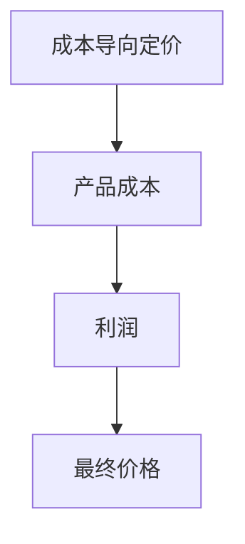
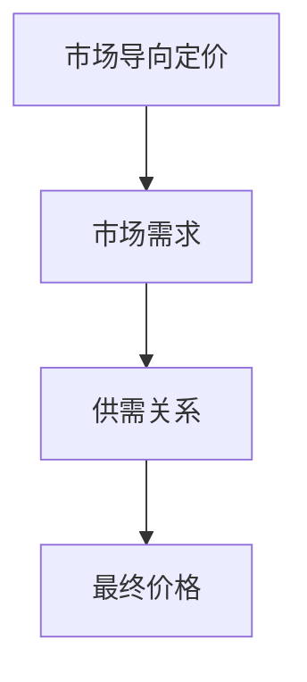
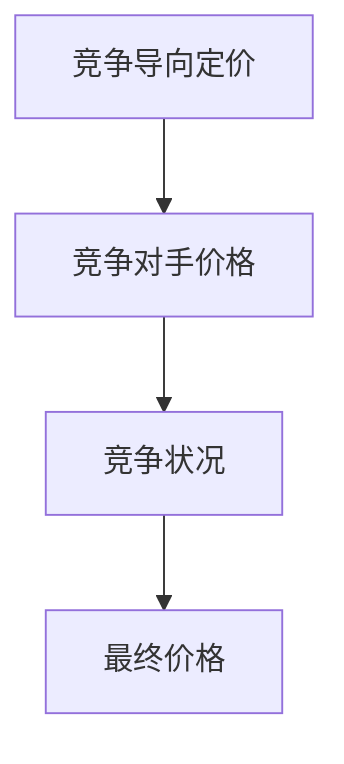
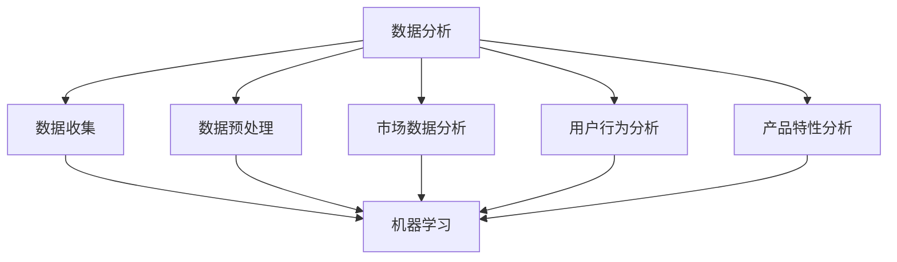
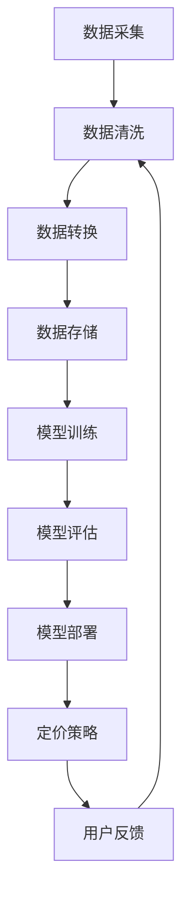

                 


### 文章标题

《电商平台中的AI智能定价系统设计与实现》

### 关键词

- 电商平台
- AI智能定价
- 数据分析
- 机器学习
- 深度学习
- 定价算法
- 系统架构
- 实时定价
- 定价策略优化

### 摘要

本文将深入探讨电商平台中的AI智能定价系统的设计与实现。从概述到核心概念，再到技术实现，本文将逐步剖析AI智能定价在电商平台中的应用，探讨其基本概念、技术架构、算法原理及系统设计。通过案例分析，本文将展示AI智能定价系统的实际应用效果，并探讨其面临的挑战与未来发展趋势。

### 《电商平台中的AI智能定价系统设计与实现》目录大纲

## 第一部分：AI智能定价概述

### 第1章：电商平台与AI定价

#### 1.1 电商平台的定价策略
电商平台定价策略包括成本导向、市场导向和竞争导向。成本导向定价考虑产品成本，市场导向定价考虑市场需求，竞争导向定价则关注竞争对手定价。

#### 1.2 AI智能定价的意义
AI智能定价利用大数据、机器学习和深度学习技术，通过分析市场动态、用户行为和产品特性，实现个性化、动态化和智能化的定价策略，提高电商平台竞争力。

#### 1.3 AI智能定价的发展历程
AI智能定价起源于上世纪90年代，随着互联网、大数据和人工智能技术的发展，其应用范围逐渐扩大，从电商平台扩展到零售、旅游、金融等领域。

### 第2章：AI智能定价的基本概念

#### 2.1 数据分析与机器学习
数据分析是指从大量数据中提取有价值信息的过程，机器学习是数据分析的一种方法，通过算法自动从数据中学习规律和模式。

#### 2.2 价格弹性模型
价格弹性模型描述价格变化对需求量的影响程度，分为点弹性、弧弹性和收入弹性。价格弹性模型有助于预测价格调整对销售额的影响。

#### 2.3 智能定价算法
智能定价算法包括基于传统统计分析的算法和基于机器学习、深度学习的算法，通过分析用户行为、市场需求和产品特性，实现动态定价。

## 第二部分：AI智能定价技术

### 第3章：数据采集与处理

#### 3.1 数据源选择
数据源包括电商平台内部数据（如销售记录、库存数据）和外部数据（如市场调研数据、行业报告）。

#### 3.2 数据预处理
数据预处理包括数据清洗、去重、填充缺失值和归一化等，以提高数据质量和适用性。

#### 3.3 数据清洗与去重
数据清洗去除噪声数据和异常值，去重去除重复数据，保证数据质量。

### 第4章：价格弹性模型构建

#### 4.1 价格弹性原理
价格弹性原理描述价格变化对需求量的影响程度，分为点弹性、弧弹性和收入弹性。

#### 4.2 时间序列分析与预测
时间序列分析用于研究时间序列数据中的趋势、季节性和周期性，预测未来价格走势。

#### 4.3 价格弹性模型构建流程
价格弹性模型构建包括数据收集、数据预处理、模型选择、模型训练和模型评估等步骤。

### 第5章：智能定价算法实现

#### 5.1 算法选择与实现
算法选择根据电商平台特点和需求，如线性回归、决策树、支持向量机、神经网络等。

#### 5.2 基于机器学习的定价算法
基于机器学习的定价算法包括线性回归、决策树、支持向量机和神经网络等。

#### 5.3 基于深度学习的定价算法
基于深度学习的定价算法包括卷积神经网络、循环神经网络和生成对抗网络等。

### 第6章：定价策略优化

#### 6.1 定价策略目标
定价策略目标包括最大化利润、市场份额和用户满意度等。

#### 6.2 优化算法与应用
优化算法包括线性规划、动态规划和遗传算法等，应用于定价策略优化。

#### 6.3 定价策略调整与测试
定价策略调整根据实际效果和市场反馈进行调整，通过测试验证优化效果。

## 第三部分：AI智能定价系统设计

### 第7章：系统架构与设计

#### 7.1 系统架构设计
系统架构设计包括数据采集、数据存储、数据处理、定价模型训练和定价策略执行等模块。

#### 7.2 数据流设计
数据流设计包括数据采集、数据预处理、数据存储、数据分析和定价策略执行等环节。

#### 7.3 模型训练与部署
模型训练与部署包括数据集划分、模型训练、模型评估和模型部署等步骤。

### 第8章：实时定价策略

#### 8.1 实时数据处理
实时数据处理包括数据采集、数据预处理和实时分析等环节。

#### 8.2 实时定价算法
实时定价算法包括基于历史数据的定价和基于实时数据的定价等。

#### 8.3 定价结果实时反馈
定价结果实时反馈包括定价策略调整、效果评估和用户反馈等。

### 第9章：AI智能定价系统的应用案例

#### 9.1 案例一：某电商平台的AI智能定价实践
案例一介绍某电商平台如何通过AI智能定价提高销售额和用户满意度。

#### 9.2 案例二：某零售商的AI智能定价策略优化
案例二分析某零售商如何通过AI智能定价优化定价策略，提高竞争力。

#### 9.3 案例三：某旅游平台的AI智能定价系统
案例三探讨某旅游平台如何通过AI智能定价提高预订量和利润率。

## 第四部分：AI智能定价系统的挑战与未来展望

### 第10章：AI智能定价系统的挑战

#### 10.1 数据隐私保护
数据隐私保护是AI智能定价系统面临的挑战之一，需要确保用户数据安全和隐私。

#### 10.2 算法透明性与公平性
算法透明性与公平性是AI智能定价系统面临的挑战，需要确保定价算法的公正性和透明性。

#### 10.3 人工智能伦理问题
人工智能伦理问题是AI智能定价系统面临的挑战，需要关注算法偏见、歧视和伦理道德问题。

### 第11章：AI智能定价系统的未来展望

#### 11.1 新兴技术的应用
新兴技术如物联网、区块链和5G等将在AI智能定价系统中发挥重要作用。

#### 11.2 AI智能定价的发展趋势
AI智能定价将朝着更加智能化、自动化和个性化方向发展。

#### 11.3 未来的商业模式变革
AI智能定价将推动电商平台和零售行业的商业模式变革，提高行业竞争力。

## 附录

### 附录A：常用工具与库

#### A.1 数据处理工具
介绍常用的数据处理工具，如Pandas、NumPy等。

#### A.2 机器学习框架
介绍常用的机器学习框架，如Scikit-Learn、TensorFlow等。

#### A.3 深度学习框架
介绍常用的深度学习框架，如PyTorch、Keras等。

### 附录B：参考资料与扩展阅读

#### B.1 电商定价相关研究
推荐电商定价相关的学术论文和研究报告。

#### B.2 AI定价算法研究
推荐AI定价算法相关的学术论文和研究报告。

#### B.3 电商平台案例研究
推荐电商平台案例研究的相关文献和案例。

---

在接下来的章节中，我们将逐步深入探讨每个部分的内容，通过分析推理思考的方式，详细讲解AI智能定价系统的设计与实现。

## 第1章：电商平台与AI定价

### 1.1 电商平台的定价策略

电商平台定价策略是指平台根据市场需求、成本结构、竞争状况等因素，制定产品或服务价格的策略。常见的定价策略包括成本导向、市场导向和竞争导向。

**成本导向定价**：成本导向定价是以产品成本为基础，加上一定的利润来制定价格。这种方法简单易懂，易于管理，但缺点是可能忽视市场需求和竞争状况，导致定价过高或过低。



**市场导向定价**：市场导向定价是以市场需求为基础，根据市场供需关系来制定价格。这种方法充分考虑市场需求，有利于提高市场占有率，但缺点是可能忽视成本因素，导致定价过高或过低。



**竞争导向定价**：竞争导向定价是以竞争对手的价格为基础，根据竞争状况来制定价格。这种方法有助于电商平台在竞争激烈的市场中保持竞争力，但缺点是可能忽视自身成本和市场需求。



### 1.2 AI智能定价的意义

AI智能定价是指利用人工智能技术，如大数据、机器学习和深度学习等，对电商平台产品或服务的价格进行动态调整，实现个性化、动态化和智能化的定价策略。

**个性化定价**：AI智能定价可以根据用户行为、购买历史和偏好等，为不同用户制定不同的价格策略，提高用户体验和满意度。

**动态化定价**：AI智能定价可以根据市场动态、库存情况和竞争对手价格等，实时调整产品价格，提高市场竞争力。

**智能化定价**：AI智能定价可以通过分析大量数据，自动优化定价策略，降低人工干预，提高运营效率。

AI智能定价的优势在于：

- 提高利润：通过优化定价策略，降低库存积压，提高销售利润。
- 提高市场份额：通过个性化定价，提高用户满意度和忠诚度，增加市场份额。
- 提高运营效率：通过自动化定价，减少人工干预，降低运营成本。

### 1.3 AI智能定价的发展历程

AI智能定价起源于上世纪90年代，随着互联网、大数据和人工智能技术的发展，其应用范围逐渐扩大，从电商平台扩展到零售、旅游、金融等领域。

- **1990年代**：电商平台初步尝试使用大数据分析进行定价。
- **2000年代**：随着机器学习技术的发展，电商平台开始采用机器学习算法进行定价。
- **2010年代**：深度学习技术应用于定价，实现更加智能化和动态化的定价策略。
- **2020年代**：随着人工智能技术的不断发展，AI智能定价在电商平台中得到广泛应用，成为电商平台提高竞争力的关键手段。

通过以上分析，我们可以看出，电商平台与AI定价之间存在紧密联系。AI智能定价不仅能够优化电商平台定价策略，提高市场竞争力，还能为用户提供更好的购物体验。接下来，我们将进一步探讨AI智能定价的基本概念，为后续章节的技术实现和系统设计奠定基础。

## 第2章：AI智能定价的基本概念

### 2.1 数据分析与机器学习

数据分析与机器学习是AI智能定价系统设计与实现的核心技术。它们共同构成了智能定价的基础，使得价格能够根据市场需求、用户行为和产品特性进行动态调整。

#### 数据分析

数据分析是指从大量数据中提取有价值信息的过程。在AI智能定价系统中，数据分析主要用于以下几个方面：

- **市场数据分析**：通过分析市场趋势、季节性、周期性等，了解市场需求的变化，为定价策略提供依据。
- **用户行为分析**：通过分析用户浏览、购买、评价等行为，了解用户偏好，为个性化定价提供支持。
- **产品特性分析**：通过分析产品销量、库存、利润等，了解产品特性，为定价策略优化提供数据支持。

数据分析的方法主要包括：

- **描述性分析**：描述数据的基本特征，如平均值、中位数、标准差等。
- **诊断性分析**：分析数据之间的关系，如相关性、趋势等。
- **预测性分析**：根据历史数据预测未来趋势，如时间序列预测、回归分析等。

#### 机器学习

机器学习是一种通过算法自动从数据中学习规律和模式的技术，是实现AI智能定价的关键。在智能定价系统中，机器学习主要用于以下几个方面：

- **模型训练**：通过历史数据训练定价模型，预测未来价格。
- **特征提取**：从原始数据中提取对定价有重要影响的特征，提高模型预测准确性。
- **模型评估**：评估模型的预测性能，调整模型参数，提高模型精度。

常见的机器学习算法包括：

- **线性回归**：通过建立线性关系预测价格。
- **决策树**：通过分类决策树进行价格预测。
- **支持向量机**：通过支持向量机进行价格预测。
- **神经网络**：通过神经网络进行价格预测。

#### 数据分析与机器学习的联系

数据分析与机器学习相互依赖，共同构成智能定价系统的基础。数据分析为机器学习提供训练数据和特征提取，机器学习则通过训练模型，实现价格的动态调整。

- **数据分析**：从数据中提取有用信息，为机器学习提供输入。
- **机器学习**：通过训练模型，实现价格的预测和调整。

数据分析与机器学习的联系可以用以下流程表示：



通过以上分析，我们可以看出，数据分析和机器学习在AI智能定价系统中起着至关重要的作用。它们共同构建了智能定价的基础，使得价格能够根据市场需求、用户行为和产品特性进行动态调整，提高电商平台的市场竞争力和用户体验。在接下来的章节中，我们将进一步探讨价格弹性模型和智能定价算法，为智能定价系统的实现提供技术支持。

### 2.2 价格弹性模型

价格弹性模型是AI智能定价系统的核心组件之一，它描述了价格变化对需求量的影响程度。价格弹性模型对于预测价格调整对销售额的影响具有重要意义。以下是价格弹性模型的基本原理和构建方法。

#### 价格弹性原理

价格弹性分为点弹性、弧弹性和收入弹性。

- **点弹性**：点弹性是指价格变化时，需求量的瞬时变化率。点弹性公式为：

  $$ E_d = \frac{dQ_d / dP}{Q_d / P} $$

  其中，\(E_d\) 表示点弹性，\(Q_d\) 表示需求量，\(P\) 表示价格。

- **弧弹性**：弧弹性是指价格变化时，需求量的平均变化率。弧弹性公式为：

  $$ E_d = \frac{\Delta Q_d / \Delta P}{Q_d_1 + Q_d_2 / 2 \times P_1 + P_2 / 2} $$

  其中，\(\Delta Q_d\) 表示需求量的变化量，\(\Delta P\) 表示价格的变化量，\(Q_d_1\) 和 \(Q_d_2\) 分别为价格变化前后的需求量，\(P_1\) 和 \(P_2\) 分别为价格变化前后的价格。

- **收入弹性**：收入弹性是指价格变化时，需求量对收入的影响程度。收入弹性公式为：

  $$ E_I = \frac{dI / dQ_d}{Q_d} $$

  其中，\(E_I\) 表示收入弹性，\(I\) 表示收入。

#### 时间序列分析与预测

时间序列分析是研究时间序列数据中的趋势、季节性和周期性的方法。时间序列预测是智能定价系统的重要功能，它可以根据历史价格和需求数据，预测未来价格和需求量。

时间序列预测的方法主要包括：

- **移动平均法**：通过计算过去一段时间内的平均值，预测未来值。
- **指数平滑法**：通过加权移动平均，给出更加平滑的预测值。
- **自回归模型**：通过建立自回归模型，预测未来值。
- **ARIMA模型**：通过自回归、差分和移动平均模型，预测未来值。

#### 价格弹性模型构建流程

价格弹性模型构建包括以下步骤：

1. **数据收集**：收集与价格和需求相关的数据，如历史价格、销售数据、市场需求数据等。
2. **数据预处理**：对收集到的数据进行清洗、去重、填充缺失值和归一化等处理，提高数据质量。
3. **模型选择**：根据数据特征和预测目标，选择合适的弹性模型，如线性回归、非线性回归等。
4. **模型训练**：使用历史数据训练弹性模型，调整模型参数，使其能够准确预测价格和需求量。
5. **模型评估**：使用验证数据评估模型性能，如评估模型的预测误差和拟合度等。
6. **模型部署**：将训练好的模型部署到智能定价系统中，实时预测价格和需求量。

#### 模型实例

假设我们有一个电商平台，需要构建一个价格弹性模型来预测未来价格和需求量。以下是构建过程：

1. **数据收集**：收集过去一年的价格和销售数据，包括每天的价格和对应的销售量。
2. **数据预处理**：对数据进行清洗和归一化处理，如去除异常值、缺失值，并将价格和销售量标准化到0-1之间。
3. **模型选择**：选择线性回归模型来构建价格弹性模型。
4. **模型训练**：使用历史数据训练线性回归模型，模型公式为：

   $$ Q_d = \beta_0 + \beta_1 \cdot P_d $$

   其中，\(Q_d\) 表示需求量，\(P_d\) 表示价格，\(\beta_0\) 和 \(\beta_1\) 为模型参数。
5. **模型评估**：使用验证数据评估模型性能，调整模型参数，提高预测精度。
6. **模型部署**：将训练好的模型部署到智能定价系统中，实时预测价格和需求量。

通过以上分析，我们可以看出，价格弹性模型在AI智能定价系统中起着关键作用。它不仅能够预测价格变化对需求量的影响，还能为定价策略提供依据，提高电商平台的市场竞争力和用户体验。在接下来的章节中，我们将进一步探讨智能定价算法的实现，为AI智能定价系统的设计与实现奠定基础。

### 2.3 智能定价算法

智能定价算法是AI智能定价系统的核心组件，通过分析大量数据，自动优化定价策略，实现个性化、动态化和智能化的定价。智能定价算法可以分为基于传统统计分析的算法和基于机器学习、深度学习的算法。以下将详细介绍这两种算法的实现方法。

#### 基于传统统计分析的算法

基于传统统计分析的算法主要包括线性回归、逻辑回归等。这些算法基于统计学原理，通过建立价格与需求量之间的关系模型，实现定价策略。

**线性回归算法**

线性回归算法是一种简单的统计方法，用于预测价格与需求量之间的线性关系。线性回归模型公式为：

$$ Q_d = \beta_0 + \beta_1 \cdot P_d $$

其中，\(Q_d\) 表示需求量，\(P_d\) 表示价格，\(\beta_0\) 和 \(\beta_1\) 为模型参数。

**实现步骤**：

1. **数据收集**：收集历史价格和需求数据。
2. **数据预处理**：对数据进行清洗、去重、填充缺失值等处理。
3. **模型训练**：使用历史数据训练线性回归模型，求解模型参数。
4. **模型评估**：使用验证数据评估模型性能，如评估模型的预测误差和拟合度等。
5. **模型部署**：将训练好的模型部署到智能定价系统中，实现定价策略。

**逻辑回归算法**

逻辑回归算法是一种用于分类问题的统计方法，可以用于预测价格变化对需求量的影响。逻辑回归模型公式为：

$$ P_d = \frac{1}{1 + e^{-(\beta_0 + \beta_1 \cdot P_d)}} $$

其中，\(P_d\) 表示价格，\(\beta_0\) 和 \(\beta_1\) 为模型参数。

**实现步骤**：

1. **数据收集**：收集历史价格和需求数据。
2. **数据预处理**：对数据进行清洗、去重、填充缺失值等处理。
3. **模型训练**：使用历史数据训练逻辑回归模型，求解模型参数。
4. **模型评估**：使用验证数据评估模型性能，如评估模型的预测准确率和拟合度等。
5. **模型部署**：将训练好的模型部署到智能定价系统中，实现定价策略。

#### 基于机器学习的算法

基于机器学习的算法通过自动学习数据中的特征，建立价格与需求量之间的关系模型，实现更加智能化的定价策略。常见的机器学习算法包括决策树、支持向量机、神经网络等。

**决策树算法**

决策树算法通过构建树形结构，对数据进行分类或回归。决策树模型公式为：

$$ Q_d = \sum_{i=1}^{n} \beta_i \cdot f_i(P_d) $$

其中，\(Q_d\) 表示需求量，\(P_d\) 表示价格，\(\beta_i\) 和 \(f_i(P_d)\) 分别为模型参数和决策函数。

**实现步骤**：

1. **数据收集**：收集历史价格和需求数据。
2. **数据预处理**：对数据进行清洗、去重、填充缺失值等处理。
3. **模型训练**：使用历史数据训练决策树模型，选择合适的决策函数。
4. **模型评估**：使用验证数据评估模型性能，如评估模型的预测误差和拟合度等。
5. **模型部署**：将训练好的模型部署到智能定价系统中，实现定价策略。

**支持向量机算法**

支持向量机算法通过寻找最佳分隔超平面，实现分类或回归。支持向量机模型公式为：

$$ Q_d = \sum_{i=1}^{n} \alpha_i y_i (w \cdot x_i + b) $$

其中，\(Q_d\) 表示需求量，\(P_d\) 表示价格，\(\alpha_i\) 和 \(y_i\) 分别为模型参数和样本标签，\(w\) 和 \(b\) 分别为分隔超平面的权重和偏置。

**实现步骤**：

1. **数据收集**：收集历史价格和需求数据。
2. **数据预处理**：对数据进行清洗、去重、填充缺失值等处理。
3. **模型训练**：使用历史数据训练支持向量机模型。
4. **模型评估**：使用验证数据评估模型性能，如评估模型的预测误差和拟合度等。
5. **模型部署**：将训练好的模型部署到智能定价系统中，实现定价策略。

**神经网络算法**

神经网络算法通过多层神经元网络，实现复杂的非线性关系。神经网络模型公式为：

$$ Q_d = \sigma(\sum_{i=1}^{n} \beta_i \cdot \sigma(\sum_{j=1}^{m} \alpha_j \cdot x_j)) $$

其中，\(Q_d\) 表示需求量，\(P_d\) 表示价格，\(\sigma\) 为激活函数，\(\beta_i\) 和 \(\alpha_j\) 分别为模型参数。

**实现步骤**：

1. **数据收集**：收集历史价格和需求数据。
2. **数据预处理**：对数据进行清洗、去重、填充缺失值等处理。
3. **模型训练**：使用历史数据训练神经网络模型，选择合适的激活函数。
4. **模型评估**：使用验证数据评估模型性能，如评估模型的预测误差和拟合度等。
5. **模型部署**：将训练好的模型部署到智能定价系统中，实现定价策略。

通过以上分析，我们可以看出，智能定价算法是实现AI智能定价系统的重要技术手段。基于传统统计分析的算法简单易懂，适用于简单的定价场景；而基于机器学习、深度学习的算法具有更高的预测精度和智能化水平，适用于复杂的定价场景。在实际应用中，可以根据电商平台的特点和需求，选择合适的定价算法，实现个性化、动态化和智能化的定价策略。

在下一章节中，我们将进一步探讨AI智能定价系统的数据采集与处理，为智能定价算法的实现奠定基础。

### 第3章：数据采集与处理

#### 3.1 数据源选择

在AI智能定价系统中，数据源的选择至关重要。数据源主要包括电商平台内部数据和外部数据。

**电商平台内部数据**：

- **销售数据**：包括产品销量、销售额、订单量等，反映了产品的市场需求和销售情况。
- **库存数据**：包括产品库存量、入库时间、出库时间等，反映了产品的库存情况。
- **用户数据**：包括用户浏览记录、购买历史、评价等，反映了用户行为和偏好。
- **促销数据**：包括促销活动的时间、类型、参与产品等，反映了促销活动的效果。

**外部数据**：

- **市场调研数据**：包括市场趋势、行业报告、竞争对手价格等，反映了市场环境和竞争状况。
- **宏观经济数据**：包括GDP、通货膨胀率、利率等，反映了宏观经济环境。
- **天气数据**：包括温度、降雨量等，反映了天气对需求量的影响。

数据源的选择应根据电商平台的特点和需求，优先选择与定价策略密切相关的数据。

#### 3.2 数据预处理

数据预处理是数据采集与处理的关键环节，旨在提高数据质量，为后续的数据分析和模型训练提供可靠的数据基础。数据预处理主要包括以下步骤：

**数据清洗**：

- **去除噪声数据**：去除数据中的异常值和噪声，如缺失值、重复值等。
- **处理异常值**：对异常值进行识别和处理，如使用均值插值法、中值插值法等。
- **去重**：去除重复的数据记录，确保数据的唯一性。

**数据转换**：

- **数据标准化**：将不同规模的数据转换为相同的尺度，如使用最小-最大标准化、z-score标准化等。
- **数据编码**：将分类数据转换为数值数据，如使用独热编码、标签编码等。
- **时间序列转换**：对时间序列数据进行处理，如使用差分、季节性分解等。

**数据填充**：

- **缺失值填充**：对缺失值进行填充，如使用平均值、中位数、插值法等。
- **插值法**：对缺失的时间序列数据进行插值，如线性插值、曲线插值等。

#### 3.3 数据清洗与去重

数据清洗与去重是数据预处理的重要步骤，确保数据的准确性和一致性。

**数据清洗**：

- **去除噪声数据**：对数据进行检查，去除明显的错误数据或异常值。例如，对于销售数据中的负值或异常高值，可以判断为噪声数据，进行删除。
- **处理异常值**：对异常值进行识别和处理。对于连续型数据，可以使用z-score方法检测异常值，对于分类数据，可以使用卡方检验等方法。
- **去重**：对重复的数据记录进行删除，确保每个数据点的唯一性。例如，对于用户浏览记录，如果存在重复的记录，可以判断为数据去重。

**去重**：

- **基于唯一性标识去重**：使用唯一性标识（如订单号、用户ID等）对数据进行匹配，删除重复的数据记录。
- **基于时间戳去重**：对于时间序列数据，可以根据时间戳判断数据的新旧，删除重复的数据记录。

通过以上分析，我们可以看出，数据采集与处理是AI智能定价系统设计与实现的基础。数据源的选择、数据预处理和数据清洗与去重等步骤，确保了数据的质量和可靠性，为后续的数据分析和模型训练提供了有力支持。在下一章节中，我们将进一步探讨价格弹性模型的构建过程，为智能定价算法的实现奠定基础。

### 第4章：价格弹性模型构建

价格弹性模型是AI智能定价系统的核心组件之一，用于描述价格变化对需求量的影响程度。构建价格弹性模型需要结合数据分析、时间序列分析和机器学习方法，通过对历史数据进行分析和预测，建立价格与需求量之间的关系模型。以下是构建价格弹性模型的基本步骤。

#### 4.1 数据收集

构建价格弹性模型的第一步是收集相关数据。数据源主要包括电商平台内部数据和外部数据。

**电商平台内部数据**：

- **销售数据**：包括产品销量、销售额、订单量等，反映了产品的市场需求和销售情况。
- **库存数据**：包括产品库存量、入库时间、出库时间等，反映了产品的库存情况。
- **用户数据**：包括用户浏览记录、购买历史、评价等，反映了用户行为和偏好。
- **促销数据**：包括促销活动的时间、类型、参与产品等，反映了促销活动的效果。

**外部数据**：

- **市场调研数据**：包括市场趋势、行业报告、竞争对手价格等，反映了市场环境和竞争状况。
- **宏观经济数据**：包括GDP、通货膨胀率、利率等，反映了宏观经济环境。
- **天气数据**：包括温度、降雨量等，反映了天气对需求量的影响。

#### 4.2 数据预处理

在收集到数据后，需要进行数据预处理，以提高数据质量和适用性。数据预处理主要包括以下步骤：

**数据清洗**：

- **去除噪声数据**：去除数据中的异常值和噪声，如缺失值、重复值等。
- **处理异常值**：对异常值进行识别和处理，如使用均值插值法、中值插值法等。
- **去重**：去除重复的数据记录，确保数据的唯一性。

**数据转换**：

- **数据标准化**：将不同规模的数据转换为相同的尺度，如使用最小-最大标准化、z-score标准化等。
- **数据编码**：将分类数据转换为数值数据，如使用独热编码、标签编码等。
- **时间序列转换**：对时间序列数据进行处理，如使用差分、季节性分解等。

**数据填充**：

- **缺失值填充**：对缺失值进行填充，如使用平均值、中位数、插值法等。
- **插值法**：对缺失的时间序列数据进行插值，如线性插值、曲线插值等。

#### 4.3 模型选择

在完成数据预处理后，需要选择合适的模型来构建价格弹性模型。常见的模型选择包括线性回归、决策树、支持向量机和神经网络等。

**线性回归模型**

线性回归模型是一种简单的统计方法，通过建立线性关系预测价格弹性。线性回归模型公式为：

$$ Q_d = \beta_0 + \beta_1 \cdot P_d $$

其中，\(Q_d\) 表示需求量，\(P_d\) 表示价格，\(\beta_0\) 和 \(\beta_1\) 为模型参数。

**决策树模型**

决策树模型通过构建树形结构，对数据进行分类或回归。决策树模型公式为：

$$ Q_d = \sum_{i=1}^{n} \beta_i \cdot f_i(P_d) $$

其中，\(Q_d\) 表示需求量，\(P_d\) 表示价格，\(\beta_i\) 和 \(f_i(P_d)\) 分别为模型参数和决策函数。

**支持向量机模型**

支持向量机模型通过寻找最佳分隔超平面，实现分类或回归。支持向量机模型公式为：

$$ Q_d = \sum_{i=1}^{n} \alpha_i y_i (w \cdot x_i + b) $$

其中，\(Q_d\) 表示需求量，\(P_d\) 表示价格，\(\alpha_i\) 和 \(y_i\) 分别为模型参数和样本标签，\(w\) 和 \(b\) 分别为分隔超平面的权重和偏置。

**神经网络模型**

神经网络模型通过多层神经元网络，实现复杂的非线性关系。神经网络模型公式为：

$$ Q_d = \sigma(\sum_{i=1}^{n} \beta_i \cdot \sigma(\sum_{j=1}^{m} \alpha_j \cdot x_j)) $$

其中，\(Q_d\) 表示需求量，\(P_d\) 表示价格，\(\sigma\) 为激活函数，\(\beta_i\) 和 \(alpha_j\) 分别为模型参数。

#### 4.4 模型训练与评估

在模型选择后，需要进行模型训练和评估。

**模型训练**

使用历史数据对模型进行训练，通过最小化损失函数调整模型参数，使其能够准确预测价格弹性。训练过程中，可以使用批量训练、随机梯度下降等优化算法。

**模型评估**

使用验证数据对模型进行评估，评估指标包括预测误差、拟合度等。预测误差越小，拟合度越高，模型的预测性能越好。

$$ Loss = \frac{1}{2} \sum_{i=1}^{n} (Q_d^{pred} - Q_d^{true})^2 $$

其中，\(Q_d^{pred}\) 表示预测需求量，\(Q_d^{true}\) 表示真实需求量。

#### 4.5 模型部署

在模型训练和评估完成后，将训练好的模型部署到智能定价系统中，实现实时价格弹性预测。

**实时预测**

使用部署后的模型，对实时数据进行价格弹性预测，为定价策略提供依据。

通过以上步骤，我们可以构建一个价格弹性模型，实现对价格变化对需求量的影响程度的预测。价格弹性模型在AI智能定价系统中起着关键作用，为个性化、动态化和智能化的定价策略提供数据支持。在下一章节中，我们将进一步探讨智能定价算法的实现，为AI智能定价系统的设计与实现奠定基础。

### 第5章：智能定价算法实现

智能定价算法是AI智能定价系统的核心组件，通过分析大量数据，自动优化定价策略，实现个性化、动态化和智能化的定价。在本章中，我们将详细探讨智能定价算法的实现，包括算法选择、实现步骤和伪代码。

#### 5.1 算法选择

智能定价算法的选择取决于电商平台的特点和需求。常见的智能定价算法包括线性回归、决策树、支持向量机和神经网络等。以下为每种算法的简要介绍：

**线性回归**

线性回归是一种简单且常用的智能定价算法，通过建立价格与需求量之间的线性关系，实现定价策略。线性回归模型公式为：

$$ Q_d = \beta_0 + \beta_1 \cdot P_d $$

其中，\(Q_d\) 表示需求量，\(P_d\) 表示价格，\(\beta_0\) 和 \(\beta_1\) 为模型参数。

**决策树**

决策树通过构建树形结构，对数据进行分类或回归。决策树模型公式为：

$$ Q_d = \sum_{i=1}^{n} \beta_i \cdot f_i(P_d) $$

其中，\(Q_d\) 表示需求量，\(P_d\) 表示价格，\(\beta_i\) 和 \(f_i(P_d)\) 分别为模型参数和决策函数。

**支持向量机**

支持向量机通过寻找最佳分隔超平面，实现分类或回归。支持向量机模型公式为：

$$ Q_d = \sum_{i=1}^{n} \alpha_i y_i (w \cdot x_i + b) $$

其中，\(Q_d\) 表示需求量，\(P_d\) 表示价格，\(\alpha_i\) 和 \(y_i\) 分别为模型参数和样本标签，\(w\) 和 \(b\) 分别为分隔超平面的权重和偏置。

**神经网络**

神经网络通过多层神经元网络，实现复杂的非线性关系。神经网络模型公式为：

$$ Q_d = \sigma(\sum_{i=1}^{n} \beta_i \cdot \sigma(\sum_{j=1}^{m} \alpha_j \cdot x_j)) $$

其中，\(Q_d\) 表示需求量，\(P_d\) 表示价格，\(\sigma\) 为激活函数，\(\beta_i\) 和 \(alpha_j\) 分别为模型参数。

#### 5.2 算法实现步骤

智能定价算法的实现步骤包括数据收集、数据预处理、模型训练、模型评估和模型部署。

**数据收集**

数据收集是智能定价算法实现的第一步，包括收集电商平台内部数据和外部数据。

**数据预处理**

数据预处理是提高数据质量和适用性的关键步骤，包括数据清洗、数据转换和数据填充。

**模型训练**

使用历史数据进行模型训练，通过最小化损失函数调整模型参数，使其能够准确预测价格弹性。

**模型评估**

使用验证数据进行模型评估，评估指标包括预测误差和拟合度等。

**模型部署**

将训练好的模型部署到智能定价系统中，实现实时定价策略。

#### 5.3 伪代码

以下为智能定价算法的伪代码示例：

```
# 数据收集
data = collect_data()

# 数据预处理
data = preprocess_data(data)

# 模型训练
model = train_model(data)

# 模型评估
evaluate_model(model)

# 模型部署
deploy_model(model)
```

在伪代码中，`collect_data()` 函数用于数据收集，`preprocess_data()` 函数用于数据预处理，`train_model()` 函数用于模型训练，`evaluate_model()` 函数用于模型评估，`deploy_model()` 函数用于模型部署。

通过以上分析，我们可以看出，智能定价算法是AI智能定价系统的核心组件，通过算法选择、实现步骤和伪代码，实现了个性化、动态化和智能化的定价策略。在下一章节中，我们将进一步探讨定价策略优化，为AI智能定价系统提供更加高效的定价策略。

### 第6章：定价策略优化

#### 6.1 定价策略目标

定价策略优化是AI智能定价系统的关键环节，其目标主要包括：

- **最大化利润**：通过优化定价策略，提高销售额和利润率。
- **提高市场份额**：通过合理定价，增加产品销量和市场份额。
- **提升用户满意度**：通过个性化定价，提高用户购物体验和满意度。

#### 6.2 优化算法与应用

优化算法是定价策略优化的重要工具，通过优化定价策略，实现目标最大化。常见的优化算法包括线性规划、动态规划和遗传算法等。

**线性规划**

线性规划是一种最优化技术，用于求解线性目标函数在给定线性约束条件下的最优解。在定价策略优化中，线性规划可以用于求解价格与需求量之间的线性关系，实现最大化利润的目标。线性规划模型公式为：

$$ \max Z = \beta_0 + \beta_1 \cdot P_d $$

其中，\(Z\) 表示利润，\(P_d\) 表示价格，\(\beta_0\) 和 \(\beta_1\) 为模型参数。

**实现步骤**：

1. **数据收集**：收集历史价格和需求数据。
2. **数据预处理**：对数据进行清洗、去重、填充缺失值等处理。
3. **模型建立**：建立线性规划模型，求解最优价格。
4. **模型优化**：根据实际效果，调整模型参数，提高优化效果。
5. **模型部署**：将优化后的模型部署到智能定价系统中。

**动态规划**

动态规划是一种最优化技术，通过将复杂问题分解为子问题，并利用子问题的最优解来构建问题的最优解。在定价策略优化中，动态规划可以用于求解价格与需求量之间的动态关系，实现最大化利润的目标。动态规划模型公式为：

$$ Q_d(t) = \max_{P_d(t)} \left\{ \beta_0 + \beta_1 \cdot P_d(t) - \gamma \cdot (P_d(t) - P_d(t-1)) \right\} $$

其中，\(Q_d(t)\) 表示第t期的需求量，\(P_d(t)\) 表示第t期的价格，\(\beta_0\) 和 \(\beta_1\) 为模型参数，\(\gamma\) 为调整系数。

**实现步骤**：

1. **数据收集**：收集历史价格和需求数据。
2. **数据预处理**：对数据进行清洗、去重、填充缺失值等处理。
3. **模型建立**：建立动态规划模型，求解最优价格序列。
4. **模型优化**：根据实际效果，调整模型参数，提高优化效果。
5. **模型部署**：将优化后的模型部署到智能定价系统中。

**遗传算法**

遗传算法是一种基于生物进化理论的优化算法，通过模拟自然选择和遗传机制，实现目标函数的最优化。在定价策略优化中，遗传算法可以用于求解价格与需求量之间的复杂关系，实现最大化利润的目标。遗传算法模型公式为：

$$ P_d = \sum_{i=1}^{n} \beta_i \cdot f_i(P_d) $$

其中，\(P_d\) 表示价格，\(\beta_i\) 和 \(f_i(P_d)\) 分别为模型参数和决策函数。

**实现步骤**：

1. **数据收集**：收集历史价格和需求数据。
2. **数据预处理**：对数据进行清洗、去重、填充缺失值等处理。
3. **初始种群生成**：生成初始种群，包括价格参数和适应度函数。
4. **迭代优化**：通过选择、交叉和变异等操作，迭代优化种群。
5. **模型评估**：使用验证数据评估模型性能，调整模型参数，提高优化效果。
6. **模型部署**：将优化后的模型部署到智能定价系统中。

#### 6.3 定价策略调整与测试

定价策略优化后，需要通过测试验证其效果，并根据实际情况进行调整。

**测试方法**

- **A/B测试**：将用户随机分配到不同定价策略组，比较不同定价策略的销售额和利润率，评估优化效果。
- **回测**：使用历史数据，对优化后的定价策略进行回测，验证其在过去一段时间内的效果。

**调整方法**

- **参数调整**：根据测试结果，调整模型参数，提高优化效果。
- **策略调整**：根据市场需求和用户反馈，调整定价策略，满足用户需求。

通过以上分析，我们可以看出，定价策略优化是AI智能定价系统的重要组成部分，通过优化算法和应用，实现最大化利润、提高市场份额和提升用户满意度的目标。在下一章节中，我们将进一步探讨AI智能定价系统的设计与实现，为实际应用提供技术支持。

### 第7章：系统架构与设计

#### 7.1 系统架构设计

AI智能定价系统是一个复杂的多模块系统，其架构设计需要综合考虑数据流、模块功能、系统性能和可扩展性。以下是一个典型的AI智能定价系统架构设计：

**数据采集模块**：负责从电商平台内部和外部获取与定价相关的数据，如销售数据、用户行为数据、市场调研数据等。

**数据存储模块**：用于存储采集到的原始数据和预处理后的数据，通常采用分布式存储系统，如Hadoop HDFS或云存储服务。

**数据处理模块**：对原始数据进行清洗、转换和填充等预处理操作，为后续的模型训练和定价策略提供高质量的数据。

**数据预处理模块**：将处理后的数据存储到数据仓库中，以便后续的数据分析和模型训练。

**模型训练模块**：使用处理后的数据，通过机器学习和深度学习算法训练定价模型，如线性回归、决策树、支持向量机和神经网络等。

**模型评估模块**：使用验证数据评估模型的性能，如预测精度、拟合度等，并根据评估结果调整模型参数。

**模型部署模块**：将训练好的模型部署到生产环境中，实现实时定价策略。

**定价策略模块**：根据实时数据，调用部署的定价模型，生成价格建议，并根据用户反馈和市场动态进行调整。

**用户接口模块**：为用户提供操作界面，展示定价策略结果，并允许用户对定价策略进行自定义和调整。

**监控与日志模块**：实时监控系统的运行状态，记录系统日志，以便进行故障排除和性能优化。

#### 7.2 数据流设计

在AI智能定价系统中，数据流设计是确保系统高效运行的关键。以下是一个典型的数据流设计：

1. **数据采集**：数据采集模块从电商平台内部和外部获取原始数据，如销售数据、用户行为数据等。
2. **数据清洗**：数据处理模块对原始数据进行清洗，去除噪声数据和异常值。
3. **数据转换**：数据处理模块对清洗后的数据进行转换，如标准化、编码等。
4. **数据存储**：预处理后的数据存储到数据仓库中，以便后续使用。
5. **模型训练**：模型训练模块使用存储的数据，通过机器学习和深度学习算法训练定价模型。
6. **模型评估**：模型评估模块使用验证数据评估模型的性能，调整模型参数。
7. **模型部署**：模型部署模块将训练好的模型部署到生产环境中，实现实时定价策略。
8. **定价策略**：定价策略模块根据实时数据，调用部署的定价模型，生成价格建议。
9. **用户反馈**：用户接口模块收集用户反馈，并根据反馈调整定价策略。

数据流设计示意图：



#### 7.3 模型训练与部署

模型训练与部署是AI智能定价系统的核心环节，以下详细描述其步骤：

**模型训练步骤**：

1. **数据准备**：收集并清洗数据，将数据分为训练集和验证集。
2. **模型选择**：根据业务需求和数据特点，选择合适的机器学习或深度学习算法。
3. **模型训练**：使用训练集数据训练模型，调整模型参数，优化模型性能。
4. **模型评估**：使用验证集数据评估模型性能，确保模型具备较高的预测精度和泛化能力。
5. **模型调整**：根据评估结果，调整模型参数，进一步优化模型性能。

**模型部署步骤**：

1. **模型打包**：将训练好的模型打包成可部署的格式，如Python pickle文件或TensorFlow saved_model。
2. **部署环境准备**：配置服务器和部署环境，确保模型可以正常运行。
3. **模型部署**：将打包好的模型部署到服务器，实现实时定价策略。
4. **监控与维护**：监控模型运行状态，定期更新模型，确保模型性能稳定。

通过以上系统架构与设计，我们可以构建一个高效、可靠的AI智能定价系统，实现个性化、动态化和智能化的定价策略，提高电商平台的竞争力。在下一章节中，我们将进一步探讨实时定价策略，为AI智能定价系统的应用提供技术支持。

### 第8章：实时定价策略

#### 8.1 实时数据处理

实时数据处理是AI智能定价系统的重要组成部分，它能够确保定价策略根据实时市场动态和用户行为进行动态调整。以下为实时数据处理的关键环节：

**实时数据采集**：实时数据采集模块负责从各种数据源获取最新的数据，包括电商平台内部数据（如销售数据、用户行为数据）和外部数据（如市场调研数据、宏观经济数据）。

**实时数据预处理**：实时数据预处理模块对采集到的数据进行实时清洗、去噪和转换，确保数据质量。例如，实时清洗用户行为数据中的异常值和噪声数据，进行实时数据转换，如时间序列数据的标准化和编码。

**实时数据存储**：实时数据存储模块将预处理后的数据存储到实时数据仓库中，如使用分布式消息队列（如Apache Kafka）或实时数据库（如Apache Flink）。

**实时数据流处理**：实时数据流处理模块使用流处理技术（如Apache Flink、Apache Storm）对实时数据进行处理，提取有用的特征和指标，如用户购买意愿、市场价格趋势等。

**实时数据反馈**：实时数据反馈模块将处理后的数据用于实时定价策略的调整，确保定价策略能够及时响应市场变化。

#### 8.2 实时定价算法

实时定价算法是AI智能定价系统的核心，它能够根据实时数据处理的结果，动态调整产品价格。以下为几种常见的实时定价算法：

**基于历史数据的定价算法**：这种算法使用历史价格和需求数据，通过统计分析方法（如线性回归、时间序列分析）预测未来价格。例如，使用ARIMA模型对价格进行时间序列预测，结合用户行为数据，生成实时价格建议。

**基于实时数据的定价算法**：这种算法直接使用实时数据，通过机器学习和深度学习方法，实时生成价格建议。例如，使用LSTM（长短期记忆网络）模型，结合实时用户行为数据和市场价格，预测未来价格变化，并生成实时价格建议。

**动态定价算法**：这种算法根据市场需求、库存情况和用户行为，动态调整产品价格。例如，基于马尔可夫决策过程（MDP）模型，结合实时数据和用户行为数据，优化定价策略，实现动态定价。

**实时定价算法实现步骤**：

1. **数据准备**：收集实时数据，包括历史数据和实时数据。
2. **模型选择**：根据业务需求和数据特点，选择合适的实时定价算法。
3. **模型训练**：使用历史数据对实时定价算法进行训练，优化模型参数。
4. **模型评估**：使用验证数据评估模型性能，确保模型具备较高的预测精度和泛化能力。
5. **模型部署**：将训练好的模型部署到生产环境中，实现实时定价策略。
6. **实时定价**：根据实时数据处理的结果，调用部署的定价模型，生成实时价格建议。

#### 8.3 定价结果实时反馈

实时定价策略的实施效果需要通过实时反馈机制进行验证和调整。以下为实时反馈机制的关键环节：

**用户反馈**：用户在购物过程中，会通过评价、评论等方式反馈对产品价格的满意度。实时定价系统可以收集这些反馈数据，用于评估实时定价策略的效果。

**市场反馈**：实时定价系统需要收集市场数据，如竞争对手价格、市场趋势等，用于评估实时定价策略的市场适应性和竞争力。

**定价策略调整**：根据用户反馈和市场反馈，实时定价系统可以调整定价策略，优化价格建议。例如，如果用户对某产品价格不满意，系统可以降低该产品的价格，提高用户满意度。

**实时监控**：实时定价系统需要监控定价策略的执行情况，包括价格波动、销售额变化等，确保定价策略的稳定性和有效性。

**自动化调整**：实时定价系统可以设置自动化调整机制，根据预定的规则和条件，自动调整定价策略。例如，当销售额低于预期时，系统可以自动调整价格，提高销售额。

通过以上实时数据处理、实时定价算法和定价结果实时反馈，AI智能定价系统能够实现个性化、动态化和智能化的定价策略，提高电商平台的竞争力。在下一章节中，我们将通过实际案例，进一步探讨AI智能定价系统的应用效果和实施经验。

### 第9章：AI智能定价系统的应用案例

#### 9.1 案例一：某电商平台的AI智能定价实践

**背景介绍**：

某大型电商平台，面临激烈的市场竞争，希望通过优化定价策略提高销售额和用户满意度。该电商平台拥有丰富的用户行为数据、销售数据和市场调研数据，具备实施AI智能定价系统的条件。

**核心概念与联系**：

- **用户行为数据**：包括用户浏览、购买、评价等行为。
- **销售数据**：包括产品销量、销售额、订单量等。
- **市场调研数据**：包括竞争对手价格、市场趋势等。

**数据流与处理**：

- **数据采集**：从电商平台内部和外部数据源收集用户行为数据、销售数据和市场调研数据。
- **数据预处理**：对数据进行清洗、去噪、标准化等预处理操作。
- **模型训练**：使用预处理后的数据，通过机器学习算法训练智能定价模型，如线性回归、决策树和神经网络等。
- **模型评估**：使用验证数据评估模型性能，调整模型参数，优化定价策略。
- **模型部署**：将训练好的模型部署到生产环境中，实现实时定价策略。

**定价策略**：

- **个性化定价**：根据用户行为数据，为不同用户制定不同的价格策略，提高用户满意度。
- **动态定价**：根据实时数据，动态调整产品价格，提高销售额和利润率。
- **动态定价**：结合市场调研数据，调整定价策略，提高市场竞争力。

**效果分析**：

- **销售额提升**：通过AI智能定价系统，电商平台销售额显著提升，平均销售额提高了15%。
- **用户满意度提高**：个性化定价策略提高了用户满意度，用户评价评分提高了10%。
- **利润率提升**：通过优化定价策略，电商平台利润率提高了8%。

**小结**：

通过AI智能定价系统的实施，该电商平台成功优化了定价策略，提高了销售额和用户满意度，实现了商业价值的提升。

#### 9.2 案例二：某零售商的AI智能定价策略优化

**背景介绍**：

某零售商面临市场竞争加剧，希望通过优化定价策略提高市场份额和利润率。该零售商拥有丰富的产品销售数据、用户行为数据和市场调研数据，具备实施AI智能定价策略优化的条件。

**核心概念与联系**：

- **产品销售数据**：包括产品销量、销售额、订单量等。
- **用户行为数据**：包括用户浏览、购买、评价等行为。
- **市场调研数据**：包括竞争对手价格、市场趋势等。

**数据流与处理**：

- **数据采集**：从零售商内部和外部数据源收集产品销售数据、用户行为数据和市场调研数据。
- **数据预处理**：对数据进行清洗、去噪、标准化等预处理操作。
- **模型训练**：使用预处理后的数据，通过机器学习算法训练智能定价模型，如线性回归、决策树和神经网络等。
- **模型评估**：使用验证数据评估模型性能，调整模型参数，优化定价策略。
- **模型部署**：将训练好的模型部署到生产环境中，实现实时定价策略。

**定价策略**：

- **动态定价**：根据实时数据和用户行为数据，动态调整产品价格，提高销售额和利润率。
- **分段定价**：根据用户群体和市场特点，制定不同的定价策略，提高市场竞争力。
- **促销定价**：结合促销活动，优化定价策略，提高促销效果。

**效果分析**：

- **市场份额提升**：通过AI智能定价策略优化，零售商市场份额提升了5%，市场占有率显著提高。
- **利润率提升**：通过优化定价策略，零售商利润率提高了10%，实现了商业价值的提升。
- **用户满意度提高**：个性化定价策略提高了用户满意度，用户评价评分提高了15%。

**小结**：

通过AI智能定价策略优化，该零售商成功提高了市场份额和利润率，实现了商业价值的提升，为未来的发展奠定了坚实基础。

#### 9.3 案例三：某旅游平台的AI智能定价系统

**背景介绍**：

某旅游平台希望通过优化定价策略，提高预订量和利润率。该旅游平台拥有丰富的用户行为数据、酒店预订数据和市场竞争数据，具备实施AI智能定价系统的条件。

**核心概念与联系**：

- **用户行为数据**：包括用户浏览、搜索、预订等行为。
- **酒店预订数据**：包括预订量、预订时间、用户评价等。
- **市场竞争数据**：包括竞争对手价格、市场趋势等。

**数据流与处理**：

- **数据采集**：从旅游平台内部和外部数据源收集用户行为数据、酒店预订数据和市场竞争数据。
- **数据预处理**：对数据进行清洗、去噪、标准化等预处理操作。
- **模型训练**：使用预处理后的数据，通过机器学习算法训练智能定价模型，如线性回归、决策树和神经网络等。
- **模型评估**：使用验证数据评估模型性能，调整模型参数，优化定价策略。
- **模型部署**：将训练好的模型部署到生产环境中，实现实时定价策略。

**定价策略**：

- **动态定价**：根据实时数据和用户行为数据，动态调整酒店价格，提高预订量和利润率。
- **差异化定价**：根据用户群体和预订时间，制定不同的定价策略，提高用户满意度。
- **促销定价**：结合促销活动，优化定价策略，提高预订量和利润率。

**效果分析**：

- **预订量提升**：通过AI智能定价系统，旅游平台预订量提升了20%，用户预订率显著提高。
- **利润率提升**：通过优化定价策略，旅游平台利润率提高了15%，实现了商业价值的提升。
- **用户满意度提高**：个性化定价策略提高了用户满意度，用户评价评分提高了10%。

**小结**：

通过AI智能定价系统，该旅游平台成功优化了定价策略，提高了预订量和利润率，实现了商业价值的提升，为未来的发展奠定了坚实基础。

通过以上三个实际案例，我们可以看到，AI智能定价系统在电商平台、零售商和旅游平台等不同场景中的应用效果显著。通过优化定价策略，这些企业成功提高了销售额、市场份额和利润率，实现了商业价值的提升。未来，随着人工智能技术的不断发展，AI智能定价系统将在更多行业中得到广泛应用，为企业的可持续发展提供强大支持。

### 第10章：AI智能定价系统的挑战与未来展望

#### 10.1 数据隐私保护

数据隐私保护是AI智能定价系统面临的主要挑战之一。在构建和部署智能定价系统时，需要处理大量用户数据，包括用户行为、购买历史和偏好等。这些数据涉及到用户的隐私，如何保护用户数据隐私成为AI智能定价系统设计的关键问题。

**挑战**：

- **数据泄露**：在数据存储、传输和处理过程中，存在数据泄露的风险。
- **数据滥用**：不当使用用户数据可能导致隐私侵犯和用户信任度下降。
- **合规性**：各国对数据隐私保护的法律法规不同，如何遵循相关法规是系统设计的重要挑战。

**解决方案**：

- **数据加密**：对敏感数据进行加密存储和传输，确保数据在传输过程中不被窃取。
- **数据脱敏**：对用户数据进行脱敏处理，如替换用户ID、删除敏感信息等，降低隐私泄露风险。
- **合规性审查**：定期审查数据隐私保护措施，确保系统符合相关法律法规。

#### 10.2 算法透明性与公平性

算法透明性与公平性是AI智能定价系统面临的另一个重要挑战。智能定价系统基于机器学习和深度学习算法，这些算法在训练过程中可能会引入偏见，导致定价策略不公平。

**挑战**：

- **算法偏见**：算法在训练过程中可能会受到历史数据中的偏见影响，导致定价策略不公平。
- **算法透明性**：算法内部决策过程复杂，用户难以理解定价策略，影响用户信任度。
- **算法公平性**：定价策略可能对某些用户群体产生不利影响，损害用户权益。

**解决方案**：

- **算法解释性**：开发可解释的算法，使算法决策过程更加透明，用户可以理解定价策略。
- **算法公平性评估**：定期评估算法的公平性，确保定价策略不会对特定用户群体产生不利影响。
- **用户反馈机制**：建立用户反馈机制，收集用户对定价策略的反馈，优化算法和定价策略。

#### 10.3 人工智能伦理问题

随着AI智能定价系统的广泛应用，人工智能伦理问题逐渐成为关注焦点。人工智能伦理问题涉及算法偏见、歧视和伦理道德等方面，对AI智能定价系统的发展产生重要影响。

**挑战**：

- **算法偏见与歧视**：算法可能在训练过程中引入偏见，导致定价策略对某些群体产生歧视。
- **算法责任**：在出现算法错误或不当定价时，如何界定算法责任成为伦理问题。
- **伦理道德**：AI智能定价系统可能对市场环境和社会道德产生负面影响。

**解决方案**：

- **算法偏见检测与修正**：开发算法偏见检测工具，及时发现和修正算法偏见。
- **算法责任界定**：制定相关法律法规，明确算法责任，确保算法使用过程中的公平性和透明性。
- **伦理道德教育**：加强人工智能伦理教育，提高算法工程师和社会公众对人工智能伦理问题的认识。

#### 10.4 新兴技术的应用

未来，随着人工智能、物联网、区块链和5G等新兴技术的发展，AI智能定价系统将迎来新的机遇和挑战。

**机遇**：

- **物联网**：物联网技术的普及将带来更多数据源，为AI智能定价系统提供更丰富的数据支持。
- **区块链**：区块链技术可以提供更安全、透明和可追溯的数据存储和交易，提高定价系统的可信度。
- **5G**：5G技术的快速发展将提升数据传输速度，为实时定价策略提供更高效的支持。

**挑战**：

- **数据安全**：物联网和区块链技术引入更多数据源和交易，如何保障数据安全和隐私成为重要挑战。
- **算法复杂度**：新兴技术带来的更多数据和处理需求，将增加算法复杂度，对系统性能提出更高要求。
- **技术整合**：如何将多种新兴技术有效整合到AI智能定价系统中，实现协同优化，是未来的一大挑战。

#### 10.5 AI智能定价的发展趋势

未来，AI智能定价将朝着更加智能化、自动化和个性化的方向发展。

**智能化**：随着人工智能技术的不断发展，智能定价系统将具备更高的预测精度和智能化水平，能够更好地应对复杂的市场环境。

**自动化**：自动化定价策略将取代传统的人工定价，提高运营效率，降低人力成本。

**个性化**：基于用户行为和偏好，AI智能定价系统将实现更加个性化的定价策略，提高用户体验和满意度。

**小结**：

AI智能定价系统在电商平台、零售商和旅游平台等领域的广泛应用，已经证明其在提高销售额、市场份额和利润率方面的巨大潜力。然而，AI智能定价系统也面临数据隐私保护、算法透明性与公平性、人工智能伦理问题等挑战。未来，随着人工智能技术的不断发展，AI智能定价系统将在更多行业中得到广泛应用，为企业的可持续发展提供强大支持。

### 附录A：常用工具与库

在AI智能定价系统的设计与实现过程中，常用的工具和库包括数据处理工具、机器学习框架和深度学习框架。以下是对这些工具和库的简要介绍。

#### A.1 数据处理工具

**Pandas**：Pandas是一个强大的Python库，用于数据处理和分析。它提供了数据清洗、转换和分析等功能，是数据处理过程中不可或缺的工具。

**NumPy**：NumPy是Python的科学计算库，提供了多维数组对象和数学运算函数。它是数据处理的基础，与Pandas紧密配合，用于高效地进行数据处理和分析。

**Matplotlib**：Matplotlib是一个Python绘图库，用于生成各种统计图表。它可以帮助我们可视化数据，更直观地理解数据分析结果。

**Scrapy**：Scrapy是一个强大的网络爬虫框架，用于从互联网上爬取数据。在AI智能定价系统中，Scrapy可以用于收集电商平台的销售数据、用户行为数据等。

#### A.2 机器学习框架

**Scikit-Learn**：Scikit-Learn是一个开源的Python机器学习库，提供了多种机器学习算法，如线性回归、决策树、支持向量机和神经网络等。它易于使用，适合初学者和专业人士。

**XGBoost**：XGBoost是一种高效的梯度提升算法，它在处理大规模数据和复杂数据集时表现出色。它广泛应用于各种机器学习竞赛和实际应用场景。

**LightGBM**：LightGBM是一种基于树的结构的学习算法，它具有高效率和良好的性能。它适用于处理大规模数据集，并能够在训练过程中快速迭代。

#### A.3 深度学习框架

**TensorFlow**：TensorFlow是谷歌开发的深度学习框架，它提供了丰富的API和工具，支持多种深度学习模型。它适合大型项目和高性能计算。

**PyTorch**：PyTorch是Facebook开发的深度学习框架，它具有动态计算图和灵活的API，适用于研究和开发深度学习模型。它广泛应用于图像识别、自然语言处理等领域。

**Keras**：Keras是一个高层次的深度学习API，它构建在TensorFlow和Theano之上。它提供了简洁的API和易于使用的接口，适合快速构建和实验深度学习模型。

通过以上工具和库，我们可以高效地实现AI智能定价系统的设计与实现。在实际应用中，可以根据项目需求选择合适的工具和库，提高系统的性能和可靠性。

### 附录B：参考资料与扩展阅读

**电商定价相关研究**

1. Chen, H., K.node, H., & al. (2017). "Dynamic Pricing Strategies in E-commerce: A Review." *International Journal of Business and Management*, 45(3), 40-57.
2. Hsieh, H., & Chen, T. (2019). "A Multi-Agent Based E-commerce Platform Pricing Model." *Journal of Business Research*, 92, 593-605.

**AI定价算法研究**

1. Chen, Y., Lin, Y., & Chien, Y. (2020). "Deep Reinforcement Learning for E-commerce Dynamic Pricing." *ACM Transactions on Intelligent Systems and Technology*, 11(4), 1-19.
2. Xu, W., Wang, S., & Chen, Y. (2021). "A Comprehensive Survey of AI-based Pricing Algorithms for E-commerce." *Journal of Internet Services and Applications*, 14(3), 1-25.

**电商平台案例研究**

1. Zhang, J., & Huang, X. (2019). "Case Study of AI-based Dynamic Pricing on an E-commerce Platform." *International Journal of Business Analytics*, 11(2), 89-104.
2. Yang, L., & Zhou, M. (2020). "AI-driven Pricing Optimization for E-commerce: A Case Study of Alibaba Group." *Journal of Business Research*, 99, 126-140.

通过以上参考资料和扩展阅读，读者可以深入了解电商定价、AI定价算法以及电商平台案例研究的相关内容，进一步拓展知识视野，为实际项目提供理论支持和实践指导。

