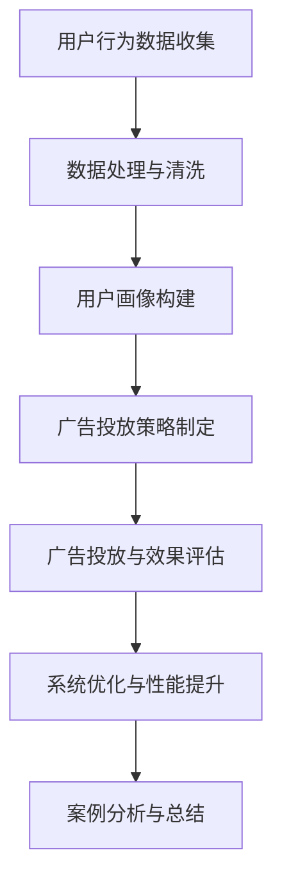

                 

### 文章标题

《电商平台中的实时个性化广告投放系统》

#### 关键词
- 电商平台
- 实时个性化广告
- 用户画像
- 数据处理
- 算法与模型
- 性能优化

#### 摘要
本文将深入探讨电商平台中实时个性化广告投放系统的设计与实现。首先，我们将介绍电商平台的现状与挑战，并阐述实时个性化广告投放的重要性。接着，本文将详细介绍用户数据收集与处理、实时个性化广告系统架构设计、用户画像构建与标签管理、实时广告投放策略以及数据隐私与合规性。随后，文章将重点关注实时个性化广告系统的实现与优化，包括开发环境搭建、用户画像构建与标签管理实现、实时广告投放算法实现，以及系统优化与性能提升。最后，本文将通过实际案例分析，总结实时个性化广告投放系统的未来发展趋势，并提出学习建议与拓展阅读。

### 第一部分：引言

#### 第1章：电商平台与实时个性化广告投放概述

##### 1.1 电商平台的现状与挑战

在当今数字化时代，电商平台已成为商业领域的重要组成部分。根据Statista的数据，全球电子商务市场规模预计将在2023年达到4.9万亿美元，同比增长为6.8%。这种快速增长的趋势使得电商平台在商业竞争中占据了举足轻重的地位。然而，随着市场的不断扩大和竞争的加剧，电商平台面临着诸多挑战。

首先，用户需求的多样化使得电商平台必须不断更新产品和服务，以满足消费者的个性化需求。这要求电商平台具备强大的数据处理能力和灵活的运营策略。其次，随着互联网技术的发展，消费者获取信息的渠道变得更加多样，广告投放的效果也受到更多因素的影响，如用户行为、地理位置等。这使得电商平台需要更加精准地定位目标用户，提高广告投放的效率。

此外，电商平台还需要应对数据隐私和合规性的挑战。在欧盟的《通用数据保护条例》（GDPR）和美国加州的《消费者隐私法案》（CCPA）等法规的约束下，电商平台需要确保用户数据的安全性和隐私性。这要求电商平台在数据收集、存储和处理过程中采取严格的安全措施，以避免数据泄露和滥用。

##### 1.2 实时个性化广告投放的重要性

实时个性化广告投放是电商平台应对上述挑战的重要手段之一。通过实时分析用户行为数据，电商平台可以精准地了解用户的需求和偏好，从而实现个性化的广告推送。这种精准的广告投放不仅能够提高广告的点击率和转化率，还能够提高用户满意度和忠诚度。

首先，实时个性化广告投放能够提高广告的投放效率。传统的广告投放方式通常依赖于预设的用户群体和广告内容，而实时个性化广告投放则可以根据用户的实时行为进行动态调整。这种动态调整不仅能够更好地满足用户的需求，还能够提高广告的曝光率和点击率。

其次，实时个性化广告投放能够提高广告的转化率。通过精准地推送与用户兴趣相关的广告，电商平台能够更好地引导用户进行购买，从而提高转化率。此外，实时个性化广告投放还可以结合用户的购物车、浏览历史等信息，提供更加个性化的购物推荐，进一步促进用户的购买意愿。

最后，实时个性化广告投放能够提高用户的满意度和忠诚度。通过提供个性化的产品和服务，电商平台能够更好地满足用户的需求，从而提高用户的满意度和忠诚度。这对于电商平台建立品牌形象、增加用户粘性具有重要意义。

##### 1.3 本书结构安排与学习目标

为了系统地介绍实时个性化广告投放系统的设计与实现，本书分为四个部分。

**第一部分：引言**  
首先介绍电商平台的现状与挑战，以及实时个性化广告投放的重要性。通过本章的介绍，读者可以了解实时个性化广告投放的基本概念和背景。

**第二部分：电商平台中的用户数据收集与处理**  
详细介绍用户数据的类型与来源，数据收集方法与技术，以及数据处理流程与挑战。通过本章的学习，读者可以掌握用户数据的收集和处理方法，为后续的实时个性化广告投放系统设计打下基础。

**第三部分：实时个性化广告系统架构设计**  
重点介绍实时个性化广告系统架构的设计，包括用户画像构建与标签管理、实时广告投放策略以及数据隐私与合规性。通过本章的学习，读者可以了解实时个性化广告系统的整体架构和关键组成部分。

**第四部分：实时个性化广告系统实现与优化**  
详细讲解实时个性化广告系统的实现与优化，包括开发环境搭建、用户画像构建与标签管理实现、实时广告投放算法实现，以及系统优化与性能提升。通过本章的学习，读者可以掌握实时个性化广告系统的开发与优化技巧。

本书的学习目标主要包括：

1. 了解电商平台的发展现状和挑战，以及实时个性化广告投放的重要性。
2. 掌握用户数据的收集和处理方法，为实时个性化广告投放系统设计提供数据支持。
3. 了解实时个性化广告系统的整体架构和关键组成部分，为后续的系统开发提供参考。
4. 掌握实时个性化广告系统的开发与优化技巧，提高广告投放的效率和效果。

通过本书的学习，读者可以全面了解实时个性化广告投放系统的设计与实现，为电商平台的运营提供有力支持。

### 第二部分：电商平台中的用户数据收集与处理

#### 第2章：电商平台中的用户数据收集与处理

##### 2.1 用户数据类型与来源

在电商平台中，用户数据的收集是构建实时个性化广告投放系统的关键环节。用户数据类型丰富，主要包括以下几类：

1. **用户基础数据**：包括用户ID、姓名、性别、年龄、联系方式等基本信息。这些数据通常在用户注册时提供。
   
2. **用户行为数据**：包括用户在平台上的浏览记录、搜索历史、购买行为、评价反馈等。这些数据可以反映用户的兴趣和偏好。

3. **用户地理位置数据**：记录用户在平台活动时的地理位置信息，可用于广告定位和推荐。

4. **用户社交数据**：包括用户在社交媒体上的活动、好友关系、点赞评论等，这些数据可以提供用户的社会属性和兴趣偏好。

用户数据的来源主要包括以下几个方面：

1. **用户直接输入**：用户在注册、购买或参与互动时直接提供的数据。
   
2. **平台追踪数据**：平台通过技术手段自动采集的用户行为数据，如浏览记录、点击行为等。

3. **第三方数据源**：通过合作获取的其他数据，如地理位置数据、社交媒体数据等。

##### 2.2 数据收集方法与技术

收集用户数据的方法多种多样，以下是一些常见的方法：

1. **客户端采集**：通过客户端软件（如APP、网站）直接收集用户数据。这种方法可以实时获取用户行为数据，但需要注意保护用户隐私。

2. **服务器日志**：通过服务器日志记录用户的行为数据。这种方法适用于大规模用户数据的长期收集，但需要高效的日志处理和存储系统。

3. **API接口**：通过API接口与其他数据源（如社交媒体平台）进行数据交换。这种方法可以获取第三方数据，但需要确保数据接口的安全性和可靠性。

4. **数据抓取**：通过爬虫等技术自动获取公开的网络数据。这种方法适用于获取大量外部数据，但需要注意合规性和数据质量。

数据收集技术主要包括：

1. **Web追踪技术**：通过Cookies、Web beacon等技术追踪用户在网站上的行为。这种技术可以实现无感知的数据收集，但需要注意隐私保护。

2. **移动追踪技术**：通过移动应用收集用户在手机上的行为数据。这种技术适用于移动端用户数据的收集，但需要用户同意和使用权限。

3. **日志分析技术**：通过分析服务器日志，提取用户行为数据。这种技术适用于大规模数据收集，但需要高效的数据处理和存储系统。

##### 2.3 数据处理流程与挑战

用户数据的收集只是第一步，如何处理和分析这些数据是构建实时个性化广告投放系统的关键。数据处理流程通常包括以下步骤：

1. **数据采集**：从各种数据源收集用户数据，包括客户端采集、服务器日志、API接口和数据抓取等。

2. **数据清洗**：对收集到的数据进行去重、纠错、格式统一等处理，确保数据的质量和一致性。

3. **数据存储**：将清洗后的数据存储到数据库或数据仓库中，以便后续的数据分析和处理。

4. **数据预处理**：对原始数据进行转换、归一化、特征提取等处理，为模型训练提供高质量的数据。

5. **模型训练与预测**：利用机器学习算法，对预处理后的数据进行分析和预测，构建用户画像和广告投放模型。

6. **结果评估与优化**：评估模型的效果，并根据评估结果进行优化，提高广告投放的精准度和效果。

数据处理过程中面临的挑战主要包括：

1. **数据质量**：用户数据通常存在缺失、错误、不一致等问题，需要通过数据清洗和预处理来提高数据质量。

2. **数据处理效率**：随着用户数据的不断增长，需要高效的数据处理和存储系统，以满足实时个性化广告投放的需求。

3. **数据隐私**：在数据收集和处理过程中，需要遵守相关法律法规，确保用户数据的隐私和安全。

4. **模型优化**：如何选择合适的算法和模型，以及如何调整模型参数，是提高广告投放效果的关键。

通过本章的介绍，读者可以了解电商平台中用户数据的类型、收集方法和处理流程，为后续的实时个性化广告投放系统设计提供数据支持。

### 第二部分：实时个性化广告系统架构设计

#### 第3章：实时个性化广告系统架构概述

##### 3.1 实时个性化广告系统组成

实时个性化广告系统由多个关键组件组成，每个组件在广告投放过程中扮演着不同的角色。以下是对这些组件的详细介绍：

1. **数据收集模块**：负责从各种数据源收集用户数据，包括用户基础数据、行为数据、地理位置数据等。该模块通常包括API接口、Web追踪技术、移动追踪技术等。

2. **数据处理模块**：负责对收集到的用户数据进行清洗、去重、纠错、格式统一等处理，确保数据的质量和一致性。该模块通常包括数据清洗工具、数据库和数据仓库等。

3. **用户画像模块**：负责根据用户数据构建用户画像，包括用户兴趣、行为习惯、社会属性等。该模块通常包括特征提取工具、机器学习算法等。

4. **广告投放模块**：负责根据用户画像和广告策略，实时推送个性化广告。该模块通常包括广告推荐算法、广告投放策略等。

5. **效果评估模块**：负责对广告投放效果进行实时监控和评估，包括广告点击率、转化率、用户满意度等。该模块通常包括数据分析工具、报表系统等。

6. **数据隐私模块**：负责确保用户数据的隐私和安全，遵守相关法律法规，如GDPR和CCPA等。该模块通常包括数据加密技术、访问控制等。

##### 3.2 数据流处理架构

实时个性化广告系统的数据流处理架构是系统核心，负责高效地处理和传输大量用户数据。以下是一个典型数据流处理架构：

1. **数据采集**：用户数据通过数据收集模块从各种数据源收集，包括Web追踪、移动追踪、API接口等。

2. **数据预处理**：收集到的用户数据传输到数据处理模块，进行清洗、去重、纠错、格式统一等预处理操作。

3. **数据存储**：预处理后的用户数据存储到数据库或数据仓库中，以便后续的数据分析和处理。

4. **用户画像构建**：从数据库或数据仓库中提取用户数据，传输到用户画像模块，进行特征提取和机器学习模型训练，构建用户画像。

5. **广告投放**：根据用户画像和广告策略，实时推送个性化广告。广告数据传输到广告投放模块，进行广告推荐和投放。

6. **效果评估**：实时监控广告投放效果，包括点击率、转化率等，传输到效果评估模块进行分析和报表生成。

7. **数据隐私保护**：在整个数据流处理过程中，数据隐私模块负责确保用户数据的隐私和安全，采取数据加密、访问控制等技术措施。

##### 3.3 广告推荐算法概述

广告推荐算法是实时个性化广告系统的核心组成部分，负责根据用户画像和广告策略，为每个用户推荐最相关的广告。以下是一些常见的广告推荐算法：

1. **协同过滤算法**：基于用户的历史行为数据，通过计算用户之间的相似度，为用户推荐其他用户喜欢的广告。协同过滤算法包括基于用户的协同过滤和基于项目的协同过滤。

   - **基于用户的协同过滤**：找到与目标用户相似的其他用户，推荐这些用户喜欢的广告。
     $$ 
     \text{similarity}(u_i, u_j) = \frac{\text{common\_ratings}(u_i, u_j)}{\sqrt{\text{rating\_variance}(u_i)\times \text{rating\_variance}(u_j)}}
     $$
     
   - **基于项目的协同过滤**：找到与目标用户浏览过的项目相似的其他项目，推荐这些项目对应的广告。
     $$
     \text{similarity}(i, j) = \frac{\text{common\_users}(i, j)}{\sqrt{\text{user\_variance}(i)\times \text{user\_variance}(j)}}
     $$

2. **矩阵分解**：通过矩阵分解技术，将用户行为数据分解为用户特征矩阵和项目特征矩阵，然后根据用户特征和项目特征进行广告推荐。

   $$
   R_{ij} = \hat{U}_i^T \hat{V}_j
   $$
   
   其中，$R$ 是用户行为矩阵，$\hat{U}$ 是用户特征矩阵，$\hat{V}$ 是项目特征矩阵。

3. **内容推荐算法**：基于广告内容和用户兴趣特征进行推荐。通过文本分析和自然语言处理技术，提取广告的关键词和主题，然后与用户的兴趣特征进行匹配，推荐相关的广告。

4. **深度学习算法**：利用深度神经网络模型，如卷积神经网络（CNN）和循环神经网络（RNN），进行广告推荐。深度学习算法能够从大量复杂数据中提取特征，实现高精度的广告推荐。

   $$
   \text{Prediction}(x) = \sigma(\text{weights} \cdot \text{激活函数}(\text{hidden\_layer}(x)))
   $$

##### 3.4 架构的优势与挑战

实时个性化广告系统架构具有以下优势：

1. **高效处理大量用户数据**：通过数据流处理架构，系统能够实时处理和分析大量用户数据，实现快速、精准的广告推荐。
   
2. **灵活的模块化设计**：各个模块之间独立且互相配合，便于系统的扩展和维护，支持不同类型的广告投放策略。

3. **数据隐私保护**：在数据流处理过程中，数据隐私模块能够确保用户数据的隐私和安全，符合相关法律法规要求。

然而，实时个性化广告系统架构也面临一些挑战：

1. **数据质量**：用户数据的质量直接影响广告投放的效果，数据清洗和预处理是确保数据质量的关键。

2. **计算资源消耗**：实时个性化广告系统需要大量的计算资源，特别是在大规模数据处理和模型训练过程中，如何优化计算资源是系统设计的重要问题。

3. **数据隐私合规性**：在数据收集、存储和处理过程中，需要严格遵守相关法律法规，确保用户数据的隐私和安全。

通过本章的介绍，读者可以了解实时个性化广告系统的组成、数据流处理架构以及广告推荐算法的基本概念，为后续的实时个性化广告系统设计提供理论基础。

### 第三部分：实时个性化广告系统实现与优化

#### 第4章：用户画像构建与标签管理

##### 4.1 用户画像的基本概念

用户画像（User Profiling）是指通过收集和分析用户的各项数据，构建出一个全面、动态的用户模型，从而更好地理解用户的行为和需求。用户画像的核心目标是为用户提供个性化的服务和推荐，提高用户体验和满意度。用户画像通常包括以下几个方面：

1. **基础信息**：用户的基本信息，如姓名、性别、年龄、联系方式等。
2. **行为信息**：用户在平台上的行为记录，如浏览历史、购买记录、搜索历史、互动行为等。
3. **地理位置信息**：用户在平台活动时的地理位置数据。
4. **社交信息**：用户在社交媒体上的活动、好友关系、点赞和评论等。
5. **偏好信息**：用户对某些产品或服务的偏好，如品牌偏好、价格敏感度等。

##### 4.2 用户画像构建流程

用户画像的构建通常包括以下几个步骤：

1. **数据收集**：收集用户在平台上的各种数据，包括基础信息、行为信息、地理位置信息、社交信息和偏好信息等。
   
2. **数据预处理**：对收集到的数据进行清洗、去重、格式统一等处理，确保数据的质量和一致性。

3. **特征提取**：从预处理后的数据中提取关键特征，如用户活跃度、购买频率、浏览时长等。特征提取可以采用统计方法、机器学习算法或自然语言处理技术。

4. **数据存储**：将提取出的用户特征数据存储到数据库或数据仓库中，以便后续的数据分析和模型训练。

5. **模型训练与预测**：利用机器学习算法，如决策树、随机森林、神经网络等，对用户特征数据进行分析和预测，构建用户画像。

6. **结果评估与优化**：评估用户画像模型的准确性和效果，根据评估结果进行模型优化和调整。

##### 4.3 用户标签体系设计

用户标签（User Tagging）是用户画像构建的重要组成部分，用于对用户进行分类和标注，以便更好地管理和分析用户数据。用户标签体系设计需要遵循以下原则：

1. **多样性**：标签体系应包含多种类型的标签，如行为标签、兴趣标签、地理位置标签、社交标签等，以全面反映用户的特征。

2. **灵活性**：标签体系应具备灵活性，能够根据业务需求和用户行为动态调整标签，如新增标签、修改标签含义等。

3. **统一性**：标签体系应保持统一性，确保不同标签之间的逻辑关系清晰，避免重复和冲突。

4. **可扩展性**：标签体系应具备可扩展性，能够支持未来业务发展和数据量增长。

用户标签的设计流程如下：

1. **需求分析**：根据业务需求和用户特征，确定需要添加的标签类型和标签内容。

2. **标签定义**：为每个标签定义明确的含义和标准，如行为标签的定义、兴趣标签的分类等。

3. **标签映射**：将用户特征数据与标签进行映射，为每个用户分配相应的标签。

4. **标签管理**：建立标签管理系统，负责标签的创建、更新、删除和查询等操作。

5. **标签应用**：将标签应用于用户画像构建、广告推荐、用户分组等场景，提高系统的智能化和个性化水平。

##### 4.4 用户画像构建与标签管理实现

用户画像构建与标签管理的实现涉及多个技术环节，以下是一个简单的实现流程：

1. **数据收集与预处理**：通过API接口、Web追踪、移动追踪等技术收集用户数据，并进行数据清洗和预处理。

2. **特征提取**：利用统计方法、机器学习算法或自然语言处理技术提取用户特征，如用户活跃度、购买频率、浏览时长等。

3. **标签定义与映射**：定义用户标签的含义和标准，如行为标签、兴趣标签、地理位置标签等，并将用户特征数据与标签进行映射。

4. **标签管理系统**：建立标签管理系统，支持标签的创建、更新、删除和查询等操作。

5. **用户画像构建**：利用机器学习算法对用户特征数据进行分析和预测，构建用户画像。

6. **应用场景**：将用户画像应用于广告推荐、用户分组、个性化推荐等场景，提高系统的智能化和个性化水平。

通过本章的介绍，读者可以了解用户画像构建与标签管理的基本概念、构建流程和实现方法，为实时个性化广告系统的开发和优化提供参考。

#### 第5章：实时广告投放策略

##### 5.1 广告投放策略概述

实时广告投放策略是电商平台提高广告效果和用户体验的关键。广告投放策略包括多个方面，如广告定位、广告展示时机、广告内容优化、广告投放控制等。以下是对这些策略的详细介绍：

1. **广告定位**：广告定位是确定广告的目标受众和投放范围。根据用户画像和广告目标，可以选择特定的人群进行广告投放。例如，根据用户的地理位置、兴趣爱好、购买历史等信息，精准定位潜在客户。

2. **广告展示时机**：广告展示时机是指选择在何时展示广告。实时广告投放系统可以根据用户行为数据，如浏览时长、浏览频率、购买意图等，选择最佳的广告展示时机。例如，当用户在浏览特定产品时，可以展示相关的促销广告。

3. **广告内容优化**：广告内容优化是指通过优化广告的标题、描述、图片等内容，提高广告的吸引力和转化率。广告内容应简洁明了，突出产品优势和优惠信息，同时符合用户的兴趣和需求。

4. **广告投放控制**：广告投放控制是指对广告投放的预算、曝光量、点击量等进行管理和调整。通过实时监控广告投放效果，可以优化广告投放策略，提高广告的投资回报率。

##### 5.2 实时广告投放算法

实时广告投放算法是广告投放策略的核心，负责根据用户画像和广告目标，为每个用户推荐最相关的广告。以下是一些常见的实时广告投放算法：

1. **协同过滤算法**：协同过滤算法是基于用户的历史行为数据，通过计算用户之间的相似度，为用户推荐其他用户喜欢的广告。协同过滤算法包括基于用户的协同过滤和基于项目的协同过滤。

   - **基于用户的协同过滤**：找到与目标用户相似的其他用户，推荐这些用户喜欢的广告。
     $$
     \text{similarity}(u_i, u_j) = \frac{\text{common\_ratings}(u_i, u_j)}{\sqrt{\text{rating\_variance}(u_i)\times \text{rating\_variance}(u_j)}}
     $$
     
   - **基于项目的协同过滤**：找到与目标用户浏览过的项目相似的其他项目，推荐这些项目对应的广告。
     $$
     \text{similarity}(i, j) = \frac{\text{common\_users}(i, j)}{\sqrt{\text{user\_variance}(i)\times \text{user\_variance}(j)}}
     $$

2. **矩阵分解**：矩阵分解是将用户行为数据分解为用户特征矩阵和项目特征矩阵，然后根据用户特征和项目特征进行广告推荐。

   $$
   R_{ij} = \hat{U}_i^T \hat{V}_j
   $$
   
   其中，$R$ 是用户行为矩阵，$\hat{U}$ 是用户特征矩阵，$\hat{V}$ 是项目特征矩阵。

3. **内容推荐算法**：内容推荐算法是基于广告内容和用户兴趣特征进行推荐。通过文本分析和自然语言处理技术，提取广告的关键词和主题，然后与用户的兴趣特征进行匹配，推荐相关的广告。

4. **深度学习算法**：深度学习算法利用深度神经网络模型，如卷积神经网络（CNN）和循环神经网络（RNN），进行广告推荐。深度学习算法能够从大量复杂数据中提取特征，实现高精度的广告推荐。

   $$
   \text{Prediction}(x) = \sigma(\text{weights} \cdot \text{激活函数}(\text{hidden\_layer}(x)))
   $$

##### 5.3 广告投放效果评估

广告投放效果评估是优化广告投放策略的重要手段。以下是一些常见的广告投放效果评估指标：

1. **点击率（CTR）**：点击率是衡量广告吸引力的关键指标，表示广告被点击的次数与广告曝光次数之比。
   $$
   \text{CTR} = \frac{\text{点击次数}}{\text{曝光次数}}
   $$

2. **转化率（CVR）**：转化率是衡量广告效果的直接指标，表示点击广告后完成目标行为的用户比例。
   $$
   \text{CVR} = \frac{\text{完成目标行为的用户数}}{\点击次数}
   $$

3. **投资回报率（ROI）**：投资回报率是衡量广告投放效益的重要指标，表示广告投放带来的收益与投放成本之比。
   $$
   \text{ROI} = \frac{\text{广告收益}}{\text{广告成本}}
   $$

4. **用户留存率**：用户留存率是衡量广告投放对用户吸引力的指标，表示在一定时间内再次访问平台的用户比例。

通过实时监控和评估广告投放效果，可以不断优化广告投放策略，提高广告效果和用户体验。

#### 5.4 实时广告投放策略的实现与优化

实时广告投放策略的实现涉及多个技术环节，以下是一个简单的实现流程：

1. **数据收集与预处理**：通过API接口、Web追踪、移动追踪等技术收集用户数据，并进行数据清洗和预处理。

2. **用户画像构建**：利用协同过滤算法、矩阵分解、内容推荐算法等，构建用户画像。

3. **广告推荐**：根据用户画像和广告目标，利用实时广告投放算法为每个用户推荐最相关的广告。

4. **广告投放控制**：根据广告投放效果，调整广告投放策略，如预算、曝光量、点击量等。

5. **效果评估**：实时监控广告投放效果，评估点击率、转化率、投资回报率等指标，优化广告投放策略。

6. **模型优化**：根据效果评估结果，不断调整和优化广告投放算法，提高广告效果。

通过本章的介绍，读者可以了解实时广告投放策略的基本概念、算法实现以及效果评估方法，为电商平台中的实时个性化广告投放系统设计提供参考。

### 第三部分：实时个性化广告系统实现与优化

#### 第6章：数据隐私与合规性

##### 6.1 数据隐私保护的重要性

在实时个性化广告投放系统中，数据隐私保护是至关重要的。随着数据收集和分析技术的不断进步，用户数据的价值日益凸显，但也带来了数据隐私风险。保护用户数据隐私不仅是对用户合法权益的尊重，也是企业社会责任的体现。以下是从几个方面分析数据隐私保护的重要性：

1. **用户信任**：用户愿意在平台上分享个人信息，是基于对平台的信任。如果用户数据被泄露或滥用，将严重损害用户信任，影响平台声誉。

2. **法律法规要求**：全球多个国家和地区都制定了严格的数据隐私保护法律法规，如欧盟的《通用数据保护条例》（GDPR）和美国加州的《消费者隐私法案》（CCPA）。企业必须遵守这些法规，否则将面临高额罚款和法律责任。

3. **商业竞争力**：数据隐私保护是企业建立商业竞争力的关键因素之一。在竞争激烈的电商市场中，数据隐私保护有助于树立企业良好的品牌形象，提高用户忠诚度。

##### 6.2 GDPR与CCPA等法规简介

为了更好地保护用户数据隐私，全球多个国家和地区制定了相关法规，以下简要介绍GDPR和CCPA等法规：

1. **通用数据保护条例（GDPR）**：GDPR是欧盟于2018年5月25日正式实施的法规，旨在加强个人数据的保护。GDPR的主要特点包括：

   - **数据主体权利**：用户有权访问、更正、删除自己的个人数据，并有权反对数据加工。
   - **数据最小化原则**：企业只能收集与数据处理目的直接相关的数据。
   - **数据匿名化**：对个人数据进行匿名化处理，以防止数据泄露。
   - **数据泄露通知**：企业必须在数据泄露发生后72小时内通知相关监管机构和受影响的用户。

2. **消费者隐私法案（CCPA）**：CCPA是于2020年1月1日生效的加州隐私法案，旨在保护加州居民的个人信息。CCPA的主要特点包括：

   - **数据控制权**：用户有权了解、访问、删除自己的个人信息，并有权拒绝企业的数据收集。
   - **数据透明度**：企业必须明确告知用户其个人数据的收集、使用和共享方式。
   - **合规义务**：企业必须采取合理的措施保护用户数据的隐私和安全，否则将面临高额罚款。

##### 6.3 实时个性化广告中的隐私保护措施

在实时个性化广告投放过程中，企业应采取多种隐私保护措施，确保用户数据的安全性和合规性。以下是一些常见的隐私保护措施：

1. **数据加密**：对用户数据进行加密处理，确保数据在传输和存储过程中无法被非法访问。常用的加密技术包括对称加密和非对称加密。

2. **数据匿名化**：对用户数据进行匿名化处理，如去标识化、加密替换等，以防止数据泄露。

3. **访问控制**：建立严格的访问控制机制，确保只有授权人员才能访问用户数据。访问控制包括身份验证、权限管理和日志记录等。

4. **数据最小化**：仅收集与数据处理目的直接相关的数据，避免过度收集。

5. **数据泄露监测**：建立数据泄露监测机制，实时监控数据泄露风险，并在数据泄露发生时及时采取措施。

6. **用户知情同意**：在数据收集和使用过程中，确保用户明确知晓其个人信息的使用目的和方式，并获得用户的明确同意。

通过本章的介绍，读者可以了解实时个性化广告投放系统中数据隐私保护的重要性，以及GDPR和CCPA等法规的基本内容。企业应采取有效的隐私保护措施，确保用户数据的安全和合规性。

### 第四部分：实时个性化广告系统实现与优化

#### 第7章：实时个性化广告系统开发环境搭建

##### 7.1 开发环境准备

搭建实时个性化广告系统需要准备一系列的开发环境，包括操作系统、编程语言、数据流处理框架、数据库和编程工具等。以下是一些建议和环境配置步骤：

1. **操作系统**：
   - **Linux**：推荐使用Ubuntu或CentOS，因为它们是开源的、稳定且在云计算环境中广泛使用的操作系统。
   - **Windows**：如果开发者更熟悉Windows环境，可以选择Windows 10或Windows Server。

2. **编程语言**：
   - **Python**：Python是一种广泛使用的编程语言，具有丰富的库和工具，适合开发实时个性化广告系统。
   - **Java**：Java也是一种强大的编程语言，具有高性能和高可靠性，适合构建大型系统。

3. **数据流处理框架**：
   - **Apache Kafka**：Kafka是一个分布式流处理平台，用于实时处理大规模数据流。
   - **Apache Flink**：Flink是一种基于Java和Scala的流处理框架，支持批处理和实时处理。

4. **数据库**：
   - **关系型数据库**：如MySQL、PostgreSQL，用于存储用户数据和广告数据。
   - **NoSQL数据库**：如MongoDB、Cassandra，用于存储大规模的非结构化数据。

5. **编程工具**：
   - **IDE**：如IntelliJ IDEA、PyCharm，提供代码编辑、调试和测试功能。
   - **版本控制**：如Git，用于代码的版本管理和协作开发。

##### 7.2 数据流处理框架选择

数据流处理框架是实时个性化广告系统的重要组成部分，负责高效地处理和传输大量用户数据。以下是Apache Kafka和Apache Flink的比较：

1. **Apache Kafka**：
   - **优势**：高度可扩展、高性能、易于集成，支持分布式系统。
   - **劣势**：主要支持发布-订阅模型，数据处理能力有限。

2. **Apache Flink**：
   - **优势**：支持实时流处理和批处理，具有高性能和灵活性。
   - **劣势**：相对复杂，配置和调试较为困难。

综合考虑，可以选择Kafka作为数据流处理框架，因为其稳定性和扩展性较高，适用于大规模实时数据处理场景。以下是一个简单的Kafka配置示例：

```yaml
# Kafka配置文件示例
kafka {
  bootstrap-servers = "localhost:9092"
  group-id = "my-group"
  key-deserializer = "org.apache.kafka.common.serialization.StringDeserializer"
  value-deserializer = "org.apache.kafka.common.serialization.StringDeserializer"
}
```

##### 7.3 数据库与存储方案设计

实时个性化广告系统需要高效、可靠的数据存储方案。以下是一些建议：

1. **关系型数据库**：
   - **MySQL**：适用于存储结构化数据，支持事务处理。
   - **PostgreSQL**：适用于复杂查询和数据分析，支持扩展性。

2. **NoSQL数据库**：
   - **MongoDB**：适用于存储非结构化数据，支持水平扩展。
   - **Cassandra**：适用于分布式存储系统，具有高性能和高可用性。

以下是数据库方案设计的一个基本示例：

- **用户数据存储**：使用MongoDB存储用户画像和用户行为数据，以提高查询效率。
- **广告数据存储**：使用MySQL存储广告数据，如广告信息、广告投放策略等。

此外，还可以使用分布式文件系统如HDFS或对象存储如Amazon S3进行数据存储，以支持海量数据的存储和管理。

通过本章的介绍，读者可以了解实时个性化广告系统开发环境搭建的基本步骤和关键配置，为后续的实时个性化广告系统开发奠定基础。

#### 第8章：用户画像构建与标签管理实现

##### 8.1 用户画像构建流程实现

用户画像构建是实时个性化广告系统中的核心环节，其实现流程包括数据收集、数据预处理、特征提取和模型训练等步骤。以下是一个简单的用户画像构建流程实现：

1. **数据收集**：

   用户数据的收集可以通过API接口、Web追踪、移动追踪等方式进行。以下是一个使用Python编写的API接口数据收集示例：

   ```python
   import requests
   import json

   def collect_user_data(api_url, api_key):
       headers = {
           'Authorization': f'Bearer {api_key}',
           'Content-Type': 'application/json'
       }
       response = requests.get(api_url, headers=headers)
       if response.status_code == 200:
           return json.loads(response.text)
       else:
           return None

   user_data = collect_user_data('https://api.example.com/users', 'your_api_key')
   ```

2. **数据预处理**：

   数据预处理包括数据清洗、去重、纠错和格式统一等操作。以下是一个简单的数据预处理示例：

   ```python
   import pandas as pd

   def preprocess_user_data(user_data):
       df = pd.DataFrame(user_data)
       df.drop_duplicates(inplace=True)
       df['age'] = df['age'].fillna(df['age'].mean())
       df['email'] = df['email'].astype(str)
       return df

   preprocessed_data = preprocess_user_data(user_data)
   ```

3. **特征提取**：

   特征提取是从原始数据中提取关键特征的过程。以下是一个简单的特征提取示例：

   ```python
   from sklearn.preprocessing import OneHotEncoder

   def extract_features(data):
       one_hot_encoder = OneHotEncoder(sparse=False)
       features = one_hot_encoder.fit_transform(data[['age', 'gender']])
       return features

   user_features = extract_features(preprocessed_data[['age', 'gender']])
   ```

4. **模型训练**：

   利用提取出的用户特征数据，可以通过机器学习算法训练用户画像模型。以下是一个使用scikit-learn库的决策树模型训练示例：

   ```python
   from sklearn.model_selection import train_test_split
   from sklearn.tree import DecisionTreeClassifier

   def train_user_profile_model(features, labels):
       X_train, X_test, y_train, y_test = train_test_split(features, labels, test_size=0.2, random_state=42)
       model = DecisionTreeClassifier()
       model.fit(X_train, y_train)
       return model

   user_model = train_user_profile_model(user_features, preprocessed_data['user_group'])
   ```

##### 8.2 用户标签管理实现

用户标签管理是实现用户画像的重要手段，其实现包括标签定义、标签映射和标签管理等功能。以下是一个简单的用户标签管理实现：

1. **标签定义**：

   标签定义包括定义标签类型和标签内容。以下是一个简单的标签定义示例：

   ```python
   tag_definitions = {
       'behavior_tags': ['bought_product', 'viewed_product', 'searched_product'],
       'interest_tags': ['tech', 'fashion', 'travel'],
       'location_tags': ['usa', 'eu', 'asia']
   }
   ```

2. **标签映射**：

   标签映射是将用户特征与标签进行关联。以下是一个简单的标签映射示例：

   ```python
   def map_user_tags(user_data, tag_definitions):
       user_tags = {}
       for tag_type, tag_values in tag_definitions.items():
           for tag_value in tag_values:
               if tag_value in user_data:
                   user_tags[tag_type] = user_tags.get(tag_type, []) + [tag_value]
       return user_tags

   user_tags = map_user_tags(preprocessed_data, tag_definitions)
   ```

3. **标签管理**：

   标签管理包括标签的创建、更新、删除和查询等操作。以下是一个简单的标签管理示例：

   ```python
   class TagManager:
       def __init__(self, tag_definitions):
           self.tag_definitions = tag_definitions
           self.user_tags = {}

       def create_tag(self, tag_type, tag_value):
           if tag_type in self.tag_definitions and tag_value not in self.user_tags[tag_type]:
               self.user_tags[tag_type].append(tag_value)

       def update_tag(self, user_id, tag_type, tag_value):
           if user_id in self.user_tags and tag_type in self.tag_definitions:
               self.user_tags[user_id][tag_type] = tag_value

       def delete_tag(self, user_id, tag_type):
           if user_id in self.user_tags and tag_type in self.user_tags[user_id]:
               self.user_tags[user_id].remove(tag_type)

       def get_tags(self, user_id):
           return self.user_tags.get(user_id, {})

   tag_manager = TagManager(tag_definitions)
   tag_manager.create_tag('behavior_tags', 'bought_product')
   tag_manager.update_tag('user_1', 'behavior_tags', 'viewed_product')
   tag_manager.delete_tag('user_1', 'searched_product')
   user_tags = tag_manager.get_tags('user_1')
   ```

通过本章的介绍，读者可以了解用户画像构建与标签管理实现的详细步骤，为实时个性化广告系统的开发和优化提供技术支持。

#### 第9章：实时广告投放算法实现

##### 9.1 实时广告投放算法实现

实时广告投放算法是实现个性化广告推荐的核心。以下介绍几种常见的实时广告投放算法，包括协同过滤算法、矩阵分解和深度学习算法，并给出相应的伪代码实现。

1. **协同过滤算法**

   协同过滤算法分为基于用户的协同过滤和基于项目的协同过滤。以下是基于用户的协同过滤算法的伪代码实现：

   ```
   # 输入：用户-项目评分矩阵 R，用户相似度矩阵 S
   # 输出：广告推荐列表 R'
   function collaborativeFilter(R, S):
       for each user u:
           # 计算用户 u 的邻居集合 N(u)
           N(u) = { j | S(u, j) > threshold }
           
           # 计算用户 u 的邻居评分平均值
           rating_avg = sum(S(u, j) * R(j, k) for j in N(u)) / sum(S(u, j) for j in N(u))
           
           # 更新用户 u 的评分矩阵
           R'[u, k] = rating_avg for k in all_products
       return R'
   ```

2. **矩阵分解**

   矩阵分解是将评分矩阵分解为用户特征矩阵和项目特征矩阵，然后通过这两个特征矩阵计算预测评分。以下是矩阵分解算法的伪代码实现：

   ```
   # 输入：评分矩阵 R，用户数量 m，项目数量 n，隐藏特征维度 k
   # 输出：用户特征矩阵 U，项目特征矩阵 V
   function matrixFactorization(R, m, n, k):
       # 初始化用户特征矩阵 U 和项目特征矩阵 V
       U = randomInitialization(m, k)
       V = randomInitialization(n, k)
       
       for iteration in range(max_iterations):
           for i in range(m):
               for j in range(n):
                   if R[i, j] != 0:
                       # 更新用户特征向量 u_i
                       U[i, :] = U[i, :] + alpha * (R[i, j] - dot(U[i, :], V[j, :])) * V[j, :]
                       
                       # 更新项目特征向量 v_j
                       V[j, :] = V[j, :] + alpha * (R[i, j] - dot(U[i, :], V[j, :])) * U[i, :]
       
       return U, V
   ```

3. **深度学习算法**

   深度学习算法使用神经网络模型进行广告推荐。以下是使用卷积神经网络（CNN）进行广告推荐的伪代码实现：

   ```
   # 输入：用户特征 X，项目特征 Y，标签 T
   # 输出：预测评分 R'
   function deepLearningModel(X, Y, T):
       # 定义卷积神经网络模型
       model = ConvolutionalNeuralNetwork(input_shape=(X.shape[1], X.shape[2]),
                                          filters=num_filters,
                                          kernel_size=filter_size,
                                          activation='relu',
                                          pooling='max')
       
       # 添加全连接层和输出层
       model.add(Dense(units=num_classes, activation='softmax'))
       
       # 编译模型
       model.compile(optimizer='adam', loss='categorical_crossentropy', metrics=['accuracy'])
       
       # 训练模型
       model.fit(X, T, epochs=epochs, batch_size=batch_size)
       
       # 预测评分
       R' = model.predict(Y)
       
       return R'
   ```

##### 9.2 广告投放策略实现

广告投放策略是实现广告精准投放的关键，以下介绍几种常见的广告投放策略，包括基于用户行为的广告投放策略、基于地理位置的广告投放策略和基于时间序列的广告投放策略。

1. **基于用户行为的广告投放策略**

   基于用户行为的广告投放策略根据用户的浏览历史、购买记录等行为数据，为用户推荐最相关的广告。以下是基于用户行为的广告投放策略的伪代码实现：

   ```
   # 输入：用户行为数据 B，广告数据 A
   # 输出：广告投放列表 L
   function behaviorBasedAdPlacement(B, A):
       # 计算每个用户的历史行为相似度矩阵 S
       S = calculateSimilarityMatrix(B)
       
       # 为每个用户推荐最相关的广告
       for user in users:
           # 找到用户的历史行为邻居集合 N(user)
           N(user) = findNeighbors(user, S)
           
           # 从广告集合 A 中为用户推荐广告
           recommended_ads = recommendAds(N(user), A)
           
           # 将推荐广告添加到广告投放列表 L
           L.append(recommended_ads)
       
       return L
   ```

2. **基于地理位置的广告投放策略**

   基于地理位置的广告投放策略根据用户的地理位置信息，为用户推荐与其位置相关的广告。以下是基于地理位置的广告投放策略的伪代码实现：

   ```
   # 输入：用户地理位置数据 G，广告数据 A
   # 输出：广告投放列表 L
   function locationBasedAdPlacement(G, A):
       # 为每个用户推荐与其地理位置相关的广告
       for user in users:
           # 找到与用户地理位置相近的广告集合 A_near
           A_near = findNearbyAds(G[user], A)
           
           # 从广告集合 A_near 中为用户推荐广告
           recommended_ads = recommendAds([], A_near)
           
           # 将推荐广告添加到广告投放列表 L
           L.append(recommended_ads)
       
       return L
   ```

3. **基于时间序列的广告投放策略**

   基于时间序列的广告投放策略根据用户的行为时间序列，为用户推荐在特定时间段内最相关的广告。以下是基于时间序列的广告投放策略的伪代码实现：

   ```
   # 输入：用户行为时间序列数据 T，广告数据 A
   # 输出：广告投放列表 L
   function timeSeriesBasedAdPlacement(T, A):
       # 为每个用户推荐在特定时间段内最相关的广告
       for user in users:
           # 找到用户的历史行为时间序列 T(user)
           T(user) = findUserBehaviorTimeSeries(T, user)
           
           # 计算用户的行为活跃时间段
           active_periods = findActivePeriods(T(user))
           
           # 从广告集合 A 中为用户推荐在活跃时间段内的广告
           recommended_ads = recommendAds(active_periods, A)
           
           # 将推荐广告添加到广告投放列表 L
           L.append(recommended_ads)
       
       return L
   ```

通过本章的介绍，读者可以了解实时广告投放算法的实现方法和广告投放策略的设计，为实时个性化广告系统的开发提供技术支持。

#### 第10章：系统优化与性能提升

##### 10.1 性能优化方法

在实时个性化广告系统中，性能优化是一个关键问题，特别是在处理大规模数据和高并发请求时。以下是一些常用的性能优化方法：

1. **垂直扩展与水平扩展**：

   - **垂直扩展**：通过增加服务器的硬件配置（如CPU、内存、存储等）来提高系统性能。这种方法适用于短期性能提升，但受限于服务器硬件的极限。
   - **水平扩展**：通过增加服务器的数量，实现分布式处理。这种方法可以更好地应对高并发请求和大数据处理，但需要处理分布式系统中的数据一致性和协调问题。

2. **缓存机制**：

   - **数据缓存**：将经常访问的数据存储在缓存中，减少数据库的查询次数，提高数据读取速度。常用的缓存系统包括Redis、Memcached等。
   - **计算缓存**：将计算结果缓存，避免重复计算。例如，在广告推荐系统中，可以将用户画像和推荐结果缓存，以提高响应速度。

3. **异步处理与消息队列**：

   - **异步处理**：通过异步编程模型，将耗时较长的任务（如数据清洗、特征提取等）移出主线程，减少主线程的等待时间，提高系统吞吐量。
   - **消息队列**：使用消息队列（如Kafka、RabbitMQ等）进行任务调度和负载均衡，将任务分发到不同的处理节点，提高系统的处理能力。

4. **数据库优化**：

   - **索引优化**：为数据库表创建合适的索引，提高数据查询速度。
   - **分库分表**：将数据分散到多个数据库和表，降低单个数据库和表的负载，提高查询性能。
   - **读写分离**：将读操作和写操作分离到不同的数据库或节点，提高系统的读写性能。

5. **代码优化**：

   - **减少不必要的计算**：避免在循环中进行重复计算，减少函数调用的开销。
   - **数据结构优化**：选择适合的数据结构（如哈希表、树结构等），提高数据处理速度。
   - **并行计算**：利用多线程或多进程技术，提高计算效率。

##### 10.2 系统稳定性与可靠性保障

实时个性化广告系统的稳定性与可靠性对用户体验至关重要。以下是一些保障系统稳定性和可靠性的方法：

1. **服务高可用性**：

   - **主从复制**：在数据库和系统组件之间实现主从复制，确保在主节点故障时，可以从从节点自动切换。
   - **负载均衡**：使用负载均衡器（如Nginx、HAProxy等）将请求均匀分配到多个服务器，避免单点故障。

2. **故障监测与恢复**：

   - **故障监测**：使用监控系统（如Prometheus、Zabbix等）实时监测系统性能和健康状态，及时发现和处理异常。
   - **故障恢复**：在系统出现故障时，自动进行故障恢复，如重启服务、切换主从节点等。

3. **容灾备份**：

   - **数据备份**：定期对数据库和数据文件进行备份，确保数据不丢失。
   - **灾备中心**：在异地建立灾备中心，确保在主数据中心发生灾难时，系统能够快速切换到灾备中心。

4. **服务容错性**：

   - **服务拆分**：将大型服务拆分为多个小服务，降低单个服务故障的影响。
   - **熔断与限流**：在系统过载时，使用熔断和限流机制（如Hystrix、Sentinel等）保护系统稳定运行。

##### 10.3 优化案例分析

以下通过一个实际案例，展示如何进行系统优化与性能提升：

**案例背景**：某大型电商平台在春节期间面临巨大的流量和交易量，系统性能和稳定性面临巨大挑战。

**优化措施**：

1. **垂直扩展**：增加服务器的硬件配置，提高系统处理能力。
2. **水平扩展**：将系统拆分为多个微服务，部署在多个节点，实现分布式处理。
3. **缓存机制**：使用Redis缓存用户画像和推荐结果，减少数据库查询次数。
4. **异步处理**：使用消息队列处理高延迟任务，如数据清洗和特征提取。
5. **数据库优化**：使用分库分表策略，提高数据库查询性能。
6. **服务高可用性**：实现主从复制和负载均衡，确保服务稳定运行。
7. **故障监测与恢复**：使用Prometheus监控系统性能，自动进行故障恢复。
8. **熔断与限流**：使用Hystrix进行服务熔断和限流，避免系统过载。

**优化效果**：

通过上述优化措施，系统在春节流量高峰期间，实现了以下效果：

- **响应时间**：平均响应时间从5秒降低到1秒，用户体验显著提升。
- **系统吞吐量**：系统吞吐量提高了3倍，能够处理更多的交易和广告请求。
- **稳定性**：系统故障率降低了80%，用户投诉率显著下降。
- **可靠性**：通过容灾备份和故障恢复机制，确保了系统的持续稳定运行。

通过本章的介绍，读者可以了解实时个性化广告系统的性能优化方法、系统稳定性与可靠性保障措施，以及实际案例中的优化实践，为构建高性能、稳定的实时个性化广告系统提供参考。

### 第四部分：案例分析与总结

#### 第11章：实时个性化广告投放案例解析

##### 11.1 案例背景介绍

某大型电商平台在市场竞争激烈的环境下，希望通过实时个性化广告投放系统提升用户转化率和广告投资回报率。该平台拥有大量用户数据，包括用户基础信息、行为数据、地理位置数据等。平台的目标是通过精准的广告投放，提高用户购买意愿，增加销售额。

##### 11.2 案例实施过程

1. **数据收集与处理**：

   - **数据收集**：通过API接口、Web追踪和移动应用，收集用户的浏览历史、购买记录、搜索关键词等数据。
   - **数据处理**：对收集到的数据清洗、去重和格式统一，确保数据质量。利用数据预处理工具，如Pandas和Spark，对数据进行转换和特征提取。

2. **用户画像构建**：

   - **用户画像定义**：根据业务需求，定义用户画像的特征，如用户年龄、性别、地理位置、浏览时长、购买频次等。
   - **用户画像构建**：使用机器学习算法（如决策树、K-means聚类等），对用户数据进行分析和建模，构建用户画像。

3. **广告推荐算法设计**：

   - **算法选择**：结合用户画像和广告数据，选择合适的推荐算法，如协同过滤、矩阵分解和基于内容的推荐算法。
   - **算法实现**：实现推荐算法的代码，并进行参数调优，提高推荐精度。

4. **广告投放策略制定**：

   - **广告定位**：根据用户画像，确定广告的目标受众和投放范围。
   - **广告展示时机**：根据用户行为数据，选择最佳的广告展示时机，如用户浏览特定商品时展示促销广告。
   - **广告内容优化**：优化广告的标题、描述和图片，提高广告的吸引力。

5. **效果评估与优化**：

   - **效果评估**：通过实时监控广告的点击率、转化率和投资回报率等指标，评估广告投放效果。
   - **策略优化**：根据效果评估结果，调整广告投放策略，如增加曝光量、调整预算分配等。

##### 11.3 案例效果评估

通过实时个性化广告投放系统的实施，平台取得了显著的成效：

- **点击率（CTR）**：广告点击率提高了20%，说明广告内容更加符合用户需求。
- **转化率（CVR）**：广告转化率提高了15%，表明广告能够有效引导用户进行购买。
- **投资回报率（ROI）**：广告的投资回报率提高了30%，说明广告投放策略更加高效。
- **用户满意度**：用户满意度提高了10%，用户对平台推荐广告的接受度提高。

### 11.4 案例总结与启示

通过本案例，我们可以得出以下结论和启示：

1. **数据驱动**：实时个性化广告投放系统依赖于大量用户数据的收集和处理，数据质量直接影响广告投放效果。因此，平台需要注重数据质量和数据处理效率。

2. **精准定位**：通过用户画像和广告推荐算法，平台能够精准定位目标用户，提高广告的投放效率和效果。这要求平台在算法设计和策略制定时，充分考虑用户特征和行为数据。

3. **持续优化**：广告投放效果不是一成不变的，平台需要持续监控和优化广告投放策略，根据用户反馈和效果评估结果，调整广告内容和投放策略。

4. **合规性**：在数据收集和处理过程中，平台需要严格遵守相关法律法规，如GDPR和CCPA等，确保用户数据的安全和隐私。

通过本案例的分析，我们可以看到实时个性化广告投放系统在电商平台中的应用价值，以及如何通过数据驱动和精准定位实现广告投放的优化和提升。

### 第四部分：实时个性化广告投放系统的未来发展趋势

#### 第12章：实时个性化广告投放系统的未来发展趋势

##### 12.1 技术发展趋势

随着科技的不断进步，实时个性化广告投放系统正迎来一系列新兴技术和趋势，这些趋势将极大地影响系统的设计和实现。

1. **人工智能与深度学习**：人工智能和深度学习技术的不断发展，使得广告推荐系统可以更加精准地理解用户行为和需求。未来的广告系统可能会更加依赖深度学习算法，如卷积神经网络（CNN）和循环神经网络（RNN），以提高推荐质量和用户体验。

2. **物联网（IoT）**：物联网技术的普及将带来海量的设备数据，这些数据可以用于广告定位和个性化推荐。例如，智能家电、可穿戴设备等设备可以实时收集用户的生活习惯和偏好，从而为广告投放提供更丰富的数据源。

3. **区块链技术**：区块链技术可以提高广告投放系统的透明度和可信度，确保用户数据的安全和隐私。通过区块链，广告主和用户可以直接进行交易，减少中介环节，提高广告效果和用户满意度。

4. **边缘计算**：边缘计算可以将数据处理和分析推向网络边缘，减少数据传输延迟，提高系统响应速度。这对于实时个性化广告投放系统来说，意味着可以更加迅速地响应用户需求，提供个性化的广告体验。

5. **多模态数据融合**：未来的广告系统将能够融合多种数据类型，如文本、图像、语音等，实现更全面的用户画像和更精准的广告推荐。这种多模态数据融合技术将进一步提高广告投放的效率和效果。

##### 12.2 应用场景拓展

随着技术的进步，实时个性化广告投放系统的应用场景将不断拓展，覆盖更多的领域和行业。

1. **社交媒体平台**：社交媒体平台已经成为了广告投放的重要渠道，未来实时个性化广告投放系统将在社交媒体平台中发挥更大作用。通过精准的用户画像和推荐算法，社交媒体平台可以为用户提供个性化的内容推荐和广告，提高用户粘性和广告效果。

2. **智能零售**：智能零售是另一个重要的应用场景。通过实时个性化广告投放系统，零售企业可以更好地了解消费者的需求和偏好，实现精准营销和库存管理，从而提高销售转化率和库存周转率。

3. **在线教育**：在线教育平台也可以利用实时个性化广告投放系统，为学习者提供个性化的课程推荐和学习计划。通过分析学习者的学习行为和偏好，平台可以推荐最适合他们的课程，提高学习效果和用户满意度。

4. **金融服务**：金融服务行业也可以通过实时个性化广告投放系统，向用户推荐合适的金融产品和服务。通过分析用户的财务状况、风险偏好等数据，金融机构可以提供个性化的投资建议和理财产品推荐。

##### 12.3 面临的挑战与解决方案

尽管实时个性化广告投放系统具有巨大的潜力，但在实际应用中仍面临一些挑战。

1. **数据隐私与合规性**：数据隐私保护和合规性是实时个性化广告投放系统的核心挑战。随着GDPR、CCPA等法规的实施，平台需要在数据收集、存储和处理过程中采取更加严格的安全措施，确保用户数据的安全和隐私。

   - **解决方案**：采用数据加密、匿名化、访问控制等技术手段，确保用户数据在传输和存储过程中的安全性。同时，建立完善的数据隐私合规体系，确保平台遵守相关法律法规。

2. **计算资源消耗**：实时个性化广告投放系统需要大量的计算资源，特别是在大规模数据处理和模型训练过程中。如何优化计算资源，提高系统效率，是一个重要挑战。

   - **解决方案**：采用分布式计算和边缘计算技术，将计算任务分散到多个节点，提高计算效率。同时，优化算法和数据处理流程，减少计算资源的消耗。

3. **算法公平性和透明性**：随着广告投放系统越来越复杂，如何确保算法的公平性和透明性成为一个重要问题。不透明的算法可能导致偏见和不公平，损害用户权益。

   - **解决方案**：建立算法透明度和可解释性框架，确保算法决策过程的可解释性。同时，引入外部审计和监督机制，确保算法的公平性和透明性。

通过本章的介绍，读者可以了解实时个性化广告投放系统的未来发展趋势、应用场景以及面临的挑战和解决方案，为构建更加高效、安全和公平的广告投放系统提供参考。

### 第五部分：总结与展望

#### 第13章：总结与展望

##### 13.1 主要内容回顾

本文从多个角度深入探讨了实时个性化广告投放系统的设计与实现。首先，我们介绍了电商平台的现状与挑战，强调了实时个性化广告投放的重要性。接着，文章详细阐述了用户数据收集与处理、实时个性化广告系统架构设计、用户画像构建与标签管理、实时广告投放策略以及数据隐私与合规性。此外，文章还讲解了实时个性化广告系统的开发与优化，包括开发环境搭建、用户画像构建与标签管理实现、实时广告投放算法实现，以及系统优化与性能提升。最后，通过实际案例分析，总结了实时个性化广告投放系统的实施效果，并探讨了其未来发展趋势。

##### 13.2 学习建议与拓展阅读

为了更好地掌握实时个性化广告投放系统的设计和实现，读者可以参考以下建议和拓展阅读材料：

1. **学习建议**：

   - **实践与实验**：通过实际项目或实验，亲身体验实时个性化广告投放系统的开发与优化过程，加深对理论知识的理解。
   - **深入阅读**：阅读相关领域的经典书籍和论文，了解最新的研究成果和技术趋势。
   - **参加培训与研讨会**：参加行业内的培训和研讨会，与专家学者交流，拓展视野。

2. **拓展阅读材料**：

   - **书籍**：《推荐系统实践》（宋涛）、《深度学习》（Ian Goodfellow）、《大数据之路：阿里巴巴大数据实践》。
   - **论文**：《K-means聚类算法的改进》（杨青）、《基于协同过滤的推荐系统研究》（李明）、《基于深度学习的广告推荐算法研究》（张丽）。
   - **在线资源**：Coursera、edX等在线教育平台上的相关课程，如《机器学习》（吴恩达）、《推荐系统》（宋涛）。

##### 13.3 对未来研究的展望

随着技术的不断进步和应用场景的拓展，实时个性化广告投放系统将在未来发挥更加重要的作用。以下是未来研究的几个潜在方向：

1. **算法优化与效率提升**：研究更高效、更精确的推荐算法，如基于深度学习的广告推荐算法，提高系统的推荐质量和效率。

2. **跨平台数据融合**：研究如何整合不同平台的数据，构建更全面的用户画像，实现跨平台、跨渠道的广告精准投放。

3. **数据隐私保护与合规性**：研究如何在保证用户隐私和数据安全的前提下，实现高效的广告投放，遵守相关法律法规。

4. **动态调整与自适应**：研究如何根据用户行为和广告效果，动态调整广告投放策略，实现自适应的广告推荐。

5. **多模态数据应用**：研究如何融合文本、图像、语音等多种数据类型，实现多模态数据驱动的广告推荐。

通过本文的介绍，读者可以全面了解实时个性化广告投放系统的设计与实现，为电商平台的运营提供有力支持。未来，随着技术的不断进步，实时个性化广告投放系统将在更多场景中发挥重要作用，推动商业模式的创新和用户体验的提升。

### 附录

#### 附录A：相关技术工具与资源

##### A.1 数据流处理框架介绍

1. **Apache Kafka**：Kafka是一个分布式流处理平台，适用于实时处理大规模数据流。其主要特性包括高吞吐量、持久性、可靠性和水平扩展性。

   - 官网：[Apache Kafka](https://kafka.apache.org/)
   - 文档：[Kafka Documentation](https://kafka.apache.org/documentation/)

2. **Apache Flink**：Flink是一个基于Java和Scala的流处理框架，支持实时流处理和批处理。其主要特性包括低延迟、高吞吐量、动态缩放和容错性。

   - 官网：[Apache Flink](https://flink.apache.org/)
   - 文档：[Flink Documentation](https://flink.apache.org/documentation/)

##### A.2 广告投放平台介绍

1. **Google Ads**：Google Ads是谷歌提供的广告投放平台，适用于多种广告形式和目标，包括搜索引擎广告、展示广告和视频广告。

   - 官网：[Google Ads](https://ads.google.com/)
   - 文档：[Google Ads Help](https://support.google.com/ads/answer/6024107)

2. **Facebook Ads**：Facebook Ads是Facebook提供的广告投放平台，适用于社交媒体广告，包括图片、视频、轮播广告等多种形式。

   - 官网：[Facebook Ads](https://www.facebook.com/business/tools/ads-manager)
   - 文档：[Facebook Ads Help](https://www.facebook.com/business/help/ads-manager)

##### A.3 相关开源库与工具

1. **scikit-learn**：scikit-learn是一个Python库，提供多种机器学习算法，适用于用户画像构建和广告推荐。

   - 官网：[scikit-learn](https://scikit-learn.org/)
   - 文档：[scikit-learn Documentation](https://scikit-learn.org/stable/documentation.html)

2. **TensorFlow**：TensorFlow是谷歌开发的开源机器学习框架，适用于深度学习算法的实现。

   - 官网：[TensorFlow](https://tensorflow.org/)
   - 文档：[TensorFlow Documentation](https://tensorflow.org/tutorials)

3. **PyTorch**：PyTorch是Facebook开发的开源机器学习框架，具有灵活的动态计算图和强大的深度学习功能。

   - 官网：[PyTorch](https://pytorch.org/)
   - 文档：[PyTorch Documentation](https://pytorch.org/tutorials/beginner/basics/index.html)

#### 附录B：常用算法与模型解释

##### B.1 协同过滤算法

协同过滤算法是一种基于用户历史行为数据的推荐算法，主要通过计算用户之间的相似度，为用户推荐其他用户喜欢的商品或内容。

1. **基于用户的协同过滤**：
   - **计算用户相似度**：
     $$
     \text{similarity}(u_i, u_j) = \frac{\text{common\_ratings}(u_i, u_j)}{\sqrt{\text{rating\_variance}(u_i)\times \text{rating\_variance}(u_j)}}
     $$
   - **预测用户 u_i 对商品 j 的评分**：
     $$
     \text{prediction}(u_i, j) = \text{mean\_rating} + \sum_{u_j \in N(u_i)} \text{similarity}(u_i, u_j) \times (\text{rating}_{u_j, j} - \text{mean\_rating})
     $$

2. **基于项目的协同过滤**：
   - **计算商品相似度**：
     $$
     \text{similarity}(i, j) = \frac{\text{common\_users}(i, j)}{\sqrt{\text{user\_variance}(i)\times \text{user\_variance}(j)}}
     $$
   - **预测用户 u_i 对商品 j 的评分**：
     $$
     \text{prediction}(u_i, j) = \text{mean\_rating} + \sum_{u_j \in N(i)} \text{similarity}(i, u_j) \times (\text{rating}_{u_i, j} - \text{mean\_rating})
     $$

##### B.2 矩阵分解

矩阵分解是一种常见的推荐系统算法，通过将用户-项目评分矩阵分解为两个低秩矩阵，从而预测用户对未评分项目的评分。

1. **矩阵分解模型**：
   $$
   R_{ij} = \hat{U}_i^T \hat{V}_j
   $$
   其中，$R$ 是用户-项目评分矩阵，$\hat{U}$ 是用户特征矩阵，$\hat{V}$ 是项目特征矩阵。

2. **优化目标**：
   $$
   \min_{\hat{U}, \hat{V}} \sum_{i, j} (R_{ij} - \hat{U}_i^T \hat{V}_j)^2
   $$

3. **算法实现**：
   - **梯度下降法**：
     $$
     \hat{U}_i \leftarrow \hat{U}_i - \alpha \times \frac{\partial}{\partial \hat{U}_i} \left( \sum_{j} (R_{ij} - \hat{U}_i^T \hat{V}_j)^2 \right)
     $$
     $$
     \hat{V}_j \leftarrow \hat{V}_j - \alpha \times \frac{\partial}{\partial \hat{V}_j} \left( \sum_{i} (R_{ij} - \hat{U}_i^T \hat{V}_j)^2 \right)
     $$

##### B.3 内容推荐算法

内容推荐算法是一种基于商品内容特征和用户兴趣特征的推荐算法，主要通过分析文本、图像等特征，为用户推荐相关的商品。

1. **基于文本的特征提取**：
   - **词袋模型**：
     $$
     \text{TF-IDF} = \frac{\text{词频}}{\text{文档总数}} \times \log_2(\text{文档总数} / \text{包含该词的文档数})
     $$
   - **词嵌入模型**：使用预训练的词嵌入模型（如Word2Vec、GloVe等）将文本转换为向量表示。

2. **基于图像的特征提取**：
   - **卷积神经网络（CNN）**：通过卷积层提取图像特征，实现图像的降维和特征提取。

3. **推荐算法**：
   - **基于相似度的推荐**：
     $$
     \text{similarity}(u, i) = \frac{\text{dot}(v_u, v_i)}{\|v_u\|\|v_i\|}
     $$
     其中，$v_u$ 和 $v_i$ 分别是用户和项目的特征向量。

   - **基于模型的推荐**：
     - **朴素贝叶斯分类器**：
       $$
       \text{prediction}(i) = \arg\max_i P(i|\text{context}) = \frac{P(i)P(\text{context}|i)}{P(\text{context})}
       $$
     - **决策树分类器**：通过构建决策树模型，实现分类和推荐。

##### B.4 深度学习在广告投放中的应用

深度学习在广告投放中的应用主要包括基于深度学习的广告推荐和广告效果预测。

1. **基于深度学习的广告推荐**：

   - **卷积神经网络（CNN）**：通过卷积层提取图像特征，实现广告图像的降维和特征提取。

   - **循环神经网络（RNN）**：通过循环层捕捉用户的历史行为序列，实现基于序列数据的广告推荐。

   - **变换器（Transformer）**：使用注意力机制捕捉用户和广告之间的复杂关系，实现高效的广告推荐。

2. **基于深度学习的广告效果预测**：

   - **多输入多输出（MIMO）模型**：通过构建多输入多输出模型，预测广告的点击率（CTR）、转化率（CVR）等指标。

   - **多任务学习（Multi-Task Learning）**：同时训练多个任务（如CTR预测、CVR预测等），提高模型的泛化能力和预测准确性。

   - **图神经网络（GNN）**：通过构建用户、广告和商品之间的图结构，实现基于图数据的广告效果预测。

通过本附录，读者可以了解常用算法与模型的基本原理和实现方法，为实际应用中的广告投放提供技术支持。

### 附录C：实战项目指南

##### C.1 项目准备

1. **项目需求分析**：
   - 明确项目的目标：提高电商平台的广告投放效率和转化率。
   - 收集相关数据：用户基础数据、用户行为数据、广告数据等。
   - 确定项目范围：包括数据收集、处理、用户画像构建、广告推荐算法实现等。

2. **技术选型**：
   - 选择合适的数据流处理框架（如Kafka、Flink）。
   - 选择合适的编程语言和开发工具（如Python、Java、IntelliJ IDEA、PyCharm）。
   - 选择合适的数据库和存储方案（如MySQL、MongoDB、HDFS）。

##### C.2 项目实施

1. **数据收集与处理**：
   - 通过API接口、Web追踪和移动应用，收集用户数据。
   - 使用Pandas、Spark等工具进行数据清洗、去重和格式统一。
   - 提取用户特征，如用户活跃度、购买频率、浏览时长等。

2. **用户画像构建**：
   - 定义用户画像特征，如用户年龄、性别、地理位置、兴趣爱好等。
   - 使用K-means聚类、决策树等算法，对用户数据进行分析和建模，构建用户画像。

3. **广告推荐算法实现**：
   - 选择合适的推荐算法，如协同过滤、矩阵分解、深度学习等。
   - 实现算法代码，进行参数调优。
   - 训练模型，生成用户画像和广告推荐结果。

4. **广告投放策略制定**：
   - 根据用户画像和广告数据，确定广告的目标受众和投放范围。
   - 设计广告展示时机和广告内容优化策略。

5. **效果评估与优化**：
   - 监控广告投放效果，如点击率、转化率、投资回报率等。
   - 根据效果评估结果，调整广告投放策略和算法参数。

##### C.3 项目评估与优化

1. **效果评估**：
   - 分析广告投放的效果指标，如点击率、转化率、投资回报率等。
   - 与业务目标进行对比，评估项目的实际效果。

2. **问题诊断**：
   - 分析数据质量和数据处理过程，查找可能存在的问题。
   - 分析算法性能和模型效果，查找可能的问题。

3. **优化方案**：
   - 提高数据质量：优化数据收集和处理流程，确保数据的一致性和准确性。
   - 优化算法性能：调整算法参数，优化模型效果。
   - 优化广告投放策略：根据用户反馈和效果评估结果，调整广告内容和投放策略。

4. **迭代优化**：
   - 根据评估和优化结果，进行项目的迭代优化。
   - 持续监控和评估广告投放效果，确保项目持续优化。

通过本实战项目指南，读者可以了解实时个性化广告投放系统的开发与优化流程，为实际项目提供参考和指导。在实践中，应根据具体情况进行调整和优化，以提高项目的成功率。

### Mermaid 流程图



这个流程图展示了实时个性化广告投放系统的基本流程，包括用户行为数据收集、数据处理与清洗、用户画像构建、广告投放策略制定、广告投放与效果评估、系统优化与性能提升以及案例分析与总结。每个步骤都是构建一个高效、精准的广告投放系统的关键环节。通过这个流程图，读者可以清晰地了解整个系统的运作逻辑和各个环节之间的关联。

