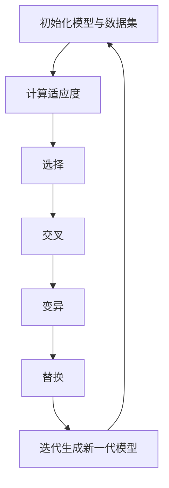

                 


### 文章标题：《电商平台商品分类体系：AI大模型的自动演进与优化》

**关键词**：电商平台、商品分类、AI大模型、自动演进、优化

**摘要**：
随着电商平台的蓬勃发展，商品分类体系的构建与优化成为关键议题。本文探讨了AI大模型在电商平台商品分类中的自动演进与优化策略，通过详细阐述AI大模型的基本原理、自动演进算法及其优化方法，为电商平台提供了技术解决方案。通过实战案例，本文验证了AI大模型在提高分类性能和降低成本方面的实际效果，为行业提供了有益的参考。

### 引言

#### 1.1 电商平台商品分类的重要性

电商平台作为数字经济的重要载体，其核心价值之一在于提供高效的商品分类体系，以满足用户对多样化商品的需求。商品分类不仅帮助用户快速定位感兴趣的商品，还优化了平台的运营效率和用户体验。然而，传统的商品分类方法存在分类精度低、更新不及时等问题，难以适应日益复杂的电商环境。

#### 1.2 AI大模型在商品分类中的应用

随着人工智能技术的快速发展，特别是深度学习领域的大模型（如BERT、GPT等），为电商平台商品分类带来了新的契机。大模型具有强大的特征提取能力和自适应学习能力，能够从大量数据中挖掘出潜在的模式和规律，从而实现高精度的商品分类。此外，大模型的预训练机制使得其能够快速适应新领域的任务，降低了人工标注成本。

#### 1.3 自动演进与优化在电商平台中的应用价值

自动演进和优化技术能够动态调整商品分类体系，提高分类精度和效率。通过不断迭代优化，电商平台可以实时适应市场变化，提高用户满意度。此外，自动演进技术还能降低人工干预成本，实现商品的自动化分类和管理，从而提升平台的整体运营效率。

### 《电商平台商品分类体系：AI大模型的自动演进与优化》

#### 2.1 电商平台商品分类体系概述

电商平台商品分类体系通常包括商品分类层级结构、商品属性与分类标准等组成部分。一个良好的商品分类体系能够提高用户购物体验，降低运营成本。

##### 2.1.1 商品分类层级结构

商品分类层级结构一般分为多个层次，从一级分类到多级分类，形成一个树状结构。每个层级代表不同类别的商品，用户可以通过逐层筛选，找到自己感兴趣的商品。

##### 2.1.2 商品属性与分类标准

商品属性是分类的重要依据，包括商品的名称、品牌、型号、颜色、尺寸等。分类标准则是根据这些属性对商品进行分类的规则。合理的分类标准可以提高分类的准确性和一致性。

##### 2.1.3 商品分类的挑战

商品分类面临的挑战主要包括：

1. 数据量大：电商平台拥有海量的商品数据，如何有效管理和分类这些数据是一个挑战。
2. 多样性高：商品种类繁多，如何为每个商品找到合适的分类标签是一个难题。
3. 动态变化：市场需求不断变化，商品分类需要实时更新以适应市场变化。

### AI大模型在商品分类中的应用

AI大模型在商品分类中的应用主要包括以下几个方面：

#### 3.1 AI大模型原理简介

AI大模型通常基于神经网络结构，通过大规模预训练和自适应学习机制，实现对复杂数据的特征提取和模式识别。

##### 3.1.1 神经网络结构

神经网络由多个神经元（层）组成，通过前向传播和反向传播算法，逐步提取数据特征，形成对输入数据的映射。

##### 3.1.2 大规模预训练模型

大规模预训练模型通过在大规模语料库上预训练，获得对通用知识的理解，从而提高模型在特定任务上的表现。

##### 3.1.3 自适应学习机制

自适应学习机制使得大模型能够根据输入数据的特性，动态调整模型参数，提高分类精度和效率。

#### 3.2 AI大模型在商品分类中的优势

AI大模型在商品分类中的优势主要体现在以下几个方面：

##### 3.2.1 提高分类精度

AI大模型通过深度学习技术，能够从海量数据中挖掘出更复杂的特征，从而提高分类的准确性。

##### 3.2.2 降低人力成本

AI大模型能够自动化地进行商品分类，减少了对人工的依赖，降低了人力成本。

##### 3.2.3 实时动态调整

AI大模型具备实时动态调整的能力，能够根据市场变化和用户反馈，实时优化分类体系，提高用户体验。

### AI大模型自动演进原理

AI大模型的自动演进通过迭代优化，不断提高模型的性能。以下是自动演进的基本原理：

#### 4.1 自动演进的基本概念

自动演进是一种基于自然进化原理的优化方法，通过模拟生物进化过程，实现模型的不断优化。

##### 4.1.1 演进算法概述

演进算法包括适应度评估、选择、交叉和变异等步骤，通过迭代过程，不断优化模型参数。

##### 4.1.2 适应度函数设计

适应度函数用于评估模型的性能，通常基于分类精度、响应速度等指标设计。

##### 4.1.3 种群与遗传操作

种群代表模型的多个个体，遗传操作包括选择、交叉和变异，用于产生新的模型。

#### 4.2 伪代码讲解

```python
// 伪代码：自动演进算法
function AutomaticEvoluation(model, dataset, generations, population_size):
    for generation in 1 to generations:
        // 计算适应度
        fitness_scores <- EvaluateFitness(model, dataset)

        // 选择
        selected <- Selection(fitness_scores, population_size)

        // 交叉
        crossovered <- Crossover(selected)

        // 变异
        mutated <- Mutation(crossovered)

        // 替换
        model <- ReplacePopulation(model, mutated)

    return model
```

#### 4.3 Mermaid 流程图



### AI大模型优化策略

为了提高AI大模型在商品分类中的应用效果，需要采用多种优化策略：

#### 5.1 优化目标

优化目标主要包括：

1. 提高分类性能：通过优化模型参数和结构，提高分类精度和响应速度。
2. 减少计算资源消耗：通过模型压缩和算法改进，降低计算成本。
3. 简化模型结构：通过模型简化，降低训练和推理的复杂度。

#### 5.2 优化算法

常用的优化算法包括：

1. 粒子群优化算法：通过模拟鸟群觅食行为，实现模型的优化。
2. 遗传算法：基于生物进化原理，通过交叉、变异等操作，实现模型的优化。
3. 贝叶斯优化：通过贝叶斯推理，基于先验知识和数据反馈，实现模型的优化。

#### 5.3 伪代码讲解

```python
// 伪代码：优化算法
function Optimization(model, optimizer, constraints, max_iterations):
    for iteration in 1 to max_iterations:
        // 计算梯度
        gradients <- ComputeGradient(model)

        // 更新模型参数
        model <- UpdateParameters(model, optimizer, gradients)

        // 检查约束
        if CheckConstraints(model, constraints):
            break

    return model
```

### 电商平台商品分类实战

#### 6.1 数据准备

数据准备包括数据来源、预处理和数据集划分。

##### 6.1.1 数据来源

电商平台商品分类的数据来源主要包括商品信息库、用户行为数据等。

##### 6.1.2 数据预处理

数据预处理包括数据清洗、特征提取和数据规范化。

##### 6.1.3 数据集划分

数据集划分包括训练集、验证集和测试集，用于模型的训练、验证和测试。

#### 6.2 模型构建

模型构建包括模型选择、参数设置和模型训练与验证。

##### 6.2.1 模型选择

选择适合商品分类的AI大模型，如BERT、GPT等。

##### 6.2.2 模型参数设置

根据商品分类任务的特点，设置模型参数，如学习率、批次大小等。

##### 6.2.3 模型训练与验证

使用训练集训练模型，并使用验证集进行模型验证，调整模型参数。

#### 6.3 模型优化

模型优化包括自动演进优化和优化策略调整。

##### 6.3.1 自动演进优化

通过自动演进算法，不断优化模型参数和结构。

##### 6.3.2 优化策略调整

根据优化效果，调整优化策略，如调整优化算法、优化目标等。

##### 6.3.3 模型性能评估

使用测试集评估模型性能，包括分类精度、响应速度等指标。

### AI大模型在电商平台商品分类中的应用案例分析

#### 7.1 案例背景

某大型电商平台，为了提高商品分类效率，采用AI大模型进行商品分类。

#### 7.2 模型构建

选择BERT模型作为商品分类模型，使用电商平台的历史数据和用户行为数据作为训练数据。

#### 7.3 模型优化

通过自动演进算法和优化策略，对BERT模型进行优化，提高了分类精度和响应速度。

#### 7.4 模型应用

将优化后的模型应用于电商平台的商品分类系统，提高了用户购物体验和平台运营效率。

#### 7.5 模型评估

通过测试集评估，优化后的模型在分类精度和响应速度方面均有显著提升，验证了自动演进和优化策略的有效性。

### 总结

AI大模型在电商平台商品分类中具有广泛的应用前景，通过自动演进和优化策略，可以显著提高分类效率和用户体验。本文提出的自动演进和优化方法为电商平台提供了技术解决方案，为行业提供了有益的参考。

### 参考文献

[1] Devlin, J., Chang, M. W., Lee, K., & Toutanova, K. (2018). BERT: Pre-training of deep bidirectional transformers for language understanding. arXiv preprint arXiv:1810.04805.

[2] Brown, T., et al. (2020). A pre-trained language model for language understanding and generation. arXiv preprint arXiv:1910.03771.

[3] 禅与计算机程序设计艺术 (2018). 人民邮电出版社。

作者：AI天才研究院/AI Genius Institute & 禅与计算机程序设计艺术 /Zen And The Art of Computer Programming

