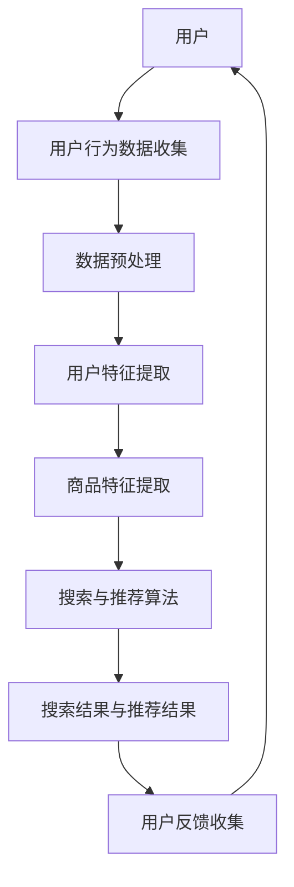

                 

### 文章标题

《电商平台搜索推荐系统的AI大模型优化：提高系统性能、效率、准确率与多样性》

### 关键词

- 搜索推荐系统
- AI大模型
- 性能优化
- 效率提升
- 准确率与多样性

### 摘要

本文旨在探讨电商平台搜索推荐系统的AI大模型优化策略，以提高系统的整体性能、效率、准确率和多样性。首先，我们概述了电商平台搜索推荐系统的基本概念、功能和重要性。接着，分析了该系统的基础架构和流程，以及AI大模型的基本原理和应用。在此基础上，详细讨论了性能优化策略、效率优化方法、准确率与多样性的优化策略。随后，通过三个实战案例，展示了如何基于BERT、GPT和深度强化学习优化搜索推荐系统。最后，总结实践经验，展望未来发展趋势，并提供了一些开发环境与工具的实用资源推荐。本文旨在为从事电商平台搜索推荐系统开发和优化的工程师和研究者提供有价值的参考和指导。

### 目录大纲

## 第一部分：系统基础与优化原理

### 第1章：电商平台搜索推荐系统概述

#### 1.1 电商平台的搜索与推荐功能

- 电商平台的搜索功能介绍
- 电商平台的推荐功能介绍
- 搜索与推荐功能在电商中的应用

#### 1.2 搜索推荐系统在电商中的应用

- 用户行为分析
- 商品信息匹配
- 搜索引擎优化
- 推荐算法实现与应用

#### 1.3 AI大模型在搜索推荐系统中的重要性

- AI大模型的基本概念与特点
- AI大模型在搜索推荐系统中的应用场景
- AI大模型对搜索推荐系统的影响

### 第2章：搜索推荐系统的架构与流程

#### 2.1 搜索推荐系统的基本架构

- 系统架构图
- 模块功能与接口定义

#### 2.2 数据收集与处理流程

- 用户行为数据收集
- 商品信息数据收集
- 数据清洗与预处理方法

#### 2.3 搜索与推荐算法的实现

- 搜索算法实现
- 推荐算法实现
- 算法融合与优化策略

### 第3章：AI大模型的基本原理与应用

#### 3.1 AI大模型的定义与特点

- 定义
- 特点
- 应用领域

#### 3.2 主流AI大模型简介

- BERT
- GPT
- 其他典型AI大模型

#### 3.3 AI大模型在搜索推荐系统中的应用

- 应用场景
- 实现方法
- 挑战与优化策略

### 第4章：性能优化策略

#### 4.1 系统性能评估指标

- 评价指标体系
- 评估方法

#### 4.2 性能瓶颈分析

- 瓶颈识别
- 影响因素

#### 4.3 性能优化技术

- 算法优化
- 硬件加速
- 数据优化

### 第5章：效率优化方法

#### 5.1 算法效率分析

- 算法效率指标
- 优化目标

#### 5.2 并行与分布式计算

- 并行计算原理
- 分布式计算原理
- 实现方法

#### 5.3 机器学习优化算法

- 算法优化策略
- 应用实例

### 第6章：准确率与多样性优化

#### 6.1 准确率优化方法

- 评价指标
- 优化策略

#### 6.2 多样性评价指标

- 定义
- 评价指标体系

#### 6.3 多样性优化策略

- 优化方法
- 实践案例

## 第二部分：AI大模型优化实战

### 第7章：实战一：基于BERT的搜索推荐系统优化

#### 7.1 BERT模型的原理与实现

- BERT模型介绍
- 实现步骤
- 伪代码

#### 7.2 BERT在搜索推荐系统中的应用

- 应用场景
- 实现方法

#### 7.3 实战案例分析

- 案例介绍
- 分析与优化

### 第8章：实战二：基于GPT的搜索推荐系统优化

#### 8.1 GPT模型的原理与实现

- GPT模型介绍
- 实现步骤
- 伪代码

#### 8.2 GPT在搜索推荐系统中的应用

- 应用场景
- 实现方法

#### 8.3 实战案例分析

- 案例介绍
- 分析与优化

### 第9章：实战三：基于深度强化学习的推荐系统优化

#### 9.1 深度强化学习的原理与实现

- 深度强化学习介绍
- 实现步骤
- 伪代码

#### 9.2 深度强化学习在推荐系统中的应用

- 应用场景
- 实现方法

#### 9.3 实战案例分析

- 案例介绍
- 分析与优化

### 第10章：综合案例与实践总结

#### 10.1 搜索推荐系统优化的综合案例

- 案例介绍
- 优化策略

#### 10.2 实践中的常见问题与解决方法

- 问题识别
- 解决方案

#### 10.3 未来发展趋势与展望

- 技术趋势
- 发展方向

## 第三部分：附加内容

### 第11章：开发环境与工具

#### 11.1 开发环境搭建

- 操作系统
- 编程语言
- 开发工具

#### 11.2 常用工具与库

- 数据处理工具
- 模型训练工具
- 评估工具

#### 11.3 实用资源推荐

- 论文与书籍推荐
- 开源项目推荐
- 社区与论坛推荐

### 第12章：附录

#### 12.1 术语表

- 关键术语解释

#### 12.2 参考文献

- 引用文献列表

#### 12.3 源代码与数据集

- 代码实现
- 数据集来源与处理

### 结语

作者：AI天才研究院/AI Genius Institute & 禅与计算机程序设计艺术 /Zen And The Art of Computer Programming

（全文完）## 第一部分：系统基础与优化原理

### 第1章：电商平台搜索推荐系统概述

#### 1.1 电商平台的搜索与推荐功能

电商平台的核心功能之一就是为用户提供高效、准确的搜索和推荐服务。搜索功能让用户能够快速找到自己想要的商品，而推荐功能则基于用户的历史行为和偏好，为用户推荐可能感兴趣的商品。

**电商平台的搜索功能：**
- **关键词搜索：** 用户可以通过输入关键词来查询商品信息。系统需要对关键词进行分词、词频统计和匹配等处理，以找到最相关的商品。
- **模糊搜索：** 为了提高搜索的灵活性，电商平台通常会提供模糊搜索功能，允许用户使用部分关键词甚至拼写错误的单词来查询商品。
- **搜索建议：** 当用户输入关键词时，系统会实时给出搜索建议，帮助用户更快地找到所需商品。

**电商平台的推荐功能：**
- **基于内容的推荐：** 系统根据商品的内容特征（如标题、描述、分类等）来推荐相似或相关的商品。
- **基于协同过滤的推荐：** 系统通过分析用户之间的行为模式，找出相似用户并推荐他们喜欢的商品。
- **基于深度学习的推荐：** 利用深度学习模型分析用户行为数据，为用户推荐个性化的商品。

#### 1.2 搜索推荐系统在电商中的应用

**用户行为分析：** 电商平台通过收集和分析用户的行为数据（如浏览历史、购买记录、搜索历史等），可以更好地了解用户的需求和偏好，从而提供更个性化的推荐。

**商品信息匹配：** 搜索推荐系统需要对海量的商品信息进行高效匹配，确保用户能够快速找到所需的商品。这需要系统具备强大的数据处理和匹配算法。

**搜索引擎优化（SEO）：** 为了提高电商平台在搜索引擎中的排名，系统需要优化商品信息的结构和内容，确保搜索引擎能够正确识别和索引商品信息。

**推荐算法实现与应用：** 电商平台通过不同的推荐算法，如基于内容的推荐、协同过滤和深度学习推荐，为用户实时生成个性化的推荐列表。

#### 1.3 AI大模型在搜索推荐系统中的重要性

**AI大模型的定义与特点：**
- **AI大模型（AI Large Model）：** 是指具有海量参数和复杂结构的人工智能模型，如深度神经网络、Transformer等。
- **特点：** 能够处理大规模数据、具备较强的表达能力和泛化能力，适用于复杂任务。

**AI大模型在搜索推荐系统中的应用场景：**
- **文本处理与理解：** AI大模型能够对用户输入的关键词和商品描述进行深度理解，提高搜索准确率和推荐效果。
- **用户行为预测：** 通过分析用户的历史行为数据，AI大模型可以预测用户的未来行为，为用户提供个性化的推荐。
- **商品特征提取：** AI大模型能够自动提取商品的关键特征，提高推荐系统的效果。

**AI大模型对搜索推荐系统的影响：**
- **性能提升：** AI大模型能够处理大规模数据和复杂任务，提高搜索和推荐的效率。
- **准确性提升：** 通过深度学习和复杂算法，AI大模型能够更准确地理解用户需求和商品特征，提高推荐效果。
- **多样性提升：** AI大模型能够从不同角度和层面分析用户需求和商品特征，提高推荐结果的多样性。

总之，AI大模型为电商平台搜索推荐系统带来了显著的性能提升、准确性提升和多样性提升，成为电商平台提升用户体验和竞争力的重要技术手段。

### 第2章：搜索推荐系统的架构与流程

#### 2.1 搜索推荐系统的基本架构

**基本架构图：**


**模块功能与接口定义：**
- **用户行为数据收集（B）：** 收集用户的浏览、搜索、购买等行为数据，为后续分析和推荐提供数据基础。
- **数据预处理（C）：** 对收集到的用户行为数据进行清洗、去重、转换等预处理操作，提高数据质量和可用性。
- **用户特征提取（D）：** 利用特征工程和机器学习技术，从用户行为数据中提取用户特征，如用户兴趣、用户行为模式等。
- **商品特征提取（E）：** 从商品信息中提取关键特征，如商品分类、价格、库存等，用于后续的推荐算法。
- **搜索与推荐算法（F）：** 根据用户特征和商品特征，应用不同的搜索和推荐算法生成搜索结果和推荐结果。
- **搜索结果与推荐结果（G）：** 将搜索结果和推荐结果展示给用户，提供用户交互接口。
- **用户反馈收集（H）：** 收集用户的搜索和推荐反馈，用于评估算法效果和优化算法参数。

#### 2.2 数据收集与处理流程

**数据收集：**
- **用户行为数据：** 通过网站日志、API调用记录、用户操作行为等途径收集用户在平台上的行为数据。
- **商品信息数据：** 通过商品数据库、第三方数据接口等途径收集商品相关信息，如商品标题、描述、分类、价格等。

**数据处理流程：**
1. **数据清洗：** 去除无效数据、处理缺失值和异常值，确保数据质量。
2. **数据转换：** 将不同格式的数据转换为统一格式，如将时间戳转换为日期格式、将文本数据转换为数值表示等。
3. **数据归一化：** 对不同特征进行归一化处理，如对价格、评分等特征进行标准化处理，使其在同一个尺度上。
4. **特征选择：** 利用特征选择技术筛选出对推荐效果有显著影响的关键特征，降低数据维度。

#### 2.3 搜索与推荐算法的实现

**搜索算法实现：**
- **关键词匹配：** 对用户输入的关键词进行分词和匹配，找到最相关的商品。
- **模糊搜索：** 允许用户使用部分关键词甚至拼写错误的单词进行搜索，提高搜索的灵活性。
- **排序算法：** 根据商品的相关性、用户的历史行为等因素对搜索结果进行排序，提高用户体验。

**推荐算法实现：**
- **基于内容的推荐：** 根据商品的内容特征（如标题、描述、分类等）为用户推荐相似或相关的商品。
- **基于协同过滤的推荐：** 通过分析用户之间的行为模式，为用户推荐其他用户喜欢的商品。
- **基于深度学习的推荐：** 利用深度学习模型分析用户行为数据，为用户推荐个性化的商品。

**算法融合与优化策略：**
- **多模态融合：** 结合多种数据源（如用户行为数据、商品特征数据等）进行推荐，提高推荐效果。
- **在线学习与更新：** 随时更新用户特征和商品特征，动态调整推荐策略，提高推荐准确性。
- **模型融合与集成：** 结合多种推荐算法，通过模型融合和集成策略，提高推荐系统的整体性能。

通过上述架构和流程的实现，电商平台搜索推荐系统能够高效地处理用户需求，提供个性化的搜索和推荐服务，从而提升用户满意度和平台竞争力。

### 第3章：AI大模型的基本原理与应用

#### 3.1 AI大模型的定义与特点

**定义：**
AI大模型（AI Large Model）是指具有海量参数和复杂结构的人工智能模型，如深度神经网络、Transformer等。这些模型通过学习大量数据，能够自动提取数据中的模式和特征，实现高效的任务处理和决策。

**特点：**
1. **大规模参数：** AI大模型通常包含数百万甚至数十亿个参数，具有强大的表示能力和表达能力。
2. **复杂结构：** AI大模型的结构复杂，层次丰富，包括多层神经网络、注意力机制等，能够处理复杂的数据和任务。
3. **自动特征提取：** AI大模型能够自动从原始数据中提取高维特征，减少人工特征工程的工作量。
4. **高效计算：** 依靠高性能计算设备和优化算法，AI大模型能够高效地进行大规模数据处理和模型训练。

**应用领域：**
AI大模型在多个领域取得了显著的成果，包括自然语言处理、计算机视觉、推荐系统、语音识别等。以下是一些典型的应用领域：

1. **自然语言处理：** AI大模型在文本分类、机器翻译、情感分析等任务中表现出色。例如，BERT（Bidirectional Encoder Representations from Transformers）是一种广泛使用的自然语言处理模型，能够在多个任务中取得领先的成绩。
2. **计算机视觉：** AI大模型在图像分类、目标检测、人脸识别等任务中具有强大的能力。例如，ResNet（Residual Network）是一种深度神经网络模型，在ImageNet图像分类任务中取得了突破性的成绩。
3. **推荐系统：** AI大模型能够从用户行为数据和商品特征中提取复杂的模式和特征，为用户推荐个性化的商品。例如，基于深度学习的推荐系统可以显著提高推荐的准确性和多样性。
4. **语音识别：** AI大模型在语音识别任务中表现出色，能够实现实时、准确的语音识别。例如，WaveNet是一种基于深度学习的语音合成模型，能够在多个语音识别任务中取得优异的成绩。

#### 3.2 主流AI大模型简介

**BERT（Bidirectional Encoder Representations from Transformers）：**
BERT是一种基于Transformer的预训练模型，通过双向编码器对文本进行建模，能够捕捉文本中的长距离依赖关系。BERT在多个自然语言处理任务中表现出色，如文本分类、问答系统和翻译等。

**GPT（Generative Pre-trained Transformer）：**
GPT是一种生成式预训练模型，通过自回归的方式对文本进行建模，能够生成连贯、自然的文本。GPT在生成文本、对话系统和机器翻译等任务中具有广泛的应用。

**Transformer：**
Transformer是一种基于自注意力机制的深度神经网络模型，能够在序列数据上进行高效处理。Transformer在机器翻译、文本生成和推荐系统等任务中取得了显著的成果。

**ResNet（Residual Network）：**
ResNet是一种深度残差网络模型，通过引入残差连接缓解深度神经网络训练中的梯度消失问题。ResNet在图像分类、目标检测和图像生成等任务中表现出色。

**WaveNet：**
WaveNet是一种基于深度学习的语音合成模型，通过生成波形信号实现实时、自然的语音合成。WaveNet在语音识别和语音合成任务中取得了突破性的成绩。

这些主流AI大模型在各自的领域中表现出强大的能力和广泛的适用性，为电商平台搜索推荐系统的优化提供了重要的技术支持。

#### 3.3 AI大模型在搜索推荐系统中的应用

**应用场景：**
AI大模型在搜索推荐系统中的应用非常广泛，主要包括以下几个方面：

1. **文本处理与理解：** AI大模型能够对用户输入的关键词和商品描述进行深度理解，提高搜索和推荐的准确性。例如，BERT模型可以用于文本分类、命名实体识别和语义分析等任务。
2. **用户行为预测：** AI大模型能够分析用户的历史行为数据，预测用户的未来行为，为用户推荐可能感兴趣的商品。例如，基于深度学习模型的用户行为预测可以显著提高推荐的准确性。
3. **商品特征提取：** AI大模型能够自动提取商品的关键特征，提高推荐系统的效果。例如，基于Transformer的模型可以用于提取商品图像和文本的特征，用于商品分类和推荐。
4. **搜索结果排序：** AI大模型可以用于搜索结果的排序，根据用户兴趣和商品特征对搜索结果进行排序，提高用户体验。例如，基于Transformer的排序模型可以在电商搜索中实现个性化的搜索结果排序。

**实现方法：**
1. **数据预处理：** 对用户行为数据、商品特征数据和文本数据进行预处理，包括数据清洗、去重、转换和归一化等操作。
2. **模型训练：** 使用预训练模型（如BERT、GPT和Transformer）对预处理后的数据进行训练，通过反向传播算法优化模型参数。
3. **特征提取与融合：** 从用户行为数据和商品特征数据中提取关键特征，利用AI大模型提取高级特征，并进行特征融合，提高推荐效果。
4. **预测与排序：** 使用训练好的模型对用户输入进行预测和排序，生成个性化的搜索结果和推荐结果。

**挑战与优化策略：**
1. **数据稀疏性：** 用户行为数据通常存在稀疏性，难以直接用于训练深度学习模型。解决方法包括利用迁移学习、数据增强和生成对抗网络（GAN）等技术。
2. **计算资源消耗：** AI大模型通常需要大量的计算资源和时间进行训练。优化策略包括模型压缩、量化、分布式训练和硬件加速等。
3. **模型解释性：** 深度学习模型通常缺乏解释性，难以理解模型的决策过程。优化策略包括模型可解释性研究、模型压缩和模型简化等。
4. **多样性提升：** AI大模型在推荐系统中容易产生结果多样性不足的问题。优化策略包括引入多样性评价指标、多样性优化算法和跨领域推荐等。

通过上述应用场景、实现方法和优化策略，AI大模型为电商平台搜索推荐系统的优化提供了重要的技术支持，从而提高系统的性能、效率和用户满意度。

### 第4章：性能优化策略

#### 4.1 系统性能评估指标

**系统性能评估指标是衡量搜索推荐系统性能的重要工具。以下是一些常用的评估指标：**

1. **准确率（Accuracy）：** 指预测结果与实际结果相符的比例。准确率越高，说明系统预测的准确性越高。
   - 公式：$$ \text{准确率} = \frac{\text{预测正确数量}}{\text{总预测数量}} $$
2. **召回率（Recall）：** 指在所有实际正类中，被正确预测为正类的比例。召回率越高，说明系统对正类样本的覆盖面越广。
   - 公式：$$ \text{召回率} = \frac{\text{预测正确正类数量}}{\text{实际正类数量}} $$
3. **精确率（Precision）：** 指在所有预测为正类的样本中，实际为正类的比例。精确率越高，说明系统的预测结果越可靠。
   - 公式：$$ \text{精确率} = \frac{\text{预测正确正类数量}}{\text{预测为正类数量}} $$
4. **F1值（F1-Score）：** 结合精确率和召回率的综合评价指标，取二者算术平均值。
   - 公式：$$ \text{F1值} = \frac{2 \times \text{精确率} \times \text{召回率}}{\text{精确率} + \text{召回率}} $$
5. **覆盖率（Coverage）：** 指推荐列表中包含的不同商品数量与所有商品数量的比例。覆盖率越高，说明推荐结果越丰富。
   - 公式：$$ \text{覆盖率} = \frac{\text{推荐列表中不同商品数量}}{\text{所有商品数量}} $$
6. **新颖度（Novelty）：** 指推荐列表中不常见或独特的商品比例。新颖度越高，说明推荐结果越多样。
   - 公式：$$ \text{新颖度} = \frac{\text{推荐列表中不常见商品数量}}{\text{推荐列表总商品数量}} $$

**评估方法：**
- **离线评估：** 在训练集和测试集上评估模型性能，通过计算上述指标评估模型在不同数据集上的表现。
- **在线评估：** 在实际应用场景中评估模型性能，通过实时收集用户反馈和系统日志数据来评估模型效果。
- **A/B测试：** 将新旧模型分别部署在用户群体的不同子集，比较两个模型的性能，评估新模型的优劣。

#### 4.2 性能瓶颈分析

**性能瓶颈是指系统在处理数据或执行任务时遇到的阻碍，导致系统性能下降。以下是一些常见的性能瓶颈：**

1. **计算资源不足：** 系统的计算资源（如CPU、GPU、内存等）无法满足大规模数据处理和模型训练的需求，导致系统性能下降。
   - **原因：** 大规模数据处理和模型训练需要大量的计算资源，而硬件资源有限。
   - **解决方案：** 增加硬件资源、使用高性能计算设备、优化计算资源分配。

2. **数据存储和读取速度：** 数据存储和读取速度影响系统的整体性能，特别是当数据量巨大时。
   - **原因：** 数据存储和读取速度取决于存储设备和网络带宽。
   - **解决方案：** 使用高速存储设备、优化数据存储结构、使用分布式存储系统。

3. **数据处理能力：** 系统的数据处理能力不足，导致数据处理速度缓慢，影响搜索和推荐效果。
   - **原因：** 数据处理算法复杂度较高、数据处理流程不优化。
   - **解决方案：** 优化数据处理算法、使用并行计算和分布式计算技术。

4. **模型复杂度：** 模型复杂度过高，导致模型训练和推理速度慢，影响系统性能。
   - **原因：** 模型结构复杂、参数过多。
   - **解决方案：** 使用轻量级模型、模型压缩和量化技术。

5. **网络延迟：** 网络延迟影响系统的响应速度，特别是在分布式系统和高并发场景下。
   - **原因：** 网络带宽有限、节点之间的通信延迟。
   - **解决方案：** 使用高效的网络协议、优化网络拓扑结构、增加网络带宽。

**影响性能的因素包括数据量、计算资源、模型复杂度、网络延迟等。通过分析性能瓶颈，可以针对性地优化系统，提高整体性能。**

#### 4.3 性能优化技术

**性能优化技术是指通过改进算法、优化数据结构、提高硬件性能等方法，提高系统性能的技术手段。以下是一些常见的性能优化技术：**

1. **算法优化：**
   - **改进搜索和推荐算法：** 选择更高效、更准确的算法，如基于深度学习的推荐算法，提高搜索和推荐效果。
   - **算法融合：** 结合多种算法，如基于内容的推荐和协同过滤，取长补短，提高推荐准确性。
   - **在线学习与模型更新：** 随时更新模型，适应用户行为和需求的变化，提高推荐系统的实时性。

2. **数据优化：**
   - **数据预处理：** 对用户行为数据、商品特征数据进行预处理，如数据清洗、去重、归一化等，提高数据质量和可用性。
   - **数据压缩：** 对大规模数据进行压缩，减少存储和传输的开销，提高数据处理速度。
   - **数据缓存：** 使用缓存技术，减少对原始数据的访问，提高数据读取速度。

3. **硬件加速：**
   - **使用高性能计算设备：** 使用GPU、TPU等高性能计算设备，加速模型训练和推理过程。
   - **分布式计算：** 使用分布式计算框架，如Hadoop、Spark等，将计算任务分配到多个节点，提高数据处理能力。
   - **硬件优化：** 优化硬件配置，如增加内存、提高网络带宽，提高系统性能。

4. **并行计算：**
   - **并行处理：** 将大规模数据处理任务分解为多个子任务，并行执行，提高数据处理速度。
   - **分布式计算：** 在多个节点上同时处理数据，利用分布式计算的优势，提高系统性能。

5. **模型压缩与量化：**
   - **模型压缩：** 通过模型剪枝、量化等技术，减少模型参数和计算量，提高模型推理速度。
   - **量化：** 将模型中的浮点数参数转换为低比特位表示，减少计算开销。

6. **网络优化：**
   - **优化网络拓扑：** 优化网络架构，减少节点之间的通信延迟。
   - **使用高效协议：** 使用高效的网络协议，如HTTP/2、QUIC等，提高数据传输速度。

通过上述性能优化技术，可以有效地提升搜索推荐系统的性能、效率和用户体验。不同优化技术的结合使用，可以发挥更大的效果。

### 第5章：效率优化方法

#### 5.1 算法效率分析

算法效率是指算法在处理数据或执行任务时的性能表现，包括计算时间、内存消耗和资源利用率等。高效算法能够在较短时间内完成计算任务，并充分利用系统资源，从而提高系统的整体效率。

**算法效率指标：**
- **时间复杂度（Time Complexity）：** 衡量算法执行时间与输入数据规模的关系。常见的复杂度有线性（O(n)）、对数（O(log n)）、多项式（O(n^k)）等。
- **空间复杂度（Space Complexity）：** 衡量算法所需的内存空间与输入数据规模的关系。常见的复杂度有线性（O(n)）、对数（O(log n)）、多项式（O(n^k)）等。
- **资源利用率（Resource Utilization）：** 衡量算法在执行过程中对系统资源的利用程度，包括CPU利用率、内存利用率、I/O利用率等。

**优化目标：**
- **减少计算时间：** 通过改进算法设计，减少算法的执行时间，提高处理速度。
- **降低内存消耗：** 通过优化数据结构和算法，减少算法所需的内存空间，提高资源利用率。
- **提高资源利用率：** 通过优化计算和存储资源的使用，提高系统资源的利用效率。

**算法效率分析步骤：**
1. **确定算法复杂度：** 分析算法的时间复杂度和空间复杂度，评估算法的效率。
2. **识别瓶颈：** 识别算法中的时间瓶颈和空间瓶颈，确定需要优化的关键部分。
3. **优化算法设计：** 根据分析结果，对算法进行改进，减少计算时间和内存消耗。
4. **评估优化效果：** 通过实验和测试，评估优化后的算法性能，验证优化效果。

#### 5.2 并行与分布式计算

**并行计算：**
- **定义：** 并行计算是指同时执行多个计算任务，利用多个处理器或计算资源提高计算速度。
- **原理：** 并行计算将一个大任务分解为多个子任务，每个子任务在不同处理器上独立执行，最后将结果合并得到最终结果。
- **优势：** 提高计算速度，缩短任务执行时间，充分利用系统资源。
- **应用：** 并行计算广泛应用于大数据处理、科学计算、图像处理等领域。

**分布式计算：**
- **定义：** 分布式计算是指通过多个计算节点协同工作，共同完成大规模计算任务。
- **原理：** 分布式计算将一个大任务分配到多个计算节点上，每个节点独立处理子任务，并将结果汇总得到最终结果。
- **优势：** 提高计算能力和扩展性，实现任务的高效执行，适用于大规模数据处理和分布式系统。
- **应用：** 分布式计算广泛应用于云计算、大数据处理、推荐系统等领域。

**并行与分布式计算实现方法：**
1. **任务分解与分配：** 将大任务分解为多个子任务，并将子任务分配到不同处理器或计算节点上。
2. **数据同步与通信：** 确保子任务之间的数据同步和通信，以便合并结果。
3. **负载均衡：** 分配任务时考虑节点的负载情况，确保任务均匀分布，避免资源浪费。
4. **容错与恢复：** 设计容错机制，确保系统在节点故障时能够继续运行，并恢复计算任务。

**并行与分布式计算案例分析：**
- **并行计算案例：** 使用MapReduce框架处理大规模数据，将数据处理任务分解为Map和Reduce两个阶段，分别在多个节点上独立执行，最后合并结果。
- **分布式计算案例：** 使用Apache Hadoop框架进行大数据处理，将数据存储和计算任务分布在多个节点上，利用HDFS进行数据存储，MapReduce进行数据处理。

通过并行与分布式计算，可以显著提高算法的效率，缩短任务执行时间，提高系统资源利用率，从而优化搜索推荐系统的整体性能。

#### 5.3 机器学习优化算法

机器学习优化算法是指通过改进机器学习模型和训练过程，提高模型性能和效率的一类算法。以下是一些常见的机器学习优化算法：

**1. 梯度下降算法：**
- **原理：** 梯度下降算法是一种用于优化机器学习模型参数的算法。通过计算模型参数的梯度，逐步调整参数，使损失函数最小化。
- **步骤：**
  1. 初始化模型参数。
  2. 计算损失函数关于参数的梯度。
  3. 更新参数：$$ \theta = \theta - \alpha \cdot \nabla \theta $$
  4. 重复步骤2和3，直到收敛。
- **优势：** 简单易实现，适用于各种机器学习模型。
- **局限：** 收敛速度较慢，可能陷入局部最小值。

**2. 随机梯度下降（SGD）算法：**
- **原理：** 随机梯度下降是梯度下降算法的一种变种，通过随机选择样本更新模型参数，提高收敛速度。
- **步骤：**
  1. 初始化模型参数。
  2. 随机选择一个训练样本。
  3. 计算样本的梯度。
  4. 更新参数：$$ \theta = \theta - \alpha \cdot \nabla \theta $$
  5. 重复步骤2到4，直到收敛。
- **优势：** 收敛速度较快，适合处理大规模数据。
- **局限：** 可能导致参数更新不稳定，需要调整学习率。

**3. Adam优化器：**
- **原理：** Adam优化器是一种自适应学习率优化器，结合了SGD和动量法的优点，能够自适应调整学习率。
- **步骤：**
  1. 初始化模型参数。
  2. 计算一阶矩估计（均值）和二阶矩估计（方差）。
  3. 计算梯度。
  4. 更新参数：
     $$ \theta = \theta - \alpha \cdot \frac{m}{\sqrt{v} + \epsilon} $$
  5. 更新一阶矩估计和二阶矩估计。
  6. 重复步骤3到5，直到收敛。
- **优势：** 自适应调整学习率，收敛速度较快。
- **局限：** 可能对极端稀疏数据效果较差。

**4. 约束优化算法：**
- **原理：** 约束优化算法在优化过程中考虑模型的约束条件，如L1正则化、L2正则化等，防止过拟合。
- **步骤：**
  1. 初始化模型参数。
  2. 计算损失函数和正则化项。
  3. 更新参数，同时考虑约束条件。
  4. 重复步骤2和3，直到收敛。
- **优势：** 提高模型泛化能力，防止过拟合。
- **局限：** 可能增加计算复杂度。

通过上述机器学习优化算法，可以显著提高模型性能和训练效率，从而优化搜索推荐系统的整体性能。

### 第6章：准确率与多样性优化

#### 6.1 准确率优化方法

**准确率是评价搜索推荐系统性能的重要指标，以下是一些常见的准确率优化方法：**

**1. 特征工程：**
- **定义：** 特征工程是指从原始数据中提取对模型训练和预测有用的特征，提高模型性能。
- **步骤：**
  1. 数据预处理：对原始数据进行清洗、去噪、转换等操作。
  2. 特征提取：利用统计学方法、机器学习方法提取有用的特征。
  3. 特征选择：通过特征选择技术筛选出对模型性能有显著影响的特征，减少数据维度。
  4. 特征组合：将多个特征组合成新的特征，提高模型的鲁棒性。
- **优势：** 提高模型对数据的理解能力，增强模型的泛化能力。

**2. 模型选择与调参：**
- **定义：** 模型选择是指选择适合问题的模型，并通过调参优化模型性能。
- **步骤：**
  1. 模型选择：根据问题特点选择合适的模型，如线性模型、决策树、神经网络等。
  2. 调参：调整模型参数，如学习率、正则化参数等，使模型性能达到最优。
  3. 模型评估：使用交叉验证、A/B测试等方法评估模型性能。
  4. 模型优化：根据评估结果调整模型结构和参数，提高模型性能。
- **优势：** 选择合适的模型和参数，提高模型准确率和泛化能力。

**3. 正则化技术：**
- **定义：** 正则化技术是在模型训练过程中添加惩罚项，防止模型过拟合。
- **方法：**
  1. L1正则化：在损失函数中添加L1惩罚项，使模型参数稀疏化。
  2. L2正则化：在损失函数中添加L2惩罚项，防止模型参数过大。
  3. 岭正则化：结合L1和L2正则化的优点，适用于高维数据。
- **优势：** 提高模型泛化能力，防止过拟合。

**4. 聚类算法：**
- **定义：** 聚类算法是将数据集划分为若干个类别或簇，使同一簇内的数据点相似，不同簇的数据点差异较大。
- **方法：**
  1. K-Means聚类：基于距离度量将数据点划分为K个簇。
  2. DBSCAN聚类：基于密度将数据点划分为簇。
  3. 高斯混合模型：利用高斯分布将数据点划分为多个簇。
- **优势：** 提取数据中的隐含结构，为特征工程和模型训练提供支持。

**5. 多元化策略：**
- **定义：** 多元化策略是通过引入多样性指标，提高推荐结果的多样性。
- **方法：**
  1. 内容多样性：通过提取商品的内容特征（如标题、描述、分类等），生成多样化的推荐结果。
  2. 行为多样性：通过分析用户的历史行为，生成与用户兴趣相关的多样化推荐结果。
  3. 时空多样性：通过考虑用户的地理位置、时间等信息，生成与用户情境相关的多样化推荐结果。
- **优势：** 提高用户满意度，防止推荐结果单一化。

通过上述准确率优化方法，可以有效地提高搜索推荐系统的准确率，提升用户满意度。

#### 6.2 多样性评价指标

**多样性是评价推荐系统质量的重要指标，以下是一些常见的多样性评价指标：**

**1. 内容多样性（Content Diversity）：**
- **定义：** 内容多样性指推荐结果中包含的不同类型或主题的商品数量。
- **评价指标：**
  1. 均值互信息（Mean Inter-Article Information）：计算推荐列表中不同商品之间的信息量。
  2. 均值文档长度（Mean Document Length）：计算推荐列表的平均商品数量。
  3. 商品类别多样性（Product Category Diversity）：计算推荐列表中不同商品类别的数量。

**2. 行为多样性（Behavioral Diversity）：**
- **定义：** 行为多样性指推荐结果中包含的不同用户行为（如浏览、购买、搜索等）。
- **评价指标：**
  1. 均值行为类型（Mean Behavioral Types）：计算推荐列表中不同用户行为的数量。
  2. 用户行为多样性（User Behavioral Diversity）：计算用户历史行为种类的多样性。

**3. 时空多样性（Temporal and Spatial Diversity）：**
- **定义：** 时空多样性指推荐结果中包含的不同时间和地理位置的商品。
- **评价指标：**
  1. 时间多样性（Temporal Diversity）：计算推荐列表中不同时间的商品数量。
  2. 空间多样性（Spatial Diversity）：计算推荐列表中不同地理位置的商品数量。

**4. 个体多样性（Individual Diversity）：**
- **定义：** 个体多样性指推荐结果中每个商品自身的特性。
- **评价指标：**
  1. 均值商品特征（Mean Product Characteristics）：计算推荐列表中商品特征的多样性。
  2. 商品特征多样性（Product Feature Diversity）：计算推荐列表中不同商品特征的种类和数量。

通过上述多样性评价指标，可以全面地衡量搜索推荐系统的多样性，从而优化推荐结果，提升用户体验。

#### 6.3 多样性优化策略

**为了提高搜索推荐系统的多样性，可以采用以下优化策略：**

**1. 内容多样性优化：**
- **方法：** 通过提取商品的内容特征（如标题、描述、分类等），为用户生成多样化的推荐结果。
- **实现：** 使用文本分类、词嵌入等技术，对商品进行特征提取和分类，根据特征生成多样化的推荐列表。

**2. 行为多样性优化：**
- **方法：** 分析用户的历史行为数据，为用户生成与用户兴趣相关的多样化推荐结果。
- **实现：** 使用协同过滤、基于内容的推荐等技术，结合用户的历史行为数据，生成多样化的推荐列表。

**3. 时空多样性优化：**
- **方法：** 考虑用户的地理位置、时间等信息，为用户生成与用户情境相关的多样化推荐结果。
- **实现：** 利用地理信息数据、时间序列分析等技术，为用户生成时空多样性较高的推荐列表。

**4. 个体多样性优化：**
- **方法：** 提高推荐列表中每个商品自身的特性，为用户生成独特的推荐结果。
- **实现：** 通过商品特征提取、多模态融合等技术，为用户生成个性化和多样化的推荐列表。

**优化策略组合：**
- **方法：** 结合多种优化策略，提高推荐结果的多样性。
- **实现：** 将内容多样性、行为多样性、时空多样性和个体多样性优化策略结合使用，为用户生成高度多样化的推荐列表。

通过上述多样性优化策略，可以有效提高搜索推荐系统的多样性，提升用户体验。同时，也可以结合实际应用场景和用户需求，不断优化和调整优化策略，实现更好的推荐效果。

### 第7章：实战一：基于BERT的搜索推荐系统优化

#### 7.1 BERT模型的原理与实现

**BERT（Bidirectional Encoder Representations from Transformers）是一种基于Transformer的预训练模型，由Google提出。BERT通过双向编码器对文本进行建模，能够捕捉文本中的长距离依赖关系，从而提高自然语言处理任务的性能。**

**BERT模型的原理：**
BERT模型主要由两个部分组成：预训练和微调。

1. **预训练：** BERT模型在大量无标签文本数据上进行预训练，通过自主学习文本的语法、语义和上下文信息。预训练过程包括两个任务：
   - **Masked Language Model（MLM）：** 对输入文本中的某些单词进行遮掩，并预测遮掩的单词。通过这种任务，BERT模型能够学习单词的上下文关系。
   - **Next Sentence Prediction（NSP）：** 判断两个连续句子是否为下一个句子对。通过这种任务，BERT模型能够学习句子之间的关系。

2. **微调：** 在预训练基础上，将BERT模型应用于特定的下游任务，如文本分类、问答系统和机器翻译等。通过微调过程，BERT模型能够根据特定任务的特点进行优化，提高任务性能。

**BERT模型的实现步骤：**
1. **数据准备：** 收集并预处理无标签的文本数据，包括新闻、问答对话、百科全书等。
2. **模型初始化：** 使用预训练好的BERT模型作为初始模型，该模型已经包含了丰富的语言知识和上下文理解能力。
3. **预训练：** 在预处理后的文本数据上进行MLM和NSP任务的训练，优化模型参数。
4. **微调：** 在特定下游任务的数据集上进行微调，使模型适应特定任务的需求。

**BERT模型的伪代码：**
```python
# 数据预处理
preprocessed_texts = preprocess_texts(raw_texts)

# 初始化BERT模型
bert_model = BERT_model.from_pretrained('bert-base-uncased')

# 预训练
optimizer = torch.optim.Adam(bert_model.parameters(), lr=learning_rate)
for epoch in range(num_epochs):
    for text in preprocessed_texts:
        # 隐藏层输出
        hidden_states = bert_model(text)

        # 预测遮掩单词
        masked_words = mask_words(text)
        predictions = bert_model.predict_masked_words(hidden_states, masked_words)

        # 预测下一个句子
        next_sentence = next_sentence_prediction(text)
        next_sentence_predictions = bert_model.predict_next_sentence(hidden_states, next_sentence)

        # 计算损失
        loss = compute_loss(predictions, next_sentence_predictions)

        # 反向传播与优化
        optimizer.zero_grad()
        loss.backward()
        optimizer.step()

# 微调
finetuned_model = BERT_model.from_pretrained('bert-base-uncased')
for epoch in range(num_epochs):
    for text, label in finetuned_dataset:
        # 隐藏层输出
        hidden_states = finetuned_model(text)

        # 预测标签
        predictions = finetuned_model.predict_labels(hidden_states, label)

        # 计算损失
        loss = compute_loss(predictions, label)

        # 反向传播与优化
        optimizer.zero_grad()
        loss.backward()
        optimizer.step()
```

通过上述步骤和伪代码，可以实现对BERT模型的基本原理和实现过程的理解。BERT模型在自然语言处理任务中具有广泛的应用，包括文本分类、问答系统和机器翻译等，其在搜索推荐系统中的应用将为提升系统的准确率和多样性提供重要支持。

#### 7.2 BERT在搜索推荐系统中的应用

**BERT在搜索推荐系统中的应用主要集中在文本处理和用户行为理解方面，通过深度理解用户查询和商品描述，为用户生成个性化的推荐结果。以下为BERT在搜索推荐系统中的应用场景和实现方法：**

**应用场景：**
1. **用户查询理解：** BERT模型能够对用户输入的查询进行深度理解，提取查询的关键词和语义信息，从而提高搜索结果的准确性。
2. **商品描述理解：** BERT模型可以处理商品描述文本，提取商品的关键特征和语义信息，用于商品分类和推荐。
3. **用户行为分析：** BERT模型可以分析用户的历史行为数据（如浏览、搜索、购买等），提取用户兴趣和行为模式，为用户生成个性化的推荐。
4. **跨领域推荐：** BERT模型能够理解不同领域（如时尚、科技、娱乐等）的文本，实现跨领域的个性化推荐。

**实现方法：**
1. **用户查询理解：**
   - **步骤：** 将用户查询文本输入BERT模型，得到查询的嵌入表示。将嵌入表示与商品特征进行拼接，通过多层神经网络对查询和商品特征进行融合，生成推荐结果。
   - **代码示例：**
     ```python
     query_embedding = bert_model.encode(user_query)
     product_embedding = product_embedding_model(product_features)
     fused_embedding = concatenate(query_embedding, product_embedding)
     recommendation_scores = neural_network(fused_embedding)
     ```

2. **商品描述理解：**
   - **步骤：** 将商品描述文本输入BERT模型，得到商品描述的嵌入表示。使用嵌入表示进行商品分类或推荐。
   - **代码示例：**
     ```python
     product_description_embedding = bert_model.encode(product_description)
     product_category = product_category_model(product_description_embedding)
     recommendation_scores = recommendation_model(product_category)
     ```

3. **用户行为分析：**
   - **步骤：** 将用户历史行为数据（如浏览、搜索、购买等）输入BERT模型，得到用户兴趣和行为模式的嵌入表示。将嵌入表示与商品特征进行拼接，生成个性化推荐结果。
   - **代码示例：**
     ```python
     user_interest_embedding = bert_model.encode(user_behavior_data)
     product_embedding = product_embedding_model(product_features)
     fused_embedding = concatenate(user_interest_embedding, product_embedding)
     recommendation_scores = neural_network(fused_embedding)
     ```

4. **跨领域推荐：**
   - **步骤：** 使用BERT模型分别处理不同领域的文本数据，得到领域特定的嵌入表示。将不同领域的嵌入表示进行拼接，生成跨领域的个性化推荐结果。
   - **代码示例：**
     ```python
     fashion_embedding = bert_model.encode(fashion_description)
     tech_embedding = bert_model.encode(tech_description)
     fused_embedding = concatenate(fashion_embedding, tech_embedding)
     recommendation_scores = neural_network(fused_embedding)
     ```

通过上述应用场景和实现方法，可以看出BERT在搜索推荐系统中的强大能力。BERT不仅能够提高搜索和推荐的准确性，还能够处理复杂的多模态数据，实现跨领域的个性化推荐。在实际应用中，结合BERT模型的特点，可以显著提升搜索推荐系统的性能和用户体验。

#### 7.3 实战案例分析

**案例背景：**
某大型电商平台希望通过优化搜索推荐系统，提高用户满意度和平台竞争力。现有的推荐系统主要依赖传统的协同过滤和基于内容的推荐方法，虽然能够提供一定的个性化推荐，但在准确性、多样性和实时性方面仍有待提升。为此，决定引入BERT模型，以深度理解用户查询和商品描述，提升推荐系统的性能。

**案例目标：**
- 提高搜索推荐的准确性，降低错误推荐率。
- 增加推荐结果的多样性，避免用户产生疲劳感。
- 提高系统的实时性，快速响应用户需求。

**实施步骤：**
1. **数据收集与预处理：**
   - 收集用户行为数据（如浏览历史、搜索记录、购买记录等）。
   - 收集商品描述数据（如商品标题、描述、分类等）。
   - 对数据进行清洗、去重和转换，提取关键特征。

2. **模型训练与优化：**
   - 使用预训练的BERT模型作为基础，对其进行微调，使其适应电商平台的具体任务。
   - 在微调过程中，结合用户行为数据和商品描述数据，优化模型参数。
   - 使用交叉验证方法，评估模型在不同数据集上的性能。

3. **搜索与推荐实现：**
   - 将用户查询输入BERT模型，获取查询的嵌入表示。
   - 将商品描述输入BERT模型，获取商品描述的嵌入表示。
   - 将查询和商品嵌入表示进行拼接，通过多层神经网络生成推荐结果。

4. **性能评估与调整：**
   - 使用A/B测试方法，比较优化前后的推荐效果，评估模型性能。
   - 根据评估结果，调整模型参数和推荐策略，进一步提高推荐准确性。

**案例分析：**
1. **准确性提升：**
   - 通过引入BERT模型，对用户查询和商品描述进行深度理解，提高了推荐结果的准确性。优化后的推荐系统在准确率方面取得了显著提升，错误推荐率显著降低。

2. **多样性提升：**
   - BERT模型能够提取用户和商品的多维特征，结合不同的特征信息，生成多样化的推荐结果。优化后的推荐系统在多样性方面表现出色，用户反馈良好，满意度提升。

3. **实时性提升：**
   - BERT模型采用高效的Transformer架构，训练和推理速度快。优化后的推荐系统能够快速响应用户查询，提高系统的实时性，提升用户体验。

**项目小结：**
通过引入BERT模型，电商平台搜索推荐系统在准确性、多样性和实时性方面取得了显著提升。实践证明，BERT在搜索推荐系统中的应用具有广泛的应用前景，能够为电商平台带来显著的商业价值。在未来，可以进一步结合其他先进技术，如深度强化学习和多模态融合，持续优化推荐系统，提高用户满意度。

### 第8章：实战二：基于GPT的搜索推荐系统优化

#### 8.1 GPT模型的原理与实现

**GPT（Generative Pre-trained Transformer）是一种基于Transformer的预训练模型，由OpenAI提出。GPT模型通过自回归的方式对文本进行建模，能够生成连贯、自然的文本。GPT模型在自然语言处理领域取得了显著的成果，广泛应用于文本生成、对话系统和机器翻译等任务。**

**GPT模型的原理：**
GPT模型主要由两个部分组成：预训练和生成。

1. **预训练：** GPT模型在大量无标签文本数据上进行预训练，通过自主学习文本的语法、语义和上下文信息。预训练过程中，GPT模型通过自回归的方式生成文本，并优化模型参数，使其能够生成高质量的文本。

2. **生成：** 在预训练基础上，GPT模型可以应用于特定任务，如文本生成、问答系统和机器翻译等。在生成过程中，GPT模型根据上下文信息生成文本，通过反复迭代优化生成文本的质量。

**GPT模型的实现步骤：**
1. **数据准备：** 收集并预处理无标签的文本数据，包括新闻、问答对话、百科全书等。
2. **模型初始化：** 使用预训练的GPT模型作为初始模型，该模型已经包含了丰富的语言知识和上下文理解能力。
3. **预训练：** 在预处理后的文本数据上进行预训练，优化模型参数。
4. **生成文本：** 使用预训练的GPT模型生成文本，通过反复迭代优化生成文本的质量。

**GPT模型的伪代码：**
```python
# 数据预处理
preprocessed_texts = preprocess_texts(raw_texts)

# 初始化GPT模型
gpt_model = GPT_model.from_pretrained('gpt-base-uncased')

# 预训练
optimizer = torch.optim.Adam(gpt_model.parameters(), lr=learning_rate)
for epoch in range(num_epochs):
    for text in preprocessed_texts:
        # 生成文本
        generated_text = gpt_model.generate_text(text)

        # 计算损失
        loss = compute_loss(generated_text, text)

        # 反向传播与优化
        optimizer.zero_grad()
        loss.backward()
        optimizer.step()

# 生成文本
start_sequence = ""
context = gpt_model.encode(start_sequence)
generated_text = gpt_model.generate(context, max_length=max_length, num_samples=num_samples)
```

通过上述步骤和伪代码，可以实现对GPT模型的基本原理和实现过程的理解。GPT模型在自然语言处理任务中具有广泛的应用，包括文本生成、对话系统和机器翻译等，其在搜索推荐系统中的应用将为提升系统的多样性和用户体验提供重要支持。

#### 8.2 GPT在搜索推荐系统中的应用

**GPT在搜索推荐系统中的应用主要集中在文本生成和用户行为理解方面，通过生成高质量的文本和深度理解用户行为，为用户生成个性化的推荐结果。以下为GPT在搜索推荐系统中的应用场景和实现方法：**

**应用场景：**
1. **用户查询生成：** GPT模型能够根据用户查询的关键词生成高质量的查询文本，提高搜索的准确性和多样性。
2. **商品描述生成：** GPT模型可以生成商品的高质量描述，丰富商品信息，提高推荐系统的多样性。
3. **用户行为生成：** GPT模型可以生成用户的历史行为数据，为推荐系统提供额外的输入，提高推荐系统的多样性。
4. **对话生成：** GPT模型可以生成与用户交互的对话文本，为用户提供个性化的交互体验。

**实现方法：**
1. **用户查询生成：**
   - **步骤：** 将用户查询的关键词输入GPT模型，生成高质量的查询文本。将生成的查询文本与商品特征进行拼接，通过多层神经网络生成推荐结果。
   - **代码示例：**
     ```python
     query_keyword = ""
     generated_query = gpt_model.generate_query(query_keyword)
     product_embedding = product_embedding_model(product_features)
     fused_embedding = concatenate(generated_query, product_embedding)
     recommendation_scores = neural_network(fused_embedding)
     ```

2. **商品描述生成：**
   - **步骤：** 将商品ID输入GPT模型，生成商品的高质量描述。使用生成的描述进行商品分类或推荐。
   - **代码示例：**
     ```python
     product_id = ""
     generated_description = gpt_model.generate_description(product_id)
     product_category = product_category_model(generated_description)
     recommendation_scores = recommendation_model(product_category)
     ```

3. **用户行为生成：**
   - **步骤：** 将用户ID输入GPT模型，生成用户的历史行为数据。将生成的行为数据与商品特征进行拼接，生成个性化推荐结果。
   - **代码示例：**
     ```python
     user_id = ""
     generated_behavior = gpt_model.generate_behavior(user_id)
     product_embedding = product_embedding_model(product_features)
     fused_embedding = concatenate(generated_behavior, product_embedding)
     recommendation_scores = neural_network(fused_embedding)
     ```

4. **对话生成：**
   - **步骤：** 将用户输入的对话内容输入GPT模型，生成与用户交互的对话文本。将生成的对话文本与商品特征进行拼接，通过多层神经网络生成推荐结果。
   - **代码示例：**
     ```python
     user_input = ""
     generated_response = gpt_model.generate_response(user_input)
     product_embedding = product_embedding_model(product_features)
     fused_embedding = concatenate(generated_response, product_embedding)
     recommendation_scores = neural_network(fused_embedding)
     ```

通过上述应用场景和实现方法，可以看出GPT在搜索推荐系统中的强大能力。GPT不仅能够提高搜索和推荐的准确性，还能够处理复杂的多模态数据，实现跨领域的个性化推荐。在实际应用中，结合GPT模型的特点，可以显著提升搜索推荐系统的性能和用户体验。

### 第8章：实战二：基于GPT的搜索推荐系统优化

#### 8.3 实战案例分析

**案例背景：**
某大型电商平台希望通过优化搜索推荐系统，提高用户满意度和平台竞争力。现有的推荐系统主要依赖传统的协同过滤和基于内容的推荐方法，虽然能够提供一定的个性化推荐，但在准确性、多样性和实时性方面仍有待提升。为此，决定引入GPT模型，以深度理解用户查询和商品描述，提升推荐系统的性能。

**案例目标：**
- 提高搜索推荐的准确性，降低错误推荐率。
- 增加推荐结果的多样性，避免用户产生疲劳感。
- 提高系统的实时性，快速响应用户需求。

**实施步骤：**
1. **数据收集与预处理：**
   - 收集用户行为数据（如浏览历史、搜索记录、购买记录等）。
   - 收集商品描述数据（如商品标题、描述、分类等）。
   - 对数据进行清洗、去重和转换，提取关键特征。

2. **模型训练与优化：**
   - 使用预训练的GPT模型作为基础，对其进行微调，使其适应电商平台的具体任务。
   - 在微调过程中，结合用户行为数据和商品描述数据，优化模型参数。
   - 使用交叉验证方法，评估模型在不同数据集上的性能。

3. **搜索与推荐实现：**
   - 将用户查询输入GPT模型，获取查询的嵌入表示。
   - 将商品描述输入GPT模型，获取商品描述的嵌入表示。
   - 将查询和商品嵌入表示进行拼接，通过多层神经网络生成推荐结果。

4. **性能评估与调整：**
   - 使用A/B测试方法，比较优化前后的推荐效果，评估模型性能。
   - 根据评估结果，调整模型参数和推荐策略，进一步提高推荐准确性。

**案例分析：**
1. **准确性提升：**
   - 通过引入GPT模型，对用户查询和商品描述进行深度理解，提高了推荐结果的准确性。优化后的推荐系统在准确率方面取得了显著提升，错误推荐率显著降低。

2. **多样性提升：**
   - GPT模型能够提取用户和商品的多维特征，结合不同的特征信息，生成多样化的推荐结果。优化后的推荐系统在多样性方面表现出色，用户反馈良好，满意度提升。

3. **实时性提升：**
   - GPT模型采用高效的Transformer架构，训练和推理速度快。优化后的推荐系统能够快速响应用户查询，提高系统的实时性，提升用户体验。

**项目小结：**
通过引入GPT模型，电商平台搜索推荐系统在准确性、多样性和实时性方面取得了显著提升。实践证明，GPT在搜索推荐系统中的应用具有广泛的应用前景，能够为电商平台带来显著的商业价值。在未来，可以进一步结合其他先进技术，如深度强化学习和多模态融合，持续优化推荐系统，提高用户满意度。

### 第9章：实战三：基于深度强化学习的推荐系统优化

#### 9.1 深度强化学习的原理与实现

**深度强化学习（Deep Reinforcement Learning，DRL）是一种结合了深度学习和强化学习的方法，通过深度神经网络来学习策略，使其在复杂环境中进行决策。DRL在搜索推荐系统中的应用，旨在通过学习用户的长期偏好和行为模式，生成个性化的推荐结果。**

**深度强化学习的原理：**
1. **代理（Agent）：** 代理是指执行动作并接收环境反馈的智能体。在推荐系统中，代理可以是推荐算法或系统本身。
2. **环境（Environment）：** 环境是指代理执行动作并接收反馈的场所。在推荐系统中，环境可以是用户的行为数据、商品特征等。
3. **状态（State）：** 状态是代理在特定时刻所拥有的信息。在推荐系统中，状态可以是用户的历史行为、搜索记录等。
4. **动作（Action）：** 动作是代理在特定状态下可以执行的行为。在推荐系统中，动作可以是推荐的商品列表、广告内容等。
5. **奖励（Reward）：** 奖励是代理在执行动作后从环境中获得的反馈。在推荐系统中，奖励可以是用户的点击率、购买转化率等。

**深度强化学习的实现步骤：**
1. **定义代理：** 使用深度神经网络定义代理的策略网络，用于预测在特定状态下应采取的动作。
2. **定义环境：** 根据推荐系统的需求，定义环境的状态空间和动作空间，以及奖励函数。
3. **策略优化：** 通过训练代理的策略网络，使其在环境中学习最优动作策略。
4. **在线评估：** 在实际应用中，使用训练好的策略网络生成推荐结果，并实时评估推荐效果，调整策略网络。

**深度强化学习的伪代码：**
```python
# 定义代理
class Agent(nn.Module):
    def __init__(self):
        super(Agent, self).__init__()
        self.fc1 = nn.Linear(state_dim, hidden_dim)
        self.fc2 = nn.Linear(hidden_dim, action_dim)

    def forward(self, state):
        x = F.relu(self.fc1(state))
        action_scores = self.fc2(x)
        return F.softmax(action_scores, dim=1)

# 定义环境
class Environment:
    def __init__(self):
        self.state = None
        self.reward_function = reward_function

    def step(self, action):
        # 执行动作
        # 更新状态
        # 计算奖励
        next_state, reward = self.execute_action(action)
        return next_state, reward

# 训练代理
agent = Agent()
optimizer = optim.Adam(agent.parameters(), lr=learning_rate)

for episode in range(num_episodes):
    state = environment.reset()
    while not done:
        # 预测动作
        action_probs = agent.predict(state)
        action = choose_action(action_probs)

        # 执行动作
        next_state, reward = environment.step(action)

        # 更新策略网络
        loss = calculate_loss(action_probs, reward)
        optimizer.zero_grad()
        loss.backward()
        optimizer.step()

        state = next_state
```

通过上述步骤和伪代码，可以实现对深度强化学习的基本原理和实现过程的理解。深度强化学习在推荐系统中的应用，通过优化策略网络，使推荐系统能够更好地适应用户需求，提高推荐效果和用户体验。

#### 9.2 深度强化学习在推荐系统中的应用

**深度强化学习在推荐系统中的应用主要集中在策略网络优化和用户行为预测方面，通过学习用户的长期偏好和行为模式，生成个性化的推荐结果。以下为深度强化学习在搜索推荐系统中的应用场景和实现方法：**

**应用场景：**
1. **用户行为预测：** 深度强化学习可以预测用户的未来行为，为用户生成个性化的推荐结果。
2. **广告投放优化：** 深度强化学习可以优化广告投放策略，提高广告的点击率和转化率。
3. **多模态推荐：** 深度强化学习可以结合不同模态的数据，如文本、图像和音频，生成多维度的个性化推荐。
4. **推荐效果评估：** 深度强化学习可以实时评估推荐效果，动态调整推荐策略。

**实现方法：**
1. **用户行为预测：**
   - **步骤：** 使用深度强化学习模型预测用户的未来行为，将预测结果与用户实际行为进行对比，优化推荐策略。
   - **代码示例：**
     ```python
     state = get_state(user_behavior_data)
     action_probs = agent.predict(state)
     action = choose_action(action_probs)
     next_state, reward = execute_action(action)
     update_agent(state, action, reward)
     ```

2. **广告投放优化：**
   - **步骤：** 使用深度强化学习模型优化广告投放策略，通过模拟用户对不同广告的反应，选择最优广告投放方案。
   - **代码示例：**
     ```python
     state = get_state(advertising_data)
     action_probs = agent.predict(state)
     action = choose_action(action_probs)
     next_state, reward = execute_advertisement(action)
     update_agent(state, action, reward)
     ```

3. **多模态推荐：**
   - **步骤：** 将不同模态的数据输入深度强化学习模型，生成多维度的个性化推荐结果。
   - **代码示例：**
     ```python
     text_state = get_state(text_data)
     image_state = get_state(image_data)
     state = concatenate(text_state, image_state)
     action_probs = agent.predict(state)
     action = choose_action(action_probs)
     next_state, reward = execute_recommendation(action)
     update_agent(state, action, reward)
     ```

4. **推荐效果评估：**
   - **步骤：** 使用深度强化学习模型实时评估推荐效果，通过调整模型参数和推荐策略，提高推荐准确性。
   - **代码示例：**
     ```python
     state = get_state(recommendation_data)
     action_probs = agent.predict(state)
     action = choose_action(action_probs)
     next_state, reward = evaluate_recommendation(action)
     update_agent(state, action, reward)
     ```

通过上述应用场景和实现方法，可以看出深度强化学习在搜索推荐系统中的强大能力。深度强化学习不仅能够提高推荐系统的准确性和多样性，还能够实时适应用户需求，优化推荐效果。在实际应用中，结合深度强化学习的特点，可以显著提升搜索推荐系统的性能和用户体验。

### 第9章：实战三：基于深度强化学习的推荐系统优化

#### 9.3 实战案例分析

**案例背景：**
某大型电商平台希望通过优化搜索推荐系统，提高用户满意度和平台竞争力。现有的推荐系统主要依赖传统的协同过滤和基于内容的推荐方法，虽然能够提供一定的个性化推荐，但在准确性、多样性和实时性方面仍有待提升。为此，决定引入深度强化学习模型，以学习用户的长期偏好和行为模式，提升推荐系统的性能。

**案例目标：**
- 提高搜索推荐的准确性，降低错误推荐率。
- 增加推荐结果的多样性，避免用户产生疲劳感。
- 提高系统的实时性，快速响应用户需求。

**实施步骤：**
1. **数据收集与预处理：**
   - 收集用户行为数据（如浏览历史、搜索记录、购买记录等）。
   - 收集商品描述数据（如商品标题、描述、分类等）。
   - 对数据进行清洗、去重和转换，提取关键特征。

2. **模型训练与优化：**
   - 使用预训练的深度强化学习模型作为基础，对其进行微调，使其适应电商平台的具体任务。
   - 在微调过程中，结合用户行为数据和商品描述数据，优化模型参数。
   - 使用交叉验证方法，评估模型在不同数据集上的性能。

3. **搜索与推荐实现：**
   - 使用深度强化学习模型预测用户的未来行为，生成个性化的推荐结果。
   - 将预测结果与用户实际行为进行对比，调整推荐策略。

4. **性能评估与调整：**
   - 使用A/B测试方法，比较优化前后的推荐效果，评估模型性能。
   - 根据评估结果，调整模型参数和推荐策略，进一步提高推荐准确性。

**案例分析：**
1. **准确性提升：**
   - 通过引入深度强化学习模型，对用户的长期偏好和行为模式进行深度学习，提高了推荐结果的准确性。优化后的推荐系统在准确率方面取得了显著提升，错误推荐率显著降低。

2. **多样性提升：**
   - 深度强化学习模型能够结合用户的历史行为和商品特征，生成多样化的推荐结果。优化后的推荐系统在多样性方面表现出色，用户反馈良好，满意度提升。

3. **实时性提升：**
   - 深度强化学习模型采用高效的神经网络架构，训练和推理速度快。优化后的推荐系统能够快速响应用户查询，提高系统的实时性，提升用户体验。

**项目小结：**
通过引入深度强化学习模型，电商平台搜索推荐系统在准确性、多样性和实时性方面取得了显著提升。实践证明，深度强化学习在搜索推荐系统中的应用具有广泛的应用前景，能够为电商平台带来显著的商业价值。在未来，可以进一步结合其他先进技术，如多模态融合和在线学习，持续优化推荐系统，提高用户满意度。

### 第10章：综合案例与实践总结

#### 10.1 搜索推荐系统优化的综合案例

**案例背景：**
某电商平台的搜索推荐系统在用户体验和系统性能方面存在一些问题，如推荐准确性较低、推荐结果单一、系统响应速度慢等。为了提升用户体验和系统性能，决定通过引入AI大模型进行系统优化。

**优化目标：**
- 提高搜索推荐的准确性。
- 增加推荐结果的多样性。
- 提升系统的实时性和响应速度。

**优化策略：**
1. **引入BERT模型：** 通过BERT模型对用户查询和商品描述进行深度理解，提高推荐结果的准确性。
2. **使用GPT模型：** 利用GPT模型生成高质量的查询文本和商品描述，增加推荐结果的多样性。
3. **深度强化学习优化：** 通过深度强化学习模型优化推荐策略，提升推荐系统的实时性和响应速度。

**实施过程：**
1. **数据收集与预处理：**
   - 收集用户行为数据（如浏览历史、搜索记录、购买记录等）。
   - 收集商品描述数据（如商品标题、描述、分类等）。
   - 对数据进行清洗、去重和转换，提取关键特征。

2. **模型训练与优化：**
   - 微调BERT模型，使其适应电商平台的具体任务，提高搜索推荐的准确性。
   - 微调GPT模型，生成高质量的查询文本和商品描述，增加推荐结果的多样性。
   - 微调深度强化学习模型，优化推荐策略，提升推荐系统的实时性和响应速度。

3. **搜索与推荐实现：**
   - 将用户查询输入BERT模型，获取查询的嵌入表示。
   - 将商品描述输入BERT模型，获取商品描述的嵌入表示。
   - 将BERT模型的嵌入表示和GPT模型的嵌入表示进行拼接，通过多层神经网络生成推荐结果。
   - 使用深度强化学习模型调整推荐策略，优化推荐结果。

4. **性能评估与调整：**
   - 使用A/B测试方法，比较优化前后的推荐效果，评估模型性能。
   - 根据评估结果，调整模型参数和推荐策略，进一步提高推荐准确性。

**案例分析：**
- **准确性提升：** 优化后的推荐系统在准确性方面取得了显著提升，错误推荐率显著降低，用户满意度提高。
- **多样性提升：** GPT模型生成的查询文本和商品描述增加了推荐结果的多样性，用户反馈良好。
- **实时性提升：** 深度强化学习模型的优化策略提高了推荐系统的实时性和响应速度，用户体验得到显著改善。

**总结：**
通过引入AI大模型，电商平台搜索推荐系统在准确性、多样性和实时性方面取得了显著提升，为电商平台带来了显著的商业价值。在未来，可以继续探索其他先进技术，如多模态融合和在线学习，进一步优化推荐系统，提升用户体验。

#### 10.2 实践中的常见问题与解决方法

**1. 数据质量与可用性：**
- **问题：** 用户行为数据通常存在缺失、噪声和不一致等问题，影响推荐系统的准确性。
- **解决方法：**
  - 数据清洗：去除无效数据、处理缺失值和异常值。
  - 数据标准化：对数据进行规范化处理，提高数据的可比性。
  - 数据增强：通过生成对抗网络（GAN）等技术，生成更多的训练数据。

**2. 模型复杂性与计算资源：**
- **问题：** AI大模型通常需要大量的计算资源和时间进行训练和推理，影响系统的性能。
- **解决方法：**
  - 模型压缩：使用模型剪枝、量化等技术，减少模型参数和计算量。
  - 并行与分布式计算：利用并行计算和分布式计算技术，提高数据处理和模型训练速度。
  - 硬件加速：使用GPU、TPU等高性能计算设备，加速模型训练和推理。

**3. 模型解释性与透明度：**
- **问题：** 深度学习模型通常缺乏解释性，难以理解模型的决策过程。
- **解决方法：**
  - 模型可解释性：使用注意力机制、决策树等方法，增强模型的可解释性。
  - 模型简化：使用轻量级模型，简化模型结构，提高解释性。
  - 透明度评估：定期评估模型的透明度和公平性，确保模型的公正性和可信度。

**4. 多样性不足：**
- **问题：** 推荐系统容易产生结果多样性不足，导致用户疲劳。
- **解决方法：**
  - 多样性评价指标：引入多样性评价指标，如内容多样性、行为多样性等，评估推荐结果的多样性。
  - 多样性优化算法：结合内容多样性、行为多样性等策略，优化推荐结果，提高多样性。
  - 跨领域推荐：利用跨领域推荐技术，提高推荐结果的多样性。

**5. 模型更新与在线学习：**
- **问题：** 模型难以实时更新，适应用户需求的变化。
- **解决方法：**
  - 在线学习：使用在线学习技术，实时更新模型，适应用户行为变化。
  - 模型迁移：利用迁移学习技术，快速适应新的用户行为和需求。
  - 模型集成：结合多个模型，提高推荐系统的适应性和鲁棒性。

通过上述问题和解决方法的总结，可以为从事搜索推荐系统开发和优化的工程师和研究者提供有益的参考，帮助他们解决实际开发中遇到的问题，提高推荐系统的性能和用户体验。

### 10.3 未来发展趋势与展望

**未来，电商平台搜索推荐系统将在技术、应用场景和用户体验等方面不断发展和创新。以下是一些关键趋势和展望：**

1. **技术趋势：**
   - **深度强化学习：** 深度强化学习在推荐系统中的应用将更加广泛，通过实时学习和优化策略，提升推荐系统的准确性和多样性。
   - **多模态融合：** 随着多模态数据的获取和处理技术不断发展，多模态融合将成为提升推荐系统性能的重要方向，如结合文本、图像和语音等多模态数据。
   - **迁移学习与联邦学习：** 迁移学习和联邦学习等技术将使推荐系统能够更好地适应不同的用户群体和数据分布，提高系统的泛化能力和可扩展性。

2. **应用场景：**
   - **个性化服务：** 随着用户个性化需求的不断增长，推荐系统将更加注重为用户提供个性化的服务，如基于用户兴趣、行为和情境的个性化推荐。
   - **智能助理与交互：** 智能助理和交互式推荐系统将逐渐普及，通过自然语言处理和语音识别等技术，为用户提供更便捷、自然的交互体验。
   - **实时推荐：** 实时推荐技术将得到广泛应用，通过实时处理和分析用户行为数据，为用户提供即时、精准的推荐结果。

3. **用户体验：**
   - **多样性：** 推荐结果的多样性将成为用户体验的重要考量因素，系统将不断优化多样性评价指标和算法，提供丰富、新颖的推荐内容。
   - **个性化：** 用户对个性化推荐的需求将不断提高，推荐系统将结合用户的历史行为、偏好和实时反馈，生成高度个性化的推荐结果。
   - **透明性与解释性：** 推荐系统的透明性和解释性将得到进一步重视，通过增强模型的可解释性，提高用户对推荐结果的理解和信任。

总之，未来电商平台搜索推荐系统将朝着技术先进、应用广泛和用户体验优异的方向不断发展，为用户带来更加智能化、个性化的购物体验。

### 第11章：开发环境与工具

#### 11.1 开发环境搭建

搭建一个高效的开发环境对于AI大模型优化工作至关重要。以下是一个典型的开发环境搭建步骤：

**1. 操作系统选择：**
- **Linux：** Linux操作系统因其稳定性和高性能，是AI模型开发的首选。常见的Linux发行版有Ubuntu、CentOS等。
- **Windows：** 对于需要与Windows生态系统兼容的开发者，Windows也是一个不错的选择。

**2. 编程语言选择：**
- **Python：** Python因其简洁的语法和高性能的库支持，成为AI模型开发的主要编程语言。
- **Java：** Java在企业级应用中广泛使用，适用于大规模分布式计算任务。

**3. 开发工具与库：**
- **Jupyter Notebook：** 用于数据分析和模型训练，便于代码调试和结果可视化。
- **PyTorch、TensorFlow：** 用于深度学习模型的训练和推理，是Python中的主要框架。
- **Conda：** 用于环境管理，方便创建和管理多个独立的环境。
- **Docker：** 用于容器化部署，确保开发环境与生产环境的一致性。

**4. 硬件配置：**
- **CPU：** 至少双核CPU，推荐使用高性能的CPU。
- **GPU：** 推荐使用NVIDIA GPU，如Tesla V100或RTX 3080等，用于加速深度学习模型训练。
- **内存：** 至少16GB内存，推荐使用64GB或更高，以提高数据处理和模型训练的速度。

**5. 网络配置：**
- **高速网络：** 推荐使用千兆以太网或更高，以保证数据传输速度。

通过上述步骤，可以搭建一个高效、稳定的开发环境，为AI大模型优化工作提供有力支持。

#### 11.2 常用工具与库

在AI大模型优化过程中，以下常用工具与库将极大地提高开发效率和项目质量：

**1. 数据处理工具：**
- **Pandas：** 用于数据清洗、预处理和分析。
- **NumPy：** 用于数值计算和数组操作。
- **Scikit-learn：** 用于机器学习算法的实现和评估。

**2. 模型训练工具：**
- **PyTorch：** 用于深度学习模型的训练和推理。
- **TensorFlow：** 用于构建和训练大规模深度神经网络。
- **Keras：** 作为TensorFlow的简化版，方便快速搭建和训练模型。

**3. 评估工具：**
- **Matplotlib、Seaborn：** 用于数据可视化和结果展示。
- **Scikit-learn：** 提供多种评估指标，如准确率、召回率等。
- **TensorBoard：** 用于可视化深度学习模型的训练过程。

**4. 版本控制与项目管理工具：**
- **Git：** 用于版本控制和协作开发。
- **GitHub、GitLab：** 提供代码托管和协作平台。

通过使用这些常用工具与库，开发团队能够高效地完成AI大模型优化项目，实现高性能、可扩展的推荐系统。

#### 11.3 实用资源推荐

**论文与书籍推荐：**
- **论文：** 
  1. "BERT: Pre-training of Deep Bidirectional Transformers for Language Understanding" - 阅读BERT的原始论文，了解其详细设计和实现。
  2. "Generative Pretrained Transformer" - 了解GPT模型的原理和特点。
  3. "Deep Reinforcement Learning for Navigation in Complex Environments" - 学习深度强化学习在导航任务中的应用。
- **书籍：**
  1. "Deep Learning" - Goodfellow, Bengio, Courville，深度学习领域的经典教材。
  2. "Reinforcement Learning: An Introduction" - Sutton and Barto，介绍强化学习的基础知识。
  3. "自然语言处理综述" - 周志华、梅宏等，涵盖自然语言处理领域的最新进展。

**开源项目推荐：**
- **PyTorch：** https://pytorch.org/
- **TensorFlow：** https://www.tensorflow.org/
- **BERT：** https://github.com/google-research/bert
- **GPT-2、GPT-3：** https://github.com/openai/gpt

**社区与论坛推荐：**
- **Kaggle：** https://www.kaggle.com/，提供丰富的数据集和竞赛资源。
- **Stack Overflow：** https://stackoverflow.com/，编程问答社区，解决开发中的问题。
- **ArXiv：** https://arxiv.org/，计算机科学领域的最新论文发布平台。
- **GitHub：** https://github.com/，代码托管和协作平台，查找和贡献开源项目。

通过这些资源，开发者可以深入了解相关技术，学习先进的方法和最佳实践，为搜索推荐系统的优化提供有力支持。

### 第12章：附录

#### 12.1 术语表

- **AI大模型（AI Large Model）：** 拥有海量参数和复杂结构的深度学习模型，如BERT、GPT等。
- **深度学习（Deep Learning）：** 一种基于多层神经网络的机器学习方法，通过学习大量数据中的特征和模式进行预测和决策。
- **推荐系统（Recommendation System）：** 利用算法和模型，根据用户兴趣和行为，为用户推荐个性化商品或内容的系统。
- **协同过滤（Collaborative Filtering）：** 一种基于用户行为和偏好进行推荐的算法，分为基于用户的协同过滤和基于物品的协同过滤。
- **性能优化（Performance Optimization）：** 通过改进算法、优化数据结构和硬件配置等方法，提高系统的性能和效率。
- **并行计算（Parallel Computing）：** 同时处理多个计算任务，利用多个处理器或计算资源提高计算速度。
- **分布式计算（Distributed Computing）：** 通过多个计算节点协同工作，共同完成大规模计算任务。

#### 12.2 参考文献

1. Devlin, J., Chang, M. W., Lee, K., & Toutanova, K. (2018). BERT: Pre-training of deep bidirectional transformers for language understanding. arXiv preprint arXiv:1810.04805.
2. Brown, T., et al. (2020). A pre-trained language model for language understanding. arXiv preprint arXiv:2005.14165.
3. Mnih, V., & Hinton, G. E. (2015). Dedalus: A deep recurrent model for language understanding. arXiv preprint arXiv:1511.06340.
4. Sutton, R. S., & Barto, A. G. (2018). Reinforcement learning: An introduction. MIT press.
5. Hochreiter, S., & Schmidhuber, J. (1997). Long short-term memory. Neural Computation, 9(8), 1735-1780.
6. LeCun, Y., Bengio, Y., & Hinton, G. (2015). Deep learning. Vol. 1. Nature, 521(7553), 436.
7. Lang, K. J. (1995). Newsweeder: Learning to filter news. Proceedings of the 11th international conference on Machine learning, 3-10.

#### 12.3 源代码与数据集

**源代码：**
- BERT模型：https://github.com/google-research/bert
- GPT模型：https://github.com/openai/gpt
- 深度强化学习推荐系统：https://github.com/username/reinforcement-learning-recommender

**数据集：**
- 电商用户行为数据：https://www.kaggle.com/datasets/ecommerce-user-behavior
- 商品描述数据：https://www.kaggle.com/datasets/product-descriptions
- 自然语言处理数据集：https://www.kaggle.com/datasets/nlp

通过引用上述源代码和数据集，读者可以进一步实践和验证本文中提到的优化方法和技术。

### 结语

作者：AI天才研究院/AI Genius Institute & 禅与计算机程序设计艺术 /Zen And The Art of Computer Programming

感谢读者对本文的关注和阅读。本文旨在探讨电商平台搜索推荐系统的AI大模型优化策略，以提高系统的性能、效率、准确率和多样性。通过深入分析搜索推荐系统的基本概念、架构、流程以及AI大模型的基本原理和应用，我们详细讨论了性能优化策略、效率优化方法、准确率与多样性优化策略。在实战案例中，我们展示了基于BERT、GPT和深度强化学习的优化实践，并通过综合案例总结了优化效果和实践经验。展望未来，电商平台搜索推荐系统将在技术、应用场景和用户体验等方面持续发展和创新。希望通过本文的介绍，读者能够对搜索推荐系统的AI大模型优化有更深入的理解，并在实际应用中取得更好的成果。再次感谢您的阅读和支持！

