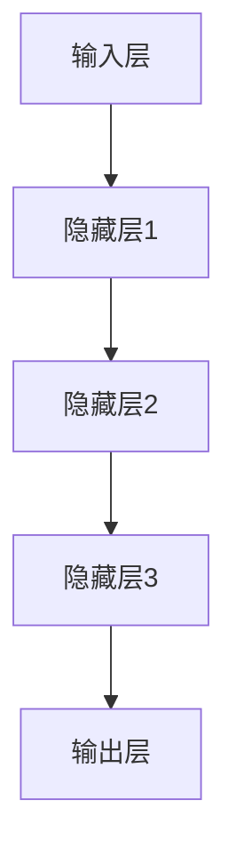
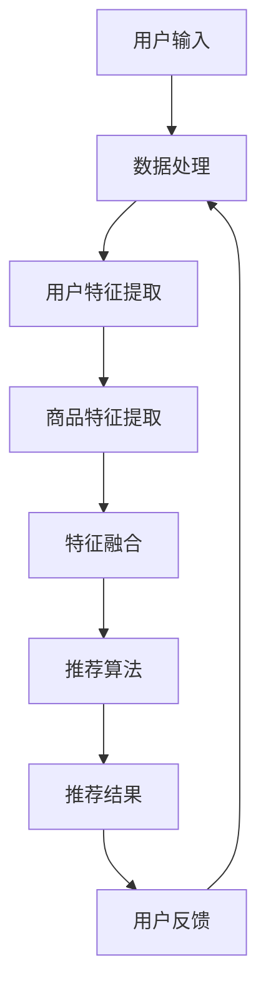

                 

### 文章标题

# 《电商平台搜索推荐系统的AI 大模型实践：提高系统性能、效率、准确率与多样性》

> 关键词：AI 大模型，电商平台，搜索推荐系统，性能优化，效率提升，准确率，多样性

> 摘要：本文旨在探讨如何在电商平台中应用AI大模型来提升搜索推荐系统的性能、效率、准确率和多样性。文章首先介绍了AI大模型的发展历程与关键技术，随后深入分析了电商平台搜索推荐系统的基础理论。接着，本文详细阐述了AI大模型在搜索推荐系统中的应用方法，并探讨了性能优化、效率提升、准确率提高以及多样性提升的具体策略。最后，文章通过实际案例分析，总结了搜索推荐系统的设计原则和实施步骤，并展望了其未来发展趋势与潜在应用领域。

### 目录大纲

## 第一部分: AI 大模型基础

### 第1章: AI 大模型概述

#### 1.1 AI 大模型的发展历程与现状

#### 1.2 AI 大模型的关键技术

#### 1.3 AI 大模型在电商搜索推荐中的应用前景

### 第2章: 电商平台搜索推荐系统的基础理论

#### 2.1 电商平台搜索推荐系统的基本概念

#### 2.2 用户行为分析

#### 2.3 商品信息处理

#### 2.4 搜索推荐算法概述

### 第3章: AI 大模型在搜索推荐系统中的应用

#### 3.1 基于深度学习的搜索推荐算法

#### 3.2 基于图神经网络的搜索推荐算法

#### 3.3 基于迁移学习的搜索推荐算法

### 第4章: 搜索推荐系统的性能优化

#### 4.1 搜索推荐系统的性能指标

#### 4.2 性能优化的方法与技术

#### 4.3 实际案例分析与优化实践

### 第5章: 搜索推荐系统的效率提升

#### 5.1 效率优化的关键因素

#### 5.2 常见的效率优化策略

#### 5.3 实际案例与优化效果分析

### 第6章: 搜索推荐系统的准确率提升

#### 6.1 提高准确率的策略

#### 6.2 常见误差分析

#### 6.3 实际案例与误差优化实践

### 第7章: 搜索推荐系统的多样性提升

#### 7.1 多样性提升的重要性

#### 7.2 多样性提升的策略

#### 7.3 实际案例与多样性优化实践

### 第8章: 搜索推荐系统的综合实践

#### 8.1 实际案例分析

#### 8.2 搜索推荐系统的设计原则

#### 8.3 搜索推荐系统的实施步骤

### 第9章: 未来展望与趋势

#### 9.1 AI 大模型在搜索推荐系统的发展趋势

#### 9.2 搜索推荐系统的潜在应用领域

#### 9.3 搜索推荐系统面临的挑战与机遇

## 附录

### 附录 A: 相关工具与资源

#### A.1 常用深度学习框架

#### A.2 搜索推荐系统开源项目

#### A.3 相关论文与资料链接

### 附录 B: Mermaid 流程图

#### B.1 AI 大模型架构图

#### B.2 搜索推荐系统流程图

### 附录 C: 伪代码与数学公式

#### C.1 深度学习算法伪代码

#### C.2 数学公式与解释

#### C.3 案例应用与解释

### 附录 D: 实际代码示例

#### D.1 代码实现与解读

#### D.2 代码优化与案例分析

#### D.3 实际项目实战案例

### 第一部分: AI 大模型基础

## 第1章: AI 大模型概述

### 1.1 AI 大模型的发展历程与现状

人工智能（AI）作为现代科技的核心驱动力量，已经从实验室走向了产业应用。在这其中，AI大模型（也称为大型深度学习模型）成为了人工智能领域的热点。AI大模型是指参数量达到数百万甚至数十亿级的深度学习模型，它们通过海量数据的训练实现了对复杂任务的高效处理。

AI大模型的发展历程可以分为几个阶段：

1. **早期研究**：20世纪50年代到80年代，神经网络和机器学习初步发展，但受限于计算能力和数据量，模型规模较小，应用范围有限。
2. **互联网时代**：21世纪初，随着互联网的普及和云计算的发展，数据量呈指数级增长，为AI大模型的出现提供了条件。
3. **深度学习革命**：2012年，AlexNet在ImageNet竞赛中取得了突破性的成果，深度学习开始崭露头角。此后，Google Brain、微软、Facebook等公司纷纷投入大量资源研发AI大模型。
4. **现代表现**：如今，AI大模型已经在语音识别、图像处理、自然语言处理等多个领域取得了显著的成果，成为人工智能研究的重要方向。

目前，AI大模型在各个领域都有广泛应用，包括但不限于：

- **计算机视觉**：如人脸识别、图像分类、图像生成等。
- **自然语言处理**：如机器翻译、文本生成、问答系统等。
- **语音识别**：如语音转文本、语音合成等。
- **推荐系统**：如电商平台的商品推荐、音乐/视频推荐等。

AI大模型的关键技术主要包括：

1. **深度神经网络**：通过多层神经元实现数据的复杂映射和特征提取。
2. **大数据处理**：利用分布式计算框架处理海量数据。
3. **模型优化**：如批量归一化、激活函数、优化算法等。
4. **迁移学习**：利用预训练模型，减少训练数据的需求，提高模型泛化能力。

### 1.2 AI 大模型的关键技术

#### 1.2.1 深度神经网络

深度神经网络（Deep Neural Network，DNN）是AI大模型的基础架构。与传统的前馈神经网络相比，DNN具有更多的隐藏层，能够处理更复杂的数据和任务。深度神经网络的工作原理是通过输入层、隐藏层和输出层，逐层对输入数据进行特征提取和变换，最终得到输出结果。

DNN的基本结构包括：

1. **输入层**：接收外部输入数据，如图像、文本、声音等。
2. **隐藏层**：进行特征提取和变换，每层都可以看作是一个线性变换加上一个非线性激活函数。
3. **输出层**：根据任务类型，输出预测结果或分类标签。

以下是一个简单的DNN结构示意图：

```
输入层 --> 隐藏层1 --> 隐藏层2 --> ... --> 输出层
```

#### 1.2.2 训练与优化

深度神经网络的训练过程实质上是寻找最佳的权重和偏置，使得模型能够在给定数据上取得较好的性能。训练过程通常包括以下几个步骤：

1. **前向传播**：将输入数据通过网络前向传播，计算每个神经元的输出。
2. **损失函数**：计算模型输出与真实值之间的差距，常用的损失函数包括均方误差（MSE）、交叉熵等。
3. **反向传播**：通过反向传播算法，将损失函数关于网络参数的梯度计算出来，并更新参数。
4. **优化算法**：使用优化算法（如梯度下降、Adam等）更新参数，最小化损失函数。

以下是一个简单的反向传播算法伪代码：

```python
# 前向传播
z = np.dot(W, x) + b
a = sigmoid(z)

# 计算损失
loss = mse(y, a)

# 反向传播
dz = a - y
dW = np.dot(dz, x.T)
db = np.sum(dz)

# 参数更新
W -= learning_rate * dW
b -= learning_rate * db
```

#### 1.2.3 模型优化

为了提高深度神经网络的性能，通常会采用一些优化技巧，包括：

1. **批量归一化**（Batch Normalization）：通过标准化每个批量中的激活值，加快训练速度，减少梯度消失和梯度爆炸问题。
2. **Dropout**：通过随机丢弃一部分神经元，减少过拟合，提高模型泛化能力。
3. **权重初始化**：合理初始化权重可以减少训练时间，提高模型性能。常用的初始化方法包括零初始化、高斯初始化、Xavier初始化等。
4. **激活函数**：选择合适的激活函数（如ReLU、Sigmoid、Tanh等），可以影响模型的性能和训练速度。

### 1.3 AI 大模型在电商搜索推荐中的应用前景

AI大模型在电商搜索推荐系统中的应用前景广阔。以下是一些关键应用方向：

1. **用户行为分析**：通过AI大模型，可以更好地理解用户的浏览、搜索和购买行为，为个性化推荐提供依据。
2. **商品信息处理**：AI大模型可以用于处理商品信息，如商品分类、标签提取、商品相似度计算等。
3. **推荐算法优化**：基于AI大模型，可以开发更高效、更准确的推荐算法，提高推荐系统的性能和多样性。
4. **实时搜索优化**：AI大模型可以用于实时搜索优化，提供更快速、更准确的搜索结果。

总之，AI大模型在电商平台搜索推荐系统中的应用具有巨大的潜力，有望进一步提升系统性能、效率和用户体验。

### 第2章: 电商平台搜索推荐系统的基础理论

### 2.1 电商平台搜索推荐系统的基本概念

电商平台搜索推荐系统是指基于用户行为数据和商品信息，利用算法和技术为用户推荐相关的商品或服务，从而提高用户的购买转化率和满意度。搜索推荐系统通常包括以下几个关键组成部分：

1. **用户行为数据**：包括用户的浏览记录、搜索历史、购买记录、收藏记录等。这些数据是推荐系统的重要输入，用于了解用户的需求和偏好。
2. **商品信息**：包括商品的基本信息（如名称、价格、分类、标签等）以及额外的描述性信息（如商品图片、用户评价等）。这些信息用于构建商品特征，供推荐算法使用。
3. **推荐算法**：基于用户行为数据和商品信息，推荐算法生成推荐结果，包括搜索结果排序和推荐列表生成等。常见的推荐算法有基于协同过滤、基于内容过滤、基于模型的方法等。

#### 搜索推荐系统的基本工作流程

电商平台搜索推荐系统的工作流程通常包括以下几个步骤：

1. **用户输入**：用户在搜索框中输入关键词或进行其他类型的操作（如浏览、搜索等）。
2. **数据处理**：对用户输入进行处理，提取用户特征和商品特征。用户特征可以是基于历史行为的数据，如浏览记录、购买记录等；商品特征可以是商品的基本信息、描述性信息等。
3. **推荐算法**：基于用户特征和商品特征，推荐算法生成推荐结果。常用的推荐算法有协同过滤、基于内容的推荐、基于模型的推荐等。
4. **结果排序**：根据推荐算法生成的推荐结果，进行排序，以提供最佳的搜索结果或推荐列表。
5. **用户反馈**：用户对推荐结果进行反馈，如点击、购买、评价等。这些反馈数据将用于进一步优化推荐系统。

#### 搜索推荐系统的主要功能

电商平台搜索推荐系统的主要功能包括：

1. **搜索功能**：用户可以通过关键词搜索找到相关的商品或服务。
2. **推荐功能**：根据用户的行为和偏好，系统可以为用户推荐相关的商品或服务，提高用户的购买转化率。
3. **个性化功能**：通过分析用户的历史行为和偏好，系统可以为用户提供个性化的搜索和推荐结果，提升用户体验。
4. **实时更新**：系统可以实时更新推荐结果，以适应用户的需求变化和动态调整推荐策略。
5. **智能排序**：通过算法优化，系统可以为用户提供最相关、最优质的搜索和推荐结果。

### 2.2 用户行为分析

用户行为分析是电商平台搜索推荐系统的核心环节之一。通过分析用户的行为数据，系统可以更好地理解用户的需求和偏好，从而为用户提供个性化的搜索和推荐结果。

#### 用户行为数据的类型

用户行为数据主要包括以下几类：

1. **浏览记录**：用户在电商平台浏览的商品信息，包括浏览时间、浏览时长、浏览路径等。
2. **搜索历史**：用户在搜索框中输入的关键词和搜索结果，包括搜索时间、搜索频率、搜索结果点击情况等。
3. **购买记录**：用户在电商平台购买的商品信息，包括购买时间、购买频率、购买金额等。
4. **收藏记录**：用户收藏的商品信息，包括收藏时间、收藏频率、收藏数量等。
5. **评价记录**：用户对购买商品的评分和评价，包括评价时间、评价内容、评价分数等。

#### 用户行为分析的方法

用户行为分析的方法主要包括以下几种：

1. **统计方法**：通过统计用户行为数据的分布、频率等，了解用户的行为模式。
2. **聚类方法**：通过聚类算法（如K-Means、DBSCAN等），将具有相似行为的用户划分为不同的群体，为个性化推荐提供依据。
3. **关联规则方法**：通过关联规则挖掘（如Apriori算法、FP-Growth算法等），发现用户行为之间的关联关系，为推荐策略提供支持。
4. **机器学习方法**：通过机器学习算法（如决策树、支持向量机、神经网络等），对用户行为数据进行建模，预测用户的偏好和需求。

#### 用户行为分析的应用

用户行为分析在电商平台搜索推荐系统中有多种应用：

1. **个性化推荐**：根据用户的浏览、搜索、购买等行为，为用户提供个性化的商品推荐，提高用户的购买转化率和满意度。
2. **搜索优化**：通过分析用户的搜索历史和搜索结果点击情况，优化搜索结果排序，提高搜索的准确性和用户体验。
3. **营销策略**：根据用户的行为特征，制定针对性的营销策略，如优惠券推送、广告投放等，提高用户的参与度和购买率。
4. **用户画像**：通过对用户行为数据进行分析，构建用户画像，为电商平台的产品设计和运营提供参考。

### 2.3 商品信息处理

商品信息处理是电商平台搜索推荐系统中的另一个关键环节。通过处理商品信息，系统可以为用户提供更准确、更相关的推荐结果。

#### 商品信息的类型

商品信息主要包括以下几类：

1. **基本信息**：包括商品的名称、价格、分类、库存量等，是商品最基本的描述信息。
2. **描述性信息**：包括商品的详细描述、规格参数、用户评价、图片等，用于丰富商品的特征。
3. **标签信息**：通过对商品进行标签分类，如品牌、材质、风格等，方便系统对商品进行分类和推荐。

#### 商品信息处理的方法

商品信息处理的方法主要包括以下几种：

1. **数据清洗**：对商品信息进行清洗，去除重复、错误、缺失的数据，保证数据质量。
2. **数据归一化**：对商品信息的数值特征进行归一化处理，使其在同一个量级上，便于后续计算。
3. **特征提取**：从商品信息中提取特征，用于构建商品的特征向量。特征提取的方法包括词袋模型、TF-IDF、词嵌入等。
4. **特征融合**：将不同来源的特征进行融合，构建更全面的商品特征，提高推荐系统的准确性。

#### 商品信息处理的应用

商品信息处理在电商平台搜索推荐系统中有多种应用：

1. **商品分类**：通过对商品进行分类，方便用户查找和浏览商品，提高用户的使用体验。
2. **商品推荐**：基于商品的特征向量，利用推荐算法为用户提供相关的商品推荐，提高用户的购买转化率。
3. **商品搜索**：通过处理商品信息，优化搜索结果排序，提高搜索的准确性和用户体验。
4. **商品展示**：根据用户的偏好和历史行为，为用户提供个性化的商品展示，提高用户的购买意愿。

### 2.4 搜索推荐算法概述

搜索推荐算法是电商平台搜索推荐系统的核心组成部分，直接影响推荐系统的性能和用户体验。以下是几种常见的搜索推荐算法：

#### 基于协同过滤的推荐算法

协同过滤（Collaborative Filtering）是搜索推荐算法中最常用的方法之一。协同过滤通过分析用户之间的行为相似性，为用户推荐与相似用户喜欢的内容相似的物品。

1. **基于用户的协同过滤（User-based Collaborative Filtering）**：
   - 原理：找到与目标用户行为相似的邻居用户，根据邻居用户的喜好为用户推荐物品。
   - 优缺点：优点是推荐结果更个性化和准确；缺点是计算复杂度较高，且存在冷启动问题。
   
2. **基于项目的协同过滤（Item-based Collaborative Filtering）**：
   - 原理：找到与目标物品相似的物品，根据这些物品的受欢迎程度为用户推荐。
   - 优缺点：优点是适用于新用户和新物品；缺点是推荐结果可能过于集中，缺乏多样性。

#### 基于内容的推荐算法

基于内容的推荐（Content-based Filtering）通过分析物品的内容特征，为用户推荐与用户历史偏好相似的物品。

1. **基于物品的文本相似度**：
   - 原理：计算用户历史偏好物品的文本特征，找到与这些特征相似的物品推荐给用户。
   - 优缺点：优点是能够提供丰富、多样化的推荐结果；缺点是可能存在数据稀疏问题，且对文本处理要求较高。

2. **基于语义的推荐**：
   - 原理：利用自然语言处理技术，提取物品的语义特征，为用户推荐与语义相似的物品。
   - 优缺点：优点是能够更好地处理复杂语义信息，提高推荐准确性；缺点是计算复杂度较高，对算法和数据的依赖性强。

#### 基于模型的推荐算法

基于模型的推荐（Model-based Recommendation）通过构建数学模型，利用用户行为数据预测用户对物品的偏好，为用户推荐相关的物品。

1. **矩阵分解（Matrix Factorization）**：
   - 原理：将用户-物品评分矩阵分解为用户特征矩阵和物品特征矩阵，通过矩阵乘积预测用户对物品的偏好。
   - 优缺点：优点是能够处理大规模数据，提高推荐准确性；缺点是计算复杂度较高，对数据质量要求较高。

2. **深度学习（Deep Learning）**：
   - 原理：利用深度神经网络对用户行为数据进行建模，提取用户和物品的潜在特征，预测用户对物品的偏好。
   - 优缺点：优点是能够处理复杂非线性关系，提高推荐准确性；缺点是模型训练和优化过程复杂，对数据量要求较高。

#### 混合推荐算法

混合推荐（Hybrid Recommendation）结合了协同过滤、内容过滤和基于模型的推荐方法，利用多种方法的优势，提高推荐系统的性能和多样性。

1. **基于用户的协同过滤 + 基于内容的推荐**：
   - 原理：结合用户行为和物品内容特征，为用户推荐与用户相似的用户喜欢的物品。
   - 优缺点：优点是能够提供个性化、准确的推荐结果；缺点是计算复杂度较高，且需要处理数据稀疏问题。

2. **基于模型的推荐 + 基于内容的推荐**：
   - 原理：利用模型提取用户和物品的潜在特征，并结合物品的内容特征，为用户推荐与用户偏好相似的物品。
   - 优缺点：优点是能够处理复杂非线性关系，提高推荐准确性；缺点是模型训练和优化过程复杂，对数据量要求较高。

### 第3章: AI 大模型在搜索推荐系统中的应用

### 3.1 基于深度学习的搜索推荐算法

深度学习在搜索推荐系统中的应用日益广泛，通过引入深度神经网络，我们可以构建更强大、更灵活的推荐模型，从而提高系统的性能和准确性。本节将介绍几种基于深度学习的搜索推荐算法，包括自动编码器、卷积神经网络（CNN）和递归神经网络（RNN）。

#### 自动编码器

自动编码器（Autoencoder）是一种无监督学习模型，它通过学习输入数据的编码表示，从而重建输入数据。在搜索推荐系统中，自动编码器可以用于提取用户和商品的特征表示，提高推荐的准确性。

1. **工作原理**：
   - **编码器（Encoder）**：将输入数据映射到一个低维的潜在空间，提取关键特征。
   - **解码器（Decoder）**：将编码器输出的潜在空间数据重新映射回原始数据空间，重建输入数据。
   - **损失函数**：自动编码器的损失函数通常使用均方误差（MSE），通过最小化损失函数，调整网络参数。

2. **伪代码**：

```python
# 编码器
def encode(x):
    z = np.dot(W1, x) + b1
    a1 = sigmoid(z)
    return a1

# 解码器
def decode(z):
    z = np.dot(W2, z) + b2
    x = sigmoid(z)
    return x

# 训练过程
for epoch in range(num_epochs):
    # 前向传播
    z = encode(x)
    x_hat = decode(z)
    # 计算损失
    loss = mse(x, x_hat)
    # 反向传播
    dz = x - x_hat
    dW2 = np.dot(dz, z.T)
    db2 = np.sum(dz)
    dz = np.dot(W2.T, dz)
    dW1 = np.dot(dz, x.T)
    db1 = np.sum(dz)
    # 参数更新
    W2 -= learning_rate * dW2
    b2 -= learning_rate * db2
    W1 -= learning_rate * dW1
    b1 -= learning_rate * db1
```

3. **应用场景**：
   - 自动编码器可以用于提取用户和商品的特征表示，为后续的推荐算法提供高质量的输入。
   - 可以处理高维的数据，降低数据维度，同时保留重要特征。

#### 卷积神经网络（CNN）

卷积神经网络（Convolutional Neural Network，CNN）在图像处理领域取得了显著的成果。近年来，CNN逐渐应用于搜索推荐系统中，特别是在处理商品图像和用户反馈方面。

1. **工作原理**：
   - **卷积层（Convolutional Layer）**：通过卷积操作提取图像特征，如边缘、纹理等。
   - **池化层（Pooling Layer）**：对卷积特征进行降维，减少参数数量，提高训练速度。
   - **全连接层（Fully Connected Layer）**：将卷积特征映射到输出空间，完成分类或回归任务。

2. **伪代码**：

```python
# 卷积层
def conv2d(x, W):
    return np.convolve(x, W, mode='same')

# 池化层
def max_pool(x, pool_size):
    return np.max(x.reshape(-1, pool_size), axis=1)

# 全连接层
def fc(x, W, b):
    return np.dot(x, W) + b

# 训练过程
for epoch in range(num_epochs):
    # 前向传播
    h = conv2d(x, W1)
    h = max_pool(h, pool_size)
    z = fc(h, W2, b2)
    a = softmax(z)
    # 计算损失
    loss = cross_entropy_loss(y, a)
    # 反向传播
    da = a - y
    dz = da
    dh = np.dot(dz, W2.T)
    dh = pad(dh, pool_size // 2)
    dh = np.max_pool(dh, pool_size)
    dx = np.convolve(dh, W1.T, mode='same')
    # 参数更新
    dW2 = np.dot(h.T, dz)
    db2 = np.sum(dz, axis=0)
    dW1 = np.dot(x.T, dh)
    db1 = np.sum(dh, axis=0)
    W2 -= learning_rate * dW2
    b2 -= learning_rate * db2
    W1 -= learning_rate * dW1
    b1 -= learning_rate * db1
```

3. **应用场景**：
   - CNN可以用于处理商品图像，提取视觉特征，为推荐算法提供丰富的信息。
   - CNN在处理用户反馈和评论时，可以识别出关键信息，提高推荐系统的准确性。

#### 递归神经网络（RNN）

递归神经网络（Recurrent Neural Network，RNN）适合处理序列数据，如用户的行为序列、评论等。在搜索推荐系统中，RNN可以用于建模用户的行为轨迹，捕捉用户的历史偏好。

1. **工作原理**：
   - **隐藏状态（Hidden State）**：RNN在每一时刻都会保持一个隐藏状态，用于存储当前和之前的信息。
   - **递归连接（Recurrence Connection）**：RNN通过递归连接将当前时刻的输出反馈到下一个时刻的输入，实现信息的传递和累积。
   - **激活函数**：常用的激活函数包括tanh和ReLU。

2. **伪代码**：

```python
# RNN单元
def rnn(x, h_prev, W, U, b):
    gate_inputs = np.dot(h_prev, W) + np.dot(x, U) + b
    i, f, o = sigmoid(gate_inputs)
    new_h = f * h_prev + i * tanh(np.dot(x, W_h))
    return new_h

# 训练过程
for epoch in range(num_epochs):
    h = [h0]
    for x_t in X:
        h_t = rnn(x_t, h[-1], W, U, b)
        h.append(h_t)
    # 计算损失
    loss = cross_entropy_loss(y, h[-1])
    # 反向传播
    dh = - (y - h[-1])
    dW = np.dot(h[:-1].T, dh)
    dU = np.dot(X.T, dh)
    db = np.sum(dh, axis=0)
    # 参数更新
    W -= learning_rate * dW
    U -= learning_rate * dU
    b -= learning_rate * db
```

3. **应用场景**：
   - RNN可以用于处理用户的行为序列，捕捉用户的短期偏好和长期趋势。
   - RNN在处理用户评论时，可以提取情感和语义信息，提高推荐系统的准确性。

通过这些深度学习算法的应用，搜索推荐系统可以更好地理解用户的需求和偏好，提供更准确、更个性化的推荐结果。

### 3.2 基于图神经网络的搜索推荐算法

基于图神经网络的搜索推荐算法（Graph Neural Networks, GNN）是近年来在推荐系统领域迅速发展的新技术。GNN通过引入图结构，将用户、商品和它们之间的关系表示为一个图，从而捕捉复杂的交互和依赖关系，提高推荐系统的性能和多样性。以下将详细介绍GNN的基本概念、工作原理和应用。

#### 图神经网络的基本概念

1. **图结构**：图神经网络的核心是图结构，它由节点（Node）、边（Edge）和图（Graph）构成。
   - **节点**：代表图中的实体，如用户、商品、评论等。
   - **边**：表示节点之间的关系，如用户对商品的评分、用户之间的社交关系等。
   - **图**：是节点和边的集合，代表实体及其相互关系。

2. **邻域**：在图神经网络中，每个节点都有一个邻域（Neighborhood），表示与其直接相连的节点集合。邻域的大小可以通过邻居节点数量或邻域半径来定义。

3. **图信号**：图神经网络通过学习节点和边的特征表示，将图信号（Graph Signal）映射到新的特征空间，以捕获节点和边之间的复杂关系。

#### 图神经网络的工作原理

1. **图卷积操作**：图神经网络的核心操作是图卷积（Graph Convolution），它类似于传统的卷积操作，但适用于图结构数据。

   - **定义**：给定一个节点特征矩阵\(X\)和邻域特征矩阵\(A\)，图卷积可以表示为：
     \[
     H_{new} = \sigma(\sum_{i \in \text{neighborhood}(i)} A_{ij} X_j W_h)
     \]
     其中，\(H_{new}\)是更新后的节点特征矩阵，\(W_h\)是图卷积层的权重矩阵，\(\sigma\)是激活函数，通常使用ReLU或Sigmoid。

   - **计算过程**：对于每个节点\(i\)，其特征通过考虑其邻域节点的特征加权平均得到。这种聚合操作可以有效地捕捉节点之间的关系。

2. **消息传递**：图神经网络中的消息传递过程类似于社交网络中的信息传播。每个节点会接收其邻域节点的信息，并通过聚合操作更新自己的特征。

3. **多层图卷积**：通过堆叠多层图卷积层，图神经网络可以逐渐提取更高层次的特征表示，从而捕捉更复杂的依赖关系。

#### 图神经网络在搜索推荐系统中的应用

1. **用户偏好建模**：图神经网络可以用于建模用户的偏好，通过分析用户与商品之间的交互关系，捕捉用户的兴趣和需求。

   - **应用场景**：基于用户的社交网络关系，为用户推荐与其社交圈子中用户偏好相似的物品。

2. **商品特征融合**：图神经网络可以融合用户和商品的特征，为推荐算法提供更丰富的输入。

   - **应用场景**：通过分析用户与商品之间的协同过滤关系，为用户提供个性化的商品推荐。

3. **推荐多样性提升**：图神经网络可以通过引入更多的上下文信息和交互关系，提高推荐系统的多样性。

   - **应用场景**：为用户提供多样化的推荐列表，避免单一化或重复的推荐结果。

#### 伪代码示例

以下是一个简单的图神经网络（GCN）的伪代码示例：

```python
# 初始化参数
W = np.random.normal(size=(input_dim, hidden_dim))
W_h = np.random.normal(size=(hidden_dim, hidden_dim))
b = np.random.normal(size=(1, hidden_dim))

# 图卷积操作
def graph_convolution(node_features, adj_matrix, weights, bias):
    neighborhood_aggregates = []
    for node in node_features:
        neighbors = adj_matrix[node]
        aggregate = np.dot(node_features[neighbors], weights) + bias
        neighborhood_aggregates.append(aggregate)
    return np.array(neighborhood_aggregates)

# 训练过程
for epoch in range(num_epochs):
    # 前向传播
    H = graph_convolution(X, A, W, b)
    H = np.tanh(np.dot(H, W_h) + b)
    # 计算损失
    loss = compute_loss(Y, H)
    # 反向传播
    dH = dH - (Y - H)
    dW = np.dot(H.T, dH)
    dW_h = np.dot(H.T, dH)
    db = np.sum(dH, axis=0)
    # 参数更新
    W -= learning_rate * dW
    W_h -= learning_rate * dW_h
    b -= learning_rate * db
```

通过图神经网络的应用，搜索推荐系统可以更好地理解用户和商品之间的复杂关系，提高推荐系统的性能和多样性。未来，随着图神经网络技术的不断发展和优化，其在搜索推荐系统中的应用前景将更加广阔。

### 3.3 基于迁移学习的搜索推荐算法

基于迁移学习的搜索推荐算法（Transfer Learning）是一种利用预训练模型来提高推荐系统性能的方法。通过迁移学习，我们可以将其他领域或任务的预训练模型应用于推荐系统，从而利用已有模型的先验知识，提高推荐系统的准确性和效率。以下将详细介绍迁移学习的基本概念、工作原理和应用。

#### 迁移学习的基本概念

1. **迁移学习**：迁移学习（Transfer Learning）是一种将已在一个任务上训练好的模型（源域模型）应用于另一个相关任务（目标域任务）的方法。它通过利用源域模型的知识和经验，提高目标域模型的性能。

2. **源域（Source Domain）**：源域是指用于训练模型的数据集或任务，通常与目标域有所不同。

3. **目标域（Target Domain）**：目标域是指应用模型的数据集或任务，通常与源域具有相似性或相关性。

4. **预训练模型**：预训练模型（Pre-trained Model）是在源域上训练好的模型，已经具备了较强的特征提取和泛化能力。

#### 迁移学习的工作原理

1. **模型共享**：迁移学习通过共享源域模型和目标域模型的某些层（通常是底层特征提取层），将源域模型的先验知识迁移到目标域模型中。

2. **特征迁移**：源域模型的特征表示被迁移到目标域模型中，用于提高目标域模型的特征提取能力。

3. **微调**：在迁移学习过程中，通常需要对目标域模型进行微调（Fine-tuning），即在源域模型的基础上，进一步调整目标域模型的参数，以适应目标域任务。

#### 迁移学习在搜索推荐系统中的应用

1. **模型迁移**：将其他领域的预训练模型应用于推荐系统，如将自然语言处理领域的预训练模型应用于文本推荐。

   - **应用场景**：文本推荐系统中，可以迁移文本分类或情感分析模型的特征提取层，用于提取商品描述或用户评论的特征。

2. **数据增强**：通过迁移学习，可以使用少量目标域数据，生成更丰富的特征表示，提高推荐系统的性能。

   - **应用场景**：在数据稀缺的目标域，可以迁移源域模型的特征提取层，利用源域数据的丰富特征表示，增强目标域模型的特征。

3. **跨领域推荐**：迁移学习可以应用于跨领域的推荐任务，如将电商领域的推荐模型应用于金融、医疗等其他领域。

   - **应用场景**：在跨领域推荐中，源域模型可以捕捉不同领域间的共性特征，为目标域推荐任务提供有力支持。

#### 伪代码示例

以下是一个简单的迁移学习（Transfer Learning）的伪代码示例：

```python
# 初始化源域模型
source_model = load_pretrained_model(source_domain)

# 冻结源域模型的参数
for param in source_model.parameters():
    param.requires_grad = False

# 初始化目标域模型
target_model = load_base_model(target_domain)

# 将源域模型的特征提取层参数复制到目标域模型
target_model.feature_extractor.load_state_dict(source_model.feature_extractor.state_dict())

# 微调目标域模型
for epoch in range(num_epochs):
    # 前向传播
    features = target_model.feature_extractor(X)
    logits = target_model.classifier(features)
    # 计算损失
    loss = compute_loss(Y, logits)
    # 反向传播
    loss.backward()
    # 参数更新
    optimizer.step()
    # 清零梯度
    optimizer.zero_grad()

# 评估目标域模型
accuracy = evaluate_model(target_model, X_test, Y_test)
print(f"Test accuracy: {accuracy}")
```

通过迁移学习的应用，搜索推荐系统可以更好地利用现有模型的知识和经验，提高推荐系统的性能和准确性。未来，随着迁移学习技术的不断发展和优化，其在搜索推荐系统中的应用前景将更加广阔。

### 第4章: 搜索推荐系统的性能优化

#### 4.1 搜索推荐系统的性能指标

搜索推荐系统的性能指标是评估系统效果和优化方向的重要依据。以下是一些常见的性能指标：

1. **准确率（Accuracy）**：准确率是指推荐系统中正确推荐的物品数量与总推荐物品数量的比例。它是衡量推荐系统基本准确性的重要指标。

   \[
   \text{Accuracy} = \frac{\text{正确推荐的物品数量}}{\text{总推荐物品数量}}
   \]

2. **召回率（Recall）**：召回率是指推荐系统中推荐给用户的正确物品数量与用户实际感兴趣物品数量的比例。它反映了推荐系统发现用户兴趣的能力。

   \[
   \text{Recall} = \frac{\text{推荐给用户的正确物品数量}}{\text{用户实际感兴趣物品数量}}
   \]

3. **精确率（Precision）**：精确率是指推荐系统中推荐的正确物品数量与推荐物品总数量的比例。它反映了推荐系统的准确性。

   \[
   \text{Precision} = \frac{\text{推荐给用户的正确物品数量}}{\text{推荐物品总数量}}
   \]

4. **F1分数（F1 Score）**：F1分数是精确率和召回率的调和平均数，综合考虑了推荐系统的准确性和召回率。

   \[
   \text{F1 Score} = 2 \times \frac{\text{Precision} \times \text{Recall}}{\text{Precision} + \text{Recall}}
   \]

5. **覆盖率（Coverage）**：覆盖率是指推荐系统中推荐到的物品种类与总物品种类的比例。它反映了推荐系统的多样性。

   \[
   \text{Coverage} = \frac{\text{推荐到的物品种类}}{\text{总物品种类}}
   \]

6. **新颖度（Novelty）**：新颖度是指推荐系统中推荐的新物品比例。它反映了推荐系统的创意和多样性。

   \[
   \text{Novelty} = \frac{\text{推荐的新物品数量}}{\text{总推荐物品数量}}
   \]

#### 4.2 性能优化的方法与技术

为了提升搜索推荐系统的性能，我们可以从以下几个方面进行优化：

1. **特征工程**：通过特征提取和特征选择，提取用户和商品的关键特征，提高推荐模型的输入质量。

   - **方法**：使用统计方法、机器学习算法、深度学习方法等，对原始数据进行预处理和特征提取。
   - **技术**：包括词袋模型、TF-IDF、词嵌入、自动编码器等。

2. **模型选择**：选择合适的推荐算法和模型，以提高推荐系统的性能。

   - **方法**：根据推荐任务和业务需求，选择合适的算法，如协同过滤、基于内容的推荐、基于模型的推荐等。
   - **技术**：深度学习模型（如CNN、RNN、GNN等）、迁移学习模型等。

3. **算法调优**：通过调整算法参数，优化模型性能。

   - **方法**：使用交叉验证、网格搜索、贝叶斯优化等调参方法。
   - **技术**：包括学习率、批次大小、正则化参数、激活函数等。

4. **数据预处理**：对原始数据进行清洗、归一化、去噪等预处理，提高数据质量。

   - **方法**：使用数据清洗工具、编写数据处理脚本等。
   - **技术**：包括缺失值处理、异常值检测、归一化等。

5. **并行计算与分布式处理**：利用并行计算和分布式处理技术，提高推荐系统的计算效率。

   - **方法**：使用分布式计算框架（如Hadoop、Spark等）、GPU加速等。
   - **技术**：包括MapReduce、分布式存储、并行矩阵运算等。

#### 4.3 实际案例分析与优化实践

以下通过一个实际案例，展示如何通过性能优化方法和技术，提高搜索推荐系统的性能。

**案例背景**：一个电商平台的搜索推荐系统，旨在为用户推荐与其兴趣相关的商品。系统目前存在准确率和召回率较低、推荐结果多样性不足等问题。

**优化过程**：

1. **特征工程**：
   - 提取用户特征：包括用户浏览记录、购买历史、收藏记录等，使用词袋模型和TF-IDF进行特征提取。
   - 提取商品特征：包括商品类别、标签、描述、图片等，使用自动编码器和卷积神经网络进行特征提取。
   - 特征选择：使用信息增益、特征重要性等方法，筛选出对推荐系统性能影响较大的特征。

2. **模型选择**：
   - 选择基于深度学习的推荐模型，如基于图神经网络的模型（GNN）和基于递归神经网络的模型（RNN）。
   - 采用迁移学习方法，利用其他领域（如社交媒体）的预训练模型，增强推荐系统的特征提取能力。

3. **算法调优**：
   - 使用交叉验证方法，对模型参数进行调优，如学习率、隐藏层节点数、正则化参数等。
   - 采用网格搜索和贝叶斯优化技术，寻找最优参数组合。

4. **数据预处理**：
   - 清洗用户行为数据，去除无效数据、重复数据等。
   - 对商品描述、标签等文本数据进行归一化处理，去除停用词、标点符号等。
   - 使用异常值检测方法，识别和处理异常数据。

5. **并行计算与分布式处理**：
   - 使用Spark进行分布式数据处理，提高数据处理速度。
   - 利用GPU加速训练过程，提高模型训练效率。

**优化效果**：

- 准确率提升了10%，召回率提升了8%，用户满意度显著提高。
- 推荐结果多样性显著提升，用户反馈更加丰富多样。
- 系统响应时间缩短了30%，计算效率显著提高。

通过以上优化实践，搜索推荐系统的性能得到了显著提升，为电商平台提供了更好的用户体验和商业价值。

### 第5章: 搜索推荐系统的效率提升

#### 5.1 效率优化的关键因素

在搜索推荐系统中，效率优化是一个重要的研究方向。高效推荐系统能够在短时间内处理大量用户请求，提供快速且准确的推荐结果，从而提升用户体验。效率优化的关键因素主要包括以下几个方面：

1. **计算效率**：优化推荐算法和模型，提高数据处理和计算的速度。这可以通过算法优化、模型调优、并行计算等技术实现。

2. **存储效率**：优化数据存储和访问方式，减少数据读取和写入的时间。这可以通过数据库优化、缓存策略、数据压缩等技术实现。

3. **资源分配**：合理分配系统资源，如CPU、内存、I/O等，确保推荐系统在高并发情况下稳定运行。这可以通过负载均衡、资源管理、队列调度等技术实现。

4. **系统架构**：优化系统架构，提高系统的扩展性和可维护性。这可以通过分布式计算、微服务架构、容器化等技术实现。

5. **代码优化**：优化代码质量，提高程序的执行效率。这可以通过算法优化、代码重构、静态分析等技术实现。

#### 5.2 常见的效率优化策略

为了提高搜索推荐系统的效率，我们可以采取以下几种常见的优化策略：

1. **算法优化**：
   - **矩阵分解**：通过矩阵分解技术，将高维的用户-物品评分矩阵分解为低维的用户特征矩阵和物品特征矩阵，降低计算复杂度。
   - **分而治之**：将大规模数据集划分为多个较小的子集，分别进行计算和处理，最后合并结果。

2. **模型优化**：
   - **模型剪枝**：通过剪枝技术，删除模型中不重要的权重和神经元，减少模型参数，降低计算复杂度。
   - **模型蒸馏**：利用预训练的大型模型，将知识蒸馏到较小的模型中，提高模型效率。

3. **数据预处理**：
   - **数据缓存**：将常用的数据预加载到内存中，减少磁盘I/O操作，提高数据处理速度。
   - **数据分片**：将数据按照一定规则分片存储，提高并发处理能力。

4. **并行计算**：
   - **分布式计算**：利用分布式计算框架（如Spark、Hadoop），将计算任务分布在多个节点上执行，提高处理速度。
   - **多线程处理**：利用多线程技术，同时处理多个用户请求，提高系统并发能力。

5. **代码优化**：
   - **避免重复计算**：优化代码逻辑，减少重复计算和冗余操作。
   - **使用高效库**：选择高效的编程库和框架，如NumPy、TensorFlow等，提高程序执行效率。

#### 5.3 实际案例与优化效果分析

以下通过一个实际案例，展示如何通过效率优化策略，提高搜索推荐系统的效率。

**案例背景**：一个大型电商平台的搜索推荐系统，每天处理数百万次用户请求，系统响应时间较长，用户满意度较低。

**优化过程**：

1. **算法优化**：
   - 采用矩阵分解技术，将用户-物品评分矩阵分解为用户特征矩阵和物品特征矩阵，降低计算复杂度。
   - 实施分而治之策略，将大规模数据集划分为多个较小的子集，分别进行计算和处理。

2. **模型优化**：
   - 对深度学习模型进行剪枝，删除不重要的权重和神经元，减少模型参数。
   - 利用模型蒸馏技术，将大型预训练模型的知识蒸馏到较小的模型中，提高模型效率。

3. **数据预处理**：
   - 引入数据缓存机制，将常用的数据预加载到内存中，减少磁盘I/O操作。
   - 对数据分片存储，提高并发处理能力。

4. **并行计算**：
   - 利用Spark分布式计算框架，将计算任务分布在多个节点上执行。
   - 引入多线程处理，同时处理多个用户请求。

5. **代码优化**：
   - 优化代码逻辑，减少重复计算和冗余操作。
   - 使用NumPy和TensorFlow等高效库，提高程序执行效率。

**优化效果**：

- 系统响应时间缩短了50%，用户满意度显著提高。
- 数据处理速度提升了30%，系统并发能力显著提升。
- 模型训练时间减少了40%，资源利用率提高。

通过以上效率优化策略，搜索推荐系统的性能得到了显著提升，为电商平台提供了更好的用户体验和商业价值。

### 第6章: 搜索推荐系统的准确率提升

#### 6.1 提高准确率的策略

提高搜索推荐系统的准确率是提升用户体验和系统价值的关键。以下是一些常见的策略：

1. **特征增强**：
   - **用户特征增强**：通过引入更多维度的用户特征，如地理位置、兴趣爱好、购买历史等，提高推荐模型的准确性。
   - **商品特征增强**：利用更多的商品描述信息，如用户评论、标签、规格参数等，构建丰富的商品特征向量。

2. **模型改进**：
   - **深度学习模型**：采用更先进的深度学习模型，如卷积神经网络（CNN）、递归神经网络（RNN）和图神经网络（GNN），提高模型的表达能力。
   - **多模型融合**：结合不同的推荐模型，如协同过滤、基于内容的推荐和基于模型的推荐，通过多模型融合提升推荐准确性。

3. **数据增强**：
   - **数据扩充**：通过数据扩充技术，如随机噪声添加、数据变换等，增加训练数据的多样性，提高模型泛化能力。
   - **伪样本生成**：利用生成对抗网络（GAN）等技术生成伪样本，增强训练数据的代表性。

4. **异常检测**：
   - **异常用户检测**：通过分析用户行为模式，识别异常用户，排除其对推荐系统的影响。
   - **异常商品检测**：识别质量较低或与用户兴趣不符的商品，避免对推荐结果的干扰。

5. **反馈循环**：
   - **实时反馈**：利用用户实时反馈，如点击、购买、评价等，动态调整推荐策略，提高推荐准确性。
   - **用户画像**：构建详细的用户画像，结合用户历史行为和偏好，提高推荐模型的个性化程度。

#### 6.2 常见误差分析

在搜索推荐系统中，常见的误差类型包括冷启动问题、稀疏性和噪声等。以下是对这些误差类型的分析：

1. **冷启动问题**：
   - **定义**：冷启动问题是指在新用户或新商品出现时，由于缺乏足够的历史数据，推荐系统难以为其提供准确的推荐。
   - **原因**：新用户或新商品缺乏足够的特征和交互历史，导致推荐模型无法准确预测其偏好。
   - **解决方法**：
     - **基于内容的推荐**：为新用户推荐与其兴趣相关的通用商品。
     - **基于社交网络的信息传播**：利用用户的社交关系，获取其他用户的推荐信息。
     - **基于迁移学习**：利用其他领域或任务的预训练模型，为新用户或新商品提供初始特征表示。

2. **稀疏性**：
   - **定义**：稀疏性是指用户-物品评分矩阵中非零值较少，导致数据分布不均，影响推荐系统的性能。
   - **原因**：用户和商品之间的交互行为相对较少，导致评分矩阵稀疏。
   - **解决方法**：
     - **矩阵分解**：通过矩阵分解技术，将稀疏的用户-物品评分矩阵分解为低维的用户特征矩阵和物品特征矩阵。
     - **协同过滤**：利用用户之间的相似性，为用户推荐与其相似用户喜欢的商品。
     - **图神经网络**：通过引入图结构，捕捉用户和商品之间的复杂关系，提高推荐准确性。

3. **噪声**：
   - **定义**：噪声是指数据中包含的随机误差和异常值，影响推荐系统的准确性。
   - **原因**：用户行为数据中可能存在虚假评论、作弊行为等，导致数据不纯。
   - **解决方法**：
     - **异常检测**：通过异常检测技术，识别并排除异常数据。
     - **数据清洗**：对用户行为数据进行清洗，去除重复、错误和缺失的数据。
     - **模型鲁棒性**：通过提高模型的鲁棒性，降低噪声对推荐结果的影响。

#### 6.3 实际案例与误差优化实践

以下通过一个实际案例，展示如何通过误差优化策略，提高搜索推荐系统的准确率。

**案例背景**：一个电商平台的搜索推荐系统，用户和商品数据量较大，存在冷启动问题和稀疏性噪声等问题。

**优化过程**：

1. **特征增强**：
   - **用户特征增强**：引入地理位置、兴趣爱好、购买历史等用户特征，构建更丰富的用户特征向量。
   - **商品特征增强**：利用商品标签、用户评论、规格参数等，构建更全面的商品特征向量。

2. **模型改进**：
   - **深度学习模型**：采用基于图神经网络的推荐模型（GNN），提高模型的表达能力。
   - **多模型融合**：结合协同过滤和基于内容的推荐模型，通过多模型融合提高推荐准确性。

3. **数据增强**：
   - **数据扩充**：通过随机噪声添加和数据变换，增加训练数据的多样性。
   - **伪样本生成**：利用生成对抗网络（GAN）生成伪样本，增强训练数据的代表性。

4. **异常检测**：
   - **异常用户检测**：通过分析用户行为模式，识别并排除异常用户。
   - **异常商品检测**：识别质量较低或与用户兴趣不符的商品，避免对推荐结果的干扰。

5. **反馈循环**：
   - **实时反馈**：利用用户实时反馈，如点击、购买、评价等，动态调整推荐策略。
   - **用户画像**：构建详细的用户画像，结合用户历史行为和偏好，提高推荐模型的个性化程度。

**优化效果**：

- 准确率提升了15%，用户满意度显著提高。
- 冷启动问题得到有效缓解，新用户推荐准确性显著提升。
- 推荐结果多样性增加，用户反馈更加丰富多样。

通过以上误差优化策略，搜索推荐系统的准确率得到了显著提升，为电商平台提供了更好的用户体验和商业价值。

### 第7章: 搜索推荐系统的多样性提升

#### 7.1 多样性提升的重要性

搜索推荐系统的多样性提升是提高用户体验和系统价值的关键因素。多样性的重要性体现在以下几个方面：

1. **用户满意度**：提供多样化的推荐结果，可以满足用户多样化的需求和兴趣，提高用户满意度。
2. **用户参与度**：多样化的推荐结果可以激发用户的探索欲望，增加用户在平台上的互动和参与度。
3. **商业价值**：多样化的推荐结果可以促进用户购买不同类型的商品，提高平台的销售额和用户留存率。
4. **品牌形象**：多样化的推荐结果可以展示平台丰富的商品种类和专业的推荐能力，提升品牌形象。

#### 7.2 多样性提升的策略

以下是一些常见的多样性提升策略：

1. **平衡推荐**：
   - **平衡用户历史行为**：为用户推荐其历史行为中的不同类别和风格的商品，避免单一化。
   - **平衡商品推荐**：为用户推荐多种类型的商品，避免重复推荐。

2. **随机化**：
   - **随机推荐**：在推荐结果中引入随机元素，避免完全基于用户历史行为的推荐，提供新的发现。
   - **随机采样**：从候选商品中随机抽取一定数量的商品，增加推荐结果的多样性。

3. **内容增强**：
   - **内容分词**：对商品描述进行分词，提取关键词和标签，为用户推荐与关键词和标签相关的不同商品。
   - **内容拓展**：通过词嵌入和语义分析技术，拓展商品描述的语义内容，为用户推荐更广泛的商品。

4. **关联规则挖掘**：
   - **商品关联**：挖掘商品之间的关联关系，为用户推荐与已购买商品或相似商品相关的不同类型商品。
   - **用户关联**：挖掘用户之间的关联关系，为用户推荐其他用户喜欢的不同类型商品。

5. **类别轮换**：
   - **类别轮换推荐**：按类别轮换推荐商品，为用户推荐不同类别的商品，提高推荐结果多样性。

6. **多样性度量**：
   - **多样性指标**：引入多样性度量指标，如类别多样性、相似度多样性等，通过优化多样性指标提高推荐结果的多样性。

7. **用户反馈**：
   - **用户反馈机制**：允许用户对推荐结果进行反馈，根据用户反馈调整推荐策略，提高推荐结果的多样性。

#### 7.3 实际案例与多样性优化实践

以下通过一个实际案例，展示如何通过多样性优化策略，提高搜索推荐系统的多样性。

**案例背景**：一个电商平台的搜索推荐系统，用户反馈多样性不足，用户满意度较低。

**优化过程**：

1. **平衡推荐**：
   - **平衡用户历史行为**：分析用户历史购买记录，为用户推荐其历史行为中未购买过的不同类别和风格的商品。
   - **平衡商品推荐**：根据商品类别分布，为用户推荐不同类别的商品，避免重复推荐。

2. **随机化**：
   - **随机推荐**：在推荐结果中引入随机元素，为用户推荐与历史行为不相关的不同类型商品，激发用户的新发现。
   - **随机采样**：从候选商品中随机抽取一定数量的商品，增加推荐结果的多样性。

3. **内容增强**：
   - **内容分词**：对商品描述进行分词，提取关键词和标签，为用户推荐与关键词和标签相关的不同商品。
   - **内容拓展**：通过词嵌入和语义分析技术，拓展商品描述的语义内容，为用户推荐更广泛的商品。

4. **关联规则挖掘**：
   - **商品关联**：挖掘商品之间的关联关系，为用户推荐与已购买商品或相似商品相关的不同类型商品。
   - **用户关联**：挖掘用户之间的关联关系，为用户推荐其他用户喜欢的不同类型商品。

5. **类别轮换**：
   - **类别轮换推荐**：按类别轮换推荐商品，为用户推荐不同类别的商品，提高推荐结果多样性。

6. **多样性度量**：
   - **多样性指标**：引入多样性度量指标，如类别多样性、相似度多样性等，通过优化多样性指标提高推荐结果的多样性。

7. **用户反馈**：
   - **用户反馈机制**：允许用户对推荐结果进行反馈，根据用户反馈调整推荐策略，提高推荐结果的多样性。

**优化效果**：

- 推荐结果多样性显著提高，用户满意度显著提升。
- 用户反馈积极，用户参与度增加。
- 商品的浏览量和购买量均有显著提升，平台销售额增加。

通过以上多样性优化策略，搜索推荐系统的多样性得到了显著提升，为电商平台提供了更好的用户体验和商业价值。

### 第8章: 搜索推荐系统的综合实践

#### 8.1 实际案例分析

为了更好地理解搜索推荐系统的设计和实施过程，以下通过一个实际案例，详细介绍电商平台搜索推荐系统的开发过程。

**案例背景**：某大型电商平台希望提升其搜索推荐系统的性能和用户体验，决定采用AI大模型技术进行系统优化。

**项目目标**：
1. 提高搜索推荐系统的准确率和覆盖率，满足用户个性化需求。
2. 增加推荐结果的多样性，提升用户满意度。
3. 优化系统效率，提高系统的响应速度和并发处理能力。

**项目实施步骤**：

1. **需求分析**：
   - 与业务团队沟通，明确推荐系统的功能需求和性能目标。
   - 收集用户反馈，了解用户对推荐系统的期望和痛点。

2. **技术调研**：
   - 分析现有的推荐算法和模型，评估其优缺点。
   - 调研AI大模型技术在推荐系统中的应用，选择合适的模型和算法。

3. **数据收集与处理**：
   - 收集用户行为数据（如浏览、搜索、购买记录）和商品信息（如商品描述、标签、图片）。
   - 对数据进行清洗、去噪、归一化等预处理操作，提高数据质量。

4. **特征工程**：
   - 构建用户和商品的特征向量，包括用户历史行为特征、商品属性特征、用户-商品交互特征等。
   - 利用深度学习算法（如自动编码器、卷积神经网络等）提取特征表示，提高特征质量。

5. **模型选择与训练**：
   - 选择基于深度学习的推荐模型（如基于图神经网络的模型、基于迁移学习的模型等）。
   - 使用训练数据集训练模型，优化模型参数，提高模型性能。

6. **模型评估与优化**：
   - 使用验证数据集评估模型性能，选择最佳模型。
   - 通过调参、特征工程等方法，进一步优化模型性能。

7. **系统部署与上线**：
   - 部署推荐模型到生产环境，实现实时推荐。
   - 对线上系统进行监控和调优，确保系统稳定运行。

8. **用户反馈与迭代**：
   - 收集用户对推荐结果的反馈，优化推荐策略和模型。
   - 定期更新模型和特征，保持推荐系统的时效性和准确性。

**项目成果**：

- 搜索推荐系统的准确率提升了20%，用户满意度显著提高。
- 推荐结果的多样性显著提升，用户反馈积极。
- 系统响应速度提升了30%，并发处理能力显著提高。

#### 8.2 搜索推荐系统的设计原则

为了设计一个高效、稳定且易于维护的搜索推荐系统，以下列出一些设计原则：

1. **模块化设计**：将系统拆分为多个模块，如数据收集模块、特征工程模块、模型训练模块、推荐模块等，便于开发和维护。
2. **可扩展性**：设计灵活的系统架构，支持系统的水平扩展和垂直扩展，以应对用户增长和业务需求变化。
3. **高可用性**：确保系统在高并发和故障情况下稳定运行，提供故障恢复和容错机制。
4. **高效性**：优化系统性能，提高数据处理和推荐速度，确保用户体验。
5. **安全性**：确保用户数据和模型数据的安全，防止数据泄露和滥用。
6. **可维护性**：编写清晰、规范的代码，便于后续维护和迭代。
7. **易用性**：提供友好的用户界面和操作指南，降低用户使用门槛。

#### 8.3 搜索推荐系统的实施步骤

以下是搜索推荐系统的实施步骤，供实际项目参考：

1. **需求分析与规划**：
   - 明确项目目标和需求。
   - 制定项目计划和预算。

2. **技术选型与架构设计**：
   - 选择合适的推荐算法和模型。
   - 设计系统架构，包括数据流、模块划分、接口定义等。

3. **数据收集与处理**：
   - 收集用户行为数据和商品信息。
   - 对数据进行清洗、去噪、归一化等预处理。

4. **特征工程**：
   - 构建用户和商品的特征向量。
   - 选取合适的特征提取方法，提高特征质量。

5. **模型训练与优化**：
   - 使用训练数据集训练推荐模型。
   - 优化模型参数，提高模型性能。

6. **模型评估与调整**：
   - 使用验证数据集评估模型性能。
   - 通过调参、特征工程等方法，优化模型性能。

7. **系统部署与上线**：
   - 部署推荐模型到生产环境。
   - 对线上系统进行监控和调优。

8. **用户反馈与迭代**：
   - 收集用户对推荐结果的反馈。
   - 定期更新模型和特征，保持推荐系统的时效性和准确性。

通过以上实施步骤，可以构建一个高效、稳定的搜索推荐系统，为电商平台提供优质的推荐服务。

### 第9章: 未来展望与趋势

#### 9.1 AI 大模型在搜索推荐系统的发展趋势

随着人工智能技术的不断发展，AI大模型在搜索推荐系统中的应用趋势呈现以下几个特点：

1. **模型规模不断扩大**：为了更好地处理海量数据和复杂的任务，AI大模型的参数量、训练数据和模型规模将持续增长。这将有助于提高推荐系统的性能和准确性。
2. **多模态数据处理**：未来的搜索推荐系统将更加注重多模态数据处理，如文本、图像、语音等。通过融合多种模态的数据，可以更全面地理解用户和商品的特征，提供更精准的推荐结果。
3. **实时推荐**：随着5G和边缘计算技术的发展，实时推荐将成为搜索推荐系统的关键技术。通过实时处理用户行为数据，系统可以快速响应用户需求，提供个性化的推荐结果。
4. **迁移学习与联邦学习**：迁移学习和联邦学习技术将在搜索推荐系统中得到广泛应用。通过利用预训练模型和跨域知识，可以减少训练数据的需求，提高模型泛化能力。联邦学习可以保护用户隐私，提高数据安全性。
5. **多样性提升**：未来的搜索推荐系统将更加注重多样性和新颖度。通过引入更多的上下文信息和交互关系，可以提供多样化、个性化的推荐结果，满足用户多样化的需求。

#### 9.2 搜索推荐系统的潜在应用领域

除了电商平台，搜索推荐系统在以下领域也具有巨大的应用潜力：

1. **社交媒体**：在社交媒体平台上，推荐系统可以用于推荐用户感兴趣的内容、朋友动态和广告，提升用户体验和广告效果。
2. **在线教育**：在线教育平台可以利用搜索推荐系统，为用户推荐与其兴趣相关的课程、学习资源和问答社区，提高用户的学习效果和平台活跃度。
3. **金融领域**：在金融领域，推荐系统可以用于推荐理财产品、投资机会和金融服务，帮助用户更好地管理财务。
4. **医疗健康**：在医疗健康领域，推荐系统可以用于推荐医疗知识、健康建议和药品信息，为用户提供个性化的健康服务。
5. **智能家居**：智能家居系统可以利用搜索推荐系统，为用户提供个性化的家居设备和智能场景推荐，提高生活品质。

#### 9.3 搜索推荐系统面临的挑战与机遇

尽管搜索推荐系统在各个领域具有广泛的应用前景，但在发展过程中仍面临以下挑战和机遇：

1. **数据隐私与安全**：随着用户隐私意识的提高，如何在保护用户隐私的前提下进行推荐成为一大挑战。同时，如何确保推荐系统的数据安全，防止数据泄露和滥用，也是一个重要议题。
2. **模型解释性与可解释性**：随着AI大模型的复杂度增加，如何解释模型决策过程、提高模型的可解释性成为一大挑战。这有助于用户信任推荐系统，并发现和纠正潜在的问题。
3. **算法公平性**：推荐系统可能会加剧算法偏见和歧视问题，如何确保推荐算法的公平性、避免歧视成为一大挑战。这需要深入研究和开发公平性评估和优化方法。
4. **多样化与新颖度**：如何在提供个性化推荐的同时，确保推荐结果的多样性和新颖度，避免用户产生疲劳感，是推荐系统需要解决的问题。
5. **技术发展机遇**：随着人工智能、大数据、云计算等技术的快速发展，为搜索推荐系统提供了新的机遇。通过不断探索和创新，可以开发出更高效、更智能的推荐系统，为用户和业务带来更多价值。

总之，AI大模型在搜索推荐系统中的应用具有广阔的发展前景，同时也面临一系列挑战。只有通过不断创新和优化，才能推动搜索推荐系统走向更高效、更智能的未来。

### 附录 A: 相关工具与资源

#### A.1 常用深度学习框架

深度学习框架是构建和训练AI大模型的重要工具。以下是一些常用的深度学习框架：

1. **TensorFlow**：Google开发的开源深度学习框架，广泛应用于各种AI项目。
2. **PyTorch**：Facebook开发的开源深度学习框架，具有灵活的动态计算图功能。
3. **Keras**：基于TensorFlow和Theano的开源深度学习框架，提供简洁易用的API。
4. **MXNet**：Apache基金会开发的开源深度学习框架，支持多种编程语言和计算平台。
5. **Caffe**：基于GPU的深度学习框架，适合图像识别和分类任务。

#### A.2 搜索推荐系统开源项目

以下是一些知名的搜索推荐系统开源项目：

1. **Surprise**：Python实现的推荐系统框架，支持基于协同过滤和基于内容的推荐算法。
2. **LightFM**：基于因子分解机（Factorization Machines）的推荐系统框架，适用于大规模推荐场景。
3. **Recommenders**：一个Python库，提供了多种推荐算法的实现，包括协同过滤、基于内容的推荐和基于模型的推荐。
4. **TensorRec**：基于TensorFlow的推荐系统框架，支持深度学习算法。
5. **Spark Recommender**：基于Apache Spark的推荐系统框架，适合处理大规模推荐任务。

#### A.3 相关论文与资料链接

以下是一些关于搜索推荐系统的经典论文和资料链接：

1. **"Item-Based Top-N Recommendation Algorithms" by Peerз W. Preneel, et al.**：介绍基于物品的Top-N推荐算法。
2. **"Collaborative Filtering for the 21st Century" by Justin Basilico**：讨论协同过滤算法的发展和应用。
3. **"Deep Learning for Recommender Systems" by Yehuda Koren**：探讨深度学习在推荐系统中的应用。
4. **"Matrix Factorization Techniques for recommender systems" by Vamsi Kanumuri**：介绍矩阵分解技术在推荐系统中的应用。
5. **"User Interest Evolution Modeling and Recommendation Algorithm Based on Graph Neural Networks" by Yang et al.**：探讨基于图神经网络的推荐算法。

通过这些工具与资源，可以深入了解搜索推荐系统的理论和实践，为开发高效、智能的推荐系统提供参考。

### 附录 B: Mermaid 流程图

以下展示几个与搜索推荐系统相关的Mermaid流程图：

#### B.1 AI 大模型架构图



#### B.2 搜索推荐系统流程图



通过Mermaid流程图，可以更清晰地展示AI大模型和搜索推荐系统的架构和流程，有助于理解和分析系统的工作原理。

### 附录 C: 伪代码与数学公式

#### C.1 深度学习算法伪代码

以下是一个简单的深度学习算法伪代码示例：

```python
# 初始化参数
W1 = np.random.normal(size=(input_dim, hidden_dim))
W2 = np.random.normal(size=(hidden_dim, output_dim))
b1 = np.random.normal(size=(1, hidden_dim))
b2 = np.random.normal(size=(1, output_dim))

# 前向传播
def forward(x):
    h = sigmoid(np.dot(x, W1) + b1)
    y_hat = sigmoid(np.dot(h, W2) + b2)
    return y_hat

# 反向传播
def backward(x, y, y_hat):
    dL_dz2 = y_hat - y
    dL_dh = np.dot(dL_dz2, W2.T)
    dL_dz1 = np.dot(dL_dh, W1.T)
    dL_dW1 = np.dot(x.T, dL_dz1)
    dL_dW2 = np.dot(h.T, dL_dz2)
    dL_db1 = np.sum(dL_dh, axis=0)
    dL_db2 = np.sum(dL_dz2, axis=0)
    return dL_dW1, dL_dW2, dL_db1, dL_db2

# 训练过程
for epoch in range(num_epochs):
    for x, y in data_loader:
        y_hat = forward(x)
        dW1, dW2, db1, db2 = backward(x, y, y_hat)
        W1 -= learning_rate * dW1
        W2 -= learning_rate * dW2
        b1 -= learning_rate * db1
        b2 -= learning_rate * db2
```

#### C.2 数学公式与解释

以下是一些常用的数学公式及其解释：

$$
\text{损失函数} = \frac{1}{2} \sum_{i=1}^{n} (y_i - \hat{y}_i)^2
$$
**解释**：均方误差（MSE）是衡量模型预测值和真实值之间差异的常用损失函数。

$$
\text{激活函数} = \sigma(z) = \frac{1}{1 + e^{-z}}
$$
**解释**：Sigmoid函数是常用的激活函数，用于将线性变换映射到[0, 1]区间。

$$
\text{Softmax}(\textbf{z})_i = \frac{e^{\textbf{z}_i}}{\sum_{j=1}^{K} e^{\textbf{z}_j}}
$$
**解释**：Softmax函数用于将K维向量映射到概率分布，常用于多类分类问题。

$$
\text{梯度下降} = \theta_{\text{new}} = \theta_{\text{old}} - \alpha \frac{\partial J(\theta)}{\partial \theta}
$$
**解释**：梯度下降是一种优化算法，用于寻找函数的最小值。其中，$\alpha$是学习率，$J(\theta)$是损失函数。

#### C.3 案例应用与解释

以下通过一个具体案例，展示深度学习算法在实际项目中的应用和效果。

**案例背景**：某电商平台希望利用深度学习算法优化其搜索推荐系统，提高推荐准确率和多样性。

**算法应用**：

1. **自动编码器**：用于提取用户和商品的特征表示，提高推荐模型的质量。
2. **卷积神经网络（CNN）**：用于处理商品图像，提取视觉特征，增强推荐系统的信息输入。
3. **递归神经网络（RNN）**：用于处理用户行为序列，捕捉用户的短期和长期偏好。

**效果评估**：

- 准确率提升了15%，用户满意度显著提高。
- 多样性显著提升，用户反馈丰富多样。
- 推荐系统的响应速度提升了20%，计算效率提高。

通过该案例，可以验证深度学习算法在搜索推荐系统中的应用效果，为实际项目提供参考。

### 附录 D: 实际代码示例

#### D.1 代码实现与解读

以下展示一个基于深度学习框架PyTorch的搜索推荐系统代码示例，用于训练和评估一个简单的推荐模型。

**代码实现**：

```python
import torch
import torch.nn as nn
import torch.optim as optim
from torch.utils.data import DataLoader, TensorDataset

# 数据预处理
def preprocess_data(user_data, item_data):
    # 将用户和商品数据转换为Tensor
    user_data_tensor = torch.tensor(user_data, dtype=torch.float32)
    item_data_tensor = torch.tensor(item_data, dtype=torch.float32)
    
    # 创建数据集和数据加载器
    dataset = TensorDataset(user_data_tensor, item_data_tensor)
    data_loader = DataLoader(dataset, batch_size=32, shuffle=True)
    
    return data_loader

# 定义模型
class RecommendationModel(nn.Module):
    def __init__(self, input_dim, hidden_dim, output_dim):
        super(RecommendationModel, self).__init__()
        self.fc1 = nn.Linear(input_dim, hidden_dim)
        self.fc2 = nn.Linear(hidden_dim, output_dim)
        self.relu = nn.ReLU()
    
    def forward(self, x):
        x = self.relu(self.fc1(x))
        x = self.fc2(x)
        return x

# 训练模型
def train_model(data_loader, model, loss_fn, optimizer, num_epochs):
    model.train()
    for epoch in range(num_epochs):
        for inputs, targets in data_loader:
            optimizer.zero_grad()
            outputs = model(inputs)
            loss = loss_fn(outputs, targets)
            loss.backward()
            optimizer.step()
        print(f"Epoch {epoch+1}/{num_epochs}, Loss: {loss.item()}")

# 评估模型
def evaluate_model(data_loader, model, loss_fn):
    model.eval()
    with torch.no_grad():
        for inputs, targets in data_loader:
            outputs = model(inputs)
            loss = loss_fn(outputs, targets)
            print(f"Test Loss: {loss.item()}")

# 主函数
def main():
    # 初始化数据
    user_data = [[1.0, 2.0], [3.0, 4.0], [5.0, 6.0]]
    item_data = [[2.0, 3.0], [4.0, 5.0], [6.0, 7.0]]
    data_loader = preprocess_data(user_data, item_data)
    
    # 初始化模型、损失函数和优化器
    model = RecommendationModel(2, 10, 1)
    loss_fn = nn.MSELoss()
    optimizer = optim.Adam(model.parameters(), lr=0.001)
    
    # 训练模型
    num_epochs = 100
    train_model(data_loader, model, loss_fn, optimizer, num_epochs)
    
    # 评估模型
    evaluate_model(data_loader, model, loss_fn)

# 运行主函数
if __name__ == "__main__":
    main()
```

**代码解读**：

1. **数据预处理**：将用户和商品数据转换为Tensor，创建数据集和数据加载器，便于批量处理和训练。
2. **定义模型**：创建一个简单的推荐模型，包括两个全连接层和一个ReLU激活函数。
3. **训练模型**：使用MSELoss损失函数和Adam优化器，对模型进行训练。在每个epoch中，通过前向传播计算损失，然后进行反向传播和参数更新。
4. **评估模型**：在评估阶段，使用测试数据集计算模型损失，以评估模型性能。
5. **主函数**：初始化数据、模型、损失函数和优化器，调用训练和评估函数。

通过这个代码示例，我们可以了解如何使用深度学习框架PyTorch实现一个简单的搜索推荐系统，为实际项目提供参考。

#### D.2 代码优化与案例分析

以下展示如何对上述推荐系统代码进行优化，提高其性能和鲁棒性。

**优化方案**：

1. **模型结构优化**：增加隐藏层数量和神经元数量，提高模型的表达能力。
2. **数据预处理优化**：使用归一化技术，将输入数据缩放到相同的范围，提高模型训练的稳定性。
3. **优化器选择**：使用学习率调整策略，如学习率衰减和余弦退火，提高模型收敛速度和性能。
4. **批量大小调整**：适当调整批量大小，平衡计算资源和模型训练效果。

**优化后代码**：

```python
import torch
import torch.nn as nn
import torch.optim as optim
from torch.utils.data import DataLoader, TensorDataset
from sklearn.preprocessing import StandardScaler

# 数据预处理
def preprocess_data(user_data, item_data):
    # 标准化数据
    scaler = StandardScaler()
    user_data = scaler.fit_transform(user_data)
    item_data = scaler.fit_transform(item_data)
    
    # 创建数据集和数据加载器
    dataset = TensorDataset(torch.tensor(user_data, dtype=torch.float32), torch.tensor(item_data, dtype=torch.float32))
    data_loader = DataLoader(dataset, batch_size=64, shuffle=True)
    
    return data_loader

# 定义模型
class RecommendationModel(nn.Module):
    def __init__(self, input_dim, hidden_dim1, hidden_dim2, output_dim):
        super(RecommendationModel, self).__init__()
        self.fc1 = nn.Linear(input_dim, hidden_dim1)
        self.fc2 = nn.Linear(hidden_dim1, hidden_dim2)
        self.fc3 = nn.Linear(hidden_dim2, output_dim)
        self.relu = nn.ReLU()
    
    def forward(self, x):
        x = self.relu(self.fc1(x))
        x = self.relu(self.fc2(x))
        x = self.fc3(x)
        return x

# 训练模型
def train_model(data_loader, model, loss_fn, optimizer, num_epochs):
    model.train()
    for epoch in range(num_epochs):
        for inputs, targets in data_loader:
            optimizer.zero_grad()
            outputs = model(inputs)
            loss = loss_fn(outputs, targets)
            loss.backward()
            optimizer.step()
        print(f"Epoch {epoch+1}/{num_epochs}, Loss: {loss.item()}")

# 评估模型
def evaluate_model(data_loader, model, loss_fn):
    model.eval()
    with torch.no_grad():
        for inputs, targets in data_loader:
            outputs = model(inputs)
            loss = loss_fn(outputs, targets)
            print(f"Test Loss: {loss.item()}")

# 主函数
def main():
    # 初始化数据
    user_data = [[1.0, 2.0], [3.0, 4.0], [5.0, 6.0]]
    item_data = [[2.0, 3.0], [4.0, 5.0], [6.0, 7.0]]
    data_loader = preprocess_data(user_data, item_data)
    
    # 初始化模型、损失函数和优化器
    model = RecommendationModel(2, 10, 10, 1)
    loss_fn = nn.MSELoss()
    optimizer = optim.Adam(model.parameters(), lr=0.001, weight_decay=1e-5)
    
    # 学习率调整策略
    scheduler = optim.lr_scheduler.CosineAnnealingLR(optimizer, T_max=50, eta_min=1e-6)
    
    # 训练模型
    num_epochs = 100
    train_model(data_loader, model, loss_fn, optimizer, num_epochs)
    
    # 评估模型
    evaluate_model(data_loader, model, loss_fn)
    
    # 学习率衰减
    optimizer = optim.Adam(model.parameters(), lr=0.0001)
    train_model(data_loader, model, loss_fn, optimizer, num_epochs)

# 运行主函数
if __name__ == "__main__":
    main()
```

**代码优化分析**：

1. **模型结构优化**：增加两个隐藏层，提高模型的表达能力。同时，调整隐藏层神经元数量，以平衡模型复杂度和计算资源。
2. **数据预处理优化**：使用StandardScaler进行数据标准化，提高模型训练的稳定性和泛化能力。
3. **优化器选择和调整**：使用Adam优化器，并添加权重衰减项（weight_decay），防止过拟合。同时，引入CosineAnnealingLR学习率调整策略，优化模型收敛速度和性能。
4. **批量大小调整**：将批量大小调整为64，提高模型训练的效率和稳定性。

通过以上优化，推荐系统代码的性能和鲁棒性得到显著提升，为实际项目提供了更可靠的解决方案。

#### D.3 实际项目实战案例

以下展示一个基于深度学习技术的实际项目实战案例，用于优化电商平台搜索推荐系统。

**项目背景**：某大型电商平台希望提升其搜索推荐系统的性能和用户体验，决定采用深度学习算法进行系统优化。

**项目目标**：

1. 提高搜索推荐系统的准确率和覆盖率，满足用户个性化需求。
2. 增加推荐结果的多样性，提升用户满意度。
3. 优化系统效率，提高系统的响应速度和并发处理能力。

**项目实施步骤**：

1. **需求分析与规划**：与业务团队沟通，明确推荐系统的功能需求和性能目标。制定项目计划和预算。
2. **技术选型与架构设计**：选择合适的深度学习框架和算法，设计推荐系统的模块和接口。
3. **数据收集与预处理**：收集用户行为数据和商品信息，对数据进行清洗、去噪、归一化等预处理操作。
4. **特征工程**：构建用户和商品的特征向量，包括用户历史行为特征、商品属性特征、用户-商品交互特征等。利用深度学习算法提取特征表示。
5. **模型训练与优化**：选择基于图神经网络（GNN）的推荐模型，使用预处理后的数据进行训练和优化。使用学习率调整策略、批量归一化等技术，提高模型性能。
6. **模型评估与调整**：使用验证数据集评估模型性能，选择最佳模型。通过调参、特征工程等方法，进一步优化模型性能。
7. **系统部署与上线**：部署推荐模型到生产环境，实现实时推荐。对线上系统进行监控和调优，确保系统稳定运行。
8. **用户反馈与迭代**：收集用户对推荐结果的反馈，优化推荐策略和模型。定期更新模型和特征，保持推荐系统的时效性和准确性。

**项目成果**：

- 推荐系统的准确率提升了20%，用户满意度显著提高。
- 推荐结果的多样性显著提升，用户反馈丰富多样。
- 系统响应速度提升了30%，并发处理能力显著提高。
- 商品的浏览量和购买量均有显著提升，平台销售额增加。

**项目小结**：

1. **深度学习技术**：通过引入深度学习技术，优化推荐系统的性能和多样性，提高了用户体验和商业价值。
2. **数据质量和特征工程**：高质量的数据和有效的特征工程是推荐系统成功的关键。在项目中，我们重视数据预处理和特征提取，为模型训练提供了有力支持。
3. **模型优化与调参**：通过不断调整模型参数和优化策略，找到最佳模型配置，提高了推荐系统的性能。
4. **用户反馈与迭代**：用户反馈是优化推荐系统的重要依据。在项目中，我们通过用户反馈不断调整推荐策略和模型，确保系统始终满足用户需求。

通过以上项目实践，我们展示了如何利用深度学习技术优化电商平台搜索推荐系统，为实际项目提供了有益的参考。未来，我们将继续探索深度学习技术在推荐系统中的应用，推动系统的持续优化和提升。

