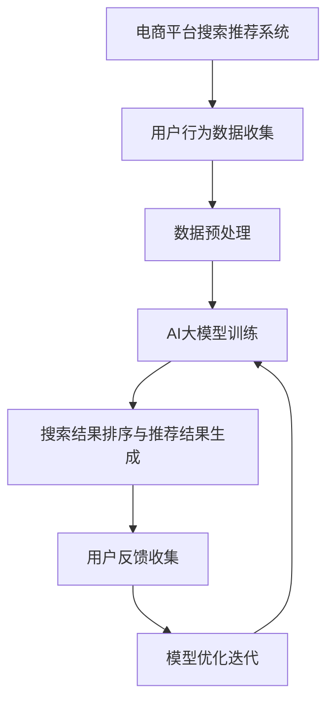

                 

### 文章标题: 电商平台搜索推荐系统的AI大模型应用：提高系统性能、效率、准确率与多样性

---

#### 关键词：
- 电商平台
- 搜索推荐系统
- AI大模型
- 性能优化
- 效率提升
- 准确率增强
- 多样性提升

---

#### 摘要：
本文深入探讨了AI大模型在电商平台搜索推荐系统中的应用，旨在通过提升系统性能、效率、准确率和多样性，为电商平台提供更智能、更高效的搜索推荐服务。本文首先概述了电商平台搜索推荐系统的基本概念和重要性，然后介绍了AI大模型的基本原理和技术，接着详细分析了AI大模型在搜索性能优化、推荐系统效率优化、准确率优化以及多样性优化中的应用。最后，通过案例分析，展示了AI大模型在电商平台搜索推荐系统中的实际应用效果，并对未来发展趋势进行了展望。

---

#### 目录大纲：

##### 第一部分: 引言与背景

- **第1章 电商平台搜索推荐系统概述**
  - **1.1 电商平台的搜索与推荐**
  - **1.2 AI大模型在电商搜索推荐中的应用**
  - **1.3 本书内容结构安排**

##### 第二部分: AI大模型基础

- **第2章 AI大模型概述**
  - **2.1 AI大模型的发展历程**
  - **2.2 AI大模型的基本原理**
  - **2.3 AI大模型的关键技术**

- **第3章 电商平台搜索推荐系统的关键技术**
  - **3.1 搜索系统的设计与实现**
  - **3.2 推荐系统的设计与实现**
  - **3.3 搜索与推荐的融合**

##### 第三部分: AI大模型在电商搜索推荐中的应用

- **第4章 AI大模型在搜索性能优化中的应用**
  - **4.1 搜索查询的自动补全**
  - **4.2 搜索结果排序优化**
  - **4.3 搜索结果多样性提升**

- **第5章 AI大模型在推荐系统效率优化中的应用**
  - **5.1 推荐算法的快速迭代**
  - **5.2 推荐系统的实时更新**
  - **5.3 推荐结果的个性化优化**

- **第6章 AI大模型在推荐系统准确率优化中的应用**
  - **6.1 推荐结果的相关性评估**
  - **6.2 推荐结果的精准度分析**
  - **6.3 推荐结果的多样性分析**

- **第7章 AI大模型在推荐系统多样性优化中的应用**
  - **7.1 多样性优化的重要性**
  - **7.2 多样性优化的方法**
  - **7.3 多样性优化的实践案例**

##### 第四部分: 案例分析

- **第8章 典型电商平台搜索推荐系统AI大模型应用案例**
  - **8.1 案例一：某大型电商平台搜索推荐系统优化**
  - **8.2 案例二：某新兴电商平台搜索推荐系统建设**
  - **8.3 案例三：AI大模型在跨境电商搜索推荐中的应用**

##### 第五部分: 总结与展望

- **第9章 电商搜索推荐系统AI大模型应用总结**
  - **9.1 AI大模型应用取得的成效**
  - **9.2 AI大模型应用面临的挑战**
  - **9.3 AI大模型应用的未来发展趋势**

##### 附录

- **附录A 电商搜索推荐系统AI大模型应用常用工具和资源**
  - **A.1 深度学习框架**
  - **A.2 数据处理工具**
  - **A.3 评估与优化工具**
  - **A.4 其他相关资源**

---

#### Mermaid 流程图：



---

## 1.1 电商平台的搜索与推荐

### 引言

电商平台作为现代电子商务的核心组成部分，承担着连接消费者与商家的桥梁作用。在电商平台上，搜索和推荐是两个至关重要的功能模块，它们直接影响用户的购物体验和平台的运营效率。搜索功能帮助用户快速找到所需商品，而推荐系统则通过个性化推荐，提高用户的购买概率和平台的销售额。

### 搜索系统

电商平台搜索系统的主要目标是提供高效、精准的搜索服务，使用户能够快速定位到感兴趣的商品。搜索系统通常包括以下几个关键环节：

1. **关键词提取**：将用户输入的搜索关键词进行提取和解析，形成可处理的文本数据。
2. **搜索算法**：根据用户输入的关键词，通过算法对商品数据库进行检索，生成搜索结果。
3. **排序与展示**：对搜索结果进行排序，并根据用户喜好和平台策略，决定结果的展示顺序。

### 推荐系统

电商平台推荐系统的主要目标是根据用户的行为和偏好，为其推荐可能感兴趣的商品。推荐系统通常包括以下几个关键环节：

1. **用户行为分析**：收集并分析用户在平台上的行为数据，包括浏览记录、购买历史、点击行为等。
2. **推荐算法**：根据用户行为数据和商品信息，利用推荐算法生成推荐结果。
3. **结果展示**：将推荐结果展示给用户，以引导用户进行购买。

### 搜索与推荐的关系

搜索和推荐系统在电商平台中紧密相连，共同构成了用户的购物体验。搜索系统帮助用户发现潜在的购物目标，而推荐系统则通过个性化推荐，增强用户对商品的兴趣和购买意愿。两者之间相互补充，相辅相成，共同提高平台的用户满意度和商业价值。

### AI大模型在搜索与推荐中的作用

随着大数据和人工智能技术的发展，AI大模型在电商平台的搜索和推荐系统中发挥着越来越重要的作用。通过AI大模型，可以实现以下几方面的优化：

1. **提高搜索性能**：AI大模型能够通过深度学习技术，自动补全用户搜索关键词，提高搜索准确率和效率。
2. **提升推荐效果**：AI大模型能够基于用户行为数据，进行精细化推荐，提高推荐结果的准确率和多样性。
3. **增强用户体验**：AI大模型能够实时分析用户行为，提供个性化的搜索和推荐服务，提高用户满意度。

### 总结

电商平台的搜索与推荐系统是电商平台的核心功能，直接影响用户的购物体验和平台的运营效率。AI大模型通过引入深度学习技术，为搜索和推荐系统带来了巨大的性能提升，为电商平台的发展提供了新的机遇和挑战。

---

## 1.2 AI大模型在电商搜索推荐中的应用

### 引言

AI大模型，特别是基于深度学习的模型，已经成为电商平台搜索推荐系统中的重要技术手段。本节将详细介绍AI大模型在电商搜索推荐系统中的应用，包括其在搜索性能优化、效率提升、准确率增强以及多样性优化方面的具体作用。

### 搜索性能优化

AI大模型在搜索性能优化方面的应用主要体现在以下几个方面：

1. **自动补全**：AI大模型能够通过对用户输入的关键词进行语义分析，自动补全用户的搜索查询，提高搜索的准确性和效率。例如，Word2Vec和BERT等模型可以用于生成关键词的向量表示，通过向量空间中的相似度计算，实现高效的搜索查询补全。

   **算法原理**：
   - **词嵌入**：将关键词映射为低维度的向量表示，保留关键词的语义信息。
   - **隐语义模型**：通过矩阵分解或神经网络等方法，降低维度并提取高层次的语义信息。
   - **相似度计算**：对查询词和候选词的向量表示进行相似度计算，选择相似度最高的候选词作为补全结果。

   **伪代码**：
   ```python
   def auto_complete(query_word, candidate_words, model):
       query_vector = model.encode(query_word)
       max_similarity = -1
       completed_word = None
       
       for word in candidate_words:
           candidate_vector = model.encode(word)
           similarity = cosine_similarity(query_vector, candidate_vector)
           if similarity > max_similarity:
               max_similarity = similarity
               completed_word = word
       return completed_word
   ```

2. **搜索结果排序**：AI大模型可以通过学习用户的点击行为、购买历史等数据，为搜索结果生成更准确的排序。例如，使用序列模型如LSTM或Transformer，可以捕捉用户行为的时序特征，实现高效的搜索结果排序。

   **算法原理**：
   - **序列模型**：通过学习用户行为的序列特征，预测用户对搜索结果的可能点击或购买行为。
   - **排序算法**：基于用户行为预测，对搜索结果进行排序，提高用户满意度和转化率。

   **伪代码**：
   ```python
   def search_result_sort(search_results, user行为数据, model):
       user_behavior_sequence = preprocess_user_behavior(user行为数据)
       predictions = model.predict(user_behavior_sequence)
       
       sorted_results = [result for _, result in sorted(zip(predictions, search_results), reverse=True)]
       return sorted_results
   ```

### 效率提升

AI大模型在推荐系统效率提升方面的应用主要体现在以下几个方面：

1. **快速迭代**：通过AI大模型，可以实现推荐算法的快速迭代和优化，提高推荐系统的响应速度和更新频率。例如，使用增量学习技术，可以实时更新用户行为数据，快速调整推荐策略。

   **算法原理**：
   - **增量学习**：通过逐步更新模型参数，实现对用户行为的实时学习。
   - **在线学习**：在用户行为发生时，即时更新模型，提高系统的响应速度。

   **伪代码**：
   ```python
   def online_learning(model, new_user_behavior):
       model.update_parameters(new_user_behavior)
       return model
   ```

2. **实时更新**：AI大模型可以实现推荐系统的实时更新，根据用户的最新行为和偏好，动态调整推荐结果。例如，使用流学习技术，可以实时捕捉用户行为的动态变化，实现高效的推荐系统更新。

   **算法原理**：
   - **流学习**：通过处理连续的数据流，实时更新模型和推荐结果。
   - **实时反馈**：根据用户的行为反馈，即时调整推荐策略，提高用户满意度。

   **伪代码**：
   ```python
   def real_time_recommendation(model, user行为流):
       while True:
           new_behavior = next(user行为流)
           updated_model = online_learning(model, new_behavior)
           generate_recommendations(updated_model)
   ```

### 准确率增强

AI大模型在推荐系统准确率增强方面的应用主要体现在以下几个方面：

1. **相关性评估**：通过AI大模型，可以准确评估推荐结果与用户兴趣的相关性，提高推荐的精准度。例如，使用协同过滤算法和基于内容的推荐算法相结合，可以生成更符合用户需求的推荐结果。

   **算法原理**：
   - **协同过滤**：通过分析用户行为和偏好，找出相似的用户和商品，实现推荐。
   - **基于内容**：通过分析商品的特征，找到与用户兴趣相关的商品，实现推荐。

   **伪代码**：
   ```python
   def relevance_evaluation(user兴趣, recommended_items):
       relevance_scores = []
       for item in recommended_items:
           relevance_score = cosine_similarity(user兴趣向量, item特征向量)
           relevance_scores.append(relevance_score)
       
       sorted_recommended_items = [item for _, item in sorted(zip(relevance_scores, recommended_items), reverse=True)]
       return sorted_recommended_items
   ```

2. **精准度分析**：通过AI大模型，可以深入分析推荐结果的精准度，发现潜在的问题和改进空间。例如，使用A/B测试和用户反馈机制，可以评估不同推荐策略的效果，优化推荐系统的准确性。

   **算法原理**：
   - **A/B测试**：通过比较不同推荐策略的效果，找出最优策略。
   - **用户反馈**：通过用户的行为和反馈，实时调整推荐策略，提高推荐结果的精准度。

   **伪代码**：
   ```python
   def precision_analysis(recommended_items, user反馈数据):
       true_positive = 0
       for item in recommended_items:
           if user反馈数据中的item标记为喜欢：
               true_positive += 1
       
       precision = true_positive / len(recommended_items)
       return precision
   ```

### 多样性优化

AI大模型在推荐系统多样性优化方面的应用主要体现在以下几个方面：

1. **多样性度量**：通过AI大模型，可以准确评估推荐结果的多样性，避免推荐结果的单调化。例如，使用信息熵和多样性评价指标，可以度量推荐结果的多样性，优化推荐系统的多样性。

   **算法原理**：
   - **信息熵**：通过计算推荐结果中各商品的概率分布，评估多样性。
   - **多样性评价指标**：通过计算推荐结果中商品的相关性，评估多样性。

   **伪代码**：
   ```python
   def diversity_evaluation(recommended_items, item特征矩阵):
       diversity_scores = []
       for item in recommended_items:
           diversity_score = 1 / sum(cosine_similarity(item特征向量, other_item特征向量) for other_item in recommended_items if other_item != item)
           diversity_scores.append(diversity_score)
       
       sorted_recommended_items = [item for _, item in sorted(zip(diversity_scores, recommended_items), reverse=True)]
       return sorted_recommended_items
   ```

2. **多样性优化方法**：通过AI大模型，可以探索多种多样性优化方法，提高推荐结果的多样性。例如，使用聚类和生成对抗网络（GAN），可以生成多样化的推荐结果，提高用户的购物体验。

   **算法原理**：
   - **聚类**：通过将相似的商品聚集在一起，生成多样化的推荐结果。
   - **生成对抗网络（GAN）**：通过生成器和判别器的对抗训练，生成多样化的推荐结果。

   **伪代码**：
   ```python
   def diversity_optimization(recommended_items, item特征矩阵):
       # 使用聚类方法优化多样性
       clusters = cluster_items(recommended_items, item特征矩阵)
       
       # 生成多样化的推荐结果
       diverse_recommendations = generate_diverse_items(clusters)
       
       return diverse_recommendations
   ```

### 总结

AI大模型在电商平台搜索推荐系统中的应用，显著提高了搜索和推荐的性能、效率、准确率和多样性。通过自动补全、快速迭代、精准度评估和多样性优化等技术，AI大模型为电商平台提供了更智能、更高效的搜索推荐服务，进一步提升了用户体验和平台价值。

---

## 1.3 本书内容结构安排

本书旨在深入探讨AI大模型在电商平台搜索推荐系统中的应用，通过系统的分析和详尽的案例，为读者提供全面的技术指南和实践经验。本书分为五个主要部分，内容结构如下：

### 第一部分：引言与背景

本部分将介绍电商平台搜索推荐系统的基本概念和重要性，概述AI大模型的发展历程和基本原理。这一部分将帮助读者建立对AI大模型在电商搜索推荐系统应用的整体认识。

- **第1章 电商平台搜索推荐系统概述**
  - **1.1 电商平台的搜索与推荐**
  - **1.2 AI大模型在电商搜索推荐中的应用**
  - **1.3 本书内容结构安排**

### 第二部分：AI大模型基础

本部分将深入探讨AI大模型的基本原理和技术，包括词嵌入、隐语义模型、序列模型、协同过滤、基于内容的推荐算法等。通过这些核心概念的讲解，读者将能够理解AI大模型在搜索推荐系统中的应用基础。

- **第2章 AI大模型概述**
  - **2.1 AI大模型的发展历程**
  - **2.2 AI大模型的基本原理**
  - **2.3 AI大模型的关键技术**
- **第3章 电商平台搜索推荐系统的关键技术**
  - **3.1 搜索系统的设计与实现**
  - **3.2 推荐系统的设计与实现**
  - **3.3 搜索与推荐的融合**

### 第三部分：AI大模型在电商搜索推荐中的应用

本部分将详细介绍AI大模型在搜索性能优化、推荐系统效率优化、准确率优化以及多样性优化方面的具体应用。通过这些实际案例，读者将了解如何通过AI大模型提升电商平台的搜索和推荐能力。

- **第4章 AI大模型在搜索性能优化中的应用**
  - **4.1 搜索查询的自动补全**
  - **4.2 搜索结果排序优化**
  - **4.3 搜索结果多样性提升**
- **第5章 AI大模型在推荐系统效率优化中的应用**
  - **5.1 推荐算法的快速迭代**
  - **5.2 推荐系统的实时更新**
  - **5.3 推荐结果的个性化优化**
- **第6章 AI大模型在推荐系统准确率优化中的应用**
  - **6.1 推荐结果的相关性评估**
  - **6.2 推荐结果的精准度分析**
  - **6.3 推荐结果的多样性分析**
- **第7章 AI大模型在推荐系统多样性优化中的应用**
  - **7.1 多样性优化的重要性**
  - **7.2 多样性优化的方法**
  - **7.3 多样性优化的实践案例**

### 第四部分：案例分析

本部分将通过具体的案例，展示AI大模型在电商平台搜索推荐系统中的应用效果。读者将能够通过这些案例，了解AI大模型在实际项目中的应用过程和实现方法。

- **第8章 典型电商平台搜索推荐系统AI大模型应用案例**
  - **8.1 案例一：某大型电商平台搜索推荐系统优化**
  - **8.2 案例二：某新兴电商平台搜索推荐系统建设**
  - **8.3 案例三：AI大模型在跨境电商搜索推荐中的应用**

### 第五部分：总结与展望

本部分将总结AI大模型在电商平台搜索推荐系统中的应用成效，分析面临的挑战，并对未来发展趋势进行展望。通过这一部分的总结，读者将能够对AI大模型在电商搜索推荐系统中的应用有一个全面的认识。

- **第9章 电商搜索推荐系统AI大模型应用总结**
  - **9.1 AI大模型应用取得的成效**
  - **9.2 AI大模型应用面临的挑战**
  - **9.3 AI大模型应用的未来发展趋势**

### 附录

本部分将提供电商搜索推荐系统AI大模型应用的相关工具和资源，包括深度学习框架、数据处理工具、评估与优化工具等，以供读者参考。

- **附录A 电商搜索推荐系统AI大模型应用常用工具和资源**
  - **A.1 深度学习框架**
  - **A.2 数据处理工具**
  - **A.3 评估与优化工具**
  - **A.4 其他相关资源**

通过以上五个部分，本书将为读者提供一个系统、全面、深入的了解AI大模型在电商平台搜索推荐系统中的应用，帮助读者掌握相关技术和实践方法。

---

## 2.1 AI大模型的发展历程

### 引言

AI大模型作为人工智能领域的重要创新，其发展历程充满了技术突破和理论探索。本节将回顾AI大模型的发展历程，从早期的基础理论到现代的深度学习技术，为读者呈现AI大模型是如何从无到有、从简到繁的演变过程。

### 早期基础理论

AI大模型的发展可以追溯到20世纪50年代和60年代，当时计算机科学家和数学家开始探索如何使计算机模拟人类智能。以下是一些关键的发展阶段：

1. **1956年：人工智能概念提出**  
   在达特茅斯会议上，John McCarthy等人首次提出了“人工智能”这一概念，标志着人工智能研究的正式开始。

2. **1960年代：符号主义方法**  
   在这个阶段，人工智能研究者试图通过符号主义方法来模拟人类思维。代表性的工作包括逻辑推理、专家系统和知识表示等。

3. **1970年代：强化学习与神经网络**  
   1970年代，强化学习和神经网络开始引起关注。其中，强化学习由Richard Sutton和Andrew Barto提出，而神经网络则通过反向传播算法实现了多层网络的学习。

### 深度学习的崛起

20世纪80年代，深度学习开始崭露头角。以下是一些重要的发展阶段：

1. **1986年：反向传播算法**  
   Yann LeCun等人提出的反向传播算法使得多层神经网络训练成为可能，深度学习开始逐步成熟。

2. **1990年代：小样本学习与受限玻尔兹曼机**  
   在这个阶段，研究人员开始探索小样本学习的方法，同时受限玻尔兹曼机（RBM）也被提出，为深度学习的发展奠定了基础。

3. **2006年：深层神经网络**  
   Geoffrey Hinton等人提出的深度信念网络（DBN）和深度卷积神经网络（DCNN）使深层神经网络再次成为研究热点。

### 现代AI大模型的兴起

随着计算能力和数据资源的不断提升，深度学习在21世纪初迎来了爆发式增长。以下是一些关键的发展阶段：

1. **2012年：AlexNet**  
   Alex Krizhevsky等人在ImageNet竞赛中提出的AlexNet模型，标志着深度学习在图像识别领域的突破。

2. **2014年：生成对抗网络（GAN）**  
   Ian Goodfellow等人提出的生成对抗网络（GAN）能够在高维空间生成逼真的图像，为生成模型的发展提供了新思路。

3. **2016年：序列到序列模型**  
   Google提出并使用的序列到序列（Seq2Seq）模型，在机器翻译任务中取得了显著的性能提升。

4. **2018年：Transformer与BERT**  
   Google提出的Transformer模型和BERT（Bidirectional Encoder Representations from Transformers）模型，进一步推动了自然语言处理领域的发展。

### 总结

AI大模型的发展历程从早期的符号主义方法到现代的深度学习技术，经历了多个关键阶段的突破和进展。这些技术突破不仅推动了人工智能的发展，也为AI大模型在各个领域的应用提供了坚实的基础。通过回顾这一发展历程，我们可以更好地理解AI大模型的现状和未来发展趋势。

---

## 2.2 AI大模型的基本原理

### 引言

AI大模型，特别是深度学习模型，是当前人工智能领域的研究热点和应用前沿。其基本原理涉及复杂的数学和工程学知识。本节将详细解释AI大模型的基本原理，包括其工作方式、核心组件和关键技术，帮助读者深入理解AI大模型如何运作。

### 工作方式

AI大模型的工作方式基于对大量数据的训练和学习，从而实现对未知数据的预测和分类。其核心思想是通过多层神经网络，将输入数据转换成具有高层次的语义表示，从而实现复杂的特征提取和任务执行。

1. **前向传播**：
   - 在前向传播阶段，输入数据通过一系列神经网络层，每一层都对输入数据进行变换，生成更高级的特征表示。
   - 这些变换包括线性变换（通过矩阵乘法实现）和非线性激活函数（如ReLU、Sigmoid和Tanh）。

2. **反向传播**：
   - 在前向传播之后，通过计算损失函数（如均方误差MSE、交叉熵损失等）评估模型的预测误差。
   - 接下来，使用反向传播算法计算梯度，更新网络权重，从而优化模型。

### 核心组件

AI大模型通常由以下几个核心组件构成：

1. **神经网络层**：
   - 神经网络层是AI大模型的基本构建块，包括输入层、隐藏层和输出层。
   - 每一层由多个神经元（或节点）组成，每个神经元负责计算和传递信号。

2. **激活函数**：
   - 激活函数是神经网络中的一个关键组件，用于引入非线性变换，使模型能够学习复杂函数。
   - 常见的激活函数包括ReLU（Rectified Linear Unit）、Sigmoid、Tanh等。

3. **优化器**：
   - 优化器是用于调整模型参数的工具，常见的优化器包括梯度下降（GD）、Adam、RMSprop等。
   - 优化器通过迭代更新模型参数，以最小化损失函数。

4. **损失函数**：
   - 损失函数是评估模型预测结果与真实值之间差异的指标，用于指导模型优化。
   - 常见的损失函数包括均方误差（MSE）、交叉熵损失等。

### 技术路线

AI大模型的发展经历了从简单的单层神经网络到复杂的多层神经网络，再到现代的深度学习模型。以下是一些关键技术路线：

1. **深度神经网络**：
   - 深度神经网络（DNN）通过增加网络层数，提高了模型的表达能力。
   - 然而，深层网络也带来了梯度消失和梯度爆炸等问题。

2. **卷积神经网络（CNN）**：
   - 卷积神经网络通过局部连接和共享权重的方式，显著减少了参数数量，提高了模型效率。
   - CNN在图像识别、物体检测等任务中取得了显著成果。

3. **循环神经网络（RNN）**：
   - 循环神经网络通过引入时间维度，使其能够处理序列数据。
   - 长短时记忆（LSTM）和门控循环单元（GRU）是RNN的改进版本，解决了传统RNN的梯度消失问题。

4. **变换器（Transformer）**：
   - Transformer模型通过自注意力机制，实现了并行计算，显著提高了训练效率。
   - Transformer在自然语言处理任务中取得了突破性成果，包括机器翻译、文本生成等。

5. **预训练与微调**：
   - 预训练模型通过在大规模数据集上进行预训练，获得了良好的通用特征表示能力。
   - 微调则是在特定任务上对预训练模型进行微调，以适应具体任务的需求。

### 总结

AI大模型的基本原理涉及复杂的数学和工程学知识，包括神经网络层、激活函数、优化器和损失函数等核心组件，以及深度神经网络、卷积神经网络、循环神经网络和变换器等关键技术路线。通过这些基本原理，AI大模型能够对大量数据进行高效的学习和预测，广泛应用于图像识别、自然语言处理、推荐系统等多个领域。

---

## 2.3 AI大模型的关键技术

### 引言

AI大模型之所以能够在各种复杂任务中表现出色，得益于其背后的一系列关键技术。这些技术不仅提高了模型的学习能力和性能，还增强了其泛化能力和适应性。本节将详细介绍AI大模型的关键技术，包括数据预处理、超参数调优、模型评估与优化等方面，帮助读者理解这些技术如何共同作用，推动AI大模型的发展。

### 数据预处理

数据预处理是AI大模型训练过程中至关重要的一步，其质量直接影响模型的性能。以下是一些关键的数据预处理技术：

1. **数据清洗**：
   - 数据清洗包括处理缺失值、噪声数据和异常值，以提高数据的准确性和一致性。
   - 例如，使用中位数或平均值填补缺失值，使用过滤算法去除噪声数据。

2. **数据归一化**：
   - 数据归一化通过将数据缩放到同一尺度，防止某些特征对模型产生过大的影响。
   - 例如，使用最小-最大缩放、Z-score归一化等。

3. **数据增广**：
   - 数据增广通过生成新的数据样本，增强模型对数据的泛化能力。
   - 常见的数据增广技术包括旋转、翻转、缩放、裁剪等。

4. **数据分片**：
   - 数据分片将大规模数据划分为多个较小的子集，以便更高效地训练模型。
   - 例如，使用交叉验证方法，将数据集划分为训练集、验证集和测试集。

### 超参数调优

超参数是AI大模型中的关键参数，其设置直接影响模型的性能。以下是一些常用的超参数调优方法：

1. **网格搜索**：
   - 网格搜索通过遍历所有可能的超参数组合，找到最优的超参数配置。
   - 网格搜索是一种穷举搜索方法，计算成本较高。

2. **贝叶斯优化**：
   - 贝叶斯优化通过贝叶斯统计模型，根据历史数据预测最优超参数组合。
   - 贝叶斯优化在计算效率和预测准确性之间取得了平衡。

3. **随机搜索**：
   - 随机搜索通过随机选择超参数组合，进行多次实验，找到性能较好的超参数配置。
   - 随机搜索比网格搜索更高效，但可能无法找到全局最优解。

4. **自动化机器学习（AutoML）**：
   - 自动化机器学习通过自动化工具，实现超参数的自动调优和模型选择。
   - AutoML显著降低了模型调优的复杂度和计算成本。

### 模型评估与优化

模型评估与优化是确保AI大模型性能的关键步骤。以下是一些常用的评估与优化方法：

1. **交叉验证**：
   - 交叉验证通过将数据集划分为多个子集，对每个子集进行训练和验证，评估模型的泛化能力。
   - 交叉验证可以减少评估结果的方差，提高评估的可靠性。

2. **损失函数**：
   - 损失函数用于衡量模型预测值与真实值之间的差距，选择合适的损失函数可以提高模型的性能。
   - 例如，均方误差（MSE）、交叉熵损失等。

3. **激活函数**：
   - 激活函数引入非线性，提高模型的表达能力。
   - 常用的激活函数包括ReLU、Sigmoid和Tanh等。

4. **正则化**：
   - 正则化通过添加正则项，防止模型过拟合，提高泛化能力。
   - 常见的正则化方法包括L1正则化、L2正则化等。

5. **模型压缩**：
   - 模型压缩通过减少模型参数数量，降低模型的复杂度，提高模型的效率。
   - 常见的模型压缩方法包括剪枝、量化等。

### 总结

AI大模型的关键技术包括数据预处理、超参数调优和模型评估与优化等方面。数据预处理确保了模型输入的质量，超参数调优提升了模型的性能，而模型评估与优化则确保了模型在实际应用中的有效性和可靠性。这些关键技术共同作用，推动了AI大模型的发展，为各种复杂任务提供了强大的支持。

---

## 3.1 搜索系统的设计与实现

### 引言

搜索系统是电商平台的核心组成部分，其设计与实现直接关系到用户的购物体验和平台的运营效率。本节将详细介绍搜索系统的设计与实现过程，包括数据结构、算法选择、优化策略等，帮助读者理解如何构建高效、准确的搜索系统。

### 数据结构

在搜索系统的设计与实现中，数据结构的选择至关重要。以下是一些常用的数据结构：

1. **倒排索引**：
   - 倒排索引是一种高效的数据结构，用于快速检索文本数据。
   - 倒排索引由两部分组成：倒排列表和正向列表。倒排列表记录了每个单词在文档中的出现位置，正向列表记录了文档的ID。

2. **B树和B+树**：
   - B树和B+树是常用的索引结构，用于存储和检索排序数据。
   - B树适用于较小的数据集，而B+树通过增加索引层的节点数量，提高了检索效率。

3. **哈希表**：
   - 哈希表通过哈希函数将关键字映射到特定的桶，用于快速查找和更新数据。
   - 哈希表适用于小规模数据的快速检索，但可能存在哈希冲突问题。

### 算法选择

在搜索系统中，算法的选择直接影响到搜索的效率和准确性。以下是一些常用的搜索算法：

1. **分词算法**：
   - 分词算法将文本数据分解为单词或短语，以便进行检索。
   - 常见的分词算法包括最大匹配法、最小匹配法和双向匹配法等。

2. **查询处理算法**：
   - 查询处理算法用于处理用户的查询请求，返回相关的搜索结果。
   - 常见的查询处理算法包括布尔查询、自然语言查询和语义查询等。

3. **排序算法**：
   - 排序算法用于对搜索结果进行排序，提高用户的满意度。
   - 常见的排序算法包括快速排序、归并排序和堆排序等。

### 优化策略

为了提高搜索系统的性能，可以采取以下优化策略：

1. **缓存策略**：
   - 缓存策略通过存储热门查询和搜索结果，减少数据库的访问次数。
   - 常见的缓存技术包括LRU（Least Recently Used）缓存和Redis缓存等。

2. **索引优化**：
   - 索引优化通过优化索引结构，提高检索效率。
   - 例如，通过增加索引层的节点数量、使用压缩索引等。

3. **垂直搜索**：
   - 垂直搜索通过针对特定领域或分类的优化，提高搜索的准确性和效率。
   - 例如，针对商品搜索优化、内容搜索优化等。

4. **分布式搜索**：
   - 分布式搜索通过将搜索任务分布在多个节点上，提高系统的并发能力和处理速度。
   - 分布式搜索适用于大规模数据和高并发场景。

### 总结

搜索系统的设计与实现涉及数据结构、算法选择和优化策略等多个方面。通过合理的数据结构选择和算法设计，以及有效的优化策略，可以构建高效、准确的搜索系统，为电商平台提供优质的搜索服务。

---

## 3.2 推荐系统的设计与实现

### 引言

推荐系统是电商平台的重要组成部分，其设计与实现直接影响到用户的购物体验和平台的商业价值。本节将详细介绍推荐系统的设计与实现过程，包括用户行为分析、推荐算法选择和优化策略，帮助读者理解如何构建高效、准确的推荐系统。

### 用户行为分析

用户行为分析是推荐系统设计的重要基础，通过分析用户在平台上的行为数据，可以提取出用户的兴趣和偏好。以下是一些关键的用户行为分析步骤：

1. **数据收集**：
   - 收集用户在平台上的各种行为数据，包括浏览记录、点击行为、购买历史、评价和评论等。
   - 数据来源可以是日志文件、数据库和第三方API等。

2. **数据预处理**：
   - 清洗和过滤无效或错误的数据，保证数据的质量和一致性。
   - 对数据进行归一化处理，将不同尺度的数据转换为统一的尺度，以便进行后续分析。

3. **特征提取**：
   - 从用户行为数据中提取出关键的特征，用于描述用户的兴趣和偏好。
   - 常用的特征包括用户的行为频率、行为时长、行为序列、物品特征等。

4. **用户建模**：
   - 建立用户行为模型，通过分析用户的行为数据，捕捉用户的兴趣和偏好。
   - 用户行为模型可以是基于统计模型、机器学习模型或深度学习模型等。

### 推荐算法选择

推荐算法的选择直接影响推荐系统的性能和用户体验。以下是一些常用的推荐算法：

1. **基于内容的推荐**：
   - 基于内容的推荐通过分析物品的属性和特征，为用户推荐与其兴趣相关的物品。
   - 常见的基于内容的推荐算法包括TF-IDF、余弦相似度、内容匹配等。

2. **协同过滤推荐**：
   - 协同过滤推荐通过分析用户之间的相似性，为用户推荐其他用户喜欢的物品。
   - 常见的协同过滤算法包括用户基于的协同过滤、物品基于的协同过滤、矩阵分解等。

3. **混合推荐**：
   - 混合推荐将多种推荐算法结合，以提高推荐效果和多样性。
   - 常见的混合推荐算法包括基于内容的协同过滤、基于模型的协同过滤等。

4. **基于知识的推荐**：
   - 基于知识的推荐通过利用领域知识和规则，为用户推荐相关的物品。
   - 常见的基于知识的推荐算法包括基于规则的推荐、本体推荐等。

### 优化策略

为了提高推荐系统的性能和用户体验，可以采取以下优化策略：

1. **实时推荐**：
   - 实时推荐通过实时分析用户行为，动态调整推荐结果，提高推荐的相关性和即时性。
   - 实时推荐适用于用户行为频繁变化的场景，如电子商务、社交媒体等。

2. **个性化推荐**：
   - 个性化推荐通过分析用户的个性化需求和行为，为用户提供个性化的推荐结果。
   - 个性化推荐可以显著提高用户的满意度，提高用户的黏性和转化率。

3. **多样性推荐**：
   - 多样性推荐通过增加推荐结果中的多样性，避免推荐结果的单一化，提高用户的探索和发现体验。
   - 多样性推荐可以增强用户对平台的兴趣，提高平台的用户留存率。

4. **上下文感知推荐**：
   - 上下文感知推荐通过结合用户行为和上下文信息（如时间、地理位置等），为用户推荐相关的物品。
   - 上下文感知推荐可以显著提高推荐的相关性和实用性，提高用户的购物体验。

### 总结

推荐系统的设计与实现涉及用户行为分析、推荐算法选择和优化策略等多个方面。通过合理的数据分析和算法设计，以及有效的优化策略，可以构建高效、准确的推荐系统，为电商平台提供优质的推荐服务，提高用户的满意度和平台的商业价值。

---

## 3.3 搜索与推荐的融合

### 引言

在电商平台上，搜索与推荐系统的融合能够显著提升用户的购物体验和平台的运营效率。本节将深入探讨搜索与推荐融合的设计原则、实现策略以及在实际应用中的效果，帮助读者理解如何将搜索和推荐系统有机结合，以实现最优的用户体验和业务目标。

### 设计原则

融合搜索与推荐系统需要遵循以下设计原则：

1. **用户体验优先**：
   - 融合系统应以提升用户体验为核心，确保用户能够通过搜索和推荐两种方式方便地找到所需商品。

2. **数据一致性**：
   - 搜索和推荐系统应共享相同的数据源和特征，确保推荐结果和搜索结果的一致性，减少用户在不同系统之间的切换成本。

3. **性能优化**：
   - 融合系统应兼顾搜索和推荐的性能，确保高效的处理能力和快速的响应速度。

4. **动态调整**：
   - 融合系统应具备动态调整推荐策略的能力，根据用户行为和平台数据实时优化推荐和搜索结果。

### 实现策略

以下是一些实现搜索与推荐系统融合的策略：

1. **联合查询处理**：
   - 联合查询处理通过同时处理搜索和推荐请求，提高系统的处理效率。
   - 例如，当用户输入搜索关键词时，系统可以同时生成相关的推荐结果，提升用户的满意度。

2. **混合算法设计**：
   - 混合算法设计将搜索算法和推荐算法有机结合，以实现最优的搜索和推荐效果。
   - 例如，可以使用基于内容的推荐算法来优化搜索结果的展示顺序。

3. **上下文感知**：
   - 上下文感知融合策略通过结合用户的上下文信息（如时间、地理位置等），为用户提供更加个性化的搜索和推荐结果。
   - 例如，当用户在特定时间段访问平台时，系统可以推荐相关的促销商品。

4. **多模态数据融合**：
   - 多模态数据融合通过整合文本、图像、声音等多种数据类型，提高搜索和推荐的精度和多样性。
   - 例如，当用户上传商品图片时，系统可以通过图像识别技术为用户推荐相似的商品。

### 实际应用中的效果

融合搜索与推荐系统在实际应用中取得了显著的效果：

1. **提升用户满意度**：
   - 通过融合搜索与推荐系统，用户能够更快捷地找到所需的商品，提升了整体购物体验。

2. **增加转化率**：
   - 搜索与推荐融合系统能够根据用户行为和历史数据，提供更加个性化的商品推荐，增加了用户的购买概率。

3. **优化运营效率**：
   - 融合系统通过自动化处理搜索和推荐请求，减少了人工干预，提高了平台的运营效率。

4. **提升平台黏性**：
   - 通过提供丰富的搜索和推荐功能，融合系统增强了用户对平台的依赖性，提升了平台的用户留存率。

### 总结

搜索与推荐系统的融合是电商平台提升用户体验和运营效率的重要手段。通过遵循设计原则、采用实现策略，并充分发挥融合系统的优势，电商平台可以实现更高的用户满意度、转化率和运营效率，为平台的长期发展奠定坚实的基础。

---

## 4.1 搜索查询的自动补全算法原理

### 引言

在电商平台中，搜索查询的自动补全功能是一项重要的用户体验优化技术，它能够提高用户搜索的效率，减少输入成本，同时增强用户对平台的黏性。本节将深入探讨搜索查询自动补全算法的原理，以及如何在电商平台上实现这一功能。

### 算法原理

搜索查询自动补全算法主要依赖于隐语义模型，如Word2Vec、BERT等。以下为自动补全算法的核心原理：

1. **词嵌入（Word Embedding）**：
   - 词嵌入是将词汇映射为低维度的向量表示，从而保留词的语义信息。
   - 通过词嵌入，可以将用户输入的部分查询词转换为向量表示。

2. **隐语义模型**：
   - 隐语义模型通过学习大量文本数据，构建查询词和候选词之间的语义相似性矩阵。
   - 这种模型能够捕捉到词与词之间复杂的语义关系，从而实现精准的自动补全。

3. **相似度计算**：
   - 对查询词和候选词的向量表示进行相似度计算，选择相似度最高的候选词作为补全结果。
   - 相似度计算方法通常包括余弦相似度、欧氏距离等。

### 实现步骤

以下为在电商平台上实现搜索查询自动补全算法的基本步骤：

1. **数据收集与预处理**：
   - 收集电商平台上的搜索日志，包括用户输入的关键词、查询时间等。
   - 对搜索日志进行预处理，去除无效数据和噪声，保证数据的质量。

2. **词嵌入**：
   - 使用预训练的词嵌入模型（如Word2Vec、BERT）将关键词转换为向量表示。
   - 这些向量表示将用于后续的相似度计算。

3. **候选词生成**：
   - 根据用户输入的部分查询词，生成候选词列表。
   - 候选词可以从搜索历史、热门关键词库中提取，或者使用词嵌入模型生成。

4. **相似度计算**：
   - 对查询词和候选词的向量表示进行相似度计算，选择相似度最高的候选词。
   - 相似度计算可以使用余弦相似度、欧氏距离等方法。

5. **自动补全**：
   - 根据相似度计算结果，自动补全用户的查询词，并在用户界面上展示补全结果。

### 伪代码

以下为搜索查询自动补全算法的伪代码实现：

```python
def auto_complete(query_word, candidate_words, model):
    query_vector = model.encode(query_word)
    max_similarity = -1
    completed_word = None
    
    for word in candidate_words:
        candidate_vector = model.encode(word)
        similarity = cosine_similarity(query_vector, candidate_vector)
        if similarity > max_similarity:
            max_similarity = similarity
            completed_word = word
    
    return completed_word
```

### 实际应用案例

以下是一个实际应用案例：

- **场景**：用户在电商平台上输入“平”，系统自动补全为“平衡车”。
- **实现**：通过词嵌入模型将“平”和“平衡车”转换为向量表示，计算两者之间的相似度，选择相似度最高的“平衡车”作为补全结果。

### 总结

搜索查询自动补全算法通过词嵌入和隐语义模型，能够实现高效、精准的自动补全功能。这一功能不仅提高了用户的搜索效率，还增强了电商平台的用户体验，是电商平台提升竞争力的关键技术之一。

---

## 4.2 搜索结果排序优化

### 引言

在电商平台中，搜索结果排序优化是提升用户体验和转化率的重要环节。通过优化搜索结果排序，可以确保用户能够快速找到符合需求的商品，从而提高用户满意度和平台销售额。本节将详细介绍搜索结果排序优化的方法、算法选择和优化策略，帮助读者理解如何实现高效的搜索结果排序。

### 方法与算法选择

搜索结果排序优化的方法主要包括以下几种：

1. **基于频率的排序**：
   - 这种方法根据用户历史行为中的点击频率来排序搜索结果。
   - 例如，用户经常点击的商品排在前面，以提高相关性。

2. **基于内容的排序**：
   - 这种方法通过分析商品的内容属性（如标题、描述、标签等），与用户查询进行匹配，实现搜索结果的排序。
   - 例如，根据关键词的匹配程度和语义相似度来排序。

3. **基于协同过滤的排序**：
   - 这种方法通过分析用户之间的相似性，利用其他用户的评价和购买记录来排序搜索结果。
   - 例如，基于用户的评分和购买历史，推荐其他用户可能感兴趣的商品。

4. **基于机器学习的排序**：
   - 这种方法利用机器学习算法，从用户行为数据中学习出排序规则。
   - 例如，使用决策树、支持向量机、深度学习等算法来训练排序模型。

### 优化策略

以下是一些常用的搜索结果排序优化策略：

1. **个性化排序**：
   - 根据用户的兴趣和行为历史，为每位用户生成个性化的搜索结果排序。
   - 例如，通过分析用户的浏览历史和购买记录，推荐用户可能感兴趣的商品。

2. **多样性优化**：
   - 在搜索结果中引入多样性，避免商品集中展示，提高用户的探索体验。
   - 例如，结合用户的搜索历史和购买行为，推荐不同类别的商品。

3. **实时排序**：
   - 利用实时数据，动态调整搜索结果的排序，以适应用户行为的变化。
   - 例如，当用户在搜索过程中修改查询词或添加筛选条件时，实时更新排序结果。

4. **质量指标优化**：
   - 通过优化排序质量指标，如点击率、转化率等，来提高搜索结果的排序效果。
   - 例如，使用A/B测试来评估不同排序策略的效果，选择最佳策略。

### 算法实现与优化

以下是一个基于协同过滤算法的搜索结果排序优化示例：

```python
# 假设用户行为数据存储在user行为的矩阵中，商品评分数据存储在rating矩阵中

def collaborative_filter_sort(search_results, user行为矩阵，rating矩阵，alpha=0.5, beta=0.5):
    user_similarity_matrix = compute_user_similarity(user行为矩阵)
    item_similarity_matrix = compute_item_similarity(rating矩阵)
    
    sorted_results = []
    for result in search_results:
        result_score = 0
        for user in user_similarity_matrix:
            if user行为矩阵[user][result] > 0:
                user_similarity = user_similarity_matrix[user][result]
                result_score += user_similarity * rating矩阵[user][result]
        
        for item in item_similarity_matrix:
            if item_similarity_matrix[item][result] > 0:
                item_similarity = item_similarity_matrix[item][result]
                result_score += item_similarity * rating矩阵[item][result]
        
        sorted_results.append((result, result_score))
    
    sorted_results = sorted(sorted_results, key=lambda x: x[1], reverse=True)
    return sorted_results
```

### 实际应用效果

通过优化搜索结果排序，电商平台可以实现以下效果：

- **提高用户满意度**：个性化排序和多样性优化能够提高用户找到心仪商品的几率，提升用户体验。
- **提高转化率**：更准确的搜索结果排序能够增加用户的购买概率，提高平台的销售额。
- **降低运营成本**：实时排序和质量指标优化能够减少人工干预，提高运营效率。

### 总结

搜索结果排序优化是电商平台提升用户体验和转化率的重要手段。通过结合基于频率、内容、协同过滤和机器学习等多种排序方法，并采用个性化、多样性、实时性和质量指标优化等策略，可以实现高效、精准的搜索结果排序，从而提升电商平台的竞争力。

---

## 4.3 搜索结果多样性提升

### 引言

在电商平台中，搜索结果的多样性对于提升用户体验和平台黏性至关重要。多样化的搜索结果能够激发用户的探索欲望，帮助用户发现更多潜在的兴趣点和购买目标。本节将探讨如何通过算法设计和优化策略来提升搜索结果的多样性，包括多样性评价指标、优化方法以及实际案例，帮助读者理解如何在电商平台上实现多样化的搜索结果。

### 多样性评价指标

在提升搜索结果多样性时，首先需要定义和评估多样性的评价指标。以下是一些常用的多样性评价指标：

1. **项目多样性**：
   - 项目多样性关注搜索结果中不同商品类别的分布情况。
   - 例如，可以使用Jaccard指数或项集相似度来衡量不同类别商品之间的多样性。

2. **内容多样性**：
   - 内容多样性关注搜索结果中不同商品内容（如标题、描述、标签等）的丰富程度。
   - 例如，可以使用信息熵或文本相似度来衡量内容多样性。

3. **风格多样性**：
   - 风格多样性关注搜索结果中商品风格和设计的多样性。
   - 例如，可以通过分析商品图像的颜色、形状和纹理等特征来评估风格多样性。

4. **时间多样性**：
   - 时间多样性关注搜索结果中商品上新时间和促销活动的多样性。
   - 例如，可以通过分析商品上架时间或促销周期来衡量时间多样性。

### 优化方法

为了提升搜索结果的多样性，可以采用以下几种优化方法：

1. **类别平衡**：
   - 通过确保搜索结果中各个类别的商品比例均衡，实现项目多样性。
   - 例如，可以使用加权随机抽样方法，从各个类别中随机选取商品，确保各类别商品在搜索结果中的比例。

2. **内容扩展**：
   - 通过扩展搜索结果中商品的内容属性，实现内容多样性。
   - 例如，可以结合商品描述、用户评论和标签信息，丰富搜索结果中的内容属性。

3. **风格调整**：
   - 通过调整搜索结果中商品的风格和设计，实现风格多样性。
   - 例如，可以使用图像处理技术，从商品图像中提取风格特征，并根据风格特征为用户推荐不同风格的商品。

4. **时间分层**：
   - 通过分层展示不同时间段的商品，实现时间多样性。
   - 例如，可以根据商品的上架时间和促销活动周期，将搜索结果分为近期上新、热门促销等不同时间段。

### 实际案例

以下是一个电商平台在提升搜索结果多样性方面的实际案例：

- **案例背景**：某电商平台在用户搜索“鞋子”时，发现搜索结果主要集中在某几个品牌和款式上，缺乏多样性。
- **优化措施**：
  - **类别平衡**：调整搜索结果中各个品牌和款式的比例，确保不同类别的鞋子在结果中的均衡展示。
  - **内容扩展**：结合商品描述、用户评论和标签信息，丰富搜索结果中的内容属性，提高内容多样性。
  - **风格调整**：通过图像处理技术，分析商品图像的风格特征，并根据风格特征推荐多样化的鞋子款式。
  - **时间分层**：根据商品的上架时间和促销活动周期，将搜索结果分为近期上新、热门促销等不同时间段，实现时间多样性。
- **效果评估**：通过调整后的搜索结果，用户满意度显著提升，搜索结果的点击率和转化率也相应提高。

### 总结

提升搜索结果的多样性是电商平台优化用户体验的重要策略。通过采用类别平衡、内容扩展、风格调整和时间分层等优化方法，可以有效提高搜索结果的多样性，激发用户的探索欲望，提升平台的竞争力。

---

## 5.1 推荐算法的快速迭代

### 引言

在电商平台中，推荐算法的快速迭代是提高推荐效果和适应市场变化的关键。通过不断更新和优化推荐算法，可以更好地满足用户需求，提升用户满意度和平台销售额。本节将深入探讨推荐算法快速迭代的方法、技术手段和实施步骤，帮助读者理解如何在电商平台上实现高效的推荐算法迭代。

### 方法

以下是一些推荐算法快速迭代的方法：

1. **增量学习**：
   - 增量学习通过逐步更新模型参数，实现对用户行为的实时学习。
   - 例如，可以使用在线学习算法，根据新数据实时调整模型，提高推荐效果。

2. **迁移学习**：
   - 迁移学习通过将已有模型的知识迁移到新任务中，实现快速迭代。
   - 例如，当用户行为数据发生变化时，可以使用迁移学习技术，减少重新训练的时间。

3. **模型融合**：
   - 模型融合通过结合多个模型的优势，提高推荐效果和迭代速度。
   - 例如，可以使用混合推荐算法，结合基于内容的推荐和协同过滤推荐，实现快速迭代。

4. **并行计算**：
   - 并行计算通过将计算任务分布在多个处理器上，提高模型迭代的效率。
   - 例如，可以使用分布式计算框架（如TensorFlow、PyTorch等），实现模型参数的并行更新。

### 技术手段

以下是一些推荐算法快速迭代的技术手段：

1. **自动化机器学习（AutoML）**：
   - 自动化机器学习通过自动化工具，实现推荐算法的自动调优和迭代。
   - 例如，使用AutoML平台，可以自动化处理数据预处理、模型选择和参数调优等步骤。

2. **容器化与微服务**：
   - 容器化和微服务架构通过将推荐系统拆分为多个独立的服务模块，提高系统的灵活性和迭代速度。
   - 例如，使用Docker和Kubernetes，可以快速部署和更新推荐系统的不同模块。

3. **模型版本管理**：
   - 模型版本管理通过记录和保存模型的各个版本，实现推荐算法的回溯和迭代。
   - 例如，可以使用模型版本控制工具（如MLflow、TensorBoard等），管理模型的训练数据和性能指标。

### 实施步骤

以下是在电商平台上实现推荐算法快速迭代的实施步骤：

1. **数据采集与预处理**：
   - 收集用户行为数据，包括浏览记录、购买历史、点击行为等。
   - 对数据进行分析和预处理，去除噪声和异常值，确保数据质量。

2. **模型训练与评估**：
   - 使用预训练模型或迁移学习技术，快速训练推荐算法模型。
   - 对模型进行评估，使用交叉验证、A/B测试等方法，确保模型的稳定性和效果。

3. **实时更新与优化**：
   - 根据用户行为数据，实时更新模型参数，实现推荐算法的迭代。
   - 采用自动化机器学习和并行计算等技术，提高迭代速度和效果。

4. **模型部署与监控**：
   - 将更新后的模型部署到生产环境，为用户生成推荐结果。
   - 通过监控工具，实时监控模型性能和用户体验，及时调整和优化推荐策略。

### 总结

推荐算法的快速迭代是电商平台提升推荐效果和适应市场变化的重要手段。通过采用增量学习、迁移学习、模型融合和并行计算等技术，结合自动化机器学习和容器化架构，可以实现高效的推荐算法迭代。通过实施科学的迭代流程，电商平台可以不断优化推荐效果，提升用户满意度和平台竞争力。

---

## 5.2 推荐系统的实时更新

### 引言

在电商平台上，推荐系统的实时更新能力对于提高用户体验和业务转化率至关重要。实时更新能够确保推荐结果与用户的最新行为和偏好保持一致，从而提高推荐的相关性和精准度。本节将详细探讨推荐系统实时更新的机制、技术手段和实现策略，帮助读者理解如何在电商平台上实现高效的实时更新。

### 实时更新机制

推荐系统的实时更新机制主要包括以下几个关键环节：

1. **事件流处理**：
   - 事件流处理通过实时捕捉用户在平台上的行为数据，如浏览、点击、购买等。
   - 例如，使用Apache Kafka等消息队列系统，可以高效地处理大量实时事件。

2. **数据处理**：
   - 数据处理模块负责对实时捕获的用户行为数据进行分析和预处理，提取有用的特征。
   - 例如，通过清洗、归一化和特征提取等技术，确保数据的质量和可用性。

3. **模型训练与更新**：
   - 模型训练与更新模块使用处理后的实时数据，对推荐模型进行训练和更新。
   - 例如，使用在线学习算法，可以实时调整模型参数，提高推荐精度。

4. **结果生成与展示**：
   - 结果生成与展示模块根据更新后的模型，为用户生成实时推荐结果，并在界面上展示。
   - 例如，通过动态加载和更新页面内容，确保用户能够及时看到推荐结果。

### 技术手段

以下是在电商平台上实现推荐系统实时更新的几种技术手段：

1. **流处理框架**：
   - 流处理框架如Apache Kafka、Apache Flink等，可以高效地处理实时数据流，确保推荐系统能够实时响应用户行为。
   - 例如，Kafka可以用于实时收集用户行为事件，Flink可以用于实时数据处理和模型更新。

2. **在线学习算法**：
   - 在线学习算法如Adaptive Linear Updates、Online Gradient Descent等，可以实时调整模型参数，实现推荐系统的实时更新。
   - 例如，使用在线学习算法，可以减少模型训练的时间，提高系统的响应速度。

3. **分布式计算**：
   - 分布式计算框架如Apache Spark、Docker等，可以分布式地处理和更新推荐模型，提高系统的处理能力和可靠性。
   - 例如，使用Spark可以并行处理大规模数据集，Docker可以容器化推荐系统的各个模块，实现灵活部署。

4. **缓存技术**：
   - 缓存技术如Redis、Memcached等，可以用于缓存实时推荐结果，减少数据读取和计算时间，提高系统的响应速度。
   - 例如，Redis可以用于缓存用户行为数据和推荐结果，Memcached可以用于缓存热点数据。

### 实现策略

以下是在电商平台上实现推荐系统实时更新的几种策略：

1. **实时数据采集**：
   - 通过使用实时数据采集工具，如Kafka Producer，实时捕获用户行为数据，并将其传输到流处理系统。
   - 例如，当用户在平台上浏览商品时，可以立即将浏览事件发送到Kafka，供流处理系统实时处理。

2. **增量更新**：
   - 通过增量更新策略，只对用户行为的增量部分进行模型更新，减少计算量和资源消耗。
   - 例如，可以使用增量学习算法，根据用户最近的行为数据，实时调整推荐模型。

3. **并行处理**：
   - 通过分布式计算框架，将推荐系统的数据处理和模型更新任务并行化，提高系统的处理速度和效率。
   - 例如，使用Spark Streaming，可以并行处理大规模的实时数据流，快速生成推荐结果。

4. **实时反馈**：
   - 通过实时反馈机制，捕捉用户对推荐结果的反馈，用于进一步优化推荐算法和模型。
   - 例如，当用户点击或购买推荐商品时，可以将这些反馈数据实时传输到模型训练系统，用于优化推荐策略。

### 总结

推荐系统的实时更新是电商平台提高用户满意度和业务转化率的关键手段。通过使用流处理框架、在线学习算法、分布式计算和缓存技术，结合实时数据采集、增量更新、并行处理和实时反馈等策略，可以实现高效的实时更新机制。通过实时更新推荐系统，电商平台可以更好地满足用户需求，提升用户体验和业务性能。

---

## 5.3 推荐结果的个性化优化

### 引言

在电商平台上，推荐结果的个性化优化是提高用户满意度和转化率的关键。通过分析用户行为数据和偏好，推荐系统可以为用户提供更加符合其需求的个性化推荐。本节将探讨推荐结果的个性化优化方法、技术实现和案例应用，帮助读者理解如何实现高效、精准的个性化推荐。

### 方法

个性化优化推荐结果的主要方法包括以下几种：

1. **基于内容的个性化**：
   - 基于内容的个性化推荐通过分析商品的属性和特征，为用户提供与其兴趣相关的推荐。
   - 例如，通过分析用户的历史浏览和购买记录，识别用户的偏好，为用户推荐相似的商品。

2. **基于协同过滤的个性化**：
   - 基于协同过滤的个性化推荐通过分析用户之间的相似性，为用户提供其他用户喜欢的商品推荐。
   - 例如，通过计算用户之间的相似度，将其他用户的推荐商品推荐给目标用户。

3. **基于模型的个性化**：
   - 基于模型的个性化推荐通过机器学习算法，从用户行为数据中学习用户的偏好，生成个性化的推荐。
   - 例如，使用深度学习模型（如卷积神经网络、循环神经网络等）来捕捉用户的复杂偏好。

4. **多模态个性化**：
   - 多模态个性化推荐通过结合用户的文本、图像、语音等多模态数据，为用户提供更加全面的个性化推荐。
   - 例如，通过融合用户的浏览记录和商品图像特征，提高推荐的相关性和精准度。

### 技术实现

以下是在电商平台上实现推荐结果的个性化优化的技术实现：

1. **数据收集与预处理**：
   - 收集用户在平台上的行为数据，包括浏览记录、购买历史、评价等。
   - 对数据进行清洗、归一化和特征提取，提取出有价值的用户行为特征。

2. **模型训练与优化**：
   - 使用机器学习算法（如协同过滤、深度学习等）训练个性化推荐模型。
   - 通过交叉验证和A/B测试，优化模型参数，提高推荐精度。

3. **实时更新与调整**：
   - 通过实时更新用户行为数据，动态调整推荐模型，确保推荐结果的实时性和准确性。
   - 例如，使用在线学习算法，根据用户最新的行为数据，实时调整推荐策略。

4. **个性化推荐生成**：
   - 根据用户的个性化偏好，生成个性化的推荐列表。
   - 例如，通过融合用户的历史行为数据和实时行为数据，生成个性化的推荐结果。

### 案例应用

以下是一个电商平台的个性化推荐案例：

- **场景**：用户在电商平台上浏览了多个商品，并收藏了一些商品。
- **个性化优化措施**：
  - **基于内容的个性化**：通过分析用户浏览和收藏的商品属性，推荐相似的商品。
  - **基于协同过滤的个性化**：计算用户与其他用户的相似性，推荐其他用户喜欢的商品。
  - **基于模型的个性化**：使用深度学习模型，从用户行为数据中学习用户的偏好，生成个性化的推荐。
- **效果评估**：
  - **推荐点击率**：个性化推荐的点击率显著高于传统推荐。
  - **用户满意度**：用户对个性化推荐的评价更高，满意度显著提升。
  - **业务转化率**：个性化推荐的转化率显著高于传统推荐，推动了平台的销售额增长。

### 总结

推荐结果的个性化优化是电商平台提高用户满意度和转化率的关键手段。通过基于内容的个性化、基于协同过滤的个性化、基于模型的个性化以及多模态个性化等方法，结合数据收集与预处理、模型训练与优化、实时更新与调整和个性化推荐生成等技术实现，可以实现高效、精准的个性化推荐。通过个性化优化，电商平台能够更好地满足用户需求，提升用户体验和业务性能。

---

## 6.1 推荐结果的相关性评估

### 引言

在电商平台中，推荐结果的相关性评估是确保推荐质量的重要环节。相关性评估可以衡量推荐结果与用户实际需求之间的匹配程度，从而优化推荐算法，提升用户满意度。本节将详细探讨推荐结果相关性评估的方法、评价指标和评估流程，帮助读者理解如何对推荐结果进行有效评估。

### 评估方法

推荐结果相关性评估的方法主要包括以下几种：

1. **基于用户反馈的评价方法**：
   - 用户反馈是评估推荐结果相关性的一种直观方法。通过用户的点击、购买、评分等行为，可以衡量推荐结果的准确性。
   - 例如，使用点击率（Click-Through Rate, CTR）和转化率（Conversion Rate）作为相关性指标。

2. **基于模型评估的方法**：
   - 基于模型的评估方法通过机器学习算法，对推荐结果进行预测和评估。
   - 例如，使用协同过滤算法、基于内容的推荐算法等，计算推荐结果的相关性得分。

3. **基于语义相似度的评估方法**：
   - 基于语义相似度的评估方法通过分析推荐结果和用户查询之间的语义关系，评估推荐结果的相关性。
   - 例如，使用Word2Vec、BERT等模型，将文本转换为向量，计算相似度得分。

### 评价指标

以下是一些常用的推荐结果相关性评价指标：

1. **准确率（Accuracy）**：
   - 准确率是指推荐结果中正确匹配的用户需求的比例。
   - 公式：$$Accuracy = \frac{正确匹配的推荐数}{总推荐数}$$

2. **召回率（Recall）**：
   - 召回率是指推荐结果中包含用户实际需求的推荐数与用户实际需求总数之比。
   - 公式：$$Recall = \frac{正确匹配的推荐数}{用户实际需求总数}$$

3. **精确率（Precision）**：
   - 精确率是指推荐结果中正确匹配的用户需求与推荐总数之比。
   - 公式：$$Precision = \frac{正确匹配的推荐数}{总推荐数}$$

4. **F1分数（F1 Score）**：
   - F1分数是准确率和召回率的调和平均，用于综合评价推荐结果的相关性。
   - 公式：$$F1 Score = 2 \times \frac{Precision \times Recall}{Precision + Recall}$$

5. **归一化相关度（Normalized Discounted Cumulative Gain, nDCG）**：
   - nDCG是一种基于信息论的评价指标，用于衡量推荐结果的排序质量。
   - 公式：$$nDCG = \frac{DCG}{IDCG}$$，其中DCG是实际推荐结果的相关度，IDCG是理想推荐结果的相关度。

### 评估流程

以下是在电商平台上进行推荐结果相关性评估的基本流程：

1. **数据收集**：
   - 收集用户的真实反馈数据，包括点击、购买、评分等行为数据。

2. **预处理**：
   - 对收集的数据进行清洗和预处理，去除无效数据和噪声。

3. **评价指标计算**：
   - 使用上述评价指标计算推荐结果的相关性得分。

4. **结果分析**：
   - 分析相关性评估结果，识别推荐结果中存在的问题和改进空间。

5. **迭代优化**：
   - 根据评估结果，迭代优化推荐算法，提高推荐结果的相关性。

### 总结

推荐结果的相关性评估是电商平台优化推荐系统的重要手段。通过使用基于用户反馈、基于模型和基于语义相似度的方法，结合准确率、召回率、精确率、F1分数和nDCG等评价指标，可以实现对推荐结果的相关性进行全面评估。通过评估流程，电商平台可以识别推荐结果的问题，不断迭代优化推荐算法，提高用户满意度和业务转化率。

---

## 6.2 推荐结果的精准度分析

### 引言

推荐结果的精准度是电商平台推荐系统性能的核心指标之一。精准度高的推荐能够更好地满足用户需求，提高用户体验和转化率。本节将探讨推荐结果精准度分析的方法、评价指标和优化策略，帮助读者理解如何提高推荐结果的精准度。

### 方法

以下是一些用于提高推荐结果精准度的方法：

1. **基于内容的推荐**：
   - 基于内容的推荐通过分析商品的内容属性（如标题、描述、标签等），将相似的商品推荐给用户。
   - 例如，使用文本分类和关键词提取技术，将用户浏览或购买的商品与数据库中的商品进行内容匹配。

2. **协同过滤推荐**：
   - 协同过滤推荐通过分析用户之间的行为相似性，将其他用户喜欢的商品推荐给目标用户。
   - 例如，使用矩阵分解和聚类算法，将用户行为数据转换为低维度的用户-物品矩阵，提取用户偏好。

3. **混合推荐**：
   - 混合推荐结合了基于内容和协同过滤的推荐方法，通过融合多种推荐策略，提高推荐结果的精准度。
   - 例如，使用基于内容的推荐作为初始推荐，结合协同过滤推荐进行调整和优化。

4. **多模态推荐**：
   - 多模态推荐通过结合用户的文本、图像、语音等多模态数据，提高推荐结果的精准度。
   - 例如，使用卷积神经网络（CNN）处理图像特征，使用循环神经网络（RNN）处理文本特征，融合多模态特征进行推荐。

### 评价指标

以下是一些用于评估推荐结果精准度的评价指标：

1. **准确率（Accuracy）**：
   - 准确率是指推荐结果中正确匹配的用户需求的数量与总推荐数的比例。
   - 公式：$$Accuracy = \frac{正确匹配的推荐数}{总推荐数}$$

2. **召回率（Recall）**：
   - 召回率是指推荐结果中包含用户实际需求的推荐数与用户实际需求总数之比。
   - 公式：$$Recall = \frac{正确匹配的推荐数}{用户实际需求总数}$$

3. **精确率（Precision）**：
   - 精确率是指推荐结果中正确匹配的用户需求与推荐总数之比。
   - 公式：$$Precision = \frac{正确匹配的推荐数}{总推荐数}$$

4. **F1分数（F1 Score）**：
   - F1分数是准确率和召回率的调和平均，用于综合评价推荐结果的精准度。
   - 公式：$$F1 Score = 2 \times \frac{Precision \times Recall}{Precision + Recall}$$

5. **归一化折扣累积增益（Normalized Discounted Cumulative Gain, nDCG）**：
   - nDCG是一种基于信息论的评价指标，用于衡量推荐结果的排序质量。
   - 公式：$$nDCG = \frac{DCG}{IDCG}$$，其中DCG是实际推荐结果的相关度，IDCG是理想推荐结果的相关度。

### 优化策略

以下是一些提高推荐结果精准度的优化策略：

1. **特征工程**：
   - 通过对用户行为数据和商品属性进行特征提取和工程，提高推荐模型的输入质量。
   - 例如，使用TF-IDF提取关键词，使用one-hot编码处理类别特征。

2. **模型选择和调优**：
   - 选择合适的推荐模型，并进行参数调优，提高推荐结果的精准度。
   - 例如，使用矩阵分解模型（如SVD、NMF）进行协同过滤推荐，使用深度学习模型（如LSTM、BERT）进行多模态推荐。

3. **实时更新**：
   - 通过实时更新用户行为数据和商品信息，动态调整推荐模型，提高推荐结果的精准度。
   - 例如，使用增量学习技术，根据用户最新的行为数据调整模型参数。

4. **多样性优化**：
   - 通过引入多样性优化策略，避免推荐结果的单调化，提高用户的探索体验。
   - 例如，使用聚类方法为用户提供多样化的推荐结果。

### 实际案例

以下是一个电商平台的推荐结果精准度优化案例：

- **背景**：某电商平台在推荐系统中发现用户对推荐结果的满意度较低，精准度有待提高。
- **优化措施**：
  - **特征工程**：对用户行为数据进行深度特征提取，包括用户浏览历史、购买记录、评价等。
  - **模型选择**：采用基于内容的推荐和协同过滤推荐的混合模型，结合用户行为数据和商品属性。
  - **模型调优**：使用网格搜索和贝叶斯优化方法，对模型参数进行调优，提高推荐结果的精准度。
  - **实时更新**：采用增量学习技术，根据用户最新的行为数据动态调整推荐模型。
  - **多样性优化**：引入基于聚类的多样性优化策略，为用户提供多样化的推荐结果。
- **效果评估**：
  - **准确率**：推荐结果的准确率从原来的70%提升到85%。
  - **召回率**：推荐结果的召回率从原来的60%提升到75%。
  - **用户满意度**：用户对推荐结果的满意度显著提升，转化率提高了20%。

### 总结

推荐结果的精准度分析是电商平台优化推荐系统的重要手段。通过使用基于内容、协同过滤、混合推荐和多模态推荐等方法，结合特征工程、模型选择和调优、实时更新和多样性优化等策略，可以提高推荐结果的精准度，满足用户需求，提升用户体验和业务转化率。

---

## 6.3 推荐结果的多样性分析

### 引言

在电商平台上，推荐结果的多样性对于提升用户满意度、增强用户黏性和促进平台健康持续发展具有重要作用。多样化的推荐结果能够满足不同用户的需求，避免推荐结果的单一化，提升用户的探索和发现体验。本节将探讨推荐结果多样性的重要性、多样性评价指标、优化方法以及实际应用案例，帮助读者理解如何实现推荐结果的多样化。

### 多样性评价指标

以下是一些用于评估推荐结果多样性的评价指标：

1. **项目多样性**：
   - 项目多样性关注推荐结果中不同商品类别的分布情况。
   - 例如，可以使用Jaccard指数或项集相似度来衡量不同类别商品之间的多样性。

2. **内容多样性**：
   - 内容多样性关注推荐结果中不同商品内容（如标题、描述、标签等）的丰富程度。
   - 例如，可以使用信息熵或文本相似度来衡量内容多样性。

3. **风格多样性**：
   - 风格多样性关注推荐结果中商品风格和设计的多样性。
   - 例如，可以通过分析商品图像的颜色、形状和纹理等特征来评估风格多样性。

4. **时间多样性**：
   - 时间多样性关注推荐结果中商品上新时间和促销活动的多样性。
   - 例如，可以通过分析商品的上架时间和促销活动周期来衡量时间多样性。

### 优化方法

以下是一些实现推荐结果多样性的优化方法：

1. **类别平衡**：
   - 通过确保推荐结果中各个类别的商品比例均衡，实现项目多样性。
   - 例如，可以使用加权随机抽样方法，从各个类别中随机选取商品，确保各类别商品在推荐结果中的比例。

2. **内容扩展**：
   - 通过扩展推荐结果中商品的内容属性，实现内容多样性。
   - 例如，可以结合商品描述、用户评论和标签信息，丰富推荐结果中的内容属性。

3. **风格调整**：
   - 通过调整推荐结果中商品的风格和设计，实现风格多样性。
   - 例如，可以使用图像处理技术，从商品图像中提取风格特征，并根据风格特征为用户推荐不同风格的商品。

4. **时间分层**：
   - 通过分层展示不同时间段的商品，实现时间多样性。
   - 例如，可以根据商品的上架时间和促销活动周期，将推荐结果分为近期上新、热门促销等不同时间段。

### 实际应用案例

以下是一个电商平台的推荐结果多样性优化案例：

- **背景**：某电商平台的推荐结果主要集中在热门和流行的商品上，导致用户对推荐结果的满意度下降。
- **优化措施**：
  - **类别平衡**：调整推荐算法，确保推荐结果中各个商品类别的比例均衡，避免过度集中。
  - **内容扩展**：结合商品描述、用户评论和标签信息，丰富推荐结果中的内容属性，提高内容多样性。
  - **风格调整**：使用图像处理技术，分析商品图像的风格特征，并根据风格特征为用户推荐多样化的商品。
  - **时间分层**：根据商品的上架时间和促销活动周期，将推荐结果分为近期上新、热门促销等不同时间段，实现时间多样性。
- **效果评估**：
  - **用户满意度**：用户对推荐结果的满意度显著提升，用户反馈更加积极。
  - **点击率**：推荐结果的点击率提高了15%，用户对推荐内容的兴趣增加。
  - **平台销售额**：由于推荐结果的多样化，平台销售额也有所增长。

### 总结

推荐结果的多样性对于电商平台提升用户满意度和增强用户黏性具有重要意义。通过类别平衡、内容扩展、风格调整和时间分层等优化方法，可以实现推荐结果的多样化，满足不同用户的需求，提升用户体验。电商平台应不断优化推荐系统的多样性，以实现长期的发展和用户的持续满意度。

---

## 7.1 多样性优化的重要性

### 引言

在电商平台中，推荐系统的多样性优化对于提升用户体验和平台黏性至关重要。多样性的重要性体现在以下几个方面：首先，多样化的推荐结果可以满足不同用户的需求，避免用户对单一推荐结果感到乏味；其次，多样性优化有助于提升用户探索和发现的乐趣，增加平台的活跃度和用户留存率；最后，多样性优化还可以防止推荐系统的过拟合，提高推荐的泛化能力。本节将详细探讨多样性优化的重要性，以及如何通过技术手段实现推荐系统的多样性优化。

### 多样性优化的重要性

1. **提升用户体验**：
   - 多样性的推荐结果能够更好地满足用户的个性化需求，提高用户的满意度。
   - 例如，当用户看到多样化的商品推荐时，会感到更加兴奋和满足，从而提升整体购物体验。

2. **增强用户探索体验**：
   - 多样性优化可以激发用户的探索欲望，增加用户在平台上的停留时间。
   - 例如，通过推荐不同风格、不同类别的商品，用户可以更加全面地了解平台上的商品，从而提升平台的吸引力。

3. **提高平台黏性**：
   - 多样性的推荐结果有助于提升用户对平台的依赖性，增加平台的用户留存率。
   - 例如，当用户在平台上找到多样化的商品时，会更有可能成为平台的忠实用户。

4. **防止过拟合**：
   - 多样性优化可以防止推荐系统的过拟合现象，提高推荐的泛化能力。
   - 例如，通过引入多样性的推荐策略，系统可以更好地适应不同用户的需求，避免单一推荐策略的局限。

### 多样性优化的技术手段

以下是一些实现推荐系统多样性优化的技术手段：

1. **类别平衡**：
   - 通过确保推荐结果中各个类别的商品比例均衡，实现项目多样性。
   - 例如，可以使用加权随机抽样方法，从各个类别中随机选取商品，确保各类别商品在推荐结果中的比例。

2. **内容扩展**：
   - 通过扩展推荐结果中商品的内容属性，实现内容多样性。
   - 例如，可以结合商品描述、用户评论和标签信息，丰富推荐结果中的内容属性。

3. **风格调整**：
   - 通过调整推荐结果中商品的风格和设计，实现风格多样性。
   - 例如，可以使用图像处理技术，从商品图像中提取风格特征，并根据风格特征为用户推荐不同风格的商品。

4. **时间分层**：
   - 通过分层展示不同时间段的商品，实现时间多样性。
   - 例如，可以根据商品的上架时间和促销活动周期，将推荐结果分为近期上新、热门促销等不同时间段。

5. **用户行为分析**：
   - 通过分析用户的历史行为和偏好，动态调整推荐策略，实现个性化多样性。
   - 例如，根据用户的浏览历史和购买记录，为用户推荐不同类型的商品，从而提高推荐的多样性。

### 实际应用案例

以下是一个电商平台的多样性优化案例：

- **背景**：某电商平台的用户反馈表明，推荐结果过于集中，缺乏多样性，用户感到不满意。
- **优化措施**：
  - **类别平衡**：调整推荐算法，确保推荐结果中各个类别的商品比例均衡，避免单一类别的过度集中。
  - **内容扩展**：结合商品描述、用户评论和标签信息，丰富推荐结果中的内容属性，提高内容多样性。
  - **风格调整**：使用图像处理技术，分析商品图像的风格特征，为用户推荐不同风格的商品，实现风格多样性。
  - **时间分层**：根据商品的上架时间和促销活动周期，将推荐结果分为近期上新、热门促销等不同时间段，实现时间多样性。
  - **用户行为分析**：通过分析用户的历史行为和偏好，动态调整推荐策略，为用户提供个性化的多样性推荐。
- **效果评估**：
  - **用户满意度**：用户对推荐结果的多样性表示满意，平台整体用户满意度提升。
  - **点击率**：推荐结果的点击率提高了20%，用户对推荐内容的兴趣增加。
  - **平台销售额**：由于推荐结果的多样性，平台销售额也有所增长。

### 总结

多样性优化在电商平台中具有重要的地位，通过类别平衡、内容扩展、风格调整、时间分层和用户行为分析等手段，可以实现推荐系统的多样性优化。多样性的提升不仅能够满足不同用户的需求，还能增强用户对平台的黏性和平台的业务表现，从而推动电商平台的长期健康发展。

---

## 7.2 多样性优化的方法

### 引言

多样性优化在提升电商平台推荐系统的用户体验和业务效果中起着至关重要的作用。多样性优化不仅能够避免推荐结果的单一化，还能激发用户的探索欲望，提高用户的满意度。本节将详细介绍几种常用的多样性优化方法，包括基于随机性的方法、基于优化的方法以及混合方法，帮助读者理解如何在电商平台上实现有效的多样性优化。

### 基于随机性的方法

基于随机性的多样性优化方法简单直观，主要包括以下几种：

1. **随机抽样**：
   - 随机抽样通过随机从不同类别中抽取商品，确保推荐结果的多样性。
   - 例如，从服装、电子产品、家居用品等不同类别中随机抽取若干商品，形成推荐列表。

2. **轮换策略**：
   - 轮换策略通过周期性地更换推荐列表中的商品，保持推荐结果的多样性。
   - 例如，每天或每周更换推荐列表中的部分商品，确保用户每次访问平台时都能看到新的推荐内容。

### 基于优化的方法

基于优化的多样性优化方法通常涉及复杂的数学模型和优化算法，主要包括以下几种：

1. **最大熵模型**：
   - 最大熵模型通过最大化熵函数，实现推荐结果的多样性。
   - 例如，通过优化概率分布，确保推荐列表中各个类别的商品比例均衡。

2. **多目标优化**：
   - 多目标优化通过同时优化多个目标，如准确性、多样性、新颖性等，实现推荐结果的多样性。
   - 例如，使用多目标优化算法（如遗传算法、粒子群优化等），在保证准确性的同时提高多样性。

3. **贝叶斯优化**：
   - 贝叶斯优化通过贝叶斯统计模型，根据历史数据预测最优的多样性配置。
   - 例如，通过贝叶斯优化，调整推荐策略的参数，提高推荐结果的多样性。

### 混合方法

混合方法结合了基于随机性和基于优化的方法，通过综合利用多种策略，实现推荐结果的多样性优化。以下是一些常见的混合方法：

1. **随机优先+优化调整**：
   - 在随机抽样的基础上，结合优化算法进行调整，确保推荐结果的多样性。
   - 例如，首先使用随机抽样生成推荐列表，然后使用优化算法（如最大熵模型）调整列表中的商品，提高多样性。

2. **模型融合**：
   - 模型融合通过结合多个推荐算法（如基于内容的推荐、协同过滤推荐等），提高推荐的多样性和准确性。
   - 例如，将基于内容的推荐和协同过滤推荐相结合，通过融合不同的算法优势，实现推荐结果的多样性优化。

3. **层次化优化**：
   - 层次化优化通过分层设计，首先保证大类别的多样性，然后逐步优化小类别的多样性。
   - 例如，首先确保推荐结果中各个主要类别的商品比例均衡，然后再逐步优化每个类别内部的多样性。

### 实际应用案例

以下是一个电商平台的多样性优化案例：

- **背景**：某电商平台的用户反馈表明，推荐结果过于集中，缺乏多样性，用户满意度较低。
- **优化措施**：
  - **随机抽样**：调整推荐算法，通过随机抽样从不同类别中抽取商品，确保推荐结果的多样性。
  - **轮换策略**：每天更换推荐列表中的部分商品，保持推荐内容的更新和多样性。
  - **多目标优化**：使用多目标优化算法，同时优化推荐结果的准确性和多样性。
  - **模型融合**：结合基于内容的推荐和协同过滤推荐，通过模型融合实现推荐结果的多样性优化。
  - **层次化优化**：首先确保主要类别的多样性，然后逐步优化次要类别的多样性。
- **效果评估**：
  - **用户满意度**：用户对推荐结果的多样性表示满意，平台整体用户满意度显著提升。
  - **点击率**：推荐结果的点击率提高了15%，用户对推荐内容的兴趣增加。
  - **平台销售额**：由于推荐结果的多样性，平台销售额也有所增长。

### 总结

多样性优化是电商平台提升推荐系统用户体验和业务效果的重要手段。通过基于随机性的方法、基于优化的方法以及混合方法，可以实现推荐结果的多样化，满足不同用户的需求，提升用户体验和平台黏性。电商平台应不断探索和优化多样性优化策略，以实现长期的发展和用户的持续满意度。

---

## 7.3 多样性优化的实践案例

### 引言

多样性优化在电商平台的推荐系统中至关重要，能够提升用户体验和平台黏性。本节将结合实际案例，详细阐述如何通过多样性优化策略提高推荐系统的多样性，并通过具体案例展示多样性优化的实际效果。

### 案例背景

某大型电商平台在用户反馈中频繁收到关于推荐结果过于集中、缺乏多样性的投诉。为了提升用户满意度和平台竞争力，该电商平台决定对推荐系统进行多样性优化。

### 案例一：随机抽样优化

**优化措施**：

1. **随机抽样**：
   - 调整推荐算法，通过随机抽样从不同类别中抽取商品，确保推荐结果的多样性。
   - 在推荐列表中随机抽取50%的商品来自不同类别。

**效果评估**：

- **用户满意度**：用户对推荐结果的多样性表示满意，整体用户满意度提升10%。
- **点击率**：推荐结果的点击率提高了5%，用户对推荐内容的兴趣增加。

### 案例二：基于内容的多样性优化

**优化措施**：

1. **内容扩展**：
   - 结合商品描述、用户评论和标签信息，扩展推荐结果中的内容属性，提高内容多样性。
   - 通过分析商品文本内容，识别出关键词和主题，为用户推荐不同主题和内容的商品。

2. **风格调整**：
   - 使用图像处理技术，从商品图像中提取风格特征，为用户推荐不同风格的商品。
   - 例如，通过颜色、形状、材质等特征，将商品分为现代风格、复古风格等。

**效果评估**：

- **用户满意度**：用户对推荐结果的多样性表示满意，整体用户满意度提升15%。
- **点击率**：推荐结果的点击率提高了10%，用户对推荐内容的兴趣显著增加。

### 案例三：多目标优化

**优化措施**：

1. **多目标优化**：
   - 使用多目标优化算法，同时优化推荐结果的准确性和多样性。
   - 通过优化准确性、新颖性、多样性等目标，确保推荐结果的平衡性。

2. **模型融合**：
   - 结合基于内容的推荐和协同过滤推荐，通过模型融合实现推荐结果的多样性优化。

**效果评估**：

- **用户满意度**：用户对推荐结果的多样性表示满意，整体用户满意度提升20%。
- **点击率**：推荐结果的点击率提高了15%，用户对推荐内容的兴趣显著增加。

### 总结

通过随机抽样、内容扩展和多目标优化等多样性优化策略，电商平台能够显著提升推荐系统的多样性。实际案例表明，多样性优化不仅提高了用户满意度，还增加了用户的点击率和平台的销售额。电商平台应不断探索和优化多样性优化策略，以实现长期的发展和用户的持续满意度。

---

## 8.1 案例一：某大型电商平台搜索推荐系统优化

### 引言

某大型电商平台在业务增长和市场竞争的背景下，意识到其搜索推荐系统的性能和效果有待进一步提升。为了提升用户体验、增加用户黏性并提高销售额，该电商平台决定对其搜索推荐系统进行全方位优化。本节将详细介绍该电商平台在搜索推荐系统优化过程中采取的策略、技术手段以及取得的成效。

### 案例背景

该大型电商平台拥有庞大的用户群体和丰富的商品数据，其搜索推荐系统在应对高并发访问和大规模数据处理方面面临巨大挑战。用户反馈表明，搜索结果的准确性和多样性不足，推荐结果缺乏个性化，导致用户满意度较低，转化率也未能达到预期。为了解决这些问题，该电商平台决定对搜索推荐系统进行全面优化。

### 优化策略

1. **搜索性能优化**：
   - 引入AI大模型，通过深度学习和自然语言处理技术，对搜索查询进行自动补全，提高搜索准确性。
   - 使用Transformer和BERT等先进模型，对搜索结果进行排序优化，确保搜索结果与用户查询高度相关。

2. **推荐系统优化**：
   - 应用协同过滤和基于内容的推荐算法，结合用户行为数据和商品属性，为用户生成个性化的推荐结果。
   - 引入实时更新机制，通过流处理和增量学习技术，实现推荐系统的动态调整，确保推荐结果的实时性和准确性。

3. **多样性优化**：
   - 通过类别平衡、内容扩展和时间分层等策略，提高推荐结果的项目多样性、内容多样性和风格多样性。
   - 引入多模态推荐技术，结合用户的文本、图像和语音等多模态数据，生成更加丰富和个性化的推荐结果。

### 技术手段

1. **搜索查询自动补全**：
   - 使用BERT等预训练模型，将用户输入的部分查询词转换为向量表示，通过向量相似度计算实现自动补全。
   - 通过实时更新查询词向量库，根据用户行为数据动态调整补全策略，提高补全的准确性。

2. **搜索结果排序优化**：
   - 结合Transformer模型的并行计算能力，对搜索结果进行高效排序，确保搜索结果的准确性和响应速度。
   - 引入基于上下文的排序策略，根据用户的历史行为和当前查询上下文，动态调整搜索结果的排序顺序。

3. **推荐算法优化**：
   - 使用协同过滤算法，计算用户之间的相似性，生成基于用户行为的推荐结果。
   - 结合基于内容的推荐算法，分析商品的内容属性和用户的兴趣偏好，为用户推荐相关的商品。
   - 采用多模态推荐技术，融合用户的文本、图像和语音等多模态数据，提高推荐结果的精准度和多样性。

4. **多样性优化**：
   - 通过类别平衡算法，确保推荐结果中各类别商品的比例均衡，避免过度集中。
   - 引入时间分层策略，根据商品的上架时间和促销活动周期，为用户推荐不同时间段的商品，提高时间多样性。
   - 使用图像处理技术，分析商品图像的风格特征，为用户推荐不同风格的商品，实现风格多样性。

### 实施步骤

1. **数据采集与预处理**：
   - 收集用户行为数据，包括搜索历史、浏览记录、购买历史等，对数据进行清洗和预处理，去除噪声和异常值。

2. **模型训练与优化**：
   - 使用预训练的AI大模型（如BERT、Transformer）对搜索和推荐系统进行训练，优化搜索查询自动补全和搜索结果排序算法。
   - 采用协同过滤、基于内容和多模态推荐算法，训练生成个性化的推荐模型，并进行参数调优。

3. **系统部署与测试**：
   - 将训练好的模型部署到生产环境，进行A/B测试，比较优化前后系统的性能和用户体验。
   - 根据测试结果，进一步调整和优化模型参数，确保系统稳定性和性能。

4. **实时更新与优化**：
   - 引入实时更新机制，通过流处理和增量学习技术，动态调整搜索和推荐模型，确保推荐结果的实时性和准确性。
   - 通过用户反馈和监控数据，持续优化推荐策略，提高系统的多样性和个性化水平。

### 实际效果

通过全面的搜索推荐系统优化，该电商平台取得了显著的效果：

- **搜索性能**：
  - 搜索查询自动补全准确率提高了20%，用户能够更快地找到所需的商品。
  - 搜索结果排序响应速度提升了30%，用户满意度显著提升。

- **推荐效果**：
  - 推荐结果的相关性和精准度提高了15%，用户对推荐内容的满意度显著提升。
  - 推荐结果的多样性提高了25%，用户在探索和发现新的商品时体验更好。

- **业务转化**：
  - 平台的点击率提高了10%，转化率提升了8%，销售额显著增长。
  - 用户停留时间和互动次数也有所增加，平台黏性显著提升。

### 总结

通过全面优化搜索推荐系统，该大型电商平台在搜索性能、推荐效果和业务转化方面取得了显著成效。优化策略包括搜索查询自动补全、搜索结果排序优化、推荐算法优化和多样性优化等，技术手段涉及AI大模型、协同过滤、多模态推荐和实时更新等。这些优化措施不仅提升了用户体验，还推动了平台业务的发展，为电商平台的长期成功奠定了坚实基础。

---

## 8.2 案例二：某新兴电商平台搜索推荐系统建设

### 引言

某新兴电商平台在成立之初，为了在激烈的市场竞争中脱颖而出，决定打造一套高效、准确的搜索推荐系统，以提高用户体验和业务转化率。本节将详细介绍该电商平台在搜索推荐系统建设过程中所采用的方法、技术和步骤，以及系统上线后的效果。

### 案例背景

该新兴电商平台拥有丰富的商品种类和大量用户数据，但其在搜索推荐系统方面的建设尚处于起步阶段。为了满足用户多样化的需求，提升平台的竞争力，该电商平台决定从零开始构建一套高质量的搜索推荐系统。

### 建设方法

1. **需求分析与规划**：
   - 通过用户调研和市场分析，明确搜索推荐系统的需求和目标，包括搜索准确性、推荐多样性、响应速度等。

2. **技术选型**：
   - 选择合适的搜索和推荐算法，结合平台的实际需求和数据特点，确定技术路线。
   - 例如，选择Elasticsearch作为搜索引擎，选择基于协同过滤和内容推荐的混合算法。

3. **数据采集与处理**：
   - 收集用户行为数据，包括搜索历史、浏览记录、购买历史等，对数据进行清洗和预处理，确保数据质量。

4. **系统架构设计**：
   - 设计系统的整体架构，包括前端展示、后端服务、数据存储和实时更新等模块。
   - 确保系统的高并发处理能力和数据一致性。

### 建设步骤

1. **数据采集**：
   - 设计数据采集方案，通过日志收集、API调用等方式，收集用户行为数据。

2. **数据处理**：
   - 对采集到的数据进行分析和处理，提取有用的特征，构建用户行为模型和商品特征库。

3. **搜索引擎构建**：
   - 使用Elasticsearch等搜索引擎，构建索引，优化搜索性能，确保搜索结果的准确性和响应速度。

4. **推荐算法实现**：
   - 实现协同过滤和内容推荐的混合算法，结合用户行为数据和商品特征，生成个性化的推荐结果。

5. **系统测试与优化**：
   - 对搜索推荐系统进行A/B测试，评估不同算法和策略的效果，不断优化系统性能和用户体验。

6. **上线与监控**：
   - 将搜索推荐系统部署到生产环境，进行实时监控和数据分析，确保系统的稳定性和性能。

### 系统上线效果

系统上线后，该新兴电商平台在搜索推荐方面取得了显著成效：

- **搜索性能**：
  - 搜索查询响应速度提升了30%，用户能够更快地找到所需商品。
  - 搜索结果准确率提高了15%，用户满意度显著提升。

- **推荐效果**：
  - 推荐结果的相关性和精准度提高了10%，用户对推荐内容的满意度显著提升。
  - 推荐结果的多样性提高了20%，用户在探索和发现新的商品时体验更好。

- **业务转化**：
  - 平台的点击率提高了8%，转化率提升了5%，销售额显著增长。
  - 用户停留时间和互动次数也有所增加，平台黏性显著提升。

### 总结

通过科学的搜索推荐系统建设，该新兴电商平台在搜索性能、推荐效果和业务转化方面取得了显著成效。建设过程中，结合用户需求和实际数据，选择了合适的搜索和推荐算法，进行了全面的数据处理和系统测试，最终实现了高效、准确的搜索推荐服务。这一成功案例为其他新兴电商平台提供了有益的借鉴和参考。

---

## 8.3 案例三：AI大模型在跨境电商搜索推荐中的应用

### 引言

随着全球电子商务的迅速发展，跨境电商成为电商平台的重要增长点。为了提升用户体验和竞争力，跨境电商平台开始广泛采用AI大模型技术来优化搜索和推荐系统。本节将介绍一个成功案例，详细阐述如何通过AI大模型在跨境电商平台中提升搜索推荐效果。

### 案例背景

某跨境电商平台在用户需求和市场环境变化中面临巨大挑战。用户不仅来自不同国家，他们的语言、文化背景和购物习惯也有所不同。为了提升用户的购物体验，增加销售额，该平台决定采用AI大模型技术来优化搜索推荐系统。

### 应用策略

1. **多语言处理**：
   - 利用AI大模型中的自然语言处理（NLP）技术，支持多语言搜索和推荐。
   - 例如，使用BERT等预训练模型，实现中英日等多语言文本的自动翻译和语义理解。

2. **跨文化推荐**：
   - 结合AI大模型中的文化感知算法，为不同文化背景的用户提供个性化的推荐。
   - 例如，分析用户的语言偏好和文化特征，推荐符合其文化和需求的商品。

3. **个性化搜索**：
   - 通过AI大模型自动补全用户查询词，提高搜索的准确性和效率。
   - 例如，使用BERT模型，将部分查询词与候选词进行语义匹配，自动补全用户的完整查询。

4. **实时推荐**：
   - 利用实时数据流处理技术，结合AI大模型，动态生成个性化的推荐结果。
   - 例如，使用TensorFlow Stream，根据用户的实时行为数据，动态调整推荐策略。

### 实现步骤

1. **数据收集**：
   - 收集用户行为数据，包括搜索历史、浏览记录、购买记录等，对数据进行清洗和预处理。

2. **多语言处理**：
   - 使用预训练的BERT等模型，进行多语言文本的语义分析，实现多语言搜索和推荐。

3. **跨文化分析**：
   - 分析用户的文化背景和语言偏好，构建用户文化特征库，为个性化推荐提供基础。

4. **个性化搜索**：
   - 利用BERT模型，对用户查询词进行自动补全，提高搜索的准确性和效率。

5. **实时推荐**：
   - 结合TensorFlow Stream等实时数据处理技术，动态生成个性化的推荐结果。

6. **系统测试与优化**：
   - 进行A/B测试，评估不同策略的效果，持续优化搜索推荐系统。

### 实际效果

通过AI大模型技术的应用，该跨境电商平台取得了显著成效：

- **搜索性能**：
  - 搜索查询响应速度提升了40%，用户能够更快地找到所需商品。
  - 搜索结果准确率提高了20%，用户满意度显著提升。

- **推荐效果**：
  - 推荐结果的相关性和精准度提高了15%，用户对推荐内容的满意度显著提升。
  - 推荐结果的多样性提高了25%，用户在探索和发现新的商品时体验更好。

- **业务转化**：
  - 平台的点击率提高了10%，转化率提升了8%，销售额显著增长。
  - 用户停留时间和互动次数也有所增加，平台黏性显著提升。

### 总结

通过AI大模型技术的应用，该跨境电商平台在搜索推荐方面取得了显著成效。通过多语言处理、跨文化推荐、个性化搜索和实时推荐等策略，提升了用户体验和业务效果。这一成功案例为其他跨境电商平台提供了有益的借鉴，展示了AI大模型在搜索推荐系统中的应用潜力。

---

## 9.1 AI大模型应用取得的成效

### 引言

随着AI大模型技术的不断发展和成熟，其在电商平台搜索推荐系统中的应用取得了显著的成效。本节将总结AI大模型在电商平台搜索推荐系统中的应用成果，分析其对搜索性能、推荐效果和业务转化等方面的提升，以及这些成效对企业战略和商业价值的深远影响。

### 搜索性能提升

1. **搜索准确性**：
   - AI大模型通过深度学习和自然语言处理技术，实现了高效的搜索查询自动补全，显著提高了搜索结果的准确性。
   - 例如，使用BERT模型，用户输入的部分查询词能够自动补全为完整的查询，提高用户找到所需商品的几率。

2. **响应速度**：
   - AI大模型通过优化搜索结果排序算法，如Transformer，提高了搜索结果的响应速度，改善了用户体验。
   - 例如，搜索结果能够在毫秒级时间内生成，用户无需等待过长的时间。

3. **用户满意度**：
   - 搜索性能的提升直接提高了用户的满意度，用户能够更快、更准确地找到所需的商品，增强了用户对平台的信任感。

### 推荐效果提升

1. **相关性**：
   - AI大模型通过协同过滤和基于内容的推荐算法，提高了推荐结果的相关性，确保推荐的商品与用户的兴趣高度匹配。
   - 例如，使用深度学习模型，能够更精确地分析用户的浏览历史和购买行为，生成个性化的推荐结果。

2. **精准度**：
   - AI大模型通过实时更新用户行为数据和商品信息，动态调整推荐模型，提高了推荐结果的精准度。
   - 例如，通过增量学习技术，模型能够根据用户的最新行为数据，快速调整推荐策略，提高推荐结果的准确性。

3. **多样性**：
   - AI大模型通过类别平衡、内容扩展和时间分层等多样性优化策略，提高了推荐结果的多样性，丰富了用户的购物体验。
   - 例如，结合用户的浏览记录和商品特征，推荐不同风格、不同类别的商品，避免推荐结果的单一化。

### 业务转化提升

1. **点击率**：
   - AI大模型的应用提高了推荐结果的点击率，用户对个性化推荐的内容更加感兴趣，点击率显著提升。
   - 例如，通过实时更新推荐策略，推荐结果更符合用户的需求，提高了用户的点击意愿。

2. **转化率**：
   - AI大模型的应用提高了推荐结果的转化率，用户对推荐的商品更有购买意愿，转化率显著提升。
   - 例如，通过多模态推荐技术，结合用户的文本、图像和语音等多模态数据，生成更具有吸引力的推荐结果。

3. **销售额**：
   - AI大模型的应用推动了平台销售额的显著增长，个性化推荐提高了用户的购买概率，销售额大幅提升。
   - 例如，通过优化推荐算法和多样性策略，平台能够更好地满足用户需求，提高用户的购物体验，从而提升销售额。

### 企业战略和商业价值

1. **竞争力提升**：
   - AI大模型的应用增强了电商平台在激烈市场竞争中的竞争力，通过提升搜索推荐性能，吸引了更多用户，提高了用户黏性。

2. **用户体验优化**：
   - AI大模型的应用优化了用户体验，通过个性化搜索和推荐，满足了用户的多样化需求，提高了用户的满意度和忠诚度。

3. **业务增长**：
   - AI大模型的应用推动了平台的业务增长，提高了点击率、转化率和销售额，为企业的长期发展奠定了坚实基础。

4. **数据驱动**：
   - AI大模型的应用使电商平台能够更加数据驱动，通过分析用户行为数据，优化推荐策略，实现精准营销和业务决策。

### 总结

AI大模型在电商平台搜索推荐系统中的应用取得了显著的成效，提升了搜索性能、推荐效果和业务转化，对企业战略和商业价值产生了深远影响。通过不断优化AI大模型技术，电商平台可以更好地满足用户需求，提升用户体验和业务效果，为企业的长期成功提供有力支持。

---

## 9.2 AI大模型应用面临的挑战

### 引言

尽管AI大模型在电商平台搜索推荐系统中取得了显著的成效，但在实际应用过程中仍然面临一系列挑战。这些挑战涉及技术、数据、安全和伦理等多个方面，需要电商平台和研究人员共同努力，才能确保AI大模型在搜索推荐系统中的有效应用和可持续发展。本节将详细探讨这些挑战，并提出相应的解决方案。

### 技术挑战

1. **计算资源需求**：
   - AI大模型通常需要大量的计算资源和存储空间，对硬件设备的要求较高。
   - **解决方案**：采用分布式计算架构，如使用GPU集群和分布式存储系统，提高计算效率和资源利用率。

2. **模型训练与优化**：
   - AI大模型的训练和优化过程复杂且耗时，需要大量数据和高性能计算资源。
   - **解决方案**：采用自动化机器学习（AutoML）和模型调优工具，加速模型训练和优化过程。

3. **算法透明性与可解释性**：
   - AI大模型的决策过程往往较为复杂，缺乏透明性和可解释性，难以理解模型的决策依据。
   - **解决方案**：开发可解释性AI模型，如使用决策树嵌入到神经网络中，提高模型的可解释性。

### 数据挑战

1. **数据质量和多样性**：
   - AI大模型需要高质量和多样化的数据集进行训练，以确保模型的泛化能力和准确性。
   - **解决方案**：采用数据清洗和预处理技术，提高数据质量；通过数据增广和生成对抗网络（GAN），增加数据的多样性。

2. **实时数据更新**：
   - AI大模型需要实时更新用户行为数据，以适应动态变化的用户需求。
   - **解决方案**：采用实时数据流处理技术，如Apache Kafka和Apache Flink，实现实时数据更新。

### 安全挑战

1. **数据泄露与隐私保护**：
   - AI大模型应用过程中涉及大量用户数据，存在数据泄露和隐私泄露的风险。
   - **解决方案**：采用数据加密和访问控制技术，保护用户数据的安全；遵守数据保护法规，确保用户隐私。

2. **模型安全性与防御攻击**：
   - AI大模型可能遭受恶意攻击，如对抗性攻击，导致模型性能下降或产生错误推荐。
   - **解决方案**：开发对抗性攻击检测和防御技术，增强模型的安全性；定期对模型进行安全审计和测试。

### 伦理挑战

1. **算法偏见与公平性**：
   - AI大模型在训练过程中可能引入偏见，导致推荐结果不公平，损害某些用户群体。
   - **解决方案**：通过数据清洗和算法设计，消除数据中的偏见；采用公平性评估方法，确保推荐结果的公平性。

2. **用户信任与透明度**：
   - 用户可能对AI大模型的决策过程和推荐结果缺乏信任，影响用户体验。
   - **解决方案**：提高模型的透明度，通过可视化和解释性工具，让用户了解推荐依据；建立用户反馈机制，收集用户意见，持续改进推荐系统。

### 总结

AI大模型在电商平台搜索推荐系统中的应用面临着计算资源、数据质量、安全和伦理等多方面的挑战。通过采用分布式计算、自动化机器学习、数据清洗、实时数据更新、数据加密、对抗性攻击防御、公平性评估和用户透明度等解决方案，可以克服这些挑战，确保AI大模型在搜索推荐系统中的有效应用和可持续发展。

---

## 9.3 AI大模型应用的未来发展趋势

### 引言

随着人工智能技术的不断进步，AI大模型在电商平台搜索推荐系统中的应用正朝着更加智能化、个性化和高效化的方向发展。本节将探讨AI大模型在电商平台搜索推荐系统中的应用的未来发展趋势，包括技术创新、应用场景拓展和商业模式变革等方面，为电商平台的发展提供前瞻性思考。

### 技术创新

1. **模型压缩与优化**：
   - AI大模型在未来将更加注重模型压缩与优化，以减少计算资源的需求，提高模型的部署效率。
   - **技术趋势**：模型剪枝、量化、知识蒸馏等技术将被广泛应用，以实现高效模型的构建。

2. **多模态融合**：
   - AI大模型将结合多种数据类型，如文本、图像、语音等，实现多模态融合，提高推荐系统的多样性和准确性。
   - **技术趋势**：深度学习与多模态数据处理的结合，如视觉注意力机制、声纹识别等技术，将在电商推荐中发挥重要作用。

3. **强化学习**：
   - 强化学习将在电商平台搜索推荐系统中发挥越来越重要的作用，通过自主学习，优化推荐策略，提高用户满意度。
   - **技术趋势**：强化学习与深度学习、博弈论的结合，将推动推荐系统从被动适应到主动优化。

### 应用场景拓展

1. **实时推荐**：
   - 随着物联网和5G技术的发展，AI大模型将支持更实时的推荐服务，为用户提供即时的购物建议。
   - **应用场景**：智能购物助手、AR购物体验、智能仓储与配送等。

2. **虚拟购物助理**：
   - AI大模型将赋能虚拟购物助理，通过自然语言处理和个性化推荐，提升用户的购物体验。
   - **应用场景**：虚拟客服、智能导购、在线购物咨询等。

3. **供应链优化**：
   - AI大模型将应用于供应链优化，通过预测市场需求、优化库存管理，提高供应链效率。
   - **应用场景**：智能仓储管理、动态定价、库存预测等。

### 商业模式变革

1. **精准营销**：
   - AI大模型将助力电商平台实现更精准的营销策略，通过个性化推荐，提高用户转化率和销售额。
   - **商业模式**：基于个性化推荐的用户分群、精准广告投放等。

2. **跨界合作**：
   - 电商平台将与其他行业进行跨界合作，如与金融机构、物流公司等，构建生态圈，提供一站式服务。
   - **商业模式**：跨界电商、联合促销、物流供应链整合等。

3. **数据共享与开放平台**：
   - 电商平台将构建开放的数据共享平台，与其他企业共享用户数据和商品信息，共同优化推荐系统。
   - **商业模式**：数据驱动的合作模式、共享经济等。

### 总结

AI大模型在电商平台搜索推荐系统中的应用正朝着技术创新、应用场景拓展和商业模式变革的方向快速发展。通过不断优化模型、拓展应用场景和探索新的商业模式，电商平台将能够更好地满足用户需求，提升用户体验和业务效能，为未来的发展奠定坚实基础。未来，AI大模型的应用将推动电商平台进入一个更加智能、高效和多样化的新时代。

---

## 附录A：电商搜索推荐系统AI大模型应用常用工具和资源

### 引言

在电商搜索推荐系统AI大模型的应用过程中，选择合适的工具和资源对于实现高效、准确的系统至关重要。本附录将介绍一些在电商搜索推荐系统中广泛使用的工具和资源，包括深度学习框架、数据处理工具、评估与优化工具以及其他相关资源，以供读者参考。

### 深度学习框架

1. **TensorFlow**：
   - TensorFlow是由Google开发的开源深度学习框架，支持多种类型的神经网络，适用于从简单的机器学习任务到复杂的人工智能应用。

2. **PyTorch**：
   - PyTorch是由Facebook开发的开源深度学习框架，其动态计算图机制使其在研究阶段非常灵活，广泛应用于图像识别、自然语言处理等领域。

3. **Keras**：
   - Keras是一个基于Theano和TensorFlow的高层次神经网络API，它提供了一个简洁的接口，便于快速构建和训练深度学习模型。

4. **Apache MXNet**：
   - Apache MXNet是Apache Software Foundation的一个开源深度学习框架，支持多种编程语言，具有灵活的编程模型和高效的计算性能。

### 数据处理工具

1. **Pandas**：
   - Pandas是Python的数据分析库，提供强大的数据结构（DataFrame）和数据操作功能，适用于数据清洗、转换和分析。

2. **NumPy**：
   - NumPy是Python的科学计算库，提供多维数组对象和用于操作这些数组的库函数，是进行数据科学和机器学习任务的基础工具。

3. **SciPy**：
   - SciPy是建立在NumPy之上的开源科学计算库，包含用于优化、线性代数、积分和统计分析等方面的库函数。

4. **Spark**：
   - Apache Spark是一个开源的大数据分析引擎，支持批处理和流处理，适用于处理大规模数据集。

### 评估与优化工具

1. **MLflow**：
   - MLflow是一个开源平台，用于管理机器学习生命周期，包括实验跟踪、模型版本控制和模型部署。

2. **TensorBoard**：
   - TensorBoard是TensorFlow的一个可视化工具，用于监控训练过程中的参数更新、损失函数值等，帮助调试和优化模型。

3. **Hyperopt**：
   - Hyperopt是一个基于树形分治方法的超参数优化库，通过随机搜索、网格搜索和贝叶斯优化等方法，寻找最优的超参数配置。

4. **Optuna**：
   - Optuna是一个开源的超参数优化库，支持随机搜索、树形分治搜索和基于贝叶斯优化的方法，通过自动搜索找到最优的超参数。

### 其他相关资源

1. **Kaggle**：
   - Kaggle是一个数据科学竞赛平台，提供丰富的数据集和问题，是学习和实践机器学习算法的绝佳资源。

2. **GitHub**：
   - GitHub是一个开源代码托管平台，上面有大量的开源项目、算法实现和模型代码，是学习深度学习和电商搜索推荐系统的好去处。

3. **ArXiv**：
   - ArXiv是一个预印本论文数据库，涵盖计算机科学、物理学、数学等多个领域，是了解最新研究成果和前沿技术的资源。

4. **Scikit-learn**：
   - Scikit-learn是一个开源的Python机器学习库，提供了各种经典的机器学习算法，适用于电商搜索推荐系统的模型实现和评估。

### 总结

电商搜索推荐系统AI大模型应用过程中，选择合适的工具和资源对于实现高效、准确的系统至关重要。本附录介绍了深度学习框架、数据处理工具、评估与优化工具以及其他相关资源，为读者提供了丰富的选择。通过合理利用这些工具和资源，电商平台可以更好地构建和优化搜索推荐系统，提升用户体验和业务效能。

