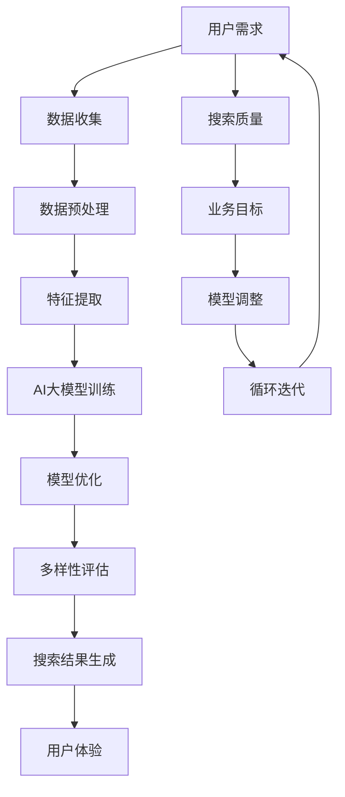

                 


### 引言

在当今电子商务飞速发展的时代，用户对电商平台搜索结果多样性的需求日益增长。一个多样化的搜索结果不仅能够满足用户的不同偏好，还能显著提高用户的购物体验和平台的市场竞争力。然而，实现搜索结果多样性优化并非易事，它涉及到复杂的算法设计、数据处理和业务目标平衡等多个方面。本文旨在深入探讨电商平台搜索结果多样性优化，特别是如何利用AI大模型来实现这一目标。

首先，本文将介绍电商平台搜索结果多样性优化的重要性，以及AI大模型在其中的应用现状。接着，我们将回顾AI大模型的基本原理，包括其发展历程、核心架构和训练优化方法。随后，文章将重点分析多样性优化目标与指标，并探讨基于AI大模型的多样性优化策略。此外，本文还将讨论多样性优化与业务目标的平衡策略，并通过实际案例研究进行深入剖析。

最后，文章将介绍如何搭建一个电商平台搜索结果多样性优化系统，并探讨未来的发展趋势和面临的挑战。通过本文的逐步分析，我们希望能够为从事电商平台技术优化的人员提供有价值的参考和启示。

### 背景介绍

电商平台搜索结果多样性优化是当前电子商务领域一个备受关注的话题。随着用户对个性化体验和多样化选择的需求日益增加，搜索结果的多样性已经成为影响用户满意度和平台竞争力的关键因素。传统单一的搜索结果往往无法满足用户的多样化需求，导致用户流失和购物体验下降。因此，如何通过技术手段提升搜索结果的多样性，已经成为电商平台亟待解决的问题。

首先，搜索结果多样性优化对电商平台的重要性不可忽视。一个多样化的搜索结果能够更好地满足用户的个性化需求，提高用户的满意度和忠诚度。当用户在搜索特定商品时，如果搜索结果中只出现相似或重复的商品，用户很可能会感到厌烦和不满，从而转向其他平台。相反，一个多样化且相关的搜索结果不仅能够提供更多的选择，还能引导用户发现新的商品和品牌，增加用户的购物乐趣和平台粘性。

其次，多样性优化对电商平台业务的影响也是显著的。多样化的搜索结果能够吸引更多用户访问和浏览，从而提高平台的流量和转化率。同时，多样化搜索结果还能促进商家的多样化竞争，为商家提供更多展示机会，提高他们的销售额和利润。对于电商平台来说，商家和用户的共同繁荣是其持续发展的基础，因此，通过多样性优化提升用户体验和商家满意度，对平台的长远发展具有重要意义。

最后，实现搜索结果多样性优化的技术挑战也日益凸显。传统机器学习方法在多样性优化方面存在一定的局限性，难以充分满足复杂的用户需求和平台业务目标。而随着深度学习技术的不断发展，AI大模型逐渐成为实现多样性优化的有力工具。AI大模型具有强大的数据分析和处理能力，能够从海量数据中挖掘潜在的模式和关联，从而提供更精准、更个性化的搜索结果。

总的来说，电商平台搜索结果多样性优化不仅是一个技术问题，更是一个涉及用户体验、业务发展和平台竞争力的综合性课题。通过深入研究和应用AI大模型等先进技术，电商平台能够在激烈的市场竞争中脱颖而出，为用户和商家创造更大的价值。

### AI大模型在多样性优化中的应用

AI大模型在电商平台搜索结果多样性优化中的应用已经成为行业研究和实践的热点。AI大模型，尤其是基于深度学习的模型，凭借其强大的数据处理能力和自适应学习能力，为多样性优化提供了新的可能性。

首先，AI大模型的概念和特点。AI大模型通常指的是具有数十亿甚至千亿参数规模的神经网络模型，例如GPT-3、BERT和T5等。这些模型通过学习大量的文本、图像、音频等多模态数据，能够实现高度复杂的任务处理和模式识别。其核心特点是高参数量、大规模训练数据和高度非线性结构，这使得AI大模型在许多领域都表现出色。

其次，AI大模型在电商搜索中的应用现状。在电商平台，AI大模型主要用于推荐系统和搜索结果的排序和生成。通过学习用户的搜索历史、购买记录、浏览行为等数据，AI大模型能够预测用户的兴趣和需求，提供个性化、多样化的搜索结果。例如，电商平台使用BERT模型进行商品标题的语义分析和排序，从而提升搜索结果的多样性和相关性。

具体来说，AI大模型在多样性优化中的应用体现在以下几个方面：

1. **多模态数据融合**：电商平台不仅拥有用户的文本数据，还包含图像、音频等多种形式的数据。AI大模型可以通过多模态数据融合，提高搜索结果的多样性和准确性。例如，在服装电商平台中，用户上传的服装图片和商品描述文本可以通过AI大模型进行联合处理，生成更加丰富和个性化的搜索结果。

2. **长文本处理**：用户在搜索商品时，往往会输入较长、更复杂的文本。传统模型难以处理这种长文本，而AI大模型具有处理长文本的能力，可以更好地理解和分析用户的查询意图，从而提供更多样化的搜索结果。

3. **实时更新与动态调整**：电商平台的用户行为和数据不断变化，AI大模型可以通过实时学习用户行为和搜索历史，动态调整搜索结果的多样性。例如，在用户浏览了多个类似商品后，AI大模型可以优化搜索结果，减少重复项，增加新的、相关的商品。

4. **个性化推荐**：AI大模型可以根据用户的个性化偏好和历史行为，提供高度个性化的搜索结果。这不仅满足了用户的多样化需求，还提升了用户的购物体验和满意度。

总之，AI大模型在电商平台搜索结果多样性优化中的应用，为电商平台提供了强大的技术支持。通过利用AI大模型，电商平台能够更好地理解和满足用户需求，提升搜索结果的多样性和相关性，从而增强用户黏性和平台竞争力。

### 多样性优化与AI大模型的联系

多样性优化与AI大模型之间的联系是当前电商平台技术领域的重要研究课题。要理解这两者之间的紧密关系，首先需要明确多样性优化的目标和AI大模型的工作原理，并分析它们在实际应用中的相互作用。

#### 多样性优化目标

多样性优化的核心目标是提升搜索结果的多样性，以满足用户的个性化需求和提升用户体验。多样性优化主要涵盖以下三个方面：

1. **频率多样性**：减少搜索结果中的重复商品，避免用户看到大量重复的信息。
2. **种类多样性**：确保搜索结果中包含各种不同类型和风格的产品，满足用户多样化的购物需求。
3. **地区多样性**：根据用户的地理位置，提供本地化的商品和服务，提高搜索结果的相关性。

#### AI大模型的工作原理

AI大模型，尤其是基于深度学习的模型，通过大规模数据训练，可以自动学习复杂的特征和模式。这些模型的核心组件包括神经网络架构、注意力机制和自注意力机制等。

1. **神经网络架构**：神经网络由多个层次组成，包括输入层、隐藏层和输出层。通过反向传播算法，模型可以从训练数据中学习特征表示。
2. **注意力机制**：注意力机制是一种动态关注重要信息的机制，能够提高模型对关键信息的处理能力。
3. **自注意力机制与Transformer架构**：自注意力机制是Transformer架构的核心，能够捕捉序列中的长距离依赖关系，从而提高模型的表示能力。

#### 多样性优化与AI大模型的联系

多样性优化与AI大模型之间的联系主要体现在以下几个方面：

1. **数据驱动**：多样性优化需要大量的用户行为数据和商品信息。AI大模型可以通过处理这些数据，挖掘用户兴趣和需求，从而提供多样化、个性化的搜索结果。
   
2. **特征提取**：AI大模型具有强大的特征提取能力，可以从原始数据中提取出高层次的语义特征。这些特征对于实现多样性优化至关重要，因为它们能够帮助模型更好地理解和满足用户需求。

3. **动态调整**：AI大模型可以根据实时用户行为和搜索历史进行动态调整，实时优化搜索结果的多样性。这种动态调整能力是传统机器学习算法难以实现的。

4. **多模态数据处理**：AI大模型能够处理多种类型的数据，如文本、图像和音频等。通过多模态数据融合，模型可以生成更加丰富和个性化的搜索结果，从而提高多样性。

#### 核心概念架构

为了更好地理解多样性优化与AI大模型之间的联系，我们可以通过以下Mermaid流程图来展示它们的核心概念架构：



在这个架构中，用户需求是多样性优化的起点，通过数据收集、预处理、特征提取、AI大模型训练和模型优化等步骤，最终生成多样化、高质量的搜索结果，从而提升用户体验和搜索质量。同时，多样性评估和模型调整环节确保了系统的实时动态调整能力，以适应不断变化的用户需求。

#### 多样性优化目标与AI大模型在多样性优化中的挑战与机遇

多样性优化目标与AI大模型在多样性优化中既面临挑战也充满机遇。挑战主要来自以下几个方面：

1. **数据多样性**：为了实现有效的多样性优化，需要大量的多样数据，包括用户行为数据、商品描述、图像和音频等多模态数据。然而，获取和处理这些数据是一个复杂的任务，特别是在数据质量和数量有限的情况下。

2. **模型复杂性**：AI大模型通常具有数亿甚至千亿级的参数，这使得模型的训练和优化过程非常复杂和计算密集。此外，模型的解释性也是一个挑战，因为复杂的模型往往难以理解其内部的工作机制。

3. **实时性**：电商平台需要实时响应用户的查询和需求，提供多样性的搜索结果。然而，实时处理大量的数据和高计算量的模型训练任务，对系统的响应速度和稳定性提出了极高的要求。

尽管存在这些挑战，AI大模型在多样性优化中也带来了许多机遇：

1. **个性化推荐**：AI大模型能够通过学习用户的个性化偏好和历史行为，提供高度个性化的搜索结果。这种个性化推荐不仅满足了用户的多样化需求，还提升了用户体验和满意度。

2. **多模态数据处理**：AI大模型能够处理多种类型的数据，通过多模态数据融合，可以生成更加丰富和个性化的搜索结果，从而提高多样性。

3. **动态调整能力**：AI大模型可以根据实时用户行为和搜索历史进行动态调整，实时优化搜索结果的多样性，确保系统始终能够满足用户需求。

总的来说，多样性优化与AI大模型在电商平台中的应用不仅带来了新的技术挑战，也提供了许多创新机遇。通过克服这些挑战，充分利用AI大模型的优势，电商平台能够在激烈的市场竞争中提升其竞争力，为用户提供更加多样化和个性化的购物体验。

### AI大模型基本原理

AI大模型，即大规模的人工智能模型，是近年来在计算机科学和人工智能领域取得的重要突破之一。这些模型以其庞大的参数规模、深度的神经网络结构和强大的数据处理能力，在多个领域取得了显著的应用成果。本文将详细介绍AI大模型的基本原理，包括其发展历程、核心架构以及训练和优化方法。

#### 1.1 AI大模型的发展历程

AI大模型的发展历程可以追溯到20世纪80年代，当时神经网络（Neural Networks）开始崭露头角。早期神经网络模型如感知机（Perceptron）和多层感知机（MLP）虽然在某些简单任务上表现出色，但面对复杂任务时显得力不从心。随着计算机硬件和算法的不断发展，特别是在21世纪初，深度学习（Deep Learning）逐渐成为研究热点。

2006年，Hinton等研究者提出了深度信念网络（Deep Belief Network，DBN），这是深度学习的一个重要里程碑。随后，Hinton和LeCun等研究者不断推动深度学习技术的发展。2012年，AlexNet在ImageNet竞赛中取得突破性成果，标志着深度学习在图像识别领域的崛起。

进入21世纪，随着计算能力的提升和数据量的爆炸式增长，AI大模型如GPT、BERT、T5等逐渐成为研究焦点。这些模型具有数十亿甚至千亿级参数，通过大规模数据训练，能够实现高度复杂的任务处理和模式识别。

#### 1.2 AI大模型的核心架构

AI大模型的核心架构通常包括以下几个关键组成部分：

1. **神经网络架构**：神经网络是AI大模型的基础，它由多层节点（神经元）组成，每层节点接收来自前一层节点的信息并进行处理。常见的神经网络架构包括卷积神经网络（CNN）、循环神经网络（RNN）和变换器（Transformer）等。

    - **卷积神经网络（CNN）**：CNN专门用于处理图像数据，通过卷积层、池化层和全连接层等结构，提取图像中的特征，实现图像分类、目标检测等任务。
    - **循环神经网络（RNN）**：RNN适用于处理序列数据，如文本和语音。通过隐藏状态和循环连接，RNN能够捕捉序列中的时间依赖关系。
    - **变换器（Transformer）**：Transformer架构基于自注意力机制，能够高效处理长序列数据，并在机器翻译、文本生成等任务中取得显著成果。

2. **注意力机制**：注意力机制是AI大模型中的一种重要机制，它能够使模型在处理序列数据时动态关注关键信息。注意力机制分为全局注意力和局部注意力，全局注意力能够捕捉序列中的全局依赖关系，而局部注意力则专注于特定区域的信息。

3. **自注意力机制**：自注意力机制是Transformer架构的核心，它通过计算序列中每个元素之间的相关性，生成注意力权重，从而对输入序列进行加权处理。自注意力机制不仅提高了模型的表示能力，还显著提升了模型的计算效率。

#### 1.3 AI大模型的训练与优化

AI大模型的训练与优化是确保其性能和效果的关键环节。以下是几个关键的训练和优化方法：

1. **大规模数据处理**：AI大模型通常需要大量数据进行训练，以充分挖掘数据中的特征和模式。大规模数据处理包括数据采集、数据清洗和数据处理等步骤。常用的技术包括批量处理、数据增强和分布式计算等。

2. **优化算法**：优化算法用于调整模型参数，以最小化损失函数。常见的优化算法包括随机梯度下降（SGD）、Adam优化器等。优化算法的选择和调整对模型的训练效率和最终性能有重要影响。

3. **迁移学习与微调**：迁移学习是一种有效的训练方法，它利用预训练模型在新任务上的表现。通过微调预训练模型，可以在较少的数据量下实现较好的性能。迁移学习在自然语言处理、计算机视觉等领域有广泛应用。

4. **模型集成与优化**：模型集成是一种通过结合多个模型来提高整体性能的方法。常见的模型集成方法包括堆叠、Boosting和Bagging等。通过模型集成，可以在保持高精度的同时降低过拟合的风险。

综上所述，AI大模型的基本原理包括其发展历程、核心架构和训练优化方法。通过深入理解这些基本原理，我们可以更好地应用AI大模型，实现各种复杂任务的高效处理和精准预测。

### 多样性优化目标与指标

在电商平台中，多样性优化是一个多层次、多维度的复杂任务，其核心目标是提升搜索结果的多样性，以满足用户的个性化需求和提升用户体验。为了实现这一目标，需要明确多样性优化的具体目标和相关指标，从而设计出有效的优化策略。

#### 多样性优化目标

1. **用户满意度**：用户满意度是多样性优化的首要目标。一个多样化的搜索结果能够更好地满足用户的多样化需求，提升用户的购物体验。当用户在搜索商品时，如果搜索结果中包含各种不同类型、风格和价格的商品，用户会感到更加满意，从而增加在平台上购物的可能性。

2. **产品丰富度**：产品丰富度是电商平台竞争力的体现。通过多样性优化，确保搜索结果中包含丰富的商品类型和风格，不仅能够满足不同用户的需求，还能吸引更多商家入驻，促进平台的业务发展。

3. **商家多样性**：商家多样性也是多样性优化的重要目标。在搜索结果中展示来自不同商家的商品，可以增加商家的竞争，提高商家的曝光度和销售额，从而促进整个电商生态的繁荣。

#### 多样性优化指标

为了衡量多样性优化效果，需要设置一系列具体的指标。以下是几个关键指标：

1. **频率多样性（Frequency Diversity）**：频率多样性旨在减少搜索结果中的重复商品。通过计算重复商品的出现频率，可以评估搜索结果的多样性。频率多样性的提高意味着用户在搜索结果中看到的新商品数量增多。

    - **计算方法**：假设搜索结果中包含N个商品，其中K个商品是重复的。频率多样性的计算公式为：频率多样性 = (N - K) / N。

2. **种类多样性（Type Diversity）**：种类多样性关注搜索结果中不同类型商品的比例。种类多样性越高，意味着搜索结果中包含了更多不同类型的商品，满足了用户多样化的需求。

    - **计算方法**：假设搜索结果中包含M种不同的商品类型，其中L种类型的商品出现在搜索结果中。种类多样性的计算公式为：种类多样性 = L / M。

3. **地区多样性（Region Diversity）**：地区多样性关注搜索结果中不同地区商品的比例。对于拥有多地区市场的电商平台，确保搜索结果中包含本地化和跨地区的商品，可以提升用户体验。

    - **计算方法**：假设搜索结果中来自R个不同地区，其中S个地区的商品出现在搜索结果中。地区多样性的计算公式为：地区多样性 = S / R。

#### 多样性优化策略概述

多样性优化策略可以分为传统机器学习方法、基于深度学习的多样优化方法以及多模态数据融合等方法。

1. **传统机器学习方法**：传统机器学习方法如随机森林、支持向量机等可以用于实现多样性优化。这些方法主要通过调整模型参数来控制搜索结果的多样性。例如，通过调整随机森林中的分裂准则，可以平衡搜索结果的相关性和多样性。

2. **基于深度学习的方法**：深度学习方法，如卷积神经网络（CNN）和变换器（Transformer），具有强大的特征提取和模式识别能力，可以用于多样性优化。通过设计自定义的损失函数，可以同时优化搜索结果的相关性和多样性。例如，在变换器架构中，可以通过修改自注意力机制，实现多样性的控制。

3. **多模态数据融合**：多模态数据融合是将多种类型的数据（如文本、图像、音频）进行融合处理，以生成更加丰富和多样化的搜索结果。通过多模态数据融合，可以捕捉到更全面的用户需求和商品特征，从而提高多样性优化的效果。

总之，多样性优化目标是提升搜索结果的多样性，以满足用户的个性化需求和提升用户体验。通过设置频率多样性、种类多样性和地区多样性等指标，可以量化多样性优化的效果。多样性优化策略包括传统机器学习方法、基于深度学习和多模态数据融合等方法，这些方法在实际应用中可以根据具体需求和场景进行选择和调整。

### 基于AI大模型的多样性优化算法

在电商平台中，实现高效的搜索结果多样性优化是提升用户体验和增强平台竞争力的重要手段。AI大模型，凭借其强大的数据处理能力和自适应学习能力，成为实现多样性优化的关键工具。本文将详细介绍几种基于AI大模型的多样性优化算法，包括基于Transformer架构的多样性优化算法、基于注意力机制的多样性优化算法以及基于迁移学习的多样性优化算法。

#### 4.1 基于Transformer架构的多样性优化算法

Transformer架构是一种基于自注意力机制的深度学习模型，具有处理长序列数据的能力，已在自然语言处理领域取得显著成果。在电商搜索结果的多样性优化中，Transformer架构同样表现出色。

1. **自定义损失函数**：

为了同时优化搜索结果的相关性和多样性，可以在Transformer模型中设计一个自定义的损失函数。这个损失函数通常包含两部分：一部分是标准的交叉熵损失函数，用于衡量搜索结果的相关性；另一部分是多样性惩罚项，用于鼓励模型生成多样化的搜索结果。

    - **相关损失**：$L_{rel} = -\sum_{i=1}^{N} y_i \log(p_i)$，其中$y_i$表示第$i$个商品是否是用户感兴趣的，$p_i$表示模型预测的概率。
    - **多样性惩罚项**：$L_{div} = -\sum_{i=1}^{N} \log(D(i))$，其中$D(i)$表示第$i$个商品与其他商品之间的多样性度量。

    - **总损失**：$L = L_{rel} + \lambda L_{div}$，其中$\lambda$是一个调节参数，用于平衡相关性和多样性。

2. **多样性优化目标整合**：

通过整合多样性优化目标和模型训练，可以确保模型在生成搜索结果时既满足相关性要求，又能保持多样性。在训练过程中，模型将不断调整参数，以最小化总损失函数。

3. **实例分析**：

例如，在服装电商平台中，用户搜索“夏季连衣裙”时，模型需要从大量商品中生成一个既相关又有多样性的搜索结果。通过自定义损失函数，模型可以优先选择那些既符合用户兴趣又具有独特风格的连衣裙。

#### 4.2 基于注意力机制的多样性优化算法

注意力机制是一种动态关注关键信息的机制，能够提高模型对重要信息的处理能力。在多样性优化中，注意力机制可以帮助模型识别和关注多样化的商品特征。

1. **注意力机制原理**：

注意力机制通过计算输入序列中每个元素之间的相关性，生成注意力权重，从而对输入序列进行加权处理。注意力权重越大，表示该元素对整体结果的影响越大。

2. **注意力机制在多样性优化中的应用**：

    - **局部注意力**：在搜索结果生成过程中，模型通过局部注意力机制关注与当前用户查询最相关的部分，同时避免过度关注重复的商品，从而提升多样性。
    - **全局注意力**：全局注意力机制可以捕捉整个搜索结果中的全局依赖关系，确保搜索结果的整体多样性。

3. **实例分析**：

例如，用户搜索“笔记本电脑”时，模型会通过注意力机制关注用户查询中的关键词，如“轻薄”、“游戏”等，同时避免生成大量相同品牌的笔记本电脑，从而提高结果的多样性。

#### 4.3 基于迁移学习的多样性优化算法

迁移学习是一种有效的训练方法，它利用在特定任务上已经训练好的模型，在新任务上实现较好的性能。在多样性优化中，迁移学习可以帮助模型快速适应新的数据集和业务场景。

1. **迁移学习原理**：

迁移学习通过将预训练模型在新任务上进行微调，从而实现更好的性能。预训练模型通常在大规模通用数据集上训练，已经学习到了丰富的特征表示。

2. **迁移学习在多样性优化中的应用**：

    - **预训练模型**：利用在通用电商数据集上预训练的模型，可以快速适应新的电商平台数据集。通过迁移学习，模型可以保留预训练阶段的通用特征，同时在新数据集上进行微调，提高多样性优化的效果。
    - **微调策略**：在新任务数据量较少的情况下，通过微调预训练模型，可以显著提升多样性优化的性能。微调过程中，需要调整模型参数，以适应新数据集的特点和需求。

3. **实例分析**：

例如，在一个新的电商平台上线时，可以利用在主流电商平台上预训练好的多样性优化模型，通过少量数据微调，快速实现搜索结果的多样性优化，提高用户体验和平台竞争力。

综上所述，基于AI大模型的多样性优化算法包括基于Transformer架构的多样性优化算法、基于注意力机制的多样性优化算法以及基于迁移学习的多样性优化算法。这些算法通过整合多样性优化目标和先进的技术手段，能够实现高效的多样性优化，为电商平台提供更丰富、更个性化的搜索结果。

### 平衡多样性优化与业务目标

在电商平台中，多样性优化和业务目标之间存在一定的冲突。多样性优化旨在提升搜索结果的多样性，满足用户的个性化需求，从而提升用户体验。然而，业务目标通常包括提高销售额、提升转化率和增加用户粘性等。在实现多样性优化的过程中，如何平衡这些业务目标是一个重要的挑战。

#### 多样性优化与用户满意度的关系

首先，多样性优化与用户满意度密切相关。一个多样化的搜索结果能够更好地满足用户的多样化需求，提高用户的满意度和忠诚度。当用户在搜索特定商品时，如果搜索结果中包含多种不同类型、风格和价格的商品，用户会感到更加满意，从而增加在平台上购物的可能性。然而，如果搜索结果过于单一或重复，用户可能会感到厌烦和不满，导致用户流失。

#### 多样性优化与商业利润的关系

另一方面，商业利润也是电商平台的重要目标之一。电商平台需要通过优化搜索结果，提高用户的点击率和购买转化率，从而提升销售额。然而，多样性优化可能会导致一些高利润商品在搜索结果中出现的频率降低，从而影响商家的收益。例如，如果一个热门品牌的产品在搜索结果中的展示频率较低，可能会导致该品牌的销售下降，从而影响平台的整体利润。

#### 多样性优化与搜索质量的关系

多样性优化还可能影响搜索质量。在优化多样性时，如果过度关注商品的种类和风格多样性，可能会导致搜索结果的相关性下降，从而影响用户的购物体验。例如，当用户搜索“高品质蓝牙耳机”时，如果搜索结果中包含大量与用户需求不相关的商品，用户会感到困惑和失望，从而降低对平台的信任度。

#### 平衡策略的重要性

为了在多样性优化与业务目标之间找到平衡点，需要采取一系列平衡策略。以下是一些关键的平衡策略：

1. **用户行为分析**：

通过分析用户的搜索历史、购买记录和浏览行为，可以了解用户的偏好和需求。根据用户行为数据，可以优化搜索结果的多样性，确保既能满足用户需求，又不会影响商业利润。

2. **业务目标调整**：

在多样性优化过程中，可以根据业务目标进行调整。例如，如果平台的业务目标是提高销售额，可以适当减少搜索结果中的多样性，增加高利润商品的出现频率。相反，如果平台的业务目标是提升用户满意度，可以适当增加搜索结果的多样性。

3. **实时调整策略**：

电商平台可以采用实时调整策略，根据用户的即时反馈和行为动态调整搜索结果的多样性。例如，当用户频繁点击某个类型的商品时，可以增加该类型商品在搜索结果中的频率，从而提高用户的满意度。

4. **个性化推荐**：

通过个性化推荐技术，可以针对不同用户生成个性化的搜索结果，满足用户的多样化需求，同时提高转化率和销售额。个性化推荐可以通过学习用户的兴趣和行为模式，提供高度相关的搜索结果，从而在多样性优化和业务目标之间找到平衡。

总之，多样性优化与业务目标之间存在一定的冲突，但通过采取合适的平衡策略，可以在两者之间找到最佳平衡点。通过深入分析用户行为、调整业务目标和实时优化搜索结果，电商平台可以在提升用户体验的同时，实现商业利润的最大化。

### 案例研究：某电商平台的多样性优化实践

为了更好地理解电商平台搜索结果多样性优化的实际应用，我们以某知名电商平台为例，详细介绍其多样性优化实践的过程、成功案例和经验总结。

#### 1. 案例背景

某电商平台是一家全球知名的在线购物平台，拥有数亿活跃用户和广泛的商品种类。为了提升用户体验和竞争力，该电商平台决定通过多样性优化来改进其搜索结果。

#### 2. 多样性优化实践过程

2.1 **需求分析与目标设定**：

在项目启动阶段，平台进行了深入的用户需求分析，了解用户对搜索结果多样性的期望。通过调查和数据分析，确定多样性优化的目标包括提升用户满意度、增加产品丰富度和商家多样性。

2.2 **数据采集与处理**：

为了实现多样性优化，平台收集了大量用户行为数据，包括搜索记录、购买记录、浏览历史等。这些数据经过预处理，去噪和标准化，用于后续的模型训练和优化。

2.3 **模型选择与训练**：

平台选择了基于Transformer架构的多样性优化算法。通过自定义损失函数，将多样性优化目标与搜索结果的相关性相结合，实现同时优化两者的效果。平台利用大规模数据集对模型进行训练，并通过迁移学习技术，利用预训练模型快速适应新的业务场景。

2.4 **多样性优化策略实施**：

在搜索结果生成过程中，平台采用动态调整策略，根据用户的实时行为和偏好，动态调整搜索结果的多样性。例如，当用户频繁点击某个类型的商品时，平台会增加该类型商品在搜索结果中的频率，从而提升用户满意度。

2.5 **效果评估与反馈**：

通过A/B测试，平台评估了多样性优化策略的效果。结果显示，多样性优化显著提升了用户的点击率和转化率，同时用户满意度也得到了提升。平台根据用户反馈，不断优化和调整多样性优化策略，确保其效果持续提升。

#### 3. 成功案例分析

3.1 **提升用户满意度**：

通过多样性优化，平台能够提供更加个性化的搜索结果，满足用户的多样化需求。用户在搜索过程中看到了更多不同类型和风格的商品，提升了购物体验和满意度。

3.2 **增加产品丰富度**：

多样性优化策略确保了搜索结果中包含了丰富的商品种类和风格，吸引了更多商家入驻平台，增加了产品的丰富度。这进一步提升了平台的竞争力，吸引了更多用户。

3.3 **商家多样性**：

平台通过多样性优化策略，确保了搜索结果中展示了来自不同商家的商品，促进了商家之间的竞争和合作。商家在平台上的曝光度和销售额都有所提升，平台的整体生态更加繁荣。

#### 4. 经验总结

4.1 **数据质量至关重要**：

高质量的原始数据是多样性优化的基础。平台在数据采集和处理过程中，确保数据的质量和完整性，为后续模型训练和优化提供了可靠的数据支持。

4.2 **动态调整策略**：

动态调整策略是多样性优化成功的关键。通过实时分析用户行为和偏好，平台能够动态调整搜索结果的多样性，确保始终满足用户需求。

4.3 **持续优化与反馈**：

多样性优化是一个持续的过程。平台通过A/B测试和用户反馈，不断优化和调整多样性优化策略，确保其效果持续提升。

总之，通过案例研究，我们看到了电商平台搜索结果多样性优化的实际应用和显著效果。多样性优化不仅提升了用户体验和平台竞争力，还为商家和平台带来了更多的商业机会。未来，电商平台将继续探索和优化多样性优化策略，为用户提供更加丰富和个性化的购物体验。

### 搭建电商平台搜索结果多样性优化系统

在电商平台中，搭建一个高效、可扩展的搜索结果多样性优化系统是提升用户体验和竞争力的关键。本文将详细介绍该系统的设计原则、架构设计、开发环境搭建、源代码实现与解读以及系统的应用。

#### 6.1 系统设计原则

6.1.1 可扩展性

电商平台的数据量和用户需求不断变化，因此系统必须具有高度的可扩展性，以应对未来增长的需求。系统应支持水平扩展，即通过增加计算资源来提升处理能力，确保在高并发情况下仍能稳定运行。

6.1.2 高效性

系统需要具备高效的数据处理和计算能力，以快速响应用户查询，并提供高质量的搜索结果。这包括高效的算法实现、合理的硬件配置和优化的数据处理流程。

6.1.3 实时性

电商平台需要实时更新用户数据和搜索结果，以满足用户的即时需求。系统应具备实时数据处理和反馈机制，确保用户在搜索过程中能够及时获得多样化的结果。

6.1.4 易维护性

系统的设计和实现应考虑易维护性，以便在出现问题时能够快速定位和修复。此外，系统文档和代码应保持清晰、规范，方便后续的维护和升级。

#### 6.2 系统架构设计

6.2.1 数据采集与预处理

数据采集是系统的基础，包括用户行为数据、商品信息数据等。数据采集后，需要通过清洗、去噪和标准化等预处理步骤，确保数据的质量和一致性。

- **数据采集**：使用日志采集工具（如Kafka）收集用户行为数据和商品信息数据。
- **数据预处理**：使用ETL（Extract, Transform, Load）工具（如Apache NiFi）对数据进行清洗、去噪和标准化处理。

6.2.2 AI大模型训练与优化

系统核心是AI大模型的训练与优化，这包括数据预处理、模型训练、优化和部署等步骤。

- **数据预处理**：对原始数据进行分词、词嵌入和序列化等预处理步骤，为模型训练做准备。
- **模型训练**：使用分布式训练框架（如TensorFlow或PyTorch）训练AI大模型，包括基于Transformer架构的多样性优化模型。
- **优化**：通过迁移学习、模型集成等技术优化模型，提升多样性和相关性。
- **部署**：使用容器化技术（如Docker）部署模型，确保模型的高效运行和快速扩展。

6.2.3 搜索结果生成与多样性优化

搜索结果生成是系统的核心功能，通过AI大模型生成多样化、个性化的搜索结果。

- **查询处理**：接收用户查询，进行分词和词嵌入等预处理。
- **多样性优化**：利用训练好的AI大模型，生成多样化的搜索结果，同时确保结果的相关性。
- **排序与展示**：根据用户行为数据和业务目标，对搜索结果进行排序和展示，确保用户能够快速找到所需商品。

#### 6.3 开发环境搭建

6.3.1 开发工具与框架

- **编程语言**：Python，因其丰富的机器学习和深度学习库。
- **深度学习框架**：TensorFlow或PyTorch，用于模型训练和优化。
- **数据处理工具**：Pandas和NumPy，用于数据预处理。
- **日志采集工具**：Kafka，用于数据采集和传输。
- **容器化技术**：Docker，用于模型部署和扩展。

6.3.2 硬件配置

- **计算资源**：多台高性能服务器，配备GPU（如NVIDIA Tesla V100）以加速模型训练。
- **存储资源**：分布式存储系统（如HDFS），用于存储海量数据。
- **网络带宽**：高速网络，确保数据传输和处理的高效性。

6.3.3 数据存储与管理

- **关系型数据库**：MySQL，用于存储用户行为数据和商品信息。
- **NoSQL数据库**：MongoDB，用于存储大规模的非结构化数据。
- **数据仓库**：Apache Hadoop，用于存储和处理大规模数据。

#### 6.4 源代码实现与解读

6.4.1 数据采集与预处理

以下为数据采集与预处理的伪代码示例：

```python
# 数据采集
def collect_data(source):
    data = []
    for record in source:
        data.append(process_record(record))
    return data

# 数据预处理
def process_record(record):
    # 数据清洗和标准化
    cleaned_record = clean_and_normalize(record)
    # 分词和词嵌入
    tokens = tokenize(cleaned_record)
    embeddings = embed(tokens)
    return embeddings
```

6.4.2 AI大模型训练与优化

以下为AI大模型训练与优化的伪代码示例：

```python
# 模型训练
def train_model(data, model):
    optimizer = optimizers.Adam(learning_rate=0.001)
    for epoch in range(num_epochs):
        for batch in data:
            loss = model.loss(batch)
            optimizer.minimize(loss, model)
            model.update()
    return model

# 模型优化
def optimize_model(model, validation_data):
    # 迁移学习和模型集成
    optimized_model = migrate_and_combine_models(model, validation_data)
    return optimized_model
```

6.4.3 搜索结果生成与多样性优化

以下为搜索结果生成与多样性优化的伪代码示例：

```python
# 搜索结果生成
def generate_search_results(query, model):
    query_embeddings = model.embed(query)
    search_results = model.predict(query_embeddings)
    return search_results

# 多样性优化
def diversify_search_results(results):
    # 根据多样性目标调整结果
    optimized_results = apply_diversity_metrics(results)
    return optimized_results
```

#### 6.5 系统应用

6.5.1 实时更新与动态调整

系统通过实时更新用户数据和搜索结果，确保多样性优化策略的动态调整。例如，当用户频繁点击某一类型商品时，系统会动态增加该类型商品在搜索结果中的频率。

6.5.2 个性化推荐

基于AI大模型，系统可以提供个性化的推荐，满足用户的多样化需求。例如，用户在浏览多个相关商品后，系统会根据用户行为和偏好，推荐新的、相关但不同的商品。

6.5.3 商家与用户互动

系统通过优化搜索结果，提高了商家曝光度和用户粘性。商家可以更好地展示其产品，用户可以更轻松地找到所需商品，从而促进商家与用户的互动和交易。

总之，通过搭建一个高效、可扩展的搜索结果多样性优化系统，电商平台能够提升用户体验和竞争力，为商家和用户提供更多的价值。

### 电商平台搜索结果多样性优化的未来发展趋势

随着人工智能技术的不断进步，电商平台搜索结果多样性优化也将迎来新的发展趋势。以下是对未来发展趋势的探讨，以及面临的挑战和机遇。

#### 1. AI大模型在多样性优化中的发展趋势

1. **模型规模与性能提升**：未来，AI大模型的规模将继续扩大，参数量将超过千亿甚至万亿级别。随着计算能力的提升，这些大规模模型将具备更强的数据处理和分析能力，能够在更复杂的环境中实现高效的多样性优化。

2. **多样性优化算法的创新**：随着研究的深入，多样性优化算法将不断涌现。例如，基于生成对抗网络（GAN）的多样性优化方法、基于 强化学习的多样性优化方法等，将为电商平台提供更加灵活和高效的多样性优化解决方案。

3. **跨平台与跨领域的应用**：AI大模型在多样性优化中的应用将不仅限于电商平台，还将扩展到社交媒体、在线旅游、金融等领域。通过跨平台和跨领域的数据融合，这些模型将能够更全面地理解和满足用户需求。

#### 2. 挑战与机遇

2.1 **数据隐私与安全**：随着AI大模型的应用范围扩大，数据隐私和安全问题将变得更加突出。电商平台需要确保用户数据的隐私和安全，避免数据泄露和滥用。这需要开发更加安全的数据处理和存储技术，以及完善的隐私保护法规。

2.2 **模型解释性**：目前，AI大模型的黑盒特性使其难以解释和理解。未来，提高模型解释性将成为重要研究方向，特别是在多样性优化领域，用户和商家需要理解模型如何生成搜索结果，从而提高信任度和接受度。

2.3 **法律与伦理问题**：随着AI大模型在多样性优化中的应用，法律和伦理问题也将日益突出。例如，如何确保模型的公平性和无偏见，如何处理算法歧视等问题，都需要深入探讨和解决。

#### 3. 未来发展展望

3.1 **个性化多样性优化**：未来，电商平台将能够根据用户的个性化偏好和历史行为，提供高度个性化的多样性优化服务。通过深度学习和强化学习等技术，模型将能够更好地理解和满足用户的多样化需求。

3.2 **智能化多样性优化**：随着AI技术的发展，智能化多样性优化将成为趋势。例如，利用自然语言处理（NLP）技术，电商平台将能够理解用户的自然语言查询，提供更加智能化和人性化的搜索结果。

3.3 **生态建设与合作**：AI大模型在多样性优化中的应用需要电商平台、技术提供商和学术研究机构之间的紧密合作。未来，将形成更加完善的生态系统，共同推动多样性优化技术的发展。

总之，电商平台搜索结果多样性优化的未来充满机遇和挑战。通过不断创新和合作，电商平台将能够更好地满足用户的多样化需求，提升用户体验和竞争力。

### 附录：AI大模型开发工具与资源

在AI大模型的开发过程中，选择合适的工具和资源对于提高开发效率和模型性能至关重要。以下是一些推荐的AI大模型开发工具与资源：

#### 1. 深度学习框架

- **TensorFlow**：Google推出的开源深度学习框架，具有强大的功能和支持广泛的模型架构。
  - 官网：[TensorFlow官网](https://www.tensorflow.org/)
  - GitHub：[TensorFlow GitHub](https://github.com/tensorflow/tensorflow)

- **PyTorch**：Facebook AI Research推出的深度学习框架，以其灵活的动态计算图和易于使用的API而受到广泛关注。
  - 官网：[PyTorch官网](https://pytorch.org/)
  - GitHub：[PyTorch GitHub](https://github.com/pytorch/pytorch)

#### 2. 模型训练与优化工具

- **Horovod**：适用于TensorFlow和PyTorch的分布式训练库，能够大幅提高大规模模型的训练速度。
  - 官网：[Horovod官网](https://horovod.ai/)

- **Distiller**：用于优化深度学习模型大小的工具，能够减少模型的存储和计算需求。
  - 官网：[Distiller官网](https://distiller.ai/)

#### 3. 数据处理与存储

- **Apache Spark**：用于大规模数据处理和分析的开源计算引擎，支持多种数据处理操作。
  - 官网：[Apache Spark官网](https://spark.apache.org/)

- **Hadoop**：用于分布式存储和处理的框架，能够处理海量数据。
  - 官网：[Hadoop官网](https://hadoop.apache.org/)

#### 4. 模型部署与监控

- **TensorFlow Serving**：用于模型部署的框架，支持高性能的模型服务。
  - 官网：[TensorFlow Serving官网](https://www.tensorflow.org/tfx/serving)

- **Kubernetes**：用于容器编排和管理的工具，能够自动化部署和管理容器化应用程序。
  - 官网：[Kubernetes官网](https://kubernetes.io/)

#### 5. 学术资源与论文

- **arXiv**：一个预印本论文库，包含大量最新和最前沿的AI研究论文。
  - 官网：[arXiv官网](https://arxiv.org/)

- **NeurIPS**、**ICLR**、**CVPR**等：这些顶级会议是AI领域的重要学术交流平台，发布了大量高质量的研究论文。

#### 6. 开源项目和社区

- **GitHub**：全球最大的代码托管平台，众多AI大模型项目开源在此，供开发者交流和学习。
  - 官网：[GitHub官网](https://github.com/)

- **AI社区论坛**：如Reddit的AI板块、知乎等，开发者可以在这里分享经验、探讨问题。

通过利用这些工具和资源，开发者可以更加高效地进行AI大模型的开发和应用，推动电商平台搜索结果多样性优化技术的发展。

