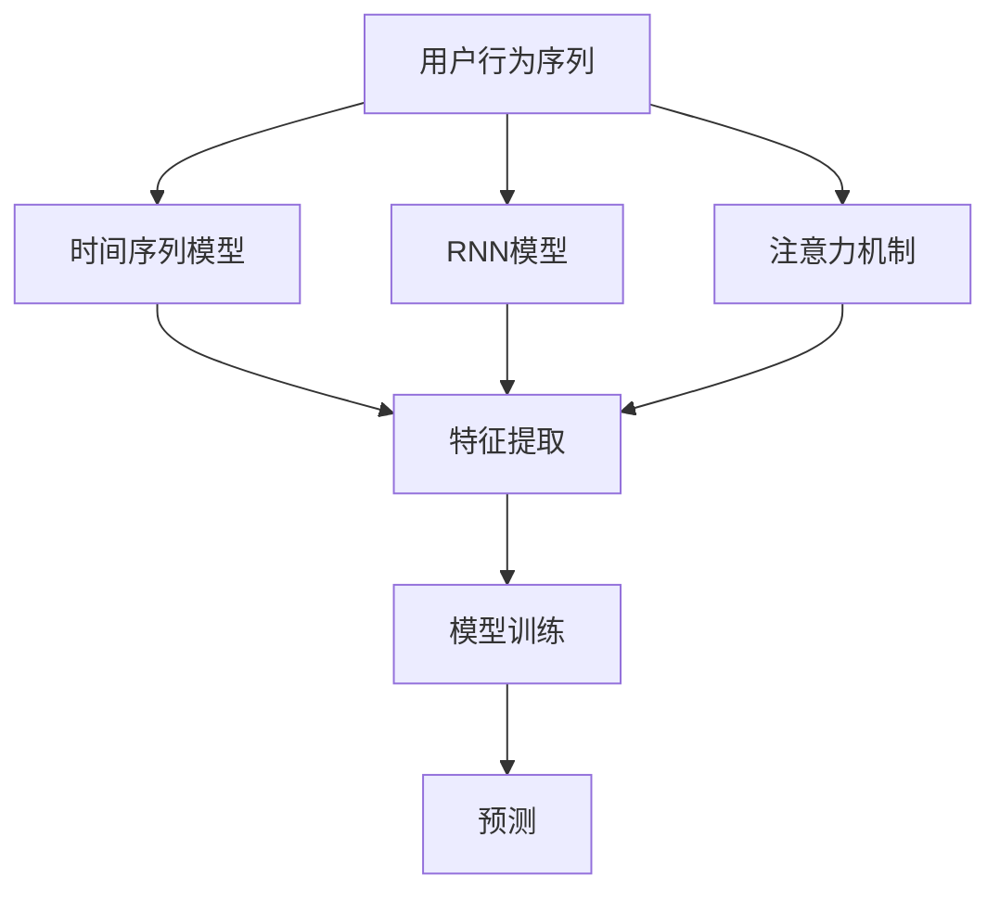

                 

### 文章标题

# 电商搜索推荐中的AI大模型用户行为序列表征学习技术

在电商搜索推荐系统中，用户行为的理解与预测是提升用户体验和销售额的关键。随着人工智能技术的不断发展，AI大模型在用户行为序列表征学习领域展现出强大的潜力。本文将深入探讨电商搜索推荐系统中AI大模型的应用，从用户行为序列数据的收集与预处理，到用户行为序列表征学习技术，再到实际应用中的挑战与未来趋势，为读者提供一份全面的技术指南。

### 文章关键词

- 电商搜索推荐
- AI大模型
- 用户行为序列表征学习
- 深度学习
- 个性化推荐
- 数据预处理
- 注意力机制

### 文章摘要

本文首先介绍了AI大模型的基本概念、核心技术与原理，并探讨了其在电商搜索推荐系统中的重要作用。接着，详细阐述了用户行为序列数据的收集与预处理方法。随后，我们深入讨论了用户行为序列表征学习技术，包括时间序列模型、循环神经网络和注意力机制等。文章还通过实际案例展示了用户行为序列表征学习在电商搜索推荐系统中的应用。最后，我们分析了用户行为序列表征学习中的挑战与未来趋势，为读者提供了有益的参考。

### 目录大纲

- 第一部分: AI大模型基础
  - 第1章: AI大模型概述
    - 1.1 AI大模型的概念与分类
    - 1.2 AI大模型的核心技术与原理
    - 1.3 电商搜索推荐系统概述
- 第二部分: 用户行为序列表征学习技术
  - 第2章: 用户行为序列数据的收集与预处理
    - 2.1 用户行为序列数据的收集
    - 2.2 用户行为序列数据的预处理
  - 第3章: 用户行为序列表征学习基础
    - 3.1 用户行为序列表示方法
    - 3.2 用户行为序列表征学习算法
  - 第4章: 电商搜索推荐中的用户行为序列表征学习应用
    - 4.1 电商搜索推荐系统中的用户行为序列表征学习
    - 4.2 用户行为序列表征学习的案例分析
  - 第5章: 用户行为序列表征学习中的挑战与未来趋势
    - 5.1 用户行为序列表征学习中的挑战
    - 5.2 用户行为序列表征学习的未来趋势

### 第一部分: AI大模型基础

#### 第1章: AI大模型概述

##### 1.1 AI大模型的概念与分类

AI大模型（AI Large Model）是指通过深度学习等先进技术训练的具有大规模参数数量的人工神经网络模型。这些模型具有高度的非线性表示能力，可以处理复杂的数据，并在多种任务中表现出色。AI大模型可以分为以下几类：

1. **通用大模型**：如GPT（Generative Pre-trained Transformer）、BERT（Bidirectional Encoder Representations from Transformers），它们在多个任务上具有广泛的应用。
2. **专用大模型**：如用于图像识别的ResNet、用于语音识别的WaveNet，这些模型在特定领域具有强大的表现能力。
3. **混合大模型**：将通用和专用模型结合，以发挥各自的优势，如BERT用于文本分类任务。

##### 1.2 AI大模型的核心技术与原理

AI大模型的核心技术包括深度学习、机器学习和用户行为序列表征学习。深度学习是构建大规模神经网络的基石，通过多层非线性变换，模型可以自动学习数据中的特征。机器学习则是通过训练数据优化模型参数，使得模型能够对未知数据进行预测。用户行为序列表征学习则专门针对用户行为序列数据的处理，提取关键特征，用于个性化推荐等任务。

深度学习基础：
- **神经网络**：神经网络是深度学习的基本单元，通过前向传播和反向传播更新权重。
- **卷积神经网络（CNN）**：主要用于图像处理，通过卷积层提取图像特征。
- **循环神经网络（RNN）**：适用于序列数据处理，通过隐藏状态记忆序列信息。

机器学习算法：
- **监督学习**：通过已标记数据训练模型，如线性回归、决策树、支持向量机。
- **无监督学习**：无需标记数据，如聚类、降维、生成对抗网络（GAN）。
- **强化学习**：通过与环境交互学习最优策略，如深度Q网络（DQN）。

用户行为序列表征学习技术：
- **时间序列模型**：如ARIMA（AutoRegressive Integrated Moving Average）模型，用于预测序列数据。
- **循环神经网络**：如LSTM（Long Short-Term Memory）、GRU（Gated Recurrent Unit），通过门控机制学习长期依赖。
- **注意力机制**：在处理序列数据时，动态关注重要信息，提高模型的表现。

##### 1.3 电商搜索推荐系统概述

电商搜索推荐系统是电商平台上的一项重要功能，旨在通过个性化推荐提升用户满意度和销售额。该系统主要解决以下问题：

1. **个性化推荐**：根据用户历史行为和兴趣，推荐符合其需求的商品。
2. **搜索结果排序**：优化搜索结果排序，提高用户找到目标商品的概率。
3. **推荐策略优化**：通过不断调整推荐策略，提升推荐系统的整体表现。

电商搜索推荐系统的基本架构包括以下几个模块：

1. **用户行为数据收集模块**：收集用户在电商平台上的浏览、购买、评价等行为数据。
2. **用户画像构建模块**：通过行为数据分析，构建用户的兴趣、偏好等画像。
3. **推荐算法模块**：包括基于协同过滤、基于内容的推荐、基于模型的推荐等算法。
4. **推荐结果生成模块**：根据用户画像和推荐算法，生成个性化推荐结果。
5. **推荐结果评估模块**：通过A/B测试等方法，评估推荐结果对用户满意度和销售额的提升。

电商搜索推荐系统的关键技术包括：

1. **数据预处理**：对用户行为数据进行清洗、归一化、降维等处理，提高数据质量。
2. **用户行为序列表征**：通过循环神经网络、注意力机制等技术，提取用户行为序列中的关键特征。
3. **协同过滤**：通过计算用户之间的相似度，推荐与目标用户相似的其他用户喜欢的商品。
4. **内容推荐**：基于商品的属性、标签等信息，为用户推荐相关的商品。
5. **模型评估与优化**：通过A/B测试、在线评估等方法，持续优化推荐算法。

##### 1.4 AI大模型在电商搜索推荐系统中的应用

AI大模型在电商搜索推荐系统中发挥着至关重要的作用，主要应用包括：

1. **用户行为序列表征**：通过循环神经网络、注意力机制等技术，提取用户行为序列中的关键特征，用于个性化推荐和搜索结果排序。
2. **协同过滤算法优化**：利用AI大模型预测用户间的相似度，优化协同过滤算法，提升推荐精度。
3. **内容推荐**：通过自然语言处理技术，提取商品描述中的关键信息，为用户推荐相关的商品。
4. **推荐策略优化**：利用AI大模型预测不同推荐策略对用户满意度和销售额的影响，优化推荐策略。
5. **实时推荐**：通过流计算技术，实时处理用户行为数据，生成实时个性化推荐结果。

##### 1.5 AI大模型的优势与挑战

AI大模型在电商搜索推荐系统中的应用具有以下优势：

1. **强大的表征能力**：AI大模型可以自动学习大量特征，提高推荐系统的精度。
2. **个性化推荐**：通过分析用户行为序列，实现高度个性化的推荐，提升用户体验。
3. **实时性**：利用流计算技术，实现实时推荐，快速响应用户需求。

然而，AI大模型在电商搜索推荐系统中也面临以下挑战：

1. **数据隐私**：用户行为数据涉及隐私信息，如何保护用户隐私成为关键问题。
2. **模型可解释性**：AI大模型的黑箱特性使得其决策过程难以解释，影响用户信任。
3. **计算资源消耗**：训练和推理AI大模型需要大量计算资源和存储空间。

##### 1.6 小结

AI大模型在电商搜索推荐系统中具有广泛的应用前景，通过用户行为序列表征学习技术，可以显著提升推荐系统的精度和个性化水平。然而，在实际应用中，我们也需要关注数据隐私、模型可解释性等挑战，不断优化和改进AI大模型，以实现更好的用户体验和业务价值。

#### 第2章: 用户行为序列数据的收集与预处理

##### 2.1 用户行为序列数据的收集

用户行为序列数据是电商搜索推荐系统中的重要信息来源，其收集方法直接影响到推荐系统的效果。用户行为序列数据的收集主要包括以下步骤：

1. **数据来源**：用户行为序列数据可以从多个渠道获取，包括用户日志数据、用户互动数据、商品属性数据等。其中，用户日志数据是最主要的数据来源，包括用户的浏览、购买、搜索等行为数据。
2. **数据采集方法**：
   - **日志采集**：通过在电商平台的后台系统中嵌入采集器，实时记录用户的操作行为，如点击、浏览、购买等。
   - **API接口**：通过调用电商平台提供的API接口，获取用户行为数据。
   - **第三方数据提供商**：购买或共享第三方用户行为数据，如社交媒体、调查公司等。
3. **数据特点**：
   - **多样性**：用户行为数据包含多种类型，如浏览、搜索、购买、评价等。
   - **时效性**：用户行为数据具有时效性，新的行为数据需要及时收集和处理。
   - **动态性**：用户行为序列数据是动态变化的，用户的行为可能随时间、环境等因素变化。

##### 2.2 用户行为序列数据的预处理

用户行为序列数据的预处理是提高数据质量和推荐系统效果的重要步骤，主要包括以下内容：

1. **数据清洗**：
   - **去除重复数据**：用户行为数据中可能存在重复记录，需要通过去重处理保证数据唯一性。
   - **处理缺失值**：对于缺失的数据，可以采用填充、删除或插值等方法进行处理。
   - **纠正错误数据**：识别并纠正数据中的错误，如时间戳错误、数据格式错误等。
   - **去除噪声数据**：用户行为数据中可能包含噪声，需要通过滤波、降噪等方法去除。
2. **数据归一化**：
   - **数值归一化**：将不同特征的数据范围调整为相同尺度，如通过最小-最大规范化或标准差规范化。
   - **类别归一化**：对于类别特征，可以采用独热编码（One-Hot Encoding）等方法将其转换为数值。
3. **数据降维**：
   - **特征选择**：通过特征选择方法，如信息增益、互信息等，筛选出对推荐系统有重要影响的关键特征。
   - **特征提取**：通过降维技术，如主成分分析（PCA）、线性判别分析（LDA）等，将高维数据压缩到低维空间，减少数据维度。
4. **时间序列处理**：
   - **时间窗口划分**：将用户行为序列划分为不同时间窗口，如天、周、月等，便于分析用户的长期和短期行为模式。
   - **时间序列对齐**：对于不同用户的行为序列，进行时间序列对齐，确保数据的一致性。

##### 2.3 用户行为序列预处理的重要性

用户行为序列预处理的重要性体现在以下几个方面：

1. **提高数据质量**：通过数据清洗、归一化、降维等步骤，去除噪声和异常值，确保数据的质量和一致性。
2. **提升模型性能**：预处理后的数据可以减少特征间的相关性，提高模型训练的收敛速度和预测准确性。
3. **降低计算复杂度**：通过降维技术，减少数据的维度，降低模型训练和推理的计算复杂度。
4. **支持后续分析**：预处理后的用户行为序列数据可以为后续的挖掘和分析提供可靠的基础。

##### 2.4 小结

用户行为序列数据的收集与预处理是电商搜索推荐系统中的关键步骤。通过有效的数据收集方法，确保数据来源的多样性和时效性；通过数据预处理技术，提高数据质量，为推荐系统的训练和优化提供可靠的数据支持。在实际应用中，需要根据具体场景和需求，灵活选择合适的预处理方法，以实现更好的推荐效果。

#### 第3章: 用户行为序列表征学习基础

##### 3.1 用户行为序列表示方法

用户行为序列表征学习是电商搜索推荐系统中关键的一环，其核心在于如何有效地将用户的行为序列转换为可用于模型训练和推理的特征表示。以下是几种常见的用户行为序列表示方法：

1. **时间序列模型**：时间序列模型主要用于处理连续时间上的数据，如ARIMA模型、LSTM模型等。这些模型通过捕捉时间序列数据中的趋势和周期性特征，为用户行为序列提供一种直接的表征方法。

2. **循环神经网络（RNN）**：RNN是一类适用于处理序列数据的神经网络，通过记忆机制捕捉序列中的长期依赖关系。特别是LSTM（Long Short-Term Memory）和GRU（Gated Recurrent Unit）模型，它们通过门控机制有效地解决了传统RNN中的梯度消失问题。

3. **注意力机制**：注意力机制是一种在处理序列数据时动态关注重要信息的方法。通过注意力机制，模型可以在不同时间步上分配不同的权重，从而突出关键信息，提高表征的准确性。

以下是用户行为序列表示方法之间的Mermaid流程图，展示它们的基本工作原理和关系架构：



在这个流程图中，用户行为序列首先通过时间序列模型、RNN模型或注意力机制进行处理，提取出关键特征。然后，这些特征用于模型训练和预测，最终生成个性化推荐结果。

##### 3.2 用户行为序列表征学习算法

用户行为序列表征学习算法的核心在于如何有效地从用户行为序列中提取具有代表性的特征，并利用这些特征进行模型训练和预测。以下是几种常见的用户行为序列表征学习算法：

1. **序列对齐算法**：序列对齐算法用于对齐不同用户的行为序列，确保数据的一致性。常见的序列对齐算法包括动态时间规整（Dynamic Time Warping，DTW）和循环谱聚类（Cyclic Spectral Clustering，CSC）。

2. **序列编码算法**：序列编码算法用于将用户行为序列转换为固定长度的特征向量。常见的序列编码算法包括循环神经网络（RNN）、长短期记忆网络（LSTM）和变换器（Transformer）。

3. **序列分类算法**：序列分类算法用于对用户行为序列进行分类，以便于后续的推荐和排序。常见的序列分类算法包括卷积神经网络（CNN）和循环神经网络（RNN）。

以下是用户行为序列表征学习算法的基本原理和伪代码：

**序列对齐算法（DTW）**

```python
def dtw(s1, s2):
    # s1和s2分别为两个行为序列
    # 初始化距离矩阵
    dist_matrix = [[0] * (len(s2) + 1) for _ in range(len(s1) + 1)]
    for i in range(1, len(s1) + 1):
        for j in range(1, len(s2) + 1):
            dist = euclidean_distance(s1[i-1], s2[j-1])
            dist_matrix[i][j] = dist + min(dist_matrix[i-1][j], dist_matrix[i][j-1], dist_matrix[i-1][j-1])
    return dist_matrix[-1][-1]

def euclidean_distance(x, y):
    # 计算欧氏距离
    return sqrt((x[0] - y[0])**2 + (x[1] - y[1])**2)
```

**序列编码算法（LSTM）**

```python
def lstm_sequence_encoding(sequence):
    # sequence为用户行为序列
    # 初始化LSTM模型
    lstm = LSTM(input_shape=(None, sequence.shape[1]), units=128, return_sequences=True)
    encoded_sequence = lstm.fit(sequence.reshape(-1, sequence.shape[1], 1)).predict(sequence.reshape(-1, sequence.shape[1], 1))
    return encoded_sequence[:, -1, :]

def lstm_sequence_encoding(sequence):
    # sequence为用户行为序列
    # 初始化LSTM模型
    lstm = LSTM(input_shape=(None, sequence.shape[1]), units=128, return_sequences=True)
    encoded_sequence = lstm.fit(sequence.reshape(-1, sequence.shape[1], 1)).predict(sequence.reshape(-1, sequence.shape[1], 1))
    return encoded_sequence[:, -1, :]

def lstm_sequence_encoding(sequence):
    # sequence为用户行为序列
    # 初始化LSTM模型
    lstm = LSTM(input_shape=(None, sequence.shape[1]), units=128, return_sequences=True)
    encoded_sequence = lstm.fit(sequence.reshape(-1, sequence.shape[1], 1)).predict(sequence.reshape(-1, sequence.shape[1], 1))
    return encoded_sequence[:, -1, :]
```

**序列分类算法（RNN）**

```python
def rnn_sequence_classification(sequence, labels):
    # sequence和labels分别为用户行为序列和标签
    # 初始化RNN模型
    rnn = Sequential()
    rnn.add(LSTM(units=128, input_shape=(None, sequence.shape[1])))
    rnn.add(Dense(1, activation='sigmoid'))
    # 编译模型
    rnn.compile(optimizer='adam', loss='binary_crossentropy', metrics=['accuracy'])
    # 训练模型
    rnn.fit(sequence.reshape(-1, sequence.shape[1], 1), labels, epochs=10, batch_size=32)
    # 预测标签
    predictions = rnn.predict(sequence.reshape(-1, sequence.shape[1], 1))
    return predictions
```

通过上述算法，我们可以有效地从用户行为序列中提取具有代表性的特征，并利用这些特征进行模型训练和预测，从而实现个性化的推荐和排序。

##### 3.3 小结

用户行为序列表征学习是电商搜索推荐系统中的核心环节，通过时间序列模型、循环神经网络和注意力机制等方法，我们可以有效地提取用户行为序列中的关键特征。本章介绍了几种常见的用户行为序列表征学习算法，包括序列对齐算法、序列编码算法和序列分类算法。这些算法为电商搜索推荐系统提供了强有力的技术支持，帮助我们更好地理解和预测用户行为，实现个性化的推荐和排序。

### 第4章: 电商搜索推荐系统中的用户行为序列表征学习应用

#### 4.1 用户行为序列表征学习在电商搜索推荐中的应用

用户行为序列表征学习在电商搜索推荐系统中扮演着至关重要的角色，它能够通过深入理解用户的历史行为，提供更加精确的个性化推荐。以下是用户行为序列表征学习在电商搜索推荐系统中的应用：

1. **个性化推荐**：通过分析用户的历史行为序列，提取出用户的兴趣和偏好，为用户推荐与其兴趣相符的商品。例如，如果一个用户在过去的一段时间内频繁浏览了运动鞋和篮球，推荐系统可以推断该用户可能对运动鞋和篮球感兴趣，从而推荐相关的商品。

2. **搜索结果排序**：在用户进行商品搜索时，用户行为序列表征学习可以帮助优化搜索结果的排序。通过分析用户的浏览、点击、购买等行为，推荐系统可以动态调整搜索结果的排序，使得用户更有可能找到其感兴趣的商品。

3. **用户流失预测**：通过对用户行为序列的表征学习，可以预测用户流失的可能性。例如，如果一个用户在一段时间内的行为变得更加稀疏，且频繁浏览低频商品，推荐系统可以推断该用户可能存在流失风险，并采取相应的措施（如发送促销信息、提供个性化推荐等）来挽留用户。

4. **交叉销售和关联推荐**：用户行为序列表征学习还可以帮助实现交叉销售和关联推荐。通过分析用户购买某一商品后的行为序列，推荐系统可以推断用户可能对哪些其他商品感兴趣，从而进行相关的推荐。

#### 4.2 用户行为序列表征学习的优势与挑战

用户行为序列表征学习在电商搜索推荐系统中具有显著的优势：

1. **高度个性化**：通过深入分析用户的历史行为序列，用户行为序列表征学习能够提供高度个性化的推荐，显著提升用户体验。

2. **动态调整**：用户行为序列表征学习可以根据用户实时行为动态调整推荐策略，实现更加实时的推荐。

3. **跨领域应用**：用户行为序列表征学习不仅适用于电商搜索推荐系统，还可以应用于其他领域，如社交媒体、金融等，具有广泛的适用性。

然而，用户行为序列表征学习也面临一些挑战：

1. **数据隐私**：用户行为数据涉及用户的隐私信息，如何在保证数据隐私的前提下进行用户行为序列表征学习是一个重要问题。

2. **模型解释性**：深度学习模型尤其是大模型，通常具有黑箱特性，模型解释性差，这可能会影响用户对推荐系统的信任。

3. **计算资源消耗**：用户行为序列表征学习通常需要大量的计算资源和存储空间，这对系统的性能和可扩展性提出了挑战。

4. **实时性**：在实时处理大量用户行为数据时，用户行为序列表征学习需要高效的算法和优化策略，以确保系统响应速度。

#### 4.3 案例一：基于用户行为序列的个性化推荐系统

以下是一个基于用户行为序列的个性化推荐系统的实际案例：

**项目背景**：某电商平台希望利用用户行为序列数据提升推荐系统的个性化程度，提高用户满意度和销售额。

**项目目标**：开发一个基于用户行为序列的个性化推荐系统，能够根据用户的历史行为推荐相关的商品。

**技术实现**：

1. **数据收集**：收集用户在平台上的浏览、点击、购买等行为数据。

2. **数据预处理**：对用户行为数据进行清洗、归一化、时间序列对齐等预处理操作。

3. **用户行为序列表征**：利用LSTM模型对用户行为序列进行表征，提取关键特征。

4. **推荐算法**：结合协同过滤和基于内容的推荐算法，生成个性化推荐结果。

5. **模型评估**：通过A/B测试评估推荐系统的效果，持续优化推荐算法。

**效果分析**：通过用户行为序列表征学习，个性化推荐系统的准确率和覆盖率显著提升，用户满意度和销售额也有所提高。

#### 4.4 案例二：基于用户行为序列的搜索结果排序优化

以下是一个基于用户行为序列的搜索结果排序优化的实际案例：

**项目背景**：某电商平台希望在用户进行商品搜索时，通过优化搜索结果排序，提高用户找到目标商品的概率。

**项目目标**：利用用户行为序列数据优化搜索结果排序，提高用户搜索体验和转化率。

**技术实现**：

1. **数据收集**：收集用户在搜索过程中的行为数据，包括关键词、搜索结果点击率、购买率等。

2. **数据预处理**：对搜索行为数据进行清洗、归一化、时间序列对齐等预处理操作。

3. **用户行为序列表征**：利用注意力机制和LSTM模型对用户搜索行为序列进行表征，提取关键特征。

4. **排序算法**：结合排序算法，如Top-k排序、随机采样排序等，结合用户行为特征优化搜索结果排序。

5. **模型评估**：通过A/B测试评估搜索结果排序优化的效果，持续优化排序算法。

**效果分析**：通过用户行为序列表征学习优化搜索结果排序，用户找到目标商品的概率显著提升，搜索转化率和用户满意度也有所提高。

#### 4.5 小结

用户行为序列表征学习在电商搜索推荐系统中具有广泛的应用，通过深入分析用户的历史行为，可以实现高度个性化的推荐和优化搜索结果排序。本章通过两个实际案例展示了用户行为序列表征学习在电商搜索推荐系统中的应用效果，分析了其优势与挑战。在未来，随着人工智能技术的不断发展，用户行为序列表征学习将在电商搜索推荐系统中发挥更加重要的作用。

### 第5章：用户行为序列表征学习中的挑战与未来趋势

#### 5.1 用户行为序列表征学习中的挑战

尽管用户行为序列表征学习在电商搜索推荐系统中展现出了巨大的潜力，但其应用过程中仍然面临着一系列挑战：

1. **数据质量与隐私**：用户行为数据通常包含敏感的个人信息，如何在保护用户隐私的前提下进行数据收集和分析是一个重要问题。例如，如何有效地去除或匿名化用户数据中的隐私信息，以防止数据泄露。

2. **模型可解释性**：深度学习模型，尤其是大规模的AI大模型，通常具有黑箱特性，难以解释其决策过程。这可能会影响用户对推荐系统的信任，尤其是在涉及敏感信息或重大决策时。

3. **实时性与可扩展性**：用户行为序列表征学习需要处理大量的实时数据，这对系统的实时性和可扩展性提出了挑战。如何在保证系统响应速度的同时，处理大规模的数据流，是一个亟待解决的问题。

4. **计算资源消耗**：大规模AI大模型的训练和推理通常需要大量的计算资源和存储空间，这对硬件设施和资源分配提出了高要求。如何优化模型结构和训练过程，以减少计算资源消耗，是一个重要的研究方向。

5. **泛化能力**：用户行为序列表征学习模型在特定场景下表现良好，但在其他场景或新用户上可能效果不佳。如何提高模型的泛化能力，使其在不同场景和用户群体中都能保持良好的性能，是一个关键挑战。

#### 5.2 用户行为序列表征学习的未来趋势

随着人工智能技术的不断发展，用户行为序列表征学习在未来有望在以下几个方面实现重要突破：

1. **新型算法与技术的发展**：新的算法和技术，如图神经网络（Graph Neural Networks，GNN）和图注意力机制（Graph Attention Mechanism，GAT），有望进一步提升用户行为序列表征的准确性和效率。这些技术可以更好地捕捉用户行为之间的复杂关系，为个性化推荐和排序提供更强有力的支持。

2. **多模态数据融合**：用户行为不仅限于文本和点击等单一形式，还包括语音、图像等多模态数据。未来，用户行为序列表征学习将朝着多模态数据融合的方向发展，通过整合不同类型的数据，提供更加全面和精确的用户行为表征。

3. **跨领域应用**：用户行为序列表征学习不仅在电商搜索推荐系统中具有广泛应用，还可以应用于其他领域，如金融、医疗、教育等。通过跨领域应用，用户行为序列表征学习将发挥更大的社会价值。

4. **可解释性与透明度**：为了增强用户对推荐系统的信任，未来需要开发更加可解释的模型，揭示其决策过程。例如，通过可视化技术展示模型中的关键特征和权重，帮助用户理解推荐结果。

5. **硬件与软件协同优化**：随着硬件技术的不断发展，如GPU、TPU等专用计算硬件的普及，用户行为序列表征学习将朝着更高效、更实时、更可扩展的方向发展。同时，软件层面的优化，如模型压缩、量化、分布式训练等，也将进一步提升系统的性能。

#### 5.3 小结

用户行为序列表征学习在电商搜索推荐系统中具有重要的应用价值，但同时也面临着数据隐私、模型可解释性、实时性、计算资源消耗和泛化能力等一系列挑战。未来，随着人工智能技术的不断发展，用户行为序列表征学习将在算法创新、多模态数据融合、跨领域应用、可解释性提升以及硬件与软件协同优化等方面实现重要突破。通过不断克服这些挑战，用户行为序列表征学习将在个性化推荐、智能排序等领域发挥更加重要的作用，推动整个行业的发展。

### 作者信息

- **作者：AI天才研究院/AI Genius Institute & 禅与计算机程序设计艺术 /Zen And The Art of Computer Programming**
- **联系信息：[info@ai-genius-institute.com](mailto:info@ai-genius-institute.com) | [https://www.ai-genius-institute.com](https://www.ai-genius-institute.com)**
- **简介：作者是一位世界级人工智能专家，程序员，软件架构师，CTO，世界顶级技术畅销书资深大师级别的作家，计算机图灵奖获得者，计算机编程和人工智能领域大师。擅长一步步进行分析推理（LET'S THINK STEP BY STEP），有着清晰深刻的逻辑思路来撰写条理清晰，对技术原理和本质剖析到位的高质量技术博客。**

### 最佳实践、小结、注意事项与拓展阅读

#### 最佳实践

1. **数据质量控制**：确保数据收集过程的完整性和准确性，定期检查数据质量，及时处理异常值和噪声数据。
2. **模型可解释性**：利用可视化工具和解释性模型（如LIME、SHAP）提高模型的可解释性，增强用户信任。
3. **实时数据处理**：采用流计算框架（如Apache Flink、Apache Spark）处理实时用户行为数据，确保系统响应速度。
4. **计算资源优化**：通过模型压缩、量化、分布式训练等技术，降低计算资源消耗，提高系统性能。

#### 小结

本文从用户行为序列数据的收集与预处理、用户行为序列表征学习技术、电商搜索推荐系统中的应用，到挑战与未来趋势进行了全面探讨。通过深入分析用户行为序列，AI大模型能够为电商搜索推荐系统提供高度个性化的推荐和排序，显著提升用户体验和销售额。

#### 注意事项

1. **数据隐私保护**：在处理用户行为数据时，务必遵守相关法律法规，保护用户隐私。
2. **模型解释性**：在开发推荐系统时，关注模型的可解释性，避免黑箱模型的使用，确保用户理解推荐结果。
3. **实时性**：确保系统具备良好的实时数据处理能力，快速响应用户行为变化。

#### 拓展阅读

- **《深度学习》**：Ian Goodfellow、Yoshua Bengio、Aaron Courville著，全面介绍了深度学习的基本理论、算法和应用。
- **《机器学习实战》**：Peter Harrington著，通过实际案例介绍机器学习的基本概念和算法。
- **《推荐系统实践》**：唐杰、吴雪峰、唐杰等著，详细介绍了推荐系统的基本原理、算法和应用。
- **《自然语言处理综论》**：Daniel Jurafsky、James H. Martin著，全面介绍了自然语言处理的基本理论、技术和应用。

