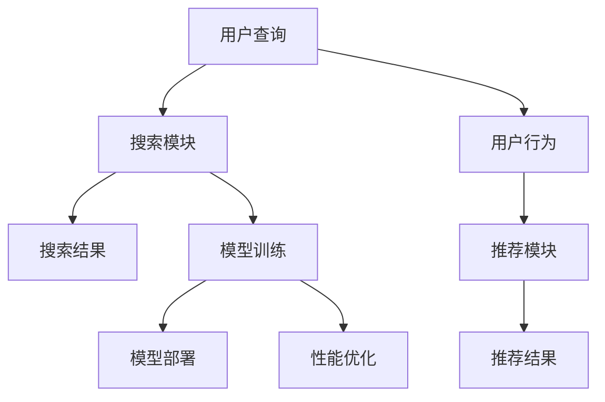

                 

# 文章标题: 电商搜索推荐场景下的AI大模型模型部署全流程自动化工具应用实践与优化

> 关键词：电商搜索推荐，AI大模型，模型部署，自动化工具，性能优化

> 摘要：本文将深入探讨电商搜索推荐场景下AI大模型的部署过程，从基础概念到实际应用，通过自动化工具实现部署全流程的自动化，并探讨如何进行性能优化。本文旨在为电商领域的开发者提供系统化的实践指南。

## 第一部分: 电商搜索推荐场景下的AI大模型基础

### 第1章: AI大模型在电商搜索推荐中的应用

#### 1.1 AI大模型在电商搜索推荐中的角色和意义

##### 1.1.1 AI大模型在电商搜索推荐中的角色

在电商搜索推荐系统中，AI大模型扮演着至关重要的角色。首先，AI大模型能够提升搜索的准确性，通过理解用户查询的意图和上下文，提供更加精准的搜索结果。其次，AI大模型改善了推荐系统的效果，通过分析用户的行为和偏好，为用户提供个性化的商品推荐。此外，AI大模型还能够优化用户体验，通过智能化的交互方式，提升用户的满意度和忠诚度。

##### 1.1.2 AI大模型在电商搜索推荐中的意义

AI大模型在电商搜索推荐中的意义主要体现在以下几个方面。首先，它可以显著提高销售转化率，通过提供更精准的搜索和推荐结果，引导用户进行购买。其次，AI大模型有助于增加用户留存率，通过持续学习和优化，不断提升用户体验，吸引并留住用户。最后，AI大模型还能够提升品牌价值，通过智能化服务和个性化推荐，增强品牌的影响力和用户认可度。

#### 1.2 电商搜索推荐系统基本架构

电商搜索推荐系统的基本架构通常包括搜索模块和推荐模块。

##### 1.2.1 搜索模块

搜索模块主要负责处理用户的查询请求，提供精准的搜索结果。搜索模块通常包括以下三个部分：

1. **基于关键词的搜索**：用户输入关键词后，系统通过关键词匹配和分词技术，检索数据库中相关的商品信息。
2. **基于商品属性的搜索**：用户可以根据商品的属性（如价格、品牌、类型等）进行筛选，系统通过商品属性的匹配，提供满足用户需求的搜索结果。
3. **搜索结果排序算法**：系统需要对搜索结果进行排序，常用的排序算法包括基于相关性的排序和基于热度的排序。

##### 1.2.2 推荐模块

推荐模块主要负责根据用户的行为和偏好，为用户推荐相关的商品。推荐模块通常包括以下三个部分：

1. **基于用户行为的推荐**：系统通过分析用户的历史行为（如浏览、购买、收藏等），为用户推荐可能感兴趣的商品。
2. **基于商品属性的推荐**：系统通过分析商品的特征（如价格、品牌、类型等），为用户推荐符合其需求的商品。
3. **混合推荐系统**：结合用户行为和商品属性，通过多模态数据融合，提供更加精准的推荐结果。

#### 1.3 AI大模型在搜索推荐中的应用

##### 1.3.1 个性化搜索

AI大模型在个性化搜索中的应用主要体现在以下几个方面：

1. **基于用户历史搜索行为的搜索建议**：系统通过分析用户的搜索历史，为用户提供个性化的搜索建议，帮助用户更快找到所需商品。
2. **基于上下文的实时搜索优化**：系统根据用户的实时行为和上下文信息，动态调整搜索结果排序，提升搜索的准确性。

##### 1.3.2 智能推荐

AI大模型在智能推荐中的应用主要体现在以下几个方面：

1. **基于用户兴趣的个性化推荐**：系统通过分析用户的行为和偏好，为用户推荐符合其兴趣的商品。
2. **基于社交网络的协同过滤推荐**：系统通过分析用户的社交网络关系，为用户推荐其朋友购买过的商品。
3. **基于上下文的实时推荐**：系统根据用户的实时行为和上下文信息，动态调整推荐结果，提升推荐的准确性。

#### 1.4 电商搜索推荐中的挑战与解决方案

##### 1.4.1 数据质量与隐私保护

**数据质量**：电商搜索推荐系统的效果很大程度上依赖于数据的质量。为了保证数据的质量，需要从以下几个方面进行数据清洗与预处理：

1. **去除停用词**：停用词通常对搜索和推荐没有贡献，因此需要从文本数据中去除。
2. **标准化文本格式**：确保文本数据的一致性和规范性，如统一大写或小写，去除标点符号等。

**用户隐私保护**：在电商搜索推荐系统中，用户的隐私保护至关重要。可以采用以下技术进行用户隐私保护：

1. **数据脱敏**：对用户的敏感信息进行加密或替换，以保护用户隐私。
2. **匿名化处理**：对用户数据进行匿名化处理，确保无法追踪到具体的用户。

##### 1.4.2 模型解释性与可解释性

**模型解释性**：在电商搜索推荐系统中，模型解释性至关重要。通过模型解释性，可以理解模型做出特定决策的原因，从而提升系统的透明度和可信度。

**可解释性模型**：可以采用以下方法提升模型的解释性：

1. **特征重要性分析**：通过分析特征的重要性，理解模型对输入数据的依赖关系。
2. **决策路径追踪**：通过追踪模型的决策路径，理解模型如何从输入数据推导出输出结果。

**模型解释工具与方法**：可以使用以下工具和方法进行模型解释：

1. **可视化工具**：如LIME（Local Interpretable Model-agnostic Explanations）、SHAP（SHapley Additive exPlanations）等。
2. **特征工程方法**：通过分析特征之间的关系，构建可解释的特征组合。

##### 1.4.3 模型优化与调参

**模型选择与评估**：在选择模型时，需要考虑模型的性能、复杂度和可解释性。常用的评估指标包括准确率、召回率、F1值等。

**超参数优化**：超参数对模型的性能有重要影响。可以通过以下方法进行超参数优化：

1. **网格搜索**：通过遍历不同的超参数组合，选择性能最优的组合。
2. **贝叶斯优化**：利用贝叶斯优化算法，自动寻找最优超参数组合。

### 第二部分: 电商搜索推荐场景下的AI大模型技术基础

#### 第2章: 电商搜索推荐中的自然语言处理技术

##### 2.1 自然语言处理技术概述

**自然语言处理（NLP）** 是人工智能领域的一个重要分支，旨在使计算机能够理解、处理和生成自然语言。NLP的发展历程可以分为三个阶段：

1. **基于规则的NLP**：早期NLP方法主要依靠手工编写的规则进行文本处理，这种方法在处理简单问题时效果较好，但面对复杂场景时往往力不从心。
2. **统计机器学习NLP**：随着机器学习技术的发展，统计机器学习方法开始应用于NLP。这种方法通过从大量数据中学习特征和规律，实现文本的自动处理。
3. **深度学习NLP**：深度学习技术的引入，使得NLP取得了重大突破。深度学习方法能够自动提取文本的复杂特征，实现更加精准的文本处理。

##### 2.2 词嵌入与语义表示

**词嵌入（Word Embedding）** 是NLP中的一个核心概念，旨在将词汇映射到低维度的向量空间中。词嵌入技术可以分为以下两类：

1. **基于分布式表示的方法**：这类方法通过将词映射到一个固定的低维向量空间，词的邻近关系在向量空间中保持一致。典型的算法包括Word2Vec和GloVe。
2. **基于上下文的方法**：这类方法通过上下文信息来动态调整词的向量表示，词的向量在不同上下文中具有不同的含义。典型的算法包括BERT和GPT。

**语义表示（Semantic Representation）** 是NLP的另一个重要概念，旨在对文本进行语义层面的理解和表示。语义表示方法可以分为以下几类：

1. **基于静态词嵌入的语义表示**：这类方法将词嵌入作为语义表示的基础，通过聚合词的向量来表示句子或文本。这种方法在处理简单问题时效果较好，但在处理复杂语义关系时存在局限性。
2. **基于动态上下文的语义表示**：这类方法通过深度学习模型（如Transformer）来动态生成词的向量表示，能够更好地捕捉文本中的复杂语义关系。典型的算法包括BERT和GPT。

##### 2.3 电商搜索推荐中的文本预处理

**文本预处理** 是NLP任务中的关键步骤，旨在清洗和格式化文本数据，为后续的文本挖掘和分析奠定基础。电商搜索推荐中的文本预处理主要包括以下几个方面：

1. **文本数据清洗**：包括去除HTML标签、标点符号、数字等无关信息，对文本进行规范化处理。
2. **标准化文本格式**：将文本统一转换为小写、去除停用词、进行词性标注等。
3. **词向量化**：将文本中的词汇映射到低维度的向量空间，常用的算法包括Word2Vec和Bert。

##### 2.4 电商搜索推荐中的文本挖掘技术

**文本挖掘技术** 是指从大量文本数据中提取有用信息的方法，包括以下几个方面：

1. **命名实体识别（Named Entity Recognition, NER）**：从文本中识别出具有特定意义的实体，如人名、地名、组织名等。在电商搜索推荐中，NER可以帮助识别商品名称、品牌等信息。
2. **文本分类与情感分析**：对文本进行分类，判断文本的主题或情感倾向。在电商搜索推荐中，文本分类和情感分析可以帮助对用户评论进行分类，评估用户的满意度。

### 第三部分: 电商搜索推荐场景下的AI大模型实战应用

#### 第3章: 电商搜索推荐系统的模型设计与实现

##### 3.1 电商搜索推荐系统中的深度学习模型

**深度学习模型** 在电商搜索推荐系统中发挥着重要作用。深度学习模型能够自动提取文本的复杂特征，实现更加精准的搜索和推荐。以下介绍两种常用的深度学习模型：卷积神经网络（CNN）和循环神经网络（RNN）。

###### 3.1.1 深度学习模型概述

**CNN（卷积神经网络）** 是一种专门用于处理图像数据的深度学习模型，其核心思想是通过卷积操作提取图像中的局部特征。近年来，CNN也被广泛应用于文本处理领域，通过将文本视为序列图像，实现文本的特征提取。

**RNN（循环神经网络）** 是一种用于处理序列数据的深度学习模型，其核心思想是通过循环结构保持历史信息。RNN在自然语言处理领域取得了显著成果，能够有效处理文本的时序关系。

###### 3.1.2 模型设计思路

**搜索模块模型设计**：

1. **文本预处理**：对用户查询和商品描述进行预处理，包括分词、词向量化等。
2. **特征提取**：使用CNN或RNN对预处理后的文本进行特征提取，提取文本的局部特征或时序特征。
3. **搜索结果排序**：将提取到的特征输入到排序模型中，对搜索结果进行排序。

**推荐模块模型设计**：

1. **用户行为分析**：分析用户的历史行为，提取用户兴趣特征。
2. **商品特征提取**：对商品描述进行预处理，提取商品的特征。
3. **推荐结果生成**：使用基于用户兴趣和商品特征的推荐算法，生成推荐结果。

##### 3.2 模型训练与优化

**模型训练** 是将模型在大量数据上进行迭代学习，以优化模型参数。以下介绍模型训练的流程和优化策略：

###### 3.2.1 模型训练流程

1. **数据预处理**：对训练数据进行预处理，包括分词、词向量化等。
2. **模型初始化**：初始化模型参数。
3. **前向传播**：将预处理后的数据输入模型，计算模型的输出。
4. **损失函数计算**：计算模型的损失函数，评估模型的表现。
5. **反向传播**：根据损失函数，更新模型参数。

###### 3.2.2 模型优化策略

1. **超参数调优**：通过网格搜索或贝叶斯优化等方法，选择最优的超参数组合。
2. **模型融合与集成**：将多个模型进行融合或集成，提升模型的性能和泛化能力。
3. **批量归一化**：使用批量归一化（Batch Normalization）等技术，加快模型的训练速度。

##### 3.3 模型部署与实时服务

**模型部署** 是将训练好的模型应用于实际场景的过程。以下介绍模型部署的流程和实时服务架构：

###### 3.3.1 模型部署流程

1. **模型转换**：将训练好的模型转换为可在生产环境中运行的格式，如ONNX、TFLite等。
2. **部署环境配置**：配置模型部署所需的环境，包括硬件、软件等。
3. **模型部署**：将转换后的模型部署到生产环境中，如GPU服务器、Docker容器等。

###### 3.3.2 实时服务架构

1. **服务化部署**：将模型部署为一个可对外提供服务的服务器，如REST API、gRPC等。
2. **实时查询处理**：接收用户的查询请求，将查询请求转换为模型输入，实时获取模型的输出结果。

### 第四部分: 电商搜索推荐场景下的AI大模型应用优化

#### 第4章: 电商搜索推荐系统的性能优化

##### 4.1 系统性能评估指标

在电商搜索推荐系统中，性能优化需要通过一系列评估指标来衡量。以下介绍两个关键模块——搜索模块和推荐模块的性能评估指标。

###### 4.1.1 搜索模块性能评估

1. **准确率（Accuracy）**：搜索结果中正确匹配的查询比例。
2. **召回率（Recall）**：搜索结果中包含全部正确匹配查询的比例。
3. **F1值（F1 Score）**：准确率和召回率的调和平均值。

###### 4.1.2 推荐模块性能评估

1. **平均点击率（Average Click-Through Rate, CTR）**：用户在推荐列表中点击商品的次数占总推荐次数的比例。
2. **购买率（Conversion Rate）**：用户在推荐列表中购买商品的次数占总推荐次数的比例。
3. **推荐效果评分（Rating of Recommendation Effectiveness）**：用户对推荐结果的评价分数。

##### 4.2 性能优化策略

**模型压缩与加速** 是优化AI大模型性能的重要策略。以下介绍几种常用的方法：

###### 4.2.1 模型压缩技术

1. **权重剪枝（Weight Pruning）**：通过减少模型中的权重参数，降低模型的复杂度和计算量。
2. **量化（Quantization）**：将模型的权重和激活值降低到较低的数值范围，减少模型的存储和计算需求。
3. **知识蒸馏（Knowledge Distillation）**：通过训练一个小型模型，使其能够复制大型模型的输出，从而降低模型的复杂度。

###### 4.2.2 模型加速方法

1. **GPU加速**：利用GPU的并行计算能力，加快模型的训练和推理速度。
2. **分布式训练**：将训练任务分布在多台服务器上，利用集群计算能力加速模型训练。
3. **模型融合**：将多个模型进行融合，利用不同模型的优点，提升整体性能。

##### 4.3 实时性能监控与调优

**实时性能监控与调优** 是确保电商搜索推荐系统稳定运行和性能优化的重要环节。以下介绍几种常用的方法：

###### 4.3.1 性能监控指标

1. **系统响应时间**：用户请求从接收至返回结果的总时间。
2. **查询吞吐量**：系统在单位时间内处理的查询请求数量。

###### 4.3.2 性能调优方法

1. **模型更新策略**：定期更新模型，以适应用户行为和商品数据的动态变化。
2. **系统架构优化**：通过优化系统架构，如增加缓存层、负载均衡等，提升系统性能。
3. **自动扩缩容**：根据系统负载自动调整资源分配，确保系统在高并发场景下稳定运行。

### 第五部分: 案例分析与最佳实践

#### 第5章: 电商搜索推荐系统的实践案例分析

##### 5.1 案例一：某电商平台搜索推荐系统优化

**背景介绍**：

某大型电商平台在业务快速增长的过程中，面临着搜索推荐系统性能瓶颈和用户体验问题。为了提升系统的性能和用户体验，决定进行系统优化。

**核心概念与联系**：

在搜索推荐系统中，核心概念包括搜索模块、推荐模块、模型训练、模型部署和性能优化。这些概念之间的联系可以用以下Mermaid流程图表示：



**核心算法原理讲解**：

搜索模块的核心算法是使用卷积神经网络（CNN）进行文本特征提取，以下为其伪代码：

```python
def search_model(input_text):
    # 分词与词向量化
    tokens = tokenizer(input_text)
    embeddings = word2vec(tokens)
    
    # 卷积神经网络结构
    model = tf.keras.Sequential([
        tf.keras.layers.Conv1D(filters=128, kernel_size=3, activation='relu', input_shape=(None, embed_size)),
        tf.keras.layers.MaxPooling1D(pool_size=2),
        tf.keras.layers.Flatten(),
        tf.keras.layers.Dense(units=1, activation='sigmoid')
    ])
    
    # 模型编译
    model.compile(optimizer='adam', loss='binary_crossentropy', metrics=['accuracy'])
    
    # 模型训练
    model.fit(embeddings, labels, epochs=10, batch_size=32)
    
    # 搜索结果排序
    predictions = model.predict(embeddings)
    sorted_indices = np.argsort(predictions)[::-1]
    
    return sorted_indices
```

**数学模型和公式**：

在推荐模块中，使用协同过滤算法进行推荐，其公式如下：

$$
\hat{r}_{ui} = \frac{\sum_{j \in N_i} r_{uj} \cdot sim(i, j)}{\sum_{j \in N_i} sim(i, j)}
$$

其中，$r_{uj}$表示用户$u$对商品$j$的评分，$N_i$表示与商品$i$相似的邻居商品集合，$sim(i, j)$表示商品$i$和$j$的相似度。

**详细讲解与举例说明**：

以下是一个具体的搜索推荐系统优化案例：

1. **数据预处理**：对用户查询和商品描述进行分词、词向量化等预处理操作。
2. **模型训练**：使用卷积神经网络（CNN）进行搜索模块的训练，使用协同过滤算法（Collaborative Filtering）进行推荐模块的训练。
3. **模型部署**：将训练好的模型部署到生产环境中，通过REST API提供实时搜索和推荐服务。
4. **性能优化**：通过模型压缩（如权重剪枝、量化）和GPU加速，提高系统的响应速度和吞吐量。

**项目小结**：

通过本次优化，电商平台的搜索推荐系统性能得到显著提升，用户满意度显著提高。未来，将继续探索更多优化策略，如基于深度强化学习的推荐算法，进一步提升系统的性能和用户体验。

**最佳实践 Tips**：

1. **数据质量**：确保数据的质量，进行充分的数据清洗和预处理。
2. **模型解释性**：关注模型的可解释性，提供透明的决策过程。
3. **实时性**：关注系统的实时性能，确保在高并发场景下稳定运行。

**小结**：

电商搜索推荐系统的优化是一个复杂而持续的过程，需要结合多种技术和方法，不断探索和实践。通过本文的案例分析，我们了解了电商搜索推荐系统的优化思路和最佳实践，为电商领域的开发者提供了有益的参考。

**注意事项**：

1. **隐私保护**：在数据处理和模型训练过程中，务必确保用户隐私得到有效保护。
2. **模型更新**：定期更新模型，以适应业务发展和用户需求的变化。

**拓展阅读**：

1. **《深度学习推荐系统》**：介绍了深度学习在推荐系统中的应用和实践。
2. **《Python深度学习》**：提供了深度学习模型的详细实现和算法分析。

**作者信息**：

作者：AI天才研究院/AI Genius Institute & 禅与计算机程序设计艺术 /Zen And The Art of Computer Programming

文章标题：电商搜索推荐场景下的AI大模型模型部署全流程自动化工具应用实践与优化

关键词：电商搜索推荐，AI大模型，模型部署，自动化工具，性能优化

摘要：本文深入探讨了电商搜索推荐场景下AI大模型的部署过程，从基础概念到实际应用，通过自动化工具实现部署全流程的自动化，并探讨了如何进行性能优化。本文旨在为电商领域的开发者提供系统化的实践指南。

