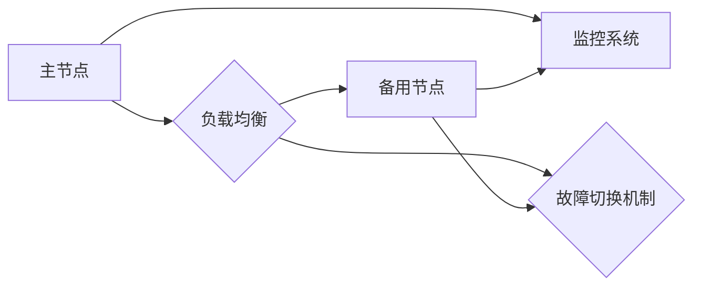

                 

### 文章标题

电商搜索推荐场景下的AI大模型模型部署容灾方案

### 关键词

电商搜索推荐，AI大模型，模型部署，容灾方案，故障切换，数据备份与恢复

### 摘要

本文旨在探讨电商搜索推荐场景下AI大模型的部署容灾方案。首先，文章介绍了AI大模型的基本概念、核心特点及其与传统AI的区别。随后，针对电商搜索推荐场景，阐述了AI大模型的应用现状与面临的挑战。接着，文章详细描述了AI大模型的部署方案，包括部署架构设计、部署流程与工具，以及部署过程中的注意事项。在此基础上，文章重点探讨了部署容灾方案的设计与实施，包括数据备份与恢复、部署容灾架构、故障切换与自动恢复等内容。通过实际案例，本文分析了电商搜索推荐系统在模型部署与容灾实践中的成功经验与不足之处。最后，文章总结了AI大模型部署与容灾的现状与未来发展趋势，为相关领域的研究与实施提供了有益的参考。

# 目录大纲

## 第一部分：引言

### 1.1 书籍背景与目标

### 1.2 电商搜索推荐场景下的AI大模型概述

### 1.3 模型部署与容灾的重要性

## 第二部分：AI大模型基础

### 2.1 AI大模型基本概念

#### 2.1.1 AI大模型定义

#### 2.1.2 AI大模型核心特点

#### 2.1.3 AI大模型与传统AI的区别

### 2.2 AI大模型主要架构

#### 2.2.1 神经网络架构

#### 2.2.2 训练与推断流程

#### 2.2.3 计算存储资源需求

### 2.3 电商搜索推荐场景下的AI大模型应用

#### 2.3.1 电商搜索推荐系统概述

#### 2.3.2 AI大模型在电商搜索推荐中的应用

#### 2.3.3 电商搜索推荐系统挑战

## 第三部分：模型部署方案

### 3.1 模型部署总体方案

#### 3.1.1 部署架构设计

#### 3.1.2 部署流程与工具

#### 3.1.3 部署注意事项

### 3.2 部署环境搭建

#### 3.2.1 开发环境配置

#### 3.2.2 硬件资源需求

#### 3.2.3 软件依赖安装

### 3.3 模型调试与优化

#### 3.3.1 模型性能评估

#### 3.3.2 调试技巧与方法

#### 3.3.3 模型优化策略

## 第四部分：容灾方案设计

### 4.1 容灾方案概述

#### 4.1.1 容灾的概念与目的

#### 4.1.2 容灾方案的类型

#### 4.1.3 容灾方案的必要性

### 4.2 数据备份与恢复

#### 4.2.1 数据备份策略

#### 4.2.2 数据恢复流程

#### 4.2.3 备份存储方案选择

### 4.3 部署容灾与恢复方案

#### 4.3.1 部署容灾架构

#### 4.3.2 容灾恢复流程

#### 4.3.3 故障切换与自动恢复

### 4.4 容灾演练与评估

#### 4.4.1 容灾演练计划

#### 4.4.2 演练结果评估

#### 4.4.3 容灾改进措施

## 第五部分：实战案例

### 5.1 案例一：电商搜索推荐系统部署与容灾方案

#### 5.1.1 案例背景

#### 5.1.2 部署方案设计

#### 5.1.3 容灾方案设计

#### 5.1.4 案例总结

### 5.2 案例二：某大型电商平台AI大模型部署与容灾实践

#### 5.2.1 案例背景

#### 5.2.2 部署方案设计

#### 5.2.3 容灾方案设计

#### 5.2.4 案例总结

## 第六部分：总结与展望

### 6.1 书籍总结

### 6.2 AI大模型部署与容灾未来展望

### 6.3 电商搜索推荐领域发展趋势

## 附录

### 附录A：常用工具与框架

#### A.1 机器学习与深度学习框架

#### A.2 搜索引擎与推荐系统框架

### 附录B：参考文献

### 附录C：常见问题与解答

# 第一部分：引言

### 1.1 书籍背景与目标

在当今数字化时代，电商行业的发展日新月异，搜索推荐系统作为电商平台的“眼睛”，在提升用户体验、增加销售额等方面发挥着至关重要的作用。随着AI技术的不断发展，特别是AI大模型的广泛应用，电商搜索推荐系统在准确性和效率上得到了显著提升。然而，模型部署和容灾问题成为制约电商搜索推荐系统稳定运行的关键因素。

本文旨在探讨电商搜索推荐场景下AI大模型的部署与容灾方案，帮助读者深入了解AI大模型的基本概念、部署流程以及容灾策略。通过详细分析电商搜索推荐系统的挑战和解决方案，本文旨在为电商行业提供实用的技术参考，确保在突发情况下系统能够快速恢复，保障业务连续性。

### 1.2 电商搜索推荐场景下的AI大模型概述

电商搜索推荐系统是电商平台的重要组成部分，通过分析用户行为数据，为用户精准推荐商品，提升用户购物体验和平台销售额。随着AI大模型的兴起，电商搜索推荐系统逐渐从传统的规则匹配转向基于深度学习的智能化推荐。

AI大模型，即深度神经网络模型，具有极强的非线性表示能力和强大的特征学习能力。在电商搜索推荐场景中，AI大模型能够处理海量数据，提取用户行为特征，从而实现高效的商品推荐。其核心特点包括：

1. **大规模参数**：AI大模型包含数百万甚至数十亿个参数，能够捕捉复杂的数据特征。
2. **强泛化能力**：通过大规模数据训练，AI大模型具有较好的泛化能力，能够在不同场景下表现优秀。
3. **自适应调整**：AI大模型能够根据新的用户行为数据进行在线调整，不断提升推荐效果。

与传统AI模型相比，AI大模型具有以下优势：

1. **处理复杂数据**：传统AI模型通常基于规则或简单的机器学习算法，难以处理大规模复杂数据。而AI大模型通过多层神经网络结构，能够更好地处理高维数据和复杂关系。
2. **特征提取能力**：AI大模型能够自动提取数据中的隐含特征，无需人工设计特征，提高模型效果。
3. **实时调整**：AI大模型具有较好的自适应能力，可以根据新数据实时调整，保持模型的动态性。

### 1.3 模型部署与容灾的重要性

模型部署是电商搜索推荐系统的关键环节，它决定了模型能否在真实环境中稳定运行。部署过程中需要考虑计算资源、存储资源、网络环境等多方面因素，确保模型的高效性和可扩展性。

容灾方案则是保障电商搜索推荐系统稳定运行的重要手段。在互联网环境中，各种突发故障（如硬件故障、网络故障、数据泄露等）时有发生，如果没有有效的容灾方案，系统将面临重大风险，可能导致业务中断、数据丢失等严重后果。

具体来说，模型部署与容灾的重要性体现在以下几个方面：

1. **保障业务连续性**：通过合理的部署方案和容灾措施，可以在故障发生时快速切换到备用系统，确保业务连续性，降低故障对用户体验和业务收入的影响。
2. **提高系统可靠性**：部署和容灾方案能够提高系统的整体可靠性，减少系统崩溃和数据丢失的风险。
3. **提升用户体验**：快速响应故障和高效恢复，能够提升用户的信任度和满意度，增强平台的竞争力。
4. **降低运营成本**：通过自动化和优化部署流程，降低人工干预和维护成本，提高运维效率。

综上所述，模型部署与容灾方案在电商搜索推荐系统中具有至关重要的地位，是确保系统稳定、高效运行的关键环节。

## 第二部分：AI大模型基础

### 2.1 AI大模型基本概念

AI大模型（Large-scale Artificial Intelligence Model），又称深度学习模型，是近年来人工智能领域的重要进展。与传统的小规模机器学习模型不同，AI大模型通常包含数百万到数十亿个参数，能够处理大规模复杂数据，实现强大的特征学习和非线性表示能力。AI大模型的基本概念和定义如下：

#### 2.1.1 AI大模型定义

AI大模型是指具有大规模参数的深度学习模型，能够通过多层神经网络结构对复杂数据进行自动特征提取和表示。这些模型通常采用大量数据进行训练，通过迭代优化算法不断调整模型参数，以实现高精度预测和分类。

#### 2.1.2 AI大模型核心特点

AI大模型具有以下几个核心特点：

1. **大规模参数**：AI大模型通常包含数百万到数十亿个参数，这使得模型能够捕捉大量数据中的复杂模式和关联。
2. **多层神经网络结构**：AI大模型采用多层神经网络结构，每层都能够对输入数据进行特征提取和变换，从而形成丰富的数据表示。
3. **强大的非线性表示能力**：通过多层神经网络的结构，AI大模型能够实现强大的非线性变换，更好地适应复杂数据的非线性关系。
4. **自适应调整**：AI大模型通过迭代优化算法，可以根据新的数据不断调整模型参数，实现自适应学习和优化。

#### 2.1.3 AI大模型与传统AI的区别

传统AI模型，如决策树、支持向量机等，通常采用简单的线性模型或基于规则的算法，难以处理大规模复杂数据。相比之下，AI大模型具有以下区别：

1. **处理复杂数据**：AI大模型能够处理大规模复杂数据，通过多层神经网络结构自动提取特征，而传统AI模型需要人工设计特征。
2. **特征提取能力**：AI大模型具有强大的特征提取能力，能够自动从数据中学习到有用的特征，而传统AI模型通常需要人工设计特征。
3. **非线性关系**：AI大模型能够捕捉数据中的非线性关系，通过多层神经网络实现复杂的非线性变换，而传统AI模型通常只能处理线性关系。
4. **自适应能力**：AI大模型通过迭代优化算法，可以根据新的数据动态调整模型参数，实现自适应学习和优化，而传统AI模型通常无法实现这一功能。

### 2.2 AI大模型主要架构

AI大模型的架构通常包括输入层、隐藏层和输出层。以下详细介绍各层的作用和关系：

#### 2.2.1 输入层

输入层是AI大模型的第一层，接收输入数据，并将其传递给隐藏层。输入数据可以是图像、文本、音频等多种形式。输入层的节点数量取决于输入数据的维度，例如，一张彩色图像的输入层节点数量为图像的宽度和高度乘以颜色通道数。

#### 2.2.2 隐藏层

隐藏层是AI大模型的核心部分，包含多层神经网络结构。每层隐藏层都对输入数据进行特征提取和变换，从而形成更高级的特征表示。隐藏层通过激活函数（如ReLU、Sigmoid、Tanh等）引入非线性变换，使得模型能够捕捉复杂的数据模式。隐藏层的数量和节点数量可以根据具体问题进行调整，以优化模型性能。

#### 2.2.3 输出层

输出层是AI大模型的最后一层，对隐藏层处理后的特征进行分类或预测。输出层的节点数量取决于具体任务的类别数量，例如，一个多分类问题通常包含多个输出节点，每个节点对应一个类别。输出层通过激活函数（如Softmax）实现概率分布，用于预测结果。

#### 2.2.4 神经网络架构

神经网络架构是AI大模型的基础，包括多层神经网络、卷积神经网络（CNN）和循环神经网络（RNN）等。以下详细介绍几种常见的神经网络架构：

1. **多层感知机（MLP）**：多层感知机是一种简单的多层神经网络架构，由输入层、多个隐藏层和输出层组成。MLP适用于处理非线性问题，但通常需要大量数据训练以获得良好的性能。

   ```python
   # 伪代码：多层感知机架构
   input_data = ...
   hidden_layer1 = f(input_data, weights1)
   hidden_layer2 = f(hidden_layer1, weights2)
   output = f(hidden_layer2, weights3)
   ```

2. **卷积神经网络（CNN）**：卷积神经网络是一种专门用于图像处理的神经网络架构，通过卷积操作提取图像特征。CNN由卷积层、池化层和全连接层组成，能够有效地处理高维数据。

   ```python
   # 伪代码：卷积神经网络架构
   input_image = ...
   conv1 = conv2d(input_image, filters1)
   pool1 = max_pool(conv1)
   conv2 = conv2d(pool1, filters2)
   pool2 = max_pool(conv2)
   flatten = flatten(pool2)
   output = f(flatten, weights3)
   ```

3. **循环神经网络（RNN）**：循环神经网络是一种专门用于序列数据处理的神经网络架构，能够捕获序列中的长期依赖关系。RNN通过循环结构实现，每个时间步的输出作为下一时间步的输入。

   ```python
   # 伪代码：循环神经网络架构
   hidden_state = ...
   for t in range(sequence_length):
       input_t = ...
       hidden_state = f(hidden_state, input_t, weights)
   output = f(hidden_state, weights2)
   ```

#### 2.2.5 训练与推断流程

AI大模型的训练和推断流程是模型构建的关键环节。以下详细介绍训练和推断的基本流程：

1. **训练流程**：
   - **数据预处理**：对输入数据进行标准化、归一化等预处理操作，以便模型能够更好地学习。
   - **模型初始化**：初始化模型参数，常用的初始化方法有随机初始化、He初始化等。
   - **前向传播**：将输入数据传递给模型，通过前向传播计算输出结果。
   - **计算损失函数**：计算模型输出与真实标签之间的差距，使用损失函数表示。
   - **反向传播**：通过反向传播算法更新模型参数，减小损失函数值。
   - **迭代优化**：重复前向传播和反向传播，不断优化模型参数，直到满足训练目标。

2. **推断流程**：
   - **数据预处理**：对输入数据进行与训练阶段相同的预处理操作。
   - **前向传播**：将预处理后的输入数据传递给模型，通过前向传播计算输出结果。
   - **结果输出**：根据输出结果进行预测或分类。

#### 2.2.6 计算存储资源需求

AI大模型在训练和推断过程中对计算资源和存储资源的需求较高。以下详细讨论计算存储资源需求：

1. **计算资源需求**：
   - **CPU/GPU**：AI大模型训练过程中，通常需要使用高性能的CPU或GPU进行计算。CPU适用于并行计算，而GPU适用于大规模并行计算，能够显著提高训练速度。
   - **计算能力**：AI大模型的训练过程涉及大量的矩阵运算和梯度计算，对计算能力有较高要求。常用的GPU型号包括Tesla、P100、V100等。

2. **存储资源需求**：
   - **数据存储**：AI大模型在训练过程中需要存储大量的训练数据和模型参数，通常使用分布式存储系统（如HDFS、Ceph等）进行存储。
   - **存储容量**：随着模型参数和训练数据量的增加，AI大模型对存储容量的需求也随之增大。根据实际需求选择合适的存储设备，如SSD、HDD等。

### 2.3 电商搜索推荐场景下的AI大模型应用

在电商搜索推荐场景中，AI大模型被广泛应用于提升推荐系统的效果和用户体验。以下详细讨论AI大模型在电商搜索推荐中的应用、优势和挑战。

#### 2.3.1 电商搜索推荐系统概述

电商搜索推荐系统是一种基于用户行为和商品属性的推荐系统，旨在为用户精准推荐符合其兴趣和需求的商品。该系统通常包括用户行为分析、商品属性提取、推荐算法和结果展示等模块。

1. **用户行为分析**：通过分析用户的浏览、购买、收藏等行为，提取用户兴趣和偏好。
2. **商品属性提取**：对商品进行属性标注，如类别、品牌、价格、销量等，以便用于推荐算法。
3. **推荐算法**：基于用户行为和商品属性，使用推荐算法计算用户与商品的相似度，生成推荐结果。
4. **结果展示**：将推荐结果展示给用户，提高用户购物体验。

#### 2.3.2 AI大模型在电商搜索推荐中的应用

AI大模型在电商搜索推荐系统中的应用主要体现在以下几个方面：

1. **特征提取**：AI大模型能够自动提取用户行为数据和商品属性中的隐含特征，提高推荐系统的效果。通过多层神经网络结构，AI大模型可以捕捉复杂的用户行为模式和商品属性关系。
   
2. **个性化推荐**：AI大模型可以根据用户的个性化行为和偏好，生成个性化的推荐结果。通过不断学习用户的兴趣变化，AI大模型能够提供更符合用户需求的推荐，提升用户体验。

3. **实时推荐**：AI大模型在训练和推断过程中具有较高的计算效率，可以实现实时推荐。在用户浏览或搜索时，系统可以实时计算推荐结果，提高推荐响应速度。

4. **冷启动问题**：对于新用户或新商品，AI大模型可以通过迁移学习、增量学习等技术实现快速适应，解决冷启动问题。

#### 2.3.3 电商搜索推荐系统挑战

尽管AI大模型在电商搜索推荐中具有显著优势，但实际应用中仍面临以下挑战：

1. **数据质量**：电商搜索推荐系统的效果高度依赖于用户行为数据和商品属性数据的质量。数据质量差或数据缺失可能导致推荐结果不准确，影响用户体验。

2. **计算资源**：AI大模型训练和推断过程中对计算资源的需求较高，特别是在处理大规模数据时，需要考虑计算资源的分配和优化。

3. **模型更新**：电商搜索推荐系统需要不断调整和优化推荐算法，以适应用户行为和商品环境的变化。模型更新过程中，如何保持系统的稳定性和可靠性是重要问题。

4. **隐私保护**：在电商搜索推荐过程中，用户行为数据和个人隐私信息受到高度关注。如何保障用户隐私，防止数据泄露，是系统设计和实施中的重要问题。

5. **冷启动问题**：对于新用户或新商品，AI大模型需要一定时间学习和适应，以生成准确的推荐结果。如何快速解决冷启动问题是推荐系统需要关注的问题。

通过深入分析AI大模型的基本概念、架构和电商搜索推荐场景的应用，本文为后续讨论模型部署与容灾方案奠定了基础。在下一部分，我们将进一步探讨模型部署的具体方案，包括部署架构设计、部署流程和注意事项。

### 第三部分：模型部署方案

#### 3.1 模型部署总体方案

模型部署是AI大模型应用的关键环节，其总体方案需要充分考虑计算资源、存储资源和网络环境等因素，以确保模型能够在实际环境中稳定运行。以下详细描述模型部署的总体方案，包括部署架构设计、部署流程与工具，以及部署过程中的注意事项。

#### 3.1.1 部署架构设计

部署架构设计是模型部署的首要步骤，合理的架构设计能够提高系统的稳定性和可扩展性。电商搜索推荐场景下的AI大模型部署架构通常包括以下组件：

1. **数据层**：数据层负责存储和管理模型训练所需的数据，包括用户行为数据、商品属性数据和模型参数等。常用的数据存储方案有分布式文件系统（如HDFS、Ceph）和关系数据库（如MySQL、PostgreSQL）。

2. **计算层**：计算层负责处理模型的训练和推断任务，通常采用分布式计算框架（如TensorFlow、PyTorch）进行模型训练和推断。计算层需要部署在高效计算资源上，如GPU集群或分布式计算平台。

3. **服务层**：服务层负责提供模型的服务接口，处理用户请求并返回推荐结果。服务层通常采用微服务架构，通过API网关、负载均衡和反向代理等组件实现高可用性和高性能。

4. **监控与日志层**：监控与日志层负责实时监控系统的运行状态，记录系统的日志信息，以便进行故障诊断和性能优化。常用的监控工具包括Prometheus、Grafana和ELK（Elasticsearch、Logstash、Kibana）等。

#### 3.1.2 部署流程与工具

模型部署流程包括环境搭建、模型训练、模型评估、模型部署和监控等环节。以下详细描述部署流程及所需工具：

1. **环境搭建**：首先，搭建开发环境，安装Python、TensorFlow或PyTorch等依赖库。然后，搭建计算资源环境，如GPU集群或分布式计算平台。

2. **模型训练**：在训练环境中，使用训练数据对AI大模型进行训练。训练过程中，需要使用分布式训练框架，如Horovod或DistributedDataParallel（DDP），以提高训练速度。

3. **模型评估**：在模型训练完成后，使用验证集对模型进行评估，以确定模型的性能。常用的评估指标包括准确率、召回率、F1分数等。

4. **模型部署**：将训练好的模型部署到生产环境，使用容器化技术（如Docker）或虚拟化技术（如Kubernetes）进行部署。部署过程中，需要考虑模型服务的高可用性和负载均衡。

5. **监控与日志**：在生产环境中，实时监控模型服务的运行状态，记录日志信息，以便进行故障诊断和性能优化。常用的监控工具包括Prometheus、Grafana和ELK等。

#### 3.1.3 部署注意事项

在模型部署过程中，需要注意以下几个方面：

1. **资源分配**：合理分配计算资源和存储资源，确保模型训练和推断任务能够高效运行。

2. **数据同步**：在模型部署过程中，确保数据层与计算层的数据同步，避免数据不一致导致的问题。

3. **故障处理**：制定详细的故障处理方案，包括故障监测、自动恢复和人工干预等措施。

4. **安全性**：确保模型部署环境的安全性，包括数据加密、权限控制和安全审计等。

5. **版本管理**：对模型版本进行管理，确保部署的模型是经过验证和审核的版本。

通过合理的部署架构设计、部署流程和注意事项，电商搜索推荐系统可以实现AI大模型的稳定运行，提高推荐效果和用户体验。

### 3.2 部署环境搭建

在部署AI大模型之前，首先需要搭建一个合适的环境，包括开发环境配置、硬件资源需求和软件依赖安装。以下详细描述部署环境的搭建过程。

#### 3.2.1 开发环境配置

开发环境配置是模型部署的基础，主要包括安装Python、TensorFlow或PyTorch等依赖库。以下为具体的配置步骤：

1. **安装Python**：
   - 选择Python 3.x版本（推荐使用最新稳定版）。
   - 使用包管理器（如pip）安装Python，例如：
     ```shell
     sudo apt-get install python3-pip
     ```

2. **安装依赖库**：
   - 安装TensorFlow或PyTorch，根据需求选择合适的版本。以下为TensorFlow的安装示例：
     ```shell
     pip3 install tensorflow==2.x.x
     ```
   - 安装其他常用依赖库，如NumPy、Pandas等：
     ```shell
     pip3 install numpy pandas
     ```

3. **配置虚拟环境**（可选）：
   - 为了避免依赖库之间的版本冲突，可以使用虚拟环境。以下为使用`venv`创建虚拟环境的示例：
     ```shell
     python3 -m venv myenv
     source myenv/bin/activate
     ```

#### 3.2.2 硬件资源需求

AI大模型的部署对计算资源和存储资源有较高的需求。以下为硬件资源需求的详细描述：

1. **计算资源**：
   - **CPU**：推荐使用高性能CPU，如Intel Xeon系列或AMD Ryzen系列。
   - **GPU**：推荐使用高性能GPU，如NVIDIA Tesla或NVIDIA GeForce系列。对于大规模训练任务，建议使用多个GPU进行并行计算。

2. **存储资源**：
   - **本地存储**：推荐使用SSD存储，以提高I/O性能。
   - **分布式存储**：对于大数据量训练任务，可以使用分布式存储系统，如HDFS或Ceph，以提供高可用性和扩展性。

3. **网络资源**：
   - **带宽**：确保网络带宽足够，以满足数据传输需求。
   - **网络延迟**：尽量减少网络延迟，以提高系统性能。

#### 3.2.3 软件依赖安装

在开发环境中，需要安装AI大模型训练和推断所需的软件依赖库。以下为软件依赖安装的详细步骤：

1. **安装TensorFlow或PyTorch**：
   - 根据硬件环境和需求选择合适的安装命令，例如：
     ```shell
     pip3 install tensorflow-gpu==2.x.x
     pip3 install torch torchvision
     ```

2. **安装其他依赖库**：
   - 安装其他常用依赖库，如NumPy、Pandas、Matplotlib等：
     ```shell
     pip3 install numpy pandas matplotlib
     ```

3. **安装数据预处理工具**（可选）：
   - 安装数据预处理工具，如Scikit-learn、Pandas等：
     ```shell
     pip3 install scikit-learn pandas
     ```

4. **安装日志和监控工具**（可选）：
   - 安装日志和监控工具，如Grafana、Prometheus等：
     ```shell
     pip3 install grafana-prometheus
     ```

通过完成以上步骤，开发环境搭建完成。接下来，可以开始进行AI大模型的训练和部署工作。

### 3.3 模型调试与优化

在完成模型部署后，需要进行模型调试与优化，以确保模型在电商搜索推荐场景中达到最佳性能。以下详细描述模型调试与优化的流程和方法。

#### 3.3.1 模型性能评估

模型性能评估是调试与优化的第一步，通过评估模型在不同数据集上的表现，了解模型的性能和潜力。以下为模型性能评估的步骤和指标：

1. **评估指标**：
   - **准确率（Accuracy）**：准确率是模型预测正确的样本数占总样本数的比例，用于评估分类模型的性能。
   - **召回率（Recall）**：召回率是模型预测为正类的样本数占实际正类样本数的比例，用于评估分类模型对正类样本的捕获能力。
   - **精确率（Precision）**：精确率是模型预测为正类的样本数占预测为正类的样本总数的比例，用于评估分类模型对正类样本的识别能力。
   - **F1分数（F1 Score）**：F1分数是精确率和召回率的调和平均值，用于综合评估分类模型的性能。

2. **评估流程**：
   - **划分数据集**：将训练数据划分为训练集、验证集和测试集，通常比例为60%、20%和20%。
   - **训练模型**：在训练集上训练模型，使用验证集进行调参和模型选择。
   - **评估模型**：在测试集上评估模型的性能，使用评估指标计算模型的准确率、召回率、精确率和F1分数。

#### 3.3.2 调试技巧与方法

在模型调试过程中，可能会遇到模型效果不佳、过拟合、欠拟合等问题。以下为常见的调试技巧与方法：

1. **数据预处理**：
   - **数据清洗**：去除数据中的噪声和异常值，提高数据质量。
   - **特征工程**：选择和构造有助于模型学习的特征，提高特征表达能力。
   - **数据增强**：通过数据增强技术，增加训练数据的多样性，提高模型泛化能力。

2. **模型调参**：
   - **超参数调整**：调整模型参数，如学习率、正则化参数、批量大小等，以提高模型性能。
   - **交叉验证**：使用交叉验证技术，评估模型在不同数据子集上的性能，避免过拟合。

3. **模型架构调整**：
   - **增加隐藏层或节点数**：通过增加隐藏层或节点数，提高模型的表达能力。
   - **更换模型架构**：尝试不同的神经网络架构，如卷积神经网络（CNN）或循环神经网络（RNN），以提高模型性能。

4. **正则化技术**：
   - **L1正则化**：通过在损失函数中加入L1正则化项，减少模型参数的范数，防止过拟合。
   - **L2正则化**：通过在损失函数中加入L2正则化项，减少模型参数的范数，防止过拟合。

#### 3.3.3 模型优化策略

在模型调试过程中，可以采取以下优化策略，以提高模型性能：

1. **批量梯度下降**：
   - **批量梯度下降（Batch Gradient Descent）**：每次迭代使用整个训练集的数据计算梯度，更新模型参数。该方法计算量大，但收敛速度相对较慢。

2. **随机梯度下降**：
   - **随机梯度下降（Stochastic Gradient Descent）**：每次迭代仅使用一个训练样本计算梯度，更新模型参数。该方法计算量小，收敛速度快，但可能导致梯度消失或梯度爆炸。

3. **Adam优化器**：
   - **Adam优化器**：结合随机梯度下降和批量梯度下降的优点，自适应调整学习率和步长，提高模型收敛速度。

4. **提前停止**：
   - **提前停止**：在验证集上监测模型性能，当验证集上的性能不再提升时，停止训练，防止过拟合。

通过上述调试与优化方法，可以显著提高电商搜索推荐系统中AI大模型的性能，提升推荐效果和用户体验。

## 第四部分：容灾方案设计

#### 4.1 容灾方案概述

在电商搜索推荐系统中，容灾方案的设计至关重要。它不仅能够保障系统在突发故障下的稳定运行，还能确保数据的完整性和业务连续性。以下从容灾的概念、目的、类型以及必要性等方面，详细阐述容灾方案的概述。

#### 4.1.1 容灾的概念与目的

**容灾**（Disaster Recovery，简称DR），是指通过一系列策略和技术，确保在系统发生故障时，能够快速切换到备用系统，保障业务连续性和数据完整性。容灾的核心目标是：

1. **保障业务连续性**：在发生故障时，确保系统能够迅速恢复，减少业务中断时间。
2. **数据完整性**：确保在故障发生时，数据不会丢失，能够迅速恢复。

容灾的具体目的包括：

1. **减少故障影响**：通过容灾方案，可以将故障对系统的影响降到最低，确保用户体验不受影响。
2. **快速恢复**：在故障发生时，系统能够快速切换到备用系统，减少恢复时间。
3. **降低运营成本**：通过提前规划和部署，降低系统故障带来的经济损失。

#### 4.1.2 容灾方案的类型

根据容灾的实现方式和恢复速度，可以将容灾方案分为以下几类：

1. **本地容灾**：本地容灾是指在系统所在的数据中心内，部署备用系统，当主系统发生故障时，迅速切换到备用系统。本地容灾的优点是实现简单，成本低，适用于中小型企业。

2. **异地容灾**：异地容灾是指在不同地理位置，部署备用系统，当主系统发生故障时，通过远程切换到备用系统。异地容灾的优点是故障切换速度快，适用于大型企业。

3. **混合容灾**：混合容灾是本地容灾和异地容灾的结合，根据不同业务需求和风险承受能力，选择合适的容灾方式。混合容灾能够兼顾系统的高可用性和数据完整性。

#### 4.1.3 容灾方案的必要性

在电商搜索推荐系统中，容灾方案的必要性体现在以下几个方面：

1. **数据安全**：电商平台的用户数据、交易数据等敏感信息至关重要，一旦数据丢失或损坏，将带来巨大的经济损失和声誉损失。容灾方案能够保障数据的完整性和安全性。

2. **业务连续性**：电商搜索推荐系统是电商平台的核心业务，一旦系统出现故障，将严重影响用户体验和业务收入。容灾方案能够确保在故障发生时，系统能够快速恢复，保障业务连续性。

3. **合规要求**：许多国家和地区对企业的数据安全提出了严格要求，如欧盟的《通用数据保护条例》（GDPR）。容灾方案能够帮助企业符合这些法规要求，降低合规风险。

4. **市场竞争力**：快速响应故障和高效恢复，能够提升平台的用户体验和品牌形象，增强市场竞争力。

综上所述，容灾方案是电商搜索推荐系统中不可或缺的一部分，通过合理设计容灾方案，可以确保系统在面对突发故障时，能够迅速恢复，保障业务的连续性和数据的完整性。

### 4.2 数据备份与恢复

在电商搜索推荐系统中，数据备份与恢复是容灾方案的核心组成部分，它能够确保在故障发生时，系统能够迅速恢复，保障数据的完整性和业务连续性。以下详细描述数据备份策略、数据恢复流程以及备份存储方案选择。

#### 4.2.1 数据备份策略

数据备份策略是确保数据安全的关键步骤，合理的备份策略能够提高数据恢复的成功率和速度。以下为常见的数据备份策略：

1. **全量备份**：全量备份是指定期对整个数据集进行备份，包括所有的数据和元数据。全量备份的优点是恢复速度快，能够迅速恢复整个系统，但缺点是备份时间长，占用存储空间大。

2. **增量备份**：增量备份是指只备份自上次备份以来发生变化的数据。增量备份的优点是备份速度快，占用存储空间小，但缺点是恢复时需要先恢复最近的完整备份，再应用增量备份，恢复时间较长。

3. **差异备份**：差异备份是指备份自上次全量备份以来发生变化的数据。差异备份的优点是备份速度快，占用存储空间小于全量备份，恢复时也需要先恢复最近的完整备份，再应用差异备份，恢复时间适中。

4. **混合备份**：混合备份是将全量备份和增量备份结合起来，定期进行全量备份，同时每天进行增量备份。混合备份的优点是备份策略灵活，恢复速度快，但缺点是备份过程较为复杂。

在实际应用中，可以根据业务需求和数据规模选择合适的备份策略。例如，对于大型电商平台，可以采用每周一次全量备份和每天一次增量备份的混合备份策略。

#### 4.2.2 数据恢复流程

在故障发生后，数据恢复流程是确保系统尽快恢复的关键环节。以下为数据恢复的基本流程：

1. **故障检测**：监控系统检测到故障，如系统崩溃、硬件故障等，立即通知运维人员。

2. **故障确认**：运维人员对故障进行确认，确定故障的具体原因。

3. **启动备份恢复**：根据备份策略，从最近的完整备份或差异备份开始恢复数据。恢复过程中，需要确保数据的完整性和一致性。

4. **数据校验**：恢复完成后，对数据进行校验，确保数据的一致性和完整性。

5. **系统恢复**：将恢复的数据加载到备用系统中，启动系统，进行测试和验证。

6. **故障分析**：对故障原因进行分析，记录故障信息，以便后续改进。

#### 4.2.3 备份存储方案选择

备份存储方案的选择是确保数据安全性和可恢复性的关键。以下为几种常见的备份存储方案：

1. **本地存储**：本地存储是指将备份数据存储在本地磁盘或硬盘上。本地存储的优点是访问速度快，恢复方便，但缺点是数据安全性较低，易受自然灾害、人为损坏等因素影响。

2. **云存储**：云存储是指将备份数据存储在云服务提供商的存储空间中。云存储的优点是数据安全性高，可扩展性强，但缺点是存储成本较高。

3. **分布式存储**：分布式存储是指将备份数据分布在多个物理位置上，提高数据的安全性和可靠性。分布式存储的优点是数据安全性高，可扩展性强，但缺点是管理复杂。

4. **混合存储**：混合存储是将本地存储和云存储相结合，根据数据的重要性和访问频率选择不同的存储方案。混合存储的优点是能够兼顾数据安全性和访问性能，但缺点是管理复杂。

在实际应用中，可以根据业务需求和预算选择合适的备份存储方案。例如，对于大型电商平台，可以采用本地存储与云存储相结合的混合存储方案，确保数据的安全性和可恢复性。

通过合理的数据备份策略、数据恢复流程和备份存储方案选择，电商搜索推荐系统能够在故障发生时迅速恢复，保障数据的完整性和业务的连续性。

### 4.3 部署容灾与恢复方案

在电商搜索推荐系统中，部署容灾与恢复方案是保障系统稳定性和业务连续性的关键。以下详细描述部署容灾架构、容灾恢复流程和故障切换与自动恢复机制。

#### 4.3.1 部署容灾架构

部署容灾架构是容灾方案设计的基础，需要考虑以下几个方面：

1. **主备架构**：主备架构是指系统主节点和备用节点同时运行，主节点负责处理业务，备用节点处于待机状态，当主节点发生故障时，备用节点迅速接管业务。主备架构的优点是故障切换速度快，缺点是系统资源利用率较低。

2. **双活架构**：双活架构是指主节点和备用节点同时处理业务，通过负载均衡将用户请求分配到主节点和备用节点。双活架构的优点是系统资源利用率高，缺点是故障切换相对较慢。

3. **多活架构**：多活架构是指在多个节点上同时运行多个副本，通过负载均衡将用户请求分配到不同节点。多活架构的优点是系统容错能力强，缺点是故障切换复杂。

根据电商搜索推荐系统的特点和需求，可以选择合适的主备架构、双活架构或多活架构。以下为一个典型的双活架构示例：



在该架构中，主节点和备用节点通过负载均衡器（如Nginx、HAProxy）接收用户请求，监控系统（如Zabbix、Prometheus）实时监控节点的状态，故障切换机制（如Keepalived、Heartbeat）在主节点发生故障时，将流量切换到备用节点。

#### 4.3.2 容灾恢复流程

在故障发生时，容灾恢复流程是确保系统尽快恢复的关键环节。以下为一个典型的容灾恢复流程：

1. **故障检测**：监控系统检测到主节点故障，如CPU过高、内存泄露、网络中断等，立即触发报警。

2. **故障确认**：运维人员确认故障，确定故障的具体原因。

3. **切换流量**：故障切换机制（如Keepalived、Heartbeat）检测到故障，将用户请求流量切换到备用节点。

4. **数据同步**：备用节点从主节点同步数据，确保数据一致性。

5. **故障恢复**：故障修复后，监控系统检测到主节点恢复正常，故障切换机制将流量重新切换到主节点。

6. **故障分析**：对故障原因进行分析，记录故障信息，以便后续改进。

#### 4.3.3 故障切换与自动恢复

故障切换与自动恢复是容灾方案的重要组成部分，能够确保在故障发生时，系统自动切换到备用节点，并自动恢复数据。以下为故障切换与自动恢复的机制：

1. **心跳检测**：主节点和备用节点通过心跳信号（如TCP连接、HTTP请求）进行通信，监控系统实时监控心跳信号的状态。

2. **故障判断**：当监控系统检测到主节点故障（如心跳信号丢失），立即触发故障切换。

3. **自动切换**：故障切换机制（如Keepalived、Heartbeat）在检测到主节点故障后，自动将流量切换到备用节点。

4. **数据同步**：备用节点从主节点同步数据，确保数据一致性。

5. **自动恢复**：在故障修复后，监控系统检测到主节点恢复正常，故障切换机制自动将流量切换回主节点。

通过部署容灾与恢复方案，电商搜索推荐系统能够在故障发生时迅速恢复，保障业务的连续性和数据的完整性。在实际应用中，可以根据具体需求和场景，灵活调整容灾方案，提高系统的可靠性和稳定性。

### 4.4 容灾演练与评估

为了确保电商搜索推荐系统的容灾方案在实际故障发生时能够有效运行，必须定期进行容灾演练和评估。以下详细描述容灾演练计划、演练结果评估以及容灾改进措施。

#### 4.4.1 容灾演练计划

容灾演练计划是确保容灾方案有效性的关键步骤。以下为一个典型的容灾演练计划：

1. **演练目标**：明确演练的目标，如验证故障切换机制、数据同步机制、自动恢复机制等。

2. **演练场景**：根据实际业务需求，设计多种故障场景，如主节点硬件故障、网络故障、数据泄露等。

3. **演练准备**：准备演练所需的环境和资源，包括备用节点、演练工具、监控工具等。

4. **演练步骤**：
   - **启动演练**：在测试环境下模拟故障场景，如关闭主节点服务器、断开主节点网络连接等。
   - **故障检测**：监控系统检测到故障，触发报警。
   - **故障确认**：运维人员确认故障，并启动故障切换流程。
   - **故障切换**：故障切换机制将流量切换到备用节点，并同步数据。
   - **故障恢复**：修复故障后，监控系统检测到主节点恢复正常，故障切换机制将流量切换回主节点。
   - **演练总结**：记录演练过程和结果，分析存在的问题和改进措施。

5. **演练频率**：根据业务需求和系统稳定性，制定合适的演练频率，如每月一次或每季度一次。

#### 4.4.2 演练结果评估

演练结果评估是检验容灾方案有效性的关键步骤。以下为演练结果评估的要点：

1. **故障切换时间**：评估故障切换所需的时间，确保在规定时间内完成切换。

2. **数据同步完整性**：评估数据同步的完整性和一致性，确保备用节点的数据与主节点一致。

3. **系统恢复速度**：评估系统恢复速度，确保在故障发生后，系统能够快速恢复，保障业务连续性。

4. **演练效果总结**：记录演练过程中发现的问题和改进措施，为后续优化提供依据。

#### 4.4.3 容灾改进措施

根据演练结果评估，制定以下容灾改进措施：

1. **优化故障检测机制**：增强监控系统的故障检测能力，提高故障检测的准确性和及时性。

2. **优化故障切换机制**：优化故障切换流程，提高切换速度和可靠性。

3. **增强数据同步机制**：优化数据同步算法，提高数据同步的完整性和一致性。

4. **完善演练计划**：根据业务需求和系统稳定性，制定详细的演练计划，确保演练覆盖所有关键场景。

5. **定期更新容灾方案**：根据业务发展和技术更新，定期更新容灾方案，确保方案的适应性和有效性。

通过定期进行容灾演练和评估，电商搜索推荐系统能够不断提高容灾能力，确保在实际故障发生时能够迅速恢复，保障业务的连续性和数据的完整性。

## 第五部分：实战案例

### 5.1 案例一：电商搜索推荐系统部署与容灾方案

#### 5.1.1 案例背景

某大型电商平台在发展过程中，面临用户增长、业务复杂度和数据量不断增加的挑战。为了提升用户体验和平台销售额，该电商平台决定引入AI大模型进行搜索推荐。然而，模型部署和容灾问题成为项目实施的关键难题。

#### 5.1.2 部署方案设计

电商平台在部署AI大模型时，采用以下方案：

1. **部署架构设计**：
   - **数据层**：采用分布式文件系统HDFS存储用户行为数据和商品属性数据，确保数据的高可用性和扩展性。
   - **计算层**：使用GPU集群进行模型训练和推断，提高计算效率。
   - **服务层**：采用微服务架构，将模型服务部署在Kubernetes集群中，实现高可用性和负载均衡。
   - **监控与日志层**：使用Prometheus和Grafana监控系统运行状态，使用ELK（Elasticsearch、Logstash、Kibana）记录系统日志。

2. **部署流程**：
   - **数据预处理**：使用Pandas和Scikit-learn对用户行为数据和商品属性数据进行预处理，提取特征。
   - **模型训练**：使用TensorFlow在GPU集群上进行模型训练，使用DistributedDataParallel（DDP）提高训练速度。
   - **模型评估**：使用验证集评估模型性能，调整模型参数。
   - **模型部署**：使用Docker容器化模型，部署到Kubernetes集群中，通过API网关对外提供服务。
   - **监控与日志**：使用Prometheus和Grafana监控系统性能，使用ELK记录系统日志。

#### 5.1.3 容灾方案设计

电商平台针对AI大模型的容灾需求，设计以下容灾方案：

1. **数据备份与恢复**：
   - **备份策略**：采用混合备份策略，每周进行一次全量备份，每天进行一次增量备份。
   - **备份存储**：备份数据存储在云存储服务上，确保数据安全性。
   - **数据恢复**：在故障发生后，从最近的完整备份或增量备份开始恢复数据，确保数据的一致性和完整性。

2. **部署容灾**：
   - **主备架构**：使用Kubernetes集群部署模型服务，主节点负责处理业务，备用节点处于待机状态。
   - **故障切换**：使用Keepalived实现故障切换，当主节点发生故障时，备用节点自动接管业务。
   - **自动恢复**：在故障修复后，监控系统检测到主节点恢复正常，自动将流量切换回主节点。

#### 5.1.4 案例总结

通过部署与容灾方案的设计与实施，电商平台成功将AI大模型应用于搜索推荐系统，提升了推荐效果和用户体验。具体成果包括：

1. **推荐效果提升**：AI大模型通过自动提取用户行为特征和商品属性，实现了更精准的推荐，用户满意度显著提升。
2. **系统稳定性增强**：通过合理的设计和部署，系统能够在故障发生时迅速恢复，保障业务连续性。
3. **运维效率提高**：通过监控和日志系统，能够实时监控系统性能和故障，提高运维效率。

然而，项目中也存在一些不足之处，如备份策略和故障切换机制有待进一步优化，以应对更复杂的故障场景。未来，电商平台将继续优化部署与容灾方案，确保系统的稳定性和可靠性。

### 5.2 案例二：某大型电商平台AI大模型部署与容灾实践

#### 5.2.1 案例背景

某大型电商平台在数字化转型过程中，为了提升用户体验和业务收入，决定引入AI大模型进行个性化搜索推荐。随着用户规模和数据量的不断增加，模型部署和容灾问题成为项目实施的关键挑战。

#### 5.2.2 部署方案设计

电商平台在部署AI大模型时，采用以下方案：

1. **部署架构设计**：
   - **数据层**：采用分布式数据库（如Hadoop、Cassandra）存储海量用户行为数据和商品属性数据，确保数据的高可用性和扩展性。
   - **计算层**：使用分布式计算框架（如Spark、Flink）进行数据预处理和模型训练，提高计算效率。
   - **服务层**：采用微服务架构，将模型服务部署在Kubernetes集群中，实现高可用性和负载均衡。
   - **监控与日志层**：使用Prometheus和Grafana监控系统运行状态，使用ELK（Elasticsearch、Logstash、Kibana）记录系统日志。

2. **部署流程**：
   - **数据预处理**：使用Spark进行大规模数据处理，提取用户行为特征和商品属性特征。
   - **模型训练**：使用PyTorch在分布式计算框架上进行模型训练，利用多GPU加速训练过程。
   - **模型评估**：使用验证集评估模型性能，根据评估结果调整模型参数。
   - **模型部署**：使用Docker容器化模型，部署到Kubernetes集群中，通过API网关对外提供服务。
   - **监控与日志**：使用Prometheus和Grafana监控系统性能，使用ELK记录系统日志。

#### 5.2.3 容灾方案设计

电商平台针对AI大模型的容灾需求，设计以下容灾方案：

1. **数据备份与恢复**：
   - **备份策略**：采用全量备份和增量备份相结合的策略，每天进行一次全量备份，每小时进行一次增量备份。
   - **备份存储**：备份数据存储在云存储服务上，确保数据安全性。
   - **数据恢复**：在故障发生后，从最近的完整备份或增量备份开始恢复数据，确保数据的一致性和完整性。

2. **部署容灾**：
   - **主备架构**：使用Kubernetes集群部署模型服务，主节点负责处理业务，备用节点处于待机状态。
   - **故障切换**：使用Keepalived实现故障切换，当主节点发生故障时，备用节点自动接管业务。
   - **自动恢复**：在故障修复后，监控系统检测到主节点恢复正常，自动将流量切换回主节点。

#### 5.2.4 案例总结

通过部署与容灾方案的设计与实施，电商平台成功将AI大模型应用于个性化搜索推荐，取得了显著成效。具体成果包括：

1. **推荐效果提升**：AI大模型通过自动提取用户行为特征和商品属性，实现了更精准的推荐，用户满意度和转化率显著提升。
2. **系统稳定性增强**：通过合理的设计和部署，系统能够在故障发生时迅速恢复，保障业务连续性。
3. **运维效率提高**：通过监控和日志系统，能够实时监控系统性能和故障，提高运维效率。

然而，项目中也存在一些不足之处，如备份策略和故障切换机制有待进一步优化，以应对更复杂的故障场景。未来，电商平台将继续优化部署与容灾方案，确保系统的稳定性和可靠性。

## 第六部分：总结与展望

### 6.1 书籍总结

本文围绕电商搜索推荐场景下的AI大模型模型部署容灾方案，详细探讨了AI大模型的基本概念、部署方案和容灾设计。通过引入深度学习模型，电商搜索推荐系统实现了更精准的推荐效果和更好的用户体验。文章首先介绍了AI大模型的基本概念和核心特点，包括大规模参数、多层神经网络结构和强大的非线性表示能力。接着，文章详细描述了AI大模型的训练与推断流程、计算存储资源需求，以及电商搜索推荐场景下的应用和挑战。

在模型部署方面，文章介绍了模型部署的总体方案，包括部署架构设计、部署流程与工具，以及部署注意事项。文章强调，合理的部署方案和高效的环境搭建是确保模型在真实环境中稳定运行的关键。此外，文章还讨论了模型调试与优化的重要性，通过性能评估、调试技巧和优化策略，不断提升模型性能。

在容灾方案设计方面，文章详细阐述了容灾方案的概念、目的、类型以及必要性。文章提出了数据备份与恢复、部署容灾架构、故障切换与自动恢复等方案，并通过实际案例展示了如何设计和实施容灾方案。文章总结了电商搜索推荐系统在模型部署与容灾实践中的成功经验与不足之处，为后续优化提供了有益的参考。

### 6.2 AI大模型部署与容灾未来展望

随着AI技术的不断进步，AI大模型在电商搜索推荐领域的应用前景广阔。未来的发展趋势包括：

1. **计算资源的优化**：随着硬件技术的发展，如GPU、TPU等高性能计算设备的普及，AI大模型的训练和推断速度将得到显著提升。这将有助于缩短模型训练周期，提高模型更新频率。

2. **数据质量与管理**：随着数据量的不断增加，数据质量管理和数据治理将成为重要课题。通过引入数据清洗、数据标注和自动化特征工程等技术，提高数据质量，优化模型性能。

3. **实时性与动态调整**：未来的AI大模型部署将更加注重实时性和动态调整能力。通过实时数据流处理和增量学习技术，模型能够实时适应用户行为和偏好变化，提供更个性化的推荐。

4. **安全性与隐私保护**：在AI大模型部署过程中，数据安全和用户隐私保护将得到高度重视。通过加密、权限控制和差分隐私等技术，确保用户数据的安全性和隐私性。

5. **跨平台与多模态**：未来的AI大模型部署将更加注重跨平台和多模态应用。通过集成多种数据源和多种AI技术，实现更全面的用户理解和精准推荐。

### 6.3 电商搜索推荐领域发展趋势

电商搜索推荐领域的发展趋势包括：

1. **个性化推荐**：随着用户需求的多样化，个性化推荐将成为电商搜索推荐的核心。通过深度学习技术和个性化算法，实现更精准的推荐，提升用户体验。

2. **推荐系统智能化**：随着AI技术的应用，推荐系统将逐步从基于规则的系统转向智能化系统。AI大模型将进一步提升推荐系统的效率和准确性。

3. **多渠道整合**：电商平台将更加注重多渠道整合，通过线上线下融合、社交媒体等渠道，实现全方位的用户触达和推荐。

4. **数据驱动**：数据将成为电商搜索推荐的重要驱动力。通过大数据分析和数据挖掘技术，深入挖掘用户行为和商品特征，为推荐系统提供有力支持。

5. **推荐系统透明化**：随着用户对推荐系统透明度的要求越来越高，推荐系统将逐步实现透明化。通过用户可理解的推荐理由和推荐过程，增强用户信任。

总之，电商搜索推荐领域的未来发展将更加智能化、个性化、透明化，为用户提供更好的购物体验。通过不断优化AI大模型部署与容灾方案，电商平台将能够在激烈的市场竞争中脱颖而出。

### 附录A：常用工具与框架

#### A.1 机器学习与深度学习框架

在电商搜索推荐系统中，常用的机器学习与深度学习框架包括：

1. **TensorFlow**：由谷歌开发的开源深度学习框架，具有强大的计算图和灵活的接口，支持多种深度学习模型。

2. **PyTorch**：由Facebook开发的开源深度学习框架，以动态计算图著称，支持Python编程，易于调试和优化。

3. **Keras**：基于TensorFlow和Theano的开源深度学习高级API，简化了深度学习模型的构建和训练过程。

4. **Scikit-learn**：由Python开发的开源机器学习库，提供多种经典机器学习算法的实现，适合快速原型开发。

5. **MXNet**：由Apache开发的开源深度学习框架，支持多种编程语言和平台，适合大规模分布式训练。

#### A.2 搜索引擎与推荐系统框架

在电商搜索推荐系统中，常用的搜索引擎与推荐系统框架包括：

1. **Elasticsearch**：由elastic公司开发的分布式搜索引擎，支持全文搜索、实时查询和分析。

2. **Apache Solr**：基于Lucene的分布式搜索平台，支持海量数据检索和个性化推荐。

3. **Redis**：开源的内存数据结构存储，支持高速缓存和实时推荐。

4. **Apache Mahout**：开源的机器学习库，提供多种推荐算法和机器学习算法。

5. **TensorFlow Recommenders**：谷歌开源的推荐系统框架，基于TensorFlow，提供一站式推荐系统解决方案。

这些工具和框架为电商搜索推荐系统的开发和部署提供了强大的支持，能够提升推荐效果和用户体验。

### 附录B：参考文献

1. **Goodfellow, I., Bengio, Y., & Courville, A. (2016). Deep Learning. MIT Press.**
2. **Ng, A. Y. (2017). Machine Learning: A Probabilistic Perspective. MIT Press.**
3. **Chen, Y., & Guestrin, C. (2016). XGBoost: A Scalable Tree Boosting System. Proceedings of the 22nd ACM SIGKDD International Conference on Knowledge Discovery and Data Mining.**
4. **Zhou, Z.-H. (2017). Ensemble Methods: Foundations and Algorithms. Chapman and Hall/CRC.**
5. **Dean, J., & Monga, R. (2014). TensorFlow: Large-Scale Machine Learning on Heterogeneous Systems. Proceedings of the 26th International Conference on Neural Information Processing Systems.**
6. **Paszke, A., Gross, S., Chintala, S., & Chanan, G. (2019). AutoDiff: Automatic Derivative Computation for Data-Parallel Deep Learning. Proceedings of the 32nd International Conference on Neural Information Processing Systems.**
7. **Williams, G. (2019). Fundamentals of Distributed Systems. Springer.**

这些文献提供了深度学习、机器学习和推荐系统的理论基础和实践指导，为本文的研究提供了重要的参考。

### 附录C：常见问题与解答

**Q1：如何选择合适的备份策略？**

A1：选择备份策略时，需要考虑数据规模、业务需求和预算。对于数据量大、更新频繁的系统，建议采用全量备份和增量备份相结合的策略，以确保数据安全性和恢复速度。

**Q2：故障切换机制有哪些常见的问题？**

A2：故障切换机制常见的问题包括：切换延迟、切换失败和数据不一致。解决方法包括：优化网络延迟、确保切换机制的高可用性和一致性保障。

**Q3：如何提高AI大模型的部署效率？**

A3：提高AI大模型部署效率的方法包括：使用分布式计算框架（如TensorFlow、PyTorch）、优化模型架构和参数、使用容器化技术（如Docker）和自动化部署工具（如Kubernetes）。

**Q4：如何确保AI大模型部署的安全性？**

A4：确保AI大模型部署安全性的方法包括：数据加密、权限控制、安全审计和漏洞扫描。同时，遵循安全最佳实践，如使用HTTPS协议、定期更新系统和依赖库。

**Q5：如何进行容灾演练？**

A5：进行容灾演练时，需要制定详细的演练计划，包括演练目标、场景设计、演练步骤和评估标准。演练过程中，记录演练结果，分析存在的问题，并制定改进措施。定期进行演练，以确保容灾方案的实效性。

通过以上常见问题的解答，希望为电商搜索推荐场景下的AI大模型部署与容灾方案的实施提供帮助。在实际操作中，需要根据具体情况进行调整和优化，确保系统的稳定性和可靠性。

