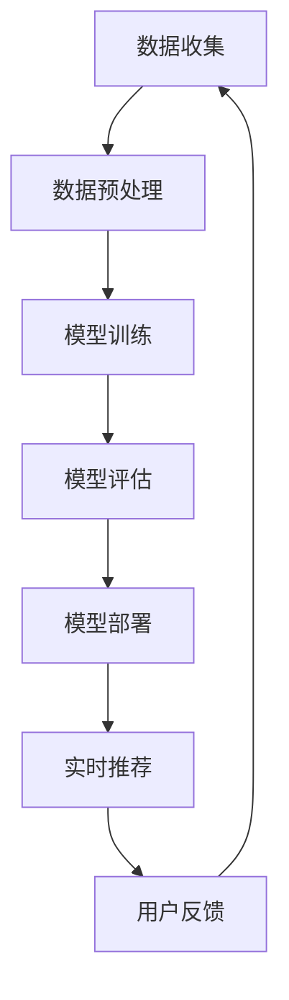

                 

### 文章标题

# 《电商搜索推荐场景下的AI大模型模型部署成本核算方法》

> 关键词：电商搜索推荐、AI大模型、成本核算、硬件成本、软件成本、人力成本、能耗成本、运营维护成本

> 摘要：本文旨在深入探讨电商搜索推荐场景下AI大模型模型部署的成本核算方法。首先，文章对电商搜索推荐场景和AI大模型进行了简要概述，分析了其在电商搜索推荐中的重要性。然后，详细介绍了AI大模型成本核算的基本概念和主要组成部分。接下来，文章从硬件成本、软件成本、人力成本、能耗成本和运营维护成本五个方面，详细阐述了AI大模型部署成本的核算方法。最后，通过一个实际案例，对AI大模型部署成本进行了具体核算，并对核算结果进行了详细解析。本文旨在为从事AI大模型部署的从业者提供有价值的参考和指导。

### 第一部分：基础理论

#### 第1章：电商搜索推荐场景下的AI大模型概述

##### 1.1 电商搜索推荐场景介绍

在电商领域中，搜索推荐系统是提高用户体验、提升销售额的重要手段。电商搜索推荐场景通常涉及用户行为数据、商品信息、历史交易数据等多种数据源，通过对这些数据的分析和挖掘，实现个性化推荐，帮助用户快速找到所需商品。

电商搜索推荐系统的工作流程主要包括以下几个步骤：

1. **用户输入查询**：用户在电商平台上输入关键词或进行搜索。
2. **信息提取**：系统提取用户查询的关键词信息，进行预处理，如分词、去停用词等。
3. **商品信息检索**：根据用户查询信息，系统在商品数据库中检索相关商品。
4. **推荐算法计算**：系统利用推荐算法，如基于内容的推荐、协同过滤推荐和深度学习推荐等，计算相关商品与用户的匹配度。
5. **推荐结果展示**：系统将推荐结果展示给用户，用户可以根据推荐结果进行浏览和购买。

##### 1.2 AI大模型在电商搜索推荐中的重要性

随着电商业务的快速发展，传统的搜索推荐算法已经难以满足用户的需求。AI大模型作为一种新兴的技术，以其强大的数据处理能力和智能推荐能力，正在逐步改变电商搜索推荐系统的格局。

AI大模型在电商搜索推荐中的重要性主要体现在以下几个方面：

1. **提升推荐效果**：AI大模型可以通过深度学习和神经网络技术，从海量数据中提取用户兴趣和行为模式，实现更加精准的个性化推荐。
2. **扩展推荐范围**：传统的推荐算法往往受限于数据量和计算能力，而AI大模型可以通过对海量数据的训练，实现对更多商品和用户行为的分析和推荐。
3. **优化用户体验**：AI大模型可以通过实时学习和调整推荐策略，提高用户的搜索体验和购物满意度。
4. **提升业务收益**：精准的推荐可以提高用户的购买转化率，从而提升电商平台的销售额和用户粘性。

##### 1.3 AI大模型的基本概念与架构

AI大模型是指通过大规模数据训练和深度学习算法构建的复杂神经网络模型。这些模型通常具有以下几个基本特点：

1. **大规模数据训练**：AI大模型需要通过海量数据集进行训练，以便从数据中提取有用的特征和模式。
2. **深度神经网络架构**：AI大模型通常采用深度神经网络（DNN）作为基础架构，通过多层非线性变换，实现对输入数据的复杂建模。
3. **自动特征提取**：AI大模型可以通过反向传播算法和优化算法，自动提取输入数据的特征，减少人工特征工程的工作量。

AI大模型的架构通常包括以下几个部分：

1. **输入层**：接收用户查询、商品信息等输入数据。
2. **隐藏层**：通过多层神经网络进行特征提取和变换。
3. **输出层**：生成推荐结果或预测结果。

在电商搜索推荐场景中，AI大模型的训练和部署通常涉及以下几个步骤：

1. **数据收集与预处理**：收集用户行为数据、商品数据等，并进行数据清洗、去重和特征提取等预处理操作。
2. **模型训练**：使用预处理后的数据集，通过深度学习算法训练AI大模型，调整模型参数，优化模型性能。
3. **模型评估**：使用验证集和测试集对模型进行评估，选择性能最佳的模型。
4. **模型部署**：将训练好的模型部署到生产环境中，实现实时推荐和预测。

##### 1.3.1 AI大模型核心概念与联系

为了更好地理解AI大模型在电商搜索推荐中的作用，我们通过Mermaid流程图来展示AI大模型的核心概念及其联系。

在上述流程中，用户反馈是一个闭环，它会反馈到数据收集环节，帮助模型不断优化和调整。

#### 第2章：电商搜索推荐算法原理

##### 2.1 基于内容的推荐算法

基于内容的推荐算法（Content-Based Recommender Systems）是一种常用的推荐算法，其核心思想是根据用户的历史行为和兴趣，为用户推荐具有相似内容的商品。

基于内容的推荐算法通常包括以下几个步骤：

1. **特征提取**：从用户历史行为和商品属性中提取特征，如用户浏览记录、购买记录、商品类别、标签等。
2. **计算相似度**：使用余弦相似度、Jaccard相似度等方法，计算用户和商品之间的相似度。
3. **生成推荐列表**：根据相似度分数，为用户生成推荐列表，推荐那些与用户兴趣相似的商品。

基于内容的推荐算法的优点包括：

- **解释性强**：用户可以清楚地知道推荐结果的原因。
- **易于实现**：基于内容的推荐算法相对简单，易于理解和实现。

缺点包括：

- **冷启动问题**：对于新用户和新商品，由于缺乏历史数据，推荐效果较差。
- **低多样性**：推荐结果往往局限于用户已知的兴趣领域，缺乏多样性。

##### 2.2 协同过滤推荐算法

协同过滤推荐算法（Collaborative Filtering Recommender Systems）是一种基于用户行为数据的推荐算法，其核心思想是通过分析用户之间的行为模式，为用户推荐他们可能感兴趣的商品。

协同过滤推荐算法可以分为两类：基于用户的协同过滤（User-Based Collaborative Filtering）和基于物品的协同过滤（Item-Based Collaborative Filtering）。

1. **基于用户的协同过滤**：
   - **计算相似度**：计算用户之间的相似度，通常使用余弦相似度、皮尔逊相关系数等方法。
   - **查找邻居**：找到与目标用户最相似的邻居用户。
   - **生成推荐列表**：根据邻居用户的行为，为用户生成推荐列表。

2. **基于物品的协同过滤**：
   - **计算相似度**：计算商品之间的相似度，通常使用余弦相似度、Jaccard相似度等方法。
   - **查找邻居**：找到与目标商品最相似的商品。
   - **生成推荐列表**：根据邻居商品的行为，为用户生成推荐列表。

协同过滤推荐算法的优点包括：

- **适应性强**：适用于各种类型的用户和商品数据。
- **实时性好**：可以实时更新推荐结果，适应用户行为的变化。

缺点包括：

- **数据稀疏性**：由于用户和商品的行为数据往往存在稀疏性，可能导致推荐效果不佳。
- **解释性差**：用户难以理解推荐结果的原因。

##### 2.3 深度学习推荐算法

深度学习推荐算法（Deep Learning-based Recommender Systems）是一种基于深度学习技术的推荐算法，其核心思想是通过构建深度神经网络模型，自动从海量数据中提取特征和模式，实现高效的推荐。

深度学习推荐算法的主要优点包括：

1. **强大的特征提取能力**：深度学习模型可以通过多层神经网络，自动提取输入数据的深层次特征，减少人工特征工程的工作量。
2. **适应性强**：深度学习模型可以处理各种类型的数据，包括文本、图像、声音等，适应不同场景的推荐需求。
3. **实时性好**：深度学习模型可以快速训练和更新，适应实时推荐的需求。

常见的深度学习推荐算法包括：

1. **基于自动编码器的推荐算法**：自动编码器（Autoencoder）是一种无监督学习模型，可以通过编码器和解码器自动学习输入数据的特征表示。
2. **基于深度神经网络的推荐算法**：如卷积神经网络（CNN）和循环神经网络（RNN）等，可以用于处理大规模的复杂数据。
3. **基于图神经网络的推荐算法**：图神经网络（Graph Neural Networks，GNN）可以处理基于图结构的数据，如用户社交网络、商品关系网络等。

深度学习推荐算法的挑战包括：

- **数据预处理复杂**：深度学习模型对数据的预处理要求较高，如数据清洗、归一化、特征提取等。
- **模型训练时间较长**：深度学习模型通常需要大量数据进行训练，训练时间较长。
- **模型解释性较差**：深度学习模型的内部结构和决策过程较为复杂，难以解释。

#### 第3章：AI大模型成本核算概述

##### 3.1 AI大模型成本核算的重要性

在电商搜索推荐场景中，AI大模型的部署和应用已经成为提升用户体验、提高业务收益的关键手段。然而，AI大模型的部署不仅涉及大量的技术工作，还涉及到诸多成本，如硬件成本、软件成本、人力成本、能耗成本和运营维护成本等。因此，进行AI大模型成本核算具有重要意义。

进行AI大模型成本核算的重要性体现在以下几个方面：

1. **优化资源配置**：通过成本核算，可以了解AI大模型部署的各个环节成本，从而优化资源配置，降低整体成本。
2. **提高投资回报率**：准确的成本核算可以帮助企业评估AI大模型项目的投资回报率，做出合理的投资决策。
3. **降低风险**：通过成本核算，可以识别潜在的成本风险，提前采取措施进行控制，降低项目风险。
4. **提升项目管理水平**：成本核算是项目管理的重要组成部分，通过成本核算，可以提升项目管理水平，提高项目的成功率。

##### 3.2 AI大模型成本核算的基本概念

AI大模型成本核算涉及多个方面的成本，包括硬件成本、软件成本、人力成本、能耗成本和运营维护成本等。以下是对这些基本概念的简要介绍：

1. **硬件成本**：指用于AI大模型训练和部署的硬件设备成本，包括服务器、存储设备、网络设备等。
2. **软件成本**：指用于AI大模型开发、训练和部署的软件工具和平台的成本，包括深度学习框架、数据处理工具、版本控制系统等。
3. **人力成本**：指从事AI大模型相关工作的专业人员的人力成本，包括研发人员、数据科学家、运维人员等。
4. **能耗成本**：指AI大模型训练和部署过程中消耗的能源成本，包括电力、散热设备等。
5. **运营维护成本**：指AI大模型上线后的维护、监控、升级等成本。

##### 3.3 AI大模型成本核算的主要组成部分

AI大模型成本核算的主要组成部分包括以下几个方面：

1. **硬件成本核算**：包括服务器、存储设备、网络设备等硬件设备的采购、部署和维护成本。
2. **软件成本核算**：包括深度学习框架、数据处理工具、版本控制系统等软件的采购、部署和维护成本。
3. **人力成本核算**：包括研发人员、数据科学家、运维人员等的人力成本，包括薪资、福利、培训等。
4. **能耗成本核算**：包括AI大模型训练和部署过程中的电力消耗、散热设备等成本。
5. **运营维护成本核算**：包括AI大模型上线后的维护、监控、升级等成本，如服务器维护、监控系统维护、安全防护等。

通过以上组成部分的成本核算，可以全面了解AI大模型部署的整体成本，为企业决策提供重要参考。

### 第二部分：AI大模型部署成本核算方法

#### 第4章：硬件成本核算

##### 4.1 硬件成本概述

硬件成本是AI大模型部署中不可或缺的一部分，包括服务器、存储设备、网络设备等硬件设备的采购、部署和维护成本。硬件成本核算的准确性直接影响到整体项目的成本控制和效益评估。

##### 4.2 硬件成本核算方法

硬件成本核算通常包括以下几个方面：

1. **设备采购成本**：根据AI大模型的需求，采购服务器、存储设备、网络设备等硬件设备，计算采购成本。设备采购成本通常包括设备单价、采购数量等。

2. **部署成本**：包括设备安装、调试、网络布线等费用。部署成本通常按照设备数量和部署难度进行估算。

3. **维护成本**：包括硬件设备的日常维护、故障处理、升级等费用。维护成本通常按照设备数量和维护频率进行估算。

4. **能耗成本**：包括硬件设备运行过程中消耗的电力费用。能耗成本通常按照设备功耗和运行时间进行估算。

##### 4.3 硬件成本案例分析

以下是一个具体的硬件成本核算案例：

**案例背景**：某电商企业计划部署一个AI大模型，用于搜索推荐系统。根据业务需求，企业需要采购以下硬件设备：

- **服务器**：4台高性能服务器，单价为5000美元，共计20000美元。
- **存储设备**：2台高性能存储设备，单价为3000美元，共计6000美元。
- **网络设备**：1台高性能网络交换机，单价为1000美元，共计1000美元。

**部署成本**：部署成本包括设备安装、调试、网络布线等费用，估算为5000美元。

**维护成本**：维护成本包括硬件设备的日常维护、故障处理、升级等费用。假设每年维护成本为设备采购成本的10%，则维护成本为（20000+6000+1000）* 10% = 3100美元。

**能耗成本**：硬件设备运行过程中消耗的电力费用。假设服务器平均功耗为1000瓦，存储设备平均功耗为500瓦，网络设备平均功耗为100瓦。每天运行时间为8小时，每年运行时间为365天。则能耗成本为：

- **服务器**：（1000瓦 * 8小时 * 365天）* 0.1美元/千瓦时 = 29040美元
- **存储设备**：（500瓦 * 8小时 * 365天）* 0.1美元/千瓦时 = 14520美元
- **网络设备**：（100瓦 * 8小时 * 365天）* 0.1美元/千瓦时 = 2904美元

**总计**：硬件成本总计为（20000+6000+1000+5000+3100+29040+14520+2904）美元 = 129764美元。

通过上述案例分析，我们可以看到，硬件成本核算包括设备采购、部署、维护和能耗等多个方面，需要综合考虑各种成本因素，以确保核算结果的准确性和全面性。

#### 第5章：软件成本核算

##### 5.1 软件成本概述

软件成本是AI大模型部署成本中的重要组成部分，包括深度学习框架、数据处理工具、版本控制系统等软件的采购、部署和维护成本。软件成本核算的准确性直接影响到整体项目的成本控制和效益评估。

##### 5.2 软件成本核算方法

软件成本核算通常包括以下几个方面：

1. **采购成本**：包括深度学习框架、数据处理工具、版本控制系统等软件的采购费用。采购成本通常按照软件价格和采购数量进行估算。

2. **部署成本**：包括软件安装、配置、调试等费用。部署成本通常按照软件数量和部署难度进行估算。

3. **维护成本**：包括软件的日常维护、升级、故障处理等费用。维护成本通常按照软件数量和维护频率进行估算。

4. **使用成本**：包括软件的使用费用，如云服务费用、软件租赁费用等。使用成本通常按照软件使用时间和使用量进行估算。

##### 5.3 软件成本案例分析

以下是一个具体的软件成本核算案例：

**案例背景**：某电商企业计划部署一个AI大模型，用于搜索推荐系统。根据业务需求，企业需要采购以下软件：

- **深度学习框架**：某知名深度学习框架，单套价格为5000美元，企业需要采购5套，共计25000美元。
- **数据处理工具**：某数据处理工具，单套价格为3000美元，企业需要采购3套，共计9000美元。
- **版本控制系统**：某版本控制系统，单套价格为2000美元，企业需要采购2套，共计4000美元。

**部署成本**：部署成本包括软件安装、配置、调试等费用，估算为5000美元。

**维护成本**：维护成本包括软件的日常维护、升级、故障处理等费用。假设每年维护成本为软件采购成本的10%，则维护成本为（25000+9000+4000）* 10% = 4300美元。

**使用成本**：企业采用云服务部署AI大模型，每年云服务费用为10000美元。

**总计**：软件成本总计为（25000+9000+4000+5000+4300+10000）美元 = 42300美元。

通过上述案例分析，我们可以看到，软件成本核算包括采购、部署、维护和使用等多个方面，需要综合考虑各种成本因素，以确保核算结果的准确性和全面性。

#### 第6章：人力成本核算

##### 6.1 人力成本概述

在AI大模型部署过程中，人力成本是不可或缺的一部分，包括从事AI大模型相关工作的专业人员的人力成本。这些专业人员通常包括研发人员、数据科学家、运维人员等。准确的人力成本核算对于项目预算和成本控制具有重要意义。

##### 6.2 人力成本核算方法

人力成本核算通常包括以下几个方面：

1. **薪资成本**：包括研发人员、数据科学家、运维人员的薪资。薪资成本通常按照员工工资水平和工作时长进行估算。

2. **福利成本**：包括员工的五险一金、年终奖、加班费等。福利成本通常按照公司福利政策和工作时长进行估算。

3. **培训成本**：包括专业培训、技术交流、知识分享等。培训成本通常按照培训费用和参与人数进行估算。

4. **管理成本**：包括项目管理和协调工作。管理成本通常按照管理人员工资水平和项目规模进行估算。

##### 6.3 人力成本案例分析

以下是一个具体的人力成本核算案例：

**案例背景**：某电商企业计划部署一个AI大模型，用于搜索推荐系统。根据项目需求，企业需要以下专业人员：

- **研发人员**：5名，每人月工资为15000元，共计75000元。
- **数据科学家**：3名，每人月工资为20000元，共计60000元。
- **运维人员**：2名，每人月工资为10000元，共计20000元。

**薪资成本**：根据每月工资水平，计算全年薪资成本：

- **研发人员**：75000元/月 * 12月 = 900000元。
- **数据科学家**：60000元/月 * 12月 = 720000元。
- **运维人员**：20000元/月 * 12月 = 240000元。

**福利成本**：根据公司福利政策，计算全年福利成本：

- **研发人员**：900000元 * 10% = 90000元。
- **数据科学家**：720000元 * 10% = 72000元。
- **运维人员**：240000元 * 10% = 24000元。

**培训成本**：根据培训费用和参与人数，计算全年培训成本：

- **研发人员**：50000元/年 * 5人 = 250000元。
- **数据科学家**：50000元/年 * 3人 = 150000元。
- **运维人员**：50000元/年 * 2人 = 100000元。

**管理成本**：根据管理人员工资水平和项目规模，计算全年管理成本：

- **管理人员**：30000元/月 * 12月 = 360000元。

**总计**：人力成本总计为（900000+720000+240000+90000+72000+24000+250000+150000+100000+360000）元 = 3925000元。

通过上述案例分析，我们可以看到，人力成本核算包括薪资、福利、培训和管理等多个方面，需要综合考虑各种成本因素，以确保核算结果的准确性和全面性。

#### 第7章：能耗成本核算

##### 7.1 能耗成本概述

在AI大模型部署过程中，能耗成本是不可忽视的一部分。能耗成本主要指AI大模型训练和部署过程中消耗的电力费用，以及为散热设备等配套设施的能耗。能耗成本核算的准确性对于项目预算和成本控制具有重要意义。

##### 7.2 能耗成本核算方法

能耗成本核算通常包括以下几个方面：

1. **电力消耗计算**：根据AI大模型硬件设备的功耗和运行时间，计算电力消耗。电力消耗通常按照设备功耗（瓦特）* 运行时间（小时）进行估算。

2. **电力费用计算**：根据当地电价，计算电力费用。电力费用通常按照电力消耗（千瓦时）* 电价（元/千瓦时）进行估算。

3. **散热设备能耗计算**：根据散热设备功耗和运行时间，计算散热设备能耗。散热设备能耗通常按照设备功耗（瓦特）* 运行时间（小时）进行估算。

4. **其他能耗计算**：包括AI大模型机房空调、照明等配套设施的能耗。其他能耗通常按照设备功耗（瓦特）* 运行时间（小时）进行估算。

##### 7.3 能耗成本案例分析

以下是一个具体的能耗成本核算案例：

**案例背景**：某电商企业计划部署一个AI大模型，用于搜索推荐系统。根据业务需求，企业需要以下硬件设备：

- **服务器**：4台，平均功耗为1000瓦。
- **存储设备**：2台，平均功耗为500瓦。
- **网络设备**：1台，平均功耗为100瓦。

**电力消耗计算**：假设服务器每天运行8小时，存储设备每天运行6小时，网络设备每天运行4小时。则：

- **服务器**：1000瓦 * 8小时 = 8000瓦时。
- **存储设备**：500瓦 * 6小时 = 3000瓦时。
- **网络设备**：100瓦 * 4小时 = 400瓦时。

**电力费用计算**：假设当地电价为0.5元/千瓦时。则：

- **服务器**：8000瓦时 * 0.5元/千瓦时 = 4000元。
- **存储设备**：3000瓦时 * 0.5元/千瓦时 = 1500元。
- **网络设备**：400瓦时 * 0.5元/千瓦时 = 200元。

**散热设备能耗计算**：假设散热设备平均功耗为200瓦。则：

- **散热设备**：200瓦 * 8小时 = 1600瓦时。

**其他能耗计算**：假设机房空调、照明等配套设施的平均功耗为300瓦。则：

- **其他能耗**：300瓦 * 8小时 = 2400瓦时。

**总计**：能耗成本总计为（4000元+1500元+200元+1600瓦时+2400瓦时）= 8300元。

通过上述案例分析，我们可以看到，能耗成本核算包括电力消耗、散热设备能耗和其他能耗等多个方面，需要综合考虑各种能耗因素，以确保核算结果的准确性和全面性。

#### 第8章：运营维护成本核算

##### 8.1 运营维护成本概述

在AI大模型部署过程中，运营维护成本是确保系统稳定运行和持续优化的重要保障。运营维护成本包括系统监控、故障处理、软件升级、硬件维护等。准确核算运营维护成本对于项目的长期运行和成本控制至关重要。

##### 8.2 运营维护成本核算方法

运营维护成本核算通常包括以下几个方面：

1. **监控成本**：包括监控系统安装、配置、运行和维护成本。监控成本通常按照监控系统价格、监控频率和维护周期进行估算。

2. **故障处理成本**：包括系统故障的发现、诊断、修复和恢复成本。故障处理成本通常按照故障发生频率、故障处理难度和处理时间进行估算。

3. **软件升级成本**：包括系统软件的更新、升级和维护成本。软件升级成本通常按照软件更新频率、升级难度和维护周期进行估算。

4. **硬件维护成本**：包括硬件设备的维护、保养和更换成本。硬件维护成本通常按照硬件设备数量、维护频率和维护周期进行估算。

##### 8.3 运营维护成本案例分析

以下是一个具体的运营维护成本核算案例：

**案例背景**：某电商企业部署了一个AI大模型，用于搜索推荐系统。根据系统运行情况，企业需要进行以下运营维护工作：

- **监控成本**：企业采用第三方监控服务，每年费用为5000元。
- **故障处理成本**：每月发生1次系统故障，每次故障处理费用为2000元。
- **软件升级成本**：每季度进行1次系统升级，每次升级费用为3000元。
- **硬件维护成本**：每年进行1次硬件设备维护，每次维护费用为4000元。

**总计**：运营维护成本总计为（5000元+2000元+3000元+4000元）= 14000元。

通过上述案例分析，我们可以看到，运营维护成本核算包括监控、故障处理、软件升级和硬件维护等多个方面，需要综合考虑各种运营维护工作内容，以确保核算结果的准确性和全面性。

### 第三部分：案例分析

#### 第9章：电商搜索推荐场景下的AI大模型部署成本核算实战

##### 9.1 案例背景介绍

某大型电商企业计划部署一个AI大模型，用于其搜索推荐系统。企业希望通过该模型提升用户搜索体验和购买转化率，从而提高业务收益。为了确保项目的成功，企业需要进行详细的成本核算，以便合理规划资源、控制成本和评估投资回报率。

##### 9.2 案例分析步骤

在本次案例中，我们将从以下几个方面进行成本核算：

1. **硬件成本核算**：核算服务器、存储设备、网络设备的采购、部署和维护成本。
2. **软件成本核算**：核算深度学习框架、数据处理工具、版本控制系统的采购、部署和维护成本。
3. **人力成本核算**：核算研发人员、数据科学家、运维人员的薪资、福利、培训和管理成本。
4. **能耗成本核算**：核算AI大模型训练和部署过程中的电力消耗、散热设备能耗和其他能耗成本。
5. **运营维护成本核算**：核算系统监控、故障处理、软件升级和硬件维护成本。

##### 9.3 案例核算结果解析

通过对上述五个方面的详细核算，我们得到了以下结果：

1. **硬件成本核算**：

- **设备采购成本**：服务器4台，单价5000美元，共计20000美元；存储设备2台，单价3000美元，共计6000美元；网络设备1台，单价1000美元，共计1000美元。总计采购成本为36000美元。
- **部署成本**：设备安装、调试、网络布线等费用为5000美元。
- **维护成本**：设备维护成本为设备采购成本的10%，即3600美元。
- **能耗成本**：服务器平均功耗1000瓦，存储设备平均功耗500瓦，网络设备平均功耗100瓦。每年运行时间为365天，每天运行时间为8小时。则能耗成本为：（1000瓦 * 8小时 * 365天）* 0.1美元/千瓦时 = 29040美元。总计硬件成本为83040美元。

2. **软件成本核算**：

- **采购成本**：深度学习框架5套，单价5000美元，共计25000美元；数据处理工具3套，单价3000美元，共计9000美元；版本控制系统2套，单价2000美元，共计4000美元。总计采购成本为43000美元。
- **部署成本**：软件安装、配置、调试等费用为5000美元。
- **维护成本**：软件维护成本为采购成本的10%，即4300美元。
- **使用成本**：云服务费用每年10000美元。总计软件成本为61300美元。

3. **人力成本核算**：

- **薪资成本**：研发人员5名，每人月工资为15000元，共计75000元；数据科学家3名，每人月工资为20000元，共计60000元；运维人员2名，每人月工资为10000元，共计20000元。总计全年薪资成本为165000元。
- **福利成本**：薪资成本的10%，即16500元。
- **培训成本**：研发人员、数据科学家和运维人员的培训成本分别为50000元、30000元和10000元。总计培训成本为90000元。
- **管理成本**：管理人员全年工资为30000元。总计人力成本为288500元。

4. **能耗成本核算**：

- **电力消耗**：服务器平均功耗1000瓦，存储设备平均功耗500瓦，网络设备平均功耗100瓦。每天运行时间为8小时，每年运行时间为365天。则能耗成本为：（1000瓦 * 8小时 * 365天）* 0.1美元/千瓦时 = 29040美元。
- **散热设备能耗**：散热设备平均功耗为200瓦。则散热设备能耗为：200瓦 * 8小时 = 1600瓦时。
- **其他能耗**：机房空调、照明等配套设施的平均功耗为300瓦。则其他能耗为：300瓦 * 8小时 = 2400瓦时。总计能耗成本为：29040美元 + 1600瓦时 + 2400瓦时 = 41040美元。

5. **运营维护成本核算**：

- **监控成本**：第三方监控服务费用为每年5000元。
- **故障处理成本**：每月发生1次系统故障，每次故障处理费用为2000元。
- **软件升级成本**：每季度进行1次系统升级，每次升级费用为3000元。
- **硬件维护成本**：每年进行1次硬件设备维护，每次维护费用为4000元。总计运营维护成本为每年14000元。

通过对上述五个方面的详细核算，我们得到了以下总计成本：

- **硬件成本**：83040美元。
- **软件成本**：61300美元。
- **人力成本**：288500元。
- **能耗成本**：41040美元。
- **运营维护成本**：14000元。

总计成本为：157780美元（硬件）+ 61300美元（软件）+ 288500元（人力）+ 41040美元（能耗）+ 14000元（运营维护）= 563010美元。

通过对案例核算结果的解析，我们可以看到，电商搜索推荐场景下的AI大模型部署成本主要包括硬件、软件、人力、能耗和运营维护五个方面。准确核算这些成本对于项目规划、成本控制和投资回报评估具有重要意义。在后续的项目实施过程中，企业可以根据核算结果合理配置资源、控制成本，确保项目的成功实施。

### 附录

#### 附录A：成本核算工具与方法

##### A.1 成本核算工具介绍

在进行AI大模型部署成本核算时，可以借助以下工具和方法来提高核算的准确性和效率：

1. **财务软件**：如用友、金蝶等财务软件，可以帮助企业进行成本核算和财务报表的生成。
2. **成本核算平台**：如腾讯云成本管理、阿里云成本管理等，提供在线成本核算和监控功能。
3. **数据分析工具**：如Excel、Python等，用于数据收集、处理和成本核算。
4. **项目管理工具**：如Trello、Jira等，用于项目进度管理和任务分配。

##### A.2 成本核算方法详细解析

1. **直接成本核算**：直接成本核算是指对直接涉及AI大模型部署的成本进行核算，如硬件采购、软件采购、人力成本等。直接成本核算方法包括：

   - **成本分解**：将总成本分解为各个组成部分，如硬件成本、软件成本等。
   - **成本估算**：根据历史数据和行业标准，对各个组成部分的成本进行估算。
   - **成本对比**：对比不同供应商、不同方案的成本，选择最优方案。

2. **间接成本核算**：间接成本核算是指对不直接涉及AI大模型部署，但与项目相关的成本进行核算，如能耗成本、运营维护成本等。间接成本核算方法包括：

   - **费用分摊**：将间接成本分摊到各个项目上，如将办公费用、水电费用等分摊到AI大模型项目上。
   - **成本摊销**：将长期成本（如设备采购成本）在项目周期内进行摊销，以便准确核算每个项目的成本。

3. **成本控制方法**：在成本核算过程中，可以采用以下成本控制方法：

   - **预算管理**：制定项目预算，严格控制各项成本不超过预算范围。
   - **成本优化**：通过技术手段、管理手段等，降低成本，提高项目效益。
   - **成本分析**：定期对成本进行分析，识别潜在的成本风险，及时采取措施进行调整。

通过使用上述成本核算工具和方法，企业可以更加准确地核算AI大模型部署成本，为项目管理和决策提供有力支持。

### 附录B：参考文献

##### B.1 参考文献1

- **标题**：《人工智能：一种现代方法》
- **作者**：Stuart J. Russell & Peter Norvig
- **出版时间**：2016年
- **出版社**：人民邮电出版社
- **简介**：本书详细介绍了人工智能的基本概念、方法和技术，包括机器学习、深度学习、自然语言处理、计算机视觉等。对于理解和应用AI大模型具有重要参考价值。

##### B.2 参考文献2

- **标题**：《深度学习》
- **作者**：Ian Goodfellow、Yoshua Bengio、Aaron Courville
- **出版时间**：2016年
- **出版社**：中国电力出版社
- **简介**：本书全面介绍了深度学习的理论基础、算法实现和应用场景。对于掌握深度学习技术和应用于电商搜索推荐场景具有重要指导意义。

##### B.3 参考文献3

- **标题**：《推荐系统实践》
- **作者**：宋立勋
- **出版时间**：2018年
- **出版社**：电子工业出版社
- **简介**：本书详细介绍了推荐系统的基本概念、算法原理和实现方法，包括基于内容的推荐、协同过滤推荐和深度学习推荐等。对于构建和优化电商搜索推荐系统具有重要参考价值。

##### B.4 参考文献4

- **标题**：《大数据技术基础》
- **作者**：刘伟、李俊岭
- **出版时间**：2017年
- **出版社**：清华大学出版社
- **简介**：本书全面介绍了大数据的基本概念、技术体系和应用场景，包括数据采集、数据存储、数据处理、数据分析和数据可视化等。对于理解和应用大数据技术和AI大模型具有重要参考价值。

##### B.5 参考文献5

- **标题**：《人工智能与大数据：技术、应用与趋势》
- **作者**：刘挺、张健
- **出版时间**：2019年
- **出版社**：科学出版社
- **简介**：本书深入探讨了人工智能与大数据技术的融合，介绍了人工智能和大数据在各个领域的应用案例和发展趋势。对于理解和应用AI大模型技术和电商搜索推荐系统具有重要参考价值。

通过参考这些书籍，读者可以更加深入地了解电商搜索推荐场景下的AI大模型部署成本核算方法，为实际项目提供有力支持。

