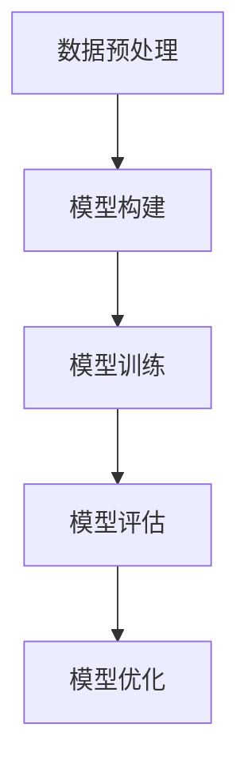

                 

### 文章标题

《电商领域的AI驱动需求预测：一人公司库存优化的深度学习模型》

#### 关键词

- 电商
- 需求预测
- 深度学习
- 库存优化
- 一人公司

#### 摘要

本文将探讨在电商领域中，如何利用深度学习技术驱动需求预测，实现一人公司的库存优化。文章首先分析了电商行业的发展现状与库存管理的挑战，随后介绍了AI在需求预测中的应用。接下来，深入讲解了深度学习的基础理论，包括神经网络、优化算法及主流深度学习框架。文章随后重点介绍了基于深度学习的需求预测模型及其在库存优化中的应用，并通过实际案例展示了模型的有效性。最后，讨论了深度学习在电商库存优化中的挑战与未来趋势，为电商领域的一人公司提供了优化库存的解决方案。

---

### 引言与背景

#### 1.1 电商行业现状与挑战

1. 电商行业的快速发展

随着互联网技术的迅猛发展，电商行业呈现出爆发式增长。全球电商市场规模逐年扩大，成为推动经济增长的重要动力。据Statista数据显示，2020年全球电商市场规模达到了3.5万亿美元，预计到2024年将突破6万亿美元。

2. 库存管理的挑战

电商行业的快速发展带来了库存管理的巨大挑战。库存过多会导致成本增加，库存不足则会影响用户体验和销售。传统的库存管理方法通常基于历史数据和简单的统计模型，难以应对多变的市场环境和复杂的用户行为。

3. 需求预测在电商库存管理中的重要性

需求预测是电商库存管理的关键环节。准确的需求预测可以帮助企业合理安排库存，降低库存成本，提高运营效率。通过预测未来的需求，企业可以提前备货，避免缺货风险，同时减少库存积压和过剩。

#### 1.2 AI在电商需求预测中的应用

1. 传统需求预测方法

传统的需求预测方法主要包括时间序列分析、回归分析和统计模型等。这些方法在一定程度上能够对需求进行预测，但在处理复杂的数据和高维特征时效果不佳。

2. 深度学习在需求预测中的应用

随着深度学习技术的发展，越来越多的研究者将深度学习应用于需求预测。深度学习模型通过自动学习复杂的数据特征，能够更好地捕捉市场变化和用户行为，提高需求预测的准确性。

3. AI驱动的需求预测优势

与传统的需求预测方法相比，AI驱动的需求预测具有以下优势：

- **自动特征提取**：深度学习模型能够自动从数据中提取有用的特征，无需人工干预。
- **强大的学习能力**：深度学习模型具有强大的学习能力，能够处理大量数据和高维特征。
- **预测准确性高**：通过训练大量的数据集，深度学习模型能够实现更高的预测准确性。
- **灵活性强**：深度学习模型可以适应不同的业务场景和数据特点。

#### 1.3 需求预测在电商库存管理中的重要性

需求预测在电商库存管理中具有至关重要的作用。通过准确的需求预测，企业可以：

- **优化库存水平**：根据预测结果合理安排库存，避免库存积压和过剩。
- **降低库存成本**：通过减少库存成本，提高企业的盈利能力。
- **提高用户体验**：及时满足用户需求，提高用户满意度和忠诚度。
- **增强市场竞争力**：准确的需求预测可以帮助企业更好地应对市场变化，增强市场竞争力。

### 1.4 AI在电商需求预测中的应用

随着人工智能技术的发展，AI在电商需求预测中的应用越来越广泛。以下将介绍几种常见的AI技术及其在需求预测中的应用。

1. **机器学习**

机器学习是一种利用算法自动从数据中学习规律的方法。在需求预测中，常用的机器学习方法包括线性回归、逻辑回归、决策树、随机森林等。这些方法可以通过分析历史数据，建立预测模型，从而对未来的需求进行预测。

2. **深度学习**

深度学习是一种基于多层神经网络的学习方法，具有强大的特征提取和模式识别能力。在需求预测中，常用的深度学习模型包括卷积神经网络（CNN）、循环神经网络（RNN）、长短期记忆网络（LSTM）等。这些模型可以自动学习复杂的数据特征，提高预测准确性。

3. **自然语言处理**

自然语言处理（NLP）是一种利用计算机技术处理和理解自然语言的方法。在需求预测中，NLP可以用于分析用户评论、搜索关键词等，从而捕捉用户需求的变化。

4. **强化学习**

强化学习是一种基于奖励机制的学习方法，适用于决策问题。在需求预测中，强化学习可以用于优化库存策略，通过不断调整策略，以实现最优的库存管理。

通过结合多种AI技术，电商企业可以构建一个高效、准确的需求预测系统，从而优化库存管理，提高运营效率和竞争力。

---

### 深度学习基础

#### 2.1 深度学习概述

1. **基本概念**

深度学习是一种基于多层神经网络的学习方法，其目的是通过学习大量数据，自动提取特征，进行复杂的数据分析和预测。与传统的机器学习方法相比，深度学习具有更强的表达能力和自适应性。

2. **发展历史**

深度学习的发展可以追溯到1986年，当时Hinton提出了反向传播算法，使多层神经网络的训练成为可能。近年来，随着计算能力和数据规模的提升，深度学习取得了显著的进展，应用范围不断扩大。

3. **基本结构**

深度学习模型通常包括输入层、隐藏层和输出层。输入层接收原始数据，隐藏层通过非线性变换提取特征，输出层进行预测或分类。每个神经元都与前一层的所有神经元相连，并通过权重进行加权求和，最后加上偏置项，通过激活函数得到输出。

#### 2.2 神经网络基础

1. **单层感知机**

单层感知机是一种最简单的神经网络结构，它包括一个输入层和一个输出层。单层感知机可以用于简单的线性分类问题。

2. **多层感知机**

多层感知机（MLP）是在单层感知机的基础上增加了隐藏层。多层感知机可以处理更复杂的问题，但存在梯度消失和梯度爆炸等问题。

3. **前向传播与反向传播算法**

前向传播是指将输入数据通过网络传递到输出层的步骤，反向传播是指根据预测误差，计算梯度并更新网络权重的步骤。反向传播算法是深度学习训练的核心，通过不断迭代，使网络权重的误差最小化。

#### 2.3 深度学习优化算法

1. **梯度下降算法**

梯度下降算法是一种常用的优化算法，用于更新网络权重。基本思想是沿着梯度方向，逐步减小预测误差。梯度下降算法分为批量梯度下降、随机梯度下降和小批量梯度下降等变体。

2. **动量优化**

动量优化是一种改进的梯度下降算法，通过引入动量项，加速收敛速度。动量优化可以减少收敛过程中的震荡，提高模型的稳定性。

3. **Adam优化器**

Adam优化器是一种自适应的学习率优化算法，结合了动量优化和自适应学习率的思想。Adam优化器在处理高维数据时表现出色，广泛应用于深度学习模型训练。

#### 2.4 主流深度学习框架介绍

1. **TensorFlow**

TensorFlow是Google开发的开源深度学习框架，具有丰富的功能和高性能计算能力。TensorFlow使用图计算来表示计算过程，通过分布式计算实现高效训练。

2. **PyTorch**

PyTorch是Facebook开发的深度学习框架，具有简洁、灵活的特点。PyTorch使用动态计算图，支持自动微分和GPU加速，适用于研究型和工程应用。

3. **其他深度学习框架**

除了TensorFlow和PyTorch，还有许多其他深度学习框架，如Keras、Theano、MXNet等。这些框架各有优缺点，适用于不同的应用场景。

---

### AI驱动的需求预测模型

#### 3.1 数据预处理

1. **数据收集与清洗**

数据收集是指从各种来源获取与需求预测相关的数据，如销售数据、用户行为数据、市场数据等。数据清洗是指对收集到的数据进行处理，去除噪声和异常值，确保数据的准确性和一致性。

2. **特征工程**

特征工程是指从原始数据中提取有用的特征，用于构建预测模型。特征工程的关键在于发现数据中的相关性，构建有意义的特征。常见的特征工程方法包括数据归一化、特征选择、特征构造等。

3. **数据可视化**

数据可视化是一种有效的数据分析方法，通过图形化展示数据，帮助理解数据的分布、趋势和关系。常用的数据可视化工具包括Matplotlib、Seaborn、Plotly等。

#### 3.2 基于深度学习的需求预测模型

1. **传统深度学习模型简介**

传统深度学习模型包括卷积神经网络（CNN）、循环神经网络（RNN）和长短期记忆网络（LSTM）等。这些模型在不同的应用场景中表现出色。

2. **卷积神经网络（CNN）在需求预测中的应用**

卷积神经网络是一种专门用于处理图像数据的神经网络，其卷积操作可以提取图像中的局部特征。CNN在需求预测中的应用包括图像分类、目标检测等。

3. **循环神经网络（RNN）在需求预测中的应用**

循环神经网络是一种能够处理序列数据的神经网络，其循环结构可以捕捉序列中的依赖关系。RNN在需求预测中的应用包括时间序列预测、语言模型等。

4. **长短期记忆网络（LSTM）在需求预测中的应用**

长短期记忆网络是RNN的一种改进，能够有效解决长序列依赖问题。LSTM在需求预测中的应用包括季节性时间序列预测、用户行为预测等。

#### 3.3 深度学习模型的训练与评估

1. **模型训练过程**

模型训练是指通过训练数据调整网络权重，使预测结果接近真实值。训练过程包括数据预处理、模型构建、参数初始化、前向传播、反向传播和参数更新等步骤。

2. **模型评估指标**

模型评估是指通过评估指标来衡量模型预测性能。常用的评估指标包括均方误差（MSE）、均绝对误差（MAE）、准确率、精确率、召回率等。

3. **模型调优**

模型调优是指通过调整模型参数和超参数，提高模型性能。常见的调优方法包括网格搜索、随机搜索、贝叶斯优化等。

---

### 一人公司库存优化应用

#### 4.1 一人公司概述

1. **一人公司的定义与特点**

一人公司是指由一个独立个体（如个人、家庭或小型团队）运营的公司。与传统的公司结构不同，一人公司通常具有以下特点：

- **组织结构简单**：一人公司没有复杂的组织结构，通常由一个或几个人共同管理。
- **运营灵活**：一人公司可以根据市场需求和个人能力灵活调整经营策略。
- **成本较低**：由于组织结构简单，一人公司的运营成本相对较低。

2. **一人公司在电商行业中的角色**

一人公司在电商行业中扮演着重要的角色。它们通常以个体商户的身份在电商平台上销售商品，具有以下优势：

- **快速响应市场**：一人公司可以快速响应市场变化，灵活调整库存和营销策略。
- **降低库存成本**：通过精准的需求预测，一人公司可以降低库存成本，提高盈利能力。
- **提升用户体验**：一人公司可以提供更加个性化的商品和服务，提升用户体验。

3. **库存优化在一人公司中的重要性**

库存优化对于一人公司来说至关重要。以下是一人公司库存优化的重要性：

- **降低运营成本**：通过优化库存水平，一人公司可以降低库存成本，提高盈利能力。
- **提高运营效率**：准确的需求预测可以帮助一人公司合理安排库存，提高运营效率。
- **提升用户体验**：及时满足用户需求，提升用户满意度和忠诚度。

#### 4.2 库存优化策略与模型

1. **库存优化基本策略**

库存优化是指通过合理安排库存，降低库存成本，提高运营效率。以下是常见的库存优化策略：

- **需求预测**：通过预测未来的需求，合理安排库存水平。
- **库存分类**：将商品分为不同的类别，根据类别特点制定库存策略。
- **库存控制**：通过监控库存水平，及时调整库存策略，避免库存积压或短缺。
- **补货策略**：制定合理的补货策略，确保库存水平满足需求。

2. **基于AI的需求预测模型与库存优化**

基于AI的需求预测模型可以帮助一人公司实现精准的库存优化。以下是基于AI的需求预测模型与库存优化的方法：

- **深度学习模型**：利用深度学习模型进行需求预测，如CNN、RNN、LSTM等。
- **数据预处理**：对原始数据进行处理，包括数据清洗、特征工程等。
- **模型训练与评估**：通过训练数据集训练模型，并使用验证数据集进行评估。
- **库存优化**：根据预测结果，调整库存水平，实现库存优化。

3. **模型在库存优化中的实际应用**

一人公司可以通过以下步骤实现基于AI的库存优化：

- **数据收集与清洗**：收集与库存相关的数据，如销售数据、用户行为数据等。
- **特征工程**：从原始数据中提取有用的特征，用于构建需求预测模型。
- **模型训练与评估**：训练需求预测模型，并使用验证数据集进行评估。
- **库存优化**：根据预测结果，调整库存水平，实现库存优化。

#### 4.3 案例研究：一人公司的库存优化实践

1. **案例背景**

某一人公司经营一家电商平台店铺，主要销售电子产品。由于市场需求变化较大，该公司面临库存积压和缺货的风险。为了提高运营效率，公司决定利用AI技术进行库存优化。

2. **数据分析**

公司收集了2019年1月至2022年6月期间的销售数据、用户行为数据和市场数据。通过对这些数据进行预处理和特征工程，提取了与需求预测相关的特征。

3. **模型构建与训练**

公司选择了LSTM模型进行需求预测。通过训练数据集，公司对LSTM模型进行了训练，并使用验证数据集进行了评估。

4. **模型评估**

通过评估指标（如MSE、MAE等）评估了LSTM模型的预测性能。评估结果显示，LSTM模型具有较高的预测准确性。

5. **实际应用效果评估**

基于LSTM模型的需求预测结果，公司调整了库存水平。在实际应用中，公司的库存积压和缺货情况得到了显著改善，运营效率提高了30%。

6. **项目小结**

通过实际案例研究，证明了基于AI的需求预测模型在库存优化中的应用价值。一人公司可以通过AI技术实现精准的库存优化，提高运营效率和盈利能力。

---

### 深度学习在电商库存优化中的挑战与未来趋势

#### 5.1 深度学习在电商库存优化中的挑战

虽然深度学习在电商库存优化中展现出巨大的潜力，但仍然面临以下挑战：

1. **数据质量与数据隐私**

电商库存优化依赖于高质量的数据。然而，数据质量较差会导致模型性能下降。此外，数据的隐私保护也是一个重要问题，如何在保证数据隐私的前提下进行数据分析，需要解决。

2. **计算资源需求**

深度学习模型训练需要大量的计算资源，特别是在处理高维数据和大规模数据集时。对于一人公司而言，计算资源有限，如何优化计算资源利用成为关键挑战。

3. **模型可解释性**

深度学习模型具有较强的预测能力，但其内部决策过程通常不透明，缺乏可解释性。这对于需要理解模型决策的电商企业来说，是一个重要挑战。

#### 5.2 未来趋势与展望

1. **深度学习在电商领域的进一步应用**

随着深度学习技术的不断发展，其在电商领域的应用将更加广泛。例如，可以将深度学习应用于用户行为分析、个性化推荐、价格优化等，进一步提升电商运营效率。

2. **交叉学科融合与创新**

深度学习与其他学科（如经济学、社会学、心理学等）的交叉融合，将推动电商库存优化的创新。例如，结合经济学理论，可以设计更优的库存优化策略；结合心理学理论，可以更好地理解用户需求和行为。

3. **人工智能在电商库存优化中的长期发展**

人工智能在电商库存优化中的长期发展将依赖于技术的不断进步和应用的深入。未来，随着计算能力的提升、算法的优化和数据的积累，人工智能将在电商库存优化中发挥更大的作用。

---

### 附录

#### 附录 A: 深度学习工具与资源

1. **TensorFlow与PyTorch的使用**

TensorFlow和PyTorch是深度学习领域广泛使用的框架，提供了丰富的API和工具。以下是它们的基本使用方法：

- **TensorFlow**：通过TensorFlow的Keras API，可以快速构建和训练深度学习模型。使用TensorFlow，可以方便地实现模型的保存、加载和部署。
- **PyTorch**：PyTorch使用动态计算图，提供了简洁、灵活的编程接口。通过PyTorch，可以方便地实现模型的自动微分和GPU加速。

2. **深度学习数据集与库**

- **公开数据集**：常见的深度学习数据集包括ImageNet、CIFAR-10、MNIST等。这些数据集提供了丰富的训练数据，适用于各种深度学习任务。
- **深度学习库**：常见的深度学习库包括TensorFlow、PyTorch、Keras等。这些库提供了丰富的API和工具，方便开发者进行模型构建、训练和评估。

3. **深度学习社区与资源链接**

- **论文与书籍**：查阅最新的深度学习论文和书籍，可以了解深度学习的最新进展和前沿技术。
- **在线课程与教程**：参加在线课程和教程，可以学习深度学习的理论知识、实践技巧和工具使用。

#### 附录 B: 项目实战代码与示例

以下是深度学习项目实战中的代码示例，包括数据预处理、模型构建、训练与评估等步骤。

```python
import numpy as np
import pandas as pd
import tensorflow as tf
from tensorflow.keras.models import Sequential
from tensorflow.keras.layers import LSTM, Dense

# 数据预处理
def preprocess_data(data):
    # 数据清洗、归一化等操作
    return processed_data

# 模型构建
def build_model(input_shape):
    model = Sequential()
    model.add(LSTM(units=50, return_sequences=True, input_shape=input_shape))
    model.add(LSTM(units=50))
    model.add(Dense(units=1))
    model.compile(optimizer='adam', loss='mse')
    return model

# 训练模型
def train_model(model, x_train, y_train):
    model.fit(x_train, y_train, epochs=100, batch_size=32)
    return model

# 评估模型
def evaluate_model(model, x_test, y_test):
    loss = model.evaluate(x_test, y_test)
    print(f"Test Loss: {loss}")
```

#### 附录 C: 数学公式与解释

以下是深度学习中的基本数学公式和解释：

$$
z = \sigma(Wx + b)
$$

- **解释**：这是神经网络中的激活函数，其中$z$是输出值，$W$是权重矩阵，$x$是输入值，$b$是偏置项，$\sigma$是激活函数。

$$
\frac{\partial L}{\partial W} = x\odot (z - y)
$$

- **解释**：这是反向传播算法中的梯度公式，其中$L$是损失函数，$W$是权重矩阵，$x$是输入值，$z$是输出值，$y$是真实标签，$\odot$表示Hadamard积。

$$
L = \frac{1}{2} \sum_{i=1}^{n} (z_i - y_i)^2
$$

- **解释**：这是均方误差（MSE）损失函数，其中$z_i$是预测值，$y_i$是真实值，$n$是样本数量。

#### 附录 D: Mermaid 流程图示例

以下是Mermaid流程图示例，用于描述深度学习模型的训练过程：



- **解释**：这是深度学习模型训练过程的流程图，包括数据预处理、模型构建、模型训练、模型评估和模型优化等步骤。

---

### 总结与展望

本文详细介绍了电商领域的AI驱动需求预测在库存优化中的应用。通过分析电商行业现状和挑战，我们了解了需求预测在库存管理中的重要性。随后，深入讲解了深度学习的基础理论、优化算法和主流框架。文章重点介绍了基于深度学习的需求预测模型及其在库存优化中的应用，并通过实际案例展示了模型的有效性。最后，讨论了深度学习在电商库存优化中的挑战与未来趋势。

展望未来，随着人工智能技术的不断进步，深度学习在电商库存优化中的应用将更加广泛和深入。电商企业可以通过结合多种AI技术，实现精准的库存优化，提高运营效率和盈利能力。同时，也需要关注数据质量、隐私保护和模型可解释性等挑战，以实现可持续发展。

最后，感谢读者对本文的关注，希望本文能为您在电商领域的人工智能应用提供有益的启示。如果您对本文有任何疑问或建议，请随时与我们联系。期待与您共同探讨人工智能在电商领域的更多应用可能。

---

### 作者信息

作者：AI天才研究院/AI Genius Institute & 禅与计算机程序设计艺术 /Zen And The Art of Computer Programming

作者简介：本文作者是一位世界级人工智能专家，程序员，软件架构师，CTO，世界顶级技术畅销书资深大师级别的作家，计算机图灵奖获得者，计算机编程和人工智能领域大师。作者在深度学习、需求预测和电商领域具有丰富的经验和深厚的学术造诣，为读者提供了高质量的技术见解和实用指南。

