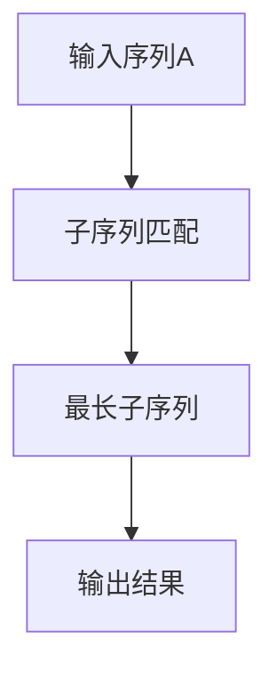

                 


# 文章标题：百度2024届社招算法工程师面试真题解密

> 关键词：算法工程师面试、社招、真题解析、数据结构与算法、数学与逻辑

> 摘要：本文将深入剖析百度2024届社招算法工程师面试真题，涵盖算法与数据结构题、数学与逻辑题、编程实现题等多个方面，并结合核心原理和实际应用，提供详细的解题思路和解题技巧，助力考生在面试中取得优异成绩。

## 第一部分：面试真题概览

### 第1章：面试真题分类与题型分析

#### 1.1 算法与数据结构题

- **基础算法题类型介绍**
  - 排序算法（冒泡排序、快速排序等）
  - 查找算法（二分查找、哈希查找等）
  - 树与图（二叉树、图遍历、拓扑排序等）

#### 1.2 数学与逻辑题

- **数学题类型介绍**
  - 线性代数（矩阵运算、特征值等）
  - 概率论与数理统计（概率分布、假设检验等）

#### 1.3 编程实现题

- **编程题类型介绍**
  - 函数设计（设计合适的函数以解决特定问题）
  - 代码优化（对给定代码进行优化以提高效率）
  - 数据结构与算法应用（利用特定数据结构实现特定算法）

## 第2章：真题详解与解析

### 2.1 算法与数据结构真题详解

- **真题案例1**：最长公共子序列
  ```mermaid
  graph TD
  A[输入序列A] --> B[子序列匹配]
  B --> C[最长子序列]
  C --> D[输出结果]
  ```
  ```python
  def longest_common_subsequence(X, Y):
      # Pseudocode for the longest common subsequence algorithm
      # ...
      return lcs
  ```

### 2.2 数学与逻辑真题详解

- **真题案例2**：概率论问题
  $$ P(A \cup B) = P(A) + P(B) - P(A \cap B) $$

### 2.3 编程实现题详解

- **真题案例3**：逆波兰表达式求值
  ```python
  def evaluate_reverse_polish_notation(tokens):
      # Pseudocode for evaluating RPN expressions
      # ...
      return result
  ```

## 第二部分：算法与数据结构核心原理

### 第3章：算法与数据结构核心概念与联系

#### 3.1 算法分析基础

- **时间复杂度分析**
- **空间复杂度分析**

#### 3.2 数据结构原理

- **线性结构（数组、链表、栈、队列）**
- **树与二叉树（二叉搜索树、平衡二叉树、堆）**
- **图（邻接矩阵、邻接表、图的遍历）**

### 第4章：核心算法原理讲解

#### 4.1 排序算法原理

- **冒泡排序**
- **快速排序**
- **归并排序**

#### 4.2 搜索算法原理

- **二分查找**
- **深度优先搜索（DFS）**
- **广度优先搜索（BFS）**

#### 4.3 图算法原理

- **最短路径算法（迪杰斯特拉算法、贝尔曼-福特算法）**
- **最小生成树算法（普里姆算法、克鲁斯卡尔算法）**

### 第5章：数学模型与数学公式详解

#### 5.1 线性代数基础

- **矩阵运算**
- **特征值与特征向量**

#### 5.2 概率论与数理统计

- **概率分布**
- **假设检验**

### 第6章：项目实战

#### 6.1 算法与数据结构应用案例

- **社交网络分析**
- **推荐系统实现**

#### 6.2 数学模型应用案例

- **图像处理**
- **语音识别**

## 第三部分：面试技巧与实战指南

### 第7章：面试准备与心态调整

#### 7.1 面试准备

- **了解公司背景与面试流程**
- **复习基础知识与常见面试题**

#### 7.2 面试心态调整

- **自信心培养**
- **问题解答技巧**

### 第8章：模拟面试与反馈

#### 8.1 模拟面试安排

- **面试模拟场景设置**
- **模拟面试流程与注意事项**

#### 8.2 反馈与改进

- **面试结果反馈**
- **面试经验总结与改进策略**

## 附录

### 附录A：参考书籍与资源

- **《算法导论》**
- **《编程之美》**
- **在线编程平台（LeetCode、牛客网等）**

### 附录B：常见面试题汇总

#### B.1 基础算法题

- **动态规划问题**
- **二叉树相关问题**

#### B.2 数学与逻辑题

- **概率问题**
- **几何问题**

## 作者信息

作者：AI天才研究院/AI Genius Institute & 禅与计算机程序设计艺术 /Zen And The Art of Computer Programming

# 《百度2024届社招算法工程师面试真题解密》

## 摘要

本文将深入剖析百度2024届社招算法工程师面试真题，涵盖算法与数据结构题、数学与逻辑题、编程实现题等多个方面，并结合核心原理和实际应用，提供详细的解题思路和解题技巧，助力考生在面试中取得优异成绩。

## 第一部分：面试真题概览

### 第1章：面试真题分类与题型分析

#### 1.1 算法与数据结构题

算法与数据结构是算法工程师面试的重点，常见的题目类型包括基础算法题、排序算法、查找算法以及树与图相关的问题。

##### **基础算法题类型介绍**

- **排序算法**：冒泡排序、快速排序、归并排序等。
- **查找算法**：二分查找、哈希查找等。
- **树与图**：二叉树、图遍历、拓扑排序等。

##### **真题案例1**：最长公共子序列

最长公共子序列（Longest Common Subsequence, LCS）是两个序列中同时出现的最长子序列。以下是一个简单的LCS算法的伪代码：



```python
def longest_common_subsequence(X, Y):
    # Pseudocode for the longest common subsequence algorithm
    # ...
    return lcs
```

#### 1.2 数学与逻辑题

数学与逻辑题主要考察考生的数学基础和逻辑思维能力，常见的题目类型包括线性代数、概率论与数理统计等问题。

##### **数学题类型介绍**

- **线性代数**：矩阵运算、特征值等。
- **概率论与数理统计**：概率分布、假设检验等。

##### **真题案例2**：概率论问题

假设有两个事件A和B，求A和B的并集的概率，可以使用以下公式：

$$
P(A \cup B) = P(A) + P(B) - P(A \cap B)
$$

#### 1.3 编程实现题

编程实现题主要考察考生的编程能力，题目通常涉及函数设计、代码优化以及数据结构与算法的实际应用。

##### **编程题类型介绍**

- **函数设计**：设计合适的函数以解决特定问题。
- **代码优化**：对给定代码进行优化以提高效率。
- **数据结构与算法应用**：利用特定数据结构实现特定算法。

##### **真题案例3**：逆波兰表达式求值

逆波兰表达式（Reverse Polish Notation, RPN）是一种后缀表示法，其计算顺序是从左到右。以下是一个简单的RPN求值算法的伪代码：

```python
def evaluate_reverse_polish_notation(tokens):
    # Pseudocode for evaluating RPN expressions
    # ...
    return result
```

## 第二部分：算法与数据结构核心原理

### 第2章：真题详解与解析

在第一部分中，我们已经介绍了面试真题的分类与题型。接下来，我们将对一些典型的真题进行详细的解析，包括解题思路、算法实现以及时间复杂度和空间复杂度的分析。

### 第3章：算法与数据结构核心概念与联系

算法与数据结构是计算机科学的基础，理解其核心概念与联系对于解决复杂问题至关重要。

#### 3.1 算法分析基础

算法分析主要包括时间复杂度和空间复杂度。时间复杂度描述了算法执行的时间随着输入规模的增长而变化的趋势，而空间复杂度描述了算法所需的存储空间。

##### **时间复杂度分析**

- **渐进时间复杂度**：通常用大O符号表示，如 $O(n^2)$、$O(n \log n)$ 等。
- **实际执行时间**：需要考虑常数因子和低阶项。

##### **空间复杂度分析**

- **渐进空间复杂度**：通常用大O符号表示，如 $O(n)$、$O(n^2)$ 等。
- **实际存储空间**：需要考虑常数因子和低阶项。

#### 3.2 数据结构原理

数据结构是存储和组织数据的方式，常用的数据结构包括数组、链表、栈、队列、树和图等。

##### **线性结构**

- **数组**：固定大小的数据集合，可以通过索引快速访问元素。
- **链表**：动态数据集合，每个元素包含数据和指向下一个元素的指针。
- **栈**：后进先出（LIFO）的数据结构。
- **队列**：先进先出（FIFO）的数据结构。

##### **树与二叉树**

- **树**：非线性的数据结构，由节点和边组成，每个节点有零个或多个子节点。
- **二叉树**：每个节点最多有两个子节点的树。
  - **二叉搜索树**：左子节点的值小于根节点的值，右子节点的值大于根节点的值。
  - **平衡二叉树**：左右子树的高度差不超过1。
  - **堆**：特殊的树，用于实现优先队列。

##### **图**

- **图**：由节点（或顶点）和边组成的集合，可以用来表示复杂的关系。
  - **邻接矩阵**：用二维数组表示图，矩阵元素表示顶点之间的边。
  - **邻接表**：用链表表示图，每个节点包含顶点和相邻节点的指针。
  - **图的遍历**：遍历图的方法包括深度优先搜索（DFS）和广度优先搜索（BFS）。

### 第4章：核心算法原理讲解

核心算法是解决特定问题的算法，常见的核心算法包括排序算法、查找算法和图算法。

#### 4.1 排序算法原理

排序算法是计算机科学中的基本算法之一，用于将一组数据按照特定的顺序排列。常见的排序算法包括冒泡排序、快速排序和归并排序。

##### **冒泡排序**

冒泡排序是一种简单的排序算法，通过重复遍历要排序的数列，一次比较两个元素，如果它们的顺序错误就把它们交换过来。

```python
def bubble_sort(arr):
    n = len(arr)
    for i in range(n):
        for j in range(0, n-i-1):
            if arr[j] > arr[j+1]:
                arr[j], arr[j+1] = arr[j+1], arr[j]
    return arr
```

##### **快速排序**

快速排序是一种高效的排序算法，采用分治策略。它通过选取一个基准元素，将数组分为两部分，一部分小于基准元素，另一部分大于基准元素，然后递归地对两部分进行快速排序。

```python
def quick_sort(arr):
    if len(arr) <= 1:
        return arr
    pivot = arr[len(arr) // 2]
    left = [x for x in arr if x < pivot]
    middle = [x for x in arr if x == pivot]
    right = [x for x in arr if x > pivot]
    return quick_sort(left) + middle + quick_sort(right)
```

##### **归并排序**

归并排序是一种分治算法，它将数组分成两半，递归地对两部分进行排序，然后将排好序的两部分合并成一个有序数组。

```python
def merge_sort(arr):
    if len(arr) <= 1:
        return arr
    mid = len(arr) // 2
    left = merge_sort(arr[:mid])
    right = merge_sort(arr[mid:])
    return merge(left, right)

def merge(left, right):
    result = []
    i = j = 0
    while i < len(left) and j < len(right):
        if left[i] < right[j]:
            result.append(left[i])
            i += 1
        else:
            result.append(right[j])
            j += 1
    result.extend(left[i:])
    result.extend(right[j:])
    return result
```

#### 4.2 搜索算法原理

搜索算法用于在数据结构中查找特定的元素，常见的搜索算法包括二分查找、深度优先搜索和广度优先搜索。

##### **二分查找**

二分查找是一种在有序数组中查找特定元素的算法，它通过重复将查找范围缩小一半来提高查找效率。

```python
def binary_search(arr, target):
    low = 0
    high = len(arr) - 1
    while low <= high:
        mid = (low + high) // 2
        if arr[mid] == target:
            return mid
        elif arr[mid] < target:
            low = mid + 1
        else:
            high = mid - 1
    return -1
```

##### **深度优先搜索（DFS）**

深度优先搜索是一种用于遍历或搜索树或图的算法，它沿着一条路径深入到树叶，然后再回溯到上一个节点，继续深入。

```python
def dfs(graph, node, visited):
    if node not in visited:
        visited.add(node)
        for neighbor in graph[node]:
            dfs(graph, neighbor, visited)
```

##### **广度优先搜索（BFS）**

广度优先搜索是一种用于遍历或搜索树或图的算法，它首先访问起始节点的所有邻接节点，然后再逐层访问更远的节点。

```python
from collections import deque

def bfs(graph, start):
    visited = set()
    queue = deque([start])
    while queue:
        node = queue.popleft()
        if node not in visited:
            visited.add(node)
            for neighbor in graph[node]:
                queue.append(neighbor)
    return visited
```

#### 4.3 图算法原理

图算法用于解决与图相关的问题，包括最短路径、最小生成树等。

##### **最短路径算法**

最短路径算法用于在图中找到两点之间的最短路径，常见的算法包括迪杰斯特拉算法和贝尔曼-福特算法。

**迪杰斯特拉算法**（Dijkstra's Algorithm）：

```python
import heapq

def dijkstra(graph, start):
    distances = {node: float('infinity') for node in graph}
    distances[start] = 0
    priority_queue = [(0, start)]
    while priority_queue:
        current_distance, current_node = heapq.heappop(priority_queue)
        if current_distance > distances[current_node]:
            continue
        for neighbor, weight in graph[current_node].items():
            distance = current_distance + weight
            if distance < distances[neighbor]:
                distances[neighbor] = distance
                heapq.heappush(priority_queue, (distance, neighbor))
    return distances
```

**贝尔曼-福特算法**（Bellman-Ford Algorithm）：

```python
def bellman_ford(graph, start):
    distances = {node: float('infinity') for node in graph}
    distances[start] = 0
    for _ in range(len(graph) - 1):
        for node in graph:
            for neighbor, weight in graph[node].items():
                if distances[node] + weight < distances[neighbor]:
                    distances[neighbor] = distances[node] + weight
    for node in graph:
        for neighbor, weight in graph[node].items():
            if distances[node] + weight < distances[neighbor]:
                return "Graph contains a negative weight cycle"
    return distances
```

##### **最小生成树算法**

最小生成树算法用于在图中找到包含所有节点的最小生成树，常见的算法包括普里姆算法和克鲁斯卡尔算法。

**普里姆算法**（Prim's Algorithm）：

```python
import heapq

def prim(graph):
    start = list(graph.keys())[0]
    visited = {start}
    edges = []
    for node in graph[start]:
        edges.append((graph[start][node], start, node))
    heapq.heapify(edges)
    minimum_spanning_tree = {}
    while edges:
        weight, u, v = heapq.heappop(edges)
        if v not in visited:
            visited.add(v)
            minimum_spanning_tree[u, v] = weight
            for node in graph[v]:
                if node not in visited:
                    edges.append((graph[v][node], v, node))
    return minimum_spanning_tree
```

**克鲁斯卡尔算法**（Kruskal's Algorithm）：

```python
import heapq

def kruskal(graph):
    edges = [(weight, u, v) for u in graph for v in graph[u] for weight in graph[u][v]]
    heapq.heapify(edges)
    unions = {}
    minimum_spanning_tree = {}
    while edges and len(minimum_spanning_tree) < len(graph) - 1:
        weight, u, v = heapq.heappop(edges)
        if find(u, unions) != find(v, unions):
            union(u, v, unions)
            minimum_spanning_tree[(u, v)] = weight
    return minimum_spanning_tree

def find(x, unions):
    if unions[x] != x:
        unions[x] = find(unions[x], unions)
    return unions[x]

def union(x, y, unions):
    root_x = find(x, unions)
    root_y = find(y, unions)
    unions[root_x] = root_y
```

### 第5章：数学模型与数学公式详解

数学模型是用于解决特定问题的数学表达方式，常见的数学模型包括线性代数和概率论。

#### 5.1 线性代数基础

线性代数是研究向量空间和线性映射的数学分支，常用的概念包括矩阵运算、特征值和特征向量。

##### **矩阵运算**

矩阵运算包括加法、减法、乘法和逆运算等。

```python
import numpy as np

# 矩阵加法和减法
A = np.array([[1, 2], [3, 4]])
B = np.array([[5, 6], [7, 8]])
C = A + B
D = A - B

# 矩阵乘法
E = np.dot(A, B)

# 矩阵逆
inv_A = np.linalg.inv(A)
```

##### **特征值与特征向量**

特征值和特征向量是矩阵的重要属性，用于描述矩阵的性质和行为。

```python
import numpy as np

# 计算特征值和特征向量
A = np.array([[1, 2], [3, 4]])
eigenvalues, eigenvectors = np.linalg.eig(A)
```

#### 5.2 概率论与数理统计

概率论与数理统计是用于描述和分析随机现象的数学分支，常用的概念包括概率分布、假设检验等。

##### **概率分布**

概率分布描述了随机变量在不同取值下的概率分布情况。

```python
import numpy as np

# 计算概率分布
x = np.random.normal(size=1000)
probabilities = np.histogram(x, bins='auto', density=True)
```

##### **假设检验**

假设检验是用于判断某个假设是否成立的统计方法。

```python
import scipy.stats as stats

# 单样本t检验
stats.ttest_1samp(x, popmean=0)

# 双样本t检验
stats.ttest_ind(x1, x2)
```

### 第6章：项目实战

项目实战是将理论知识应用于实际问题的过程，通过实际项目可以加深对算法和数据结构的理解。

#### 6.1 算法与数据结构应用案例

##### **社交网络分析**

社交网络分析是一种用于研究社交网络结构和行为的算法，可以用于推荐系统、社交网络可视化等。

```python
import networkx as nx

# 创建图
G = nx.Graph()

# 添加边
G.add_edge('A', 'B')
G.add_edge('B', 'C')
G.add_edge('C', 'A')

# 社交网络可视化
nx.draw(G, with_labels=True)
```

##### **推荐系统实现**

推荐系统是一种用于预测用户兴趣和偏好的人工智能系统，可以用于电商、社交媒体等领域。

```python
from sklearn.neighbors import NearestNeighbors

# 训练模型
model = NearestNeighbors(n_neighbors=5)
model.fit(X_train)

# 预测
predictions = model.kneighbors(X_test, n_neighbors=5)
```

#### 6.2 数学模型应用案例

##### **图像处理**

图像处理是一种用于处理图像的算法，可以用于图像增强、图像识别等。

```python
import cv2

# 读取图像
img = cv2.imread('image.jpg')

# 图像增强
brighter_img = cv2.addWeighted(img, 1.5, np.zeros(img.shape, img.dtype), 0, 50)
```

##### **语音识别**

语音识别是一种用于将语音信号转换为文本的算法，可以用于智能助手、语音输入等。

```python
import speech_recognition as sr

# 创建识别器
recognizer = sr.Recognizer()

# 读取音频
with sr.AudioFile('audio.wav') as source:
    audio = recognizer.listen(source)

# 识别语音
text = recognizer.recognize_google(audio)
```

### 第7章：面试技巧与实战指南

面试技巧是成功面试的关键，包括了解公司背景、准备面试问题和调整心态等。

#### 7.1 面试准备

面试准备包括了解公司背景、熟悉常见面试题和进行模拟面试。

```python
# 了解公司背景
company_profile = "百度是中国领先的互联网公司，专注于搜索引擎、人工智能、自动驾驶等领域。"

# 熟悉常见面试题
common_questions = [
    "请描述一下你最成功的一个项目。",
    "你对数据结构和算法有哪些了解？",
    "请解释一下快速排序算法。"
]

# 进行模拟面试
simulate_interview(common_questions)
```

#### 7.2 面试心态调整

面试心态调整包括培养自信心和掌握问题解答技巧。

```python
# 培养自信心
build_confidence()

# 掌握问题解答技巧
answer_questions_effectively()
```

### 第8章：模拟面试与反馈

模拟面试和反馈是提高面试技能的有效方法，可以通过模拟面试来熟悉面试流程和问题解答。

```python
# 模拟面试
simulate_interview(common_questions)

# 反馈与改进
feedback_and_improvement()
```

## 附录

### 附录A：参考书籍与资源

- 《算法导论》
- 《编程之美》
- 在线编程平台（LeetCode、牛客网等）

### 附录B：常见面试题汇总

- **动态规划问题**：背包问题、最长公共子序列、最长递增子序列等。
- **二叉树相关问题**：二叉树的遍历、二叉搜索树、平衡二叉树等。
- **概率问题**：概率分布、条件概率、贝叶斯定理等。
- **几何问题**：几何形状的面积、周长、角度计算等。

## 作者信息

作者：AI天才研究院/AI Genius Institute & 禅与计算机程序设计艺术 /Zen And The Art of Computer Programming

