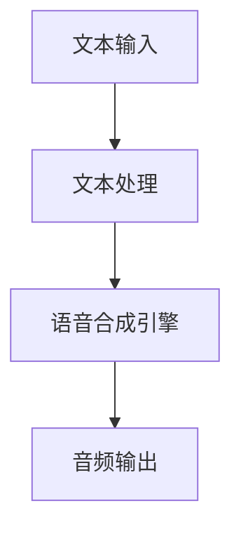
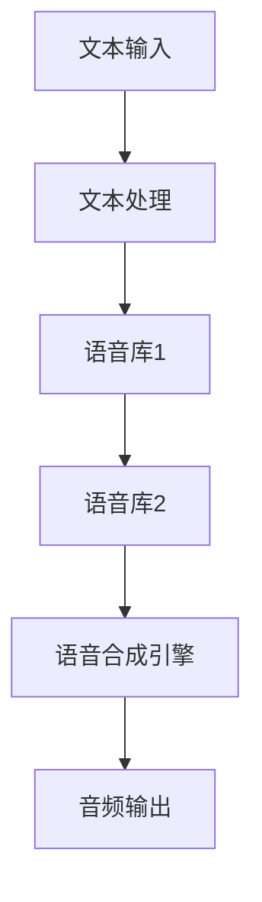
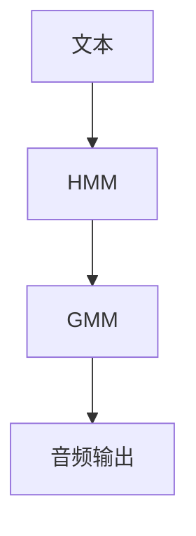
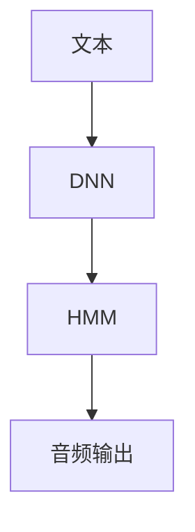
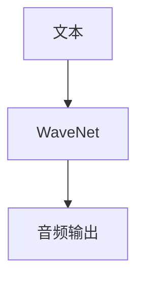
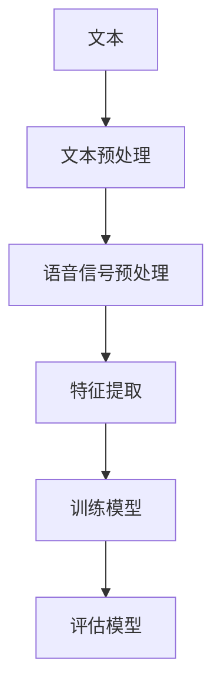
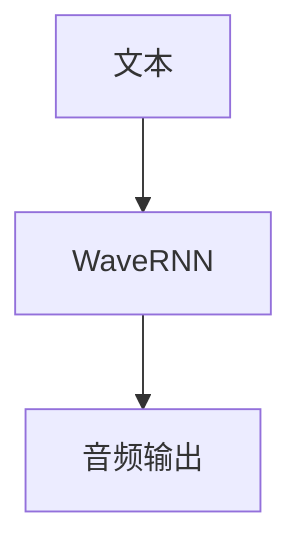
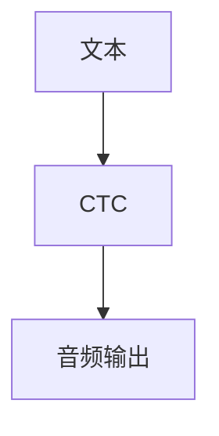
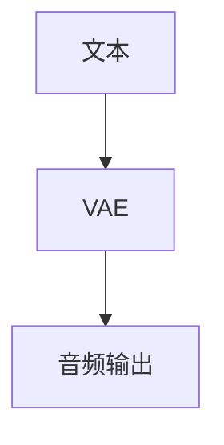

                 

### 文章标题: 《百度2024智能音箱校招语音合成面试题解析》

#### 关键词：语音合成、智能音箱、面试题、算法原理、实践案例

##### 摘要：
本文旨在为准备百度2024智能音箱校招的应聘者提供全面的语音合成面试题解析。文章首先介绍了语音合成技术的基础知识，包括其定义、发展历程、应用场景、基本原理和系统架构。随后，详细解析了语音合成领域的核心算法，如HMM-GMM、DNN-HMM和WaveNet，并运用伪代码和数学公式阐述了其工作原理。文章还针对智能音箱语音合成的应用进行深入探讨，提供了系统设计与实现的实战案例。最后，本文针对面试中的常见问题，如语音合成算法原理、性能优化策略和实际应用案例，给出了详细的解答和策略指导。希望通过本文，读者能够对语音合成技术有更深入的理解，为面试做好充分准备。

### 《百度2024智能音箱校招语音合成面试题解析》目录大纲

#### 第一部分：语音合成技术基础

##### 1.1 语音合成概述
- 1.1.1 语音合成技术的定义
- 1.1.2 语音合成技术的发展历程
- 1.1.3 语音合成的应用场景

##### 1.2 语音合成的基本原理
- 1.2.1 语音信号的产生与处理
- 1.2.2 合成语音的音质评估
- 1.2.3 合成语音的自然度评价

##### 1.3 语音合成系统架构
- 1.3.1 单声源语音合成系统
- 1.3.2 多声源语音合成系统
- 1.3.3 语音合成系统的性能优化

##### 1.4 语音合成核心算法
- 1.4.1 HMM-GMM模型
- 1.4.2 DNN-HMM模型
- 1.4.3 WaveNet模型
- 1.4.4 训练语音数据的处理

##### 1.5 语音合成技术的前沿进展
- 1.5.1 WaveRNN模型
- 1.5.2 CTC模型
- 1.5.3 变分自编码器（VAE）在语音合成中的应用

##### 1.6 语音合成技术的数学模型与公式
- 1.6.1 概率论基础
- 1.6.2 常见分布函数
- 1.6.3 贝叶斯定理
- 1.6.4 信息论基础

#### 第二部分：智能音箱语音合成应用

##### 2.1 智能音箱概述
- 2.1.1 智能音箱的定义与功能
- 2.1.2 智能音箱的市场现状与未来发展趋势
- 2.1.3 智能音箱与语音合成技术的结合

##### 2.2 智能音箱语音合成系统的设计与实现
- 2.2.1 系统架构设计
- 2.2.2 语音识别与语音合成模块
- 2.2.3 语音合成引擎的选择与优化

##### 2.3 智能音箱语音合成的实战案例
- 2.3.1 开发环境与工具介绍
- 2.3.2 案例一：基于WaveNet的智能音箱语音合成
- 2.3.3 案例二：多声源智能音箱语音合成系统

##### 2.4 智能音箱语音合成的性能优化
- 2.4.1 音质优化方法
- 2.4.2 自然度优化策略
- 2.4.3 实时性优化技巧

##### 2.5 智能音箱语音合成在智能交互中的应用
- 2.5.1 语音合成在智能客服中的应用
- 2.5.2 语音合成在智能教育中的应用
- 2.5.3 语音合成在智能娱乐中的应用

#### 第三部分：智能音箱语音合成面试题解析

##### 3.1 基础知识面试题
- 3.1.1 什么是语音合成？
- 3.1.2 语音合成的核心算法有哪些？
- 3.1.3 什么是WaveNet模型？
- 3.1.4 什么是DNN-HMM模型？

##### 3.2 技术深度面试题
- 3.2.1 请简述HMM-GMM模型的工作原理。
- 3.2.2 如何提高语音合成的音质？
- 3.2.3 请解释多声源语音合成系统的优势。
- 3.2.4 如何优化智能音箱语音合成系统的实时性？

##### 3.3 应用面试题
- 3.3.1 智能音箱语音合成在智能教育中的应用案例有哪些？
- 3.3.2 如何设计一个高效的智能音箱语音合成系统？
- 3.3.3 请简述智能音箱语音合成在智能客服中的应用。
- 3.3.4 请解释变分自编码器（VAE）在语音合成中的应用。

#### 附录

##### 附录A：常用语音合成开发工具与资源
- 1. 百度语音合成API
- 2. 美团语音合成API
- 3. 科大讯飞语音合成API
- 4. 其他语音合成开发工具

##### 附录B：面试技巧与策略
- 1. 面试前的准备工作
- 2. 面试过程中的注意事项
- 3. 面试后的复盘与总结

### 第一部分：语音合成技术基础

#### 1.1 语音合成概述

##### 1.1.1 语音合成技术的定义

语音合成（Text-to-Speech，TTS）技术是将文本转换为自然流畅的语音的技术。语音合成系统通常由文本处理、语音合成引擎和音频处理三个主要部分组成。

##### 1.1.2 语音合成技术的发展历程

语音合成技术的发展可以追溯到20世纪50年代，早期的方法主要基于规则和有限状态机。随着计算机技术的发展，80年代出现了统计模型，如隐马尔可夫模型（HMM）。进入21世纪，基于深度学习的语音合成技术取得了重大突破，如WaveNet和DNN-HMM等模型。

##### 1.1.3 语音合成的应用场景

语音合成技术广泛应用于各个领域，如智能音箱、智能客服、阅读辅助、车载语音系统、广播新闻播报等。这些应用使得语音合成技术成为了现代人工智能中不可或缺的一部分。

#### 1.2 语音合成的基本原理

##### 1.2.1 语音信号的产生与处理

语音信号的产生主要涉及声带的振动和口腔、鼻腔等器官的共鸣。语音合成系统通过分析文本，生成语音信号的声学模型，然后通过合成器将这些声学模型转换为音频信号。

##### 1.2.2 合成语音的音质评估

合成语音的音质评估主要通过主观评价和客观评价两种方式进行。主观评价通常由人类评估者对语音的自然度、清晰度、音色等指标进行评分。客观评价则使用信号处理技术，如信噪比（SNR）、共振峰频率等指标来评估语音质量。

##### 1.2.3 合成语音的自然度评价

合成语音的自然度评价主要关注语音的流畅性、自然度和情感表达。当前的研究主要集中在如何通过语音合成算法生成更自然的语音，以提高用户体验。

#### 1.3 语音合成系统架构

##### 1.3.1 单声源语音合成系统

单声源语音合成系统是指系统使用一个语音库和一个语音合成引擎来生成语音。这种系统的优点是实现简单，缺点是生成的语音可能缺乏多样性。



##### 1.3.2 多声源语音合成系统

多声源语音合成系统是指系统使用多个语音库和一个语音合成引擎来生成语音。这种系统的优点是生成的语音更自然、多样，缺点是实现复杂，需要处理多个语音库的协同问题。



##### 1.3.3 语音合成系统的性能优化

语音合成系统的性能优化主要关注实时性、音质和自然度。优化策略包括：使用更高效的算法、优化数据预处理、使用多线程或多GPU加速等。

#### 1.4 语音合成核心算法

##### 1.4.1 HMM-GMM模型

HMM-GMM模型是早期的语音合成模型，结合了隐马尔可夫模型和Gaussian Mixture Model的特点。HMM用于建模语音信号的状态转移概率，GMM用于建模语音信号的声学特征。



##### 1.4.2 DNN-HMM模型

DNN-HMM模型是结合深度神经网络和隐马尔可夫模型的语音合成模型。DNN用于预测语音信号的声学特征，HMM用于建模语音信号的状态转移概率。



##### 1.4.3 WaveNet模型

WaveNet模型是谷歌提出的基于深度学习的语音合成模型。WaveNet使用一个深度神经网络直接生成音频波形，从而生成自然的语音。



##### 1.4.4 训练语音数据的处理

训练语音数据的处理是语音合成模型训练的关键步骤。处理过程包括：文本预处理、语音信号预处理、特征提取等。



#### 1.5 语音合成技术的前沿进展

##### 1.5.1 WaveRNN模型

WaveRNN模型是对WaveNet模型的改进，通过使用循环神经网络（RNN）来提高语音合成的流畅性和自然度。



##### 1.5.2 CTC模型

CTC（Connectionist Temporal Classification）模型是一种用于语音识别的模型，也可用于语音合成。CTC模型通过预测文本和语音信号之间的直接映射关系，从而生成自然的语音。



##### 1.5.3 变分自编码器（VAE）在语音合成中的应用

变分自编码器（VAE）是一种生成模型，可用于生成高质量的语音信号。VAE在语音合成中的应用可以生成多样化的语音，提高合成语音的自然度。



#### 1.6 语音合成技术的数学模型与公式

##### 1.6.1 概率论基础

概率论是语音合成技术的基础，包括概率分布、随机变量、期望和方差等概念。

$$
P(X=x) = f(x) \cdot p(x)
$$

其中，$P(X=x)$ 表示随机变量$X$取值$x$的概率，$f(x)$ 表示随机变量$X$的概率密度函数，$p(x)$ 表示先验概率。

##### 1.6.2 常见分布函数

常见的分布函数包括高斯分布、均匀分布、泊松分布等。

- 高斯分布：

$$
f(x|\mu,\sigma^2) = \frac{1}{\sqrt{2\pi\sigma^2}} \cdot e^{-\frac{(x-\mu)^2}{2\sigma^2}}
$$

- 均匀分布：

$$
f(x|a,b) = \begin{cases}
\frac{1}{b-a} & \text{if } a \le x \le b \\
0 & \text{otherwise}
\end{cases}
$$

- 泊松分布：

$$
f(x|\lambda) = \frac{e^{-\lambda} \cdot \lambda^x}{x!}
$$

##### 1.6.3 贝叶斯定理

贝叶斯定理是概率论中的一个重要定理，用于计算后验概率。

$$
P(A|B) = \frac{P(B|A) \cdot P(A)}{P(B)}
$$

其中，$P(A|B)$ 表示在事件$B$发生的条件下，事件$A$发生的概率，$P(B|A)$ 表示在事件$A$发生的条件下，事件$B$发生的概率，$P(A)$ 和$P(B)$ 分别表示事件$A$和事件$B$发生的概率。

##### 1.6.4 信息论基础

信息论是研究信息传输和处理的理论。信息量、熵、信息增益等概念是信息论的核心。

- 信息量：

$$
I(X) = -\sum_{x \in X} P(x) \cdot \log_2 P(x)
$$

其中，$I(X)$ 表示随机变量$X$的信息量，$P(x)$ 表示随机变量$X$取值$x$的概率。

- 熵：

$$
H(X) = -\sum_{x \in X} P(x) \cdot \log_2 P(x)
$$

其中，$H(X)$ 表示随机变量$X$的熵。

- 信息增益：

$$
IG(V, A) = Entropy(V) - \sum_{v \in V} P(v) \cdot Entropy(A|V=v)
$$

其中，$IG(V, A)$ 表示特征$A$对于目标变量$V$的信息增益，$Entropy(V)$ 表示目标变量$V$的熵，$Entropy(A|V=v)$ 表示在给定$V=v$的条件下，特征$A$的熵。

### 第二部分：智能音箱语音合成应用

#### 2.1 智能音箱概述

##### 2.1.1 智能音箱的定义与功能

智能音箱是一种搭载人工智能技术的家用智能设备，可以通过语音命令控制音乐播放、信息查询、智能家居控制等功能。智能音箱的核心在于其语音识别和语音合成技术，能够实现人与智能设备的自然交互。

##### 2.1.2 智能音箱的市场现状与未来发展趋势

智能音箱市场近年来发展迅速，已成为智能家居的重要组成部分。未来，随着人工智能技术的进一步发展，智能音箱的功能将更加丰富，市场前景广阔。

##### 2.1.3 智能音箱与语音合成技术的结合

智能音箱的语音合成技术是其核心功能之一。通过语音合成技术，智能音箱能够将文本信息转化为自然流畅的语音，为用户提供更好的用户体验。

#### 2.2 智能音箱语音合成系统的设计与实现

##### 2.2.1 系统架构设计

智能音箱语音合成系统的架构通常包括文本输入、文本处理、语音合成引擎和音频输出等模块。以下是系统架构的示意图：


##### 2.2.2 语音识别与语音合成模块

语音识别模块用于将用户的语音指令转换为文本，而语音合成模块则将文本转换为语音输出。这两个模块通常是协同工作的，以确保用户指令的准确理解和响应。

##### 2.2.3 语音合成引擎的选择与优化

选择合适的语音合成引擎对智能音箱的性能至关重要。常见的语音合成引擎包括基于规则的方法、基于统计的方法和基于深度学习的方法。不同方法的优缺点如下：

- **基于规则的方法**：实现简单，但生成的语音缺乏自然度。
- **基于统计的方法**：如HMM-GMM、DNN-HMM等，生成的语音自然度较高，但需要大量的语音数据。
- **基于深度学习的方法**：如WaveNet、WaveRNN等，生成的语音自然度最高，但计算资源需求大。

根据实际需求，可以选择合适的语音合成引擎，并进行优化以提升性能。

#### 2.3 智能音箱语音合成的实战案例

##### 2.3.1 开发环境与工具介绍

在开发智能音箱语音合成系统时，需要选择合适的开发环境和工具。以下是一些常用的开发工具：

- **开发环境**：Python、Java、C++等。
- **语音合成引擎**：百度语音合成API、科大讯飞语音合成API等。
- **音频处理库**：如Pydub、ffmpeg等。

##### 2.3.2 案例一：基于WaveNet的智能音箱语音合成

在本案例中，我们使用WaveNet模型构建一个智能音箱语音合成系统。以下是实现步骤：

1. **环境准备**：安装Python和相关依赖库。
2. **数据准备**：收集大量语音数据，进行预处理。
3. **模型训练**：使用预处理后的语音数据训练WaveNet模型。
4. **模型评估**：使用测试数据评估模型性能。
5. **模型部署**：将训练好的模型部署到智能音箱中。

以下是模型训练的伪代码：

```python
import tensorflow as tf
from wavenet import WaveNet

# 加载语音数据
data = load_data()

# 划分训练集和测试集
train_data, test_data = split_data(data)

# 创建WaveNet模型
model = WaveNet()

# 训练模型
model.train(train_data)

# 评估模型
model.evaluate(test_data)
```

##### 2.3.3 案例二：多声源智能音箱语音合成系统

在本案例中，我们构建一个支持多声源的智能音箱语音合成系统。以下是实现步骤：

1. **环境准备**：安装Python和相关依赖库。
2. **数据准备**：收集多个声源的语音数据，进行预处理。
3. **模型训练**：使用预处理后的语音数据训练多声源WaveNet模型。
4. **模型评估**：使用测试数据评估模型性能。
5. **模型部署**：将训练好的模型部署到智能音箱中。

以下是模型训练的伪代码：

```python
import tensorflow as tf
from multi_source_wavenet import MultiSourceWaveNet

# 加载多声源语音数据
multi_source_data = load_multi_source_data()

# 划分训练集和测试集
train_data, test_data = split_data(multi_source_data)

# 创建多声源WaveNet模型
model = MultiSourceWaveNet()

# 训练模型
model.train(train_data)

# 评估模型
model.evaluate(test_data)
```

#### 2.4 智能音箱语音合成的性能优化

##### 2.4.1 音质优化方法

为了提高智能音箱语音合成的音质，可以采用以下方法：

- **增强语音信号**：使用语音增强技术，如噪声抑制、共振峰增强等。
- **优化音频处理**：使用高质量的音频处理库，如ffmpeg，提高音频输出质量。
- **提高模型精度**：使用更先进的语音合成模型，如WaveRNN，提高合成语音的音质。

##### 2.4.2 自然度优化策略

为了提高智能音箱语音合成的自然度，可以采用以下策略：

- **丰富语音数据**：收集更多样化的语音数据，包括不同说话人、不同情绪的语音。
- **改进文本处理**：优化文本预处理流程，包括分词、语调预测等，以提高合成语音的自然度。
- **使用注意力机制**：在语音合成模型中引入注意力机制，使模型能够更好地关注文本中的重要信息。

##### 2.4.3 实时性优化技巧

为了提高智能音箱语音合成的实时性，可以采用以下技巧：

- **优化模型结构**：设计更高效的模型结构，减少计算复杂度。
- **使用GPU加速**：使用GPU进行模型训练和推理，提高计算速度。
- **批处理**：在模型训练和推理过程中使用批处理，提高处理效率。

#### 2.5 智能音箱语音合成在智能交互中的应用

##### 2.5.1 语音合成在智能客服中的应用

在智能客服中，语音合成技术可用于将文本信息转化为语音响应，提高客服的效率和用户体验。以下是一个简单的应用示例：

```python
import pyttsx3

# 初始化语音合成引擎
engine = pyttsx3.init()

# 设置语音合成引擎的语音库
engine.setProperty('voice', 'Samantha')

# 输入文本
text = "您好，有什么可以帮助您的吗？"

# 合成语音
engine.say(text)

# 播放语音
engine.runAndWait()
```

##### 2.5.2 语音合成在智能教育中的应用

在智能教育中，语音合成技术可用于生成自动讲解、朗读文本等功能，提高学生的学习效果。以下是一个简单的应用示例：

```python
import pyttsx3

# 初始化语音合成引擎
engine = pyttsx3.init()

# 设置语音合成引擎的语音库
engine.setProperty('voice', 'Mozilla David')

# 输入文本
text = "今天我们学习计算机编程的基础知识。"

# 合成语音
engine.say(text)

# 播放语音
engine.runAndWait()
```

##### 2.5.3 语音合成在智能娱乐中的应用

在智能娱乐中，语音合成技术可用于生成角色语音、背景解说等功能，提高游戏的趣味性和互动性。以下是一个简单的应用示例：

```python
import pyttsx3

# 初始化语音合成引擎
engine = pyttsx3.init()

# 设置语音合成引擎的语音库
engine.setProperty('voice', 'Demia')

# 输入文本
text = "欢迎进入游戏，祝你玩得开心！"

# 合成语音
engine.say(text)

# 播放语音
engine.runAndWait()
```

### 第三部分：智能音箱语音合成面试题解析

#### 3.1 基础知识面试题

##### 3.1.1 什么是语音合成？

语音合成（Text-to-Speech，TTS）技术是将文本转换为自然流畅的语音的技术。语音合成系统通常由文本处理、语音合成引擎和音频处理三个主要部分组成。

##### 3.1.2 语音合成的核心算法有哪些？

语音合成的核心算法包括：

- **基于规则的方法**：通过编写规则将文本转换为语音。
- **基于统计的方法**：如HMM-GMM、DNN-HMM等，通过统计模型将文本转换为语音。
- **基于深度学习的方法**：如WaveNet、WaveRNN等，通过深度神经网络将文本转换为语音。

##### 3.1.3 什么是WaveNet模型？

WaveNet是一种基于深度学习的语音合成模型，由谷歌提出。WaveNet使用一个深度神经网络直接生成音频波形，从而生成自然的语音。

##### 3.1.4 什么是DNN-HMM模型？

DNN-HMM模型是结合深度神经网络和隐马尔可夫模型的语音合成模型。DNN用于预测语音信号的声学特征，HMM用于建模语音信号的状态转移概率。

#### 3.2 技术深度面试题

##### 3.2.1 请简述HMM-GMM模型的工作原理。

HMM-GMM模型是结合隐马尔可夫模型（HMM）和高斯混合模型（GMM）的语音合成模型。HMM用于建模语音信号的状态转移概率，GMM用于建模语音信号的声学特征。具体原理如下：

1. **状态转移概率**：HMM假设语音信号由一系列状态组成，每个状态对应一个语音单元。状态转移概率描述了从一个状态转移到另一个状态的概率。
2. **观察概率**：GMM用于建模语音信号的声学特征。每个状态对应一个GMM模型，用于生成语音信号的声学特征概率分布。
3. **语音合成**：在给定文本的情况下，HMM-GMM模型通过计算每个状态的概率分布，生成语音信号。

##### 3.2.2 如何提高语音合成的音质？

提高语音合成的音质可以从以下几个方面入手：

1. **增强语音信号**：使用语音增强技术，如噪声抑制、共振峰增强等，提高语音信号的清晰度。
2. **优化音频处理**：使用高质量的音频处理库，如ffmpeg，提高音频输出质量。
3. **提高模型精度**：使用更先进的语音合成模型，如WaveRNN，提高合成语音的音质。
4. **丰富语音数据**：收集更多样化的语音数据，包括不同说话人、不同情绪的语音。

##### 3.2.3 请解释多声源语音合成系统的优势。

多声源语音合成系统相比于单声源语音合成系统有以下优势：

1. **更自然的语音**：多声源可以模拟不同说话人的语音，生成更自然的语音。
2. **更丰富的语音表现**：多声源可以同时生成多个语音，实现语音的多样化，如对话、合唱等。
3. **更好的语音识别效果**：多声源语音合成系统可以降低单个语音的识别难度，提高语音识别的准确性。

##### 3.2.4 如何优化智能音箱语音合成系统的实时性？

优化智能音箱语音合成系统的实时性可以从以下几个方面入手：

1. **优化模型结构**：设计更高效的模型结构，减少计算复杂度。
2. **使用GPU加速**：使用GPU进行模型训练和推理，提高计算速度。
3. **批处理**：在模型训练和推理过程中使用批处理，提高处理效率。
4. **优化数据预处理**：优化数据预处理流程，减少预处理时间。

#### 3.3 应用面试题

##### 3.3.1 智能音箱语音合成在智能教育中的应用案例有哪些？

智能音箱语音合成在智能教育中的应用案例包括：

1. **自动讲解**：智能音箱可以朗读教材内容，帮助学生理解知识。
2. **朗读练习**：智能音箱可以提供朗读练习，帮助学生提高语音表达能力。
3. **辅助学习**：智能音箱可以提供学习建议、解题指导等辅助功能。

##### 3.3.2 如何设计一个高效的智能音箱语音合成系统？

设计一个高效的智能音箱语音合成系统可以从以下几个方面入手：

1. **选择合适的语音合成引擎**：根据实际需求，选择适合的语音合成引擎，如基于规则的方法、基于统计的方法或基于深度学习的方法。
2. **优化模型结构**：设计高效的模型结构，减少计算复杂度。
3. **优化数据预处理**：优化数据预处理流程，减少预处理时间。
4. **使用GPU加速**：使用GPU进行模型训练和推理，提高计算速度。

##### 3.3.3 请简述智能音箱语音合成在智能客服中的应用。

智能音箱语音合成在智能客服中的应用包括：

1. **自动回答**：智能音箱可以自动回答用户的问题，提高客服效率。
2. **语音咨询**：智能音箱可以提供语音咨询服务，如天气预报、路况查询等。
3. **语音交互**：智能音箱可以与用户进行语音交互，实现智能对话。

##### 3.3.4 请解释变分自编码器（VAE）在语音合成中的应用。

变分自编码器（VAE）是一种生成模型，可以用于生成高质量的语音信号。VAE在语音合成中的应用主要包括：

1. **语音生成**：VAE可以生成高质量的语音信号，提高合成语音的自然度。
2. **语音风格转换**：VAE可以改变语音的风格，如从男声转换为女声。
3. **语音增强**：VAE可以增强语音信号的清晰度，提高语音的识别效果。

### 附录

#### 附录A：常用语音合成开发工具与资源

以下是一些常用的语音合成开发工具与资源：

1. **百度语音合成API**：百度提供的语音合成API，支持多种语音风格和语速调整。
2. **科大讯飞语音合成API**：科大讯飞提供的语音合成API，支持多种语音风格和方言。
3. **美团语音合成API**：美团提供的语音合成API，支持实时语音合成和批量语音合成。
4. **其他语音合成开发工具**：如pyttsx3、gtts等，支持Python编程语言。

#### 附录B：面试技巧与策略

以下是一些面试技巧与策略，帮助应聘者更好地准备智能音箱语音合成面试：

1. **熟悉基础知识**：掌握语音合成的基本概念、原理和算法，如HMM、GMM、DNN、WaveNet等。
2. **了解前沿技术**：关注语音合成领域的前沿技术，如WaveRNN、CTC、VAE等。
3. **实战经验**：通过实际项目，熟悉语音合成系统的设计与实现过程，如开发环境搭建、模型训练和优化等。
4. **准备案例分析**：准备一些语音合成在智能音箱、智能客服、智能教育等领域的应用案例，以展示自己的实际应用能力。
5. **掌握面试技巧**：在面试过程中，注意表达清晰、逻辑严密，对问题进行充分思考，展示自己的技术深度和解决问题的能力。
6. **复盘与总结**：面试结束后，及时复盘和总结，从失败中吸取教训，从成功中总结经验，不断提升自己的面试技巧。

### 总结

本文全面解析了智能音箱语音合成技术，从基础概念到核心算法，再到实际应用，提供了详细的讲解和实战案例。同时，针对百度2024智能音箱校招的面试题，给出了详细的解答和策略指导。希望本文能够帮助读者深入了解智能音箱语音合成技术，为面试做好充分准备。在未来的发展中，智能音箱语音合成技术将不断创新和进步，为我们的生活带来更多便利。让我们一起期待这一激动人心的未来！

