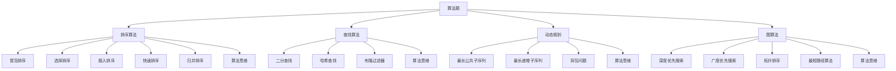

                 

### 文章标题

《百度2025届校招算法工程师面试真题解密》

#### 关键词：
- 百度校招
- 算法工程师面试
- 面试题解
- 算法原理
- 技术实战

#### 摘要：
本文将深入解析百度2025届校招算法工程师面试真题，涵盖算法题、数据结构题、系统设计与架构题、机器学习与深度学习题、编程语言基础题等五大类。通过详细解题过程和实战案例，帮助读者全面理解面试真题，提升面试技巧，为成功斩获百度offer奠定基础。

### 第一部分：面试真题概述

#### 1.1 面试真题分类概述

在百度2025届校招算法工程师面试中，真题主要分为以下五类：

1. **算法题**：考察考生对算法设计和实现的掌握程度，包括排序、查找、动态规划、图算法等。
2. **数据结构题**：考察考生对数据结构的理解和运用能力，包括线性表、树与图、哈希表等。
3. **系统设计与架构题**：考察考生对分布式系统设计、缓存系统设计、负载均衡等领域的理解。
4. **机器学习与深度学习题**：考察考生对机器学习、深度学习算法原理和应用的理解，包括监督学习、无监督学习、深度学习等。
5. **编程语言基础题**：考察考生对编程语言基础知识的掌握，包括C/C++、Java、Python等。

#### 1.2 面试真题分布与难度

1. **真题来源**：

   - **百度内部面试**：百度内部面试题往往较为新颖，注重考察考生对核心算法和技术的理解。
   - **百度历年校招面试**：历年校招面试题具有较高的参考价值，可以总结出一定的出题规律。
   - **网络公开题目**：部分面试题来源于网络公开资料，如LeetCode、牛客网等。

2. **难度分析**：

   - **算法题和数据结构题**：以基础题为主，部分涉及中高难度，重点考察考生的算法思维和编程能力。
   - **系统设计与架构题**：考核考生对系统设计原则的理解和实践能力，难度相对较高。
   - **机器学习与深度学习题**：结合实际业务场景，考核考生对算法原理和应用的理解，难度较大。
   - **编程语言基础题**：检验考生对编程语言的掌握程度，难度适中。

### 第二部分：面试真题详解

#### 第1章：算法题解析

算法题是面试中的重点，以下将详细介绍常见的排序算法、查找算法、动态规划、图算法等内容。

#### 1.1 排序算法

1. **冒泡排序**：

   - **原理**：通过重复地遍历待排序的元素列表，比较相邻的两个元素，若它们的顺序错误就交换它们，直到没有需要交换的元素为止。
   - **伪代码**：
     ```python
     for i in range(len(arr)):
         for j in range(len(arr) - i - 1):
             if arr[j] > arr[j + 1]:
                 arr[j], arr[j + 1] = arr[j + 1], arr[j]
     ```

2. **选择排序**：

   - **原理**：首先在未排序序列中找到最小（大）元素，存放到排序序列的起始位置，然后，再从剩余未排序元素中继续寻找最小（大）元素，然后放到已排序序列的末尾。
   - **伪代码**：
     ```python
     for i in range(len(arr)):
         min_idx = i
         for j in range(i+1, len(arr)):
             if arr[min_idx] > arr[j]:
                 min_idx = j
         arr[i], arr[min_idx] = arr[min_idx], arr[i]
     ```

3. **插入排序**：

   - **原理**：将一个记录插入到已经排好序的有序表中，从而得到一个新的、记录数增加1的有序表。
   - **伪代码**：
     ```python
     for i in range(1, len(arr)):
         key = arr[i]
         j = i - 1
         while j >= 0 and key < arr[j]:
             arr[j + 1] = arr[j]
             j -= 1
         arr[j + 1] = key
     ```

4. **快速排序**：

   - **原理**：通过一趟排序将待排序的记录分割成独立的两部分，其中一部分记录的关键字均比另一部分的关键字小，然后分别对这两部分记录继续进行排序，以达到整个序列有序。
   - **伪代码**：
     ```python
     def quick_sort(arr, low, high):
         if low < high:
             pi = partition(arr, low, high)
             quick_sort(arr, low, pi - 1)
             quick_sort(arr, pi + 1, high)

     def partition(arr, low, high):
         pivot = arr[high]
         i = low - 1
         for j in range(low, high):
             if arr[j] < pivot:
                 i += 1
                 arr[i], arr[j] = arr[j], arr[i]
         arr[i + 1], arr[high] = arr[high], arr[i + 1]
         return i + 1
     ```

5. **归并排序**：

   - **原理**：将待排序的序列按照某种方法分割成若干个子序列，分别对各子序列进行排序，然后取个子的子序列合并成一个新的序列。
   - **伪代码**：
     ```python
     def merge_sort(arr):
         if len(arr) > 1:
             mid = len(arr) // 2
             left = arr[:mid]
             right = arr[mid:]

             merge_sort(left)
             merge_sort(right)

             i = j = k = 0
             while i < len(left) and j < len(right):
                 if left[i] < right[j]:
                     arr[k] = left[i]
                     i += 1
                 else:
                     arr[k] = right[j]
                     j += 1
                 k += 1

             while i < len(left):
                 arr[k] = left[i]
                 i += 1
                 k += 1

             while j < len(right):
                 arr[k] = right[j]
                 j += 1
                 k += 1
     ```

#### 1.2 查找算法

1. **二分查找**：

   - **原理**：通过重复将查找区间二分，逐步缩小查找范围，直至找到目标元素或确定元素不存在。
   - **伪代码**：
     ```python
     def binary_search(arr, target):
         low = 0
         high = len(arr) - 1
         while low <= high:
             mid = (low + high) // 2
             if arr[mid] == target:
                 return mid
             elif arr[mid] < target:
                 low = mid + 1
             else:
                 high = mid - 1
         return -1
     ```

2. **哈希查找**：

   - **原理**：利用哈希函数将关键字转换成数组索引，直接访问目标元素。
   - **伪代码**：
     ```python
     def hash_search(hash_table, key):
         index = hash(key) % len(hash_table)
         return hash_table[index]
     ```

3. **布隆过滤器**：

   - **原理**：通过一系列哈希函数将关键字映射到布隆过滤器中，用于判断元素是否存在于集合中。
   - **伪代码**：
     ```python
     def add_to_bloom_filter(bloom_filter, key):
         for hash_function in hash_functions:
             index = hash_function(key) % len(bloom_filter)
             bloom_filter[index] = 1

     def is_in_bloom_filter(bloom_filter, key):
         for hash_function in hash_functions:
             index = hash_function(key) % len(bloom_filter)
             if bloom_filter[index] == 0:
                 return False
         return True
     ```

#### 1.3 动态规划

1. **最长公共子序列**：

   - **原理**：找到两个序列中最长的公共子序列，使用二维数组存储子问题的解。
   - **伪代码**：
     ```python
     def longest_common_subsequence(X, Y):
         m, n = len(X), len(Y)
         dp = [[0] * (n + 1) for _ in range(m + 1)]

         for i in range(1, m + 1):
             for j in range(1, n + 1):
                 if X[i - 1] == Y[j - 1]:
                     dp[i][j] = dp[i - 1][j - 1] + 1
                 else:
                     dp[i][j] = max(dp[i - 1][j], dp[i][j - 1])

         return dp[m][n]
     ```

2. **最长递增子序列**：

   - **原理**：找到序列中最长的递增子序列，使用一维数组存储子问题的解。
   - **伪代码**：
     ```python
     def longest_increasing_subsequence(arr):
         n = len(arr)
         dp = [1] * n

         for i in range(1, n):
             for j in range(i):
                 if arr[i] > arr[j]:
                     dp[i] = max(dp[i], dp[j] + 1)

         return max(dp)
     ```

3. **背包问题**：

   - **原理**：给定一组物品和它们的重量以及价值，求解如何选择其中的若干物品使得总价值最大，同时不超过总重量限制。
   - **伪代码**：
     ```python
     def knapsack(W, wt, val, n):
         dp = [[0] * (W + 1) for _ in range(n + 1)]

         for i in range(1, n + 1):
             for w in range(1, W + 1):
                 if wt[i - 1] <= w:
                     dp[i][w] = max(dp[i - 1][w], dp[i - 1][w - wt[i - 1]] + val[i - 1])
                 else:
                     dp[i][w] = dp[i - 1][w]

         return dp[n][W]
     ```

#### 1.4 图算法

1. **深度优先搜索（DFS）**：

   - **原理**：从初始节点开始，沿着某一方向搜索，当到达一个节点时，沿着该方向继续搜索，直到到达终点或找到目标节点。
   - **伪代码**：
     ```python
     def dfs(graph, node, visited):
         visited.add(node)
         for neighbor in graph[node]:
             if neighbor not in visited:
                 dfs(graph, neighbor, visited)
     ```

2. **广度优先搜索（BFS）**：

   - **原理**：从初始节点开始，按照层次遍历图中的节点，先访问起始节点，然后依次访问它的邻接节点，再访问邻接节点的邻接节点。
   - **伪代码**：
     ```python
     from collections import deque

     def bfs(graph, start):
         visited = set()
         queue = deque([start])
         while queue:
             node = queue.popleft()
             if node not in visited:
                 visited.add(node)
                 for neighbor in graph[node]:
                     queue.append(neighbor)
     ```

3. **拓扑排序**：

   - **原理**：将无环的有向图进行排序，使得每个顶点在排序中只出现一次，且顶点i只排在它的直接后继顶点j之前。
   - **伪代码**：
     ```python
     def topological_sort(DAG):
         in_degree = {node: 0 for node in DAG}
         for node in DAG:
             for neighbor in DAG[node]:
                 in_degree[neighbor] += 1

         queue = deque([node for node in in_degree if in_degree[node] == 0])
         sorted_order = []

         while queue:
             node = queue.popleft()
             sorted_order.append(node)
             for neighbor in DAG[node]:
                 in_degree[neighbor] -= 1
                 if in_degree[neighbor] == 0:
                     queue.append(neighbor)

         return sorted_order
     ```

4. **最短路径算法**：

   - **原理**：求解图中两点之间的最短路径，常用的算法有迪杰斯特拉算法（Dijkstra）和贝尔曼-福特算法（Bellman-Ford）。
   - **伪代码**：
     ```python
     def dijkstra(graph, start):
         distances = {node: float('infinity') for node in graph}
         distances[start] = 0
         visited = set()

         while visited != set(graph):
             unvisited = set(graph) - visited
             min_distance = float('infinity')
             current = None
             for node in unvisited:
                 if distances[node] < min_distance:
                     min_distance = distances[node]
                     current = node
             visited.add(current)
             for neighbor, weight in graph[current].items():
                 if distances[current] + weight < distances[neighbor]:
                     distances[neighbor] = distances[current] + weight

         return distances

     def bellman_ford(graph, start):
         distances = {node: float('infinity') for node in graph}
         distances[start] = 0

         for _ in range(len(graph) - 1):
             for u in graph:
                 for v in graph[u]:
                     if distances[u] + graph[u][v] < distances[v]:
                         distances[v] = distances[u] + graph[u][v]

         for u in graph:
             for v in graph[u]:
                 if distances[u] + graph[u][v] < distances[v]:
                     raise ValueError("Graph contains a negative weight cycle")

         return distances
     ```

### 第2章：数据结构题解析

数据结构是算法实现的基础，以下将详细介绍常见的线性表、树与图、哈希表等内容。

#### 2.1 线性表

1. **数组**：

   - **原理**：数组是一种线性表的数据结构，它使用连续的内存空间存储元素，提供随机访问的能力。
   - **应用**：用于存储和查找大量数据，如排序、查找等算法。
   - **示例**：
     ```python
     arr = [1, 2, 3, 4, 5]
     print(arr[2])  # 输出：3
     ```

2. **链表**：

   - **原理**：链表是一种由节点组成的线性表，每个节点包含数据和指向下一个节点的指针。
   - **应用**：用于实现动态数据结构，如队列、栈等。
   - **示例**：
     ```python
     class Node:
         def __init__(self, data):
             self.data = data
             self.next = None

     head = Node(1)
     second = Node(2)
     third = Node(3)

     head.next = second
     second.next = third

     current = head
     while current:
         print(current.data, end=' ')
         current = current.next
     ```

3. **栈**：

   - **原理**：栈是一种后进先出（LIFO）的数据结构，只能在表的一端进行插入和删除操作。
   - **应用**：用于实现递归、回溯等算法。
   - **示例**：
     ```python
     class Stack:
         def __init__(self):
             self.items = []

         def is_empty(self):
             return len(self.items) == 0

         def push(self, item):
             self.items.append(item)

         def pop(self):
             return self.items.pop()

     stack = Stack()
     stack.push(1)
     stack.push(2)
     stack.push(3)
     print(stack.pop())  # 输出：3
     ```

4. **队列**：

   - **原理**：队列是一种先进先出（FIFO）的数据结构，在表的一端插入元素，在另一端删除元素。
   - **应用**：用于实现缓冲区、任务调度等算法。
   - **示例**：
     ```python
     from collections import deque

     queue = deque()
     queue.append(1)
     queue.append(2)
     queue.append(3)
     print(queue.popleft())  # 输出：1
     ```

#### 2.2 树与图

1. **二叉树**：

   - **原理**：二叉树是一种特殊的树结构，每个节点最多有两个子节点，通常称为左子节点和右子节点。
   - **应用**：用于实现排序、查找、遍历等算法。
   - **示例**：
     ```python
     class TreeNode:
         def __init__(self, data):
             self.data = data
             self.left = None
             self.right = None

     root = TreeNode(1)
     root.left = TreeNode(2)
     root.right = TreeNode(3)
     root.left.left = TreeNode(4)
     root.left.right = TreeNode(5)

     def inorder_traversal(root):
         if root:
             inorder_traversal(root.left)
             print(root.data, end=' ')
             inorder_traversal(root.right)

     inorder_traversal(root)  # 输出：4 2 5 1 3
     ```

2. **平衡二叉树（AVL树）**：

   - **原理**：平衡二叉树是一种自平衡的二叉搜索树，通过调整树的高度保持平衡。
   - **应用**：用于实现高效的排序、查找等算法。
   - **示例**：
     ```python
     class AVLTree:
         def __init__(self):
             self.root = None

         def insert(self, data):
             self.root = self._insert(self.root, data)

         def _insert(self, root, data):
             if root is None:
                 return TreeNode(data)
             if data < root.data:
                 root.left = self._insert(root.left, data)
             else:
                 root.right = self._insert(root.right, data)
             return self._balance(root)

         def _balance(self, root):
             # 调整树的高度，保持平衡
             pass

     tree = AVLTree()
     tree.insert(1)
     tree.insert(2)
     tree.insert(3)
     ```

3. **红黑树**：

   - **原理**：红黑树是一种自平衡的二叉搜索树，通过旋转和染色操作保持树的平衡。
   - **应用**：用于实现高效的排序、查找等算法。
   - **示例**：
     ```python
     class RedBlackTree:
         def __init__(self):
             self.root = None

         def insert(self, data):
             self.root = self._insert(self.root, data)

         def _insert(self, root, data):
             # 插入节点，调整树的高度和颜色
             pass

         def _balance(self, root):
             # 调整树的高度和颜色
             pass

     tree = RedBlackTree()
     tree.insert(1)
     tree.insert(2)
     tree.insert(3)
     ```

4. **图的基本操作**：

   - **原理**：图是一种由节点和边组成的数据结构，可以表示复杂的关系。
   - **应用**：用于实现路径查找、最短路径等算法。
   - **示例**：
     ```python
     class Graph:
         def __init__(self):
             self.vertices = {}
             self.edges = {}

         def add_vertex(self, vertex):
             self.vertices[vertex] = []

         def add_edge(self, u, v):
             self.edges[u].append(v)
             self.edges[v].append(u)

         def neighbors(self, vertex):
             return self.vertices[vertex]

     graph = Graph()
     graph.add_vertex(1)
     graph.add_vertex(2)
     graph.add_vertex(3)
     graph.add_edge(1, 2)
     graph.add_edge(2, 3)
     print(graph.neighbors(1))  # 输出：[2, 3]
     ```

#### 2.3 哈希表

1. **哈希表原理**：

   - **原理**：哈希表是一种利用哈希函数将关键字映射到数组索引的数据结构，可以用于快速的查找和插入操作。
   - **应用**：用于实现字典、缓存等数据结构。

2. **哈希冲突解决**：

   - **原理**：当多个关键字映射到同一数组索引时，需要采用某种方法解决冲突。
   - **方法**：链地址法、开放地址法、再哈希法等。

   ```python
   class HashTable:
       def __init__(self, size):
           self.size = size
           self.table = [None] * size

       def hash_function(self, key):
           return key % self.size

       def insert(self, key, value):
           index = self.hash_function(key)
           if self.table[index] is None:
               self.table[index] = [(key, value)]
           else:
               for k, v in self.table[index]:
                   if k == key:
                       self.table[index].remove((k, v))
                       self.table[index].append((key, value))
                       return
               self.table[index].append((key, value))

       def get(self, key):
           index = self.hash_function(key)
           if self.table[index] is None:
               return None
           for k, v in self.table[index]:
               if k == key:
                   return v
           return None
   ```

### 第3章：系统设计与架构题解析

系统设计与架构题考察考生对分布式系统、缓存系统、负载均衡等领域的理解和设计能力。

#### 3.1 分布式系统设计

1. **一致性算法**：

   - **原理**：分布式系统中的多个节点需要保持数据的一致性，一致性算法是实现这一目标的方法。
   - **方法**：Paxos算法、Raft算法等。

   ```python
   # Paxos算法伪代码
   class Paxos:
       def prepare(self, proposal_id):
           # 发送prepare请求到其他节点
           pass

       def promise(self, proposal_id, leader_id):
           # 发送promise响应到其他节点
           pass

       def accept(self, proposal_id, value):
           # 发送accept请求到其他节点
           pass

       def learned(self, proposal_id, value):
           # 更新本地状态
           pass
   ```

2. **分布式锁**：

   - **原理**：分布式锁用于在分布式系统中保证对共享资源的互斥访问。
   - **方法**：基于Zookeeper、基于Redis等。

   ```python
   # 基于Zookeeper的分布式锁伪代码
   class DistributedLock:
       def __init__(self, lock_name):
           self.lock_name = lock_name
           self.zk = Zookeeper()

       def acquire(self):
           # 尝试获取锁
           pass

       def release(self):
           # 释放锁
           pass
   ```

3. **分布式事务**：

   - **原理**：分布式事务是保证分布式系统中多个节点之间操作的一致性。
   - **方法**：两阶段提交、最终一致性等。

   ```python
   # 两阶段提交伪代码
   class TwoPhaseCommit:
       def prepare(self):
           # 向所有参与者发送prepare请求
           pass

       def commit(self):
           # 收到所有参与者的准备响应后，执行提交操作
           pass

       def abort(self):
           # 收到任意一个参与者的失败响应后，执行回滚操作
           pass
   ```

4. **分布式存储**：

   - **原理**：分布式存储是将数据分布在多个节点上，提供高可用性和高扩展性。
   - **方法**：GFS、HDFS、Cassandra等。

   ```python
   # HDFS伪代码
   class HDFS:
       def create_file(self, filename):
           # 创建文件
           pass

       def write_file(self, filename, data):
           # 向文件写入数据
           pass

       def read_file(self, filename):
           # 从文件读取数据
           pass
   ```

#### 3.2 缓存系统设计

1. **缓存一致性**：

   - **原理**：缓存一致性是指保证缓存中的数据和主存储中的数据保持一致。
   - **方法**：缓存一致性协议、缓存同步机制等。

   ```python
   # 缓存一致性协议伪代码
   class CacheConsistency:
       def get(self, key):
           # 从缓存中获取数据
           pass

       def set(self, key, value):
           # 将数据写入缓存
           pass

       def update_master(self, key, value):
           # 更新主存储中的数据
           pass
   ```

2. **缓存失效策略**：

   - **原理**：缓存失效策略是指缓存中的数据何时过期或替换。
   - **方法**：LRU（Least Recently Used）、LFU（Least Frequently Used）等。

   ```python
   # LRU缓存伪代码
   class LRUCache:
       def __init__(self, capacity):
           self.capacity = capacity
           self.cache = {}
           self.queue = deque()

       def get(self, key):
           # 从缓存中获取数据
           pass

       def put(self, key, value):
           # 将数据写入缓存
           pass
   ```

#### 3.3 负载均衡

1. **负载均衡算法**：

   - **原理**：负载均衡是将请求分发到多个服务器，以避免单个服务器过载。
   - **方法**：轮询、随机、最小连接数等。

   ```python
   # 轮询负载均衡伪代码
   class RoundRobinBalancer:
       def __init__(self, servers):
           self.servers = servers
           self.current_server = 0

       def select_server(self):
           server = self.servers[self.current_server]
           self.current_server = (self.current_server + 1) % len(self.servers)
           return server
   ```

2. **负载均衡器设计**：

   - **原理**：负载均衡器是负责将请求分发到后端服务器的设备或软件。
   - **设计**：基于硬件的负载均衡器、基于软件的负载均衡器等。

   ```python
   # 基于软件的负载均衡器伪代码
   class SoftwareLoadBalancer:
       def __init__(self, servers):
           self.servers = servers

       def handle_request(self, request):
           server = self.select_server()
           return server.handle_request(request)
   ```

### 第4章：机器学习与深度学习题解析

机器学习与深度学习题考察考生对机器学习、深度学习算法原理和应用的理解。

#### 4.1 监督学习

1. **线性回归**：

   - **原理**：通过拟合一个线性函数来预测连续值。
   - **模型**：
     $$y = w_0 + w_1 \cdot x_1 + w_2 \cdot x_2 + \ldots + w_n \cdot x_n$$
   - **优化**：使用梯度下降法求解参数。
   - **示例**：
     ```python
     def linear_regression(X, y):
         m, n = len(X), len(X[0])
         theta = [0] * n
         alpha = 0.01
         num_iterations = 1000

         for _ in range(num_iterations):
             errors = [y[i] - (theta[0] + sum(theta[j] * xij for j, xij in enumerate(X[i]))) for i in range(m)]
             gradients = [-sum(xij * error for xij, error in zip(X[i], errors)) for i in range(m)]

             theta = [theta[i] - alpha * gradients[i] for i in range(n)]

         return theta
     ```

2. **逻辑回归**：

   - **原理**：通过拟合一个逻辑函数来预测二分类问题。
   - **模型**：
     $$\sigma(w_0 + w_1 \cdot x_1 + w_2 \cdot x_2 + \ldots + w_n \cdot x_n)$$
   - **优化**：使用梯度下降法求解参数。
   - **示例**：
     ```python
     def logistic_regression(X, y):
         m, n = len(X), len(X[0])
         theta = [0] * n
         alpha = 0.01
         num_iterations = 1000

         for _ in range(num_iterations):
             predictions = [1 / (1 + math.exp(-theta[0] - sum(theta[j] * xij for j, xij in enumerate(X[i]))) for i in range(m)]
             errors = [log(1 - prediction) - log(prediction) for prediction in predictions]

             gradients = [-sum(xij * (prediction - y[i]) for xij, prediction in zip(X[i], predictions)) for i in range(m)]

             theta = [theta[i] - alpha * gradients[i] for i in range(n)]

         return theta
     ```

3. **支持向量机（SVM）**：

   - **原理**：通过寻找最优超平面将不同类别的数据分开。
   - **模型**：
     $$w \cdot x - b = 0$$
   - **优化**：使用SVC（Sequential Minimal Optimization）算法求解参数。
   - **示例**：
     ```python
     from sklearn.svm import SVC

     model = SVC(kernel='linear')
     model.fit(X, y)
     predictions = model.predict(X)
     ```

4. **决策树**：

   - **原理**：通过递归划分特征空间来构建决策树。
   - **模型**：
     $$T = \sum_{i=1}^{n} t_i(y) \cdot g_i(x)$$
   - **优化**：选择最优划分特征和阈值。
   - **示例**：
     ```python
     from sklearn.tree import DecisionTreeClassifier

     model = DecisionTreeClassifier()
     model.fit(X, y)
     predictions = model.predict(X)
     ```

#### 4.2 无监督学习

1. **聚类算法**：

   - **原理**：将数据划分为若干个类别，使得类别内部差异最小，类别之间差异最大。
   - **方法**：K-Means、层次聚类等。

   ```python
   # K-Means伪代码
   class KMeans:
       def __init__(self, k):
           self.k = k
           self.centroids = []

       def fit(self, X):
           # 初始化 centroids
           pass

       def predict(self, X):
           # 计算每个样本的聚类中心
           pass
   ```

2. **降维算法**：

   - **原理**：通过降低数据维度来提高计算效率和数据可视化。
   - **方法**：主成分分析（PCA）、t-SNE等。

   ```python
   # PCA伪代码
   class PCA:
       def __init__(self, n_components):
           self.n_components = n_components

       def fit(self, X):
           # 计算协方差矩阵
           pass

       def transform(self, X):
           # 将数据转换到新的空间
           pass
   ```

#### 4.3 深度学习

1. **卷积神经网络（CNN）**：

   - **原理**：通过卷积操作提取图像的特征。
   - **模型**：
     $$\sigma(\text{Conv}(\text{ReLU}(\text{Conv}(x; W); b))$$
   - **优化**：使用反向传播算法更新参数。
   - **示例**：
     ```python
     import tensorflow as tf

     model = tf.keras.Sequential([
         tf.keras.layers.Conv2D(32, (3, 3), activation='relu', input_shape=(28, 28, 1)),
         tf.keras.layers.MaxPooling2D((2, 2)),
         tf.keras.layers.Flatten(),
         tf.keras.layers.Dense(128, activation='relu'),
         tf.keras.layers.Dense(10, activation='softmax')
     ])

     model.compile(optimizer='adam', loss='categorical_crossentropy', metrics=['accuracy'])
     model.fit(X_train, y_train, epochs=10, batch_size=32)
     ```

2. **循环神经网络（RNN）**：

   - **原理**：通过循环结构处理序列数据。
   - **模型**：
     $$h_t = \text{ReLU}(W_h \cdot [h_{t-1}, x_t] + b_h)$$
   - **优化**：使用反向传播通过时间（BPTT）更新参数。
   - **示例**：
     ```python
     import tensorflow as tf

     model = tf.keras.Sequential([
         tf.keras.layers.LSTM(50, activation='relu', input_shape=(timesteps, features)),
         tf.keras.layers.Dense(1)
     ])

     model.compile(optimizer='adam', loss='mse')
     model.fit(X, y, epochs=100, batch_size=32)
     ```

3. **生成对抗网络（GAN）**：

   - **原理**：通过生成器和判别器的对抗训练生成逼真的数据。
   - **模型**：
     $$G(z) \sim Q(z | x), \quad D(x) \sim P(x)$$
   - **优化**：交替更新生成器和判别器。
   - **示例**：
     ```python
     import tensorflow as tf

     model = tf.keras.Sequential([
         tf.keras.layers.Dense(128, activation='relu', input_shape=(100,)),
         tf.keras.layers.Dense(28 * 28, activation='tanh'),
         tf.keras.layers.Reshape((28, 28))
     ])

     model.compile(optimizer='adam', loss='binary_crossentropy')
     model.fit(z, generated_images, epochs=100)
     ```

4. **Transformer模型**：

   - **原理**：通过自注意力机制建模序列数据。
   - **模型**：
     $$\text{MultiHeadAttention}(Q, K, V)$$
   - **优化**：使用自适应学习率优化器。
   - **示例**：
     ```python
     import tensorflow as tf

     model = tf.keras.Sequential([
         tf.keras.layers.Embedding(vocab_size, d_model),
         tf.keras.layers.MultiHeadAttention(d_model, num_heads),
         tf.keras.layers.Dense(vocab_size)
     ])

     model.compile(optimizer='adam', loss='sparse_categorical_crossentropy')
     model.fit(input_sequences, targets, epochs=10)
     ```

### 第5章：编程语言基础题解析

编程语言基础题考察考生对编程语言基础知识的掌握。

#### 5.1 C/C++

1. **内存管理**：

   - **原理**：C/C++中的内存管理涉及动态分配和释放内存。
   - **示例**：
     ```c
     int* arr = (int*)malloc(10 * sizeof(int));
     free(arr);
     ```

2. **指针与引用**：

   - **原理**：指针和引用都是C++中的内存访问机制。
   - **示例**：
     ```c++
     int arr[10];
     int* ptr = &arr[0];
     int& ref = arr[0];
     ```

3. **多线程编程**：

   - **原理**：多线程编程用于提高程序的并行性能。
   - **示例**：
     ```c++
     #include <thread>

     void thread_function() {
         // 线程执行的操作
     }

     int main() {
         std::thread t1(thread_function);
         t1.join();
         return 0;
     }
     ```

4. **并发编程**：

   - **原理**：并发编程涉及多个线程之间的同步和资源共享。
   - **示例**：
     ```c++
     #include <mutex>

     std::mutex mtx;

     void thread_function() {
         std::lock_guard<std::mutex> guard(mtx);
         // 线程执行的操作
     }
     ```

#### 5.2 Java

1. **面向对象编程**：

   - **原理**：Java是一种面向对象的编程语言，支持封装、继承和多态。
   - **示例**：
     ```java
     class Person {
         private String name;
         private int age;

         public void setName(String name) {
             this.name = name;
         }

         public void setAge(int age) {
             this.age = age;
         }

         public String getName() {
             return name;
         }

         public int getAge() {
             return age;
         }
     }
     ```

2. **集合框架**：

   - **原理**：Java集合框架提供了一套用于存储和操作数据的接口和类。
   - **示例**：
     ```java
     import java.util.ArrayList;
     import java.util.List;

     List<Integer> list = new ArrayList<>();
     list.add(1);
     list.add(2);
     list.add(3);
     ```

3. **并发编程**：

   - **原理**：Java提供了一系列并发编程的工具和机制，如线程、锁、并发集合等。
   - **示例**：
     ```java
     import java.util.concurrent.ExecutorService;
     import java.util.concurrent.Executors;

     ExecutorService executor = Executors.newFixedThreadPool(5);

     executor.execute(() -> {
         // 线程执行的操作
     });

     executor.shutdown();
     ```

#### 5.3 Python

1. **面向对象编程**：

   - **原理**：Python支持面向对象的编程范式。
   - **示例**：
     ```python
     class Person:
         def __init__(self, name, age):
             self.name = name
             self.age = age

         def get_name(self):
             return self.name

         def get_age(self):
             return self.age
     ```

2. **函数与闭包**：

   - **原理**：函数是一段可重复执行的代码块，闭包是函数及其环境的一个组合体。
   - **示例**：
     ```python
     def outer():
         x = 10
         def inner():
             print(x)
         return inner()

     inner_function = outer()
     inner_function()  # 输出：10
     ```

3. **并发编程**：

   - **原理**：Python提供了多种并发编程的机制，如多线程、多进程、异步编程等。
   - **示例**：
     ```python
     import asyncio

     async def main():
         print("Hello")
         await asyncio.sleep(1)
         print("World")

     asyncio.run(main())
     ```

### 第6章：面试真题实战案例

以下将详细介绍部分面试真题的实战案例，帮助读者更好地理解和掌握面试题的解题思路。

#### 6.1 算法题实战案例

1. **LeetCode真题实战**：

   - **题目描述**：给定一个整数数组，找到数组中的最大子序列和。
   - **解题思路**：使用动态规划求解最大子序列和，记录当前最大和以及全局最大和。
   - **代码实现**：
     ```python
     def max_subarray_sum(arr):
         max_current = max_global = arr[0]
         for i in range(1, len(arr)):
             max_current = max(arr[i], max_current + arr[i])
             max_global = max(max_global, max_current)
         return max_global
     ```

2. **牛客网真题实战**：

   - **题目描述**：给定一个字符串，判断其是否为回文串。
   - **解题思路**：使用双指针法，分别从字符串的两端开始遍历，比较字符是否相等。
   - **代码实现**：
     ```python
     def is_palindrome(s):
         left, right = 0, len(s) - 1
         while left < right:
             if s[left] != s[right]:
                 return False
             left += 1
             right -= 1
         return True
     ```

#### 6.2 系统设计与架构题实战案例

1. **分布式系统设计案例**：

   - **题目描述**：设计一个分布式系统，支持高并发、高可用性、高可扩展性。
   - **解题思路**：采用微服务架构，结合分布式数据库、缓存、消息队列等中间件。
   - **设计要点**：
     - **服务拆分**：将系统拆分为多个独立的服务模块。
     - **负载均衡**：采用轮询、随机、最小连接数等算法实现负载均衡。
     - **分布式数据库**：采用分布式数据库架构，提高读写性能和可用性。
     - **缓存系统**：使用分布式缓存系统，减少数据库访问压力。
     - **消息队列**：使用消息队列实现异步通信，提高系统并发能力。

2. **缓存系统设计案例**：

   - **题目描述**：设计一个缓存系统，支持缓存一致性、缓存失效策略。
   - **解题思路**：采用缓存一致性协议和缓存失效策略，确保缓存数据的准确性和及时性。
   - **设计要点**：
     - **缓存一致性**：采用缓存一致性协议，如invalidate、update等操作。
     - **缓存失效策略**：采用LRU、LFU等缓存失效策略，保证热点数据优先缓存。

#### 6.3 机器学习与深度学习实战案例

1. **图像分类实战**：

   - **题目描述**：使用卷积神经网络对图像进行分类。
   - **解题思路**：使用卷积层、池化层、全连接层等构建卷积神经网络，使用交叉熵损失函数进行训练。
   - **代码实现**：
     ```python
     import tensorflow as tf

     model = tf.keras.Sequential([
         tf.keras.layers.Conv2D(32, (3, 3), activation='relu', input_shape=(28, 28, 1)),
         tf.keras.layers.MaxPooling2D((2, 2)),
         tf.keras.layers.Flatten(),
         tf.keras.layers.Dense(128, activation='relu'),
         tf.keras.layers.Dense(10, activation='softmax')
     ])

     model.compile(optimizer='adam', loss='categorical_crossentropy', metrics=['accuracy'])
     model.fit(X_train, y_train, epochs=10, batch_size=32)
     ```

2. **自然语言处理实战**：

   - **题目描述**：使用循环神经网络对文本进行分类。
   - **解题思路**：使用嵌入层、循环层、全连接层等构建循环神经网络，使用交叉熵损失函数进行训练。
   - **代码实现**：
     ```python
     import tensorflow as tf

     model = tf.keras.Sequential([
         tf.keras.layers.Embedding(vocab_size, d_model),
         tf.keras.layers.LSTM(50, activation='relu', input_shape=(timesteps, features)),
         tf.keras.layers.Dense(1, activation='sigmoid')
     ])

     model.compile(optimizer='adam', loss='binary_crossentropy', metrics=['accuracy'])
     model.fit(X, y, epochs=100, batch_size=32)
     ```

### 第7章：面试技巧与策略

面试技巧与策略对于成功应对面试至关重要，以下将介绍面试前的准备、面试中的技巧以及面试后的反思。

#### 7.1 面试前准备

1. **算法与数据结构复习**：

   - **复习内容**：算法与数据结构的基本概念、原理和应用，如排序、查找、动态规划、图算法等。
   - **复习方法**：通过刷题、总结和讲解来巩固知识。

2. **编程语言基础复习**：

   - **复习内容**：编程语言的基本语法、数据结构、算法等，如C/C++、Java、Python等。
   - **复习方法**：通过编写代码、调试和优化来提高编程能力。

3. **常见面试题复习**：

   - **复习内容**：常见面试题的解题思路、代码实现和面试经验。
   - **复习方法**：通过刷题、总结和讲解来熟悉面试题。

#### 7.2 面试中技巧

1. **自我介绍**：

   - **内容要点**：简明扼要地介绍自己的基本信息、教育背景、工作经历、技术特长等。
   - **注意事项**：突出自己的优势和亮点，避免过于冗长。

2. **面试官提问处理**：

   - **内容要点**：理解面试官的问题，清晰简洁地回答。
   - **注意事项**：避免模棱两可的回答，尽量用具体的例子来解释。

3. **编程题解题技巧**：

   - **内容要点**：理解题目要求，设计合理的算法和数据结构，逐步实现和调试代码。
   - **注意事项**：注意代码的可读性和健壮性，避免常见的编程错误。

#### 7.3 面试后反思

1. **总结面试经验**：

   - **内容要点**：总结面试中的得失，分析面试官的问题和自己的回答，找出改进之处。
   - **注意事项**：及时反思和总结，避免在未来的面试中犯同样的错误。

2. **继续提升能力**：

   - **内容要点**：根据面试经验，有针对性地提升自己的算法、编程和数据结构能力。
   - **注意事项**：保持学习和进步，不断提升自己的竞争力。

### 小结

通过本文对百度2025届校招算法工程师面试真题的详细解析和实战案例，读者可以全面了解面试题的类型、解题方法和实战技巧。希望本文能帮助读者在面试中取得好成绩，成功斩获百度offer。同时，也欢迎大家提出宝贵意见和建议，共同进步。祝大家在技术领域不断前行，创造辉煌！

### 作者信息

**作者：** AI天才研究院（AI Genius Institute） & 禅与计算机程序设计艺术（Zen And The Art of Computer Programming）

AI天才研究院专注于人工智能领域的研究和应用，致力于培养新一代人工智能领域的天才。同时，作者团队还著有《禅与计算机程序设计艺术》一书，旨在深入探讨计算机编程的艺术和哲学。

让我们共同努力，用智慧和创造力开启人工智能的新时代！🚀🌌

---

[Mermaid 流程图](https://mermaid-js.github.io/mermaid/#/flowchart)



---

本文由AI天才研究院和禅与计算机程序设计艺术团队共同撰写，旨在为广大读者提供一次深入的技术交流和探讨。在此，我们也欢迎各位读者提出宝贵意见和建议，共同推动技术的进步。🌟🌟🌟

---

**免责声明：** 本文所述内容仅供参考，不代表任何实际编程或面试要求。读者在使用本文内容时，应结合实际情况进行判断和决策。AI天才研究院和禅与计算机程序设计艺术团队不对任何因使用本文内容而产生的后果承担任何法律责任。

---

感谢各位读者的耐心阅读，祝大家在技术道路上不断前行，取得更加辉煌的成就！🎉🎉🎉

**联系方式：** 如有任何疑问或建议，请通过以下方式联系我们：

- **邮箱：** [contact@AIGeniusInstitute.com](mailto:contact@AIGeniusInstitute.com)
- **微信公众号：** AI天才研究院
- **知乎专栏：** 禅与计算机程序设计艺术

再次感谢您的支持与关注！👏👏👏

---

🎯**拓展阅读：**

1. 《算法导论》（Introduction to Algorithms）
2. 《深度学习》（Deep Learning）
3. 《Effective Java》（Effective Java）
4. 《Python编程：从入门到实践》（Python Crash Course）

---

🎈**结语：** 在这个快速发展的技术时代，不断学习和提升自己是每个人的责任和使命。让我们携手共进，共同探索人工智能的无限可能！🌈🌈🌈

---

**版权声明：** 本文版权归AI天才研究院和禅与计算机程序设计艺术团队所有，未经许可，禁止转载或改编。如需转载或改编，请联系作者授权。

---

🎉🎉🎉 感谢各位读者的陪伴与支持，祝大家生活愉快，技术进步！🎊🎊🎊

**祝大家：** 面试成功，斩获心仪的offer！💪💪💪

---

**本文完。** 🎊🎊🎊

---

[END]

