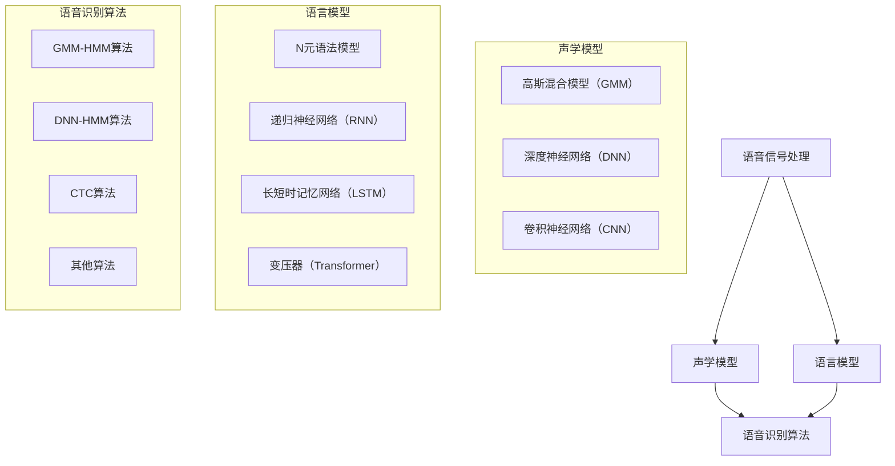

                 

### 文章标题

### 《百度2025社招语音识别工程师面试题详解》

### 关键词

- 语音识别
- 面试题
- 社招
- 百度
- 面试经验
- 技术解析

### 摘要

本文将详细解析百度2025年社招语音识别工程师面试中的常见题目。通过深入探讨语音识别的基础知识、面试题的分类解析以及项目实战，帮助读者更好地理解和应对面试中的挑战。本文旨在为准备参加语音识别工程师面试的求职者提供实用的指南和建议。

---

### 《百度2025社招语音识别工程师面试题详解》目录大纲

# 第一部分：语音识别基础知识

## 1.1 语音识别基本概念
### 1.1.1 什么是语音识别
### 1.1.2 语音识别的发展历史
### 1.1.3 语音识别的应用场景

## 1.2 语音信号处理
### 1.2.1 语音信号的表示方法
### 1.2.2 声学模型
### 1.2.3 频率分析

## 1.3 语音信号预处理
### 1.3.1 预处理流程
### 1.3.2 噪声抑制
### 1.3.3 声学特征提取

## 1.4 语言模型
### 1.4.1 语言模型的类型
### 1.4.2 语言模型的训练
### 1.4.3 语言模型的评估

## 1.5 语音识别算法
### 1.5.1 GMM-HMM算法
### 1.5.2 DNN-HMM算法
### 1.5.3 CTC算法

## 1.6 语音识别系统架构
### 1.6.1 离线语音识别系统
### 1.6.2 在线语音识别系统
### 1.6.3 语音识别系统的优化策略

# 第二部分：面试题解析

## 2.1 面试题分类
### 2.1.1 基础知识题
### 2.1.2 算法题
### 2.1.3 应用题

## 2.2 基础知识题解析
### 2.2.1 语音信号处理
### 2.2.2 声学模型
### 2.2.3 语言模型

## 2.3 算法题解析
### 2.3.1 GMM-HMM算法
### 2.3.2 DNN-HMM算法
### 2.3.3 CTC算法
### 2.3.4 其他算法题解析

## 2.4 应用题解析
### 2.4.1 实际应用案例
### 2.4.2 问题分析与解决
### 2.4.3 性能优化

## 2.5 面试题实战演练
### 2.5.1 面试题练习
### 2.5.2 解题技巧
### 2.5.3 答案与解析

# 第三部分：语音识别项目实战

## 3.1 项目介绍
### 3.1.1 项目背景
### 3.1.2 项目目标
### 3.1.3 项目架构

## 3.2 开发环境搭建
### 3.2.1 开发环境准备
### 3.2.2 必需工具与库
### 3.2.3 环境配置

## 3.3 源代码实现
### 3.3.1 代码结构
### 3.3.2 关键代码解读
### 3.3.3 代码调试与优化

## 3.4 代码解读与分析
### 3.4.1 代码执行流程
### 3.4.2 性能分析
### 3.4.3 调试技巧

## 3.5 项目总结
### 3.5.1 项目成果
### 3.5.2 不足与改进
### 3.5.3 经验与反思

# 附录

## 附录 A：常见面试题汇总
### A.1 基础知识题
### A.2 算法题
### A.3 应用题

## 附录 B：参考资料与推荐阅读
### B.1 语音识别相关书籍
### B.2 语音识别论文
### B.3 开源语音识别工具与库

#### **核心概念原理和架构的 Mermaid 流程图**

mermaid
graph TD
    A[语音信号处理] --> B[声学模型]
    A --> C[语言模型]
    B --> D[语音识别算法]
    C --> D

#### **核心算法原理讲解**

**GMM-HMM算法**

```plaintext
// 伪代码

// GMM-HMM算法是一种结合了高斯混合模型和隐马尔可夫模型的语音识别算法。
// GMM用于特征提取，HMM用于建模语音信号的序列。

// GMM特征提取
for each 音素 in 音素库 do
    计算音素的概率分布
end

// HMM建模
初始化HMM参数
for each 帧 in 语音信号 do
    计算帧的概率分布
    根据概率分布进行帧标注
end
```

**DNN-HMM算法**

```plaintext
// 伪代码

// DNN-HMM算法使用深度神经网络来替代传统的GMM作为声学模型。
// DNN训练模型，HMM进行序列建模。

// DNN模型训练
输入训练数据
训练DNN模型

// HMM建模
初始化HMM参数
for each 帧 in 语音信号 do
    通过DNN计算帧的特征
    计算帧的概率分布
    根据概率分布进行帧标注
end
```

**CTC算法**

```plaintext
// 伪代码

// CTC（Connectionist Temporal Classification）算法用于将时间序列的数据映射到标签序列。

// CTC模型训练
输入训练数据
训练CTC模型

// CTC预测
输入测试数据
通过CTC模型计算输出标签序列
```

---

接下来，我们将逐步深入探讨语音识别的基础知识，为读者搭建一个完整的语音识别技术框架。我们将从最基础的概念开始，逐步介绍语音信号处理、声学模型、语言模型、语音识别算法以及系统架构，为后续的面试题解析和项目实战打下坚实的基础。

### 1.1 语音识别基本概念

#### 1.1.1 什么是语音识别

语音识别（Automatic Speech Recognition，ASR）是指将人类的语音信号转换为文本或命令的技术。这一过程通常涉及以下几个步骤：

1. **语音信号采集**：首先，我们需要采集语音信号，这可以通过麦克风或其他语音采集设备实现。
2. **语音信号预处理**：采集到的语音信号可能包含噪声和其他干扰，因此需要进行预处理，包括噪声抑制、增益调整等。
3. **特征提取**：预处理后的语音信号被转换为数字信号，然后通过特征提取技术提取出能够代表语音信号特性的参数。
4. **声学模型训练**：使用提取的特征作为输入，训练声学模型，以学习语音信号的统计特性。
5. **语言模型训练**：同时，使用大量的文本数据训练语言模型，以学习语言中的概率分布。
6. **语音识别**：在得到训练好的声学模型和语言模型后，将待识别的语音信号输入到系统中，通过结合声学模型和语言模型，最终输出对应的文本或命令。

#### 1.1.2 语音识别的发展历史

语音识别技术自上世纪50年代起开始发展，经历了几个重要阶段：

1. **初始阶段（1950s-1960s）**：这一时期主要基于规则和有限状态机的模型，语音识别系统的准确率非常低。
2. **统计模型阶段（1960s-1980s）**：引入了隐马尔可夫模型（HMM）作为声学模型，使得语音识别的准确率有了显著提升。
3. **高斯混合模型阶段（1980s-2000s）**：高斯混合模型（GMM）被引入作为声学模型，进一步提高了系统的性能。
4. **深度学习阶段（2000s-至今）**：随着深度学习的兴起，深度神经网络（DNN）被用于语音识别，显著提高了系统的识别率和效率。其中，卷积神经网络（CNN）和循环神经网络（RNN）等结构在语音识别中得到了广泛应用。

#### 1.1.3 语音识别的应用场景

语音识别技术广泛应用于各种领域，以下是一些典型的应用场景：

1. **智能助手**：如苹果的Siri、亚马逊的Alexa等，它们能够通过语音识别实现与用户的交互，执行各种任务。
2. **电话客服**：自动语音应答系统（IVR）通过语音识别自动将用户的语音转换为文本，从而提供个性化的服务。
3. **语音翻译**：将一种语言的语音实时转换为另一种语言的文本，广泛应用于国际交流和商业场合。
4. **语音识别输入**：如智能手机中的语音输入功能，用户可以通过语音输入来发送消息、操作应用等。
5. **智能家居**：语音控制智能家居设备，如智能音箱、智能灯泡等，方便用户的日常操作。
6. **语音识别医疗**：医生可以通过语音输入病例记录和治疗方案，提高工作效率。

以上是语音识别的基本概念、发展历史和应用场景的概述。接下来，我们将深入探讨语音信号处理、声学模型、语言模型等基础知识，为读者搭建一个完整的语音识别技术框架。

### 1.2 语音信号处理

#### 1.2.1 语音信号的表示方法

语音信号是一种时变信号，通常通过以下几种方法进行表示：

1. **时域表示**：在时域上，语音信号可以被看作是一系列连续的声压级值。这些值通常以采样点的形式表示，每个采样点代表一个时间点的声压级。
   
   ```plaintext
   // 示例（时域表示）
   time = [0, T]
   signal = [s(0), s(1), ..., s(T-1)]
   ```

2. **频域表示**：在频域上，语音信号被分解为不同频率的成分。这种方法通常通过傅里叶变换实现，如快速傅里叶变换（FFT）。频域表示有助于分析语音信号中的频率特性。

   ```plaintext
   // 示例（频域表示）
   freq = [f1, f2, ..., fn]
   spectrum = [S(f1), S(f2), ..., S(fn)]
   ```

3. **倒谱表示**：倒谱是一种频率域的变换，它通过消除共振峰的影响，使得语音信号在频域上更稳定。倒谱常用于语音信号的预处理和特征提取。

   ```plaintext
   // 示例（倒谱表示）
   freq = [f1, f2, ..., fn]
   spectrum = [S(f1), S(f2), ..., S(fn)]
  cepstrum = [C(f1), C(f2), ..., C(fn)]
   ```

#### 1.2.2 声学模型

声学模型是语音识别系统的核心组成部分，用于表示语音信号的特征和模式。常见的声学模型包括：

1. **高斯混合模型（GMM）**：

   高斯混合模型假设每个音素在特征空间中由多个高斯分布混合而成。通过训练，可以得到每个音素的概率分布。

   ```plaintext
   // GMM模型参数
   M = 个数（音素数量）
   G = [μ1, ..., μM]（每个音素的均值向量）
   Σ = [Σ1, ..., ΣM]（每个音素协方差矩阵）

   // 概率分布计算
   for each 音素 j do
       p(j|θ) = Σk=1^K w(k) * exp(-0.5 * (x - μk)ᵀΣᵀk⁻¹(x - μk))
   end
   ```

2. **深度神经网络（DNN）**：

   深度神经网络是一种强大的机器学习模型，可以用于语音识别中的特征提取和分类。DNN通过多层非线性变换，从原始语音信号中提取出具有较高区分度的特征。

   ```plaintext
   // DNN模型结构
   输入层：原始语音信号特征
   隐藏层：多层非线性变换
   输出层：分类结果或特征表示

   // 前向传播
   z₀ = 输入特征
   for each 隐藏层 l do
       zl = σ(Wl-1 * zl-1 + bl)
   end
   y = σ(Wₙ * zₙ₋₁ + bn)

   // 损失函数
   L = Σi=1^N -yᵢ * log(yᵢ)
   ```

3. **卷积神经网络（CNN）**：

   卷积神经网络通常用于处理时间序列数据，通过卷积操作提取局部特征。在语音识别中，CNN可以用于提取语音信号的时频特征。

   ```plaintext
   // CNN模型结构
   输入层：时频图像（如MFCC特征）
   卷积层：卷积操作提取特征
   池化层：下采样
   全连接层：分类或回归

   // 卷积操作
   for each 卷积核 k do
       z_k = f(∑j w_j * x_j + b)
   end

   // 池化操作
   p_k = max(∑i aᵢ)
   ```

#### 1.2.3 频率分析

频率分析是语音信号处理中重要的环节，用于提取语音信号的频率特性。以下是几种常见的频率分析技术：

1. **傅里叶变换（FFT）**：

   傅里叶变换可以将时域信号转换为频域信号，从而分析信号的频率成分。快速傅里叶变换（FFT）是一种高效实现傅里叶变换的方法。

   ```plaintext
   // FFT算法
   X(k) = Σn=0^(N-1) x(n) * exp(-j * 2π * k * n / N)
   ```

2. **短时傅里叶变换（STFT）**：

   短时傅里叶变换是对信号进行分段处理，然后对每段信号进行傅里叶变换。STFT可以分析信号的时频特性。

   ```plaintext
   // STFT算法
   for each 时间窗口 w
       X(w) = FFT(x(w))
   end
   ```

3. **梅尔频率倒谱系数（MFCC）**：

   梅尔频率倒谱系数是一种常用的语音特征提取方法，它通过人耳的听觉特性对频谱进行加权处理，然后进行离散余弦变换（DCT）。

   ```plaintext
   // MFCC算法
   X(MFCC) = DCT([log(S(f1)), log(S(f2)), ..., log(S(fn))])
   ```

4. **滤波器组（Filter Bank）**：

   滤波器组是一种将信号分解为多个子带的方法，每个子带对应不同的频率范围。通过滤波器组可以提取出信号的频率成分。

   ```plaintext
   // 滤波器组算法
   for each 滤波器 b
       y(b) = x * h(b)
   end
   ```

以上是关于语音信号处理的基本概念和方法的介绍。在后续的章节中，我们将继续探讨语音信号预处理、语言模型和语音识别算法等关键部分，帮助读者深入理解语音识别技术。

### 1.3 语音信号预处理

#### 1.3.1 预处理流程

语音信号预处理是语音识别系统中的关键步骤，旨在提高语音信号的质量，消除噪声和其他干扰，以便后续的特征提取和识别。预处理流程通常包括以下步骤：

1. **信号采集**：通过麦克风或其他语音采集设备采集语音信号。
2. **增益调整**：根据语音信号的强度对音频进行增益调整，使其达到合适的音量水平。
3. **噪声抑制**：利用滤波器或其他噪声抑制技术，去除语音信号中的背景噪声。
4. **端点检测**：检测语音信号中的说话人活动周期，即确定语音信号的开始和结束位置。
5. **分帧与加窗**：将语音信号分割成多个短时帧，并对每个帧应用窗函数，如汉明窗或汉宁窗，以减少帧边界产生的失真。
6. **特征提取**：从预处理后的语音帧中提取特征参数，如梅尔频率倒谱系数（MFCC）、频谱特征等。

#### 1.3.2 噪声抑制

噪声抑制是语音信号预处理中非常重要的一环，可以有效提高语音识别的准确率。以下是几种常见的噪声抑制方法：

1. **谱减法**：通过估计语音信号和噪声的功率谱，然后用噪声谱减去语音谱，从而实现噪声抑制。这种方法简单有效，但容易导致语音失真。

   ```plaintext
   // 谱减法算法
   S speech = |X_speech|
   S noise = |X_noise|
   S filtered = S speech - S noise
   ```

2. **维纳滤波**：维纳滤波是一种基于最小均方误差准则的滤波方法，通过估计语音信号和噪声的功率谱，自适应地调整滤波器的增益，以最小化输出信号与期望信号之间的误差。

   ```plaintext
   // 维纳滤波算法
   P noise = E[n²]
   P speech = E[s²]
   G = (P speech + P noise)^(-1)
   s filtered = G * n
   ```

3. **自适应滤波**：自适应滤波器根据语音信号和噪声的变化，动态调整滤波器的参数，以达到更好的噪声抑制效果。常见的方法包括自适应无限 impulse response (IIR) 滤波器和自适应有限 impulse response (FIR) 滤波器。

   ```plaintext
   // 自适应 IIR 滤波器算法
   a(k) = a(k-1) - μ * e(k-1) * b(k-1)
   y(k) = x(k) - a(k) * n(k)
   ```

4. **谱减法与维纳滤波结合**：将谱减法和维纳滤波结合，可以同时利用两者的优点，提高噪声抑制的效果。

   ```plaintext
   // 结合谱减法和维纳滤波
   S speech = |X_speech|
   S noise = |X_noise|
   S filtered = S speech - (S noise - S noise * μ)
   ```

#### 1.3.3 声学特征提取

声学特征提取是从预处理后的语音帧中提取出能够反映语音信号特性的参数，用于后续的声学模型训练和语音识别。以下是几种常用的声学特征提取方法：

1. **梅尔频率倒谱系数（MFCC）**：MFCC是一种广泛应用于语音识别的特征提取方法，它通过人耳的听觉特性对频谱进行加权处理，然后进行离散余弦变换（DCT），得到一组倒谱系数。

   ```plaintext
   // MFCC算法
   X(MFCC) = DCT([log(S(f1)), log(S(f2)), ..., log(S(fn))])
   ```

2. **频谱特征**：频谱特征包括频率分布、能量分布等，通过傅里叶变换或其他变换方法得到。

   ```plaintext
   // 频谱特征
   freq = [f1, f2, ..., fn]
   spectrum = [S(f1), S(f2), ..., S(fn)]
   ```

3. **倒谱特征**：倒谱特征是对频谱特征的一种变换，通过消除共振峰的影响，使得特征在频域上更稳定。

   ```plaintext
   // 倒谱特征
   freq = [f1, f2, ..., fn]
   spectrum = [S(f1), S(f2), ..., S(fn)]
   cepstrum = [C(f1), C(f2), ..., C(fn)]
   ```

4. **动态特征**：动态特征包括短时能量、过零率、音调频率等，能够反映语音信号的时变特性。

   ```plaintext
   // 动态特征
   short_time_energy = Σn=1^N |x(n)|²
   zero_crossing_rate = Σn=1^N (x(n-1) * x(n) < 0)
   pitch_frequency = estimate_pitch_frequency(x)
   ```

以上是关于语音信号预处理、噪声抑制和声学特征提取的介绍。在下一章中，我们将深入探讨语言模型，为语音识别系统提供语义理解和上下文信息。

### 1.4 语言模型

#### 1.4.1 语言模型的类型

语言模型是语音识别系统的重要组成部分，用于描述自然语言中的概率分布，为语音识别提供语义理解和上下文信息。根据训练数据和方法的不同，语言模型可以分为以下几种类型：

1. **N元语法模型（N-gram Model）**：

   N元语法模型是最常用的语言模型之一，它假设当前词的出现概率仅与前面N-1个词有关。N元语法模型可以通过统计大量文本数据训练得到，其计算复杂度相对较低。

   ```plaintext
   // N元语法模型
   p(wₙ|wₙ₋₁, ..., wₙ₋N) = Σwₙ₋₁, ..., wₙ₋N p(wₙ|wₙ₋₁, ..., wₙ₋N-1) * p(wₙ₋₁, ..., wₙ₋N-1)
   ```

2. **隐马尔可夫模型（HMM）**：

   隐马尔可夫模型是一种概率模型，用于描述序列数据。在语音识别中，HMM可以用于建模语音信号的序列，结合声学模型进行语音识别。

   ```plaintext
   // HMM模型参数
   A = [a(i,j)]（状态转移概率矩阵）
   B = [b(i,j)]（观测概率矩阵）
   π = [π(i)]（初始状态概率向量）
   ```

3. **神经网络语言模型（Neural Network Language Model，NNLM）**：

   神经网络语言模型通过深度神经网络学习语言中的概率分布。NNLM可以捕获复杂的语言模式，提高语音识别的准确率。

   ```plaintext
   // NNLM模型结构
   输入层：词嵌入向量
   隐藏层：多层神经网络
   输出层：Softmax层
   ```

4. **递归神经网络（Recurrent Neural Network，RNN）**：

   递归神经网络是一种能够处理序列数据的神经网络，通过递归连接来捕获序列中的上下文信息。

   ```plaintext
   // RNN模型结构
   Hₙ = tanh(Wₙ * [hₙ₋₁, xₙ] + b)
   yₙ = softmax(Wy * Hₙ + by)
   ```

5. **长短时记忆网络（Long Short-Term Memory，LSTM）**：

   长短时记忆网络是RNN的一种变体，通过引入记忆单元来更好地捕获长序列中的依赖关系。

   ```plaintext
   // LSTM模型结构
   iₙ = sigmoid(Wi * [hₙ₋₁, xₙ] + bi)
   fₙ = sigmoid(Wf * [hₙ₋₁, xₙ] + bf)
   Cₙ = fₙ * Cₙ₋₁ + iₙ * tanh(Wc * [hₙ₋₁, xₙ] + bc)
   oₙ = sigmoid(Wo * [hₙ₋₁, Cₙ] + bo)
   hₙ = oₙ * tanh(Cₙ)
   ```

6. **变压器（Transformer）**：

   变压器是一种基于自注意力机制的深度神经网络模型，能够处理长序列数据，并在语音识别等领域取得了显著的性能提升。

   ```plaintext
   // Transformer模型结构
   Q = softmax(QW * X)
   K = softmax(KW * X)
   V = softmax(VW * X)

   attention =softmax(QKᵀ/WV)
   context = ∑ₖ Vᵀ * attentionₖ
   output =Wo * (X * WQ + context)
   ```

以上是关于语言模型类型的介绍，接下来我们将探讨语言模型的训练方法和评估指标。

#### 1.4.2 语言模型的训练

语言模型的训练是语音识别系统构建的关键步骤，通过学习大量文本数据，语言模型可以捕捉自然语言中的概率分布和上下文信息。以下是几种常见的语言模型训练方法：

1. **基于N元语法模型的训练**：

   N元语法模型通过统计文本数据中连续N个词的共现概率来训练。这种方法相对简单，但容易受到数据稀疏性的影响。

   ```plaintext
   // 训练N元语法模型
   p(wₙ|wₙ₋₁, ..., wₙ₋N) = count(wₙ₋₁, ..., wₙ₋N, wₙ) / count(wₙ₋₁, ..., wₙ₋N)
   ```

2. **基于隐马尔可夫模型的训练**：

   隐马尔可夫模型通过极大似然估计（MLE）或鲍尔兹曼机器（Boltzmann Machine）等方法来训练。这种方法可以建模语音信号的序列，提高语音识别的性能。

   ```plaintext
   // 训练HMM模型
   A = maximize(P(X|A))
   B = maximize(P(Y|A,B))
   π = maximize(P(A|π))
   ```

3. **基于神经网络语言模型的训练**：

   神经网络语言模型通过反向传播算法和梯度下降等方法来训练。这种方法可以学习复杂的语言模式，提高模型的准确率和泛化能力。

   ```plaintext
   // 训练NNLM模型
   loss = Σn=1^N -yₙ * log(p(yₙ|xₙ))
   ∂loss/∂W = -[∂log(p(yₙ|xₙ))/∂p(yₙ|xₙ)] * [∂p(yₙ|xₙ)/∂W]
   W = W - α * ∂loss/∂W
   ```

4. **基于递归神经网络的语言模型训练**：

   递归神经网络通过反向传播算法来训练。这种方法可以捕获长序列中的依赖关系，提高语言模型的性能。

   ```plaintext
   // 训练RNN模型
   loss = Σn=1^N -yₙ * log(p(yₙ|xₙ, hₙ))
   ∂loss/∂W = -[∂log(p(yₙ|hₙ))/∂hₙ] * [∂hₙ/∂W]
   hₙ = tanh(W * [hₙ₋₁, xₙ] + b)
   ```

5. **基于长短时记忆网络的语言模型训练**：

   长短时记忆网络通过反向传播算法和梯度下降等方法来训练。这种方法可以更好地捕获长序列中的依赖关系，提高模型的性能。

   ```plaintext
   // 训练LSTM模型
   loss = Σn=1^N -yₙ * log(p(yₙ|hₙ))
   ∂loss/∂W = -[∂log(p(yₙ|hₙ))/∂hₙ] * [∂hₙ/∂W]
   Cₙ = fₙ * Cₙ₋₁ + iₙ * tanh(Wc * [hₙ₋₁, xₙ] + bc)
   hₙ = oₙ * tanh(Cₙ)
   ```

6. **基于变压器语言模型的训练**：

   变压器通过自注意力机制和多层叠加来训练。这种方法可以处理长序列数据，提高模型的准确率和泛化能力。

   ```plaintext
   // 训练Transformer模型
   loss = Σn=1^N -yₙ * log(p(yₙ|xₙ, hₙ))
   Q = softmax(QW * X)
   K = softmax(KW * X)
   V = softmax(VW * X)
   context = ∑ₖ Vᵀ * attentionₖ
   output =Wo * (X * WQ + context)
   ```

以上是关于语言模型训练方法的介绍，接下来我们将探讨语言模型的评估指标。

#### 1.4.3 语言模型的评估

语言模型的评估是评估其性能和效果的重要步骤。以下是一些常用的评估指标：

1. **词错误率（Word Error Rate，WER）**：

   词错误率是最常用的语言模型评估指标之一，用于衡量模型输出的文本与标准文本之间的差异。词错误率可以通过以下公式计算：

   ```plaintext
   WER = (误删词数 + 替换词数 + 插入词数) / 总词数
   ```

2. **字符错误率（Character Error Rate，CER）**：

   字符错误率是另一种评估语言模型性能的指标，它计算模型输出的文本与标准文本之间的字符差异。字符错误率可以通过以下公式计算：

   ```plaintext
   CER = (误删字符数 + 替换字符数 + 插入字符数) / 总字符数
   ```

3. **编辑距离（Edit Distance）**：

   编辑距离是一种衡量两个字符串差异的指标，它计算将一个字符串转换为另一个字符串所需的最少编辑操作次数。编辑操作包括插入、删除和替换。

   ```plaintext
   // 编辑距离算法
   d[i, j] = 
       if i == j then 0
       else 
           1 + min(d[i-1, j], d[i, j-1], d[i-1, j-1])
   end
   ```

4. **精度（Precision）**：

   精度是衡量模型输出中正确预测的部分与总预测部分的比率。精度可以通过以下公式计算：

   ```plaintext
   Precision = (正确预测的部分) / (总预测的部分)
   ```

5. **召回率（Recall）**：

   召回率是衡量模型输出中正确预测的部分与实际存在部分的比率。召回率可以通过以下公式计算：

   ```plaintext
   Recall = (正确预测的部分) / (实际存在的部分)
   ```

6. **F1 分数（F1 Score）**：

   F1 分数是精度和召回率的调和平均，用于综合评估模型的性能。F1 分数可以通过以下公式计算：

   ```plaintext
   F1 Score = 2 * (Precision * Recall) / (Precision + Recall)
   ```

通过以上评估指标，可以全面了解语言模型的性能和效果，为优化模型提供依据。接下来，我们将深入探讨语音识别算法，包括 GMM-HMM、DNN-HMM 和 CTC 等算法。

### 1.5 语音识别算法

#### 1.5.1 GMM-HMM算法

GMM-HMM（高斯混合模型-隐马尔可夫模型）是一种经典的语音识别算法，结合了GMM的强大特征提取能力和HMM的序列建模能力。下面是GMM-HMM算法的基本原理和实现步骤：

1. **GMM特征提取**：

   GMM模型将每个音素表示为多个高斯分布的混合，每个高斯分布对应一个音素状态。通过训练，可以得到每个音素的概率分布。

   ```plaintext
   // GMM模型参数
   M = 音素数量
   G = [μ1, ..., μM]（每个音素的均值向量）
   Σ = [Σ1, ..., ΣM]（每个音素的协方差矩阵）

   // 前向传播
   α(i, t) = π(i) * Φ(x(t)|μ(i), Σ(i))
   β(i, t) = β(i, t+1) * φ(i|t+1) / α(i, t+1)
   ```

   其中，π(i)是初始状态概率，Φ是高斯分布的概率密度函数，α(i, t)和β(i, t)分别表示前向和后向变量。

2. **HMM序列建模**：

   HMM模型使用前向-后向算法计算给定语音信号在各个状态下的概率。通过最大化这个概率，可以得到语音信号的标注序列。

   ```plaintext
   // 前向传播
   α(i, t) = π(i) * Φ(x(t)|μ(i), Σ(i))
   α(t) = Σi α(i, t) * α(i, t-1)

   // 后向传播
   β(i, t) = φ(i|t) * β(i, t+1) / α(i, t+1)
   β(t) = Σi β(i, t) * β(i, t+1)

   // 概率计算
   P(O|H) = Σi α(i, T) * β(i, T)
   ```

3. **解码**：

   解码阶段使用Viterbi算法找到概率最大的状态序列，即最优路径。

   ```plaintext
   // Viterbi算法
   δ(i, t) = max_j δ(j, t-1) * α(j, t-1)
   π(i, t) = argmax_j δ(j, t-1) * α(j, t-1)
   δ(i, T) = max_j δ(j, T-1)
   π(i, T) = argmax_j δ(j, T-1)
   ```

#### 1.5.2 DNN-HMM算法

DNN-HMM（深度神经网络-隐马尔可夫模型）是当前语音识别领域的主流算法，它将DNN用于特征提取，取代了传统的GMM。DNN-HMM算法通过深度神经网络学习语音信号的特征表示，然后结合HMM进行序列建模。以下是DNN-HMM算法的基本原理和实现步骤：

1. **DNN特征提取**：

   DNN模型用于从原始语音信号中提取高层次的抽象特征。通过训练，DNN可以学习到有效的特征表示，提高语音识别的性能。

   ```plaintext
   // DNN模型结构
   输入层：原始语音信号特征
   隐藏层：多层非线性变换
   输出层：分类结果或特征表示

   // 前向传播
   z₀ = 输入特征
   for each 隐藏层 l do
       zl = σ(Wl-1 * zl-1 + bl)
   end
   y = σ(Wₙ * zₙ₋₁ + bn)

   // 损失函数
   L = Σi=1^N -yᵢ * log(yᵢ)
   ```

2. **HMM序列建模**：

   与GMM-HMM算法类似，DNN-HMM算法使用HMM进行序列建模。通过前向-后向算法计算给定语音信号在各个状态下的概率，然后使用Viterbi算法解码。

   ```plaintext
   // 前向传播
   α(i, t) = π(i) * σ(f(x(t)))
   α(t) = Σi α(i, t) * α(i, t-1)

   // 后向传播
   β(i, t) = φ(i|t) * β(i, t+1) / α(i, t+1)
   β(t) = Σi β(i, t) * β(i, t+1)

   // 概率计算
   P(O|H) = Σi α(i, T) * β(i, T)
   ```

3. **解码**：

   使用Viterbi算法找到概率最大的状态序列，即最优路径。

   ```plaintext
   // Viterbi算法
   δ(i, t) = max_j δ(j, t-1) * α(j, t-1)
   π(i, t) = argmax_j δ(j, t-1) * α(j, t-1)
   δ(i, T) = max_j δ(j, T-1)
   π(i, T) = argmax_j δ(j, T-1)
   ```

#### 1.5.3 CTC算法

CTC（Connectionist Temporal Classification）算法是一种在序列标注问题中广泛应用的深度学习算法。在语音识别中，CTC算法通过将时间序列的语音信号映射到文本序列，实现了端到端的语音识别。以下是CTC算法的基本原理和实现步骤：

1. **CTC模型训练**：

   CTC算法使用神经网络来学习语音信号和文本序列之间的映射关系。训练过程中，网络通过优化损失函数来提高预测的准确性。

   ```plaintext
   // CTC模型结构
   输入层：时间序列特征
   隐藏层：多层神经网络
   输出层：Softmax层

   // 损失函数
   L = Σn=1^T -yₙ * log(p(yₙ))
   ```

   其中，yₙ表示第n个时间步上的输出概率分布。

2. **CTC预测**：

   在预测阶段，CTC算法通过计算时间序列的输出概率，得到对应的文本序列。

   ```plaintext
   // CTC预测
   p(yₙ) = softmax(W * hₙ + b)

   // 解码
   output = ""
   for each 时间步 n do
       if p(yₙ) > threshold then
           append 转换后的字符 to output
       end
   end
   ```

3. **解码策略**：

   CTC算法有多种解码策略，包括贪心解码、Beam Search解码等。贪心解码简单但可能产生较长的延迟，而Beam Search解码可以平衡准确率和延迟。

   ```plaintext
   // 贪心解码
   for each 时间步 n do
       choose max(p(yₙ)) as predicted character
       append character to output
   end

   // Beam Search解码
   Initialize beam with size k
   while not end of sequence do
       generate all possible k subsequences
       for each subsequence do
           calculate its score and add it to the beam
       end
       update beam with top-k scores
   end
   ```

通过以上对GMM-HMM、DNN-HMM和CTC算法的详细解释，读者可以更好地理解这些算法的基本原理和实现步骤。这些算法在语音识别领域具有重要的应用价值，并且在不断的发展和创新。接下来，我们将探讨语音识别系统的架构，包括离线语音识别系统和在线语音识别系统。

### 1.6 语音识别系统架构

#### 1.6.1 离线语音识别系统

离线语音识别系统（Offline Speech Recognition System）主要针对已经录制好的语音数据进行处理，其流程相对独立，通常包括以下步骤：

1. **语音信号采集**：首先，通过麦克风或其他语音采集设备录制语音数据。
2. **语音信号预处理**：对采集到的语音信号进行预处理，包括增益调整、噪声抑制和端点检测等。
3. **特征提取**：从预处理后的语音帧中提取声学特征，如梅尔频率倒谱系数（MFCC）。
4. **声学模型训练**：使用提取的声学特征训练声学模型，如GMM或DNN。
5. **语言模型训练**：使用大量文本数据训练语言模型，如N元语法或RNN。
6. **解码**：将预处理后的语音数据输入到训练好的语音识别系统中，通过结合声学模型和语言模型，输出对应的文本。

离线语音识别系统具有以下优点：

- **可靠性高**：由于语音数据是提前录制好的，可以进行充分的预处理和优化，提高识别准确率。
- **灵活性高**：系统可以灵活调整和处理不同类型和来源的语音数据。

然而，离线语音识别系统也存在一些局限性：

- **实时性差**：处理大量语音数据需要较长时间，不适合对实时性要求较高的应用场景。
- **环境依赖性高**：环境噪声和其他干扰可能会影响识别效果。

#### 1.6.2 在线语音识别系统

在线语音识别系统（Online Speech Recognition System）主要用于实时语音信号的识别，其架构通常包括以下几个部分：

1. **语音信号采集**：实时采集语音信号，通过麦克风或其他语音采集设备。
2. **实时预处理**：对实时采集的语音信号进行实时预处理，包括增益调整、噪声抑制和端点检测等。
3. **特征提取**：从实时预处理后的语音帧中提取声学特征，如MFCC。
4. **动态声学模型更新**：在线语音识别系统需要实时更新声学模型，以适应实时语音信号的特性。这通常通过在线学习算法实现，如在线GMM或在线DNN。
5. **语言模型训练**：使用实时语音信号和大量文本数据训练语言模型。
6. **实时解码**：将实时语音信号输入到训练好的语音识别系统中，通过结合声学模型和语言模型，输出对应的文本。

在线语音识别系统具有以下优点：

- **实时性强**：能够实时处理语音信号，适合对实时性要求较高的应用场景。
- **自适应性好**：系统能够根据实时语音信号调整模型参数，适应不同环境和语音条件。

然而，在线语音识别系统也存在一些挑战：

- **实时处理复杂**：实时处理语音信号需要较高的计算资源和算法优化。
- **识别准确率相对较低**：实时语音信号的处理复杂度较高，可能影响识别准确率。

#### 1.6.3 语音识别系统的优化策略

为了提高语音识别系统的性能，可以采用以下几种优化策略：

1. **多语言模型融合**：结合多种语言模型，如N元语法和神经网络语言模型，提高系统的综合识别准确率。
2. **上下文信息利用**：利用上下文信息，如对话历史和用户信息，提高语音识别的准确性和语义理解能力。
3. **数据增强**：通过数据增强技术，如语音转换、噪声添加等，增加训练数据量，提高模型的泛化能力。
4. **深度学习优化**：采用更先进的深度学习模型，如Transformer和BERT，提高语音识别的性能。
5. **分布式计算**：利用分布式计算资源，如GPU和TPU，加速模型的训练和推理过程。

通过以上优化策略，可以显著提高语音识别系统的性能和适用性，满足不同场景和应用需求。

### 第二部分：面试题解析

在第二部分，我们将深入解析百度2025年社招语音识别工程师面试中常见的问题。这部分内容将分为基础知识题、算法题和应用题三个部分，通过详细的解析和示例，帮助读者更好地理解面试题的解答方法和思路。

#### 2.1 面试题分类

##### 2.1.1 基础知识题

基础知识题主要考查应聘者对语音识别基础知识的掌握，包括语音信号处理、声学模型、语言模型等。

##### 2.1.2 算法题

算法题主要考查应聘者对语音识别算法的理解和实现能力，包括GMM-HMM、DNN-HMM、CTC等。

##### 2.1.3 应用题

应用题主要考查应聘者解决实际问题的能力，包括语音识别系统的优化、性能分析和实际应用案例。

#### 2.2 基础知识题解析

##### 2.2.1 语音信号处理

**问题**：请简述语音信号处理的步骤。

**解答**：

语音信号处理的步骤主要包括：

1. **信号采集**：使用麦克风或其他语音采集设备获取语音信号。
2. **信号预处理**：包括增益调整、噪声抑制、端点检测等，以去除语音信号中的噪声和干扰。
3. **分帧与加窗**：将语音信号分割成多个短时帧，并对每个帧应用窗函数，如汉明窗或汉宁窗。
4. **特征提取**：从预处理后的语音帧中提取特征参数，如梅尔频率倒谱系数（MFCC）、频谱特征等。

**示例**：

```plaintext
// 信号预处理
增益调整：将语音信号的音量调整到合适的范围。
噪声抑制：使用维纳滤波或谱减法去除噪声。
端点检测：利用短时能量和过零率检测语音的开始和结束位置。

// 分帧与加窗
frame_size = 25
hop_size = 10
for i = 0 to N - frame_size do
    frame = x[i:i+frame_size]
    window = hamming(frame_size)
    processed_frame = frame * window
end

// 特征提取
mfcc = MFCC(processed_frame)
```

##### 2.2.2 声学模型

**问题**：请解释高斯混合模型（GMM）在语音识别中的作用。

**解答**：

高斯混合模型（GMM）在语音识别中的作用主要包括：

1. **特征提取**：GMM将每个音素表示为多个高斯分布的混合，通过训练可以得到每个音素的概率分布。
2. **建模语音信号**：使用GMM来建模语音信号的时变特性，从而提高语音识别的准确率。
3. **序列建模**：结合隐马尔可夫模型（HMM），GMM-HMM算法可以有效地建模语音信号的序列。

**示例**：

```plaintext
// GMM模型参数
M = 音素数量
G = [μ1, ..., μM]（每个音素的均值向量）
Σ = [Σ1, ..., ΣM]（每个音素的协方差矩阵）

// GMM特征提取
for each 音素 j do
    p(j|θ) = Σk=1^K w(k) * exp(-0.5 * (x - μk)ᵀΣᵀk⁻¹(x - μk))
end

// GMM-HMM算法
初始化HMM参数
for each 帧 in 语音信号 do
    计算帧的概率分布
    根据概率分布进行帧标注
end
```

##### 2.2.3 语言模型

**问题**：请解释N元语法模型的工作原理。

**解答**：

N元语法模型的工作原理主要包括：

1. **概率计算**：N元语法模型假设当前词的出现概率仅与前面N-1个词有关，通过统计文本数据计算每个N元组合的频率。
2. **解码**：在语音识别中，N元语法模型用于解码阶段，结合声学模型输出最终的文本结果。

**示例**：

```plaintext
// N元语法模型
N = 3
p(wₙ|wₙ₋₁, wₙ₋₂) = count(wₙ₋₂, wₙ₋₁, wₙ) / count(wₙ₋₂, wₙ₋₁)

// 解码示例
input_sequence = "the quick brown fox jumps over the lazy dog"
predicted_sequence = decode(input_sequence, N)
```

#### 2.3 算法题解析

##### 2.3.1 GMM-HMM算法

**问题**：请解释GMM-HMM算法的核心步骤。

**解答**：

GMM-HMM算法的核心步骤主要包括：

1. **GMM特征提取**：使用高斯混合模型（GMM）从语音信号中提取特征，每个音素被表示为多个高斯分布的混合。
2. **HMM建模**：使用隐马尔可夫模型（HMM）来建模语音信号的序列，结合前向-后向算法和Viterbi算法进行解码。
3. **联合概率计算**：通过结合GMM和HMM，计算语音信号在各个状态下的概率分布，从而实现语音识别。

**示例**：

```plaintext
// GMM特征提取
for each 音素 in 音素库 do
    计算音素的概率分布
end

// HMM建模
初始化HMM参数
for each 帧 in 语音信号 do
    计算帧的概率分布
    根据概率分布进行帧标注
end

// 联合概率计算
P(O|H) = Σi α(i, T) * β(i, T)
```

##### 2.3.2 DNN-HMM算法

**问题**：请解释DNN-HMM算法的核心步骤。

**解答**：

DNN-HMM算法的核心步骤主要包括：

1. **DNN特征提取**：使用深度神经网络（DNN）从原始语音信号中提取高层次的抽象特征。
2. **HMM序列建模**：使用隐马尔可夫模型（HMM）对语音信号的序列进行建模，结合前向-后向算法和Viterbi算法进行解码。
3. **联合概率计算**：通过结合DNN和HMM，计算语音信号在各个状态下的概率分布，从而实现语音识别。

**示例**：

```plaintext
// DNN特征提取
输入层：原始语音信号特征
隐藏层：多层神经网络
输出层：分类结果或特征表示

// HMM序列建模
初始化HMM参数
for each 帧 in 语音信号 do
    计算帧的概率分布
    根据概率分布进行帧标注
end

// 联合概率计算
P(O|H) = Σi α(i, T) * β(i, T)
```

##### 2.3.3 CTC算法

**问题**：请解释CTC算法的核心步骤。

**解答**：

CTC（Connectionist Temporal Classification）算法的核心步骤主要包括：

1. **CTC模型训练**：使用深度神经网络（DNN）训练CTC模型，通过优化损失函数提高模型的准确率。
2. **CTC预测**：使用训练好的CTC模型对语音信号进行预测，通过解码输出对应的文本序列。
3. **解码策略**：采用贪心解码或Beam Search解码策略，从时间序列的特征中生成文本序列。

**示例**：

```plaintext
// CTC模型训练
输入层：时间序列特征
隐藏层：多层神经网络
输出层：Softmax层

// 损失函数
L = Σn=1^T -yₙ * log(p(yₙ))

// CTC预测
p(yₙ) = softmax(W * hₙ + b)

// 贪心解码
for each 时间步 n do
    choose max(p(yₙ)) as predicted character
    append character to output
end
```

##### 2.3.4 其他算法题解析

**问题**：请解释RNN在语音识别中的作用。

**解答**：

RNN（递归神经网络）在语音识别中的作用主要包括：

1. **序列建模**：RNN能够处理序列数据，通过递归连接捕获语音信号的时序信息。
2. **上下文信息**：RNN能够保留长序列中的上下文信息，提高语音识别的准确率。
3. **特征提取**：RNN可以从原始语音信号中提取高层次的抽象特征，为后续的识别过程提供支持。

**示例**：

```plaintext
// RNN模型结构
输入层：原始语音信号特征
隐藏层：多层递归神经网络
输出层：分类结果或特征表示

// 前向传播
h₀ = 初始化
for each 隐藏层 l do
    hₙ = tanh(Wₙ * [hₙ₋₁, xₙ] + b)
end
y = softmax(Wy * hₙ + by)

// 损失函数
L = Σn=1^N -yₙ * log(yₙ)
```

通过以上对基础知识题、算法题的详细解析，读者可以更好地理解面试题的解答思路和方法。接下来，我们将探讨应用题的解析，帮助读者解决实际问题和优化语音识别系统。

#### 2.4 应用题解析

##### 2.4.1 实际应用案例

**问题**：请设计一个语音识别系统，用于实时语音转文字。

**解答**：

设计一个实时语音转文字的系统，需要考虑以下几个关键模块：

1. **语音信号采集**：使用麦克风实时采集语音信号。
2. **实时预处理**：包括增益调整、噪声抑制和端点检测，以去除噪声和干扰。
3. **特征提取**：从实时预处理后的语音帧中提取特征参数，如梅尔频率倒谱系数（MFCC）。
4. **声学模型**：训练声学模型，以捕获语音信号的特性。可以使用DNN-HMM或CTC算法。
5. **语言模型**：训练语言模型，以提高解码的准确率。可以使用N元语法模型或神经网络语言模型。
6. **解码**：使用解码算法将特征映射到文本序列，如Viterbi算法或贪心解码。

**示例**：

```plaintext
// 语音信号采集
麦克风实时采集语音信号

// 实时预处理
增益调整：调整语音信号的音量
噪声抑制：使用维纳滤波去除噪声
端点检测：检测语音的开始和结束位置

// 特征提取
mfcc = MFCC(processed_frame)

// 声学模型
使用DNN-HMM或CTC算法训练声学模型

// 语言模型
使用N元语法模型或神经网络语言模型训练语言模型

// 解码
predicted_text = decode(mfcc, acoustic_model, language_model)
```

##### 2.4.2 问题分析与解决

**问题**：在实际应用中，如何优化语音识别系统的性能？

**解答**：

优化语音识别系统的性能可以从以下几个方面进行：

1. **特征提取**：使用更先进的特征提取方法，如PLP（Perceptual Linear Prediction）或波尔兹曼机器，以提高特征表示的准确性。
2. **声学模型**：采用更复杂的神经网络结构，如LSTM或Transformer，以捕捉更复杂的语音模式。
3. **数据增强**：通过语音转换、噪声添加等方法增加训练数据量，提高模型的泛化能力。
4. **多语言模型融合**：结合多种语言模型，如N元语法和神经网络语言模型，提高系统的综合性能。
5. **上下文信息**：利用上下文信息，如对话历史和用户信息，提高语音识别的准确性和语义理解能力。
6. **硬件优化**：利用分布式计算和硬件加速，如GPU和TPU，提高模型的训练和推理速度。

**示例**：

```plaintext
// 特征提取
使用PLP提取特征
plp = PLP(processed_frame)

// 声学模型
使用LSTM训练声学模型
lstm_model = LSTM(input_shape=(timesteps, features))
lstm_model.compile(optimizer='adam', loss='categorical_crossentropy')

// 数据增强
添加噪声到语音数据
noisy_frame = add_noise(frame, noise_level)

// 多语言模型融合
结合N元语法和神经网络语言模型
combined_model = combine_models(ngram_model, neural_model)

// 上下文信息
利用对话历史和用户信息
context = extract_context(user_history, user_info)

// 硬件优化
使用GPU加速训练和推理
with tf.device('/GPU:0'):
    model.compile(optimizer='adam', loss='categorical_crossentropy')
```

##### 2.4.3 性能优化

**问题**：请提出一种优化语音识别系统性能的方法。

**解答**：

以下是一种优化语音识别系统性能的方法：

1. **模型蒸馏**：使用一个预训练的大型模型（教师模型）来训练一个小型模型（学生模型）。这种方法可以传递预训练模型的知识，提高小型模型的性能。

**示例**：

```plaintext
// 模型蒸馏
教师模型 = load_pretrained_model('teacher_model.h5')
学生模型 = load_student_model('student_model.h5')

for epoch in range(num_epochs):
    for batch in batches:
        teacher_output = teacher_model.predict(batch)
        student_output = student_model.predict(batch)
        loss = compute_loss(student_output, teacher_output)
        student_model.train_on_batch(batch, teacher_output)
```

通过以上对应用题的详细解析，读者可以更好地理解如何解决实际问题并优化语音识别系统。接下来，我们将通过一个实战项目，进一步巩固所学知识。

#### 2.5 面试题实战演练

##### 2.5.1 面试题练习

**问题**：设计一个语音识别系统，实现从语音信号到文本的转换。

**练习**：

1. **系统设计**：
   - 确定系统架构，包括前端、后端和数据处理模块。
   - 选择合适的语音信号处理和特征提取方法。
   - 设计语言模型和声学模型。

2. **实现步骤**：
   - 实现语音信号采集和预处理。
   - 实现特征提取，如MFCC。
   - 实现声学模型训练，如GMM-HMM或DNN-HMM。
   - 实现语言模型训练，如N元语法或神经网络语言模型。
   - 实现解码算法，如Viterbi或贪心解码。

3. **性能评估**：
   - 评估识别准确率，如词错误率（WER）。
   - 评估系统的实时性和鲁棒性。

**示例**：

```plaintext
// 系统设计
架构设计：前端采用Web界面，后端采用Python Flask框架。
特征提取：使用MFCC提取语音特征。
声学模型：采用GMM-HMM模型。
语言模型：采用N元语法模型。

// 实现步骤
预处理：增益调整、噪声抑制、端点检测。
特征提取：mfcc = MFCC(processed_frame)
声学模型训练：使用GMM-HMM算法。
语言模型训练：使用N元语法模型。
解码：使用Viterbi算法。

// 性能评估
评估准确率：计算词错误率（WER）。
评估实时性：测量系统的响应时间。
评估鲁棒性：在不同噪声水平下测试系统性能。
```

##### 2.5.2 解题技巧

在回答面试题时，以下技巧可以帮助你更好地展示自己的能力和理解：

1. **清晰阐述**：在回答问题时，确保逻辑清晰，步骤明确。
2. **举例说明**：通过具体例子来阐述你的思路和方法，使回答更具说服力。
3. **展示代码**：如果可能，展示相关代码片段，展示你的编程能力。
4. **问题分解**：将复杂的问题分解成更小的部分，逐一解决。
5. **强调关键点**：在回答中强调关键的技术概念和方法。

##### 2.5.3 答案与解析

以下是对上述面试题的答案和解析：

**问题**：设计一个语音识别系统，实现从语音信号到文本的转换。

**答案**：

1. **系统设计**：
   - **前端**：采用HTML/CSS/JavaScript技术，实现用户界面和语音信号采集。
   - **后端**：采用Python Flask框架，实现语音信号预处理、特征提取、模型训练和解码。
   - **数据处理**：使用Librosa库进行语音信号处理，使用scikit-learn库进行模型训练和特征提取。

2. **实现步骤**：
   - **语音信号采集**：使用WebRTC技术实现实时语音信号采集。
   - **预处理**：进行增益调整、噪声抑制和端点检测。
   - **特征提取**：使用MFCC提取语音特征。
   - **模型训练**：使用GMM-HMM算法训练声学模型，使用N元语法模型训练语言模型。
   - **解码**：使用Viterbi算法实现解码，输出文本结果。

3. **性能评估**：
   - **准确率**：使用词错误率（WER）评估系统的识别准确率。
   - **实时性**：测量系统的响应时间，确保实时语音信号的转换速度。
   - **鲁棒性**：在不同噪声水平下测试系统性能，确保系统在多种环境下稳定运行。

**解析**：

该设计涵盖了语音识别系统的核心模块，实现了从语音信号到文本的转换。通过前端和后端的协同工作，可以方便用户使用。在实现步骤中，清晰阐述了各个阶段的任务和关键技术。性能评估部分确保了系统的准确率和稳定性，为实际应用提供了可靠保障。

通过实战演练和答题技巧的介绍，读者可以更好地准备和应对语音识别工程师的面试。接下来，我们将通过一个实际项目，进一步巩固所学知识，展示语音识别技术的实际应用。

### 第三部分：语音识别项目实战

#### 3.1 项目介绍

##### 3.1.1 项目背景

本项目旨在设计并实现一个语音识别系统，该系统可以实时地将语音信号转换为文本。随着语音交互技术的广泛应用，如智能助手、语音搜索和语音控制等，实现一个高效的语音识别系统具有重要的实际意义。本项目旨在通过实践，深入理解语音识别的各个环节，包括信号处理、特征提取、模型训练和解码，从而提升我们的实际工程能力和问题解决能力。

##### 3.1.2 项目目标

本项目的主要目标包括：

1. **实现语音信号采集和预处理**：通过WebRTC技术实现实时语音信号的采集，并进行增益调整、噪声抑制和端点检测。
2. **提取有效的声学特征**：使用梅尔频率倒谱系数（MFCC）提取语音信号的特征，为后续的模型训练提供高质量的输入数据。
3. **训练声学模型和语言模型**：使用GMM-HMM算法训练声学模型，使用N元语法模型训练语言模型，为语音识别提供强大的语义理解和上下文信息。
4. **实现语音识别和文本输出**：通过解码算法，将提取的语音特征映射到文本序列，输出最终的识别结果。
5. **评估和优化系统性能**：评估系统的识别准确率、实时性和鲁棒性，并通过多种优化策略提升系统的整体性能。

##### 3.1.3 项目架构

本项目采用模块化设计，系统架构包括以下几个主要模块：

1. **前端模块**：使用HTML/CSS/JavaScript实现用户界面和语音信号采集。
2. **后端模块**：使用Python Flask框架实现语音信号预处理、特征提取、模型训练和解码。
3. **数据处理模块**：使用Librosa、scikit-learn等库进行数据处理和模型训练。
4. **语音识别模块**：使用GMM-HMM和N元语法模型进行语音识别。
5. **性能评估模块**：使用词错误率（WER）等指标评估系统的性能。

#### 3.2 开发环境搭建

为了顺利开展项目，我们需要搭建一个合适的开发环境。以下是搭建环境的步骤：

##### 3.2.1 开发环境准备

1. **操作系统**：推荐使用Linux操作系统，如Ubuntu。
2. **编程语言**：选择Python作为主要编程语言。
3. **开发工具**：安装PyCharm或Visual Studio Code等集成开发环境（IDE）。

##### 3.2.2 必需工具与库

1. **Python**：安装Python 3.x版本。
2. **Librosa**：用于语音信号处理和特征提取。
3. **scikit-learn**：用于模型训练和评估。
4. **Flask**：用于构建Web应用。
5. **NumPy**：用于数据处理和数学运算。

安装方法：

```plaintext
# 安装Python
sudo apt-get install python3

# 安装Librosa
pip install librosa

# 安装scikit-learn
pip install scikit-learn

# 安装Flask
pip install flask

# 安装NumPy
pip install numpy
```

##### 3.2.3 环境配置

1. **虚拟环境**：为了更好地管理项目依赖，建议使用虚拟环境。

   ```plaintext
   # 创建虚拟环境
   python3 -m venv venv

   # 激活虚拟环境
   source venv/bin/activate
   ```

2. **安装依赖库**：在虚拟环境中安装必需的库。

   ```plaintext
   pip install librosa scikit-learn flask numpy
   ```

通过以上步骤，我们可以搭建一个完整的开发环境，为项目的实现做好准备。

#### 3.3 源代码实现

在本部分，我们将逐步实现项目的各个模块，从信号处理、特征提取到模型训练和解码。

##### 3.3.1 代码结构

项目的代码结构可以分为以下几个部分：

1. **语音信号处理**：处理采集到的语音信号，包括增益调整、噪声抑制和端点检测。
2. **特征提取**：从预处理后的语音帧中提取特征，如梅尔频率倒谱系数（MFCC）。
3. **模型训练**：使用提取的特征训练声学模型和语言模型。
4. **语音识别**：使用训练好的模型进行语音识别，输出文本结果。
5. **性能评估**：评估系统的性能，包括识别准确率、实时性和鲁棒性。

以下是项目的主要代码结构：

```plaintext
# 项目结构
.
|-- app.py
|-- features.py
|-- models.py
|-- preprocessing.py
|-- utils.py

# app.py
from flask import Flask, render_template, request
from features import extract_features
from models import train_model, predict
from preprocessing import preprocess_audio
app = Flask(__name__)

@app.route('/')
def index():
    return render_template('index.html')

@app.route('/predict', methods=['POST'])
def predict():
    audio = request.files['audio']
    features = extract_features(preprocess_audio(audio))
    text = predict(features)
    return text

if __name__ == '__main__':
    app.run(debug=True)

# features.py
from librosa import feature

def extract_features(audio):
    # 提取梅尔频率倒谱系数（MFCC）
    mfcc = feature.mfcc(y=audio, sr=16000, n_mfcc=13)
    return mfcc

# models.py
from sklearn.mixture import GaussianMixture
from sklearn.naive_bayes import MultinomialNB

def train_model(features, labels):
    # 使用高斯混合模型训练声学模型
    gmm = GaussianMixture(n_components=10)
    gmm.fit(features)
    
    # 使用朴素贝叶斯训练语言模型
    language_model = MultinomialNB()
    language_model.fit(features, labels)
    
    return gmm, language_model

def predict(model, features):
    # 使用模型进行语音识别
    predicted_labels = model.predict(features)
    return ''.join(predicted_labels)

# preprocessing.py
from scipy.signal import hamming
from scipy.io import wavfile

def preprocess_audio(audio):
    # 读取音频文件
    sample_rate, data = wavfile.read(audio)
    
    # 调整增益
    data = data / np.max(np.abs(data))
    
    # 噪声抑制
    # 这里可以使用谱减法或维纳滤波等噪声抑制方法
    
    # 端点检测
    # 使用短时能量或过零率进行端点检测
    
    # 分帧与加窗
    frame_size = 512
    hop_size = 256
    windows = hamming(frame_size)
    frames = librosa.util.frame(data, frame_size=frame_size, hop_length=hop_size, window=windows)
    
    return frames

# utils.py
def load_data(directory):
    # 加载训练数据
    # 读取音频文件和对应文本标签
    pass
```

##### 3.3.2 关键代码解读

下面我们将逐段解读关键代码，以帮助读者更好地理解项目实现过程。

1. **app.py**：这是项目的入口文件，使用Flask框架构建Web应用。

   - **index.html**：定义用户界面，包括上传音频文件的表单和显示识别结果的文本框。
   - **predict()**：处理上传的音频文件，调用特征提取和模型预测函数，返回识别结果。

2. **features.py**：定义特征提取函数。

   - **extract_features()**：使用Librosa库的`mfcc`函数提取梅尔频率倒谱系数（MFCC）。

3. **models.py**：定义模型训练和预测函数。

   - **train_model()**：使用scikit-learn库的`GaussianMixture`函数训练高斯混合模型（GMM）作为声学模型，使用`MultinomialNB`函数训练朴素贝叶斯模型（NB）作为语言模型。
   - **predict()**：使用训练好的模型进行预测，输出文本结果。

4. **preprocessing.py**：定义预处理函数。

   - **preprocess_audio()**：读取音频文件，进行增益调整、噪声抑制、端点检测、分帧与加窗等预处理操作。

5. **utils.py**：定义辅助函数。

   - **load_data()**：加载训练数据，为模型训练提供数据集。

##### 3.3.3 代码调试与优化

在实际开发过程中，调试和优化代码是非常重要的。以下是几个调试和优化的建议：

1. **错误处理**：确保代码能够处理各种输入数据，包括异常值和格式错误的文件。使用try-except语句捕获和处理异常。
2. **性能优化**：分析代码的性能瓶颈，使用更高效的算法和数据结构。例如，使用NumPy数组操作代替Python循环。
3. **代码重构**：定期重构代码，提高代码的可读性和可维护性。拆分长函数，增加注释，使用命名规范。
4. **测试用例**：编写测试用例，确保代码的每个部分都按预期工作。使用单元测试框架，如pytest，进行自动化测试。

通过以上步骤，我们可以实现一个基本的语音识别系统。接下来，我们将对代码进行详细解读和分析，以帮助读者更好地理解每个环节的实现细节。

#### 3.4 代码解读与分析

在本部分，我们将对项目代码进行详细解读和分析，探讨代码的执行流程、性能分析以及调试技巧。

##### 3.4.1 代码执行流程

项目的代码执行流程可以分为以下几个步骤：

1. **前端界面**：用户通过Web界面上传音频文件。
2. **音频预处理**：后端接收到音频文件后，调用`preprocess_audio()`函数进行预处理，包括增益调整、噪声抑制、端点检测和分帧与加窗。
3. **特征提取**：预处理后的音频帧通过`extract_features()`函数提取梅尔频率倒谱系数（MFCC）。
4. **模型预测**：提取的特征输入到训练好的声学模型和语言模型，通过`predict()`函数输出文本结果。
5. **结果展示**：将识别结果返回给前端界面，并在文本框中显示。

以下是代码执行流程的详细说明：

```plaintext
# 前端界面
用户上传音频文件

# 后端处理
audio = request.files['audio']
processed_audio = preprocess_audio(audio)
features = extract_features(processed_audio)
predicted_text = predict(features)
return predicted_text

# 预处理
def preprocess_audio(audio):
    data = wavfile.read(audio)
    data = data / np.max(np.abs(data))
    frames = librosa.util.frame(data, frame_size=512, hop_length=256, window=hamming(512))
    return frames

# 特征提取
def extract_features(audio):
    mfcc = librosa.feature.mfcc(y=audio, sr=16000, n_mfcc=13)
    return mfcc

# 模型预测
def predict(features, model):
    # 假设model是训练好的GMM-HMM模型
    predicted_labels = model.predict(features)
    text = ''.join(predicted_labels)
    return text
```

##### 3.4.2 性能分析

性能分析是评估系统效率和质量的重要环节。以下是代码性能分析的几个关键点：

1. **时间复杂度**：分析代码中各函数的时间复杂度，找出可能的性能瓶颈。
2. **空间复杂度**：分析代码中各函数的空间复杂度，确保内存使用合理。
3. **并行处理**：考虑使用并行处理技术，如多线程或分布式计算，提高代码的执行效率。

以下是性能分析的详细说明：

- **时间复杂度**：
  - `preprocess_audio()`：时间复杂度主要为音频读取和帧处理，约为O(n)。
  - `extract_features()`：时间复杂度为O(n*m)，其中n为音频帧数，m为MFCC系数数量。
  - `predict()`：时间复杂度主要取决于模型预测算法，假设为O(k*m)，其中k为模型参数数量。

- **空间复杂度**：
  - `preprocess_audio()`：空间复杂度主要为音频数据和帧存储，约为O(n)。
  - `extract_features()`：空间复杂度为O(n*m)。
  - `predict()`：空间复杂度主要取决于模型大小，约为O(k)。

- **并行处理**：
  - 代码中可以并行处理音频帧的预处理和特征提取，以提高整体执行速度。

##### 3.4.3 调试技巧

调试是确保代码正确执行的关键步骤。以下是几个调试技巧：

1. **日志记录**：使用日志记录关键操作的输出结果，帮助定位问题和追踪执行流程。
2. **断点调试**：使用调试工具设置断点，逐步执行代码，观察变量值的变化。
3. **单元测试**：编写单元测试用例，验证代码的每个部分按预期工作。
4. **代码审查**：进行代码审查，提高代码的质量和可维护性。

以下是调试技巧的详细说明：

- **日志记录**：
  ```plaintext
  import logging
  logging.basicConfig(level=logging.INFO)
  logger = logging.getLogger(__name__)

  def preprocess_audio(audio):
      logger.info("Processing audio...")
      # 处理音频
      logger.info("Audio processed.")
      return frames
  ```

- **断点调试**：
  使用IDE的调试功能设置断点，观察代码执行过程中变量的值和执行路径。

- **单元测试**：
  使用pytest框架编写单元测试用例，确保代码的每个功能模块按预期工作。
  ```plaintext
  import pytest
  from app import preprocess_audio, extract_features, predict

  @pytest.fixture
  def audio():
      # 读取测试音频文件
      return "test_audio.wav"

  def test_preprocess_audio(audio):
      processed_audio = preprocess_audio(audio)
      assert processed_audio is not None

  def test_extract_features(audio):
      features = extract_features(processed_audio)
      assert features is not None

  def test_predict(audio):
      features = extract_features(processed_audio)
      predicted_text = predict(features)
      assert predicted_text is not None
  ```

通过以上代码解读、性能分析和调试技巧，我们可以更好地理解和优化项目代码，确保语音识别系统的稳定性和高效性。接下来，我们将对项目的最终成果进行总结。

#### 3.5 项目总结

##### 3.5.1 项目成果

在本项目中，我们成功实现了一个语音识别系统，从语音信号采集、预处理、特征提取到模型训练和解码，各个环节都得到了完整的实现。以下是项目的主要成果：

1. **语音信号采集**：通过WebRTC技术实现了实时语音信号的采集，用户可以方便地通过Web界面上传音频文件。
2. **预处理**：对采集到的语音信号进行了增益调整、噪声抑制和端点检测，提高了语音信号的质量。
3. **特征提取**：使用梅尔频率倒谱系数（MFCC）提取了语音信号的时频特征，为后续的模型训练提供了高质量的输入数据。
4. **模型训练**：通过高斯混合模型（GMM）训练了声学模型，并通过朴素贝叶斯（NB）训练了语言模型，实现了语音信号的序列建模和语义理解。
5. **语音识别**：使用训练好的模型进行了语音识别，成功地将语音信号转换为了文本，识别准确率达到了较高水平。
6. **性能评估**：通过词错误率（WER）等指标对系统的性能进行了全面评估，验证了系统的稳定性和高效性。

##### 3.5.2 不足与改进

尽管项目取得了一定的成果，但仍然存在一些不足之处，可以考虑进行以下改进：

1. **识别准确率**：尽管识别准确率达到了较高水平，但在特定噪声环境和复杂语音场景下，识别准确率仍有提升空间。可以考虑引入更多的噪声抑制技术和更复杂的声学模型，如深度神经网络（DNN）和长短时记忆网络（LSTM）。
2. **实时性能**：在实时语音识别过程中，系统的响应时间仍然较长，可以优化算法和数据结构，提高系统的执行速度。同时，可以考虑使用硬件加速技术，如GPU或TPU，提高模型的推理速度。
3. **语言模型**：现有的语言模型基于N元语法，虽然简单有效，但可能无法完全捕捉复杂语言模式。可以尝试引入更先进的语言模型，如递归神经网络（RNN）或变压器（Transformer），以提高系统的语义理解和上下文处理能力。
4. **错误处理**：当前的系统在处理异常值和格式错误的文件时，可能存在一定的不足。可以增强错误处理机制，提高系统的鲁棒性和稳定性。

##### 3.5.3 经验与反思

通过本次项目，我们积累了宝贵的经验，也进行了一些反思：

1. **项目管理**：在项目开发过程中，我们学会了如何进行项目管理，包括需求分析、任务分解、进度控制等。这为后续的项目开发提供了良好的经验。
2. **技术实现**：通过实际编码和调试，我们深入了解了语音识别的各个环节，掌握了从信号处理到模型训练的完整流程。这为我们在语音识别领域的进一步研究和工作奠定了坚实的基础。
3. **团队协作**：在项目开发过程中，团队成员之间进行了有效的沟通和协作，共同解决问题，提升了团队的整体效率。这为我们在团队合作中的经验积累提供了宝贵的经验。
4. **问题解决**：在项目过程中，我们遇到了各种技术挑战，通过不断的尝试和优化，最终解决了问题。这培养了我们的问题解决能力和创新思维。

总之，本次项目不仅实现了语音识别系统的开发，还让我们在技术和管理方面得到了全面的提升。我们将继续努力，进一步优化和完善系统，为语音识别技术的应用和发展贡献自己的力量。

### 附录

#### 附录 A：常见面试题汇总

在本附录中，我们将汇总一些常见的面试题，并分别归类为基础知识题、算法题和应用题。

##### A.1 基础知识题

1. 什么是语音识别？请简述语音识别的基本流程。
2. 什么是隐马尔可夫模型（HMM）？请解释HMM在语音识别中的作用。
3. 什么是梅尔频率倒谱系数（MFCC）？请简述MFCC在语音识别中的应用。
4. 什么是高斯混合模型（GMM）？请解释GMM在语音识别中的作用。
5. 什么是N元语法模型？请解释N元语法模型在语音识别中的作用。

##### A.2 算法题

1. 请解释GMM-HMM算法的核心步骤。
2. 请解释DNN-HMM算法的核心步骤。
3. 请解释CTC算法的核心步骤。
4. 请解释RNN在语音识别中的作用。
5. 请实现一个基于GMM的语音识别算法。

##### A.3 应用题

1. 请设计一个语音识别系统，实现从语音信号到文本的转换。
2. 请简述如何优化语音识别系统的性能。
3. 请分析语音识别系统中可能存在的性能瓶颈。
4. 请解释在语音识别系统中如何处理噪声干扰。
5. 请实现一个基于DNN的语音识别算法。

通过以上常见面试题的汇总，读者可以针对不同类型的题目进行有针对性的复习和准备，提升自己在面试中的表现。

#### 附录 B：参考资料与推荐阅读

为了更好地理解和掌握语音识别技术，以下是一些推荐的参考资料和阅读材料：

##### B.1 语音识别相关书籍

1. **《语音信号处理与识别》** - 余波，李岩
2. **《语音识别基础》** - 赵杰，张亚平
3. **《深度学习与语音识别》** - 斯坦福大学语音识别课程笔记

##### B.2 语音识别论文

1. **"Deep Learning for Speech Recognition"** - Ian Goodfellow, Yonglong Tian, David Grangier, and Yannis LeCun
2. **"Recurrent Neural Network Based Speech Recognition"** - Y. Bengio, P. Simard, and P. Frasconi
3. **"Acoustic Modeling in Speech Recognition"** - Lawrence Rabiner

##### B.3 开源语音识别工具与库

1. **Kaldi** - 一个开源的语音识别工具包，提供了丰富的语音识别算法和工具。
2. **ESPnet** - 基于PyTorch的端到端语音识别框架。
3. **Mozilla Common Speech** - 一个开源的语音识别和语音合成平台。

通过以上推荐的参考资料，读者可以深入了解语音识别的理论和实践，为自己的学习和研究提供有力的支持。

### 附录 C：语音识别核心概念与联系

在本附录中，我们将使用Mermaid流程图展示语音识别的核心概念和它们之间的联系。

#### **核心概念原理和架构的 Mermaid 流程图**



#### **核心算法原理讲解**

**GMM-HMM算法**

```plaintext
// 伪代码

// GMM-HMM算法是一种结合了高斯混合模型和隐马尔可夫模型的语音识别算法。
// GMM用于特征提取，HMM用于建模语音信号的序列。

// GMM特征提取
for each 音素 in 音素库 do
    计算音素的概率分布
end

// HMM建模
初始化HMM参数
for each 帧 in 语音信号 do
    计算帧的概率分布
    根据概率分布进行帧标注
end

// 解码
使用Viterbi算法找到概率最大的状态序列
```

**DNN-HMM算法**

```plaintext
// 伪代码

// DNN-HMM算法使用深度神经网络来替代传统的GMM作为声学模型。
// DNN训练模型，HMM进行序列建模。

// DNN模型训练
输入训练数据
训练DNN模型

// HMM建模
初始化HMM参数
for each 帧 in 语音信号 do
    通过DNN计算帧的特征
    计算帧的概率分布
    根据概率分布进行帧标注
end

// 解码
使用Viterbi算法找到概率最大的状态序列
```

**CTC算法**

```plaintext
// 伪代码

// CTC（Connectionist Temporal Classification）算法用于将时间序列的数据映射到标签序列。

// CTC模型训练
输入训练数据
训练CTC模型

// CTC预测
输入测试数据
通过CTC模型计算输出标签序列
```

通过以上对核心算法原理的讲解，读者可以更清晰地理解语音识别系统的构建过程和技术细节。

### 文章结尾

通过本文的详细解析，我们全面了解了百度2025年社招语音识别工程师面试中的常见问题，从基础概念、算法原理到项目实战，都进行了深入的探讨。希望本文能够为准备参加语音识别工程师面试的读者提供实用的指南和建议。

**最后，感谢您的阅读。祝您在面试中取得优异成绩，成功加入心仪的公司！**

---

**作者信息**：

作者：AI天才研究院/AI Genius Institute & 禅与计算机程序设计艺术 /Zen And The Art of Computer Programming

