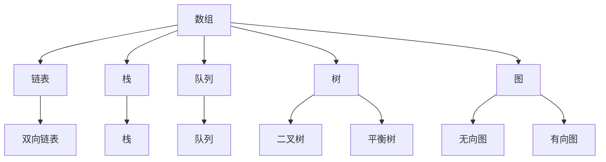
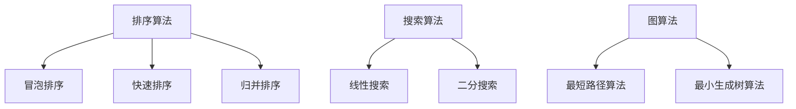

                 


## 文章标题

### 《百度2025社招面试真题与算法题解》

## 关键词

- 数据结构与算法
- 面试真题
- 算法实战
- 面试技巧
- 职业规划

## 摘要

本文旨在为即将参加百度2025社招面试的读者提供全面的面试真题与算法题解。文章首先介绍数据结构与算法的基础知识，通过清晰的Mermaid流程图和详细的伪代码，帮助读者理解核心概念与联系。接着，文章针对前端、后端、数据库、算法与数据结构等领域的面试真题进行分类解析，并提供针对性的解题思路和代码实现。此外，文章还针对面试准备、面试实战和心态调整提供实用的技巧和建议。最后，文章通过算法实战案例和项目总结，帮助读者巩固所学知识，提升面试能力和职业素养。

### 第一部分：面试真题解析

#### 第1章：数据结构与算法基础

##### 1.1 数据结构基本概念与应用

数据结构是计算机存储、组织数据的方式，是算法设计的基础。本节将介绍常见的数据结构，包括数组、链表、栈、队列、树、图等，并使用Mermaid流程图展示其分类与常见结构。

- **数组**：线性结构，支持随机访问，时间复杂度为O(1)。
- **链表**：线性结构，支持动态扩展，时间复杂度为O(n)。
- **栈**：后进先出（LIFO）结构，支持插入和删除操作。
- **队列**：先进先出（FIFO）结构，支持插入和删除操作。
- **树**：层次结构，包括二叉树、平衡树等，支持快速查找和插入操作。
- **图**：复杂结构，支持节点间的任意连接，常见算法有最短路径、最小生成树等。

以下是一个Mermaid流程图，展示了常见数据结构的分类与关系：



##### 1.2 算法设计与分析

算法是解决问题的步骤和策略。本节将介绍常见算法类型，如排序、搜索、图算法等，并分析其复杂度。

- **排序算法**：包括冒泡排序、选择排序、插入排序、快速排序、归并排序等，时间复杂度从O(n^2)到O(nlogn)不等。
- **搜索算法**：包括线性搜索、二分搜索等，时间复杂度从O(n)到O(logn)不等。
- **图算法**：包括最短路径算法（如Dijkstra算法、Floyd算法）、最小生成树算法（如Prim算法、Kruskal算法）等，时间复杂度从O(n^2)到O(mlogn)不等。

以下是一个排序算法的伪代码：

```plaintext
function QuickSort(arr):
    if length of arr <= 1:
        return arr
    pivot = arr[0]
    left = []
    right = []
    for i = 1 to length of arr:
        if arr[i] < pivot:
            left.append(arr[i])
        else:
            right.append(arr[i])
    return QuickSort(left) + [pivot] + QuickSort(right)
```

##### 1.3 算法实战案例

本节将通过代码实现和解读，介绍常见算法的实战案例。

- **快速排序**：以数组为基础，通过一趟排序将数组划分为两个子数组，然后递归地对子数组进行排序。

```javascript
function quickSort(arr) {
    if (arr.length <= 1) {
        return arr;
    }
    let pivot = arr[0];
    let left = [];
    let right = [];
    for (let i = 1; i < arr.length; i++) {
        if (arr[i] < pivot) {
            left.push(arr[i]);
        } else {
            right.push(arr[i]);
        }
    }
    return quickSort(left).concat(pivot, quickSort(right));
}

// 示例
console.log(quickSort([3, 1, 4, 1, 5, 9]));
```

#### 第2章：面试真题分类解析

##### 2.1 前端面试题

前端面试题主要涉及HTML、CSS、JavaScript以及Vue、React等前端框架。以下是一些常见的前端面试题：

- **HTML与CSS**：
  - 什么是HTML语义化？
  - 什么是响应式设计？
  - CSS选择器的优先级是如何确定的？

- **JavaScript**：
  - 原型和原型链是什么？
  - 什么是闭包？
  - 如何实现事件绑定？

- **Vue**：
  - Vue的双向数据绑定原理是什么？
  - Vue组件之间如何通信？

- **React**：
  - React的虚拟DOM是什么？
  - React组件的生命周期有哪些？

##### 2.2 后端面试题

后端面试题主要涉及Java、Python等后端语言以及Spring、Django等后端框架。以下是一些常见的后端面试题：

- **Java**：
  - 什么是Java虚拟机？
  - 什么是Java内存模型？
  - 什么是多态？

- **Python**：
  - Python有哪些数据类型？
  - Python中的异常处理是什么？

- **Spring**：
  - 什么是Spring的依赖注入？
  - 什么是Spring的事务管理？

- **Django**：
  - 什么是Django的ORM？
  - Django的表关系是如何实现的？

##### 2.3 数据库面试题

数据库面试题主要涉及MySQL、MongoDB等数据库。以下是一些常见的数据库面试题：

- **MySQL**：
  - 如何优化MySQL查询？
  - 什么是MySQL的事务隔离级别？

- **MongoDB**：
  - MongoDB的优势是什么？
  - MongoDB的查询是如何实现的？

##### 2.4 算法与数据结构面试题

算法与数据结构面试题主要涉及排序、搜索、图算法等。以下是一些常见的算法与数据结构面试题：

- **排序算法**：
  - 冒泡排序的时间复杂度是多少？
  - 快速排序的原理是什么？

- **搜索算法**：
  - 二分搜索的时间复杂度是多少？
  - 什么是深度优先搜索？

- **图算法**：
  - 什么是最短路径算法？
  - 什么是最小生成树算法？

#### 第3章：面试技巧与心态

##### 3.1 面试准备

面试前，充分的准备至关重要。以下是一些面试准备的技巧：

- **自我介绍**：准备一份简洁明了的自我介绍，突出自己的优势和特长。
- **简历准备**：确保简历内容真实准确，重点突出自己的项目经验和技能。
- **常见问题**：准备一些面试官可能问到的问题，如“你的优点和缺点是什么？”、“你为什么选择我们公司？”等，并提前准备好答案。

##### 3.2 面试实战

面试过程中，良好的沟通技巧和心态至关重要。以下是一些面试实战的技巧：

- **面试流程**：了解面试的流程和注意事项，如提前到达面试地点、面试开始前的准备等。
- **沟通技巧**：保持自信和积极的态度，与面试官建立良好的沟通，注意倾听面试官的问题。
- **心态调整**：面试前进行心理调节，保持冷静和放松，避免过度紧张。

##### 3.3 心态调整

面试前，良好的心态调整对面试成功至关重要。以下是一些心态调整的技巧：

- **积极心态**：保持积极的心态，相信自己有能力应对面试。
- **情绪管理**：面试过程中，保持情绪稳定，避免因紧张而影响发挥。
- **心理准备**：对面试可能遇到的困难和挑战做好心理准备，保持乐观的态度。

### 第二部分：算法题解

#### 第4章：算法基础知识

##### 4.1 算法思维导图

算法思维导图可以帮助读者梳理算法的核心概念和联系。以下是一个算法思维导图，展示了常见的算法类型：



##### 4.2 算法设计模式

算法设计模式是解决特定问题的一组通用解决方案。以下是一些常见的算法设计模式：

- **分而治之**：将大问题划分为小问题，分别解决，再合并结果。
- **贪心算法**：每一步选择局部最优解，最终得到全局最优解。
- **动态规划**：通过递推关系，解决复杂的问题。
- **回溯算法**：通过尝试所有可能的路径，找到问题的解。

以下是一个贪心算法的例子，求解最小生成树：

```plaintext
function Kruskal(edges):
    sort edges by weight
    create an empty graph G
    create a disjoint-set data structure for vertices
    for each edge in edges:
        if the edge connects two different components:
            add the edge to G
            union the two components
    return G
```

##### 4.3 算法复杂度分析

算法复杂度分析是评估算法性能的重要方法。以下是一些常见的算法复杂度分析：

- **时间复杂度**：表示算法执行时间与输入规模的关系，常用大O符号表示。
- **空间复杂度**：表示算法所需存储空间与输入规模的关系。

以下是一个算法复杂度分析的例子，求解最长公共子序列：

```plaintext
function LongestCommonSubsequence(X, Y):
    create a 2D array dp of size (m+1) x (n+1)
    for i = 0 to m:
        for j = 0 to n:
            if X[i] == Y[j]:
                dp[i+1][j+1] = dp[i][j] + 1
            else:
                dp[i+1][j+1] = max(dp[i][j+1], dp[i+1][j])
    return dp[m+1][n+1]
```

时间复杂度为O(mn)，空间复杂度为O(mn)。

#### 第5章：算法实战题解

##### 5.1 剑指Offer

《剑指Offer》是程序员面试宝典，其中包含了许多经典的算法题目。以下是一些常见题目的题解：

- **面试题 39. 数组中出现次数超过一半的数字**
  - **题目描述**：数组中有一个数字出现的次数超过数组长度的一半，请找出这个数字。
  - **解题思路**：使用 Boyer-Moore 投票算法，找到可能的候选人，然后验证其是否为题目所求。
  - **代码实现**：

```python
def majorityElement(nums):
    count = 0
    candidate = None
    for num in nums:
        if count == 0:
            candidate = num
        count += (1 if num == candidate else -1)
    return candidate
```

##### 5.2 LeetCode

LeetCode是全球著名的编程竞赛平台，提供了丰富的算法题目。以下是一些热门题目的题解：

- **题目 1. 两数之和**
  - **题目描述**：给定一个整数数组和一个目标值，找出两个数使得它们的和等于目标值。
  - **解题思路**：使用哈希表存储数组中的元素及其索引，遍历数组并检查目标值与当前元素的差是否在哈希表中。
  - **代码实现**：

```python
def twoSum(nums, target):
    hash_map = {}
    for i, num in enumerate(nums):
        complement = target - num
        if complement in hash_map:
            return [hash_map[complement], i]
        hash_map[num] = i
    return []
```

##### 5.3 牛客网

牛客网是中国领先的IT职业社区，提供了大量的面试题库。以下是一些常见题目的题解：

- **题目 2. 等差数列求和**
  - **题目描述**：给定一个等差数列的首项和公差，求前n项和。
  - **解题思路**：使用等差数列求和公式 \( S_n = \frac{n}{2} \times (a_1 + a_n) \)，其中 \( a_1 \) 是首项，\( a_n \) 是第n项。
  - **代码实现**：

```python
def sum_of ArithmeticSeries(first_term, common_difference, number_of_terms):
    last_term = first_term + (number_of_terms - 1) * common_difference
    sum = number_of_terms * (first_term + last_term) // 2
    return sum
```

#### 第6章：面试真题与算法题实战演练

##### 6.1 前端面试真题实战

前端面试真题实战主要涉及HTML、CSS、JavaScript以及Vue、React等前端框架。以下是一些实战案例：

- **案例 1：实现一个简单的Todo List应用**
  - **技术栈**：HTML、CSS、JavaScript、Vue
  - **实战步骤**：
    1. 创建HTML结构，包括输入框、列表和按钮。
    2. 使用Vue实现数据的双向绑定。
    3. 编写JavaScript代码处理用户的操作。

- **案例 2：实现一个瀑布流布局**
  - **技术栈**：HTML、CSS、JavaScript、jQuery
  - **实战步骤**：
    1. 创建HTML结构，包括容器、列和图片。
    2. 使用CSS实现瀑布流布局。
    3. 使用JavaScript监听滚动事件，动态加载图片。

##### 6.2 后端面试真题实战

后端面试真题实战主要涉及Java、Python等后端语言以及Spring、Django等后端框架。以下是一些实战案例：

- **案例 1：实现一个简单的RESTful API**
  - **技术栈**：Java、Spring Boot、MySQL
  - **实战步骤**：
    1. 创建数据库和表。
    2. 使用Spring Boot构建RESTful API。
    3. 编写SQL查询语句处理数据。

- **案例 2：实现一个简单的文件上传功能**
  - **技术栈**：Python、Flask、Nginx
  - **实战步骤**：
    1. 创建Flask应用。
    2. 编写代码处理文件上传。
    3. 配置Nginx作为反向代理。

##### 6.3 数据库面试真题实战

数据库面试真题实战主要涉及MySQL、MongoDB等数据库。以下是一些实战案例：

- **案例 1：优化一个复杂的SQL查询**
  - **技术栈**：MySQL、SQL优化
  - **实战步骤**：
    1. 分析查询语句，找出性能瓶颈。
    2. 优化索引，改进查询策略。
    3. 测试优化效果。

- **案例 2：实现一个简单的数据库备份与恢复**
  - **技术栈**：MySQL、备份与恢复
  - **实战步骤**：
    1. 使用mysqldump命令备份数据库。
    2. 编写脚本恢复数据库。
    3. 测试备份与恢复过程。

##### 6.4 算法与数据结构面试真题实战

算法与数据结构面试真题实战主要涉及排序、搜索、图算法等。以下是一些实战案例：

- **案例 1：实现一个有效的排序算法**
  - **技术栈**：排序算法
  - **实战步骤**：
    1. 选择一种排序算法，如快速排序。
    2. 编写代码实现排序算法。
    3. 测试排序算法的性能。

- **案例 2：实现一个高效的搜索算法**
  - **技术栈**：搜索算法
  - **实战步骤**：
    1. 选择一种搜索算法，如二分搜索。
    2. 编写代码实现搜索算法。
    3. 测试搜索算法的性能。

### 第7章：项目实战与总结

##### 7.1 项目实战案例

项目实战案例是对所学知识的综合应用，以下是一个项目实战案例的介绍：

- **项目名称**：在线购物平台
- **技术栈**：Java、Spring Boot、MySQL、HTML、CSS、JavaScript、Vue
- **项目描述**：
  - 实现用户注册、登录、购物车等功能。
  - 使用MySQL存储用户信息和商品信息。
  - 使用Spring Boot构建后端API。
  - 使用Vue和HTML、CSS实现前端界面。
- **实战步骤**：
  1. 创建数据库和表。
  2. 编写后端API接口。
  3. 编写前端页面和交互逻辑。
  4. 部署应用并进行测试。

##### 7.2 算法与面试技巧总结

算法与面试技巧总结是对项目实战经验的提炼和总结，以下是一些关键点：

- **熟练掌握常见数据结构与算法**：如数组、链表、树、图、排序、搜索算法等。
- **理解算法复杂度分析**：能够准确评估算法的性能。
- **掌握面试技巧**：如自我介绍、问题回答、沟通技巧等。
- **积累项目经验**：通过实际项目应用所学知识，提高解决实际问题的能力。

##### 7.3 职业规划与发展

职业规划与发展是个人职业成长的指导，以下是一些建议：

- **确定职业目标**：明确自己的职业发展方向，如技术专家、项目经理等。
- **持续学习**：保持对新技术和新知识的关注，持续提升自己的技能水平。
- **积累经验**：通过实际项目积累经验，提高自己的解决问题能力。
- **建立人际网络**：与同行建立良好的关系，扩大自己的人脉。

### 附录

#### 附录A：算法与面试资源推荐

以下是一些推荐的算法与面试资源：

- **算法资源**：
  - 《算法导论》：经典算法教材，适合深入学习。
  - 《大话数据结构》：通俗易懂的数据结构教材，适合入门。
  - 《剑指Offer》：包含大量面试真题和解答，适合面试准备。

- **面试资源**：
  - LeetCode：提供大量的算法题目和在线编程环境。
  - 牛客网：提供面试题库和在线编程平台，适合面试准备。
  - 《程序员面试金典》：包含大量面试真题和解答，适合面试准备。

#### 附录B：参考书籍与文献

以下是一些推荐的参考书籍与文献：

- **数据结构与算法相关书籍**：
  - 《算法导论》：经典算法教材，适合深入学习。
  - 《大话数据结构》：通俗易懂的数据结构教材，适合入门。
  - 《编程之美》：微软面试心得，适合面试准备。

- **面试指南与真题集**：
  - 《剑指Offer》：包含大量面试真题和解答，适合面试准备。
  - 《程序员面试金典》：包含大量面试真题和解答，适合面试准备。

- **相关技术书籍**：
  - 《深入理解计算机系统》：计算机系统原理教材，适合系统架构师。
  - 《计算机网络：自顶向下方法》：计算机网络教材，适合网络工程师。

### 结语

感谢您阅读本文，希望本文能为您在百度2025社招面试中提供有价值的帮助。在面试过程中，保持积极的心态，充分发挥自己的能力，祝您面试成功！

### 作者信息

- 作者：AI天才研究院/AI Genius Institute & 禅与计算机程序设计艺术 /Zen And The Art of Computer Programming

本文内容仅供参考，实际面试情况可能有所不同。祝您面试成功！

