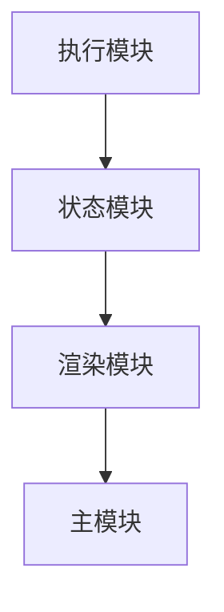
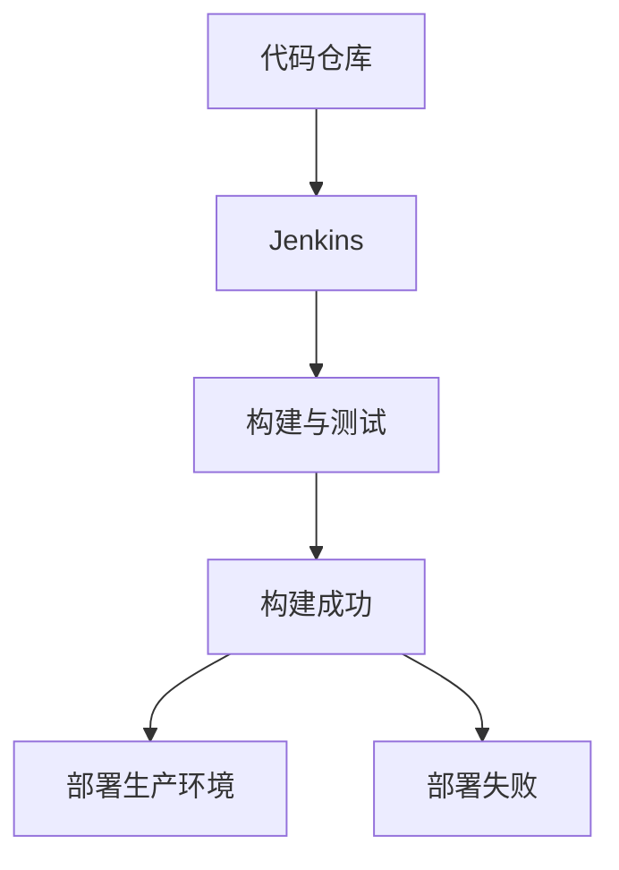
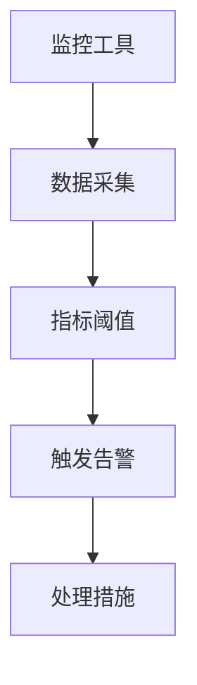
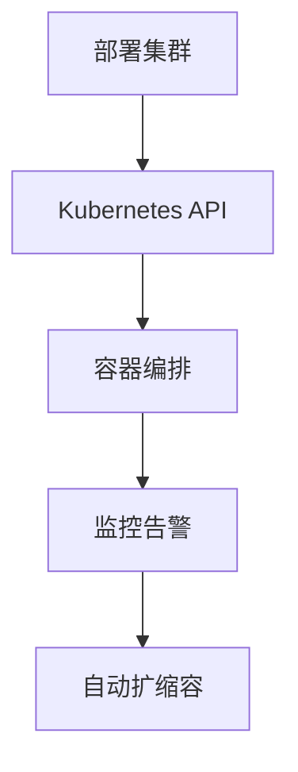

                 

### 文章标题：百度2025自动化运维工程师社招面试题集

> 关键词：自动化运维，面试题集，面试准备，面试技巧，实践案例分析

> 摘要：本文旨在为有意向成为自动化运维工程师的求职者提供一份全面的面试题集。本文将深入探讨自动化运维的基础知识，涵盖运维工具的使用，实践案例，以及面试中可能遇到的各种问题。通过本文的详细解析，读者将能够更好地准备面试，提升自己的专业技能和面试表现。

### 目录

1. **自动化运维基础**
   1.1 自动化运维概述
   1.2 自动化运维与传统运维的区别
   1.3 自动化运维的优势
   2. 自动化运维工具
   2.1 搭建自动化运维环境
   2.2 SaltStack
   2.3 Ansible
   2.4 Jenkins
   3. 自动化运维实践
   3.1 构建CI/CD流程
   3.2 搭建自动化监控体系
   3.3 自动化运维在容器化应用中的实践

2. **自动化运维面试题集**
   4. 运维基础知识
   4.1 网络知识
   4.2 服务器知识
   4.3 数据库知识
   5. 自动化运维面试题
   5.1 SaltStack面试题
   5.2 Ansible面试题
   5.3 Jenkins面试题
   5.4 CI/CD面试题
   5.5 容器化应用面试题
   6. 自动化运维案例分析
   6.1 案例一：企业级自动化运维实践
   6.2 案例二：自动化运维在云计算环境中的应用
   6.3 案例三：自动化运维在边缘计算中的应用
   7. 自动化运维发展趋势与未来
   7.1 自动化运维技术的发展趋势
   7.2 自动化运维的未来挑战与机遇
   7.3 自动化运维的职业规划与发展方向

3. **附录**
   3.1 附录A：常用自动化运维工具简介
   3.2 附录B：自动化运维面试题汇总
   3.3 附录C：自动化运维参考资料

### 引言

自动化运维（Automated Operations）是现代IT运维的一个重要分支，它通过自动化工具和脚本，将传统的手动操作转化为自动化流程，从而提高了运维效率，降低了人为错误。随着云计算、容器化技术的兴起，自动化运维的应用范围越来越广泛，已经成为企业提高IT运营效率的关键手段。

面对日益激烈的招聘市场，自动化运维工程师的面试准备显得尤为重要。本文将围绕自动化运维的基础知识、工具使用、实践案例以及面试题集进行全面剖析，旨在帮助读者深入了解自动化运维的核心内容，提高面试成功率。

本文结构清晰，内容丰富，分为以下几个部分：

1. **自动化运维基础**：介绍自动化运维的概念、与传统运维的区别及优势。
2. **自动化运维工具**：详细讲解常用的自动化运维工具，如SaltStack、Ansible、Jenkins等。
3. **自动化运维实践**：通过构建CI/CD流程、搭建自动化监控体系等实践案例，展示自动化运维的实际应用。
4. **自动化运维面试题集**：汇总运维基础知识、自动化运维工具以及相关面试题，帮助读者进行面试准备。
5. **自动化运维案例分析**：分析企业级自动化运维实践、云计算环境和边缘计算中的自动化运维应用。
6. **自动化运维发展趋势与未来**：探讨自动化运维的发展趋势、未来挑战及职业规划。

通过本文的阅读，读者将能够全面了解自动化运维的核心内容，为面试和职业发展打下坚实的基础。

### 自动化运维基础

#### 第1章：自动化运维概述

#### 1.1 自动化运维的概念

自动化运维（Automated Operations）是指通过使用工具和脚本，将传统的手动运维操作转化为自动化流程，从而实现高效、准确、稳定的管理和维护。自动化运维的核心目标是减少人工干预，提高运维效率，降低运营成本。

自动化运维不仅包括服务器、网络的自动化配置和管理，还包括应用程序的部署、监控和优化。通过自动化运维，企业可以快速响应业务变化，灵活调整资源分配，提高IT基础设施的可用性和可靠性。

#### 1.2 自动化运维与传统运维的区别

传统运维（Traditional Operations）主要依赖于人工操作，需要运维人员逐一执行各种任务，如服务器配置、软件安装、系统监控等。这种手动方式效率低下，容易出错，且难以进行大规模的扩展和管理。

相比之下，自动化运维通过脚本和工具实现任务自动化，大幅提高了运维效率。以下是自动化运维与传统运维的主要区别：

1. **效率**：自动化运维通过批量执行任务，大大提高了处理速度，减少了运维人员的工作量。
2. **准确性**：自动化运维减少了人为干预，降低了人为错误的可能性，提高了操作的准确性。
3. **可扩展性**：自动化运维可以轻松扩展到大规模环境，对新增服务器或应用程序进行自动配置和管理。
4. **可重复性**：自动化运维确保任务的一致性和可重复性，使得运维操作更加规范和标准化。

#### 1.3 自动化运维的优势

自动化运维具有多方面的优势，以下是其中几个主要方面：

1. **提高运维效率**：通过自动化工具和脚本，运维人员可以从重复性任务中解放出来，将更多精力投入到复杂和高价值的任务中。
2. **降低运营成本**：自动化运维减少了人力投入，降低了运维成本。同时，通过提高资源利用率，进一步降低了运营成本。
3. **提高运维质量**：自动化运维减少了人为错误，提高了运维操作的准确性和一致性，从而提高了运维质量。
4. **提升业务响应速度**：自动化运维使得IT基础设施能够快速响应业务需求，缩短了新功能上线的时间，提高了业务敏捷性。
5. **增强运维监控和告警**：自动化运维工具通常具备强大的监控和告警功能，可以及时发现并处理异常情况，保障系统的稳定运行。

通过以上介绍，读者可以初步了解自动化运维的概念、与传统运维的区别以及其优势。在接下来的章节中，我们将进一步探讨自动化运维工具的使用和实践案例。

### 自动化运维工具

#### 第2章：自动化运维工具

自动化运维工具是实施自动化运维的关键，它们可以大大简化运维任务，提高工作效率。在本章中，我们将详细介绍几种常用的自动化运维工具，包括SaltStack、Ansible和Jenkins。

#### 2.1 搭建自动化运维环境

要实现自动化运维，首先需要搭建一个稳定的自动化运维环境。这个过程通常包括以下步骤：

1. **选择合适的操作系统**：自动化运维环境通常基于Linux操作系统，如Ubuntu、CentOS等。选择一个适合的工具和环境可以提高运维效率。
2. **安装必要的基础软件**：在运维环境中安装Python、Git、SSH等基础软件，这些工具将用于编写和部署自动化脚本。
3. **配置SSH密钥认证**：为了实现自动化部署和管理，需要配置SSH密钥认证，确保不同服务器之间的安全通信。
4. **选择合适的自动化工具**：根据需求和场景，选择合适的自动化工具，如SaltStack、Ansible、Jenkins等。

#### 2.2 SaltStack

SaltStack是一种开源的自动化运维工具，它通过Python语言编写模块，实现自动化任务执行。以下是SaltStack的一些主要特点：

1. **高并发执行**：SaltStack使用零MQ（Message Queueing）技术，可以实现高并发的任务执行，大大提高了运维效率。
2. **模块化设计**：SaltStack具有模块化的设计，包括执行模块、状态模块、渲染模块等，方便扩展和定制。
3. **灵活的配置管理**：通过YAML文件进行配置管理，使得配置文件更加直观和易于维护。
4. **强大的监控和告警功能**：SaltStack内置了监控和告警功能，可以实时监控服务器状态，并触发告警。

以下是一个简单的SaltStack模块化设计的Mermaid流程图：



#### 2.3 Ansible

Ansible是一种简单的自动化运维工具，它通过SSH协议进行远程操作，实现自动化部署和管理。以下是Ansible的一些主要特点：

1. **无代理架构**：Ansible不需要在目标主机上安装代理软件，通过SSH直接进行远程操作，简化了部署过程。
2. **基于Python模块**：Ansible使用Python模块进行任务定义和执行，模块化设计方便扩展和定制。
3. **基于YAML配置**：Ansible使用YAML文件进行配置管理，使得配置文件更加直观和易于维护。
4. **强大的集成能力**：Ansible可以与各种持续集成和持续部署（CI/CD）工具集成，实现自动化流水线。

以下是一个简单的Ansible配置示例：

```yaml
- hosts: all
  become: yes
  tasks:
    - name: Install Apache
      yum: name=httpd state=present
    - name: Start Apache
      service: name=httpd state=started
```

#### 2.4 Jenkins

Jenkins是一种流行的开源持续集成和持续部署（CI/CD）工具，它可以通过自动化任务实现代码的持续集成和持续部署。以下是Jenkins的一些主要特点：

1. **易用性**：Jenkins提供了丰富的插件系统，可以轻松集成各种工具和库，实现复杂的CI/CD流程。
2. **分布式构建**：Jenkins支持分布式构建，可以将任务分发到多台服务器上执行，提高构建速度。
3. **强大的监控和告警功能**：Jenkins内置了监控和告警功能，可以实时监控构建状态，并触发告警。
4. **丰富的集成能力**：Jenkins可以与Git、GitHub、Jira等工具集成，实现代码的自动化管理。

以下是一个简单的Jenkins构建流水线示例：

```shell
# Jenkinsfile
pipeline {
    agent any
    stages {
        stage('Build') {
            steps {
                sh 'mvn clean install'
            }
        }
        stage('Test') {
            steps {
                sh 'mvn test'
            }
        }
        stage('Deploy') {
            steps {
                sh 'mvn deploy'
            }
        }
    }
}
```

通过以上对SaltStack、Ansible和Jenkins的介绍，读者可以初步了解这些自动化运维工具的特点和适用场景。在接下来的章节中，我们将进一步探讨自动化运维的实际应用和实践案例。

### 自动化运维实践

#### 第3章：自动化运维实践

自动化运维不仅需要选择合适的工具，还需要将理论应用于实际场景。在本章中，我们将通过构建CI/CD流程、搭建自动化监控体系以及自动化运维在容器化应用中的实践，展示自动化运维的实际应用。

#### 3.1 构建CI/CD流程

持续集成（Continuous Integration，CI）和持续部署（Continuous Deployment，CD）是现代软件开发中的重要概念，它们通过自动化流程确保代码质量和快速交付。以下是一个典型的CI/CD流程：

1. **代码仓库**：开发人员将代码提交到版本控制系统（如Git），如GitHub或GitLab。
2. **持续集成**：Jenkins或类似工具从代码仓库中拉取最新代码，并执行自动化构建和测试。如果测试失败，构建将被暂停，并向开发人员发送通知。
3. **持续部署**：通过自动化脚本或工具（如Ansible、Kubernetes），将构建结果部署到生产环境。这个过程包括配置管理、环境设置、数据库迁移等。

以下是一个简单的CI/CD流程的Mermaid流程图：



#### 3.2 搭建自动化监控体系

自动化监控是确保系统稳定运行的重要环节。通过自动化工具和脚本，可以实现对服务器、网络、应用等各种指标的实时监控。以下是一个自动化监控体系的基本架构：

1. **监控工具**：选择合适的监控工具，如Prometheus、Zabbix等。
2. **数据采集**：通过自动化脚本（如Ansible）收集服务器和网络指标，并将数据推送到监控工具。
3. **告警与处理**：当监控指标超出阈值时，自动触发告警，并执行相应的处理措施，如重启服务、扩容资源等。

以下是一个简单的自动化监控体系的Mermaid流程图：



#### 3.3 自动化运维在容器化应用中的实践

随着容器化技术的普及，自动化运维在容器化应用中的重要性日益凸显。Kubernetes（K8s）是当前最流行的容器编排工具，通过自动化运维，可以实现对容器集群的自动化管理。

以下是在Kubernetes环境中实施自动化运维的步骤：

1. **集群部署**：使用自动化工具（如Ansible）部署Kubernetes集群，包括Master节点和Worker节点。
2. **容器编排**：使用Kubernetes API进行容器编排，实现应用的自动化部署、扩展和管理。
3. **监控与告警**：通过Prometheus等监控工具，对容器集群进行实时监控，并设置告警阈值。
4. **自动扩缩容**：根据负载情况，自动调整容器集群的规模，确保应用的高可用性和性能。

以下是一个简单的Kubernetes自动化运维的Mermaid流程图：



通过以上实践，自动化运维不仅提高了运维效率，还确保了系统的稳定性和可靠性。在接下来的章节中，我们将通过具体的面试题集，进一步探讨自动化运维的相关知识和应用。

### 运维基础知识

在自动化运维工程师的面试中，运维基础知识是必不可少的考察内容。本章将涵盖网络知识、服务器知识以及数据库知识，为读者提供全面的基础知识储备。

#### 4.1 网络知识

网络是现代IT系统的基础，掌握网络知识对于自动化运维工程师至关重要。以下是几个关键的网络知识点：

1. **TCP/IP协议**：TCP/IP是互联网的核心协议，包括TCP（传输控制协议）和IP（互联网协议）。TCP负责可靠的数据传输，而IP负责数据包的路由和传输。
2. **DNS（域名系统）**：DNS用于将域名解析为IP地址，使得用户可以通过易于记忆的域名访问网站。
3. **防火墙**：防火墙用于保护网络免受未授权访问和攻击，包括包过滤防火墙和状态检测防火墙。
4. **负载均衡**：负载均衡通过将流量分配到多个服务器，提高系统的可用性和性能。
5. **VLAN（虚拟局域网）**：VLAN用于将网络划分为多个虚拟的局域网，提高网络的灵活性和安全性。

面试题示例：

- **问**：请简述TCP/IP协议的主要组成部分及其作用。
- **答**：TCP/IP协议主要包括传输控制协议（TCP）和互联网协议（IP）。TCP负责可靠的数据传输，包括数据包的确认、重传和流量控制。IP负责数据包的路由和传输，将数据包从源地址发送到目标地址。

#### 4.2 服务器知识

服务器是自动化运维的核心，了解服务器的配置和管理对于运维工程师至关重要。以下是几个关键的服务器知识点：

1. **服务器硬件**：了解服务器的硬件配置，包括CPU、内存、硬盘、网络接口等，以便进行合理的资源分配。
2. **操作系统**：熟悉常见的操作系统，如Linux（如Ubuntu、CentOS）和Windows Server，了解它们的安装、配置和管理。
3. **虚拟化技术**：虚拟化技术（如VMware、KVM）可以将一台物理服务器划分为多个虚拟机，提高资源利用率。
4. **服务配置**：了解常见的服务配置，如Web服务器（Apache、Nginx）、数据库服务器（MySQL、PostgreSQL）、邮件服务器（Postfix、Dovecot）等。
5. **安全设置**：了解服务器的安全设置，如防火墙、SELinux、SSH密钥认证等，确保服务器安全可靠。

面试题示例：

- **问**：请简述虚拟化技术的优势和不足。
- **答**：虚拟化技术的优势包括提高资源利用率、灵活的资源配置、便于管理和维护。不足之处包括性能损耗、虚拟机之间资源共享带来的安全性问题以及虚拟化软件的复杂性。

#### 4.3 数据库知识

数据库是存储和管理数据的核心，掌握数据库知识对于自动化运维工程师同样重要。以下是几个关键的数据库知识点：

1. **关系型数据库**：了解常见的关系型数据库，如MySQL、PostgreSQL、Oracle等，了解它们的安装、配置和管理。
2. **非关系型数据库**：了解常见的非关系型数据库，如MongoDB、Redis、Cassandra等，了解它们的特性和使用场景。
3. **SQL语言**：掌握SQL（结构化查询语言），包括基本的查询、插入、更新和删除操作。
4. **数据库性能优化**：了解数据库性能优化，如索引、查询优化、缓存策略等。
5. **数据备份与恢复**：了解数据的备份和恢复策略，包括全备份、增量备份、差异备份等。

面试题示例：

- **问**：请简述MySQL中索引的工作原理和优缺点。
- **答**：索引是数据库中用于加速查询的数据结构，通过索引，数据库可以快速定位到特定数据。优点包括提高查询效率、减少磁盘IO。缺点包括增加存储空间、影响写入速度。

通过本章对网络知识、服务器知识和数据库知识的介绍，读者可以全面了解运维基础知识，为自动化运维工程师的面试做好准备。

### 自动化运维面试题

在自动化运维工程师的面试中，面试官往往会通过一系列问题来评估应聘者的专业知识、实践能力和问题解决能力。以下将根据不同工具和领域，列举一些常见的面试题，并提供参考答案，帮助读者进行面试准备。

#### 5.1 SaltStack面试题

1. **问**：请简述SaltStack的工作原理。
   **答**：SaltStack是一个开源的自动化运维工具，它通过零MQ（Message Queueing）实现高并发的任务执行。SaltStack由四个主要组件组成：Master、Minion、Salt Bond和Returner。Master是SaltStack的主控制器，负责分发任务和收集结果；Minion是运行在目标主机上的代理，负责执行任务；Salt Bond用于加密通信，保证数据的安全性；Returner用于接收Minion的任务结果。

2. **问**：SaltStack有哪些优点？
   **答**：SaltStack的优点包括：
   - **高并发**：通过零MQ实现快速任务执行，支持高并发操作。
   - **模块化**：具有模块化的设计，包括执行模块、状态模块、渲染模块等，方便扩展和定制。
   - **配置管理**：通过YAML文件进行配置管理，配置文件直观、易于维护。
   - **强大的监控和告警功能**：内置监控和告警功能，可以实时监控服务器状态。

3. **问**：请举例说明如何使用SaltStack部署一个Web服务器。
   **答**：
   ```yaml
   # saltstack部署Web服务器的YAML配置
   webserver:
     pkg:
       - installed
       - name: httpd
       - state: present
     service:
       - running
       - name: httpd
       - enable: True
   ```
   通过上述配置，SaltStack会自动安装Apache Web服务器，并确保其运行和启用。

#### 5.2 Ansible面试题

1. **问**：请简述Ansible的工作原理。
   **答**：Ansible是一种简单的自动化运维工具，它通过SSH协议进行远程操作，实现自动化部署和管理。Ansible的核心组件包括主机清单（inventory）、扮演者（playbook）和模块（module）。主机清单定义了要管理的服务器列表；扮演者定义了要执行的任务序列；模块是实现特定功能的代码单元。

2. **问**：请举例说明如何使用Ansible安装和配置Nginx。
   **答**：
   ```yaml
   - hosts: webservers
     become: yes
     tasks:
       - name: 安装Nginx
         yum:
           - name: nginx
           - state: present
   
       - name: 启动Nginx服务
         service:
           - name: nginx
           - state: started
           - enabled: yes
   ```
   通过上述配置，Ansible会自动安装Nginx，并启动和启用Nginx服务。

3. **问**：请简述Ansible与Puppet、Chef的区别。
   **答**：
   - **Ansible**：无代理架构，通过SSH直接连接目标主机，无需安装额外软件。配置简单，易于部署。适用于中小型项目和快速部署。
   - **Puppet**：有代理架构，需要在目标主机上安装Puppet代理。配置复杂，支持丰富的模块和功能。适用于大型企业级项目。
   - **Chef**：有代理架构，类似于Puppet。使用Ruby语言编写配置脚本，支持复杂的配置管理。适用于大型企业级项目。

#### 5.3 Jenkins面试题

1. **问**：请简述Jenkins的主要功能。
   **答**：Jenkins是一个开源的持续集成和持续部署（CI/CD）工具，其主要功能包括：
   - **自动化构建**：根据代码变化自动构建项目。
   - **自动化测试**：执行自动化测试，确保代码质量。
   - **自动化部署**：将构建结果自动部署到生产环境。
   - **监控和告警**：实时监控构建状态，并触发告警。
   - **插件扩展**：Jenkins拥有丰富的插件系统，可以扩展其功能。

2. **问**：请举例说明如何使用Jenkins构建一个Maven项目。
   **答**：
   ```xml
   <project>
     <description>这是一个简单的Maven项目。</description>
     <scm>
       <connection>scm:git:git@github.com:username/repository.git</connection>
       <developerConnection>scm:git:git@github.com:username/repository.git</developerConnection>
       <url>git@github.com:username/repository.git</url>
     </scm>
     <modelVersion>4.0.0</modelVersion>
   
     <groupId>com.example</groupId>
     <artifactId>my-project</artifactId>
     <version>1.0-SNAPSHOT</version>
   
     <dependencies>
       <dependency>
         <groupId>junit</groupId>
         <artifactId>junit</artifactId>
         <version>4.13.2</version>
         <scope>test</scope>
       </dependency>
     </dependencies>
   
     <build>
       <plugins>
         <plugin>
           <groupId>org.apache.maven.plugins</groupId>
           <artifactId>maven-clean-plugin</artifactId>
           <version>3.1.0</version>
         </plugin>
         <plugin>
           <groupId>org.apache.maven.plugins</groupId>
           <artifactId>maven-site-plugin</artifactId>
           <version>3.7.1</version>
         </plugin>
       </plugins>
     </build>
   </project>
   ```
   通过上述Maven项目配置，Jenkins可以自动执行项目的构建、测试和部署。

3. **问**：请简述Jenkins流水线（Pipeline）的概念及其优势。
   **答**：Jenkins流水线是一种基于Groovy语言定义的持续集成和持续部署工作流。优势包括：
   - **脚本化**：使用Groovy语言定义工作流，灵活定制。
   - **并行执行**：支持并行执行任务，提高构建速度。
   - **易于扩展**：通过插件系统扩展功能，支持多种工具和库。
   - **版本控制**：流水线配置存储在版本控制系统中，便于管理和维护。

通过以上对SaltStack、Ansible和Jenkins的面试题及其解答，读者可以更好地准备自动化运维工程师的面试。在面试过程中，除了掌握工具的使用方法，还需要注重问题解决能力和逻辑思维能力的展现。

### CI/CD面试题

持续集成和持续部署（CI/CD）是现代软件开发和运维的重要概念，它通过自动化流程确保代码质量和快速交付。以下是一些常见的CI/CD面试题及其解答，帮助读者进行面试准备。

#### 5.4.1 持续集成（CI）

1. **问**：请简述持续集成的概念和作用。
   **答**：持续集成（Continuous Integration，CI）是一种软件开发实践，旨在通过频繁地将代码集成到共享的主干分支中，确保代码库的稳定性和质量。持续集成的核心作用包括：
   - **快速发现问题**：通过频繁集成，可以快速发现代码冲突和潜在问题，减少修复成本。
   - **确保代码质量**：自动化测试和代码审查确保每次集成都是高质量的，降低缺陷率。
   - **提高团队协作效率**：频繁集成促进了团队成员之间的沟通和协作。

2. **问**：请举例说明如何使用GitLab CI实现持续集成。
   **答**：
   ```yaml
   # .gitlab-ci.yml
   image: maven:3.6.3-jdk-11
   services:
     - postgres:13
   stages:
     - name: build
       script:
         - mvn clean install
       only:
         - master
     - name: test
       script:
         - mvn test
       only:
         - master
     - name: deploy
       script:
         - docker-compose up -d
       only:
         - master
   ```
   通过上述GitLab CI配置，每次在主分支（master）的提交都会触发构建、测试和部署过程。

#### 5.4.2 持续部署（CD）

1. **问**：请简述持续部署的概念和作用。
   **答**：持续部署（Continuous Deployment，CD）是一种自动化部署流程，通过持续集成和自动化测试，确保代码库的任何更改都可以自动部署到生产环境。持续部署的核心作用包括：
   - **快速交付**：自动化部署缩短了软件交付周期，提高了开发效率。
   - **降低风险**：通过自动化测试和质量控制，降低部署过程中的风险。
   - **持续优化**：持续部署使得团队能够持续优化部署流程，提高系统稳定性。

2. **问**：请举例说明如何使用Kubernetes实现持续部署。
   **答**：
   ```yaml
   # deployment.yaml
   apiVersion: apps/v1
   kind: Deployment
   metadata:
     name: my-app
     labels:
       app: my-app
   spec:
     replicas: 3
     selector:
       matchLabels:
         app: my-app
     template:
       metadata:
         labels:
           app: my-app
       spec:
         containers:
         - name: my-app
           image: my-app:latest
           ports:
           - containerPort: 80
   ```
   通过上述Kubernetes部署配置，每次提交新版本时，Kubernetes会自动部署新的容器实例，实现自动化部署。

3. **问**：请简述Jenkins流水线（Pipeline）的概念及其优势。
   **答**：Jenkins流水线（Pipeline）是一种基于Groovy语言定义的持续集成和持续部署工作流。优势包括：
   - **脚本化**：使用Groovy语言定义工作流，灵活定制。
   - **并行执行**：支持并行执行任务，提高构建速度。
   - **易于扩展**：通过插件系统扩展功能，支持多种工具和库。
   - **版本控制**：流水线配置存储在版本控制系统中，便于管理和维护。

通过以上对CI/CD的面试题及其解答，读者可以更好地理解持续集成和持续部署的核心概念和实际应用。在面试过程中，除了掌握工具的使用方法，还需要注重问题解决能力和逻辑思维能力的展现。

### 容器化应用面试题

随着容器化技术的快速发展，Docker和Kubernetes成为自动化运维中的重要工具。以下是一些关于Docker和Kubernetes的常见面试题及其解答，帮助读者更好地准备自动化运维工程师的面试。

#### 5.5.1 Docker面试题

1. **问**：请简述Docker的基本概念和主要组件。
   **答**：Docker是一种开源的容器化技术，通过将应用程序及其依赖打包到一个独立的容器中，实现应用程序的标准化部署和运行。Docker的主要组件包括：
   - **Docker Engine**：Docker的核心组件，负责容器创建和管理。
   - **Dockerfile**：用于定义容器构建过程的脚本文件，包括安装软件、设置环境变量等。
   - **docker-compose**：用于定义和运行多容器应用的配置文件，基于Docker Compose文件管理容器。

2. **问**：请举例说明如何使用Dockerfile创建一个Web服务器容器。
   **答**：
   ```dockerfile
   # Dockerfile
   FROM ubuntu:18.04
   RUN apt-get update && apt-get install -y apache2
   EXPOSE 80
   CMD ["apache2-ctl", "start"]
   ```
   通过上述Dockerfile，创建的容器会安装Apache Web服务器，并暴露端口80，启动服务。

3. **问**：请简述Docker Compose的基本概念和作用。
   **答**：Docker Compose是一种用于定义和运行多容器应用的工具，通过docker-compose.yml文件定义应用程序的服务和依赖。主要作用包括：
   - **服务编排**：定义和启动多个容器服务，如Web、数据库等。
   - **容器网络**：管理容器之间的网络连接。
   - **容器编排**：通过yaml文件定义容器的启动、停止和重启等操作。

4. **问**：请举例说明如何使用docker-compose部署一个简单的Web应用。
   **答**：
   ```yaml
   # docker-compose.yml
   version: '3'
   services:
     web:
       image: nginx:latest
       ports:
         - "8080:80"
   ```
   通过上述docker-compose.yml文件，启动Nginx容器，并映射端口8080到宿主机的80端口。

#### 5.5.2 Kubernetes面试题

1. **问**：请简述Kubernetes的基本概念和主要组件。
   **答**：Kubernetes是一个开源的容器编排平台，用于自动化容器化应用程序的部署、扩展和管理。主要组件包括：
   - **Master节点**：Kubernetes集群的管理中心，包括API Server、Controller Manager和Scheduler。
   - **Node节点**：运行容器的计算节点，包括Docker、rkt等容器运行时。
   - **Pod**：Kubernetes中最小的部署单位，一个Pod可以包含一个或多个容器。
   - **Service**：定义一组Pod的访问方式，提供负载均衡和服务发现功能。

2. **问**：请举例说明如何使用Kubernetes部署一个Nginx服务。
   **答**：
   ```yaml
   # deployment.yaml
   apiVersion: apps/v1
   kind: Deployment
   metadata:
     name: nginx-deployment
   spec:
     replicas: 3
     selector:
       matchLabels:
         app: nginx
   template:
     metadata:
       labels:
         app: nginx
     spec:
       containers:
       - name: nginx
         image: nginx:latest
         ports:
         - containerPort: 80
   ```
   通过上述部署配置，Kubernetes会创建3个Nginx容器的副本，确保服务的高可用性。

3. **问**：请简述Kubernetes中的Service类型及其作用。
   **答**：Kubernetes中的Service类型包括ClusterIP、NodePort、LoadBalancer等，作用如下：
   - **ClusterIP**：在集群内部提供服务的虚拟IP，默认类型，只能在集群内部访问。
   - **NodePort**：通过宿主机的端口映射提供外部访问，每个Service分配一个端口号。
   - **LoadBalancer**：通过云服务提供商提供的负载均衡器提供外部访问，适用于云环境。

4. **问**：请举例说明如何使用Kubernetes进行水平扩展（Horizontal Scaling）。
   **答**：
   ```yaml
   # deployment.yaml
   apiVersion: apps/v1
   kind: Deployment
   metadata:
     name: my-app
     labels:
       app: my-app
   spec:
     replicas: 3
     selector:
       matchLabels:
         app: my-app
   template:
     metadata:
       labels:
         app: my-app
     spec:
       containers:
       - name: my-app
         image: my-app:latest
         ports:
         - containerPort: 80
   ```
   通过增加`replicas`字段值，Kubernetes会自动创建更多相同容器的副本，实现服务的水平扩展。

通过以上对Docker和Kubernetes的面试题及其解答，读者可以更好地掌握容器化应用的核心概念和实际操作。在面试过程中，除了熟悉工具的使用，还需要注重问题解决能力和对容器化技术的深入理解。

### 自动化运维案例分析

自动化运维在现代化企业中扮演着至关重要的角色，通过具体的案例可以更好地展示其应用场景和实际效果。以下将分析几个企业级自动化运维实践，以及自动化运维在云计算环境和边缘计算中的应用案例。

#### 6.1 企业级自动化运维实践

某大型互联网公司在其IT基础设施中引入了自动化运维，实现了从基础设施到应用的全流程自动化管理，以下是其实践过程：

1. **自动化运维平台搭建**：公司首先搭建了自动化运维平台，包括SaltStack、Ansible、Jenkins等工具。通过这些工具，实现服务器的自动配置、软件的自动安装和应用的自动部署。

2. **自动化CI/CD流程**：公司建立了CI/CD流水线，通过GitLab CI与Jenkins集成，实现代码的自动化构建、测试和部署。每次代码提交都会触发构建和测试，确保代码质量和快速交付。

3. **自动化监控与告警**：公司采用Prometheus、Zabbix等工具进行自动化监控，实现对服务器、网络和应用性能的实时监控。当监控指标超出阈值时，会自动触发告警，运维人员可以及时响应和处理。

4. **自动化运维文档**：为了提高运维效率，公司编写了详细的自动化运维文档，包括配置管理、CI/CD流程、监控告警等，使得新员工可以快速上手。

5. **自动化运维培训**：公司定期开展自动化运维培训，提升运维团队的技术能力和实践水平，确保团队能够持续优化自动化运维流程。

通过以上实践，公司实现了运维效率的大幅提升，减少了人为错误，提高了系统的稳定性和可靠性。

#### 6.2 自动化运维在云计算环境中的应用

随着云计算的普及，自动化运维在云计算环境中的应用也越来越广泛。以下是一个典型的云计算自动化运维案例：

1. **自动化资源管理**：企业采用AWS、Azure或阿里云等云服务提供商，通过云平台提供的API实现自动化资源管理，如自动创建和配置虚拟机、自动伸缩集群等。

2. **自动化网络配置**：通过云平台的网络服务，如AWS VPC、Azure Network等，实现自动化网络配置，确保网络的稳定和安全。

3. **自动化数据备份与恢复**：通过云平台提供的备份服务，如AWS Backup、Azure Backup等，实现自动化数据备份和恢复，提高数据安全性和可靠性。

4. **自动化部署与管理**：使用云平台提供的容器编排服务，如ECS、EKS、AKS等，实现自动化部署和管理容器化应用。

5. **自动化监控与告警**：通过云平台提供的监控服务，如AWS CloudWatch、Azure Monitor等，实现自动化监控和告警，及时发现和处理异常情况。

通过以上自动化运维实践，企业能够更好地利用云计算资源，提高运维效率，降低运营成本。

#### 6.3 自动化运维在边缘计算中的应用

边缘计算是近年来兴起的一种计算模式，它通过在靠近数据源的地方进行计算和处理，降低延迟，提高效率。以下是一个边缘计算自动化运维的案例：

1. **自动化边缘节点配置**：通过自动化工具，如Ansible，实现边缘节点的自动配置，确保所有节点都按照统一标准进行配置。

2. **自动化应用部署**：使用容器化技术，如Docker和Kubernetes，实现边缘应用的自动化部署和管理，确保应用在不同节点上的一致性。

3. **自动化监控与告警**：通过边缘计算平台提供的监控工具，如Prometheus、Zabbix等，实现边缘节点的自动化监控和告警，确保系统的稳定运行。

4. **自动化数据处理**：通过边缘计算平台的数据处理模块，实现数据的实时分析和处理，提高数据处理效率。

5. **自动化资源管理**：通过边缘计算平台提供的资源管理工具，实现边缘节点的自动化资源管理，如自动伸缩、负载均衡等。

通过以上自动化运维实践，边缘计算环境能够实现高效、可靠和可扩展的管理，满足不断变化的应用需求。

通过上述案例分析，读者可以更深入地了解自动化运维在不同场景中的应用，为实际工作提供参考和借鉴。

### 自动化运维发展趋势与未来

自动化运维技术正以惊人的速度发展，不断推动IT运维领域的变革。在未来，自动化运维将面临一系列挑战和机遇，其发展趋势主要体现在以下几个方面：

#### 7.1 自动化运维技术的发展趋势

1. **智能化与AI的融合**：随着人工智能技术的发展，自动化运维工具将逐渐引入机器学习和深度学习算法，实现智能故障预测、智能性能优化等高级功能。

2. **容器化与微服务架构**：容器化技术和微服务架构的普及将进一步提升自动化运维的效率，通过自动化工具实现容器集群的自动化部署、扩展和管理。

3. **云原生技术的发展**：云原生技术（如Kubernetes、Docker等）将继续演进，自动化运维工具将更好地与云原生平台集成，提供无缝的部署和管理体验。

4. **多云和混合云管理**：企业将越来越依赖多云和混合云环境，自动化运维工具需要支持跨云平台的资源管理和协调，确保业务的连续性和灵活性。

5. **自动化运维平台的集成与扩展**：未来的自动化运维平台将更加注重集成性和扩展性，通过开放的API和插件系统，实现与其他工具和平台的无缝对接。

#### 7.2 自动化运维的未来挑战与机遇

1. **复杂性的挑战**：随着企业应用场景的复杂化，自动化运维面临更大的挑战。如何应对日益复杂的IT基础设施和不断变化的需求，将是未来自动化运维面临的重要问题。

2. **数据安全和隐私**：自动化运维过程中产生的数据量巨大，如何保障数据安全和用户隐私，将是自动化运维的一个重要课题。

3. **自动化运维的人才需求**：随着自动化运维技术的发展，对自动化运维工程师的专业技能和知识储备提出了更高要求，企业需要培养和吸引更多的自动化运维人才。

4. **技术标准和互操作性**：未来自动化运维工具和技术需要建立统一的标准，提高不同工具和平台之间的互操作性，以简化运维流程，提高工作效率。

5. **可持续性和绿色IT**：自动化运维在提升效率的同时，也需要关注可持续性和绿色IT，通过优化资源配置和降低能耗，实现环境友好和可持续发展。

#### 7.3 自动化运维的职业规划与发展方向

对于自动化运维工程师而言，未来的职业发展有以下几个方向：

1. **高级自动化工程师**：深入掌握自动化运维工具和平台，承担更复杂的项目和任务，解决关键技术问题。

2. **解决方案架构师**：结合业务需求，设计和实施符合企业实际的自动化运维解决方案，提升整体运维水平。

3. **DevOps工程师**：跨职能团队的合作将更加重要，DevOps工程师将成为企业中IT与业务无缝衔接的关键角色。

4. **自动化运维产品经理**：深入了解用户需求，设计开发自动化运维产品，推动产品迭代和优化。

5. **教育培训专家**：培养更多的自动化运维人才，编写教材、开展培训，推动行业的发展和进步。

通过不断学习和实践，自动化运维工程师可以在这个快速变化的领域中找到自己的职业发展方向，实现个人和企业的共同成长。

### 附录

#### 附录A：常用自动化运维工具简介

1. **SaltStack**  
   - **简介**：SaltStack是一个开源的自动化运维工具，通过零MQ（Message Queueing）实现高并发的任务执行，支持模块化设计，适用于大规模运维管理。
   - **优点**：高并发执行、模块化设计、配置管理方便、强大的监控和告警功能。
   - **使用场景**：服务器配置、应用部署、自动化监控等。

2. **Ansible**  
   - **简介**：Ansible是一种简单的自动化运维工具，通过SSH协议进行远程操作，无需代理软件，配置简单，适用于中小型项目和快速部署。
   - **优点**：无代理架构、基于Python模块、配置文件直观、集成能力强。
   - **使用场景**：服务器配置、应用部署、自动化测试等。

3. **Jenkins**  
   - **简介**：Jenkins是一个开源的持续集成和持续部署（CI/CD）工具，拥有丰富的插件系统，支持自动化构建、测试和部署。
   - **优点**：易用性高、插件丰富、分布式构建、监控和告警功能。
   - **使用场景**：持续集成、持续部署、自动化测试等。

#### 附录B：自动化运维面试题汇总

1. **运维基础知识**  
   - **问**：简述TCP/IP协议的主要组成部分及其作用。  
   - **答**：TCP/IP协议主要包括传输控制协议（TCP）和互联网协议（IP）。TCP负责可靠的数据传输，包括数据包的确认、重传和流量控制。IP负责数据包的路由和传输，将数据包从源地址发送到目标地址。

2. **SaltStack面试题**  
   - **问**：请简述SaltStack的工作原理。  
   - **答**：SaltStack是一个开源的自动化运维工具，它通过零MQ（Message Queueing）实现高并发的任务执行。SaltStack由四个主要组件组成：Master、Minion、Salt Bond和Returner。

3. **Ansible面试题**  
   - **问**：请简述Ansible与Puppet、Chef的区别。  
   - **答**：Ansible无代理架构，通过SSH直接连接目标主机，无需安装额外软件。配置简单，易于部署。适用于中小型项目和快速部署。Puppet和Chef是有代理架构，需要在目标主机上安装代理软件。配置复杂，支持丰富的模块和功能。适用于大型企业级项目。

4. **Jenkins面试题**  
   - **问**：请简述Jenkins的主要功能。  
   - **答**：Jenkins是一个开源的持续集成和持续部署（CI/CD）工具，其主要功能包括自动化构建、自动化测试、自动化部署、监控和告警等。

5. **CI/CD面试题**  
   - **问**：请简述持续集成的概念和作用。  
   - **答**：持续集成（Continuous Integration，CI）是一种软件开发实践，旨在通过频繁地将代码集成到共享的主干分支中，确保代码库的稳定性和质量。

6. **容器化应用面试题**  
   - **问**：请简述Docker的基本概念和主要组件。  
   - **答**：Docker是一种开源的容器化技术，通过将应用程序及其依赖打包到一个独立的容器中，实现应用程序的标准化部署和运行。主要组件包括Docker Engine、Dockerfile、docker-compose等。

#### 附录C：自动化运维参考资料

1. **常用书籍推荐**  
   - 《Ansible自动化运维实战》  
   - 《Jenkins持续集成实战》  
   - 《Docker容器与容器云》

2. **常用网站和博客推荐**  
   - [Docker官网](https://www.docker.com/)  
   - [Kubernetes官网](https://kubernetes.io/)  
   - [SaltStack官网](https://saltstack.com/)  
   - [Ansible官网](https://www.ansible.com/)  
   - [Jenkins官网](https://www.jenkins.io/)

3. **常用工具和平台推荐**  
   - GitLab CI/CD  
   - AWS CodePipeline  
   - Azure DevOps  
   - Prometheus  
   - Zabbix

通过以上附录内容，读者可以进一步丰富自己的自动化运维知识体系，为实际工作和面试做好准备。

