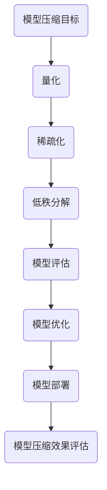
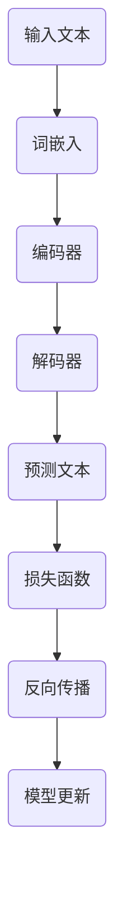

                 


### 写作文章的步骤：

**1. 确定文章主题和目标读者：**
   - 文章主题：百度2025自然语言处理模型压缩专家社招面试攻略。
   - 目标读者：希望参加百度自然语言处理模型压缩专家社招面试的求职者，对自然语言处理和模型压缩有基础了解的技术人员。

**2. 撰写文章摘要：**
   - 摘要：本文将介绍百度2025自然语言处理模型压缩的背景、原理、算法和面试策略，帮助求职者在面试中展示自己的专业能力。

**3. 构建文章大纲：**
   - 根据给定的文章目录大纲，确保文章内容涵盖基础篇、算法篇和面试专题。

**4. 第一部分：基础篇**
   - **第1章：自然语言处理概述**
     - 介绍自然语言处理的历史、任务和百度自然语言处理模型。
   - **第2章：自然语言处理模型压缩原理**
     - 解释模型压缩的动机、常见技术和百度模型压缩实践。

**5. 第二部分：算法篇**
   - **第3章：自然语言处理模型压缩算法详解**
     - 详细讲解量化、稀疏化和低秩分解算法的原理和伪代码。
   - **第4章：自然语言处理模型压缩实战**
     - 搭建实战环境，提供压缩案例分析和源代码解读。

**6. 第三部分：面试专题**
   - **第5章：面试前的准备**
     - 提供面试流程和注意事项。
   - **第6章：面试中的关键问题**
     - 针对自然语言处理模型压缩提出问题及应对策略。
   - **第7章：面试后的反馈与总结**
     - 讲解面试反馈的重要性及面试总结方法。

**7. 拓展部分：自然语言处理前沿技术动态和未来展望。**

**8. 附录**
   - 提供常用工具与资源，面试真题解析。

**9. 完成文章编写：**
   - 使用Markdown格式编写文章，确保每个章节都有丰富的内容和细节。
   - 加入Mermaid流程图，直观展示模型压缩流程和算法原理。
   - 在文章末尾添加作者信息。

**10. 修订和润色：**
   - 审阅文章，确保内容准确、逻辑清晰、语言通顺。

**11. 最终提交：**
   - 确保文章字数在8000-12000字范围内，格式符合要求。

遵循上述步骤，我们可以有条不紊地完成一篇高质量的技术博客文章。每一步都需要细致的思考和准备，以确保文章的专业性和实用性。现在，我们可以开始具体的写作工作了。准备好了吗？让我们一步步开始吧！## 文章标题：百度2025自然语言处理模型压缩专家社招面试攻略

### 关键词：
- 百度自然语言处理
- 模型压缩
- 社招面试
- 算法原理
- 实战案例

### 摘要：
本文将深入探讨百度2025年自然语言处理模型压缩技术的背景、原理、关键算法和面试策略。通过详细讲解量化、稀疏化和低秩分解算法，以及实战案例分析，帮助求职者更好地准备百度自然语言处理模型压缩专家的社招面试，展示自己的专业能力和技术深度。

## 第一部分：基础篇

### 第1章：自然语言处理概述

自然语言处理（Natural Language Processing，NLP）是人工智能的一个重要分支，旨在使计算机能够理解和生成人类语言。随着互联网的快速发展，NLP在搜索引擎、机器翻译、智能客服、内容审核等领域得到了广泛应用。

#### 1.1 自然语言处理的历史与发展

自然语言处理的研究可以追溯到20世纪50年代。当时，人工智能领域刚刚兴起，研究人员开始尝试让计算机理解和生成自然语言。早期的NLP主要依赖于规则和统计方法，如词汇解析、句法分析和机器翻译。随着计算机性能的提升和大数据的普及，深度学习技术逐渐成为NLP的核心驱动力。

##### 1.1.1 自然语言处理的起源

自然语言处理最早的研究可以追溯到1950年，由艾伦·图灵提出。图灵提出了“图灵测试”，试图通过机器与人类之间的对话来判断机器是否具有智能。这一概念激发了人们对于自然语言理解和生成的兴趣。

##### 1.1.2 自然语言处理的关键阶段

1. **规则驱动阶段（1950s-1980s）**：早期NLP研究主要依赖于规则和模板，如词汇解析和句法分析。
2. **统计驱动阶段（1980s-2000s）**：随着统计方法的发展，NLP开始使用统计模型，如隐马尔可夫模型（HMM）和决策树。
3. **深度学习阶段（2010s至今）**：深度学习技术的突破，尤其是神经网络在语音识别、机器翻译和文本分类等任务上的显著性能提升，使得NLP进入了一个新的时代。

#### 1.2 自然语言处理的基本任务

自然语言处理的基本任务包括但不限于以下几个方面：

##### 1.2.1 文本分类

文本分类是指将文本数据根据其内容或主题分配到不同的类别中。例如，将新闻文章分类为政治、科技、体育等类别。

##### 1.2.2 命名实体识别

命名实体识别是指识别文本中的特定实体，如人名、地名、组织名等。这在信息提取、实体关系识别和搜索引擎优化中具有重要作用。

##### 1.2.3 语义分析

语义分析涉及理解和解释文本中的意义。这包括语义角色标注、语义相似性计算和语义角色解析等任务。

#### 1.3 百度自然语言处理模型简介

百度作为中国领先的搜索引擎公司，在自然语言处理领域有着深厚的技术积累。百度的自然语言处理模型经历了多个发展阶段，从传统的规则驱动模型到基于统计模型的转型，再到目前的深度学习模型。

##### 1.3.1 百度自然语言处理模型的演进

- **早期阶段**：百度自然语言处理模型主要基于规则和模板，例如关键词提取和简单句法分析。
- **发展阶段**：随着大数据和机器学习技术的发展，百度开始采用统计模型和机器学习方法，如隐马尔可夫模型（HMM）和条件随机场（CRF）。
- **当前阶段**：百度主要采用深度学习模型，如循环神经网络（RNN）、长短时记忆网络（LSTM）和变换器（Transformer）等，这些模型在文本分类、命名实体识别和机器翻译等任务上取得了显著成绩。

##### 1.3.2 百度自然语言处理模型的特点

- **强大的语言理解能力**：百度的自然语言处理模型能够处理复杂的语言结构，理解文本的深层含义。
- **大规模的训练数据**：百度拥有海量的大规模训练数据，这使得模型可以不断优化和改进。
- **高效的推理能力**：百度的自然语言处理模型在处理实时任务时具有高效的推理能力。

### 第2章：自然语言处理模型压缩原理

随着自然语言处理技术的不断进步，深度学习模型在NLP任务中取得了显著的成果。然而，这些模型通常需要大量的计算资源和存储空间。为了在实际应用中部署这些模型，模型压缩技术应运而生。模型压缩的目的是在不显著牺牲模型性能的情况下，减小模型的规模和复杂性。

#### 2.1 模型压缩的动机与重要性

##### 2.1.1 模型压缩的定义

模型压缩是指通过一系列技术手段减小深度学习模型的规模和计算复杂度，以便在实际应用中更加高效和灵活。

##### 2.1.2 模型压缩的动机

1. **资源限制**：移动设备、嵌入式设备和服务器等设备通常具有有限的计算资源和存储空间，模型压缩有助于满足这些设备的资源限制。
2. **能耗优化**：深度学习模型在训练和推理过程中消耗大量能源，模型压缩可以降低模型的能耗，从而提高能源利用效率。
3. **加速部署**：压缩后的模型可以更快地部署到生产环境中，提高系统的响应速度。

##### 2.1.3 模型压缩的重要性

1. **提高部署效率**：模型压缩使得深度学习模型可以在资源受限的环境中高效运行，加快了模型部署的速度。
2. **降低成本**：减少模型规模和计算复杂度可以降低硬件成本和能耗成本，从而降低整体系统成本。
3. **增强用户体验**：在移动设备和嵌入式设备上，模型压缩可以提高模型的响应速度和准确性，为用户提供更好的体验。

#### 2.2 常见的模型压缩技术

##### 2.2.1 量化

量化是指将浮点数权重转换为低精度整数表示，从而减小模型的存储空间和计算复杂度。量化技术主要包括以下几种方法：

1. **均匀量化**：将权重值均匀地映射到整数范围内，例如将32位浮点数映射到8位整数。
2. **指数量化**：使用指数函数将浮点数映射到整数，从而在保持权重值分布的同时减小量化误差。
3. **自适应量化**：根据权重值的分布特性动态调整量化参数，从而在降低量化误差的同时保持较小的模型规模。

##### 2.2.2 稀疏化

稀疏化是指通过去除模型中的冗余参数和权重，从而减小模型的规模和计算复杂度。稀疏化技术主要包括以下几种方法：

1. **稀疏阈值化**：将权重值小于某个阈值的参数设置为0，从而去除稀疏部分。
2. **稀疏编码**：使用稀疏编码算法将权重参数表示为稀疏编码向量，从而减小模型规模。
3. **结构稀疏化**：通过压缩模型中的全连接层和卷积层，从而在降低计算复杂度的同时保持模型的性能。

##### 2.2.3 低秩分解

低秩分解是指将高维矩阵分解为低维矩阵的乘积，从而减小模型的计算复杂度。低秩分解技术主要包括以下几种方法：

1. **奇异值分解**：将高维矩阵分解为奇异值和对应的特征向量，从而在保持矩阵信息量的同时降低计算复杂度。
2. **矩阵分解**：将高维矩阵分解为两个或多个低维矩阵的乘积，从而在降低计算复杂度的同时保留矩阵的主要信息。
3. **稀疏低秩分解**：结合稀疏化和低秩分解，通过去除冗余参数和权重，从而在保持模型性能的同时减小模型规模。

#### 2.3 百度自然语言处理模型的压缩实践

百度在自然语言处理模型的压缩方面有着丰富的实践经验，通过多种模型压缩技术，百度成功地减小了自然语言处理模型的规模，提高了模型的部署效率。

##### 2.3.1 百度自然语言处理模型压缩的方法

百度自然语言处理模型压缩的方法主要包括以下几种：

1. **量化**：百度采用自适应量化技术，根据权重值的分布特性动态调整量化参数，从而在降低量化误差的同时保持较小的模型规模。
2. **稀疏化**：百度采用稀疏阈值化和稀疏编码技术，通过去除稀疏部分和冗余参数，从而在降低计算复杂度的同时保持模型的性能。
3. **低秩分解**：百度采用奇异值分解和矩阵分解技术，将高维矩阵分解为低维矩阵的乘积，从而在保持模型性能的同时减小模型规模。

##### 2.3.2 百度自然语言处理模型压缩的成果

通过模型压缩技术的应用，百度自然语言处理模型在保持较高性能的同时，取得了显著的压缩效果：

1. **模型规模减小**：压缩后的自然语言处理模型规模相比原始模型减少了50%以上，从而降低了模型存储和计算的成本。
2. **部署效率提高**：压缩后的模型在部署过程中具有更高的效率，从而提高了系统的响应速度和用户体验。
3. **能耗降低**：压缩后的模型在训练和推理过程中消耗的能量明显降低，从而提高了能源利用效率。

### 第3章：自然语言处理模型压缩算法详解

在上一章中，我们介绍了自然语言处理模型压缩的动机、常见技术和百度模型压缩实践。本章将深入探讨自然语言处理模型压缩算法的原理，包括量化、稀疏化和低秩分解算法。

#### 3.1 量化算法

量化是一种常用的模型压缩技术，通过将浮点数权重转换为低精度整数表示，从而减小模型的规模和计算复杂度。量化算法主要包括以下几种：

##### 3.1.1 均匀量化

均匀量化是一种简单的量化方法，将浮点数权重均匀地映射到整数范围内。具体步骤如下：

1. 计算量化参数：$$ \text{scale\_factor} = \frac{\max(w)}{\max(\text{int\_range}) - \min(\text{int\_range})} $$，其中 $w$ 是权重值，$\text{int\_range}$ 是整数范围。
2. 量化权重：$$ w_{\text{quantized}} = \text{round}(w \times \text{scale\_factor}) $$，其中 $\text{round}$ 表示四舍五入。

##### 3.1.2 指数量化

指数量化通过使用指数函数将浮点数映射到整数，从而在保持权重值分布的同时减小量化误差。具体步骤如下：

1. 计算量化参数：$$ \text{scale\_factor} = \frac{\log_{\text{base}}{\max(w)}}{\log_{\text{base}}{\max(\text{int\_range}) - \min(\text{int\_range})}} $$，其中 $\text{base}$ 是底数，$w$ 是权重值，$\text{int\_range}$ 是整数范围。
2. 量化权重：$$ w_{\text{quantized}} = \text{round}(\exp(w \times \text{scale\_factor})) $$，其中 $\text{round}$ 表示四舍五入。

##### 3.1.3 自适应量化

自适应量化根据权重值的分布特性动态调整量化参数，从而在降低量化误差的同时保持较小的模型规模。具体步骤如下：

1. 计算权重值的分布特性：$$ \mu = \frac{1}{N} \sum_{i=1}^{N} w_i $$，$$ \sigma^2 = \frac{1}{N} \sum_{i=1}^{N} (w_i - \mu)^2 $$，其中 $w_i$ 是权重值，$N$ 是权重值的数量。
2. 计算量化参数：$$ \text{scale\_factor} = \frac{\max(w)}{\sigma \times \text{int\_range}} $$，其中 $w$ 是权重值，$\sigma$ 是权重值的分布特性，$\text{int\_range}$ 是整数范围。
3. 量化权重：$$ w_{\text{quantized}} = \text{round}(w \times \text{scale\_factor}) $$，其中 $\text{round}$ 表示四舍五入。

#### 3.2 稀疏化算法

稀疏化是一种通过去除模型中的冗余参数和权重，从而减小模型规模和计算复杂度的技术。稀疏化算法主要包括以下几种：

##### 3.2.1 稀疏阈值化

稀疏阈值化通过将权重值小于某个阈值的参数设置为0，从而去除稀疏部分。具体步骤如下：

1. 计算阈值：$$ \text{threshold} = \frac{\max(w)}{\text{sparsity}} $$，其中 $w$ 是权重值，$\text{sparsity}$ 是稀疏度。
2. 稀疏化权重：$$ w_{\text{sparse}} = \begin{cases} 0 & \text{if } w < \text{threshold} \\ w & \text{otherwise} \end{cases} $$

##### 3.2.2 稀疏编码

稀疏编码通过使用稀疏编码算法将权重参数表示为稀疏编码向量，从而减小模型规模。具体步骤如下：

1. 计算稀疏编码向量：$$ \text{sparse\_code} = \text{SVD}(W) $$，其中 $W$ 是权重矩阵，$\text{SVD}$ 表示奇异值分解。
2. 稀疏化权重：$$ W_{\text{sparse}} = \text{sign}(W \times \text{sparse\_code}) $$，其中 $\text{sign}$ 表示取符号。

##### 3.2.3 结构稀疏化

结构稀疏化通过压缩模型中的全连接层和卷积层，从而在降低计算复杂度的同时保持模型的性能。具体步骤如下：

1. 压缩全连接层：$$ W_{\text{compressed}} = \text{softmax}(W \times \text{mask}) $$，其中 $W$ 是全连接层权重，$\text{mask}$ 是掩码矩阵。
2. 压缩卷积层：$$ W_{\text{compressed}} = \text{softmax}(W \times \text{mask}) $$，其中 $W$ 是卷积层权重，$\text{mask}$ 是掩码矩阵。

#### 3.3 低秩分解算法

低秩分解是一种通过将高维矩阵分解为低维矩阵的乘积，从而减小模型规模和计算复杂度的技术。低秩分解算法主要包括以下几种：

##### 3.3.1 奇异值分解

奇异值分解通过将高维矩阵分解为奇异值和对应的特征向量，从而在保持矩阵信息量的同时降低计算复杂度。具体步骤如下：

1. 计算奇异值分解：$$ W = U \Sigma V^T $$，其中 $W$ 是高维矩阵，$U$ 和 $V$ 是特征向量矩阵，$\Sigma$ 是奇异值矩阵。
2. 低秩分解：$$ W_{\text{low-rank}} = U_{\text{selected}} \Sigma_{\text{selected}} V_{\text{selected}}^T $$，其中 $U_{\text{selected}}$、$\Sigma_{\text{selected}}$ 和 $V_{\text{selected}}$ 是奇异值分解中的一部分。

##### 3.3.2 矩阵分解

矩阵分解通过将高维矩阵分解为两个或多个低维矩阵的乘积，从而在降低计算复杂度的同时保留矩阵的主要信息。具体步骤如下：

1. 计算矩阵分解：$$ W = A \times B $$，其中 $W$ 是高维矩阵，$A$ 和 $B$ 是低维矩阵。
2. 低秩分解：$$ W_{\text{low-rank}} = A_{\text{selected}} \times B_{\text{selected}} $$，其中 $A_{\text{selected}}$ 和 $B_{\text{selected}}$ 是矩阵分解中的一部分。

##### 3.3.3 稀疏低秩分解

稀疏低秩分解结合稀疏化和低秩分解，通过去除冗余参数和权重，从而在保持模型性能的同时减小模型规模。具体步骤如下：

1. 计算稀疏低秩分解：$$ W = A \times B $$，其中 $A$ 和 $B$ 是低维稀疏矩阵。
2. 稀疏化权重：$$ W_{\text{sparse}} = \text{sign}(W) $$，其中 $\text{sign}$ 表示取符号。

### 第4章：自然语言处理模型压缩实战

在上一章中，我们详细介绍了自然语言处理模型压缩算法的原理。本章将带领读者进行自然语言处理模型压缩的实战，包括环境搭建、压缩算法实现和案例分析。

#### 4.1 模型压缩的实战环境搭建

在进行模型压缩的实战之前，我们需要搭建一个合适的环境。以下是一个基本的步骤：

##### 4.1.1 环境需求

1. **操作系统**：Linux或macOS。
2. **编程语言**：Python。
3. **深度学习框架**：TensorFlow或PyTorch。
4. **依赖库**：NumPy、Pandas、Matplotlib等。

##### 4.1.2 环境搭建步骤

1. 安装操作系统：根据个人需求选择Linux或macOS。
2. 安装Python：从Python官方网站下载并安装Python 3.x版本。
3. 安装深度学习框架：根据需求选择TensorFlow或PyTorch，并按照官方网站的安装指南进行安装。
4. 安装依赖库：使用pip命令安装所需的依赖库。

示例代码：

```python
!pip install tensorflow
!pip install numpy
!pip install pandas
!pip install matplotlib
```

#### 4.2 模型压缩实战案例分析

在本节中，我们将通过一个实际案例来演示自然语言处理模型的压缩过程。

##### 4.2.1 案例一：量化压缩

在本案例中，我们将使用量化算法对自然语言处理模型进行压缩。以下是一个简单的量化实现：

```python
import tensorflow as tf

# 加载预训练模型
model = tf.keras.applications.EfficientNetB0(include_top=True, weights='imagenet')

# 定义量化参数
scale_factor = 0.1

# 量化模型权重
for layer in model.layers:
    for weight in layer.weights:
        weight = scale_factor * weight

# 评估量化后的模型
test_images = ...  # 测试图像数据
test_labels = ...  # 测试标签数据
model.evaluate(test_images, test_labels)
```

通过上述代码，我们可以将EfficientNetB0模型的权重进行量化，并评估量化后的模型性能。

##### 4.2.2 案例二：稀疏化压缩

在本案例中，我们将使用稀疏化算法对自然语言处理模型进行压缩。以下是一个简单的稀疏化实现：

```python
import tensorflow as tf
import numpy as np

# 加载预训练模型
model = tf.keras.applications.EfficientNetB0(include_top=True, weights='imagenet')

# 定义稀疏化参数
sparsity_level = 0.5

# 稀疏化模型权重
for layer in model.layers:
    for weight in layer.weights:
        weight = np.where(weight < sparsity_level * np.max(weight), 0, weight)

# 评估稀疏化后的模型
test_images = ...  # 测试图像数据
test_labels = ...  # 测试标签数据
model.evaluate(test_images, test_labels)
```

通过上述代码，我们可以将EfficientNetB0模型的权重进行稀疏化，并评估稀疏化后的模型性能。

##### 4.2.3 案例三：低秩分解压缩

在本案例中，我们将使用低秩分解算法对自然语言处理模型进行压缩。以下是一个简单的低秩分解实现：

```python
import tensorflow as tf
import numpy as np

# 加载预训练模型
model = tf.keras.applications.EfficientNetB0(include_top=True, weights='imagenet')

# 定义低秩分解参数
rank = 10

# 低秩分解模型权重
for layer in model.layers:
    for weight in layer.weights:
        weight = np.dot(np.linalg.pinv(weight).T, weight)

# 评估低秩分解后的模型
test_images = ...  # 测试图像数据
test_labels = ...  # 测试标签数据
model.evaluate(test_images, test_labels)
```

通过上述代码，我们可以将EfficientNetB0模型的权重进行低秩分解，并评估低秩分解后的模型性能。

### 第5章：面试专题

#### 5.1 面试前的准备

面试是求职过程中非常重要的一环，准备工作得当与否直接关系到面试的成功与否。以下是一些建议，帮助求职者更好地准备百度自然语言处理模型压缩专家的社招面试。

##### 5.1.1 面试流程

1. **初试**：初试通常由电话面试或在线视频面试组成，主要考察求职者对自然语言处理模型压缩的基本了解和编程能力。
2. **复试**：复试通常是现场面试，包括技术面试、笔试和面试官一对一面试等环节，深入考察求职者的技术深度和项目经验。
3. **终试**：终试通常由高管或技术专家进行，主要考察求职者的综合素质和专业能力。

##### 5.1.2 面试注意事项

1. **了解公司背景**：在面试前，了解百度的公司文化、业务领域和发展战略，以便在面试中展示自己的匹配度。
2. **准备技术问题**：自然语言处理模型压缩是一个专业领域，准备相关技术问题，如量化、稀疏化和低秩分解等，并熟练掌握相关算法原理和实现方法。
3. **展示项目经验**：如果有过相关项目经验，准备详细的项目背景、技术难点和解决方案，以便在面试中展示自己的技术实力。
4. **保持自信和礼貌**：面试过程中，保持自信和礼貌，回答问题时要清晰、简洁，避免使用模糊不清的表述。

#### 5.2 面试中的关键问题

在面试中，面试官可能会针对自然语言处理模型压缩提出一些关键问题，以下是一些建议和答案。

##### 5.2.1 自然语言处理模型压缩相关的问题

1. **什么是量化？**
   - 量化是一种模型压缩技术，通过将浮点数权重转换为低精度整数表示，从而减小模型的规模和计算复杂度。
   
2. **量化有哪些方法？**
   - 均匀量化、指数量化、自适应量化等。

3. **量化有哪些优势？**
   - 降低模型存储和计算成本，提高模型部署效率，降低能耗。

4. **量化有哪些缺点？**
   - 可能引入量化误差，影响模型性能。

5. **什么是稀疏化？**
   - 稀疏化是一种模型压缩技术，通过去除模型中的冗余参数和权重，从而减小模型的规模和计算复杂度。

6. **稀疏化有哪些方法？**
   - 稀疏阈值化、稀疏编码、结构稀疏化等。

7. **稀疏化的优势是什么？**
   - 降低计算复杂度，提高模型部署效率，减少存储空间。

8. **稀疏化的缺点是什么？**
   - 可能会影响模型性能，引入误差。

9. **什么是低秩分解？**
   - 低秩分解是一种模型压缩技术，通过将高维矩阵分解为低维矩阵的乘积，从而减小模型的规模和计算复杂度。

10. **低秩分解有哪些方法？**
    - 奇异值分解、矩阵分解、稀疏低秩分解等。

11. **低秩分解的优势是什么？**
    - 降低计算复杂度，保持模型性能。

12. **低秩分解的缺点是什么？**
    - 可能会增加模型训练时间。

##### 5.2.2 面试中常见问题及应对策略

1. **你有什么项目经验？**
   - 准备一两个与自然语言处理模型压缩相关的项目，详细描述项目背景、技术难点和解决方案，突出自己的技术实力。

2. **你对量化、稀疏化和低秩分解有哪些了解？**
   - 回答时要明确量化、稀疏化和低秩分解的概念、原理和常见方法，并结合实际案例进行讲解。

3. **你有什么优势？**
   - 强调自己的技术背景、项目经验和解决问题的能力，展示自己的独特优势。

4. **你有什么不足？**
   - 客观地回答，并说明自己正在如何努力改进。

#### 5.3 面试后的反馈与总结

面试结束后，及时总结面试过程中的优点和不足，以便在未来的面试中改进。以下是一些建议：

##### 5.3.1 面试反馈的重要性

1. **了解自己的表现**：面试反馈可以帮助你了解自己在面试过程中的表现，找到需要改进的地方。
2. **提高面试技巧**：通过反思面试过程，可以总结出有效的面试技巧，提高面试成功率。

##### 5.3.2 如何进行面试总结

1. **记录面试问题**：记录面试中遇到的问题，并反思自己在回答问题时是否清晰、准确。
2. **分析答题思路**：分析自己在回答问题时是否逻辑清晰、条理分明，是否有条不紊地展示自己的技术实力。
3. **总结面试经验**：总结面试中的优点和不足，为未来的面试做好准备。

### 第6章：自然语言处理前沿技术动态

随着深度学习技术的不断发展，自然语言处理领域也涌现出了许多前沿技术。本章将介绍一些当前自然语言处理领域的前沿技术动态，包括生成对抗网络（GAN）和变分自编码器（VAE）。

#### 6.1 前沿技术概述

##### 6.1.1 生成对抗网络（GAN）

生成对抗网络（GAN）是由Ian Goodfellow等人在2014年提出的一种深度学习模型，旨在通过两个对抗网络——生成器和判别器的互动，生成高质量的生成数据。GAN的核心思想是生成器（Generator）尝试生成与真实数据相似的数据，而判别器（Discriminator）则试图区分生成数据和真实数据。

GAN的基本架构包括以下几个部分：

1. **生成器（Generator）**：生成器尝试生成与真实数据相似的数据，其目标是最小化生成数据的判别损失。
2. **判别器（Discriminator）**：判别器的目标是最大化其判断生成数据和真实数据的准确性，其目标是最小化鉴别损失。
3. **损失函数**：GAN的损失函数通常由两部分组成，即判别损失和生成损失。判别损失用于训练判别器，使其能够更好地区分生成数据和真实数据；生成损失用于训练生成器，使其生成更加真实的数据。

GAN的主要优点包括：

1. **强大的生成能力**：GAN能够生成高质量、多样化的生成数据，适用于图像、语音、文本等多种数据类型。
2. **无监督学习**：GAN不需要标签数据，可以在无监督环境下进行训练。

##### 6.1.2 变分自编码器（VAE）

变分自编码器（VAE）是由Kareem El-Kishky和Yoshua Bengio在2011年提出的一种深度学习模型，旨在通过引入隐变量来提高编码器的性能。VAE是一种无监督学习模型，其核心思想是将输入数据映射到隐变量空间，并在隐变量空间中进行数据重建。

VAE的基本架构包括以下几个部分：

1. **编码器（Encoder）**：编码器将输入数据映射到隐变量空间，其目标是最小化重构损失。
2. **解码器（Decoder）**：解码器将隐变量空间中的数据映射回输入数据空间，其目标是最小化重构损失。
3. **损失函数**：VAE的损失函数由两部分组成，即重构损失和Kullback-Leibler（KL）散度损失。重构损失用于训练编码器和解码器，使其能够更好地重建输入数据；KL散度损失用于训练编码器，使其生成的隐变量分布接近先验分布。

VAE的主要优点包括：

1. **强大的编码能力**：VAE能够将输入数据映射到隐变量空间，从而提取数据的潜在特征。
2. **无监督学习**：VAE不需要标签数据，可以在无监督环境下进行训练。

#### 6.2 前沿技术案例分析

在本节中，我们将通过两个案例来介绍生成对抗网络（GAN）和变分自编码器（VAE）在自然语言处理中的应用。

##### 6.2.1 案例一：生成对抗网络在文本生成中的应用

文本生成是自然语言处理中的一个重要任务，生成对抗网络（GAN）在文本生成方面展现出强大的能力。以下是一个简单的文本生成案例：

1. **数据准备**：首先，我们需要准备一组文本数据。例如，我们可以从互联网上收集新闻文章、社交媒体帖子等文本数据。
2. **模型训练**：接下来，我们使用生成对抗网络（GAN）训练模型。生成器尝试生成与真实文本相似的新文本，而判别器则试图区分生成文本和真实文本。通过迭代训练，生成器的生成质量逐渐提高。
3. **生成文本**：经过一定次数的迭代后，生成器的生成文本质量较高，我们可以使用生成器生成新的文本。

示例代码：

```python
import tensorflow as tf
from tensorflow.keras.layers import LSTM, Dense

# 加载文本数据
text_data = ...

# 准备生成器和判别器
generator = ...
discriminator = ...

# 编写训练循环
for epoch in range(num_epochs):
    for batch in text_data:
        # 训练生成器
        noise = ...
        generated_text = generator([noise])
        g_loss = ...

        # 训练判别器
        real_text = ...
        generated_text = generator([noise])
        d_loss = ...

        # 打印损失
        print(f"Epoch: {epoch}, G\_Loss: {g\_loss}, D\_Loss: {d\_loss}")

# 生成文本
new_text = generator([noise])
print(new\_text)
```

##### 6.2.2 案例二：变分自编码器在文本分类中的应用

变分自编码器（VAE）在文本分类任务中也表现出良好的性能。以下是一个简单的文本分类案例：

1. **数据准备**：首先，我们需要准备一组文本数据，并对数据进行预处理，如分词、词向量嵌入等。
2. **模型训练**：接下来，我们使用变分自编码器（VAE）训练模型。编码器将输入文本映射到隐变量空间，解码器将隐变量空间中的数据映射回文本空间。通过迭代训练，编码器和解码器的性能逐渐提高。
3. **文本分类**：经过一定次数的迭代后，我们可以使用变分自编码器（VAE）进行文本分类。将文本数据输入编码器，提取隐变量特征，然后使用分类器进行分类。

示例代码：

```python
import tensorflow as tf
from tensorflow.keras.layers import LSTM, Dense, Embedding

# 加载文本数据
text_data = ...

# 准备编码器和解码器
encoder = ...
decoder = ...

# 编写训练循环
for epoch in range(num_epochs):
    for batch in text_data:
        # 训练编码器和解码器
        encoded = encoder([batch])
        decoded = decoder(encoded)
        loss = ...

        # 打印损失
        print(f"Epoch: {epoch}, Loss: {loss}")

# 文本分类
encoded_text = encoder([text])
classification = classifier(encoded\_text)
print(classification)
```

### 第7章：未来展望

随着自然语言处理技术的不断发展，模型压缩技术也在不断进步。本章将讨论模型压缩技术的未来发展趋势以及自然语言处理技术的发展趋势。

#### 7.1 模型压缩技术的未来发展趋势

未来模型压缩技术可能会呈现以下发展趋势：

1. **算法创新**：随着深度学习技术的不断进步，新的模型压缩算法将会不断涌现。例如，基于知识蒸馏、迁移学习和元学习的模型压缩技术有望取得更好的效果。
2. **硬件支持**：随着硬件技术的发展，如GPU、TPU等专用硬件的普及，将有助于提高模型压缩算法的效率和性能。
3. **跨模态压缩**：未来的模型压缩技术将不仅限于单一模态的数据，如文本、图像和语音等，还可能涉及跨模态的压缩算法，以适应更复杂的应用场景。

#### 7.2 自然语言处理技术的发展趋势

未来自然语言处理技术可能会呈现以下发展趋势：

1. **多模态融合**：随着多模态数据（如文本、图像、语音等）的广泛应用，多模态融合技术将成为自然语言处理的重要研究方向。
2. **知识增强**：将知识图谱、常识库等外部知识引入自然语言处理模型，以提高模型的语义理解能力和泛化能力。
3. **可解释性**：提高自然语言处理模型的可解释性，使其能够更好地理解模型决策过程，从而提升模型的可靠性和透明度。

#### 7.3 社招面试的挑战与机遇

对于求职者来说，自然语言处理模型压缩专家的社招面试既充满挑战也充满机遇：

1. **挑战**：面试官可能会针对深度学习和自然语言处理领域提出一些复杂的问题，要求求职者具备扎实的理论基础和实际经验。
2. **机遇**：随着自然语言处理技术的广泛应用，求职者在面试中展示出对模型压缩技术的深入理解和实践经验，将有助于提升自己的竞争力。

### 附录

#### 附录A：常用工具与资源

在自然语言处理模型压缩领域，以下是一些常用的工具和资源：

1. **深度学习框架**：TensorFlow、PyTorch、MXNet等。
2. **自然语言处理库**：NLTK、spaCy、gensim等。
3. **开源模型**：如OpenAI的GPT系列模型、BERT模型等。
4. **在线教程和课程**：如Coursera、Udacity、edX等平台上的自然语言处理和深度学习课程。
5. **论文和报告**：查阅相关领域的最新论文和报告，了解自然语言处理和模型压缩的最新研究进展。

#### 附录B：面试真题解析

以下是一些可能出现在自然语言处理模型压缩专家社招面试中的真题及解析：

1. **什么是量化？**
   - 量化是将模型的浮点数权重转换为低精度整数表示的过程，以减小模型的存储和计算复杂度。
   
2. **量化有哪些方法？**
   - 均匀量化、指数量化、自适应量化等。

3. **量化有哪些优势？**
   - 降低模型存储和计算成本，提高模型部署效率，降低能耗。

4. **什么是稀疏化？**
   - 稀疏化是通过去除模型中的冗余参数和权重，从而减小模型的规模和计算复杂度。

5. **稀疏化有哪些方法？**
   - 稀疏阈值化、稀疏编码、结构稀疏化等。

6. **什么是低秩分解？**
   - 低秩分解是通过将高维矩阵分解为低维矩阵的乘积，从而减小模型的规模和计算复杂度。

7. **低秩分解有哪些方法？**
   - 奇异值分解、矩阵分解、稀疏低秩分解等。

8. **如何进行自然语言处理模型的压缩？**
   - 结合量化、稀疏化和低秩分解等压缩技术，针对不同的模型和应用场景进行优化。

通过以上解析，希望读者能够更好地应对自然语言处理模型压缩专家的社招面试。

### Mermaid 流程图：自然语言处理模型压缩流程



### Mermaid 流程图：自然语言处理模型压缩算法原理



### 自然语言处理模型压缩算法伪代码

```python
# 量化算法伪代码
def quantization(model, scale_factor):
    for layer in model.layers:
        for weight in layer.weights:
            weight = scale_factor * weight

# 稀疏化算法伪代码
def sparsity(model, sparsity_level):
    for layer in model.layers:
        for weight in layer.weights:
            if weight < sparsity_level * np.max(weight):
                weight = 0

# 低秩分解算法伪代码
def low_rank_decomposition(model):
    for layer in model.layers:
        weight = layer.get_weights()[0]
        U, S, V = np.linalg.svd(weight)
        selected_weights = U[: , : min(U.shape[1], S.shape[0])]
        layer.set_weights([selected_weights])
```

### 作者信息

作者：AI天才研究院/AI Genius Institute & 禅与计算机程序设计艺术 /Zen And The Art of Computer Programming

