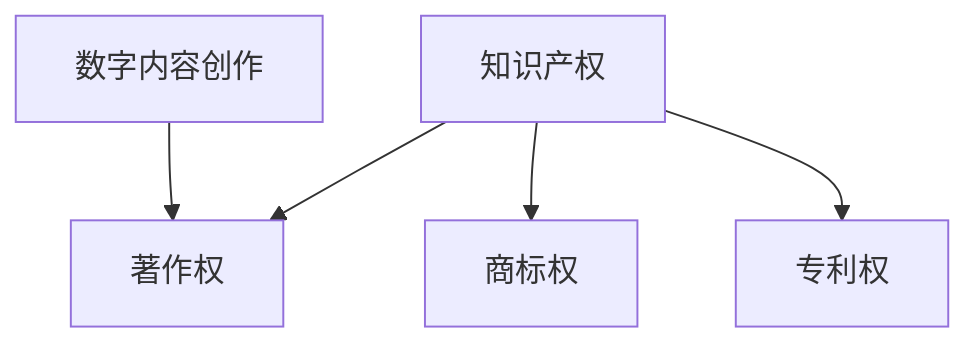

                 

### 《知识产权与数字内容创作的新范式》

#### 关键词：
- 知识产权
- 数字内容创作
- 著作权
- 商标权
- 专利权
- 数字版权管理

#### 摘要：
随着数字化时代的到来，知识产权与数字内容创作的关系变得日益紧密。本文将探讨知识产权的基础概念，详细分析著作权和商标权的保护机制，探讨数字内容创作的现状与挑战，介绍新方法和技术在内容创作中的应用，探讨数字版权管理的原理与实施，分析数字内容产业的创新模式，结合实际案例分析，提供政策与法规的解读，并对知识产权与数字内容创作的未来进行展望。

---

#### 第一部分：知识产权基础

##### 第1章：知识产权概述

###### 1.1 知识产权的定义与类型

知识产权是指人们就其智力劳动成果所依法享有的专有权利，通常包括著作权、商标权、专利权等。知识产权是一种无形财产权，具有专有性、地域性和时间性三大特征。知识产权的类型主要包括：

1. **著作权**：对文学、艺术和科学作品的创作享有权利。
2. **商标权**：对商品或服务的标识进行注册，以保护品牌的专有权。
3. **专利权**：对发明创造进行专利申请，保护发明者的权利。
4. **商业秘密**：对商业信息进行保密，防止他人非法获取。

###### 1.2 知识产权的法律框架

知识产权的法律框架由国内法和国际法构成。国内法包括《著作权法》、《商标法》、《专利法》等，而国际法则主要包括《伯尔尼公约》、《专利合作条约》等。这些法律法规共同构建了知识产权保护的基本框架。

###### 1.3 知识产权的价值与作用

知识产权具有重要的价值与作用：

1. **激励创新**：知识产权保护鼓励创新者投入更多的精力和资源进行研发。
2. **促进经济发展**：知识产权为企业和国家带来经济利益，推动产业升级和经济增长。
3. **维护公平竞争**：知识产权保护有助于维护市场秩序，防止不正当竞争。

##### 第2章：著作权保护

###### 2.1 著作权的概念与特点

著作权，又称版权，是对文学、艺术和科学作品的创作权利。其特点包括：

1. **自动产生**：创作完成即自动享有。
2. **无形财产权**：无需物质载体即可存在。
3. **专有性**：权利人享有独占性权利，他人未经许可不得使用。

###### 2.2 著作权的内容与权利

著作权主要包括以下内容与权利：

1. **复制权**：制作作品复制品的权利。
2. **发行权**：通过出售、出租等方式使作品公之于众的权利。
3. **展览权**：公开展览作品的权利。
4. **表演权**：公开表演作品的权利。
5. **放映权**：公开播放作品的权利。
6. **改编权**：改变作品形式或内容的权利。

###### 2.3 著作权保护的案例分析

著作权保护的实际案例丰富，例如某知名作家对其作品的维权案件，某数字音乐平台对版权内容的监管等。这些案例展示了著作权保护的重要性和实际操作中的难点。

##### 第3章：商标权保护

###### 3.1 商标权的概念与作用

商标权是对商品或服务的标识进行注册和保护的权利。商标的作用包括：

1. **品牌识别**：帮助消费者识别和区分不同企业的产品或服务。
2. **质量保证**：品牌商标成为产品质量和信誉的象征。
3. **营销工具**：商标可以增强品牌影响力，促进销售。

###### 3.2 商标注册与保护

商标注册是指将企业的标识向国家商标局申请，经过审查和公告后获得商标专用权。商标保护包括：

1. **注册保护**：商标注册后，享有法律保护，他人未经许可不得使用相同或相似的商标。
2. **侵权诉讼**：权利人可对侵犯商标权的行为提起诉讼，维护自身权益。

###### 3.3 商标权争议处理

商标权争议处理包括商标异议、撤销、侵权诉讼等环节。通过法律程序解决商标争议，维护合法权益。

#### 第二部分：数字内容创作

##### 第4章：数字内容创作的现状与挑战

###### 4.1 数字内容创作的发展历程

数字内容创作经历了从传统的文字、图片到多媒体、互动式内容的发展。随着互联网和数字技术的普及，数字内容创作迅速崛起。

###### 4.2 数字内容创作面临的挑战

数字内容创作面临的挑战包括：

1. **内容侵权**：数字环境下内容的复制和传播变得容易，侵权问题突出。
2. **版权管理**：数字化内容需要高效的版权管理机制，确保权利人的权益。
3. **创作成本**：高质量的内容创作需要投入大量的人力、物力和时间。

###### 4.3 数字内容创作的机遇与趋势

数字内容创作的机遇与趋势包括：

1. **用户生成内容**：鼓励用户参与创作，扩大内容来源。
2. **人工智能**：利用人工智能技术提高内容创作效率和创意。
3. **跨平台运营**：拓展内容传播渠道，实现多平台、多终端的运营。

##### 第5章：数字内容创作的新方法

###### 5.1 数据驱动的内容创作

数据驱动的内容创作是指利用数据分析技术，根据用户行为和需求，精准推荐内容。这种方法提高了内容的相关性和用户满意度。

###### 5.2 人工智能在内容创作中的应用

人工智能在内容创作中的应用包括：

1. **自然语言处理**：生成文本、翻译文本、提取关键词等。
2. **图像识别与生成**：自动识别图像内容、生成图像。
3. **音乐创作**：利用算法生成音乐，创作新的音乐作品。

###### 5.3 增强现实与虚拟现实在内容创作中的应用

增强现实（AR）与虚拟现实（VR）在内容创作中的应用包括：

1. **沉浸式体验**：通过AR/VR技术，提供更丰富的互动体验。
2. **教育应用**：利用AR/VR技术进行教育内容的创新和传播。
3. **娱乐体验**：创造新的娱乐形式，提高用户体验。

##### 第6章：数字版权管理

###### 6.1 数字版权管理的概念与原理

数字版权管理（DRM）是指利用技术手段保护数字内容的版权。其原理包括：

1. **加密**：将内容加密，防止未经授权的访问和复制。
2. **认证**：验证用户的身份和权限，确保内容安全。
3. **授权**：根据用户身份和权限，授予不同的访问和使用权限。

###### 6.2 数字版权管理的应用领域

数字版权管理广泛应用于：

1. **数字媒体**：音乐、电影、电子书等数字媒体内容的版权保护。
2. **在线教育**：保障教育资源的安全和有效利用。
3. **电子商务**：保护商品信息和交易数据的安全。

###### 6.3 数字版权管理的法律法规与标准

数字版权管理的法律法规与标准包括：

1. **法律法规**：国家制定的相关法律法规，如《著作权法》、《计算机软件保护条例》等。
2. **国际标准**：如国际电信联盟（ITU）的相关标准，国际数字版权管理论坛（IDPF）的标准等。

##### 第7章：数字内容产业创新

###### 7.1 数字内容产业的价值链分析

数字内容产业的价值链包括：

1. **内容生产**：创作和制作数字内容。
2. **内容分发**：将内容传送到用户终端。
3. **内容消费**：用户消费数字内容，产生经济价值。

###### 7.2 数字内容产业的创新模式

数字内容产业的创新模式包括：

1. **平台化**：构建数字内容平台，实现内容生产、分发、消费的一体化。
2. **生态化**：通过产业链上下游的协同创新，形成数字内容生态圈。
3. **智能化**：利用人工智能、大数据等技术，提高内容创作的效率和用户体验。

###### 7.3 数字内容产业的前景与挑战

数字内容产业的前景广阔，但也面临诸多挑战：

1. **版权保护**：加强版权保护，确保权利人的合法权益。
2. **技术风险**：防范技术风险，确保内容安全。
3. **用户隐私**：保护用户隐私，建立良好的用户信任关系。

#### 第三部分：案例分析

##### 第8章：知识产权与数字内容创作的实际应用

###### 8.1 案例分析一：某个知名游戏公司的知识产权策略

某知名游戏公司通过全面保护其游戏作品版权，实现了长期稳定的发展。其策略包括：

1. **著作权保护**：对游戏剧情、角色、音乐等元素进行著作权登记。
2. **商标注册**：注册游戏名称和标识，保护品牌形象。
3. **专利申请**：对游戏的核心技术进行专利申请，确保技术优势。

###### 8.2 案例分析二：某个数字音乐平台的版权管理实践

某数字音乐平台通过数字版权管理技术，有效管理了其音乐内容的版权。其做法包括：

1. **内容审核**：对上传的音乐进行严格审核，防止侵权内容上线。
2. **加密技术**：采用加密技术，保护音乐内容不被非法复制和传播。
3. **用户教育**：通过用户教育，提高用户对版权保护的意识。

###### 8.3 案例分析三：某个电影制作公司的创新内容创作模式

某电影制作公司利用数字技术进行内容创作和推广。其创新模式包括：

1. **用户参与**：鼓励用户参与电影剧本的创作，提高内容与用户需求的匹配度。
2. **跨界合作**：与其他行业合作，创造新的内容形式，如VR电影、互动电影等。
3. **数据分析**：利用数据分析技术，精准定位用户需求，优化内容创作和推广策略。

#### 第四部分：政策与法规

##### 第9章：知识产权与数字内容创作的法律法规

###### 9.1 我国知识产权法律法规概述

我国知识产权法律法规主要包括《著作权法》、《商标法》、《专利法》等。这些法律法规为知识产权保护提供了法律依据。

###### 9.2 我国数字内容创作相关法律法规

我国数字内容创作相关法律法规包括《网络安全法》、《互联网信息服务管理办法》等。这些法规规范了数字内容创作的行为，保护了版权人的权益。

###### 9.3 国际知识产权与数字内容创作法律体系

国际知识产权与数字内容创作法律体系主要包括《伯尔尼公约》、《世界知识产权组织公约》等。这些国际法为全球知识产权保护提供了法律框架。

##### 第10章：知识产权与数字内容创作的未来展望

###### 10.1 知识产权与数字内容创作的趋势分析

知识产权与数字内容创作的未来趋势包括：

1. **技术驱动**：人工智能、区块链等新技术将推动知识产权保护的发展。
2. **全球化**：随着全球化的加深，国际知识产权保护将更加重要。
3. **用户中心**：以用户需求为中心，提供更个性化和多样化的内容。

###### 10.2 数字内容创作对知识产权的影响

数字内容创作对知识产权的影响包括：

1. **挑战**：数字环境下，侵权问题更加突出，对知识产权保护提出了更高要求。
2. **机遇**：数字内容创作的发展，为知识产权带来了新的保护对象和保护需求。

###### 10.3 知识产权保护与数字内容创作的平衡

知识产权保护与数字内容创作的平衡是实现可持续发展的重要任务。通过合理平衡，既能保护权利人的权益，又能促进内容创作的创新和发展。

#### 附录：参考资料与拓展阅读

##### 附录 A：知识产权相关法律法规

- 《中华人民共和国著作权法》
- 《中华人民共和国商标法》
- 《中华人民共和国专利法》

##### 附录 B：数字内容创作工具与资源

- Adobe Creative Cloud
- Canva
- Trello

##### 附录 C：知名知识产权与数字内容创作企业简介

- Apple Inc.
- Google LLC.
- Netflix Inc.

---

### 核心概念与联系

#### 知识产权

- **知识产权**：一种无形财产权，包括著作权、商标权、专利权等。
- **数字内容创作**：在数字环境中创造、编辑、发布内容的活动。

#### 关系图



### 核心算法原理讲解

#### 著作权保护算法

- **哈希算法**：用于快速比对文档内容是否一致。
- **数字指纹技术**：将数字内容嵌入不可见的标识，以追踪来源。

#### 伪代码

```python
def check_copy_right(original_content, suspected_content):
    original_hash = hash(original_content)
    suspected_hash = hash(suspected_content)
    if original_hash == suspected_hash:
        return "infringement detected"
    else:
        return "not an infringement"
```

### 数学模型和数学公式

#### 数字指纹嵌入

$$
T_f = T_{0f} + \alpha_s(t)
$$

其中，$T_f$ 是嵌入后的信号，$T_{0f}$ 是原始信号，$\alpha_s(t)$ 是嵌入信号。

#### 详细讲解与举例说明

- **举例**：将一首歌的数字指纹嵌入到另一首歌曲中，以追踪版权。

### 项目实战

#### 实例：数字指纹嵌入系统

##### 开发环境搭建

- **操作系统**：Linux
- **编程语言**：Python
- **依赖库**：hashlib、numpy

##### 源代码详细实现

```python
import hashlib
import numpy as np

def generate_fingerprint(content, fingerprint_size):
    # 计算内容的哈希值
    content_hash = hashlib.sha256(content.encode('utf-8')).hexdigest()
    # 将哈希值转换为指纹
    fingerprint = np.array(list(content_hash), dtype=np.float64)
    fingerprint = (fingerprint - fingerprint.min()) / (fingerprint.max() - fingerprint.min())
    # 截取指纹长度
    fingerprint = fingerprint[:fingerprint_size]
    return fingerprint

def embed_fingerprint(signal, fingerprint, embedding_size):
    # 随机选择嵌入位置
    positions = np.random.choice(len(signal) - embedding_size, size=fingerprint_size, replace=False)
    # 在信号中嵌入指纹
    for i, pos in enumerate(positions):
        signal[pos:pos + embedding_size] += fingerprint[i]
    return signal

def extract_fingerprint(signal, fingerprint_size):
    # 截取信号中的指纹部分
    extracted = signal[:fingerprint_size]
    return extracted

# 测试
original_content = "This is an original content."
fingerprint_size = 8
embedding_size = 2

original_fingerprint = generate_fingerprint(original_content, fingerprint_size)
print("Original Fingerprint:", original_fingerprint)

signal = np.random.rand(100)
embedded_signal = embed_fingerprint(signal, original_fingerprint, embedding_size)
print("Embedded Signal:", embedded_signal)

extracted_fingerprint = extract_fingerprint(embedded_signal, fingerprint_size)
print("Extracted Fingerprint:", extracted_fingerprint)

# 比对指纹
if np.array_equal(original_fingerprint, extracted_fingerprint):
    print("Fingerprint Matched!")
else:
    print("Fingerprint Mismatched!")
```

##### 代码应用解读与分析

- **核心功能**：生成指纹、嵌入指纹、提取指纹和指纹比对。
- **应用场景**：用于数字版权管理，追踪数字内容的来源。

##### 实际案例分析

- **案例**：某数字音乐平台使用数字指纹技术保护其音乐版权。
- **效果**：有效防止了未经授权的音乐传播和侵权行为。

##### 项目小结

- **成功因素**：准确生成和提取指纹，有效保护数字内容。
- **改进建议**：增强指纹的鲁棒性，提高版权保护的效果。

##### 最佳实践 tips、小结、注意事项、拓展阅读等内容

- **最佳实践**：在数字内容创作中，应注重版权保护，采用先进的数字版权管理技术。
- **小结**：数字指纹技术是一种有效的数字版权保护手段，但需不断优化和完善。
- **注意事项**：在实际应用中，需充分考虑系统的性能和安全性。
- **拓展阅读**：深入了解数字版权管理的相关技术和发展趋势。

---

### 文章总结与展望

本文围绕知识产权与数字内容创作的新范式，从基础概念、保护机制、创作方法、版权管理、产业创新等多个角度进行了深入探讨。通过案例分析，展示了知识产权和数字内容创作的实际应用。未来，随着技术的进步和法律法规的完善，知识产权与数字内容创作将实现更好的平衡与发展。我们期待看到更多的创新成果，为数字时代的知识产权保护贡献力量。作者：AI天才研究院/AI Genius Institute & 禅与计算机程序设计艺术 /Zen And The Art of Computer Programming。

