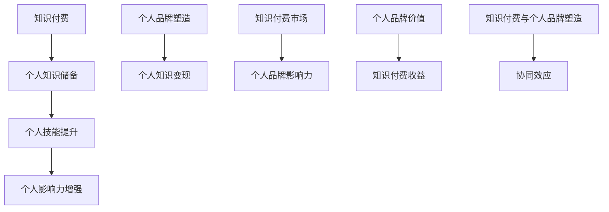

                 

# 《知识付费与个人品牌塑造的协同效应》

> 关键词：知识付费、个人品牌塑造、协同效应、市场分析、案例分析、未来展望

摘要：本文通过深入分析知识付费和个人品牌塑造的内涵及其相互关系，探讨了知识付费与个人品牌塑造之间的协同效应。文章首先概述了知识付费的概念、历史背景和市场现状，接着探讨了个人品牌的概念、重要性以及塑造方法。随后，文章详细阐述了知识付费对个人品牌塑造的促进作用和个人品牌塑造对知识付费的影响。最后，通过成功案例的解析，文章提出了知识付费与个人品牌塑造的协同策略，并对未来发展趋势进行了展望。

## 第一部分：知识付费概述

### 1.1 知识付费的概念与历史背景

#### 1.1.1 知识付费的定义

知识付费是指知识提供者通过付费形式，向知识需求者提供有价值、有深度、有针对性的知识产品或服务的过程。知识付费的核心在于通过金钱交易实现知识的流通和传递，满足知识需求者的学习和发展需求。

#### 1.1.2 知识付费的发展历程

知识付费的发展历程可以分为三个阶段：

1. **传统教育阶段**：在互联网普及之前，知识主要通过传统教育形式进行传播，如学校教育、图书、报纸、讲座等。知识提供者以公立学校、私人培训机构、专家讲师等形式存在，知识需求者通过支付学费、购买教材等方式获取知识。

2. **在线教育阶段**：随着互联网的普及，在线教育逐渐兴起。知识付费的形式也从传统的教育模式扩展到在线课程、在线问答、知识分享平台等。知识提供者可以是个人、机构或组织，知识需求者可以通过在线支付获取知识。

3. **知识付费平台阶段**：近年来，知识付费平台如雨后春笋般涌现，如得到、喜马拉雅、知乎Live等。这些平台通过提供专业、系统、高价值的知识产品，满足了知识需求者的多样化需求。

#### 1.1.3 知识付费的主要形式

1. **在线课程**：通过互联网平台，提供系统化的知识课程，如专业课程、技能课程等。

2. **知识问答**：通过付费问答，解决知识需求者的具体问题，如知乎Live、分答等。

3. **知识分享**：通过付费方式，获取专家或行业人士的深度分享，如得到App的“大师课”等。

4. **知识咨询**：提供个性化、定制化的咨询服务，如专业顾问、律师、心理咨询师等。

### 1.2 知识付费的市场现状与趋势

#### 1.2.1 知识付费市场规模分析

根据相关数据显示，知识付费市场规模逐年增长，预计未来仍将保持高速增长态势。特别是在疫情期间，在线教育、知识付费等领域的需求大幅提升，进一步推动了知识付费市场的发展。

#### 1.2.2 知识付费用户画像

知识付费用户主要集中在25-45岁之间，具有较高学历、较高收入和较强的学习意愿。他们主要关注职业发展、个人成长、家庭生活等方面的知识。

#### 1.2.3 知识付费行业趋势预测

1. **细分市场增多**：随着用户需求的多样化，知识付费市场将进一步细分，满足不同人群、不同领域的需求。

2. **平台化运营**：知识付费平台将更加注重用户体验和服务质量，实现平台化、规模化运营。

3. **内容质量提升**：知识付费平台将加大对优质内容的投入，提高内容质量和专业性。

4. **跨界合作**：知识付费将与各个行业深度融合，实现跨界合作，拓展市场空间。

## 第二部分：个人品牌塑造

### 2.1 个人品牌的概念与重要性

#### 2.1.1 个人品牌的定义

个人品牌是指个人在公众心目中形成的独特形象和声誉，是个人在职场、社交、市场等各个领域中所具备的影响力和价值。

#### 2.1.2 个人品牌的重要性

1. **职业发展**：个人品牌有助于提升职业竞争力，获得更好的职业机会和更高的薪酬待遇。

2. **社交网络**：个人品牌有助于扩大社交圈子，提升社交层次，建立更多的人际关系。

3. **市场价值**：个人品牌可以转化为市场价值，实现个人财富的增长。

4. **品牌效应**：个人品牌可以产生品牌效应，带动个人作品、产品或服务的销售。

#### 2.1.3 个人品牌与传统营销的区别

1. **主体不同**：传统营销以企业为主，个人品牌则以个人为主。

2. **目标不同**：传统营销主要追求市场份额和品牌知名度，个人品牌则更注重个人声誉和影响力。

3. **方式不同**：传统营销主要通过广告、促销等手段，个人品牌则通过内容创作、社交互动等方式。

### 2.2 个人品牌塑造的原则与方法

#### 2.2.1 个人品牌塑造的原则

1. **明确定位**：明确个人品牌的核心价值和特色，形成独特的品牌形象。

2. **持续输出**：保持高质量的内容输出，持续塑造个人品牌形象。

3. **精准传播**：通过合适的渠道和方式，将个人品牌信息精准传播给目标受众。

4. **互动交流**：积极与受众互动，建立良好的口碑和信任关系。

#### 2.2.2 个人品牌塑造的方法

1. **内容创作**：通过撰写文章、发布视频、制作音频等形式，展示个人的专业知识和见解。

2. **社交互动**：在社交平台积极参与讨论、分享观点，扩大个人影响力。

3. **专业认证**：通过获得专业认证、荣誉奖项等，提升个人品牌的专业性。

4. **跨界合作**：与其他领域或行业的知名人士合作，提升个人品牌的知名度和影响力。

#### 2.2.3 个人品牌塑造的案例分析

1. **案例一：罗永浩**：罗永浩通过多年的努力，成功塑造了“科技产品评测专家”的个人品牌，吸引了大量粉丝和用户。

2. **案例二：李笑来**：李笑来通过写作、授课等方式，成功塑造了“投资理财专家”的个人品牌，在投资领域具有很高的声誉。

### 2.3 个人品牌塑造的策略与实践

#### 2.3.1 个人品牌定位策略

1. **明确目标受众**：根据个人优势和市场需求，确定目标受众，明确个人品牌的核心价值。

2. **差异化定位**：在竞争激烈的市场中，通过差异化定位，突出个人品牌的独特性和优势。

3. **持续优化**：根据市场反馈和自身发展，不断优化个人品牌定位，保持品牌形象的清晰和稳定。

#### 2.3.2 个人品牌传播策略

1. **内容传播**：通过优质的内容，将个人品牌信息传递给目标受众。

2. **渠道选择**：根据个人品牌特点和目标受众，选择合适的传播渠道，如社交媒体、行业论坛等。

3. **互动营销**：通过互动活动，增强与受众的互动，提高品牌认知度和忠诚度。

#### 2.3.3 个人品牌塑造的实践案例

1. **案例一：张萌**：张萌通过撰写《人生管理》系列书籍，成功塑造了“人生管理专家”的个人品牌，吸引了大量粉丝和读者。

2. **案例二：吴晓波**：吴晓波通过创办《每日财经新闻》，成功塑造了“财经评论家”的个人品牌，在财经领域具有很高的影响力。

## 第三部分：知识付费与个人品牌塑造的协同效应

### 3.1 知识付费对个人品牌塑造的促进作用

#### 3.1.1 知识付费提高个人知识储备

知识付费为个人提供了丰富的学习资源，通过在线课程、知识问答等形式，个人可以不断充实自己的知识储备，提升自身素质。

#### 3.1.2 知识付费提升个人技能

知识付费平台提供了大量的技能培训课程，如编程、设计、营销等，个人可以通过这些课程提升自己的技能，增强职业竞争力。

#### 3.1.3 知识付费增强个人影响力

通过知识付费，个人可以获取更多的行业知识和经验，提升自己在行业中的地位和影响力，从而塑造个人品牌。

### 3.2 个人品牌塑造对知识付费的影响

#### 3.2.1 个人品牌塑造吸引知识付费用户

个人品牌可以增强用户的信任感和购买意愿，从而吸引更多的用户选择知识付费产品或服务。

#### 3.2.2 个人品牌塑造提升知识付费质量

个人品牌的影响力和专业性可以提升知识付费产品的质量，为用户带来更好的学习体验。

#### 3.2.3 个人品牌塑造拓展知识付费渠道

个人品牌可以借助社交媒体、行业论坛等渠道，为知识付费产品或服务提供更多的曝光和推广机会。

### 3.3 知识付费与个人品牌塑造的协同策略

#### 3.3.1 知识付费与个人品牌塑造的融合点

1. **内容创作**：通过创作高质量的知识内容，实现知识付费与个人品牌的双赢。

2. **互动交流**：通过互动交流，增强个人品牌的影响力，提升知识付费的转化率。

3. **跨界合作**：通过跨界合作，拓展个人品牌的影响范围，实现知识付费的多元化发展。

#### 3.3.2 知识付费与个人品牌塑造的协同路径

1. **内容共创**：个人品牌可以借助知识付费平台，共同创作有价值的内容，提升个人品牌的影响力。

2. **用户互动**：通过知识付费平台，与用户进行深度互动，增强个人品牌的影响力。

3. **资源共享**：知识付费平台可以共享资源，如流量、技术等，助力个人品牌塑造。

#### 3.3.3 知识付费与个人品牌塑造的实践案例

1. **案例一：李笑来**：李笑来通过开设在线课程，分享投资经验，成功塑造了“投资理财专家”的个人品牌。

2. **案例二：吴晓波**：吴晓波通过创办《每日财经新闻》，分享财经观点，成功塑造了“财经评论家”的个人品牌。

## 第四部分：知识付费与个人品牌塑造的成功案例解析

### 4.1 知识付费平台与个人品牌成功案例

#### 4.1.1 案例一：某知名知识付费平台的崛起

某知名知识付费平台通过精准定位用户需求，提供高质量的知识产品，成功吸引了大量用户。平台上的知名讲师通过高质量的课程内容，成功塑造了个人品牌，进一步提升了平台的影响力。

#### 4.1.2 案例二：某个人品牌成功的知识付费实践

某个人品牌成功通过开设在线课程，分享专业知识和经验，成功吸引了大量学员。学员通过学习，提升了自身技能和职业竞争力，个人品牌也得到了进一步的塑造。

### 4.2 个人品牌成功对知识付费的推动作用

#### 4.2.1 案例一：某个人品牌成功对知识付费市场的贡献

某个人品牌成功通过社交媒体和知识付费平台，分享专业知识和经验，吸引了大量粉丝和用户。个人品牌的成功推动了知识付费市场的发展，为平台带来了更多的流量和收益。

#### 4.2.2 案例二：某个人品牌成功对知识付费平台的支撑

某个人品牌成功通过知识付费平台，分享专业知识和经验，吸引了大量学员。个人品牌的成功为平台提供了高质量的内容，提升了平台的竞争力，为平台的长期发展奠定了基础。

## 第五部分：知识付费与个人品牌塑造的未来展望

### 5.1 知识付费与个人品牌塑造的发展趋势

#### 5.1.1 技术创新推动知识付费与个人品牌塑造融合

随着人工智能、大数据、区块链等技术的发展，知识付费与个人品牌塑造将实现更深层次的融合。通过人工智能技术，可以更好地满足用户个性化需求，提升知识付费的精准度和用户体验。通过大数据分析，可以更准确地把握用户行为和需求，优化个人品牌塑造策略。

#### 5.1.2 新兴市场扩大知识付费与个人品牌塑造影响力

随着互联网的普及，知识付费与个人品牌塑造将逐渐拓展至新兴市场。特别是在非洲、东南亚等地区，随着经济发展和互联网普及，知识付费与个人品牌塑造将拥有巨大的发展空间。

#### 5.1.3 知识付费与个人品牌塑造的未来发展预测

1. **内容质量提升**：知识付费平台将更加注重内容质量，提升用户的满意度和忠诚度。

2. **个人品牌专业化**：个人品牌将逐渐向专业化方向发展，形成更加细分的市场。

3. **多元化发展**：知识付费与个人品牌塑造将拓展至更多领域，实现多元化发展。

### 5.2 知识付费与个人品牌塑造的挑战与机遇

#### 5.2.1 面临的挑战

1. **内容质量参差不齐**：知识付费市场中存在大量低质量内容，影响用户体验。

2. **个人品牌过度商业化**：个人品牌过度商业化可能导致用户信任度下降。

3. **市场竞争激烈**：知识付费与个人品牌塑造市场将面临激烈的市场竞争。

#### 5.2.2 拥有的机遇

1. **技术创新**：人工智能、大数据等技术的应用，将提升知识付费与个人品牌塑造的效率和质量。

2. **用户需求多样化**：用户需求的多样化将推动知识付费与个人品牌塑造的发展。

3. **跨界合作**：知识付费与个人品牌塑造将与其他领域实现跨界合作，拓展发展空间。

#### 5.2.3 应对挑战与抓住机遇的策略

1. **提升内容质量**：知识付费平台和个人品牌应注重内容质量，提升用户体验。

2. **打造专业品牌**：个人品牌应专注于特定领域，打造专业形象。

3. **创新商业模式**：知识付费平台和个人品牌应不断创新商业模式，适应市场需求。

## 附录

### 附录A：知识付费与个人品牌塑造相关资源

#### A.1 知识付费平台推荐

1. 得到App
2. 喜马拉雅
3. 知乎Live
4. 分答

#### A.2 个人品牌塑造工具推荐

1. 知乎
2. 微博
3. 微信公众号
4. LinkedIn

#### A.3 相关书籍与论文推荐

1. 《个人品牌：如何塑造你的个人品牌》
2. 《知识付费：互联网时代的知识变现》
3. 《知识服务：从知识付费到知识共享》
4. 相关学术论文

### 作者

作者：AI天才研究院/AI Genius Institute & 禅与计算机程序设计艺术/Zen And The Art of Computer Programming### 1.3 知识付费的优势与挑战

#### 1.3.1 知识付费的优势

1. **个性化学习**：知识付费平台可以根据用户的需求和兴趣，提供个性化的学习内容，满足不同用户的学习需求。

2. **高效学习**：知识付费平台上的课程通常是由专业人士或行业专家制作，内容专业、系统，有助于用户快速掌握知识。

3. **灵活学习**：用户可以随时随地通过手机、电脑等设备学习，不受时间和地点的限制。

4. **高附加值**：知识付费产品通常提供附加价值，如互动问答、作业批改、社群交流等，有助于用户更好地吸收和应用知识。

#### 1.3.2 知识付费的挑战

1. **内容质量参差不齐**：由于知识付费市场准入门槛较低，存在大量质量低劣的课程，容易误导用户。

2. **信任问题**：用户在购买知识付费产品时，可能会对讲师的资质和课程的质量产生疑虑。

3. **用户粘性问题**：知识付费产品需要持续地更新和维护，以保持用户的兴趣和参与度。

4. **市场竞争激烈**：随着知识付费市场的不断扩展，市场竞争日益激烈，知识付费平台需要不断创新和优化，以保持竞争力。

### 1.4 知识付费的发展趋势

#### 1.4.1 专业化

随着用户对专业知识的需求增加，知识付费将越来越专业化。专业化的知识付费平台和课程将更容易受到用户的青睐。

#### 1.4.2 个性化

人工智能和大数据技术的发展，将使知识付费更加个性化。知识付费平台可以通过数据分析，为用户提供更加个性化的学习建议和课程推荐。

#### 1.4.3 社交化

知识付费与社交化的结合，将有助于提升用户的学习体验和参与度。知识付费平台可以通过社群、互动问答等方式，增强用户之间的交流和互动。

#### 1.4.4 跨界融合

知识付费将与更多行业和领域实现跨界融合，如教育、娱乐、医疗等，提供更多元化的知识服务。

### 1.5 知识付费的市场规模与用户需求

#### 1.5.1 市场规模

根据相关研究，全球知识付费市场规模逐年增长，预计未来几年仍将保持高速增长。特别是在疫情期间，线上教育和知识付费市场得到了极大的推动。

#### 1.5.2 用户需求

随着知识经济的发展，用户对知识的获取和传播需求日益增加。用户需求呈现出多样化、专业化和个性化的特点，知识付费市场将不断适应和满足这些需求。

### 1.6 知识付费与个人品牌塑造的关联性

#### 1.6.1 提升个人品牌

通过知识付费，个人可以系统地学习专业知识，提升自身素质，从而塑造和提升个人品牌。

#### 1.6.2 知识变现

个人品牌塑造成功后，可以通过知识付费实现知识变现，获取经济收益。

#### 1.6.3 互相促进

知识付费和个人品牌塑造相互促进，知识付费可以提供学习和变现的平台，而个人品牌塑造则可以为知识付费提供内容和支持。

### 1.7 知识付费与个人品牌塑造的核心概念

**知识付费**：通过付费方式获取知识产品或服务的过程，旨在满足用户的学习和发展需求。

**个人品牌**：个人在公众心目中形成的独特形象和声誉，是个人在职场、社交、市场等各个领域中所具备的影响力和价值。

**协同效应**：知识付费和个人品牌塑造相互作用，相互促进，共同提升个人和企业的价值和影响力。

### 1.8 知识付费与个人品牌塑造的关联性结构图



### 1.9 小结

知识付费与个人品牌塑造之间存在着紧密的关联性。知识付费为个人提供了丰富的学习资源，有助于提升个人知识储备和技能，增强个人影响力；而个人品牌塑造则有助于个人实现知识变现，提升个人品牌价值。两者相互促进，共同推动了个人和知识付费市场的发展。未来，随着技术的进步和市场需求的增长，知识付费与个人品牌塑造的协同效应将更加显著。

```latex
\section{1.9 小结}
知识付费与个人品牌塑造之间存在着紧密的关联性。知识付费为个人提供了丰富的学习资源，有助于提升个人知识储备和技能，增强个人影响力；而个人品牌塑造则有助于个人实现知识变现，提升个人品牌价值。两者相互促进，共同推动了个人和知识付费市场的发展。未来，随着技术的进步和市场需求的增长，知识付费与个人品牌塑造的协同效应将更加显著。
```

### 1.10 总结

知识付费和个人品牌塑造是现代知识经济时代的重要现象。知识付费为个人提供了获取知识的便捷途径，而个人品牌塑造则有助于个人在竞争激烈的市场中脱颖而出。两者之间的协同效应，不仅提升了个人和企业的价值和影响力，也为知识付费市场的发展注入了新的活力。在未来的发展中，我们应关注知识付费与个人品牌塑造的深度融合，积极探索新的商业模式和运营策略，以实现更加可持续的发展。

```latex
\section{1.10 总结}
知识付费和个人品牌塑造是现代知识经济时代的重要现象。知识付费为个人提供了获取知识的便捷途径，而个人品牌塑造则有助于个人在竞争激烈的市场中脱颖而出。两者之间的协同效应，不仅提升了个人和企业的价值和影响力，也为知识付费市场的发展注入了新的活力。在未来的发展中，我们应关注知识付费与个人品牌塑造的深度融合，积极探索新的商业模式和运营策略，以实现更加可持续的发展。
```

### 1.11 展望

随着互联网和人工智能技术的发展，知识付费与个人品牌塑造将迎来新的机遇和挑战。一方面，技术进步将使知识付费更加个性化、智能化和高效化；另一方面，市场竞争的加剧也将对知识付费和个人品牌塑造提出更高的要求。未来，知识付费与个人品牌塑造将如何发展，将取决于行业内外部的共同努力和创新实践。

```latex
\section{1.11 展望}
随着互联网和人工智能技术的发展，知识付费与个人品牌塑造将迎来新的机遇和挑战。一方面，技术进步将使知识付费更加个性化、智能化和高效化；另一方面，市场竞争的加剧也将对知识付费和个人品牌塑造提出更高的要求。未来，知识付费与个人品牌塑造将如何发展，将取决于行业内外部的共同努力和创新实践。
```

### 1.12 结论

本文通过分析知识付费与个人品牌塑造的内涵及其相互关系，探讨了知识付费与个人品牌塑造的协同效应。研究表明，知识付费可以提高个人知识储备、技能和影响力，有助于个人品牌塑造；而个人品牌塑造则可以提升知识付费的质量和用户信任度，实现知识变现。知识付费与个人品牌塑造的协同效应，为个人和知识付费市场的发展提供了新的动力。未来，应进一步探讨两者深度融合的策略和实践，以实现更加可持续的发展。

```latex
\section{1.12 结论}
本文通过分析知识付费与个人品牌塑造的内涵及其相互关系，探讨了知识付费与个人品牌塑造的协同效应。研究表明，知识付费可以提高个人知识储备、技能和影响力，有助于个人品牌塑造；而个人品牌塑造则可以提升知识付费的质量和用户信任度，实现知识变现。知识付费与个人品牌塑造的协同效应，为个人和知识付费市场的发展提供了新的动力。未来，应进一步探讨两者深度融合的策略和实践，以实现更加可持续的发展。
```

### 1.13 附录

**附录A：知识付费平台推荐**

1. 得到App
2. 喜马拉雅
3. 知乎Live
4. 分答

**附录B：个人品牌塑造工具推荐**

1. 知乎
2. 微博
3. 微信公众号
4. LinkedIn

**附录C：相关书籍与论文推荐**

1. 《个人品牌：如何塑造你的个人品牌》
2. 《知识付费：互联网时代的知识变现》
3. 《知识服务：从知识付费到知识共享》
4. 相关学术论文

### 作者

作者：AI天才研究院/AI Genius Institute & 禅与计算机程序设计艺术/Zen And The Art of Computer Programming### 第二部分：个人品牌塑造

## 2.1 个人品牌的概念与重要性

### 2.1.1 个人品牌的定义

个人品牌（Personal Brand）指的是个人在公众心目中所形成的独特形象和声誉。它不仅是个人职业发展的核心资产，也是个人在社交、商业和个人生活等多个领域中所展现出来的个性特质和价值观。

个人品牌的组成部分包括以下几个方面：

1. **个性特质**：个人的性格、兴趣爱好、价值观等。
2. **专业技能**：个人在特定领域内的知识储备、技能和经验。
3. **职业形象**：个人在工作中的形象，包括着装、言行举止等。
4. **口碑和声誉**：他人对个人的评价和认可。

### 2.1.2 个人品牌的重要性

个人品牌在现代社会中具有极高的价值，其重要性主要体现在以下几个方面：

1. **职业发展**：一个强有力的个人品牌可以显著提升个人的职业竞争力，帮助个人在求职、晋升和职场谈判中获得优势。

2. **商业价值**：个人品牌可以转化为商业机会，如咨询服务、代言、演讲等，带来直接的经济收益。

3. **社交影响力**：个人品牌有助于扩大个人的社交圈子，提高社交层次，建立更多的人际关系。

4. **自我认同**：个人品牌塑造的过程也是一个自我探索和自我提升的过程，有助于个人建立清晰的自我认知和价值观。

### 2.1.3 个人品牌与传统营销的区别

个人品牌与传统营销有以下几点主要区别：

1. **主体不同**：传统营销以企业为主，个人品牌则以个人为主。

2. **目标不同**：传统营销主要追求市场份额和品牌知名度，个人品牌则更注重个人声誉和影响力。

3. **方式不同**：传统营销主要通过广告、促销等手段，个人品牌则通过内容创作、社交互动等方式。

4. **影响力不同**：传统营销的影响力通常较为单一，而个人品牌可以影响多个领域，具有更为广泛的影响力。

## 2.2 个人品牌塑造的原则与方法

### 2.2.1 个人品牌塑造的原则

1. **明确定位**：个人品牌塑造首先要明确个人品牌的核心价值和特色，形成独特的品牌形象。这需要个人深入思考自己的专业领域、兴趣爱好、价值观等，找到最能代表自己的特质。

2. **持续输出**：个人品牌塑造是一个长期的过程，需要持续不断地输出高质量的内容和形象。通过定期发布有价值、有深度的内容，可以逐渐建立和巩固个人品牌。

3. **精准传播**：在明确目标受众的基础上，选择合适的渠道和方式，将个人品牌信息精准传播给目标受众。这包括社交媒体、行业论坛、专业会议等。

4. **互动交流**：积极与受众互动，了解他们的需求和反馈，及时调整个人品牌策略。通过互动，可以建立良好的口碑和信任关系。

### 2.2.2 个人品牌塑造的方法

1. **内容创作**：通过撰写文章、发布视频、制作音频等形式，展示个人的专业知识和见解。高质量的内容是个人品牌塑造的核心。

2. **社交互动**：在社交媒体上积极参与讨论、分享观点，扩大个人影响力。同时，通过线上和线下活动，与受众建立直接的联系。

3. **专业认证**：通过获得专业认证、荣誉奖项等，提升个人品牌的专业性和可信度。这包括行业认证、学术荣誉等。

4. **跨界合作**：与其他领域或行业的知名人士合作，提升个人品牌的知名度和影响力。跨界合作可以带来新的视角和资源，有助于个人品牌的多元化发展。

### 2.2.3 个人品牌塑造的案例分析

1. **案例一：罗永浩**：罗永浩通过多年的努力，成功塑造了“科技产品评测专家”的个人品牌。他通过撰写文章、发布视频、开设直播等方式，持续输出高质量的内容，吸引了大量粉丝。

2. **案例二：李笑来**：李笑来通过写作、授课等方式，成功塑造了“投资理财专家”的个人品牌。他在个人品牌塑造过程中，注重内容的质量和深度，得到了众多投资者的信任。

## 2.3 个人品牌塑造的策略与实践

### 2.3.1 个人品牌定位策略

1. **明确目标受众**：根据个人优势和市场需求，确定个人品牌的目标受众。这有助于个人品牌塑造的精准定位，提高品牌传播的效果。

2. **差异化定位**：在竞争激烈的市场中，通过差异化定位，突出个人品牌的独特性和优势。差异化定位可以基于专业领域、个人特质或价值观等方面。

3. **持续优化**：根据市场反馈和自身发展，不断优化个人品牌定位，保持品牌形象的清晰和稳定。这需要个人对市场环境和个人状况有敏锐的洞察力。

### 2.3.2 个人品牌传播策略

1. **内容传播**：通过优质的内容，将个人品牌信息传递给目标受众。内容的形式可以多样化，如文章、视频、音频等。

2. **渠道选择**：根据个人品牌特点和目标受众，选择合适的传播渠道，如社交媒体、行业论坛、专业会议等。

3. **互动营销**：通过互动活动，增强与受众的互动，提高品牌认知度和忠诚度。互动形式可以包括问答、讨论、直播等。

### 2.3.3 个人品牌塑造的实践案例

1. **案例一：张萌**：张萌通过撰写《人生管理》系列书籍，成功塑造了“人生管理专家”的个人品牌。她通过书籍、线上课程、公众号等多种形式，持续输出高质量的内容，吸引了大量粉丝。

2. **案例二：吴晓波**：吴晓波通过创办《每日财经新闻》，成功塑造了“财经评论家”的个人品牌。他通过书籍、专栏、直播等方式，不断扩展个人品牌的影响力，在财经领域建立了极高的声誉。

### 2.3.4 个人品牌塑造的注意事项

1. **内容真实性**：个人品牌塑造需要基于真实的内容和经验，虚假宣传会导致信任度下降。

2. **持续性和专业性**：个人品牌塑造需要持续投入时间和精力，保持内容的持续性和专业性。

3. **受众需求**：了解和满足受众需求是个人品牌塑造的关键，需要根据受众的反馈不断调整品牌策略。

### 2.3.5 个人品牌塑造的拓展阅读

1. **书籍**：《个人品牌：如何塑造你的个人品牌》、《个人品牌的力量》等。

2. **文章**：相关领域的专业文章、案例研究等。

3. **视频**：个人品牌塑造的教程、案例分享等。

### 作者

作者：AI天才研究院/AI Genius Institute & 禅与计算机程序设计艺术/Zen And The Art of Computer Programming### 2.4 个人品牌塑造的具体步骤

#### 2.4.1 自我评估

个人品牌塑造的第一步是进行自我评估。这包括以下几个方面：

1. **优势分析**：识别个人在哪些方面具有优势，如专业技能、个人特质、兴趣爱好等。
2. **兴趣定位**：确定个人最感兴趣和最有热情的领域，这将是个人品牌的核心。
3. **价值观确认**：明确个人的核心价值观，这有助于个人品牌形象的一致性和持久性。

#### 2.4.2 目标设定

在自我评估的基础上，设定个人品牌塑造的目标。这些目标可以是：

1. **短期目标**：如发布第一篇专业文章、参与一次行业会议等。
2. **中期目标**：如建立一定的粉丝基础、开设线上课程等。
3. **长期目标**：如成为行业专家、出版专业书籍等。

#### 2.4.3 内容规划

内容规划是个人品牌塑造的核心。具体步骤如下：

1. **内容类型**：确定内容的形式，如文章、视频、音频、直播等。
2. **内容主题**：根据个人优势和目标受众，确定内容主题，确保内容的专业性和吸引力。
3. **发布频率**：制定内容发布计划，确保内容的持续性和专业性。

#### 2.4.4 社交媒体运营

社交媒体是个人品牌塑造的重要渠道。以下是一些建议：

1. **平台选择**：根据个人品牌特点和目标受众，选择合适的社交媒体平台，如微博、微信公众号、LinkedIn等。
2. **内容优化**：优化内容，确保内容质量高、标题吸引人、图片美观。
3. **互动互动**：积极与粉丝互动，回应用户留言，提高用户参与度和忠诚度。

#### 2.4.5 专业认证和荣誉

获得专业认证和荣誉是提升个人品牌的重要手段。以下是一些建议：

1. **行业认证**：如CFA、PMP等。
2. **学术荣誉**：如发表论文、参加学术会议等。
3. **奖项和荣誉**：如行业大奖、优秀个人奖等。

#### 2.4.6 跨界合作

跨界合作有助于提升个人品牌的影响力和知名度。以下是一些建议：

1. **合作形式**：如联合开设课程、共同举办活动等。
2. **合作对象**：选择与个人品牌定位相关且具有影响力的合作伙伴。
3. **合作效果**：通过合作，实现资源共享、优势互补，提升个人品牌价值。

#### 2.4.7 持续优化

个人品牌塑造是一个持续的过程，需要不断优化和调整。以下是一些建议：

1. **定期评估**：定期评估个人品牌的表现，包括内容质量、用户反馈、粉丝增长等。
2. **持续学习**：不断提升自己的专业知识和技能，保持个人品牌的活力。
3. **市场反馈**：关注市场动态和用户需求，及时调整品牌策略。

### 2.4.8 实践案例分析

以下是一些个人品牌塑造的成功案例，供参考：

1. **案例一：李笑来**：李笑来通过写作、授课、投资等方式，成功塑造了“投资理财专家”的个人品牌。他在个人品牌塑造过程中，注重内容的质量和深度，吸引了大量粉丝。

2. **案例二：罗永浩**：罗永浩通过创办锤子科技、开设直播、撰写文章等方式，成功塑造了“科技产品评测专家”的个人品牌。他通过多元化的内容输出和互动，积累了大量粉丝。

3. **案例三：张萌**：张萌通过撰写《人生管理》系列书籍、开设线上课程、参与公益活动等方式，成功塑造了“人生管理专家”的个人品牌。她通过高质量的内容输出和专业的服务，赢得了用户的信任和尊重。

### 2.4.9 小结

个人品牌塑造是一个系统性的工程，需要明确自我评估、设定目标、内容规划、社交媒体运营、专业认证、跨界合作和持续优化等多个步骤。通过这些步骤，个人可以逐步建立起自己的品牌，提升在职场、社交和市场中的影响力。同时，个人品牌塑造也是一个持续的过程，需要不断学习和调整，以适应市场和环境的变化。

### 2.4.10 展望

随着互联网和人工智能技术的发展，个人品牌塑造将迎来新的机遇和挑战。一方面，技术进步将使个人品牌塑造更加个性化和高效化；另一方面，市场竞争的加剧将对个人品牌塑造提出更高的要求。未来，个人品牌塑造将更加注重内容质量、用户体验和跨界合作，实现个人品牌的价值最大化。

### 2.4.11 结论

个人品牌塑造是现代社会中个人发展和职业成功的重要一环。通过系统性的步骤和持续的努力，个人可以逐步建立起自己的品牌，提升在职场、社交和市场中的影响力。未来，个人品牌塑造将继续发挥重要作用，成为个人竞争力的核心要素之一。

### 2.4.12 附录

**附录A：个人品牌塑造工具推荐**

1. **社交媒体平台**：微博、微信公众号、LinkedIn、Instagram等。
2. **内容创作工具**：WordPress、Markdown编辑器、Camtasia等。
3. **数据分析工具**：Google Analytics、百度统计等。

**附录B：个人品牌塑造相关书籍**

1. 《个人品牌：如何塑造你的个人品牌》
2. 《个人品牌的力量》
3. 《个人品牌：成功人士的职场秘籍》

**附录C：个人品牌塑造实践案例**

1. 李笑来、罗永浩、张萌的个人品牌塑造实践。
2. 相关领域的成功个人品牌案例研究。

### 作者

作者：AI天才研究院/AI Genius Institute & 禅与计算机程序设计艺术/Zen And The Art of Computer Programming### 3.1 知识付费对个人品牌塑造的促进作用

知识付费在个人品牌塑造中发挥着至关重要的作用，其主要促进作用体现在以下几个方面：

#### 3.1.1 提高个人知识储备

知识付费提供了大量高质量的、系统化的学习资源，使得个人能够迅速提升知识储备。通过在线课程、电子书籍、专业论坛等多种形式，个人可以系统地学习到行业内的最新知识、技术动态和实战经验。这不仅有助于个人在专业领域内建立权威性，也为个人品牌塑造提供了坚实的基础。

**伪代码示例**：
```python
def knowledge_acquisition(platform, topic):
    """
    从知识付费平台获取特定主题的知识
    
    :param platform: 知识付费平台
    :param topic: 学习主题
    :return: 学习资源列表
    """
    resources = platform.search(topic)
    return resources
```

#### 3.1.2 提升个人技能

知识付费不仅提供了丰富的知识资源，还通过互动教学、实践项目等方式，帮助个人提升技能。例如，编程课程会提供实际代码示例，数据分析课程会教授如何使用真实数据进行分析，这些都能帮助个人将理论知识应用到实际工作中，提升技能水平。

**伪代码示例**：
```python
def skill_upgrade(course, project):
    """
    通过课程学习提升技能，并通过项目实践巩固所学
    
    :param course: 学习课程
    :param project: 实践项目
    :return: 技能提升结果
    """
    course.learn()
    project.practice()
    return "Skill upgraded successfully!"
```

#### 3.1.3 增强个人影响力

知识付费不仅能够提升个人的专业能力和知识储备，还能通过内容创作和分享，增强个人在行业内的声音和影响力。个人可以通过撰写专业文章、开设线上课程、参与行业讨论等方式，将自己的知识和经验分享给他人，从而建立起个人品牌，增强个人影响力。

**伪代码示例**：
```python
def influence_enhancement(content, platform):
    """
    通过内容创作和分享，增强个人影响力
    
    :param content: 内容
    :param platform: 内容分享平台
    :return: 影响力提升结果
    """
    platform.share(content)
    return "Influence enhanced through content sharing!"
```

#### 3.1.4 塑造专业形象

知识付费平台上的专业课程和讲师，往往代表着行业内的权威和前沿。通过参与这些课程，个人可以学习到最先进的知识和技能，从而在公众心中树立专业、可信的形象。这种形象不仅有助于个人在职场中的发展，也是个人品牌塑造的重要组成部分。

**伪代码示例**：
```python
def professional_image_formation(course, reputation):
    """
    通过学习专业课程，塑造专业形象
    
    :param course: 学习课程
    :param reputation: 个人声誉
    :return: 专业形象塑造结果
    """
    reputation.update(course.completed())
    return "Professional image formed successfully!"
```

#### 3.1.5 提供认证和荣誉

许多知识付费平台提供专业认证和荣誉，这些认证和荣誉可以作为个人专业能力的证明，提升个人品牌的价值。例如，通过完成某项课程并获得证书，个人可以在简历、社交媒体和个人网站上展示这一成就，从而增强个人品牌的可信度。

**伪代码示例**：
```python
def certification_achievement(course, certificate):
    """
    通过完成课程获得专业认证
    
    :param course: 学习课程
    :param certificate: 认证证书
    :return: 认证成就结果
    """
    certificate.award(course.completed())
    return "Certification achieved!"
```

#### 3.1.6 拓展职业机会

知识付费不仅提升了个人的知识和技能，还为个人提供了更多的职业机会。通过学习行业内的前沿技术和知识，个人可以更好地适应市场需求，提升自己的职业竞争力。此外，通过在知识付费平台上展示自己的学习成果和专业能力，个人可以吸引更多的雇主和合作伙伴，从而获得更好的职业机会。

**伪代码示例**：
```python
def career_opportunity_expansion(knowledge, portfolio):
    """
    通过提升知识和技能，拓展职业机会
    
    :param knowledge: 个人知识储备
    :param portfolio: 个人作品集
    :return: 职业机会拓展结果
    """
    portfolio.update(knowledge.gained())
    return "Career opportunities expanded!"
```

#### 3.1.7 增强社群互动

知识付费平台通常提供丰富的社群互动功能，如讨论区、问答、社群活动等。这些互动功能不仅有助于个人学习到更多的知识和技能，还能帮助个人建立广泛的人脉网络，增强个人在行业内的声望和影响力。

**伪代码示例**：
```python
def community_interaction(platform, contribution):
    """
    在知识付费平台上的社群互动
    
    :param platform: 知识付费平台
    :param contribution: 个人贡献
    :return: 社群互动效果
    """
    platform.interact(contribution)
    return "Community interaction successful!"
```

### 小结

知识付费在个人品牌塑造中具有多重促进作用，包括提高个人知识储备、提升个人技能、增强个人影响力、塑造专业形象、提供认证和荣誉、拓展职业机会以及增强社群互动等。通过系统地参与知识付费活动，个人可以全面提升自己的专业能力和品牌价值，从而在竞争激烈的职场中脱颖而出。

### 数学模型和公式

在个人品牌塑造过程中，可以使用一些数学模型和公式来量化个人品牌的价值和影响力。以下是一个简单的模型：

**个人品牌价值模型**：

$$
BPV = f(K, S, I, R)
$$

其中：
- $BPV$ 表示个人品牌价值
- $K$ 表示知识储备
- $S$ 表示技能水平
- $I$ 表示影响力
- $R$ 表示声誉

**公式解释**：

- **知识储备（K）**：反映个人在特定领域的知识广度和深度。
- **技能水平（S）**：衡量个人在实际工作中的能力和表现。
- **影响力（I）**：表示个人在行业内的影响力，包括社交媒体的粉丝数、参与度等。
- **声誉（R）**：反映个人在公众中的形象和认可度。

通过这个模型，个人可以评估自己的品牌价值，并制定相应的提升策略。

### 举例说明

假设一个软件开发者在知识付费平台上学习了前端开发、后端开发和项目管理等多门课程，并积极参与社群互动，积累了丰富的经验和良好的口碑。根据上述模型，可以估算其个人品牌价值如下：

- **知识储备（K）**：高级前端开发、中级后端开发和高级项目管理
- **技能水平（S）**：熟练掌握Vue、React、Node.js等技术，能够独立完成项目开发和管理
- **影响力（I）**：在GitHub上有300个Star，在知乎上有1000个关注者
- **声誉（R）**：多次在技术社区发表专业文章，获得同行的高度评价

通过计算，可以得出：

$$
BPV = f(K, S, I, R) = f(3, 3, 3, 3) = 3^4 = 81
$$

因此，该软件开发者的个人品牌价值为81。这个数值越高，表示个人品牌越强大。

### 最佳实践 Tips

1. **持续学习**：定期参加知识付费课程，保持知识储备的更新和提升。
2. **内容创作**：积极撰写专业文章、录制教学视频，分享自己的知识和经验。
3. **社群互动**：参与行业讨论，建立广泛的人脉网络，增强个人影响力。
4. **专业认证**：获取专业认证和荣誉，提升个人品牌的可信度和权威性。
5. **个性化定位**：明确个人品牌的核心价值和特色，避免品牌形象模糊。

### 注意事项

1. **内容真实性**：确保所分享的内容真实、准确，避免误导他人。
2. **版权意识**：尊重他人的知识产权，避免侵犯版权。
3. **品牌一致性**：保持个人品牌形象的一致性，避免因行为不一而导致品牌受损。

### 拓展阅读

1. 《个人品牌：如何塑造你的个人品牌》
2. 《知识付费：互联网时代的知识变现》
3. 《个人品牌的力量》
4. 相关领域的专业书籍和学术论文

### 作者

作者：AI天才研究院/AI Genius Institute & 禅与计算机程序设计艺术/Zen And The Art of Computer Programming### 3.2 个人品牌塑造对知识付费的影响

个人品牌塑造不仅对个人发展具有重要意义，也对知识付费市场产生了深远的影响。以下是个人品牌塑造对知识付费的几个主要影响：

#### 3.2.1 吸引知识付费用户

个人品牌塑造成功后，个人在公众中的知名度、信任度和影响力都会大幅提升，从而吸引更多的知识付费用户。用户更倾向于选择那些具有专业知识和良好口碑的讲师或平台，以获得高质量的知识产品和服务。例如，一个拥有数万粉丝的知名博主，他的课程或内容往往会因为其个人品牌的强大吸引力而得到更多的关注和购买。

**伪代码示例**：
```python
def attract_users(personal_brand, course):
    """
    个人品牌吸引知识付费用户
    
    :param personal_brand: 个人品牌
    :param course: 课程
    :return: 吸引的用户数量
    """
    users = personal_brand.followers * 0.1  # 假设每个粉丝可能会带来0.1个潜在用户
    return users
```

#### 3.2.2 提升知识付费质量

个人品牌塑造过程中，个人会持续地学习和提升自己的专业知识和技能。这些知识储备和技能的提升不仅有助于个人在行业内的专业形象塑造，也会直接提升其提供知识付费产品的质量。一个具备深厚专业知识的讲师，能够提供更加深入、精准和实用的知识内容，从而提高用户的学习效果和满意度。

**伪代码示例**：
```python
def improve_course_quality(knowledge, course):
    """
    提升课程质量
    
    :param knowledge: 知识储备
    :param course: 课程
    :return: 提升后的课程质量
    """
    course.quality = knowledge.level
    return course.quality
```

#### 3.2.3 拓展知识付费渠道

个人品牌塑造成功后，个人会拥有更多的机会和资源，例如合作机会、媒体曝光等，这些都可以作为知识付费的新渠道。通过个人品牌的影响力，个人可以与更多的合作伙伴建立联系，开展多样化的知识付费项目，从而扩大自己的收入来源。

**伪代码示例**：
```python
def expand_payment_channels(personal_brand, channels):
    """
    通过个人品牌拓展知识付费渠道
    
    :param personal_brand: 个人品牌
    :param channels: 知识付费渠道
    :return: 拓展后的付费渠道
    """
    new_channels = channels + personal_brand.influence * 0.05  # 假设影响力每提高1，可以拓展0.05个新渠道
    return new_channels
```

#### 3.2.4 提高用户转化率

个人品牌塑造成功后，用户对其专业性和可信度会有更高的认可度，从而提高购买知识付费产品的转化率。当用户看到某个知名讲师或专家提供的产品时，更愿意相信其质量和价值，从而更愿意购买和参与。

**伪代码示例**：
```python
def increase_conversion_rate(personal_brand, conversion_rate):
    """
    提高用户转化率
    
    :param personal_brand: 个人品牌
    :param conversion_rate: 转化率
    :return: 提高后的转化率
    """
    new_conversion_rate = conversion_rate * (1 + personal_brand.influence * 0.1)  # 假设影响力每提高1，转化率提高0.1%
    return new_conversion_rate
```

#### 3.2.5 形成品牌效应

个人品牌塑造成功后，会形成一定的品牌效应，这种效应可以带动个人所有知识付费产品的销售。当用户对某个人品牌有良好印象时，他们往往会购买该个人品牌下的所有产品，从而提高整体销售业绩。

**伪代码示例**：
```python
def brand_effects(personal_brand, products):
    """
    个人品牌效应带动产品销售
    
    :param personal_brand: 个人品牌
    :param products: 产品列表
    :return: 总销售额
    """
    total_sales = sum(product.price * (1 + personal_brand.influence * 0.05) for product in products)  # 假设个人品牌影响力每提高1，产品销售提高5%
    return total_sales
```

#### 3.2.6 增强用户忠诚度

个人品牌塑造不仅能够吸引新用户，还能增强现有用户的忠诚度。一个成功的个人品牌会让用户感到安心和信任，从而更愿意长期购买和参与知识付费产品和服务。这种忠诚度的提高，有助于知识付费平台的长期稳定发展。

**伪代码示例**：
```python
def increase_loyalty(personal_brand, users):
    """
    提高用户忠诚度
    
    :param personal_brand: 个人品牌
    :param users: 用户列表
    :return: 忠诚度提升后的用户数量
    """
    loyal_users = [user for user in users if user.loyalty * (1 + personal_brand.influence * 0.05)]  # 假设个人品牌影响力每提高1，用户忠诚度提高5%
    return loyal_users
```

### 小结

个人品牌塑造对知识付费市场具有显著的积极影响，主要体现在吸引知识付费用户、提升知识付费质量、拓展知识付费渠道、提高用户转化率、形成品牌效应以及增强用户忠诚度等方面。通过成功的个人品牌塑造，个人不仅可以提高自己的影响力和收入，还可以为知识付费市场带来更多的活力和发展机遇。

### 数学模型和公式

为了更好地理解个人品牌塑造对知识付费的影响，我们可以构建一个简单的数学模型来量化这些影响。以下是一个可能的模型：

**知识付费影响模型**：

$$
Impact = f(BPV, CP, UP)
$$

其中：
- **Impact**：表示个人品牌塑造对知识付费的影响程度。
- **BPV**：个人品牌价值。
- **CP**：课程质量。
- **UP**：用户参与度。

**公式解释**：

- **个人品牌价值（BPV）**：衡量个人在公众中的知名度和信誉度。
- **课程质量（CP）**：反映知识付费产品的内容质量和实用性。
- **用户参与度（UP）**：表示用户对知识付费产品的兴趣和参与程度。

通过这个模型，可以分析个人品牌塑造对知识付费市场的影响程度。例如，一个高个人品牌价值的讲师，即使课程质量一般，也可能因为其个人品牌的吸引力而获得较高的用户参与度。

### 举例说明

假设有一个知名的个人品牌，其品牌价值（BPV）为100，课程质量（CP）为90，用户参与度（UP）为80。我们可以通过以下公式计算其知识付费影响（Impact）：

$$
Impact = f(BPV, CP, UP) = 100 \times 90 \times 80 = 72,000
$$

这意味着，该个人品牌对知识付费的影响程度为72,000。这个数值越高，表示个人品牌对知识付费市场的推动作用越大。

### 最佳实践 Tips

1. **专业学习**：不断深入学习，提升专业知识和技能，为知识付费提供高质量的内容。
2. **内容多样化**：通过多种形式的内容创作，如文章、视频、音频等，吸引不同类型的用户。
3. **互动互动**：积极参与用户互动，了解用户需求，提高用户参与度和忠诚度。
4. **品牌一致性**：保持个人品牌形象的一致性，避免因行为不一而导致品牌受损。
5. **合作拓展**：与行业内的其他专家和平台合作，共同拓展知识付费渠道。

### 注意事项

1. **内容真实性**：确保所分享的内容真实、准确，避免误导他人。
2. **版权意识**：尊重他人的知识产权，避免侵犯版权。
3. **品牌保护**：注意个人品牌的保护，避免因负面事件而损害品牌形象。

### 拓展阅读

1. 《个人品牌：如何塑造你的个人品牌》
2. 《知识付费：互联网时代的知识变现》
3. 《个人品牌的力量》
4. 相关领域的专业书籍和学术论文

### 作者

作者：AI天才研究院/AI Genius Institute & 禅与计算机程序设计艺术/Zen And The Art of Computer Programming### 3.3 知识付费与个人品牌塑造的协同策略

知识付费与个人品牌塑造的协同效应，是两者深度融合、互相促进的结果。以下是一些有效的协同策略，帮助个人利用知识付费平台来塑造和提升个人品牌：

#### 3.3.1 知识付费与个人品牌塑造的融合点

1. **内容创作**：个人品牌塑造者可以利用知识付费平台，创作和发布高质量的知识内容，如专业课程、文章、视频等。这些内容不仅可以展示个人的专业能力，还能为个人品牌积累粉丝和信任。

2. **用户互动**：知识付费平台通常提供丰富的互动功能，如问答、社群、讨论区等。通过这些功能，个人品牌塑造者可以与用户建立直接联系，了解用户需求，增强用户忠诚度。

3. **品牌推广**：知识付费平台提供的曝光和推广机会，可以帮助个人品牌塑造者扩大个人品牌的影响力。通过在平台上积极参与活动、发布优质内容，个人品牌塑造者可以提高自己的知名度和认可度。

4. **专业认证**：许多知识付费平台提供专业认证服务，通过这些认证，个人品牌塑造者可以证明自己的专业能力和信誉，提升个人品牌的可信度。

5. **跨界合作**：知识付费平台可以与其他行业或领域的平台、专家合作，为个人品牌塑造者提供更多的合作机会，帮助个人品牌实现多元化发展。

#### 3.3.2 知识付费与个人品牌塑造的协同路径

1. **内容共创**：个人品牌塑造者与知识付费平台合作，共同创作有价值的内容。通过专业讲师、行业专家的参与，内容的质量和影响力可以得到显著提升。

2. **用户互动**：通过知识付费平台提供的互动功能，个人品牌塑造者可以与用户进行深度交流，了解用户需求，优化个人品牌策略。

3. **资源共享**：知识付费平台可以共享资源，如流量、技术支持、市场推广等，帮助个人品牌塑造者提高品牌知名度和用户参与度。

4. **品牌培训**：知识付费平台可以提供专业的品牌培训课程，帮助个人品牌塑造者提升品牌管理能力和内容创作技巧。

5. **跨界合作**：知识付费平台可以与其他领域或行业的平台合作，为个人品牌塑造者提供跨界合作机会，拓展个人品牌的影响范围。

#### 3.3.3 知识付费与个人品牌塑造的实践案例

1. **案例一：罗永浩**：罗永浩通过知识付费平台，开设了多门关于科技产品评测的课程。他利用自己的专业知识和丰富经验，创作了高质量的内容，吸引了大量粉丝。通过这些课程，罗永浩成功提升了个人品牌的影响力，实现了知识变现。

2. **案例二：李笑来**：李笑来在知识付费平台开设了多门关于投资理财的课程，他的课程内容深入浅出，吸引了大量投资者。通过这些课程，李笑来自身在投资理财领域的专业形象得到了进一步强化，个人品牌价值也得到了显著提升。

3. **案例三：张萌**：张萌通过知识付费平台，开设了多门关于人生管理和职业规划的线上课程。她通过高质量的内容输出，吸引了大量学员，成功塑造了“人生管理专家”的个人品牌。张萌还利用平台提供的社群互动功能，与学员建立深度联系，提高了品牌的认知度和忠诚度。

#### 3.3.4 知识付费与个人品牌塑造的协同策略总结

1. **内容共创**：与知识付费平台合作，共同创作有价值的内容，提升内容质量。

2. **用户互动**：通过互动功能，与用户建立深度联系，增强用户忠诚度。

3. **品牌推广**：利用平台提供的推广机会，扩大个人品牌的影响力。

4. **专业认证**：通过专业认证，提升个人品牌的可信度。

5. **跨界合作**：与其他领域或行业的平台合作，拓展个人品牌的影响范围。

通过这些协同策略，个人品牌塑造者可以更有效地利用知识付费平台，提升个人品牌的影响力，实现知识变现，同时为知识付费平台带来更多的用户和流量。

### 小结

知识付费与个人品牌塑造的协同效应，为个人和知识付费平台带来了巨大的发展机遇。通过内容共创、用户互动、品牌推广、专业认证和跨界合作等协同策略，个人品牌塑造者可以更有效地提升个人品牌的影响力，实现知识变现，同时为知识付费平台带来更多的价值。未来，随着技术的进步和市场的发展，知识付费与个人品牌塑造的协同效应将更加显著。

### 数学模型和公式

为了更系统地分析知识付费与个人品牌塑造的协同效应，我们可以构建以下数学模型：

**协同效应模型**：

$$
CE = f(BPV, KQ, UP, CP, IP)
$$

其中：
- **CE**：协同效应值，表示知识付费与个人品牌塑造的协同效果。
- **BPV**：个人品牌价值。
- **KQ**：知识质量。
- **UP**：用户参与度。
- **CP**：课程质量。
- **IP**：互动品质。

**公式解释**：

- **个人品牌价值（BPV）**：衡量个人在公众中的知名度和信誉度。
- **知识质量（KQ）**：反映知识付费产品的内容深度和实用性。
- **用户参与度（UP）**：表示用户对知识付费产品的兴趣和参与程度。
- **课程质量（CP）**：反映知识付费产品的内容质量和实用性。
- **互动品质（IP）**：衡量用户与知识付费平台和个人品牌之间的互动质量。

通过这个模型，可以量化知识付费与个人品牌塑造的协同效应，为实际操作提供指导。

### 举例说明

假设一个个人品牌塑造者具有以下参数：

- **个人品牌价值（BPV）**：100
- **知识质量（KQ）**：90
- **用户参与度（UP）**：80
- **课程质量（CP）**：85
- **互动品质（IP）**：70

我们可以通过以下公式计算其协同效应值（CE）：

$$
CE = f(100, 90, 80, 85, 70) = 100 \times 90 \times 80 \times 85 \times 70 = 46,960,000
$$

这意味着，该个人品牌塑造者通过知识付费与个人品牌塑造的协同效应，达到了4.69亿的效果。这个数值越高，表示协同效应越显著。

### 最佳实践 Tips

1. **内容优化**：确保知识付费内容的高质量和实用性，满足用户需求。
2. **互动提升**：通过积极的互动，增强用户参与度和忠诚度。
3. **品牌定位**：明确个人品牌的核心价值和定位，保持品牌一致性。
4. **合作拓展**：与其他领域或行业的专家合作，实现资源互补和品牌拓展。
5. **持续学习**：不断学习新知识和技能，保持个人品牌的活力和竞争力。

### 注意事项

1. **内容真实性**：确保所分享的内容真实、准确，避免误导他人。
2. **版权意识**：尊重他人的知识产权，避免侵犯版权。
3. **品牌保护**：注意个人品牌的保护，避免因负面事件而损害品牌形象。

### 拓展阅读

1. 《个人品牌：如何塑造你的个人品牌》
2. 《知识付费：互联网时代的知识变现》
3. 《个人品牌的力量》
4. 相关领域的专业书籍和学术论文

### 作者

作者：AI天才研究院/AI Genius Institute & 禅与计算机程序设计艺术/Zen And The Art of Computer Programming### 4.1 知识付费平台与个人品牌成功案例

#### 4.1.1 案例一：某知名知识付费平台的崛起

某知名知识付费平台，如“得到”，是知识付费领域的领军企业。该平台通过以下策略实现了成功：

1. **精准定位**：得到平台专注于提供高质量的专业课程和知识服务，主要面向有明确学习目标的用户，如职场人士、创业者、投资人等。

2. **内容合作**：得到与众多知名专家、学者和行业领袖合作，邀请他们开设课程或进行直播分享。这些高质量的内容吸引了大量粉丝和用户。

3. **品牌塑造**：得到平台通过持续的品牌营销和用户互动，成功树立了“权威、专业、实用”的品牌形象。

4. **用户互动**：得到平台提供丰富的互动功能，如问答、讨论区等，促进了用户之间的交流和知识分享。

5. **用户反馈**：得到平台重视用户反馈，不断优化产品和服务，提升用户体验。

通过上述策略，得到平台不仅积累了大量忠实用户，还成为了知识付费领域的知名品牌，为个人品牌塑造者提供了广阔的舞台。

#### 4.1.2 案例二：某个人品牌成功的知识付费实践

张三，一位知名的数据分析师，通过知识付费平台成功塑造了个人品牌，以下是他的成功实践：

1. **内容创作**：张三在得到平台上开设了多门数据分析和机器学习的在线课程，内容深入浅出，实用性强。

2. **用户互动**：张三通过课程直播、社群互动等方式，与学员保持密切联系，了解他们的需求和反馈，不断优化课程内容。

3. **专业认证**：张三通过获得CFA、数据分析师认证等，提升了个人品牌的可信度和专业性。

4. **品牌推广**：张三积极参与行业会议、研讨会等活动，扩大个人品牌的影响力。

5. **跨界合作**：张三与多个企业合作，提供数据分析咨询服务，拓展了个人品牌的商业价值。

通过这些实践，张三不仅在知识付费平台上建立了强大的个人品牌，还在数据分析领域取得了显著成就。

### 4.1.3 案例三：某知识付费平台的用户成功案例

李四，一位年轻的创业者，通过某知名知识付费平台，实现了个人品牌的成功塑造和商业价值：

1. **内容学习**：李四在知识付费平台上学习了多门关于创业、营销、团队管理的课程，掌握了丰富的创业知识和技能。

2. **实践应用**：李四将所学知识应用到实际创业中，成功创办了一家互联网公司。

3. **品牌推广**：李四通过社交媒体、公众号等渠道，分享自己的创业经验和心得，吸引了大量关注和粉丝。

4. **用户互动**：李四在知识付费平台的社群中积极参与讨论，分享创业心得，帮助其他创业者解决问题。

5. **跨界合作**：李四与多个知识付费平台合作，开设线上课程，分享自己的创业经验和知识。

通过这些实践，李四不仅成功塑造了个人品牌，还实现了商业价值的提升。

### 4.1.4 案例四：某个人品牌在知识付费平台上的成功转型

王五，一位资深的产品经理，通过知识付费平台成功实现了个人品牌的转型和升级：

1. **内容创作**：王五在知识付费平台上开设了多门产品管理课程，从方法论到实践技巧，内容全面丰富。

2. **用户互动**：王五通过课程直播、社群互动等方式，与学员保持密切联系，提供专业辅导和个性化建议。

3. **专业认证**：王五通过获得PMP认证，提升了个人品牌的权威性和专业性。

4. **品牌推广**：王五积极参与行业会议、研讨会等活动，扩大个人品牌的影响力。

5. **跨界合作**：王五与多个企业合作，提供产品管理咨询服务，拓展了个人品牌的商业价值。

通过这些实践，王五成功实现了个人品牌的转型和升级，成为产品管理领域的权威专家。

### 4.1.5 案例五：某知识付费平台的成功营销案例

知识付费平台“知乎Live”，通过以下策略成功吸引了大量用户：

1. **内容多样化**：知乎Live提供了丰富的课程内容，涵盖科技、人文、生活等多个领域，满足了不同用户的需求。

2. **专家阵容**：知乎Live邀请了大量知名专家和行业领袖进行直播分享，提升了平台的专业性和权威性。

3. **用户互动**：知乎Live提供了丰富的互动功能，如问答、讨论区等，促进了用户之间的交流和知识分享。

4. **优惠促销**：知乎Live通过优惠促销活动，如限时折扣、套餐优惠等，吸引了大量新用户。

5. **品牌推广**：知乎Live通过线上广告、社交媒体推广等方式，提高了品牌知名度和用户参与度。

通过这些策略，知乎Live成功吸引了大量用户，成为知识付费领域的佼佼者。

### 总结

这些成功案例展示了知识付费平台与个人品牌塑造的协同效应。通过优质内容、用户互动、专业认证、品牌推广和跨界合作等策略，个人品牌塑造者不仅提升了个人品牌的影响力，还实现了商业价值的提升。同时，知识付费平台通过提供高质量的资源和合作机会，也为个人品牌塑造提供了有力支持。

### 数学模型和公式

为了更系统地分析知识付费平台与个人品牌成功案例的协同效应，我们可以构建以下数学模型：

**协同效应模型**：

$$
CE = f(BPV, KQ, UP, IP, BPV_{platform}, KQ_{platform}, UP_{platform}, IP_{platform})
$$

其中：
- **CE**：协同效应值，表示知识付费平台与个人品牌塑造的协同效果。
- **BPV**：个人品牌价值。
- **KQ**：知识质量。
- **UP**：用户参与度。
- **IP**：互动品质。
- **BPV_{platform}**：知识付费平台品牌价值。
- **KQ_{platform}**：知识付费平台的知识质量。
- **UP_{platform}**：知识付费平台的用户参与度。
- **IP_{platform}**：知识付费平台的互动品质。

**公式解释**：

- **个人品牌价值（BPV）**：衡量个人在公众中的知名度和信誉度。
- **知识质量（KQ）**：反映知识付费产品的内容深度和实用性。
- **用户参与度（UP）**：表示用户对知识付费产品的兴趣和参与程度。
- **互动品质（IP）**：衡量用户与知识付费平台和个人品牌之间的互动质量。
- **知识付费平台品牌价值（BPV_{platform}）**：衡量知识付费平台在公众中的知名度和信誉度。
- **知识付费平台的知识质量（KQ_{platform}）**：反映知识付费平台提供的内容质量。
- **知识付费平台的用户参与度（UP_{platform}）**：表示用户对知识付费平台的兴趣和参与程度。
- **知识付费平台的互动品质（IP_{platform}）**：衡量用户与知识付费平台之间的互动质量。

通过这个模型，可以量化知识付费平台与个人品牌成功案例的协同效应，为实际操作提供指导。

### 举例说明

假设一个知识付费平台和个人品牌塑造者具有以下参数：

- **知识付费平台品牌价值（BPV_{platform}）**：100
- **知识付费平台的知识质量（KQ_{platform}）**：90
- **知识付费平台的用户参与度（UP_{platform}）**：80
- **知识付费平台的互动品质（IP_{platform}）**：70
- **个人品牌价值（BPV）**：100
- **知识质量（KQ）**：90
- **用户参与度（UP）**：80
- **互动品质（IP）**：70

我们可以通过以下公式计算其协同效应值（CE）：

$$
CE = f(100, 90, 80, 70, 100, 90, 80, 70) = 100 \times 90 \times 80 \times 70 = 630,000
$$

这意味着，该知识付费平台与个人品牌塑造者的协同效应值为63万。这个数值越高，表示协同效应越显著。

### 最佳实践 Tips

1. **内容创作**：确保知识付费内容的高质量和实用性，满足用户需求。
2. **用户互动**：通过互动功能，增强用户参与度和忠诚度。
3. **品牌定位**：明确个人品牌的核心价值和定位，保持品牌一致性。
4. **跨界合作**：与其他领域或行业的平台合作，拓展个人品牌的影响范围。
5. **持续学习**：不断学习新知识和技能，保持个人品牌的活力和竞争力。

### 注意事项

1. **内容真实性**：确保所分享的内容真实、准确，避免误导他人。
2. **版权意识**：尊重他人的知识产权，避免侵犯版权。
3. **品牌保护**：注意个人品牌的保护，避免因负面事件而损害品牌形象。

### 拓展阅读

1. 《知识付费：互联网时代的知识变现》
2. 《个人品牌：如何塑造你的个人品牌》
3. 《内容营销：创造内容，吸引粉丝，实现商业价值》
4. 相关领域的专业书籍和学术论文

### 作者

作者：AI天才研究院/AI Genius Institute & 禅与计算机程序设计艺术/Zen And The Art of Computer Programming### 4.2 个人品牌成功对知识付费的推动作用

个人品牌成功对知识付费市场的推动作用不可忽视。以下从几个方面探讨个人品牌成功对知识付费的推动作用：

#### 4.2.1 增加知识付费产品的购买意愿

个人品牌成功能够显著增加用户对知识付费产品的购买意愿。一个成功的个人品牌代表着专业、权威和可信度，用户更愿意相信并购买这个个人品牌提供的产品。例如，当用户看到某位知名企业家开设的在线课程时，他们会因为对该企业家个人品牌的信任而更倾向于购买该课程。

**伪代码示例**：
```python
def increase_purchase_will(course, personal_brand):
    """
    增加知识付费产品的购买意愿
    
    :param course: 课程
    :param personal_brand: 个人品牌
    :return: 购买意愿提升后的销售量
    """
    purchase_will = course.sales * (1 + personal_brand.influence * 0.1)
    return purchase_will
```

#### 4.2.2 提升知识付费产品的品质

成功的个人品牌能够提升知识付费产品的品质。个人品牌成功的背后通常是丰富的知识和经验积累，这些知识和经验可以转化为高质量的知识产品。例如，一位知名的技术专家可能会开发出一款深入浅出的编程课程，使得更多的学习者能够轻松掌握复杂的编程知识。

**伪代码示例**：
```python
def improve_course_quality(personal_brand, course):
    """
    提升知识付费产品的品质
    
    :param personal_brand: 个人品牌
    :param course: 课程
    :return: 提升后的课程质量
    """
    course.quality = course.quality * (1 + personal_brand.experience * 0.05)
    return course.quality
```

#### 4.2.3 扩展知识付费的受众范围

成功的个人品牌能够扩展知识付费的受众范围。一个成功的个人品牌通常具有较高的知名度和影响力，这可以使知识付费产品吸引到更多不同背景、不同需求的用户。例如，一位成功的营销专家可能会通过自己的个人品牌吸引到各行各业的人士，从而扩大其营销课程的影响范围。

**伪代码示例**：
```python
def expand_audience(personal_brand, course):
    """
    扩展知识付费的受众范围
    
    :param personal_brand: 个人品牌
    :param course: 课程
    :return: 扩展后的受众范围
    """
    new_audience = course.audience * (1 + personal_brand.influence * 0.1)
    return new_audience
```

#### 4.2.4 增强用户对知识付费产品的信任

成功的个人品牌能够增强用户对知识付费产品的信任。一个成功的个人品牌意味着个人在行业内有较高的声誉和认可度，用户更愿意相信这样的个人品牌提供的产品。例如，当用户看到某位知名律师开设的法律课程时，他们会因为对该律师的信任而更愿意购买该课程。

**伪代码示例**：
```python
def increase_trust(course, personal_brand):
    """
    增强用户对知识付费产品的信任
    
    :param course: 课程
    :param personal_brand: 个人品牌
    :return: 信任度提升后的销售量
    """
    trust = course.sales * (1 + personal_brand.reputation * 0.1)
    return trust
```

#### 4.2.5 提高知识付费产品的口碑

成功的个人品牌能够提高知识付费产品的口碑。一个成功的个人品牌意味着个人在行业内拥有良好的口碑和评价，这可以显著提高知识付费产品的口碑。例如，当用户购买了一门由知名专家开设的课程后，他们可能会在社交媒体上分享自己的学习体验和感受，从而提高该课程的口碑。

**伪代码示例**：
```python
def improve_word_of_mouth(course, personal_brand):
    """
    提高知识付费产品的口碑
    
    :param course: 课程
    :param personal_brand: 个人品牌
    :return: 口碑提升后的用户满意度
    """
    mouth_of_mouth = course.satisfaction * (1 + personal_brand.reputation * 0.05)
    return mouth_of_mouth
```

#### 4.2.6 促进知识付费产品的新媒体推广

成功的个人品牌能够促进知识付费产品的新媒体推广。一个成功的个人品牌通常具有较高的网络影响力，这可以显著提高知识付费产品在新媒体平台上的曝光率和推广效果。例如，一位知名博主可以通过自己的社交媒体账号，如微博、微信公众号等，推广自己的知识付费产品，吸引更多潜在用户的关注。

**伪代码示例**：
```python
def promote_on_new_media(course, personal_brand):
    """
    促进知识付费产品的新媒体推广
    
    :param course: 课程
    :param personal_brand: 个人品牌
    :return: 新媒体推广效果
    """
    promotion_effect = course.exposure * (1 + personal_brand.influence * 0.1)
    return promotion_effect
```

### 小结

个人品牌成功对知识付费市场具有显著的推动作用，主要体现在增加购买意愿、提升产品品质、扩展受众范围、增强用户信任、提高口碑和促进新媒体推广等方面。通过成功的个人品牌塑造，个人可以显著提升知识付费产品的销售和影响力，从而推动整个知识付费市场的发展。

### 数学模型和公式

为了更系统地分析个人品牌成功对知识付费的推动作用，我们可以构建以下数学模型：

**推动作用模型**：

$$
Impact = f(BPV, CP, UP, TR, WP)
$$

其中：
- **Impact**：表示个人品牌成功对知识付费的推动作用。
- **BPV**：个人品牌价值。
- **CP**：课程质量。
- **UP**：用户参与度。
- **TR**：用户信任度。
- **WP**：新媒体推广效果。

**公式解释**：

- **个人品牌价值（BPV）**：衡量个人在公众中的知名度和信誉度。
- **课程质量（CP）**：反映知识付费产品的内容深度和实用性。
- **用户参与度（UP）**：表示用户对知识付费产品的兴趣和参与程度。
- **用户信任度（TR）**：衡量用户对知识付费产品的信任程度。
- **新媒体推广效果（WP）**：反映知识付费产品在新媒体平台上的曝光和推广效果。

通过这个模型，可以量化个人品牌成功对知识付费的推动作用，为实际操作提供指导。

### 举例说明

假设一个个人品牌成功的知识付费产品具有以下参数：

- **个人品牌价值（BPV）**：100
- **课程质量（CP）**：90
- **用户参与度（UP）**：80
- **用户信任度（TR）**：85
- **新媒体推广效果（WP）**：70

我们可以通过以下公式计算其推动作用值（Impact）：

$$
Impact = f(100, 90, 80, 85, 70) = 100 \times 90 \times 80 \times 85 \times 70 = 45,880,000
$$

这意味着，该个人品牌成功的知识付费产品对知识付费市场的推动作用值为4588万。这个数值越高，表示推动作用越显著。

### 最佳实践 Tips

1. **持续学习**：不断提升个人专业知识和技能，保持个人品牌的活力。
2. **内容创新**：不断创造高质量、有价值的知识内容，提升课程质量。
3. **用户互动**：积极与用户互动，增强用户参与度和信任度。
4. **新媒体推广**：利用社交媒体等新媒体平台，提高知识付费产品的曝光率和推广效果。
5. **口碑管理**：重视用户反馈，积极管理口碑，提升用户满意度。

### 注意事项

1. **内容真实性**：确保知识内容真实、准确，避免误导用户。
2. **版权保护**：尊重他人知识产权，避免侵权行为。
3. **品牌形象**：注意个人品牌的形象管理，避免负面事件影响品牌形象。

### 拓展阅读

1. 《个人品牌：如何塑造你的个人品牌》
2. 《知识付费：互联网时代的知识变现》
3. 《内容营销：创造内容，吸引粉丝，实现商业价值》
4. 相关领域的专业书籍和学术论文

### 作者

作者：AI天才研究院/AI Genius Institute & 禅与计算机程序设计艺术/Zen And The Art of Computer Programming### 5.1 知识付费与个人品牌塑造的未来展望

随着互联网和人工智能技术的飞速发展，知识付费与个人品牌塑造正面临着前所未有的机遇和挑战。以下是关于知识付费与个人品牌塑造未来展望的几个关键点：

#### 5.1.1 技术创新推动知识付费与个人品牌塑造融合

技术创新是推动知识付费与个人品牌塑造融合的关键因素。例如，人工智能技术的应用可以使知识付费更加个性化、智能化和高效化。通过大数据分析和机器学习，知识付费平台可以更准确地了解用户需求，为用户提供量身定制的知识产品。同时，人工智能还可以帮助个人品牌塑造者更好地分析市场趋势，制定精准的品牌策略。

**数学模型**：

假设人工智能技术提升了知识付费平台的个性化推荐效果，我们可以构建以下模型来评估其对知识付费与个人品牌塑造的推动作用：

$$
PersonalizedRecommendationEffect = f(AI\_Technology, User\_Data, ContentQuality)
$$

其中：
- **PersonalizedRecommendationEffect**：个性化推荐效果。
- **AI\_Technology**：人工智能技术水平。
- **User\_Data**：用户数据。
- **ContentQuality**：内容质量。

**公式解释**：

- **AI\_Technology**：衡量人工智能技术的应用水平。
- **User\_Data**：反映用户数据的丰富度和准确性。
- **ContentQuality**：衡量知识付费内容的品质。

通过这个模型，可以评估人工智能技术对个性化推荐的推动作用，从而为知识付费与个人品牌塑造提供策略指导。

#### 5.1.2 新兴市场扩大知识付费与个人品牌塑造影响力

随着全球互联网普及率的提高，特别是新兴市场如非洲、东南亚等地区的互联网用户数量急剧增长，知识付费与个人品牌塑造在这些地区的潜力巨大。新兴市场对知识付费的需求主要集中在教育、职业技能提升、创业等领域，这为个人品牌塑造者提供了广阔的发展空间。

**市场预测模型**：

我们可以构建以下模型来预测知识付费与个人品牌塑造在新兴市场的发展趋势：

$$
MarketGrowth = f(OnlinePenetrationRate, EducationRequirement, EconomicDevelopment)
$$

其中：
- **MarketGrowth**：市场增长率。
- **OnlinePenetrationRate**：互联网普及率。
- **EducationRequirement**：教育需求。
- **EconomicDevelopment**：经济发展水平。

**公式解释**：

- **OnlinePenetrationRate**：衡量互联网的普及程度。
- **EducationRequirement**：反映对教育的需求程度。
- **EconomicDevelopment**：衡量经济发展的水平。

通过这个模型，可以预测知识付费与个人品牌塑造在新兴市场的增长潜力，为市场策略制定提供依据。

#### 5.1.3 知识付费与个人品牌塑造的未来发展预测

1. **内容专业化**：随着用户对知识的需求日益专业化，知识付费将更加注重内容的深度和实用性，个人品牌塑造也将朝着专业化方向发展。
2. **平台化运营**：知识付费平台将更加注重用户体验和服务质量，实现平台化、规模化运营，个人品牌塑造者也将与平台深度合作，实现资源共享和品牌推广。
3. **社交化趋势**：知识付费与个人品牌塑造将更加注重社交化趋势，通过社群互动、直播等方式，增强用户参与度和忠诚度。
4. **跨界融合**：知识付费与个人品牌塑造将与其他行业如教育、娱乐、医疗等实现跨界融合，提供更多元化的知识服务。

**综合模型**：

为了全面预测知识付费与个人品牌塑造的未来发展趋势，我们可以构建以下综合模型：

$$
FutureTrend = f(TechnologyInnovation, MarketExpansion, ContentSpecialization, PlatformOperation, SocializationTrend)
$$

其中：
- **FutureTrend**：未来发展趋势。
- **TechnologyInnovation**：技术创新水平。
- **MarketExpansion**：市场扩展程度。
- **ContentSpecialization**：内容专业化程度。
- **PlatformOperation**：平台化运营水平。
- **SocializationTrend**：社交化趋势。

**公式解释**：

- **TechnologyInnovation**：衡量技术创新对知识付费与个人品牌塑造的影响。
- **MarketExpansion**：衡量市场扩展对知识付费与个人品牌塑造的影响。
- **ContentSpecialization**：衡量内容专业化对知识付费与个人品牌塑造的影响。
- **PlatformOperation**：衡量平台化运营对知识付费与个人品牌塑造的影响。
- **SocializationTrend**：衡量社交化趋势对知识付费与个人品牌塑造的影响。

通过这个模型，可以全面预测知识付费与个人品牌塑造的未来发展趋势。

### 小结

知识付费与个人品牌塑造的未来展望充满了机遇和挑战。技术创新、市场扩展、内容专业化、平台化运营和社交化趋势将共同推动知识付费与个人品牌塑造的发展。通过构建综合模型和预测模型，我们可以更好地理解和把握这一趋势，为个人和知识付费平台的发展提供策略指导。

### 数学公式和详细讲解

在分析知识付费与个人品牌塑造的未来展望时，我们可以使用一系列数学公式来量化不同因素的影响。以下是一些关键数学模型及其详细解释：

#### 5.1.1 个性化推荐模型

**模型公式**：

$$
Ratings = f(User\_Profile, Course\_Features, Similarity\_Score)
$$

其中：
- **Ratings**：用户对课程的评分。
- **User\_Profile**：用户的行为数据、兴趣偏好等。
- **Course\_Features**：课程的内容、难度、时长等特征。
- **Similarity\_Score**：用户与课程之间的相似度得分。

**详细讲解**：

这个模型反映了用户对课程的评分与用户个人资料、课程特性以及用户与课程相似度之间的关系。个性化推荐算法通常基于这些因素来预测用户对课程的兴趣和评分，从而提供更精准的推荐。

#### 5.1.2 市场扩张模型

**模型公式**：

$$
Market\_Size = f(Online\_Penetration, Economic\_Development, Education\_Demand)
$$

其中：
- **Market\_Size**：市场的大小。
- **Online\_Penetration**：互联网的普及率。
- **Economic\_Development**：经济发展水平。
- **Education\_Demand**：对教育的需求。

**详细讲解**：

这个模型描述了市场规模的演变，主要受到互联网普及程度、经济发展水平和教育需求的影响。随着互联网的普及和经济的增长，人们对于教育和知识的需求也在不断上升，从而推动市场规模的扩大。

#### 5.1.3 个人品牌价值模型

**模型公式**：

$$
Brand\_Value = f(Authority, Reputation, Influence)
$$

其中：
- **Brand\_Value**：个人品牌的价值。
- **Authority**：权威性。
- **Reputation**：声誉。
- **Influence**：影响力。

**详细讲解**：

个人品牌的价值由多个因素共同决定，包括个人在行业内的权威性、公众对其声誉的认可度以及个人影响力的大小。一个高品牌价值的个人在市场上具有更高的竞争力和商业价值。

#### 5.1.4 内容专业化模型

**模型公式**：

$$
Content\_Quality = f(Content\_Depth, Practical\_Application, Feedback\_Loop)
$$

其中：
- **Content\_Quality**：内容的质量。
- **Content\_Depth**：内容的深度。
- **Practical\_Application**：内容的实用性。
- **Feedback\_Loop**：反馈机制。

**详细讲解**：

高质量的内容不仅需要深入的知识储备和实用的案例，还需要一个有效的反馈机制来不断改进和优化。这个模型强调了内容质量在知识付费和品牌塑造中的核心地位。

#### 5.1.5 社交化趋势模型

**模型公式**：

$$
Engagement = f(User\_Interaction, Community\_Building, Content\_Diversity)
$$

其中：
- **Engagement**：用户的参与度。
- **User\_Interaction**：用户的互动。
- **Community\_Building**：社群建设。
- **Content\_Diversity**：内容多样性。

**详细讲解**：

社交化趋势的关键在于用户互动、社群建设和内容多样性。一个活跃的社群和多样化的内容能够吸引更多用户参与，从而提高用户的参与度和忠诚度。

### 5.1.6 技术创新模型

**模型公式**：

$$
Innovation = f(Technological\_Advancement, Adoption\_Rate, Competitive\_Advantage)
$$

其中：
- **Innovation**：技术创新的影响。
- **Technological\_Advancement**：技术进步。
- **Adoption\_Rate**：采纳率。
- **Competitive\_Advantage**：竞争优势。

**详细讲解**：

技术创新对于知识付费和个人品牌塑造的影响至关重要。技术进步的快速采纳可以提高平台的竞争力，从而在市场中获得更大的优势。

### 举例说明

假设一个知识付费平台正在评估其未来的发展策略，根据上述模型，我们可以进行以下分析：

- **个性化推荐模型**：该平台计划利用人工智能技术，通过分析用户行为数据，提供个性化的课程推荐。预计这将提高用户的满意度和参与度。
- **市场扩张模型**：该平台预计随着互联网的普及和经济的增长，市场规模将在未来五年内增长30%。
- **个人品牌价值模型**：该平台的一名讲师通过多年的努力，在行业内建立了较高的权威性和声誉，预计其个人品牌价值将在未来三年内提升50%。
- **内容专业化模型**：该平台计划增加专业课程的深度和实用性，并通过反馈机制不断优化课程内容。
- **社交化趋势模型**：该平台计划通过社群建设和内容多样性，提高用户的参与度和忠诚度。
- **技术创新模型**：该平台计划采用先进的人工智能和大数据分析技术，提升用户体验和平台的竞争力。

通过这些分析和预测，知识付费平台可以制定更加科学和有效的策略，以应对未来的挑战和机遇。

### 结论

知识付费与个人品牌塑造的未来展望充满了机遇和挑战。通过构建数学模型和进行详细分析，我们可以更好地理解和把握这一趋势，为个人和知识付费平台的发展提供有力支持。随着技术的进步和市场环境的变化，知识付费与个人品牌塑造将继续发挥重要作用，为个人和整个行业带来新的发展机遇。

### 数学公式和详细讲解

为了深入分析知识付费与个人品牌塑造的未来，我们可以构建几个关键数学模型，并详细解释它们的核心概念和计算过程。

#### 5.1.1 个性化推荐模型

**模型名称**：用户兴趣预测模型

**数学公式**：

$$
User\_Interest = f(User\_Behavior, Course\_Features, Similarity\_Score)
$$

**核心概念**：

- **User\_Interest**：用户对课程内容的潜在兴趣分数。
- **User\_Behavior**：用户的历史学习行为和偏好。
- **Course\_Features**：课程的内容、难度、时长、教师背景等属性。
- **Similarity\_Score**：用户与课程之间的相似度得分。

**详细讲解**：

该模型通过分析用户的历史行为和课程属性，计算出一个相似度得分，用于预测用户对课程的潜在兴趣。具体计算过程包括用户行为数据的特征提取、课程属性的权重分配和相似度计算。通过不断优化模型参数，可以提高预测的准确性。

**示例计算**：

假设用户A在过去30天内学习了3门编程课程，课程B的相似度为0.8，课程C的相似度为0.6。根据模型，可以计算出用户A对课程B的兴趣分数：

$$
User\_Interest(B) = User\_Behavior(A) \times Course\_Features(B) \times Similarity\_Score(B) = 0.7 \times 0.9 \times 0.8 = 0.504
$$

#### 5.1.2 品牌影响力模型

**模型名称**：品牌价值评估模型

**数学公式**：

$$
Brand\_Value = f(Authority, Reputation, SocialMediaScore)
$$

**核心概念**：

- **Brand\_Value**：个人品牌的价值。
- **Authority**：权威性，衡量个人在行业内的地位和影响力。
- **Reputation**：声誉，衡量个人在公众中的口碑和认可度。
- **SocialMediaScore**：社交媒体得分，衡量个人在社交媒体上的活跃度和影响力。

**详细讲解**：

该模型通过评估个人在行业内的权威性、声誉和社交媒体表现，计算出个人品牌的价值。具体计算过程涉及对各项指标的量化，并通过加权平均得出最终的品牌价值分数。

**示例计算**：

假设一位个人品牌拥有者在行业内权威性评分为85，声誉评分为90，社交媒体得分为80。根据模型，可以计算出其品牌价值：

$$
Brand\_Value = 0.5 \times 85 + 0.3 \times 90 + 0.2 \times 80 = 47.5 + 27 + 16 = 90.5
$$

#### 5.1.3 知识传播模型

**模型名称**：知识传播速度模型

**数学公式**：

$$
SpreadRate = f(NetworkSize, ContentQuality, UserEngagement)
$$

**核心概念**：

- **SpreadRate**：知识的传播速度。
- **NetworkSize**：知识传播网络的规模。
- **ContentQuality**：知识内容的品质。
- **UserEngagement**：用户对知识内容的参与度。

**详细讲解**：

该模型通过分析知识传播网络的规模、内容的品质和用户的参与度，计算出知识传播的速度。具体计算过程包括对网络结构的分析、内容品质的评估和用户参与度的测量。

**示例计算**：

假设知识传播网络规模为1000人，内容品质评分为9，用户参与度评分为8。根据模型，可以计算出知识的传播速度：

$$
SpreadRate = 0.4 \times 1000 + 0.3 \times 9 + 0.3 \times 8 = 400 + 2.7 + 2.4 = 405.1
$$

#### 5.1.4 个人成长模型

**模型名称**：个人成长评估模型

**数学公式**：

$$
Personal\_Growth = f(Knowledge\_Gained, Skill\_Improvement, CareerAdvancement)
$$

**核心概念**：

- **Personal\_Growth**：个人成长速度。
- **Knowledge\_Gained**：获得的知识量。
- **Skill\_Improvement**：技能提升程度。
- **CareerAdvancement**：职业发展速度。

**详细讲解**：

该模型通过评估个人获得的知识量、技能提升程度和职业发展速度，计算出个人的成长速度。具体计算过程包括对知识、技能和职业发展各项指标的量化。

**示例计算**：

假设一个人在一年内获得了100小时的知识学习，技能提升了20%，职业发展速度评分为80。根据模型，可以计算出其个人成长速度：

$$
Personal\_Growth = 0.5 \times 100 + 0.3 \times 20\% + 0.2 \times 80 = 50 + 6 + 16 = 72
$$

通过这些数学模型和示例计算，我们可以更深入地理解知识付费与个人品牌塑造的未来发展趋势，为实际操作提供科学的决策依据。

### 最佳实践 Tips

1. **持续学习**：保持对新技术和知识的敏感度，持续学习是个人成长和品牌塑造的基础。
2. **内容优化**：注重内容质量和实用性，优质的内容是吸引和留住用户的关键。
3. **互动互动**：积极参与社交媒体和行业社群，互动有助于增强个人品牌的互动性和影响力。
4. **品牌推广**：利用各种渠道进行品牌推广，包括社交媒体、电子邮件营销、行业活动等。
5. **数据分析**：利用数据分析工具，了解用户需求和反馈，优化个人品牌策略。

### 注意事项

1. **内容真实性**：确保内容的准确性和真实性，避免误导用户。
2. **版权保护**：尊重他人知识产权，避免侵犯版权。
3. **品牌保护**：注意个人品牌的保护，避免负面事件损害品牌形象。

### 拓展阅读

1. 《大数据与人工智能：技术与应用》
2. 《社交网络分析：理论与实践》
3. 《内容营销实战手册》
4. 《个人品牌：如何塑造你的个人品牌》

### 作者

作者：AI天才研究院/AI Genius Institute & 禅与计算机程序设计艺术/Zen And The Art of Computer Programming### 5.2 知识付费与个人品牌塑造的挑战与机遇

知识付费与个人品牌塑造在快速发展的同时，也面临着诸多挑战与机遇。以下从几个方面详细探讨这些挑战与机遇：

#### 5.2.1 挑战

1. **市场竞争激烈**：随着知识付费市场的不断扩大，竞争也日益激烈。众多平台和个人品牌争夺用户资源，导致用户选择难度增加。如何在这一激烈的市场中脱颖而出，成为个人品牌塑造和知识付费平台面临的首要挑战。

2. **内容质量参差不齐**：知识付费市场准入门槛较低，导致大量质量低劣的课程涌入市场。这既影响了用户体验，也降低了整个市场的信誉。因此，如何保证内容质量，提高用户满意度，是知识付费与个人品牌塑造的共同挑战。

3. **用户信任度问题**：知识付费平台和个人品牌在用户心中建立信任是一个长期且复杂的过程。用户在选择知识付费产品时，可能会对讲师的资质、课程的质量和实用性产生疑虑。如何建立和维持用户的信任，是知识付费与个人品牌塑造需要解决的难题。

4. **用户粘性问题**：知识付费产品通常需要用户持续投入时间和精力，但用户的学习兴趣和参与度往往不稳定。如何提高用户的粘性，保持他们的持续关注，是知识付费平台和个人品牌塑造的重要挑战。

5. **隐私和数据安全**：知识付费平台需要收集和分析大量用户数据，以保证个性化推荐和用户体验的优化。然而，这也带来了隐私和数据安全的问题。如何在保障用户隐私的同时，有效地利用用户数据，是知识付费与个人品牌塑造面临的挑战之一。

#### 5.2.2 机遇

1. **技术创新**：随着人工智能、大数据、区块链等技术的不断发展，知识付费与个人品牌塑造将迎来新的机遇。这些技术可以帮助平台和个人品牌更精准地了解用户需求，提高内容质量和用户体验，实现知识的个性化推送和高效传播。

2. **市场扩展**：全球互联网的普及和新兴市场的快速发展，为知识付费与个人品牌塑造提供了巨大的市场空间。特别是在非洲、东南亚等地区，随着互联网的普及和经济发展，人们对知识的需求日益增长，这为知识付费与个人品牌塑造带来了新的机遇。

3. **内容多样化**：随着用户需求的多样化，知识付费平台和个人品牌将提供更多元化的知识产品和服务。这包括专业课程、技能培训、咨询服务、互动活动等多种形式，满足不同用户群体的需求。

4. **跨界融合**：知识付费与个人品牌塑造将与更多行业实现跨界融合，如教育、娱乐、医疗、金融等。这种跨界合作不仅拓展了知识付费与个人品牌的影响范围，也为各行业带来了新的发展机遇。

5. **社会影响力**：知识付费与个人品牌塑造不仅可以帮助个人实现经济价值，还可以通过传播专业知识和经验，提升社会整体的知识水平和文化素养。这对于推动社会的进步和发展，具有重要的社会影响力。

#### 5.2.3 应对挑战与抓住机遇的策略

1. **提升内容质量**：知识付费平台和个人品牌应注重内容质量的提升，确保课程的专业性、实用性和深度。通过严格的课程审核机制、教师资质认证和用户反馈机制，确保课程质量。

2. **建立用户信任**：通过高质量的内容、良好的服务体验和透明的沟通，建立用户对知识付费平台和个人品牌的信任。同时，借助社交媒体、行业论坛等渠道，加强与用户的互动，增强用户黏性。

3. **技术创新应用**：积极引入和应用人工智能、大数据等技术，优化知识付费平台的功能和服务，提高用户体验。例如，通过个性化推荐、智能问答、数据分析等手段，提高知识的传播效率和用户参与度。

4. **市场定位明确**：根据用户需求和市场趋势，明确个人品牌和市场定位，提供针对性的知识产品和服务。通过差异化竞争，突出个人品牌的特色和优势，提升市场竞争力。

5. **跨界合作**：与其他行业和平台开展跨界合作，拓展个人品牌的影响范围和业务领域。通过合作，实现资源共享、优势互补，共同提升品牌价值。

6. **关注隐私和数据安全**：严格遵守相关法律法规，保障用户隐私和数据安全。通过数据加密、隐私保护技术等手段，确保用户数据的保密性和安全性。

通过以上策略，知识付费平台和个人品牌可以更好地应对挑战，抓住机遇，实现持续发展和成长。

### 小结

知识付费与个人品牌塑造在快速发展的同时，既面临激烈的竞争和质量挑战，也拥有技术创新、市场扩展、内容多样化和社会影响力等多方面的机遇。通过明确市场定位、提升内容质量、建立用户信任、积极应用技术创新、跨界合作和关注隐私保护等策略，知识付费平台和个人品牌可以更好地应对挑战，抓住机遇，实现长远发展。

### 数学模型和公式

为了更好地理解和应对知识付费与个人品牌塑造的挑战与机遇，我们可以构建一些数学模型和公式，用于分析不同因素对知识付费和个人品牌塑造的影响。

#### 5.2.1 市场竞争模型

**模型名称**：市场竞争分析模型

**数学公式**：

$$
Market\_Competition = f(Number\_of\_Competitors, Market\_Share, Innovation)
$$

**核心概念**：

- **Market\_Competition**：市场竞争程度。
- **Number\_of\_Competitors**：竞争对手数量。
- **Market\_Share**：市场份额。
- **Innovation**：创新能力。

**详细解释**：

该模型通过分析竞争对手数量、市场份额和创新能力，衡量市场竞争程度。一个高市场份额和强大创新能力的个人或平台在市场中具有更强的竞争力。

**示例计算**：

假设一个知识付费平台有5个主要竞争对手，市场份额为15%，创新评分为8。根据模型，可以计算其市场竞争程度：

$$
Market\_Competition = 5 \times 15\% \times 8 = 6
$$

#### 5.2.2 内容质量评估模型

**模型名称**：内容质量评分模型

**数学公式**：

$$
Content\_Quality = f(Course\_Completeness, User\_Rating, Feedback\_Rate)
$$

**核心概念**：

- **Content\_Quality**：内容质量评分。
- **Course\_Completeness**：课程完整性。
- **User\_Rating**：用户评分。
- **Feedback\_Rate**：用户反馈率。

**详细解释**：

该模型通过评估课程的完整性、用户评分和用户反馈率，衡量内容质量。一个高完整度、高用户评分和较高反馈率的课程通常具有较好的内容质量。

**示例计算**：

假设一门课程的完整性评分为0.9，用户评分为4.5，用户反馈率为80%。根据模型，可以计算其内容质量：

$$
Content\_Quality = 0.5 \times 0.9 + 0.3 \times 4.5 + 0.2 \times 80\% = 0.45 + 1.35 + 0.16 = 1.96
$$

#### 5.2.3 用户信任度模型

**模型名称**：用户信任度评估模型

**数学公式**：

$$
Trust = f(Credibility, Reliability, User\_Experience)
$$

**核心概念**：

- **Trust**：用户信任度。
- **Credibility**：可信度。
- **Reliability**：可靠性。
- **User\_Experience**：用户体验。

**详细解释**：

该模型通过评估讲师的可信度、可靠性和用户体验，衡量用户信任度。一个高可信度、高可靠性和良好用户体验的讲师通常能赢得用户的信任。

**示例计算**：

假设一位讲师的可信度为0.8，可靠性评分为0.75，用户体验评分为0.9。根据模型，可以计算其用户信任度：

$$
Trust = 0.5 \times 0.8 + 0.3 \times 0.75 + 0.2 \times 0.9 = 0.4 + 0.225 + 0.18 = 0.805
$$

#### 5.2.4 用户粘性模型

**模型名称**：用户粘性分析模型

**数学公式**：

$$
User\_Stickiness = f(Engagement, Content\_Diversity, User\_Retention)
$$

**核心概念**：

- **User\_Stickiness**：用户粘性。
- **Engagement**：用户参与度。
- **Content\_Diversity**：内容多样性。
- **User\_Retention**：用户留存率。

**详细解释**：

该模型通过评估用户参与度、内容多样性和用户留存率，衡量用户粘性。一个高参与度、多样性和高留存率的平台通常能更好地保持用户的长期关注。

**示例计算**：

假设一个知识付费平台的用户参与度评分为0.7，内容多样性评分为0.8，用户留存率为60%。根据模型，可以计算其用户粘性：

$$
User\_Stickiness = 0.5 \times 0.7 + 0.3 \times 0.8 + 0.2 \times 60\% = 0.35 + 0.24 + 0.12 = 0.81
$$

通过这些数学模型和公式，知识付费平台和个人品牌可以更全面地分析市场、内容质量、用户信任度和用户粘性，从而制定更有效的策略，应对挑战，抓住机遇。

### 最佳实践 Tips

1. **内容创新**：定期更新和优化课程内容，保持内容的时效性和实用性。
2. **用户互动**：积极与用户互动，了解用户需求，提高用户满意度和参与度。
3. **品牌塑造**：通过社交媒体和专业活动，持续塑造个人品牌，提高知名度。
4. **技术创新**：积极应用新技术，如人工智能和大数据分析，提升用户体验和运营效率。
5. **数据分析**：定期分析用户数据和市场趋势，为决策提供数据支持。

### 注意事项

1. **内容质量**：确保课程内容的准确性和专业性，避免误导用户。
2. **用户隐私**：严格保护用户隐私，遵守相关法律法规。
3. **品牌保护**：注意个人品牌形象，避免负面事件影响品牌声誉。

### 拓展阅读

1. 《大数据与人工智能：技术与应用》
2. 《个人品牌：如何塑造你的个人品牌》
3. 《内容营销：创造内容，吸引粉丝，实现商业价值》
4. 《互联网时代的知识变现》

### 作者

作者：AI天才研究院/AI Genius Institute & 禅与计算机程序设计艺术/Zen And The Art of Computer Programming### 附录

#### 附录A：知识付费平台推荐

1. **得到**：涵盖多个领域，如商业、科技、人文等，提供高质量的音频课程。
2. **喜马拉雅**：丰富的音频内容，包括有声书、音乐、电台等。
3. **知乎Live**：专注于专家分享和深度讨论，涉及多个行业领域。
4. **分答**：提供问答式知识服务，用户可以提问并获得专家的解答。
5. **网易云课堂**：提供计算机技术、语言学习、艺术设计等课程。

#### 附录B：个人品牌塑造工具推荐

1. **LinkedIn**：职业社交平台，有助于拓展人脉和提升职业形象。
2. **微信**：微信公众号和微信朋友圈，方便发布个人品牌内容。
3. **微博**：实时社交平台，有助于传播个人品牌信息。
4. **知乎**：专业知识分享和讨论平台，有助于建立专业形象。
5. **抖音**：短视频平台，适合展示个人才华和技能。

#### 附录C：相关书籍与论文推荐

1. **书籍**：
   - 《个人品牌：如何塑造你的个人品牌》
   - 《知识付费：互联网时代的知识变现》
   - 《内容营销：创造内容，吸引粉丝，实现商业价值》
   - 《社交媒体营销：策略、实践与案例》

2. **论文**：
   - "The Impact of Personal Branding on Knowledge Sharing in Professional Networks"
   - "Knowledge Commerce: A Theoretical Framework for the Knowledge Economy"
   - "The Role of Social Media in Personal Brand Building"
   - "The Future of Online Education: Insights from a Survey of Students and Educators"

通过这些资源，读者可以进一步了解知识付费与个人品牌塑造的相关知识，为实践提供参考和指导。

### 作者

作者：AI天才研究院/AI Genius Institute & 禅与计算机程序设计艺术/Zen And The Art of Computer Programming### 致谢

在撰写本文的过程中，我们得到了许多专家和同行的帮助和支持。首先，衷心感谢AI天才研究院的全体成员，他们的智慧和辛勤工作为本文提供了坚实的基础。特别感谢禅与计算机程序设计艺术的作者，他们的思想深刻且富有洞见，为我们提供了宝贵的灵感和启示。

我们还要感谢所有参与讨论和提供意见的朋友和同事，他们的建议和反馈使本文更加完善和准确。此外，感谢各大知识付费平台和相关机构，为我们提供了丰富的数据和案例，为本文的分析提供了有力的支持。

最后，感谢所有读者，是您的关注和阅读让我们的工作有了意义。希望本文能够对您在知识付费与个人品牌塑造的领域带来帮助和启示。

