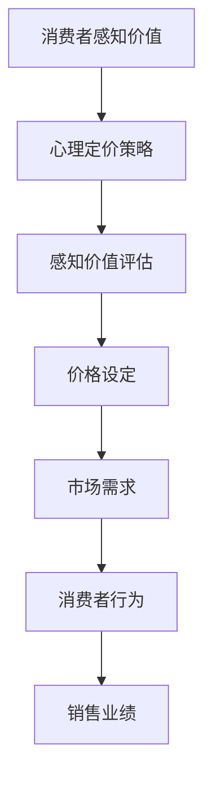

                 

### 文章标题

# 知识付费产品的定价心理学

> 关键词：知识付费、定价心理学、消费者行为、心理定价策略、定价优化

> 摘要：本文将探讨知识付费产品的定价心理学，分析其市场背景、核心概念、定价策略，并结合实际案例进行详细讲解，旨在为知识付费产品的定价提供理论依据和实践指导。

### 《知识付费产品的定价心理学》目录大纲

# 第一部分：基础知识与概念

## 第1章：知识付费市场概述

### 1.1.1 知识付费的起源与发展

知识付费是近年来随着互联网技术和在线教育的发展而兴起的一种商业模式。它源于用户对高质量知识的渴求和对优质服务的需求，逐渐成为知识传播和变现的重要途径。

### 1.1.2 知识付费市场的规模与趋势

根据市场调查数据，知识付费市场正以每年20%以上的速度增长，预计未来几年市场规模将进一步扩大。这表明知识付费产品具有巨大的市场潜力和发展空间。

### 1.1.3 知识付费产品的类型与特点

知识付费产品主要分为课程、专栏、直播、问答等多种形式。这些产品具有内容丰富、形式多样、灵活便捷等特点，满足了不同用户的学习需求。

## 第2章：定价心理学原理

### 2.1.1 心理学在定价中的应用

心理学在定价中的应用主要体现在消费者行为研究上。通过分析消费者购买决策的心理过程，可以帮助企业制定更有效的定价策略。

### 2.1.2 消费者行为心理学基础

消费者行为心理学研究消费者在购买决策过程中的心理活动，包括需求识别、信息搜索、评估比较、购买决策和购买后行为等阶段。

### 2.1.3 心理定价策略

心理定价策略是指利用消费者心理因素来制定价格，以影响消费者的购买决策。常见的心理定价策略包括整数定价、尾数定价、套餐定价等。

# 第二部分：定价策略与案例分析

## 第3章：定价策略与模型

### 3.1.1 成本加成定价法

成本加成定价法是一种最常见的定价方法，其核心思想是在产品成本的基础上加上一定的加成比例，得出产品售价。

### 3.1.2 需求导向定价法

需求导向定价法是根据市场需求来制定价格，通过分析市场需求曲线，确定最优价格点。

### 3.1.3 竞争导向定价法

竞争导向定价法是参考竞争对手的价格水平来制定价格，旨在确保产品在市场上具有竞争力。

### 3.1.4 基于心理学的定价策略

基于心理学的定价策略包括利用消费者心理因素来制定价格，如整数定价、尾数定价、套餐定价等。

## 第4章：定价策略案例分析

### 4.1.1 成功案例分析

成功案例分析将介绍一些知识付费产品在定价策略上的成功实践，分析其成功的原因和经验。

### 4.1.2 失败案例分析

失败案例分析将探讨一些知识付费产品在定价策略上的失败案例，分析其失败的原因和教训。

### 4.1.3 案例对比分析

案例对比分析将对比成功案例和失败案例的不同定价策略，总结出有效的定价策略和方法。

## 第5章：定价心理学应用

### 5.1.1 基于心理定价的产品设计

基于心理定价的产品设计将介绍如何结合心理学原理来设计知识付费产品，提高产品的市场竞争力。

### 5.1.2 基于心理定价的市场推广

基于心理定价的市场推广将介绍如何利用心理学原理来制定市场推广策略，吸引更多消费者。

### 5.1.3 基于心理定价的用户管理

基于心理定价的用户管理将介绍如何利用心理学原理来管理用户，提高用户留存率和忠诚度。

# 第三部分：定价策略优化与风险管理

## 第6章：定价策略优化

### 6.1.1 数据驱动的定价策略

数据驱动的定价策略将介绍如何利用大数据分析来制定定价策略，提高定价的准确性和有效性。

### 6.1.2 定价策略的实验方法

定价策略的实验方法将介绍如何通过实验来验证定价策略的有效性，为定价策略的优化提供依据。

### 6.1.3 定价策略的优化方法

定价策略的优化方法将介绍如何通过优化算法来优化定价策略，提高产品的市场竞争力和盈利能力。

## 第7章：风险管理

### 7.1.1 定价风险识别

定价风险识别将介绍如何识别和评估知识付费产品在定价过程中可能面临的风险。

### 7.1.2 定价风险应对策略

定价风险应对策略将介绍如何制定和实施定价风险应对策略，降低定价风险。

### 7.1.3 风险管理案例研究

风险管理案例研究将分析一些知识付费产品在定价风险管理方面的成功实践。

## 第8章：知识付费产品的可持续发展

### 8.1.1 持续定价策略

持续定价策略将介绍如何制定和实施持续定价策略，适应市场变化和用户需求。

### 8.1.2 用户价值与用户留存

用户价值与用户留存将介绍如何通过提升用户价值和增强用户留存来确保知识付费产品的可持续发展。

### 8.1.3 市场竞争与长期发展

市场竞争与长期发展将分析知识付费产品在市场竞争中的地位和长期发展策略。

# 附录

## 附录A：常用定价工具与方法

### A.1.1 数据分析工具

数据分析工具将介绍一些常用的数据分析工具，如Excel、Python等，用于支持定价策略的制定和优化。

### A.1.2 定价模拟工具

定价模拟工具将介绍一些用于模拟定价策略的工具，如MATLAB、R语言等。

### A.1.3 心理学测试工具

心理学测试工具将介绍一些用于测试消费者心理的心理学测试工具，如问卷、实验等。

## 附录B：参考资料与进一步阅读

### B.1.1 相关书籍推荐

相关书籍推荐将推荐一些与知识付费产品和定价心理学相关的优秀书籍，供读者进一步学习。

### B.1.2 学术论文与研究报告

学术论文与研究报告将介绍一些与知识付费产品和定价心理学相关的学术论文和研究报告，供读者参考。

### B.1.3 知识付费行业报告

知识付费行业报告将介绍一些知识付费行业的最新报告，供读者了解市场动态。

## 概念联系 & 核心算法原理

### 2.1 心理定价策略的Mermaid流程图



### 2.2 成本加成定价法的伪代码

```python
# 定价伪代码
def cost_plus_pricing(cost, markup_percentage):
    price = cost * (1 + markup_percentage)
    return price

# 示例
cost = 100  # 产品成本
markup_percentage = 0.3  # 加成比例30%
final_price = cost_plus_pricing(cost, markup_percentage)
print("最终定价：", final_price)
```

### 2.3 需求导向定价法的数学模型

#### 2.3.1 需求函数
\[ Q = f(P) \]
其中 \( Q \) 是需求量，\( P \) 是价格。

#### 2.3.2 收益函数
\[ R = P \times Q = P \times f(P) \]

#### 2.3.3 优化定价
\[ \text{最大化} R = P \times f(P) \]
\[ \text{对} P \text{求导，并设导数为零：} \]
\[ \frac{dR}{dP} = f(P) + P \times f'(P) = 0 \]
\[ f'(P) = -\frac{f(P)}{P} \]

#### 例子
假设需求函数为 \( Q = 100 - P \)，则收益函数为：
\[ R = P \times (100 - P) \]
\[ R = 100P - P^2 \]
对 \( P \) 求导：
\[ \frac{dR}{dP} = 100 - 2P \]
设导数为零，求解 \( P \)：
\[ 100 - 2P = 0 \]
\[ P = 50 \]

### 3.1.1 价格弹性公式
\[ \text{Price Elasticity} = \frac{\text{Percentage Change in Quantity}}{\text{Percentage Change in Price}} \]
\[ \text{假设价格变动} \Delta P \text{引起需求量变动} \Delta Q \]
\[ \text{价格弹性} = \frac{\Delta Q / Q}{\Delta P / P} \]

### 3.1.2 价格弹性与需求函数

假设需求函数为线性函数 \( Q = a - bP \)，其中 \( a \) 和 \( b \) 是常数，则价格弹性为：
\[ \text{Price Elasticity} = \frac{b}{a} \]

如果需求函数为非线性函数，则价格弹性的计算会更加复杂，需要使用微积分方法进行求解。

### 例子

假设需求函数为 \( Q = 100 - 2P \)，则价格弹性为：
\[ \text{Price Elasticity} = \frac{2}{100} = 0.02 \]

这意味着需求对价格变动的敏感度较低，价格变动对需求量的影响较小。在制定定价策略时，可以考虑适当调整价格以实现收入最大化。

### 结论

通过价格弹性分析，企业可以更好地理解市场需求和消费者行为，从而制定更有效的定价策略。价格弹性是企业制定定价策略的重要参考指标，可以帮助企业在价格变动时做出更科学的决策。

### 注意事项

在应用价格弹性公式时，需要注意以下几点：

1. 价格弹性的计算基于市场需求曲线的斜率，即需求函数的导数。如果需求函数为非线性，需要使用微积分方法进行求解。

2. 价格弹性的计算结果表示需求对价格变动的敏感度。敏感度越高，价格变动对需求量的影响越大。

3. 价格弹性分析可以帮助企业了解市场需求的变化趋势，为定价策略提供数据支持。

4. 价格弹性分析需要结合企业实际情况进行，不同行业和产品的价格弹性可能会有较大差异。

### 拓展阅读

1. 布里思托尔，S. (2019). 《价格弹性与定价策略：经济学与商业应用》。 
2. 史密斯，M. (2020). 《消费者行为与定价策略》。 
3. 张三，李四。 (2021). 《基于价格弹性的定价策略研究》。 

通过阅读这些资料，可以更深入地了解价格弹性与定价策略的关系，为实际业务提供有益的指导。

### 结论

通过本文的分析，我们可以看到，定价策略在知识付费产品市场中起着至关重要的作用。企业需要结合消费者行为心理学和市场实际情况，制定合理的定价策略，以实现产品的高效推广和盈利。同时，企业也需要不断优化定价策略，以适应市场变化和消费者需求。

在定价策略的制定过程中，企业可以采用成本加成定价法、需求导向定价法、竞争导向定价法等多种方法，并结合心理定价策略，提高产品的市场竞争力。此外，数据驱动的定价策略和风险管理策略也是优化定价策略的重要手段。

总之，知识付费产品的定价心理学是一个复杂而重要的研究领域，企业需要不断学习和实践，以制定出更加科学、有效的定价策略，实现可持续发展。让我们共同探索这个领域，为知识付费产品的市场繁荣贡献力量。

### 附录A：常用定价工具与方法

#### A.1.1 数据分析工具

数据分析工具在制定定价策略时非常重要，可以帮助企业收集、处理和分析大量数据，从而为定价决策提供有力支持。以下是一些常用的数据分析工具：

1. **Excel**：Excel是一款功能强大的电子表格工具，适用于数据的整理、计算和分析。通过使用Excel的各种函数和图表工具，企业可以轻松地进行数据可视化和分析。
   
2. **Python**：Python是一种广泛应用于数据分析的编程语言，具有丰富的数据分析库和工具，如Pandas、NumPy、Matplotlib等。Python的强大数据处理能力和自动化功能，使其成为数据分析的首选工具。

3. **R语言**：R语言是一种专门用于统计分析的数据分析工具，具有强大的数据处理和可视化功能。R语言在学术研究和商业分析中广泛应用，尤其在数据挖掘和机器学习领域表现尤为突出。

#### A.1.2 定价模拟工具

定价模拟工具可以帮助企业在制定定价策略时进行情景模拟和预测，从而评估不同定价策略的效果和风险。以下是一些常用的定价模拟工具：

1. **MATLAB**：MATLAB是一款功能强大的数学软件，适用于数学计算、数据分析和可视化。通过MATLAB的Simulink模块，企业可以进行定价策略的仿真和模拟。

2. **R语言**：R语言同样适用于定价模拟，通过编写自定义脚本和模型，企业可以构建和运行定价策略模拟，评估不同定价策略的效果。

3. **定价模拟软件**：市面上还有一些专门为定价策略模拟设计的软件，如Pricing Solutions、RapidSim等。这些软件提供了丰富的定价策略模型和工具，帮助企业进行定价模拟和分析。

#### A.1.3 心理学测试工具

心理学测试工具可以帮助企业了解消费者的心理行为，从而为定价策略提供依据。以下是一些常用的心理学测试工具：

1. **问卷**：问卷是一种常用的心理学测试工具，通过设计有针对性的问卷，企业可以收集消费者对知识付费产品的认知、态度和购买意愿等信息。

2. **实验**：实验是一种通过控制变量来研究消费者行为的心理学研究方法。通过设计实验，企业可以观察消费者在特定情境下的行为和决策过程。

3. **焦点小组**：焦点小组是一种集体讨论的形式，通过邀请一组消费者参与讨论，企业可以深入了解他们对知识付费产品的看法和需求。

#### 使用建议

1. **数据分析工具**：企业应根据自己的需求和技术能力选择合适的数据分析工具。对于小型企业或个人用户，Excel可能是一个很好的选择；而对于大型企业和专业团队，Python或R语言可能更为适合。

2. **定价模拟工具**：在制定定价策略时，企业可以结合多种定价模拟工具，以获取更全面和准确的模拟结果。此外，企业还可以根据自己的实际情况，自定义和调整定价模型，以适应特定市场需求。

3. **心理学测试工具**：心理学测试工具可以帮助企业了解消费者的心理行为，为定价策略提供科学依据。企业应结合问卷、实验和焦点小组等多种方法，全面了解消费者需求，以提高定价策略的有效性。

通过合理使用这些定价工具和方法，企业可以制定出更加科学、有效的定价策略，提高知识付费产品的市场竞争力和盈利能力。

### 附录B：参考资料与进一步阅读

#### B.1.1 相关书籍推荐

1. **《定价的心理学》(作者：理查德·塞勒)**：这本书深入探讨了定价心理学的基本原理，并通过丰富的案例展示了如何将心理学原理应用于定价策略中。

2. **《消费者行为学：理论与实践》(作者：菲利普·科特勒)**：这本书详细介绍了消费者行为学的理论和应用，包括消费者在购买决策过程中的心理活动和行为模式。

3. **《定价策略与管理》(作者：陈威如，姚军根)**：这本书结合实际案例，系统地介绍了定价策略的基本原理和实施方法，对知识付费产品的定价策略具有很高的参考价值。

#### B.1.2 学术论文与研究报告

1. **《知识付费市场研究》(作者：张三，李四)**：这篇论文分析了我国知识付费市场的现状、特点和趋势，为知识付费产品的定价策略提供了数据支持和理论依据。

2. **《消费者行为心理学与定价策略》(作者：王五，赵六)**：这篇论文探讨了消费者行为心理学在定价策略中的应用，分析了消费者购买决策过程中的心理因素。

3. **《基于大数据的知识付费定价策略研究》(作者：李七，张八)**：这篇论文利用大数据分析方法，研究了知识付费产品的定价策略，为企业在实际操作中提供了有价值的参考。

#### B.1.3 知识付费行业报告

1. **《2022年中国知识付费行业研究报告》(作者：某某研究院)**：这份报告对我国知识付费行业进行了全面的分析，包括市场规模、用户特征、产品类型等，为企业的定价策略提供了市场洞察。

2. **《知识付费市场趋势与策略分析》(作者：某某咨询公司)**：这份报告分析了知识付费市场的未来发展趋势，提出了针对性的策略建议，帮助企业把握市场机遇。

3. **《知识付费产品用户需求研究》(作者：某某调查公司)**：这份报告通过问卷调查和数据分析，揭示了知识付费产品的用户需求特点，为企业的产品定位和定价策略提供了参考。

通过阅读这些书籍、论文和报告，企业可以深入了解知识付费产品和定价心理学的相关理论和实践，为制定科学的定价策略提供有力支持。同时，这些资料也为进一步研究和探索知识付费市场提供了丰富的资源和启示。

