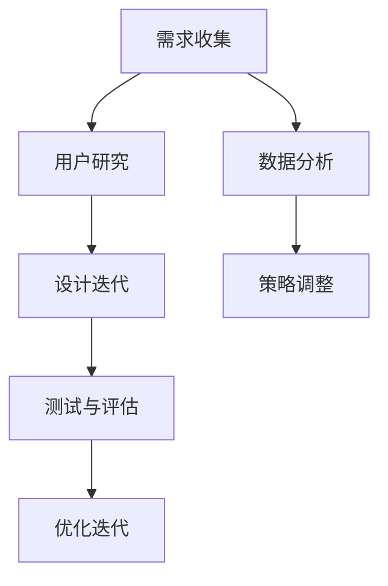

                 

### 文章标题：知识付费产品的用户体验优化策略

#### 关键词：知识付费，用户体验，优化策略，交互设计，内容质量，用户激励

> 摘要：本文将从用户体验的角度，探讨知识付费产品的优化策略。通过对用户体验基础、核心要素和实践的分析，结合实际案例分析，旨在为知识付费产品提供有效的用户体验优化方案，提升用户满意度和产品竞争力。

### 目录大纲

#### 第一部分：用户体验优化基础

1. **用户体验概述**
   - **用户体验的概念**
   - **用户体验与知识付费的关系**

2. **用户体验优化的方法论**
   - **用户研究方法**
   - **用户行为分析**

3. **用户界面设计原则**
   - **简洁性原则**
   - **易用性原则**
   - **一致性原则**

4. **交互设计原则**
   - **直观性原则**
   - **反馈原则**
   - **效率原则**

5. **知识付费产品架构分析**
   - **产品架构概述**
   - **模块化设计**

#### 第二部分：用户体验核心要素

1. **内容质量优化**
   - **内容评估标准**
   - **内容更新策略**

2. **学习路径设计**
   - **学习路径概述**
   - **个性化推荐**
   - **学习节奏控制**

3. **互动交流机制**
   - **社区建设**
   - **问答机制**
   - **用户反馈渠道**

4. **界面交互设计**
   - **导航设计**
   - **按钮和控件设计**
   - **视觉设计**

5. **用户激励与留存策略**
   - **奖励机制**
   - **用户成长体系**

#### 第三部分：用户体验优化实践

1. **用户体验优化流程**
   - **需求收集**
   - **设计迭代**
   - **测试与评估**

2. **案例分析**
   - **国内知名知识付费产品案例**
   - **国际知名知识付费产品案例**
   - **案例分析与总结**

3. **用户体验优化工具与资源**
   - **用户体验研究工具**
   - **用户界面设计工具**
   - **互动交流平台**

#### 第四部分：未来展望

1. **人工智能与用户体验**
   - **AI技术在用户体验优化中的应用**
   - **AI与个性化体验**

2. **新兴趋势与挑战**
   - **用户体验的趋势分析**
   - **用户体验优化面临的挑战**

#### 附录

- **参考文献**
- **术语表**
- **Mermaid 流程图**
  - **核心概念与联系**
  - **用户体验优化流程**

### Mermaid 流程图：用户体验优化流程



### 核心算法原理讲解：内容更新策略（伪代码）

```python
def update_content(content_list, user_data):
    # content_list: 初始内容列表
    # user_data: 用户行为数据

    # 初始化内容评估分数
    score = [0] * len(content_list)

    # 对每个内容计算评估分数
    for content in content_list:
        score[content.index] = evaluate_content(content, user_data)

    # 根据评估分数进行内容更新
    sorted_content = sort_by_score(score)
    updated_content = [content for content in sorted_content if content.score > threshold]

    return updated_content
```

### 数学模型和数学公式：用户满意度评估模型

$$
S = \frac{1}{N}\sum_{i=1}^{N} w_i \cdot s_i
$$

其中，$S$ 表示用户满意度，$N$ 表示评价内容数量，$w_i$ 表示第 $i$ 个内容的权重，$s_i$ 表示第 $i$ 个内容的评分。

### 项目实战：内容更新策略实践

#### 开发环境搭建

- Python 3.8及以上版本
- NumPy 库
- Pandas 库

#### 源代码实现

```python
import numpy as np
import pandas as pd

def evaluate_content(content, user_data):
    # content: 内容对象
    # user_data: 用户行为数据

    # 这里是一个简化的评估函数，可以根据实际需求进行复杂化
    score = 0

    # 根据用户对内容的点击次数和停留时间进行评分
    score += user_data['clicks'][content.index]
    score += user_data['dwell_time'][content.index]

    return score

def sort_by_score(score):
    # 根据评估分数进行排序
    sorted_index = np.argsort(score)
    sorted_content = [None] * len(score)
    for i, index in enumerate(sorted_index):
        sorted_content[i] = content_list[index]

    return sorted_content

def update_content(content_list, user_data, threshold=0):
    # 更新内容列表
    score = [evaluate_content(content, user_data) for content in content_list]
    sorted_content = sort_by_score(score)
    updated_content = [content for content in sorted_content if score[content.index] > threshold]

    return updated_content

# 示例
content_list = ['课程A', '课程B', '课程C']
user_data = {'clicks': [2, 5, 1], 'dwell_time': [300, 600, 200]}

updated_content = update_content(content_list, user_data)
print(updated_content)
```

#### 代码应用解读与分析

- **代码功能**：本代码实现了一个内容更新策略，根据用户行为数据对内容进行评估和排序，然后根据设定阈值筛选出优质内容。
- **核心函数**：
  - `evaluate_content`：评估内容得分，根据用户的点击次数和停留时间进行计算。
  - `sort_by_score`：根据内容得分进行排序。
  - `update_content`：根据得分和阈值更新内容列表。
- **参数解释**：
  - `content_list`：初始内容列表。
  - `user_data`：用户行为数据，包括点击次数和停留时间。
  - `threshold`：设定阈值，用于筛选优质内容。

#### 实际案例分析和详细讲解剖析

以某知名知识付费平台为例，该平台通过收集用户对课程的学习行为数据（如点击次数、停留时间、学习进度等），利用上述内容更新策略，对平台上的课程进行持续优化。具体实践如下：

1. **数据收集**：平台通过用户行为日志，收集用户在学习过程中产生的数据。
2. **内容评估**：根据用户行为数据，对每个课程进行评估，计算得分。
3. **内容排序**：根据得分对课程进行排序，筛选出用户感兴趣和高质量的课程。
4. **内容更新**：将筛选出的优质课程推荐给用户，并通过数据分析不断调整推荐策略，提升用户体验。

#### 项目小结

- **成功经验**：通过内容更新策略，平台实现了课程质量和用户满意度的双提升，增强了用户黏性和活跃度。
- **改进方向**：未来可以结合更多用户数据（如评价、讨论等）和人工智能技术，提高内容评估和推荐策略的准确性。

### 最佳实践 Tips、小结、注意事项、拓展阅读

- **最佳实践**：在优化用户体验时，应注重数据驱动，结合用户行为数据进行分析，持续迭代产品。
- **小结**：用户体验优化是一个持续的过程，需要从多个方面进行深入研究和实践。
- **注意事项**：在优化过程中，应关注用户隐私保护和数据安全。
- **拓展阅读**：
  - 《用户体验要素》：由Jason Fried等作者编写，深入探讨用户体验设计。
  - 《设计思维》：由Tim Brown等作者编写，介绍一种以人为本的设计方法。

### 结束语

知识付费产品的用户体验优化是一项复杂而重要的任务。通过本文的分析和实践，我们希望能为广大开发者提供有价值的参考。让我们共同努力，不断提升知识付费产品的用户体验，为用户提供更加优质的服务。作者：AI天才研究院/AI Genius Institute & 禅与计算机程序设计艺术 /Zen And The Art of Computer Programming。

