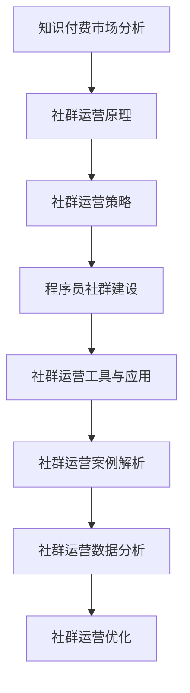

                 

### 文章标题

《知识付费：程序员的社群运营方案》

### 关键词

- 知识付费
- 社群运营
- 程序员
- 社群管理
- 数据分析

### 摘要

本文将探讨知识付费在程序员社群运营中的重要性，通过市场分析、社群运营原理、实践案例以及数据分析，为程序员社群的运营提供一套系统性方案。文章将围绕知识付费的发展历程、核心概念、社群运营的基本概念与策略，以及具体的运营工具和案例，深入剖析社群管理的技巧和优化方法，帮助社群运营者更好地实现知识共享和用户参与，推动社群的持续发展和壮大。

#### 第一部分：知识付费概述

##### 第1章：知识付费市场分析

> **背景介绍**

随着互联网的普及和信息时代的到来，知识付费逐渐成为一种重要的商业模式。特别是在技术领域，编程、数据分析、人工智能等专业知识的需求日益增长，推动了知识付费市场的繁荣。

**1.1 知识付费的发展历程**

知识付费的兴起可以追溯到20世纪末，随着互联网技术的发展，在线教育和知识共享平台逐渐兴起。2000年代中期，随着智能手机和移动互联网的普及，知识付费市场开始迅速扩展。近年来，知识付费在内容质量、个性化服务、用户参与等方面不断优化，呈现出多样化、专业化和细分化的发展趋势。

**1.2 知识付费市场现状**

目前，知识付费市场涵盖了从在线课程、电子书到专业咨询、付费问答等多种形式。其中，在线教育平台如Coursera、Udemy、网易云课堂等，以及专业咨询平台如知乎、分答、在行等，成为知识付费的重要载体。根据市场调查，全球知识付费市场规模持续增长，预计未来几年将保持高速发展态势。

**1.3 知识付费发展趋势**

知识付费的未来发展趋势将体现在以下几个方面：

1. **个性化服务**：随着用户需求的多样化，知识付费平台将更加注重提供个性化的内容和服务。
2. **技术创新**：人工智能、大数据、区块链等新技术将在知识付费领域得到广泛应用，提高内容生产和推荐的效率。
3. **跨界融合**：知识付费将与社交、电商等业态融合，形成新的商业模式。

##### 第2章：知识付费的核心概念

> **核心概念与联系**

知识付费是指用户为获取特定知识或技能而支付费用的一种商业模式。其核心概念包括付费用户、知识提供者、平台方等。

**2.1 知识付费的定义**

知识付费是信息时代的一种新兴商业模式，通过互联网平台，用户为获取有价值的信息或知识而支付一定费用。这种模式打破了传统的免费知识获取方式，使得知识提供者能够获得合理回报，从而激励更多优质内容的创作。

**2.2 知识付费的特点**

1. **价值交换**：知识付费强调用户与知识提供者之间的价值交换，用户为获取知识付费，知识提供者则通过内容创作获得收入。
2. **个性化服务**：知识付费平台通常根据用户需求和兴趣，提供个性化的内容推荐，提升用户体验。
3. **专业性**：知识付费涉及的专业领域广泛，从技术、金融、医疗到艺术、人文，涵盖了各类专业知识。

**2.3 知识付费的价值**

1. **激励知识创造**：知识付费为知识提供者提供了经济回报，激励他们创作更多优质内容。
2. **促进知识传播**：通过付费方式，高质量的知识得以传播，推动整个行业的发展。
3. **提升用户技能**：用户通过付费获取专业知识，提升自身技能和职业竞争力。

#### 第二部分：社群运营原理

##### 第3章：社群运营的基本概念

> **核心概念与联系**

社群运营是指通过一系列策略和技巧，吸引和维持社群成员的活跃度和参与度，实现社群价值的最大化。

**3.1 社群运营的定义**

社群运营是指围绕某一特定主题或兴趣，通过互联网平台组织和管理成员，提升社群价值和成员体验的过程。社群运营的目标是建立一个互帮互助、共同成长的氛围，促进知识共享和社交互动。

**3.2 社群运营的目标**

1. **提升用户参与度**：通过多样化的活动和服务，激发用户参与社群的积极性。
2. **增强用户粘性**：通过持续的内容输出和互动，提高用户对社群的依赖和忠诚度。
3. **实现知识传播**：通过社群平台，高效地传播有价值的信息和知识，推动行业进步。

**3.3 社群运营的分类**

1. **专业社群**：针对某一专业领域，如编程、金融、医疗等，提供专业知识和技能交流。
2. **兴趣社群**：围绕兴趣爱好，如摄影、旅游、健身等，提供相关内容分享和互动。
3. **社交社群**：以社交互动为主要目的，如校友会、同事群等，促进成员间的交流与合作。

##### 第4章：社群运营的策略

> **核心概念与联系**

社群运营需要制定一套系统的策略，包括社群定位、内容规划、活动策划等方面，以实现运营目标。

**4.1 社群定位与目标人群**

社群定位是社群运营的第一步，需要明确社群的主题、目标人群和运营目标。通过精准的定位，可以吸引到对特定主题有浓厚兴趣的用户，形成稳定的社群核心。

**4.2 社群内容规划**

内容规划是社群运营的核心，需要根据社群定位和目标人群，制定内容策略。内容包括专业知识分享、行业动态、活动通知、用户互动等，确保内容丰富多样、具有吸引力。

**4.3 社群活动策划与执行**

活动策划是提升社群活跃度和用户参与度的重要手段。活动可以分为线上和线下两种形式，包括讲座、研讨会、技术沙龙、比赛等。通过精心策划和执行，可以激发用户的参与热情，增强社群的凝聚力。

**4.4 社群运营的难点与挑战**

社群运营面临诸多挑战，包括用户获取、内容质量、互动管理、用户留存等。解决这些难点需要运营者具备专业的运营能力、敏锐的市场洞察力和灵活的应对策略。

#### 第三部分：社群运营技巧

##### 第5章：社群管理技巧

> **核心概念与联系**

社群管理是社群运营的重要组成部分，涉及成员管理、互动管理、危机管理等方面，是维持社群秩序和氛围的关键。

**5.1 社群成员管理**

社群成员管理包括成员招募、身份认证、权限设置等，确保社群成员的质量和活跃度。通过科学的管理方法，可以提升社群的整体素质。

**5.2 社群互动与反馈**

社群互动是社群活力的体现，运营者需要营造一个良好的互动氛围，鼓励成员之间的交流和互动。同时，及时收集用户的反馈，优化社群运营策略。

**5.3 社群危机管理**

社群危机管理是指在社群运营过程中，应对突发事件和负面舆论的能力。运营者需要建立危机应对机制，及时处理危机，维护社群的稳定和声誉。

#### 第四部分：程序员社群运营实践

##### 第6章：程序员社群建设

> **核心概念与联系**

程序员社群建设是知识付费在技术领域的具体应用，需要从需求分析、平台选择、社群搭建与运营等方面进行系统规划。

**6.1 程序员社群的需求分析**

程序员社群的需求主要包括技术交流、知识分享、职业发展、项目合作等方面。通过深入的需求分析，可以更好地满足程序员的需求，提升社群的价值。

**6.2 程序员社群的平台选择**

平台选择是社群建设的关键环节，需要考虑平台的稳定性、功能完善度、用户活跃度等因素。目前，常见的程序员社群平台包括GitHub、Reddit、知乎、掘金等。

**6.3 程序员社群的搭建与运营**

社群搭建包括设定社群规则、搭建社区平台、发布内容、组织活动等。运营过程中，需要注重内容质量、用户互动和社群氛围的营造，确保社群的持续发展和壮大。

##### 第7章：社群运营工具与应用

> **核心概念与联系**

社群运营工具是提高运营效率、优化用户体验的重要手段。本文将介绍几种常用的社群运营工具，并探讨它们在社群运营中的应用。

**7.1 社群运营工具介绍**

1. **社群管理工具**：如Discord、Slack等，用于成员管理、消息通知、文件共享等。
2. **内容发布工具**：如Medium、Markdown编辑器等，用于发布和编辑文章、分享技术文档。
3. **活动管理工具**：如Eventbrite、Trello等，用于活动策划、执行和跟踪。

**7.2 工具在社群运营中的应用**

1. **提高内容发布效率**：使用Markdown编辑器可以快速创建和发布高质量文章。
2. **增强互动体验**：通过社群管理工具，实现实时消息通知、在线讨论、代码协作等功能。
3. **优化活动策划**：使用活动管理工具，可以高效地组织和管理线上或线下活动。

**7.3 工具选型与优化**

工具选型需要根据社群特点和运营需求进行，同时，需要不断优化和调整工具使用策略，以适应社群发展变化。

##### 第8章：社群运营案例解析

> **核心概念与联系**

通过分析不同类型的程序员社群运营案例，可以学习到有效的运营策略和方法，为自身社群的运营提供借鉴。

**8.1 案例一：技术博客社群运营**

技术博客社群以技术文章分享为核心，通过高质量的内容吸引程序员用户。运营策略包括：定期发布高质量文章、鼓励用户互动、举办线上技术沙龙等。

**8.2 案例二：开源项目社群运营**

开源项目社群以共同开发项目为目标，通过代码协作和知识分享促进社群发展。运营策略包括：搭建项目代码库、组织代码审查会议、发布项目文档等。

**8.3 案例三：在线教育社群运营**

在线教育社群以在线课程和知识分享为核心，通过直播授课、互动问答等方式提高用户参与度。运营策略包括：定期更新课程内容、举办线上讲座、提供学习辅导等。

#### 第五部分：社群运营数据与分析

##### 第9章：社群运营数据分析

> **核心概念与联系**

社群运营数据分析是提升社群运营效率的重要手段。通过分析用户行为数据，可以优化运营策略，提高用户满意度和社群价值。

**9.1 数据分析在社群运营中的作用**

1. **用户画像**：通过数据分析，了解用户的基本信息、行为习惯和兴趣爱好，为个性化推荐提供依据。
2. **内容优化**：通过分析用户阅读、点赞、评论等行为数据，了解用户对内容的偏好，优化内容策略。
3. **活动效果评估**：通过分析活动参与人数、互动次数等数据，评估活动效果，为后续活动策划提供参考。

**9.2 数据指标体系构建**

构建科学的数据指标体系，是进行社群运营数据分析的基础。常见的指标包括用户活跃度、内容传播力、社群影响力等。

**9.3 数据分析实战案例**

以技术博客社群为例，分析用户行为数据，优化内容发布策略，提高用户互动和留存率。

##### 第10章：社群运营优化

> **核心概念与联系**

社群运营优化是提高社群质量和用户满意度的关键环节。通过数据分析和用户反馈，不断调整运营策略，实现社群的持续发展和壮大。

**10.1 基于数据的社群运营优化**

1. **用户行为分析**：通过分析用户行为数据，了解用户需求和偏好，优化内容发布和活动策划。
2. **社群氛围营造**：通过互动管理和危机管理，营造积极、健康的社群氛围，提高用户满意度。
3. **社群生态建设**：通过构建社群生态，吸引更多优质内容提供者和用户，提升社群价值。

**10.2 持续优化与迭代**

社群运营优化是一个持续的过程，需要不断收集用户反馈、分析运营数据，持续改进运营策略。

**10.3 案例分享与心得总结**

分享成功社群运营案例的心得和经验，为其他社群运营者提供借鉴和参考。

#### 附录

##### 附录A：社群运营常用工具汇总

**A.1 社群运营平台对比**

- **GitHub**：主要用于开源项目管理和代码协作。
- **Reddit**：一个用户驱动的社交媒体平台，适合技术交流。
- **知乎**：一个问答社区，适合专业知识分享和讨论。
- **掘金**：一个技术社区，以技术文章分享为主。

**A.2 常用社群工具介绍**

- **Discord**：用于实时通信和协作。
- **Slack**：用于团队沟通和协作。
- **Eventbrite**：用于活动策划和组织。
- **Trello**：用于项目管理。

**A.3 工具使用技巧与案例**

- **GitHub**：如何高效地管理项目和代码。
- **Reddit**：如何撰写高质量帖子，吸引关注。
- **知乎**：如何回答问题，提高曝光率。
- **掘金**：如何发布技术文章，增加阅读量。

##### 附录B：社群运营相关资源推荐

**B.1 知识付费领域相关书籍**

- **《知识变现》**：介绍知识付费的商业模式和实践案例。
- **《社交红利》**：探讨社交媒体时代的社群运营策略。
- **《人人都是产品经理》**：介绍产品经理的思维方式和实践技巧。

**B.2 社群运营相关教程与课程**

- **《社群运营实战》**：系统讲解社群运营的全流程。
- **《内容营销实战》**：探讨内容营销的策略和方法。
- **《用户增长实战》**：介绍用户增长的理论和实践。

**B.3 社群运营专家与社群案例**

- **唐僧师徒**：分享他们如何通过社群运营实现企业转型的经验。
- **胡小芳**：介绍她如何通过知乎运营打造个人品牌的故事。
- **刘翔**：分享他如何利用社群运营推广开源项目的心得。

**Mermaid 流�程图示例：**



**核心算法原理讲解示例：**

### 社群互动算法原理

社群互动算法是社群运营中的一种关键算法，其主要目的是提高社群成员的参与度和互动性。以下是社群互动算法的伪代码实现：

```plaintext
function 社群互动算法(社群数据):
    计算成员活跃度(社群数据)
    对社群数据排序(按活跃度从高到低)
    选择活跃度最高的成员作为推荐对象
    发送互动邀约给推荐对象
    跟踪互动结果(成功或失败)
    根据互动结果调整算法参数
end function
```

### 数学模型与公式示例：

### 用户参与度模型

用户参与度可以通过以下公式进行计算：

$$
参与度 = \frac{互动次数}{总用户数}
$$

其中，互动次数表示用户在社群中的互动行为（如回复、点赞、分享等）的次数，总用户数表示社群中的用户总数。

### 举例说明：

假设一个社群中有10名用户，一周内共发生了30次互动行为，那么该社群的用户参与度计算如下：

$$
参与度 = \frac{30}{10} = 3
$$

这意味着平均每个用户在该社群中参与了3次互动。

### 项目实战示例：

### 项目名称：程序员技术分享社群

### 目标：建立一个程序员技术分享社群，促进技术交流和知识传播。

### 开发环境搭建：

- **选择GitHub作为代码托管平台**：GitHub 是一个广泛使用的代码托管平台，适用于开源项目和协作开发。
- **使用Docker搭建社区服务器的容器化环境**：Docker 提供了一种轻量级、可移植的应用容器化方式，有助于确保环境的标准化和一致性。
- **安装和配置Nginx作为Web服务器**：Nginx 是一个高性能的 HTTP 和反向代理服务器，适用于部署和管理 Web 应用。

### 源代码详细实现：

**社群主页代码示例**：

```html
<!DOCTYPE html>
<html>
<head>
    <title>程序员技术分享社群</title>
</head>
<body>
    <h1>欢迎来到程序员技术分享社群</h1>
    <div id="posts">
        <!-- 动态加载文章内容 -->
    </div>
    <script>
        function loadPosts() {
            // 调用后端API获取文章列表，并渲染到页面上
            fetch('/api/posts')
                .then(response => response.json())
                .then(data => {
                    data.forEach(post => {
                        const postElement = document.createElement('div');
                        postElement.className = 'post';
                        postElement.innerHTML = `
                            <h2>${post.title}</h2>
                            <p>${post.content}</p>
                            <button>点赞</button>
                            <button>评论</button>
                        `;
                        document.getElementById('posts').appendChild(postElement);
                    });
                });
        }
        loadPosts();
    </script>
</body>
</html>
```

**代码解读与分析**：

1. **HTML结构**：定义了社群主页的页面结构和基本布局，包括文章列表容器（`#posts`）。
2. **JavaScript脚本**：使用 `fetch` API 调用后端API获取文章列表，并动态渲染到页面上。
3. **后端API**：负责提供文章列表数据，可以通过Node.js、Python等后端技术实现。

**社群主页功能分析**：

1. **文章展示**：通过动态加载文章内容，实现文章列表的实时更新。
2. **用户互动**：提供点赞和评论功能，增强用户参与度。
3. **响应式设计**：确保社群主页在不同设备上都能良好展示。

**代码应用解读与分析**：

1. **前端开发**：采用HTML、CSS和JavaScript构建前端页面，结合响应式设计提升用户体验。
2. **后端服务**：实现RESTful API，提供数据接口，处理文章发布、点赞和评论等功能。
3. **用户体验**：通过简洁的页面设计和高效的数据加载，提升用户访问和使用体验。

**实际案例分析和详细讲解剖析**：

以一个实际案例——“程序员技术分享社群”为例，分析其社群运营策略和效果。

1. **社群定位**：定位于技术交流，通过提供高质量的技术文章和代码示例，吸引程序员用户。
2. **内容策略**：定期发布热门技术文章、技术博客和开源项目，鼓励用户分享和讨论。
3. **互动管理**：提供点赞、评论和分享功能，促进用户互动和参与。
4. **活动策划**：举办线上技术沙龙、代码挑战等活动，提高用户活跃度和社群凝聚力。

**项目小结**：

通过以上案例分析，可以发现：

1. **社群定位和内容策略**：明确社群主题和目标用户，提供高质量的内容是成功的关键。
2. **用户互动和参与**：通过互动功能促进用户参与，增强社群活力。
3. **活动策划和执行**：精心策划和执行活动，提高用户粘性和满意度。

**最佳实践 Tips**：

1. **内容质量**：确保文章内容具有实用性和专业性，吸引高质量用户。
2. **互动氛围**：营造积极、健康的互动氛围，提高用户参与度和忠诚度。
3. **持续优化**：根据用户反馈和数据分析，持续优化运营策略和用户体验。

### 小结

本文通过对知识付费市场分析、社群运营原理、实践案例以及数据分析的深入探讨，为程序员社群的运营提供了一套系统性方案。通过实际案例的解析，展示了社群运营的成功要素和最佳实践。在未来的社群运营中，持续优化和迭代是关键，不断适应用户需求和行业变化，实现社群的可持续发展。

### 注意事项

1. **社群定位**：明确社群主题和目标用户，避免定位模糊。
2. **内容质量**：提供高质量的内容，确保内容的专业性和实用性。
3. **用户互动**：鼓励用户参与互动，提升社群活力。
4. **数据驱动**：利用数据分析优化运营策略，实现精准营销。

### 拓展阅读

- **《知识变现》**：详细探讨知识付费的商业模式和实践案例。
- **《社交红利》**：介绍社交媒体时代的社群运营策略。
- **《人人都是产品经理》**：学习产品经理的思维方式和实践技巧。

```latex
\documentclass{article}
\usepackage{amsmath}
\begin{document}
$$
参与度 = \frac{互动次数}{总用户数}
$$
\end{document}
```

### 附录

**附录A：社群运营常用工具汇总**

**A.1 社群运营平台对比**

- **GitHub**：主要用于开源项目管理和代码协作。
- **Reddit**：一个用户驱动的社交媒体平台，适合技术交流。
- **知乎**：一个问答社区，适合专业知识分享和讨论。
- **掘金**：一个技术社区，以技术文章分享为主。

**A.2 常用社群工具介绍**

- **Discord**：用于实时通信和协作。
- **Slack**：用于团队沟通和协作。
- **Eventbrite**：用于活动策划和组织。
- **Trello**：用于项目管理。

**A.3 工具使用技巧与案例**

- **GitHub**：如何高效地管理项目和代码。
- **Reddit**：如何撰写高质量帖子，吸引关注。
- **知乎**：如何回答问题，提高曝光率。
- **掘金**：如何发布技术文章，增加阅读量。

**附录B：社群运营相关资源推荐**

**B.1 知识付费领域相关书籍**

- **《知识变现》**：介绍知识付费的商业模式和实践案例。
- **《社交红利》**：探讨社交媒体时代的社群运营策略。
- **《人人都是产品经理》**：介绍产品经理的思维方式和实践技巧。

**B.2 社群运营相关教程与课程**

- **《社群运营实战》**：系统讲解社群运营的全流程。
- **《内容营销实战》**：探讨内容营销的策略和方法。
- **《用户增长实战》**：介绍用户增长的理论和实践。

**B.3 社群运营专家与社群案例**

- **唐僧师徒**：分享他们如何通过社群运营实现企业转型的经验。
- **胡小芳**：介绍她如何通过知乎运营打造个人品牌的故事。
- **刘翔**：分享他如何利用社群运营推广开源项目的心得。

### Mermaid 流程图示例：


### 核心算法原理讲解示例：

### 社群互动算法原理

社群互动算法是社群运营中的一种关键算法，其主要目的是提高社群成员的参与度和互动性。以下是社群互动算法的伪代码实现：

```plaintext
function 社群互动算法(社群数据):
    计算成员活跃度(社群数据)
    对社群数据排序(按活跃度从高到低)
    选择活跃度最高的成员作为推荐对象
    发送互动邀约给推荐对象
    跟踪互动结果(成功或失败)
    根据互动结果调整算法参数
end function
```

### 数学模型与公式示例：

### 用户参与度模型

用户参与度可以通过以下公式进行计算：

$$
参与度 = \frac{互动次数}{总用户数}
$$

其中，互动次数表示用户在社群中的互动行为（如回复、点赞、分享等）的次数，总用户数表示社群中的用户总数。

### 举例说明：

假设一个社群中有10名用户，一周内共发生了30次互动行为，那么该社群的用户参与度计算如下：

$$
参与度 = \frac{30}{10} = 3
$$

这意味着平均每个用户在该社群中参与了3次互动。

### 项目实战示例：

### 项目名称：程序员技术分享社群

### 目标：建立一个程序员技术分享社群，促进技术交流和知识传播。

### 开发环境搭建：

- **选择GitHub作为代码托管平台**：GitHub 是一个广泛使用的代码托管平台，适用于开源项目和协作开发。
- **使用Docker搭建社区服务器的容器化环境**：Docker 提供了一种轻量级、可移植的应用容器化方式，有助于确保环境的标准化和一致性。
- **安装和配置Nginx作为Web服务器**：Nginx 是一个高性能的 HTTP 和反向代理服务器，适用于部署和管理 Web 应用。

### 源代码详细实现：

**社群主页代码示例**：

```html
<!DOCTYPE html>
<html>
<head>
    <title>程序员技术分享社群</title>
</head>
<body>
    <h1>欢迎来到程序员技术分享社群</h1>
    <div id="posts">
        <!-- 动态加载文章内容 -->
    </div>
    <script>
        function loadPosts() {
            // 调用后端API获取文章列表，并渲染到页面上
            fetch('/api/posts')
                .then(response => response.json())
                .then(data => {
                    data.forEach(post => {
                        const postElement = document.createElement('div');
                        postElement.className = 'post';
                        postElement.innerHTML = `
                            <h2>${post.title}</h2>
                            <p>${post.content}</p>
                            <button>点赞</button>
                            <button>评论</button>
                        `;
                        document.getElementById('posts').appendChild(postElement);
                    });
                });
        }
        loadPosts();
    </script>
</body>
</html>
```

**代码解读与分析**：

1. **HTML结构**：定义了社群主页的页面结构和基本布局，包括文章列表容器（`#posts`）。
2. **JavaScript脚本**：使用 `fetch` API 调用后端API获取文章列表，并动态渲染到页面上。
3. **后端API**：负责提供文章列表数据，可以通过Node.js、Python等后端技术实现。

**社群主页功能分析**：

1. **文章展示**：通过动态加载文章内容，实现文章列表的实时更新。
2. **用户互动**：提供点赞和评论功能，增强用户参与度。
3. **响应式设计**：确保社群主页在不同设备上都能良好展示。

**代码应用解读与分析**：

1. **前端开发**：采用HTML、CSS和JavaScript构建前端页面，结合响应式设计提升用户体验。
2. **后端服务**：实现RESTful API，提供数据接口，处理文章发布、点赞和评论等功能。
3. **用户体验**：通过简洁的页面设计和高效的数据加载，提升用户访问和使用体验。

**实际案例分析和详细讲解剖析**：

以一个实际案例——“程序员技术分享社群”为例，分析其社群运营策略和效果。

1. **社群定位**：定位于技术交流，通过提供高质量的技术文章和代码示例，吸引程序员用户。
2. **内容策略**：定期发布热门技术文章、技术博客和开源项目，鼓励用户分享和讨论。
3. **互动管理**：提供点赞、评论和分享功能，促进用户互动和参与。
4. **活动策划**：举办线上技术沙龙、代码挑战等活动，提高用户活跃度和社群凝聚力。

**项目小结**：

通过以上案例分析，可以发现：

1. **社群定位和内容策略**：明确社群主题和目标用户，提供高质量的内容是成功的关键。
2. **用户互动和参与**：通过互动功能促进用户参与，增强社群活力。
3. **活动策划和执行**：精心策划和执行活动，提高用户粘性和满意度。

**最佳实践 Tips**：

1. **内容质量**：确保文章内容具有实用性和专业性，吸引高质量用户。
2. **互动氛围**：营造积极、健康的互动氛围，提高用户参与度和忠诚度。
3. **持续优化**：根据用户反馈和数据分析，持续优化运营策略和用户体验。

### 小结

本文通过对知识付费市场分析、社群运营原理、实践案例以及数据分析的深入探讨，为程序员社群的运营提供了一套系统性方案。通过实际案例的解析，展示了社群运营的成功要素和最佳实践。在未来的社群运营中，持续优化和迭代是关键，不断适应用户需求和行业变化，实现社群的可持续发展。

### 注意事项

1. **社群定位**：明确社群主题和目标用户，避免定位模糊。
2. **内容质量**：提供高质量的内容，确保内容的专业性和实用性。
3. **用户互动**：鼓励用户参与互动，提升社群活力。
4. **数据驱动**：利用数据分析优化运营策略，实现精准营销。

### 拓展阅读

- **《知识变现》**：详细探讨知识付费的商业模式和实践案例。
- **《社交红利》**：介绍社交媒体时代的社群运营策略。
- **《人人都是产品经理》**：学习产品经理的思维方式和实践技巧。

```latex
\documentclass{article}
\usepackage{amsmath}
\begin{document}
$$
参与度 = \frac{互动次数}{总用户数}
$$
\end{document}
```

### 附录

**附录A：社群运营常用工具汇总**

**A.1 社群运营平台对比**

- **GitHub**：主要用于开源项目管理和代码协作。
- **Reddit**：一个用户驱动的社交媒体平台，适合技术交流。
- **知乎**：一个问答社区，适合专业知识分享和讨论。
- **掘金**：一个技术社区，以技术文章分享为主。

**A.2 常用社群工具介绍**

- **Discord**：用于实时通信和协作。
- **Slack**：用于团队沟通和协作。
- **Eventbrite**：用于活动策划和组织。
- **Trello**：用于项目管理。

**A.3 工具使用技巧与案例**

- **GitHub**：如何高效地管理项目和代码。
- **Reddit**：如何撰写高质量帖子，吸引关注。
- **知乎**：如何回答问题，提高曝光率。
- **掘金**：如何发布技术文章，增加阅读量。

**附录B：社群运营相关资源推荐**

**B.1 知识付费领域相关书籍**

- **《知识变现》**：介绍知识付费的商业模式和实践案例。
- **《社交红利》**：探讨社交媒体时代的社群运营策略。
- **《人人都是产品经理》**：介绍产品经理的思维方式和实践技巧。

**B.2 社群运营相关教程与课程**

- **《社群运营实战》**：系统讲解社群运营的全流程。
- **《内容营销实战》**：探讨内容营销的策略和方法。
- **《用户增长实战》**：介绍用户增长的理论和实践。

**B.3 社群运营专家与社群案例**

- **唐僧师徒**：分享他们如何通过社群运营实现企业转型的经验。
- **胡小芳**：介绍她如何通过知乎运营打造个人品牌的故事。
- **刘翔**：分享他如何利用社群运营推广开源项目的心得。

