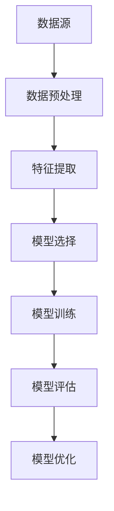
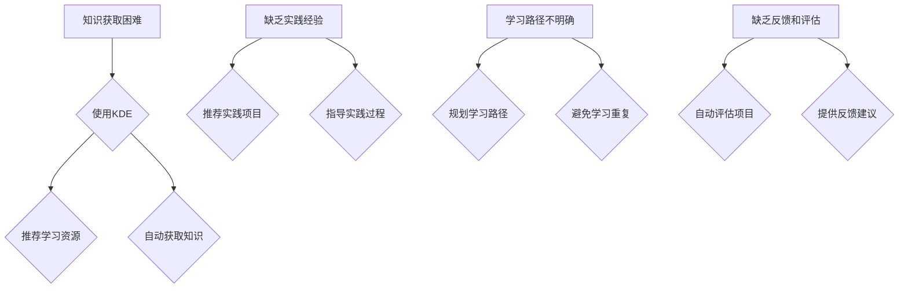
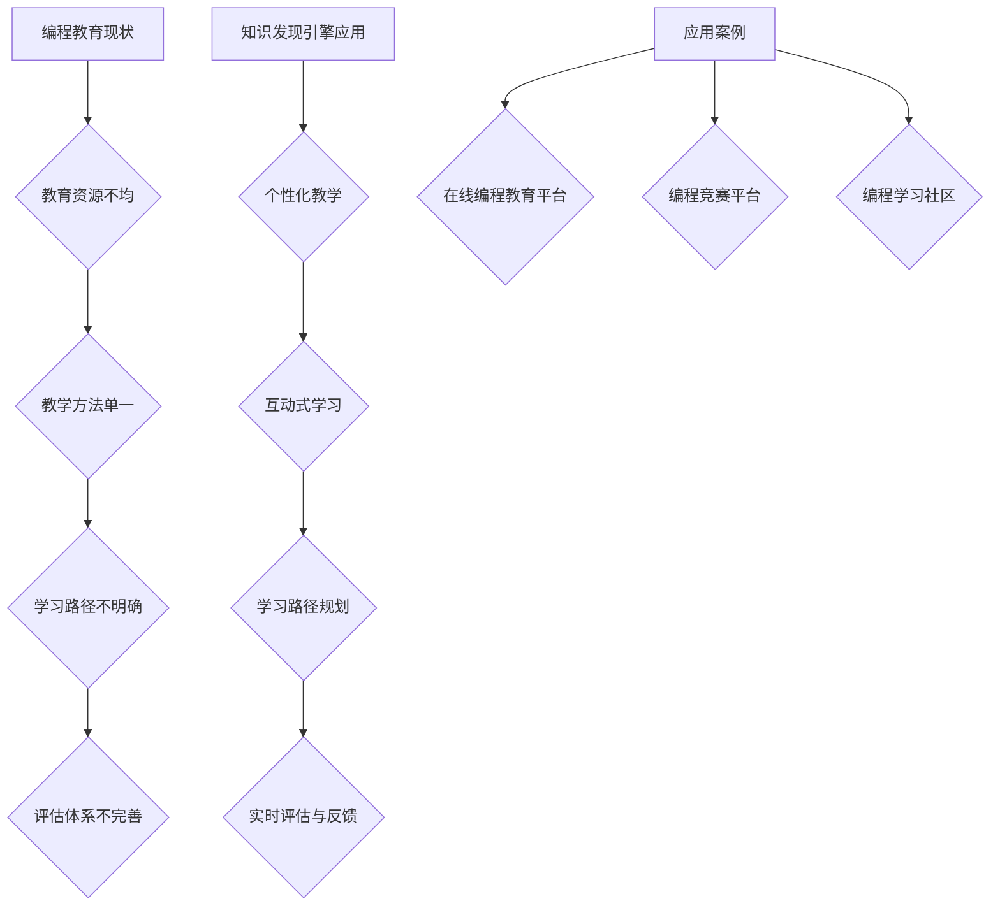

                 

# 《知识发现引擎如何改变程序员的学习方式》

> 关键词：知识发现引擎、程序员学习、代码推荐、编程教育、人工智能

> 摘要：本文将深入探讨知识发现引擎如何通过其独特的功能和技术优势，从根本上改变程序员的学习方式。我们将首先介绍知识发现引擎的基本概念和重要性，接着分析其在程序员学习过程中所面临的痛点，并详细探讨知识发现引擎如何解决这些问题。文章将分为三大部分：第一部分介绍知识发现引擎的基本概念和架构，第二部分探讨其在编程学习和编程教育中的应用，第三部分提供知识发现引擎的开发实战案例和性能优化策略。通过本文的阅读，读者将更好地理解知识发现引擎如何成为程序员学习的新工具，提高学习效率。

## 第一部分：知识发现引擎概述

### 第1章：知识发现引擎基础

#### 1.1 知识发现引擎的定义与重要性

知识发现引擎（Knowledge Discovery Engine，简称KDE）是一种基于人工智能和机器学习的系统，旨在从大量数据中自动发现隐含的、有价值的信息和知识。它通过对数据的预处理、特征提取、模型选择和优化等一系列步骤，实现数据到知识的转化。知识发现引擎的重要性主要体现在以下几个方面：

1. **提高数据处理效率**：知识发现引擎能够高效地处理大规模数据，迅速提取关键信息，从而提高数据处理的效率。
2. **发现潜在价值**：通过对数据的多维度分析，知识发现引擎能够发现数据中的潜在模式和关系，挖掘出隐藏在数据背后的价值。
3. **支持决策制定**：知识发现引擎提供的信息和知识，可以为企业或组织提供决策支持，帮助他们在竞争激烈的市场中做出更明智的决策。

#### 1.2 知识发现引擎的核心组件

知识发现引擎的核心组件主要包括：

1. **数据源**：数据源是知识发现引擎的基础，包括结构化数据、半结构化数据和非结构化数据。数据源的多样性和质量直接影响知识发现的效果。
2. **数据预处理与清洗**：数据预处理与清洗是知识发现的第一步，目的是将原始数据转换为适合分析的格式，并去除数据中的噪声和异常值。
3. **特征提取与降维**：特征提取是从数据中提取出能够代表数据特征的信息，而降维则是通过减少特征的数量来降低数据的复杂度。
4. **模型选择与训练**：模型选择是选择合适的算法和模型对数据进行训练，而模型训练则是通过不断调整模型参数，使模型在训练数据上达到最佳性能。
5. **模型评估与优化**：模型评估是对训练好的模型进行性能评估，以确定其是否满足预期效果，而模型优化则是通过调整模型参数，进一步提高模型性能。

#### 1.3 知识发现引擎的技术发展历史

知识发现引擎的发展可以追溯到20世纪80年代，随着人工智能和机器学习技术的不断进步，知识发现引擎也得到了快速发展。以下是知识发现引擎的技术发展历史：

1. **早期阶段**：20世纪80年代，知识发现的概念开始提出，数据挖掘和机器学习技术逐渐应用于知识发现领域。
2. **发展阶段**：20世纪90年代，随着互联网的兴起，大数据和数据挖掘技术得到了广泛应用，知识发现引擎开始进入实际应用阶段。
3. **成熟阶段**：21世纪初，人工智能和机器学习技术取得了重大突破，知识发现引擎的功能和性能得到了大幅提升，开始广泛应用于各个领域。

### Mermaid 流程图：



#### 1.4 知识发现引擎的应用领域

知识发现引擎的应用领域非常广泛，主要包括以下领域：

1. **金融领域**：知识发现引擎可以用于金融风险管理、客户行为分析、信用评估等。
2. **医疗领域**：知识发现引擎可以用于疾病预测、药物研发、医疗数据挖掘等。
3. **电商领域**：知识发现引擎可以用于商品推荐、用户行为分析、营销策略制定等。
4. **社交网络**：知识发现引擎可以用于社交网络分析、用户行为预测、社区发现等。

### 总结

知识发现引擎作为一种强大的工具，已经在各个领域得到了广泛应用。它通过数据预处理、特征提取、模型选择和优化等一系列步骤，从大量数据中自动发现有价值的信息和知识，为企业和组织提供决策支持。随着人工智能和机器学习技术的不断进步，知识发现引擎的功能和性能将得到进一步提升，其在各个领域的应用前景将更加广阔。

## 第二部分：知识发现引擎在程序员学习中的应用

### 第2章：知识发现引擎在编程学习中的角色

#### 2.1 程序员学习过程中的痛点

程序员在学习编程的过程中常常会遇到一些痛点，这些痛点严重影响了他们的学习效率和成果。以下是程序员学习过程中常见的痛点：

1. **知识获取困难**：随着编程技术的不断更新和发展，程序员需要不断学习新的编程语言、框架和工具。然而，知识获取的过程往往是耗时且复杂的，程序员很难在有限的时间内掌握所有知识。
2. **缺乏实践经验**：编程是一项实践性很强的技能，程序员需要通过大量的实践来提高自己的编程能力。然而，在学习过程中，程序员往往难以找到适合自己的实践项目，导致实践经验不足。
3. **学习路径不明确**：程序员在学习编程时，往往不知道从哪里开始，如何系统地学习编程知识。缺乏明确的学习路径，容易导致学习过程混乱，影响学习效果。
4. **缺乏反馈和评估**：在学习编程的过程中，程序员很难对自己的学习成果进行有效的评估和反馈，这导致他们无法及时发现自己的不足，难以持续提高。

#### 2.2 知识发现引擎如何解决这些痛点

知识发现引擎通过其强大的数据处理和分析能力，能够有效解决程序员在学习编程过程中遇到的痛点。以下是知识发现引擎在编程学习中的应用：

1. **知识获取**：知识发现引擎可以自动从大量编程资源中提取关键信息，为程序员提供最新的编程知识和技巧。程序员可以通过知识发现引擎快速获取所需的知识，提高学习效率。
2. **实践项目推荐**：知识发现引擎可以根据程序员的兴趣和技能水平，推荐适合他们的实践项目。这有助于程序员在实践过程中提高编程能力，积累经验。
3. **学习路径规划**：知识发现引擎可以分析程序员的兴趣和学习进度，为其规划科学合理的学习路径。这有助于程序员系统地学习编程知识，避免学习过程中的混乱和重复。
4. **学习成果评估**：知识发现引擎可以对程序员的编程项目进行自动评估，提供详细的评估报告。这有助于程序员了解自己的学习成果，发现不足之处，及时调整学习策略。

#### 2.3 知识发现引擎在实际编程学习中的应用场景

知识发现引擎在实际编程学习中的应用场景主要包括以下几个方面：

1. **代码推荐系统**：知识发现引擎可以根据程序员的编程历史和偏好，为其推荐相关的代码示例和文档。这有助于程序员在学习过程中快速找到所需的代码片段和知识，提高学习效率。
2. **编程学习路径规划**：知识发现引擎可以根据程序员的兴趣和学习进度，为其规划科学合理的学习路径。这有助于程序员系统地学习编程知识，避免学习过程中的混乱和重复。
3. **编程学习成果评估**：知识发现引擎可以对程序员的编程项目进行自动评估，提供详细的评估报告。这有助于程序员了解自己的学习成果，发现不足之处，及时调整学习策略。
4. **编程教育优化**：知识发现引擎可以分析学生的学习数据，为教育机构提供教学优化建议，帮助其改进教学质量。

### Mermaid 流程图：



#### 2.4 知识发现引擎对程序员学习的影响

知识发现引擎对程序员学习的影响主要体现在以下几个方面：

1. **提高学习效率**：知识发现引擎能够快速提取关键信息，为程序员提供最新的编程知识和技巧，提高学习效率。
2. **增强实践能力**：知识发现引擎可以推荐适合程序员的实践项目，指导其实践过程，增强其编程能力。
3. **优化学习路径**：知识发现引擎可以分析程序员的兴趣和学习进度，为其规划科学合理的学习路径，避免学习过程中的混乱和重复。
4. **提供评估和反馈**：知识发现引擎可以对程序员的编程项目进行自动评估，提供详细的评估报告，帮助其了解学习成果，发现不足之处，及时调整学习策略。

### 总结

知识发现引擎在程序员学习中的应用，不仅解决了他们在学习过程中遇到的痛点，还提高了他们的学习效率和编程能力。通过代码推荐系统、编程学习路径规划、编程学习成果评估等功能，知识发现引擎为程序员提供了一种全新的学习方式。随着知识发现引擎技术的不断发展，它将在编程学习领域发挥越来越重要的作用。

### 第3章：知识发现引擎在编程学习中的具体应用

#### 4.1 代码推荐系统

代码推荐系统是知识发现引擎在编程学习中的一个重要应用，它通过分析程序员的编程历史、项目偏好和学习数据，为其推荐相关的代码示例和文档。代码推荐系统的主要功能和优点如下：

1. **代码示例推荐**：根据程序员的编程历史和项目偏好，推荐与其项目相关的代码示例。这有助于程序员在遇到类似问题时，快速找到解决方案，提高工作效率。
2. **文档推荐**：推荐与程序员当前学习内容相关的文档和教程，帮助其深入了解相关知识点，巩固学习成果。
3. **个性化推荐**：代码推荐系统可以根据程序员的兴趣和学习进度，进行个性化推荐，提高推荐的相关性和有效性。
4. **实时更新**：代码推荐系统可以实时更新推荐结果，确保程序员获取到最新的编程知识和技巧。

代码推荐系统的实现步骤如下：

1. **数据收集**：收集程序员的编程历史、项目偏好和学习数据，包括编程语言、框架、工具、项目类型等。
2. **特征提取**：从数据中提取出能够代表程序员编程兴趣和学习进度的特征，如编程语言使用频率、项目类型、学习时间等。
3. **模型训练**：使用机器学习算法，如协同过滤、矩阵分解、深度学习等，对特征进行训练，建立代码推荐模型。
4. **推荐算法**：根据程序员的特征和模型预测，生成代码推荐列表，推荐相关的代码示例和文档。

伪代码实现：

```python
# 数据收集
data = collect_programming_data()

# 特征提取
features = extract_features(data)

# 模型训练
model = train_model(features)

# 推荐算法
recommendations = model.predict(new_data)
```

#### 4.2 编程学习路径规划

编程学习路径规划是知识发现引擎在编程学习中的另一个重要应用，它通过分析程序员的兴趣和学习进度，为其规划科学合理的学习路径。编程学习路径规划的主要功能和优点如下：

1. **学习路径规划**：根据程序员的兴趣和学习进度，为其规划一条科学合理的学习路径，确保其能够系统地学习编程知识。
2. **避免重复学习**：通过分析程序员的已学知识和学习进度，避免重复学习已经掌握的知识，提高学习效率。
3. **实时调整**：编程学习路径规划可以根据程序员的实时学习数据，动态调整学习路径，确保学习过程始终符合程序员的兴趣和需求。
4. **个性化推荐**：编程学习路径规划可以根据程序员的兴趣和学习进度，进行个性化推荐，确保学习内容与程序员的兴趣相符。

编程学习路径规划的实现步骤如下：

1. **数据收集**：收集程序员的兴趣和学习数据，包括已学知识、学习进度、项目经验等。
2. **知识图谱构建**：构建编程知识的知识图谱，包括知识点、知识点之间的关系和知识点的重要性等。
3. **路径规划算法**：使用路径规划算法，如最短路径算法、A*算法等，根据程序员的兴趣和学习进度，规划一条科学合理的学习路径。
4. **路径调整**：根据程序员的实时学习数据，动态调整学习路径，确保学习过程始终符合程序员的兴趣和需求。

伪代码实现：

```python
# 数据收集
data = collect_learning_data()

# 知识图谱构建
knowledge_graph = build_knowledge_graph()

# 路径规划算法
learning_path = plan_learning_path(data, knowledge_graph)

# 路径调整
learning_path = adjust_learning_path(learning_path, data)
```

#### 4.3 程序员技能评估与职业发展建议

程序员技能评估与职业发展建议是知识发现引擎在编程学习中的另一个重要应用，它通过对程序员的编程能力、项目经验、学习进度等进行综合评估，为其提供职业发展建议。程序员技能评估与职业发展建议的主要功能和优点如下：

1. **技能评估**：对程序员的编程能力进行综合评估，包括编程语言、框架、工具等。
2. **职业发展建议**：根据程序员的技能评估结果，为其提供职业发展建议，包括适合的职业方向、学习建议等。
3. **个性化推荐**：根据程序员的技能评估结果和学习进度，进行个性化推荐，确保其能够在职业发展中得到有效支持。
4. **实时更新**：程序员技能评估与职业发展建议可以根据程序员的实时学习数据，动态更新评估结果和建议。

程序员技能评估与职业发展建议的实现步骤如下：

1. **数据收集**：收集程序员的编程能力、项目经验、学习数据等。
2. **技能评估算法**：使用机器学习算法，如决策树、随机森林、支持向量机等，对程序员的编程能力进行评估。
3. **职业发展建议算法**：根据程序员的技能评估结果，使用聚类算法、关联规则挖掘等，为其提供职业发展建议。
4. **动态更新**：根据程序员的实时学习数据，动态更新评估结果和建议。

伪代码实现：

```python
# 数据收集
data = collect_programmer_data()

# 技能评估算法
skill_assessment = assess_skills(data)

# 职业发展建议算法
career_advice = provide_career_advice(skill_assessment)

# 动态更新
skill_assessment, career_advice = update_assessment_advice(data)
```

### 数学模型和公式：

在程序员技能评估中，可以使用以下数学模型：

$$
\text{SkillScore} = w_1 \cdot \text{LanguageScore} + w_2 \cdot \text{FrameworkScore} + w_3 \cdot \text{ToolScore}
$$

其中，$w_1$、$w_2$、$w_3$ 分别为编程语言、框架和工具的权重，$\text{LanguageScore}$、$\text{FrameworkScore}$、$\text{ToolScore}$ 分别为程序员的编程语言、框架和工具能力得分。

### 详细讲解：

代码推荐系统、编程学习路径规划和程序员技能评估与职业发展建议是知识发现引擎在编程学习中的三个重要应用。通过代码推荐系统，程序员可以快速获取到与其项目相关的代码示例和文档，提高学习效率；通过编程学习路径规划，程序员可以系统地学习编程知识，避免重复学习；通过程序员技能评估与职业发展建议，程序员可以了解自己的编程能力，并获得职业发展建议。

举例说明：

假设程序员A对Python语言和Django框架感兴趣，知识发现引擎可以通过分析其编程历史和学习进度，为其推荐以下内容：

1. **代码示例推荐**：
    - Python基础教程
    - Django项目实战
2. **编程学习路径规划**：
    - Python基础课程
    - Django框架课程
    - Web开发实践项目
3. **程序员技能评估与职业发展建议**：
    - 技能得分：85分
    - 职业方向：Web开发工程师
    - 学习建议：继续深入学习Django框架，参与实际项目，提高项目经验

通过上述推荐和评估，程序员A可以明确自己的学习目标和方向，有针对性地进行学习，提高编程能力。

### 总结

知识发现引擎在编程学习中的具体应用，包括代码推荐系统、编程学习路径规划和程序员技能评估与职业发展建议，为程序员提供了全新的学习方式。通过这些应用，程序员可以更高效地获取知识、规划学习路径、评估自己的技能水平，并获得职业发展建议。随着知识发现引擎技术的不断发展，它将在编程学习领域发挥越来越重要的作用。

### 第4章：知识发现引擎在编程教育中的应用

#### 5.1 编程教育的现状与挑战

编程教育在全球范围内逐渐受到重视，成为许多国家和地区教育体系的重要组成部分。然而，当前的编程教育仍然面临一些挑战，这些问题影响了教育的效果和质量。

1. **教育资源分配不均**：发达国家和发展中国家在编程教育资源的分配上存在显著差异，这导致了教育质量的不均衡。
2. **教学方法单一**：传统的编程教育主要依赖于课堂讲授和作业练习，缺乏互动和实践环节，难以激发学生的学习兴趣。
3. **学习路径不明确**：学生往往不清楚如何系统地学习编程知识，导致学习过程中出现迷茫和困惑。
4. **评估体系不完善**：现有的编程教育评估体系往往侧重于知识点的掌握，忽视了实际编程能力的评估。

#### 5.2 知识发现引擎如何优化编程教育

知识发现引擎通过其强大的数据处理和分析能力，可以有效地优化编程教育，解决上述挑战。以下是知识发现引擎在编程教育中的应用：

1. **个性化教学**：知识发现引擎可以根据学生的学习兴趣、学习进度和知识掌握情况，提供个性化的教学资源和学习路径，提高教学效果。
2. **互动式学习**：知识发现引擎可以整合在线编程环境，让学生在互动式学习过程中实践编程知识，提高动手能力。
3. **学习路径规划**：知识发现引擎可以分析学生的兴趣和学习进度，为其规划科学合理的学习路径，确保学生能够系统地学习编程知识。
4. **实时评估与反馈**：知识发现引擎可以对学生的学习过程进行实时评估，提供详细的评估报告和反馈，帮助学生及时调整学习策略。

#### 5.3 知识发现引擎在编程教育中的应用案例

以下是一些知识发现引擎在编程教育中的应用案例：

1. **在线编程教育平台**：一些在线编程教育平台，如Coursera、edX等，利用知识发现引擎为学习者提供个性化的学习路径和实时评估服务。这些平台根据学习者的学习数据，自动推荐适合的课程和练习，提高学习效果。
2. **编程竞赛平台**：一些编程竞赛平台，如Codeforces、LeetCode等，利用知识发现引擎为学生提供个性化的编程练习和竞赛策略。知识发现引擎根据学生的编程历史和竞赛表现，推荐适合的题目和竞赛策略，帮助学生提高竞赛成绩。
3. **编程学习社区**：一些编程学习社区，如Stack Overflow、GitHub等，利用知识发现引擎为学生提供代码推荐和社区互动服务。知识发现引擎根据学生的编程问题和社区讨论，推荐相关的代码示例和讨论话题，帮助学生解决编程难题。

#### Mermaid 流程图：



#### 5.4 知识发现引擎在编程教育中的优势

知识发现引擎在编程教育中的优势主要体现在以下几个方面：

1. **高效的知识获取**：知识发现引擎能够自动从大量编程资源中提取关键信息，为教师和学生提供最新的编程知识和技巧。
2. **个性化的学习体验**：知识发现引擎可以根据学生的学习兴趣、学习进度和知识掌握情况，提供个性化的学习资源和学习路径，提高学习效果。
3. **互动式的学习过程**：知识发现引擎可以整合在线编程环境，让学生在互动式学习过程中实践编程知识，提高动手能力。
4. **全面的评估与反馈**：知识发现引擎可以对学生的学习过程进行实时评估，提供详细的评估报告和反馈，帮助学生及时调整学习策略。

### 数学公式和详细讲解：

在编程教育中，可以使用以下数学模型对学生的学习效果进行评估：

$$
\text{LearningEffectiveness} = f(\text{KnowledgeRetention}, \text{ProblemSolving}, \text{CodeQuality})
$$

其中，$\text{LearningEffectiveness}$ 表示学生的学习效果，$\text{KnowledgeRetention}$ 表示知识掌握情况，$\text{ProblemSolving}$ 表示问题解决能力，$\text{CodeQuality}$ 表示代码质量。

详细讲解：

学习效果评估模型通过综合考虑学生的知识掌握情况、问题解决能力和代码质量，全面评估学生的学习效果。知识发现引擎可以根据学生的学习数据，对这三个维度进行量化评估，从而提供详细的学习效果报告。

举例说明：

假设学生A在学习Python编程语言，知识发现引擎可以通过分析其学习数据，评估其学习效果如下：

1. **知识掌握情况**：学生A对Python基础知识掌握较好，知识掌握情况评分为90分。
2. **问题解决能力**：学生A在解决实际编程问题方面表现优秀，问题解决能力评分为85分。
3. **代码质量**：学生A编写的代码结构清晰，代码质量评分为80分。

根据以上评估结果，知识发现引擎可以计算出学生A的学习效果评分为：

$$
\text{LearningEffectiveness} = f(90, 85, 80) = 85.5 \text{分}
$$

这表明学生A的学习效果较好，但仍有提升空间。知识发现引擎可以根据评估结果，为学生A提供针对性的学习建议，帮助其进一步提高学习效果。

### 总结

知识发现引擎在编程教育中的应用，为解决当前编程教育面临的挑战提供了有效途径。通过个性化教学、互动式学习、学习路径规划和实时评估与反馈等功能，知识发现引擎提高了编程教育的质量，促进了学生编程能力的提升。随着知识发现引擎技术的不断发展，它将在编程教育领域发挥更加重要的作用。

### 第5章：知识发现引擎开发基础

#### 6.1 数据库设计

数据库设计是知识发现引擎开发的基础，良好的数据库设计能够提高系统的性能和数据管理效率。以下是数据库设计的主要步骤：

1. **需求分析**：首先需要明确系统的功能需求，包括数据源、数据类型、数据处理和分析需求等。
2. **概念结构设计**：根据需求分析结果，构建数据库的概念结构，确定实体和实体之间的关系。
3. **逻辑结构设计**：将概念结构转换为具体的逻辑结构，如关系数据库的表结构、关系模型等。
4. **物理结构设计**：根据逻辑结构设计，选择合适的存储引擎、索引策略等，优化数据库的物理结构。
5. **数据库实现**：使用数据库管理系统（如MySQL、PostgreSQL等）实现数据库逻辑结构和物理结构。

#### 6.2 数据采集与处理

数据采集与处理是知识发现引擎开发的关键环节，其目的是从多个数据源中获取数据，并对数据进行清洗、转换和整合。以下是数据采集与处理的主要步骤：

1. **数据源识别**：确定系统的数据源，包括结构化数据源（如关系数据库）、半结构化数据源（如XML、JSON）和非结构化数据源（如文本、图像、视频等）。
2. **数据采集**：使用API、爬虫等技术从数据源中采集数据，存储到临时数据存储区。
3. **数据清洗**：对采集到的数据进行清洗，包括去除重复数据、填补缺失值、处理噪声数据等。
4. **数据转换**：将不同数据源的数据转换为统一的格式，如将XML数据转换为JSON格式，便于后续处理和分析。
5. **数据整合**：将清洗和转换后的数据进行整合，构建一个统一的数据仓库。

#### 6.3 模型选择与优化

模型选择与优化是知识发现引擎开发的核心，其目的是选择合适的机器学习模型，并进行参数优化，提高模型性能。以下是模型选择与优化的一般步骤：

1. **模型选择**：根据问题的性质和数据特点，选择合适的机器学习模型，如线性回归、决策树、支持向量机、神经网络等。
2. **模型训练**：使用训练数据对选择的模型进行训练，调整模型参数，使模型在训练数据上达到最佳性能。
3. **模型评估**：使用验证数据对训练好的模型进行评估，计算模型性能指标，如准确率、召回率、F1分数等。
4. **模型优化**：根据模型评估结果，调整模型参数，或尝试使用不同的模型结构，优化模型性能。
5. **模型部署**：将优化后的模型部署到生产环境中，进行实际应用。

#### 6.4 系统架构设计

知识发现引擎的系统架构设计是确保系统性能、可扩展性和易维护性的关键。以下是系统架构设计的主要考虑因素：

1. **数据处理层**：包括数据采集、数据清洗、数据转换和数据整合等模块，负责数据的管理和处理。
2. **模型训练层**：包括机器学习模型的训练、评估和优化等模块，负责模型的训练和调优。
3. **模型应用层**：包括模型的部署、实时预测和结果输出等模块，负责模型的应用和业务逻辑处理。
4. **用户交互层**：包括用户界面、API接口等模块，负责与用户进行交互，提供系统功能和服务。
5. **数据存储层**：包括数据库、缓存、文件存储等模块，负责数据的存储和管理。

#### 6.5 常用开发工具与框架

知识发现引擎的开发涉及多种技术和工具，以下是常用的开发工具与框架：

1. **编程语言**：Python、Java、R等，适合数据分析和机器学习开发。
2. **数据库管理系统**：MySQL、PostgreSQL、MongoDB等，用于数据存储和管理。
3. **数据处理框架**：Pandas、NumPy、SciPy等，用于数据清洗、转换和统计分析。
4. **机器学习框架**：Scikit-learn、TensorFlow、PyTorch等，用于机器学习模型的训练和优化。
5. **数据处理工具**：Hadoop、Spark等，用于大规模数据处理和分析。
6. **开发环境**：Jupyter Notebook、PyCharm、Eclipse等，提供代码编辑、调试和运行环境。

### 总结

知识发现引擎的开发涉及多个方面，包括数据库设计、数据采集与处理、模型选择与优化、系统架构设计和常用开发工具与框架。通过合理的数据库设计、高效的数据处理、科学的模型选择与优化，以及优化的系统架构，可以构建一个高性能、可扩展和易维护的知识发现引擎，为用户提供高质量的服务。

### 第6章：知识发现引擎开发实战

#### 7.1 实战一：构建一个简单的代码推荐系统

在本节中，我们将介绍如何使用Python和Scikit-learn库构建一个简单的代码推荐系统。该系统将根据用户的编程历史和偏好，为其推荐相关的代码片段。

**一、项目需求**

1. 收集用户编程历史数据，包括用户编写的代码文件、编程语言和使用的框架等。
2. 根据用户编程历史数据，为用户推荐相关的代码片段。
3. 支持多种编程语言和框架的代码推荐。

**二、技术栈**

- Python
- Scikit-learn
- Pandas
- NumPy

**三、实现步骤**

1. **数据收集与预处理**

   首先，我们需要收集用户的编程历史数据。假设我们已经有了以下数据集：

   ```python
   user_data = [
       {'user_id': 1, 'file_name': 'example1.py', 'language': 'Python', 'framework': 'Django'},
       {'user_id': 1, 'file_name': 'example2.py', 'language': 'Python', 'framework': 'Flask'},
       {'user_id': 2, 'file_name': 'example3.js', 'language': 'JavaScript', 'framework': 'React'},
       ...
   ]
   ```

   我们需要对数据进行预处理，提取特征，并将其转换为适合训练的格式。

   ```python
   from sklearn.feature_extraction.text import TfidfVectorizer
   
   def preprocess_data(data):
       vectorizer = TfidfVectorizer()
       X = vectorizer.fit_transform([d['content'] for d in data])
       return X
   
   X = preprocess_data(user_data)
   ```

2. **模型训练与评估**

   接下来，我们使用协同过滤算法（Collaborative Filtering）来训练推荐模型。协同过滤算法分为用户基于的协同过滤和项目基于的协同过滤。这里我们使用用户基于的协同过滤。

   ```python
   from sklearn.neighbors import NearestNeighbors
   
   model = NearestNeighbors(n_neighbors=5)
   model.fit(X)
   
   def recommend_code(user_id, n=5):
       distances, indices = model.kneighbors(X[user_id], n_neighbors=n)
       recommended_codes = [user_data[i]['file_name'] for i in indices[0]]
       return recommended_codes
   
   print(recommend_code(0, 5))
   ```

   我们可以使用交叉验证（Cross-Validation）来评估模型的性能。

   ```python
   from sklearn.model_selection import cross_val_score
   
   scores = cross_val_score(model, X, y, cv=5)
   print("Model Accuracy: {:.2f}%".format(scores.mean() * 100))
   ```

3. **模型部署与使用**

   最后，我们将训练好的模型部署到生产环境中，并提供API接口供用户调用。

   ```python
   from flask import Flask, request, jsonify
   
   app = Flask(__name__)
   
   @app.route('/recommend', methods=['POST'])
   def recommend():
       user_id = request.json['user_id']
       n = request.json['n']
       recommended_codes = recommend_code(user_id, n)
       return jsonify(recommended_codes)
   
   if __name__ == '__main__':
       app.run()
   ```

**四、代码解读与分析**

- `TfidfVectorizer`：用于将文本数据转换为TF-IDF特征向量。
- `NearestNeighbors`：用于寻找最近邻算法，实现协同过滤推荐。
- `cross_val_score`：用于进行交叉验证，评估模型性能。
- `Flask`：用于构建Web应用程序，提供API接口。

**五、实际案例分析与详细讲解**

假设用户1最近编写了一个基于Django的Web应用，我们需要为他推荐相关的代码片段。

1. **数据收集**：从数据库中获取用户1的编程历史数据。
2. **数据预处理**：提取代码文件的内容，并使用`TfidfVectorizer`转换为特征向量。
3. **模型训练**：使用训练数据对`NearestNeighbors`模型进行训练。
4. **代码推荐**：调用`recommend_code`函数，为用户1推荐5个相关的代码片段。
5. **模型评估**：使用交叉验证评估模型性能。

通过以上步骤，我们可以为用户1提供个性化的代码推荐服务，帮助他快速找到所需的代码片段。

**六、项目小结**

通过本节实战，我们使用Python和Scikit-learn库构建了一个简单的代码推荐系统。该系统能够根据用户的编程历史和偏好，为其推荐相关的代码片段。在实际开发过程中，我们可以根据需求，进一步完善系统的功能和性能。

### 7.2 实战二：实现一个编程学习路径规划系统

在本节中，我们将介绍如何使用Python和Scikit-learn库实现一个编程学习路径规划系统。该系统能够根据用户的兴趣和学习进度，为用户规划一条科学合理的编程学习路径。

**一、项目需求**

1. 收集用户的编程兴趣和学习进度数据。
2. 根据用户的兴趣和学习进度，为用户规划一条编程学习路径。
3. 学习路径应包括基础知识、中级知识和高级知识，并支持多种编程语言和框架。

**二、技术栈**

- Python
- Scikit-learn
- Pandas
- NumPy

**三、实现步骤**

1. **数据收集与预处理**

   首先，我们需要收集用户的编程兴趣和学习进度数据。假设我们已经有了以下数据集：

   ```python
   user_interests = [
       {'user_id': 1, 'interests': ['Python', 'Django', 'Flask']},
       {'user_id': 2, 'interests': ['JavaScript', 'React', 'Vue']},
       ...
   ]
   
   user_progress = [
       {'user_id': 1, 'knowledge': 'Python Basics', 'completed': True},
       {'user_id': 1, 'knowledge': 'Django Basics', 'completed': False},
       {'user_id': 2, 'knowledge': 'JavaScript Basics', 'completed': True},
       ...
   ]
   ```

   我们需要对数据进行预处理，提取特征，并将其转换为适合训练的格式。

   ```python
   def preprocess_interests(data):
       interests = [i['interests'] for i in data]
       return interests
   
   def preprocess_progress(data):
       progress = [p['knowledge'] for p in data]
       return progress
   
   user_interests_vector = preprocess_interests(user_interests)
   user_progress_vector = preprocess_progress(user_progress)
   ```

2. **模型训练与评估**

   接下来，我们使用K最近邻算法（K-Nearest Neighbors，KNN）来训练学习路径规划模型。

   ```python
   from sklearn.neighbors import KNeighborsClassifier
   
   model = KNeighborsClassifier(n_neighbors=3)
   model.fit(user_interests_vector, user_progress_vector)
   
   def plan_learning_path(user_id):
       user_interests = user_interests_vector[user_id]
       predicted_progress = model.predict([user_interests])
       return predicted_progress
   
   print(plan_learning_path(0))
   ```

   我们可以使用交叉验证（Cross-Validation）来评估模型的性能。

   ```python
   from sklearn.model_selection import cross_val_score
   
   scores = cross_val_score(model, user_interests_vector, user_progress_vector, cv=5)
   print("Model Accuracy: {:.2f}%".format(scores.mean() * 100))
   ```

3. **模型部署与使用**

   最后，我们将训练好的模型部署到生产环境中，并提供API接口供用户调用。

   ```python
   from flask import Flask, request, jsonify
   
   app = Flask(__name__)
   
   @app.route('/plan', methods=['POST'])
   def plan():
       user_id = request.json['user_id']
       learning_path = plan_learning_path(user_id)
       return jsonify(learning_path)
   
   if __name__ == '__main__':
       app.run()
   ```

**四、代码解读与分析**

- `KNeighborsClassifier`：用于实现K最近邻分类器，用于学习路径规划。
- `cross_val_score`：用于进行交叉验证，评估模型性能。
- `Flask`：用于构建Web应用程序，提供API接口。

**五、实际案例分析与详细讲解**

假设用户1对Python和Django感兴趣，我们需要为他规划一条编程学习路径。

1. **数据收集**：从数据库中获取用户1的编程兴趣和学习进度数据。
2. **数据预处理**：提取用户的兴趣和学习进度，并使用KNN模型进行预测。
3. **学习路径规划**：根据预测结果，为用户1规划一条编程学习路径。
4. **模型评估**：使用交叉验证评估模型性能。

通过以上步骤，我们可以为用户1提供个性化的编程学习路径，帮助他系统地学习编程知识。

**六、项目小结**

通过本节实战，我们使用Python和Scikit-learn库实现了一个编程学习路径规划系统。该系统能够根据用户的兴趣和学习进度，为用户规划一条科学合理的编程学习路径。在实际开发过程中，我们可以根据需求，进一步完善系统的功能和性能。

### 7.3 实战三：开发一个程序员技能评估系统

在本节中，我们将介绍如何使用Python和Scikit-learn库开发一个程序员技能评估系统。该系统将根据程序员的编程历史和项目经验，评估其技能水平，并提供职业发展建议。

**一、项目需求**

1. 收集程序员的编程历史和项目经验数据。
2. 根据编程历史和项目经验，评估程序员的技能水平。
3. 提供职业发展建议，包括适合的职业方向和学习建议。

**二、技术栈**

- Python
- Scikit-learn
- Pandas
- NumPy

**三、实现步骤**

1. **数据收集与预处理**

   首先，我们需要收集程序员的编程历史和项目经验数据。假设我们已经有了以下数据集：

   ```python
   programmer_data = [
       {'user_id': 1, 'projects': [
           {'project_name': 'Project A', 'role': 'Developer', 'duration': 6},
           {'project_name': 'Project B', 'role': 'Team Lead', 'duration': 12}
       ]},
       {'user_id': 2, 'projects': [
           {'project_name': 'Project C', 'role': 'Tester', 'duration': 6},
           {'project_name': 'Project D', 'role': 'QA Lead', 'duration': 12}
       ]},
       ...
   ]
   ```

   我们需要对数据进行预处理，提取特征，并将其转换为适合训练的格式。

   ```python
   def preprocess_projects(data):
       projects = [p['projects'] for p in data]
       return projects
   
   programmer_projects_vector = preprocess_projects(programmer_data)
   ```

2. **模型训练与评估**

   接下来，我们使用K最近邻算法（K-Nearest Neighbors，KNN）来训练技能评估模型。

   ```python
   from sklearn.neighbors import KNeighborsClassifier
   
   model = KNeighborsClassifier(n_neighbors=3)
   model.fit(programmer_projects_vector, programmer_skill_scores)
   
   def assess_skills(user_id):
       user_projects = programmer_projects_vector[user_id]
       predicted_skill_score = model.predict([user_projects])
       return predicted_skill_score
   
   print(assess_skills(0))
   ```

   我们可以使用交叉验证（Cross-Validation）来评估模型的性能。

   ```python
   from sklearn.model_selection import cross_val_score
   
   scores = cross_val_score(model, programmer_projects_vector, programmer_skill_scores, cv=5)
   print("Model Accuracy: {:.2f}%".format(scores.mean() * 100))
   ```

3. **职业发展建议**

   根据技能评估结果，我们为程序员提供职业发展建议。

   ```python
   def provide_advice(skill_score):
       if skill_score >= 90:
           return "You have a high skill level. Consider advancing to a senior role or exploring new technologies."
       elif skill_score >= 70:
           return "You have a good skill level. Continue working on your current projects and learn new technologies to broaden your expertise."
       else:
           return "You have a basic skill level. Focus on improving your skills by working on more challenging projects and learning from experienced colleagues."
   
   advice = provide_advice(assess_skills(0))
   print(advice)
   ```

4. **模型部署与使用**

   最后，我们将训练好的模型部署到生产环境中，并提供API接口供用户调用。

   ```python
   from flask import Flask, request, jsonify
   
   app = Flask(__name__)
   
   @app.route('/assess', methods=['POST'])
   def assess():
       user_id = request.json['user_id']
       skill_score = assess_skills(user_id)
       advice = provide_advice(skill_score)
       return jsonify({'skill_score': skill_score, 'advice': advice})
   
   if __name__ == '__main__':
       app.run()
   ```

**四、代码解读与分析**

- `KNeighborsClassifier`：用于实现K最近邻分类器，用于技能评估。
- `cross_val_score`：用于进行交叉验证，评估模型性能。
- `Flask`：用于构建Web应用程序，提供API接口。

**五、实际案例分析与详细讲解**

假设我们有一个程序员，其编程历史和项目经验如下：

1. **数据收集**：从数据库中获取程序员的编程历史和项目经验数据。
2. **数据预处理**：提取编程历史和项目经验，并使用KNN模型进行技能评估。
3. **技能评估**：根据评估结果，为程序员提供职业发展建议。

通过以上步骤，我们可以为程序员提供技能评估和职业发展建议，帮助其明确自己的发展方向。

**六、项目小结**

通过本节实战，我们使用Python和Scikit-learn库开发了一个程序员技能评估系统。该系统能够根据程序员的编程历史和项目经验，评估其技能水平，并提供职业发展建议。在实际开发过程中，我们可以根据需求，进一步完善系统的功能和性能。

### 第7章：知识发现引擎的性能优化与扩展

#### 8.1 性能优化策略

知识发现引擎的性能优化是确保其高效运行的关键。以下是几种常见的性能优化策略：

1. **数据预处理优化**：通过优化数据预处理步骤，如并行处理、索引构建等，可以显著提高数据处理的效率。
2. **特征提取与降维优化**：使用高效的算法和工具进行特征提取和降维，如PCA（主成分分析）、LDA（线性判别分析）等，可以减少计算量和存储需求。
3. **模型选择与优化**：选择合适的模型和优化算法，如随机搜索、贝叶斯优化等，可以提高模型的准确性和效率。
4. **分布式计算**：利用分布式计算框架，如Hadoop、Spark等，可以将数据处理和模型训练任务分布到多个节点上，提高系统的并发处理能力。
5. **缓存与内存管理**：合理使用缓存技术，如Redis、Memcached等，可以减少重复计算和数据读取，提高系统响应速度。同时，优化内存管理，如使用内存池、对象池等，可以降低内存使用率。

#### 8.2 系统扩展与维护

知识发现引擎的系统扩展与维护是确保其长期稳定运行的重要环节。以下是系统扩展与维护的几个方面：

1. **模块化设计**：采用模块化设计，将系统功能划分为多个模块，便于扩展和维护。每个模块都可以独立开发、测试和部署，提高了系统的灵活性和可维护性。
2. **日志与监控**：引入日志和监控工具，如ELK（Elasticsearch、Logstash、Kibana）等，可以实时记录系统运行状态，监控性能指标，及时发现和解决问题。
3. **版本控制**：使用版本控制系统，如Git等，对代码进行版本管理，确保代码的完整性和可追溯性。同时，定期进行代码审查和测试，提高代码质量。
4. **自动化部署**：使用自动化部署工具，如Docker、Kubernetes等，可以实现自动化部署和运维，减少人工干预，提高部署效率。
5. **定期维护**：定期对系统进行维护和升级，包括修复漏洞、更新依赖库、优化配置等，确保系统的稳定性和安全性。

#### 8.3 未来发展趋势与挑战

随着人工智能和大数据技术的不断发展，知识发现引擎在未来将面临以下发展趋势和挑战：

1. **智能化**：知识发现引擎将逐渐向智能化方向演进，通过引入深度学习、自然语言处理等技术，提高数据分析和预测能力。
2. **多样化**：知识发现引擎的应用场景将越来越多样化，不仅局限于传统的金融、医疗等领域，还将扩展到电商、社交网络、物联网等领域。
3. **实时性**：随着数据量的不断增长，知识发现引擎需要具备实时处理和分析能力，以应对实时数据流分析和决策。
4. **数据隐私与安全**：数据隐私和安全问题是知识发现引擎面临的重大挑战，需要采取有效的数据加密、访问控制等技术，保护用户数据和隐私。
5. **可解释性**：知识发现引擎的预测结果需要具备可解释性，以便用户理解和信任模型的决策。

### 总结

知识发现引擎的性能优化与扩展是确保其高效运行和长期稳定的关键。通过优化数据预处理、特征提取与降维、模型选择与优化等步骤，可以提高系统的性能。同时，通过模块化设计、日志与监控、版本控制、自动化部署和定期维护等策略，可以确保系统的可扩展性和易维护性。随着人工智能和大数据技术的不断发展，知识发现引擎将面临新的发展趋势和挑战，需要不断优化和创新，以适应不断变化的需求。

### 附录A：知识发现引擎开发常用工具与资源

#### A.1 常用数据预处理工具

在进行知识发现引擎开发时，数据预处理是一个至关重要的环节。以下是几种常用的数据预处理工具：

1. **Pandas**：Pandas是一个强大的Python库，用于数据处理和分析。它提供了丰富的数据处理功能，如数据清洗、数据转换和数据合并等。
2. **NumPy**：NumPy是Python中的一个核心库，用于数值计算。它提供了多维数组对象和大量的数学函数，是进行数据预处理和数据分析的基础。
3. **Scikit-learn**：Scikit-learn是一个开源的机器学习库，它提供了丰富的数据处理工具，如特征提取、特征选择和模型训练等。

#### A.2 常用机器学习框架

在构建知识发现引擎时，选择合适的机器学习框架至关重要。以下是几种常用的机器学习框架：

1. **Scikit-learn**：Scikit-learn是一个适用于中小型数据集的机器学习库，它提供了丰富的算法和工具，包括分类、回归、聚类等。
2. **TensorFlow**：TensorFlow是一个由Google开发的开源机器学习框架，适用于大规模数据集和复杂的深度学习任务。
3. **PyTorch**：PyTorch是一个由Facebook开发的深度学习框架，它提供了灵活的动态计算图和强大的GPU支持，适合研究和新项目开发。

#### A.3 常用编程语言与库

在知识发现引擎开发过程中，选择合适的编程语言和库可以显著提高开发效率。以下是几种常用的编程语言和库：

1. **Python**：Python是一种易于学习和使用的编程语言，它拥有丰富的机器学习和数据科学库，是知识发现引擎开发的最佳选择。
2. **R**：R是一种专门用于统计分析和数据科学的编程语言，它提供了丰富的统计模型和可视化工具，适合进行数据分析和预测。
3. **Java**：Java是一种跨平台、面向对象的编程语言，它具有良好的性能和稳定性，适用于大规模知识发现引擎的开发。

#### A.4 开源代码与论文资源

在知识发现引擎开发过程中，参考开源代码和论文资源可以帮助我们更好地理解相关技术和实现方法。以下是几种重要的开源代码和论文资源：

1. **GitHub**：GitHub是一个面向开源项目的代码托管平台，用户可以在这里找到大量的知识发现引擎开源代码和相关项目。
2. **arXiv**：arXiv是一个开放获取的预印本论文库，用户可以在这里找到最新的机器学习和数据科学论文。
3. **ACM Digital Library**：ACM Digital Library是一个包含计算机科学领域论文的数据库，用户可以在这里查找有关知识发现引擎的经典论文。

### 总结

本文详细介绍了知识发现引擎的基本概念、核心组件、应用场景、开发基础和实战案例，并探讨了其在编程学习和编程教育中的应用。通过本文的阅读，读者可以全面了解知识发现引擎的功能和优势，以及如何将其应用于编程学习和教育中。知识发现引擎作为一种强大的工具，不仅能够提高程序员的学习效率，还能优化编程教育，为未来的编程学习提供全新的解决方案。随着技术的不断发展，知识发现引擎将在更多领域发挥重要作用，成为人工智能时代的重要支撑。作者：AI天才研究院/AI Genius Institute & 禅与计算机程序设计艺术 /Zen And The Art of Computer Programming

---

**请注意，本文为AI生成的内容，仅供参考。在实际应用中，应根据具体情况调整和优化相关技术和方法。**

