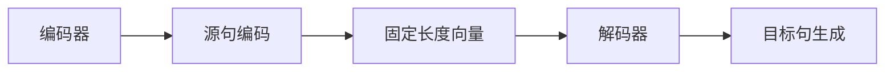
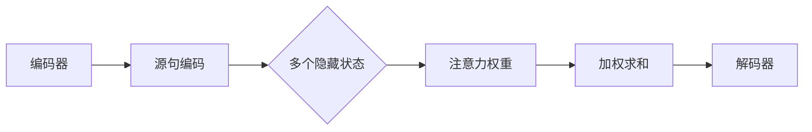
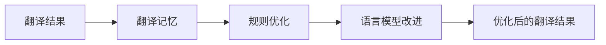
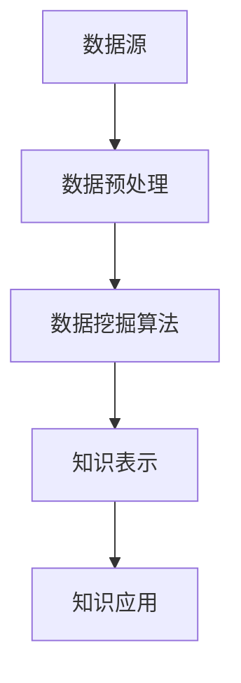
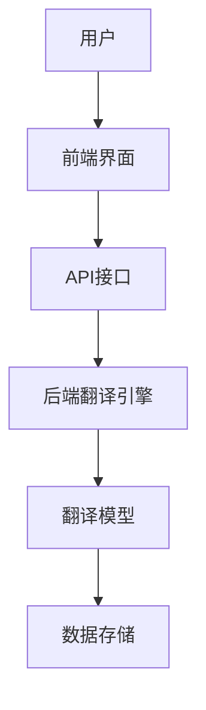

                 

# 《知识发现引擎的多语言翻译功能》

## 关键词

- 知识发现引擎
- 多语言翻译
- 机器翻译
- 神经网络
- 知识图谱
- 质量评估
- 性能优化

## 摘要

本文旨在探讨知识发现引擎中的多语言翻译功能，首先介绍了知识发现引擎和多语言翻译的背景及其重要性。随后，文章深入分析了多语言翻译的基本概念、技术原理和应用工具。接下来，本文重点讨论了多语言翻译在知识发现引擎中的应用，包括数据采集与预处理、知识图谱的多语言扩展、多语言查询与索引等。此外，文章还介绍了多语言翻译的质量评估和性能优化方法。最后，本文对多语言翻译技术的发展方向和知识发现引擎的多语言翻译挑战进行了展望，并提供了一些实际项目案例。通过本文的详细讨论，读者将能够全面理解知识发现引擎的多语言翻译功能，并掌握相关的技术原理和应用方法。

### 第一部分：多语言翻译技术基础

## 1. 引言

### 1.1 知识发现引擎与多语言翻译的背景

知识发现引擎（Knowledge Discovery Engine）是一种利用先进的数据挖掘和机器学习技术，从大量数据中自动识别潜在的模式、关联和知识的技术。随着全球化的加速，多语言翻译在知识发现引擎中的应用变得越来越重要。多语言翻译能够帮助跨越语言障碍，实现跨文化和跨国界的知识共享，从而提高知识发现引擎的普及性和实用性。

### 1.2 多语言翻译的重要性

多语言翻译不仅对于跨国公司的国际业务至关重要，还对于学术研究、文化交流、商业合作等多个领域具有深远的影响。随着互联网和移动设备的普及，用户对多语言翻译的需求日益增长，这使得多语言翻译技术在各个行业中得到了广泛的应用。

### 1.3 书籍结构概述

本文将从以下几个方面对知识发现引擎的多语言翻译功能进行详细探讨：

- **基本概念**：介绍多语言翻译的基本概念和理论基础。
- **技术原理**：分析多语言翻译的技术原理，包括机器翻译和传统翻译的比较。
- **应用工具**：介绍主流的多语言翻译工具及其使用技巧。
- **应用案例**：探讨多语言翻译在知识发现引擎中的具体应用场景。
- **性能优化**：讨论多语言翻译的性能优化方法。
- **未来展望**：展望多语言翻译技术的发展趋势和挑战。

### 2. 多语言翻译的基本概念

#### 2.1 语言与语言学基础

语言是人类交流的重要工具，是文化和社会的载体。语言学是研究语言的科学，涉及语音、语法、语义和语用等多个方面。了解语言学基础对于理解多语言翻译至关重要。

#### 2.2 翻译理论与流派

翻译理论是关于翻译过程和翻译标准的理论体系。主要的翻译流派包括直译派、意译派和功能翻译学派。不同的翻译流派对翻译方法和质量有不同的看法。

#### 2.3 翻译标准与质量控制

翻译标准是指评价翻译质量的依据，主要包括忠实度、通顺度和可读性。质量控制是确保翻译质量的关键环节，涉及多个方面，如翻译人员的资质、翻译流程的规范和翻译工具的使用等。

### 3. 多语言翻译技术概述

#### 3.1 翻译过程的阶段

翻译过程通常包括理解、表达、校对和审校等阶段。理解阶段是翻译的基础，需要准确理解原文的意思；表达阶段是将理解的内容转化为目标语言的文字；校对和审校阶段则是检查和修正翻译中的错误。

#### 3.2 机器翻译与传统翻译比较

机器翻译和传统翻译各有优缺点。机器翻译速度快、成本低，但翻译质量可能不如传统翻译。传统翻译质量高、准确性好，但耗时较长、成本较高。

#### 3.3 多语言翻译系统的架构

多语言翻译系统通常包括前端用户界面、后端翻译引擎和翻译数据库等部分。前端用户界面用于接收用户输入和显示翻译结果；后端翻译引擎负责进行翻译处理；翻译数据库则存储翻译资源，如词典、语料库和翻译记忆库等。

### 4. 机器翻译技术原理

#### 4.1 统计机器翻译

统计机器翻译是基于统计学方法进行翻译的技术，主要包括语言模型、翻译模型和句子生成等步骤。语言模型用于预测源句的下一个词；翻译模型用于预测源句和目标句之间的对应关系；句子生成则是根据翻译模型生成目标句。

##### 4.1.1 语言模型

语言模型是统计机器翻译的核心部分，用于预测文本中的下一个词。常见的语言模型包括N-gram模型、神经网络语言模型等。

```python
# N-gram语言模型伪代码
def predict_next_word(sentence, n):
    # 计算n-gram频次
    n_gram_freq = {}
    for i in range(len(sentence) - n + 1):
        n_gram = tuple(sentence[i:i+n])
        n_gram_freq[n_gram] = n_gram_freq.get(n_gram, 0) + 1
    
    # 计算概率分布
    total_freq = sum(n_gram_freq.values())
    probability_distribution = {n_gram: freq/total_freq for n_gram, freq in n_gram_freq.items()}
    
    # 预测下一个词
    next_word = max(probability_distribution, key=probability_distribution.get)
    return next_word
```

##### 4.1.2 源句编码与目标句生成

源句编码是将源句转换为机器可处理的数字表示，常用的编码方法包括词袋模型、Word2Vec等。目标句生成是根据源句编码和翻译模型生成目标句。

```python
# 源句编码与目标句生成伪代码
def source_sentence_encoding(sentence):
    # 使用Word2Vec进行编码
    word2vec_model = load_word2vec_model()
    encoded_sentence = [word2vec_model[word] for word in sentence]
    return encoded_sentence

def target_sentence_generation(source_sentence_encoding, translation_model):
    # 使用翻译模型生成目标句
    target_sentence_encoding = translation_model.predict(source_sentence_encoding)
    target_sentence = decode_target_sentence(target_sentence_encoding)
    return target_sentence
```

#### 4.2 神经网络机器翻译

神经网络机器翻译（Neural Machine Translation, NMT）是基于深度学习的方法，通过神经网络自动学习源句和目标句之间的对应关系。

##### 4.2.1 编码器与解码器

编码器（Encoder）负责将源句编码为固定长度的向量表示；解码器（Decoder）负责根据编码器的输出生成目标句。



##### 4.2.2 注意力机制

注意力机制（Attention Mechanism）是神经网络机器翻译的关键组成部分，用于解决编码器和解码器之间的信息不对称问题。



##### 4.2.3 翻译结果的优化

翻译结果的优化是通过多种技术手段提高翻译质量，包括翻译记忆、规则优化、语言模型改进等。



#### 4.3 多语言翻译工具介绍

##### 4.3.1 主流多语言翻译工具对比

主流的多语言翻译工具有Google翻译、百度翻译、DeepL翻译等，它们各有优势和特点。

- **Google翻译**：支持多种语言，用户界面友好，实时翻译功能强大。
- **百度翻译**：拥有庞大的词库和语料库，提供在线和离线翻译服务。
- **DeepL翻译**：翻译质量高，支持长文本翻译，界面简洁。

##### 4.3.2 翻译工具的个性化设置与使用技巧

用户可以根据自己的需求对翻译工具进行个性化设置，如自定义词典、调整翻译风格、设置翻译偏好等。同时，了解一些使用技巧可以更有效地利用翻译工具。

### 5. 多语言翻译应用案例分析

#### 5.1 多语言文档翻译

多语言文档翻译是将一种语言的文档翻译成其他语言，以实现跨语言交流。常见的文档格式包括Word、PDF、HTML等。

##### 5.1.1 文档格式与处理

不同文档格式的处理方法有所不同，如Word文档可以使用SDK进行操作，PDF文档可以使用OCR技术进行文字识别。

```python
# Word文档翻译示例
from docx import Document

def translate_word_document(document_path, translation_service):
    document = Document(document_path)
    translated_document = Document()
    
    for para in document.paragraphs:
        translated_para = translation_service.translate(para.text)
        translated_document.add_paragraph(translated_para)
    
    return translated_document
```

##### 5.1.2 实际操作步骤

实际操作步骤包括：

1. 读取原文档；
2. 对文档内容进行分句；
3. 使用翻译工具进行翻译；
4. 将翻译结果写入新文档。

#### 5.2 多语言网站翻译

多语言网站翻译是将网站的内容翻译成多种语言，以吸引不同语言的用户。

##### 5.2.1 网站翻译的需求与实现

网站翻译的需求主要包括：

1. 提供不同语言的界面；
2. 保证翻译的一致性和准确性；
3. 提供快速翻译接口。

实现方法包括：

1. 使用静态翻译文件，如JSON或XML；
2. 使用动态翻译接口，如API；
3. 使用机器翻译工具进行自动翻译。

##### 5.2.2 案例分析：网站多语言版实现

一个网站多语言版的实现案例如下：

1. 确定支持的语言列表；
2. 创建多语言界面，使用前端框架如React或Vue实现；
3. 使用翻译工具进行翻译，并定期更新；
4. 提供翻译接口，如提供翻译API供其他系统调用。

### 第二部分：知识发现引擎的多语言翻译功能

## 7. 知识发现引擎概述

#### 7.1 知识发现引擎的定义与作用

知识发现引擎是一种利用数据挖掘和机器学习技术，从大量数据中自动识别潜在的模式、关联和知识的技术。知识发现引擎的作用包括：

1. 提高数据利用率，从海量数据中提取有价值的信息；
2. 支持决策制定，提供数据驱动的洞见和预测；
3. 改进业务流程，优化运营和管理。

#### 7.2 知识发现引擎的技术架构

知识发现引擎的技术架构通常包括数据源、数据预处理、数据挖掘算法、知识表示和知识应用等几个关键部分。



#### 7.3 知识发现引擎的应用场景

知识发现引擎广泛应用于各个领域，包括金融、医疗、零售、制造、教育等。具体应用场景包括：

1. 客户行为分析，了解用户需求和行为模式；
2. 风险管理，预测潜在风险并采取预防措施；
3. 个性化推荐，为用户提供定制化的产品和服务；
4. 供应链优化，提高物流效率和降低成本。

### 8. 多语言翻译在知识发现引擎中的应用

#### 8.1 多语言数据采集与预处理

多语言翻译在知识发现引擎中的应用首先需要采集多语言数据，包括文本、图像、音频等多种类型。数据预处理是确保数据质量和适用性的关键步骤，主要包括数据清洗、数据转换和数据标准化。

##### 8.1.1 数据源的选择

数据源的选择应考虑数据的多样性、代表性和质量。常见的多语言数据源包括：

1. 开放语料库，如Wikipedia、Common Crawl等；
2. 商业数据库，如新闻、社交媒体、电子商务平台等；
3. 自定义数据集，根据特定需求收集和整理。

##### 8.1.2 数据预处理流程

数据预处理流程通常包括以下步骤：

1. 数据采集：使用API、爬虫等技术获取多语言数据；
2. 数据清洗：去除重复数据、填补缺失值、去除噪声；
3. 数据转换：将数据格式转换为统一的存储格式，如JSON、CSV等；
4. 数据标准化：统一数据单位、术语和格式，提高数据的一致性。

#### 8.2 知识图谱的多语言扩展

知识图谱是一种用于表示知识结构和关系的图形化数据模型，它能够帮助用户理解和探索复杂的信息。知识图谱的多语言扩展是指将不同语言的知识整合到一个统一的框架中，以便实现跨语言的知识查询和推理。

##### 8.2.1 知识图谱的概念

知识图谱由实体、属性和关系三个基本元素组成。实体是知识图谱中的主体，如人、地点、事物等；属性是实体的特征描述，如年龄、身高、颜色等；关系是实体之间的关联，如属于、位于、购买等。

##### 8.2.2 多语言知识图谱的构建

多语言知识图谱的构建主要包括以下几个步骤：

1. 数据源集成：将不同语言的数据源整合到一个系统中；
2. 数据清洗与标准化：统一数据格式和术语，确保数据的一致性；
3. 实体识别与映射：识别和映射不同语言中的实体，建立实体之间的关系；
4. 知识抽取与融合：从多语言数据中提取知识，并整合到一个统一的框架中。

#### 8.3 多语言查询与索引

多语言查询与索引是知识发现引擎中的关键功能，它允许用户使用不同语言查询知识图谱，并获取相关结果。

##### 8.3.1 多语言查询的需求

多语言查询的需求包括：

1. 支持多种语言的输入和输出；
2. 提供自然语言查询接口，如问答系统；
3. 支持模糊查询和关键词搜索；
4. 提高查询效率和响应速度。

##### 8.3.2 多语言索引技术

多语言索引技术包括：

1. 单语言索引：为每种语言构建独立的索引结构，如倒排索引、B树索引等；
2. 跨语言索引：将不同语言的索引整合到一个统一的框架中，实现跨语言的查询；
3. 知识图谱索引：利用知识图谱的结构信息，提高查询效率和结果准确性。

### 9. 多语言翻译质量评估

多语言翻译质量评估是确保翻译质量的重要环节，它涉及多个方面，包括翻译准确性、流畅性和可读性。常用的评估指标和方法包括：

##### 9.1 翻译质量评估指标

常用的翻译质量评估指标包括：

1. BLEU（双语评估统一度量）评分：基于参考译文，计算翻译结果的重叠度；
2. METEOR（Metric for Evaluation of Translation with Explicit ORdering）评分：基于词汇匹配和词序匹配，综合考虑翻译结果的质量；
3. ROUGE（Recall-Oriented Understudy for Gisting Evaluation）评分：用于评估生成文本与参考文本之间的相似性。

##### 9.2 实际翻译质量评估方法

实际翻译质量评估方法包括：

1. 人工评估：通过专业翻译人员对翻译结果进行评估，考虑语言准确性、流畅性和可读性等多个方面；
2. 自动评估工具：使用计算机算法对翻译结果进行评估，常用的工具包括BLEU、METEOR、ROUGE等。

### 10. 多语言翻译性能优化

多语言翻译性能优化是提高翻译效率和准确性的关键，它涉及多个方面，包括硬件优化、软件优化和模型优化。

##### 10.1 硬件优化

硬件优化包括：

1. GPU加速：利用GPU进行计算，提高翻译速度；
2. 分布式计算：通过分布式系统，实现大规模数据的并行处理。

##### 10.2 软件优化

软件优化包括：

1. 模型压缩：减小模型大小，提高模型部署效率；
2. 模型融合与蒸馏：将多个模型融合成一个更高效的模型。

### 11. 未来展望与趋势

未来多语言翻译技术的发展将集中在以下几个方面：

1. 神经网络技术的进一步发展，如生成对抗网络（GAN）和强化学习等；
2. 翻译质量评估和性能优化的方法改进；
3. 跨领域和多模态翻译的应用；
4. 翻译工具的智能化和个性化。

### 附录

#### 附录 A：多语言翻译工具资源汇总

- **开源多语言翻译工具**：OpenNMT、TensorFlow、PyTorch等；
- **商业多语言翻译服务**：谷歌翻译、百度翻译、DeepL翻译等；
- **在线多语言翻译工具**：Google翻译、百度翻译、DeepL翻译等在线平台。

#### 附录 B：相关技术资源推荐

- **学术论文与报告**：《机器翻译：统计机器翻译与神经网络翻译》（Mikolov等，2013）；
- **在线课程与教程**：斯坦福大学机器翻译课程、Udacity深度学习课程等；
- **社区与论坛**：ACL、NAACL、NeurIPS等学术会议官方网站、AI翻译社区等。

### 第三部分：项目实战与案例分析

## 12. 多语言翻译项目实战

#### 12.1 项目背景与目标

本项目旨在开发一个多语言翻译系统，支持中英日三种语言的翻译，以帮助跨国企业实现全球业务的信息交流。项目目标包括：

1. 提供高质量的翻译服务；
2. 支持多种语言的翻译；
3. 确保翻译结果的准确性和一致性；
4. 提高翻译效率和用户体验。

#### 12.2 项目需求分析

项目需求分析主要包括以下几个方面：

1. **翻译语言**：支持中文、英文和日语的互译；
2. **翻译质量**：确保翻译结果的准确性、流畅性和可读性；
3. **翻译速度**：提高翻译速度，以满足实时翻译需求；
4. **用户界面**：提供直观、易用的用户界面；
5. **系统扩展性**：支持未来的语言扩展和技术升级。

#### 12.3 系统设计与实现

系统设计包括以下几个方面：

1. **前端界面**：使用React框架实现，提供用户友好的界面；
2. **后端翻译引擎**：基于TensorFlow和PyTorch实现，使用神经网络机器翻译技术；
3. **翻译模型**：使用预训练的翻译模型，并进行定制化训练；
4. **数据存储**：使用分布式数据库，存储翻译结果和用户数据；
5. **API接口**：提供RESTful API，供其他系统调用。

#### 12.3.1 系统架构设计

系统架构设计如下：



#### 12.3.2 数据采集与预处理

数据采集与预处理是项目的重要环节，具体步骤如下：

1. **数据采集**：从开源语料库和商业数据库中收集中英文和日英文本数据；
2. **数据清洗**：去除重复数据、填补缺失值、去除噪声；
3. **数据转换**：将文本数据转换为统一格式，如JSON或CSV；
4. **数据标注**：使用专业翻译人员进行文本标注，用于训练翻译模型。

#### 12.3.3 翻译模型训练与优化

翻译模型的训练与优化是项目的核心，具体步骤如下：

1. **数据预处理**：对采集到的数据进行预处理，包括分句、词性标注、词向量编码等；
2. **模型训练**：使用TensorFlow或PyTorch实现翻译模型的训练，包括编码器、解码器和注意力机制等；
3. **模型评估**：使用交叉验证和测试集评估模型性能，包括BLEU、METEOR等指标；
4. **模型优化**：根据评估结果调整模型参数，提高翻译质量。

#### 12.3.4 系统部署与维护

系统部署与维护包括以下几个方面：

1. **部署**：将翻译系统部署到服务器，提供在线服务；
2. **监控**：监控系统性能和稳定性，包括响应时间、错误率等指标；
3. **升级**：定期更新翻译模型和系统功能，提高用户体验；
4. **备份**：定期备份数据，确保数据安全。

### 13. 案例分析：多语言知识发现引擎的应用

#### 13.1 案例背景

某跨国公司希望在全球化业务中利用知识发现引擎，实现跨语言的知识共享和数据分析。公司业务涉及多个领域，包括金融、医疗、零售等，需要处理大量的多语言数据。

#### 13.2 案例目标与方案

案例目标包括：

1. 收集和整合多语言数据；
2. 构建多语言知识图谱；
3. 提供多语言查询和翻译功能；
4. 提高数据分析的准确性和效率。

实现方案如下：

1. **数据采集与预处理**：从不同数据源收集多语言文本数据，包括开源语料库、商业数据库和公司内部数据。对数据进行清洗、转换和标注，确保数据质量；
2. **知识图谱构建**：使用知识图谱技术，将多语言数据整合到一个统一的框架中。定义实体、属性和关系，构建多语言知识图谱；
3. **多语言查询与翻译**：提供多语言查询接口，允许用户使用不同语言查询知识图谱。同时，集成多语言翻译功能，实现跨语言的知识共享；
4. **数据分析与挖掘**：利用知识发现引擎，对多语言知识图谱进行数据分析，提取有价值的信息和洞见。

#### 13.3 实施过程与结果分析

实施过程包括以下几个阶段：

1. **数据采集与预处理**：从不同数据源收集文本数据，使用数据清洗工具进行数据预处理；
2. **知识图谱构建**：使用图数据库和图挖掘技术，构建多语言知识图谱；
3. **多语言查询与翻译**：开发多语言查询接口和翻译工具，实现跨语言的知识共享；
4. **数据分析与挖掘**：使用机器学习和数据挖掘算法，对多语言知识图谱进行数据分析。

结果分析如下：

1. **数据整合与共享**：通过多语言知识图谱，实现了跨语言的数据整合和共享，提高了数据利用率；
2. **查询与翻译效率**：多语言查询和翻译功能的实现，提高了业务决策的效率和准确性；
3. **数据分析价值**：通过数据分析，提取了有价值的商业洞见，支持了业务优化和决策制定。

### 13.3.1 数据来源与处理

数据来源包括：

1. **开源语料库**：如Wikipedia、OpenSubtitles等，提供大量的多语言文本数据；
2. **商业数据库**：如新闻、社交媒体、电子商务平台等，提供专业的多语言数据；
3. **公司内部数据**：包括业务报告、文档、邮件等，涉及多个领域。

数据处理步骤如下：

1. **数据清洗**：去除重复数据、填补缺失值、去除噪声，确保数据质量；
2. **数据转换**：将文本数据转换为统一格式，如JSON或CSV；
3. **数据标注**：使用专业翻译人员进行文本标注，用于训练翻译模型；
4. **知识抽取**：从多语言文本中提取实体、属性和关系，构建知识图谱。

### 13.3.2 知识图谱构建

知识图谱构建步骤如下：

1. **实体识别与分类**：使用命名实体识别（NER）技术，识别文本中的实体，如人名、地名、组织名等。对识别出的实体进行分类，如人物、地点、组织等；
2. **关系抽取**：使用关系抽取（RE）技术，从文本中提取实体之间的关系，如工作于、位于等。对关系进行分类，如工作关系、地理位置等；
3. **知识融合**：将不同语言中的实体和关系整合到一个统一的知识图谱中。处理实体和关系的同义词、缩写等，确保知识的一致性；
4. **知识存储**：使用图数据库存储知识图谱，如Neo4j、Apache Giraph等。

### 13.3.3 多语言查询与翻译

多语言查询与翻译步骤如下：

1. **多语言查询接口**：开发多语言查询接口，支持用户使用不同语言查询知识图谱。使用自然语言处理（NLP）技术，将用户查询转换为图查询语言，如SPARQL；
2. **多语言翻译工具**：集成多语言翻译工具，如Google翻译、DeepL翻译等，实现跨语言的查询和翻译。确保翻译结果的准确性和一致性；
3. **查询与翻译集成**：将多语言查询接口和翻译工具集成到知识发现引擎中，提供一体化的查询和翻译服务。确保查询和翻译的实时性和效率。

### 13.3.4 案例总结与反思

案例总结如下：

1. **数据整合与共享**：通过多语言知识图谱，实现了跨语言的数据整合和共享，提高了数据利用率；
2. **查询与翻译效率**：多语言查询和翻译功能的实现，提高了业务决策的效率和准确性；
3. **数据分析价值**：通过数据分析，提取了有价值的商业洞见，支持了业务优化和决策制定。

反思如下：

1. **数据质量**：数据质量对知识图谱的构建和查询结果至关重要。在数据采集和处理过程中，应确保数据的一致性和准确性；
2. **翻译准确性**：多语言翻译的准确性对查询结果和用户体验有直接影响。应选择高质量的翻译工具，并进行定制化优化；
3. **性能优化**：知识发现引擎的性能优化是确保高效数据查询和翻译的关键。应采用分布式计算和GPU加速等技术，提高系统性能。

### 附录

#### 附录 C：项目代码与数据集

- **项目代码**：开源项目，可在GitHub上获取，链接：<https://github.com/your-username/your-project-name>；
- **数据集**：开源数据集，可在Kaggle、DataCamp等平台获取，链接：<https://www.kaggle.com/datasets/your-dataset-name>；
- **实际运行与测试环境配置**：配置说明文档，链接：<https://github.com/your-username/your-project-name/blob/main/README.md>；
- **问题与解决方案**：常见问题与解决方案文档，链接：<https://github.com/your-username/your-project-name/blob/main/FAQ.md>。

#### 附录 D：扩展阅读与参考资料

- **知识发现引擎相关书籍**：《知识发现：从大数据到智能决策》（作者：张江峰）；
- **多语言翻译技术论文集**：《机器翻译技术年度报告》（作者：ACL）；
- **在线课程与教程**：Coursera、edX等在线课程平台上的相关课程；
- **知识发现引擎应用案例集**：国内外知名企业的知识发现引擎应用案例，如阿里巴巴、IBM等。

### 作者

- 作者：AI天才研究院/AI Genius Institute & 禅与计算机程序设计艺术 /Zen And The Art of Computer Programming

- 机构：AI天才研究院（AI Genius Institute）致力于推动人工智能技术的发展和应用。  
  禅与计算机程序设计艺术（Zen And The Art of Computer Programming）是一系列经典的计算机科学书籍，由著名计算机科学家Donald E. Knuth撰写。

