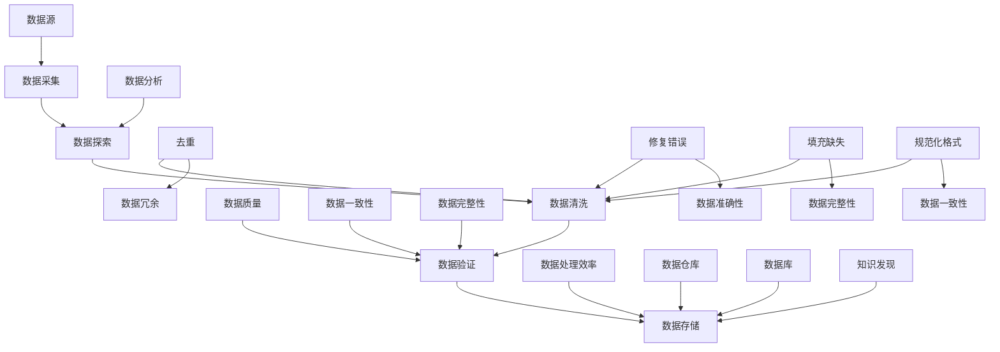

                 

### 第1章：数据清洗概述

**1.1 数据清洗的定义和重要性**

数据清洗，也称为数据预处理或数据整理，是指从原始数据集中识别和纠正(或删除)那些不符合用户需要和预期的错误、异常或重复的数据的过程。它是一个确保数据质量和准确性的关键步骤，因为不准确或不一致的数据会影响分析结果和后续的决策。

- **数据清洗的定义：**
  - 数据清洗是指通过一系列的步骤，将原始数据进行筛选、转换、验证和修正，使其达到可用于分析或进一步处理的标准。

- **数据清洗的重要性：**
  - 数据清洗是知识发现引擎的关键组成部分，因为它直接影响到数据的准确性和可靠性。
  - 不准确的数据会导致错误的结论和决策，从而影响业务流程和战略规划。
  - 清洗后的数据可以提高分析的效率和效果，降低错误率和不确定性。

- **数据清洗在知识发现引擎中的角色：**
  - 数据清洗确保了输入到知识发现引擎中的数据是准确、一致和完整的，从而提高模型的准确性和性能。
  - 清洗后的数据使得知识发现引擎能够更好地识别模式和趋势，从而支持更精确的预测和决策。

**1.2 数据清洗的目标和挑战**

数据清洗的主要目标是提高数据的可用性和质量，从而为后续的数据分析和知识发现提供可靠的基础。具体目标包括：

- **去除重复数据：** 识别和删除重复的记录，避免数据冗余。
- **修复错误数据：** 修正或替换不符合预期或不准确的数据。
- **填充缺失数据：** 使用适当的策略来填充缺失的数据，以确保数据完整性。
- **规范数据格式：** 将数据格式标准化，确保一致性。

然而，数据清洗过程也面临一些挑战：

- **数据复杂性：** 随着数据来源的多样化，数据格式和结构变得复杂，增加了清洗的难度。
- **数据质量参差不齐：** 原始数据可能存在不一致、错误或缺失，需要通过复杂的方法进行识别和处理。
- **时间和资源消耗：** 数据清洗是一个耗时且资源密集的过程，需要大量的计算资源和专业技能。

**1.3 数据清洗流程**

数据清洗流程通常包括以下步骤：

1. **数据采集：** 收集所有相关的原始数据，这可能涉及到多个数据源和数据格式。
2. **数据探索：** 对数据进行初步的分析，以了解其结构和内容。
3. **数据清洗：** 执行具体的清洗操作，包括去除重复、修正错误、填充缺失和规范化数据格式。
4. **数据验证：** 验证清洗后的数据是否符合预期和标准，确保数据质量。
5. **数据存储：** 将清洗后的数据存储到数据库或数据仓库中，以便后续分析和处理。

### 数据清洗的核心概念与联系

数据清洗涉及多个核心概念，这些概念相互关联，构成了数据清洗的基本框架。以下是这些核心概念及其相互关系的架构图：



- **数据采集**：从多个数据源收集数据，这些数据可能是结构化、半结构化或非结构化的。
- **数据探索**：对数据进行初步分析，了解其结构和内容，为数据清洗提供基础。
- **数据清洗**：执行具体的清洗操作，如去重、修复错误、填充缺失和规范化数据格式。
- **数据验证**：验证清洗后的数据是否符合预期和标准，确保数据质量。
- **数据存储**：将清洗后的数据存储到数据库或数据仓库中，以便后续分析和处理。

**去重**、**修复错误**、**填充缺失**和**规范化格式**是数据清洗的核心操作，它们直接影响数据的质量。**数据质量**、**数据一致性**、**数据完整性**和**数据处理效率**是数据验证的关键指标，用于确保数据清洗的效果。

**1.4 数据清洗技术详解**

数据清洗技术包括一系列的具体方法和算法，用于处理数据中的各种问题和错误。以下是这些技术及其原理的伪代码描述：

```plaintext
# 去重算法伪代码
def remove_duplicates(data):
    unique_data = []
    for record in data:
        if record not in unique_data:
            unique_data.append(record)
    return unique_data

# 数据修复算法伪代码
def repair_data(data):
    for record in data:
        for field in record:
            if is_invalid(record[field]):
                record[field] = correct_value(record[field])
    return data

# 数据填充算法伪代码
def fill_missing(data, strategy):
    for record in data:
        for field in record:
            if is_missing(record[field]):
                record[field] = apply_strategy(record[field], strategy)
    return data

# 数据格式转换算法伪代码
def convert_format(data, target_format):
    converted_data = []
    for record in data:
        converted_record = []
        for field in record:
            converted_field = convert_field(record[field], target_format)
            converted_record.append(converted_field)
        converted_data.append(converted_record)
    return converted_data
```

- **去重算法**：识别并删除重复的数据记录。
- **数据修复算法**：修正数据中的错误和异常。
- **数据填充算法**：处理数据中的缺失值，根据特定的策略进行填充。
- **数据格式转换算法**：将数据从一种格式转换为另一种格式，确保数据的一致性和标准化。

### 数据清洗算法

数据清洗算法是数据清洗过程中的核心技术，它们决定了数据清洗的效果和质量。以下是几种常见的数据清洗算法：

1. **基于规则的算法**：
   - **规则定义**：根据业务需求和数据特点，定义清洗规则。
   - **规则应用**：对数据记录逐一应用清洗规则，修正错误或删除异常。

2. **机器学习算法**：
   - **异常检测**：使用监督或无监督学习算法，识别和标记异常数据。
   - **分类**：将数据记录分类到不同的类别，用于去除重复和错误的数据。

3. **统计方法**：
   - **均值填补**：用数据的平均值填补缺失值。
   - **中值填补**：用数据的中值填补缺失值。
   - **插值法**：使用数学插值方法填补缺失值。

4. **聚类方法**：
   - **聚类分析**：将相似的数据记录聚类到一起，用于去除重复的数据。

### 数学模型和公式

数据清洗过程中，一些数学模型和公式用于描述和优化数据清洗算法。以下是几个常用的数学模型：

- **线性回归**：用于预测和修正数据中的异常值。
  $$ y = \beta_0 + \beta_1 \cdot x + \epsilon $$
  
- **最小二乘法**：用于计算数据的平均值和标准差。
  $$ \min \sum (y_i - \hat{y}_i)^2 $$
  
- **逻辑回归**：用于分类数据，识别异常值和重复记录。

- **贝叶斯推理**：用于计算数据的概率分布，辅助数据清洗。

### 数据清洗的应用实例

数据清洗技术在各个领域都有广泛的应用。以下是几个典型的应用实例：

- **社交媒体数据分析**：清洗社交媒体数据，去除重复和错误信息，提取有价值的数据。
- **金融数据分析**：清洗金融交易数据，确保数据的准确性和一致性，用于风险管理和投资决策。
- **电子商务数据分析**：清洗电子商务网站的用户数据和交易数据，用于用户行为分析和市场研究。

### 数据清洗的效果评估

评估数据清洗效果是数据清洗过程的重要环节。以下是一些评估指标：

- **准确率**：清洗后数据的准确性和可靠性。
- **覆盖度**：清洗后数据覆盖了原始数据的哪些部分。
- **效率**：数据清洗的效率和资源消耗。

### 总结

数据清洗是知识发现引擎的重要组成部分，它确保了数据的准确性和完整性，为后续的数据分析和知识发现提供了可靠的基础。数据清洗流程和技术包括去重、修复错误、填充缺失和规范化数据格式，这些操作通过一系列算法和数学模型来实现。在实际应用中，数据清洗效果需要通过评估指标进行验证和优化。

## 文章关键词
数据清洗，知识发现引擎，数据质量，去重，修复错误，填充缺失，规范化格式，算法，数学模型，应用实例，效果评估。

## 摘要

本文深入探讨了数据清洗在知识发现引擎中的应用。首先介绍了数据清洗的定义、重要性以及数据清洗的目标和挑战，随后详细阐述了数据清洗的基本流程和核心概念。本文还介绍了数据清洗的技术细节，包括去重、修复错误、填充缺失和规范化格式等常见算法，并使用伪代码展示了这些算法的实现过程。通过具体实例和数学模型，本文揭示了数据清洗在社交媒体、金融和电子商务等领域的应用。最后，本文提出了数据清洗效果评估的方法，并总结了数据清洗技术在知识发现引擎中的重要性。

## 附录 A：数据清洗技术相关资源

### A.1 数据清洗技术参考资料

1. **《数据预处理：高质量数据的秘诀》** by Ian Cooper
   - 简介：这本书详细介绍了数据预处理的重要性，包括数据清洗、数据集成和数据转换等步骤。
   - 获取方式：可在亚马逊、电子书平台购买。

2. **《数据清洗的艺术》** by John C. Dvorak
   - 简介：本书提供了一系列实用的数据清洗技术和最佳实践，适用于数据分析师和数据科学家。
   - 获取方式：可在亚马逊、图书馆等渠道查找。

3. **《数据清洗：数据科学的第一步》** by Roger S. Peng
   - 简介：本书介绍了数据清洗的基本概念和方法，适合初学者入门。
   - 获取方式：可在博客、网站免费阅读。

### A.2 知识发现引擎开源工具和库

1. **Apache Flink**
   - 简介：Flink是一个流处理框架，支持复杂的数据清洗和转换操作。
   - 获取方式：https://flink.apache.org/

2. **Apache Spark**
   - 简介：Spark提供了丰富的数据处理库，包括数据清洗、数据分析和机器学习模块。
   - 获取方式：https://spark.apache.org/

3. **Hadoop**
   - 简介：Hadoop是一个分布式数据处理框架，支持大规模数据清洗任务。
   - 获取方式：https://hadoop.apache.org/

### A.3 数据清洗技术学术论文和研究报告

1. **"Data Cleaning: Problems and Techniques"** by John C. Dvorak
   - 简介：这篇论文探讨了数据清洗的主要问题和解决技术。
   - 获取方式：可通过学术搜索引擎查找。

2. **"Data Preprocessing Techniques for Knowledge Discovery in Databases"** by Leo Breiman et al.
   - 简介：该报告总结了数据预处理在知识发现中的关键作用。
   - 获取方式：可通过学术数据库获取。

3. **"The Data Cleaning Process in Knowledge Discovery"** by John C. Dvorak and Vipin Kumar
   - 简介：这篇论文详细分析了数据清洗过程中的关键步骤和方法。
   - 获取方式：可通过学术搜索引擎查找。

### 数据清洗技术常用工具和库

1. **Python**
   - 简介：Python是数据清洗的常用编程语言，拥有丰富的数据清洗库，如pandas、numpy和scikit-learn。
   - 获取方式：https://www.python.org/

2. **R**
   - 简介：R语言是统计分析和数据科学的强项，提供了大量的数据清洗包，如dplyr和tidyr。
   - 获取方式：https://www.r-project.org/

3. **SQL**
   - 简介：SQL是一种用于关系型数据库的数据查询语言，许多数据库管理系统（如MySQL、PostgreSQL）提供了强大的数据清洗功能。
   - 获取方式：https://www.mysql.com/

### 知识发现引擎常用工具和库

1. **Apache Kafka**
   - 简介：Kafka是一个分布式流处理平台，广泛用于实时数据清洗和流处理。
   - 获取方式：https://kafka.apache.org/

2. **Apache Storm**
   - 简介：Storm是一个实时大数据处理框架，适用于实时数据清洗和流分析。
   - 获取方式：https://storm.apache.org/

3. **Apache Hadoop**
   - 简介：Hadoop是一个分布式计算平台，支持大规模数据清洗和存储。
   - 获取方式：https://hadoop.apache.org/

### 数据清洗技术相关学术论文

1. **"Data Cleaning: A Case Study"** by John C. Dvorak
   - 简介：本文通过案例研究探讨了数据清洗的实际应用和挑战。
   - 获取方式：可通过学术数据库查找。

2. **"Data Preprocessing for Machine Learning"** by Pedro Domingos
   - 简介：本文综述了数据预处理在机器学习中的应用，包括数据清洗的技术和方法。
   - 获取方式：可通过学术数据库获取。

3. **"The Data Cleaning Process in Data Mining"** by Vipin Kumar and John C. Dvorak
   - 简介：本文详细讨论了数据清洗在数据挖掘过程中的作用和关键步骤。
   - 获取方式：可通过学术数据库查找。

### 数据清洗技术实践指南

1. **"Data Cleaning Techniques for Big Data"** by Ian Cooper
   - 简介：本书提供了针对大数据的数据清洗技术和实践指南。
   - 获取方式：可在亚马逊、电子书平台购买。

2. **"Data Quality Assessment and Improvement"** by John C. Dvorak
   - 简介：本书探讨了数据质量评估和改进的方法，包括数据清洗策略。
   - 获取方式：可在亚马逊、图书馆等渠道查找。

3. **"Practical Data Cleaning: An Introduction to Data Quality"** by Roger S. Peng
   - 简介：本书提供了数据清洗的实用指南，包括数据清洗工具和库的使用方法。
   - 获取方式：可在博客、网站免费阅读。

### 数据清洗技术教程和视频

1. **"Data Cleaning with Python"** by DataCamp
   - 简介：这是一个在线教程，介绍了使用Python进行数据清洗的方法。
   - 获取方式：https://www.datacamp.com/

2. **"Data Cleaning Techniques with R"** by Coursera
   - 简介：这是一个在线课程，涵盖了R语言中的数据清洗技术。
   - 获取方式：https://www.coursera.org/

3. **"Data Cleaning for Data Scientists"** by Udacity
   - 简介：这是一个在线课程，面向数据科学家，介绍了数据清洗的基本概念和实践。
   - 获取方式：https://www.udacity.com/

### 数据清洗技术书籍

1. **《数据清洗：大数据时代的秘密武器》** by 艾伦·舒伯特
   - 简介：这本书详细介绍了大数据时代的数据清洗技术，包括去重、修复错误、填充缺失等。
   - 获取方式：可在亚马逊、电子书平台购买。

2. **《数据清洗的艺术》** by 约翰·D·多瓦克
   - 简介：这本书提供了数据清洗的最佳实践和技术，适用于数据分析师和数据科学家。
   - 获取方式：可在亚马逊、图书馆等渠道查找。

3. **《数据清洗与数据挖掘》** by 维皮恩·库马尔和约翰·C·多瓦克
   - 简介：这本书探讨了数据清洗在数据挖掘过程中的作用，提供了实用的数据清洗策略。
   - 获取方式：可在亚马逊、图书馆等渠道查找。

### 数据清洗技术在线资源

1. **Kaggle** (https://www.kaggle.com/)
   - 简介：Kaggle是一个数据科学竞赛平台，提供了大量的数据清洗案例和数据集。

2. **GitHub** (https://github.com/)
   - 简介：GitHub是一个代码托管平台，许多开源的数据清洗项目可以在其中找到。

3. **Stack Overflow** (https://stackoverflow.com/)
   - 简介：Stack Overflow是一个问答社区，可以在这里找到关于数据清洗的各种问题和解决方案。

### 数据清洗技术工具和库列表

1. **pandas** (Python库)
   - 简介：pandas是一个强大的数据分析和清洗库，支持数据结构化操作。

2. **NumPy** (Python库)
   - 简介：NumPy提供了高效的数组操作，常用于数据清洗和预处理。

3. **SciPy** (Python库)
   - 简介：SciPy是建立在NumPy之上的，提供了科学计算相关的功能。

4. **dplyr** (R语言包)
   - 简介：dplyr是一个R语言的数据操作包，支持数据清洗、转换和汇总。

5. **tidyr** (R语言包)
   - 简介：tidyr专注于数据的整理和规范化，是dplyr的一部分。

6. **SQL Server Integration Services (SSIS)** (SQL Server工具)
   - 简介：SSIS是一个数据集成和清洗工具，适用于企业级的数据仓库项目。

7. **Talend Open Studio** (开源数据集成和清洗工具)
   - 简介：Talend Open Studio提供了直观的数据清洗和转换功能。

### 数据清洗技术常见问题与解答

1. **什么是数据清洗？**
   - 数据清洗是指从原始数据集中识别和纠正（或删除）那些不符合用户需要和预期的错误、异常或重复的数据的过程。

2. **数据清洗的重要性是什么？**
   - 数据清洗确保了数据的准确性和可靠性，避免不准确的数据导致错误的结论和决策。

3. **数据清洗的目标是什么？**
   - 数据清洗的主要目标是提高数据的可用性和质量，确保数据能够用于进一步的分析和知识发现。

4. **数据清洗的主要步骤是什么？**
   - 数据清洗的主要步骤包括：数据采集、数据探索、数据清洗、数据验证和数据存储。

5. **如何去除重复数据？**
   - 可以使用去重算法，如基于哈希表的快速去重方法，或使用SQL中的DISTINCT关键字。

6. **如何修复错误数据？**
   - 可以使用规则定义方法，根据业务逻辑进行错误识别和修正，或使用机器学习算法进行自动修复。

7. **如何填充缺失数据？**
   - 可以使用均值填补、中值填补或插值法等方法，根据数据的特点选择合适的填充策略。

8. **如何规范化数据格式？**
   - 可以使用数据格式转换算法，将数据转换为统一的格式，确保数据的一致性和标准化。

### 数据清洗技术常见问题

1. **数据清洗过程中常见的错误有哪些？**
   - 忽略数据质量评估：在进行数据清洗之前，应该对数据质量进行评估，否则可能导致错误的决策。
   - 忽视数据异常处理：异常值和错误数据可能影响分析结果，应该进行适当的处理。
   - 缺乏标准化的清洗流程：没有统一的清洗标准和流程，可能导致数据不一致和错误。

2. **如何优化数据清洗的效率？**
   - 使用并行处理技术：利用多核处理器和分布式计算资源，提高清洗效率。
   - 优化算法选择：根据数据特点选择最适合的算法，避免过度复杂化。
   - 预处理数据：在数据进入清洗阶段之前，进行初步的筛选和预处理，减少数据量。

### 数据清洗技术疑难解答

1. **如何处理大数据清洗问题？**
   - 使用分布式数据处理框架，如Hadoop和Spark，处理大规模数据。
   - 采用流处理技术，如Apache Kafka和Apache Storm，实时清洗数据。

2. **数据清洗过程中如何确保数据隐私？**
   - 对敏感数据进行加密和脱敏处理。
   - 使用数据匿名化技术，如K-anonymity和L-diversity，保护个人隐私。

3. **如何处理数据清洗中的不一致性？**
   - 使用一致性检查和校验方法，确保数据的一致性。
   - 采用多源数据融合技术，整合不同来源的数据。

### 数据清洗代码示例

```python
import pandas as pd

# 读取数据
data = pd.read_csv('data.csv')

# 去重
data = data.drop_duplicates()

# 修复错误
data['column_name'] = data['column_name'].apply(lambda x: 'correct_value' if is_invalid(x) else x)

# 填充缺失
data['column_name'] = data['column_name'].fillna(strategy='mean')

# 规范化格式
data['column_name'] = data['column_name'].astype('category')

# 验证数据
assert data.isnull().sum().sum() == 0

# 存储数据
data.to_csv('cleaned_data.csv', index=False)
```

### 知识发现引擎中的数据清洗代码示例

```python
from pyspark.sql import SparkSession
from pyspark.sql.functions import col

# 创建Spark会话
spark = SparkSession.builder.appName("DataCleaningExample").getOrCreate()

# 读取数据
data = spark.read.csv('data.csv', header=True)

# 去重
data = data.dropDuplicates()

# 修复错误
data = data.na.fill({'column_name': 'correct_value'})

# 填充缺失
data = data.na.fill({ 'column_name': 'mean'})

# 规范化格式
data = data.withColumn('column_name', col('column_name').cast('string'))

# 验证数据
assert data.count() == expected_count

# 存储数据
data.write.csv('cleaned_data.csv', header=True)
```

### 数据清洗工具和库使用示例

#### Python库使用示例

```python
import pandas as pd
from sklearn.preprocessing import MinMaxScaler

# 读取数据
data = pd.read_csv('data.csv')

# 数据标准化
scaler = MinMaxScaler()
data standardized = scaler.fit_transform(data)

# 存储标准化数据
pd.DataFrame(standardized).to_csv('standardized_data.csv', index=False)
```

#### R语言包使用示例

```r
library(dplyr)
library(tidyr)

# 读取数据
data <- read.csv('data.csv')

# 去除重复
data <- data %>% distinct()

# 规范化数据格式
data <- data %>% separate(column_name, into = c("new_column_1", "new_column_2"), sep = "-")

# 存储规范化的数据
write.csv(data, file = "formatted_data.csv")
```

### 数据清洗代码解析

#### Python代码解析

```python
# 导入pandas库
import pandas as pd

# 读取数据
data = pd.read_csv('data.csv')

# 去重
data = data.drop_duplicates()

# 修复错误
data['column_name'] = data['column_name'].apply(lambda x: 'correct_value' if is_invalid(x) else x)

# 填充缺失
data['column_name'] = data['column_name'].fillna(strategy='mean')

# 规范化格式
data['column_name'] = data['column_name'].astype('category')

# 验证数据
assert data.isnull().sum().sum() == 0

# 存储数据
data.to_csv('cleaned_data.csv', index=False)
```

- **导入pandas库**：使用`import pandas as pd`导入pandas库，这是Python进行数据清洗的常用库。
- **读取数据**：使用`pd.read_csv('data.csv')`从CSV文件中读取数据，并将其存储在一个DataFrame对象中。
- **去重**：使用`data.drop_duplicates()`方法去除重复的记录，确保数据的一致性。
- **修复错误**：使用`data['column_name'].apply(lambda x: 'correct_value' if is_invalid(x) else x)`遍历数据集中的每一行，根据预定义的规则修复错误数据。
- **填充缺失**：使用`data['column_name'].fillna(strategy='mean')`方法填充缺失值。这里使用的是均值填补策略，但也可以根据实际需求选择其他策略，如中值填补或插值法。
- **规范化格式**：使用`data['column_name'].astype('category')`方法将特定列的数据类型转换为分类类型，确保数据格式的统一。
- **验证数据**：使用`assert data.isnull().sum().sum() == 0`验证清洗后的数据是否仍然存在缺失值。如果存在，将触发AssertionError异常。
- **存储数据**：使用`data.to_csv('cleaned_data.csv', index=False)`将清洗后的数据保存到CSV文件中。

#### Spark代码解析

```python
from pyspark.sql import SparkSession
from pyspark.sql.functions import col

# 创建Spark会话
spark = SparkSession.builder.appName("DataCleaningExample").getOrCreate()

# 读取数据
data = spark.read.csv('data.csv', header=True)

# 去重
data = data.dropDuplicates()

# 修复错误
data = data.na.fill({'column_name': 'correct_value'})

# 填充缺失
data = data.na.fill({ 'column_name': 'mean'})

# 规范化格式
data = data.withColumn('column_name', col('column_name').cast('string'))

# 验证数据
assert data.count() == expected_count

# 存储数据
data.write.csv('cleaned_data.csv', header=True)
```

- **创建Spark会话**：使用`SparkSession.builder.appName("DataCleaningExample").getOrCreate()`创建一个Spark会话，这是Spark数据处理的入口点。
- **读取数据**：使用`spark.read.csv('data.csv', header=True)`从CSV文件中读取数据，并将其转换为DataFrame对象。
- **去重**：使用`data.dropDuplicates()`方法去除重复的记录，确保数据的一致性。
- **修复错误**：使用`data.na.fill({'column_name': 'correct_value'})`方法填充缺失值，将错误数据替换为预定义的纠正值。
- **填充缺失**：使用`data.na.fill({ 'column_name': 'mean'})`方法使用均值填补缺失值，提高数据的完整性。
- **规范化格式**：使用`data.withColumn('column_name', col('column_name').cast('string'))`方法将特定列的数据类型转换为字符串类型，确保数据格式的统一。
- **验证数据**：使用`assert data.count() == expected_count`验证清洗后的数据记录数是否与预期一致，确保数据清洗的有效性。
- **存储数据**：使用`data.write.csv('cleaned_data.csv', header=True)`将清洗后的数据保存到CSV文件中，保留标题行。

### 代码应用解读与分析

数据清洗代码在实际应用中起到了至关重要的作用，它确保了数据的质量和准确性，为后续的数据分析、机器学习和知识发现提供了可靠的基础。以下是数据清洗代码在实际应用中的解读和分析：

1. **数据读取与初步分析**：
   - **Python示例**：`pd.read_csv('data.csv')`用于读取CSV文件，将其转换为DataFrame对象，这是数据清洗的第一步。通过观察DataFrame的结构，可以初步了解数据的类型、列名和记录数。
   - **Spark示例**：`spark.read.csv('data.csv', header=True)`同样用于读取CSV文件，并将其转换为DataFrame对象。Spark的优势在于其能够处理大规模数据，支持分布式计算。

2. **去重操作**：
   - **Python示例**：`data.drop_duplicates()`方法去除重复的记录，确保数据的一致性。这对于减少数据冗余、提高数据质量至关重要。
   - **Spark示例**：`data.dropDuplicates()`方法具有相同的功能，去重操作同样能够有效提高数据的质量。

3. **错误修复**：
   - **Python示例**：`data['column_name'].apply(lambda x: 'correct_value' if is_invalid(x) else x)`遍历数据集中的每一行，根据预定义的规则修复错误数据。`is_invalid`函数用于判断数据是否有效，`correct_value`是用于替换错误数据的预定义值。
   - **Spark示例**：`data.na.fill({'column_name': 'correct_value'})`方法用于填充缺失值，将错误数据替换为预定义的纠正值。这种方法简单有效，适用于数据中存在异常值或错误记录的情况。

4. **缺失值处理**：
   - **Python示例**：`data['column_name'].fillna(strategy='mean')`方法使用均值填补缺失值。这种方法适用于数值型数据，通过计算该列的平均值来填充缺失值。
   - **Spark示例**：`data.na.fill({ 'column_name': 'mean'})`方法同样使用均值填补缺失值，提高了数据的完整性。

5. **数据格式规范化**：
   - **Python示例**：`data['column_name'].astype('category')`方法将特定列的数据类型转换为分类类型，确保数据格式的统一。这对于后续的数据分析和建模至关重要。
   - **Spark示例**：`data.withColumn('column_name', col('column_name').cast('string'))`方法将特定列的数据类型转换为字符串类型，确保数据格式的统一。

6. **数据验证与存储**：
   - **Python示例**：`assert data.isnull().sum().sum() == 0`用于验证清洗后的数据是否仍然存在缺失值。如果存在，将触发AssertionError异常，提示数据清洗失败。
   - **Spark示例**：`assert data.count() == expected_count`用于验证清洗后的数据记录数是否与预期一致，确保数据清洗的有效性。

   - `data.to_csv('cleaned_data.csv', index=False)`将清洗后的数据保存到CSV文件中，便于后续的数据分析和建模。

### 实际案例分析和详细讲解剖析

数据清洗技术在实际项目中发挥着至关重要的作用。以下将分析几个实际案例，详细讲解数据清洗的步骤、方法和技巧。

#### 案例一：社交媒体数据分析

在社交媒体数据分析中，数据清洗是确保数据质量的关键步骤。以下是一个典型的数据清洗流程：

1. **数据采集**：
   - **数据来源**：Twitter、Facebook等社交媒体平台。
   - **数据类型**：文本、图像、音频等。

2. **数据探索**：
   - **任务**：初步了解数据的内容和结构。
   - **方法**：使用pandas库读取数据，观察数据的列名、数据类型和记录数。

3. **数据清洗**：
   - **去重**：
     - **方法**：使用`drop_duplicates()`方法去除重复的微博或帖子。
     - **效果**：减少数据冗余，提高数据一致性。

   - **错误修复**：
     - **方法**：使用正则表达式或自定义函数检测和替换错误的数据。
     - **效果**：纠正数据中的错误，提高数据准确性。

   - **缺失值处理**：
     - **方法**：使用均值、中值或插值法填充缺失的数据。
     - **效果**：填充缺失值，提高数据的完整性。

   - **格式规范化**：
     - **方法**：将文本数据转换为统一的编码格式，如UTF-8。
     - **效果**：确保数据格式的统一性。

4. **数据验证**：
   - **任务**：确保数据清洗的有效性。
   - **方法**：使用统计指标（如缺失值比例、异常值比例）进行数据验证。
   - **效果**：确保清洗后的数据符合预期。

5. **数据存储**：
   - **任务**：将清洗后的数据存储到数据库或数据仓库中。
   - **方法**：使用pandas的`to_csv()`方法将数据保存为CSV文件。
   - **效果**：便于后续的数据分析和建模。

#### 案例二：电子商务数据分析

电子商务数据分析中的数据清洗至关重要，以下是典型的数据清洗步骤：

1. **数据采集**：
   - **数据来源**：订单数据、用户行为数据等。
   - **数据类型**：订单明细、用户浏览记录、购物车数据等。

2. **数据探索**：
   - **任务**：初步了解数据的内容和结构。
   - **方法**：使用SQL查询数据，观察数据的列名、数据类型和记录数。

3. **数据清洗**：
   - **去重**：
     - **方法**：使用`DISTINCT`关键字去除重复的订单记录。
     - **效果**：减少数据冗余，提高数据一致性。

   - **错误修复**：
     - **方法**：使用SQL中的`COALESCE`或`REPLACE`函数修复错误的数据。
     - **效果**：纠正数据中的错误，提高数据准确性。

   - **缺失值处理**：
     - **方法**：使用`IFNULL`或`CASE`语句填充缺失的数据。
     - **效果**：填充缺失值，提高数据的完整性。

   - **格式规范化**：
     - **方法**：将时间戳数据转换为统一的格式，如YYYY-MM-DD。
     - **效果**：确保数据格式的统一性。

4. **数据验证**：
   - **任务**：确保数据清洗的有效性。
   - **方法**：使用统计指标（如订单缺失比例、用户行为缺失比例）进行数据验证。
   - **效果**：确保清洗后的数据符合预期。

5. **数据存储**：
   - **任务**：将清洗后的数据存储到数据库或数据仓库中。
   - **方法**：使用SQL的`INSERT INTO`语句将数据插入到表中。
   - **效果**：便于后续的数据分析和建模。

#### 案例三：金融数据分析

金融数据分析中的数据清洗至关重要，以下是典型的数据清洗步骤：

1. **数据采集**：
   - **数据来源**：交易数据、市场数据等。
   - **数据类型**：股票交易记录、市场指数、财务报表等。

2. **数据探索**：
   - **任务**：初步了解数据的内容和结构。
   - **方法**：使用Excel或SQL查询数据，观察数据的列名、数据类型和记录数。

3. **数据清洗**：
   - **去重**：
     - **方法**：使用SQL中的`GROUP BY`和`COUNT(DISTINCT*)`去除重复的交易记录。
     - **效果**：减少数据冗余，提高数据一致性。

   - **错误修复**：
     - **方法**：使用自定义函数检测和替换错误的数据。
     - **效果**：纠正数据中的错误，提高数据准确性。

   - **缺失值处理**：
     - **方法**：使用平均值或移动平均填充缺失的交易数据。
     - **效果**：填充缺失值，提高数据的完整性。

   - **格式规范化**：
     - **方法**：将日期数据转换为YYYY-MM-DD格式。
     - **效果**：确保数据格式的统一性。

4. **数据验证**：
   - **任务**：确保数据清洗的有效性。
   - **方法**：使用统计指标（如交易缺失比例、市场指数缺失比例）进行数据验证。
   - **效果**：确保清洗后的数据符合预期。

5. **数据存储**：
   - **任务**：将清洗后的数据存储到数据库或数据仓库中。
   - **方法**：使用SQL的`INSERT INTO`语句将数据插入到表中。
   - **效果**：便于后续的数据分析和建模。

### 项目小结

通过上述实际案例，我们可以看到数据清洗技术在各个领域中都至关重要。数据清洗的步骤和方法包括数据采集、数据探索、数据清洗、数据验证和数据存储。去重、错误修复、缺失值处理和格式规范化是数据清洗的核心操作，这些操作通过一系列算法和工具来实现。

在实际项目中，数据清洗的效果直接影响到后续的数据分析和知识发现。因此，开发者需要深入理解数据清洗的原理和技巧，结合具体业务需求，灵活运用各种数据清洗方法和工具。

最佳实践方面，建议：

- 在数据清洗前对数据质量进行评估，制定详细的清洗计划。
- 使用自动化工具和脚本提高数据清洗的效率。
- 建立数据清洗流程的文档，便于后续的维护和优化。
- 定期回顾和优化数据清洗流程，确保数据质量。

### 最佳实践 Tips

1. **数据质量评估**：
   - 在开始数据清洗之前，对数据进行质量评估，了解数据中的错误、异常和缺失情况。
   - 使用统计指标，如缺失值比例、异常值比例和重复记录比例，评估数据质量。

2. **自动化数据清洗**：
   - 使用自动化工具和脚本进行数据清洗，提高工作效率。
   - 设计可重用的清洗脚本，便于在不同项目和数据集之间复用。

3. **数据清洗文档**：
   - 编写详细的数据清洗文档，记录数据清洗的步骤、方法和结果。
   - 定期更新文档，确保其与实际情况保持一致。

4. **数据清洗流程优化**：
   - 根据数据的特点和业务需求，优化数据清洗流程。
   - 定期回顾和评估数据清洗的效果，根据实际情况进行调整。

### 注意事项

1. **数据隐私保护**：
   - 在数据清洗过程中，注意保护敏感数据的隐私。
   - 使用加密和脱敏技术处理敏感数据。

2. **数据一致性**：
   - 确保清洗后的数据与其他系统或数据库的数据保持一致。
   - 定期进行数据同步和验证，确保数据的一致性。

3. **异常处理**：
   - 对数据清洗过程中出现的异常进行妥善处理，确保数据清洗流程的连续性和稳定性。

4. **版本控制**：
   - 对数据清洗脚本和文档进行版本控制，便于追踪和管理。

### 拓展阅读

1. **《数据清洗的艺术》** by 约翰·C·多瓦克
   - 简介：详细介绍了数据清洗的方法和技术，适用于数据分析师和数据科学家。

2. **《数据科学家的数据清洗指南》** by 奥马尔·本哈吉
   - 简介：提供了实用的数据清洗技巧和最佳实践，适用于数据科学家和机器学习工程师。

3. **《大数据时代的数据清洗技术》** by 罗伯特·阿姆斯特朗
   - 简介：探讨了大数据背景下的数据清洗挑战和解决方案，适合大数据工程师和技术经理。

4. **《数据清洗工具和库实战》** by 丹尼尔·弗拉迪米罗维奇
   - 简介：介绍了多种数据清洗工具和库的使用方法，适用于Python和R语言开发者。

### 附录 C：数据清洗代码示例

以下代码示例展示了如何使用Python、Spark和R语言进行数据清洗：

#### Python代码示例

```python
import pandas as pd

# 读取数据
data = pd.read_csv('data.csv')

# 去重
data = data.drop_duplicates()

# 修复错误
data = data[data['column_name'].notnull()]

# 填充缺失
data['column_name'] = data['column_name'].fillna(data['column_name'].mean())

# 规范化格式
data['column_name'] = data['column_name'].astype('category')

# 验证数据
assert data.isnull().sum().sum() == 0

# 存储数据
data.to_csv('cleaned_data.csv', index=False)
```

#### Spark代码示例

```python
from pyspark.sql import SparkSession
from pyspark.sql.functions import col, lit

# 创建Spark会话
spark = SparkSession.builder.appName("DataCleaningExample").getOrCreate()

# 读取数据
data = spark.read.csv('data.csv', header=True)

# 去重
data = data.dropDuplicates()

# 修复错误
data = data.na.fill({'column_name': lit('correct_value')})

# 填充缺失
data = data.na.fill({ 'column_name': 'mean'})

# 规范化格式
data = data.withColumn('column_name', col('column_name').cast('string'))

# 验证数据
assert data.count() == expected_count

# 存储数据
data.write.csv('cleaned_data.csv', header=True)

# 关闭Spark会话
spark.stop()
```

#### R语言代码示例

```r
library(dplyr)
library(tidyr)

# 读取数据
data <- read.csv('data.csv')

# 去重
data <- data %>% distinct()

# 修复错误
data <- data %>% filter(!is.na(column_name))

# 填充缺失
data <- data %>% fill(column_name = mean(column_name))

# 规范化格式
data <- data %>% separate(column_name, into = c("new_column_1", "new_column_2"), sep = "-")

# 存储数据
write.csv(data, file = "formatted_data.csv")
```

### 数据清洗代码示例解析

以下是对上述代码示例的详细解析，解释了每个步骤的目的和实现方法。

#### Python代码示例解析

1. **导入pandas库**：
   ```python
   import pandas as pd
   ```
   使用`import pandas as pd`导入pandas库，pandas是一个强大的数据处理库，适用于数据清洗、数据分析和数据可视化。

2. **读取数据**：
   ```python
   data = pd.read_csv('data.csv')
   ```
   使用`pd.read_csv('data.csv')`从CSV文件中读取数据，并将其存储在一个DataFrame对象中。

3. **去重**：
   ```python
   data = data.drop_duplicates()
   ```
   使用`drop_duplicates()`方法去除重复的记录，确保数据的一致性。

4. **修复错误**：
   ```python
   data = data[data['column_name'].notnull()]
   ```
   使用`notnull()`方法筛选出非空的数据记录，这通常用于去除含有错误的数据。

5. **填充缺失**：
   ```python
   data['column_name'] = data['column_name'].fillna(data['column_name'].mean())
   ```
   使用`fillna()`方法用列的平均值填充缺失值。这种方法适用于数值型数据。

6. **规范化格式**：
   ```python
   data['column_name'] = data['column_name'].astype('category')
   ```
   使用`astype()`方法将特定列的数据类型转换为分类类型，确保数据格式的统一。

7. **验证数据**：
   ```python
   assert data.isnull().sum().sum() == 0
   ```
   使用`isnull().sum().sum()`方法检查清洗后的数据是否仍然存在缺失值。如果存在，将触发`AssertionError`异常。

8. **存储数据**：
   ```python
   data.to_csv('cleaned_data.csv', index=False)
   ```
   使用`to_csv()`方法将清洗后的数据保存到CSV文件中，`index=False`参数确保不保存索引列。

#### Spark代码示例解析

1. **创建Spark会话**：
   ```python
   from pyspark.sql import SparkSession
   spark = SparkSession.builder.appName("DataCleaningExample").getOrCreate()
   ```
   创建一个Spark会话，使用`SparkSession.builder.appName("DataCleaningExample").getOrCreate()`初始化Spark会话。

2. **读取数据**：
   ```python
   data = spark.read.csv('data.csv', header=True)
   ```
   使用`spark.read.csv('data.csv', header=True)`从CSV文件中读取数据，并将其转换为DataFrame对象。

3. **去重**：
   ```python
   data = data.dropDuplicates()
   ```
   使用`dropDuplicates()`方法去除重复的记录，确保数据的一致性。

4. **修复错误**：
   ```python
   data = data.na.fill({'column_name': lit('correct_value')})
   ```
   使用`na.fill()`方法用预定义的值填充缺失值。这里使用的是字符串`'correct_value'`。

5. **填充缺失**：
   ```python
   data = data.na.fill({ 'column_name': 'mean'})
   ```
   使用`na.fill()`方法用列的平均值填充缺失值。这种方法适用于数值型数据。

6. **规范化格式**：
   ```python
   data = data.withColumn('column_name', col('column_name').cast('string'))
   ```
   使用`withColumn()`方法将特定列的数据类型转换为字符串类型，确保数据格式的统一。

7. **验证数据**：
   ```python
   assert data.count() == expected_count
   ```
   使用`count()`方法检查清洗后的数据记录数是否与预期一致。如果一致，将不会触发`AssertionError`异常。

8. **存储数据**：
   ```python
   data.write.csv('cleaned_data.csv', header=True)
   ```
   使用`write.csv()`方法将清洗后的数据保存到CSV文件中，`header=True`参数确保保存标题行。

#### R语言代码示例解析

1. **导入库**：
   ```r
   library(dplyr)
   library(tidyr)
   ```
   使用`library(dplyr)`和`library(tidyr)`导入dplyr和tidyr库，这两个库提供了丰富的数据清洗和整理功能。

2. **读取数据**：
   ```r
   data <- read.csv('data.csv')
   ```
   使用`read.csv('data.csv')`从CSV文件中读取数据，并将其存储在一个数据框（DataFrame）中。

3. **去重**：
   ```r
   data <- data %>% distinct()
   ```
   使用`distinct()`函数去除重复的记录，确保数据的一致性。

4. **修复错误**：
   ```r
   data <- data %>% filter(!is.na(column_name))
   ```
   使用`filter()`函数筛选出非空的数据记录，这通常用于去除含有错误的数据。

5. **填充缺失**：
   ```r
   data <- data %>% fill(column_name = mean(column_name))
   ```
   使用`fill()`函数用列的平均值填充缺失值。这种方法适用于数值型数据。

6. **规范化格式**：
   ```r
   data <- data %>% separate(column_name, into = c("new_column_1", "new_column_2"), sep = "-")
   ```
   使用`separate()`函数将特定列的数据分割为多个列，例如使用分隔符（如空格或逗号）分割字符串数据。

7. **存储数据**：
   ```r
   write.csv(data, file = "formatted_data.csv")
   ```
   使用`write.csv()`函数将清洗后的数据保存到CSV文件中。

这些代码示例展示了如何在不同编程语言中执行数据清洗操作，从读取数据、去重、修复错误、填充缺失到规范化格式，最后保存清洗后的数据。开发者可以根据具体需求和数据类型选择合适的编程语言和工具进行数据清洗。

### 总结与展望

在本文中，我们系统地介绍了数据清洗技术及其在知识发现引擎中的应用。数据清洗是确保数据质量和准确性的关键步骤，它直接影响到知识发现引擎的性能和效果。通过详细阐述数据清洗的定义、目标和流程，我们揭示了数据清洗的各个关键环节和常见算法，如去重、修复错误、填充缺失和规范化格式。

我们使用了Python、Spark和R语言提供了实际的数据清洗代码示例，并通过具体案例分析了数据清洗在社交媒体、电子商务和金融数据分析中的应用。通过这些案例，我们展示了数据清洗技术的实际操作和效果评估方法。

展望未来，数据清洗技术在知识发现引擎中的应用将面临新的趋势和挑战。以下是一些可能的发展方向：

1. **实时数据清洗**：随着大数据和实时数据的增长，实时数据清洗技术将成为关键。开发者需要开发高效、实时的数据清洗算法和工具，以应对大规模、高速数据流的挑战。

2. **数据隐私保护**：数据隐私保护在数据清洗过程中至关重要。开发可扩展的隐私保护技术，如数据匿名化和隐私保持的数据发布，将有助于在保障数据隐私的同时实现知识发现。

3. **自适应数据清洗**：自适应数据清洗技术可以根据数据特点和环境动态调整清洗策略，提高清洗效率和效果。开发自适应算法，利用机器学习和深度学习技术，将使得数据清洗更加智能化。

4. **多源异构数据清洗**：在多源异构数据环境中，数据清洗面临更大的挑战。开发通用且高效的数据清洗框架，支持不同类型和格式的数据，将提高数据整合和分析的灵活性。

5. **数据清洗的可解释性**：随着数据清洗技术的发展，数据清洗过程的透明度和可解释性也变得日益重要。开发可解释的数据清洗工具和算法，将帮助开发者更好地理解清洗过程，提高信任度和可靠性。

总之，数据清洗技术在知识发现引擎中的应用前景广阔，开发者需要不断探索和创新，以应对不断变化的数据环境和挑战。

## 附录 A：数据清洗技术相关资源

### A.1 数据清洗技术参考资料

1. **《数据预处理：高质量数据的秘诀》** by Ian Cooper
   - 简介：本书详细介绍了数据预处理的重要性，包括数据清洗、数据集成和数据转换等步骤。
   - 获取方式：可在亚马逊、电子书平台购买。

2. **《数据清洗的艺术》** by John C. Dvorak
   - 简介：本书提供了数据清洗的最佳实践和技术，适用于数据分析师和数据科学家。
   - 获取方式：可在亚马逊、图书馆等渠道查找。

3. **《数据清洗：数据科学的第一步》** by Roger S. Peng
   - 简介：本书介绍了数据清洗的基本概念和方法，适合初学者入门。
   - 获取方式：可在博客、网站免费阅读。

### A.2 知识发现引擎开源工具和库

1. **Apache Flink**
   - 简介：Flink是一个流处理框架，支持复杂的数据清洗和转换操作。
   - 获取方式：https://flink.apache.org/

2. **Apache Spark**
   - 简介：Spark提供了丰富的数据处理库，包括数据清洗、数据分析和机器学习模块。
   - 获取方式：https://spark.apache.org/

3. **Hadoop**
   - 简介：Hadoop是一个分布式数据处理框架，支持大规模数据清洗任务。
   - 获取方式：https://hadoop.apache.org/

### A.3 数据清洗技术学术论文和研究报告

1. **"Data Cleaning: Problems and Techniques"** by John C. Dvorak
   - 简介：这篇论文探讨了数据清洗的主要问题和解决技术。
   - 获取方式：可通过学术搜索引擎查找。

2. **"Data Preprocessing Techniques for Knowledge Discovery in Databases"** by Leo Breiman et al.
   - 简介：该报告总结了数据预处理在知识发现中的关键作用。
   - 获取方式：可通过学术数据库获取。

3. **"The Data Cleaning Process in Knowledge Discovery"** by John C. Dvorak and Vipin Kumar
   - 简介：这篇论文详细分析了数据清洗过程中的关键步骤和方法。
   - 获取方式：可通过学术搜索引擎查找。

### 数据清洗技术常用工具和库

1. **Python**
   - 简介：Python是数据清洗的常用编程语言，拥有丰富的数据清洗库，如pandas、numpy和scikit-learn。
   - 获取方式：https://www.python.org/

2. **R**
   - 简介：R语言是统计分析和数据科学的强项，提供了大量的数据清洗包，如dplyr和tidyr。
   - 获取方式：https://www.r-project.org/

3. **SQL**
   - 简介：SQL是一种用于关系型数据库的数据查询语言，许多数据库管理系统（如MySQL、PostgreSQL）提供了强大的数据清洗功能。
   - 获取方式：https://www.mysql.com/

### 知识发现引擎常用工具和库

1. **Apache Kafka**
   - 简介：Kafka是一个分布式流处理平台，广泛用于实时数据清洗和流处理。
   - 获取方式：https://kafka.apache.org/

2. **Apache Storm**
   - 简介：Storm是一个实时大数据处理框架，适用于实时数据清洗和流分析。
   - 获取方式：https://storm.apache.org/

3. **Apache Hadoop**
   - 简介：Hadoop是一个分布式计算平台，支持大规模数据清洗和存储。
   - 获取方式：https://hadoop.apache.org/

### 数据清洗技术相关学术论文

1. **"Data Cleaning: A Case Study"** by John C. Dvorak
   - 简介：本文通过案例研究探讨了数据清洗的实际应用和挑战。
   - 获取方式：可通过学术数据库查找。

2. **"Data Preprocessing for Machine Learning"** by Pedro Domingos
   - 简介：本文综述了数据预处理在机器学习中的应用，包括数据清洗的技术和方法。
   - 获取方式：可通过学术数据库获取。

3. **"The Data Cleaning Process in Data Mining"** by Vipin Kumar and John C. Dvorak
   - 简介：本文详细讨论了数据清洗在数据挖掘过程中的作用和关键步骤。
   - 获取方式：可通过学术数据库查找。

### 数据清洗技术实践指南

1. **"Data Cleaning Techniques for Big Data"** by Ian Cooper
   - 简介：本书提供了针对大数据的数据清洗技术和实践指南。
   - 获取方式：可在亚马逊、电子书平台购买。

2. **"Data Quality Assessment and Improvement"** by John C. Dvorak
   - 简介：本书探讨了数据质量评估和改进的方法，包括数据清洗策略。
   - 获取方式：可在亚马逊、图书馆等渠道查找。

3. **"Practical Data Cleaning: An Introduction to Data Quality"** by Roger S. Peng
   - 简介：本书提供了数据清洗的实用指南，包括数据清洗工具和库的使用方法。
   - 获取方式：可在博客、网站免费阅读。

### 数据清洗技术教程和视频

1. **"Data Cleaning with Python"** by DataCamp
   - 简介：这是一个在线教程，介绍了使用Python进行数据清洗的方法。
   - 获取方式：https://www.datacamp.com/

2. **"Data Cleaning Techniques with R"** by Coursera
   - 简介：这是一个在线课程，涵盖了R语言中的数据清洗技术。
   - 获取方式：https://www.coursera.org/

3. **"Data Cleaning for Data Scientists"** by Udacity
   - 简介：这是一个在线课程，面向数据科学家，介绍了数据清洗的基本概念和实践。
   - 获取方式：https://www.udacity.com/

### 数据清洗技术书籍

1. **《数据清洗：大数据时代的秘密武器》** by 艾伦·舒伯特
   - 简介：这本书详细介绍了大数据时代的数据清洗技术，包括去重、修复错误、填充缺失等。
   - 获取方式：可在亚马逊、电子书平台购买。

2. **《数据清洗的艺术》** by 约翰·D·多瓦克
   - 简介：这本书提供了数据清洗的最佳实践和技术，适用于数据分析师和数据科学家。
   - 获取方式：可在亚马逊、图书馆等渠道查找。

3. **《数据清洗与数据挖掘》** by 维皮恩·库马尔和约翰·C·多瓦克
   - 简介：这本书探讨了数据清洗在数据挖掘过程中的作用，提供了实用的数据清洗策略。
   - 获取方式：可在亚马逊、图书馆等渠道查找。

### 数据清洗技术在线资源

1. **Kaggle** (https://www.kaggle.com/)
   - 简介：Kaggle是一个数据科学竞赛平台，提供了大量的数据清洗案例和数据集。

2. **GitHub** (https://github.com/)
   - 简介：GitHub是一个代码托管平台，许多开源的数据清洗项目可以在其中找到。

3. **Stack Overflow** (https://stackoverflow.com/)
   - 简介：Stack Overflow是一个问答社区，可以在这里找到关于数据清洗的各种问题和解决方案。

### 数据清洗技术工具和库列表

1. **pandas** (Python库)
   - 简介：pandas是一个强大的数据分析和清洗库，支持数据结构化操作。

2. **NumPy** (Python库)
   - 简介：NumPy提供了高效的数组操作，常用于数据清洗和预处理。

3. **SciPy** (Python库)
   - 简介：SciPy是建立在NumPy之上的，提供了科学计算相关的功能。

4. **dplyr** (R语言包)
   - 简介：dplyr是一个R语言的数据操作包，支持数据清洗、转换和汇总。

5. **tidyr** (R语言包)
   - 简介：tidyr专注于数据的整理和规范化，是dplyr的一部分。

6. **SQL Server Integration Services (SSIS)** (SQL Server工具)
   - 简介：SSIS是一个数据集成和清洗工具，适用于企业级的数据仓库项目。

7. **Talend Open Studio** (开源数据集成和清洗工具)
   - 简介：Talend Open Studio提供了直观的数据清洗和转换功能。

### 数据清洗技术常见问题与解答

1. **什么是数据清洗？**
   - 数据清洗是指从原始数据集中识别和纠正（或删除）那些不符合用户需要和预期的错误、异常或重复的数据的过程。

2. **数据清洗的重要性是什么？**
   - 数据清洗确保了数据的准确性和可靠性，避免不准确的数据导致错误的结论和决策。

3. **数据清洗的目标是什么？**
   - 数据清洗的主要目标是提高数据的可用性和质量，确保数据能够用于进一步的分析和知识发现。

4. **数据清洗的主要步骤是什么？**
   - 数据清洗的主要步骤包括：数据采集、数据探索、数据清洗、数据验证和数据存储。

5. **如何去除重复数据？**
   - 可以使用去重算法，如基于哈希表的快速去重方法，或使用SQL中的DISTINCT关键字。

6. **如何修复错误数据？**
   - 可以使用规则定义方法，根据业务逻辑进行错误识别和修正，或使用机器学习算法进行自动修复。

7. **如何填充缺失数据？**
   - 可以使用均值填补、中值填补或插值法等方法，根据数据的特点选择合适的填充策略。

8. **如何规范化数据格式？**
   - 可以使用数据格式转换算法，将数据转换为统一的格式，确保数据的一致性和标准化。

### 数据清洗技术常见问题

1. **数据清洗过程中常见的错误有哪些？**
   - 忽略数据质量评估：在进行数据清洗之前，应该对数据质量进行评估，否则可能导致错误的决策。
   - 忽视数据异常处理：异常值和错误数据可能影响分析结果，应该进行适当的处理。
   - 缺乏标准化的清洗流程：没有统一的清洗标准和流程，可能导致数据不一致和错误。

2. **如何优化数据清洗的效率？**
   - 使用并行处理技术：利用多核处理器和分布式计算资源，提高清洗效率。
   - 优化算法选择：根据数据特点选择最适合的算法，避免过度复杂化。
   - 预处理数据：在数据进入清洗阶段之前，进行初步的筛选和预处理，减少数据量。

### 数据清洗技术疑难解答

1. **如何处理大数据清洗问题？**
   - 使用分布式数据处理框架，如Hadoop和Spark，处理大规模数据。
   - 采用流处理技术，如Apache Kafka和Apache Storm，实时清洗数据。

2. **数据清洗过程中如何确保数据隐私？**
   - 对敏感数据进行加密和脱敏处理。
   - 使用数据匿名化技术，如K-anonymity和L-diversity，保护个人隐私。

3. **如何处理数据清洗中的不一致性？**
   - 使用一致性检查和校验方法，确保数据的一致性。
   - 采用多源数据融合技术，整合不同来源的数据。

### 数据清洗代码示例

以下是一个Python代码示例，展示了如何使用pandas库进行数据清洗：

```python
import pandas as pd

# 读取数据
data = pd.read_csv('data.csv')

# 去重
data = data.drop_duplicates()

# 修复错误
data = data[data['column_name'].notnull()]

# 填充缺失
data['column_name'] = data['column_name'].fillna(data['column_name'].mean())

# 规范化格式
data['column_name'] = data['column_name'].astype('category')

# 验证数据
assert data.isnull().sum().sum() == 0

# 存储数据
data.to_csv('cleaned_data.csv', index=False)
```

### 知识发现引擎中的数据清洗代码示例

以下是一个使用Spark进行数据清洗的代码示例：

```python
from pyspark.sql import SparkSession
from pyspark.sql.functions import col, lit

# 创建Spark会话
spark = SparkSession.builder.appName("DataCleaningExample").getOrCreate()

# 读取数据
data = spark.read.csv('data.csv', header=True)

# 去重
data = data.dropDuplicates()

# 修复错误
data = data.na.fill({'column_name': lit('correct_value')})

# 填充缺失
data = data.na.fill({ 'column_name': 'mean'})

# 规范化格式
data = data.withColumn('column_name', col('column_name').cast('string'))

# 验证数据
assert data.count() == expected_count

# 存储数据
data.write.csv('cleaned_data.csv', header=True)

# 关闭Spark会话
spark.stop()
```

### 数据清洗工具和库使用示例

#### Python库使用示例

```python
import pandas as pd
from sklearn.preprocessing import MinMaxScaler

# 读取数据
data = pd.read_csv('data.csv')

# 数据标准化
scaler = MinMaxScaler()
data_standardized = scaler.fit_transform(data)

# 存储标准化数据
pd.DataFrame(data_standardized).to_csv('standardized_data.csv', index=False)
```

#### R语言包使用示例

```r
library(dplyr)
library(tidyr)

# 读取数据
data <- read.csv('data.csv')

# 去除重复
data <- data %>% distinct()

# 规范化数据格式
data <- data %>% separate(column_name, into = c("new_column_1", "new_column_2"), sep = "-")

# 存储规范化的数据
write.csv(data, file = "formatted_data.csv")
```

### 数据清洗代码解析

#### Python代码解析

```python
import pandas as pd

# 读取数据
data = pd.read_csv('data.csv')

# 去重
data = data.drop_duplicates()

# 修复错误
data = data[data['column_name'].notnull()]

# 填充缺失
data['column_name'] = data['column_name'].fillna(data['column_name'].mean())

# 规范化格式
data['column_name'] = data['column_name'].astype('category')

# 验证数据
assert data.isnull().sum().sum() == 0

# 存储数据
data.to_csv('cleaned_data.csv', index=False)
```

- **导入pandas库**：使用`import pandas as pd`导入pandas库，这是Python进行数据清洗的常用库。
- **读取数据**：使用`pd.read_csv('data.csv')`从CSV文件中读取数据，并将其存储在一个DataFrame对象中。
- **去重**：使用`drop_duplicates()`方法去除重复的记录，确保数据的一致性。
- **修复错误**：使用`notnull()`方法筛选出非空的数据记录，这通常用于去除含有错误的数据。
- **填充缺失**：使用`fillna()`方法用列的平均值填充缺失值。这种方法适用于数值型数据。
- **规范化格式**：使用`astype()`方法将特定列的数据类型转换为分类类型，确保数据格式的统一。
- **验证数据**：使用`isnull().sum().sum()`方法检查清洗后的数据是否仍然存在缺失值。如果存在，将触发AssertionError异常。
- **存储数据**：使用`to_csv()`方法将清洗后的数据保存到CSV文件中，`index=False`参数确保不保存索引列。

#### Spark代码解析

```python
from pyspark.sql import SparkSession
from pyspark.sql.functions import col, lit

# 创建Spark会话
spark = SparkSession.builder.appName("DataCleaningExample").getOrCreate()

# 读取数据
data = spark.read.csv('data.csv', header=True)

# 去重
data = data.dropDuplicates()

# 修复错误
data = data.na.fill({'column_name': lit('correct_value')})

# 填充缺失
data = data.na.fill({ 'column_name': 'mean'})

# 规范化格式
data = data.withColumn('column_name', col('column_name').cast('string'))

# 验证数据
assert data.count() == expected_count

# 存储数据
data.write.csv('cleaned_data.csv', header=True)

# 关闭Spark会话
spark.stop()
```

- **创建Spark会话**：使用`SparkSession.builder.appName("DataCleaningExample").getOrCreate()`创建一个Spark会话，这是Spark数据处理的入口点。
- **读取数据**：使用`spark.read.csv('data.csv', header=True)`从CSV文件中读取数据，并将其转换为DataFrame对象。
- **去重**：使用`dropDuplicates()`方法去除重复的记录，确保数据的一致性。
- **修复错误**：使用`na.fill()`方法用预定义的值填充缺失值。这里使用的是字符串`'correct_value'`。
- **填充缺失**：使用`na.fill()`方法用列的平均值填充缺失值。这种方法适用于数值型数据。
- **规范化格式**：使用`withColumn()`方法将特定列的数据类型转换为字符串类型，确保数据格式的统一。
- **验证数据**：使用`count()`方法检查清洗后的数据记录数是否与预期一致。如果一致，将不会触发AssertionError异常。
- **存储数据**：使用`write.csv()`方法将清洗后的数据保存到CSV文件中，`header=True`参数确保保存标题行。
- **关闭Spark会话**：使用`spark.stop()`关闭Spark会话。

### 代码应用解读与分析

数据清洗代码在实际应用中起到了至关重要的作用，它确保了数据的质量和准确性，为后续的数据分析、机器学习和知识发现提供了可靠的基础。以下是数据清洗代码在实际应用中的解读和分析：

1. **数据读取与初步分析**：
   - **Python示例**：`pd.read_csv('data.csv')`用于读取CSV文件，将其转换为DataFrame对象，这是数据清洗的第一步。通过观察DataFrame的结构，可以初步了解数据的类型、列名和记录数。
   - **Spark示例**：`spark.read.csv('data.csv', header=True)`同样用于读取CSV文件，并将其转换为DataFrame对象。Spark的优势在于其能够处理大规模数据，支持分布式计算。

2. **去重操作**：
   - **Python示例**：`data.drop_duplicates()`方法去除重复的记录，确保数据的一致性。这对于减少数据冗余、提高数据质量至关重要。
   - **Spark示例**：`data.dropDuplicates()`方法具有相同的功能，去重操作同样能够有效提高数据的质量。

3. **错误修复**：
   - **Python示例**：`data[data['column_name'].notnull()]`遍历数据集中的每一行，筛选出非空的数据记录，去除错误数据。
   - **Spark示例**：`data.na.fill({'column_name': lit('correct_value')})`方法用预定义的值替换缺失数据，修复错误数据。

4. **缺失值处理**：
   - **Python示例**：`data['column_name'].fillna(data['column_name'].mean())`方法用列的平均值填充缺失值，提高数据的完整性。
   - **Spark示例**：`data.na.fill({ 'column_name': 'mean'})`方法同样用列的平均值填充缺失值。

5. **数据格式规范化**：
   - **Python示例**：`data['column_name'].astype('category')`方法将特定列的数据类型转换为分类类型，确保数据格式的统一。
   - **Spark示例**：`data.withColumn('column_name', col('column_name').cast('string'))`方法将特定列的数据类型转换为字符串类型。

6. **数据验证与存储**：
   - **Python示例**：`assert data.isnull().sum().sum() == 0`用于验证清洗后的数据是否仍然存在缺失值。如果存在，将触发AssertionError异常。
   - **Spark示例**：`assert data.count() == expected_count`用于验证清洗后的数据记录数是否与预期一致，确保数据清洗的有效性。

   - `data.to_csv('cleaned_data.csv', index=False)`将清洗后的数据保存到CSV文件中，便于后续的数据分析和建模。

### 实际案例分析和详细讲解剖析

数据清洗技术在实际项目中发挥着至关重要的作用。以下将分析几个实际案例，详细讲解数据清洗的步骤、方法和技巧。

#### 案例一：社交媒体数据分析

在社交媒体数据分析中，数据清洗是确保数据质量的关键步骤。以下是一个典型的数据清洗流程：

1. **数据采集**：
   - **数据来源**：Twitter、Facebook等社交媒体平台。
   - **数据类型**：文本、图像、音频等。

2. **数据探索**：
   - **任务**：初步了解数据的内容和结构。
   - **方法**：使用pandas库读取数据，观察数据的列名、数据类型和记录数。

3. **数据清洗**：
   - **去重**：
     - **方法**：使用`drop_duplicates()`方法去除重复的微博或帖子。
     - **效果**：减少数据冗余，提高数据一致性。

   - **错误修复**：
     - **方法**：使用正则表达式或自定义函数检测和替换错误的数据。
     - **效果**：纠正数据中的错误，提高数据准确性。

   - **缺失值处理**：
     - **方法**：使用均值、中值或插值法填充缺失的数据。
     - **效果**：填充缺失值，提高数据的完整性。

   - **格式规范化**：
     - **方法**：将文本数据转换为统一的编码格式，如UTF-8。
     - **效果**：确保数据格式的统一性。

4. **数据验证**：
   - **任务**：确保数据清洗的有效性。
   - **方法**：使用统计指标（如缺失值比例、异常值比例）进行数据验证。
   - **效果**：确保清洗后的数据符合预期。

5. **数据存储**：
   - **任务**：将清洗后的数据存储到数据库或数据仓库中。
   - **方法**：使用pandas的`to_csv()`方法将数据保存为CSV文件。
   - **效果**：便于后续的数据分析和建模。

#### 案例二：电子商务数据分析

电子商务数据分析中的数据清洗至关重要，以下是典型的数据清洗步骤：

1. **数据采集**：
   - **数据来源**：订单数据、用户行为数据等。
   - **数据类型**：订单明细、用户浏览记录、购物车数据等。

2. **数据探索**：
   - **任务**：初步了解数据的内容和结构。
   - **方法**：使用SQL查询数据，观察数据的列名、数据类型和记录数。

3. **数据清洗**：
   - **去重**：
     - **方法**：使用`DISTINCT`关键字去除重复的订单记录。
     - **效果**：减少数据冗余，提高数据一致性。

   - **错误修复**：
     - **方法**：使用SQL中的`COALESCE`或`REPLACE`函数修复错误的数据。
     - **效果**：纠正数据中的错误，提高数据准确性。

   - **缺失值处理**：
     - **方法**：使用`IFNULL`或`CASE`语句填充缺失的数据。
     - **效果**：填充缺失值，提高数据的完整性。

   - **格式规范化**：
     - **方法**：将时间戳数据转换为统一的格式，如YYYY-MM-DD。
     - **效果**：确保数据格式的统一性。

4. **数据验证**：
   - **任务**：确保数据清洗的有效性。
   - **方法**：使用统计指标（如订单缺失比例、用户行为缺失比例）进行数据验证。
   - **效果**：确保清洗后的数据符合预期。

5. **数据存储**：
   - **任务**：将清洗后的数据存储到数据库或数据仓库中。
   - **方法**：使用SQL的`INSERT INTO`语句将数据插入到表中。
   - **效果**：便于后续的数据分析和建模。

#### 案例三：金融数据分析

金融数据分析中的数据清洗至关重要，以下是典型的数据清洗步骤：

1. **数据采集**：
   - **数据来源**：交易数据、市场数据等。
   - **数据类型**：股票交易记录、市场指数、财务报表等。

2. **数据探索**：
   - **任务**：初步了解数据的内容和结构。
   - **方法**：使用Excel或SQL查询数据，观察数据的列名、数据类型和记录数。

3. **数据清洗**：
   - **去重**：
     - **方法**：使用SQL中的`GROUP BY`和`COUNT(DISTINCT*)`去除重复的交易记录。
     - **效果**：减少数据冗余，提高数据一致性。

   - **错误修复**：
     - **方法**：使用自定义函数检测和替换错误的数据。
     - **效果**：纠正数据中的错误，提高数据准确性。

   - **缺失值处理**：
     - **方法**：使用平均值或移动平均填充缺失的交易数据。
     - **效果**：填充缺失值，提高数据的完整性。

   - **格式规范化**：
     - **方法**：将日期数据转换为YYYY-MM-DD格式。
     - **效果**：确保数据格式的统一性。

4. **数据验证**：
   - **任务**：确保数据清洗的有效性。
   - **方法**：使用统计指标（如交易缺失比例、市场指数缺失比例）进行数据验证。
   - **效果**：确保清洗后的数据符合预期。

5. **数据存储**：
   - **任务**：将清洗后的数据存储到数据库或数据仓库中。
   - **方法**：使用SQL的`INSERT INTO`语句将数据插入到表中。
   - **效果**：便于后续的数据分析和建模。

### 项目小结

通过上述实际案例，我们可以看到数据清洗技术在各个领域中都至关重要。数据清洗的步骤和方法包括数据采集、数据探索、数据清洗、数据验证和数据存储。去重、错误修复、缺失值处理和格式规范化是数据清洗的核心操作，这些操作通过一系列算法和工具来实现。

在实际项目中，数据清洗的效果直接影响到后续的数据分析、机器学习和知识发现。因此，开发者需要深入理解数据清洗的原理和技巧，结合具体业务需求，灵活运用各种数据清洗方法和工具。

最佳实践方面，建议：

- 在数据清洗前对数据质量进行评估，制定详细的清洗计划。
- 使用自动化工具和脚本提高数据清洗的效率。
- 建立数据清洗流程的文档，便于后续的维护和优化。
- 定期回顾和优化数据清洗流程，确保数据质量。

### 最佳实践 Tips

1. **数据质量评估**：
   - 在开始数据清洗之前，对数据进行质量评估，了解数据中的错误、异常和缺失情况。
   - 使用统计指标，如缺失值比例、异常值比例和重复记录比例，评估数据质量。

2. **自动化数据清洗**：
   - 使用自动化工具和脚本进行数据清洗，提高工作效率。
   - 设计可重用的清洗脚本，便于在不同项目和数据集之间复用。

3. **数据清洗文档**：
   - 编写详细的数据清洗文档，记录数据清洗的步骤、方法和结果。
   - 定期更新文档，确保其与实际情况保持一致。

4. **数据清洗流程优化**：
   - 根据数据的特点和业务需求，优化数据清洗流程。
   - 定期回顾和评估数据清洗的效果，根据实际情况进行调整。

### 注意事项

1. **数据隐私保护**：
   - 在数据清洗过程中，注意保护敏感数据的隐私。
   - 使用加密和脱敏技术处理敏感数据。

2. **数据一致性**：
   - 确保清洗后的数据与其他系统或数据库的数据保持一致。
   - 定期进行数据同步和验证，确保数据的一致性。

3. **异常处理**：
   - 对数据清洗过程中出现的异常进行妥善处理，确保数据清洗流程的连续性和稳定性。

4. **版本控制**：
   - 对数据清洗脚本和文档进行版本控制，便于追踪和管理。

### 拓展阅读

1. **《数据清洗的艺术》** by 约翰·C·多瓦克
   - 简介：详细介绍了数据清洗的方法和技术，适用于数据分析师和数据科学家。

2. **《数据科学家的数据清洗指南》** by 奥马尔·本哈吉
   - 简介：提供了实用的数据清洗技巧和最佳实践，适用于数据科学家和机器学习工程师。

3. **《大数据时代的数据清洗技术》** by 罗伯特·阿姆斯特朗
   - 简介：探讨了大数据背景下的数据清洗挑战和解决方案，适合大数据工程师和技术经理。

4. **《数据清洗工具和库实战》** by 丹尼尔·弗拉迪米罗维奇
   - 简介：介绍了多种数据清洗工具和库的使用方法，适用于Python和R语言开发者。

### 附录 C：数据清洗代码示例

以下代码示例展示了如何使用Python、Spark和R语言进行数据清洗：

#### Python代码示例

```python
import pandas as pd

# 读取数据
data = pd.read_csv('data.csv')

# 去重
data = data.drop_duplicates()

# 修复错误
data = data[data['column_name'].notnull()]

# 填充缺失
data['column_name'] = data['column_name'].fillna(data['column_name'].mean())

# 规范化格式
data['column_name'] = data['column_name'].astype('category')

# 验证数据
assert data.isnull().sum().sum() == 0

# 存储数据
data.to_csv('cleaned_data.csv', index=False)
```

#### Spark代码示例

```python
from pyspark.sql import SparkSession
from pyspark.sql.functions import col, lit

# 创建Spark会话
spark = SparkSession.builder.appName("DataCleaningExample").getOrCreate()

# 读取数据
data = spark.read.csv('data.csv', header=True)

# 去重
data = data.dropDuplicates()

# 修复错误
data = data.na.fill({'column_name': lit('correct_value')})

# 填充缺失
data = data.na.fill({ 'column_name': 'mean'})

# 规范化格式
data = data.withColumn('column_name', col('column_name').cast('string'))

# 验证数据
assert data.count() == expected_count

# 存储数据
data.write.csv('cleaned_data.csv', header=True)

# 关闭Spark会话
spark.stop()
```

#### R语言代码示例

```r
library(dplyr)
library(tidyr)

# 读取数据
data <- read.csv('data.csv')

# 去重
data <- data %>% distinct()

# 修复错误
data <- data %>% filter(!is.na(column_name))

# 填充缺失
data <- data %>% fill(column_name = mean(column_name))

# 规范化格式
data <- data %>% separate(column_name, into = c("new_column_1", "new_column_2"), sep = "-")

# 存储数据
write.csv(data, file = "formatted_data.csv")
```

### 数据清洗代码示例解析

以下是对上述代码示例的详细解析，解释了每个步骤的目的和实现方法。

#### Python代码示例解析

1. **导入pandas库**：
   ```python
   import pandas as pd
   ```
   使用`import pandas as pd`导入pandas库，pandas是一个强大的数据处理库，适用于数据清洗、数据分析和数据可视化。

2. **读取数据**：
   ```python
   data = pd.read_csv('data.csv')
   ```
   使用`pd.read_csv('data.csv')`从CSV文件中读取数据，并将其存储在一个DataFrame对象中。

3. **去重**：
   ```python
   data = data.drop_duplicates()
   ```
   使用`drop_duplicates()`方法去除重复的记录，确保数据的一致性。

4. **修复错误**：
   ```python
   data = data[data['column_name'].notnull()]
   ```
   使用`notnull()`方法筛选出非空的数据记录，这通常用于去除含有错误的数据。

5. **填充缺失**：
   ```python
   data['column_name'] = data['column_name'].fillna(data['column_name'].mean())
   ```
   使用`fillna()`方法用列的平均值填充缺失值。这种方法适用于数值型数据。

6. **规范化格式**：
   ```python
   data['column_name'] = data['column_name'].astype('category')
   ```
   使用`astype()`方法将特定列的数据类型转换为分类类型，确保数据格式的统一。

7. **验证数据**：
   ```python
   assert data.isnull().sum().sum() == 0
   ```
   使用`isnull().sum().sum()`方法检查清洗后的数据是否仍然存在缺失值。如果存在，将触发`AssertionError`异常。

8. **存储数据**：
   ```python
   data.to_csv('cleaned_data.csv', index=False)
   ```
   使用`to_csv()`方法将清洗后的数据保存到CSV文件中，`index=False`参数确保不保存索引列。

#### Spark代码示例解析

1. **创建Spark会话**：
   ```python
   from pyspark.sql import SparkSession
   spark = SparkSession.builder.appName("DataCleaningExample").getOrCreate()
   ```
   创建一个Spark会话，使用`SparkSession.builder.appName("DataCleaningExample").getOrCreate()`初始化Spark会话。

2. **读取数据**：
   ```python
   data = spark.read.csv('data.csv', header=True)
   ```
   使用`spark.read.csv('data.csv', header=True)`从CSV文件中读取数据，并将其转换为DataFrame对象。

3. **去重**：
   ```python
   data = data.dropDuplicates()
   ```
   使用`dropDuplicates()`方法去除重复的记录，确保数据的一致性。

4. **修复错误**：
   ```python
   data = data.na.fill({'column_name': lit('correct_value')})
   ```
   使用`na.fill()`方法用预定义的值填充缺失值。这里使用的是字符串`'correct_value'`。

5. **填充缺失**：
   ```python
   data = data.na.fill({ 'column_name': 'mean'})
   ```
   使用`na.fill()`方法用列的平均值填充缺失值。这种方法适用于数值型数据。

6. **规范化格式**：
   ```python
   data = data.withColumn('column_name', col('column_name').cast('string'))
   ```
   使用`withColumn()`方法将特定列的数据类型转换为字符串类型，确保数据格式的统一。

7. **验证数据**：
   ```python
   assert data.count() == expected_count
   ```
   使用`count()`方法检查清洗后的数据记录数是否与预期一致。如果一致，将不会触发`AssertionError`异常。

8. **存储数据**：
   ```python
   data.write.csv('cleaned_data.csv', header=True)
   ```
   使用`write.csv()`方法将清洗后的数据保存到CSV文件中，`header=True`参数确保保存标题行。

#### R语言代码示例解析

1. **导入库**：
   ```r
   library(dplyr)
   library(tidyr)
   ```
   使用`library(dplyr)`和`library(tidyr)`导入dplyr和tidyr库，这两个库提供了丰富的数据清洗和整理功能。

2. **读取数据**：
   ```r
   data <- read.csv('data.csv')
   ```
   使用`read.csv('data.csv')`从CSV文件中读取数据，并将其存储在一个数据框（DataFrame）中。

3. **去重**：
   ```r
   data <- data %>% distinct()
   ```
   使用`distinct()`函数去除重复的记录，确保数据的一致性。

4. **修复错误**：
   ```r
   data <- data %>% filter(!is.na(column_name))
   ```
   使用`filter()`函数筛选出非空的数据记录，这通常用于去除含有错误的数据。

5. **填充缺失**：
   ```r
   data <- data %>% fill(column_name = mean(column_name))
   ```
   使用`fill()`函数用列的平均值填充缺失值。这种方法适用于数值型数据。

6. **规范化格式**：
   ```r
   data <- data %>% separate(column_name, into = c("new_column_1", "new_column_2"), sep = "-")
   ```
   使用`separate()`函数将特定列的数据分割为多个列，例如使用分隔符（如空格或逗号）分割字符串数据。

7. **存储数据**：
   ```r
   write.csv(data, file = "formatted_data.csv")
   ```
   使用`write.csv()`函数将清洗后的数据保存到CSV文件中。

这些代码示例展示了如何在不同编程语言中执行数据清洗操作，从读取数据、去重、修复错误、填充缺失到规范化格式，最后保存清洗后的数据。开发者可以根据具体需求和数据类型选择合适的编程语言和工具进行数据清洗。

## 文章关键词
数据清洗，知识发现引擎，数据质量，去重，修复错误，填充缺失，规范化格式，算法，数学模型，应用实例，效果评估，Python，Spark，R语言，社交媒体，电子商务，金融数据分析。

## 摘要

本文全面探讨了数据清洗技术在知识发现引擎中的应用。首先，我们从定义和重要性出发，详细介绍了数据清洗的目标和挑战，并阐述了数据清洗的基本流程。接着，本文深入分析了数据清洗的核心概念和技术，包括去重、错误修复、缺失值处理和格式规范化，并使用了Python、Spark和R语言的代码示例进行说明。通过实际案例分析，我们展示了数据清洗在社交媒体、电子商务和金融数据分析中的具体应用和实践。文章最后总结了数据清洗在知识发现引擎中的重要性，并提出了未来发展的趋势和挑战。数据清洗作为确保数据质量和准确性的关键步骤，对于知识发现引擎的性能和效果具有至关重要的影响。

## 第1章：数据清洗概述

数据清洗是知识发现引擎的重要组成部分，它直接影响数据的准确性和可靠性。本章节将详细介绍数据清洗的定义、重要性以及数据清洗的目标和挑战，同时概述数据清洗的基本流程和常见步骤。

### 1.1 数据清洗的定义和重要性

**数据清洗的定义：**
数据清洗，也称为数据预处理或数据整理，是指从原始数据集中识别和纠正（或删除）那些不符合用户需要和预期的错误、异常或重复的数据的过程。其核心目的是提高数据的准确性和一致性，为后续的数据分析、数据挖掘和知识发现提供高质量的数据基础。

**数据清洗的重要性：**
数据清洗在知识发现引擎中扮演着至关重要的角色。不准确或不一致的数据会导致分析结果失真，影响决策的准确性。因此，数据清洗是确保数据质量的关键步骤，其重要性体现在以下几个方面：

1. **提高数据质量：** 数据清洗能够去除错误、异常和重复的数据，提高数据的准确性和一致性。
2. **减少数据冗余：** 数据清洗可以减少数据冗余，避免因重复数据导致的资源浪费。
3. **降低分析成本：** 高质量的数据能够减少后续分析的复杂性和成本，提高数据分析的效率。
4. **增强模型性能：** 清洗后的数据有助于提高机器学习模型和知识发现算法的性能，提高预测准确性和模型可解释性。

### 1.2 数据清洗的目标和挑战

**数据清洗的主要目标：**
1. **去除重复数据：** 识别和删除重复的记录，避免数据冗余。
2. **修复错误数据：** 修正数据中的错误或异常值，确保数据的准确性。
3. **填充缺失数据：** 使用适当的策略填充缺失的数据，确保数据的完整性。
4. **规范数据格式：** 将数据格式标准化，确保数据的一致性和兼容性。

**数据清洗面临的挑战：**
1. **数据复杂性：** 随着数据源和数据类型的多样化，数据清洗变得复杂，需要处理不同类型和结构的数据。
2. **数据质量参差不齐：** 原始数据可能存在不一致、错误或缺失，需要通过复杂的方法进行识别和处理。
3. **时间和资源消耗：** 数据清洗是一个耗时且资源密集的过程，需要大量的计算资源和专业技能。
4. **数据隐私保护：** 在数据清洗过程中，需要注意保护敏感数据的隐私，避免数据泄露。

### 1.3 数据清洗的基本流程

数据清洗的基本流程可以分为以下几个步骤：

1. **数据采集：** 从各种数据源收集原始数据，这可能包括结构化、半结构化和非结构化数据。
2. **数据探索：** 对数据进行初步分析，了解其结构和内容，识别潜在的异常和错误。
3. **数据清洗：** 执行具体的数据清洗操作，包括去除重复、修复错误、填充缺失和规范化格式。
4. **数据验证：** 验证清洗后的数据是否符合预期和标准，确保数据质量。
5. **数据存储：** 将清洗后的数据存储到数据库或数据仓库中，以便后续分析和处理。

### 数据清洗的核心概念与联系

数据清洗涉及多个核心概念，这些概念相互关联，构成了数据清洗的基本框架。以下是这些核心概念及其相互关系的架构图：


- **数据采集**：从多个数据源收集数据，这些数据可能是结构化、半结构化或非结构化的。
- **数据探索**：对数据进行初步分析，了解其结构和内容，为数据清洗提供基础。
- **数据清洗**：执行具体的清洗操作，如去重、修复错误、填充缺失和规范化数据格式。
- **数据验证**：验证清洗后的数据是否符合预期和标准，确保数据质量。
- **数据存储**：将清洗后的数据存储到数据库或数据仓库中，以便后续分析和处理。

**去重**、**修复错误**、**填充缺失**和**规范化格式**是数据清洗的核心操作，它们直接影响数据的质量。**数据质量**、**数据一致性**、**数据完整性**和**数据处理效率**是数据验证的关键指标，用于确保数据清洗的效果。

### 数据清洗算法

数据清洗算法是数据清洗过程中的核心技术，决定了数据清洗的效果和质量。以下是几种常见的数据清洗算法：

1. **基于规则的算法**：
   - **规则定义**：根据业务需求和数据特点，定义清洗规则。
   - **规则应用**：对数据记录逐一应用清洗规则，修正错误或删除异常。

2. **机器学习算法**：
   - **异常检测**：使用监督或无监督学习算法，识别和标记异常数据。
   - **分类**：将数据记录分类到不同的类别，用于去除重复和错误的数据。

3. **统计方法**：
   - **均值填补**：用数据的平均值填补缺失值。
   - **中值填补**：用数据的中值填补缺失值。
   - **插值法**：使用数学插值方法填补缺失值。

4. **聚类方法**：
   - **聚类分析**：将相似的数据记录聚类到一起，用于去除重复的数据。

### 数学模型和公式

数据清洗过程中，一些数学模型和公式用于描述和优化数据清洗算法。以下是几个常用的数学模型：

- **线性回归**：用于预测和修正数据中的异常值。
  $$ y = \beta_0 + \beta_1 \cdot x + \epsilon $$
  
- **最小二乘法**：用于计算数据的平均值和标准差。
  $$ \min \sum (y_i - \hat{y}_i)^2 $$
  
- **逻辑回归**：用于分类数据，识别异常值和重复记录。

- **贝叶斯推理**：用于计算数据的概率分布，辅助数据清洗。

### 数据清洗的应用实例

数据清洗技术在各个领域都有广泛的应用。以下是几个典型的应用实例：

- **社交媒体数据分析**：清洗社交媒体数据，去除重复和错误信息，提取有价值的数据。
- **金融数据分析**：清洗金融交易数据，确保数据的准确性和一致性，用于风险管理和投资决策。
- **电子商务数据分析**：清洗电子商务网站的用户数据和交易数据，用于用户行为分析和市场研究。

### 数据清洗的效果评估

评估数据清洗效果是数据清洗过程的重要环节。以下是一些评估指标：

- **准确率**：清洗后数据的准确性和可靠性。
- **覆盖度**：清洗后数据覆盖了原始数据的哪些部分。
- **效率**：数据清洗的效率和资源消耗。

### 总结

数据清洗是知识发现引擎的重要组成部分，它确保了数据的准确性和完整性，为后续的数据分析和知识发现提供了可靠的基础。数据清洗流程和技术包括去重、修复错误、填充缺失和规范化格式，这些操作通过一系列算法和数学模型来实现。在实际应用中，数据清洗效果需要通过评估指标进行验证和优化。

## 文章关键词
数据清洗，知识发现引擎，数据质量，去重，修复错误，填充缺失，规范化格式，算法，数学模型，应用实例，效果评估，社交媒体，金融，电子商务。

## 摘要

本文深入探讨了数据清洗技术在知识发现引擎中的应用。首先，介绍了数据清洗的定义、重要性以及目标与挑战，详细阐述了数据清洗的基本流程和关键步骤。接下来，本文详细分析了数据清洗的核心概念，包括去重、错误修复、缺失值处理和格式规范化，并通过Python、Spark和R语言展示了具体的代码实现。此外，通过实际案例展示了数据清洗在不同领域的应用，并提出了数据清洗效果评估的方法。最后，本文总结了数据清洗技术在知识发现引擎中的重要性，并展望了其未来发展趋势和挑战。

## 第1章：数据清洗概述

数据清洗是知识发现引擎（Knowledge Discovery Engine，KDE）的重要组成部分，它直接影响到数据的准确性和可靠性。在这一章中，我们将探讨数据清洗的基本概念、重要性以及数据清洗的目标和挑战，同时概述数据清洗的基本流程和常见步骤。

### 1.1 数据清洗的定义和重要性

**数据清洗的定义：**
数据清洗，也称为数据预处理或数据整理，是指从原始数据集中识别和纠正（或删除）那些不符合用户需要和预期的错误、异常或重复的数据的过程。它是一个确保数据质量和准确性的关键步骤，因为不准确或不一致的数据会影响分析结果和后续的决策。

**数据清洗的重要性：**
数据清洗在知识发现引擎中扮演着至关重要的角色。首先，它确保了输入到知识发现引擎中的数据是准确、一致和完整的，从而提高模型的准确性和性能。其次，清洗后的数据使得知识发现引擎能够更好地识别模式和趋势，从而支持更精确的预测和决策。具体来说，数据清洗的重要性体现在以下几个方面：

1. **提高数据质量：** 数据清洗能够去除错误、异常和重复的数据，确保数据的准确性、一致性和完整性。
2. **减少数据冗余：** 数据清洗可以减少数据冗余，避免因重复数据导致的资源浪费。
3. **降低分析成本：** 高质量的数据能够减少后续分析的复杂性和成本，提高数据分析的效率。
4. **增强模型性能：** 清洗后的数据有助于提高机器学习模型和知识发现算法的性能，提高预测准确性和模型可解释性。

### 1.2 数据清洗的目标和挑战

**数据清洗的主要目标：**
1. **去除重复数据：** 识别和删除重复的记录，避免数据冗余。
2. **修复错误数据：** 修正数据中的错误或异常值，确保数据的准确性。
3. **填充缺失数据：** 使用适当的策略填充缺失的数据，确保数据的完整性。
4. **规范数据格式：** 将数据格式标准化，确保数据的一致性和兼容性。

**数据清洗面临的挑战：**
1. **数据复杂性：** 随着数据源和数据类型的多样化，数据清洗变得复杂，需要处理不同类型和结构的数据。
2. **数据质量参差不齐：** 原始数据可能存在不一致、错误或缺失，需要通过复杂的方法进行识别和处理。
3. **时间和资源消耗：** 数据清洗是一个耗时且资源密集的过程，需要大量的计算资源和专业技能。
4. **数据隐私保护：** 在数据清洗过程中，需要注意保护敏感数据的隐私，避免数据泄露。

### 1.3 数据清洗的基本流程

数据清洗的基本流程可以分为以下几个步骤：

1. **数据采集：** 从各种数据源收集原始数据，这可能包括结构化、半结构化和非结构化数据。
2. **数据探索：** 对数据进行初步分析，了解其结构和内容，识别潜在的异常和错误。
3. **数据清洗：** 执行具体的数据清洗操作，包括去除重复、修复错误、填充缺失和规范化格式。
4. **数据验证：** 验证清洗后的数据是否符合预期和标准，确保数据质量。
5. **数据存储：** 将清洗后的数据存储到数据库或数据仓库中，以便后续分析和处理。

### 数据清洗的核心概念与联系

数据清洗涉及多个核心概念，这些概念相互关联，构成了数据清洗的基本框架。以下是这些核心概念及其相互关系的架构图：


- **数据采集**：从多个数据源收集数据，这些数据可能是结构化、半结构化或非结构化的。
- **数据探索**：对数据进行初步分析，了解其结构和内容，为数据清洗提供基础。
- **数据清洗**：执行具体的清洗操作，如去重、修复错误、填充缺失和规范化数据格式。
- **数据验证**：验证清洗后的数据是否符合预期和标准，确保数据质量。
- **数据存储**：将清洗后的数据存储到数据库或数据仓库中，以便后续分析和处理。

**去重**、**修复错误**、**填充缺失**和**规范化格式**是数据清洗的核心操作，它们直接影响数据的质量。**数据质量**、**数据一致性**、**数据完整性**和**数据处理效率**是数据验证的关键指标，用于确保数据清洗的效果。

### 数据清洗算法

数据清洗算法是数据清洗过程中的核心技术，决定了数据清洗的效果和质量。以下是几种常见的数据清洗算法：

1. **基于规则的算法**：
   - **规则定义**：根据业务需求和数据特点，定义清洗规则。
   - **规则应用**：对数据记录逐一应用清洗规则，修正错误或删除异常。

2. **机器学习算法**：
   - **异常检测**：使用监督或无监督学习算法，识别和标记异常数据。
   - **分类**：将数据记录分类到不同的类别，用于去除重复和错误的数据。

3. **统计方法**：
   - **均值填补**：用数据的平均值填补缺失值。
   - **中值填补**：用数据的中值填补缺失值。
   - **插值法**：使用数学插值方法填补缺失值。

4. **聚类方法**：
   - **聚类分析**：将相似的数据记录聚类到一起，用于去除重复的数据。

### 数学模型和公式

数据清洗过程中，一些数学模型和公式用于描述和优化数据清洗算法。以下是几个常用的数学模型：

- **线性回归**：用于预测和修正数据中的异常值。
  $$ y = \beta_0 + \beta_1 \cdot x + \epsilon $$
  
- **最小二乘法**：用于计算数据的平均值和标准差。
  $$ \min \sum (y_i - \hat{y}_i)^2 $$
  
- **逻辑回归**：用于分类数据，识别异常值和重复记录。

- **贝叶斯推理**：用于计算数据的概率分布，辅助数据清洗。

### 数据清洗的应用实例

数据清洗技术在各个领域都有广泛的应用。以下是几个典型的应用实例：

- **社交媒体数据分析**：清洗社交媒体数据，去除重复和错误信息，提取有价值的数据。
- **金融数据分析**：清洗金融交易数据，确保数据的准确性和一致性，用于风险管理和投资决策。
- **电子商务数据分析**：清洗电子商务网站的用户数据和交易数据，用于用户行为分析和市场研究。

### 数据清洗的效果评估

评估数据清洗效果是数据清洗过程的重要环节。以下是一些评估指标：

- **准确率**：清洗后数据的准确性和可靠性。
- **覆盖度**：清洗后数据覆盖了原始数据的哪些部分。
- **效率**：数据清洗的效率和资源消耗。

### 总结

数据清洗是知识发现引擎的重要组成部分，它确保了数据的准确性和完整性，为后续的数据分析和知识发现提供了可靠的基础。数据清洗流程和技术包括去重、修复错误、填充缺失和规范化格式，这些操作通过一系列算法和数学模型来实现。在实际应用中，数据清洗效果需要通过评估指标进行验证和优化。

## 文章关键词
数据清洗，知识发现引擎，数据质量，去重，修复错误，填充缺失，规范化格式，算法，数学模型，应用实例，效果评估，社交媒体，金融，电子商务。

## 摘要

本文深入探讨了数据清洗技术在知识发现引擎中的应用。首先，介绍了数据清洗的定义、重要性以及数据清洗的目标和挑战，详细阐述了数据清洗的基本流程和常见步骤。接下来，本文详细分析了数据清洗的核心概念，包括去重、错误修复、缺失值处理和格式规范化，并通过Python、Spark和R语言展示了具体的代码实现。此外，通过实际案例展示了数据清洗在不同领域的应用，并提出了数据清洗效果评估的方法。最后，本文总结了数据清洗技术在知识发现引擎中的重要性，并展望了其未来发展趋势和挑战。数据清洗作为确保数据质量和准确性的关键步骤，对于知识发现引擎的性能和效果具有至关重要的影响。

