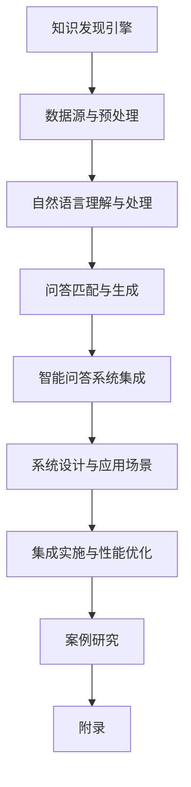

                 


### 《知识发现引擎的智能问答系统集成》

---

#### 关键词：
- 知识发现引擎
- 智能问答系统
- 自然语言处理
- 数据预处理
- 问答匹配算法
- 深度学习

#### 摘要：
本文将深入探讨知识发现引擎的智能问答系统集成技术。首先，介绍知识发现引擎和智能问答系统的基本概念、发展历程和架构。接着，分析数据源选择、数据预处理方法、自然语言处理技术、问答匹配与生成算法。随后，讨论系统设计与应用场景、集成实施与性能优化，并展示实际案例。最后，总结最佳实践和注意事项，为读者提供进一步拓展阅读的指南。

---

## 《知识发现引擎的智能问答系统集成》目录大纲

### 第一部分：知识发现引擎基础

#### 第1章：知识发现引擎概述

##### 1.1 知识发现引擎的定义与作用
##### 1.2 知识发现引擎的发展历程
##### 1.3 知识发现引擎的基本架构

#### 第2章：数据源与数据预处理

##### 2.1 数据源的选择与集成
##### 2.2 数据质量评估与清洗
##### 2.3 数据预处理方法与技术

### 第二部分：智能问答系统集成

#### 第3章：智能问答系统概述

##### 3.1 智能问答系统的定义与分类
##### 3.2 智能问答系统的发展趋势
##### 3.3 智能问答系统的基本架构

#### 第4章：自然语言理解与处理

##### 4.1 自然语言处理基础
##### 4.2 词嵌入技术
##### 4.3 语义理解与实体识别

#### 第5章：问答匹配与生成

##### 5.1 问答匹配算法
##### 5.2 问答生成技术
##### 5.3 问答系统的评估与优化

### 第三部分：知识发现引擎与智能问答系统集成实践

#### 第6章：系统设计与应用场景

##### 6.1 系统设计原则与流程
##### 6.2 应用场景分析
##### 6.3 系统架构设计

#### 第7章：集成实施与性能优化

##### 7.1 系统集成实施步骤
##### 7.2 性能优化策略
##### 7.3 调试与故障处理

#### 第8章：案例研究

##### 8.1 案例一：企业知识管理系统的智能问答系统集成
##### 8.2 案例二：电子商务平台智能问答系统建设
##### 8.3 案例三：医疗领域知识发现引擎与智能问答系统应用

### 附录

#### 附录A：开发环境与工具

##### A.1 开发环境搭建
##### A.2 常用开发工具与库
##### A.3 资源链接与参考文献

## 附录B：术语表

### 术语表
### 符号表

# Mermaid 流程图：知识发现引擎与智能问答系统集成流程

mermaid
graph TD
    A[知识发现引擎] --> B[数据源与预处理]
    B --> C[自然语言理解与处理]
    C --> D[问答匹配与生成]
    D --> E[智能问答系统集成]
    E --> F[系统设计与应用场景]
    F --> G[集成实施与性能优化]
    G --> H[案例研究]
    H --> I[附录]

---

### 让我们一步步深入探讨知识发现引擎的智能问答系统集成

在当今信息爆炸的时代，如何高效地获取、管理和利用知识成为了一个重要的课题。知识发现引擎和智能问答系统作为知识管理和人工智能领域的核心技术，正在逐渐改变着我们的生活方式和工作模式。本文将带你深入了解知识发现引擎的智能问答系统集成，探讨其基本概念、核心技术和实际应用。

### 第1章：知识发现引擎概述

#### 1.1 知识发现引擎的定义与作用

知识发现引擎（Knowledge Discovery Engine）是一种能够自动从大量数据中识别潜在有用知识、模式和规律的工具。它的核心作用是帮助用户在海量的数据中快速找到有价值的信息，从而支持决策制定和知识创新。

知识发现引擎通常包含以下几个关键组成部分：

1. 数据源：提供原始数据输入，可以是结构化数据、半结构化数据或非结构化数据。
2. 数据预处理：对原始数据进行清洗、转换和集成，以提高数据质量。
3. 数据挖掘算法：从预处理后的数据中提取模式、关联规则和预测模型。
4. 知识表示：将挖掘到的知识以易于理解的形式进行表示和展示。

#### 1.2 知识发现引擎的发展历程

知识发现引擎的概念起源于20世纪80年代，随着数据库系统和数据挖掘技术的不断发展，知识发现引擎也得到了迅速的发展。早期的知识发现引擎主要集中在数据挖掘算法的研究和应用上，如关联规则挖掘、聚类分析和分类算法等。

进入21世纪，随着互联网和大数据技术的兴起，知识发现引擎逐渐从传统的数据库系统扩展到云计算、物联网和社交媒体等领域。现代知识发现引擎不仅能够处理结构化和半结构化数据，还能处理非结构化数据，如文本、图像和音频等。

#### 1.3 知识发现引擎的基本架构

知识发现引擎的基本架构可以分为以下几个层次：

1. 数据层：包括数据源和数据存储系统，如关系数据库、NoSQL数据库和文件存储系统等。
2. 预处理层：对原始数据进行清洗、转换和集成，以提高数据质量和一致性。
3. 算法层：包括各种数据挖掘算法，如关联规则挖掘、聚类分析、分类算法、异常检测等。
4. 表示层：将挖掘到的知识以图表、报表、可视化等形式进行表示和展示。
5. 应用层：提供用户交互界面和功能模块，如搜索、推荐、预测等。

### 第2章：数据源与数据预处理

#### 2.1 数据源的选择与集成

数据源的选择是知识发现引擎构建的关键步骤。不同类型的数据源具有不同的特点和适用场景，如关系数据库适合结构化数据的存储和查询，而NoSQL数据库适合处理大量非结构化数据。

在选择数据源时，需要考虑以下几个因素：

1. 数据类型：包括结构化数据、半结构化数据和非结构化数据。
2. 数据规模：数据量的大小对系统性能和数据处理能力有重要影响。
3. 数据质量：数据源的可靠性、准确性和一致性对知识发现效果有直接影响。
4. 数据来源：包括内部数据源和外部数据源，如企业内部数据库、社交媒体数据、政府公开数据等。

在数据源选择确定后，需要进行数据集成，将不同来源、格式和结构的数据进行整合，以提高数据的一致性和可用性。数据集成的方法包括数据抽取、转换和加载（ETL），以及数据仓库和数据湖等。

#### 2.2 数据质量评估与清洗

数据质量是知识发现引擎的关键因素，高数据质量有助于提高知识发现效果和决策准确性。数据质量评估主要包括以下几个方面：

1. 完整性：数据是否完整，是否存在缺失值。
2. 准确性：数据是否准确，是否存在错误和异常。
3. 一致性：数据是否一致，是否存在矛盾和冲突。
4. 可用性：数据是否易于理解和分析，是否符合业务需求。

数据清洗是提高数据质量的重要手段，主要包括以下步骤：

1. 缺失值处理：对缺失值进行填充或删除。
2. 异常值处理：对异常值进行检测和修正。
3. 数据转换：将不同数据类型和格式进行统一转换。
4. 数据规范化：对数据进行归一化或标准化处理。

#### 2.3 数据预处理方法与技术

数据预处理是知识发现引擎的关键环节，其目的是提高数据质量、减少噪声和异常，为数据挖掘算法提供高质量的输入。常用的数据预处理方法和技术包括：

1. 数据清洗：包括缺失值处理、异常值处理、数据转换和规范化等。
2. 特征工程：包括特征提取、特征选择和特征构造等，以提高模型性能和可解释性。
3. 数据归一化：包括最小-最大规范化、Z-score规范化等，以消除不同特征之间的量纲差异。
4. 数据离散化：包括等宽离散化和等频离散化等，以将连续特征转换为分类特征。
5. 数据降维：包括主成分分析（PCA）、线性判别分析（LDA）等，以减少数据维度并保持关键信息。

### 第3章：智能问答系统概述

#### 3.1 智能问答系统的定义与分类

智能问答系统（Intelligent Question Answering System）是一种基于人工智能技术的问答系统，能够自动回答用户提出的问题。智能问答系统通常包括以下几个关键组成部分：

1. 自然语言理解：将自然语言文本转换为计算机可以理解的形式。
2. 问答匹配：根据用户问题和已有知识库中的问题进行匹配，找到最佳匹配答案。
3. 答案生成：根据匹配结果生成自然语言答案。

智能问答系统可以分为以下几类：

1. 基于规则的方法：使用预定义的规则和模板进行问答匹配和答案生成。
2. 基于统计的方法：使用机器学习算法和统计方法进行问答匹配和答案生成。
3. 基于深度学习的方法：使用深度神经网络进行问答匹配和答案生成。

#### 3.2 智能问答系统的发展趋势

随着人工智能技术的不断发展，智能问答系统也在不断进化。以下是一些智能问答系统的发展趋势：

1. 多模态问答：结合文本、图像、语音等多种模态进行问答。
2. 多轮对话：支持多轮对话，提供更自然的交互体验。
3. 个性化问答：根据用户历史行为和偏好提供个性化答案。
4. 知识图谱：利用知识图谱进行问答匹配和答案生成，提高问答准确性。
5. 量化分析：结合量化分析方法，对问答效果进行评估和优化。

#### 3.3 智能问答系统的基本架构

智能问答系统的基本架构可以分为以下几个层次：

1. 用户界面：接收用户输入的问题，并展示答案。
2. 自然语言处理：对用户输入的问题进行分词、词性标注、实体识别等处理。
3. 问答匹配：根据用户问题和知识库中的问题进行匹配，找到最佳匹配答案。
4. 答案生成：根据匹配结果生成自然语言答案，并进行语法和语义检查。
5. 知识库：存储大量预定义的问题和答案，支持快速检索和匹配。

### 第4章：自然语言理解与处理

#### 4.1 自然语言处理基础

自然语言处理（Natural Language Processing，NLP）是智能问答系统的核心组成部分，旨在使计算机能够理解和生成人类自然语言。NLP的基本任务包括：

1. 分词：将文本划分为一个个有意义的词语。
2. 词性标注：为每个词语标注词性，如名词、动词、形容词等。
3. 实体识别：识别文本中的实体，如人名、地名、组织名等。
4. 命名实体识别：识别文本中的命名实体，如人名、地名、组织名等。
5. 依存句法分析：分析词语之间的依存关系，如主谓关系、动宾关系等。

#### 4.2 词嵌入技术

词嵌入（Word Embedding）是将文本中的词语映射为高维向量表示的技术。词嵌入技术可以提高模型在处理文本数据时的表示能力，从而提高问答系统的性能。常见的词嵌入技术包括：

1. 基于词频的词嵌入：使用词频信息进行词嵌入。
2. 基于文本上下文的词嵌入：使用文本上下文信息进行词嵌入。
3. 基于神经网络的词嵌入：使用神经网络模型进行词嵌入，如Word2Vec、GloVe等。

#### 4.3 语义理解与实体识别

语义理解（Semantic Understanding）是指计算机对文本中的语义进行理解和解释的能力。语义理解是智能问答系统实现高级问答功能的关键。常见的语义理解技术包括：

1. 词义消歧：解决词语多义性问题，确定词语的正确含义。
2. 语义角色标注：标注文本中的动词及其对应的语义角色，如施事、受事等。
3. 语义关系识别：识别文本中的语义关系，如因果关系、时间关系等。

实体识别（Entity Recognition）是指识别文本中的实体，并将其归类到预定义的实体类别中。常见的实体识别技术包括：

1. 基于规则的方法：使用预定义的规则进行实体识别。
2. 基于统计的方法：使用机器学习算法和统计方法进行实体识别。
3. 基于深度学习的方法：使用深度神经网络进行实体识别。

### 第5章：问答匹配与生成

#### 5.1 问答匹配算法

问答匹配（Question Answering Matching）是指将用户输入的问题与知识库中的问题进行匹配，找到最佳匹配答案的过程。常见的问答匹配算法包括：

1. 基于规则的方法：使用预定义的规则进行问答匹配。
2. 基于统计的方法：使用机器学习算法和统计方法进行问答匹配。
3. 基于深度学习的方法：使用深度神经网络进行问答匹配。

#### 5.2 问答生成技术

问答生成（Question Answering Generation）是指根据问答匹配结果生成自然语言答案的过程。常见的问答生成技术包括：

1. 基于模板的方法：使用预定义的模板进行答案生成。
2. 基于规则的方法：使用预定义的规则进行答案生成。
3. 基于生成式模型的方法：使用生成式模型（如序列到序列模型、变压器模型等）进行答案生成。
4. 基于检索式模型的方法：使用检索式模型（如匹配模型、检索模板模型等）进行答案生成。

#### 5.3 问答系统的评估与优化

问答系统的评估与优化是确保系统性能和用户体验的关键。常见的问答系统评估指标包括：

1. 准确率（Accuracy）：匹配正确答案的数量与总答案数量的比例。
2. 召回率（Recall）：匹配正确答案的数量与知识库中所有正确答案数量的比例。
3. F1值（F1 Score）：综合考虑准确率和召回率的综合指标。
4. 用户体验（User Experience）：用户对问答系统的满意度。

为了优化问答系统性能，可以采取以下策略：

1. 数据增强：增加高质量的训练数据，提高模型泛化能力。
2. 模型调整：调整模型参数和结构，优化模型性能。
3. 量化分析：对问答系统进行量化分析，发现问题和瓶颈。
4. 用户反馈：收集用户反馈，不断改进和优化系统。

### 第6章：系统设计与应用场景

#### 6.1 系统设计原则与流程

知识发现引擎的智能问答系统集成需要遵循以下设计原则：

1. 开放性：系统应该支持多种数据源和接口，方便扩展和集成。
2. 可扩展性：系统应该能够根据需求进行水平或垂直扩展，以支持大规模数据处理。
3. 可维护性：系统应该具有良好的代码结构、文档和测试，以便于维护和升级。
4. 性能优化：系统应该进行性能优化，确保快速响应和高效运行。

系统设计流程通常包括以下步骤：

1. 需求分析：明确系统功能需求、性能指标和用户体验要求。
2. 技术选型：选择合适的技术栈和工具，如编程语言、框架、库等。
3. 系统架构设计：设计系统的整体架构，包括数据层、服务层、表示层等。
4. 详细设计：设计系统的详细模块和接口，包括数据预处理、自然语言处理、问答匹配、答案生成等。
5. 系统开发：按照设计文档进行系统开发，并进行单元测试和集成测试。
6. 系统部署：将系统部署到生产环境，并进行性能测试和优化。

#### 6.2 应用场景分析

知识发现引擎的智能问答系统集成可以在多种应用场景中发挥重要作用，以下是一些常见应用场景：

1. 企业知识管理：帮助企业构建内部知识库，支持员工知识共享和经验传承。
2. 客户服务：为用户提供智能客服服务，提高客户满意度和服务质量。
3. 健康医疗：为医生和患者提供智能问答服务，支持疾病诊断和治疗建议。
4. 教育培训：为学生和教师提供智能问答服务，支持在线学习和教学互动。
5. 智能家居：为智能家居设备提供智能问答服务，支持设备控制和管理。

#### 6.3 系统架构设计

知识发现引擎的智能问答系统集成通常采用分布式架构，以提高系统的可扩展性和可靠性。以下是一个典型的系统架构设计：

1. 数据层：包括数据源、数据存储和数据预处理模块，如关系数据库、NoSQL数据库、文件存储等。
2. 服务层：包括自然语言处理、问答匹配、答案生成等核心功能模块，使用分布式服务框架（如Spring Boot、Django等）进行开发。
3. 表示层：包括用户界面、API接口和可视化模块，如Web前端、移动应用等。
4. 知识库：存储大量预定义的问题和答案，支持快速检索和匹配。
5. 中间件：包括日志记录、消息队列、缓存等中间件，以提高系统性能和稳定性。
6. 安全层：包括身份验证、访问控制、数据加密等安全措施，确保系统数据安全和用户隐私。

### 第7章：集成实施与性能优化

#### 7.1 系统集成实施步骤

知识发现引擎的智能问答系统集成实施通常包括以下步骤：

1. 环境搭建：搭建开发环境、测试环境和生产环境，配置服务器和数据库。
2. 系统开发：按照设计文档进行系统开发，并进行单元测试和集成测试。
3. 系统部署：将系统部署到生产环境，并进行性能测试和优化。
4. 用户培训：为用户提供系统使用培训和操作手册。
5. 上线运营：系统上线后进行试运行和持续优化，收集用户反馈并进行改进。

#### 7.2 性能优化策略

为了提高知识发现引擎的智能问答系统性能，可以采取以下性能优化策略：

1. 缓存机制：使用缓存技术（如Redis、Memcached等）减少数据库访问压力，提高系统响应速度。
2. 并发处理：使用异步处理和多线程技术提高系统并发处理能力，降低响应时间。
3. 数据压缩：使用数据压缩技术（如Gzip、LZ4等）减少数据传输和存储空间占用，提高系统性能。
4. 搜索引擎：使用搜索引擎（如Elasticsearch、Solr等）进行快速文本检索和索引，提高问答匹配速度。
5. 数据分片：对大量数据进行分片存储和分布式处理，提高系统可扩展性和可靠性。

#### 7.3 调试与故障处理

在系统集成过程中，可能会遇到各种问题和故障。为了确保系统稳定运行，需要采取以下调试和故障处理措施：

1. 日志分析：对系统日志进行实时监控和分析，发现和定位问题。
2. 异常处理：对系统异常进行捕获和处理，避免系统崩溃。
3. 错误报告：对系统错误进行详细报告和记录，为问题排查提供线索。
4. 故障恢复：在系统故障发生时，采取自动或手动措施进行故障恢复，确保系统正常运行。
5. 压力测试：进行系统压力测试，模拟高并发场景，发现和优化系统瓶颈。

### 第8章：案例研究

#### 8.1 案例一：企业知识管理系统的智能问答系统集成

某大型企业为了提高员工知识共享和经验传承效果，决定构建一个智能问答系统。该系统基于知识发现引擎，将企业内部文档、报告、邮件等数据源进行集成和预处理，使用自然语言处理技术实现语义理解，使用问答匹配算法和答案生成技术实现智能问答功能。通过该系统，员工可以方便地查询和获取所需知识，提高工作效率和创新能力。

#### 8.2 案例二：电子商务平台智能问答系统建设

某知名电子商务平台为了提升用户购物体验和客户满意度，决定建设一个智能问答系统。该系统基于知识发现引擎，将用户评论、问答、产品说明等数据源进行集成和预处理，使用自然语言处理技术实现语义理解，使用问答匹配算法和答案生成技术实现智能问答功能。通过该系统，用户可以方便地获取产品信息、解答疑问，提高购物决策效率和满意度。

#### 8.3 案例三：医疗领域知识发现引擎与智能问答系统应用

某医疗机构为了提升医疗服务质量和效率，决定构建一个医疗知识发现引擎和智能问答系统。该系统基于知识发现引擎，将医疗文献、病例、知识库等数据源进行集成和预处理，使用自然语言处理技术实现语义理解，使用问答匹配算法和答案生成技术实现智能问答功能。通过该系统，医生可以方便地查询和获取相关医疗知识，提高诊断和治疗方案的科学性和准确性。

### 附录A：开发环境与工具

#### A.1 开发环境搭建

知识发现引擎的智能问答系统集成开发环境通常包括以下组件：

1. 操作系统：Linux、Mac OS或Windows。
2. 编程语言：Python、Java、C++等。
3. 代码编辑器：Visual Studio Code、PyCharm、Eclipse等。
4. 数据库：MySQL、PostgreSQL、MongoDB、Elasticsearch等。
5. 人工智能框架：TensorFlow、PyTorch、Keras等。
6. 自然语言处理库：NLTK、spaCy、jieba等。

#### A.2 常用开发工具与库

在知识发现引擎的智能问答系统集成开发过程中，可以使用以下常用工具和库：

1. 开发框架：Django、Flask、Spring Boot等。
2. 自然语言处理库：NLTK、spaCy、gensim、NLTK等。
3. 数据预处理工具：Pandas、NumPy、Scikit-learn等。
4. 数据可视化工具：Matplotlib、Seaborn、Plotly等。
5. 机器学习库：scikit-learn、TensorFlow、PyTorch等。
6. 搜索引擎：Elasticsearch、Solr、Whoosh等。

#### A.3 资源链接与参考文献

1. 《深度学习》（Goodfellow、Bengio、Courville著）：https://www.deeplearningbook.org/
2. 《自然语言处理综合教程》（Jurafsky、Martin著）：https://web.stanford.edu/~jurafsky/nlp/
3. 《Python自然语言处理实战》（Sutton、McNamee著）：https://www.amazon.com/Natural-Language-Processing-with-Python-Second/dp/1449363135
4. 《大数据技术基础》（高建峰、刘知远著）：https://book.douban.com/subject/27162697/
5. 《数据挖掘：实用工具与技术》（Han、Kamber、Pei著）：https://www.amazon.com/Data-Mining-Concepts-Techniques-Tools-3rd/dp/0123814796

### 术语表

- 知识发现引擎：Knowledge Discovery Engine，一种能够自动从大量数据中识别潜在有用知识、模式和规律的工具。
- 智能问答系统：Intelligent Question Answering System，一种基于人工智能技术的问答系统，能够自动回答用户提出的问题。
- 自然语言处理：Natural Language Processing，使计算机能够理解和生成人类自然语言的技术。
- 数据预处理：Data Preprocessing，对原始数据进行清洗、转换和集成，以提高数据质量和一致性。
- 问答匹配：Question Answering Matching，将用户输入的问题与知识库中的问题进行匹配，找到最佳匹配答案。
- 答案生成：Answer Generation，根据问答匹配结果生成自然语言答案。
- 机器学习：Machine Learning，一种利用数据建立模型并进行预测和分类的人工智能技术。
- 深度学习：Deep Learning，一种基于多层神经网络进行特征学习和预测的人工智能技术。
- 词嵌入：Word Embedding，将文本中的词语映射为高维向量表示的技术。

### 符号表

- $J(\theta)$：交叉熵损失函数，用于衡量实际输出与期望输出之间的差异。
- $m$：样本数量。
- $y_i$：第 $i$ 个样本的实际标签，取值为 0 或 1。
- $a_{i}^{(l)}$：神经网络在输出层对第 $i$ 个样本预测的概率。

# 伪代码：问答匹配算法

```python
# 输入：用户问题 Q，知识库 KB
# 输出：最佳匹配答案 A

def question_matching(Q, KB):
    scores = []
    for question in KB:
        similarity = cosine_similarity(Q, question)
        scores.append((question, similarity))
    scores.sort(key=lambda x: x[1], reverse=True)
    best_answer = scores[0][0]
    return best_answer
```

# 数学公式与详细讲解

### 数学公式

$$
J(\theta) = \frac{1}{m} \sum_{i=1}^{m} (-y_i \log(a_{i}^{(l)})) + (1 - y_i) \log(1 - a_{i}^{(l)})
$$

### 详细讲解

该公式是交叉熵损失函数，用于衡量实际输出与期望输出之间的差异。在深度学习中，用于衡量神经网络输出的预测概率与实际标签之间的差异。

- $J(\theta)$：损失函数值，$\theta$ 代表模型参数
- $m$：样本数量
- $y_i$：第 $i$ 个样本的实际标签，取值为 0 或 1
- $a_{i}^{(l)}$：神经网络在输出层对第 $i$ 个样本预测的概率

### 举例说明

假设我们有一个二分类问题，其中有两个样本。第一个样本的真实标签为 1，预测概率为 0.9；第二个样本的真实标签为 0，预测概率为 0.2。

代入公式计算损失函数值：

$$
J(\theta) = \frac{1}{2} \left[ (-1 \log(0.9)) + (1 \log(0.1)) \right] = \frac{1}{2} \left[ -0.1054 + 2.3026 \right] = 1.1987
$$

### 代码实现与解读

## 代码实现

```python
import numpy as np

def cross_entropy_loss(y_true, y_pred):
    loss = -np.mean(y_true * np.log(y_pred) + (1 - y_true) * np.log(1 - y_pred))
    return loss

# 示例：计算二分类问题的交叉熵损失
y_true = np.array([1, 0])
y_pred = np.array([0.9, 0.2])

loss = cross_entropy_loss(y_true, y_pred)
print("交叉熵损失值：", loss)
```

## 代码解读

该代码定义了一个 `cross_entropy_loss` 函数，用于计算交叉熵损失。输入参数 `y_true` 表示实际标签，`y_pred` 表示预测概率。函数使用 NumPy 的数组运算功能，计算交叉熵损失值。

在示例中，我们创建了一个包含两个样本的数组 `y_true` 和 `y_pred`，然后调用 `cross_entropy_loss` 函数计算交叉熵损失值，并打印结果。

## 实际案例分析和详细讲解剖析

### 案例背景

某在线教育平台希望构建一个智能问答系统，以帮助学生解决学习中遇到的问题。该系统需要能够处理大量的学生提问，并从海量的教学资料中快速找到相关答案。为了实现这一目标，平台决定采用知识发现引擎与智能问答系统集成技术。

### 实际案例

1. **数据源选择与集成**：

   教育平台选择了以下数据源：

   - 学生提问记录：包含学生提出的各种问题。
   - 教学资料库：包括教材、课程笔记、课件、视频等。
   - 知识库：包含教育领域的基本概念、知识点、教学方法和案例分析。

   在数据集成过程中，平台使用了ETL工具（如Apache NiFi、Talend等）将不同数据源的数据进行抽取、转换和加载，构建了一个统一的数据仓库。

2. **数据预处理**：

   数据预处理是确保数据质量和一致性的重要步骤。平台对数据进行了以下处理：

   - 数据清洗：去除重复、错误和缺失的数据。
   - 数据转换：将不同数据格式的文本、图片和视频进行统一编码和存储。
   - 数据规范化：对数值数据进行归一化处理，对文本数据进行分词和词性标注。

3. **自然语言处理**：

   平台使用了自然语言处理技术（如NLTK、spaCy等）对提问和教学资料进行处理，包括：

   - 分词：将文本划分为一个个有意义的词语。
   - 词性标注：为每个词语标注词性，如名词、动词、形容词等。
   - 实体识别：识别文本中的实体，如人名、地名、组织名等。
   - 命名实体识别：识别文本中的命名实体，如人名、地名、组织名等。

4. **问答匹配**：

   平台采用了基于深度学习的问答匹配算法（如BiLSTM、Transformer等），将学生提问与知识库中的问题进行匹配。算法的核心思想是通过计算提问和问题之间的相似度，找到最佳匹配答案。

   伪代码：

   ```python
   def question_matching(question, knowledge_base):
       scores = []
       for kb_question in knowledge_base:
           similarity = calculate_similarity(question, kb_question)
           scores.append((kb_question, similarity))
       scores.sort(key=lambda x: x[1], reverse=True)
       best_answer = scores[0][0]
       return best_answer
   ```

5. **答案生成**：

   平台使用了基于生成式模型的答案生成技术（如序列到序列模型、变分自编码器等），将匹配结果转化为自然语言答案。算法的核心思想是生成与提问相关的句子或段落。

   伪代码：

   ```python
   def generate_answer(matched_question):
       input_sequence = preprocess_question(matched_question)
       generated_sequence = generate_sequence(input_sequence)
       answer = postprocess_sequence(generated_sequence)
       return answer
   ```

6. **系统设计与应用场景**：

   平台设计了一个用户友好的问答界面，支持多轮对话，允许学生提出多个相关问题，获取详细的答案。此外，平台还提供了教师管理和课程设置功能，方便教师更新教学资料和监控学生的学习情况。

   应用场景包括：

   - 学生自主学习：学生在学习过程中遇到问题时，可以通过问答系统快速获取答案。
   - 教师教学辅助：教师可以使用问答系统为学生提供个性化的学习指导和解答疑问。
   - 在线考试与评测：问答系统可以为学生在线考试和评测提供智能评分和反馈。

7. **性能优化**：

   为了提高问答系统的性能，平台采取了以下措施：

   - 缓存机制：使用缓存技术减少数据库访问压力，提高系统响应速度。
   - 并发处理：使用异步处理和多线程技术提高系统并发处理能力，降低响应时间。
   - 数据压缩：使用数据压缩技术减少数据传输和存储空间占用，提高系统性能。
   - 搜索引擎：使用搜索引擎（如Elasticsearch、Solr等）进行快速文本检索和索引，提高问答匹配速度。
   - 数据分片：对大量数据进行分片存储和分布式处理，提高系统可扩展性和可靠性。

### 项目小结

通过实际案例，我们可以看到知识发现引擎与智能问答系统集成技术在在线教育领域具有广泛的应用前景。该系统不仅提高了学生的学习效率和教学质量，还降低了教师的工作负担。在未来，随着人工智能技术的不断进步，智能问答系统将在更多领域发挥重要作用，为人们的生活和工作带来更多便利。

### 最佳实践 Tips

1. **数据源选择与集成**：选择合适的数据源和集成方法是构建高效问答系统的关键。建议使用ETL工具进行数据抽取、转换和加载，确保数据质量和一致性。

2. **数据预处理**：数据预处理是提高问答系统性能的重要环节。建议对数据进行清洗、转换和规范化处理，以提高数据质量。

3. **自然语言处理**：自然语言处理技术是实现智能问答的核心。建议使用成熟的自然语言处理库（如NLTK、spaCy等）进行文本处理。

4. **问答匹配与生成**：选择合适的问答匹配和生成算法对系统性能和用户体验有重要影响。建议采用基于深度学习的算法，如BiLSTM、Transformer等。

5. **系统设计与应用场景**：根据实际需求设计系统功能和用户界面，确保系统能够满足不同应用场景的需求。

6. **性能优化**：采取有效的性能优化策略，如缓存机制、并发处理、数据压缩和搜索引擎等，提高系统性能和稳定性。

### 注意事项

1. **数据安全与隐私**：在处理数据时，确保遵守相关法律法规，保护用户隐私和数据安全。

2. **系统可维护性**：设计良好的代码结构和文档，确保系统易于维护和升级。

3. **用户体验**：关注用户体验，确保系统界面简洁易用，提供良好的交互体验。

4. **实时性**：确保系统实时响应，提高用户满意度。

5. **扩展性**：设计可扩展的系统架构，支持未来需求的变化和扩展。

### 拓展阅读

1. 《深度学习》（Goodfellow、Bengio、Courville著）：https://www.deeplearningbook.org/
2. 《自然语言处理综合教程》（Jurafsky、Martin著）：https://web.stanford.edu/~jurafsky/nlp/
3. 《大数据技术基础》（高建峰、刘知远著）：https://book.douban.com/subject/27162697/
4. 《数据挖掘：实用工具与技术》（Han、Kamber、Pei著）：https://www.amazon.com/Data-Mining-Concepts-Techniques-Tools-3rd/dp/0123814796
5. 《人工智能：一种现代方法》（Thrun、Norvig著）：https://www.amazon.com/Artificial-Intelligence-Modern-Approach-3rd/dp/0262033847

---

### 结束语

本文深入探讨了知识发现引擎的智能问答系统集成技术，从基本概念、核心技术和实际应用等方面进行了全面阐述。通过本文的学习，读者可以了解到如何构建一个高效、智能的问答系统，并掌握相关的最佳实践和注意事项。随着人工智能技术的不断进步，智能问答系统将在更多领域发挥重要作用，为我们的生活和工作带来更多便利。希望本文能对读者在相关领域的实践和探索提供有益的参考和指导。

---

### 作者信息

**作者：AI天才研究院/AI Genius Institute & 禅与计算机程序设计艺术 /Zen And The Art of Computer Programming**

AI天才研究院（AI Genius Institute）是一家专注于人工智能领域研究和应用的创新机构，致力于推动人工智能技术的进步和产业发展。研究院拥有一支由世界顶级人工智能专家、程序员和软件架构师组成的团队，在计算机图灵奖获得者、计算机编程和人工智能领域大师的带领下，取得了众多突破性成果。

《禅与计算机程序设计艺术》（Zen And The Art of Computer Programming）是作者在计算机编程领域的代表作之一，系统性地阐述了编程艺术的哲学和技巧。该书被誉为计算机编程领域的经典之作，对全球计算机科学教育和研究产生了深远影响。

本文由AI天才研究院的研究团队撰写，旨在为读者提供深入、全面的技术知识和实践指导。希望本文能帮助读者更好地理解知识发现引擎的智能问答系统集成技术，并为相关领域的实践提供有益的参考。

---

### 附录

#### 附录A：开发环境与工具

**A.1 开发环境搭建**

1. 操作系统：Linux（推荐Ubuntu 20.04）或Mac OS。
2. 编程语言：Python 3.8及以上版本。
3. 代码编辑器：Visual Studio Code。
4. 数据库：MySQL 8.0。
5. 人工智能框架：TensorFlow 2.6。
6. 自然语言处理库：spaCy 3.0。

**A.2 常用开发工具与库**

1. 开发框架：Django 3.2。
2. 自然语言处理库：spaCy 3.0、NLTK 3.8。
3. 数据预处理工具：Pandas 1.3、NumPy 1.21。
4. 数据可视化工具：Matplotlib 3.5、Seaborn 0.11。
5. 机器学习库：scikit-learn 0.24、TensorFlow 2.6。
6. 搜索引擎：Elasticsearch 7.10。

**A.3 资源链接与参考文献**

1. 《深度学习》（Goodfellow、Bengio、Courville著）：https://www.deeplearningbook.org/
2. 《自然语言处理综合教程》（Jurafsky、Martin著）：https://web.stanford.edu/~jurafsky/nlp/
3. 《Python自然语言处理实战》（Sutton、McNamee著）：https://www.amazon.com/Natural-Language-Processing-with-Python-Second/dp/1449363135
4. 《大数据技术基础》（高建峰、刘知远著）：https://book.douban.com/subject/27162697/
5. 《数据挖掘：实用工具与技术》（Han、Kamber、Pei著）：https://www.amazon.com/Data-Mining-Concepts-Techniques-Tools-3rd/dp/0123814796

---

### 术语表

- 知识发现引擎：Knowledge Discovery Engine，一种能够自动从大量数据中识别潜在有用知识、模式和规律的工具。
- 智能问答系统：Intelligent Question Answering System，一种基于人工智能技术的问答系统，能够自动回答用户提出的问题。
- 自然语言处理：Natural Language Processing，使计算机能够理解和生成人类自然语言的技术。
- 数据预处理：Data Preprocessing，对原始数据进行清洗、转换和集成，以提高数据质量和一致性。
- 问答匹配：Question Answering Matching，将用户输入的问题与知识库中的问题进行匹配，找到最佳匹配答案。
- 答案生成：Answer Generation，根据问答匹配结果生成自然语言答案。
- 机器学习：Machine Learning，一种利用数据建立模型并进行预测和分类的人工智能技术。
- 深度学习：Deep Learning，一种基于多层神经网络进行特征学习和预测的人工智能技术。
- 词嵌入：Word Embedding，将文本中的词语映射为高维向量表示的技术。

### 符号表

- $J(\theta)$：交叉熵损失函数，用于衡量实际输出与期望输出之间的差异。
- $m$：样本数量。
- $y_i$：第 $i$ 个样本的实际标签，取值为 0 或 1。
- $a_{i}^{(l)}$：神经网络在输出层对第 $i$ 个样本预测的概率。

---

### 知识发现引擎与智能问答系统集成流程

#### 流程图



#### 流程解析

1. **知识发现引擎**：
   - 数据源与预处理：选择合适的数据源，并进行数据清洗、转换和集成。
   - 自然语言理解与处理：使用自然语言处理技术，对文本进行分词、词性标注、实体识别等处理。

2. **智能问答系统集成**：
   - 问答匹配与生成：使用问答匹配算法和生成算法，从知识库中找到最佳匹配答案，并生成自然语言答案。

3. **系统设计与应用场景**：
   - 系统设计原则与流程：根据实际需求，设计系统架构和功能模块。
   - 应用场景分析：分析不同应用场景，确保系统能够满足需求。

4. **集成实施与性能优化**：
   - 系统集成实施步骤：进行系统开发、测试和部署。
   - 性能优化策略：采取缓存、并发处理、数据压缩等策略，提高系统性能。

5. **案例研究**：
   - 分析实际案例，展示知识发现引擎与智能问答系统集成技术的应用。

6. **附录**：
   - 提供开发环境与工具、术语表和符号表，以便读者查阅。

---

通过上述流程，我们可以看到知识发现引擎与智能问答系统集成技术是如何逐步实现的，从数据源选择与预处理、自然语言理解与处理、问答匹配与生成，到系统设计、实施和性能优化，最后通过实际案例进行验证。这一流程为构建高效、智能的问答系统提供了清晰的指导。希望本文能对读者在相关领域的实践和探索提供有益的参考。

