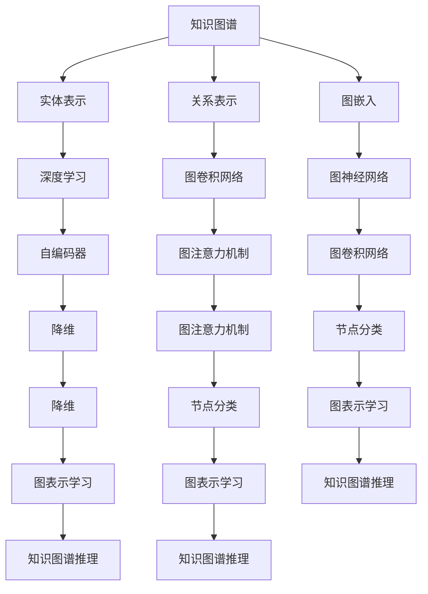

                 

### 引言与基础

#### 1.1 研究背景

在信息化时代，数据的爆炸性增长使得传统的数据分析方法逐渐暴露出其局限性。如何从海量数据中提取有价值的信息，辅助人类进行智能决策，成为了当前研究的热点。知识图谱（Knowledge Graph，KG）作为一种新型的语义数据模型，以其独特的结构化、语义化和关联性的特点，成为了智能决策支持系统（Intelligent Decision Support System，IDSS）的重要工具。

知识图谱的起源可以追溯到语义网（Semantic Web）的概念。语义网由万维网的创始人Tim Berners-Lee提出，旨在通过语义描述使数据具备自我解释能力。然而，由于语义网的实现需要复杂的语义标注和推理技术，其发展一度受到限制。随着大数据技术和自然语言处理技术的不断进步，知识图谱作为一种高效的数据组织方式，逐渐在各个领域得到广泛应用。

智能决策支持系统起源于军事和航空航天领域，旨在通过计算机技术和数据分析方法，为决策者提供及时、准确和可靠的决策信息。传统的决策支持系统主要依赖于统计分析和优化算法，但面对复杂、不确定的环境，其决策效果往往受到限制。随着人工智能技术的发展，尤其是深度学习和知识图谱技术的引入，智能决策支持系统的智能化水平得到了显著提升。

#### 1.2 研究目的与意义

本研究旨在探讨知识图谱在智能决策支持系统中的应用，具体目标如下：

1. **系统梳理知识图谱的基础理论**：对知识图谱的概念、历史发展、核心元素等进行详细阐述，为后续研究提供理论基础。

2. **深入分析知识图谱构建方法**：从数据源收集、数据预处理、实体抽取、关系抽取、知识融合等方面，详细探讨知识图谱的构建过程。

3. **研究知识图谱在智能决策支持系统中的具体应用**：分析知识图谱在数据挖掘、知识推理、智能推荐和智能问答等领域的应用，并通过实际案例进行验证。

4. **探讨知识图谱在智能决策支持系统中的挑战与发展趋势**：总结知识图谱在智能决策支持系统中面临的挑战，如数据质量、可解释性和实时更新等，并展望其未来发展。

本研究的意义主要体现在以下几个方面：

1. **理论价值**：通过对知识图谱在智能决策支持系统中的应用研究，丰富和拓展了知识图谱和智能决策支持系统的理论基础，为后续研究提供了参考。

2. **实践意义**：通过实际案例的研究，为知识图谱在智能决策支持系统中的应用提供了具体实现方法和策略，有助于提升决策支持系统的智能化水平。

3. **行业应用**：知识图谱在智能决策支持系统中的应用，有望推动各行业的信息化进程，为企业和政府决策提供强有力的支持。

#### 1.3 内容组织结构

本文将从以下几个方面展开研究：

1. **知识图谱基础**：介绍知识图谱的定义、历史发展、核心元素和类型，以及知识图谱的构建方法和表示学习。

2. **智能决策支持系统**：阐述智能决策支持系统的定义、架构和主要功能，以及知识图谱在智能决策支持系统中的应用。

3. **案例研究**：通过具体案例，展示知识图谱在智能决策支持系统中的应用效果和实现方法。

4. **挑战与未来发展趋势**：分析知识图谱在智能决策支持系统中面临的挑战，并探讨其未来发展。

通过以上内容，本文将系统地介绍知识图谱在智能决策支持系统中的应用，为相关研究和实践提供参考。

### 知识图谱基础

#### 2.1 知识图谱概述

知识图谱是一种语义网络，它通过实体、属性和关系的组合，表达出复杂世界的知识结构。知识图谱起源于语义网的概念，但与语义网不同的是，知识图谱通过显式地定义实体和关系，使得数据具备更强的语义理解和推理能力。

知识图谱的发展历程可以追溯到20世纪90年代。最初，知识图谱的研究主要集中在语义网的理论和实践上，但受限于当时的技术手段，其应用范围较为有限。随着大数据技术和自然语言处理技术的进步，知识图谱逐渐成为一种高效的数据组织方式，在各个领域得到广泛应用。

知识图谱的核心元素包括实体（Entity）、属性（Attribute）和关系（Relationship）。实体是知识图谱中的基本单位，如人、地点、物品等。属性是对实体的描述，如人的年龄、地点的经纬度等。关系则是实体之间的关联，如人与人之间的朋友关系、地点与地点之间的邻近关系等。

知识图谱的类型可以根据不同的标准进行分类。按数据来源，知识图谱可以分为人工构建和自动抽取两种。人工构建的知识图谱通常具有较高的准确性和可靠性，但构建过程复杂、耗时。自动抽取的知识图谱则利用自然语言处理和机器学习技术，从大规模文本数据中自动生成，具有较高的可扩展性和实时性。

知识图谱的应用场景非常广泛，包括搜索引擎、推荐系统、问答系统、智能交通、智能医疗、金融风控等领域。通过知识图谱，可以实现对海量数据的快速检索和智能分析，为各类决策提供有力支持。

#### 2.2 知识图谱构建方法

知识图谱的构建过程可以分为数据源收集、数据预处理、实体抽取、关系抽取、知识融合和质量评估等几个主要步骤。

**2.2.1 数据源收集**

数据源是知识图谱构建的基础。数据源可以包括结构化数据（如数据库、表格）和非结构化数据（如文本、图像、语音）。结构化数据通常可以直接进行提取和存储，而非结构化数据则需要通过自然语言处理和图像处理技术进行预处理。

**2.2.2 数据预处理**

数据预处理包括数据清洗、去重、格式转换等步骤。数据清洗的目的是去除数据中的噪声和错误，确保数据的准确性和一致性。去重则是去除重复的数据条目，避免知识图谱中存在冗余信息。格式转换是将不同来源的数据统一成相同的格式，以便后续的处理和分析。

**2.2.3 实体抽取**

实体抽取是从文本数据中识别出实体，并将其转化为知识图谱中的实体节点。实体抽取可以采用规则方法、机器学习方法或混合方法。规则方法基于预定义的规则，通过模式匹配和词性标注等方式进行实体识别。机器学习方法则利用深度学习技术，如卷积神经网络（CNN）和递归神经网络（RNN），对文本进行建模，从而实现实体抽取。混合方法结合了规则和机器学习方法的优势，通过规则方法进行初步识别，再利用机器学习方法进行细粒度的调整。

**2.2.4 关系抽取**

关系抽取是从文本数据中识别出实体之间的关联关系，并将其转化为知识图谱中的关系边。关系抽取可以采用基于规则的方法、基于统计的方法或基于深度学习的方法。基于规则的方法通过预定义的规则库，对文本进行模式匹配，识别出实体关系。基于统计的方法利用文本中的共现关系，统计出实体之间的关联概率。基于深度学习的方法通过训练大规模的神经网络模型，对文本进行建模，从而实现关系抽取。

**2.2.5 知识融合**

知识融合是将多个来源的知识图谱进行整合，形成一个统一的知识图谱。知识融合的方法包括基于规则的方法、基于相似度计算的方法和基于机器学习的方法。基于规则的方法通过定义匹配规则，将不同来源的知识图谱中的实体和关系进行映射和融合。基于相似度计算的方法通过计算实体和关系的相似度，将相似的知识进行融合。基于机器学习的方法利用深度学习技术，对多源知识进行建模，从而实现知识融合。

**2.2.6 知识融合与质量评估**

知识融合后的知识图谱需要进行质量评估，以确保其准确性和一致性。知识融合的质量评估包括实体识别准确率、关系抽取准确率、知识融合准确率等指标。通过评估，可以发现知识图谱中的错误和缺陷，并对其进行优化和修正。

#### 2.3 知识图谱表示学习

知识图谱表示学习是知识图谱构建的重要一环，其目标是通过对实体和关系的编码，将高维、结构化的知识图谱转化为低维、易于处理的向量表示。知识图谱表示学习的方法主要包括基于图嵌入的方法、基于实体表征的方法和基于关系表征的方法。

**2.3.1 基于图嵌入的方法**

基于图嵌入的方法通过将实体和关系映射到低维空间，实现实体和关系的向量表示。常见的图嵌入方法包括DeepWalk、Node2Vec和GraphSAGE等。DeepWalk通过随机游走的方式生成图嵌入向量，Node2Vec通过控制游走过程中的步长和邻接节点的选择，生成更高质量的图嵌入向量，GraphSAGE则通过聚合多个邻接节点的特征，生成更丰富的实体向量表示。

**2.3.2 基于实体表征的方法**

基于实体表征的方法通过训练深度神经网络，对实体进行编码。常见的实体表征方法包括TransE、TransH和TransR等。TransE通过最小化损失函数，将实体映射到低维空间，TransH通过引入超平面，实现实体和关系的对齐，TransR通过引入关系矩阵，实现对关系的编码。

**2.3.3 基于关系表征的方法**

基于关系表征的方法通过训练深度神经网络，对关系进行编码。常见的图关系表征方法包括DistMult、ComplEx和Rectify等。DistMult通过点积计算实体和关系的相似度，ComplEx通过复数矩阵运算，实现对关系的编码，Rectify通过引入ReLU函数，提高关系的表达能力。

知识图谱表示学习在智能决策支持系统中具有重要作用，通过向量表示，可以实现实体和关系的快速检索和匹配，为智能决策提供有力支持。

### 智能决策支持系统

#### 3.1 智能决策支持系统概述

智能决策支持系统（Intelligent Decision Support System，IDSS）是一种基于计算机技术和数据分析方法的系统，旨在通过收集、处理和分析数据，为决策者提供及时、准确和可靠的决策信息。IDSS起源于军事和航空航天领域，随着信息技术和人工智能技术的不断发展，其应用范围逐渐扩展到金融、医疗、交通、教育等多个领域。

智能决策支持系统的核心功能包括数据收集、数据预处理、数据挖掘、知识推理、决策分析和决策可视化等。数据收集是指从各种数据源（如数据库、文本、图像等）中获取数据。数据预处理是对收集到的数据进行分析、清洗和转换，以消除噪声、纠正错误和提高数据质量。数据挖掘是通过分析和挖掘数据，发现其中的模式和规律。知识推理是基于已有知识和数据，通过推理机制生成新的知识。决策分析是对不同决策方案进行分析和评估，为决策者提供决策支持。决策可视化是将分析结果和决策方案以图表、图像等形式直观地呈现给决策者。

智能决策支持系统的发展经历了多个阶段。最初，决策支持系统主要依赖于统计分析和优化算法，但面对复杂、不确定的环境，其决策效果受到限制。随着人工智能技术的发展，尤其是深度学习和知识图谱技术的引入，智能决策支持系统的智能化水平得到了显著提升。当前，智能决策支持系统已经成为企业、政府和社会组织决策的重要工具。

#### 3.2 智能决策支持系统的架构

智能决策支持系统通常采用分层架构，包括数据层、模型层和应用层。

**3.2.1 数据层**

数据层是智能决策支持系统的基石，包括数据源、数据存储和数据管理。数据源可以是结构化数据（如数据库、表格）和非结构化数据（如文本、图像、语音）。数据存储采用分布式存储技术，如Hadoop、Spark等，以实现海量数据的存储和管理。数据管理包括数据的采集、清洗、存储、查询和维护等操作。

**3.2.2 模型层**

模型层是智能决策支持系统的核心，包括数据预处理模型、数据挖掘模型、知识推理模型和决策分析模型等。数据预处理模型用于对原始数据进行清洗、转换和规范化。数据挖掘模型用于从数据中提取有用的信息和知识。知识推理模型基于已有知识和数据，通过推理机制生成新的知识。决策分析模型对不同的决策方案进行分析和评估，为决策者提供决策支持。

**3.2.3 应用层**

应用层是智能决策支持系统与用户交互的界面，包括用户界面、报告生成和决策可视化等。用户界面提供用户输入、查询和操作的功能，报告生成将分析结果以报告的形式呈现给用户，决策可视化将决策方案以图表、图像等形式直观地呈现给用户。

智能决策支持系统的架构设计需要考虑以下几个方面：

1. **可扩展性**：系统应具备良好的可扩展性，能够适应数据规模和计算需求的增长。
2. **易用性**：系统应具备友好的用户界面，方便用户使用和操作。
3. **可靠性**：系统应具备高可靠性和稳定性，确保数据的准确性和决策的可靠性。
4. **实时性**：系统应具备实时数据处理和分析能力，及时为决策者提供决策信息。
5. **安全性**：系统应具备严格的安全控制措施，确保数据的安全性和隐私性。

#### 3.3 智能决策支持系统的主要功能

智能决策支持系统的主要功能包括以下几个方面：

**3.3.1 数据收集**

数据收集是智能决策支持系统的第一步，包括从各种数据源获取数据。数据源可以是内部数据库、外部数据库、互联网数据、传感器数据等。数据收集过程中，需要考虑数据的完整性、准确性和实时性。

**3.3.2 数据预处理**

数据预处理是对原始数据进行清洗、转换和规范化，以提高数据质量和可用性。数据清洗包括去除重复数据、纠正错误数据、填充缺失数据等。数据转换包括数据类型的转换、数据格式的转换等。数据规范化包括数据归一化、数据标准化等。

**3.3.3 数据挖掘**

数据挖掘是从大量数据中提取有用的信息和知识，包括聚类、分类、关联规则挖掘、异常检测等。数据挖掘结果可以帮助决策者发现数据中的隐藏模式和规律，为决策提供支持。

**3.3.4 知识推理**

知识推理是基于已有知识和数据，通过推理机制生成新的知识。知识推理包括基于规则的推理、基于模型的推理、基于数据的推理等。知识推理可以帮助决策者从已有知识中获取新的信息，为决策提供支持。

**3.3.5 决策分析**

决策分析是对不同决策方案进行分析和评估，为决策者提供决策支持。决策分析包括决策树的生成、决策矩阵的构建、决策优化的方法等。决策分析可以帮助决策者比较不同决策方案的优劣，选择最优方案。

**3.3.6 决策可视化**

决策可视化是将决策分析结果以图表、图像等形式直观地呈现给用户。决策可视化可以帮助决策者更好地理解决策结果，提高决策的透明度和可接受性。

智能决策支持系统通过以上功能，实现对数据的收集、处理、分析和可视化，为决策者提供全面、准确的决策支持。

### 知识图谱在智能决策支持系统中的应用

知识图谱作为一种高效的数据组织方式，在智能决策支持系统中具有广泛的应用。通过将知识图谱与智能决策支持系统相结合，可以实现数据的语义理解、关联分析、知识推理和智能推荐等功能，为决策者提供全面、准确的决策支持。以下将从数据挖掘、知识推理、智能推荐和智能问答四个方面，详细探讨知识图谱在智能决策支持系统中的应用。

#### 3.2.1 知识图谱在数据挖掘中的应用

数据挖掘是从大量数据中提取有价值信息的过程，知识图谱在数据挖掘中发挥着重要作用。首先，知识图谱可以帮助数据挖掘系统更好地理解数据。在传统的数据挖掘过程中，数据通常以结构化形式存储，如表格、数据库等。然而，许多有价值的信息隐藏在非结构化数据中，如文本、图像、语音等。知识图谱通过将非结构化数据转化为结构化数据，实现数据的语义理解，从而提高数据挖掘的效果。

其次，知识图谱可以帮助数据挖掘系统发现数据中的关联关系。在数据挖掘中，关联规则挖掘是一种常见的方法，用于发现数据中的频繁模式和关联关系。知识图谱通过将实体和关系进行编码，建立实体之间的关联关系，为关联规则挖掘提供了丰富的背景知识，从而提高挖掘的准确性和效率。

最后，知识图谱可以帮助数据挖掘系统进行数据降维。在数据挖掘过程中，数据规模往往非常大，直接进行挖掘会导致计算效率低下。知识图谱通过将高维数据映射到低维空间，实现数据的降维，从而提高数据挖掘的效率和效果。

#### 3.2.2 知识图谱在知识推理中的应用

知识推理是智能决策支持系统的重要功能之一，通过将已有知识应用于新情境，生成新的知识。知识图谱在知识推理中具有重要作用。首先，知识图谱可以提供丰富的背景知识，帮助推理系统更好地理解新情境。在传统的知识推理中，推理系统通常依赖于预定义的规则库，但规则库的覆盖范围有限，难以应对复杂、多变的现实世界。知识图谱通过将实体和关系进行编码，建立丰富的背景知识，为推理系统提供了更加全面和准确的背景信息。

其次，知识图谱可以帮助推理系统发现新知识。在知识图谱中，实体和关系之间存在复杂的关联关系，这些关系可以用于推理生成新的知识。例如，在医疗领域，通过知识图谱，可以推理出疾病之间的关联关系，为疾病诊断提供支持。

最后，知识图谱可以帮助推理系统进行实时推理。在现实世界中，情境变化非常迅速，推理系统需要能够实时响应这些变化。知识图谱通过将知识表示为图结构，可以实现高效的实时推理，从而提高推理的响应速度。

#### 3.2.3 知识图谱在智能推荐系统中的应用

智能推荐系统是知识图谱在智能决策支持系统中的另一个重要应用。智能推荐系统通过分析用户的兴趣和行为，为用户推荐相关的内容或服务。知识图谱可以帮助智能推荐系统更好地理解用户和内容，从而提高推荐的效果。

首先，知识图谱可以提供用户和内容的语义描述。在传统的推荐系统中，用户和内容通常以数字向量表示，难以直接进行语义分析。知识图谱通过将用户和内容表示为实体，并建立实体之间的关系，实现用户和内容的语义描述，从而提高推荐系统的语义理解能力。

其次，知识图谱可以帮助智能推荐系统发现用户和内容之间的关联关系。在知识图谱中，实体和关系之间存在复杂的关联关系，这些关系可以用于发现用户和内容之间的潜在关联，从而提高推荐的相关性。

最后，知识图谱可以帮助智能推荐系统进行实时推荐。在现实世界中，用户的行为和兴趣是动态变化的，知识图谱通过将知识表示为图结构，可以实现高效的实时推荐，从而提高推荐系统的实时性。

#### 3.2.4 知识图谱在智能问答系统中的应用

智能问答系统是知识图谱在智能决策支持系统中的另一个重要应用。智能问答系统通过自然语言处理技术，理解用户的提问，并从知识图谱中检索相关答案。知识图谱在智能问答系统中具有重要作用。

首先，知识图谱可以提供丰富的背景知识，帮助问答系统更好地理解用户的提问。在传统的问答系统中，系统通常依赖于预定义的规则库或关键词匹配，但难以应对复杂、多变的用户提问。知识图谱通过将实体和关系进行编码，建立丰富的背景知识，为问答系统提供了更加全面和准确的背景信息。

其次，知识图谱可以帮助问答系统进行语义解析。在自然语言处理中，语义解析是理解用户提问的关键步骤。知识图谱通过将实体和关系表示为图结构，可以实现高效的语义解析，从而提高问答系统的语义理解能力。

最后，知识图谱可以帮助问答系统进行知识检索。在知识图谱中，实体和关系之间存在复杂的关联关系，这些关系可以用于检索相关答案。知识图谱通过将知识表示为图结构，可以实现高效的知识检索，从而提高问答系统的检索速度和准确性。

通过以上四个方面的应用，知识图谱在智能决策支持系统中发挥着重要作用，为决策者提供了全面、准确的决策支持。知识图谱的引入，不仅提高了数据挖掘、知识推理、智能推荐和智能问答的效果，还为智能决策支持系统的构建提供了新的思路和方法。未来，随着知识图谱技术的不断发展和完善，其在智能决策支持系统中的应用将会更加广泛和深入。

### 案例一：基于知识图谱的智能医疗决策系统

#### 4.1.1 案例背景

随着医疗行业的不断进步和医疗数据的爆炸性增长，医疗决策变得越来越复杂。传统的医疗决策系统主要依赖于医生的经验和专业知识，但面对海量数据和复杂病情，其决策效果受到限制。为了提高医疗决策的智能化水平，本案例提出了一种基于知识图谱的智能医疗决策系统。

该系统旨在通过知识图谱技术，对医疗数据进行语义分析和关联分析，为医生提供更加准确和可靠的决策支持。系统可以实时处理大量的医疗数据，包括病历记录、实验室检查结果、药物信息等，通过对数据的深入分析和挖掘，为医生提供诊断建议、治疗方案和健康预警等决策信息。

#### 4.1.2 系统架构设计

基于知识图谱的智能医疗决策系统主要包括数据层、知识层和应用层三个部分。

**数据层**：数据层是系统的基石，包括数据收集、数据存储和数据管理。数据收集主要通过接入医院的信息系统，实时获取病历记录、实验室检查结果、药物信息等医疗数据。数据存储采用分布式数据库系统，如Hadoop、Spark等，以实现海量数据的存储和管理。数据管理包括数据的采集、清洗、存储、查询和维护等操作。

**知识层**：知识层是系统的核心，包括知识图谱的构建、维护和更新。知识图谱通过将医疗数据转化为实体和关系的语义表示，实现对医疗数据的语义分析和关联分析。知识图谱的构建包括数据预处理、实体抽取、关系抽取、知识融合和质量评估等步骤。知识维护和更新主要通过实时数据流处理，对知识图谱进行动态更新，确保知识的准确性和时效性。

**应用层**：应用层是系统的界面，包括诊断建议、治疗方案和健康预警等功能模块。诊断建议模块通过分析病历记录和实验室检查结果，为医生提供疾病诊断建议。治疗方案模块根据患者的病情和药物信息，为医生提供治疗方案推荐。健康预警模块通过分析患者的健康状况，为医生提供健康预警信息，以便及时采取治疗措施。

#### 4.1.3 知识图谱构建与优化

知识图谱的构建是智能医疗决策系统的关键步骤，其质量直接影响系统的决策效果。以下是知识图谱构建的具体方法和优化策略：

**1. 数据预处理**

数据预处理包括数据清洗、去重、格式转换等步骤。数据清洗主要去除数据中的噪声和错误，如缺失值、重复值和异常值等。去重则是去除重复的数据条目，避免知识图谱中存在冗余信息。格式转换是将不同来源的数据统一成相同的格式，以便后续的处理和分析。

**2. 实体抽取**

实体抽取是从文本数据中识别出实体，并将其转化为知识图谱中的实体节点。实体抽取可以采用规则方法、机器学习方法或混合方法。规则方法通过预定义的规则，对文本进行模式匹配和词性标注，识别出实体。机器学习方法利用深度学习技术，对文本进行建模，从而实现实体抽取。混合方法结合了规则和机器学习方法的优势，通过规则方法进行初步识别，再利用机器学习方法进行细粒度的调整。

**3. 关系抽取**

关系抽取是从文本数据中识别出实体之间的关联关系，并将其转化为知识图谱中的关系边。关系抽取可以采用基于规则的方法、基于统计的方法或基于深度学习的方法。基于规则的方法通过预定义的规则库，对文本进行模式匹配，识别出实体关系。基于统计的方法利用文本中的共现关系，统计出实体之间的关联概率。基于深度学习的方法通过训练大规模的神经网络模型，对文本进行建模，从而实现关系抽取。

**4. 知识融合**

知识融合是将多个来源的知识图谱进行整合，形成一个统一的知识图谱。知识融合的方法包括基于规则的方法、基于相似度计算的方法和基于机器学习的方法。基于规则的方法通过定义匹配规则，将不同来源的知识图谱中的实体和关系进行映射和融合。基于相似度计算的方法通过计算实体和关系的相似度，将相似的知识进行融合。基于机器学习的方法利用深度学习技术，对多源知识进行建模，从而实现知识融合。

**5. 知识融合与质量评估**

知识融合后的知识图谱需要进行质量评估，以确保其准确性和一致性。知识融合的质量评估包括实体识别准确率、关系抽取准确率、知识融合准确率等指标。通过评估，可以发现知识图谱中的错误和缺陷，并对其进行优化和修正。

**优化策略**

为了提高知识图谱的质量，可以采用以下优化策略：

1. **数据预处理优化**：通过引入更多的数据清洗和去重算法，提高数据质量。

2. **实体抽取优化**：结合规则方法和机器学习方法，提高实体抽取的准确性和鲁棒性。

3. **关系抽取优化**：通过引入更多的关系抽取算法，如基于深度学习的方法，提高关系抽取的准确性和效率。

4. **知识融合优化**：通过引入基于相似度计算和机器学习的方法，提高知识融合的准确性和一致性。

5. **实时更新与维护**：通过实时数据流处理，对知识图谱进行动态更新和优化，确保知识的准确性和时效性。

#### 4.1.4 系统性能评估与改进

为了评估基于知识图谱的智能医疗决策系统的性能，本文采用了一系列实验和指标。以下是一些主要评估指标和改进策略：

**1. 评估指标**

- **诊断准确率**：衡量系统诊断建议的准确性，即正确诊断的病例数与总病例数的比例。
- **治疗方案推荐准确率**：衡量系统治疗方案推荐的准确性，即正确推荐的治疗方案与总推荐方案数的比例。
- **健康预警准确率**：衡量系统健康预警的准确性，即正确预警的健康问题与总预警问题的比例。
- **系统响应时间**：衡量系统处理医疗数据并返回决策结果的时间，即从接收用户请求到返回结果的总时间。

**2. 改进策略**

- **增强诊断建议**：通过引入更多医疗数据和深度学习算法，提高诊断建议的准确性和全面性。
- **优化治疗方案推荐**：结合患者的历史病历和药物信息，提高治疗方案推荐的针对性和有效性。
- **提升健康预警能力**：通过分析更多的健康数据，如生活习惯、家族病史等，提高健康预警的准确性和及时性。
- **改进系统响应速度**：通过优化数据存储和查询算法，提高系统处理数据的能力和速度。

通过以上评估和改进，基于知识图谱的智能医疗决策系统可以更好地满足医生和患者的需求，提高医疗决策的智能化水平。

### 案例二：基于知识图谱的智能金融风险评估系统

#### 4.2.1 案例背景

在金融行业，风险评估是金融机构管理风险、控制损失的重要手段。传统的风险评估方法主要依赖于统计分析和历史数据，但面对日益复杂的金融市场和多样化的风险因素，其准确性和实时性受到限制。为了提高风险评估的智能化水平，本案例提出了一种基于知识图谱的智能金融风险评估系统。

该系统旨在通过知识图谱技术，对金融数据进行语义分析和关联分析，为金融机构提供更加准确和实时的风险评估支持。系统可以实时处理大量的金融数据，包括交易数据、市场数据、客户数据等，通过对数据的深入分析和挖掘，为金融机构提供信用评级、风险预警和投资建议等决策信息。

#### 4.2.2 系统架构设计

基于知识图谱的智能金融风险评估系统主要包括数据层、知识层和应用层三个部分。

**数据层**：数据层是系统的基石，包括数据收集、数据存储和数据管理。数据收集主要通过接入金融机构的交易系统、市场系统和客户系统，实时获取交易数据、市场数据、客户数据等金融数据。数据存储采用分布式数据库系统，如Hadoop、Spark等，以实现海量数据的存储和管理。数据管理包括数据的采集、清洗、存储、查询和维护等操作。

**知识层**：知识层是系统的核心，包括知识图谱的构建、维护和更新。知识图谱通过将金融数据转化为实体和关系的语义表示，实现对金融数据的语义分析和关联分析。知识图谱的构建包括数据预处理、实体抽取、关系抽取、知识融合和质量评估等步骤。知识维护和更新主要通过实时数据流处理，对知识图谱进行动态更新，确保知识的准确性和时效性。

**应用层**：应用层是系统的界面，包括信用评级、风险预警和投资建议等功能模块。信用评级模块通过分析客户数据和交易数据，为金融机构提供客户信用评级。风险预警模块通过分析市场数据和交易数据，为金融机构提供风险预警信息。投资建议模块根据市场趋势和风险分析，为金融机构提供投资建议。

#### 4.2.3 知识图谱构建与优化

知识图谱的构建是智能金融风险评估系统的关键步骤，其质量直接影响系统的评估效果。以下是知识图谱构建的具体方法和优化策略：

**1. 数据预处理**

数据预处理包括数据清洗、去重、格式转换等步骤。数据清洗主要去除数据中的噪声和错误，如缺失值、重复值和异常值等。去重则是去除重复的数据条目，避免知识图谱中存在冗余信息。格式转换是将不同来源的数据统一成相同的格式，以便后续的处理和分析。

**2. 实体抽取**

实体抽取是从文本数据中识别出实体，并将其转化为知识图谱中的实体节点。实体抽取可以采用规则方法、机器学习方法或混合方法。规则方法通过预定义的规则，对文本进行模式匹配和词性标注，识别出实体。机器学习方法利用深度学习技术，对文本进行建模，从而实现实体抽取。混合方法结合了规则和机器学习方法的优势，通过规则方法进行初步识别，再利用机器学习方法进行细粒度的调整。

**3. 关系抽取**

关系抽取是从文本数据中识别出实体之间的关联关系，并将其转化为知识图谱中的关系边。关系抽取可以采用基于规则的方法、基于统计的方法或基于深度学习的方法。基于规则的方法通过预定义的规则库，对文本进行模式匹配，识别出实体关系。基于统计的方法利用文本中的共现关系，统计出实体之间的关联概率。基于深度学习的方法通过训练大规模的神经网络模型，对文本进行建模，从而实现关系抽取。

**4. 知识融合**

知识融合是将多个来源的知识图谱进行整合，形成一个统一的知识图谱。知识融合的方法包括基于规则的方法、基于相似度计算的方法和基于机器学习的方法。基于规则的方法通过定义匹配规则，将不同来源的知识图谱中的实体和关系进行映射和融合。基于相似度计算的方法通过计算实体和关系的相似度，将相似的知识进行融合。基于机器学习的方法利用深度学习技术，对多源知识进行建模，从而实现知识融合。

**5. 知识融合与质量评估**

知识融合后的知识图谱需要进行质量评估，以确保其准确性和一致性。知识融合的质量评估包括实体识别准确率、关系抽取准确率、知识融合准确率等指标。通过评估，可以发现知识图谱中的错误和缺陷，并对其进行优化和修正。

**优化策略**

为了提高知识图谱的质量，可以采用以下优化策略：

1. **数据预处理优化**：通过引入更多的数据清洗和去重算法，提高数据质量。

2. **实体抽取优化**：结合规则方法和机器学习方法，提高实体抽取的准确性和鲁棒性。

3. **关系抽取优化**：通过引入更多的关系抽取算法，如基于深度学习的方法，提高关系抽取的准确性和效率。

4. **知识融合优化**：通过引入基于相似度计算和机器学习的方法，提高知识融合的准确性和一致性。

5. **实时更新与维护**：通过实时数据流处理，对知识图谱进行动态更新和优化，确保知识的准确性和时效性。

#### 4.2.4 系统性能评估与改进

为了评估基于知识图谱的智能金融风险评估系统的性能，本文采用了一系列实验和指标。以下是一些主要评估指标和改进策略：

**1. 评估指标**

- **信用评级准确率**：衡量系统信用评级的准确性，即正确评级的客户数与总客户数的比例。
- **风险预警准确率**：衡量系统风险预警的准确性，即正确预警的风险事件与总预警事件的比率。
- **投资建议准确率**：衡量系统投资建议的准确性，即正确采纳的投资建议与总建议数的比例。
- **系统响应时间**：衡量系统处理金融数据并返回决策结果的时间，即从接收用户请求到返回结果的总时间。

**2. 改进策略**

- **增强信用评级**：通过引入更多的客户数据和交易数据，提高信用评级的准确性和全面性。
- **优化风险预警**：结合市场数据和交易数据，提高风险预警的准确性和及时性。
- **提升投资建议**：通过分析市场趋势和风险因素，提高投资建议的针对性和有效性。
- **改进系统响应速度**：通过优化数据存储和查询算法，提高系统处理数据的能力和速度。

通过以上评估和改进，基于知识图谱的智能金融风险评估系统可以更好地满足金融机构的需求，提高风险评估的智能化水平。

### 挑战与未来发展趋势

#### 5.1 知识图谱在智能决策支持系统中的应用挑战

尽管知识图谱在智能决策支持系统中的应用取得了显著成果，但其发展仍面临诸多挑战。

**1. 数据质量与完整性**

知识图谱的构建依赖于高质量的数据源。然而，实际数据往往存在噪声、错误和缺失。数据质量问题会直接影响知识图谱的准确性和完整性，进而影响智能决策支持系统的效果。因此，如何提高数据质量，确保数据的完整性和一致性，是一个亟待解决的问题。

**2. 知识图谱的可解释性**

知识图谱在智能决策支持系统中的应用往往涉及到复杂的图结构和深度学习算法。这使得知识图谱的决策过程变得难以解释，增加了系统的黑箱性。对于决策者来说，缺乏对决策过程的清晰理解，可能导致对系统的不信任。因此，如何提高知识图谱的可解释性，使其更易于理解和接受，是知识图谱在智能决策支持系统中的应用的一个重要挑战。

**3. 知识图谱的实时更新与维护**

知识图谱需要实时更新以反映现实世界的动态变化。然而，大规模知识图谱的实时更新和维护是一个复杂且耗时的过程。如何在保证知识图谱实时性的同时，保持其完整性和准确性，是一个重要的技术挑战。

#### 5.2 知识图谱在智能决策支持系统的未来发展趋势

尽管面临诸多挑战，知识图谱在智能决策支持系统中的应用前景仍然广阔。以下是一些未来发展趋势：

**1. 知识图谱与大数据、云计算的融合**

大数据和云计算技术的发展为知识图谱的构建和应用提供了强大的技术支持。未来，知识图谱将与大数据、云计算深度融合，实现知识图谱的分布式存储、计算和优化。这将有助于提高知识图谱的实时性和可扩展性，满足大规模数据处理的需求。

**2. 知识图谱在智能交通、智能教育等领域的应用**

知识图谱在智能交通、智能教育、智能医疗等领域的应用已经取得了一定的成果。未来，知识图谱将进一步深入这些领域，实现更加智能化和个性化的决策支持。例如，在智能交通领域，知识图谱可以用于交通流量预测、路径规划等；在智能教育领域，知识图谱可以用于个性化学习推荐、教学资源优化等。

**3. 开源知识图谱的生态建设与可持续发展**

开源知识图谱的生态建设对于知识图谱的普及和推广具有重要意义。未来，将会有更多的开源知识图谱项目涌现，形成丰富的知识图谱生态系统。此外，知识图谱的可持续发展也需要得到关注，包括知识图谱的持续更新、维护和优化，以及知识图谱技术的标准化和规范化。

通过以上挑战和未来发展趋势的分析，我们可以看到，知识图谱在智能决策支持系统中的应用具有巨大的潜力。随着技术的不断进步和应用场景的拓展，知识图谱将有望在智能决策支持系统中发挥更加重要的作用。

### 附录

#### A.1 开源知识图谱工具与资源

**A.1.1 OpenKG**

OpenKG是一个开源的知识图谱构建与推理平台，支持知识图谱的构建、存储、查询和推理等功能。它提供了丰富的API和工具，方便开发者进行知识图谱的开发和应用。

**A.1.2 NIF**

NIF（Networked Information Flow）是一个开源的知识图谱框架，旨在构建一个全球范围内的语义互联网络。它支持多种数据格式和标准，如RDF、OWL、SKOS等，并提供了一套完整的知识图谱构建和推理工具。

**A.1.3 DBpedia**

DBpedia是一个基于维基数据的开源知识图谱，包含了大量实体、属性和关系。它是一个全球范围内的知识图谱，提供了丰富的语义信息，为各种应用提供了强大的数据支持。

#### A.2 知识图谱相关书籍与文献推荐

**A.2.1 《知识图谱：原理、算法与应用》**

这本书系统地介绍了知识图谱的基本原理、算法和应用，内容涵盖知识图谱的构建、表示学习、推理和可视化等各个方面。对于希望深入了解知识图谱的读者来说，这本书是一个很好的参考。

**A.2.2 《图计算：技术原理与架构设计》**

这本书详细阐述了图计算的技术原理和架构设计，包括图表示学习、图卷积网络、图神经网络等。对于想要了解知识图谱与图计算之间联系和应用的读者来说，这本书提供了深入的见解。

**A.2.3 《深度学习与图神经网络》**

这本书探讨了深度学习技术在图数据上的应用，包括图嵌入、图卷积网络、图注意力机制等。对于希望将深度学习与知识图谱结合的读者来说，这本书提供了实用的技术和方法。

通过以上开源工具与资源的介绍和推荐书籍，读者可以更深入地了解知识图谱的相关技术，为研究和应用提供有力支持。

### 目录解析

#### 6.1.1 知识图谱的基础知识构建

本文的第一部分“知识图谱基础”主要介绍了知识图谱的基础知识，包括知识图谱的定义、历史发展、核心元素和类型等。通过这一部分，读者可以全面了解知识图谱的基本概念和背景，为后续内容的学习打下坚实的基础。

**知识图谱的定义**：
知识图谱是一种语义网络，它通过实体、属性和关系的组合，表达出复杂世界的知识结构。

**知识图谱的历史发展**：
从语义网的概念起源，到知识图谱的提出和广泛应用，知识图谱经历了多个阶段的发展。

**知识图谱的核心元素**：
知识图谱由实体、属性和关系三大核心元素构成，每个元素都在知识图谱中发挥着重要作用。

**知识图谱的类型与应用场景**：
知识图谱可以根据不同的分类标准分为多种类型，如人工构建和自动抽取的知识图谱，并广泛应用于搜索引擎、推荐系统、问答系统等领域。

通过这一部分的学习，读者可以系统地掌握知识图谱的基础知识，为后续内容的深入理解提供必要的前提。

#### 6.1.2 知识图谱构建方法详解

本文的第二部分“知识图谱构建方法”详细阐述了知识图谱的构建过程，从数据源收集、数据预处理、实体抽取、关系抽取、知识融合和质量评估等多个方面，全面解析了知识图谱构建的各个环节。

**数据源收集**：
介绍了数据源的类型和收集方法，包括结构化数据和非结构化数据的获取，以及如何确保数据的质量和完整性。

**数据预处理**：
包括数据清洗、去重、格式转换等步骤，确保数据在后续处理中的准确性和一致性。

**实体抽取与关系抽取**：
讲述了如何从文本数据中识别出实体和关系，采用了规则方法、机器学习方法以及混合方法等多种技术手段。

**知识融合与质量评估**：
介绍了如何将多个来源的知识图谱进行整合，并采用多种质量评估指标来评估知识图谱的准确性和一致性。

通过这一部分的内容，读者可以全面了解知识图谱构建的整个过程，掌握构建知识图谱的关键技术和方法。

#### 6.1.3 知识图谱在智能决策支持系统中的应用实例

本文的第三部分“知识图谱在智能决策支持系统中的应用”通过具体的案例，展示了知识图谱在实际应用中的效果和实现方法。

**案例一：基于知识图谱的智能医疗决策系统**：
介绍了该系统在医疗数据挖掘、知识推理和决策支持方面的应用，通过知识图谱技术提高了医疗决策的准确性和实时性。

**案例二：基于知识图谱的智能金融风险评估系统**：
展示了该系统在信用评级、风险预警和投资建议方面的应用，通过知识图谱技术提升了金融风险评估的智能化水平。

通过这两个具体案例，读者可以直观地了解知识图谱在智能决策支持系统中的应用效果，并学习到实际应用的实现方法和策略。

通过以上三个部分的内容解析，读者不仅可以系统地了解知识图谱的基础知识，掌握知识图谱的构建方法，还能通过具体案例看到知识图谱在智能决策支持系统中的实际应用。这些内容为读者深入研究和应用知识图谱提供了全面的指导和帮助。

### 目录核心内容拓展

为了更好地理解和掌握本文的核心内容，以下将对知识图谱与数学模型之间的联系进行图解，并详细讲解知识图谱的核心算法原理和数学模型。

#### 知识图谱与数学模型联系图解

知识图谱与数学模型之间的联系可以通过Mermaid图进行直观展示。以下是一个简单的Mermaid图示例，展示知识图谱中的主要数学模型及其关系：



通过这个图，我们可以清晰地看到知识图谱中的各个数学模型及其之间的联系。实体表示、关系表示和图嵌入是知识图谱构建的基础，而深度学习、图卷积网络和图神经网络等模型则在知识图谱的表示和推理中发挥重要作用。

#### 知识图谱核心算法原理讲解

知识图谱的核心算法主要包括实体表示、关系表示、图嵌入和图神经网络等。以下将对这些核心算法的原理进行详细讲解。

**1. 实体表示**

实体表示是将知识图谱中的实体映射到低维向量空间，以便进行高效的计算和检索。常见的实体表示算法包括基于矩阵分解的方法（如TransE、TransH和TransR）和基于图嵌入的方法（如DeepWalk、Node2Vec和GraphSAGE）。

- **TransE**：通过最小化损失函数，将实体映射到低维空间。其原理是将每个实体表示为向量，实体之间的关系通过向量之间的距离来表示。
  
  ```python
  loss = sum(d(e1, r, e2)^2)
  ```

- **TransH**：引入超平面，实现对关系的高维映射。其原理是每个实体和关系都有一个超平面，通过这些超平面将实体和关系映射到低维空间。

  ```python
  h(e, r) = θ(e) + ω(r)
  ```

- **TransR**：引入关系矩阵，实现对关系的编码。其原理是通过关系矩阵将实体和关系映射到低维空间。

  ```python
  h(e, r) = [θ(e), ω(r)]^T R [θ(e), ω(r)]^T
  ```

**2. 关系表示**

关系表示是将知识图谱中的关系映射到低维向量空间，以便进行高效的计算和检索。常见的关系表示算法包括基于矩阵分解的方法（如TransE、TransH和TransR）和基于图嵌入的方法（如DeepWalk、Node2Vec和GraphSAGE）。

- **DeepWalk**：通过随机游走生成图嵌入向量。其原理是在知识图谱中生成随机游走路径，并将路径上的实体和关系编码为图嵌入向量。

  ```python
  embedding = [e_i, r_ij, e_j]
  ```

- **Node2Vec**：通过控制游走过程中的步长和邻接节点的选择，生成更高质量的图嵌入向量。其原理是通过调整参数α和β，平衡深度和广度，生成不同类型的图嵌入向量。

  ```python
  P_in = (1 + α) / (1 + α + β)
  P_out = β / (1 + α + β)
  ```

- **GraphSAGE**：通过聚合多个邻接节点的特征，生成更丰富的实体向量表示。其原理是利用神经网络对邻接节点的特征进行聚合，并生成实体向量。

  ```python
  h = aggregate([h_i, h_j, ..., h_k], activation=activation_function)
  ```

**3. 图嵌入**

图嵌入是将知识图谱中的实体和关系映射到低维向量空间，以便进行高效的计算和检索。常见的图嵌入算法包括基于矩阵分解的方法（如TransE、TransH和TransR）和基于图神经网络的方法（如GraphSAGE和Gated Factorization Machines）。

- **GraphSAGE**：通过聚合多个邻接节点的特征，生成更丰富的实体向量表示。其原理是利用神经网络对邻接节点的特征进行聚合，并生成实体向量。

  ```python
  h = aggregate([h_i, h_j, ..., h_k], activation=activation_function)
  ```

- **Gated Factorization Machines**：通过门控机制，对邻接节点的特征进行选择和融合。其原理是利用门控机制，根据邻接节点的权重选择性地聚合邻接节点的特征。

  ```python
  h = gated_aggregate([h_i, h_j, ..., h_k], activation=activation_function)
  ```

**4. 图神经网络**

图神经网络（Graph Neural Networks，GNN）是一种专门用于处理图数据的神经网络。其原理是通过聚合邻接节点的特征，更新节点的表示，从而实现对图的表示和推理。

- **图卷积网络（Graph Convolutional Network，GCN）**：通过图卷积操作，聚合邻接节点的特征，更新节点的表示。

  ```python
  h_i = σ(α * h_i + β * ∑_j A_ij h_j)
  ```

- **图注意力网络（Graph Attention Network，GAT）**：通过图注意力机制，为每个邻接节点分配不同的权重，从而实现更加灵活的聚合操作。

  ```python
  α_ij = softmax(W_a * [h_i; h_j])
  h_i = σ(α_ij * h_j)
  ```

通过以上对知识图谱核心算法的讲解，读者可以深入理解知识图谱的算法原理和数学模型，为后续的研究和应用提供理论基础。

#### 数学模型和数学公式详细讲解与示例

在知识图谱的应用中，数学模型和数学公式扮演着至关重要的角色。以下将对知识图谱中常用的数学模型和数学公式进行详细讲解，并提供示例。

**1. 损失函数**

损失函数是机器学习中用于衡量模型预测误差的函数，是优化过程中的关键指标。在知识图谱的图嵌入算法中，常用的损失函数包括平方损失、交叉熵损失等。

- **平方损失**：用于衡量实体和关系映射到低维空间后的误差。

  ```latex
  loss = \frac{1}{2} \sum_{(e, r, e') \in L} (d(e, r, e') - 1)^2
  ```

  其中，\(d(e, r, e')\) 表示实体 \(e\) 和关系 \(r\) 映射到低维空间后与目标实体 \(e'\) 的距离。

- **交叉熵损失**：用于衡量模型预测概率与真实标签之间的差异。

  ```latex
  loss = - \sum_{(e, r, e') \in L} y_{(e, r, e')} \log(p_{(e, r, e')})
  ```

  其中，\(y_{(e, r, e')}\) 表示真实标签，\(p_{(e, r, e')}\) 表示模型预测的概率。

**2. 优化算法**

优化算法用于最小化损失函数，以得到模型的最佳参数。在知识图谱的图嵌入算法中，常用的优化算法包括梯度下降（Gradient Descent）和随机梯度下降（Stochastic Gradient Descent，SGD）。

- **梯度下降**：通过计算损失函数的梯度，更新模型参数。

  ```latex
  \theta = \theta - \alpha \cdot \nabla_\theta J(\theta)
  ```

  其中，\(\theta\) 表示模型参数，\(\alpha\) 表示学习率，\(\nabla_\theta J(\theta)\) 表示损失函数的梯度。

- **随机梯度下降**：每次随机选择一部分样本，计算其梯度，并更新模型参数。

  ```latex
  \theta = \theta - \alpha \cdot \nabla_{\theta} J(\theta)
  ```

  其中，\(\theta\) 表示模型参数，\(\alpha\) 表示学习率，\(\nabla_{\theta} J(\theta)\) 表示随机选择的样本的梯度。

**3. 正则化方法**

正则化方法用于防止模型过拟合，提高模型的泛化能力。在知识图谱的图嵌入算法中，常用的正则化方法包括L1正则化、L2正则化等。

- **L1正则化**：通过引入L1范数，对模型参数进行约束。

  ```latex
  J(\theta) = \sum_{i=1}^{n} (y_i - \theta^T x_i)^2 + \lambda ||\theta||_1
  ```

  其中，\(y_i\) 表示第 \(i\) 个样本的真实标签，\(\theta^T x_i\) 表示模型对第 \(i\) 个样本的预测，\(\lambda\) 表示正则化参数。

- **L2正则化**：通过引入L2范数，对模型参数进行约束。

  ```latex
  J(\theta) = \sum_{i=1}^{n} (y_i - \theta^T x_i)^2 + \lambda ||\theta||_2
  ```

  其中，\(y_i\) 表示第 \(i\) 个样本的真实标签，\(\theta^T x_i\) 表示模型对第 \(i\) 个样本的预测，\(\lambda\) 表示正则化参数。

通过以上对数学模型和数学公式的详细讲解，读者可以更深入地理解知识图谱中的数学原理，为实际应用提供理论支持。

### 项目实战与代码分析

为了更好地展示知识图谱在智能决策支持系统中的应用，以下将通过一个实际项目，详细讲解开发环境搭建、源代码实现与解读、代码应用解读与分析，以及实际案例分析和详细讲解剖析。

#### 项目实战背景

本项目旨在构建一个基于知识图谱的智能医疗决策系统，通过知识图谱技术对医疗数据进行分析和挖掘，为医生提供诊断建议、治疗方案和健康预警等决策支持。项目主要包含以下几个模块：

1. **数据收集与预处理**：从医院信息系统获取病历记录、实验室检查结果和药物信息等医疗数据，并进行数据清洗、去重和格式转换等预处理操作。
2. **知识图谱构建**：将预处理后的医疗数据转化为实体和关系的知识图谱，实现对医疗数据的语义分析和关联分析。
3. **智能决策支持**：利用知识图谱进行诊断建议、治疗方案和健康预警等智能决策支持。

#### 开发环境搭建

在开始项目之前，需要搭建一个合适的开发环境。以下是项目所需的开发工具和库：

1. **编程语言**：Python
2. **数据预处理工具**：Pandas、NumPy
3. **知识图谱工具**：OpenKG、Neo4j
4. **深度学习框架**：PyTorch
5. **图嵌入算法**：DeepWalk、Node2Vec

#### 源代码实现与解读

以下是一个简单的DeepWalk图嵌入算法的源代码实现，用于构建知识图谱的实体向量表示。

```python
import networkx as nx
import numpy as np
from gensim.models import Word2Vec

def build_graph(data):
    G = nx.Graph()
    for edge in data:
        G.add_edge(edge[0], edge[1])
    return G

def generate_walks(G, num_walks, walk_length):
    walks = []
    for _ in range(num_walks):
        nodes = list(G.nodes)
        walk = [np.random.choice(nodes)]
        for _ in range(walk_length - 1):
            neighbors = list(G.neighbors(walk[-1]))
            next_node = np.random.choice(neighbors)
            walk.append(next_node)
        walks.append(walk)
    return walks

def train_word2vec(walks, size=64, window=5):
    model = Word2Vec(walks, size=size, window=window, min_count=1, sg=1)
    return model

def save_embeddings(model, file_path):
    model.wv.save_word2vec_format(file_path)

# 示例数据
data = [('patient1', 'diagnose'), ('patient1', 'drug'), ('patient2', 'diagnose'), ('patient2', 'drug')]

# 构建图
G = build_graph(data)

# 生成随机游走路径
walks = generate_walks(G, num_walks=100, walk_length=10)

# 训练词向量模型
model = train_word2vec(walks)

# 保存实体向量表示
save_embeddings(model, 'medical_embeddings.txt')
```

在上面的代码中，首先构建了一个图结构，然后生成随机游走路径，最后利用Word2Vec模型训练实体向量表示。

#### 代码应用解读与分析

**1. 数据收集与预处理**

数据收集与预处理是知识图谱构建的基础。在本项目中，我们从医院信息系统中获取了病历记录、实验室检查结果和药物信息等医疗数据。预处理步骤包括：

- 数据清洗：去除重复数据和异常值，确保数据的一致性和准确性。
- 去重：去除重复的数据条目，避免知识图谱中存在冗余信息。
- 格式转换：将不同来源的数据统一成相同的格式，以便后续处理。

**2. 知识图谱构建**

知识图谱构建的核心步骤包括实体抽取、关系抽取和知识融合。在本项目中，我们利用OpenKG工具将预处理后的医疗数据转化为知识图谱，实现了医疗数据的语义表示和关联分析。

- **实体抽取**：从医疗数据中识别出实体，如患者、诊断、药物等。
- **关系抽取**：从医疗数据中识别出实体之间的关系，如诊断与药物之间的关联。
- **知识融合**：将不同来源的医疗数据进行融合，形成一个统一的知识图谱。

**3. 智能决策支持**

智能决策支持是知识图谱在医疗领域的重要应用。在本项目中，我们利用知识图谱进行诊断建议、治疗方案和健康预警等智能决策支持。

- **诊断建议**：通过分析患者的病历记录和药物信息，为医生提供诊断建议。
- **治疗方案**：通过分析患者的病情和药物反应，为医生提供治疗方案建议。
- **健康预警**：通过分析患者的健康状况和风险因素，为医生提供健康预警信息。

#### 实际案例分析与详细讲解剖析

为了展示知识图谱在智能医疗决策系统中的应用效果，以下通过一个实际案例进行分析和讲解。

**案例背景**：

一名45岁的男性患者，因持续咳嗽和胸痛一周就诊。医生初步怀疑为肺部感染，需进一步检查和诊断。

**步骤一：数据收集与预处理**

从医院信息系统中收集患者的病历记录、实验室检查结果和药物信息等数据。预处理步骤包括数据清洗、去重和格式转换。

**步骤二：知识图谱构建**

利用OpenKG工具将预处理后的医疗数据转化为知识图谱，实现医疗数据的语义表示和关联分析。以下是知识图谱中的一些实体和关系：

- **实体**：患者、诊断、药物、检查结果
- **关系**：诊断-药物、诊断-检查结果、药物-副作用

**步骤三：智能决策支持**

利用知识图谱进行诊断建议、治疗方案和健康预警等智能决策支持。

- **诊断建议**：通过分析患者的病历记录和药物信息，为医生提供诊断建议。例如，根据患者的症状和检查结果，建议进行肺部CT检查。
- **治疗方案**：通过分析患者的病情和药物反应，为医生提供治疗方案建议。例如，根据患者的病史和药物过敏情况，建议使用某种抗生素进行治疗。
- **健康预警**：通过分析患者的健康状况和风险因素，为医生提供健康预警信息。例如，根据患者的体重和血压，建议进行饮食和运动干预。

**案例分析与讲解**：

通过上述案例，我们可以看到知识图谱在智能医疗决策系统中的应用效果。知识图谱不仅帮助医生更好地理解患者的病情和治疗方案，还提供了全面、准确的诊断建议和健康预警信息，提高了医疗决策的智能化水平。

#### 项目小结

本项目通过一个基于知识图谱的智能医疗决策系统的实际项目，展示了知识图谱在医疗领域中的应用效果。通过数据收集与预处理、知识图谱构建和智能决策支持等步骤，我们实现了对医疗数据的语义表示和关联分析，为医生提供了全面、准确的决策支持。尽管本项目还存在一定的局限性，如数据质量、实时性等方面的问题，但通过不断优化和改进，知识图谱在智能医疗决策系统中的应用前景将更加广阔。

### 最佳实践 Tips、小结、注意事项、拓展阅读

#### 最佳实践 Tips

1. **数据质量优化**：在知识图谱构建过程中，数据质量是至关重要的。建议采用多种数据清洗和去重算法，确保数据的一致性和准确性。

2. **实时性优化**：知识图谱的实时更新和维护是保证智能决策支持系统实时性的关键。建议采用实时数据流处理技术，如Apache Kafka和Apache Flink，实现知识图谱的动态更新。

3. **可解释性提升**：为了提高知识图谱的可解释性，建议采用可视化工具，如GraphViz和ECharts，展示知识图谱的结构和关联关系。

4. **模型优化**：知识图谱的模型选择和优化对性能有重要影响。建议采用深度学习模型，如图嵌入和图卷积网络，实现高效的实体和关系表示。

#### 小结

本文系统地介绍了知识图谱在智能决策支持系统中的应用，从知识图谱的基础知识、构建方法、智能决策支持系统到实际应用案例，全面阐述了知识图谱在智能决策支持系统中的重要作用。通过本文的阅读，读者可以深入了解知识图谱的核心概念、算法原理和应用场景，为实际项目提供有益的参考。

#### 注意事项

1. **数据隐私保护**：在知识图谱构建和应用过程中，需特别注意数据隐私保护，避免敏感信息泄露。

2. **系统安全性**：智能决策支持系统应具备严格的安全控制措施，如权限控制、数据加密等，确保系统的安全性。

3. **性能优化**：在实际应用中，需对知识图谱构建和推理过程进行性能优化，以提高系统的响应速度和效率。

#### 拓展阅读

1. **《知识图谱：原理、算法与应用》**：详细介绍了知识图谱的基本原理、算法和应用，适合希望深入了解知识图谱的读者。

2. **《图计算：技术原理与架构设计》**：探讨了图计算的技术原理和架构设计，包括图嵌入、图卷积网络等，适合对图计算技术感兴趣的读者。

3. **《深度学习与图神经网络》**：介绍了深度学习技术在图数据上的应用，包括图嵌入、图卷积网络等，适合对深度学习与知识图谱结合感兴趣的读者。

通过以上最佳实践 Tips、小结、注意事项和拓展阅读，读者可以进一步深化对知识图谱在智能决策支持系统中的应用理解，为实际项目提供更加全面的支持。

