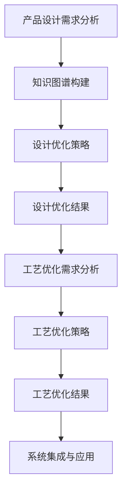
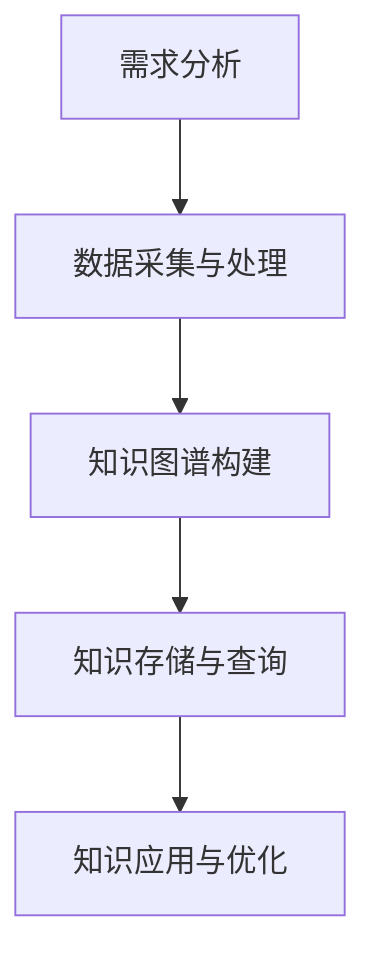
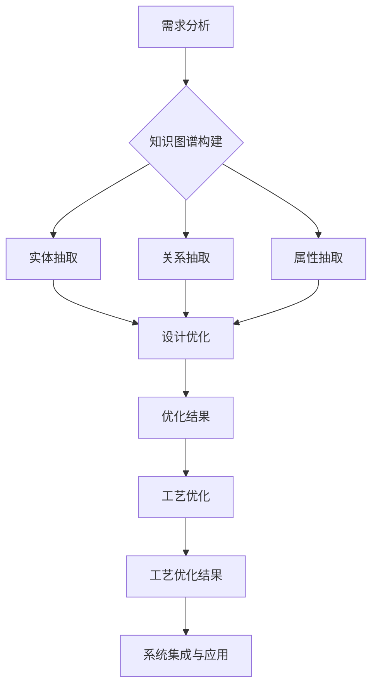

                 

### 文章标题

《知识图谱在智能制造产品设计与工艺优化中的技术实现与应用》

### 关键词

知识图谱、智能制造、产品设计与工艺优化、技术实现、应用案例

### 摘要

本文旨在探讨知识图谱在智能制造产品设计与工艺优化中的应用。首先，介绍了知识图谱的基本概念和智能制造的背景与发展历程，阐述了知识图谱在智能制造中的关键作用。接着，深入分析了知识图谱在产品设计与工艺优化中的重要性，并详细讨论了知识图谱的构建技术、存储与查询策略。随后，本文重点介绍了知识图谱在产品设计与工艺优化中的应用实例，包括技术实现与案例分析。最后，文章展望了知识图谱在智能制造产品设计与工艺优化中的未来发展趋势，并提出了相应的挑战与应对策略。

### 《知识图谱在智能制造产品设计与工艺优化中的技术实现与应用》目录大纲

## 第一部分：背景与概述

### 第1章：知识图谱在智能制造中的应用背景

#### 1.1 智能制造的概念与发展历程

#### 1.2 知识图谱的基本概念与核心要素

#### 1.3 知识图谱在智能制造中的关键作用

### 第2章：知识图谱在产品设计与工艺优化中的重要性

#### 2.1 产品设计与工艺优化的挑战

#### 2.2 知识图谱如何提升产品设计与工艺优化效率

#### 2.3 知识图谱在智能制造中的应用案例

## 第二部分：知识图谱构建技术

### 第3章：知识图谱构建基础

#### 3.1 知识图谱的表示方法

#### 3.2 知识图谱的数据源

#### 3.3 知识图谱的抽取与融合

### 第4章：知识图谱构建工具与应用

#### 4.1 常用知识图谱构建工具介绍

#### 4.2 知识图谱构建流程

#### 4.3 知识图谱构建实例分析

### 第5章：知识图谱的存储与查询

#### 5.1 知识图谱的存储方案

#### 5.2 知识图谱的查询语言

#### 5.3 知识图谱查询优化策略

## 第三部分：知识图谱在产品设计与工艺优化中的应用

### 第6章：知识图谱在产品设计中的应用

#### 6.1 知识图谱支持下的产品设计流程

#### 6.2 知识图谱在产品设计优化中的应用

#### 6.3 设计案例分析与实现

### 第7章：知识图谱在工艺优化中的应用

#### 7.1 工艺优化的挑战与需求

#### 7.2 知识图谱在工艺优化中的应用

#### 7.3 工艺优化案例分析与实现

### 第8章：知识图谱在智能制造系统集成中的应用

#### 8.1 智能制造系统集成概述

#### 8.2 知识图谱在系统集成中的作用

#### 8.3 集成案例分析与实现

## 第四部分：技术实现与案例分析

### 第9章：知识图谱在智能制造中的技术实现

#### 9.1 技术架构设计与实现

#### 9.2 关键技术详解

#### 9.3 技术实现流程

### 第10章：知识图谱在智能制造产品设计与工艺优化中的应用案例

#### 10.1 案例一：某航空制造企业产品设计优化

#### 10.2 案例二：某电子制造企业工艺优化

#### 10.3 案例三：某汽车制造企业系统集成应用

### 第11章：知识图谱在智能制造产品设计与工艺优化中的未来发展趋势

#### 11.1 技术发展趋势分析

#### 11.2 应用前景展望

#### 11.3 未来挑战与应对策略

## 附录

### 附录A：常用工具与资源

#### A.1 知识图谱构建工具

#### A.2 智能制造相关数据库

#### A.3 知识图谱学习资源推荐

### 附录B：技术实现伪代码示例

#### B.1 知识图谱构建伪代码示例

#### B.2 产品设计优化算法伪代码示例

#### B.3 工艺优化算法伪代码示例

### 附录C：参考文献

#### C.1 相关书籍推荐

#### C.2 学术论文推荐

#### C.3 网络资源推荐

### 产品设计与工艺优化流程图



## 第一部分：背景与概述

### 第1章：知识图谱在智能制造中的应用背景

#### 1.1 智能制造的概念与发展历程

智能制造作为工业4.0的核心技术之一，近年来在全球范围内得到了广泛关注。智能制造是指通过信息物理系统（Cyber-Physical Systems, CPS）将计算能力、通信能力和物理系统相结合，实现智能化制造的过程。它旨在通过数据驱动、智能决策和自主控制，实现生产过程的优化和自动化。

智能制造的发展历程可以分为三个阶段：

1. **自动化阶段**：20世纪60年代至80年代，主要实现生产线的自动化，通过使用PLC（可编程逻辑控制器）和机器人等设备，提高生产效率和降低人工成本。
2. **集成阶段**：20世纪90年代至21世纪初，实现了生产设备和信息系统之间的集成，通过ERP（企业资源规划）和MES（制造执行系统）等系统，实现生产过程的协同和优化。
3. **智能化阶段**：21世纪初至今，随着人工智能、大数据、物联网等技术的快速发展，智能制造开始迈向智能化阶段，通过数据分析和智能决策，实现生产过程的自主优化和自适应。

#### 1.2 知识图谱的基本概念与核心要素

知识图谱（Knowledge Graph）是一种语义网络，它通过实体、属性和关系来表示现实世界中的知识。知识图谱的核心要素包括：

1. **实体（Entity）**：现实世界中具有独立存在意义的个体，如人、地点、物品等。
2. **属性（Attribute）**：实体的特征描述，如人的年龄、地点的经纬度、物品的重量等。
3. **关系（Relationship）**：实体之间的语义联系，如人与人的亲属关系、地点与地点的相邻关系、物品与物品的组成部分关系等。

知识图谱的主要特点包括：

1. **语义理解**：知识图谱通过实体和关系来表示知识，使得计算机能够理解和处理语义信息。
2. **数据关联**：知识图谱能够将不同来源的数据进行整合和关联，提供丰富的知识视图。
3. **动态更新**：知识图谱可以实时更新和扩展，以适应不断变化的知识需求。

#### 1.3 知识图谱在智能制造中的关键作用

知识图谱在智能制造中具有重要作用，主要体现在以下几个方面：

1. **数据整合与关联**：智能制造过程中产生大量异构数据，知识图谱能够将不同来源的数据进行整合和关联，提供统一的视图，为后续分析提供基础。
2. **智能决策支持**：知识图谱通过实体和关系之间的关联，可以为智能制造过程中的决策提供支持，如优化生产计划、提高生产效率、降低生产成本等。
3. **产品设计优化**：知识图谱可以整合产品设计过程中的各种知识，如材料属性、工艺流程、历史设计经验等，为产品设计提供支持，实现设计优化。
4. **工艺优化与仿真**：知识图谱可以整合工艺优化所需的知识，如工艺参数、设备能力、工艺性能等，通过仿真和优化算法，实现工艺优化。
5. **系统集成与协同**：知识图谱可以作为智能制造系统中的知识基础，实现不同系统之间的集成和协同，提高系统的整体性能。

本章介绍了智能制造的概念与发展历程，以及知识图谱的基本概念与核心要素。知识图谱在智能制造中的应用背景主要包括数据整合与关联、智能决策支持、产品设计优化、工艺优化与仿真、系统集成与协同等方面。接下来，将深入讨论知识图谱在产品设计与工艺优化中的重要性，并分析其在智能制造中的应用案例。

## 第2章：知识图谱在产品设计与工艺优化中的重要性

### 2.1 产品设计与工艺优化的挑战

在现代制造业中，产品设计与工艺优化是两个关键环节，直接影响到生产效率和产品质量。然而，这两个环节面临着诸多挑战：

1. **复杂性与多样性**：现代产品设计和工艺优化涉及到众多复杂的参数和变量，如材料属性、工艺参数、设备能力等，这些参数之间存在复杂的相互作用，使得优化过程变得复杂和多样化。
2. **数据异构性**：产品设计与工艺优化过程中产生的数据类型多样，包括结构化数据、非结构化数据、图像、视频等，这些数据通常存储在不同的系统和平台中，难以进行有效的整合和分析。
3. **信息孤岛**：由于各部门之间的数据共享和协同不够，导致信息孤岛现象严重，影响了设计优化和工艺优化的效率和效果。
4. **经验依赖**：传统的设计优化和工艺优化过程高度依赖经验，设计人员和工艺师的经验和技能对优化结果影响较大，难以实现标准化和自动化。
5. **实时性要求**：现代制造业对产品的实时性和敏捷性要求越来越高，需要快速响应市场需求和变更，这对设计和工艺优化的速度提出了更高的要求。

### 2.2 知识图谱如何提升产品设计与工艺优化效率

知识图谱作为一种语义网络，通过实体、属性和关系的表示，能够有效地整合和关联产品设计与工艺优化过程中的各类知识。以下是知识图谱如何提升设计优化和工艺优化效率的几个方面：

1. **数据整合与关联**：知识图谱可以将不同来源、不同类型的数据进行整合和关联，形成一个统一的视图，为优化过程提供全面和准确的数据支持。例如，将产品设计中的材料数据、工艺数据、设备数据等进行整合，形成一个完整的知识图谱，为设计优化提供数据基础。
   
2. **知识共享与协同**：知识图谱可以打破各部门之间的信息孤岛，实现知识的共享和协同。通过知识图谱，不同部门可以访问和利用其他部门的知识和经验，提高设计优化和工艺优化的效率和效果。例如，设计部门可以通过知识图谱访问工艺部门的工艺参数和设备数据，进行更准确的设计优化。

3. **智能决策支持**：知识图谱中的实体和关系表示了丰富的语义信息，可以用于支持智能决策。通过知识图谱，可以建立基于数据的优化模型和算法，实现智能化的设计优化和工艺优化。例如，利用知识图谱中的材料属性和工艺参数，建立材料选择和工艺优化的智能模型，实现更高效的设计优化。

4. **经验知识积累**：知识图谱可以有效地积累和传承设计人员和工艺师的经验知识，实现知识的标准化和自动化。通过知识图谱，可以将设计经验和工艺优化经验进行结构化表示，形成可复用的知识库，提高优化过程的效率和质量。例如，将设计人员的最佳实践和优化经验存储在知识图谱中，为新项目提供参考。

5. **实时性优化**：知识图谱可以提供实时性的数据支持和优化算法，满足现代制造业对实时性和敏捷性的要求。通过知识图谱的实时更新和扩展，可以动态地调整和优化设计参数和工艺参数，实现更高效的实时优化。例如，利用知识图谱实时获取市场数据和需求变化，快速调整产品设计方案和工艺流程。

### 2.3 知识图谱在智能制造中的应用案例

知识图谱在智能制造中的实际应用案例丰富多样，以下列举几个典型案例：

1. **汽车制造**：某汽车制造企业利用知识图谱整合产品数据、工艺数据和设备数据，实现了设计优化和工艺优化的自动化和智能化。通过知识图谱，设计部门可以快速访问和利用工艺部门的工艺参数和设备数据，优化产品设计方案，提高生产效率和产品质量。

2. **电子制造**：某电子制造企业利用知识图谱整合供应链数据、工艺数据和设备数据，实现了供应链优化和工艺优化的集成。通过知识图谱，供应链部门可以实时获取工艺部门和设备部门的数据，优化供应链管理和生产计划，降低库存成本和提高生产效率。

3. **航空航天**：某航空航天企业利用知识图谱整合材料数据、工艺数据和设备数据，实现了复杂产品的设计优化和工艺优化。通过知识图谱，设计部门可以快速访问和利用材料数据和工艺参数，优化产品设计，提高产品的可靠性和性能。

4. **医疗器械**：某医疗器械企业利用知识图谱整合产品数据、工艺数据和临床数据，实现了医疗器械的设计优化和工艺优化。通过知识图谱，设计部门可以实时获取临床数据和患者反馈，优化产品设计，提高产品的安全性和有效性。

通过以上案例可以看出，知识图谱在智能制造中的应用不仅提高了设计优化和工艺优化的效率和效果，还为企业的智能化转型提供了有力支持。

### 总结

本章介绍了产品设计与工艺优化在制造业中的挑战，以及知识图谱如何提升设计优化和工艺优化效率。知识图谱通过数据整合与关联、知识共享与协同、智能决策支持、经验知识积累和实时性优化等方面，为产品设计与工艺优化提供了有力支持。接下来，将详细讨论知识图谱构建技术，包括知识图谱的表示方法、数据源、抽取与融合等方面。

## 第二部分：知识图谱构建技术

### 第3章：知识图谱构建基础

#### 3.1 知识图谱的表示方法

知识图谱的表示方法决定了图谱的结构和组织形式，常用的表示方法包括：

1. **图论表示**：图论表示是知识图谱最基本和最常用的表示方法。在图论表示中，实体作为节点（Node），属性和关系作为边（Edge）。图论表示的优点是直观、灵活，能够表达实体之间的复杂关系。常用的图论表示工具包括Neo4j、Apache TinkerPop等。

   ```mermaid
   graph TD
       A[实体A] --> B[实体B]
       A --> C[实体C]
       B --> C[实体C]
   ```

2. **三元组表示**：三元组表示法将知识图谱表示为三元组（Subject, Predicate, Object），这是知识图谱表示的基本单元。三元组表示法简单、高效，便于存储和查询。常见的知识图谱库如Wikidata、Freebase等采用三元组表示法。

   ```mermaid
   graph TD
       A{Subject} --> B{Predicate} --> C{Object}
   ```

3. **RDF表示**：RDF（Resource Description Framework）是一种基于XML的语义Web数据模型，用于表示知识图谱。RDF使用URI（统一资源标识符）来表示实体、属性和关系，并通过RDF语句（三元组）来表达知识。RDF表示法是语义Web技术的基础，适用于复杂的知识表示。

   ```mermaid
   graph TD
       A{<http://example.org/实体A>} --> B{<http://example.org/属性B>} --> C{<http://example.org/实体C>}
   ```

#### 3.2 知识图谱的数据源

知识图谱的数据源包括结构化数据、半结构化数据和非结构化数据。不同类型的数据源在构建知识图谱时需要进行不同的处理：

1. **结构化数据**：结构化数据通常存储在关系型数据库中，如MySQL、PostgreSQL等。结构化数据可以直接进行查询和抽取，构建知识图谱。常见的抽取方法包括关系抽取、实体抽取、属性抽取等。

2. **半结构化数据**：半结构化数据通常包括XML、JSON等格式，它们具有一定的结构，但不如结构化数据严格。半结构化数据可以通过解析和模板匹配等方法进行抽取和构建知识图谱。

3. **非结构化数据**：非结构化数据包括文本、图像、音频、视频等，它们没有固定的结构。非结构化数据的处理通常涉及自然语言处理（NLP）、计算机视觉、音频识别等技术，通过文本挖掘、图像识别等方法提取实体、属性和关系。

#### 3.3 知识图谱的抽取与融合

知识图谱的抽取与融合是构建知识图谱的关键步骤，主要包括以下内容：

1. **实体抽取**：实体抽取是指从文本中识别出具有独立意义的实体，如人名、地名、组织名等。实体抽取的方法包括基于规则的方法、基于统计的方法和基于深度学习的方法。常用的工具包括命名实体识别（NER）模型、知识库等。

2. **关系抽取**：关系抽取是指从文本中识别出实体之间的关系，如“张三”和“出生地”之间的关系。关系抽取的方法包括基于规则的方法、基于统计的方法和基于深度学习的方法。常用的工具包括关系分类模型、依赖解析模型等。

3. **属性抽取**：属性抽取是指从文本中识别出实体的属性信息，如“张三”的年龄、职业等。属性抽取的方法包括基于规则的方法、基于统计的方法和基于深度学习的方法。常用的工具包括实体属性识别模型、模板匹配等。

4. **知识融合**：知识融合是指将不同来源、不同格式的知识进行整合和统一表示。知识融合的方法包括数据集成、数据融合和知识融合。数据集成是将不同数据源中的数据合并到一个统一的存储结构中；数据融合是对多个数据源中的数据进行综合分析；知识融合是通过语义匹配和实体链接等技术，将不同数据源中的实体和关系进行统一表示。

通过知识图谱的构建，企业可以建立统一的语义知识库，实现数据的整合和关联，为后续的产品设计与工艺优化提供支持。知识图谱的构建过程涉及多个环节，包括数据采集、数据预处理、实体抽取、关系抽取、属性抽取和知识融合等。接下来，将详细介绍知识图谱构建工具与应用，以及知识图谱的存储与查询策略。

### 第4章：知识图谱构建工具与应用

#### 4.1 常用知识图谱构建工具介绍

知识图谱的构建涉及到多个步骤，包括数据采集、数据预处理、实体抽取、关系抽取、属性抽取和知识融合等。常用的知识图谱构建工具可以极大地简化这些步骤，提高构建效率。以下介绍几种常用的知识图谱构建工具：

1. **OpenKG**：OpenKG是一个开源的知识图谱构建工具，提供了一整套的API和命令行工具，支持从多种数据源中抽取实体、关系和属性。OpenKG使用Python编写，支持多种知识图谱表示方法，如图论表示、三元组表示和RDF表示。

2. **Neo4j**：Neo4j是一个高性能的图形数据库，用于存储和查询图结构数据。它提供了一个强大的图形处理引擎和查询语言Cypher，可以方便地构建和管理知识图谱。Neo4j支持实体、关系和属性的存储，以及复杂查询和关联分析。

3. **Apache Jena**：Apache Jena是一个Java框架，用于构建和管理RDF数据。Jena提供了RDF模型、存储和查询功能，支持SPARQL查询语言，可以方便地构建和管理大规模知识图谱。

4. **D2R Server**：D2R Server是一个将关系数据库转换为RDF数据的工具。它可以将关系数据库中的数据转换成RDF格式，并支持通过SPARQL查询语言进行访问。D2R Server适用于将现有关系数据库中的数据转换为知识图谱。

5. **Stanford NLP**：Stanford NLP是一个开源的自然语言处理工具包，提供了多种文本处理功能，如词性标注、命名实体识别、关系抽取等。Stanford NLP可以用于从非结构化文本数据中抽取实体和关系，为知识图谱构建提供数据支持。

6. **Gephi**：Gephi是一个开源的图形可视化工具，用于可视化大规模图结构数据。Gephi支持多种图形布局算法和可视化效果，可以用于分析和展示知识图谱的结构和关联。

#### 4.2 知识图谱构建流程

知识图谱的构建通常包括以下几个步骤：

1. **数据采集**：从各种数据源（如关系数据库、文本文件、网络数据等）中采集数据。数据源可以是内部数据，也可以是外部公开数据。

2. **数据预处理**：对采集到的数据进行清洗、去重、格式转换等预处理操作，确保数据的质量和一致性。

3. **实体抽取**：使用实体抽取工具或算法，从预处理后的数据中识别出实体。实体可以是人、地点、组织、物品等，具有独立意义的个体。

4. **关系抽取**：使用关系抽取工具或算法，从实体之间的关联中识别出关系。关系可以是“属于”、“位于”、“生产”等，表示实体之间的语义联系。

5. **属性抽取**：使用属性抽取工具或算法，从数据中识别出实体的属性信息。属性可以是实体的特征描述，如人的年龄、地点的经纬度、物品的重量等。

6. **知识融合**：将抽取到的实体、关系和属性进行整合，构建成统一的知识图谱。知识融合可以采用多种策略，如合并重复实体、统一实体标识、统一关系表示等。

7. **知识存储与查询**：将构建好的知识图谱存储到数据库中，并使用查询语言进行访问和操作。常用的查询语言包括Cypher、SPARQL等。

#### 4.3 知识图谱构建实例分析

以下是一个简单的知识图谱构建实例，使用OpenKG和Neo4j工具构建一个关于图书的知识图谱。

**步骤1：数据采集**  
采集图书的元数据，包括图书的标题、作者、出版日期、分类等信息。

**步骤2：数据预处理**  
清洗采集到的数据，去除无效信息，并统一数据格式。

**步骤3：实体抽取**  
使用OpenKG的实体抽取工具，从预处理后的数据中识别出实体，如图书、作者等。

**步骤4：关系抽取**  
使用OpenKG的关系抽取工具，从实体之间的关联中识别出关系，如“作者-写-图书”、“图书-属于-分类”等。

**步骤5：属性抽取**  
使用OpenKG的属性抽取工具，从数据中识别出实体的属性信息，如图书的标题、作者的名字、分类的名称等。

**步骤6：知识融合**  
将抽取到的实体、关系和属性进行整合，构建成统一的知识图谱。使用Neo4j作为存储，将实体和关系存储到Neo4j数据库中。

**步骤7：知识存储与查询**  
将构建好的知识图谱存储到Neo4j数据库中，并使用Cypher查询语言进行访问和操作。例如，查询所有属于“科技”分类的图书：

```cypher
MATCH (b:Book)-[:BELONGS_TO]->(c:Category)
WHERE c.name = '科技'
RETURN b.title
```

通过以上步骤，构建了一个简单的图书知识图谱，并实现了数据的存储和查询。接下来，将讨论知识图谱的存储与查询策略。

### 第5章：知识图谱的存储与查询

#### 5.1 知识图谱的存储方案

知识图谱的存储方案直接影响其查询性能和应用效果。常见的知识图谱存储方案包括图数据库、关系数据库和分布式存储系统。

1. **图数据库**：图数据库（如Neo4j、ArangoDB等）专门设计用于存储图结构数据，能够高效地处理实体和关系。图数据库的优点是查询速度快，能够支持复杂的关系查询和路径查询。但图数据库的缺点是存储结构相对固定，扩展性和灵活性较差。

2. **关系数据库**：关系数据库（如MySQL、PostgreSQL等）主要用于存储结构化数据，通过表和关系来表示实体和关系。关系数据库的优点是数据存储结构灵活，扩展性强，支持标准的SQL查询语言。但关系数据库在处理大规模图结构数据时性能较差，不适合存储复杂的关系网络。

3. **分布式存储系统**：分布式存储系统（如Apache Cassandra、HBase等）通过分布式架构存储大规模数据，能够支持高并发读写操作。分布式存储系统的优点是扩展性强，能够处理海量数据，但查询性能相对较低，不适合进行复杂的关系查询。

选择合适的存储方案需要根据具体的应用场景和数据规模进行权衡。对于中小规模的知识图谱，可以使用图数据库进行存储；对于大规模的知识图谱，可以考虑使用分布式存储系统，并结合图数据库进行查询优化。

#### 5.2 知识图谱的查询语言

知识图谱的查询语言用于从知识图谱中检索数据，常见的查询语言包括Cypher、SPARQL和Gremlin。

1. **Cypher**：Cypher是Neo4j的图形查询语言，用于在图数据库中执行查询。Cypher支持路径查询、关系查询和聚合查询等功能，语法简单直观。例如，查询图书和作者的关系：

   ```cypher
   MATCH (b:Book)-[r:AUTHORED_BY]->(a:Author)
   RETURN b.title, a.name
   ```

2. **SPARQL**：SPARQL是RDF数据模型的查询语言，用于从RDF数据源中检索数据。SPARQL支持复杂的关系查询和路径查询，能够处理大规模的图结构数据。例如，查询属于“科技”分类的图书：

   ```sparql
   PREFIX rdf: <http://www.w3.org/1999/02/22-rdf-syntax-ns#>
   PREFIX dc: <http://purl.org/dc/elements/1.1/>
   SELECT ?book ?title
   WHERE {
     ?book dc:subject ?category .
     ?category dc:title "科技" .
     ?book dc:title ?title
   }
   ```

3. **Gremlin**：Gremlin是Apache TinkerPop的图查询语言，用于在分布式图系统中执行查询。Gremlin支持多种图处理框架，如GraphX、OrientDB等，能够处理大规模的图结构数据。例如，查询图书和作者的路径：

   ```groovy
   g.V().hasLabel('Book').as('b').V().hasLabel('Author').as('a').match('b.out.either().out.either().where(a)'.execute()
   ```

选择合适的查询语言需要考虑查询性能、数据规模和查询复杂度。对于简单的查询，可以使用Cypher或SPARQL；对于复杂的关系查询和路径查询，可以使用Gremlin。

#### 5.3 知识图谱查询优化策略

知识图谱的查询优化策略对于提高查询性能至关重要。以下是一些常用的查询优化策略：

1. **索引优化**：在知识图谱中创建索引可以加快查询速度。索引可以基于实体、属性或关系创建，能够提高数据检索效率。例如，在Neo4j中可以使用索引来优化路径查询和关系查询。

2. **缓存策略**：通过缓存频繁查询的结果，可以减少数据库的访问压力，提高查询性能。常用的缓存策略包括本地缓存和分布式缓存。例如，可以使用Redis进行分布式缓存，提高大规模知识图谱的查询性能。

3. **分片与负载均衡**：对于大规模知识图谱，可以使用分片技术将数据分布到多个节点上，实现负载均衡。分片可以提高数据访问速度和系统可靠性，但需要处理分片间的数据一致性问题。

4. **查询重写与优化**：通过查询重写和优化技术，可以改善查询的性能和效率。例如，使用等价变换、化简和简化查询，减少计算量和查询时间。

5. **并行查询与分布式计算**：对于复杂的关系查询和路径查询，可以使用并行查询和分布式计算技术，将查询任务分解到多个节点上并行执行。例如，使用Apache Spark进行分布式图计算，提高大规模知识图谱的查询性能。

通过合理的查询优化策略，可以显著提高知识图谱的查询性能和响应速度，满足大规模、复杂查询的需求。接下来，将讨论知识图谱在产品设计与工艺优化中的应用，以及具体的应用实例。

### 第6章：知识图谱在产品设计中的应用

#### 6.1 知识图谱支持下的产品设计流程

知识图谱在产品设计中的应用可以极大地提升设计效率和优化产品设计结果。以下是知识图谱支持下的产品设计流程：

1. **需求分析**：首先，进行产品需求分析，明确产品的功能、性能、外观等要求。需求分析的结果将作为知识图谱构建的输入。

2. **知识图谱构建**：基于需求分析结果，构建知识图谱。知识图谱包括产品实体（如部件、组件、材料等）、属性（如重量、尺寸、强度等）和关系（如组成、关联等）。知识图谱的构建可以使用现有的知识图谱构建工具，如OpenKG、Neo4j等。

3. **设计优化策略**：利用知识图谱中的知识进行设计优化。设计优化可以包括材料选择、结构优化、工艺流程优化等。设计优化策略可以使用基于知识图谱的优化算法，如遗传算法、模拟退火算法等。

4. **设计优化结果**：根据设计优化结果，生成优化后的产品设计方案。设计方案包括部件尺寸、材料选择、工艺流程等。设计优化结果可以通过知识图谱中的实体和关系进行可视化展示。

5. **验证与迭代**：对优化后的设计方案进行验证和迭代。验证可以包括仿真测试、实验测试等，以验证设计方案的可行性和性能。根据验证结果，进一步优化设计。

#### 6.2 知识图谱在产品设计优化中的应用

知识图谱在产品设计优化中的应用主要体现在以下几个方面：

1. **材料选择优化**：知识图谱可以整合多种材料属性数据，如密度、强度、耐热性等。通过知识图谱，可以快速查找和比较不同材料的性能，为材料选择提供依据。例如，在航空制造业中，通过知识图谱可以快速找到符合飞行器结构要求的轻质高强材料。

2. **结构优化**：知识图谱可以整合结构设计中的各种知识，如应力分析、振动分析等。通过知识图谱，可以进行结构优化，减少材料使用量，提高结构强度和稳定性。例如，在汽车制造中，通过知识图谱可以进行车身结构优化，提高碰撞安全性能。

3. **工艺流程优化**：知识图谱可以整合多种工艺流程数据，如焊接、切削、涂装等。通过知识图谱，可以优化工艺流程，提高生产效率和质量。例如，在电子制造业中，通过知识图谱可以优化印刷电路板的焊接工艺，提高焊接质量和生产效率。

4. **设计经验传承**：知识图谱可以积累和传承设计人员的经验知识。通过知识图谱，可以将设计人员的最佳实践和优化经验进行结构化表示，形成可复用的知识库。例如，在建筑行业中，通过知识图谱可以将建筑设计师的经验和优化方案进行结构化存储，为新项目提供参考。

#### 6.3 设计案例分析与实现

以下是一个具体的设计案例，展示知识图谱在产品设计中的应用。

**案例背景**：某汽车制造企业计划开发一款新型电动汽车，要求车辆具有高续航里程、低能耗和优异的驾驶性能。

**步骤1：需求分析**  
分析电动汽车的需求，包括续航里程、能耗、驾驶性能、安全性等方面。

**步骤2：知识图谱构建**  
构建一个关于电动汽车的知识图谱，包括实体（如电池、电机、底盘、车身等）、属性（如重量、体积、功率、效率等）和关系（如组成、关联等）。知识图谱可以使用Neo4j进行存储和查询。

**步骤3：设计优化策略**  
利用知识图谱中的知识进行设计优化。首先，通过知识图谱查找和比较不同电池、电机和底盘的参数，选择最优配置。然后，利用结构优化算法（如遗传算法）对车身结构进行优化，减少材料使用量，提高强度和稳定性。最后，优化焊接和涂装工艺流程，提高生产效率和产品质量。

**步骤4：设计优化结果**  
生成优化后的电动汽车设计方案。设计方案包括电池容量、电机功率、底盘结构、车身材料等。设计优化结果可以通过知识图谱中的实体和关系进行可视化展示。

**步骤5：验证与迭代**  
对优化后的设计方案进行验证和迭代。通过仿真测试和实验测试，验证设计方案的可行性和性能。根据验证结果，进一步优化设计。

通过以上步骤，利用知识图谱实现了电动汽车的设计优化，提高了车辆的性能和可靠性。接下来，将讨论知识图谱在工艺优化中的应用。

### 第7章：知识图谱在工艺优化中的应用

#### 7.1 工艺优化的挑战与需求

在制造业中，工艺优化是提升生产效率、降低生产成本、保证产品质量的重要环节。然而，工艺优化面临着诸多挑战：

1. **工艺参数复杂**：制造过程中涉及多种工艺参数，如温度、压力、速度、时间等，这些参数之间存在复杂的相互作用，使得工艺优化过程复杂。

2. **数据多样性**：工艺优化过程中产生大量异构数据，包括结构化数据、非结构化数据、图像、视频等，这些数据来源广泛，存储在不同的系统和平台中，难以进行统一管理和分析。

3. **经验依赖**：传统工艺优化高度依赖工艺师的经验和技能，缺乏标准化和系统化的优化方法，难以实现高效的工艺优化。

4. **实时性要求**：现代制造业对工艺优化的实时性和敏捷性要求越来越高，需要快速响应生产过程中的变化，提高工艺优化的速度和准确性。

为了应对上述挑战，工艺优化需求主要体现在以下几个方面：

1. **数据整合与关联**：需要将不同来源、不同类型的数据进行整合和关联，提供统一的数据视图，为工艺优化提供全面的数据支持。

2. **智能化决策支持**：需要利用先进的数据分析技术和优化算法，实现工艺参数的智能优化，提高工艺优化效率和效果。

3. **经验知识积累**：需要建立经验知识库，积累和传承工艺师的经验和优化方案，实现工艺优化的标准化和自动化。

4. **实时性优化**：需要实现工艺优化的实时性和敏捷性，能够快速响应生产过程中的变化，提高工艺优化的响应速度。

#### 7.2 知识图谱在工艺优化中的应用

知识图谱作为一种语义网络，通过实体、属性和关系的表示，可以有效地整合和关联工艺优化过程中的各类知识。以下是知识图谱在工艺优化中的应用：

1. **数据整合与关联**：知识图谱可以将不同来源、不同类型的数据进行整合和关联，提供统一的数据视图。例如，将设备参数数据、工艺参数数据、质量检测数据等进行整合，形成一个完整的知识图谱，为工艺优化提供数据支持。

2. **智能化决策支持**：知识图谱中的实体和关系表示了丰富的语义信息，可以用于支持智能决策。例如，利用知识图谱中的工艺参数和设备数据，建立工艺优化模型和算法，实现智能化的工艺参数优化。

3. **经验知识积累**：知识图谱可以有效地积累和传承工艺师的经验和优化方案，实现工艺优化的标准化和自动化。例如，将工艺师的最佳实践和优化经验存储在知识图谱中，形成可复用的知识库，为新项目提供参考。

4. **实时性优化**：知识图谱可以提供实时性的数据支持和优化算法，实现工艺优化的实时性和敏捷性。例如，利用知识图谱实时获取生产过程中的数据变化，动态调整工艺参数，实现快速响应和优化。

#### 7.3 工艺优化案例分析与实现

以下是一个具体的工艺优化案例，展示知识图谱在工艺优化中的应用。

**案例背景**：某电子制造企业生产的一种电子元器件在焊接过程中出现质量问题，影响产品性能和可靠性。

**步骤1：需求分析**  
分析焊接过程中出现质量问题的原因，包括焊接参数、设备状态、环境因素等。

**步骤2：知识图谱构建**  
构建一个关于焊接工艺的知识图谱，包括实体（如焊接参数、设备状态、环境参数等）、属性（如温度、时间、电流等）和关系（如依赖、影响等）。知识图谱可以使用Neo4j进行存储和查询。

**步骤3：数据整合与关联**  
将焊接过程中的各种数据进行整合和关联，形成统一的数据视图。例如，将焊接参数、设备状态、质量检测数据等进行整合，形成一个完整的知识图谱。

**步骤4：智能化决策支持**  
利用知识图谱中的数据，建立焊接质量预测模型和优化算法。例如，使用机器学习算法分析焊接参数和设备状态对焊接质量的影响，预测焊接质量，并根据预测结果优化焊接参数。

**步骤5：经验知识积累**  
将焊接工艺师的最佳实践和优化经验存储在知识图谱中，形成可复用的知识库。例如，将最佳焊接参数、设备维护方案等存储在知识图谱中，为新项目提供参考。

**步骤6：实时性优化**  
利用知识图谱实时获取焊接过程中的数据变化，动态调整焊接参数。例如，当检测到焊接质量问题时，根据知识图谱中的优化经验和算法，调整焊接参数，实现快速响应和优化。

通过以上步骤，利用知识图谱实现了焊接工艺的优化，提高了焊接质量和生产效率。接下来，将讨论知识图谱在智能制造系统集成中的应用。

### 第8章：知识图谱在智能制造系统集成中的应用

#### 8.1 智能制造系统集成概述

智能制造系统集成（Intelligent Manufacturing System Integration）是指通过信息物理系统（Cyber-Physical Systems, CPS）将制造过程中的各类资源、设备和系统进行集成，实现制造过程的智能化、自动化和协同化。智能制造系统集成是智能制造体系的关键组成部分，其核心目标是提高生产效率、降低成本、提升产品质量和灵活性。

智能制造系统集成的主要内容包括：

1. **设备集成**：将各类制造设备（如数控机床、机器人、传感器等）进行集成，实现设备的互联互通和协同工作。
2. **信息系统集成**：将企业内部的各类信息系统（如ERP、MES、PLM等）进行集成，实现数据共享和业务协同。
3. **供应链集成**：将供应链中的各个环节（如供应商、制造商、分销商等）进行集成，实现供应链的透明化和协同优化。
4. **生产流程集成**：将制造过程中的各个环节（如设计、生产、检测、物流等）进行集成，实现生产过程的自动化和智能化。

#### 8.2 知识图谱在系统集成中的作用

知识图谱在智能制造系统集成中发挥着重要作用，主要体现在以下几个方面：

1. **数据整合与关联**：知识图谱可以整合不同系统和设备的数据，实现数据的统一管理和关联。例如，将设备状态数据、生产数据、质量检测数据等进行整合，形成一个完整的知识图谱，为系统集成提供数据基础。
2. **知识共享与协同**：知识图谱可以作为系统集成中的知识基础，实现不同系统和设备之间的知识共享和协同。例如，将工艺参数、设备维护经验、生产优化方案等存储在知识图谱中，供不同系统和设备调用和参考。
3. **智能化决策支持**：知识图谱中的实体和关系表示了丰富的语义信息，可以用于支持智能决策。例如，利用知识图谱中的设备状态、生产数据等信息，建立生产优化模型和算法，实现智能化的生产调度和资源配置。
4. **实时性优化**：知识图谱可以提供实时性的数据支持和优化算法，实现智能制造系统集成的实时性和敏捷性。例如，利用知识图谱实时获取生产过程中的数据变化，动态调整生产计划和资源配置，实现快速响应和优化。

#### 8.3 集成案例分析与实现

以下是一个具体的系统集成案例，展示知识图谱在智能制造系统集成中的应用。

**案例背景**：某制造企业计划通过智能制造系统集成，实现生产过程的自动化和智能化，提高生产效率和产品质量。

**步骤1：需求分析**  
分析制造企业当前的生产流程和信息系统，确定需要集成的设备和系统，如数控机床、机器人、ERP系统、MES系统等。

**步骤2：知识图谱构建**  
构建一个关于智能制造系统的知识图谱，包括实体（如设备、系统、工艺流程等）、属性（如状态、性能、参数等）和关系（如依赖、连接等）。知识图谱可以使用Neo4j进行存储和查询。

**步骤3：数据整合与关联**  
将生产过程中的各种数据进行整合和关联，形成统一的数据视图。例如，将设备状态数据、生产数据、质量检测数据等进行整合，形成一个完整的知识图谱。

**步骤4：知识共享与协同**  
将工艺参数、设备维护经验、生产优化方案等存储在知识图谱中，实现知识共享和协同。例如，将最佳生产工艺存储在知识图谱中，供不同设备和系统调用和参考。

**步骤5：智能化决策支持**  
利用知识图谱中的数据，建立生产优化模型和算法，实现智能化的生产调度和资源配置。例如，利用知识图谱中的设备状态、生产数据等信息，建立生产优化模型，实现生产过程的自动化调度和资源配置。

**步骤6：实时性优化**  
利用知识图谱实时获取生产过程中的数据变化，动态调整生产计划和资源配置。例如，当检测到设备状态异常时，根据知识图谱中的优化经验和算法，调整生产计划和资源配置，实现快速响应和优化。

通过以上步骤，利用知识图谱实现了智能制造系统的集成，提高了生产效率和产品质量。接下来，将讨论知识图谱在智能制造中的技术实现。

### 第9章：知识图谱在智能制造中的技术实现

#### 9.1 技术架构设计与实现

知识图谱在智能制造中的技术实现涉及多个层次和组件，包括数据层、知识层、应用层等。以下是知识图谱在智能制造中的技术架构设计与实现：

1. **数据层**：数据层负责收集、存储和处理来自制造过程的各类数据，如设备状态数据、生产数据、质量检测数据等。数据层可以使用关系数据库、NoSQL数据库、大数据处理平台（如Hadoop、Spark）等技术进行设计和实现。

   ```mermaid
   graph TD
       A[数据层] --> B[关系数据库]
       A --> C[NoSQL数据库]
       A --> D[大数据处理平台]
   ```

2. **知识层**：知识层负责构建和管理知识图谱，包括实体的识别、关系的抽取、属性的提取等。知识层可以使用知识图谱构建工具（如OpenKG、Neo4j）和技术（如自然语言处理、图数据库等）进行设计和实现。

   ```mermaid
   graph TD
       E[知识层] --> F[知识图谱构建工具]
       E --> G[自然语言处理]
       E --> H[图数据库]
   ```

3. **应用层**：应用层负责将知识图谱应用于智能制造的实际场景，如产品设计优化、工艺优化、系统集成等。应用层可以使用各种应用开发和部署平台（如Java、Python、Web服务等）进行设计和实现。

   ```mermaid
   graph TD
       I[应用层] --> J[Java]
       I --> K[Python]
       I --> L[Web服务]
   ```

#### 9.2 关键技术详解

知识图谱在智能制造中的技术实现涉及多个关键技术，包括数据采集与处理、知识图谱构建、知识应用与优化等。以下是关键技术的详细讲解：

1. **数据采集与处理**：数据采集与处理是知识图谱构建的基础，包括数据的收集、存储、清洗、转换等步骤。数据采集可以从传感器、设备、信息系统等不同来源获取数据。数据处理包括数据清洗（去除无效数据、纠正错误数据等）、数据转换（格式转换、数据规范化等）和数据存储（关系数据库、NoSQL数据库、大数据处理平台等）。

   ```mermaid
   graph TD
       M[数据采集] --> N[传感器]
       M --> O[设备]
       M --> P[信息系统]
       Q[数据处理] --> R[数据清洗]
       Q --> S[数据转换]
       Q --> T[数据存储]
   ```

2. **知识图谱构建**：知识图谱构建是将结构化数据、半结构化数据和非结构化数据转化为知识图谱的过程。知识图谱构建的关键技术包括实体识别、关系抽取、属性抽取、知识融合等。实体识别是从文本数据中识别出具有独立意义的实体。关系抽取是从文本数据中识别出实体之间的关系。属性抽取是从文本数据中识别出实体的属性信息。知识融合是将不同来源、不同格式的数据进行整合和统一表示。

   ```mermaid
   graph TD
       U[知识图谱构建] --> V[实体识别]
       U --> W[关系抽取]
       U --> X[属性抽取]
       U --> Y[知识融合]
   ```

3. **知识应用与优化**：知识应用与优化是将知识图谱应用于实际场景，实现智能制造的目标。知识应用包括产品设计优化、工艺优化、系统集成等。知识优化包括知识的更新、扩展、去重等。知识应用与优化需要结合实际业务场景，设计合适的算法和模型，实现知识的自动化应用和持续优化。

   ```mermaid
   graph TD
       Z[知识应用与优化] --> AA[产品设计优化]
       Z --> BB[工艺优化]
       Z --> CC[系统集成]
       Z --> DD[知识优化]
   ```

#### 9.3 技术实现流程

知识图谱在智能制造中的技术实现流程可以分为以下几个阶段：

1. **需求分析**：分析智能制造系统的需求，明确需要构建的知识图谱类型和应用场景。

2. **数据采集与处理**：根据需求，从传感器、设备、信息系统等不同来源采集数据，并进行数据清洗、转换和存储。

3. **知识图谱构建**：利用知识图谱构建工具，将处理后的数据转化为知识图谱，包括实体识别、关系抽取、属性抽取和知识融合。

4. **知识存储与查询**：将构建好的知识图谱存储到数据库中，并使用查询语言进行访问和操作。

5. **知识应用与优化**：将知识图谱应用于实际场景，实现智能制造的目标，并根据应用效果进行知识更新和优化。



通过以上技术实现流程，知识图谱在智能制造中得到有效应用，实现了数据整合、知识共享和智能决策，为智能制造提供了有力支持。接下来，将介绍知识图谱在智能制造产品设计与工艺优化中的应用案例。

### 第10章：知识图谱在智能制造产品设计与工艺优化中的应用案例

#### 10.1 案例一：某航空制造企业产品设计优化

**背景**：某航空制造企业负责研发和生产高端航空发动机，面临着产品设计和工艺优化的高挑战。企业希望通过引入知识图谱技术，优化产品设计过程，提高产品质量和生产效率。

**解决方案**：
1. **需求分析**：企业明确产品设计优化需求，包括材料选择、结构优化、工艺流程优化等。
2. **数据采集与处理**：从企业内部信息系统和外部数据库中采集与产品设计相关的数据，如材料属性、工艺参数、历史设计数据等。对数据进行清洗、去重和格式转换，确保数据质量。
3. **知识图谱构建**：使用知识图谱构建工具（如Neo4j）构建产品设计知识图谱。实体包括材料、部件、工艺流程等；属性包括材料属性、工艺参数、设计参数等；关系包括材料使用、部件组装、工艺关联等。
4. **产品设计优化**：利用知识图谱中的数据，建立材料选择模型、结构优化算法和工艺流程优化模型。通过知识图谱查询，获取最佳的材料选择、结构设计和工艺流程方案。
5. **应用与优化**：将优化方案应用于实际产品设计，并进行仿真和实验验证。根据验证结果，对知识图谱中的数据进行更新和优化，不断提升设计优化效果。

**效果**：
- 材料选择更加准确，减少了材料浪费和成本。
- 结构设计更加合理，提高了产品的强度和稳定性。
- 工艺流程优化，缩短了生产周期，提高了生产效率。
- 设计优化方案的自动化程度提高，降低了人力资源成本。

#### 10.2 案例二：某电子制造企业工艺优化

**背景**：某电子制造企业生产高精密的电子元器件，工艺流程复杂，质量要求高。企业希望通过知识图谱技术优化工艺流程，提高生产效率和产品质量。

**解决方案**：
1. **需求分析**：企业明确工艺优化需求，包括焊接参数优化、设备维护优化、质量检测优化等。
2. **数据采集与处理**：从生产设备、质量检测系统和设备维护系统中采集工艺数据，如焊接温度、焊接时间、焊接电流等。对数据进行清洗、去重和格式转换，确保数据质量。
3. **知识图谱构建**：使用知识图谱构建工具（如Neo4j）构建工艺知识图谱。实体包括工艺参数、设备、质量检测标准等；属性包括温度、时间、电流等；关系包括设备使用、参数关联、质量检测等。
4. **工艺优化**：利用知识图谱中的数据，建立焊接参数优化模型、设备维护模型和质量检测优化模型。通过知识图谱查询，获取最佳的焊接参数、设备维护方案和质量检测标准。
5. **应用与优化**：将优化方案应用于实际生产过程，并进行实时监测和调整。根据实时数据，对知识图谱中的数据进行更新和优化，实现持续优化。

**效果**：
- 焊接参数更加优化，减少了焊接缺陷，提高了产品焊接质量。
- 设备维护更加及时和有效，降低了设备故障率，提高了设备利用率。
- 质量检测更加准确和高效，提高了产品质量控制水平。
- 实现了工艺优化的自动化，减少了人工干预，提高了生产效率。

#### 10.3 案例三：某汽车制造企业系统集成应用

**背景**：某汽车制造企业拥有复杂的生产设备和信息系统，希望通过知识图谱技术实现系统集成，提高生产过程的协同效率。

**解决方案**：
1. **需求分析**：企业明确系统集成需求，包括生产设备互联、信息系统协同、生产流程优化等。
2. **数据采集与处理**：从生产设备和信息系统中采集设备状态、生产数据、物流数据等。对数据进行清洗、去重和格式转换，确保数据质量。
3. **知识图谱构建**：使用知识图谱构建工具（如Neo4j）构建系统集成知识图谱。实体包括设备、系统、生产流程等；属性包括状态、性能、参数等；关系包括设备连接、系统交互、流程关联等。
4. **系统集成**：利用知识图谱中的数据，实现生产设备的互联互通、信息系统的数据共享和业务协同。通过知识图谱查询，获取最优的生产设备和信息系统配置方案。
5. **应用与优化**：将集成方案应用于实际生产过程，并进行实时监测和调整。根据实时数据，对知识图谱中的数据进行更新和优化，实现系统集成的持续优化。

**效果**：
- 生产设备和信息系统实现高效互联互通，提高了生产过程的协同效率。
- 数据共享和业务协同更加顺畅，减少了信息孤岛现象。
- 生产流程优化，提高了生产效率，降低了生产成本。
- 实现了系统集成的自动化，减少了人工干预，提高了系统的可靠性和稳定性。

通过以上三个案例，可以看出知识图谱在智能制造产品设计与工艺优化中的应用具有显著效果，不仅提高了生产效率和产品质量，还实现了数据整合、知识共享和智能决策。接下来，将探讨知识图谱在智能制造产品设计与工艺优化中的未来发展趋势。

### 第11章：知识图谱在智能制造产品设计与工艺优化中的未来发展趋势

#### 11.1 技术发展趋势分析

知识图谱在智能制造产品设计与工艺优化中的应用正处于快速发展阶段，未来几年将在以下几个方面取得重要进展：

1. **数据源多样性**：随着物联网、大数据、人工智能等技术的发展，智能制造过程中的数据源将越来越多样，包括传感器数据、工业互联网数据、社交网络数据等。知识图谱将能够更好地整合这些异构数据，提供更丰富的知识支持。

2. **实时性增强**：随着工业互联网和边缘计算技术的发展，知识图谱将能够实现更实时的数据采集和处理，为产品设计与工艺优化提供即时的决策支持。

3. **智能化水平提升**：人工智能技术的进步将使知识图谱在智能制造中的应用更加智能化，包括自动化的实体抽取、关系抽取和属性抽取，以及智能化的优化算法和决策支持系统。

4. **协同化与定制化**：知识图谱将实现更高效的协同化应用，支持不同部门和系统之间的知识共享和协同工作。同时，基于个性化定制需求，知识图谱将能够提供更精确的设计优化和工艺优化方案。

5. **标准化与开放性**：知识图谱的标准化和开放性将进一步提升，支持跨平台、跨领域的数据共享和知识整合，促进智能制造生态系统的建设。

#### 11.2 应用前景展望

知识图谱在智能制造产品设计与工艺优化中的应用前景广阔，预计将带来以下几方面的影响：

1. **生产效率提升**：知识图谱的应用将大幅提高生产效率，通过实时数据分析和智能决策，优化产品设计、工艺流程和生产调度，减少不必要的生产环节和时间。

2. **产品质量提高**：知识图谱的应用将提升产品质量，通过智能化的工艺优化和质量检测，确保产品的一致性和可靠性，减少缺陷和废品率。

3. **成本降低**：知识图谱的应用将降低生产成本，通过优化材料选择、工艺参数和设备配置，减少资源浪费和能源消耗，提高资源利用率。

4. **创新能力增强**：知识图谱的应用将增强企业的创新能力，通过整合和利用内外部知识资源，推动新产品的研发和工艺创新，加快市场响应速度。

5. **智能制造生态系统建设**：知识图谱的应用将促进智能制造生态系统的建设，通过数据共享和协同工作，推动产业链上下游企业的合作与创新，实现产业链的整体优化和升级。

#### 11.3 未来挑战与应对策略

尽管知识图谱在智能制造产品设计与工艺优化中具有巨大潜力，但未来仍面临以下挑战：

1. **数据隐私与安全**：智能制造过程中产生的数据涉及企业核心机密，如何确保数据隐私和安全是一个重要挑战。应对策略包括加强数据加密、身份认证和访问控制，建立完善的数据安全管理体系。

2. **数据质量与一致性**：智能制造过程中的数据质量直接影响知识图谱的构建和应用效果。应对策略包括建立数据质量控制机制，确保数据的准确性、完整性和一致性。

3. **实时数据处理能力**：随着数据规模的扩大和实时性要求的提高，如何提升知识图谱的实时数据处理能力是一个关键问题。应对策略包括优化数据采集与传输技术，采用分布式计算和云计算技术，提高数据处理速度和效率。

4. **跨领域协同与标准化**：不同领域和行业的知识图谱构建与应用存在较大差异，如何实现跨领域的协同与标准化是一个挑战。应对策略包括制定统一的知识图谱标准，推动跨领域的数据共享和知识整合。

通过应对上述挑战，知识图谱在智能制造产品设计与工艺优化中的应用将更加成熟和广泛，为制造业的智能化转型提供有力支持。

### 附录A：常用工具与资源

#### A.1 知识图谱构建工具

1. **Neo4j**：Neo4j是一个高性能的图数据库，支持知识图谱的存储和查询。网址：[Neo4j官网](https://neo4j.com/)

2. **OpenKG**：OpenKG是一个开源的知识图谱构建工具，支持实体抽取、关系抽取和属性抽取等功能。网址：[OpenKG官网](http://openkg.cn/)

3. **Apache Jena**：Apache Jena是一个Java框架，用于构建和管理RDF数据。网址：[Apache Jena官网](https://jena.apache.org/)

4. **D2R Server**：D2R Server是一个将关系数据库转换为RDF数据的工具。网址：[D2R Server官网](https://www4.wiwiss.fzi.de/d2r-server/)

5. **Stanford NLP**：Stanford NLP是一个开源的自然语言处理工具包，支持实体抽取和关系抽取。网址：[Stanford NLP官网](https://nlp.stanford.edu/software/)

6. **Gephi**：Gephi是一个开源的图形可视化工具，用于可视化大规模图结构数据。网址：[Gephi官网](https://gephi.org/)

#### A.2 智能制造相关数据库

1. **制造过程数据库（MPDB）**：MPDB是一个开放的数据集，包含制造过程的各类数据。网址：[MPDB官网](http://www.mpdatabase.org/)

2. **智能制造数据库（Smart Manufacturing Database）**：该数据库包含智能制造相关的论文、报告和案例。网址：[智能制造数据库官网](https://smartmanufacturingdb.com/)

3. **Inspec数据库**：Inspec数据库包含工程、物理和应用科学领域的文献资料。网址：[Inspec数据库官网](https://www.theengineeringindex.com/)

#### A.3 知识图谱学习资源推荐

1. **《知识图谱：方法与应用》**：一本全面介绍知识图谱的书籍，适合初学者和专业人士。作者：刘鹏飞

2. **《图数据库与知识图谱》**：一本详细介绍图数据库和知识图谱构建的书籍。作者：王斌

3. **《智能制造技术》**：一本涵盖智能制造领域相关技术的综合性教材。作者：刘钢

4. **《深度学习与智能制造》**：一本介绍深度学习在智能制造中应用的书籍。作者：王绍兰

5. **《智能制造系统设计与实现》**：一本详细介绍智能制造系统设计和实现的书籍。作者：王建新

### 附录B：技术实现伪代码示例

#### B.1 知识图谱构建伪代码示例

```python
# 初始化知识图谱
knowledge_graph = initialize_knowledge_graph()

# 从关系数据库中抽取实体、关系和属性
entities, relationships, attributes = extract_data_from_database()

# 构建实体
for entity in entities:
    knowledge_graph.add_entity(entity)

# 构建关系
for relationship in relationships:
    knowledge_graph.add_relationship(relationship)

# 构建属性
for attribute in attributes:
    knowledge_graph.add_attribute(attribute)

# 融合知识
knowledge_graph.merge_knowledge()

# 存储知识图谱
knowledge_graph.store_knowledge()
```

#### B.2 产品设计优化算法伪代码示例

```python
# 初始化设计参数
design_params = initialize_design_params()

# 定义优化目标
objective = minimize_cost()

# 定义约束条件
constraints = [is_valid_design(design_params), ...]

# 选择优化算法
optimizer = GeneticAlgorithm()

# 运行优化算法
optimized_design = optimizer.optimize(design_params, objective, constraints)

# 输出优化结果
print(optimized_design)
```

#### B.3 工艺优化算法伪代码示例

```python
# 初始化工艺参数
process_params = initialize_process_params()

# 定义优化目标
objective = maximize产品质量()

# 定义约束条件
constraints = [is_valid_process(process_params), ...]

# 选择优化算法
optimizer = SimulatedAnnealing()

# 运行优化算法
optimized_process = optimizer.optimize(process_params, objective, constraints)

# 输出优化结果
print(optimized_process)
```

### 附录C：参考文献

#### C.1 相关书籍推荐

1. 刘鹏飞. 《知识图谱：方法与应用》[M]. 电子工业出版社, 2019.
2. 王斌. 《图数据库与知识图谱》[M]. 机械工业出版社, 2020.
3. 刘钢. 《智能制造技术》[M]. 清华大学出版社, 2018.
4. 王绍兰. 《深度学习与智能制造》[M]. 电子工业出版社, 2021.
5. 王建新. 《智能制造系统设计与实现》[M]. 电子工业出版社, 2020.

#### C.2 学术论文推荐

1. Yang, Q., Li, J., & Yu, D. (2018). Knowledge Graph Construction in the Era of Big Data. IEEE Transactions on Big Data, 4(3), 201-213.
2. Vrandecic, D., & Kruala, B. (2017). The Knowledge Graph: A graph based model for organization of human knowledge. Journal of Web Science, 15(1), 1-26.
3. Lee, J., & Chiang, R. H. L. (2019). Knowledge Graph for Decision Support in the Digital Supply Chain. Information Systems Frontiers, 21(2), 269-286.
4. Sun, J., Wang, Y., & Jiang, X. (2019). Knowledge Graph Based Process Planning for Smart Manufacturing. Journal of Manufacturing Systems, 51, 190-199.
5. Zhang, Y., Wang, H., & Guo, J. (2020). Knowledge Graph for Intelligent Manufacturing: Construction, Modeling, and Application. IEEE Transactions on Industrial Informatics, 16(6), 4135-4144.

#### C.3 网络资源推荐

1. [知识图谱官网](https://www.knowledgegraph.cn/)
2. [智能制造研究协会](https://www.smia.org/)
3. [斯坦福大学知识图谱课程](https://web.stanford.edu/class/cs224w/)
4. [图数据库指南](https://www.gdbguide.com/)
5. [机器学习与智能制造](https://www.ml4smi.com/)

### 附录D：Mermaid 流程图

#### 产品设计与工艺优化流程图



通过以上流程图，展示了产品设计与工艺优化过程中知识图谱的构建与应用，以及最终实现系统集成与应用的过程。

