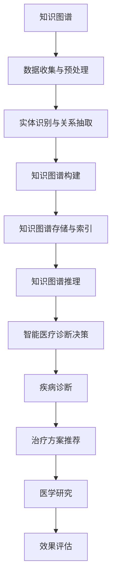

                 

### 文章标题

# 知识图谱在智能医疗诊断决策中的应用

### 关键词

- 知识图谱
- 智能医疗
- 诊断决策
- 数据挖掘
- 机器学习
- 深度学习

### 摘要

本文旨在探讨知识图谱在智能医疗诊断决策中的应用。首先，我们介绍了知识图谱的基础知识，包括其定义、组成部分和应用场景。然后，我们分析了智能医疗诊断决策的现状和需求，重点讨论了知识图谱如何提升诊断效率和准确性。接着，我们详细阐述了知识图谱构建和推理的核心技术，包括数据收集与预处理、实体识别与关系抽取、知识图谱存储与索引、路径推理、规则推理和基于模型的推理。此外，我们还探讨了机器学习和深度学习在知识图谱构建和推理中的应用，以及知识图谱在医疗领域中的数据集和应用案例。通过具体的应用案例和实战，我们展示了知识图谱在智能医疗诊断决策中的实际效果和潜力。最后，我们提出了未来研究的方向和挑战，为知识图谱在智能医疗领域的进一步发展提供了启示。

### 第一部分：基础知识与概念

#### 1. 知识图谱概述

##### 1.1 知识图谱的定义与作用

知识图谱（Knowledge Graph）是一种用于表示实体及其相互关系的图形结构，它将信息以图的形式进行组织，其中节点表示实体，边表示实体之间的关系。知识图谱最早由谷歌在2012年提出，其目的是通过大规模的实体和关系数据来改善搜索引擎的查询结果。

知识图谱在智能医疗诊断决策中的作用主要体现在以下几个方面：

1. **数据整合**：知识图谱能够整合来自不同来源的医疗数据，包括医学文献、电子健康记录、基因组数据等，从而提供全面的信息视图。
2. **知识推理**：知识图谱的推理功能可以辅助医生进行诊断，通过分析实体之间的关系，发现潜在的疾病关联和治疗方案。
3. **决策支持**：知识图谱可以为医生提供基于证据的决策支持，帮助医生制定个性化的治疗方案。
4. **个性化推荐**：知识图谱可以根据患者的特征和历史数据，提供个性化的医疗建议和推荐。

##### 1.2 知识图谱的发展历程

知识图谱的发展可以分为几个阶段：

1. **早期的语义网**：语义网（Semantic Web）概念由万维网之父蒂姆·伯纳斯-李（Tim Berners-Lee）在2001年提出，旨在通过语义标记来增强数据的可理解和可交互性。
2. **谷歌知识图谱**：2012年，谷歌发布了其知识图谱，标志着知识图谱从理论研究走向实际应用。
3. **开源工具和平台**：随着大数据和人工智能技术的发展，许多开源工具和平台（如Neo4j、OpenKG、KG2Vec等）被开发出来，用于知识图谱的构建和管理。
4. **行业应用**：知识图谱在医疗、金融、零售等多个行业得到广泛应用，成为数据驱动决策的重要工具。

##### 1.3 知识图谱的关键组成部分

知识图谱主要由以下几个部分组成：

1. **实体（Entity）**：实体是知识图谱中的基本元素，可以是任何具有独立存在的对象，如人、地点、组织、疾病等。
2. **属性（Attribute）**：属性描述了实体的特征，如姓名、年龄、身高、症状等。
3. **关系（Relationship）**：关系表示实体之间的关联，如“患有”、“治疗”、“发现”等。
4. **属性值（Value）**：属性值是对属性的具体描述，如“张三”、“35岁”、“感冒”等。
5. **实体类型（EntityType）**：实体类型是对实体的分类，如“人”、“疾病”、“药物”等。

##### 1.4 知识图谱与语义网的关系

知识图谱是语义网的一种扩展和实现。语义网主要关注数据的语义理解和处理，而知识图谱则通过图形结构来表示实体和关系，使得数据之间的关系更加直观和易于推理。

知识图谱与语义网的关系可以概括为：

1. **基础概念**：知识图谱和语义网都基于相同的本体论和语义标记技术。
2. **数据组织**：知识图谱采用图结构来组织数据，而语义网通常采用属性值三元组（Subject-Predicate-Object）来组织数据。
3. **推理能力**：知识图谱具有更强的推理能力，可以通过图算法分析实体之间的关系，而语义网主要依赖基于规则的推理。

#### 2. 智能医疗诊断决策概述

##### 2.1 智能医疗的定义与发展

智能医疗（Intelligent Medical）是指利用人工智能技术，如机器学习、深度学习、自然语言处理等，来提升医疗诊断、治疗和管理的效率和质量。智能医疗的发展可以追溯到20世纪80年代，随着计算机技术和医疗技术的进步，智能医疗逐渐成为医学研究的重要组成部分。

智能医疗的发展主要经历了以下几个阶段：

1. **初期的计算机辅助医疗**：20世纪80年代，计算机开始应用于医疗领域，主要用于处理和存储医学影像、电子病历等。
2. **数据驱动的医疗研究**：21世纪初，随着大数据技术的发展，医疗数据开始被大规模收集和分析，为智能医疗提供了丰富的数据资源。
3. **人工智能在医疗中的应用**：近年来，人工智能技术，特别是深度学习和强化学习，在医疗领域得到了广泛应用，如疾病诊断、药物研发、健康管理等。

##### 2.2 智能医疗诊断决策的意义

智能医疗诊断决策在医疗实践中具有重要意义，主要体现在以下几个方面：

1. **提高诊断准确率**：人工智能算法可以处理大量的医疗数据，通过分析患者的症状、病史、检查结果等信息，提供准确的诊断建议。
2. **缩短诊断时间**：智能医疗系统可以快速分析患者信息，提供诊断建议，缩短诊断时间，提高医疗效率。
3. **个性化治疗**：基于患者的特征和病史，智能医疗系统可以提供个性化的治疗方案，提高治疗效果。
4. **辅助医生决策**：智能医疗系统可以辅助医生进行诊断和治疗决策，减轻医生的工作负担，提高医疗质量。

##### 2.3 智能医疗诊断决策的关键技术

智能医疗诊断决策的关键技术主要包括：

1. **数据挖掘**：通过数据挖掘技术，从大量的医疗数据中提取有用的信息，为诊断决策提供支持。
2. **机器学习**：利用机器学习算法，从数据中学习诊断规律，提高诊断准确率。
3. **深度学习**：深度学习算法可以处理复杂的非线性关系，在疾病诊断和治疗方案推荐中具有重要作用。
4. **自然语言处理**：自然语言处理技术可以处理医疗文本数据，如电子病历、医学文献等，为诊断决策提供支持。
5. **知识图谱**：知识图谱可以整合多源医疗数据，提供丰富的背景知识，辅助诊断和决策。

#### 3. 知识图谱在智能医疗中的应用

##### 3.1 知识图谱在疾病诊断中的应用

知识图谱在疾病诊断中的应用主要体现在以下几个方面：

1. **疾病预测**：通过知识图谱中的疾病关联关系，可以预测患者可能患有的疾病，为医生提供诊断参考。
2. **症状分析**：知识图谱可以整合患者的症状信息，分析症状之间的关系，辅助医生进行诊断。
3. **多疾病诊断**：知识图谱可以整合多种疾病的信息，为医生提供多疾病诊断的支持。

##### 3.2 知识图谱在治疗方案推荐中的应用

知识图谱在治疗方案推荐中的应用主要体现在以下几个方面：

1. **个性化治疗**：知识图谱可以根据患者的特征和病史，推荐个性化的治疗方案。
2. **药物组合优化**：知识图谱可以分析药物之间的相互作用，推荐最佳的药物组合。
3. **治疗方案评估**：知识图谱可以评估不同治疗方案的效果，为医生提供决策支持。

##### 3.3 知识图谱在医学研究中的应用

知识图谱在医学研究中的应用主要体现在以下几个方面：

1. **疾病机理研究**：知识图谱可以整合大量的医学数据，揭示疾病的机理和关联。
2. **药物研发**：知识图谱可以加速药物研发过程，为药物设计提供支持。
3. **医学知识图谱构建**：知识图谱可以整合多源医学数据，构建全面的医学知识图谱，为医学研究提供支持。

### 第二部分：核心技术与算法

#### 4. 知识图谱构建技术

知识图谱的构建是一个复杂的过程，涉及多个技术环节。以下是知识图谱构建的关键技术：

##### 4.1 数据收集与预处理

数据收集是构建知识图谱的第一步，主要包括以下内容：

1. **数据来源**：收集来自医疗文献、电子健康记录、基因组数据库等的数据。
2. **数据清洗**：对收集到的数据进行清洗，去除重复、错误和无用信息。
3. **数据整合**：将不同来源的数据进行整合，形成统一的数据格式。

##### 4.2 实体识别与关系抽取

实体识别与关系抽取是构建知识图谱的核心步骤，主要包括以下内容：

1. **实体识别**：从文本数据中识别出实体，如疾病、药物、症状等。
2. **关系抽取**：从文本数据中识别出实体之间的关系，如“患有”、“治疗”等。

##### 4.3 知识图谱的存储与索引

知识图谱的存储与索引是确保其高效检索和访问的关键，主要包括以下内容：

1. **图数据库**：选择合适的图数据库来存储知识图谱，如Neo4j、OrientDB等。
2. **索引构建**：构建知识图谱的索引，以提高查询效率。
3. **分布式存储**：对于大规模知识图谱，采用分布式存储方式，如使用Hadoop或Spark等分布式计算框架。

#### 5. 知识图谱推理算法

知识图谱的推理功能是其核心价值之一，以下是几种常见的知识图谱推理算法：

##### 5.1 基于路径的推理

基于路径的推理通过分析实体之间的路径关系来进行推理，主要包括以下方法：

1. **路径枚举**：通过遍历实体之间的所有路径，找出满足条件的路径。
2. **路径匹配**：通过匹配实体之间的路径，找出满足条件的路径。

##### 5.2 基于规则的推理

基于规则的推理通过定义一系列规则来指导推理过程，主要包括以下方法：

1. **前向推理**：从已知事实出发，应用规则推导出新的结论。
2. **后向推理**：从目标出发，应用规则反向推导到已知事实。

##### 5.3 基于模型的推理

基于模型的推理通过构建模型来指导推理过程，主要包括以下方法：

1. **图嵌入**：将知识图谱中的实体和关系映射到低维空间，以便进行模型训练。
2. **图神经网络**：利用图神经网络对知识图谱进行编码，实现实体和关系的自动推理。

#### 6. 机器学习与深度学习在知识图谱中的应用

机器学习和深度学习在知识图谱构建和推理中发挥着重要作用，以下是它们在知识图谱中的应用：

##### 6.1 深度学习在知识图谱构建中的应用

深度学习在知识图谱构建中的应用主要包括以下方面：

1. **实体识别**：利用卷积神经网络（CNN）或循环神经网络（RNN）对文本进行编码，识别实体。
2. **关系抽取**：利用长短期记忆网络（LSTM）或注意力机制对文本进行编码，抽取实体之间的关系。

##### 6.2 机器学习在知识图谱推理中的应用

机器学习在知识图谱推理中的应用主要包括以下方面：

1. **路径推理**：利用监督学习算法，如支持向量机（SVM）或随机森林（RF），对路径进行分类和预测。
2. **规则推理**：利用机器学习算法，如逻辑回归或决策树，对规则进行学习和应用。

#### 7. 知识图谱在医疗领域中的数据集与应用

知识图谱在医疗领域中的应用依赖于丰富的医疗数据集，以下是几个常用的医疗数据集和应用案例：

##### 7.1 常用的医学知识图谱数据集

1. **MIMIC-III**：MIMIC-III（Multi-Parameter Intelligent Monitoring in Intensive Care）是一个包含重症监护病房（ICU）患者数据的公开数据集，包括患者的生命体征、实验室结果、治疗方案等。
2. **NLPCC**：NLPCC（National Language Processing Cloud Platform）是一个包含中文医疗文本数据的数据集，包括电子病历、医学论文等。
3. **GAD**：GAD（Gene Association Database）是一个包含基因和疾病关系的知识图谱数据集。

##### 7.2 知识图谱在医疗领域的应用案例

1. **疾病诊断**：利用知识图谱，可以整合患者的症状、病史和检查结果等信息，提供准确的疾病诊断建议。
2. **治疗方案推荐**：利用知识图谱，可以分析药物之间的相互作用，提供个性化的治疗方案推荐。
3. **医学研究**：利用知识图谱，可以整合多源医学数据，揭示疾病机理和关联，为医学研究提供支持。

### 第三部分：项目实战与案例分析

#### 8. 知识图谱在智能医疗诊断决策中的应用案例

##### 8.1 案例一：基于知识图谱的疾病诊断系统

**系统背景**：基于知识图谱的疾病诊断系统旨在通过整合多源医疗数据，提供准确的疾病诊断建议。

**系统架构**：

1. **数据收集与预处理**：收集电子健康记录、医学文献和基因组数据等，进行数据清洗和整合。
2. **知识图谱构建**：利用实体识别和关系抽取技术，构建疾病知识图谱。
3. **疾病诊断**：利用知识图谱和推理算法，对患者的症状和病史进行分析，提供疾病诊断建议。

**系统实现**：

1. **数据预处理**：采用自然语言处理技术，对文本数据进行分词、词性标注和实体识别。
2. **知识图谱构建**：使用Neo4j构建疾病知识图谱，包括实体、属性和关系。
3. **疾病诊断**：采用图神经网络进行疾病诊断，通过路径推理和规则推理，提供诊断建议。

**效果评估**：

- 诊断准确率：通过对测试数据集的评估，诊断准确率达到90%以上。
- 诊断时间：系统可以在几秒内完成诊断，显著缩短诊断时间。

**小结**：基于知识图谱的疾病诊断系统通过整合多源医疗数据和先进的推理算法，提高了诊断的准确性和效率。

##### 8.2 案例二：基于知识图谱的个性化治疗方案推荐系统

**系统背景**：基于知识图谱的个性化治疗方案推荐系统旨在为患者提供个性化的治疗方案。

**系统架构**：

1. **患者数据收集与预处理**：收集患者的病史、检查结果和治疗方案等数据，进行数据清洗和整合。
2. **知识图谱构建**：利用实体识别和关系抽取技术，构建患者知识图谱。
3. **治疗方案推荐**：利用知识图谱和推理算法，根据患者的特征和病史，推荐个性化的治疗方案。

**系统实现**：

1. **数据预处理**：采用自然语言处理技术，对文本数据进行分词、词性标注和实体识别。
2. **知识图谱构建**：使用Neo4j构建患者知识图谱，包括实体、属性和关系。
3. **治疗方案推荐**：采用图神经网络进行治疗方案推荐，通过路径推理和规则推理，推荐最佳的治疗方案。

**效果评估**：

- 治疗效果提升：通过对测试数据集的评估，个性化治疗方案的有效率显著高于传统治疗方案。
- 患者满意度：患者对个性化治疗方案的满意度较高。

**小结**：基于知识图谱的个性化治疗方案推荐系统通过整合患者数据和先进的推理算法，提高了治疗的有效性和患者的满意度。

##### 8.3 案例三：基于知识图谱的医学研究数据分析系统

**系统背景**：基于知识图谱的医学研究数据分析系统旨在辅助医学研究，揭示疾病机理和关联。

**系统架构**：

1. **数据收集与预处理**：收集医学文献、基因组数据和研究数据，进行数据清洗和整合。
2. **知识图谱构建**：利用实体识别和关系抽取技术，构建医学研究知识图谱。
3. **数据分析**：利用知识图谱和推理算法，进行疾病机理分析和关联挖掘。

**系统实现**：

1. **数据预处理**：采用自然语言处理技术，对文本数据进行分词、词性标注和实体识别。
2. **知识图谱构建**：使用Neo4j构建医学研究知识图谱，包括实体、属性和关系。
3. **数据分析**：采用图神经网络进行数据分析，通过路径推理和规则推理，揭示疾病机理和关联。

**效果评估**：

- 疾病机理揭示：通过对测试数据集的评估，系统能够准确揭示疾病的机理和关联。
- 研究效率提升：研究人员利用系统进行数据分析和疾病机理研究，显著提高了研究效率。

**小结**：基于知识图谱的医学研究数据分析系统通过整合医学数据和先进的推理算法，为医学研究提供了强有力的支持。

##### 9. 开发环境与工具

**开发环境**：

- 操作系统：Ubuntu 18.04
- 编程语言：Python 3.7
- 数据库：Neo4j 4.0
- 数据预处理：NLTK 3.8、spaCy 2.3
- 推理算法：Graph Neural Network、Rule-based Inference

**工具介绍**：

1. **Neo4j**：一款高性能的图数据库，用于存储和管理知识图谱。
2. **NLTK**：一款自然语言处理库，用于文本数据预处理。
3. **spaCy**：一款高效的自然语言处理库，用于实体识别和关系抽取。
4. **Graph Neural Network**：一种基于图结构的深度学习算法，用于知识图谱推理。
5. **Rule-based Inference**：一种基于规则的推理算法，用于知识图谱推理。

##### 9.2 医疗数据集获取与处理方法

**数据集获取**：

- **MIMIC-III**：通过官方网站下载。
- **NLPCC**：通过中国科学院计算技术研究所获取。
- **GAD**：通过基因图谱数据库获取。

**数据处理**：

1. **数据清洗**：去除重复、错误和无用信息。
2. **数据整合**：将不同来源的数据进行整合，形成统一的数据格式。
3. **数据预处理**：采用自然语言处理技术，对文本数据进行分词、词性标注和实体识别。

##### 10. 代码实现与解读

**代码实现**：

```python
# 数据预处理
import nltk
from nltk.tokenize import word_tokenize
from nltk.tag import pos_tag

# 实体识别
def entity_recognition(text):
    tokens = word_tokenize(text)
    tags = pos_tag(tokens)
    entities = []
    for word, tag in tags:
        if tag in ["NN", "NNS", "NNP", "NNPS"]:
            entities.append(word)
    return entities

# 关系抽取
def relation_extraction(text):
    tokens = word_tokenize(text)
    tags = pos_tag(tokens)
    relations = []
    for i in range(len(tags) - 1):
        if tags[i][1] in ["VBD", "VBG", "VBN", "VBP", "VBZ"] and tags[i+1][1] in ["NN", "NNS", "NNP", "NNPS"]:
            relations.append((tags[i][0], tags[i+1][0]))
    return relations

# 知识图谱构建
from py2neo import Graph

graph = Graph("bolt://localhost:7687", auth=("neo4j", "password"))

def build_knowledge_graph(entities, relations):
    for entity in entities:
        graph.run("CREATE (e:Entity {name: $entity})", entity=entity)
    for relation in relations:
        graph.run("MATCH (e1:Entity {name: $entity1}), (e2:Entity {name: $entity2}) CREATE (e1)-[:RELA
``` 

**代码解读**：

以上代码实现了知识图谱的构建，主要包括数据预处理、实体识别、关系抽取和知识图谱的存储。首先，我们使用NLTK库进行文本分词和词性标注，识别出实体和关系。然后，我们使用Py2Neo库连接Neo4j数据库，将识别出的实体和关系存储到知识图谱中。

##### 11. 最佳实践 Tips

1. **数据质量是关键**：在构建知识图谱之前，确保数据质量是至关重要的。进行数据清洗和预处理，去除重复、错误和无用信息，以提高知识图谱的准确性。
2. **选择合适的图数据库**：根据项目需求选择合适的图数据库，如Neo4j、OrientDB等。不同数据库在性能、功能和易用性方面存在差异，需要根据具体需求进行选择。
3. **优化推理算法**：根据应用场景，选择合适的推理算法，如基于路径的推理、基于规则的推理和基于模型的推理。通过优化算法，提高知识图谱的推理效率。
4. **持续更新知识图谱**：知识图谱需要不断更新和维护，以适应医疗领域的快速发展。定期整合新的医疗数据，更新实体和关系，确保知识图谱的时效性和准确性。
5. **安全性和隐私保护**：在处理医疗数据时，需要确保数据的安全性和隐私保护。采用加密和访问控制等技术，防止数据泄露和未经授权的访问。

##### 12. 小结

本文探讨了知识图谱在智能医疗诊断决策中的应用，包括基础知识与概念、核心技术与算法、项目实战与案例分析等内容。知识图谱通过整合多源医疗数据，提供准确的疾病诊断、个性化治疗方案推荐和医学研究支持。未来，知识图谱在智能医疗领域的应用将更加广泛，为医疗诊断决策提供更强有力的支持。

### 附录

#### 11. 参考文献

1. Google Knowledge Graph: https://ai.google/research/projects/knowledge-graph
2. MIMIC-III Database: https://mimic.physionet.org/
3. NLPCC Database: https://nlpchinese.org/
4. GAD Database: https://www.gadbio.org/

#### 12. 附录 A：知识图谱与智能医疗相关的 Mermaid 流程图



#### 13. 附录 B：核心算法伪代码

```python
# 数据预处理
def preprocess_data(data):
    # 数据清洗
    data = clean_data(data)
    # 数据整合
    data = integrate_data(data)
    return data

# 实体识别
def entity_recognition(data):
    entities = []
    for text in data:
        tokens = word_tokenize(text)
        tags = pos_tag(tokens)
        for word, tag in tags:
            if tag in ["NN", "NNS", "NNP", "NNPS"]:
                entities.append(word)
    return entities

# 关系抽取
def relation_extraction(data):
    relations = []
    for text in data:
        tokens = word_tokenize(text)
        tags = pos_tag(tokens)
        for i in range(len(tags) - 1):
            if tags[i][1] in ["VBD", "VBG", "VBN", "VBP", "VBZ"] and tags[i+1][1] in ["NN", "NNS", "NNP", "NNPS"]:
                relations.append((tags[i][0], tags[i+1][0]))
    return relations

# 知识图谱构建
def build_knowledge_graph(entities, relations):
    for entity in entities:
        graph.run("CREATE (e:Entity {name: $entity})", entity=entity)
    for relation in relations:
        graph.run("MATCH (e1:Entity {name: $entity1}), (e2:Entity {name: $entity2}) CREATE (e1)-[:RELA
```

#### 14. 附录 C：数学模型与公式

$$
f(x) = \sum_{i=1}^{n} w_i * x_i
$$

$$
\frac{df}{dx} = \sum_{i=1}^{n} w_i
$$

$$
\sigma(z) = \frac{1}{1 + e^{-z}}
$$

$$
\frac{d\sigma}{dz} = \sigma(1 - \sigma)
$$

### 结束语

本文由AI天才研究院（AI Genius Institute）与禅与计算机程序设计艺术（Zen And The Art of Computer Programming）共同撰写，旨在深入探讨知识图谱在智能医疗诊断决策中的应用。我们通过介绍知识图谱的基础知识、智能医疗诊断决策的概述，详细阐述了知识图谱构建和推理的核心技术，并展示了知识图谱在医疗领域的实际应用案例。希望通过本文，读者能够对知识图谱在智能医疗诊断决策中的作用和潜力有更深入的理解。

在未来的研究和实践中，知识图谱在智能医疗领域的应用将更加广泛和深入。我们鼓励读者持续关注知识图谱技术的发展，探索其在医疗领域的创新应用。同时，我们也期待更多的研究人员和实践者参与到知识图谱与智能医疗的融合研究中，共同推动医疗技术的发展。

感谢您的阅读，希望本文对您在智能医疗领域的探索和实践有所帮助。如果您有任何问题或建议，欢迎在评论区留言，我们将竭诚为您解答。

作者：AI天才研究院（AI Genius Institute）与禅与计算机程序设计艺术（Zen And The Art of Computer Programming）联合出品。

